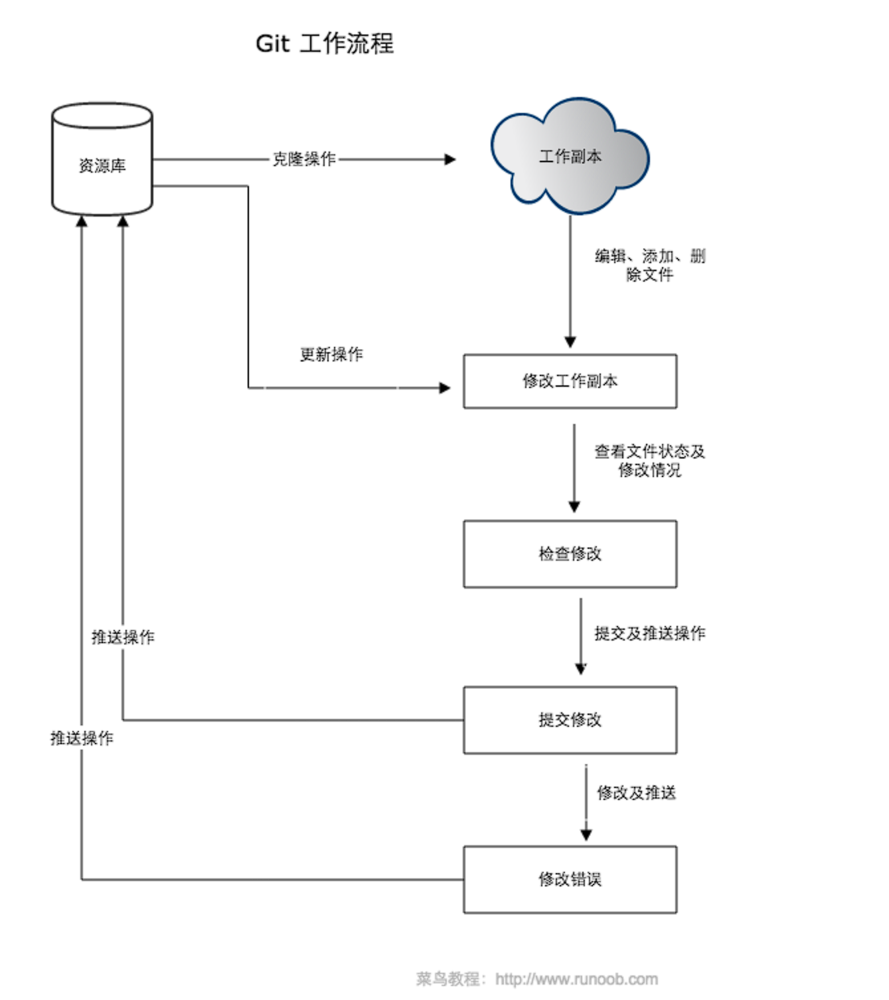
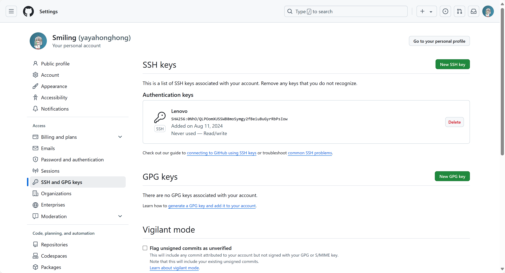
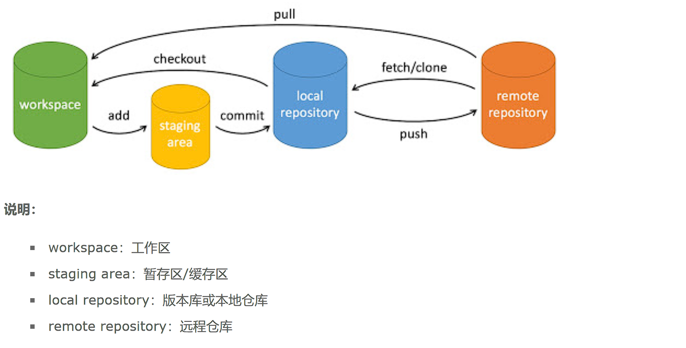
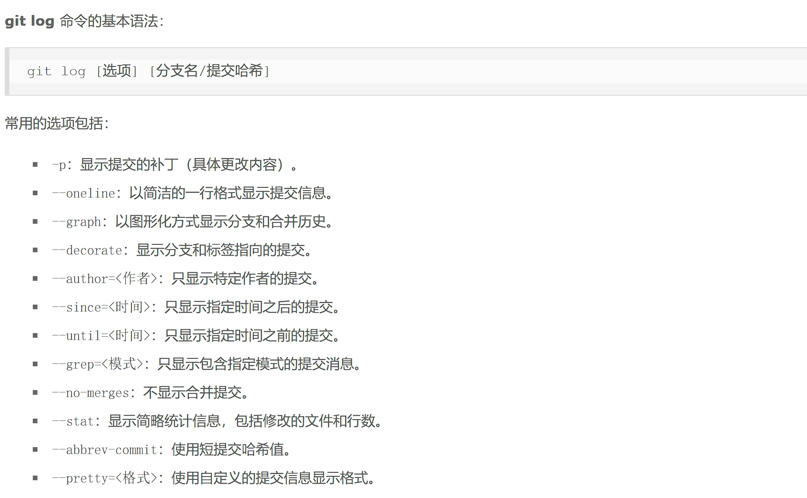

# Git

## git安装配置

> 各平台git下载地址： http://git-scm.com/downloads

git提供一个叫**git config**的工具专门用来配置工作环境变量

> 环境变量保存位置(Linux)：
> 
> ```bash
> /etc/gitconfig
> ~/.gitconfig
> ```
> 
> Windows下会保存在用户主目录下的 .gitconfig 文件中，即环境变量 $HOME 指定目录


配置个人的用户名和邮件地址：

```bash
git config --global user.name "{name}"
git config --global user.email {e-mail}
```




## 使用SSH加密传输

1. 生成SSH Key：

```bash
ssh-keygen -t rsa -C "<e-mail>"
```

2. 将SSH公钥设置到代码托管平台
- Linux会生成文件夹 ~/.ssh ，将该文件夹中的id_rsa.pub中的key复制下来并配置到代码托管平台

- Windows会在用户主目录（$HOME指向的目录）生成以上文件 



## 创建仓库（初始化）

1. 本地创建

使用当前目录作为仓库，只需要在该目录下执行命令：

```bash
git init
```

> 执行完成后会生成一个.git目录


使用指定目录作为仓库：

```bash
git init <directory>
```

2. 从现有git仓库获取

使用**git clone**命令从现有git仓库拷贝项目

```bash
git clone <repo-url> {<directory>}
```


## 相关指令



#### 基本命令

| 命令           | 说明                  |
| ------------ | ------------------- |
| git add      | 添加文件到暂存区            |
| git status   | 查看当前仓库的状态，显示有变更的文件  |
| git diff     | 比较文件的不同，即暂存区和工作区的差异 |
| git commit   | 提交暂存区到本地仓库          |
| git reset    | 回退版本                |
| git rm       | 从暂存区和工作区删除文件        |
| git mv       | 移动或重命名工作区文件         |
| git checkout | 切换分支                |
| git switch   | 更清晰地切换分支            |
| git restore  | 恢复或撤销文件的更改          |


#### 提交日志

| 命令               | 说明                 |
| ---------------- | ------------------ |
| git log          | 查看提交记录             |
| git blame <file> | 以列表形式查看指定文件的历史修改记录 |



#### 远程操作

| 命令         | 说明           |
| ---------- | ------------ |
| git remote | 远程仓库操作       |
| git fetch  | 从远程获取代码库     |
| git pull   | 下载远程代码并合并到本地 |
| git push   | 上传远程代码并合并    |

添加远程仓库：

```bash
git remote add <remote_name> <url>
```

查看远程仓库信息：

```bash
git remote {-v}
```

删除远程仓库：

```bash
git remote remove <remote_name>
```

设置默认生成仓库：

```bash
git push -u <remote_name> <local_branch>
```


### git标签

开发的某一重要阶段，给快照打上标签：

```bash
git tag -a v1.0
```

> -a 参数会记录标签的时间以及标签的创建者

可以为已经提交的快照追加标签：

```bash
git tag -a v0.9 <该快照的hash值>
```

查看所有标签：

```bash
git tag
```

指定标签信息：

```bash
git tag -a <tag_name> -m "<标签信息>"
```


## 分支管理

创建分支：

```bash
git branch <branch_name>
```

切换到指定分支：

```bash
git checkout|switch <branch_name>
```

显示所有分支：

```bash
git branch
```

删除分支：

```bash
git branch -d <branch_name>
```

合并分支：

```bash
git merge
```


