# JVM

---

## 基础篇

---

### 什么是JVM

JVM 全称是 Java Virtual Machine，中文译名 Java虚拟机。

JVM 本质上是一个运行在计算机上的程序，他的职责是运行Java字节码文件。


### JVM的功能

1. 解释和运行
   
   >  对字节码文件中的指令，实时的解释成机器码，让计算机执行

2. 内存管理
   
   > 自动为对象、方法等分配内存，自动的垃圾回收机制，回收不再使用的对象

3. 即时编译
   
   > 对热点代码进行优化，提升执行效率
   


### 常见的JVM


### 字节码文件详解

[使用 jclasslib工具查看字节码文件]( https://github.com/ingokegel/jclasslib)


### 字节码文件的组成

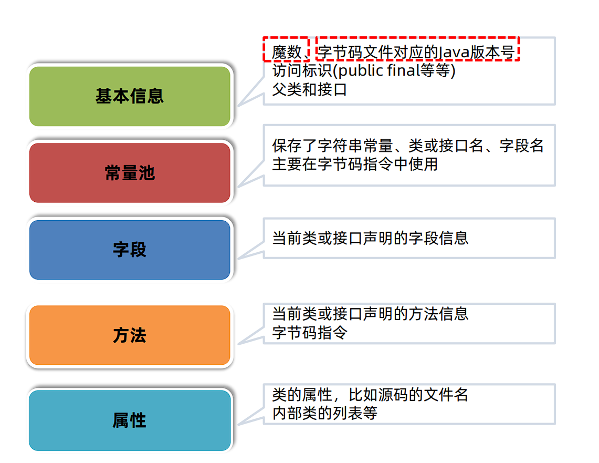

#### Magic魔数


#### 主副版本号


#### 主副版本号不兼容解决


---

### 类的生命周期

#### 加载

1. **类加载器**根据类的全限定名通过不同渠道以二进制流的方式获取字节码信息
   
   > 程序员可以使用Java代码拓展不同渠道


2. 类加载器加载完成后，Java虚拟机会将字节码中的信息保存到方法区中

3. 生成InstanceKlass对象（C++语言对象），保存类的所有信息，还包含实现特定功能比如多态的信息

4. 在堆区生成一份与方法区中数据类似的 java.lang.Class 对象，作用是在Java代码中去获取类的信息以及存储静态字段数据（JDK8之后）
   
   > 对于开发者来说，只需要访问堆区的Class对象而不需要访问方法区中的所有信息，这样Java虚拟机可以很好的控制开发者访问数据的范围


#### 连接

1. 验证阶段，检测Java字节码文件是否遵守Java虚拟机规范（文件格式、元信息等）

2. 准备阶段，为静态变量分配内存并设置**初始值**(注意是赋初值不是赋值)
   
   > final修饰的基本数据类型的静态变量，准备阶段会直接赋值


3. 解析阶段，将常量池中的符号引用替换为直接引用（内存地址）

#### 初始化

执行静态代码块，并为静态变量赋值，执行字节码文件中clinit部分的字节码指令


类的初始化时机：

- 访问一个类的静态变量或者静态方法，注意final修饰的变量并且等号右边是常量不会触发初始化

- 调用Class.forName(String className)方法

- new一个该类的对象时

- 执行main方法的当前类
  
  

clinit指令在特定情况下不会出现：

- 无静态代码块且无静态变量赋值语句

- 有静态变量的声明，但是没有赋值语句

- 静态变量的定义使用final关键字并且赋常量值，准备阶段直接赋值

注：**数组的创建不会导致数组中元素的类进行初始化**，**final修饰的变量如果赋值内容需要执行指令才能得出结果，会执行clinit方法进行初始化**


> 存在继承关系：
> 
> 直接访问父类的静态变量，不会触发子类的初始化
> 
> 子类的初始化clinit调用之前，会先调用父类的clinit初始化方法


#### 使用

#### 卸载


### 类加载器分类


#### 启动类加载器


#### 扩展类加载器


#### 应用程序类加载器


### JDK9之后的类加载器


### 双亲委派机制


    

### 打破双亲委派机制


---

### Java内存区域


#### 程序计数器

- 程序计数器（Program Counter Register）也叫PC寄存器，每个线程会通过程序计数器记录当前要执行的的字节码指令的地址。

- 在加载阶段，虚拟机将字节码文件中的指令读取到内存之后，会将原文件中的偏移量转换成内存地址。每一条字节码指令都会拥有一个内存地址。

- 在代码执行过程中，程序计数器会记录下一行字节码指令的地址。执行完当前指令之后，虚拟机的执行引擎根据程序计数器执行下一行指令。


#### 栈

##### Java虚拟机栈


- 局部变量表的作用是在方法执行过程中存放所有的局部变量。编译成字节码文件时就可以确定局部变量表的内容。
  
  > 起始PC和长度确定变量作用域
  
  > 局部变量表保存的内容有：实例方法的this对象，方法的参数，方法体中声明的局部变量。


- 操作数栈是栈帧中虚拟机在执行指令过程中用来存放中间数据的一块区域。他是一种栈式的数据结构，如果一条指令将一个值压入操作数栈，则后面的指令可以弹出并使用该值。
  
  > 在**编译期**就可以确定操作数栈的最大深度，从而在执行时正确的分配内存大小。

- 帧数据
  
  > 当前类的字节码指令引用了其他类的属性或者方法时，需要将符号引用（编号）转换成对应的运行时常量池中的内存地址。**动态链接**就保存了编号到运行时常量池的内存地址的映射关系
  
  

> **方法出口**指的是方法在正确或者异常结束时，当前栈帧会被弹出，同时程序计数器应该指向上一个栈帧中的下一条指令的地址。所以在当前栈帧中，需要存储此方法出口的地址。


> **异常表**存放的是代码中异常的处理信息，包含了异常捕获的生效范围以及异常发生后跳转到的字节码指令位置。


##### 本地方法栈


##### 虚拟机设置栈大小


#### 堆


#### 方法区


#### 直接内存（不属于Java运行时的内存区域）


### 自动垃圾回收


#### 方法区回收


#### 堆回收


##### 引用计数法


##### 可达性分析


#### 引用类型


##### 软引用


> 注意：软引用对象也需要被强引用，否则也会被回收


> 注：工具-->Caffeine缓存库


```java
public class Demo{
    public static void main(String[] args){
        ArrayList<SoftReference> softReferences = new ArrayList<>();
        ReferenceQueue<byte[]> queues = new ReferenceQueue<byte[]>();
        for(int i=0;i<10;i++){
            byte[] bytes = new byte[1024*1024*100];
            SoftReference stuRef = new SoftReference<byte[]>(bytes,queues);//构造函数传递数据及引用队列
            softReferences.add(stuRef);
        }

        softReference<byte[]> ref = null;
        int count = 0;
        while((ref = (SoftReference<byte[]>) queues.poll()) != null){
            count++;
        }
        System.out.println(count);
    }
}
```

> 设置启动参数 -Xmx200m
> 
> 输出 ：
> 
> 9


##### 弱引用


```java
import java.lang.ref.WeakReference;

public class WeakReferenceDemo {
    public static void main(String[] args) {
        byte[] bytes = new byte[1024 * 1024 * 100];
        WeakReference<byte[]> weakReference = new WeakReference<>(bytes);
        bytes = null;
        System.out.println(weakReference.get());
        System.gc();
        System.out.println(weakReference.get());
    }
}

```

> 输出：
> 
> [B@776ec8df
> null


##### 虚引用和终结器引用


#### 垃圾回收算法


##### 标记清除法


> 优点：实现简单，只需要在第一阶段给每个对象维护标志位，第二阶段删除对象即可
> 
> 缺点：
> 
> - 碎片化问题，对象删除后内存中会出现很多细小的可用内存单元，如果需要较大的空间，则这些碎片无法被分配
> 
> - 分配速度慢，由于内存碎片存在，需要进行遍历寻找可用空间


##### 复制算法


> 优点：
> 
> - 吞吐量高
> 
> - 不会发生碎片化
> 
> 缺点：内存使用效率低


##### 标记整理算法（标记压缩算法）


> 优点：
> 
> - 内存使用率高
> 
> - 不会发生碎片化
> 
> 缺点：整理阶段效率不高


##### 分代垃圾回收算法


#### 垃圾回收器


1. 组合一


2. 组合二


3. 组合三


4.G1垃圾回收器


1. 新创建的对象会存放在Eden区。当G1判断年轻代区不足（max默认60%），无法分配对象时需要回收时会执行Young GC。

2. 标记出Eden和Survivor区域中的存活对象，

3. 根据配置的最大暂停时间选择某些区域将存活对象复制到一个新的Survivor区中（年龄+1），清空这些区域。

4. 后续Young GC时与之前相同，只不过Survivor区中存活对象会被搬运到另一个Survivor区。

5. 当某个存活对象的年龄到达阈值（默认15），将被放入老年代。

6. 部分对象如果大小超过Region的一半，会直接放入老年代，这类老年代被称为Humongous区。比如堆内存是4G，每个Region是2M，只要一个大对象超过了1M就被放入Humongous区，如果对象过大会横跨多个Region。

7. 、多次回收之后，会出现很多Old老年代区，此时总堆占有率达到阈值时（-XX:InitiatingHeapOccupancyPercent默认45%）会触发混合回收MixedGC。回收所有年轻代和部分老年代的对象以及大对象区。采用复制算法来完成。
   
   

> G1在进行Young GC的过程中会去记录每次垃圾回收时每个Eden区和Survivor区的平均耗时，以作为下次回收时的参考依据。这样就可以根据配置的最大暂停时间计算出本次回收时最多能回收多少个Region区域了。比如 -XX:MaxGCPauseMillis=n（默认200），每个Region回收耗时40ms，那么这次回收最多只能回收4个Region。


G1对老年代的清理会选择存活度最低的区域来进行回收，这样可以保证回收效率最高，这也是G1（Garbage first）名称的由来。最后清理阶段使用复制算法，不会产生内存碎片。

> 注意：如果清理过程中发现没有足够的空Region存放转移的对象，会出现Full GC。单线程执行标记-整理算法，此时会导致用户线程的暂停。所以尽量保证应该用的堆内存有一定多余的空间。


#### 垃圾回收器选择


---


## 实战篇

---

### 内存调优

---

#### 内存泄露&&内存溢出

在Java中如果不再使用一个对象，但是该对象依然在GC ROOT引用链上，这个对象就不会被垃圾回收器回收，这种情况称为**内存泄漏**

> 绝大多数情况都是由**堆内存**泄露引起的

内存泄漏最终会导致**内存溢出**


#### 解决内存溢出


> 前两个步骤最核心


#### 发现问题


##### 案例

使用阿里arthas tunnel管理所有的需要监控的程序

背景：小李的团队已经普及了arthas的使用，但是由于使用了微服务架构，生产环境上的应用数量非常多，使用arthas还得登录到每一台服务器上再去操作非常不方便。他看到官方文档上可以使用tunnel来管理所有需要监控的程序。

步骤：

1. 在Spring Boot程序中添加arthas的依赖(支持Spring Boot2)，在配置文件中添加tunnel服务端的地址，便于tunnel去监控所有的程序。

2. .将tunnel服务端程序部署在某台服务器上并启动。

3. 启动java程序

4. 打开tunnel的服务端页面，查看所有的进程列表，并选择进程进行arthas的操作。
   
   
   
   


---

#### 产生内存溢出的原因

##### 1. 代码中的内存泄露

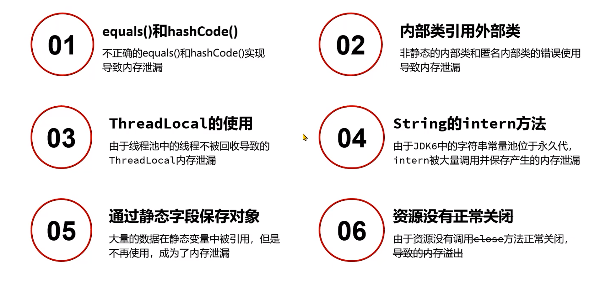


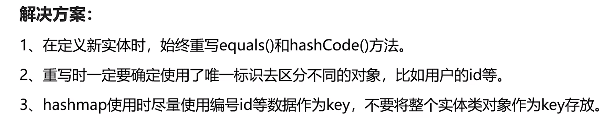


##### 2. 并发请求问题

> 并发请求问题指的是用户通过发送请求向Java应用获取数据，正常情况下Java应用将数据返回之后，这部分数据就可以在内存中被释放掉。
> 
> 但是由于用户的并发请求量有可能很大，同时处理数据的时间很长，导致大量的数据存在于内存中，最终超过了内存的上限，导致内存溢出。这类问题的处理思路和内存泄漏类似，首先要定位到对象产生的根源。


###### 模拟并发请求

- 使用[<u>**Apache JMeter - Apache JMeter™**</u>](https://jmeter.apache.org/)软件可以进行并发请求测试。

- Apache Jmeter是一款开源的测试软件，使用Java语言编写，最初是为了测试Web程序，目前已经发展成支持数据库、消息队列、邮件协议等不同类型内容的测试工具。

- Apache Jmeter支持插件扩展，生成多样化的测试结果。
  
  

步骤：

1. 安装Jmeter软件，添加线程组。

2. 在线程组中增加Http请求，添加随机参数。

3. 在线程组中添加监听器–聚合报告，用来展示最终结果。

4. 启动程序，运行线程组并观察程序是否出现内存溢出。
   
   

#### 诊断问题

##### 诊断 –内存快照

- 当堆内存溢出时，需要在堆内存溢出时将整个堆内存保存下来，生成内存快照(Heap Profile)文件。

- 生成内存快照的Java虚拟机参数：

```bash
-XX:+HeapDumpOnOutOfMemoryError    #发生OutOfMemoryError错误时，自动生成hprof内存快照文件。

-XX:HeapDumpPath=<path>    #指定hprof文件的输出路径。
```

- 使用[MAT](https://eclipse.dev/mat/)打开hprof文件，并选择内存泄漏检测功能，MAT会自行根据内存快照中保存的数据分析内存泄漏的根源。
  
  

**案例：**

小李的团队通过监控系统发现有一个服务内存在持续增长，希望尽快通过内存快照分析增长的原因，由于**并未产生内存溢出**所以不能通过HeapDumpOnOutOfMemoryError参数生成内存快照。

思路：

导出运行中系统的内存快照，比较简单的方式有两种，注意只需要导出标记为存活的对象：

1. 通过<u>**JDK**</u>自带的jmap命令导出，格式为：

```shell
jmap -dump:live,format=b,file=文件路径和文件名 进程ID
```

1. 通过<u>**arthas**</u>的heapdump命令导出，格式为：

```shell
heapdump --live 文件路径和文件名
```


**分析超大堆的内存快照**

- 在程序员开发用的机器内存范围之内的快照文件，直接使用MAT打开分析即可。但是经常会遇到服务器上的程序占用的内存达到10G以上，开发机无法正常打开此类内存快照，此时需要下载服务器操作系统对应的MAT。下载地址： https://eclipse.dev/mat/downloads.php

- 通过MAT中的脚本生成分析报告：

```shell
./ParseHeapDump.sh 快照文件路径 org.eclipse.mat.api:suspects
 org.eclipse.mat.api:overview org.eclipse.mat.api:top_components
```

> 注意：默认MAT分析时只使用了1G的堆内存，如果快照文件超过1G，需要修改MAT目录下的MemoryAnalyzer.ini配置文件调整最大堆内存。


#### 修复问题


##### 案例一：分页查询文章接口的内存溢出

**背景**：小李负责的新闻资讯类项目采用了微服务架构，其中有一个文章微服务，这个微服务在业务高峰期出现了内存溢出的现象。

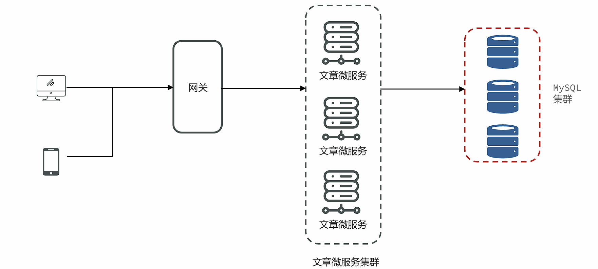

**解决思路**：

1. 服务出现OOM内存溢出时，生成内存快照。

2. 使用MAT分析内存快照，找到内存溢出的对象。

3. 尝试在开发环境中**重现问题**，分析代码中问题产生的原因。

4. 修改代码。

5. 测试并验证结果。
   
   

**问题根源**：文章微服务中的分页接口没有限制最大单次访问条数，并且单个文章对象占用的内存量较大，在业务高峰期并发量较大时这部分从数据库获取到内存之后会占用大量的内存空间。


**可行方案**：

- 与产品设计人员沟通，限制最大的单次访问条数。

- 分页接口如果只是为了展示文章列表，不需要获取文章内容，可以大大减少对象的大小。

- 在高峰期对微服务进行限流保护。
  
  

##### 案例二：Mybatis导致的内存溢出

**背景**：小李负责的文章微服务进行了升级，新增加了一个判断id是否存在的接口，第二天业务高峰期再次出现了内存溢出，小李觉得应该和新增加的接口有关系。


**解决思路**：

1. 服务出现OOM内存溢出时，生成内存快照。

2. 使用MAT分析内存快照，找到内存溢出的对象。

3. 尝试在开发环境中重现问题，分析代码中问题产生的原因。

4. 修改代码。

5. 测试并验证结果。
   
   

**问题根源**：Mybatis在使用foreach进行sql拼接时，会在内存中创建对象，如果foreach处理的数组或者集合元素个数过多，会占用大量的内存空间。


**可行方案**：

- 限制参数中最大的id个数。

- 将id缓存到redis或者内存缓存中，通过缓存进行校验。
  
  

##### 案例三：导出大文件内存溢出

**背景**：小李负责了一个管理系统，这个管理系统支持几十万条数据的excel文件导出。他发现系统在运行时如果有几十个人同时进行大数据量的导出，会出现内存溢出。

小李团队使用的是**k8s**将管理系统部署到了容器中，所以这一次我们使用阿里云的k8s环境还原场景，并解决问题。阿里云的k8s整体规划如下：


**问题根源**：Excel文件导出如果使用POI的XSSFWorkbook，在大数据量（几十万）的情况下会占用大量的内存。


**可行方案**:

- 使用poi的SXSSFWorkbook。

- `hutool`提供的BigExcelWriter减少内存开销。（服务器大内存推荐）

- 使用`easy excel`，对内存进行了大量的优化。（服务器小内存推荐，占用内存小，耗时长）
  
  

##### 案例四：ThreadLocal使用时占用大量内存

**背景**：小李负责了一个<u>微服务</u>，但是他发现系统在没有任何用户使用时，也占用了大量的内存。导致可以使用的内存大大减少。

**问题根源**：很多微服务会选择在拦截器`preHandle`方法中去解析请求头中的数据，并放入一些数据到`ThreadLocal`中方便后续使用。

**可行方案**：在拦截器的`afterCompletion`方法中，必须要将`ThreadLocal`中的数据清理掉。


##### 案例五：文章内容审核接口的内存问题

**背景**：文章微服务中提供了文章审核接口，会调用阿里云的内容安全接口进行文章中文字和图片的审核，在自测过程中出现内存占用较大的问题。


**可行方案**：

- 使用SpringBoot中的@Async注解进行**异步**的审核。

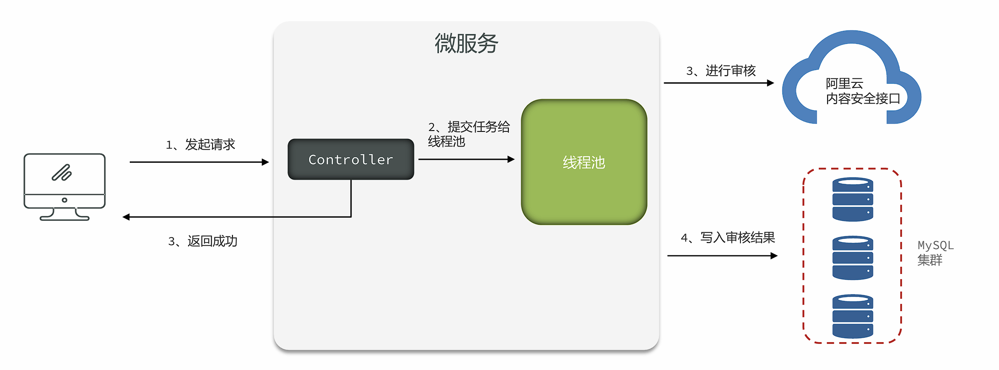

> 存在问题：
> 
> 1. 线程池参数设置不当，会导致大量线程的创建或者队列中保存大量的数据。
> 
> 2. 任务没有持久化，一旦走线程池的拒绝策略或者服务宕机、服务器掉电等情况很有可能会丢失任务。


- 使用生产者和消费者模式进行处理，队列数据可以实现持久化到数据库。


> 存在问题：
> 
> 1. 队列参数设置不正确，会保存大量的数据。
> 
> 2. 实现复杂，需要自行实现持久化的机制，否则数据会丢失。


- 使用`mq`消息队列进行处理，由`mq`来保存文章的数据。发送消息的服务和拉取消息的服务可以是同一个，也可以不是同一个。（推荐）

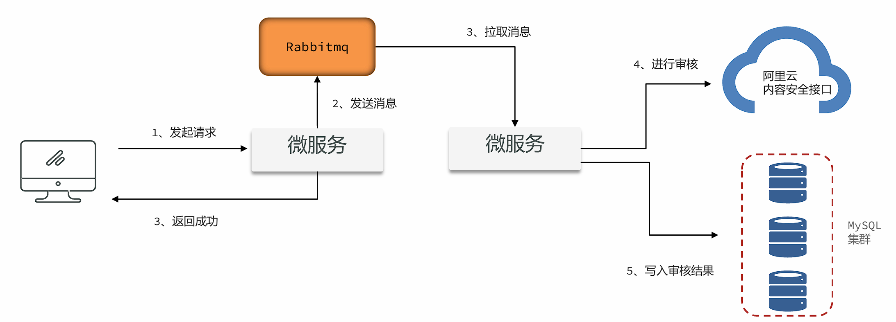


**问题根源**和**解决思路**：在项目中如果要使用异步进行业务处理，或者实现生产者 –消费者的模型，如果在Java代码中实现，会占用大量的内存去保存中间数据。尽量使用Mq消息队列，可以很好地将中间数据单独进行保存，不会占用Java的内存。同时也可以将生产者和消费者拆分成不同的微服务。


##### 两种方案的比较


##### 在线定位问题 – 步骤：

1. 使用`jmap-histo:live 进程ID > 文件名` 命令将内存中存活对象以直方图的形式保存到文件中，这个过程会影响用户的时间，但是时间比较短暂。

2. 分析内存占用最多的对象，一般这些对象就是造成内存泄漏的原因。

3. 使用arthas的`stack`命令,`stack 全限定类名 [方法名]`，追踪对象创建的方法被调用的调用路径，找到对象创建的根源。也可以使用btrace工具编写脚本追踪方法执行的过程。
   
   

> BTrace 是一个在Java 平台上执行的追踪工具，可以有效地用于线上运行系统的方法追踪，具有侵入性小、对性能的影响微乎其微等特点。项目中可以使用btrace工具，打印出方法被调用的栈信息。
> 
> 使用方法：
> 
> 1. 下载btrace工具， 官方地址：[github](https://github.com/btraceio/btrace/releases/latest)
> 
> 2. 编写btrace脚本，通常是一个java文件。
> 
> 3. 将btrace工具和脚本上传到服务器，在服务器上运行 btrace 进程ID 脚本文件名 。
> 
> 4. 观察执行结果。


---

### GC调优

GC调优指的是对垃圾回收（Garbage Collection）进行调优。GC调优的主要目标是避免由垃圾回收引起程序性能下降。


GC调优的核心分成三部分：

✓ 1、通用Jvm参数的设置。

✓ 2、特定垃圾回收器的Jvm参数的设置。

✓ 3、解决由频繁的FULLGC引起的程序性能问题。


> GC调优没有没有唯一的标准答案，如何调优与硬件、程序本身、使用情况均有关系，重点学习调优的工具和方法。


#### GC调优指标

所以判断GC是否需要调优，需要从三方面来考虑，与GC算法的评判标准类似：

1. **吞吐量**(Throughput) 吞吐量分为业务吞吐量和垃圾回收吞吐量业务吞吐量指的在一段时间内，程序需要完成的业务数量。
   
   

比如企业中对于吞吐量的要求可能会是这样的：

- 支持用户每天生成10000笔订单

- 在晚上8点到10点，支持用户查询50000条商品信息
  
  

保证高吞吐量的常规手段有两条：

- 优化业务执行性能，减少单次业务的执行时间

- 优化垃圾回收吞吐量
2. **延迟**指的是从用户发起一个请求到收到响应这其中经历的时间。
   比如企业中对于延迟的要求可能会是这样的：
   
   - 所有的请求必须在5秒内返回给用户
     结果延迟 = GC延迟+ 业务执行时间，所以如果GC时间过长，会影响到用户的使用。
     
     

3. **内存使用量**指的是Java应用占用系统内存的最大值，一般通过Jvm参数调整，在满足上述两个指标的前提下，这个值越小越好。
   
   

#### 调优方法

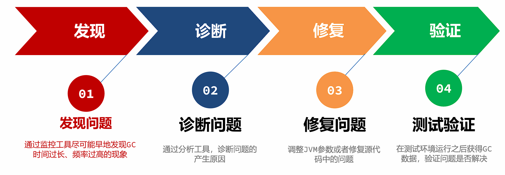

##### 发现问题–jstat工具

- **Jstat**工具是JDK自带的一款监控工具，可以提供各种垃圾回收、类加载、编译信息等不同的数据。

- 使用方法为：`jstat -gc 进程ID` 每次统计的间隔（毫秒）统计次数

> - C代表Capacity容量，U代表Used使用量
> 
> - S –幸存者区，E –伊甸园区，O –老年代，M –元空间
> 
> - YGC、YGT：年轻代GC次数和GC耗时（单位：秒）
> 
> - FGC、FGCT：Full GC次数和Full GC耗时
> 
> - GCT：GC总耗时

优点：

- 操作简单

- 无额外的软件安装

缺点：

- 无法精确到GC产生的时间，只能用于判断GC是否存在问题
  
  

##### 发现问题–visualvm插件

**VisualVm**中提供了一款**Visual GC**插件，实时监控Java进程的堆内存结构、堆内存变化趋势以及垃圾回收时间的变化趋势。同时还可以监控对象晋升的直方图。


优点：

- 适合开发使用，能直观的看到堆内存和GC的变化趋势

缺点：

- 对程序运行性能有一定影响

- 生产环境程序员一般没有权限进行操作
  
  

##### 发现问题–Prometheus + Grafana

- Prometheus+Grafana是企业中运维常用的监控方案，其中Prometheus用来采集系统或者应用的相关数据，同时具备告警功能。Grafana可以将Prometheus采集到的数据以可视化的方式进行展示。

- Java程序员要学会如何读懂Grafana展示的Java虚拟机相关的参数。
  
  

##### 发现问题– GC日志

- 通过GC日志，可以更好的看到垃圾回收细节上的数据，同时也可以根据每款垃圾回收器的不同特点更好地发现存在的问题。

- 使用方法（JDK 8及以下）：`-XX:+PrintGCDetails -Xloggc:文件名`

- 使用方法（JDK 9+）：`-Xlog:gc*:file=文件名`
  
  

##### 发现问题– GC Viewer

- GCViewer是一个将GC日志转换成可视化图表的小工具，地址： [github](https://github.com/chewiebug/GCViewer)

- 使用方法：`java -jar gcviewer_1.3.4.jar 日志文件.log`
  
  

##### 发现问题– GCeasy

- GCeasy是业界首款使用AI机器学习技术在线进行GC分析和诊断的工具。定位内存泄漏、GC延迟高的问题，提供JVM参数优化建议，支持在线的可视化工具图表展示。

- 官方网站：[GCeasy](https://gceasy.io/)
  
  

##### 发现问题– 常见的GC模式

- 正常情况--特点：呈现锯齿状，对象创建之后内存上升，一旦发生垃圾回收之后下降到底部，并且每次下降之后的内存大小接近，存留的对象较少。

- 缓存对象过多--特点：呈现锯齿状，对象创建之后内存上升，一旦发生垃圾回收之后下降到底部，并且每次下降之后的内存大小接近，处于**比较高的位置**。
  
  > 问题产生原因： 程序中保存了大量的缓存对象，导致GC之后无法释放，可以使用MAT或者HeapHero分析内存占用的原因。

- 内存泄漏--特点：呈现锯齿状，每次垃圾回收之后下降到的内存**位置越来越高**，最后由于垃圾回收无法释放空间导致对象无法分配产生OutOfMemory的错误。
  
  > 问题产生原因： 程序中保存了大量的内存泄漏对象，导致GC之后无法释放，可以使用MAT或者HeapHero进行分析是哪些对象产生了内存泄漏。

- 持续的FullGC--特点：在某个时间点产生多次Full GC，CPU使用率同时飙高，用户请求基本无法处理。一段时间之后恢复正常。
  
  > 问题产生原因： 在该时间范围请求量激增，程序开始生成更多对象，同时垃圾收集无法跟上对象创建速率，导致持续地在进行FULL GC。

- 元空间不足导致的FULLGC--特点：堆内存的大小并不是特别大，但是持续发生FULLGC。
  
  > 问题产生原因： 元空间大小不足，导致持续FULLGC回收元空间的数据。
  
  

#### 解决GC问题的手段

1. 优化基础JVM参数
   
   > 基础JVM参数的设置不当，会导致频繁FULLGC的产生
   
   

2. 减少对象产生
   
   > 大多数场景下的FULLGC是由于对象产生速度过快导致的，减少对象产生可以有效的缓解FULLGC的发生
   
   

3. 更换垃圾回收器
   
   > 选择适合当前业务场景的垃圾回收器，减少延迟、提高吞吐量
   
   

4. 优化垃圾回收器参数
   
   > 优化垃圾回收器的参数，能在一定程度上提升GC效率

            [JDK官方文档](https://docs.oracle.com/en/java/javase/index.html)


##### 解决问题 - 优化基础JVM参数

◼ 参数1 ：` -Xmx` 和 `–Xms`

`-Xmx`参数设置的是最大堆内存，但是由于程序是运行在服务器或者容器上，计算可用内存时，要将元空间、操作系统、其它软件占用的内存排除掉。

案例： 服务器内存4G，**操作系统+元空间最大值+其它软件** 占用1.5G，-Xmx可以设置为2g。

最合理的设置方式应该是根据最大并发量估算服务器的配置，然后再根据服务器配置计算最大堆内存的值。


`-Xms`用来设置初始堆大小，建议将`-Xms`设置的和`-Xmx`**一样大**，有以下几点好处：

✓ 运行时性能更好，堆的扩容是需要向操作系统申请内存的，这样会导致程序性能短期下降。

✓ 可用性问题，如果在扩容时其他程序正在使用大量内存，很容易因为操作系统内存不足分配失败。

✓ 启动速度更快，Oracle官方文档的原话：如果初始堆太小，Java 应用程序启动会变得很慢，因为 JVM 被迫频繁执行垃圾收集，直到堆增长到更合理的大小。为了获得最佳启动性能，请将初始堆大小设置为与最大堆大小相同。


◼ 参数2 ：` -XX:MaxMetaspaceSize` 和 `–XX:MetaspaceSize`

`-XX:MaxMetaspaceSize=值` 参数指的是最大元空间大小，默认值比较大，如果出现元空间内存泄漏会让操作系统可用内存不可控，建议根据测试情况设置最大值，一般设置为256m。

`-XX:MetaspaceSize=值` 参数指的是到达这个值之后会触发FULLGC[阈值]（网上很多文章的初始元空间大小是错误的），后续什么时候再触发JVM会自行计算。如果设置为和MaxMetaspaceSize一样大，就不会FULLGC，但是对象也无法回收。


◼ 参数3 ： `-Xss`虚拟机栈大小

如果我们不指定栈的大小，JVM 将创建一个具有默认大小的栈。大小取决于操作系统和计算机的体系结构。

比如Linux x86 64位 ： 1MB，如果不需要用到这么大的栈内存，完全可以将此值调小节省内存空间，合理值为256k – 1m之间。

使用：-Xss256k


◼ 参数4 ： **不建议手动设置**的参数

由于JVM底层设计极为复杂，一个参数的调整也许让某个接口得益，但同样有可能影响其他更多接口。

- `-Xmn` 年轻代的大小，默认值为整个堆的1/3，可以根据峰值流量计算最大的年轻代大小，尽量让对象只存放在年轻代，不进入老年代。
  但是实际的场景中，接口的响应时间、创建对象的大小、程序内部还会有一些定时任务等不确定因素都会导致这个值的大小并不能仅凭计算得出，如果设置该值要进行大量的测试。
  G1垃圾回收器尽量不要设置该值，G1会动态调整年轻代的大小。

- `‐XX:SurvivorRatio` 伊甸园区和幸存者区的大小比例，默认值为8。

- `‐XX:MaxTenuringThreshold` 最大晋升阈值，年龄大于此值之后，会进入老年代。另外JVM有动态年龄判断机制：将年龄从小到大的对象占据的空间加起来，如果大于survivor区域的50%，然后把等于或大于该年龄的对象，放入到老年代。
  
  

◼ 其他参数 ：

- `-XX:+DisableExplicitGC`禁止在代码中使用System.gc()， System.gc()可能会引起FULLGC，在代码中尽量不要使用。使用DisableExplicitGC参数可以禁止使用System.gc()方法调用。

- `-XX:+HeapDumpOnOutOfMemoryError`：发生OutOfMemoryError错误时，自动生成hprof内存快照文件。

- `-XX:HeapDumpPath=<path>`:：指定hprof文件的输出路径。

- 打印GC日志
  JDK8及之前 ： `-XX:+PrintGCDetails -XX:+PrintGCDateStamps -Xloggc:文件路径`
  JDK9及之后 ： `-Xlog:gc*:file=文件路径`
  
  

###### JVM参数模板

```bash
-Xms1g
-Xmx1g
-Xss256k
-XX:MaxMetaspaceSize=512m 
-XX:+DisableExplicitGC
-XX:+HeapDumpOnOutOfMemoryError
-XX:HeapDumpPath=/opt/logs/my-service.hprof
-XX:+PrintGCDetails
-XX:+PrintGCDateStamps
-Xloggc:文件路径
```

> 注意：JDK9及之后gc日志输出修改为 -Xlog:gc*:file=文件名
> 
> 堆内存大小和栈内存大小根据实际情况灵活调整。


### 性能调优

着重学习发现问题和诊断问题的方法，目标是准确定位到性能问题的根源。


应用程序在运行过程中经常会出现性能问题，比较常见的性能问题现象是：

1. 通过top命令查看CPU占用率高，接近100甚至多核CPU下超过100都是有可能的。

2. 请求单个服务处理时间特别长，多服务使用skywalking等监控系统来判断是哪一个环节性能低下。

3. 程序启动之后运行正常，但是在运行一段时间之后无法处理任何的请求（内存和GC正常）。
   
   

#### 线程转储的查看方式

线程转储（Thread Dump）提供了对所有运行中的线程当前状态的快照。线程转储可以通过jstack、visualvm等工具获取。其中包含了线程名、优先级、线程ID、线程状态、线程栈信息等等内容，可以用来解决**CPU占用率高、死锁**等问题。


线程转储（Thread Dump）中的几个核心内容：

- 名称： 线程名称，通过给线程设置合适的名称更容易“见名知意” 

- 优先级（prio）：线程的优先级

- Java ID（tid）：JVM中线程的唯一ID 

- 本地 ID (nid)：操作系统分配给线程的唯一ID 

- 状态：线程的状态，分为：
  
  - NEW – 新创建的线程，尚未开始执行
  
  - RUNNABLE –正在运行或准备执行
  
  - BLOCKED – 等待获取监视器锁以进入或重新进入同步块/方法
  
  - WAITING – 等待其他线程执行特定操作，没有时间限制
  
  - TIMED_WAITING – 等待其他线程在指定时间内执行特定操作
  
  - TERMINATED – 已完成执行

- 栈追踪： 显示整个方法的栈帧信息
  
  

线程转储的可视化在线分析平台：

1. https://jstack.review/ 

2. https://fastthread.io/
   
   

#### 案例1：CPU占用率高问题的解决方案

问题：监控人员通过prometheus的告警发现CPU占用率一直处于很高的情况，通过top命令看到是由于Java程序引起的，希望能快速定位到是哪一部分代码导致了性能问题。


1. 通过`top –c` 命令找到CPU占用率高的进程，获取它的进程ID。(Linux)

2. 使用`top -p 进程ID` 单独监控某个进程，按H(大写)可以查看到所有的线程以及线程对应的CPU使用率，找到CPU使用率特别高的线程（记住线程ID）。

3. 使用` jstack 进程ID` 命令可以查看到所有线程正在执行的栈信息。使用 `jstack进程ID > 文件名` 保存到文件中方便查看。

4. 找到nid与线程ID相同的栈信息，需要将之前记录下的十进制线程号转换成16进制。通过 `printf ‘%x\n’ 线程ID` 命令直接获得16进制下的线程ID。

5. 找到栈信息对应的源代码，并分析问题产生原因。

> 补充：
> 
> 在定位CPU占用率高的问题时，比较需要关注的是状态为RUNNABLE的线程。但实际上，有一些线程执行本地方法时并不会消耗CPU，而只是在等待。但 JVM 仍然会将它们标识成“RUNNABLE”状态。


#### 案例2：接口响应时间很长的问题

问题：在程序运行过程中，发现有几个接口的响应时间特别长，需要快速定位到是哪一个方法的代码执行过程中出现了性能问题。


> 已经确定是某个接口性能出现了问题，但是由于方法嵌套比较深，需要借助于`arthas`定位到具体的方法。


使用arthas的`trace`命令，可以展示出整个方法的调用路径以及每一个方法的执行耗时。

命令： `trace 类名 方法名`

- 添加 `--skipJDKMethod false` 参数可以输出JDK核心包中的方法及耗时。

- 添加 `'#cost > 毫秒值'` 参数，只会显示耗时超过该毫秒值的调用。

- 添加 `–n 数值` 参数，最多显示该数值条数的数据。

- 所有监控都结束之后，输入`stop`结束监控，重置arthas增强的对象。
  
  

在使用trace定位到性能较低的方法之后，使用`watch`命令监控该方法，可以获得更为详细的方法信息。

命令：` watch 类名 方法名 ‘{params, returnObj}’ ‘#cost>毫秒值' -x 2`

- `‘{params, returnObj}‘ `代表打印参数和返回值。

- `-x` 代表打印的结果中如果有嵌套（比如对象里有属性），最多只展开2层。允许设置的最大值为4。
  
  

#### 案例3：定位偏底层的性能问题

问题：有一个接口中使用了for循环向ArrayList中添加数据，但是最终发现执行时间比较长，需要定位是由于什么原因导致的性能低下。


思路：Arthas提供了**性能火焰图**的功能，可以非常直观地显示所有方法中哪些方法执行时间比较长。


Arthas的profile命令(Windows不支持)

使用arthas的profile命令，生成性能监控的火焰图。

命令1： `profiler star`t 开始监控方法执行性能

命令2： `profiler stop --format html` 以HTML的方式生成火焰图火焰图中一般找绿色部分Java中栈顶上比较平的部分，很可能就是性能的瓶颈。


偏底层的性能问题，特别是由于JDK中某些方法被大量调用导致的性能低下，可以使用火焰图非常直观的找到原因。

这个案例中是由于创建ArrayList时没有**手动指定容量**，导致使用默认的容量而在添加对象过程中发生了多次的扩容，扩容需要将原来数组中的元素复制到新的数组中，消耗了大量的时间。通过火焰图可以看到大量的调用，修复完之后节省了20% ~ 50%的时间。


#### 案例4：线程被耗尽问题

问题：程序在启动运行一段时间之后，就无法接受任何请求了。将程序重启之后继续运行，依然会出现相同的情况。


解决思路：

线程耗尽问题，一般是由于执行时间过长，分析方法分成两步：

- 检测是否有**死锁**产生，无法自动解除的死锁会将线程永远阻塞。

- 如果没有死锁，再使用案例1的打印线程栈的方法检测线程正在执行哪个方法，一般这些大量出现的方法就是慢方法。
  
  > 死锁：两个或以上的线程因为争夺资源而造成互相等待的现象。
  
  

线程死锁可以通过三种方法**定位问题**：

1. `jstack-l 进程ID > 文件名` 将线程栈保存到本地。在文件中*搜索*`deadlock`即可找到死锁位置。

2. 开发环境中使用visual vm或者Jconsole工具，都可以检测出死锁。使用线程快照生成工具就可以看到死锁的根源。生产环境的服务一般不会允许使用这两种工具连接。

3. 使用fastthread自动检测线程问题。 https://fastthread.io/ 
   
   > Fastthread和Gceasy类似，是一款在线的AI自动线程问题检测工具，可以提供线程分析报告。通过报告查看是否存在死锁问题。
   
   

#### JMH

问：你是如何判断一个方法需要耗时多少时间的？

答：我会在方法上打印开始时间和结束时间，他们的差值就是方法的执行耗时。手动通过postman或者jmeter发起一笔请求，在控制台上看输出的时间。

>  这样做是不准确的，第一测试时有些对象创建是**懒加载**的，所以会影响第一次的请求时间，第二因为虚拟机中**JIT即时编译器**会优化你的代码，所以你这个测试得出的时间并不一定是最终用户处理的时间。
> 
> *Java程序在运行过程中，JIT即时编译器会实时对代码进行性能优化，所以仅凭少量的测试是无法真实反应运行系统最终给用户提供的性能。*


OpenJDK中提供了一款叫`JMH`（Java Microbenchmark Harness）的工具，可以准确地对Java代码进行基准测试，量化方法的执行性能。官网地址： https://github.com/openjdk/jmh

JMH会首先执行预热过程，确保JIT对代码进行优化之后再进行真正的迭代测试，最后输出测试的结果。


JMH环境搭建：

- 创建基准测试项目，在CMD窗口中，使用以下命令创建JMH环境项目：

```shell
 mvn archetype:generate \
 -DinteractiveMode=false \
 -DarchetypeGroupId=org.openjdk.jmh \
 -DarchetypeArtifactId=jmh-java-benchmark-archetype \
 -DgroupId=org.sample \
 -DartifactId=test \
 -Dversion=1.
```

- 修改POM文件中的JDK版本号和JMH版本号，JMH最新版本号参考Github。

- 编写测试方法，几个需要注意的点：
  
  - 死代码问题（无用代码，JIT会跳过不执行）
  
  - 黑洞的用法（黑洞消费，避免死代码产生）

- 通过maven的verify命令，检测代码问题并打包成jar包。

- 通过`java -jar target/benchmarks.jar` 命令执行基准测试。

- 测试结果通过 https://jmh.morethan.io/ 生成可视化的结果。
  
  

案例 ：日期格式化方法性能测试

1. Date对象使用的SimpleDateFormatter是线程不安全的，所以每次需要重新创建对象或者将对象放入ThreadLocal中进行保存。其中每次重新创建对象性能比较差，将对象放入ThreadLocal之后性能相对还是比较好的。

2. LocalDateTime对象使用的DateTimeFormatter线程安全，并且性能较好，如果能将DateTimeFormatter对象保存下来，性能可以得到进一步的提升。
   
   
   
   

#### 综合案例

小李的项目中有一个获取用户信息的接口性能比较差，他希望能对这个接口在代码中进行彻底的优化，提升性能。

接口代码优化过程如下（首先需要使用arthas找到接口耗时长的原因）：

```java
    //初始代码
    public List<UserVO> user1(){
        //1.从数据库获取前端需要的详情数据
        List<UserDetails> userDetails = userService.getUserDetails();

        //2.获取缓存中的用户数据
        List<User> users = userService.getUsers();

        SimpleDateFormat simpleDateFormat = new SimpleDateFormat("yyyy-MM-dd HH:mm:ss");
        //3.遍历详情集合，从缓存中获取用户名，生成VO进行填充
        ArrayList<UserVO> userVOS = new ArrayList<>();
        for (UserDetails userDetail : userDetails) {
            UserVO userVO = new UserVO();
            //可以使用BeanUtils对象拷贝
            userVO.setId(userDetail.getId());
            userVO.setRegister(simpleDateFormat.format(userDetail.getRegister2()));
            //填充name
            for (User user : users) {
                if(user.getId().equals(userDetail.getId())){
                    userVO.setName(user.getName());
                }
            }
            //加入集合
            userVOS.add(userVO);
        }

        return userVOS;

    }


    //使用HasmMap存放用户名字
    public List<UserVO> user2(){
        //1.从数据库获取前端需要的详情数据
        List<UserDetails> userDetails = userService.getUserDetails();

        //2.获取缓存中的用户数据
        List<User> users = userService.getUsers();
        //将list转换成hashmap
        HashMap<Long, User> map = new HashMap<>();
        for (User user : users) {
            map.put(user.getId(),user);
        }

        SimpleDateFormat simpleDateFormat = new SimpleDateFormat("yyyy-MM-dd HH:mm:ss");
        //3.遍历详情集合，从缓存中获取用户名，生成VO进行填充
        ArrayList<UserVO> userVOS = new ArrayList<>();
        for (UserDetails userDetail : userDetails) {
            UserVO userVO = new UserVO();
            //可以使用BeanUtils对象拷贝
            userVO.setId(userDetail.getId());
            userVO.setRegister(simpleDateFormat.format(userDetail.getRegister2()));
            //填充name
            userVO.setName(map.get(userDetail.getId()).getName());
            //加入集合
            userVOS.add(userVO);
        }

        return userVOS;

    }


    //优化日期格式化
    public List<UserVO> user3(){
        //1.从数据库获取前端需要的详情数据
        List<UserDetails> userDetails = userService.getUserDetails();

        //2.获取缓存中的用户数据
        List<User> users = userService.getUsers();
        //将list转换成hashmap
        HashMap<Long, User> map = new HashMap<>();
        for (User user : users) {
            map.put(user.getId(),user);
        }

        //3.遍历详情集合，从缓存中获取用户名，生成VO进行填充
        ArrayList<UserVO> userVOS = new ArrayList<>();
        for (UserDetails userDetail : userDetails) {
            UserVO userVO = new UserVO();
            //可以使用BeanUtils对象拷贝
            userVO.setId(userDetail.getId());
            userVO.setRegister(userDetail.getRegister().format(formatter));
            //填充name
            userVO.setName(map.get(userDetail.getId()).getName());
            //加入集合
            userVOS.add(userVO);
        }

        return userVOS;

    }

    @GetMapping
    //使用stream流改写for循环
    public List<UserVO> user4(){
        //1.从数据库获取前端需要的详情数据
        List<UserDetails> userDetails = userService.getUserDetails();

        //2.获取缓存中的用户数据
        List<User> users = userService.getUsers();
        //将list转换成hashmap
        Map<Long, User> map = users.stream().collect(Collectors.toMap(User::getId, o -> o));

        //3.遍历详情集合，从缓存中获取用户名，生成VO进行填充
        return userDetails.stream().map(userDetail -> {
            UserVO userVO = new UserVO();
            //可以使用BeanUtils对象拷贝
            userVO.setId(userDetail.getId());
            userVO.setRegister(userDetail.getRegister().format(formatter));
            //填充name
            userVO.setName(map.get(userDetail.getId()).getName());
            return userVO;
        }).collect(Collectors.toList());

    }

    //使用并行流优化性能
    public List<UserVO> user5(){
        //1.从数据库获取前端需要的详情数据
        List<UserDetails> userDetails = userService.getUserDetails();

        //2.获取缓存中的用户数据
        List<User> users = userService.getUsers();
        //将list转换成hashmap
        Map<Long, User> map = users.parallelStream().collect(Collectors.toMap(User::getId, o -> o));

        //3.遍历详情集合，从缓存中获取用户名，生成VO进行填充
        return userDetails.parallelStream().map(userDetail -> {
            UserVO userVO = new UserVO();
            //可以使用BeanUtils对象拷贝
            userVO.setId(userDetail.getId());
            userVO.setRegister(userDetail.getRegister().format(formatter));
            //填充name
            userVO.setName(map.get(userDetail.getId()).getName());
            return userVO;
        }).collect(Collectors.toList());

    }
```


---

## 高级篇

### GraalVM

#### 简介

GraalVM是Oracle官方推出的一款**高性能JDK**，使用它享受比OpenJDK或者OracleJDK更好的性能。

GraalVM的官方网址： https://www.graalvm.org/  

> - 更低的CPU、内存使用率。
> 
> - 更快的启动速度，无需预热即可获得最好的性能。
> 
> - 更好的安全性、更小的可执行文件。
> 
> - 支持多种框架Spring Boot、Micronaut、Helidon 和 Quarkus。
> 
> - 多家云平台支持。
> 
> - 通过Truffle框架运行JS、Python、Ruby等其他语言。


#### Linux社区版GraalVM环境搭建

1. 使用`arch`命令查看Linux架构

2. 根据架构下载社区版的GraalVM： https://www.graalvm.org/downloads/ 

3. 安装GraalVM，安装方式与安装JDK相同。

4. 使用java -version和HelloWorld测试GraalVM。
   
   

#### GraalVM的两种运行模式

1. JIT（ Just-In-Time ）模式 ，即时编译模式

    JIT模式的处理方式与Oracle JDK类似，满足两个特点：

- Write Once,Run Anywhere -> 一次编写，到处运行。

- 预热之后，通过内置的Graal即时编译器优化热点代码，生成比Hotspot JIT更高性能的机器码。
2. AOT（Ahead-Of-Time）模式 ，提前**编译**模式

    AOT 编译器通过源代码，为特定平台创建可执行文件。比如，在Windows下编译完成之后，会生成exe文件。通过这种方式，达到启动之后获得最高性能的目的。但是不具备跨平台特性，不同平台使用需要单独编译。这种模式生成的文件称之为Native Image本地镜像。


##### 使用GraalVM AOT模式制作本地镜像并运行

1. 安装Linux环境本地镜像制作需要的依赖库：
   https://www.graalvm.org/latest/reference-manual/nativeimage/#prerequisites 

2. 使用`native-image 类名` 制作本地镜像。（需要先将类源文件编译成class文件）

3. 运行本地镜像可执行文件。
   
   

#### GraalVM存在的问题

GraalVM的AOT模式虽然在启动速度、内存和CPU开销上非常有优势，但是使用这种技术会带来几个问题：

1. 跨平台问题，在不同平台下运行需要编译多次。编译平台的依赖库等环境要与运行平台保持一致。

2. 使用框架之后，编译本地镜像的时间比较长，同时也需要消耗大量的CPU和内存。

3. AOT 编译器在编译时，需要知道运行时所有可访问的所有类。但是Java中有一些技术可以在运行时创建类，例如反射、动态代理等。这些技术在很多框架比如Spring中大量使用，所以框架需要对AOT编译器进行适配解决类似的问题。
   
   

**解决方案**：

1. 使用公有云的Docker等容器化平台进行在线编译，确保编译环境和运行环境是一致的，同时解决了编译资源问题。

2. 使用SpringBoot3等整合了GraalVM AOT模式的框架版本。
   
   

**案例**：使用SpringBoot3搭建GraalVM环境

> SpringBoot3对GraalVM进行了完整的适配，所以编写GraalVM服务推荐使用SpringBoot3。


步骤：

1. 使用 https://start.spring.io/ spring提供的在线生成器构建项目。
   
   > 添加依赖 `GraalVM Native Support`

2. 编写业务代码。spring提供的在线生成器构建项目。

3. 执行`mvn-Pnative clean native:compile` 命令生成本地镜像。

4. 运行本地镜像                                                                                                                                                                                                                                                 
   
   

#### 什么场景下需要使用GraalVM

1. 对性能要求比较高的场景，可以选择使用收费的企业版提升性能。

2. 公有云的部分服务是按照CPU和内存使用量进行计费的，使用GraalVM可以有效地降低费用。
   
   

##### GraalVM企业级应用-Serverless架构

传统的系统架构中，服务器等基础设施的运维、安全、高可用等工作都需要企业自行完成，存在两个主要问题：

1. 开销大，包括了人力的开销、机房建设的开销。

2. 资源浪费，面对一些突发的流量冲击，比如秒杀等活动，必须提前规划好容量准备好大量的服务器，这些服务器在其他时候会处于闲置的状态，造成大量的浪费。
- 随着虚拟化技术、云原生技术的愈发成熟，云服务商提供了一套称为Serverless无服务器化的架构。企业无需进行服务器的任何配置和部署，完全由云服务商提供。比较典型的有亚马逊AWS、阿里云等。

- Serverless架构中第一种常见的服务是**函数计算**（Function as a Service），将**一个应用拆分成多个函数**，每个函数会以事件驱动的方式触发。典型代表有AWS的Lambda、阿里云的FC。
  
  
  
  

函数计算的服务资源比较受限，比如AWS的Lambda服务一般无法支持超过15分钟的函数执行，所以云服务商提供了另外一套方案：**基于容器的Serverless应用**，无需手动配置K8s中的Pod、Service等内容，只需选择镜像就可自动生成应用服务。


同样，Serverless应用的计费标准中包含CPU和内存使用量，所以使用GraalVM AOT模式编译出来的本地镜像可以节省更多的成本。


#### GraalVM的内存参数

由于GraalVM是一款独立的JDK，所以大部分HotSpot中的虚拟机参数都不适用。

常用的参数参考：[官方手册]([GraalVM](https://www.graalvm.org/22.3/reference-manual/native-image/optimizations-and-performance/MemoryManagement/))。

- 社区版只能使用串行垃圾回收器（Serial GC），使用串行垃圾回收器的默认最大 Java 堆大小会设置为物理内存大小的 80%，调整方式为使用`-Xmx 最大堆大小`。如果希望在**编译期**就指定该大小，可以在编译时添加参数`-R:MaxHeapSize=最大堆大小`。

- G1垃圾回收器只能在企业版中使用，开启方式为添加`--gc=G1`参数，有效降低垃圾回收的延迟。

- 另外提供一个Epsilon GC，开启方式：`--gc=epsilon` ，它不会产生任何的垃圾回收行为所以没有额外的内存、CPU开销。如果在公有云上运行的程序生命周期短暂不产生大量的对象，可以使用该垃圾回收器，以节省最大的资源。

- `-XX:+PrintGC -XX:+VerboseGC` 参数打印垃圾回收详细信息。
  
  

#### GraalVM内存快照文件的获取(AOT模式)

步骤：

1. **编译程序时**，添加`--enable-monitoring=heapdump`参数添加到pom文件的对应插件(`native-maven-plugin`)中。

2. **运行中**使用`kill -SIGUSR1 进程ID` 命令，创建内存快照文件。

3. 使用MAT分析内存快照文件。
   
   

#### 运行时数据的获取

**JDK Flight Recorder** (JFR)是一个内置于 JVM 中的工具，可以收集正在运行中的 Java 应用程序的诊断和分析数据，比如线程、异常等内容。GraalVM本地镜像也支持使用JFR生成运行时数据，导出的数据可以使用VisualVM分析。


步骤：

1. 编译程序时，添加`--enable-monitoring=jfr`参数添加到pom文件的对应插件中。

2. 运行程序，添加`-XX:StartFlightRecording=filename=recording.jfr,duration=10s`参数。

3. 使用VisualVM分析JFR记录文件。
   
   
   
   

### 新一代GC

##### 垃圾回收器的技术演进


##### Shenandoah GC

Shenandoah 是由**Red Hat**开发的一款低延迟的垃圾收集器，Shenandoah 并发执行大部分 GC 工作，包括并发的整理，堆大小对STW的时间基本没有影响。


Shenandoah的**使用方法**

1. **下载** Shenandoah只包含在OpenJDK中，默认不包含在内需要单独构建，可以直接下载构建好的。下载地址： https://builds.shipilev.net/openjdk-jdk-shenandoah/

> 选择方式如下：
> 
> `{aarch64, arm32-hflt, mipsel, mips64el, ppc64le, s390x, x86_32, x86_64}`：架构，使用arch命令选择对应的的架构。
> 
> `{server,zero}`：虚拟机类型，选择server，包含所有GC的功能。
> 
> `{release, fastdebug, Slowdebug, optimization}`：不同的优化级别，选择release，性能最高。
> 
> `{gcc*-glibc*, msvc*}`：编译器的版本，选择较高的版本性能好一些，如果兼容性有问题（无法启动），选择较低的版本。


2. **配置** 将OpenJDK配置到环境变量中，使用`java –version`进行测试。打印出如下内容代表成功。

3. **添加参数**，运行Java程序。
   `-XX:+UseShenandoahGC `开启Shenandoah GC
   `-Xlog:gc` 打印GC日志
   
   

##### ZGC

ZGC 是一种可扩展的低延迟垃圾回收器。ZGC 在垃圾回收过程中，STW的时间不会超过一毫秒，适合需要低延迟的应用。支持几百兆到16TB 的堆大小，堆大小对STW的时间基本没有影响。 

ZGC降低了停顿时间，能降低接口的最大耗时，提升用户体验。但是吞吐量不佳，所以如果Java服务比较关注QPS（每秒的查询次数）那么G1是比较不错的选择。


**ZGC的使用方法**:

OracleJDK和OpenJDK中都支持ZGC，阿里的DragonWell龙井JDK也支持ZGC但属于其自行对OpenJDK 11的ZGC进行优化的版本。

> 建议使用JDK17之后的版本，延迟较低同时无需手动配置并行线程数。

- 分代 ZGC添加如下参数启用 `-XX:+UseZGC -XX:+ZGenerational` 

- 非分代 ZGC通过命令行选项启用 `-XX:+UseZGC`
  
  

**ZGC的参数设置**:

ZGC在设计上做到了自适应，根据运行情况自动调整参数，让用户手动配置的参数最少化。

- 自动设置年轻代大小，无需设置-Xmn参数。

- 自动晋升阈值（复制中存活多少次才搬运到老年代），无需设置`-XX:TenuringThreshold`。

- JDK17之后支持自动的并行线程数，无需设置`-XX:ConcGCThreads`。
1. 需要设置的参数：

`-Xmx 值` 最大堆内存大小

> 这是ZGC最重要的一个参数，必须设置。ZGC在运行过程中会使用一部分内存用来处理垃圾回收，所以尽量保证堆中有足够的空间。设置多少值取决于对象分配的速度，根据测试情况来决定。

2. 可以设置的参数：

`-XX:SoftMaxHeapSize=值`

> ZGC会尽量保证堆内存小于该值，这样在内存靠近这个值时会尽早地进行垃圾回收，但是依然有可能会超过该值。例如，-Xmx5g -XX:SoftMaxHeapSize=4g 这个参数设置，ZGC会尽量保证堆内存小于4GB，最多不会超过5GB。


**ZGC的调优**

ZGC 中可以使用Linux的**Huge Page大页技术**优化性能，提升吞吐量、降低延迟。

> 注意：安装过程需要 root 权限，所以ZGC默认没有开启此功能。

操作步骤：

1. 计算所需页数，Linux x86架构中大页大小为2MB，根据所需堆内存的大小估算大页数量。比如堆空间需要16G，预留2G（JVM需要额外的一些非堆空间），那么页数就是18G / 2MB = 9216。

2. 配置系统的大页池以具有所需的页数（需要root权限）：`$ echo 9216 > /sys/kernel/mm/hugepages/hugepages-2048kB/nr_hugepages`

3. 添加参数`-XX:+UseLargePages` 启动程序进行测试
   
   

#### 总结

ZGC和Shenandoah设计的目标都是追求较短的停顿时间，他们具体的使用场景如下：

两种垃圾回收器在并行回收时都会使用垃圾回收线程占用CPU资源

① 在内存足够的情况下，ZGC垃圾回收表现的效果会更好，停顿时间更短。

② 在内存不是特别充足的情况下，Shenandoah GC表现更好，并行垃圾回收的时间较短，用户请求的执行效率比较高。


### 揭秘Java工具

Java工具的介绍在Java的世界中，除了Java编写的业务系统之外，还有一类程序也需要Java程序员参与编写，这类程序就是Java工具。

常见的Java工具有以下几类：

1. 诊断类工具，如Arthas、VisualVM等。

2. 开发类工具，如Idea、Eclipse。

3. APM应用性能监测工具，如Skywalking、Zipkin等。

4. 热部署工具，如Jrebel等。
   
   

#### Java Agent技术

Java Agent技术是JDK提供的用来编写Java工具的技术，使用这种技术生成一种特殊的jar包，这种jar包可以让Java程序运行其中的代码。


##### 两种模式

Java Agent技术实现了让Java程序执行独立的Java Agent程序中的代码，执行方式有两种：

- 静态加载模式

- 动态加载模式
  
  

##### 静态加载模式

静态加载模式可以在程序启动的一开始就执行我们需要执行的代码，适合用APM等性能监测系统从一开始就监控程序的执行性能。静态加载模式需要在Java Agent的项目中编写一个premain的方法，并打包成jar包。

```java
public static viod premain(String agentArgs, Instrumentation inst)
```

接下来使用以下命令启动Java程序，此时Java虚拟机将会加载agent中的代码并执行。

```shell
java -javaagent:./agent.jar -jar test.jar
```

> permain方法会在主线程中执行


##### 动态加载模式

动态加载模式可以随时让java agent代码执行，适用于Arthas等诊断系统。动态加载模式需要在Java Agent的项目中编写一个agentmain的方法，并打包成jar包。

```java
public static viod agentmain(String agentArgs, Instrumentation inst)
```

接下来使用以下代码就可以让java agent代码在指定的java进程中执行了:

```java
VirtualMachine vm = VirtualMachine.attach("24200");//动态连接到24200进程ID的java程序
vm.loadAgent("test.jar");//加载java agent
```

> agentmain方法会在独立的线程中执行


##### 环境搭建

- 静态加载

步骤：

1. 创建maven项目，添加`maven-assembly-plugin`插件，此插件可以打包出java agent的jar包。

2. 编写类和premain方法，premain方法中打印一行信息。

3. 编写`MANIFEST.MF`文件，此文件主要用于描述java agent的配置属性，比如使用哪一个类的premain方法。

4. 使用maven-assembly-plugin进行打包。

5. 创建spring boot应用，并静态加载上一步打包完的java agent。
- 动态加载

步骤：

1. 创建maven项目，添加maven-assembly-plugin插件，此插件可以打包出java agent的jar包。

2. 编写类和agentmain方法， agentmain方法中打印一行信息。

3. 编写MANIFEST.MF文件，此文件主要用于描述java agent的配置属性，比如使用哪一个类的agentmain方法。

4. 使用maven-assembly-plugin进行打包。

5. 编写main方法，动态连接到运行中的java程序。
   
   

#### 案例1：简化版Arthas

编写一个简化版的Arthas程序，具备以下几个功能：

1. 查看内存使用情况

2. 生成堆内存快照

3. 打印栈信息

4. 打印类加载器

5. 打印类的源码

6. 打印方法执行的参数和耗时
   
   

##### 获取运行时信息- JMX技术

JDK从1.5开始提供了Java Management Extensions (JMX) 技术，通过Mbean对象的写入和获取，实现：

- 运行时配置的获取和更改

- 应用程序运行信息的获取（线程栈、内存、类信息等）

获取JVM默认提供的Mbean可以通过如下的方式，例如获取内存信息：

```java
List<MemoryPoolMXBean> mxBeanList = ManagementFactory.getMemoryPoolMXBeans();

mxBeanList.stream().filter(bean -> bean.getType().equals(MemoryType.HEAP))
                .forEach(
                        x -> {
                            StringBuilder sb = new StringBuilder();
                            sb.append("\tname:")
                                    .append(x.getName())
                                    .append("\n")
                                    .append("\tused:\t\t")
                                    .append(x.getUsage().getUsed() / 1024 / 1024)
                                    .append("m\n")
                                    .append("\tcommitted:\t")
                                    .append(x.getUsage().getCommitted() / 1024 / 1024)
                                    .append("m\n")
                                    .append("\tmax:\t\t")
                                    .append(x.getUsage().getMax() / 1024 / 1024)
                                    .append("m\n")
                                    .append("================================================");
                            System.out.println(sb);
                        }
                );
```


生成内存快照

```java
// 生成内存快照
    public static void heapDump(){
        SimpleDateFormat dateFormat = new SimpleDateFormat("yyyy-MM-dd-HH-mm");
        HotSpotDiagnosticMXBean bean = ManagementFactory.getPlatformMXBean(HotSpotDiagnosticMXBean.class);

        try {
            System.out.println("开始生成内存快照...");
            bean.dumpHeap(dateFormat.format(new Date())+ ".hprof", true);
        } catch (IOException e) {
            throw new RuntimeException(e);
        }
    }
```


获取线程信息

```java
// 获取线程运行信息
    public static void printThreadInfo() {
        ThreadMXBean threadMXBean = ManagementFactory.getThreadMXBean();

        ThreadInfo[] threadInfos = threadMXBean.dumpAllThreads(
                threadMXBean.isObjectMonitorUsageSupported(), threadMXBean.isSynchronizerUsageSupported());

        for (ThreadInfo threadInfo : threadInfos) {
            StringBuilder sb = new StringBuilder();
            sb.append("name:")
                    .append(threadInfo.getThreadName())
                    .append("\nthreadID:")
                    .append(threadInfo.getThreadId())
                    .append("\nthreadState:")
                    .append(threadInfo.getThreadState());
            System.out.println(sb);

            StackTraceElement[] stackTraceElements = threadInfo.getStackTrace();
            for (StackTraceElement stackTraceElement : stackTraceElements) {
                System.out.println("\t" + stackTraceElement.toString());
            }
            System.out.println();
        }
    }
```

获取类和类加载器的信息–Instumentation对象

Java Agent中可以获得Java虚拟机提供的Instumentation对象：

```java
    public static void premain(String agentArgs, Instrumentation inst) {}
    public static void agentmain(String agentArgs, Instrumentation inst) {}
```

该对象有以下几个作用：

- redefine，重新设置类的字节码信息。

- retransform，根据现有类的字节码信息进行增强。3、获取所有已加载的类信息。

Oracle官方手册： https://docs.oracle.com/javase/17/docs/api/java/lang/instrument/Instrumentation.html


```java
public static void printAllClassLoader(Instrumentation inst) {
        // 创建一个集合，用于存储所有加载的类加载器
        Set<ClassLoader> classLoaders = new HashSet<>();

        // 获取所有已加载的类
        Class[] classes = inst.getAllLoadedClasses();
        // 遍历每个类
        for (Class clazz : classes) {
            // 获取类的类加载器
            ClassLoader classLoader = clazz.getClassLoader();
            // 如果类加载器不为空，则加入集合
            if (classLoader != null) {
                classLoaders.add(classLoader);
            }
        }

        // 将类加载器的名称进行处理
        String str = classLoaders.stream().map(x -> {
                    // 如果类加载器为空，返回字符串 "BootstrapClassLoader"
                    if (x == null) {
                        return "BootstrapClassLoader";
                    } else {
                        // 否则返回类加载器的名称
                        return x.getName();
                    }
                }).filter(Objects::nonNull)
                // 去重并排序
                .distinct().sorted(String::compareTo)
                // 收集结果并以换行符连接
                .collect(Collectors.joining("\n"));

        // 输出所有类加载器的名称
        System.out.println(str);
    }
```


打印类的源码打印类的源码需要分为以下几个步骤

1. 获得内存中的类的字节码信息。利用Instrumentation提供的转换器来获取字节码信息。

2. 通过反编译工具(jd-core)将字节码信息还原成源代码信息。
   
   
   
   

打印方法执行的参数和耗时- **ASM**

ASM是一个通用的 Java **字节码**操作和分析框架。它可用于直接以二进制形式修改现有类或动态生成类。ASM重点关注性能。让操作尽可能小且尽可能快，所以它非常适合在动态系统中使用。ASM的缺点是代码复杂。

ASM的官方网址： https://asm.ow2.io/


打印方法执行的参数和耗时– **Byte Buddy**

> 底层基于ASM，使用更简单

Byte Buddy官网： https://bytebuddy.net/


##### Application performance monitor（APM）系统

Application performance monitor (APM) 应用程序性能监控系统是采集运行程序的实时数据并使用可视化的方式展示，使用APM可以确保系统可用性，优化服务性能和响应时间，持续改善用户体验。常用的APM系统有Apache Skywalking、Zipkin等。

Skywalking官方网站: https://skywalking.apache.org/


##### Arthas这款工具用到了什么Java技术，有没有了解过？

Arthas主要使用了Java Agent技术，这种技术可以让运行中的Java程序执行Agent中编写代码。

Arthas使用了Agent中的动态加载模式，可以选择让某个特定的Java进程加载Agent并执行其中的监控代码。

监控方面主要使用的就是JMX提供的一些监控指标，同时使用字节码增强技术，对某些类和某些方法进行增强，从而监控方法的执行耗时、参数等内容。


##### APM系统是如何获取到Java程序运行中的性能数据的？

APM系统比如Skywalking主要使用了Java Agent技术，这种技术可以让运行中的Java程序执行Agent中编写代码。

Skywalking编写了Java Agent，使用了Agent中的静态加载模式，使用字节码增强技术，对某些类和某些方法进行增强，从而监控方法的执行耗时、参数等内容。

比如对Controller层方法增强，获取接口调用的时长信息，对数据库连接增强，获取数据库查询的时长、SQL语句等信息。


---


## 原理篇

### 栈上的数据存储

#### Java虚拟机中的基本数据类型


> 问题:boolean、byte、char、short在栈上是不是存在空间浪费？
> 
>     是的，Java虚拟机采用的是空间换时间方案，在栈上不存储具体的类型，只根据slot槽进行数据的处理，浪费了一些内存空间但是避免不同数据类型不同处理方式带来的时间开销。
> 
>     同时，像long型在**64位**系统中占用2个slot，使用了16字节空间，但实际上在Hotspot虚拟机中，它的高8个字节没有使用，这样就满足了long型使用8个字节的需要。

> 32位机器：1个槽4字节
> 
> 64位机器：1个槽8字节


#### boolean在栈上的存储方式

在Java虚拟机中栈上boolean类型保存方式与int类型相同，所以它的值如果是1代表true，如果是0代表false。但是我们可以通过修改字节码文件，让它的值超过1。


> 问题:栈中的数据要保存到堆上或者从堆中加载到栈上时怎么处理？
> 
> 1. 堆中的数据加载到栈上，由于栈上的空间大于或者等于堆上的空间，所以直接处理但是需要注意下**符号位**。
> - boolean、char为无符号，低位复制，高位补0
> 
> - byte、short为有符号，低位复制，高位非负则补0，负则补1
> 2. 栈中的数据要保存到堆上，byte、char、short由于堆上存储空间较小，需要将高位去掉。boolean比较特殊，只取低位的最后一位保存。


### 对象在堆上是如何存储的

#### 对象在堆中的内存布局

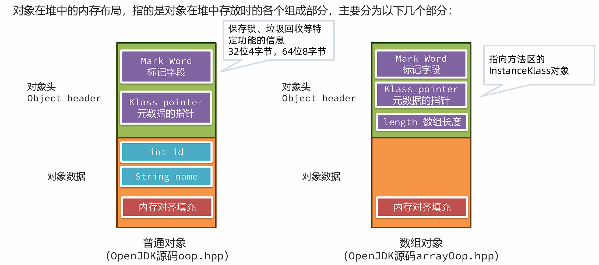


##### 标记字段


> JOL是用于分析 JVM 中对象布局的一款专业工具。工具中使用 Unsafe、JVMTI 和 Serviceability Agent (SA)等虚拟机技术来打印实际的对象内存布局。
> 
> ```xml
> <dependency>
>     <groupId>org.openjdk.jol</groupId>
>     <artifactId>jol-core</artifactId>
>     <version>0.9</version>
> </dependency>
> ```
> 
> ```java
> System.out.println(ClassLayout.parseInstance(对象).toPrintable());
> ```


##### 指针压缩

在64位的Java虚拟机中，Klass Pointer以及对象数据中的对象引用都需要占用8个字节，为了减少这部分的内存使用量，64 位 Java 虚拟机使用指针压缩技术，将堆中原本 8个字节的 指针压缩成 4个字节，此功能默认开启，可以使用`-XX:-UseCompressedOops`关闭。


指针压缩的思想是将寻址的单位放大，比如原来按1字节去寻址，现在可以按8字节寻址。如下图所示，原来按1去寻址，能拿到1字节开始的数据，现在按1去寻址，就可以拿到8个字节开始的数据。


这样将编号当成地址，就可以用更小的内存访问更多的数据。但是这样的做法有两个问题：

1. 需要进行内存对齐，指的是将对象的内存占用填充至8字节的倍数。存在空间浪费（对于Hotspot来说不存在，即便不开启指针压缩，也需要进行内存对齐）

2. 寻址大小仅仅能支持2的35 次方个字节（32GB，如果超过32GB指针压缩会自动关闭）。不用压缩指针，应该是2的64次方 = 16EB，用了压缩指针就变成了8（字节） = 2的3次方 * 2的32次方 = 2的35次方
   
   

##### 内存对齐

内存对齐主要目的是为了解决并发情况下CPU缓存失效的问题：线程A修改A会影响线程B对B的操作


> 内存对齐之后，同一个缓存行中不会出现不同对象的属性。在并发情况下，如果让A对象一个缓存行失效，是不会影响到B对象的缓存行的。


字段重排列:

在Hotspot中，要求每个属性的偏移量Offset（字段地址 – 起始地址）必须是字段长度的N倍。

如果不满足要求，会尝试使用内存对齐，通过在属性之间插入一块对齐区域达到目的。

如下图中，name字段是引用占用8个字节（关闭了指针压缩），所以Offset必须是8的倍数，在age和name之间插入了4个字节的空白区域。


### 方法调用的原理

方法调用的本质是通过字节码指令的执行，能在栈上创建栈帧，并执行调用方法中的字节码执行。以invoke开头的字节码指令的作用是执行方法的调用。

在JVM中，一共有五个字节码指令可以执行方法调用：

1. invokestatic：调用静态方法。<font color=red>静态绑定</font>

2. invokespecial: 调用对象的private方法、构造方法，以及使用 super 关键字调用父类实例的方法、构造方法，以及所实现接口的默认方法。<font color=red>静态绑定</font>

3. invokevirtual：调用对象的非private方法。非final方法使用<font color=red>动态绑定</font>，使用虚方法表找到方法的地址，子类会复制父类的虚方法表，如果子类重写了方法，会替换成重写后方法的地址。

4. invokeinterface：调用接口对象的方法。<font color=red>动态绑定</font>，使用接口表找到方法的地址，进行调用。

5. invokedynamic：用于调用动态方法，主要应用于lambda表达式中，机制极为复杂了解即可。
   
   

#### 方法调用的原理–静态绑定

1. 编译期间，invoke指令会携带一个参数符号引用，引用到常量池中的方法定义。方法定义中包含了<font color=red>类名 + 方法名 + 返回值 + 参数</font>。

2. 在方法<font color=red>第一次调用</font>时，这些符号引用就会被替换成内存地址的直接引用，这种方式称之为静态绑定。

> 静态绑定适用于处理静态方法、私有方法、或者使用final修饰的方法，因为这些方法不能被继承之后重写。

#### 方法调用的原理–动态绑定

对于非static、非private、非final的方法，有可能存在子类重写方法，那么就需要通过动态绑定来完成方法地址绑定的工作。比如在这段代码中，调用的其实是Cat类对象的eat方法，但是编译完之后虚拟机指令中调用的是Animal类的eat方法，这就需要在运行过程中通过动态绑定找到Cat类的eat方法，这样就实现了多态。


动态绑定是基于方法表来完成的，invokevirtual使用了虚方法表（vtable），invokeinterface使用了接口方法表(itable)，整体思路类似。所以接下来使用invokevirtual和虚方法表来解释整个过程。

每个类中都有一个虚方法表，本质上它是一个数组，记录了方法的地址。子类方法表中包含父类方法表中的所有方法；**子类如果重写了父类方法，则使用自己类中方法的地址进行替换**。


### 异常捕获的原理

在Java中，程序遇到异常时会向外抛出，此时可以使用try-catch捕获异常的方式将异常捕获并继续让程序按程序员设计好的方式运行。比如如下代码：在try代码块中如果抛出了Exception对象或者子类对象，则会进入catch分支。异常捕获机制的实现，需要借助于编译时生成的<font color=red>异常表</font>。


异常表在编译期生成，存放的是代码中异常的处理信息，包含了异常捕获的生效范围以及异常发生后跳转到的字节码指令位置。

起始/结束PC：此条异常捕获生效的字节码起始/结束位置。

跳转PC：异常捕获之后，跳转到的字节码位置。


程序运行中触发异常时，Java 虚拟机会从上至下遍历异常表中的所有条目。当触发异常的字节码的索引值在某个异常表条目的监控范围内，Java 虚拟机会判断所抛出的异常和该条目想要捕获的异常是否匹配。

1. 如果匹配，跳转到“跳转PC”对应的字节码位置。

2. 如果遍历完都不能匹配，说明异常无法在当前方法执行时被捕获，此方法栈帧直接弹出，在上一层的栈帧中进行异常捕获的查询。
   
   

finally的处理方式就相对比较复杂一点了，分为以下几个步骤：

1. finally中的字节码指令会插入到try 和 catch代码块中,保证在try和catch执行之后一定会执行finally中的代码。

2. 如果抛出的异常范围超过了Exception，比如Error或者Throwable，此时也要执行finally，所以异常表中增加了两个条目。覆盖了try和catch两段字节码指令的范围，any代表可以捕获所有种类的异常。


### JIT即时编译器

在Java中，JIT即时编译器是一项用来提升应用程序代码执行效率的技术。字节码指令被 Java 虚拟机解释执行，如果有一些指令执行频率高，称之为热点代码，这些字节码指令则被JIT即时编译器编译成机器码同时进行一些优化，最后保存在内存中，将来执行时直接读取就可以运行在计算机硬件上了。


在HotSpot中，有三款即时编译器，C1、C2和Graal，其中Graal在GraalVM章节中已经介绍过。

C1编译效率比C2快，但是优化效果不如C2。所以C1适合优化一些执行时间较短的代码，C2适合优化服务端程序中长期执行的代码。


JDK7之后，采用了分层编译的方式，在JVM中C1和C2会一同发挥作用，分层编译将整个优化级别分成了5个等级。


C1即时编译器和C2即时编译器都有独立的线程去进行处理，内部会保存一个队列，队列中存放需要编译的任务。一般即时编译器是针对方法级别来进行优化的，当然也有对循环进行优化的设计。


#### C1与C2协作

1. 先由C1执行过程中收集所有运行中的信息，方法执行次数、循环执行次数、分支执行次数等等，然后等待执行次数触发阈值（分层即时编译由JVM动态计算）之后，进入C2即时编译器进行深层次的优化。

2. 方法字节码执行数目过少，先收集信息，JVM判断C1和C2优化性能差不多，那之后转为不收集信息，由C1直接进行优化。

3. C1线程都在忙碌的情况下，直接由C2进行优化。

4. C2线程忙碌时，先由2层C1编译收集一些基础信息，多运行一会儿，然后再交由3层C1处理，由于3层C1处理效率不高，所以尽量减少这一层停留时间（C2忙碌着，一直收集也没有意义），最后C2线程不忙碌了再交由C2进行处理。
   
   

> 分别采用三种不同虚拟机参数测试JIT优化效果：不加参数（开启完全JIT即时编译），-Xint（关闭JIT只使用解释器）、-XX:TieredStopAtLevel=1（分层编译下只使用1层C1进行编译）


#### 优化手段-方法内联

方法内联（Method Inline）：方法体中的字节码指令直接复制到调用方的字节码指令中，节省了创建栈帧的开销。

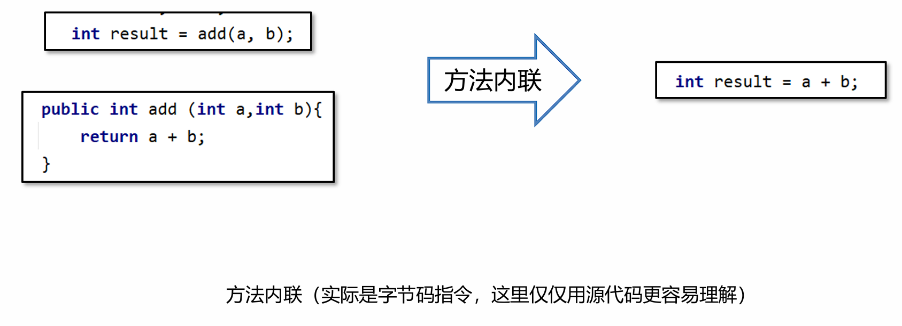

> 使用JIT Watch工具查看方法内联的优化结果
> 
> 安装JIT Watch工具，下载源码： https://github.com/AdoptOpenJDK/jitwatch/tree/1.4.2


方法内联的限制

并不是所有的方法都可以内联，内联有一定的限制：

1. 方法编译之后的字节码指令总大小 < 35字节，可以直接内联。（通过`-XX:MaxInlineSize=值` 控制）

2. 方法编译之后的字节码指令总大小 < 325字节，并且是一个热方法。（通过`-XX:FreqInlineSize=值` 控制）

3. 方法编译生成的机器码不能大于1000字节。（通过`-XX:InlineSmallCode=值` 控制）

4. 一个接口的实现必须小于3个，如果大于三个就不会发生内联。
   
   

#### 优化手段-逃逸分析

逃逸分析指的是如果JIT发现在方法内创建的对象不会被外部引用，那么就可以采用锁消除、标量替换等方式进行优化。

##### 锁消除

锁消除指的是如果对象被判断不会逃逸出去，那么在对象就不存在并发访问问题，对象上的锁处理都不会执行，从而提高性能。如：

```java
synchronized (new Test()){}
```

##### 标量替换

逃逸分析真正对性能优化比较大的方式是<font color=red>标量替换</font>，在Java虚拟机中，对象中的基本数据类型称为标量，引用的其他对象称为聚合量。标量替换指的是如果方法中的对象不会逃逸，那么其中的标量就可以直接在栈上分配。


根据JIT即时编器优化代码的特性，在编写代码时注意以下几个事项，可以让代码执行时拥有更好的性能：

1. 尽量编写比较小的方法，让方法内联可以生效。

2. 高频使用的代码，特别是第三方依赖库甚至是JDK中的，如果内容过度复杂是无法内联的，可以自行实现一个特定的优化版本。

3. 注意下接口的实现数量，尽量不要超过2个，否则会影响内联的处理。

4. 高频调用的方法中创建对象临时使用，尽量不要让对象逃逸。
   
   

### 垃圾回收器原理

#### G1垃圾回收器原理

##### 年轻代回收

1. 新创建的对象会存放在Eden区。当G1判断年轻代区不足（max默认60%），无法分配对象时需要回收时会执行Young GC。

2. 标记出Eden和Survivor区域中的存活对象

3. 根据配置的最大暂停时间选择某些区域将存活对象复制到一个新的Survivor区中（年龄+1），清空这些区域。

4. 后续Young GC时与之前相同，只不过Survivor区中存活对象会被搬运到另一个Survivor区。

5. 当某个存活对象的年龄到达阈值（默认15），将被放入老年代。

6. 部分对象如果大小超过Region的一半，会直接放入老年代，这类老年代被称为Humongous区。比如堆内存是4G，每个Region是2M，只要一个大对象超过了1M就被放入Humongous区，如果对象过大会横跨多个Region。

7. 多次回收之后，会出现很多Old老年代区，此时总堆占有率达到阈值时（`-XX:InitiatingHeapOccupancyPercent`默认45%）会触发混合回收MixedGC。回收所有年轻代和部分老年代的对象以及大对象区。采用复制算法来完成。
   
   

###### 问题

年轻代回收只扫描年轻代对象（Eden + Survivor），所以从GC Root到年轻代的对象或者年轻代对象引用了其他年轻代的对象都很容易扫描出来

这里就存在一个问题，年轻代回收只扫描年轻代对象（Eden + Survivor），如果有老年代中的对象引用了年轻代中的对象，我们又如何知道呢？


方案1：从GC Root开始，扫描所有对象，如果年轻代对象在引用链上，就标记为存活。

> 不可行，需要遍历引用链上所有对象，效率太低。


方案2：维护一个详细的表，记录哪个对象被哪个老年代引用了。在年轻代中被引用的对象，不进行回收。

> 问题：如果对象太多这张表会占用很大的内存空间。存在错标的情况


方案2的第一次优化：只记录Region被哪些对象引用了。这种引用详情表称为<font color=red>记忆集 RememberedSet（简称RS或RSet）</font>：是一种记录了从非收集区域对象引用收集区域对象的这些关系的数据结构。扫描时将记忆集中的对象也加入到GC Root中，就可以根据引用链判断哪些对象需要回收了。

> 问题：如果区域中引用对象很多，还是占用很多内存。


方案2的第二次优化：将所有区域中的内存按一定大小划分成很多个块，每个块进行编号。记忆集中只记录对块的引用关系。如果一个块中有多个对象，只需要引用一次，减少了内存开销。

> 每一个Region都拥有一个自己的**卡表**，如果产生了跨代引用（老年代引用年轻代），此时这个Region对应的卡表上就会将字节内容进行修改,JDK8源码中0代表被引用了称为脏卡。这样就可以标记出当前Region被老年代中的哪些部分引用了。那么要生成记忆集就比较简单了，只需要遍历整个卡表，找到所有脏卡。


###### G1年轻代回收核心技术

1. <font color=red>卡表Card Table</font>
   每一个Region都拥有一个自己的卡表，卡表是一个字节数组，如果产生了跨代引用（老年代引用年轻代），G1会将卡表上引用对象所在的位置字节内容进行修改为0, 称为脏卡。卡表的主要作用是生成记忆集。卡表会占用一定的内存空间，堆大小是1G时，卡表大小为1G = 1024 MB / 512 = 2MB 

2. <font color=red>记忆集 RememberedSet（简称RS或RSet）</font>
   每一个Region都拥有一个自己的记忆集，如果产生了跨代引用，记忆集中会记录引用对象所在的卡表位置。标记阶段将记忆集中的对象加入GC ROOT集合中一起扫描，就可以将被引用的对象标记为存活。

3. <font color=red>写屏障 Write Barrier </font>
   G1使用写屏障技术，在执行引用关系建立的代码执行后插入一段指令，完成卡表的维护工作。会损失一部分的性能，大约在5%~10%之间。
   
   

##### 混合回收

多次回收之后，会出现很多Old老年代区，此时总堆占有率达到阈值（默认45%）时会触发混合回收MixedGC。

混合回收会由年轻代回收之后或者大对象分配之后触发，混合回收会回收 <font color=red>整个年轻代 + 部分老年代</font>。

老年代很多时候会有大量对象，要标记出所有存活对象耗时较长，所以整个标记过程要尽量能做到和用户线程并行执行。


**步骤**：

1. 初始标记，STW，采用**三色标记法**标记从GC Root可直达的对象。

2. 并发标记，并发执行，对存活对象进行标记。

3. 最终标记，STW，处理SATB相关的对象标记。

4. 清理，STW，如果区域中没有任何存活对象就直接清理。

5. 转移，将存活对象复制到别的区域。
   
   

**1. 初始标记**

初始标记会暂停所有用户线程，只标记从GC Root可直达的对象，所以停顿时间不会太长。采用<font color=red>三色标记法</font>进行标记，三色标记法在原有双色标记（黑也就是1代表存活，白0代表可回收）增加了一种灰色，采用队列的方式保存标记为灰色的对象。

    <font color=red>黑色：存活</font>，当前对象在GC Root引用链上，同时他引用的其他对象也都已经标记完成。

    <font color=red>灰色：待处理</font>，当前对象在GC Root引用链上，他引用的其他对象还未标记完成。

    <font color=red>白色：可回收</font>，不在GC Root引用链上。

> 三色标记中的黑色和白色是使用位图(bitmap)来实现的,比如8个字节使用1个bit来标识标记的内容，黑色为1，白色为0，灰色不会体现在位图中，会单独放入一个队列中。如果对象超过8个字节，仅仅使用第一个bit位处理。

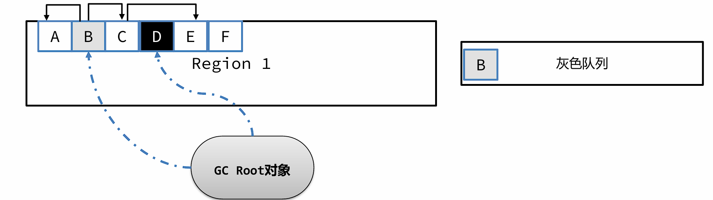


**2. 并发标记**

接下来进入并发标记阶段，继续进行未完成的标记任务。此阶段和用户线程并发执行。

从灰色队列中获取尚未完成标记的对象B。标记B关联的A和C对象，由于A对象并未引用其他对象，可以直接标记成黑色，而B也完成了所有引用对象的标记，也标记为黑色。C对象有引用对象E，所以先标记成灰色并放入灰色队列。最后从队列获取C对象，标记为黑色，E也标记为黑色。所以剩余对象F就是白色，可回收。


**问题**

三色标记存在一个比较严重的问题，由于用户线程可能同时在修改对象的引用关系，就会出现错标的情况，比如：

这个案例中正常情况下，B和C都会被标记成黑色。但是在BC标记前，用户线程执行了 B.c = null；将B到C的引用去除了。同时执行了A.c = c; 添加了A到C的引用。此时会出现严重问题，C是白色可回收一旦回收代码中再去使用对象会造成重大问题。


G1为了解决这个问题，使用了<font color=red>SATB技术（Snapshot At The Beginning， 初始快照）</font>。SATB技术是这样处理的：

1. 标记开始时创建一个快照，记录当前所有对象，标记过程中新生成的对象直接标记为黑色。

2. 采用前置写屏障技术，在引用赋值前比如B.c = null之前，将之前引用的对象c放入SATB待处理队列中。SATB队列每个线程都有一个，最终会汇总到一个大的SATB队列中。
   
   

**3. 最终标记**

最终标记会暂停所有用户线程，主要是为了处理SATB相关的对象标记。这一步中，将所有线程的SATB队列中剩余的数据合并到总的SATB队列中，然后逐一处理。

SATB队列中的对象，默认按照存活处理，同时要处理他们引用的对象。

> SATB的缺点是在本轮清理时可能会将不存活的对象标记成存活对象，产生了一些所谓的浮动垃圾，等到下一轮清理时才能回收。


**4. 清理**


**5 . 转移**

1. 根据最终标记的结果，可以计算出每一个区域的垃圾对象占用内存大小，根据停顿时间，选择转移效率最高（垃圾对象最多）的几个区域。

2. 转移时先转移GC Root直接引用的对象，然后再转移其他对象。

3. 回收老的区域，如果外部有其他区域对象引用了转移对象，也需要重新设置引用关系。
   
   

#### ZGC垃圾回收器原理

ZGC 是一种可扩展的低延迟垃圾回收器。ZGC 在垃圾回收过程中，STW的时间不会超过一毫秒，适合需要低延迟的应用。支持几百兆到16TB 的堆大小，堆大小对STW的时间基本没有影响。


在G1垃圾回收器中，STW时间的主要来源是在转移阶段：

1. 初始标记，STW，采用三色标记法标记从GC Root可直达的对象。 <font color=red>STW时间极短</font>

2. 并发标记，并发执行，对存活对象进行标记。

3. 最终标记，STW，处理SATB相关的对象标记。 <font color=red>STW时间极短</font>

4. 清理，STW，如果区域中没有任何存活对象就直接清理。 <font color=red>STW时间极短</font>

5. 转移，将存活对象复制到别的区域。 <font color=red>STW时间较长</font>
   
   


> 注意是<font color=red>并发转移</font>


**问题**：G1转移时需要停顿的主要原因

转移完之后，需要将A对对象的引用更改为新对象的引用。但是在更改前，执行A.c.count= 2，此时更改的是转移前对象中的属性

更改引用之后, A引用了转移之后的对象，此时获取A.c.count发现属性值依然是1。这样就产生了问题，所以G1为了解决问题，在转移过程中需要进行用户线程的停止。


##### ZGC的解决并发转移方案

在ZGC中，使用了<font color=red>读屏障Load Barrier技术</font>，来实现转移后对象的获取。当获取一个对象引用时，会触发读后的屏障指令，如果对象指向的不是转移后的对象，用户线程会将引用指向转移后的对象。

> 会损失一部分的性能，大约在5%~10%之间。


##### 着色指针（Colored Pointers）

> 不支持32位系统、不支持指针压缩

访问对象引用时，使用的是对象的地址。在64位虚拟机中，8个字节可以表示接近无限的内存空间。所以一般内存中对象，高几位都是0没有使用。着色指针就是利用了这多余的几位，存储了状态信息。


着色指针将原来的8字节保存地址的指针拆分成了三部分：

1. 最低的44位，用于表示对象的地址，所以最多能表示16TB的内存空间。

2. 中间4位是颜色位，每一位只能存放0或者1，并且同一时间只有其中一位是1。
   **终结位**：只能通过终结器访问
   **重映射位(Remap)**：转移完之后，对象的引用关系已经完成变更。
   **Marked0和Marked1**：标记可达对象

3. 16位未使用
   
   > 正常应用程序使用8个字节去进行对象的访问，现在只使用了44位，不会产生问题吗？
   > 应用程序使用的对象地址，只是虚拟内存，操作系统会将虚拟内存转换成物理内存。而ZGC通过操作系统更改了这层逻辑。所以不管颜色位变成多少，指针指向的都是同一个对象。
   
   

#### ShenandoahGC原理

ShenandoahGC和ZGC不同， ShenandoahGC很多是使用了G1源代码改造而成，所以在很多算法、数据结构的定义上，与G1十分相像，而ZGC是完全重新开发的一套内容。

1. ShenandoahGC的区域定义与G1是一样的。

2. 没有着色指针，通过修改对象头的设计来完成并发转移过程的实现。

3. ShenandoahGC有两个版本，1.0版本存在于JDK8和JDK11中，后续的JDK版本中均使用2.0版本。
   
   

##### 1.0版本

在对象的前8个字节，增加了一个**前向指针**。前向指针指向转移之后的对象，如果没有就指向自己。

- 如果转移阶段未完成，此时转移前的对象和转移后的对象都会存活。如果用户去访问数据，需要使用转移后的数据。ShenandoahGC使用了读前屏障，根据对象的前向指针来获取到转移后的对象并读取。

- 写入数据时会使用写前屏障，判断Mark Word中的GC状态，如果GC状态为0证明没有处于GC过程中，直接写入，如果不为0则根据GC状态值确认当前处于垃圾回收的哪个阶段，让用户线程执行垃圾回收相关的任务。
  
  

**缺点**

1. 对象内存大大增加，每个对象都需要增加8个字节的前向指针，基本上会占用5% -10%的空间。

2. 读屏障中加入了复杂的指令，影响使用效率。
   
   

##### 2.0版本

2.0版本优化了前向指针的位置，仅转移阶段将其放入了Mark Word中。


> 红色：GC线程    蓝色：用户线程


**并发问题**

如果用户线程在帮忙转移时，ShenandoahGC线程也发现这个对象需要复制，那么就会去尝试写入前向指针，使用了类似CAS（compare and swap）的方式来实现，只有一个线程能成功修改，其他线程会放弃转移的操作。


---

## 面试篇

### 什么是JVM

回答路径：

- [x] JVM的定义

- [x] 作用

- [x] 功能

- [x] 组成
1. 定义
   JVM指的是<font color=red>Java虚拟机（Java Virtual Machine ）</font>。JVM 本质上是一个运行在计算机上的程序，他的职责是运行Java字节码文件，Java虚拟机上可以运行**Java、Kotlin、Scala、Groovy**等语言。

2. 作用
   为了支持Java中<font color=red>Write Once，Run Anywhere</font>；编写一次，到处运行的**跨平台**特性。

3. 功能
   
   - **解释和运行**
     
     - 对字节码文件中的指令，实时的解释成机器码，让计算机执行
   
   - **内存管理**
     
     - 自动为对象、方法等分
     
     - 自动的垃圾回收机制，回收不再使用的对象
   
   - **即时编译**
     
     - 对热点代码进行优化(JIT即时编译)，提升执行效率

4. 组成

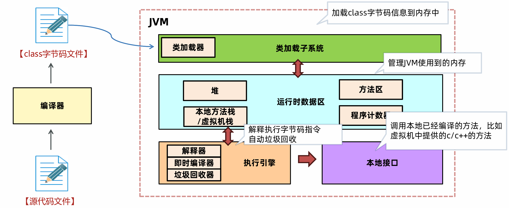

5. JVM选择
   
   - **最常用的JVM**:<font color=red>Oracle提供的Hotspot 、OpenJDK的Hotspot</font>
   
   - **有JVM二次开发需要**:<font color=red>OpenJDK的Hotspot</font>
   
   - **云原生架构高性能需求**:<font color=red>GraalVM OpenJ9</font>
   
   - **电商物流金融高性能需求**:<font color=red>GraalVM阿里DragonWell龙井</font>
     
     

### 字节码文件的组成

回答路径：

- [x] 查看字节码文件常用工具

- [x] 字节码文件的组成

- [x] 应用场景：工作中一般不直接查看字节码文件，只用于深入了解JVM
1. 查看字节码文件的工具
   
   - 开发环境使用`jclasslib`插件
   
   - 服务器环境使用`javap -v`命令

2. 组成


### 什么是运行时数据区

回答路径：

- [x] 程序计数器

- [x] 栈

- [x] 堆

- [x] 方法区

- [x] 直接内存（可选项，不属于运行时数据区）
1. 定义
   运行时数据区指的是JVM所管理的内存区域，其中分成两大类：
   
   - 线程共享 –方法区、堆
   
   - 线程不共享 –本地方法栈、虚拟机栈、程序计数器
     
     > 直接内存主要是NIO使用，由操作系统直接管理，不属于JVM内存。

2. 程序计数器
   程序计数器（Program Counter Register）也叫PC寄存器，每个线程会通过程序计数器记录当前要执行的的字节码指令的地址。主要有两个作用：
   
   - 程序计数器可以控制程序指令的进行，实现分支、跳转、异常等逻辑。
   
   - 在多线程执行情况下，Java虚拟机需要通过程序计数器记录CPU切换前解释执行到那一句指令并继续解释运行。

3. 栈
   **Java虚拟机栈**采用栈的数据结构来管理方法调用中的基本数据，先进后出 ,每一个方法的调用使用一个<font color=red>栈帧</font>来保存。每个线程都会包含一个自己的虚拟机栈，它的生命周期和线程相同。
   栈帧主要包含三部分内容：
   
   - 局部变量表，在方法执行过程中存放所有的局部变量。
   
   - 操作数栈，虚拟机在执行指令过程中用来存放临时数据的一块区域。
   
   - 帧数据，主要包含动态链接、方法出口、异常表等内容。
     
     > 动态链接：方法中要用到其他类的属性和方法，这些内容在字节码文件中是以编号保存的，运行过程中需要替换成内存中的地址，这个编号到内存地址的映射关系就保存在动态链接中。
     > 方法出口：方法调用完需要弹出栈帧，回到上一个方法，程序计数器要切换到上一个方法的地址继续执行，方法出口保存的就是这个地址。
     > 异常表：存放的是代码中异常的处理信息，包含了异常捕获的生效范围以及异常发生后跳转到的字节码指令位置。
     
     

   **本地方法栈**，Java虚拟机栈存储了Java方法调用时的栈帧，而本地方法栈存储的是native本地方法的栈帧。在Hotspot虚拟机中，Java虚拟机栈和本地方法栈实现上使用了同一个栈空间。本地方法栈会在栈内存上生成一个栈帧，临时保存方法的参数同时方便出现异常时也把本地方法的栈信息打印出来。

4. 堆
   
   - 一般Java程序中堆内存是空间最大的一块内存区域。创建出来的对象都存在于堆上。
   
   - 栈上的局部变量表中，可以存放堆上对象的引用。静态变量也可以存放堆对象的引用，通过静态变量就可以实现对象在线程之间共享。
   
   - 堆是垃圾回收最主要的部分，堆结构更详细的划分与垃圾回收器有关。

5. 方法区
   方法区是Java虚拟机规范中提出来的一个虚拟机概念，在HotSpot不同版本中会用永久代或者元空间来实现。方法区主要存放的是基础信息，包含：
   
   - 每一个加载的类的元信息（基础信息）。
   
   - 运行时常量池，保存了字节码文件中的常量池内容，避免常量内容重复创建减少内存开销。
   
   - 字符串常量池，存储字符串的常量。

> **直接内存**并不在《Java虚拟机规范》中存在，所以并不属于Java运行时的内存区域。在 JDK 1.4 中引入了 NIO 机制，由操作系统直接管理这部分内容，主要为了提升读写数据的性能。在网络编程框架如Netty中被大量使用。要创建直接内存上的数据，可以使用ByteBuffer。语法： `ByteBuffer directBuffer = ByteBuffer.allocateDirect(size);`


### 会出现内存溢出的区域

内存溢出指的是内存中某一块区域的使用量超过了允许使用的最大值，从而使用内存时因空间不足而失败，虚拟机一般会抛出指定的错误。在Java虚拟机中，**只有<u>程序计数器</u><font color=red>不会</font>出现内存溢出的情况**，因为每个线程的程序计数器只保存一个固定长度的地址。


- 堆内存溢出：
  
  > 堆内存溢出指的是在堆上分配的对象空间超过了堆的最大大小，从而导致的内存溢出。堆的最大大小使用-Xmx参数进行设置，如-Xmx10m代表最大堆内存大小为10m。溢出之后会抛出OutOfMemoryError，并提示是Java heap Space导致的

- 栈内存溢出：
  
  > 栈内存溢出指的是所有栈帧空间的占用内存超过了最大值，最大值使用-Xss进行设置，比如-Xss256k代表所有栈帧占用内存大小加起来不能超过256k。溢出之后会抛出StackOverflowError

- 方法区内存溢出：
  
  > 方法区内存溢出指的是方法区中存放的内容比如类的元信息超过了方法区内存的最大值，**JDK7及之前**版本方法区使用<u>永久代</u>（-XX:MaxPermSize=值）来实现，**JDK8及之后**使用<u>元空间</u>（-XX:MaxMetaspaceSize=值）来实现。

- 直接内存溢出：
  
  > 直接内存溢出指的是申请的直接内存空间大小超过了最大值，使用 -XX:MaxDirectMemorySize=值 设置最大值。溢出之后会抛出OutOfMemoryError
  
  

### JVM在JDK6-8之间在内存区域上有什么不同

1. 方法区的实现
   
   - JDK7及之前的版本将方法区存放在<font color=red>堆区域中的永久代空间</font>，堆的大小由虚拟机参数来控制。
   
   - JDK8及之后的版本将方法区存放在<font color=red>元空间</font>中，元空间位于操作系统维护的<font color=red>直接内存</font>中，默认情况下只要不超过操作系统承受的上限，可以一直分配。也可以手动设置最大大小。
     
     > 使用元空间替换永久代的原因：
     > 
     > - **提高内存上限**：元空间使用的是操作系统内存，而不是JVM内存。如果不设置上限，只要不超过操作系统内存上限，就可以持续分配。而永久代在堆中，可使用的内存上限是有限的。所以使用元空间可以有效减少OOM情况的出现。
     > 
     > - **优化垃圾回收的策略**：永久代在堆上，垃圾回收机制一般使用老年代的垃圾回收方式，不够灵活。使用元空间之后单独设计了一套适合方法区的垃圾回收机制。

2. 字符串常量池的位置


字符串常量池从方法区移动到堆的原因：

1. **垃圾回收优化**：字符串常量池的回收逻辑和对象的回收逻辑类似，内存不足的情况下，如果字符串常量池中的常量不被使用就可以被回收；方法区中的类的元信息回收逻辑更复杂一些。移动到堆之后，就可以利用对象的垃圾回收器，对字符串常量池进行回收。

2. **让方法区大小更可控**：一般在项目中，类的元信息不会占用特别大的空间，所以会给方法区设置一个比较小的上限。如果字符串常量池在方法区中，会让方法区的空间大小变得不可控。

3. **intern方法的优化**：JDK6版本中intern () 方法会把第一次遇到的字符串实例复制到永久代的字符串常量池中。JDK7及之后版本中由于字符串常量池在堆上，就可以进行优化：字符串保存在堆上，把字符串的引用放入字符串常量池，减少了复制的操作。
   
   

### 类的生命周期

回答路径：

- [x] 加载

- [x] 连接（验证、准备、解析）

- [x] 初始化

- [x] 卸载
1. 加载
   
   - 加载(Loading)阶段第一步是类加载器根据类的全限定名通过不同的渠道以二进制流的方式获取字节码信息。程序员可以使用Java代码拓展的不同的渠道。
   
   - 类加载器在加载完类之后，Java虚拟机会将字节码中的信息保存到内存的方法区中。在方法区生成一个InstanceKlass对象，保存类的所有信息。
   
   - 在堆中生成一份与方法区中数据类似的java.lang.Class对象， 作用是在Java代码中去获取类的信息。

2. 连接
   
   - 验证
     
     - 验证的主要目的是检测Java字节码文件是否遵守了《Java虚拟机规范》中的约束。这个阶段一般不需要程序员参与。
     
     - 主要包含如下四部分，具体详见《Java虚拟机规范》：
       
       1. 文件格式验证，比如文件是否以0xCAFEBABE开头，主次版本号是否满足当前Java虚拟机版本要求。
       
       2. 元信息验证，例如类必须有父类（super不能为空）。
       
       3. 验证程序执行指令的语义，比如方法内的指令执行到一半强行跳转到其他方法中去。
       
       4. 符号引用验证，例如是否访问了其他类中private的方法等。
   
   - 准备
     
     - 准备阶段为静态变量（static）分配内存并设置初值。final修饰的基本数据类型的静态变量，准备阶段直接会将代码中的值进行赋值。
   
   - 解析
     
     - 解析阶段主要是将常量池中的符号引用替换为直接引用。符号引用就是在字节码文件中使用编号来访问常量池中的内容。直接引用不在使用编号，而是使用内存中地址进行访问具体的数据。

3. 初始化
   
   - 初始化阶段会执行静态代码块中的代码，并为静态变量赋值。
   
   - 初始化阶段会执行字节码文件中clinit部分的字节码指令。

4. 卸载
   判定一个类可以被卸载。需要同时满足下面三个条件：
   
   - 此类所有实例对象都已经被回收，在堆中不存在任何该类的实例对象以及子类对象。
   
   - 加载该类的类加载器已经被回收。
   
   - 该类对应的java.lang.Class 对象没有在任何地方被引用
     
     
     
     

### 类加载器

回答路径：

- [x] 类加载器的作用

- [x] 启动类加载器

- [x] 扩展/平台类加载器

- [x] 应用程序类加载器

- [x] 自定义类加载器（加分项）
1. 作用
   类加载器负责在类的加载过程中将字节码信息以流的方式获取并加载到内存中。

2. 启动类加载器
   
   - 启动类加载器（BootstrapClassLoader）是由Hotspot虚拟机提供的类加载器，JDK9之前使用C++编写的、JDK9之后使用Java编写。
   
   - 默认加载Java安装目录/jre/lib下的类文件，比如rt.jar，tools.jar，resources.jar等。

3. 扩展类加载器
   
   - 扩展类加载器（Extension Class Loader）是JDK中提供的、使用Java编写的类加载器。JDK9之后由于采用了模块化，改名为Platform平台类加载器。
   
   - 默认加载Java安装目录/jre/lib/ext下的类文件。

4. 应用程序类加载器
   
   - 应用程序类加载器（Application Class Loader）是JDK中提供的、使用Java编写的类加载器。默认加载为应用程序classpath下的类。

5. 自定义类加载器允许用户自行实现类加载的逻辑，可以从网络、数据库等来源加载类信息。自定义类加载器需要继承自ClassLoader抽象类，重写findClass方法。
   
   
   
   

### 双亲委派机制

回答路径：

- [x] 类加载器和父类加载器

- [x] 什么是双亲委派机制

- [x] 双亲委派机制的作用
1. 类加载器和父类加载器
   
   - 类加载有层级关系，上一级称之为下一级的父类加载器。

2. 双亲委派机制指的是
   
   - 当一个类加载器接收到加载类的任务时，会向上查找是否加载过，再由顶向下进行加载。
   
   - 每个类加载器都有一个父类加载器，在类加载的过程中，每个类加载器都会先检查是否已经加载了该类，如果已经加载则直接返回，否则会将加载请求委派给父类加载器。


3. 作用
   
   - 保证类加载的安全性：通过双亲委派机制避免恶意代码替换JDK中的核心类库，确保核心类库的完整性和安全性。
   
   - 避免重复加载：双亲委派机制可以避免同一个类被多次加载。
     
     
     
     

### 打破双亲委派机制

ClassLoader中包含了4个核心方法，对Java程序员来说，打破双亲委派机制的唯一方法就是实现自定义类加载器重写loadClass方法，将其中的双亲委派机制代码去掉。


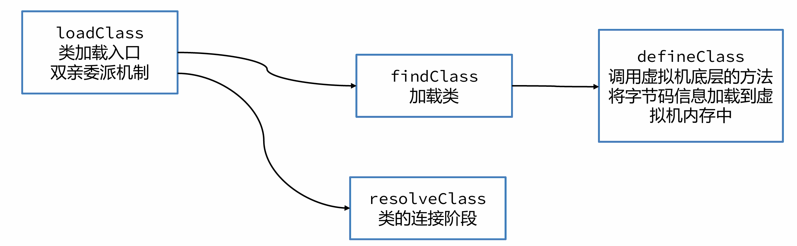


### Tomcat的自定义类加载器

Tomcat中，实现了一套自定义的类加载器。这一小节使用目前应用比较广泛的Tomcat9（9.0.84）源码进行分析。


- common类加载器主要加载tomcat自身使用以及应用使用的jar包，默认配置在catalina.properties文件中。common.loader="\${catalina.base}/lib", "\${catalina.base}/lib/*.jar"

- catalina类加载器主要加载tomcat自身使用的jar包，不让应用使用，默认配置在catalina.properties文件中。server.loader= 默认配置为空，为空时catalina加载器和common加载器是同一个。

- shared类加载器主要加载应用使用的jar包，不让tomcat使用，默认配置在catalina.properties文件中。shared.loader= 默认配置为空，为空时shared加载器和common加载器是同一个。

- ParallelWebappClassLoader类加载器可以多线程并行加载应用中使用到的类，<font color=red>每个应用</font>都拥有一个自己的该类加载器。
  
  > 为什么每个应用会拥有一个独立的ParallelWebappClassLoader类加载器呢？
  > 同一个类加载器，只能加载一个**同名的类**。两个应用中相同名称的类都必须要加载。

- JasperLoader类加载器负责加载JSP文件编译出来的class字节码文件，为了实现**热部署**（不重启让修改的jsp生效），每一个jsp文件都由一个独立的JasperLoader负责加载。
  
  

ParallelWebappClassLoader的执行流程：

> 默认这里打破了双亲委派机制，应用中的类如果没有加载过。会先从当前类加载器加载，然后再交给父类加载器通过双亲委派机制加载。

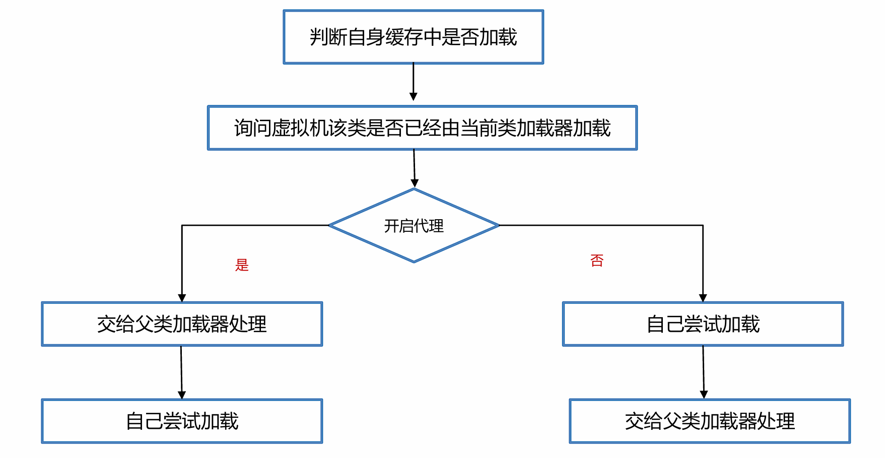


### 如何判断堆上的对象没有被引用？

回答路径：

- [x] 引用计数法

- [x] 可达性分析法

- [x] 使用可达性分析法原因
  
  

常见的有两种判断方法：**引用计数法**和**可达性分析法**。

引用计数法会为每个对象维护一个引用计数器，当对象被引用时加1，取消引用时减1。


引用计数法的优点是实现简单，缺点有两点：

1. 每次引用和取消引用都需要维护计数器，对系统性能会有一定的影响

2. 存在**循环引用**问题，所谓循环引用就是当A引用B，B同时引用A时会出现对象无法回收的问题。
   
   
   
   

Java使用的是<font color=red>可达性分析算法</font>来判断对象是否可以被回收。

可达性分析将对象分为两类：垃圾回收的**根对象GC Root**和普通对象，对象与对象之间存在引用关系。

可达性分析算法指的是如果从某个到GC Root对象是可达的，对象就不可被回收。


哪些对象被称之为GC Root对象呢？

- 线程Thread对象，引用线程栈帧中的方法参数、局部变量等。

- 系统类加载器加载的java.lang.Class对象，引用类中的静态变量。

- 监视器对象，用来保存同步锁synchronized关键字持有的对象。

- 本地方法调用时使用的全局对象。
  
  
  
  

### JVM 中都有哪些引用类型

回答路径：

- [x] 强引用

- [x] 软引用

- [x] 弱引用

- [ ] 虚引用

- [ ] 终结器引用
  
  

- **强引用**，JVM中默认引用关系就是强引用，即是对象被局部变量、静态变量等GC Root关联的对象引用，只要这层关系存在，普通对象就不会被回收。

- **软引用**，软引用相对于强引用是一种比较弱的引用关系，如果一个对象只有软引用关联到它，当程序内存不足时，就会将软引用中的数据进行回收。软引用主要在缓存框架中使用。

- **弱引用**，弱引用的整体机制和软引用基本一致，区别在于弱引用包含的对象在垃圾回收时，不管内存够不够都会直接被回收，弱引用主要在ThreadLocal中使用。

- **虚引用**（幽灵引用/幻影引用），不能通过虚引用对象获取到包含的对象。虚引用唯一的用途是当对象被垃圾回收器回收时可以接收到对应的通知。直接内存中为了及时知道直接内存对象不再使用，从而回收内存，使用了虚引用来实现。

- **终结器引用**，终结器引用指的是在对象需要被回收时，终结器引用会关联对象并放置在Finalizer类中的引用队列中，在稍后由一条由FinalizerThread线程从队列中获取对象，然后执行对象的finalize方法，在对象第二次被回收时，该对象才真正的被回收。
  
  
  
  

### ThreadLocal中为什么要使用弱引用

ThreadLocal可以在线程中存放线程的本地变量，保证数据的线程安全。


ThreadLocal中是这样去保存对象的：

1. 在每个线程中，存放了一个<font color=red>ThreadLocalMap对象</font>，本质上就是一个数组实现的哈希表，里边存放多个Entry对象。

2. 每个Entry对象继承自**弱引用**，内部存放ThreadLocal对象。同时用强引用，引用保存的ThreadLocal对应的value值。


不再使用Threadlocal对象时， threadlocal = null；由于是弱引用，那么在垃圾回收之后，**ThreadLocal对象就可以被回收**。

> 此时还有Entry对象和value对象没有能被回收，所以在ThreadLocal类的set、get、remove方法中，在某些特定条件满足的情况下，会主动删除这两个对象。
> 
> 如果一直不调用set、get、remove方法或者调用了没有满足条件，这部分对象就会出现内存泄漏。**强烈建议**在ThreadLocal不再使用时，<font color=red>调用remove方法</font>回收将Entry对象的引用关系去掉，这样就可以回收这两个对象了。


### 常见的垃圾回收算法

回答路径：

垃圾回收算法的机制、优缺点

- [x] 标记清除

- [x] 标记整理

- [x] 复制

- [x] 分代GC
1. 标记清除算法
   标记清除算法的核心思想分为两个阶段：
   
   - 标记阶段，将所有存活的对象进行标记。Java中使用可达性分析算法，从GC Root开始通过引用链遍历出所有存活对象。
   
   - 清除阶段，从内存中删除没有被标记也就是非存活对象。
   
   > 优点：实现简单，只需要在第一阶段给每个对象维护标志位，第二阶段删除对象即可。
   > 缺点：
   > 
   > - 碎片化问题。由于内存是连续的，所以在对象被删除之后，内存中会出现很多细小的可用内存单元。如果我们需要的是一个比较大的空间，很有可能这些内存单元的大小过小无法进行分配。
   > 
   > - 分配速度慢。由于内存碎片的存在，需要维护一个空闲链表，极有可能发生每次需要遍历到链表的最后才能获得合适的内存空间。

2. 复制算法
   复制算法的核心思想是：
   
   - 准备两块空间From空间和To空间，每次在对象分配阶段，只能使用其中一块空间（From空间）。
   
   - 在垃圾回收GC阶段，将From中存活对象复制到To空间。
   
   - 将两块空间的From和To名字互换。
   
   > 优点：
   > 
   > - 吞吐量高。复制算法只需要遍历一次存活对象复制到To空间即可，比标记-整理算法少了一次遍历的过程，因而性能较好，但是不如标记-清除算法，因为标记清除算法不需要进行对象的移动
   > 
   > - 不会发生碎片化。复制算法在复制之后就会将对象按顺序放入To空间中，所以对象以外的区域都是可用空间，不存在碎片化内存空间。
   > 
   > 缺点：内存使用效率低。每次只能让一半的内存空间来为创建对象使用

3. 标记整理算法
   标记整理算法也叫标记压缩算法，是对标记清理算法中容易产生内存碎片问题的一种解决方案。核心思想分为两个阶段：
   
   - 标记阶段，将所有存活的对象进行标记。Java中使用可达性分析算法，从GC Root开始通过引用链遍历出所有存活对象。
   
   - 整理阶段，将存活对象移动到堆的一端。清理掉存活对象的内存空间。
   
   > 优点：
   > 
   > - 内存使用效率高。整个堆内存都可以使用，不会像复制算法只能使用半个堆内存
   > 
   > - 不会发生碎片化。在整理阶段可以将对象往内存的一侧进行移动，剩下的空间都是可以分配对象的有效空间
   > 
   > 缺点：整理阶段的效率不高。整理算法有很多种，比如Lisp2整理算法需要对整个堆中的对象搜索3次，整体性能不佳。可以通过TwoFinger、表格算法、ImmixGC等高效的整理算法优化此阶段的性能

4. 分代GC算法
   现代优秀的垃圾回收算法，会将上述描述的垃圾回收算法组合进行使用，其中应用最广的就是分代垃圾回收算法(Generational GC)。分代垃圾回收将整个内存区域划分为**年轻代**和**老年代**。
   
   - 分代回收时，创建出来的对象，首先会被放入Eden伊甸园区。
   
   - 随着对象在Eden区越来越多，如果Eden区满，新创建的对象已经无法放入，就会触发年轻代的GC，称为Minor GC或者Young GC。Minor GC会把eden中和From需要回收的对象回收，把没有回收的对象放入To区。
   
   - 接下来，S0会变成To区，S1变成From区。当eden区满时再往里放入对象，依然会发生Minor GC。此时会回收eden区和S1(from)中的对象，并把eden和from区中剩余的对象放入S0。
     
     > 注意：每次Minor GC中都会为对象记录他的年龄，初始值为0，每次GC完加1。
   
   - 如果Minor GC后对象的年龄达到阈值（最大15，默认值和垃圾回收器有关），对象就会被晋升至老年代。
   
   - 当老年代中空间不足，无法放入新的对象时，先尝试minor gc如果还是不足，就会触发Full GC，Full GC会对整个堆进行垃圾回收。
     
     > 如果Full GC依然无法回收掉老年代的对象，那么当对象继续放入老年代时，就会抛出Out Of Memory异常。


优点：

1. 可以通过调整年轻代和老年代的比例来适应不同类型的应用程序，提高内存的利用率和性能。

2. 新生代和老年代使用不同的垃圾回收算法，新生代一般选择复制算法效率高、不会产生内存碎片，老年代可以选择标记-清除和标记-整理算法，由程序员来选择灵活度较高。

3. 分代的设计中允许只回收新生代（minor gc），如果能满足对象分配的要求就不需要对整个堆进行回收(full gc),STW（Stop The World）由垃圾回收引起的停顿时间就会减少。
   
   

### 常见的垃圾回收器

回答路径：

- [x] Serial垃圾回收器 + SerialOld垃圾回收器

- [x] ParNew+ CMS 

- [x] PS+PO

- [x] G1

- [x] Shenandoah 和 ZGC
  
  


1. Serial


2. Parallel


3. ParNew+CMS


CMS垃圾回收器存在的问题

1. CMS使用了标记-清除算法，在垃圾收集结束之后会出现大量的内存碎片，CMS会在Full GC时进行碎片的整理。这样会导致用户线程暂停，可以使用-XX:CMSFullGCsBeforeCompaction=N 参数（默认0）调整N次Full GC之后再整理。

2. 无法处理在并发清理过程中产生的“浮动垃圾”，不能做到完全的垃圾回收。

3. 如果老年代内存不足无法分配对象，CMS就会退化成Serial Old单线程回收老年代。

4. 并发阶段会影响用户线程执行的性能
   
   

4. G1

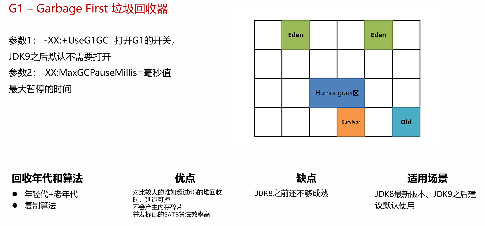


Shenandoah 是由Red Hat开发的一款低延迟的垃圾收集器，Shenandoah 并发执行大部分 GC 工作，包括并发的整理，堆大小对STW的时间基本没有影响。


ZGC 是一种可扩展的低延迟垃圾回收器。ZGC 在垃圾回收过程中，STW的时间不会超过一毫秒，适合需要低延迟的应用。支持几百兆到16TB 的堆大小，堆大小对STW的时间基本没有影响。


如何选择垃圾回收器，请跳转至”基础篇“【垃圾回收器】小节


### 如何解决内存泄漏问题

回答路径：

- [x] 内存溢出和内存泄漏

- [x] 解决内存泄漏问题的思路

- [x] 常用的工具
  
  

- **内存泄漏**（memory leak）：在Java中如果不再使用一个对象，但是该对象依然在GC ROOT的引用链上，这个对象就不会被垃圾回收器回收，这种情况就称之为内存泄漏。

- 少量的内存泄漏可以容忍，但是如果发生**持续的内存泄漏**，就像滚雪球雪球越滚越大，不管有多大的内存迟早会被消耗完，最终导致的结果就是**内存溢出**。


> 生产环境通过运维提供的Prometheus + Grafana 等监控平台查看
> 
> 开发、测试环境通过visualvm查看


<font color=red>诊断–生成内存快照</font>

当堆内存溢出时，需要在堆内存溢出时将整个堆内存保存下来，生成内存快照(Heap Profile)文件。生成方式有两种

1. 内存溢出时自动生成，添加生成内存快照的Java虚拟机参数：`-XX:+HeapDumpOnOutOfMemoryError`：发生OutOfMemoryError错误时，自动生成hprof内存快照文件。`-XX:HeapDumpPath=<path>`：指定hprof文件的输出路径。

2. 导出运行中系统的内存快照，比较简单的方式有两种，注意只需要导出标记为存活的对象：
   通过JDK自带的jmap命令导出，格式为：`jmap-dump:live,format=b,file=文件路径和文件名 进程ID`
   通过arthas的heapdump命令导出，格式为：`heapdump--live 文件路径和文件名`
   
   

<font color=red>诊断–MAT定位问题</font>

使用MAT打开hprof文件，并选择内存泄漏检测功能，MAT会自行根据内存快照中保存的数据分析内存泄漏的根源。


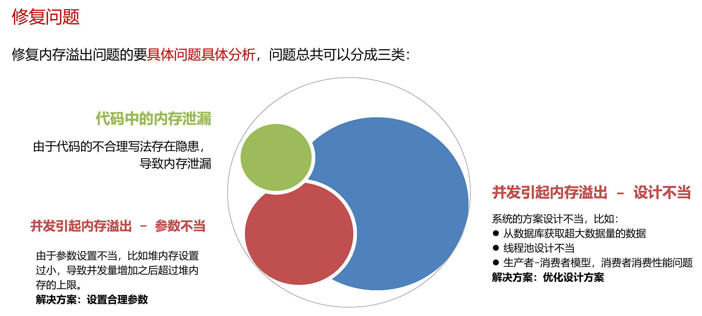


### 常见的JVM参数

回答路径：

- [x] 最大堆内存参数

- [x] 最大栈内存参数

- [x] 最大元空间内存参数

- [x] 日志参数

- [x] 堆内存快照参数

- [ ] 垃圾回收器参数

- [ ] 垃圾回收器调优参数
  
  

- 参数1 ： `-Xmx` 和 `–Xms`    最大、最小堆内存
  <font color=red>最合理的设置方式应该是根据最大并发量估算服务器的配置，然后再根据服务器配置计算最大堆内存的值。</font>
  建议将-Xms设置的和-Xmx一样大,运行过程中不再产生扩容的开销。
  
  

- 参数2 ： `-XX:MaxMetaspaceSize` 和 `-Xss`    最大元空间大小、栈大小
  -XX:MaxMetaspaceSize=值 参数指的是最大元空间大小，默认值比较大，如果出现元空间内存泄漏会让操作系统可用内存不可控，建议根据测试情况设置最大值，一般设置为256m。
  -Xss256k 栈内存大小，如果我们不指定栈的大小，JVM 将创建一个具有默认大小的栈。大小取决于操作系统和计算机的体系结构。比如Linux x86 64位 ： 1MB，如果不需要用到这么大的栈内存，完全可以将此值调小节省内存空间，合理值为256k – 1m之间。
  
  

- 参数3：    `-Xmn`    年轻代的大小
  默认值为整个堆的1/3，可以根据峰值流量计算最大的年轻代大小，尽量让对象只存放在年轻代，不进入老年代。但是实际的场景中，接口的响应时间、创建对象的大小、程序内部还会有一些定时任务等不确定因素都会导致这个值的大小并不能仅凭计算得出，如果设置该值要进行大量的测试。
  <font color=red>G1垃圾回收器尽量不要设置该值，G1会动态调整年轻代的大小。</font>
  
  

- 打印GC日志
  JDK8及之前 ： `-XX:+PrintGCDetails` `-XX:+PrintGCDateStamps-Xloggc:文件路径`
  JDK9及之后 ： `-Xlog:gc*:file=文件路径`
  
  

- `-XX:+DisableExplicitGC`禁止在代码中使用System.gc()， System.gc()可能会引起FULLGC，在代码中尽量不要使用。使用DisableExplicitGC参数可以禁止使用System.gc()方法调用。
  
  

- `-XX:+HeapDumpOnOutOfMemoryError`：发生OutOfMemoryError错误时，自动生成hprof内存快照文件。`-XX:HeapDumpPath=<path>`指定hprof文件的输出路径。
  
  

JVM参数模板

```powershell
-Xms1g
-Xmx1g
-Xss256k
-XX:MaxMetaspaceSize=512m 
-XX:+DisableExplicitGC
-XX:+HeapDumpOnOutOfMemoryError
-XX:HeapDumpPath=/opt/logs/my-service.hprof
-XX:+PrintGCDetails
-XX:+PrintGCDateStamps
-Xloggc:文件路径
```

> 注意：JDK9及之后gc日志输出修改为 -Xlog:gc*:file=文件名
> 
> 堆内存大小和栈内存大小根据实际情况灵活调整。


## 已完结
