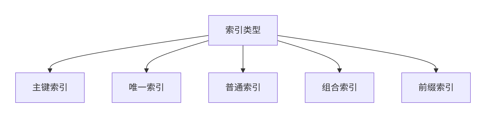
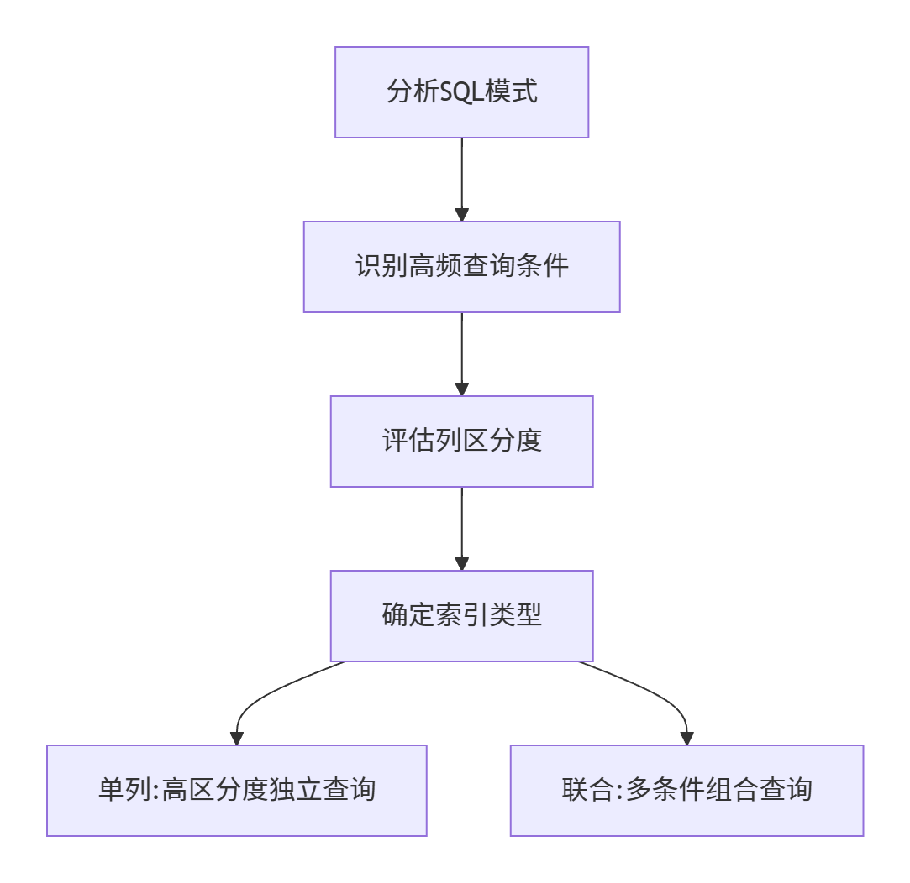
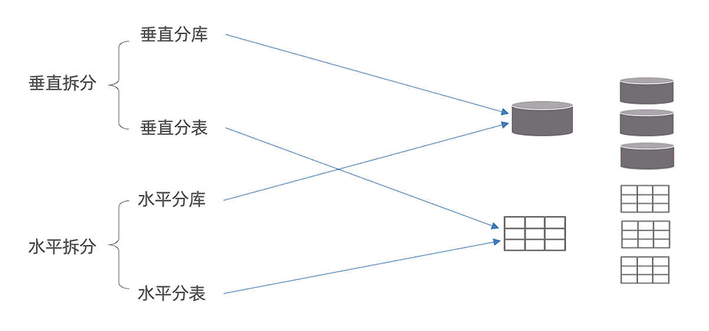
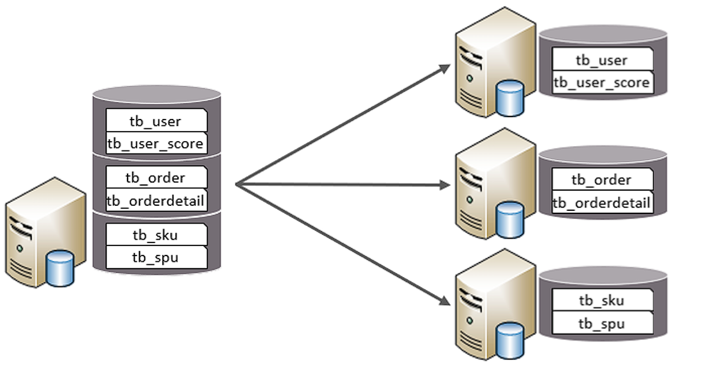
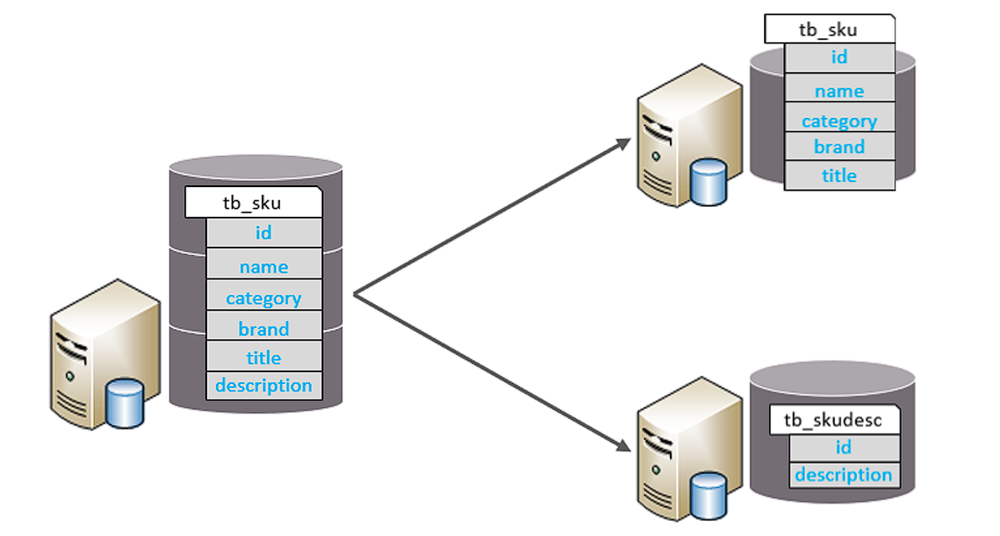
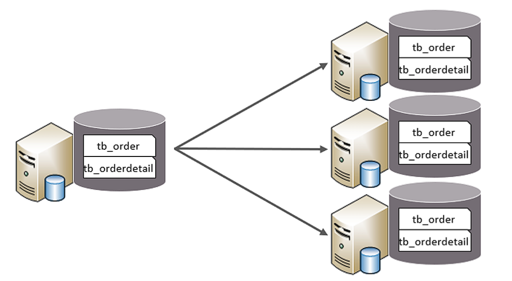
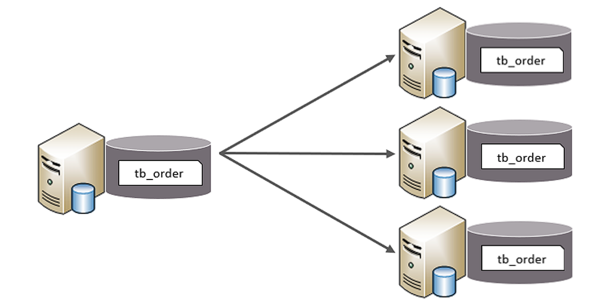
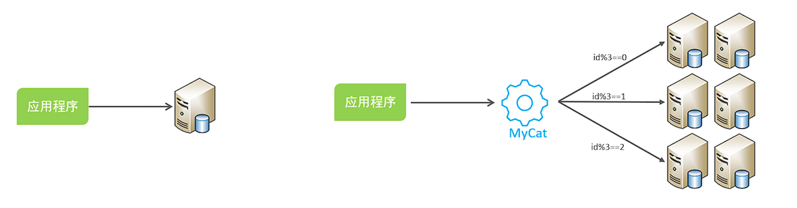
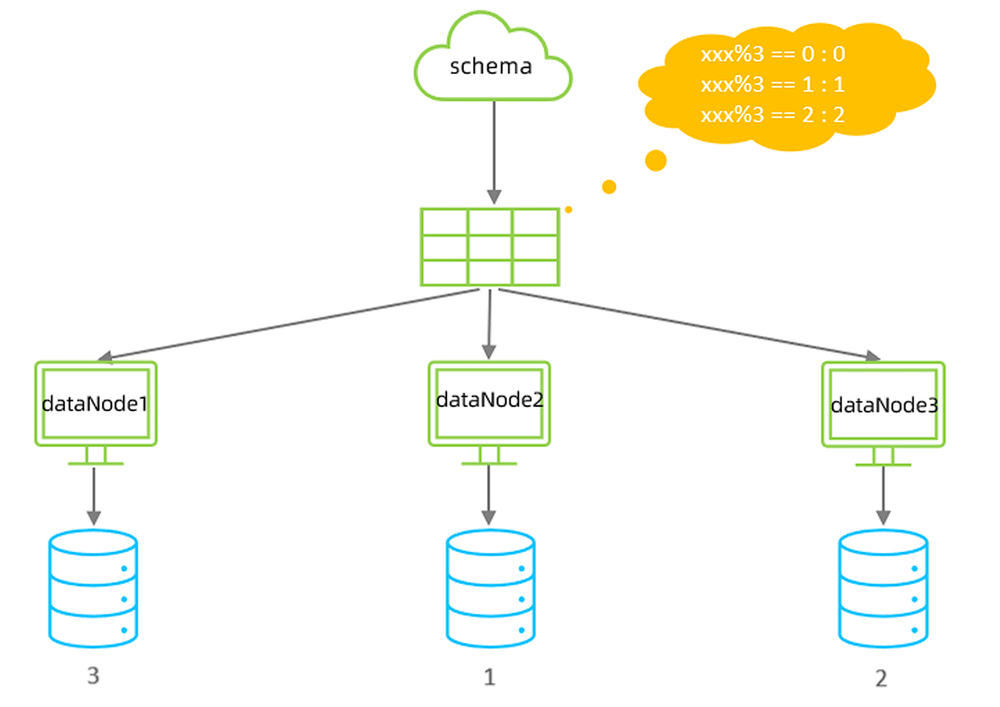

# 基础

## 数据查询(DQL)

```sql
SELECT
	字段列表
FROM
	表名列表
WHERE
	条件列表
GROUP BY
	分组字段
HAVING
	分组后条件
ORDER BY
	排序字段
LIMIT
	分页限定
```


### 基础查询

1. 查询多个字段

   ```sql
   SELECT 字段列表 FROM 表名;
   SELECT * FROM 表名; -- 查询所有数据
   ```

2. 去除重复记录

   ```sql
   SELECT DISTINCT 字段列表 FROM 表名;
   ```

3. 给字段或表起别名

   ```sql
   AS -- 也可省略
   ```


### 条件查询

基本语法

```sql
SELECT 字段列表 FROM 表名 WHERE 条件列表;
```


常见逻辑条件

|       符号       |                    说明                    |
| :--------------: | :----------------------------------------: |
|        >         |                    大于                    |
|        <         |                    小于                    |
|        >=        |                  大于等于                  |
|        <=        |                  小于等于                  |
|        =         |                    等于                    |
|      <>或!=      |                   不等于                   |
| BETWEEN...AND... |          在某个范围内（包含端点）          |
|     IN(...)      |                   多选一                   |
|   LIKE 占位符    | 模糊查询，'_'匹配单个字符，'%'匹配多个字符 |
|     IS NULL      |                   是NULL                   |
|   IS NOT NULL    |                  不是NULL                  |
|    AND 或 &&     |                    并且                    |
|    OR 或 \|\|    |                    或者                    |
|     NOT 或 !     |                  非，不是                  |


**模糊查询示例**：

```sql
-- 查询姓“马”的人
select * from tb where name like '马%';

-- 查询名字第二个字是“马”的人
select * from tb where name like '_马%';

-- 查询名字中包含“马”字的人
select * from tb where name like '%马%'
```


### 聚合函数

**概念**：将一列数据作为一个整体，进行纵向计算。


聚合函数分类：

| 函数名      | 说明                             |
| ----------- | -------------------------------- |
| count(列名) | 统计数量（一般不包括为NULL的列） |
| max(列名)   | 最大值                           |
| min(列名)   | 最小值                           |
| sum(列名)   | 求和                             |
| avg(列名)   | 平均值                           |


**聚合函数语法**：

```sql
SELECT 聚合函数名(列名) FROM 表名;
```

> NULL值不参与所有聚合函数运算


### 排序查询

语法：

```sql
SELECT 字段列表 FROM 表名 ORDER BY 排序字段一[排序方式],排序字段二[排序方式],...;
```

排序方式：

- ASC：升序排序（默认值）
- DESC：降序排序

> [!Caution]
>
> 注意：如果有多个排序条件，当第一个排序字段相同时，才会按第二个排序字段进行排序


### 分组查询

语法：

```sql
SELECT 字段列表 FROM 表名 [WHERE 分组前条件] GROUP BY 分组字段名 [HAVING 分组后条件];
```

> [!caution]
>
> 注意：分组后，查询的字段只能为聚合函数和用于分组的字段，查询其他字段无意义。


where和having的区别：

- 执行时机不一样：where是分组之前执行，不满足where条件则不参与分组，而having是对分组后的结果进行过滤。
- 可判断的条件不一样：where不能对聚合函数进行判断，而having可以。

执行顺序：<font color=red>where>聚合函数>having</font>


示例：

```sql
-- 查询男生和女生各自的数学平均分
select sex, avg(math) from tb group by sex;

-- 查询男生和女生各自的数学平均分，以及各自人数（分数低于70的不参与分组）
select sex, avg(math), count(*) from tb where math >= 70 group by sex;
```


### 分页查询

语法

```sql
SELECT 字段列表 FROM 表名 LIMIT 起始索引, 查询条目;
```

> [!Note]
>
> 起始索引从0开始
>
> 计算方式：起始索引 = (当前页码 - 1) * 每页显示的条目数


tips:

- 分页查询`limit`是 **MySQL** 数据库的方言
- **Oracle** 数据库分页查询使用`rownumber`
- **SQL Server** 分页查询使用`top`


示例：

```sql
-- 查询第一页数据，每页显示3条数据
select * from tb limit 0, 3;

-- 查询第二页数据，每页显示3条数据
select * from tb limit 3, 3;
```


### 多表查询

- 笛卡尔积：取集合A，B的元素的所有组合
- 多表查询：从多张表查询数据
  - 连接查询
    - 内连接：查询A，B交集数据
    - 外连接：
      - 左外连接：查询A的所有数据和A，B交集数据
      - 右外连接：查询B的所有数据和A，B交集数据
    - 自连接：与自身连接查询，必须使用别名
  - 子查询


#### 内连接

语法：

```sql
-- 隐式内连接
SELECT 字段列表 FROM 表1,表2,表3,... WHERE 条件;

-- 显示内连接
SELECT 字段列表 FROM 表1 [INNER] JOIN 表2 ON 条件;
```


示例：

```sql
-- 查询emp表的name,gender,dept表的dname
select 
	emp.name,emp.gender,dept.dname 
from 
	emp,dept 
where 
	emp.dep_id = dept.did;
	
-- 显示内连接
select
	*
from
	emp
inner join
	dept
on
	emp.dep_id = dept.did
```


#### 外连接

语法：

```sql
-- 左外连接
SELECT 字段列表 FROM 表1 LEFT [OUTER] JOIN 表2 ON 条件;

-- 右外连接
SELECT 字段列表 FROM 表1 RIGHT [OUTER] JOIN 表2 ON 条件;
```


示例：

```sql
-- 查询emp表的所有数据和对应部门信息
select * from emp left outer join dept on emp.dep_id = dept.did;

-- 查询dept表的所有数据和对应员工信息
select * from emp right outer join dept on emp.dep_id = dept.did;
```


#### 自连接

> [!Tip]
>
> 把同一张表看成两张表，与其他多表查询语法相同，只不过必须使用别名

```sql
SELECT 字段列表 FROM 表A 别名1 JOIN 表A 别名2 ON 条件（使用别名）
```


#### 集合操作

|      操作类型      |                语法                 |                             描述                             |               条件限制                |                             示例                             |
| :----------------: | :---------------------------------: | :----------------------------------------------------------: | :-----------------------------------: | :----------------------------------------------------------: |
|     **UNION**      | `SELECT ... UNION [ALL] SELECT ...` |     合并两个查询结果（**去重**），`UNION ALL`保留重复行      | 1. 列数必须相同 2. 对应列数据类型兼容 |    `sql<br>SELECT 'A' UNION SELECT 'B';<br>→ A<br>B<br>`     |
|   **INTERSECT**    |  `SELECT ... INTERSECT SELECT ...`  |           返回两个查询的**交集**（MySQL 8.0+支持）           |               同`UNION`               | `sql<br>SELECT id FROM table1<br>INTERSECT<br>SELECT id FROM table2;<br>` |
| **EXCEPT** (MINUS) |   `SELECT ... EXCEPT SELECT ...`    | 返回第一个查询有但第二个查询**没有**的结果（MySQL 8.0+支持） |               同`UNION`               | `sql<br>SELECT id FROM table1<br>EXCEPT<br>SELECT id FROM table2;<br>` |
|       **IN**       |     `WHERE col IN (SELECT ...)`     |                  判断值是否在子查询结果集中                  |          子查询必须返回单列           |  `sql<br>SELECT * FROM users<br>WHERE id IN (1, 3, 5);<br>`  |
|     **NOT IN**     |   `WHERE col NOT IN (SELECT ...)`   |               判断值是否**不在**子查询结果集中               |                                       |                                                              |


### 子查询

概念：查询中嵌套查询


子查询根据查询结果不同，作用不同：

- 单行单列：作为条件值，使用=、!=、>、 <进行判断

  ```sql
  SELECT 字段列表 FROM 表名 WHERE 字段名 = (子查询);
  ```

- 多行单列：作为条件值，使用 in 等关键字进行条件判断

  ```sql
  SELECT 字段列表 FROM 表名 WHERE 字段名 in (子查询);
  ```

- 多行多列：作为虚拟表

  ```sql
  SELECT 字段列表 FROM (子查询) WHERE 条件;
  ```


|         操作符         |           语法示例           |                             描述                             |         等价形式（使用聚合函数）         |                             示例                             |
| :--------------------: | :--------------------------: | :----------------------------------------------------------: | :--------------------------------------: | :----------------------------------------------------------: |
|       **`ALL`**        | `WHERE col > ALL (subquery)` | 必须满足 **所有** 子查询结果的条件（比子查询所有值都大/小等） | `WHERE col > (SELECT MAX(...) FROM ...)` | `sql<br>SELECT * FROM products<br>WHERE price > ALL (SELECT price FROM discounts);<br>` |
| **`ANY`** / **`SOME`** | `WHERE col > ANY (subquery)` | 满足 **任一** 子查询结果的条件（比子查询至少一个值大/小等）  | `WHERE col > (SELECT MIN(...) FROM ...)` | `sql<br>SELECT * FROM employees<br>WHERE salary > ANY (5000, 8000, 10000);<br>` |


```sql
-- salary和dept_id都与id=1的相同数据
select * 
from emp 
where (salary, dept_id) = (select salary, dept_id from emp where id = 1)

-- “=” 替换为 “in” 表示多个
select * 
from emp 
where (salary, dept_id) in (select salary, dept_id from emp where id = 1 or id = 2)
```


示例：

```sql
-- 查询猪八戒的工资
select salary from emp where name = '猪八戒';

-- 查询工资高于猪八戒的员工信息
select * from emp where salary > (select salary from emp where name = '猪八戒');


-- 查询财务部和市场部的所有员工信息
select * from emp where dep_id in (select did from dept where dname = '财务部' or dname = '市场部');

-- 查询入职日期是2011-11-11之后的员工信息和部门信息
select * from (select * from emp where join_date > '2011-11-11') as t1 ,dept
where dept.did = t1.dept_id;
```


## 数据操作(DML)

插入数据

```sql
INSERT INTO 表名(字段1,字段2,...)
VALUE(值1,值2,...),(值3,值4,...),...
```


修改数据

```sql
UPDATE 表名 SET 字段1=值1,字段2=值2,... [WHERE 条件];
```

> 不加条件则**修改所有数据**


删除数据

```sql
DELETE FROM 表名 [WHERE 条件];
```

> 不添加条件则**删除所有数据**


## 数据类型


> [!Tip]
>
> unsigned可以指定数值类型无符号


类型选择示例：

```sql
create table emp(
	id int comment '编号',
    no varchar(10) comment '工号',
    name vahchar(10) comment '姓名',
    gender char(1) comment '性别',
    age tinyint unsigned comment '年龄',
    idcard char(18) comment '身份证号',
    entrydate date comment '入职时间'
) comment '员工表';
```


## 数据定义(DDL)

### 表的相关操作

创建表

```sql
CREATE TABLE tb_user(
	id INT,
    username VARCHAR(20),
    password VARCHAR(20)
);
```


删除表

```sql
drop table tb_user;
```


查询所有表

```sql
show tables;
```


修改表

1. 修改表名

   ```sql
   ALTER TABLE 表名 RENAME TO 新表名;
   ```

2. 添加一列

   ```sql
   ALTER TABLE 表名 ADD 列名 数据类型;
   ```

3. 修改数据类型

   ```sql
   ALTER TABLE 表名 MODIFY 列名 新数据类型;
   ```

4. 修改列名和数据类型

   ```sql
   ALTER TABLE 表名 CHANGE 列名 新列名 新数据类型;
   ```

5. 删除列

   ```sql
   ALTER TABLE 表名 DROP 列名;
   ```

   

### 数据库相关操作

创建数据库

```sql
CREATE DATABASE 数据库名;
```


删除数据库

```sql
DROP DATABASE 数据库名;
```


查询数据库

```sql
show databases;
```


使用数据库

```sql
use 数据库名;
```


## 数据控制语言(DCL)

> [!Tip]
>
> 仅针对MySQL语法

### 用户管理

```sql
# 查询用户
USE mysql;
SELECT * FROM user;

# 新增用户
CREATE USER '用户名'@'主机名' IDENTIFIED BY '密码'

# 修改用户密码
ALTER USER '用户名'@'主机名' IDENTIFIED WITH mysql_native_password BY '新密码'

# 删除用户
DROP USER '用户名'@'主机名'
```

> [!Tip]
>
> 主机名指定为` '%' `表示任意主机


### 权限控制

---

|        权限        |        说明        |
| :----------------: | :----------------: |
| ALL,ALL PRIVILEGES |      所有权限      |
|       SELECT       |      查询数据      |
|       INSERT       |      插入数据      |
|       UPDATE       |      修改数据      |
|       DELETE       |      删除数据      |
|       ALTER        |       修改表       |
|        DROP        | 删除数据库/表/视图 |
|       CREATE       |   创建数据库/表    |

---

```sql
# 查询权限
SHOW GRANTS FOR '用户名'@'主机名'

# 授予权限
GRANT 权限列表 ON 数据库名.表名 TO '用户名'@'主机名'

# 撤销权限
REVOKE 权限列表 ON 数据库名.表名 FROM '用户名'@'主机名'
```

> [!Tip]
>
> - 多个权限之间用英文逗号分割
> - 数据库名和表名可用 * 通配


## 函数

### 字符串函数

|            函数名            |             语法示例              |                        描述                         |                  示例结果                  |
| :--------------------------: | :-------------------------------: | :-------------------------------------------------: | :----------------------------------------: |
|          `CONCAT()`          |       `CONCAT(str1, str2)`        |                   合并多个字符串                    |      `CONCAT('My', 'SQL') → 'MySQL'`       |
|        `CONCAT_WS()`         |   `CONCAT_WS(sep, str1, str2)`    |               用指定分隔符合并字符串                | `CONCAT_WS('-', '2023', '01') → '2023-01'` |
|  `SUBSTRING()` / `SUBSTR()`  |  `SUBSTRING(str, start, length)`  |              截取字符串（从1开始计数）              |     `SUBSTRING('MySQL', 3, 2) → 'SQ'`      |
|           `LEFT()`           |        `LEFT(str, length)`        |              从左侧截取指定长度字符串               |         `LEFT('MySQL', 2) → 'My'`          |
|          `RIGHT()`           |       `RIGHT(str, length)`        |              从右侧截取指定长度字符串               |        `RIGHT('MySQL', 3) → 'SQL'`         |
| `LENGTH()` / `CHAR_LENGTH()` |           `LENGTH(str)`           | 返回字节长度（`LENGTH`）或字符长度（`CHAR_LENGTH`） |        `LENGTH('中国') → 6` (utf8)         |
|           `TRIM()`           | `TRIM([方向] [remstr] FROM str)`  | 去除两端空格/指定字符（`LTRIM`/`RTRIM`仅处理左/右） |        `TRIM(' MySQL ') → 'MySQL'`         |
|         `REPLACE()`          | `REPLACE(str, from_str, to_str)`  |                 替换字符串中的内容                  |  `REPLACE('MxxSQL', 'xx', 'y') → 'MySQL'`  |
|    `UPPER()` / `LOWER()`     |           `UPPER(str)`            |                   转换为大写/小写                   |         `UPPER('mysql') → 'MYSQL'`         |
|          `LOCATE()`          |       `LOCATE(substr, str)`       |          返回子串首次出现的位置（从1开始）          |        `LOCATE('SQL', 'MySQL') → 3`        |
|          `INSTR()`           |       `INSTR(str, substr)`        |             类似`LOCATE`但参数顺序相反              |        `INSTR('MySQL', 'SQL') → 3`         |
|     `LPAD()` / `RPAD()`      |     `LPAD(str, len, padstr)`      |            用指定字符左/右填充到指定长度            |        `LPAD('5', 3, '0') → '005'`         |
|          `REPEAT()`          |       `REPEAT(str, count)`        |                 重复字符串指定次数                  |          `REPEAT('X', 3) → 'XXX'`          |
|         `REVERSE()`          |          `REVERSE(str)`           |                     反转字符串                      |          `REVERSE('ABC') → 'CBA'`          |
|          `FORMAT()`          |   `FORMAT(num, decimal_places)`   |           数字格式化（千位分隔符+小数位）           |     `FORMAT(1234.567, 2) → '1,234.57'`     |
|       `GROUP_CONCAT()`       | `GROUP_CONCAT(col SEPARATOR sep)` |      分组后合并多行字符串（需配合`GROUP BY`）       |            合并多行值用逗号分隔            |


### 数值函数

|         函数名         |         语法示例          |                 描述                  |           示例结果           |
| :--------------------: | :-----------------------: | :-----------------------------------: | :--------------------------: |
|      **基础计算**      |                           |                                       |                              |
|        `ABS()`         |        `ABS(num)`         |              返回绝对值               |        `ABS(-5) → 5`         |
|        `MOD()`         | `MOD(dividend, divisor)`  |      取模运算（等价于`%`运算符）      |       `MOD(10, 3) → 1`       |
|  `POWER()` / `POW()`   |  `POWER(base, exponent)`  |                幂运算                 |      `POWER(2, 3) → 8`       |
|        `SQRT()`        |        `SQRT(num)`        |                平方根                 |        `SQRT(9) → 3`         |
|      **舍入处理**      |                           |                                       |                              |
|       `ROUND()`        | `ROUND(num [, decimals])` |       四舍五入（可指定小数位）        |  `ROUND(3.1415, 2) → 3.14`   |
| `CEIL()` / `CEILING()` |        `CEIL(num)`        |               向上取整                |       `CEIL(3.2) → 4`        |
|       `FLOOR()`        |       `FLOOR(num)`        |               向下取整                |       `FLOOR(3.9) → 3`       |
|      `TRUNCATE()`      | `TRUNCATE(num, decimals)` |     直接截断小数位（非四舍五入）      | `TRUNCATE(3.1415, 2) → 3.14` |
|     **符号与随机**     |                           |                                       |                              |
|        `SIGN()`        |        `SIGN(num)`        |          返回符号（-1/0/1）           |       `SIGN(-10) → -1`       |
|        `RAND()`        |      `RAND([seed])`       |   生成0~1之间的随机数（可指定种子）   |     `RAND() → 0.1234...`     |
|   **对数与三角函数**   |                           |                                       |                              |
|  `LOG()` / `LOG10()`   |     `LOG(base, num)`      |     对数运算（`LOG10`为以10为底）     |       `LOG(2, 8) → 3`        |
|   `SIN()` / `COS()`    |      `SIN(radians)`       |       三角函数（参数为弧度值）        |      `SIN(PI()/2) → 1`       |
|     **常量与转换**     |                           |                                       |                              |
|         `PI()`         |          `PI()`           |            返回圆周率π的值            |      `PI() → 3.141593`       |
|      `RADIANS()`       |    `RADIANS(degrees)`     |              角度转弧度               |  `RADIANS(180) → 3.141593`   |
|      `DEGREES()`       |    `DEGREES(radians)`     |              弧度转角度               |    `DEGREES(PI()) → 180`     |
|   `BIN()` / `HEX()`    |        `BIN(num)`         | 十进制转二进制/十六进制（返回字符串） |      `BIN(10) → '1010'`      |


### 日期函数

|          函数名          |               语法示例               |                             描述                             |                          示例结果                           |
| :----------------------: | :----------------------------------: | :----------------------------------------------------------: | :---------------------------------------------------------: |
|       **当前时间**       |                                      |                                                              |                                                             |
|         `NOW()`          |               `NOW()`                |      返回当前日期和时间（格式：`YYYY-MM-DD HH:MM:SS`）       |                    `2024-07-25 14:30:00`                    |
|       `CURDATE()`        |             `CURDATE()`              |              返回当前日期（格式：`YYYY-MM-DD`）              |                        `2024-07-25`                         |
|       `CURTIME()`        |             `CURTIME()`              |               返回当前时间（格式：`HH:MM:SS`）               |                         `14:30:00`                          |
|       **日期提取**       |                                      |                                                              |                                                             |
|         `YEAR()`         |             `YEAR(date)`             |                      提取年份（4位数）                       |                 `YEAR('2024-07-25') → 2024`                 |
|        `MONTH()`         |            `MONTH(date)`             |                       提取月份（1-12）                       |                  `MONTH('2024-07-25') → 7`                  |
| `DAY()` / `DAYOFMONTH()` |             `DAY(date)`              |                   提取日期中的天数（1-31）                   |                  `DAY('2024-07-25') → 25`                   |
|         `HOUR()`         |             `HOUR(time)`             |                       提取小时（0-23）                       |                   `HOUR('14:30:00') → 14`                   |
|        `MINUTE()`        |            `MINUTE(time)`            |                       提取分钟（0-59）                       |                  `MINUTE('14:30:00') → 30`                  |
|        `SECOND()`        |            `SECOND(time)`            |                       提取秒数（0-59）                       |                  `SECOND('14:30:15') → 15`                  |
|      `DAYOFWEEK()`       |          `DAYOFWEEK(date)`           |           返回星期几（1=周日，2=周一，...7=周六）            |            `DAYOFWEEK('2024-07-25') → 5`（周四）            |
|       **日期计算**       |                                      |                                                              |                                                             |
|       `DATE_ADD()`       | `DATE_ADD(date, INTERVAL expr unit)` |             日期加法（单位：DAY, MONTH, YEAR等）             |   `DATE_ADD('2024-07-25', INTERVAL 1 MONTH) → 2024-08-25`   |
|       `DATE_SUB()`       | `DATE_SUB(date, INTERVAL expr unit)` |                           日期减法                           |    `DATE_SUB('2024-07-25', INTERVAL 7 DAY) → 2024-07-18`    |
|       `DATEDIFF()`       |       `DATEDIFF(date1, date2)`       |           计算两个日期相差的天数（date1 - date2）            |         `DATEDIFF('2024-07-25', '2024-07-20') → 5`          |
|    `TIMESTAMPDIFF()`     |  `TIMESTAMPDIFF(unit, start, end)`   |            计算时间差（单位：DAY, MONTH, YEAR等）            |   `TIMESTAMPDIFF(MONTH, '2024-01-01', '2024-07-25') → 6`    |
|      **日期格式化**      |                                      |                                                              |                                                             |
|     `DATE_FORMAT()`      |     `DATE_FORMAT(date, format)`      | 格式化日期（常用占位符：`%Y`-年，`%m`-月，`%d`-日，`%H`-小时，`%i`-分钟） |       `DATE_FORMAT(NOW(), '%Y/%m/%d') → '2024/07/25'`       |
|     `STR_TO_DATE()`      |      `STR_TO_DATE(str, format)`      |                  字符串转日期（需匹配格式）                  |    `STR_TO_DATE('25,07,2024', '%d,%m,%Y') → 2024-07-25`     |
|     **其他实用函数**     |                                      |                                                              |                                                             |
|       `LAST_DAY()`       |           `LAST_DAY(date)`           |                      返回月份的最后一天                      |        `LAST_DAY('2024-02-15') → 2024-02-29`（闰年）        |
|      `TIMESTAMP()`       |       `TIMESTAMP(date, time)`        |                        合并日期和时间                        | `TIMESTAMP('2024-07-25', '14:30:00') → 2024-07-25 14:30:00` |


### 流程函数

|      函数名      |            语法示例             |                       描述                        |               示例结果                |
| :--------------: | :-----------------------------: | :-----------------------------------------------: | :-----------------------------------: |
|   **条件判断**   |                                 |                                                   |                                       |
|      `IF()`      | `IF(expr, true_val, false_val)` | 如果表达式为真返回`true_val`，否则返回`false_val` |    `IF(1>0, 'Yes', 'No') → 'Yes'`     |
|    `IFNULL()`    |    `IFNULL(expr, fallback)`     | 如果`expr`为NULL则返回`fallback`，否则返回`expr`  | `IFNULL(NULL, 'Unknown') → 'Unknown'` |
|    `NULLIF()`    |     `NULLIF(expr1, expr2)`      |   如果`expr1 = expr2`返回NULL，否则返回`expr1`    |         `NULLIF(3, 3) → NULL`         |
|  **多分支选择**  |                                 |                                                   |                                       |
|   `CASE WHEN`    |             ```sql              |   多条件分支选择（类似编程语言的`switch-case`）   |                ```sql                 |
|                  |              CASE               |                                                   |                 CASE                  |
|                  |  WHEN condition1 THEN result1   |                                                   |       WHEN score >= 90 THEN 'A'       |
|                  |  WHEN condition2 THEN result2   |                                                   |       WHEN score >= 60 THEN 'B'       |
|                  |       ELSE default_result       |                                                   |               ELSE 'C'                |
|                  |               END               |                                                   |         END → 'B' (score=75)          |
|                  |               ```               |                                                   |                  ```                  |
| **复杂逻辑处理** |                                 |                                                   |                                       |
|   `COALESCE()`   |  `COALESCE(expr1, expr2, ...)`  |    返回第一个非NULL的参数（常用于NULL值兜底）     |   `COALESCE(NULL, NULL, 'A') → 'A'`   |
|   `GREATEST()`   |   `GREATEST(val1, val2, ...)`   |              返回参数列表中的最大值               |        `GREATEST(3, 5, 1) → 5`        |
|    `LEAST()`     |    `LEAST(val1, val2, ...)`     |              返回参数列表中的最小值               |         `LEAST(3, 5, 1) → 1`          |


## 数据库设计

软件研发步骤


数据库设计概念

- 数据库设计就是根据业务系统的具体需求，结合选择的DBMS，为业务系统构造出最优的数据存储模型。
- 建立数据库中的**表结构**以及**表与表之间的关联关系**的过程。


数据库设计的步骤

1. 需求分析（有什么数据？数据的属性？数据和属性的特点？）
2. 逻辑分析（E-R图进行逻辑建模）
3. 物理设计（根据所选的DBMS把逻辑模型转换为物理模型）
4. 维护设计（新需求，优化表结构）


## 约束

约束的概念

- 约束是作用于表中列上的规则，用于限制加入表中的数据
- 约束的存在保证了数据库中数据的正确性、有效性和完整性


约束的分类：

| 约束名   | 说明                                       | 关键字      |
| -------- | ------------------------------------------ | ----------- |
| 非空约束 | 保证列中数据不能为NULL                     | NOT NULL    |
| 唯一约束 | 保证列中所有数据个不相同                   | UNIQUE      |
| 主键约束 | 主键是一行数据的唯一标识，要求非空且唯一   | PRIMARY KEY |
| 检查约束 | 保证列中的数据满足某一条件                 | CHECK       |
| 默认约束 | 插入数据时，未指定值则使用默认数据         | DEFAULT     |
| 外键约束 | 让两张表建立关系，保证数据的一致性和完整性 | FOREIGN KEY |

> [!Warning]
>
> MySQL8.0.16之前的版本不支持检查约束


示例

```sql
CREATE TABLE emp(
	id INT PRIMARY KEY,	-- id作主键，唯一标识
    ename VARCHAR(50) NOT NULL UNIQUE,	-- 姓名不为空且唯一
    join_date DATE NOT NULL,	-- 入职日期不为空
    salary DOUBLE(7,2) NOT NULL,	-- 工资非空
    bonus DOUBLES(7,2) DEFAULT 0	-- 奖金默认为0
)
```


**外键约束**

添加约束

```sql
-- 创建表时添加外键约束
CREATE TABLE 表名(
	列名 数据类型,
    ...
    [CONSTRAINT] [外键名] FOREIGN KEY(列名) REFERENCES 主表(主表列名)
);


-- 创建表后添加外键约束
ALTER TABLE 表名 ADD CONSTRAINT 外键名 FOREIGN KEY (列名) REFERENCES 主表(主表列名);
```


删除约束

```sql
ALTER TABLE 表名 DROP FOREIGN KEY 外键名;
```


**外键约束的删除/更新行为**

|       行为类型        |        语法示例         |        触发时机         |   对主表（父表）操作的影响   |                     对从表（子表）的影响                     |
| :-------------------: | :---------------------: | :---------------------: | :--------------------------: | :----------------------------------------------------------: |
| **`RESTRICT`** (默认) |  `ON DELETE RESTRICT`   | 尝试删除/更新主表记录时 |     **拒绝操作**（报错）     |               子表若存在关联记录，阻止主表操作               |
|     **`CASCADE`**     |   `ON UPDATE CASCADE`   |  主表记录被更新/删除时  |           执行操作           | **级联操作**： • 主表删除→子表关联记录自动删除 • 主表更新→子表外键值同步更新 |
|    **`SET NULL`**     |  `ON DELETE SET NULL`   |    主表记录被删除时     |           执行操作           |            子表外键字段自动设为NULL（需允许NULL）            |
|    **`NO ACTION`**    |  `ON UPDATE NO ACTION`  |     事务提交时检查      | 类似`RESTRICT`（但延迟检查） |               若子表有关联记录，事务提交时报错               |
|   **`SET DEFAULT`**   | `ON DELETE SET DEFAULT` |    主表记录被删除时     |           执行操作           |                                                              |


## 表之间的关系

- 一对一
  - 例：用户和用户详情
  - 一对一关系多用于表拆分，将一个实体中经常使用的字段放在一张表，不常使用的放另一张表，可提升查询性能
- 一对多
  - 例：部门和员工
  - 一个部门对应多个员工，一个员工对应一个部门
- 多对多
  - 例：商品和订单
  - 一个商品对应多个订单，一个订单对应多个商品


> 实现一对一关系只需要在另一张表中建立外键约束关联主表的主键，并且设置**外键唯一(`UNIQUE`)约束**
>
> 一对多基本同一对一，在多的一方建立外键，只是外键**不需要唯一约束**
>
> 实现多对多关系需要建立一张中间表，且应包含两个外键，分别关联两张多对多关系表的主键


## 事务

**事务**是一组操作的集合，它是一个不可分割的工作单位，事务会把所有操作作为一个整体向系统提交或撤销，<font color=red>这些操作要么同时成功，要么同时失败</font>

> [!Tip]
>
> MySQL事务默认会自动提交，除非手动开启一个事务
>
> 可通过 `set @@autocommit = 0` 设置为手动提交


```sql
-- 开启事务
begin 或者 start transaction

-- 提交事务
commit

-- 回滚事务
rollback
```


**事务四大特性（ACID）**

| 特性                     | 描述                                                         | 重要性           |
| :----------------------- | :----------------------------------------------------------- | :--------------- |
| **A**tomicity (原子性)   | 事务是不可分割的工作单位，要么全部执行成功，要么全部失败回滚 | 确保事务的完整性 |
| **C**onsistency (一致性) | 事务执行前后，数据库从一个一致状态转变为另一个一致状态       | 保证数据有效性   |
| **I**solation (隔离性)   | 多个事务并发执行时，一个事务的执行不应影响其他事务           | 控制并发访问     |
| **D**urability (持久性)  | 事务一旦提交，其结果就是永久性的                             | 确保数据安全     |


**并发事务问题**

|              问题类型               |                描述                |                           示例场景                           |                MySQL默认隔离级别是否解决                |
| :---------------------------------: | :--------------------------------: | :----------------------------------------------------------: | :-----------------------------------------------------: |
|        **脏读(Dirty Read)**         |     读取到其他事务未提交的数据     |      事务A读取了事务B修改但未提交的数据，事务B后来回滚       |                  REPEATABLE READ已解决                  |
| **不可重复读(Non-repeatable Read)** | 同一事务内多次读取同一数据结果不同 | 事务A读取某数据后，事务B修改并提交了该数据，事务A再次读取发现值变化 |                  REPEATABLE READ已解决                  |
|       **幻读(Phantom Read)**        |   同一事务内多次查询返回不同行数   | 事务A查询符合某条件的记录后，事务B插入新记录并提交，事务A再次查询发现"幻影行" | SERIALIZABLE完全解决，REPEATABLE READ通过间隙锁部分解决 |


**事务的隔离级别**

|            隔离级别             |  脏读  | 不可重复读 |      幻读      |    实现机制    | 性能影响 |
| :-----------------------------: | :----: | :--------: | :------------: | :------------: | :------: |
| **READ UNCOMMITTED** (读未提交) |  可能  |    可能    |      可能      |     不加锁     |   最高   |
|  **READ COMMITTED** (读已提交)  | 不可能 |    可能    |      可能      | 行级锁(记录锁) |    高    |
| **REPEATABLE READ** (可重复读)  | 不可能 |   不可能   | 可能(部分解决) | 记录锁+间隙锁  |    中    |
|   **SERIALIZABLE** (可串行化)   | 不可能 |   不可能   |     不可能     |     表级锁     |   最低   |

> [!Tip]
>
> MySQL默认 可重复读
>
> `select @@transaction_isolation` 查看隔离级别
>
> `set [session|global] transaction isolation level 隔离级别 `设置隔离级别


# 进阶

**MySQL体系结构**


## 存储引擎

> [!Tip]
>
> MySQL默认存储引擎为InnoDB

存储引擎是MySQL的核心组件，负责数据的**存储、检索和管理**。MySQL采用插件式架构，允许用户根据需要选择不同的存储引擎。

```sql
-- 指定存储引擎
CREATE TABLE 表名(
	...
)ENGINE=INNODB ...
```


|     特性     | InnoDB  | MyISAM |  Memory  | Archive |
| :----------: | :-----: | :----: | :------: | :-----: |
| **事务支持** |    ✅    |   ❌    |    ❌     |    ❌    |
|  **锁粒度**  |  行锁   |  表锁  |   表锁   |  行锁   |
| **外键支持** |    ✅    |   ❌    |    ❌     |    ❌    |
|   **MVCC**   |    ✅    |   ❌    |    ❌     |    ❌    |
| **崩溃恢复** |   强    |   弱   | 数据丢失 |  中等   |
| **全文索引** | ✅(5.6+) |   ✅    |    ❌     |    ❌    |
| **压缩存储** |    ✅    |   ✅    |    ❌     |    ✅    |


### InnoDB

1. **事务处理**：

   - 完整的ACID支持
   - 四种隔离级别实现

   ```sql
   -- 查看事务隔离级别
   SHOW VARIABLES LIKE 'transaction_isolation';
   ```

2. **聚簇索引**：

   - 主键索引的叶节点直接存储行数据
   - 若无主键则自动创建6字节的ROWID

3. **二级索引**：

   - 非主键索引的叶节点存储主键值
   - 需要回表查询

4. **缓冲池管理**：

   - 采用LRU算法管理内存页
   - 包含多个子池（5.7+支持多实例）


### MyISAM

**存储结构**

- `.frm`：表结构文件
- `.MYD`：数据文件
- `.MYI`：索引文件

**适用场景**

- **只读或读多写少**的数据
- **不需要事务**的表
- **空间数据**（GIS函数支持较好）


### Memory

- **特点**：数据存储在内存中，重启丢失
- 使用场景：
  - 临时表
  - 高速缓存


### 适用场景

|     需求     | 推荐引擎 |          理由          |
| :----------: | :------: | :--------------------: |
|   需要事务   |  InnoDB  | 唯一完整支持ACID的引擎 |
|  高并发写入  |  InnoDB  |   行锁比表锁并发度高   |
|   全文搜索   |  InnoDB  |     5.6+后功能完善     |
|   数据仓库   |  MyISAM  |      计数操作更快      |
| 临时数据处理 |  Memory  |      内存表速度快      |
| 历史数据归档 | Archive  |       超高压缩比       |


## 索引

**作用**

- **加速查询**：类似书籍目录，减少全表扫描
- **排序优化**：避免filesort临时排序
- **约束保证**：唯一索引保证数据唯一性


**索引代价**

|      优点      |       缺点       |
| :------------: | :--------------: |
|  提高查询速度  |  降低写操作性能  |
| 保证数据唯一性 | 占用额外存储空间 |
|   加速表连接   |   增加维护成本   |


### 索引结构

|   索引类型    |    存储结构    |       适用场景       |     示例     |
| :-----------: | :------------: | :------------------: | :----------: |
|  **B+Tree**   | 平衡多路搜索树 |  精确匹配/范围查询   |   主键索引   |
|   **Hash**    |     哈希表     | 精确匹配(不支持范围) |  Memory引擎  |
| **Full-Text** |    倒排索引    |       文本搜索       | 文章内容搜索 |
|  **R-Tree**   |    空间索引    |       GIS数据        |   地图坐标   |


**B树**

B树的诞生是为了解决传统二叉查找树在**磁盘存储环境**下的性能问题：二叉查找树的高度较高（例如百万数据需要约20层）

- **多路平衡**：每个节点有多个子节点（通常数百个）
- **完全平衡**：所有叶子节点位于同一层
- **节点存储**：键值+数据指针（所有节点都存储数据）


**B+树**

1. **数据集中存储**：仅叶子节点存储数据记录
2. **叶子节点链表**：所有叶子节点通过指针顺序链接
3. **键值冗余存储**：非叶子节点的键值会在叶子节点再次出现


✅**为什么使用B+树作为索引结构**

1. **磁盘I/O最小化**
   - B+树的"矮胖"特性（通常3-4层就能存储亿级数据）大幅减少磁盘访问次数
   - 示例：千万级数据查询只需3次I/O（根节点常驻内存，实际2次磁盘I/O）
2. **页对齐优化**
   - B+树节点大小设计为磁盘页大小的整数倍（InnoDB默认16KB）
   - 完全匹配磁盘的块存储特性，避免读取碎片数据

|     数据结构      |     优点     |     缺点     |  适用场景   |
| :---------------: | :----------: | :----------: | :---------: |
|    **哈希表**     |   O(1)查询   | 无法范围查询 | 缓存/KV存储 |
| **红黑树/二叉树** |  内存操作快  |   树高较大   |  内存索引   |
|     **B+树**      | 综合性能最佳 | 写入成本较高 |  通用OLTP   |


### 索引分类

**按数据结构：**

> [!Tip]
>
> 见上一节“索引结构”分类


**按存储形式：**

| 名称         | 含义                             | 特点         |
| ------------ | -------------------------------- | ------------ |
| **聚簇索引** | 数据与索引存储在一起             | 有且仅有一个 |
| **二级索引** | 叶子节点存储主键值，需要回表查询 | 没有或多个   |


聚簇索引选取规则

- 存在主键，主键索引作为聚簇索引
- 不存在主键，使用第一个唯一索引作为聚簇索引
- 无主键和唯一索引，自动生成rowid作为隐藏的聚簇索引


1. **聚簇索引**

- 特点：
  - InnoDB主键索引
  - 数据与索引存储在一起
  - 叶子节点存储完整数据页
- 优势：
  - 减少回表操作
  - 范围查询高效

2. **二级索引（非聚簇索引）**

- 特点：
  - 叶子节点存储主键值
  - 需要回表查询

```sql
-- 示例
select * from user where id = 10;

select * from user where name = 'Tom';
```

> [!Note]
>
> 以上的第一个查询语句效率更高，因为id是聚簇索引（数据与索引存放在一起），查询到id即查询到所有数据
>
> 而第二个查询需要先根据name的索引找到id，再通过id去查询数据（回表查询）


**按逻辑功能：**




### 索引语法

```sql
-- 创建索引
CREATE [UNIQUE|FULLTEXT] INDEX index_name ON table_name (index_col_name,...);

-- 查看索引
SHOW INDEX FROM table_name;

-- 删除索引
DROP IDNEX index_name ON table_name;
```


### SQL性能分析

#### **SQL执行频率**

判断数据库读多还是写多

```sql
-- 查看增删改频率
SHOW GLOBAL STATUS LIKE 'Com_______'
```


> [!Tip]
>
> 上图明显读多写少


#### **慢查询日志**

```sql
-- 查看慢查询日志是否开启
SHOW VARIABLES LIKE 'slow_query_log'
```

在MySQL配置文件中开启慢查询日志

```properties
slow_query_log=1

# 配置慢查询阈值
long_query_time=2
```


#### **profile分析**

profile可以记录SQL查询的耗时

```sql
-- 会话级别开启
SET profiling = 1;
SET profiling_history_size = 100;  -- 设置保留的profile数量(默认15)

-- 列出所有已记录的查询
SHOW PROFILES;

-- 查看具体查询的详细耗时
SHOW PROFILE FOR QUERY 1;

-- 查看特定类型的耗时
SHOW PROFILE CPU, BLOCK IO FOR QUERY 2;
```


#### **explain执行计划**

EXPLAIN 是MySQL查询优化的核心工具，通过分析执行计划可以了解SQL语句的执行细节

```sql
-- 标准用法
EXPLAIN SELECT * FROM orders WHERE user_id = 100;

-- 查看格式化结果（MySQL 8.0+）
EXPLAIN FORMAT=JSON SELECT * FROM products WHERE price > 100;

-- 用于连接查询分析
EXPLAIN SELECT o.* FROM orders o JOIN users u ON o.user_id = u.id WHERE u.age > 30;
```


explain查询核心字段解读

- id（查询顺序）
  - 相同id按从上到下顺序执行
  - 不同id，值越大优先级越高
- select_type（查询类型）

|     类型     |           说明            |      出现场景      |
| :----------: | :-----------------------: | :----------------: |
|    SIMPLE    |         简单查询          | 不含子查询或UNION  |
|   PRIMARY    |         外层查询          |  复杂查询的最外层  |
|   SUBQUERY   |          子查询           |  WHERE中的子查询   |
|   DERIVED    |          派生表           | FROM子句中的子查询 |
|    UNION     | UNION第二个及以后的SELECT |     UNION查询      |
| UNION RESULT |         UNION结果         |   UNION合并结果    |

- type（访问类型，关键指标），从上到下性能依次降低
  - **system**：系统表，只有一行数据
  - **const**：通过主键或唯一索引查找
  - **eq_ref**：关联查询中使用主键或唯一索引
  - **ref**：使用非唯一索引查找
  - **range**：索引范围扫描
  - **index**：全索引扫描
  - **ALL**：全表扫描（需优化）
- possible_keys & key ----> 可能使用的索引&实际使用的索引
- rows (预估扫描行数)


### 索引使用

#### 最左前缀法则

最左前缀原则(Leftmost Prefix Principle)是MySQL**联合索引**使用的核心规则，决定了查询能否有效利用联合索引进行优化。

1. **定义**：当使用联合索引时，查询条件必须从索引的最左侧列开始，且不能跳过中间的列，否则索引将无法完全生效
2. **底层机制**：
   - 联合索引在B+树中按照定义顺序排序存储
   - 数据先按第一列排序，第一列相同再按第二列排序，依此类推
   - 类似于字典的字母排序：先按首字母排序，首字母相同再按第二个字母排序


以联合索引(A,B,C)为例：

```sql
WHERE A = 1                          ✅ 使用A列索引
WHERE A = 1 AND B = 2                ✅ 使用A,B列索引
WHERE A = 1 AND B = 2 AND C = 3      ✅ 使用A,B,C全索引
WHERE A = 1 AND C = 3                ⚠️ 仅使用A列索引(C列无法使用)
WHERE B = 2                          ❌ 不满足最左原则
WHERE B = 2 AND C = 3                ❌ 跳过A列
WHERE A = 1 AND C = 3                ❌ 跳过B列(C列无法使用)
```


#### 范围查询

- 范围查询可以使用索引，但会**中断后续索引列的使用**（最左前缀原则）
- 示例：对于索引`(A,B,C)`，查询`WHERE A>1 AND B=2`只能使用A列索引


#### 索引列计算

查询时在索引列上进行运算操作，**将使索引失效**

```sql
-- 假设在create_time上建立了索引

-- 反例（索引失效）
SELECT * FROM users WHERE YEAR(create_time)=2024;

-- 正例（使用索引）
SELECT * FROM users WHERE create_time BETWEEN '2024-01-01' AND '2024-12-31';[6,7](@ref)
```


#### 字符串不加引号

在MySQL中，字符串类型字段在查询时**必须加引号**，否则会导致索引失效和性能问题。

- 字符串不加引号会触发隐式类型转换，导致索引失效
- 测试案例显示性能差异可达100倍

```sql
-- 不加引号（索引失效，耗时2.76秒）
SELECT * FROM member_phone WHERE phone = 1521234541;

-- 加引号（使用索引，耗时0.01秒）
SELECT * FROM member_phone WHERE phone = '1521234541';
```

**执行计划差异**：

- 加引号时`EXPLAIN`显示`type=range`（索引范围扫描）
- 不加引号显示`type=index`（全索引扫描，性能接近全表扫描）


#### 模糊查询

前缀模糊会使索引失效

**通配符位置原则**

- 推荐：`LIKE 'abc%'`（使用索引）
- 避免：`LIKE '%abc'`或`LIKE '%abc%'`（全表扫描）


#### or条件存在非索引字段

当SQL查询中的OR条件包含非索引字段时，会导致严重的性能问题

1. **索引失效机制**：当OR条件中至少有一个字段无索引时，MySQL通常会放弃使用索引而转为全表扫描
2. **执行计划表现**：通过EXPLAIN可见`type=ALL`（全表扫描）且`key=NULL`（未使用索引）

```sql
-- 反例（department_id有索引，name无索引）
SELECT * FROM employees WHERE department_id = 1 OR name = 'Alice';
```


#### SQL提示

在SQL查询优化中，提示（Hints）是指导数据库优化器执行计划的重要工具。

- `USE INDEX`：提示使用特定索引

```sql
SELECT * FROM users USE INDEX(idx_email) WHERE email LIKE 'a%';
```

- `FORCE INDEX`：强制使用特定索引
- `IGNORE INDEX`：排除低效索引


#### 覆盖索引

覆盖索引（Covering Index）是MySQL查询优化的高级技术，可以显著提升查询性能。

1. **定义**：当索引包含查询所需的所有字段时，引擎**无需回表**即可直接返回结果

2. **优势**：

   - 减少I/O操作（避免访问数据文件）
   - 减少CPU计算（避免解析数据行）
   - 提升缓存效率（索引通常比数据小）

3. **索引必须包含**：

   - WHERE条件中的列
   - ORDER BY/GROUP BY中的列
   - SELECT需要的所有列

4. **验证方法**：

   ```sql
   EXPLAIN SELECT user_id, username FROM users WHERE age > 20;
   -- Extra列显示"Using index"即表示使用覆盖索引
   ```


#### 前缀索引

前缀索引（Prefix Index）是针对字符串列的一种特殊索引优化技术，特别适用于处理长文本字段的索引需求。

1. **定义**：只对列值的前N个字符建立索引，而非整个字段
2. **适用场景**：
   - VARCHAR/TEXT等长字符串字段
   - 前N个字符区分度足够高的列
   - 存储空间受限的环境

```sql
-- 创建前缀索引
CREATE INDEX index_name ON table_name(column(n));
```

3. **前缀长度**：

```sql
-- 计算不同前缀长度的区分度
SELECT 
  COUNT(DISTINCT LEFT(column_name, 5))/COUNT(*) AS selectivity5,
  COUNT(DISTINCT LEFT(column_name, 10))/COUNT(*) AS selectivity10,
  COUNT(DISTINCT LEFT(column_name, 15))/COUNT(*) AS selectivity15
FROM table_name;
-- 区分度越接近于1查询性能越好，占用空间越大，可根据实际情况选择
```

4. **长度选择原则**：

- 保证选择性 > 90%
- 平衡存储节省和查询效率
- 典型场景：
  - 邮箱：前10-15字符
  - URL：前20-30字符
  - 姓名：前3-5字符（中文）


#### 单列索引和联合索引

|   比较维度   |           单列索引           |       联合索引       |
| :----------: | :--------------------------: | :------------------: |
| **索引数量** |         需要多个索引         |   一个索引覆盖多列   |
| **存储开销** |   总体较大（每列单独存储）   | 较小（列值组合存储） |
| **查询性能** |         单条件查询快         |     多条件查询快     |
| **写入性能** | 维护成本高（需更新多个索引） |    维护成本相对低    |
| **排序优化** |       只能优化单列排序       |  可优化多列组合排序  |
| **索引覆盖** |           难以实现           |  更容易实现覆盖索引  |





### 索引设计原则

1. 针对于数据量较大，且**查询比较频繁**的表建立索引。 
2. 针对于常作为查询条件（where）、排序（order by）、分组（group by）操作的字段建立索 引。 
3. 尽量选择**区分度高**的列作为索引，尽量建立唯一索引，区分度越高，使用索引的效率越高。 
4. 如果是字符串类型的字段，字段的长度较长，可以针对于字段的特点，建立前缀索引。
5. **尽量使用联合索引**，减少单列索引，查询时，联合索引很多时候可以**覆盖索引**，节省存储空间， 避免回表，提高查询效率。 
6. 要**控制索引的数量**，索引并不是多多益善，索引越多，维护索引结构的代价也就越大，会影响增 删改的效率。
7. 如果索引列不能存储NULL值，请在创建表时使用NOT NULL约束它。当优化器知道每列是否包含 NULL值时，它可以更好地确定哪个索引最有效地用于查询


> [!Tip]
>
> AI 生成建议：

**MySQL索引设计核心原则**

一、基础设计原则

1. 选择性优先原则
• 高选择性列优先：选择区分度高的列建立索引（区分度=不重复值/总行数）

  ```sql
  -- 计算列的选择性
  SELECT COUNT(DISTINCT status)/COUNT(*) FROM orders; -- 低于0.1则不适合单独建索引
  ```
​	• 避免低效索引：性别、状态标志等低区分度字段不应单独建索引


2. 最左前缀匹配原则
• 联合索引列顺序：

​		• 第一原则：高频查询条件放左侧

​		• 第二原则：高区分度列优先

​		• 第三原则：等值查询列优先于范围查询列

• 示例：

  ```sql
  /* 正确顺序：country(高频+高区分) > city > age(范围查询) */
  CREATE INDEX idx_loc_age ON users(country, city, age);
  ```

二、高级优化原则

3. 覆盖索引原则
• 索引包含：SELECT、WHERE、ORDER BY、GROUP BY涉及的所有列

​		• 优势：避免回表操作，提升5-10倍性能

​		• 示例：

  ```sql
  /* 覆盖索引优化 */
  CREATE INDEX idx_cover ON orders(user_id, status, amount);
  SELECT user_id, amount FROM orders WHERE user_id=100 AND status=1;
  ```

4. 三星索引原则
   1. 第一颗星：WHERE条件匹配索引列（快速定位）
   2. 第二颗星：ORDER BY/GROUP BY匹配索引顺序（避免排序）
   3. 第三颗星：SELECT列被索引覆盖（避免回表）


完美索引示例：
```sql
-- 查询：SELECT user_name FROM users WHERE age>20 AND city='北京' ORDER BY reg_date
CREATE INDEX idx_3star ON users(city, age, reg_date, user_name);
```

三、性能权衡原则

5. 读写平衡原则
| 操作   | 索引影响 | 优化建议       |
| ------ | -------- | -------------- |
| SELECT | 显著提升 | 优先考虑       |
| INSERT | 降低性能 | 控制索引数量   |
| UPDATE | 可能降低 | 避免更新索引列 |
| DELETE | 影响较小 | 可接受         |

• 建议：单表索引不超过5-6个，总索引长度不超过表大小的50%


6. 索引精简原则
• 避免冗余：

  ```sql
  /* 冗余索引示例 */
  INDEX(a), INDEX(a,b)  -- 后者可替代前者
  ```
​	• 使用工具检测：

  ```sql
  SELECT * FROM sys.schema_redundant_indexes;
  ```

四、特殊场景原则

7. 前缀索引优化
• 适用场景：长字符串字段（VARCHAR(255)+、TEXT）

​	• 长度选择：

  ```sql
  -- 计算最优前缀长度（保证选择性>90%）
  SELECT 
    COUNT(DISTINCT LEFT(title,10))/COUNT(*) AS sel10,
    COUNT(DISTINCT LEFT(title,20))/COUNT(*) AS sel20
  FROM articles;
  ```
​	• 示例：

  ```sql
  CREATE INDEX idx_title ON articles(title(15));
  ```

8. 函数索引策略（MySQL 8.0+）
• 适用场景：无法直接使用字段但可函数转换

​	• 示例：

  ```sql
  -- 日期查询优化
  CREATE INDEX idx_month ON sales((MONTH(create_time)));
  SELECT * FROM sales WHERE MONTH(create_time)=12;
  ```

五、生产实践检查清单

1. 所有外键是否已建立索引
2. 高频查询条件是否被索引覆盖
3. 联合索引是否遵循ARC原则：
   • Access frequency（访问频率）

   • Range column position（范围列位置）

   • Cardinality（区分度）

4. 是否定期分析索引使用情况
   ```sql
   ANALYZE TABLE orders;
   SELECT * FROM sys.schema_unused_indexes;
   ```
5. 是否避免在索引列上使用函数

六、索引设计流程图


通过遵循这些原则，可使索引效率提升3-10倍。建议每季度使用`pt-index-usage`工具进行索引使用率分析，及时清理无效索引。


## SQL优化

### 插入数据

- 插入多条数据时，使用批量插入

```sql
 Insert  into  tb_test  values(1,'Tom'),(2,'Cat'),(3,'Jerry');
```

- 手动提交事务

```sql
begin[start transaction];
...
commit;
```

- 主键顺序插入性能高于乱序插入

```sql
主键乱序插入 : 8  1  9  21  88  2  4  15  89  5  7  3  
主键顺序插入 : 1  2  3  4  5  7  8  9  15  21  88  89
```


- 大批量数据插入

如果一次性需要插入大批量数据(比如: 几百万的记录)，使用insert语句插入性能较低，此时可以使 用MySQL数据库提供的load指令进行插入。

```sql
-- 客户端连接服务端时，加上参数  -–local-infile
mysql –-local-infile  -u  root  -p

-- 设置全局参数local_infile为1，开启从本地加载文件导入数据的开关
set  global  local_infile = 1;

-- 执行load指令将准备好的数据，加载到表结构中
load  data  local  infile  '/root/sql1.log'  into  table  tb_user  fields terminated  by  ','  lines  terminated  by  '\n' ; 
```

> [!Tip]
>
> 文件的内容并不是SQL语句，而是符合表结构的数据，类似CSV文件，具体可使用搜索引擎查询


### 主键优化

> [!Tip]
>
> 需要参考 **页分裂&页合并** 相关资料

- 满足业务需求的情况下，尽量降低主键的长度。 
- 插入数据时，尽量选择顺序插入，选择使用AUTO_INCREMENT自增主键。 
- 尽量不要使用UUID做主键或者是其他自然主键，如身份证号。 
- 业务操作时，避免对主键的修改。


### order by优化

MySQL的排序，有两种方式： 

- Using filesort : 通过表的索引或全表扫描，读取满足条件的数据行，然后在排序缓冲区sort  buffer中完成排序操作，所有不是通过索引直接返回排序结果的排序都叫 FileSort 排序。 
- Using index : 通过有序索引顺序扫描直接返回有序数据，这种情况即为 using index，不需要 额外排序，操作效率高。


**优化原则**

1. 根据排序字段建立合适的索引，多字段排序时，也遵循最左前缀法则。 
2. 尽量使用覆盖索引。 
3. 多字段排序, 一个升序一个降序，此时需要注意联合索引在创建时的规则（ASC/DESC）。 
4. 如果不可避免的出现filesort，大数据量排序时，可以适当增大排序缓冲区大小  sort_buffer_size(默认256k)。


### group by优化

在分组操作中，我们需要通过以下两点进行优化，以提升性能： 

1. 分组操作时，可以通过索引来提高效率。 
2. 分组操作时，索引的使用也满足最左前缀法则。


### limit优化

在数据量比较大时，如果进行limit分页查询，在查询时，页数越往后，分页查询效率越低。

> [!Tip]
>
> 当在进行分页查询时，如果执行 limit 2000000,10 ，此时需要MySQL排序前2000009 记 录，仅仅返回 2000000 - 2000009 的记录，其他记录丢弃，查询排序的代价非常大 。


优化思路: 一般分页查询时，通过创建 覆盖索引 能够比较好地提高性能，可以通过**覆盖索引加子查询**形式进行优化。

```sql
explain   select  t.*  from  tb_sku  t  ,  (select  id  from  tb_sku  order  by  id 
limit  2000000,10)  a  where t.id  =  a.id;
```


### count优化

- *MyISAM* 引擎把一个表的总行数存在了磁盘上，因此执行 count(*) 的时候会直接返回这个 数，效率很高； 但是如果是带条件的count，MyISAM也慢。
- *InnoDB* 引擎就麻烦了，它执行 count(*) 的时候，需要把数据一行一行地从引擎里面读出 来，然后累积计数。

如果说要大幅度提升InnoDB表的count效率，主要的优化思路：自己计数(可以**借助于redis**这样的数据库进行,但是如果是带条件的count又比较麻烦了)。


**count的几种用法**

|      用法       |            语法示例             |          执行机制          |    效率    |       适用场景       |                  注意事项                  |
| :-------------: | :-----------------------------: | :------------------------: | :--------: | :------------------: | :----------------------------------------: |
|  **COUNT(\*)**  |  `SELECT COUNT(*) FROM table`   | 直接统计行数，不解析具体列 | ★★★★★ 最快 |     统计表总行数     |        优先使用，InnoDB做了特殊优化        |
| **COUNT(主键)** |  `SELECT COUNT(id) FROM table`  |  遍历主键索引统计非NULL值  | ★★★★ 较快  | 需要显式指定主键统计 |        比COUNT(*)稍慢，因需读取索引        |
| **COUNT(字段)** | `SELECT COUNT(name) FROM users` |  遍历指定字段统计非NULL值  |  ★★ 较慢   | 统计某列非NULL值数量 | 避免在可为NULL的列使用，不走索引时效率最低 |
| **COUNT(数字)** |  `SELECT COUNT(1) FROM table`   |   生成数字常量列统计行数   |  ★★★★ 快   |  与COUNT(*)功能相同  |     MySQL 8.0+优化后与COUNT(*)性能相当     |


### update优化

> [!Note]
>
> InnoDB的行锁是**针对索引加锁**，不是针对记录加的锁 ,并且该索引不能失效，否则会从行锁升级为表锁 

更新条件尽量使用索引字段且该索引不能失效，否则MySQL会对整个表加锁，影响性能


## 视图

### 定义

视图（View）是数据库中的一个**虚拟表**，它基于一个或多个实际表（或其它视图）的查询结果构建。视图本身不存储数据，而是保存了查询定义（SQL语句）。

```sql
-- 创建视图
CREATE VIEW  视图名[(列名列表)]   AS   SELECT语句   [ WITH [ 
CASCADED  |  LOCAL ]  CHECK  OPTION ]

-- 查看视图
SHOW CREATE VIEW 视图名称

-- 查询视图，同查询表
SELECT * FROM　视图名称

-- 修改视图
CREATE OR REPLACE VIEW 视图名 AS SELECT语句
ALTER VIEW 视图名 AS SELECT语句

-- 删除视图
DROP VIEW 视图名
```


### 检查选项

`WITH CHECK OPTION` 是创建视图时的一个重要选项，它用于确保通过视图执行的数据修改操作（INSERT/UPDATE）必须满足视图定义的筛选条件。

当在视图定义中使用 `WITH CHECK OPTION` 时，数据库会强制：

1. 所有通过视图插入的数据必须满足视图的 WHERE 条件
2. 所有通过视图更新的数据在更新后必须仍然满足视图的 WHERE 条件


**CHECK OPTION两种模式**

1. CASCADED（级联检查）

- 检查当前视图和所有底层基视图的条件（无论底层视图是否定义了检查选项）
- 更严格，确保数据满足整个视图层次结构的条件

2. LOCAL（本地检查）

- 检查当前视图的条件
-  递归检查底层视图，但仅当这些底层视图本身定义了检查选项时才生效


### 视图更新

要使视图可更新，视图中的行与基础表中的行之间必须存在一对一的关系。如果视图包含以下任何一 项，则该视图不可更新：

- 聚合函数或窗口函数（SUM()、 MIN()、 MAX()、 COUNT()等） 
- DISTINCT 
- GROUP BY 
- HAVING 
- UNION 或者 UNION ALL


### 作用

1. **简单** 

   视图不仅可以简化用户对数据的理解，也可以简化他们的操作。那些被经常使用的查询可以被定义为视 图，从而使得用户不必为以后的操作每次指定全部的条件。 

2. **安全** 

   数据库可以授权，但不能授权到数据库特定行和特定的列上。通过视图用户只能查询和修改他们所能见 到的数据 

3. **数据独立** 

   视图可帮助用户屏蔽真实表结构变化带来的影响。


## 存储过程

### 定义

存储过程是事先经过编译并存储在数据库中的一段 SQL 语句的集合，调用存储过程可以简化应用开发 人员的很多工作，减少数据在数据库和应用服务器之间的传输，对于提高数据处理的效率是有好处的。 存储过程思想上很简单，就是数据库 SQL 语言层面的代码封装与重用。


**特点**

- 封装，复用 -----------------------> 可以把某一业务SQL封装在存储过程中，需要用到 的时候直接调用即可。 
- 可以接收参数，也可以返回数据 --------> 在存储过程中，可以传递参数，也可以接收返回 值。 
- 减少网络交互，效率提升 -------------> 如果涉及到多条SQL，每执行一次都是一次网络传 输。 而如果封装在存储过程中，我们只需要网络交互一次可能就可以了。


```sql
-- 创建存储过程
CREATE PROCEDURE 存储过程名([参数列表])
BEGIN
	SQL语句
END;

-- 调用存储过程
CALL 存储过程名([参数])

-- 查看存储过程
SELECT * FROM information_schema.ROUTINES WHERE ROUTINE_SCHEMA = '数据库名'
SHOW CREATE PROCEDURE 存储过程名

-- 删除存储过程
DROP PROCEDURE [IF EXISTS] 存储过程名
```

> [!Tip]
>
> 在命令行工具中创建存储过程时需要使用`delimiter`指定结束符，否则在存储过程中的";"会被认为是结束符而无法成功创建


### 变量

在MySQL中变量分为三种类型: 系统变量、用户定义变量、局部变量。

#### 系统变量

系统变量 是MySQL服务器提供，不是用户定义的，属于服务器层面。分为全局变量（GLOBAL）、会话 变量（SESSION）

```sql
-- 查看所有变量
SHOW [SESSION|GLOBAL] VARIABLES;

-- 模糊匹配
SHOW [SESSION|GLOBAL] VARIABLES LIKE '...';

-- 查看具体变量
SELECT @@[SESSION|GLOBAL].变量名;

-- 修改变量值
SET [SESSION|GLOBAL] 变量名 = 值;
```

> [!Caution]
>
> - 如果没有指定SESSION/GLOBAL，默认是SESSION，会话变量
> -  mysql服务重新启动之后，所设置的全局参数会失效，要想不失效，需要使用配置文件。


#### 用户自定义变量

用户定义变量 是用户根据需要自己定义的变量，用户变量不用提前声明，在用的时候直接用 "@变量 名" 使用就可以。其作用域为当前连接。

```sql
-- 变量赋值
SET @var_name = expr [, @var_name = expr] ... ; 
SET @var_name := expr [, @var_name := expr] ... ; 

SELECT 字段名 INTO @var_name FROM 表名;

-- 查看变量
SELECT @var_name[,@var_name,...];
```


#### 局部变量

局部变量 是根据需要定义的在局部生效的变量，访问之前，需要DECLARE声明，可用作存储过程内的 局部变量和输入参数。

```sql
DECLARE 变量名 变量类型[DEFAULT ...];

SET 变量名 = 值;
SET 变量名 := 值;

SELECT 字段名 INTO 变量名 FROM 表名;
```


### 流程控制

#### if

```sql
IF condition THEN 
    .....
ELSEIF condition THEN       -- 可选
    .....
ELSE                     -- 可选
    .....
END  IF;
```


#### 参数

示例

```sql
-- 创建带参数的存储过程
create procedure test(in score int, out result varchar(10))
begin
	if score >= 85 then
		set result := '优秀';
	elseif score >= 60 then
		set result := '及格';
	else
		set result := '不及格';
	end if;
end;


-- 调用并接收结果
call test(85, @result);
select @result;
```

> [!Note]
>
> `in` 指定为输入参数
>
> `out` 指定为输出参数
>
> `inout` 指定既为输入参数也为输出参数


#### case

```sql
-- 语法一
case case_value
	when value1 then statement1
	when value2 then statement2
	...
	else statement
end case;

-- 语法二
case
	when condition then statement1
	when condition then statement2
	...
end case;
```


#### 循环

```sql
-- while循环,condition满足时循环
while condition do
	statement
end while;


-- repeat循环,condition满足时结束循环
repeat
	statement
	until condition
end repeat;


-- loop循环,leave退出循环,iterate直接进入下一层循环
[begin_label:] looop
	statement
end loop [end_label];
-- 示例
label:loop
	if condition then
		leave label;
	end if;
	statement
end loop lael;
```


#### 游标

MySQL游标(Cursor)是一种数据库对象，用于在结果集中逐行处理数据。

```sql
-- 声明游标
declare 游标名称 cursor for 查询语句

-- 打开游标
open 游标名称

-- 获取游标记录
fetch 游标名称 into 变量

-- 关闭游标
close 游标名称


-- 示例
create procedure test(in uage int)
begin
	declare uname varchar(100);
	declare uage int;
	
	-- 声明游标
	declare cursor_user cursor for select name, age from tb_user where age <= uage;
	
	-- 声明游标无数据时处理程序
	declare exit handler for sqlstate '02000' close cursor_user;
	
	create table if not exists user(
    	...
    );
    
	open cursor_suer;
	
	-- 死循环处理数据，由handler处理退出
	while true do
		fetch cursor_user into uname, age;
		insert into user(...) values (uname, age);
	end while;
	
	close cursor_user;
end;
```


#### 条件处理程序

条件处理程序（Handler）可以用来定义在流程控制结构执行过程中遇到问题时相应的处理步骤。

> [!Tip]
>
> 如上小节对游标数据处理完后的条件处理程序

```sql
-- 定义handler
declare handler_action handler for condition_value[,condition_value,...] statement;

-- 参数说明
handler_action
	continue: 继续执行
	exit: 停止执行
condition_value
	sqlstate sqlstate_value: 状态码
	sqlwarning: 以01开头的sqlstate代码简写
	not found: 以02开头的sqlstate代码简写
	sqlexception: 其他sqlstate代码简写
```


### 存储函数

存储函数是有返回值的存储过程，存储函数的参数只能是IN类型的。

```sql
CREATE  FUNCTION 存储函数名称 ([ 参数列表 ])
RETURNS  type  [characteristic ...]
 BEGIN
 	-- SQL语句
	RETURN ...;
 END;
 
-- characteristic说明：
    DETERMINISTIC：相同的输入参数总是产生相同的结果
    NO SQL ：不包含 SQL 语句。
    READS SQL DATA：包含读取数据的语句，但不包含写入数据的语句。
```


## 触发器

触发器是与表有关的数据库对象，指在insert/update/delete之前(BEFORE)或之后(AFTER)，触 发并执行触发器中定义的SQL语句集合。触发器的这种特性可以协助应用在数据库端确保**数据的完整性  , 日志记录 , 数据校验**等操作 。


| 触发器类型     | NEW 和 OLD                                           |
| -------------- | ---------------------------------------------------- |
| INSERT 触发器  | NEW 表示将要或者已经新增的数据                       |
| UPDARTE 触发器 | OLD 表示修改前的数据，NEW 表示将要或已经修改后的数据 |
| DELETE 触发器  | OLD 表示将要或者已经删除的数据                       |


```sql
-- 创建触发器
create trigger trigger_name
before/after insert/update/delete
on table_name for each row
begin
	statement
end;

-- 查看触发器
show triggers;

-- 删除触发器
drop trigger [schema_name.]trigger_name;
```

 

**案例：使用触发器记录日志**

```sql
-- 插入数据触发器
create trigger insert_trigger
after insert on tb_user for each row
begin
	insert into user_log(id,operation,operation_time,operation_id,operation_params) values
	(null,'insert',now(),new.id,concat('插入数据：id=',new.id,',name',new.name,...));
end;

-- 更新触发器
create trigger update_trigger
after update on tb_user for each row
begin
	insert into user_log(id,operation,operation_time,operation_id,operation_params) values
	(null,'update',now(),new.id,
    	concat('更新前数据：',old.name,...,'更新后数据：',new.name,...)
    );
end;

-- 删除触发器
create trigger delete_trigger
after delete on tb_user for each row
begin
	insert into user_log(id,operation,operation_time,operation_id,operation_params) values
	(null,'delete',now(),new.id,
    	concat('删除数据：',old.name,...)
    );
end;
```


## 锁

### 概述

锁是计算机协调多个进程或线程并发访问某一资源的机制。在数据库中，除传统的计算资源（CPU、 RAM、I/O）的争用以外，数据也是一种供许多用户共享的资源。


MySQL中的锁，按照锁的粒度分，分为以下三类： 

- 全局锁：锁定数据库中的所有表。 
- 表级锁：每次操作锁住整张表。 
- 行级锁：每次操作锁住对应的行数据。


### 全局锁

全局锁就是对整个数据库实例加锁，加锁后整个实例就处于只读状态，后续的DML的写语句，DDL语句，已经更新操作的事务提交语句都将被**阻塞**。


其典型的使用场景是做**全库的逻辑备份**，对所有的表进行锁定，从而获取一致性视图，保证数据的完整性。


> [!Tip]
>
> 不加全局锁的情况下可能发生的数据不一致问题


> [!Tip]
>
> 加上全局锁后只能够进行查询


```sql
-- 加全局锁
flush tables with read lock;

-- 逻辑备份
mysqldump  -uroot –p******  database_name > database_backup.sql;

-- 释放锁
unlock tables;
```


加上全局锁，很多业务都会阻塞，在InnoDB引擎中，我们可以在备份时加上参数 --single-transaction 参数来完成不加锁的一致 性数据备份。

```sql
mysqldump --single-transaction -uroot –p******  database_name > database_backup.sql;
```

> [!Note]
>
> 该命令会启动一个事务并设置隔离级别为`REPEATABLE READ`，通过`START TRANSACTION WITH CONSISTENT SNAPSHOT`创建一致性视图。备份过程中读取的都是事务开始时的一致性数据快照，不受其他并发事务修改的影响


### 表级锁

有三类表级锁：

- 表锁 
- 元数据锁（meta data lock，MDL） 
- 意向锁


---

1. 表锁又有两种：

- 表**共享读锁**（多客户端读）
- 表**独占写锁**（单客户端读写）

```sql
-- 加锁
lock tables table_name read/write;

-- 释放锁
unlock tables;
```

> [!Tip]
>
> 读锁不会阻塞其他客户端的读，但是会阻塞写。写锁既会阻塞其他客户端的读，又会阻塞其他客户端的写。


---

2. 元数据锁（MDL）加锁过程是系统自动控制，无需显式使用，在访问一张表的时候会自动加上。

MDL锁主要作用是维 护表元数据的数据一致性，在表上有活动事务的时候，不可以对元数据进行写入操作。**为了避免DML与 DDL冲突，保证读写的正确性。**

|       操作类型       |  MDL锁类型   |   阻塞关系    |
| :------------------: | :----------: | :-----------: |
|      SELECT查询      | SHARED_READ  | 不阻塞其他DML |
| INSERT/UPDATE/DELETE | SHARED_WRITE | 不阻塞其他DML |
|   DDL操作(ALTER等)   |  EXCLUSIVE   | 阻塞所有操作  |
|    手动锁表(READ)    |    SHARED    |    阻塞DDL    |
|   手动锁表(WRITE)    |  EXCLUSIVE   | 阻塞所有操作  |


---

3. 为了避免DML在执行时，加的行锁与表锁的冲突，在InnoDB中引入了意向锁

>  [!Tip]
>
> 假如没有意向锁，客户端一对表加了行锁后，客户端二会检查当前表是否有对应的行锁（逐行遍历，效率低），如果没有，则添加表锁

客户端在执行DML操作时，会对涉及的行加行锁，**同时也会对该表加上意向锁**，而其他客户端，在对这张表加表锁的时候，会根据该表上所加的意向锁来判定是否可以成功加表锁


- 意向共享锁(IS): 由语句select ... lock in share mode添加 。 与 表锁共享锁 (read)兼容，与表锁排他锁(write)互斥。 
- 意向排他锁(IX): 由insert、update、delete、select...for update添加 。与表锁共 享锁(read)及排他锁(write)都互斥，意向锁之间不会互斥。


### 行级锁

行级锁，每次操作锁住对应的行数据。锁定粒度最小，发生锁冲突的概率最低，并发度最高。应用在 **InnoDB存储引擎**中。

InnoDB的数据是基于索引组织的，行锁是通过对索引上的**索引项加锁**来实现的，而不是对记录加的锁。


- 行锁（Record Lock）：锁定单个行记录的锁，防止其他事务对此行进行update和delete。
- 间隙锁（Gap Lock）：锁定索引记录间隙（不含该记录），确保索引记录间隙不变，防止其他事 务在这个间隙进行insert，产生幻读。
- 临键锁（Next-Key Lock）：行锁和间隙锁组合，同时锁住数据，并锁住数据前面的间隙Gap。


---

1. 行锁

共享锁（S）：允许一个事务去读一行，阻止其他事务获得相同数据集的排它锁。 

排他锁（X）：允许获取排他锁的事务更新数据，阻止其他事务获得相同数据集的共享锁和排他锁。

|      | S    | X    |
| ---- | ---- | ---- |
| S    | 兼容 | 冲突 |
| X    | 冲突 | 冲突 |


加锁情况

|              SQL              | 类型 | 加锁方式 |
| :---------------------------: | :--: | :------: |
|            insert             |  X   |   自动   |
|            update             |  X   |   自动   |
|            delete             |  X   |   自动   |
|           select...           |  -   |    -     |
| select ... lock in share mode |  S   |   手动   |
|     select ... for update     |  X   |   手动   |

> [!Caution]
>
> 如果where条件里的字段不是索引项，行锁会升级为表锁


---

2. 间隙锁&临键锁

- 索引上的等值查询(唯一索引)，给**不存在的记录加锁**时, 优化为间隙锁 。 
- 索引上的等值查询(非唯一普通索引)，向右遍历时最后一个值不满足查询需求时，next-key  lock 退化为间隙锁。 
- 索引上的范围查询(唯一索引)--会访问到不满足条件的第一个值为止。

> [!Tip]
>
> 间隙锁的唯一目是防止其他事务插入间隙。间隙锁可以共存，一个事务采用的间隙锁不会 阻止另一个事务在同一间隙上采用间隙锁。


## InnoDB引擎

### 逻辑存储结构


- 表空间
  - 表空间是InnoDB存储引擎逻辑结构的最高层，一个mysql实例可以对应多个表空 间，用于**存储记录、索引**等数据。
- 段
  - 分为数据段、索引段、回滚段，InnoDB是索引组织表，数据段就是B+树的叶子节点， 索引段即为B+树的 非叶子节点。段用来管理多个Extent（区）。
- 区
  - 表空间的单元结构，每个区的大小为1M。
- 页
  - 是InnoDB 存储引擎磁盘管理的最小单元，每个页的大小默认为 16KB。为了保证页的连续性， InnoDB 存储引擎每次从磁盘申请 4-5 个区
- 行
  - InnoDB 存储引擎数据是按行进行存放的


### 架构

MySQL5.5 版本开始，默认使用InnoDB存储引擎，它擅长事务处理，具有崩溃恢复特性，在日常开发 中使用非常广泛。


> [!Note]
>
> 左：内存结构
>
> 右：磁盘结构


#### 内存结构

1.  *Buffer Pool*，是主内存中的一个区域，里面可以缓存磁盘上经常操作的真实数据，在执行增 删改查操作时，先操作缓冲池中的数据（若缓冲池没有数据，则从磁盘加载并缓存），然后再以一定频 率刷新到磁盘，从而减少磁盘IO，加快处理速度。
2.  *Change Buffer*，更改缓冲区（针对于**非唯一 二级索引页**），在执行DML语句时，如果这些数据Page 没有在Buffer Pool中，不会直接操作磁盘，而会将数据变更存在更改缓冲区 Change Buffer  中，在未来数据被读取时，再将数据合并恢复到Buffer Pool中，再将合并后的数据刷新到磁盘中。

> [!Tip]
>
> 与聚集索引不同，二级索引通常是非唯一的，并且以相对随机的顺序插入二级索引。同样，删除和更新 可能会影响索引树中不相邻的二级索引页，如果每一次都操作磁盘，会造成大量的磁盘IO。有了 ChangeBuffer之后，我们可以在缓冲池中进行合并处理，减少磁盘IO。

3. *Adaptive Hash Index* 自适应hash索引，用于优化对Buffer Pool数据的查询。MySQL的innoDB引擎中虽然没有直接支持 hash索引，但是给我们提供了一个功能就是这个自适应hash索引。但是hash索引不适合做范围查询、模糊匹配等。 InnoDB存储引擎会监控对表上各索引页的查询，如果观察到在特定的条件下hash索引可以提升速度， 则建立hash索引，称之为自适应hash索引。 **自适应哈希索引，无需人工干预，是系统根据情况自动完成。**
4.  *Log Buffer*：日志缓冲区，用来保存要写入到磁盘中的log日志数据（redo log 、undo log）， 默认大小为 16MB，日志缓冲区的日志会定期刷新到磁盘中。如果需要更新、插入或删除许多行的事 务，增加日志缓冲区的大小可以节省磁盘 I/O。

> [!Tip]
>
> *Log Buffer* 相关系统变量：
>
> `innodb_log_buffer_size`：缓冲区大小
>
> `innodb_flush_log_at_trx_commit`：日志刷新到磁盘时机，取值主要包含以下三个：
>
> - 1 ---> 日志在每次事务提交时写入并刷新到磁盘，默认值。
> - 0 ---> 每秒将日志写入并刷新到磁盘一次。 
> - 2 ---> 日志在每次事务提交后写入，并每秒刷新到磁盘一次。


#### 磁盘结构

1. *System Tablespace*，系统表空间是更改缓冲区的存储区域。如果表是在系统表空间而不是每个表文件或通用表空间中创建的，它也可能包含表和索引数据。
2. *File-Per-Table Tablespaces*，如果开启了`innodb_file_per_table`开关 ，则每个表的文件表空间包含单个InnoDB表的数据和索引 ，并存储在文件系统上的单个数据文件中。
3. *General Tablespaces*，通用表空间，需要通过 CREATE TABLESPACE 语法创建通用表空间，在创建表时，可以指定该表空间。

> [!Tip]
>
> ```sql
>  -- 创建表空间
>  CREATE TABLESPACE ts_name  ADD  DATAFILE  'file_name' ENGINE = engine_name;
>  
>  -- 创建表时指定表空间
>  CREATE  TABLE  xxx ...  TABLESPACE  ts_name;
> ```

4. *Undo Tablespaces*，撤销表空间，MySQL实例在初始化时会自动创建两个默认的undo表空间（初始大小16M），用于存储 undo log日志。
5. *Temporary Tablespaces*， InnoDB 使用会话临时表空间和全局临时表空间。存储用户创建的临时表等数据。
6. *Doublewrite Buffer Files* 双写缓冲区，InnoDB引擎将数据页从Buffer Pool刷新到磁盘前，先将数据页写入双写缓冲区文件 中，便于系统异常时恢复数据。
7. *Redo Log* 重做日志，是用来实现事务的持久性。该日志文件由两部分组成：重做日志缓冲（redo log  buffer）以及重做日志文件（redo log）,前者是在内存中，后者在磁盘中。当事务提交之后会把**所有修改信息都会存到该日志**中, 用于在刷新脏页到磁盘时,发生错误时, 进行**数据恢复**使用。


#### 后台线程


1. *Master Thread*，核心后台线程，负责调度其他线程，还负责将缓冲池中的数据异步刷新到磁盘中, 保持数据的一致性，  还包括脏页的刷新、合并插入缓存、undo页的回收 。
2. *IO Thread*， 在InnoDB存储引擎中大量使用了AIO来处理IO请求, 这样可以极大地提高数据库的性能，而*IO  Thread*主要负责这些IO请求的回调。

| 线程类型               | 默认线程数 | 作用                   |
| ---------------------- | ---------- | ---------------------- |
| `Read thread`          | 4          | 处理读操作             |
| `Write thread`         | 4          | 处理写操作             |
| `Log thread`           | 1          | 将日志缓冲区刷新到磁盘 |
| `Insert buffer thread` | 1          | 将写缓冲区刷新到磁盘   |

3. *Purge Thread* 主要用于回收事务已经提交了的undo log，在事务提交之后，undo log可能不用了，就用它来回收。
4. *Page Cleaner Thread* 协助 Master Thread 刷新脏页到磁盘的线程，它可以减轻 Master Thread 的工作压力，减少阻塞。


### 事务原理

**事务**是一组操作的集合，它是一个不可分割的工作单位，事务会把所有的操作作为一个整体一起向系统提交或撤销操作请求，即这些操作要么同时成功，要么同时失败。

**ACID特性**

- 原子性（Atomicity）：事务是不可分割的最小操作单元，要么全部成功，要么全部失败。
- 一致性（Consistency）：事务完成时，必须使所有的数据都保持一致状态。
- 隔离性（Isolation）：数据库系统提供的隔离机制，保证事务在不受外部并发操作影响的独立环 境下运行。 
- 持久性（Durability）：事务一旦提交或回滚，它对数据库中的数据的改变就是永久的。


#### redo log

重做日志，记录的是事务提交时数据页的物理修改，是用来实现事务的持久性。

由两部分组成：重做日志缓冲（redo log buffer）以及重做日志文件（redo log  file）,前者是在内存中，后者在磁盘中。当事务提交之后会把**所有修改信息都存到该日志文件中**, 用 于在刷新脏页到磁盘,发生错误时, 进行数据恢复使用。


> [!Tip]
>
> 缓冲区的脏页（被修改了的数据）是通过后台线程刷新到磁盘的，此过程可能出现问题，引入redo log后就可以进行重试


#### undo log

回滚日志，用于记录数据被修改前的信息 , 作用包含两个 : **提供回滚(**保证事务的原子性) 和  **MVCC**(多版本并发控制) 。

> [!Note]
>
> undo log和redo log记录物理日志不一样，它是逻辑日志。可以认为当delete一条记录时，undo  log中会记录一条对应的insert记录，反之亦然，当update一条记录时，它记录一条对应相反的 update记录。当执行rollback时，就可以从undo log中的逻辑记录读取到相应的内容并进行回滚。


- Undo log销毁：undo log在事务执行时产生，事务提交时，并不会立即删除undo log，因为这些 日志可能还用于MVCC。 
- Undo log存储：undo log采用段的方式进行管理和记录，存放在前面介绍的 rollback segment  回滚段中，内部包含1024个undo log segment。


#### MVCC

##### 基本概念

1. **当前读**，读取的是记录的最新版本，读取时还要保证其他并发事务不能修改当前记录，会对读取的记录进行加锁。对于我们日常的操作，如：`select ... lock in share mode(共享锁)，select ...  for update、update、insert、delete(排他锁)`都是一种当前读。
2. **快照读**，简单的select（不加锁）就是快照读，快照读，读取的是记录数据的可见版本，有可能是历史数据， 不加锁，是非阻塞读。

- Read Committed：每次select，都生成一个快照读。 
- Repeatable Read：开启事务后第一个select语句才是快照读的地方。 
- Serializable：快照读会退化为当前读。

3. **MVCC**，全称 Multi-Version Concurrency Control，多版本并发控制。**指维护一个数据的多个版本**， 使得读写操作没有冲突，快照读为MySQL实现MVCC提供了一个非阻塞读功能。MVCC的具体实现，还需 要依赖于数据库记录中的三个隐式字段、undo log日志、readView。


##### 隐藏字段

手动创建一张表时，InnoDB还会自动的给我们添加隐藏字段

| 隐藏字段      | 作用                                                 |
| ------------- | ---------------------------------------------------- |
| `TB_TRX_ID`   | 最近修改事务ID                                       |
| `DB_ROLL_PTR` | 回滚指针，配合undo log指向这条记录的上一个版本       |
| `DB_ROW_ID`   | 隐藏主键，如果表结构**没有指定主键**将生成该隐藏字段 |


##### undo log

回滚日志，在insert、update、delete的时候产生的便于数据回滚的日志。 

当insert的时候，产生的undo log日志只在回滚时需要，在事务提交后，可被立即删除。

而update、delete的时候，产生的undo log日志不仅在回滚时需要，在快照读时也需要，不会立即 被删除。


**版本链** 

示例：


> [!Note]
>
> 不同事务或相同事务对同一条记录进行修改，会导致该记录的undolog生成一条 记录版本链表，链表的头部是最新的旧记录，链表尾部是最早的旧记录。


##### ReadView

ReadView（读视图）是 快照读 SQL执行时MVCC提取数据的依据，记录并维护系统当前活跃的事务 （未提交的）id。

ReadView中包含了四个核心字段：

| 字段             | 含义                           |
| ---------------- | ------------------------------ |
| `m_ids`          | 当前活跃的事务ID集合           |
| `min_trx_id`     | 最小活跃事务ID                 |
| `max_trx_id`     | 预分配事务ID，当前最大事务ID+1 |
| `creator_trx_id` | ReadView创建者的事务ID         |


**版本链访问规则**

1. **自修改检查**
   若被访问版本的`trx_id == creator_trx_id`，说明是当前事务自己修改的记录，直接访问该版本
2. **已提交事务检查**
   若`trx_id < min_trx_id`，说明该版本在ReadView创建前已提交，可以访问
3. **未来事务检查**
   若`trx_id >= max_trx_id`，说明该版本由未来事务创建，不可访问
4. **活跃事务检查**
   若`min_trx_id ≤ trx_id < max_trx_id`：
   - 若`trx_id ∈ m_ids`：创建该版本的事务仍活跃，不可访问
   - 若`trx_id ∉ m_ids`：创建该版本的事务已提交，可以访问


**不同隔离级别下的ReadView**

|    隔离级别     |         ReadView生成时机         | 解决的核心问题 |
| :-------------: | :------------------------------: | :------------: |
| READ COMMITTED  |  **每次**SELECT前生成新ReadView  |    避免脏读    |
| REPEATABLE READ | **事务首次**SELECT时生成ReadView | 避免不可重复读 |


**Read Commited 级别下的读取示例**


> [!Tip]
>
> 事务5根据上述版本链访问规则，第一次读访问到的是位于 0x00002 的快照，第二此读取是 0x00003 的快照


**Repeatable Read** 级别下，上述示例的第二次读取会复用第一次生成的ReadView，所以实现了可重复读


## MySQL管理

### 系统数据库

MySQL自带数据库说明：

| 数据库             | 作用                                                         |
| ------------------ | ------------------------------------------------------------ |
| mysql              | 存储MySQL服务器正常运行所需要的各种信息 （时区、主从、用 户、权限等） |
| information_schema | 提供了访问数据库元数据的各种表和视图，包含数据库、表、字段类 型及访问权限等 |
| performance_schema | 为MySQL服务器运行时状态提供了一个底层监控功能，主要用于收集 数据库服务器性能参数 |
| sys                | 包含了一系列方便 DBA 和开发人员利用 performance_schema 性能数据库进行性能调优和诊断的视图 |


### MySQL命令行客户端

- mysql

```bash
语法 ：    
    mysql   [options]   [database]
选项 ： 
    -u, --user=name         #指定用户名
    -p, --password[=name]           #指定密码
    -h, --host=name         #指定服务器IP或域名
    -P, --port=port             #指定连接端口
    -e, --execute=name          #执行SQL语句并退出
```


- mysqladmin，用于执行各种管理操作

```bash
mysqladmin -u root -p status	# 查看服务器状态
mysqladmin -u root -p variables	# 查看服务器变量
mysqladmin -u root -p shutdown	# 关闭服务器
mysqladmin -u root -p flush-logs      # 刷新日志
mysqladmin -u root -p flush-privileges # 刷新权限
mysqladmin -u root -p flush-status    # 重置状态计数器
```


- mysqlbinlog，由于服务器生成的二进制日志文件以二进制格式保存，所以如果想要检查这些文本的文本格式，就会使用到mysqlbinlog 日志管理工具

```bash
语法 ：    
	mysqlbinlog [options]  log-files1 log-files2 ...

选项 ： 
	-d, --database=name         指定数据库名称，只列出指定的数据库相关操作。
	-o, --offset=#              忽略掉日志中的前n行命令。
	-r,--result-file=name       将输出的文本格式日志输出到指定文件。
	-s, --short-form            显示简单格式， 省略掉一些信息。
	--start-datatime=date1  --stop-datetime=date2       指定日期间隔内的所有日志。
	--start-position=pos1 --stop-position=pos2          指定位置间隔内的所有日志。
```


- mysqlshow，对象查找工具，用来很快地查找存在哪些数据库、数据库中的表、表中的列或者索 引。

```bash
语法 ：    
    mysqlshow [options] [db_name [table_name [col_name]]]
选项 ： 
    --count     显示数据库及表的统计信息（数据库，表 均可以不指定）
    -i      显示指定数据库或者指定表的状态信息
示例：
 	#查询test库中每个表中的字段书，及行数
    mysqlshow -uroot -p2143 test --count
    
    #查询test库中book表的详细情况
    mysqlshow -uroot -p2143 test book --count
```


- mysqldump，用来备份数据库或在不同数据库之间进行数据迁移。备份内容包含创建表，及 插入表的SQL语句。

```bash
语法 ：    
    mysqldump [options] db_name [tables]
    mysqldump [options] --database/-B db1 [db2 db3...]
    mysqldump [options] --all-databases/-A
连接选项 ：  
    -u, --user=name                 指定用户名
    -p, --password[=name]           指定密码
    -h, --host=name                 指定服务器ip或域名
    -P, --port=#                    指定连接端口
输出选项：
    --add-drop-database         在每个数据库创建语句前加上 drop database 语句
    --add-drop-table            在每个表创建语句前加上 drop table 语句 , 默认开启 ; 不开启 (--skip-add-drop-table)
    -n, --no-create-db          不包含数据库的创建语句
    -t, --no-create-info        不包含数据表的创建语句
    -d --no-data                不包含数据
    -T, --tab=name             	自动生成两个文件：一个.sql文件，创建表结构的语句；一个.txt文件，数据文件
  
-- 备份数据库
mysqldump -uroot -p1234 db01 > db01.sql
```


-  mysqlimport ，是客户端数据导入工具，用来导入mysqldump 加 -T 参数后导出的文本文件。

```sql
语法 ：    
	mysqlimport [options]  db_name  textfile1  [textfile2...]
示例 ： 
	mysqlimport -uroot -p2143 test /tmp/city.txt
```


-  source ，如果需要导入sql文件,可以使用**mysql中的source** 指令

```sql
语法 ：    
source /root/xxxxx.sql
```


---

# 运维

## 日志

### 错误日志

错误日志是 MySQL 中最重要的日志之一，它记录了当 mysqld 启动和停止时，以及服务器在运行过 程中发生任何严重错误时的相关信息。

该日志是默认开启的，默认存放目录 /var/log/，默认的日志文件名为 mysqld.log 。查看日志 位置

```sql
 show variables like '%log_error%';
```


### 二进制日志

二进制日志（BINLOG）记录了所有的 DDL（数据定义语言）语句和 DML（数据操纵语言）语句，但 不包括数据查询（SELECT、SHOW）语句

**作用**：

- 灾难时的数据恢复；
- MySQL的主从复制。

```sql
 -- 查看日志目录
 show variables like '%log_bin%';
```

`log_bin_basename`：当前数据库服务器的binlog日志的基础名称(前缀)，具体的binlog文 件名需要再该basename的基础上加上编号(编号从000001开始)。 

`log_bin_index`：binlog的索引文件，里面记录了当前服务器关联的binlog文件有哪些。


**日志格式**

MySQL服务器中提供了多种格式来记录二进制日志

```sql
-- 查看日志格式
show variables like '%binlog_format%';

-- 在配置文件中修改 binlog_format 的值即可修改日志格式
```

| 日志格式  | 说明                                                         |
| :-------: | ------------------------------------------------------------ |
| STATEMENT | 基于**SQL语句**的日志记录，记录的是SQL语句，对数据进行修改的SQL都会记录在日志文件中。 |
|    ROW    | 基于行的日志记录，记录的是每一行的数据变更。（默认）         |
|   MIXED   | 混合了STATEMENT和ROW两种格式，默认采用STATEMENT，在某些特殊情况下会自动切换为ROW进行记录。 |


**查看二进制日志**

```bash
mysqlbinlog  [ 参数选项 ]  logfilename
参数选项：
    -d      指定数据库名称，只列出指定的数据库相关操作。
    -o      忽略掉日志中的前n行命令。
    -v      将行事件(数据变更)重构为SQL语句
    -vv     将行事件(数据变更)重构为SQL语句，并输出注释信息
```


**删除日志**

| 指令                                             | 说明                                                         |
| ------------------------------------------------ | ------------------------------------------------------------ |
| reset master                                     | 删除全部 binlog 日志，删除之后，日志编号，将 从 binlog.000001重新开始 |
| purge master logs to 'binlog.*'                  | 删除 * 编号之前的所有日志                                    |
| purge master logs before 'yyyy-mm-dd hh24:mi:ss' | 删除日志为 "yyyy-mm-dd hh24:mi:ss" 之前 产生的所有日志       |

> [!Tip]
>
> 也可以在mysql的配置文件中配置二进制日志的过期时间，二进制日志过期会自动删除。
>
> ```sql
>  show variables like '%binlog_expire_logs_seconds%';
> ```


### 查询日志

查询日志中记录了客户端的所有操作语句，而二进制日志不包含查询数据的SQL语句。默认情况下，  查询日志是未开启的。


在配置文件中开启查询日志

```sql
#该选项用来开启查询日志 ， 可选值 ： 0 或者 1 ； 0 代表关闭， 1 代表开启 
general_log=1
 #设置日志的文件名 ， 如果没有指定， 默认的文件名为 host_name.log 
general_log_file=mysql_query.log
```


### 慢查询日志

慢查询日志记录了所有执行时间超过参数 `long_query_time` 设置值并且扫描记录数不小于  `min_examined_row_limit` 的所有的SQL语句的日志，默认未开启。


在配置文件中开启慢查询日志  

```sql
# 慢查询日志
slow_query_log=1
# 慢查询时间阈值
long_query_time=2
```

> [!Tip]
>
> 默认情况下，不会记录管理语句，也不会记录不使用索引进行查找的查询。可以使用 log_slow_admin_statements和 更改此行为 log_queries_not_using_indexes
>
> ```sql
>  #记录执行较慢的管理语句
> log_slow_admin_statements =1
>  #记录执行较慢的未使用索引的语句
> log_queries_not_using_indexes = 1
> ```


## 主从复制

### 概述

主从复制是指将主数据库的 DDL 和 DML 操作通过二进制日志传到从库服务器中，然后在从库上对这 些日志重新执行（也叫重做），从而使得从库和主库的数据保持同步。


MySQL 主从复制的优点主要包含以下三个方面： 

- 主库出现问题，可以快速切换到从库提供服务。 
- 实现读写分离，降低主库的访问压力。 
- 可以在从库中执行备份，以避免备份期间影响主库服务。


### 原理

MySQL主从复制的核心就是 **二进制日志**


**过程**：

1. Master 主库在事务提交时，会把数据变更记录在二进制日志文件 Binlog 中。
2. 从库读取主库的二进制日志文件 Binlog ，写入到从库的中继日志 Relay Log 。 
3. slave重做中继日志中的事件，将改变反映它自己的数据。


### 搭建主从

> [!Tip]
>
> 注意防火墙配置

#### 主节点

主节点配置：

```sql
# mysql 服务ID，保证整个集群环境中唯一，取值范围：1 ~ (2^32-1)，默认为1
server-id=1

# 是否只读,1 代表只读, 0 代表读写
read-only=0

# 忽略的数据, 指不需要同步的数据库
# binlog-ignore-db=mysql

# 指定同步的数据库
# binlog-do-db=db01
```

创建远程连接用户

```sql
# 创建用户，并设置密码，该用户可在任意主机连接该MySQL服务
CREATE USER 'itcast'@'%' IDENTIFIED WITH mysql_native_password BY 'Root@123456';

# 为用户分配主从复制权限
GRANT REPLICATION  SLAVE  ON  *.*  TO  'itcast'@'%';
```


查看二进制日志坐标 ` show master status;`，用于从节点配置

- file : 从哪个日志文件开始推送日志文件  
- position ： 从哪个位置开始推送日志 
- binlog_ignore_db : 指定不需要同步的数据库


#### 从节点

配置文件

```sql
# mysql 服务ID，保证整个集群环境中唯一，取值范围：1 ~ (2^32-1)，和主库不一样即可
server-id=2

# 是否只读,1 代表只读, 0 代表读写
read-only=1
```


连接主节点

```sql
-- 8.0.23版本
CHANGE REPLICATION SOURCE TO SOURCE_HOST='主节点IP', SOURCE_USER='主节点授权用户', 
SOURCE_PASSWORD='密码', SOURCE_LOG_FILE='binlog.000004', 
SOURCE_LOG_POS=663;
```


开启同步

```sql
start replica ; #8.0.22之后
start  slave ;  #8.0.22之前
```


## 分库分表

### 概述

随着互联网及移动互联网的发展，应用系统的数据量也是成指数式增长，若采用单数据库进行数据存 储，存在以下性能瓶颈： 

1. IO瓶颈：热点数据太多，数据库缓存不足，产生大量磁盘IO，效率较低。 请求数据太多，带宽 不够，网络IO瓶颈。 
2. CPU瓶颈：排序、分组、连接查询、聚合统计等SQL会耗费大量的CPU资源，请求数太多，CPU达到瓶颈。


为了解决上述问题，我们需要对数据库进行分库分表处理。


#### 拆分策略

分库分表的形式，主要是两种：垂直拆分和水平拆分。



#### 垂直拆分

1. **垂直分库**：以表为依据，根据业务将不同表拆分到不同库中。

特点： 

- 每个库的表结构都不一样。 
- 每个库的数据也不一样。 
- 所有库的并集是全量数据。




2. **垂直分表**：以字段为依据，根据字段属性将不同字段拆分到不同表中。

特点： 

- 每个表的结构都不一样。 
- 每个表的数据也不一样，一般通过一列（主键/外键）关联。 
- 所有表的并集是全量数据。




#### 水平拆分

1. **水平分库**：以字段为依据，按照一定策略，将一个库的数据拆分到多个库中。

特点： 

-  每个库的表结构都一样。 
- 每个库的数据都不一样。 
- 所有库的并集是全量数据。




2. **水平分表**：以字段为依据，按照一定策略，将一个表的数据拆分到多个表中。

特点： 

- 每个表的表结构都一样。 
- 每个表的数据都不一样。 
- 所有表的并集是全量数据。



#### 实现技术

- shardingJDBC：基于AOP原理，在应用程序中对本地执行的SQL进行拦截，解析、改写、路由处 理。需要自行编码配置实现，只支持java语言，性能较高。 
- **MyCat**：数据库分库分表中间件，不用调整代码即可实现分库分表，支持多种语言，性能不及前 者。



### MyCat概述

[| MYCAT官方网站—中国开源分布式数据库中间件](https://www.mycat.org.cn/)

**安装后目录介绍**

bin : 存放可执行文件，用于启动停止mycat

conf：存放mycat的配置文件 

lib：存放mycat的项目依赖包（jar） 

logs：存放mycat的日志文件


在MyCat的逻辑结构主要负责逻辑库、逻辑表、分片规则、分片节点等逻辑结构的处理，而具体的数据 存储还是在物理结构，也就是数据库服务器中存储的。


### MyCat配置

#### schema.xml

schema.xml 作为MyCat中最重要的配置文件之一 , 涵盖了MyCat的逻辑库 、 逻辑表 、 分片规 则、分片节点及数据源的配置。

主要包含以下三组标签： 

- schema标签 
- datanode标签 
- datahost标签


1. schema标签

 定义逻辑库，一个MyCat实例中, 可以有多个逻辑库 , 可以通 过 schema 标签来划分不同的逻辑库。MyCat中的逻辑库的概念，等同于MySQL中的database概念。

**主要属性**：

- name：指定自定义的逻辑库库名 
- checkSQLschema：在SQL语句操作时指定了数据库名称，执行时是否自动去除；true：自动去 除，false：不自动去除 
- sqlMaxLimit：如果未指定limit进行查询，列表查询模式查询多少条记录

**子标签**：

- table定义逻辑表

  **主要属性**：

  - name：定义逻辑表表名，在该逻辑库下唯一 
  - dataNode：定义逻辑表所属的dataNode，该属性需要与dataNode标签中name对应；多个 dataNode逗号分隔 
  - rule：分片规则的名字，分片规则名字是在rule.xml中定义的 
  - primaryKey：逻辑表对应真实表的主键 
  - type：逻辑表的类型，目前逻辑表只有全局表和普通表，如果未配置，就是普通表；全局表，配置为 global


2.  datanode标签

**主要属性**： 

- name：定义数据节点名称 
- dataHost：数据库实例主机名称，引用自 dataHost 标签中name属性 
- database：定义分片所属数据库


3.  datahost标签

**主要属性**：

- name：唯一标识，供上层标签使用 
- maxCon/minCon：最大连接数/最小连接数 
- balance：负载均衡策略，取值 0,1,2,3 
- writeType：写操作分发方式（0：写操作转发到第一个writeHost，第一个挂了，切换到第二 个；1：写操作随机分发到配置的writeHost） 
- dbDriver：数据库驱动，支持 native、jdbc


#### rule.xml

rule.xml中定义所有拆分表的规则, 在使用过程中可以灵活的使用分片算法, 或者对同一个分片算法使用不同的参数, 它让分片过程可配置化。

主要包含两类标签：

- tableRule
- Function


#### server.xml

server.xml配置文件包含了MyCat的系统配置信息

主要有两个重要的标签：

- system
- user


1. system标签

主要配置MyCat中的系统配置信息

```xml
<property name="serverPort">8066</property> <!-- MyCat服务端口 -->
<property name="managerPort">9066</property> <!-- 管理端口 -->
<property name="charset">utf8</property> <!-- 默认字符集 -->
<property name="nonePasswordLogin">0</property> <!-- 是否允许空密码登录(0禁止) -->

<property name="processorBufferPoolType">0</property> <!-- 0:NIO,1:AIO -->
<property name="processorBufferLocalPercent">100</property> <!-- 线程池缓冲百分比 -->
<property name="frontSocketSoRcvbuf">1048576</property> <!-- 前端接收缓冲 -->
<property name="frontSocketSoSndbuf">4194304</property> <!-- 前端发送缓冲 -->
<property name="processors">16</property> <!-- 处理线程数 -->

<property name="defaultSqlParser">druidparser</property> <!-- SQL解析器 -->
<property name="sequnceHandlerType">1</property> <!-- 全局序列类型 -->
<property name="useOffHeapForMerge">0</property> <!-- 是否使用堆外内存 -->
<property name="memoryPageSize">1m</property> <!-- 内存页大小 -->

<property name="heartbeatTimeout">1000</property> <!-- 心跳超时(ms) -->
<property name="idleTimeout">1800000</property> <!-- 连接空闲超时(ms) -->
```


2. user标签

配置MyCat中的用户、访问密码，以及用户针对于逻辑库、逻辑表的权限信息

```xml
<user name="test" defaultAccount="true">
    <property name="password">test123</property>
    <property name="schemas">TESTDB</property> <!-- 可访问的schema -->
    <property name="readOnly">false</property> <!-- 是否只读 -->
    <property name="benchmark">1000</property> <!-- 权重 -->
    
    <!-- 表级权限控制 -->
    <privileges check="true">
        <schema name="TESTDB" dml="0110">
            <table name="t_user" dml="1111"></table>
        </schema>
    </privileges>
</user>
```

> [!Tip]
>
> dml四位数字分别对应：insert(1位),update(2位),select(3位),delete(4位)
>
> 例如dml="0110"表示允许update和select


### MyCat分片

#### 全局表

全局表（Global Table）是 MyCat 中的一种特殊表类型，指在所有数据节点（分片节点）上都**完全冗余存储**的**相同数据表**。全局表主要用于解决跨分片 JOIN 的性能问题。

**特点**：

1. **全节点冗余**：所有数据节点都存储相同数据
2. **实时同步**：任何节点的修改都会同步到所有节点
3. **跨分片JOIN优化**：避免跨分片JOIN操作
4. **读操作本地化**：查询操作可在任意节点本地执行
5. **写操作广播**：写入操作会广播到所有节点

> [!Tip]
>
> **使用场景**：
>
> 1. **数据字典表**：如地区编码、系统参数等
> 2. **配置表**：系统配置、业务配置等
> 3. **小数据量表**：数据量小且更新不频繁的表
> 4. **高频关联表**：经常需要与其他表JOIN的维度表

```xml
<table name="t_area" primaryKey="id" type="global" dataNode="dn1,dn2,dn3"/>
```


### 分片规则

#### 范围分片

根据指定的字段及其配置的范围与数据节点的对应情况， 来决定该数据属于哪一个分片。


```xml
 <table name="TB_ORDER" dataNode="dn1,dn2,dn3" rule="auto-sharding-long" />
```


#### 取模分片

根据指定的字段值与节点数量进行求模运算，根据运算结果， 来决定该数据属于哪一个分片。



```xml
<!-- schema.xml -->
<table name="tb_log" dataNode="dn4,dn5,dn6" primaryKey="id" rule="mod-long" />


<!-- rule.xml -->
<tableRule name="mod-long">
    <rule>
        <columns>id</columns>
        <algorithm>mod-long</algorithm>
    </rule>
 </tableRule>
 <function name="mod-long" class="io.mycat.route.function.PartitionByMod">
    <property name="count">3</property><!-- 节点数量 -->
 </function>
```

> [!Caution]
>
> 该分片规则，主要针对于数字类型的字段适用


#### 一致性hash分片

一致性哈希（Consistent Hashing）是MyCat提供的一种特殊分片算法，它解决了传统哈希分片在节点扩容/缩容时需要大量数据迁移的问题。

**特点**：

1. **虚拟节点环**：将哈希空间组织成环形结构
2. **数据定位**：通过哈希计算确定数据在环上的位置
3. **节点映射**：物理节点均匀映射到哈希环上
4. **扩容影响小**：节点变化只影响相邻节点数据

---

|    特性    |     一致性哈希     |   传统哈希   |
| :--------: | :----------------: | :----------: |
|  扩容影响  |   只影响相邻节点   | 影响所有节点 |
| 数据迁移量 | 约1/N（N为节点数） | 几乎全部数据 |
| 数据均衡性 |   依赖虚拟节点数   |   完全均衡   |
| 实现复杂度 |        较高        |     简单     |

---

配置

```xml
<!-- schema.xml -->
<table name="t_order" primaryKey="order_id" dataNode="dn1,dn2,dn3" rule="sharding-by-murmur"/>


<!-- rule.xml -->
<tableRule name="sharding-by-murmur">
    <rule>
        <columns>order_id</columns>
        <algorithm>murmur</algorithm>
    </rule>
</tableRule>

<function name="murmur" class="io.mycat.route.function.PartitionByMurmurHash">
    <property name="seed">0</property> <!-- 哈希种子，默认0 -->
    <property name="count">3</property> <!-- 物理节点数 -->
    <property name="virtualBucketTimes">160</property> <!-- 虚拟节点倍数 -->
</function>
```


#### 枚举分片

通过在**配置文件**中配置可能的枚举值, 指定数据分布到不同数据节点上, 本规则适用于按照省份、性 别、状态拆分数据等业务

```xml
<table name="tb_user" dataNode="dn4,dn5,dn6" rule="sharding-by-intfile-enumstatus" />
```


#### 应用指定

运行阶段由应用自主决定路由到那个分片 , 直接根据字符子串（必须是数字）计算分片号

```xml
<table name="tb_app" dataNode="dn4,dn5,dn6" rule="sharding-by-substring" />


<tableRule name="sharding-by-substring">
    <rule>
        <columns>id</columns>
        <algorithm>sharding-by-substring</algorithm>
    </rule>
 </tableRule>
 <function name="sharding-by-substring" class="io.mycat.route.function.PartitionDirectBySubString">
    <property name="startIndex">0</property> <!-- zero-based -->
    <property name="size">2</property>
    <property name="partitionCount">3</property>
    <property name="defaultPartition">0</property>
 </function>
```


#### 固定分片hash算法

固定分片哈希算法（PartitionByLong）是 MyCat 中最常用的分片算法之一，它通过对分片字段值进行固定范围的哈希计算来确定数据分布。

1. **固定范围分片**：通过配置确定每个分片的数值范围
2. **简单高效**：直接基于数值计算，性能优异
3. **均匀分布**：数据在分片间均匀分布（取决于分片键）
4. **可预测性**：可以准确预判数据所在分片位置


```xml
<tableRule name="sharding-by-long">
    <rule>
        <columns>user_id</columns>
        <algorithm>mod-long</algorithm>
    </rule>
</tableRule>

<function name="mod-long" class="io.mycat.route.function.PartitionByLong">
    <property name="partitionCount">2,1</property>  <!-- 分片数量配置 -->
    <property name="partitionLength">512,256</property> <!-- 分片范围配置 -->
</function>
```

| partitionCount  | 是   | 分区间数量配置     | "2,1" 表示2个分区，第1个分区1份              |
| --------------- | ---- | ------------------ | -------------------------------------------- |
| partitionLength | 是   | 每个分区的范围长度 | "512,256" 表示第1分区每份512，第2分区每份256 |
| hashSlice       | 否   | 哈希取模部分字符串 | "0:2" 表示取前2个字符                        |


#### 字符串hash解析算法

截取字符串中的指定位置的子字符串, 进行hash算法， 算出分片。

```xml
 <table name="tb_strhash" dataNode="dn4,dn5" rule="sharding-by-stringhash" />


<tableRule name="sharding-by-stringhash">
    <rule>
        <columns>name</columns>
        <algorithm>sharding-by-stringhash</algorithm>
    </rule>
 </tableRule>
 <function name="sharding-by-stringhash" class="io.mycat.route.function.PartitionByString">
    <property name="partitionLength">512</property> <!-- zero-based -->
    <property name="partitionCount">2</property>
    <property name="hashSlice">0:2</property>
 </function>
```

> [!Tip]
>
> hashSlice: hash运算位 , 根据子字符串的hash运算 ; 0 代表 str.length() , -1 代表 str.length()-1 , 大于0只代表数字自身 ; 可以理解 为substring（start，end），start为0则只表示0


#### 按天分片

按照日期及对应的时间周期来分片。

```sql
<table name="tb_datepart" dataNode="dn4,dn5,dn6" rule="sharding-by-date" />


 <tableRule name="sharding-by-date">
    <rule>
        <columns>create_time</columns>
        <algorithm>sharding-by-date</algorithm>
    </rule>
 </tableRule>
 
 <function name="sharding-by-date" class="io.mycat.route.function.PartitionByDate">
    <property name="dateFormat">yyyy-MM-dd</property>
    <property name="sBeginDate">2022-01-01</property>
    <property name="sEndDate">2022-01-30</property>
    <property name="sPartionDay">10</property>
 </function>
 <!--
    从开始时间开始，每10天为一个分片，到达结束时间之后，会重复开始分片插入
     配置表的 dataNode 的分片，必须和分片规则数量一致，例如 2022-01-01 到 2022-12-31 ，每
10天一个分片，一共需要37个分片。
 -->
```


#### 按月分片

使用场景为按照月份来分片, 每个自然月为一个分片。

```xml
<table name="tb_monthpart" dataNode="dn4,dn5,dn6" rule="sharding-by-month" />


 <tableRule name="sharding-by-month">
    <rule>
        <columns>create_time</columns>
        <algorithm>partbymonth</algorithm>
    </rule>
 </tableRule>
    
<function name="partbymonth" class="io.mycat.route.function.PartitionByMonth">
    <property name="dateFormat">yyyy-MM-dd</property>
    <property name="sBeginDate">2022-01-01</property>
    <property name="sEndDate">2022-03-31</property>
 </function>
 <!-- 
    从开始时间开始，一个月为一个分片，到达结束时间之后，会重复开始分片插入
    配置表的 dataNode 的分片，必须和分片规则数量一致，例如 2022-01-01 到 2022-12-31 ，一
共需要12个分片。--
```


### MyCat管理


Mycat默认开通2个端口，可以在server.xml中进行修改。 

- 8066 数据访问端口，即进行 DML 和 DDL 操作。 
- 9066 数据库管理端口，即 mycat 服务管理控制功能，用于管理mycat的整个集群状态 连接MyCat的管理控制台

```bash
 mysql   -h  192.168.200.210  -p  9066   -uroot   -p123456
```

|         命令         |       说明       |
| :------------------: | :--------------: |
|  `show @@version;`   |  查看MyCat版本   |
|   `show @@server;`   |  查看服务器状态  |
| `show @@threadpool;` |  查看线程池状态  |
| `show @@processor;`  |  查看处理器状态  |
| `show @@connection;` |   查看连接状态   |
|  `show @@backend;`   | 查看后端连接状态 |

|               命令                |         说明         |
| :-------------------------------: | :------------------: |
|        `show @@datanode;`         |   查看数据节点信息   |
| `show @@datanode where schema=?'` | 查看指定schema的节点 |
|        `reload @@datanode`        |   重载数据节点配置   |
| `switch @@datasource name:index`  | 切换数据源(主从切换) |

|              命令               |       说明        |
| :-----------------------------: | :---------------: |
|          `show @@sql;`          | 查看当前执行的SQL |
|       `show @@sql.slow;`        |     查看慢SQL     |
|        `show @@sql.sum;`        |  查看SQL执行统计  |
|     `show @@sql.where id=?`     |  查看指定SQL详情  |
| `kill @@connection id1,id2,...` |   终止指定连接    |

|         命令          |          说明          |
| :-------------------: | :--------------------: |
|   `reload @@config`   |    重载所有配置文件    |
| `reload @@config_all` | 重载所有配置并清理缓存 |
|   `reload @@route`    |      重载路由配置      |
|    `reload @@user`    |      重载用户权限      |


MyCat官方提供了一个管理监控平台**MyCat-Web（MyCat-eye）**。 Mycat-web 是 Mycat 可视化运维的管理和监控平台。

> [!Caution]
>
> MyCat-eye依赖zookeeper，需先安装zookeeper


## 读写分离

读写分离,简单地说是把对数据库的读和写操作分开,以对应不同的数据库服务器。主数据库提供写操作，从数据库提供读操作，这样能有效地减轻单台数据库的压力。

**步骤**：

1. 配置MySQL主从复制（1主N从）
2. 确保主从同步正常（`SHOW SLAVE STATUS`检查）
3. 建议从库配置`read_only=1`防止误写入


配置`schema.xml`

```sql
<?xml version="1.0"?>
<!DOCTYPE mycat:schema SYSTEM "schema.dtd">
<mycat:schema xmlns:mycat="http://io.mycat/">

    <!-- 定义逻辑库 -->
    <schema name="TESTDB" checkSQLschema="true" sqlMaxLimit="100">
        <!-- 所有表默认使用读写分离 -->
        <table name="tb1" primaryKey="id" dataNode="dn1"/>
    </schema>

    <!-- 定义数据节点 -->
    <dataNode name="dn1" dataHost="localhost1" database="testdb" />

    <!-- 定义数据主机 -->
    <dataHost name="localhost1" maxCon="1000" minCon="10" balance="1" writeType="0" dbType="mysql" dbDriver="native" switchType="1"  slaveThreshold="100">
        <!-- 心跳检测SQL -->
        <heartbeat>select user()</heartbeat>
        
        <!-- 写节点(主库)配置 -->
        <writeHost host="hostM1" url="192.168.1.100:3306" user="root" password="123456">
            <!-- 读节点(从库)配置 -->
            <readHost host="hostS1" url="192.168.1.101:3306" user="root" password="123456" />
            <readHost host="hostS2" url="192.168.1.102:3306" user="root" password="123456" />
        </writeHost>
        
        <!-- 可配置备用写节点(主从切换时使用) -->
        <!-- <writeHost host="hostM2" url="192.168.1.103:3306" user="root" password="123456"/> -->
    </dataHost>
</mycat:schema>
```

|    参数    |  值  |                 说明                  |
| :--------: | :--: | :-----------------------------------: |
|  balance   |  0   |            不开启读写分离             |
|            |  1   |     全部读操作随机分发到readHost      |
|            |  2   |      读操作按权重分发到所有host       |
|            |  3   | 读操作只分发到writeHost对应的readHost |
| writeType  |  0   |    所有写操作发送到第一个writeHost    |
|            |  1   |          随机发送到writeHost          |
| switchType |  1   |            自动切换(默认)             |
|            |  2   |       基于MySQL主从同步状态切换       |
|            |  3   |               手动切换                |


多主从配置方式（高可用）

```xml
<dataHost ... balance="1" writeType="1">
    
  <writeHost host="hostM1" url="master1:3306"...>
    <readHost .../>
  </writeHost>
    
  <writeHost host="hostM2" url="master2:3306"...>
    <readHost .../>
  </writeHost>
    
</dataHost>
```

> [!Caution]
>
> 主节点之间也**互为主从**


---

完结撒花ヽ( •̀ ω •́ )✧
