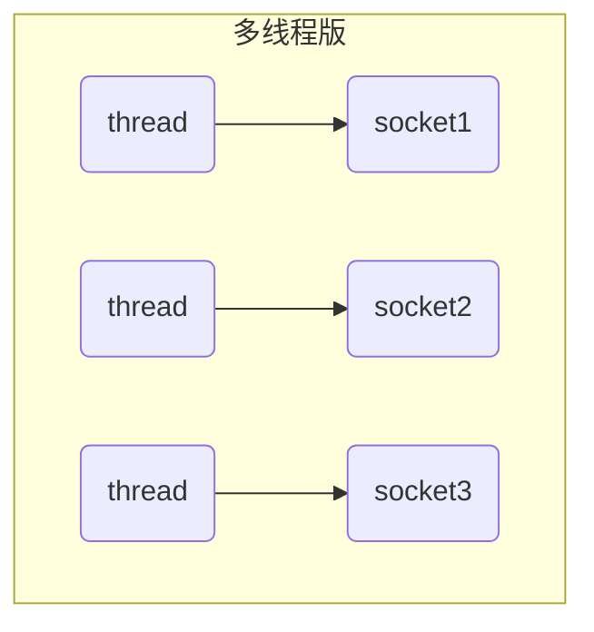
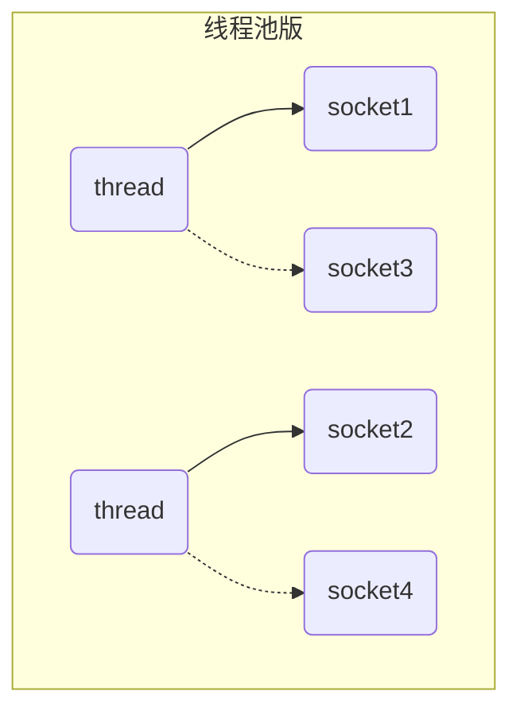
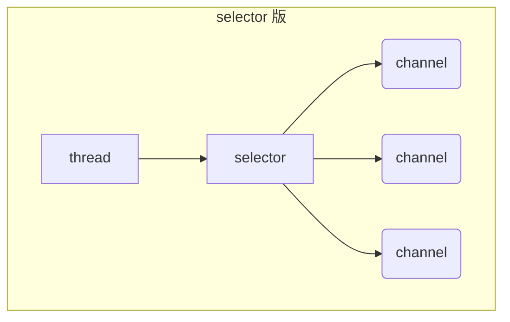
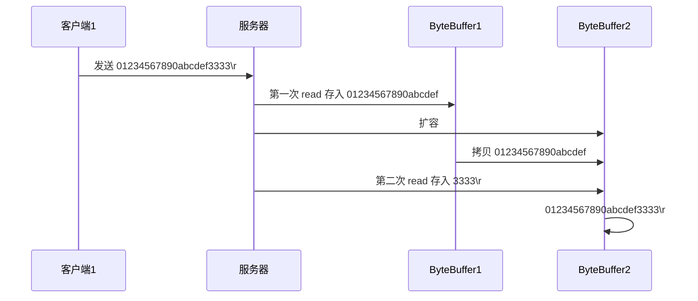

> [!Important]
>
> Netty 网络编程开坑！！！q(≧▽≦q)

# *NIO*基础

> [!Tip]
>
> *NIO*：*Non-blocking I/O* 或 *New I/O*

## 三大组件

### *Channel* & *Buffer*

channel 有一点类似于 stream，它就是读写数据的**双向通道**，可以从 channel 将数据读入 buffer，也可以将 buffer 的数据写入 channel，而之前的 stream 要么是输入，要么是输出，channel 比 stream 更为底层


常见的 Channel 有

* FileChannel
* DatagramChannel
* SocketChannel
* ServerSocketChannel

buffer 则用来缓冲读写数据，常见的 buffer 有

* ByteBuffer
  * MappedByteBuffer
  * DirectByteBuffer
  * HeapByteBuffer
* ShortBuffer
* IntBuffer
* LongBuffer
* FloatBuffer
* DoubleBuffer
* CharBuffer


### *Selector*

从传统服务器设计开始：

#### 多线程版设计



**多线程版缺点⚠**

* 内存占用高
* 线程上下文切换成本高
* 只适合连接数少的场景


#### 线程池版设计



**线程池版缺点⚠️**

* 阻塞模式下，线程仅能处理一个 socket 连接
* 仅适合短连接场景


#### selector 版设计

selector 的作用就是配合**一个线程**来管理多个 channel，获取这些 channel 上发生的事件，这些 channel 工作在非阻塞模式下，不会让线程吊死在一个 channel 上。适合连接数特别多，但流量低的场景（low traffic）



调用 selector 的 select() 会阻塞直到 channel 发生了读写就绪事件，这些事件发生，select 方法就会返回这些事件交给 thread 来处理


## ByteBuffer

### 示例

```java
@Slf4j
public class ChannelDemo1 {
    public static void main(String[] args) {
        try (RandomAccessFile file = new RandomAccessFile("data.txt", "rw")) {
            FileChannel channel = file.getChannel();
            ByteBuffer buffer = ByteBuffer.allocate(10);
            do {
                // 向 buffer 写入
                int len = channel.read(buffer);
                log.debug("读到字节数：{}", len);
                if (len == -1) {
                    break;
                }
                // 切换 buffer 读模式
                buffer.flip();
                while(buffer.hasRemaining()) {
                    log.debug("{}", (char)buffer.get());
                }
                // 切换 buffer 写模式
                buffer.clear();
            } while (true);
        } catch (IOException e) {
            e.printStackTrace();
        }
    }
}
```

**使用步骤**：

1. 向 buffer 写入数据，例如调用 channel.read(buffer)
2. 调用 flip() 切换至**读模式**
3. 从 buffer 读取数据，例如调用 buffer.get()
4. 调用 clear() 或 compact() 切换至**写模式**


### 结构

ByteBuffer 有以下重要属性

* capacity
* position
* limit

初始状态


写模式下，position 是写入位置，limit 等于容量，下图表示写入了 4 个字节后的状态


flip 动作发生后，position 切换为读取位置，limit 切换为读取限制


读取 4 个字节后，状态


clear 动作发生后，状态


compact 方法，是把未读完的部分向前压缩，然后切换至写模式


### 常见方法

#### 分配空间

以字节为单位分配

```java
// 分配Java堆内存
Bytebuffer buffer = ByteBuffer.allocate(16);

// 分配直接内存，分配效率较堆区低，读写效率高
ByteBuffer buffer = ByteBuffer.allocateDirect(16);
```


#### 写入数据

有两种方式：

* channel 的 read 方法
* buffer 自己的 put 方法

```java
channel.read(buffer);
    
buffer.put((byte) 97);
```


#### 读取数据

同样有两种办法

* channel 的 write 方法
* buffer 自己的 get 方法

```java
channel.write(buffer);

buffer.get();
```

> [!Note]
>
> ```java
> buffer.get(i);	// 读取下标i的数据，不会改变position的值
> 
> buffer.rewind(); // 重新从开始位置读取
> 
> buffer.mark();	// 在该位置做一个标记
> buffer.reset();	// 重置到mark标记位置
> ```


#### 转换字符串

```java
ByteBuffer buffer = StandardCharsets.UTF_8.encode("你好");

ByteBuffer buffer = Charset.forName("utf-8").encode("你好");


buffer.flip();
String str = StandardCharsets.UTF_8.decode(buffer).toString();
```


> [!Warning]
>
> Buffer 是**非线程安全的**


### Scattering Reads

分散读取

```java
try (RandomAccessFile file = new RandomAccessFile("3parts.txt", "rw")) {
    FileChannel channel = file.getChannel();
    ByteBuffer a = ByteBuffer.allocate(3);
    ByteBuffer b = ByteBuffer.allocate(3);
    ByteBuffer c = ByteBuffer.allocate(5);
    channel.read(new ByteBuffer[]{a, b, c});
    a.flip();
    b.flip();
    c.flip();
	// ...
} catch (IOException e) {
    e.printStackTrace();
}
```


### Gathering Writes

将多个 buffer 的数据填充至 channel

```java
try (RandomAccessFile file = new RandomAccessFile("3parts.txt", "rw")) {
    FileChannel channel = file.getChannel();
    ByteBuffer d = ByteBuffer.allocate(4);
    ByteBuffer e = ByteBuffer.allocate(4);
    channel.position(11);

    d.put(new byte[]{'f', 'o', 'u', 'r'});
    e.put(new byte[]{'f', 'i', 'v', 'e'});
    d.flip();
    e.flip();
    channel.write(new ByteBuffer[]{d, e});
} catch (IOException e) {
    e.printStackTrace();
}
```


## 文件编程

### FileChannel

> [!Warning]
>
> FileChannel 只能工作在阻塞模式下

#### 得到FileChannel

不能直接打开 FileChannel，必须通过 FileInputStream、FileOutputStream 或者 RandomAccessFile 来获取 FileChannel，它们都有 getChannel 方法

* 通过 FileInputStream 获取的 channel 只能读
* 通过 FileOutputStream 获取的 channel 只能写
* 通过 RandomAccessFile 是否能读写根据构造 RandomAccessFile 时的读写模式决定


#### 读取

从 channel 读取数据填充 ByteBuffer，返回值表示读到了多少字节，-1 表示到达了文件的末尾

```java
int readBytes = channel.read(buffer);
```


#### 写入

```java
ByteBuffer buffer = ...;
buffer.put(...); // 存入数据
buffer.flip();   // 切换读模式

while(buffer.hasRemaining()) {
    channel.write(buffer);
}
```

> [!Tip]
>
> 出于性能的考虑，操作系统会将数据缓存，不会立刻写入磁盘。
>
> 可以调用 force(true)  方法将文件内容和元数据（文件的权限等信息）立刻写入磁盘。


#### 关闭

channel 必须关闭，不过调用了 FileInputStream、FileOutputStream 或者 RandomAccessFile 的 close 方法会间接地调用 channel 的 close 方法


#### 位置

获取当前位置

```java
long pos = channel.position();
```

设置当前位置

```java
long newPos = ...;
channel.position(newPos);
```

设置当前位置时，如果设置为文件的末尾

* 这时读取会返回 -1 
* 这时写入，会追加内容，但要注意如果 position 超过了文件末尾，再写入时在新内容和原末尾之间会有空洞（00）


### Channel互传

```java
String FROM = "from.txt";
String TO = "to.txt";

try (FileChannel from = new FileInputStream(FROM).getChannel();
     FileChannel to = new FileOutputStream(TO).getChannel();) {
	// 传输数据，利用操作系统零拷贝优化效率高
    from.transferTo(0, from.size(), to);
} catch (IOException e) {
    e.printStackTrace();
}
```

> [!Caution]
>
> channel一次性最大支持2G数据传输，超过2G的文件可进行多次传输
>
> ```java
> for (long left = size; left > 0; ) {
>     left -= from.transferTo((size - left), left, to);
> }
> ```


### Path

jdk7 引入了 Path 和 Paths 类

* Path 用来表示文件路径
* Paths 是工具类，用来获取 Path 实例

```java
Path source = Paths.get("1.txt"); // 相对路径 使用 user.dir 环境变量来定位 1.txt

Path source = Paths.get("d:\\1.txt"); // 绝对路径 d:\1.txt

Path source = Paths.get("d:/1.txt"); // 绝对路径  d:\1.txt

Path projects = Paths.get("d:\\data", "projects"); //  d:\data\projects
```


### Files

```java
// 判断文件是否存在
Path path = Paths.get("helloword/data.txt");
boolean exist = Files.exists(path);

// 创建目录
Path path = Paths.get("helloword/d1");
Files.createDirectory(path);


Path source = Paths.get("helloword/data.txt");
Path target = Paths.get("helloword/target.txt");
// 拷贝文件
Files.copy(source, target);

// 移动文件，StandardCopyOption.ATOMIC_MOVE 保证文件移动的原子性
Files.move(source, target, StandardCopyOption.ATOMIC_MOVE);

// 删除文件
Files.delete(target);

// 遍历文件及目录
Files.walkFileTree(Paths.get("E:/"), new SimpleFileVisitor<>() {...});
```


## 网络编程

### 阻塞 和 非阻塞

```java
ByteBuffer buffer = ByteBuffer.allocate(16);
// 1. 创建服务器
ServerSocketChannel ssc = ServerSocketChannel.open();

// 2. 绑定监听端口
ssc.bind(new InetSocketAddress(8080));

// 3. 连接集合
List<SocketChannel> channels = new ArrayList<>();
while (true) {
    // 4. accept 建立与客户端连接， SocketChannel 用来与客户端之间通信
    log.debug("connecting...");
    SocketChannel sc = ssc.accept(); // 阻塞方法，线程停止运行
    log.debug("connected... {}", sc);
    channels.add(sc);
    for (SocketChannel channel : channels) {
        // 5. 接收客户端发送的数据
        log.debug("before read... {}", channel);
        channel.read(buffer); // 阻塞方法，线程停止运行
        buffer.flip();
        debugRead(buffer);
        buffer.clear();
        log.debug("after read...{}", channel);
    }
}
```

> [!Tip]
>
> ```java
> // 设置为非阻塞模式
> ServerSocketChannel.configureBlocking(false);
> 
> SocketChannel.configureBlocking(false);
> ```


### Selector

* 一个线程配合 selector 就可以监控多个 channel 的事件，事件发生线程才去处理。避免非阻塞模式下所做无用功
* 让这个线程能够被充分利用
* 节约了线程的数量
* 减少了线程上下文切换


#### 创建

```java
Selector selector = Selector.open();
```


#### 绑定 Channel 事件

也称之为注册事件，绑定的事件 selector 才会关心 

```java
channel.configureBlocking(false);
SelectionKey key = channel.register(selector, 绑定事件);
```

* channel 必须工作在非阻塞模式
* FileChannel 没有非阻塞模式，因此不能配合 selector 一起使用
* 绑定的事件类型可以有
  * connect - 客户端连接成功时触发
  * accept - 服务器端成功接受连接时触发
  * read - 数据可读入时触发，有因为接收能力弱，数据暂不能读入的情况
  * write - 数据可写出时触发，有因为发送能力弱，数据暂不能写出的情况


#### 监听 Channel 事件

可以通过下面三种方法来监听是否有事件发生，方法的返回值代表有多少 channel 发生了事件

- 方法1，阻塞直到绑定事件发生

```java
int count = selector.select();
```


- 方法2，阻塞直到绑定事件发生，或是超时（时间单位为 ms）

```java
int count = selector.select(long timeout);
```


- 方法3，不会阻塞，也就是不管有没有事件，立刻返回，自己根据返回值检查是否有事件

```java
int count = selector.selectNow();
```


####  select 何时不阻塞

> [!Tip]
>
> * 事件发生时
>   * 客户端发起连接请求，会触发 accept 事件
>   * 客户端发送数据过来，客户端正常、异常关闭时，都会触发 read 事件，另外如果发送的数据大于 buffer 缓冲区，会触发多次读取事件
>   * channel 可写，会触发 write 事件
>   * 在 linux 下 nio bug 发生时
> * 调用 selector.wakeup()
> * 调用 selector.close()
> * selector 所在线程 interrupt


### 处理accept事件

```java
    public static void main(String[] args) {
        try (ServerSocketChannel channel = ServerSocketChannel.open()) {
            channel.bind(new InetSocketAddress(8080));
			// 创建selector并注册事件
            Selector selector = Selector.open();
            channel.configureBlocking(false);
            channel.register(selector, SelectionKey.OP_ACCEPT);

            while (true) {
                selector.select();
                // 获取所有事件
                Set<SelectionKey> keys = selector.selectedKeys();

                // 遍历所有事件，逐一处理
                Iterator<SelectionKey> iter = keys.iterator();
                while (iter.hasNext()) {
                    SelectionKey key = iter.next();
                    // 判断事件类型
                    if (key.isAcceptable()) {
                        ServerSocketChannel c = (ServerSocketChannel) key.channel();
                        // 必须处理
                        SocketChannel sc = c.accept();
                        log.debug("{}", sc);
                    }
                    // 处理完毕，必须将事件移除
                    iter.remove();
                }
            }
        } catch (IOException e) {
            e.printStackTrace();
        }
    }
```

> [!Important]
>
> 事件发生后，要么处理，要么取消（cancel），不能什么都不做，否则下次该事件仍会触发，这是因为 nio 底层使用的是水平触发


### 处理read事件

```java
	public static void main(String[] args) {
		try (ServerSocketChannel channel = ServerSocketChannel.open()) {
            channel.bind(new InetSocketAddress(8080));

            Selector selector = Selector.open();
            channel.configureBlocking(false);
            channel.register(selector, SelectionKey.OP_ACCEPT);

            while (true) {
                selector.select();
                // 获取所有事件
                Set<SelectionKey> keys = selector.selectedKeys();
                // 遍历所有事件，逐一处理
                Iterator<SelectionKey> iter = keys.iterator();
                while (iter.hasNext()) {
                    SelectionKey key = iter.next();
                    // 判断事件类型
                    if (key.isAcceptable()) {
                        ServerSocketChannel c = (ServerSocketChannel) key.channel();
                        // 必须处理
                        SocketChannel sc = c.accept();
                        sc.configureBlocking(false);
                        sc.register(selector, SelectionKey.OP_READ);
                    } else if (key.isReadable()) {
                        SocketChannel sc = (SocketChannel) key.channel();
                        ByteBuffer buffer = ByteBuffer.allocate(128);
                        int read = sc.read(buffer);
                        // 客户端关闭连接也会触发read事件，此时需取消该事件
                        if(read == -1) {
                            key.cancel();
                            sc.close();
                        } else {
                            buffer.flip();
                        }
                    }
                    // 处理完毕，必须将事件移除
                    iter.remove();
                }
            }
        } catch (IOException e) {
            e.printStackTrace();
        }
    }
```

> [!Note]
>
> 1.  为什么要 iter.remove()
>    - 因为 select 在事件发生后，就会将相关的 key 放入 selectedKeys 集合，但不会在处理完后从 selectedKeys 集合中移除，需要我们自己编码删除，否则后续还会再次触发该事件。
> 2.  cancel 的作用
>    - cancel 会取消注册在 selector 上的 channel，并从 keys 集合中删除 key 后续不会再监听事件


### 消息边界处理

当接收的数据长度大于Buffer时，数据的边界就无法在一次处理中解决

**解决思路**：

* 一种思路是固定消息长度，数据包大小一样，服务器按预定长度读取，缺点是浪费带宽
* 另一种思路是按分隔符拆分，缺点是效率低（需要遍历消息找到边界）
* TLV 格式，即 Type、Length、Value，类型和长度已知的情况下，就可以方便获取消息大小，分配合适的 buffer，缺点是 buffer 需要提前分配，如果内容过大，则影响 server 吞吐量（规定消息的头部某些字段存储消息长度、类型等数据）





```java
    public static void main(String[] args) throws IOException {
        ServerSocketChannel ssc = ServerSocketChannel.open();
        ssc.configureBlocking(false);
        ssc.bind(new InetSocketAddress(8080));

        Selector selector = Selector.open();
        SelectionKey sscKey = ssc.register(selector, 0, null);
        sscKey.interestOps(SelectionKey.OP_ACCEPT);

        while (true) {
            // 有事件发生则运行，没有则阻塞
            selector.select();
            // 处理事件
            Iterator<SelectionKey> iterator = selector.selectedKeys().iterator();

            while (iterator.hasNext()) {
                SelectionKey key = iterator.next();
                iterator.remove();

                // 区分事件类型
                if (key.isAcceptable()) {
                    ServerSocketChannel channel = (ServerSocketChannel) key.channel();
                    SocketChannel socketChannel = channel.accept();
                    socketChannel.configureBlocking(false);
                    ByteBuffer buffer = ByteBuffer.allocate(16);
                    
                    // 参数3是附件，通常用于存放一些对象，这里存放ByteBuffer，用于解决消息边界问题
                    SelectionKey scKey = socketChannel.register(selector, 0, buffer);
                    scKey.interestOps(SelectionKey.OP_READ);
                } else if (key.isReadable()) {
                    try {
                        // 获取事件源Channel
                        SocketChannel channel = (SocketChannel) key.channel();
                        // 获取附件（ByteBuffer）
                        ByteBuffer buffer = (ByteBuffer) key.attachment();

                        // 客户端close()断开连接也会触发read事件，但是read会返回-1
                        int read = channel.read(buffer);
                        if (read == -1) {
                            key.cancel();
                            continue;
                        }
                        // 解析消息
                        split(buffer);
                        if (buffer.position() == buffer.limit()) {
                            // 扩容buffer
                            ByteBuffer newBuffer = ByteBuffer.allocate(buffer.capacity() * 2);
                            buffer.flip();
                            newBuffer.put(buffer);
                            // 替换buffer
                            key.attach(newBuffer);
                        }
                    } catch (IOException e) {
                        log.error(e.getMessage());
                        // 发生异常，取消注册
                        key.cancel();
                    }
                }
            }
        }
    }

    private static void split(ByteBuffer buffer) {
        buffer.flip();
        byte[] bytes;
        for (int i = 0; i < buffer.remaining(); i++) {
            if (buffer.get(i) == '\n') {
                bytes = new byte[i + 1];
                buffer.get(bytes);
                System.out.println(StandardCharsets.UTF_8.decode(ByteBuffer.wrap(bytes)));
            }
        }
        buffer.compact();
    }
```


#### ByteBuffer 大小分配

* 每个 channel 都需要记录可能被切分的消息，因为 ByteBuffer **不能被多个 channel 共同使用**
* ByteBuffer 不能太大，比如一个 ByteBuffer 1Mb 的话，要支持百万连接就要 1Tb 内存，因此需要设计大小可变的 ByteBuffer
  * 一种思路是首先分配一个较小的 buffer，例如 4k，如果发现数据不够，再分配 8k 的 buffer，将 4k buffer 内容拷贝至 8k buffer，优点是消息连续容易处理，缺点是数据拷贝耗费性能，参考实现 [http://tutorials.jenkov.com/java-performance/resizable-array.html](http://tutorials.jenkov.com/java-performance/resizable-array.html)
  * 另一种思路是用多个数组组成 buffer，一个数组不够，把多出来的内容写入新的数组，与前面的区别是消息存储不连续解析复杂，优点是避免了拷贝引起的性能损耗


### 处理write事件
