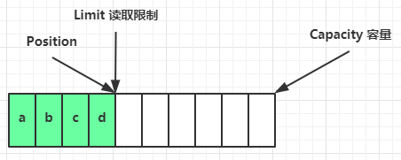

> [!Important]
>
> Netty 网络编程开坑！！！q(≧▽≦q)

# *NIO*基础

> [!Tip]
>
> *NIO*：*Non-blocking I/O* 或 *New I/O*

## 三大组件

### *Channel* & *Buffer*

channel 有一点类似于 stream，它就是读写数据的**双向通道**，可以从 channel 将数据读入 buffer，也可以将 buffer 的数据写入 channel，而之前的 stream 要么是输入，要么是输出，channel 比 stream 更为底层


常见的 Channel 有

* FileChannel
* DatagramChannel
* SocketChannel
* ServerSocketChannel

buffer 则用来缓冲读写数据，常见的 buffer 有

* ByteBuffer
  * MappedByteBuffer
  * DirectByteBuffer
  * HeapByteBuffer
* ShortBuffer
* IntBuffer
* LongBuffer
* FloatBuffer
* DoubleBuffer
* CharBuffer


### *Selector*

从传统服务器设计开始：

#### 多线程版设计


**多线程版缺点⚠**

* 内存占用高
* 线程上下文切换成本高
* 只适合连接数少的场景


#### 线程池版设计


**线程池版缺点⚠️**

* 阻塞模式下，线程仅能处理一个 socket 连接
* 仅适合短连接场景


#### selector 版设计

selector 的作用就是配合**一个线程**来管理多个 channel，获取这些 channel 上发生的事件，这些 channel 工作在非阻塞模式下，不会让线程吊死在一个 channel 上。适合连接数特别多，但流量低的场景（low traffic）


调用 selector 的 select() 会阻塞直到 channel 发生了读写就绪事件，这些事件发生，select 方法就会返回这些事件交给 thread 来处理


## ByteBuffer

### 示例

```java
@Slf4j
public class ChannelDemo1 {
    public static void main(String[] args) {
        try (RandomAccessFile file = new RandomAccessFile("data.txt", "rw")) {
            FileChannel channel = file.getChannel();
            ByteBuffer buffer = ByteBuffer.allocate(10);
            do {
                // 向 buffer 写入
                int len = channel.read(buffer);
                log.debug("读到字节数：{}", len);
                if (len == -1) {
                    break;
                }
                // 切换 buffer 读模式
                buffer.flip();
                while(buffer.hasRemaining()) {
                    log.debug("{}", (char)buffer.get());
                }
                // 切换 buffer 写模式
                buffer.clear();
            } while (true);
        } catch (IOException e) {
            e.printStackTrace();
        }
    }
}
```

**使用步骤**：

1. 向 buffer 写入数据，例如调用 channel.read(buffer)
2. 调用 flip() 切换至**读模式**
3. 从 buffer 读取数据，例如调用 buffer.get()
4. 调用 clear() 或 compact() 切换至**写模式**


### 结构

ByteBuffer 有以下重要属性

* capacity
* position
* limit

初始状态


写模式下，position 是写入位置，limit 等于容量，下图表示写入了 4 个字节后的状态


flip 动作发生后，position 切换为读取位置，limit 切换为读取限制


读取 4 个字节后，状态



clear 动作发生后，状态


compact 方法，是把未读完的部分向前压缩，然后切换至写模式


### 常见方法

#### 分配空间

以字节为单位分配

```java
// 分配Java堆内存
Bytebuffer buffer = ByteBuffer.allocate(16);

// 分配直接内存，分配效率较堆区低，读写效率高
ByteBuffer buffer = ByteBuffer.allocateDirect(16);
```


#### 写入数据

有两种方式：

* channel 的 read 方法
* buffer 自己的 put 方法

```java
channel.read(buffer);
    
buffer.put((byte) 97);
```


#### 读取数据

同样有两种办法

* channel 的 write 方法
* buffer 自己的 get 方法

```java
channel.write(buffer);

buffer.get();
```

> [!Note]
>
> ```java
> buffer.get(i);	// 读取下标i的数据，不会改变position的值
> 
> buffer.rewind(); // 重新从开始位置读取
> 
> buffer.mark();	// 在该位置做一个标记
> buffer.reset();	// 重置到mark标记位置
> ```


#### 转换字符串

```java
ByteBuffer buffer = StandardCharsets.UTF_8.encode("你好");

ByteBuffer buffer = Charset.forName("utf-8").encode("你好");


buffer.flip();
String str = StandardCharsets.UTF_8.decode(buffer).toString();
```


> [!Warning]
>
> Buffer 是**非线程安全的**


### Scattering Reads

分散读取

```java
try (RandomAccessFile file = new RandomAccessFile("3parts.txt", "rw")) {
    FileChannel channel = file.getChannel();
    ByteBuffer a = ByteBuffer.allocate(3);
    ByteBuffer b = ByteBuffer.allocate(3);
    ByteBuffer c = ByteBuffer.allocate(5);
    channel.read(new ByteBuffer[]{a, b, c});
    a.flip();
    b.flip();
    c.flip();
	// ...
} catch (IOException e) {
    e.printStackTrace();
}
```


### Gathering Writes

将多个 buffer 的数据填充至 channel

```java
try (RandomAccessFile file = new RandomAccessFile("3parts.txt", "rw")) {
    FileChannel channel = file.getChannel();
    ByteBuffer d = ByteBuffer.allocate(4);
    ByteBuffer e = ByteBuffer.allocate(4);
    channel.position(11);

    d.put(new byte[]{'f', 'o', 'u', 'r'});
    e.put(new byte[]{'f', 'i', 'v', 'e'});
    d.flip();
    e.flip();
    channel.write(new ByteBuffer[]{d, e});
} catch (IOException e) {
    e.printStackTrace();
}
```


## 文件编程

### FileChannel

> [!Warning]
>
> FileChannel 只能工作在阻塞模式下

#### 得到FileChannel

不能直接打开 FileChannel，必须通过 FileInputStream、FileOutputStream 或者 RandomAccessFile 来获取 FileChannel，它们都有 getChannel 方法

* 通过 FileInputStream 获取的 channel 只能读
* 通过 FileOutputStream 获取的 channel 只能写
* 通过 RandomAccessFile 是否能读写根据构造 RandomAccessFile 时的读写模式决定


#### 读取

从 channel 读取数据填充 ByteBuffer，返回值表示读到了多少字节，-1 表示到达了文件的末尾

```java
int readBytes = channel.read(buffer);
```


#### 写入

```java
ByteBuffer buffer = ...;
buffer.put(...); // 存入数据
buffer.flip();   // 切换读模式

while(buffer.hasRemaining()) {
    channel.write(buffer);
}
```

> [!Tip]
>
> 出于性能的考虑，操作系统会将数据缓存，不会立刻写入磁盘。
>
> 可以调用 force(true)  方法将文件内容和元数据（文件的权限等信息）立刻写入磁盘。


#### 关闭

channel 必须关闭，不过调用了 FileInputStream、FileOutputStream 或者 RandomAccessFile 的 close 方法会间接地调用 channel 的 close 方法


#### 位置

获取当前位置

```java
long pos = channel.position();
```

设置当前位置

```java
long newPos = ...;
channel.position(newPos);
```

设置当前位置时，如果设置为文件的末尾

* 这时读取会返回 -1 
* 这时写入，会追加内容，但要注意如果 position 超过了文件末尾，再写入时在新内容和原末尾之间会有空洞（00）


### Channel互传

```java
String FROM = "from.txt";
String TO = "to.txt";

try (FileChannel from = new FileInputStream(FROM).getChannel();
     FileChannel to = new FileOutputStream(TO).getChannel();) {
	// 传输数据，利用操作系统零拷贝优化效率高
    from.transferTo(0, from.size(), to);
} catch (IOException e) {
    e.printStackTrace();
}
```

> [!Caution]
>
> channel一次性最大支持2G数据传输，超过2G的文件可进行多次传输
>
> ```java
> for (long left = size; left > 0; ) {
>     left -= from.transferTo((size - left), left, to);
> }
> ```


### Path

jdk7 引入了 Path 和 Paths 类

* Path 用来表示文件路径
* Paths 是工具类，用来获取 Path 实例

```java
Path source = Paths.get("1.txt"); // 相对路径 使用 user.dir 环境变量来定位 1.txt

Path source = Paths.get("d:\\1.txt"); // 绝对路径 d:\1.txt

Path source = Paths.get("d:/1.txt"); // 绝对路径  d:\1.txt

Path projects = Paths.get("d:\\data", "projects"); //  d:\data\projects
```


### Files

```java
// 判断文件是否存在
Path path = Paths.get("helloword/data.txt");
boolean exist = Files.exists(path);

// 创建目录
Path path = Paths.get("helloword/d1");
Files.createDirectory(path);


Path source = Paths.get("helloword/data.txt");
Path target = Paths.get("helloword/target.txt");
// 拷贝文件
Files.copy(source, target);

// 移动文件，StandardCopyOption.ATOMIC_MOVE 保证文件移动的原子性
Files.move(source, target, StandardCopyOption.ATOMIC_MOVE);

// 删除文件
Files.delete(target);

// 遍历文件及目录
Files.walkFileTree(Paths.get("E:/"), new SimpleFileVisitor<>() {...});
```


## 网络编程

