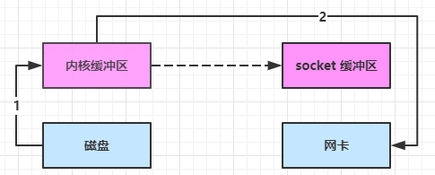

> [!Important]
>
> Netty 网络编程开坑！！！q(≧▽≦q)

# *NIO*基础

> [!Tip]
>
> *NIO*：*Non-blocking I/O* 或 *New I/O*

## 三大组件

### *Channel* & *Buffer*

channel 有一点类似于 stream，它就是读写数据的**双向通道**，可以从 channel 将数据读入 buffer，也可以将 buffer 的数据写入 channel，而之前的 stream 要么是输入，要么是输出，channel 比 stream 更为底层


常见的 Channel 有

* FileChannel
* DatagramChannel
* SocketChannel
* ServerSocketChannel

buffer 则用来缓冲读写数据，常见的 buffer 有

* ByteBuffer
  * MappedByteBuffer
  * DirectByteBuffer
  * HeapByteBuffer
* ShortBuffer
* IntBuffer
* LongBuffer
* FloatBuffer
* DoubleBuffer
* CharBuffer


### *Selector*

从传统服务器设计开始：

#### 多线程版设计


**多线程版缺点⚠**

* 内存占用高
* 线程上下文切换成本高
* 只适合连接数少的场景


#### 线程池版设计


**线程池版缺点⚠️**

* 阻塞模式下，线程仅能处理一个 socket 连接
* 仅适合短连接场景


#### selector 版设计

selector 的作用就是配合**一个线程**来管理多个 channel，获取这些 channel 上发生的事件，这些 channel 工作在非阻塞模式下，不会让线程吊死在一个 channel 上。适合连接数特别多，但流量低的场景（low traffic）


调用 selector 的 select() 会阻塞直到 channel 发生了读写就绪事件，这些事件发生，select 方法就会返回这些事件交给 thread 来处理


## ByteBuffer

### 示例

```java
@Slf4j
public class ChannelDemo1 {
    public static void main(String[] args) {
        try (RandomAccessFile file = new RandomAccessFile("data.txt", "rw")) {
            FileChannel channel = file.getChannel();
            ByteBuffer buffer = ByteBuffer.allocate(10);
            do {
                // 向 buffer 写入
                int len = channel.read(buffer);
                log.debug("读到字节数：{}", len);
                if (len == -1) {
                    break;
                }
                // 切换 buffer 读模式
                buffer.flip();
                while(buffer.hasRemaining()) {
                    log.debug("{}", (char)buffer.get());
                }
                // 切换 buffer 写模式
                buffer.clear();
            } while (true);
        } catch (IOException e) {
            e.printStackTrace();
        }
    }
}
```

**使用步骤**：

1. 向 buffer 写入数据，例如调用 channel.read(buffer)
2. 调用 flip() 切换至**读模式**
3. 从 buffer 读取数据，例如调用 buffer.get()
4. 调用 clear() 或 compact() 切换至**写模式**


### 结构

ByteBuffer 有以下重要属性

* capacity
* position
* limit

初始状态


写模式下，position 是写入位置，limit 等于容量，下图表示写入了 4 个字节后的状态


flip 动作发生后，position 切换为读取位置，limit 切换为读取限制


读取 4 个字节后，状态


clear 动作发生后，状态


compact 方法，是把未读完的部分向前压缩，然后切换至写模式


### 常见方法

#### 分配空间

以字节为单位分配

```java
// 分配Java堆内存
Bytebuffer buffer = ByteBuffer.allocate(16);

// 分配直接内存，分配效率较堆区低，读写效率高
ByteBuffer buffer = ByteBuffer.allocateDirect(16);
```


#### 写入数据

有两种方式：

* channel 的 read 方法
* buffer 自己的 put 方法

```java
channel.read(buffer);
    
buffer.put((byte) 97);
```


#### 读取数据

同样有两种办法

* channel 的 write 方法
* buffer 自己的 get 方法

```java
channel.write(buffer);

buffer.get();
```

> [!Note]
>
> ```java
> buffer.get(i);	// 读取下标i的数据，不会改变position的值
> 
> buffer.rewind(); // 重新从开始位置读取
> 
> buffer.mark();	// 在该位置做一个标记
> buffer.reset();	// 重置到mark标记位置
> ```


#### 转换字符串

```java
ByteBuffer buffer = StandardCharsets.UTF_8.encode("你好");

ByteBuffer buffer = Charset.forName("utf-8").encode("你好");


buffer.flip();
String str = StandardCharsets.UTF_8.decode(buffer).toString();
```


> [!Warning]
>
> Buffer 是**非线程安全的**


### Scattering Reads

分散读取

```java
try (RandomAccessFile file = new RandomAccessFile("3parts.txt", "rw")) {
    FileChannel channel = file.getChannel();
    ByteBuffer a = ByteBuffer.allocate(3);
    ByteBuffer b = ByteBuffer.allocate(3);
    ByteBuffer c = ByteBuffer.allocate(5);
    channel.read(new ByteBuffer[]{a, b, c});
    a.flip();
    b.flip();
    c.flip();
	// ...
} catch (IOException e) {
    e.printStackTrace();
}
```


### Gathering Writes

将多个 buffer 的数据填充至 channel

```java
try (RandomAccessFile file = new RandomAccessFile("3parts.txt", "rw")) {
    FileChannel channel = file.getChannel();
    ByteBuffer d = ByteBuffer.allocate(4);
    ByteBuffer e = ByteBuffer.allocate(4);
    channel.position(11);

    d.put(new byte[]{'f', 'o', 'u', 'r'});
    e.put(new byte[]{'f', 'i', 'v', 'e'});
    d.flip();
    e.flip();
    channel.write(new ByteBuffer[]{d, e});
} catch (IOException e) {
    e.printStackTrace();
}
```


## 文件编程

### FileChannel

> [!Warning]
>
> FileChannel 只能工作在阻塞模式下

#### 得到FileChannel

不能直接打开 FileChannel，必须通过 FileInputStream、FileOutputStream 或者 RandomAccessFile 来获取 FileChannel，它们都有 getChannel 方法

* 通过 FileInputStream 获取的 channel 只能读
* 通过 FileOutputStream 获取的 channel 只能写
* 通过 RandomAccessFile 是否能读写根据构造 RandomAccessFile 时的读写模式决定


#### 读取

从 channel 读取数据填充 ByteBuffer，返回值表示读到了多少字节，-1 表示到达了文件的末尾

```java
int readBytes = channel.read(buffer);
```


#### 写入

```java
ByteBuffer buffer = ...;
buffer.put(...); // 存入数据
buffer.flip();   // 切换读模式

while(buffer.hasRemaining()) {
    channel.write(buffer);
}
```

> [!Tip]
>
> 出于性能的考虑，操作系统会将数据缓存，不会立刻写入磁盘。
>
> 可以调用 force(true)  方法将文件内容和元数据（文件的权限等信息）立刻写入磁盘。


#### 关闭

channel 必须关闭，不过调用了 FileInputStream、FileOutputStream 或者 RandomAccessFile 的 close 方法会间接地调用 channel 的 close 方法


#### 位置

获取当前位置

```java
long pos = channel.position();
```

设置当前位置

```java
long newPos = ...;
channel.position(newPos);
```

设置当前位置时，如果设置为文件的末尾

* 这时读取会返回 -1 
* 这时写入，会追加内容，但要注意如果 position 超过了文件末尾，再写入时在新内容和原末尾之间会有空洞（00）


### Channel互传

```java
String FROM = "from.txt";
String TO = "to.txt";

try (FileChannel from = new FileInputStream(FROM).getChannel();
     FileChannel to = new FileOutputStream(TO).getChannel();) {
	// 传输数据，利用操作系统零拷贝优化效率高
    from.transferTo(0, from.size(), to);
} catch (IOException e) {
    e.printStackTrace();
}
```

> [!Caution]
>
> channel一次性最大支持2G数据传输，超过2G的文件可进行多次传输
>
> ```java
> for (long left = size; left > 0; ) {
>     left -= from.transferTo((size - left), left, to);
> }
> ```


### Path

jdk7 引入了 Path 和 Paths 类

* Path 用来表示文件路径
* Paths 是工具类，用来获取 Path 实例

```java
Path source = Paths.get("1.txt"); // 相对路径 使用 user.dir 环境变量来定位 1.txt

Path source = Paths.get("d:\\1.txt"); // 绝对路径 d:\1.txt

Path source = Paths.get("d:/1.txt"); // 绝对路径  d:\1.txt

Path projects = Paths.get("d:\\data", "projects"); //  d:\data\projects
```


### Files

```java
// 判断文件是否存在
Path path = Paths.get("helloword/data.txt");
boolean exist = Files.exists(path);

// 创建目录
Path path = Paths.get("helloword/d1");
Files.createDirectory(path);


Path source = Paths.get("helloword/data.txt");
Path target = Paths.get("helloword/target.txt");
// 拷贝文件
Files.copy(source, target);

// 移动文件，StandardCopyOption.ATOMIC_MOVE 保证文件移动的原子性
Files.move(source, target, StandardCopyOption.ATOMIC_MOVE);

// 删除文件
Files.delete(target);

// 遍历文件及目录
Files.walkFileTree(Paths.get("E:/"), new SimpleFileVisitor<>() {...});
```


## 网络编程

### 阻塞 和 非阻塞

```java
ByteBuffer buffer = ByteBuffer.allocate(16);
// 1. 创建服务器
ServerSocketChannel ssc = ServerSocketChannel.open();

// 2. 绑定监听端口
ssc.bind(new InetSocketAddress(8080));

// 3. 连接集合
List<SocketChannel> channels = new ArrayList<>();
while (true) {
    // 4. accept 建立与客户端连接， SocketChannel 用来与客户端之间通信
    log.debug("connecting...");
    SocketChannel sc = ssc.accept(); // 阻塞方法，线程停止运行
    log.debug("connected... {}", sc);
    channels.add(sc);
    for (SocketChannel channel : channels) {
        // 5. 接收客户端发送的数据
        log.debug("before read... {}", channel);
        channel.read(buffer); // 阻塞方法，线程停止运行
        buffer.flip();
        debugRead(buffer);
        buffer.clear();
        log.debug("after read...{}", channel);
    }
}
```

> [!Tip]
>
> ```java
> // 设置为非阻塞模式
> ServerSocketChannel.configureBlocking(false);
> 
> SocketChannel.configureBlocking(false);
> ```


### Selector

* 一个线程配合 selector 就可以监控多个 channel 的事件，事件发生线程才去处理。避免非阻塞模式下所做无用功
* 让这个线程能够被充分利用
* 节约了线程的数量
* 减少了线程上下文切换


#### 创建

```java
Selector selector = Selector.open();
```


#### 绑定 Channel 事件

也称之为注册事件，绑定的事件 selector 才会关心 

```java
channel.configureBlocking(false);
SelectionKey key = channel.register(selector, 绑定事件);
```

* channel 必须工作在非阻塞模式
* FileChannel 没有非阻塞模式，因此不能配合 selector 一起使用
* 绑定的事件类型可以有
  * connect - 客户端连接成功时触发
  * accept - 服务器端成功接受连接时触发
  * read - 数据可读入时触发，有因为接收能力弱，数据暂不能读入的情况
  * write - 数据可写出时触发，有因为发送能力弱，数据暂不能写出的情况


#### 监听 Channel 事件

可以通过下面三种方法来监听是否有事件发生，方法的返回值代表有多少 channel 发生了事件

- 方法1，阻塞直到绑定事件发生

```java
int count = selector.select();
```


- 方法2，阻塞直到绑定事件发生，或是超时（时间单位为 ms）

```java
int count = selector.select(long timeout);
```


- 方法3，不会阻塞，也就是不管有没有事件，立刻返回，自己根据返回值检查是否有事件

```java
int count = selector.selectNow();
```


####  select 何时不阻塞

> [!Tip]
>
> * 事件发生时
>   * 客户端发起连接请求，会触发 accept 事件
>   * 客户端发送数据过来，客户端正常、异常关闭时，都会触发 read 事件，另外如果发送的数据大于 buffer 缓冲区，会触发多次读取事件
>   * channel 可写，会触发 write 事件
>   * 在 linux 下 nio bug 发生时
> * 调用 selector.wakeup()
> * 调用 selector.close()
> * selector 所在线程 interrupt


### 处理accept事件

```java
    public static void main(String[] args) {
        try (ServerSocketChannel channel = ServerSocketChannel.open()) {
            channel.bind(new InetSocketAddress(8080));
			// 创建selector并注册事件
            Selector selector = Selector.open();
            channel.configureBlocking(false);
            channel.register(selector, SelectionKey.OP_ACCEPT);

            while (true) {
                selector.select();
                // 获取所有事件
                Set<SelectionKey> keys = selector.selectedKeys();

                // 遍历所有事件，逐一处理
                Iterator<SelectionKey> iter = keys.iterator();
                while (iter.hasNext()) {
                    SelectionKey key = iter.next();
                    // 判断事件类型
                    if (key.isAcceptable()) {
                        ServerSocketChannel c = (ServerSocketChannel) key.channel();
                        // 必须处理
                        SocketChannel sc = c.accept();
                        log.debug("{}", sc);
                    }
                    // 处理完毕，必须将事件移除
                    iter.remove();
                }
            }
        } catch (IOException e) {
            e.printStackTrace();
        }
    }
```

> [!Important]
>
> 事件发生后，要么处理，要么取消（cancel），不能什么都不做，否则下次该事件仍会触发，这是因为 nio 底层使用的是水平触发


### 处理read事件

```java
	public static void main(String[] args) {
		try (ServerSocketChannel channel = ServerSocketChannel.open()) {
            channel.bind(new InetSocketAddress(8080));

            Selector selector = Selector.open();
            channel.configureBlocking(false);
            channel.register(selector, SelectionKey.OP_ACCEPT);

            while (true) {
                selector.select();
                // 获取所有事件
                Set<SelectionKey> keys = selector.selectedKeys();
                // 遍历所有事件，逐一处理
                Iterator<SelectionKey> iter = keys.iterator();
                while (iter.hasNext()) {
                    SelectionKey key = iter.next();
                    // 判断事件类型
                    if (key.isAcceptable()) {
                        ServerSocketChannel c = (ServerSocketChannel) key.channel();
                        // 必须处理
                        SocketChannel sc = c.accept();
                        sc.configureBlocking(false);
                        sc.register(selector, SelectionKey.OP_READ);
                    } else if (key.isReadable()) {
                        SocketChannel sc = (SocketChannel) key.channel();
                        ByteBuffer buffer = ByteBuffer.allocate(128);
                        int read = sc.read(buffer);
                        // 客户端关闭连接也会触发read事件，此时需取消该事件
                        if(read == -1) {
                            key.cancel();
                            sc.close();
                        } else {
                            buffer.flip();
                        }
                    }
                    // 处理完毕，必须将事件移除
                    iter.remove();
                }
            }
        } catch (IOException e) {
            e.printStackTrace();
        }
    }
```

> [!Note]
>
> 1.  为什么要 iter.remove()
>    - 因为 select 在事件发生后，就会将相关的 key 放入 selectedKeys 集合，但不会在处理完后从 selectedKeys 集合中移除，需要我们自己编码删除，否则后续还会再次触发该事件。
> 2.  cancel 的作用
>    - cancel 会取消注册在 selector 上的 channel，并从 keys 集合中删除 key 后续不会再监听事件


### 消息边界处理

当接收的数据长度大于Buffer时，数据的边界就无法在一次处理中解决

**解决思路**：

* 一种思路是固定消息长度，数据包大小一样，服务器按预定长度读取，缺点是浪费带宽
* 另一种思路是按分隔符拆分，缺点是效率低（需要遍历消息找到边界）
* TLV 格式，即 Type、Length、Value，类型和长度已知的情况下，就可以方便获取消息大小，分配合适的 buffer，缺点是 buffer 需要提前分配，如果内容过大，则影响 server 吞吐量（规定消息的头部某些字段存储消息长度、类型等数据）


```java
    public static void main(String[] args) throws IOException {
        ServerSocketChannel ssc = ServerSocketChannel.open();
        ssc.configureBlocking(false);
        ssc.bind(new InetSocketAddress(8080));

        Selector selector = Selector.open();
        SelectionKey sscKey = ssc.register(selector, 0, null);
        sscKey.interestOps(SelectionKey.OP_ACCEPT);

        while (true) {
            // 有事件发生则运行，没有则阻塞
            selector.select();
            // 处理事件
            Iterator<SelectionKey> iterator = selector.selectedKeys().iterator();

            while (iterator.hasNext()) {
                SelectionKey key = iterator.next();
                iterator.remove();

                // 区分事件类型
                if (key.isAcceptable()) {
                    ServerSocketChannel channel = (ServerSocketChannel) key.channel();
                    SocketChannel socketChannel = channel.accept();
                    socketChannel.configureBlocking(false);
                    ByteBuffer buffer = ByteBuffer.allocate(16);
                    
                    // 参数3是附件，通常用于存放一些对象，这里存放ByteBuffer，用于解决消息边界问题
                    SelectionKey scKey = socketChannel.register(selector, 0, buffer);
                    scKey.interestOps(SelectionKey.OP_READ);
                } else if (key.isReadable()) {
                    try {
                        // 获取事件源Channel
                        SocketChannel channel = (SocketChannel) key.channel();
                        // 获取附件（ByteBuffer）
                        ByteBuffer buffer = (ByteBuffer) key.attachment();

                        // 客户端close()断开连接也会触发read事件，但是read会返回-1
                        int read = channel.read(buffer);
                        if (read == -1) {
                            key.cancel();
                            continue;
                        }
                        // 解析消息
                        split(buffer);
                        if (buffer.position() == buffer.limit()) {
                            // 扩容buffer
                            ByteBuffer newBuffer = ByteBuffer.allocate(buffer.capacity() * 2);
                            buffer.flip();
                            newBuffer.put(buffer);
                            // 替换buffer
                            key.attach(newBuffer);
                        }
                    } catch (IOException e) {
                        log.error(e.getMessage());
                        // 发生异常，取消注册
                        key.cancel();
                    }
                }
            }
        }
    }

    private static void split(ByteBuffer buffer) {
        buffer.flip();
        int oldLimit = buffer.limit();
        for (int i = 0; i < buffer.limit(); i++) {
            if (buffer.get(i) == '\n') {
                int length = i + 1 - buffer.position();
                ByteBuffer msg = ByteBuffer.allocate(length);
                for (int j = 0; j < length; j++) {
                    msg.put(buffer.get());
                }
                msg.flip();
                System.out.println(StandardCharsets.UTF_8.decode(msg));
                // 继续查找下一个完整消息
                i = buffer.position() - 1;
            }
        }
        buffer.limit(oldLimit);
        buffer.compact();
    }
```


#### ByteBuffer 大小分配

* 每个 channel 都需要记录可能被切分的消息，因为 ByteBuffer **不能被多个 channel 共同使用**
* ByteBuffer 不能太大，比如一个 ByteBuffer 1Mb 的话，要支持百万连接就要 1Tb 内存，因此需要设计大小可变的 ByteBuffer
  * 一种思路是首先分配一个较小的 buffer，例如 4k，如果发现数据不够，再分配 8k 的 buffer，将 4k buffer 内容拷贝至 8k buffer，优点是消息连续容易处理，缺点是数据拷贝耗费性能，参考实现 [http://tutorials.jenkov.com/java-performance/resizable-array.html](http://tutorials.jenkov.com/java-performance/resizable-array.html)
  * 另一种思路是用多个数组组成 buffer，一个数组不够，把多出来的内容写入新的数组，与前面的区别是消息存储不连续解析复杂，优点是避免了拷贝引起的性能损耗


### 处理write事件

- 非阻塞模式下，无法保证把 buffer 中所有数据都写入 channel，因此需要追踪 write 方法的返回值（代表实际写入字节数）
- 用 selector 监听所有 channel 的可写事件，每个 channel 都需要一个 key 来跟踪 buffer，但这样又会导致占用内存过多，就有两阶段策略
  * 当消息处理器第一次写入消息时，才将 channel 注册到 selector 上
  * selector 检查 channel 上的可写事件，如果所有的数据写完了，就取消 channel 的注册
  * 如果不取消，会每次可写均会触发 write 事件

```java
public static void main(String[] args) throws IOException {
        ServerSocketChannel ssc = ServerSocketChannel.open();
        ssc.configureBlocking(false);
        ssc.bind(new InetSocketAddress(8080));

        Selector selector = Selector.open();
        ssc.register(selector, SelectionKey.OP_ACCEPT);

        while(true) {
            selector.select();

            Iterator<SelectionKey> iter = selector.selectedKeys().iterator();
            while (iter.hasNext()) {
                SelectionKey key = iter.next();
                iter.remove();
                if (key.isAcceptable()) {
                    SocketChannel sc = ssc.accept();
                    sc.configureBlocking(false);
                    SelectionKey sckey = sc.register(selector, SelectionKey.OP_READ);
                    // 1. 向客户端发送内容
                    StringBuilder sb = new StringBuilder();
                    for (int i = 0; i < 3000000; i++) {
                        sb.append("a");
                    }
                    ByteBuffer buffer = Charset.defaultCharset().encode(sb.toString());
                    int write = sc.write(buffer);
                    // 3. write 表示实际写了多少字节
                    System.out.println("实际写入字节:" + write);
                    // 4. 如果有剩余未读字节，才需要关注写事件
                    if (buffer.hasRemaining()) {
                        // read 1  write 4
                        // 在原有关注事件的基础上，多关注 写事件
                        sckey.interestOps(sckey.interestOps() + SelectionKey.OP_WRITE);
                        // 把 buffer 作为附件加入 sckey
                        sckey.attach(buffer);
                    }
                } else if (key.isWritable()) {
                    ByteBuffer buffer = (ByteBuffer) key.attachment();
                    SocketChannel sc = (SocketChannel) key.channel();
                    int write = sc.write(buffer);
                    System.out.println("实际写入字节:" + write);
                    if (!buffer.hasRemaining()) { // 写完了
                        key.interestOps(key.interestOps() - SelectionKey.OP_WRITE);
                        key.attach(null);
                    }
                }
            }
        }
    }
```


### 多线程优化

**优化思路**：

* 单线程配一个选择器，专门处理 accept 事件
* 创建 cpu 核心数的线程，每个线程配一个选择器，轮流处理 read 事件

```java
    public static void main(String[] args) throws IOException {
        // 初始化服务
        ServerSocketChannel ssc = ServerSocketChannel.open();
        ssc.configureBlocking(false);
        Selector selector = Selector.open();
        SelectionKey sscKey = ssc.register(selector, 0, null);
        sscKey.interestOps(SelectionKey.OP_ACCEPT);
        ssc.bind(new InetSocketAddress(8080));

        // 初始化工作线程
        Worker[] workers = new Worker[Runtime.getRuntime().availableProcessors()];
        for (int i = 0; i < workers.length; i++) {
            workers[i] = new Worker("worker-" + i);
        }

        int index = 0;
        while (true) {
            // 监听连接事件
            selector.select();
            Iterator<SelectionKey> iterator = selector.selectedKeys().iterator();
            while (iterator.hasNext()) {
                SelectionKey key = iterator.next();
                iterator.remove();
                if (key.isAcceptable()) {
                    SocketChannel socketChannel = ssc.accept();
                    socketChannel.configureBlocking(false);
                    // 将连接分配到工作线程
                    workers[index % workers.length].register(socketChannel);
                    index++;
                }
            }
        }
    }

    static class Worker implements Runnable {
        private final String name;
        private final ConcurrentLinkedQueue<Runnable> queue = new ConcurrentLinkedQueue<>();
        private Selector selector;
        private volatile boolean isInit = false;

        public Worker(String name) {
            this.name = name;
        }

        public void register(SocketChannel socketChannel) throws IOException {
            if (!isInit) {
                selector = Selector.open();
                new Thread(this, this.name).start();
                isInit = true;
            }
            queue.add(() -> {
                try {
                    socketChannel.register(selector, SelectionKey.OP_READ, ByteBuffer.allocate(16));
                } catch (ClosedChannelException e) {
                    throw new RuntimeException(e);
                }
            });
            selector.wakeup();
        }

        @Override
        public void run() {
            while (true) {
                try {
                    selector.select();
                    Runnable task = queue.poll();
                    if (task != null) {
                        task.run();
                    }
                    Iterator<SelectionKey> iterator = selector.selectedKeys().iterator();
                    while (iterator.hasNext()) {
                        SelectionKey key = iterator.next();
                        iterator.remove();
                        if (key.isReadable()) {
                            // 处理消息
                        }
                    }
                } catch (IOException e) {
                    throw new RuntimeException(e);
                }
            }
        }
    }
```

> [!Note]
>
> 为什么使用**队列**来注册事件，并且还要在工作线程中完成注册？
>
> ✔因为当工作线程启动后调用`selector.select()`会被阻塞，此时在主线程中注册方法也同样会被阻塞。同时主线程向队列提交注册任务后还需要调用`selector.wakeup()`使工作线程的*selector*立即从阻塞状态返回，执行队列中的注册任务。


### UDP传输

* UDP 是无连接的，client 发送数据不会管 server 是否开启
* server 这边的 receive 方法会将接收到的数据存入 byte buffer，但如果数据报文超过 buffer 大小，多出来的数据会被默默抛弃

```java
	// 服务端
	public static void main(String[] args) {
        try (DatagramChannel channel = DatagramChannel.open()) {
            channel.socket().bind(new InetSocketAddress(8080));
            ByteBuffer buffer = ByteBuffer.allocate(32);
            channel.receive(buffer);
            buffer.flip();
            // 处理消息
        } catch (IOException e) {
            e.printStackTrace();
        }
    }

	// 客户端
    public static void main(String[] args) {
        try (DatagramChannel channel = DatagramChannel.open()) {
            ByteBuffer buffer = StandardCharsets.UTF_8.encode("hello");
            InetSocketAddress address = new InetSocketAddress("localhost", 8080);
            channel.send(buffer, address);
        } catch (Exception e) {
            e.printStackTrace();
        }
    }
```


## 总结

### IO模型

无论哪种IO模型，数据从设备到用户空间的传输都分为**两个阶段**：

1. 等待数据就绪
   - 内核检查数据是否到达（如网卡是否有数据、磁盘是否完成读取）。
   - 若未就绪，根据IO模型决定是否阻塞用户线程。
2. 数据拷贝
   - 将数据从**内核缓冲区**拷贝到**用户缓冲区**（如`read()`的`buf`参数）。

---


####  **同步阻塞（BIO）**

- **特点**：用户线程发起IO操作后**一直阻塞**，直到数据就绪并完成数据拷贝。
- **流程**：
  1. 线程调用`read()`，内核开始准备数据（如等待网卡数据到达）。
  2. 内核等待数据到达后，将数据从内核空间拷贝到用户空间。
  3. 拷贝完成后，线程解除阻塞，继续执行。
- **缺点**：线程在等待期间无法做其他事，浪费CPU资源。
- **应用场景**：简单但并发低的场景（如传统Socket编程）。

------


#### **同步非阻塞（NIO）**

- **特点**：用户线程**轮询检查**内核数据是否就绪，期间可执行其他任务。
- **流程**：
  1. 线程调用`read()`，若数据未就绪，内核立即返回`EWOULDBLOCK`错误。
  2. 线程不断轮询，直到数据就绪后，发起数据拷贝（仍由线程同步完成）。
- **缺点**：轮询消耗CPU资源，响应延迟高。
- **应用场景**：极少使用，通常结合多路复用替代。

------


#### **多路复用（IO Multiplexing）**

- **特点**：通过**单个线程监控多个IO事件**（如`select`/`poll`/`epoll`），就绪后再同步处理。
- **流程**：
  1. 线程调用`select()`，阻塞等待至少一个IO事件就绪。
  2. 当某个Socket数据就绪，`select()`返回，线程再调用`read()`同步拷贝数据。
- **优点**：单线程高效管理多个连接，避免多线程上下文切换。
- **缺点**：数据拷贝仍同步进行，且`select`有FD数量限制。
- **应用场景**：高并发网络服务（如Nginx、Redis）。

------


#### **信号驱动IO**

- **特点**：通过信号通知数据就绪，数据拷贝仍需线程同步完成。
- **流程**：
  1. 线程注册信号处理函数并调用`sigaction()`。
  2. 内核数据就绪后发送信号，线程再调用`read()`同步拷贝数据。
- **缺点**：信号处理复杂，实际应用少。
- **注意**：严格来说，这不是主流分类，通常归为同步模型。

------


#### **异步非阻塞（AIO）**

- **特点**：用户线程发起IO操作后立即返回，**内核负责数据就绪和拷贝**，完成后通知线程。
- **流程**：
  1. 线程调用`aio_read()`，内核立即返回。
  2. 内核完成数据准备和拷贝后，通过回调或信号通知线程。
- **优点**：线程完全无需等待，资源利用率最高。
- **缺点**：实现复杂，需操作系统支持（如Linux的`io_uring`）。
- **应用场景**：高性能服务器（如Proactor模式）。

---

|     **模型**      | 数据就绪等待方式 | 数据拷贝方式 | 是否同步 |
| :---------------: | :--------------: | :----------: | :------: |
|     同步阻塞      | 用户线程阻塞等待 | 用户线程同步 |   同步   |
|    同步非阻塞     | 用户线程轮询检查 | 用户线程同步 |   同步   |
|     多路复用      | 内核批量监控事件 | 用户线程同步 |   同步   |
|    信号驱动IO     |   内核异步通知   | 用户线程同步 |   同步   |
| 异步非阻塞（AIO） |   内核全权处理   | 内核异步完成 |   异步   |


### 多路复用 VS BIO

**1. 资源占用更少，支持更高并发**

- **传统阻塞IO**：
  每个连接需要分配一个独立线程/进程，线程越多，内存和CPU的消耗越大（例如：1000连接 → 1000线程）。
  受限于系统最大线程数和上下文切换成本（线程栈、CPU调度开销）。
- **多路复用**：
  单线程可管理成百上千个连接（例如：1线程处理1000个连接），​**​资源消耗极低​**​，适合高并发场景（如Web服务器、实时通信）。

------

**2. 避免线程频繁切换**

- **阻塞IO的代价**：
  每个阻塞的线程会被操作系统挂起，当大量线程在等待IO时，CPU时间浪费在​**​线程上下文切换​**​上。
- **多路复用的优化**：
  只在有IO事件就绪时唤醒线程（如`epoll`的事件驱动机制），​**​减少无效的上下文切换​**​，提升CPU利用率。

------

**3. 高响应速度**

- **阻塞IO的延迟**：
  线程需等待IO操作完成，若某一线程阻塞，可能影响其他线程的响应。
- **多路复用的优势**：
  通过事件机制（如`epoll_wait`）​**​即时感知就绪的IO事件​**​，第一时间处理活跃连接（如Redis的单线程高性能）。

------

**4. 统一管理所有连接**

- **阻塞IO的分散性**：
  每个线程独立处理一个连接，逻辑分散，代码复杂度高（如锁竞争、资源同步问题）。
- **多路复用的集中管理**：
  单线程统一监控所有连接的状态，​**​简化代码逻辑​**​（如Nginx的事件驱动架构），降低多线程编程的难度。

------

**5. 灵活的扩展能力**

- **传统阻塞IO的瓶颈**：
  线程数与连接数线性相关，难以应对突发的高并发（如每秒万级连接）。
- **多路复用的可扩展性**：
  采用非阻塞事件机制（如`epoll`的`ET`模式），轻松扩展至支持数万甚至百万级并发（如云服务的负载均衡器）。


### 零拷贝

传统的 IO 将一个文件通过 socket 写出

```java
File f = new File("helloword/data.txt");
RandomAccessFile file = new RandomAccessFile(file, "r");

byte[] buf = new byte[(int)f.length()];
file.read(buf);

Socket socket = ...;
socket.getOutputStream().write(buf);
```

内部工作流程是这样的：


1. **磁盘到内核缓冲区**：
   数据从磁盘读取到内核空间的 ​**​Page Cache​**​（通过DMA直接内存访问，无需CPU参与）。
2. **内核缓冲区到用户缓冲区**：
   数据从内核空间拷贝到用户空间（由CPU完成，用户程序通过`read()`调用）。
3. **用户缓冲区到内核缓冲区**：
   用户程序调用`send()`发送数据，数据从用户空间拷贝回内核的 ​**​Socket Buffer​**​（由CPU完成）。
4. **内核缓冲区到网卡**：
   数据从Socket Buffer通过DMA拷贝到网卡，发送到网络。

**总拷贝次数**：4次（2次CPU拷贝，2次DMA拷贝）
**上下文切换**：用户态 ↔ 内核态的切换（`read()`和`send()`两次系统调用）。


**零拷贝（Zero-Copy）的核心思想**：**消除冗余的数据拷贝和上下文切换**，直接在内核空间完成数据传输。



1. java 调用 transferTo 方法后，要从 java 程序的**用户态**切换至**内核态**，使用 DMA将数据读入**内核缓冲区**
2. 只会将一些 offset 和 length 信息拷入 **socket 缓冲区**，几乎无消耗
3. 使用 DMA 将 **内核缓冲区**的数据写入网卡，不会使用 cpu

**0次CPU拷贝**


```java
        File file = new File(Paths.get("data.txt").toUri());
        FileChannel channel = new FileInputStream(file).getChannel();
        channel.transferTo(0L, channel.size(), Channels.newChannel(System.out));
        channel.close();
```


### 异步IO

异步模型需要底层操作系统（Kernel）提供支持

* Windows 系统通过 IOCP 实现了真正的异步 IO
* Linux 系统异步 IO 在 2.6 版本引入，但其底层实现还是用多路复用模拟了异步 IO，性能没有优势


### 文件 AIO

```java
        try (AsynchronousFileChannel channel = AsynchronousFileChannel.open(
                Paths.get("data.txt"),
                StandardOpenOption.READ)) {
            ByteBuffer buffer = ByteBuffer.allocate(16);
            channel.read(buffer, 0, buffer, new CompletionHandler<>() {
                @Override
                public void completed(Integer result, ByteBuffer attachment) {
                    attachment.flip();
                    while (attachment.hasRemaining()) {
                        log.info(String.valueOf(attachment.get()));
                    }
                }

                @Override
                public void failed(Throwable exc, ByteBuffer attachment) {
                    log.error(exc.toString());
                }
            });
        } catch (IOException e) {
            throw new RuntimeException(e);
        }
```

> [!Caution]
>
> 文件异步IO使用的是守护线程，即其他所有线程结束，该线程也会立即结束而不会完成后续任务


# Netty基础

入门示例：

```java
        // 服务端
		new ServerBootstrap()
                .group(new NioEventLoopGroup())
                // 服务端Channel实现
                .channel(NioServerSocketChannel.class)
                // 负责读写
                .childHandler(new ChannelInitializer<NioSocketChannel>() {
                    @Override
                    protected void initChannel(NioSocketChannel channel) {
                        // 将消息转换为字符串
                        channel.pipeline().addLast(new StringDecoder());
                        // 处理接收到的消息
                        channel.pipeline().addLast(new ChannelInboundHandlerAdapter() {
                            @Override
                            public void channelRead(ChannelHandlerContext ctx, Object msg) {
                                log.info("received a message: {}", msg);
                            }
                        });
                    }
                })
                .bind(8080);

		
		// 客户端
        new Bootstrap()
                .group(new NioEventLoopGroup())
                .channel(NioSocketChannel.class)
                // 处理器
                .handler(new ChannelInitializer<NioSocketChannel>() {
                    @Override
                    protected void initChannel(NioSocketChannel ch) {
                        // 将字符串转换为字节数组
                        ch.pipeline().addLast(new StringEncoder());
                    }
                })
                .connect(new InetSocketAddress("localhost", 8080))
                .sync() // 阻塞等待连接建立
                .channel()
                .writeAndFlush("Hello, Netty!");
```


## 组件

### *EventLoop*

**事件循环对象**，*EventLoop* 本质是一个单线程执行器（同时维护了一个 Selector），处理 Channel 上源源不断的 io 事件。

1. **单线程设计**：每个EventLoop在其生命周期内只使用一个线程
2. **事件循环**：不断检查是否有新的事件需要处理
3. **任务队列**：维护一个任务队列用于执行非I/O任务
4. **线程安全**：确保所有任务按顺序执行


**事件循环组**，*EventLoopGroup* 是一组 EventLoop，Channel 一般会调用 EventLoopGroup 的 register 方法来绑定其中一个 EventLoop，后续这个 Channel 上的 io 事件都由此 EventLoop 来处理（保证了 io 事件处理时的线程安全）


> [!Tip]
>
> 1. 避免在EventLoop中执行长时间阻塞的操作
> 2. 将耗时操作放入业务线程池处理
> 3. 合理配置EventLoopGroup的线程数（通常与CPU核心数相关）


IO事件可以由多个Handler处理，而且这些Handler可以在不同的EventLoopGroup中，Handler间交接任务的源码如下

```java
static void invokeChannelRead(final AbstractChannelHandlerContext next, Object msg) {
    final Object m = next.pipeline.touch(ObjectUtil.checkNotNull(msg, "msg"), next);
    // 下一个 handler 的事件循环是否与当前的事件循环是同一个线程
    EventExecutor executor = next.executor();
    
    // 是，直接调用
    if (executor.inEventLoop()) {
        next.invokeChannelRead(m);
    } 
    // 不是，将要执行的代码作为任务提交给下一个事件循环处理（换人）
    else {
        executor.execute(new Runnable() {
            @Override
            public void run() {
                next.invokeChannelRead(m);
            }
        });
    }
}
```


### *Channel*

* close() 可以用来关闭 channel
* closeFuture() 用来处理 channel 的关闭
  * sync() 方法作用是同步等待 channel 关闭
  * 而 addListener() 方法是异步等待 channel 关闭
* pipeline() 方法添加处理器
* write() 方法将数据写入
* writeAndFlush() 方法将数据写入并刷出


#### *ChannelFuture*

1. **异步通知机制**：通过添加监听器获取操作完成通知
2. **操作状态查询**：可检查操作是否完成、成功或取消
3. **不可变性**：一旦创建，结果不可改变
4. **链式操作**：支持添加多个监听器

```java
// 添加监听器，操作完成时回调
ChannelFuture addListener(GenericFutureListener<? extends Future<? super Void>> listener);

// 移除监听器
ChannelFuture removeListener(GenericFutureListener<? extends Future<? super Void>> listener);

// 等待操作完成（阻塞当前线程）
ChannelFuture sync() throws InterruptedException;

// 操作是否完成
boolean isDone();

// 操作是否成功
boolean isSuccess();

// 取消操作（Netty中通常不支持）
boolean cancel(boolean mayInterruptIfRunning);
```


> [!Note]
>
> 客户端的connect方法是异步方法，并不会等待连接建立成功，所以需要ChannelFuture来同步获取连接的Channel

```java
        ChannelFuture channelFuture = new Bootstrap()
                .group(new NioEventLoopGroup())
                .channel(NioSocketChannel.class)
                // 处理器
                .handler(...)
                .connect(new InetSocketAddress("localhost", 8080));
        channelFuture.sync(); // 等待连接建立
        Channel channel = channelFuture.channel();
        channel.writeAndFlush("Hello, Netty!");
```

> [!Tip]
>
> 或者为ChannelFuture添加监视器来等待操作完成，自动回调


#### 正确关闭Channel

`channel.close()`也是一个异步操作，如果在关闭后才能进行其他任务，需要使用同步方法或者监听器

```java
        // 同步等待
		ChannelFuture closeFuture = channel.closeFuture();
        closeFuture.sync();
        // 其他操作
        log.debug("关闭连接");

		
		// 或者添加监听器
        closeFuture.addListener(new ChannelFutureListener() {
            @Override
            public void operationComplete(ChannelFuture future) throws Exception {
                //...
            }
        });
```

> [!Tip]
>
> 以上操作之后保证在`channel.close()`成功后执行


#### 关闭Netty

```java
        NioEventLoopGroup group = new NioEventLoopGroup();
		//初始化Netty
		//...
		group.shutdownGracefully();
```


### *Future* & *Promise*


* jdk Future 只能同步等待任务结束（或成功、或失败）才能得到结果
* netty Future 可以同步等待任务结束得到结果，也可以异步方式得到结果，但都是要等任务结束
* netty Promise 不仅有 netty Future 的功能，而且脱离了任务独立存在，只作为两个线程间传递结果的容器


**常用方法**：

| 功能/名称    | jdk Future                     | netty Future                                                 | Promise      |
| ------------ | ------------------------------ | ------------------------------------------------------------ | ------------ |
| cancel       | 取消任务                       | -                                                            | -            |
| isCanceled   | 任务是否取消                   | -                                                            | -            |
| isDone       | 任务是否完成，不能区分成功失败 | -                                                            | -            |
| get          | 获取任务结果，阻塞等待         | -                                                            | -            |
| getNow       | -                              | 获取任务结果，非阻塞，还未产生结果时返回 null                | -            |
| await        | -                              | 等待任务结束，如果任务失败，不会抛异常，而是通过 isSuccess 判断 | -            |
| sync         | -                              | 等待任务结束，如果任务失败，抛出异常                         | -            |
| isSuccess    | -                              | 判断任务是否成功                                             | -            |
| cause        | -                              | 获取失败信息，非阻塞，如果没有失败，返回null                 | -            |
| addLinstener | -                              | 添加回调，异步接收结果                                       | -            |
| setSuccess   | -                              | -                                                            | 设置成功结果 |
| setFailure   | -                              | -                                                            | 设置失败结果 |


### *Handler* & *Pipeline*

ChannelHandler 用来处理 Channel 上的各种事件，分为入站、出站两种。所有 ChannelHandler 被连成一串，就是 Pipeline

* 入站处理器通常是 ChannelInboundHandlerAdapter 的子类，主要用来读取客户端数据，写回结果
* 出站处理器通常是 ChannelOutboundHandlerAdapter 的子类，主要对写回结果进行加工


> [!Tip]
>
> 入站顺序 从左到右
>
> 出站顺序 从右到左
>
> Handler间通过ChannelHandlerContext.fireChannelRead(msg)传递处理的数据

> [!Warning]
>
> * ChannelHandlerContext.channel().write(msg) 从尾部开始查找出站处理器
> * ChannelHandlerContext.write(msg) 是从当前节点找上一个出站处理器


### *ByteBuf*

> [!Tip]
>
> Netty中的ByteBuf对NIO中的ByteBuffer进行了功能增强
>
> **优势**：
>
> * 池化 - 可以重用池中 ByteBuf 实例，更节约内存，减少内存溢出的可能
> * 读写指针分离，不需要像 ByteBuffer 一样切换读写模式
> * 可以自动扩容
> * 支持链式调用，使用更流畅
> * 很多地方体现零拷贝，例如 slice、duplicate、CompositeByteBuf

#### 创建

```java
// 直接内存
ByteBuf buffer = ByteBufAllocator.DEFAULT.buffer(10);
ByteBuf buffer = ByteBufAllocator.DEFAULT.directBuffer(10);

// Java堆内存
ByteBuf buffer = ByteBufAllocator.DEFAULT.heapBuffer(10);
```

> [!Note]
>
> * 直接内存创建和销毁的代价昂贵，但读写性能高（少一次内存复制），适合配合池化功能一起用
> * 直接内存对 GC 压力小，因为这部分内存不受 JVM 垃圾回收的管理，但也要注意及时主动释放


#### 池化

池化的最大意义在于可以**重用** ByteBuf

* 没有池化，则每次都得创建新的 ByteBuf 实例，这个操作对直接内存代价昂贵，就算是堆内存，也会增加 GC 压力
* 有了池化，则可以重用池中 ByteBuf 实例，并且采用了与 jemalloc 类似的内存分配算法提升分配效率
* 高并发时，池化功能更节约内存，减少内存溢出的可能

> [!Tip]
>
> 默认开启池化，可通过`-Dio.netty.allocator.type={unpooled|pooled}`配置


#### 结构


#### 写入

| 方法签名                                                     | 含义                   | 备注                                                |
| ------------------------------------------------------------ | ---------------------- | --------------------------------------------------- |
| writeBoolean(boolean value)                                  | 写入 boolean 值        | 用一字节 01\|00 代表true\|false                     |
| writeByte(int value)                                         | 写入 byte 值           |                                                     |
| writeShort(int value)                                        | 写入 short 值          |                                                     |
| writeInt(int value)                                          | 写入 int 值            | （大端）Big Endian，即 0x250，写入后 00 00 02 50    |
| writeIntLE(int value)                                        | 写入 int 值            | （小端）Little Endian，即 0x250，写入后 50 02 00 00 |
| writeLong(long value)                                        | 写入 long 值           |                                                     |
| writeChar(int value)                                         | 写入 char 值           |                                                     |
| writeFloat(float value)                                      | 写入 float 值          |                                                     |
| writeDouble(double value)                                    | 写入 double 值         |                                                     |
| writeBytes(ByteBuf src)                                      | 写入 netty 的 ByteBuf  |                                                     |
| writeBytes(byte[] src)                                       | 写入 byte[]            |                                                     |
| writeBytes(ByteBuffer src)                                   | 写入 nio 的 ByteBuffer |                                                     |
| int writeCharSequence(CharSequence sequence, Charset charset) | 写入字符串             |                                                     |


#### 读取

读过的内容，就属于废弃部分了，再读只能读那些尚未读取的部分，可以在 read 前先做个标记 mark

```java
buffer.markReaderIndex();
// ...
buffer.resetReaderIndex();
```


#### 扩容

扩容规则是

* 如何写入后数据大小**未超过 512**，则选择下一个 16 的整数倍，例如写入后大小为 12 ，则扩容后 capacity 是 16
* 如果写入后数据大小**超过 512**，则选择下一个 2^n，例如写入后大小为 513，则扩容后 capacity 是 2^10=1024
* 扩容不能超过 max capacity


#### 内存回收

> [!Tip]
>
> 主要针对直接内存

* UnpooledHeapByteBuf 使用的是 JVM 内存，只需等 GC 回收内存即可
* UnpooledDirectByteBuf 使用的就是直接内存了，需要特殊的方法来回收内存
* PooledByteBuf 和它的子类使用了池化机制，需要更复杂的规则来回收内存


Netty 采用了**引用计数法**（可参考笔记JVM垃圾回收篇）来控制回收内存，每个 ByteBuf 都实现了 ReferenceCounted 接口

* 每个 ByteBuf 对象的初始计数为 1
* 调用 **release** 方法计数减 1，如果计数为 0，ByteBuf 内存被回收
* 调用 **retain** 方法计数加 1，表示调用者没用完之前，其它 handler 即使调用了 release 也不会造成回收
* 当计数为 0 时，底层内存会被回收，这时即使 ByteBuf 对象还在，其各个方法均无法正常使用


**一些实践规则**：

* 入站 ByteBuf 处理原则
  * 对原始 ByteBuf 不做处理，调用 ctx.fireChannelRead(msg) 向后传递，这时无须 release
  * 将原始 ByteBuf **转换为其它类型**的 Java 对象，这时 ByteBuf 就没用了，**必须 release**
  * 如果不调用 ctx.fireChannelRead(msg) 向后传递，那么也必须 release
  * 注意各种异常，如果 ByteBuf 没有成功传递到下一个 ChannelHandler，必须 release
  * 假设消息一直向后传，那么 TailContext 会负责释放未处理消息（原始的 ByteBuf）
* 出站 ByteBuf 处理原则
  * 出站消息最终都会转为 ByteBuf 输出，一直向前传，由 HeadContext flush 后 release


#### 切片

> [!Tip]
>
> ByteBuf的切片(Slice)是Netty提供的一种零拷贝机制，允许在不实际复制数据的情况下创建现有缓冲区的**视图**(view)。

切片操作会创建一个新的ByteBuf实例，该实例与原始缓冲区共享相同的内存区域，但有自己的读写索引和标记。

**特点**：

- **零拷贝**：不实际复制数据，减少内存开销
- **共享底层存储**：多个切片共享同一块内存
- **独立索引**：每个切片有自己的读写索引
- **视图限制**：切片只能访问原始缓冲区的一部分

```java
// 创建一个从readerIndex开始到writerIndex结束的切片
ByteBuf slice = buffer.slice();

// 创建一个从指定index开始，指定length长度的切片
ByteBuf slice = buffer.slice(offset, length);

// 创建一个切片并增加引用计数(防止原始缓冲区被释放)
ByteBuf slice = buffer.retainedSlice();
```

> [!Caution]
>
> 原始的ByteBuf释放内存后，其切片就无法使用了，建议使用原始ByteBuf的`retainedSlice()`增加引用计数，或者切片的`retain()`方法


#### 其他

1. duplicate

【零拷贝】的体现之一，就好比截取了原始 ByteBuf 所有内容，并且没有 max capacity 的限制，也是与原始 ByteBuf 使用同一块底层内存，只是读写指针是独立的


2. copy

会将底层内存数据进行**深拷贝**，因此无论读写，都与原始 ByteBuf 无关


3. CompositeByteBuf

【零拷贝】的体现之一，可以将多个 ByteBuf **合并**为一个逻辑上的 ByteBuf，避免拷贝

```java
CompositeByteBuf buf3 = ByteBufAllocator.DEFAULT.compositeBuffer();
// true 表示增加新的 ByteBuf 自动递增 write index, 否则 write index 会始终为 0
buf3.addComponents(true, buf1, buf2);
```


4. Unpooled

Unpooled 是一个工具类，类如其名，提供了非池化的 ByteBuf 创建、组合、复制等操作

其跟【零拷贝】相关的 wrappedBuffer 方法，可以用来包装 ByteBuf


---

# Netty进阶

## 粘包&半包

在基于流的传输协议（如TCP）中，数据是以字节流的形式传输的，没有明确的消息边界，这会导致：

1. **粘包（TCP粘包）**：发送方发送的多个数据包被接收方当作一个数据包接收
2. **半包（拆包）**：接收方一次没有接收到完整的数据包，只接收了部分数据


**原因**：

1. **粘包原因**：
   - 发送方使用Nagle算法，将多个小数据包合并发送
   - 接收方缓冲区较大，一次读取了多个数据包
2. **半包原因**：
   - 发送的数据包大于接收方缓冲区大小
   - 发送的数据包大于TCP最大报文长度
   - 网络传输过程中发生分片


### 解决方案

Netty提供了多种解码器来处理粘包和半包问题：

1. 固定长度解码器 FixedLengthFrameDecoder

- 每个数据包都严格按照固定长度进行拆分
- 当累积读取到指定长度的数据后，解码器会将其作为一个完整消息

```java
// 每个数据包固定长度为100字节
ch.pipeline().addLast(new FixedLengthFrameDecoder(100));
```

**特点**：

- 实现简单
- 效率高
- 不够灵活，浪费带宽（需要填充数据）


2. 行分隔符解码器 LineBasedFrameDecoder

- 以换行符(`\n`或`\r\n`)作为消息分隔符

```java
// 以换行符(\n或\r\n)作为消息分隔符
ch.pipeline().addLast(new LineBasedFrameDecoder(1024));
```


3. 分隔符解码器 DelimiterBasedFrameDecoder

```java
// 使用自定义分隔符
ByteBuf delimiter = Unpooled.copiedBuffer("$_".getBytes());
ch.pipeline().addLast(new DelimiterBasedFrameDecoder(1024, delimiter));
```


4. 长度字段解码器 LengthFieldBasedFrameDecoder

- 基于消息头中的长度字段来标识整个消息的长度
- 高度可配置，能适应各种协议格式

```java
// 参数说明：
// maxFrameLength - 最大帧长度
// lengthFieldOffset - 长度字段偏移量
// lengthFieldLength - 长度字段字节数
// lengthAdjustment - 长度调整值（长度字段之后还有多少字节才是内容）
// initialBytesToStrip - 需要跳过的字节数
ch.pipeline().addLast(new LengthFieldBasedFrameDecoder(
    1024 * 1024, 
    0, 
    4, 
    0, 
    4));
```


自定义协议示例

```java
// 协议格式: [长度][内容]
public class MyProtocolDecoder extends ByteToMessageDecoder {
    @Override
    protected void decode(ChannelHandlerContext ctx, ByteBuf in, List<Object> out) {
        if (in.readableBytes() < 4) {
            return; // 长度字段不足，等待更多数据
        }
        
        in.markReaderIndex(); // 标记读取位置
        int length = in.readInt();
        
        if (in.readableBytes() < length) {
            in.resetReaderIndex(); // 数据不足，重置读取位置
            return;
        }
        
        byte[] content = new byte[length];
        in.readBytes(content);
        out.add(new String(content, StandardCharsets.UTF_8));
    }
}
```


## Netty的HTTP

```java
        new ServerBootstrap()
                .group(new NioEventLoopGroup())
                // 服务端Channel实现
                .channel(NioServerSocketChannel.class)
                // 负责读写
                .childHandler(new ChannelInitializer<NioSocketChannel>() {
                    @Override
                    protected void initChannel(NioSocketChannel channel) {
                        channel.pipeline().addLast(new LoggingHandler(LogLevel.DEBUG));

                        // Http编解码器
                        channel.pipeline().addLast(new HttpServerCodec());

                        channel.pipeline().addLast(new SimpleChannelInboundHandler<HttpRequest>() {
                            @Override
                            protected void channelRead0(ChannelHandlerContext ctx, HttpRequest msg) {
                                DefaultFullHttpResponse res = new DefaultFullHttpResponse(msg.protocolVersion(), HttpResponseStatus.OK);
                                byte[] bytes = "Hello Netty".getBytes(StandardCharsets.UTF_8);
                                res.content().writeBytes(bytes);
                                // 设置响应内容长度
                                res.headers().setInt(CONTENT_LENGTH, bytes.length);
                                ctx.writeAndFlush(res);
                            }
                        });
                    }
                })
                .bind(8080);
```


## 自定义协议

1. **协议标识**

- **协议名称/版本**：明确协议标识及版本号，便于兼容性管理。
- **端口号**：约定服务端监听端口（如HTTP-80，HTTPS-443），需避免冲突。

------

2. **消息结构**

- 帧格式：定义消息头（Header）和消息体（Body）的组成。
  - **Header**：包含元数据（如消息类型、长度、状态码、时间戳）。
  - **Body**：承载实际数据（如JSON、二进制流）。
- **边界标识**：通过定长字段、分隔符（如`\r\n`）或长度前缀标记消息边界。

------

3. **数据编码**

- **序列化方式**：JSON（易读）、Protocol Buffers（高效）、XML（结构化）或自定义二进制格式。
- **字符编码**：如UTF-8，确保多语言兼容。

------

4. **交互模型**

- **通信模式**：请求-响应（如HTTP）、发布-订阅（如MQTT）或单向推送。
- **状态管理**：无状态（如HTTP）或有状态（如FTP控制连接）。

------

5. **错误处理**

- **错误码/消息**：定义标准错误码（如`404-Not Found`）和恢复机制。
- **重试策略**：超时后重试次数、退避算法（Exponential Backoff）。

------

6. **安全机制**

- **认证**：API Key、OAuth 2.0、JWT等。
- **加密**：TLS/SSL传输加密或端到端加密（如Signal协议）。
- **防篡改**：数字签名（HMAC）验证数据完整性。

------

7. **性能优化**

- **压缩**：Gzip、Brotli减少传输体积。
- **长连接**：复用TCP连接（如HTTP/2多路复用）。
- **缓存控制**：类似HTTP的`Cache-Control`头。

------

8. **扩展性设计**

- **预留字段**：Header中保留扩展位或自定义字段。
- **版本协商**：客户端与服务端协商支持的协议版本（如TLS握手）。

------

9. **流量控制**

- **限速机制**：令牌桶算法限制请求速率。
- **拥塞控制**：动态调整发送窗口（类似TCP）。

------

10. **调试与日志**

- **请求ID**：唯一标识请求，便于链路追踪。
- **日志格式**：结构化日志（如JSON）记录关键事件。


示例：

* 魔数，用来在第一时间判定是否是无效数据包
* 版本号，可以支持协议的升级
* 序列化算法，消息正文到底采用哪种序列化反序列化方式，可以由此扩展，例如：json、protobuf、hessian、jdk
* 指令类型
* 请求序号，为了双工通信，提供异步能力
* 正文长度
* 消息正文


**自定义编解码器**：

```java
@Slf4j
public class MessageCodec extends ByteToMessageCodec<Message> {

    @Override
    protected void encode(ChannelHandlerContext ctx, Message msg, ByteBuf out) throws Exception {
        // 4 字节的魔数
        out.writeBytes(new byte[]{1, 2, 3, 4});
        // 1 字节的版本,
        out.writeByte(1);
        // 1 字节的序列化方式 jdk 0 , json 1
        out.writeByte(0);
        // 1 字节的指令类型
        out.writeByte(msg.getMessageType());
        // 4 个字节
        out.writeInt(msg.getSequenceId());
        // 无意义，对齐填充
        out.writeByte(0xff);
        // 获取内容的字节数组
        ByteArrayOutputStream bos = new ByteArrayOutputStream();
        ObjectOutputStream oos = new ObjectOutputStream(bos);
        oos.writeObject(msg);
        byte[] bytes = bos.toByteArray();
        // 长度
        out.writeInt(bytes.length);
        // 写入内容
        out.writeBytes(bytes);
    }

    @Override
    protected void decode(ChannelHandlerContext ctx, ByteBuf in, List<Object> out) throws Exception {
        int magicNum = in.readInt();
        byte version = in.readByte();
        byte serializerType = in.readByte();
        byte messageType = in.readByte();
        int sequenceId = in.readInt();
        in.readByte();
        int length = in.readInt();
        byte[] bytes = new byte[length];
        in.readBytes(bytes, 0, length);
        ObjectInputStream ois = new ObjectInputStream(new ByteArrayInputStream(bytes));
        Message message = (Message) ois.readObject();
        log.debug("{}, {}, {}, {}, {}, {}", magicNum, version, serializerType, messageType, sequenceId, length);
        log.debug("{}", message);
        out.add(message);
    }
}
```

> [!Warning]
>
> 以上编解码不能解决粘包半包问题，仍然需要在pipeline中添加`LengthFieldBasedFrameDecoder`帧解码器


> [!Note]
>
> `@Sharable`注解在Netty中用于标记线程安全的Handler
>
> - 如`LengthFieldBasedFrameDecoder`，其未使用注解标记，会产生线程安全问题（每个Channel都应该使用新的实例），主要原因是该解码器需要记录半包消息等待消息完全到达，属于**有状态的类**
>
> - 对于编解码器类（一般线程安全），不应该继承 `ByteToMessageCodec` 或 `CombinedChannelDuplexHandler` ，因为其被限制了不能使用`@Sharable`注解
>
> - `MessageToMessageCodec`父类的子类可以使用`@Sharable`注解
