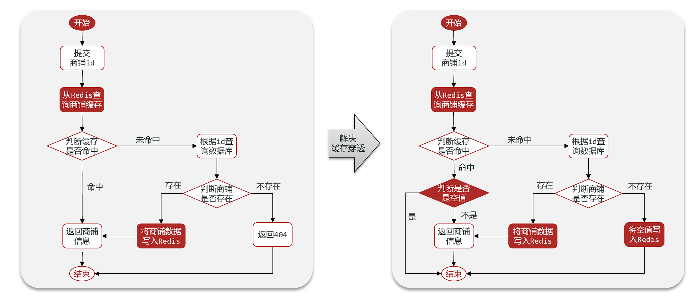

# 基础篇

## SQL与NoSQL

SQL（Structured Query Language）和NoSQL（Not Only SQL）是两种不同类型的数据库管理系统，它们在数据存储、查询、扩展性和使用场景上有显著区别。

### SQL（关系型数据库）

**特点：**

1. **结构化数据**：数据存储在预定义的表中，表由行和列组成。
2. **模式固定**：表结构（schema）在创建时定义，修改结构可能比较复杂。
3. **ACID事务**：支持原子性（Atomicity）、一致性（Consistency）、隔离性（Isolation）、持久性（Durability），确保数据完整性。
4. **标准化查询语言**：使用SQL进行数据操作和查询。
5. **关系模型**：支持表之间的复杂关系（如一对一、一对多、多对多）。

**常见SQL数据库：**

- MySQL
- PostgreSQL
- Oracle
- SQL Server

**适用场景：**

- 需要复杂查询和事务支持的场景（如金融系统、ERP）。
- 数据结构相对固定且关系明确的场景。

------

### NoSQL（非关系型数据库）

**特点：**

1. **灵活的数据模型**：支持文档、键值对、列族、图等多种数据格式，无需固定模式。
2. **高扩展性**：通常设计为分布式架构，易于水平扩展。
3. **高性能**：针对特定场景优化，读写速度较快。
4. **弱化事务支持**：部分NoSQL数据库不支持ACID事务，而是提供最终一致性（Eventual Consistency）。
5. **无固定查询语言**：每种NoSQL数据库有自己的查询方式。

**常见NoSQL数据库：**

- **文档型**：MongoDB、Couchbase
- **键值型**：Redis、DynamoDB
- **列族型**：Cassandra、HBase
- **图数据库**：Neo4j、ArangoDB

**适用场景：**

- 数据结构多变或非结构化的场景（如社交媒体、日志存储）。
- 需要高并发和水平扩展的场景（如大数据、实时分析）。
- 对事务一致性要求不高的场景。

------

### SQL vs NoSQL 对比

| 特性         | SQL                            | NoSQL                      |
| :----------- | :----------------------------- | :------------------------- |
| **数据模型** | 结构化，表格式                 | 灵活，支持文档、键值、图等 |
| **模式**     | 固定，需预先定义               | 动态，无需固定模式         |
| **扩展性**   | 垂直扩展（增加硬件性能）       | 水平扩展（增加节点）       |
| **事务支持** | 强（ACID）                     | 弱（通常为最终一致性）     |
| **查询语言** | SQL                            | 无统一语言，依赖具体数据库 |
| **性能**     | 适合复杂查询                   | 适合高并发和简单查询       |
| **适用场景** | 结构化数据、复杂关系、事务需求 | 非结构化数据、高扩展性需求 |

------

### 选择依据

1. **数据结构**：如果数据结构固定且关系复杂，选择SQL；如果数据结构多变，选择NoSQL。
2. **扩展需求**：需要水平扩展时，NoSQL更合适。
3. **事务需求**：需要强一致性事务时，选择SQL。
4. **性能需求**：高并发读写场景下，NoSQL通常表现更好。

在实际应用中，SQL和NoSQL可以结合使用，例如用SQL处理核心业务数据，用NoSQL处理日志或缓存数据。


## 认识Redis

Redis诞生于2009年全称是**Remote Dictionary Server**，远程词典服务器，是一个基于内存的键值型NoSQL数据库。

[Redis - The Real-time Data Platform](https://redis.io/)

**特征**：

- 键值（key-value）型，value支持多种不同数据结构，功能丰富
- 单线程，每个命令具备原子性
- 低延迟，速度快（基于内存、IO多路复用、良好的编码）。
- 支持数据持久化
- 支持主从集群、分片集群
- 支持多语言客户端


```bash
# Docker 创建 Redis 容器命令
docker run -d \
--log-opt max-size=100m \
--log-opt max-file=2 \
-p 6379:6379 \
--name redis \
-v /home/ysh/redis/conf/redis.conf:/etc/redis/redis.conf  \
-v /home/ysh/redis/data:/data \
-d redis redis-server /etc/redis/redis.conf \
--appendonly yes \
--requirepass 123456 #密码
```

> [!NOTE]
>
> -v /home/ysh/redis/conf/redis.conf:/etc/redis/redis.conf  \	#挂载配置文件
> -v /home/ysh/redis/data:/data \	#挂载数据卷


进入容器内部测试redis

```bash
docker exec -it redis /bin/bash

redis-cli -h localhost -p 6379 -a 123456

ping
```


## Redis通用命令

- KEYS：查看符合模板的所有key，支持通配符，**不建议在生产环境使用**
- DEL：删除一个（或多个）指定的key
- EXISTS：判断key是否存在
- EXPIRE：给一个key设置有效期（单位秒），有效期到期时该key会被自动删除，不设置有效期时默认为-1（永久有效）
- TTL：查看一个KEY的剩余有效期

> [!TIP]
>
> 通过help [command] 可以查看一个命令的具体用法


## key的结构

Redis没有类似MySQL中的Table的概念，我们该如何区分不同类型的key呢


Redis的key允许有多个单词形成层级结构，多个单词之间用':'隔开，格式如下：

*项目名:业务名:类型:id*


这个格式并非固定，也可以根据自己的需求来删除或添加词条。

例如我们的项目名称叫 heima，有user和product两种不同类型的数据，我们可以这样定义key：

user相关的key：heima:user:1

product相关的key：heima:product:1


## 数据类型


### String

String类型，也就是字符串类型，是Redis中最简单的存储类型。

其value是字符串，不过根据字符串的格式不同，又可以分为3类：

- string：普通字符串
- int：整数类型，可以做自增、自减操作
- float：浮点类型，可以做自增、自减操作

不管是哪种格式，底层都是**字节数组**形式存储，只不过是编码方式不同。字符串类型的最大空间不能超过512m.


String的常见命令有：

- SET：**添加或者修改**已经存在的一个String类型的键值对`SET key value`
- GET：根据key获取String类型的value`GET key`
- MSET：批量添加多个String类型的键值对
- MGET：根据多个key获取多个String类型的value
- INCR：让一个整型的key自增1
- INCRBY:让一个整型的key自增并指定步长，例如：incrby num 2 让num值自增2
- INCRBYFLOAT：让一个浮点类型的数字自增并指定步长
- SETNX：添加一个String类型的键值对，**前提是这个key不存在**，否则不执行
- SETEX：添加一个String类型的键值对，并且指定有效期


### Hash

Hash类型，也叫散列，其value是一个无序字典，类似于Java中的HashMap结构。


String结构是将对象序列化为JSON字符串后存储，当需要修改对象某个字段时很不方便

Hash结构可以将对象中的每个字段**独立存储**，可以针对单个字段做CRUD


Hash的常见命令有：

- HSET key field value：添加或者修改hash类型key的field的值
- HGET key field：获取一个hash类型key的field的值
- HMSET：批量添加多个hash类型key的field的值
- HMGET：批量获取多个hash类型key的field的值
- HGETALL：获取一个hash类型的key中的所有的field和value
- HKEYS：获取一个hash类型的key中的所有的field
- HVALS：获取一个hash类型的key中的所有的value
- HINCRBY:让一个hash类型key的字段值自增并指定步长
- HSETNX：添加一个hash类型的key的field值，前提是这个field不存在，否则不执行


### List

Redis中的List类型与Java中的LinkedList类似，可以看做是一个双向链表结构。既可以支持正向检索和也可以支持反向检索

特点：

- 有序
- 元素可以重复
- 插入和删除快
- 查询速度一般


List的常见命令有：

- LPUSH key element ... ：向列表左侧插入一个或多个元素
- LPOP key：移除并返回列表左侧的第一个元素，没有则返回nil
- RPUSH key element ... ：向列表右侧插入一个或多个元素
- RPOP key：移除并返回列表右侧的第一个元素
- LRANGE key star end：返回一段角标范围内的所有元素
- BLPOP和BRPOP：与LPOP和RPOP类似，只不过在没有元素时等待指定时间（**阻塞式**），而不是直接返回nil


### Set

Redis的Set结构与Java中的HashSet类似，可以看做是一个value为null的HashMap。因为也是一个hash表，因此具备与HashSet类似的特征

- 无序
- 元素不可重复
- 查找快
- 支持交集、并集、差集等功能


Set的常见命令有：

- SADD key member ... ：向set中添加一个或多个元素
- SREM key member ... : 移除set中的指定元素
- SCARD key： 返回set中元素的个数
- SISMEMBER key member：判断一个元素是否存在于set中
- SMEMBERS：获取set中的所有元素
- SINTER key1 key2 ... ：求key1与key2的交集
- SDIFF key1 key2 ... ：求key1与key2的差集
- SUNION key1 key2 ..：求key1和key2的并集


### SortedSet

Redis的SortedSet是一个可排序的set集合，与Java中的TreeSet有些类似，但底层数据结构却差别很大。SortedSet中的每一个元素都带有一个score属性，可以基于score属性对元素排序，底层的实现是一个跳表（SkipList）加 hash表。

- 可排序
- 元素不重复
- 查询速度快


SortedSet的常见命令有：

- ZADD key score member：添加一个或多个元素到sorted set ，如果已经存在则更新其score值
- ZREM key member：删除sorted set中的一个指定元素
- ZSCORE key member : 获取sorted set中的指定元素的score值
- ZRANK key member：获取sorted set 中的指定元素的排名（排名从0开始）
- ZCARD key：获取sorted set中的元素个数
- ZCOUNT key min max：统计score值在给定范围内的所有元素的个数
- ZINCRBY key increment member：让sorted set中的指定元素自增，步长为指定的increment值
- ZRANGE key min max：按照score排序后，获取指定排名范围内的元素
- ZRANGEBYSCORE key min max：按照score排序后，获取指定score范围内的元素
- ZDIFF、ZINTER、ZUNION：求差集、交集、并集

> [!CAUTION]
>
> 所有的排名默认都是升序，如果要降序则在命令的Z后面添加REV即可


## Java客户端

在Redis官网中提供了各种语言的客户端，地址：https://redis.io/clients


### Jedis

1.引入依赖

2.创建Jedis对象，建立连接

3.使用Jedis，方法名与Redis命令一致

4.释放资源


导入依赖

```xml
<dependency>
    <groupId>redis.clients</groupId>
    <artifactId>jedis</artifactId>
    <version>5.2.0</version>
</dependency>
```


使用客户端

```java
    public void setUp() {
        // 建立连接
        Jedis jedis = new Jedis("localhost", 6379);
        // 验证密码
        jedis.auth("123456");
        // 选择数据库
        jedis.select(0);
    }

    public void tearDown() {
        // 关闭连接
        if (jedis != null) {
            jedis.close();
        }
    }

    void testString() {
        jedis.set("ysh","666");

        String ysh = jedis.get("ysh");
    }

```

> [!TIP]
>
> API与Redis官方指令一致


**Jedis连接池**

Jedis本身是线程不安全的，并且频繁的创建和销毁连接会有性能损耗，因此推荐使用Jedis连接池代替Jedis的直连方式。

```java
public class JedisPoolConnection {
    // 声明一个静态的JedisPool对象，用于管理Jedis连接池
    private static final JedisPool jedisPool;

    // 静态代码块，在类加载时执行，用于初始化Jedis连接池
    static {
        // 创建JedisPoolConfig对象，用于配置连接池参数
        JedisPoolConfig config = new JedisPoolConfig();
        // 设置连接池中最多可以存在的连接数
        config.setMaxTotal(10);
        // 设置连接池中最多可以存在的空闲连接数
        config.setMaxIdle(10);
        // 设置连接池中最少可以存在的空闲连接数
        config.setMinIdle(5);
        // 设置连接池中当连接数达到最大值时，获取连接的最长等待时间
        config.setMaxWait(Duration.ofMillis(10000));

        // 创建JedisPool对象，传入配置信息、Redis服务器地址、端口、连接超时时间和密码
        jedisPool = new JedisPool(config,
                "localhost", 6379, 2000, "123456");
    }

    // 提供一个静态方法，用于获取Jedis连接
    public static Jedis getConnection() {
        // 从连接池中获取一个Jedis实例
        return jedisPool.getResource();
    }
}
```


### SpringDataRedis

SpringData是Spring中数据操作的模块，包含对各种数据库的集成，其中对Redis的集成模块就叫做SpringDataRedis，官网地址：https://spring.io/projects/spring-data-redis

- 提供了对不同Redis客户端的整合（Lettuce和Jedis）
- 提供了RedisTemplate统一API来操作Redis
- 支持Redis的发布订阅模型
- 支持Redis哨兵和Redis集群
- 支持基于Lettuce的响应式编程
- 支持基于JDK、JSON、字符串、Spring对象的数据序列化及反序列化
- 支持基于Redis的JDKCollection实现


1. 引入依赖

```xml
        <!-- redis -->
        <dependency>
            <groupId>org.springframework.boot</groupId>
            <artifactId>spring-boot-starter-data-redis</artifactId>
        </dependency>
        <!-- commons-pool2 -->
        <dependency>
            <groupId>org.apache.commons</groupId>
            <artifactId>commons-pool2</artifactId>
        </dependency>
```

> [!WARNING]
>
> 注意`commons-pool2`版本的兼容性问题


2. 编写配置文件

```yml
spring:
  data:
    redis:
      host: localhost
      port: 6379
      password: 123456
      lettuce:
        pool:
          enabled: true
          max-active: 8
          max-idle: 8
          min-idle: 0
          max-wait: 1000ms
      database: 0
```

> [!WARNING]
>
> SpringBoot2.x  配置redis的配置项为spring.redis


3. 注入RedisTemplate使用

```java
    @Autowired
    private RedisTemplate<String, String> redisTemplate;

    @Test
    void contextLoads() {
        redisTemplate.opsForValue().set("key", "value");
        Object key = redisTemplate.opsForValue().get("key");
        System.out.println("key = " + key);
    }
```


#### 序列化

RedisTemplate可以接收任意Object作为值写入Redis，只不过写入前会把Object序列化为字节形式，默认是采用JDK序列化

缺点：

- 可读性差
- 内存占用较大


我们可以自定义RedisTemplate的序列化方式：

```java
    @Bean
    public RedisTemplate<String, Object> redisTemplate(RedisConnectionFactory factory) {
        // 创建 RedisTemplate 对象
        RedisTemplate<String, Object> template = new RedisTemplate<>();

        // 设置连接工厂
        template.setConnectionFactory(factory);

        // 创建JSON序列化器
        GenericJackson2JsonRedisSerializer jackson2JsonRedisSerializer = new GenericJackson2JsonRedisSerializer();

        // 设置key的序列化器为String序列化器
        template.setKeySerializer(RedisSerializer.string());
        template.setHashKeySerializer(RedisSerializer.string());

        // 设置value的序列化器为JSON序列化器
        template.setValueSerializer(jackson2JsonRedisSerializer);
        template.setHashValueSerializer(jackson2JsonRedisSerializer);

        return template;
    }
```

> [!TIP]
>
> 需要引入Jackson依赖


### StringRedisTemplate

尽管JSON的序列化方式可以满足我们的需求，但依然存在一些问题


为了在反序列化时知道对象的类型，JSON序列化器会将类的class类型写入json结果中，存入Redis，会带来额外的内存开销。


为了节省内存空间，我们并不会使用JSON序列化器来处理value，而是统一使用String序列化器，要求只能存储String类型的key和value。当需要存储Java对象时，手动完成对象的序列化和反序列化。


Spring默认提供了一个**StringRedisTemplate**类，它的key和value的序列化方式默认就是String方式。省去了我们自定义RedisTemplate的过程

```java
    @Autowired
    private StringRedisTemplate stringRedisTemplate;

    private static final ObjectMapper mapper = new ObjectMapper();

    @Test
    void contextLoads() throws JsonProcessingException {
        User user = new User("ysh", 21);
        String json = mapper.writeValueAsString(user);
        stringRedisTemplate.opsForValue().set("user:1", json);

        String result = stringRedisTemplate.opsForValue().get("user:1");
        User user1 = mapper.readValue(result, User.class);
        System.out.println("user1 = " + user1);
    }
```

> [!TIP]
>
> 可以使用其它序列化工具如FastJson、hutool


---


# 实战篇

## 短信登录


## Redis实现缓存

**缓存**就是数据交换的缓冲区（称作Cache [ kæʃ ] ），是存贮数据的临时地方，一般读写性能较高


### 缓存更新策略


**解决方案**：

1. **`Cache Aside Pattern`**：由缓存的调用者，在更新数据库的同时更新缓存（<font color="red">推荐</font>）
2. **`Read/Write Through Pattern`**：缓存与数据库整合为一个服务，由服务来维护一致性。调用者调用该服务，无需关心缓存一致性问题。
3. **`Write Behind Caching Pattern`**：调用者只操作缓存，由其它线程异步的将缓存数据持久化到数据库，保证最终一致。


操作缓存和数据库时有三个问题需要考虑：

1.删除缓存还是更新缓存？

- 更新缓存：每次更新数据库都更新缓存，无效写操作较多❌

- 删除缓存：更新数据库时让缓存失效，查询时再更新缓存✔

2.如何保证缓存与数据库的操作的同时成功或失败？

- 单体系统，将缓存与数据库操作放在一个事务

- 分布式系统，利用TCC等分布式事务方案

3. 先操作缓存还是先操作数据库？

- 先写数据库，然后再删除缓存

- 要确保数据库与缓存操作的原子性


### 缓存穿透

**缓存穿透**是指客户端请求的数据在缓存中和数据库中都不存在，这样缓存永远不会生效，这些请求都会到达数据库。

常见的解决方案有两种：

- 缓存空对象
  - 优点：实现简单，维护方便
  - 缺点：
    - 额外的内存消耗
    - 可能造成短期的不一致

- 布隆过滤
  - 优点：内存占用较少，没有多余key
  - 缺点：
    - 实现复杂
    - 存在误判可能


**缓存空对象法**



**可行方案：**

- 缓存null值
- 布隆过滤
- 增强id的复杂度，避免被猜测id规律
- 做好数据的基础格式校验
- 加强用户权限校验
- 做好热点参数的限流


### 缓存雪崩

**缓存雪崩**是指在同一时段<font color=red>大量的缓存key同时失效或者Redis服务宕机</font>，导致大量请求到达数据库，带来巨大压力。

**解决方案：**

- 给不同的Key的TTL添加随机值
- 利用Redis集群提高服务的可用性
- 给缓存业务添加降级限流策略
- 给业务添加多级缓存


### 缓存击穿

**缓存击穿问题**也叫热点Key问题，就是一个被**高并发访问**并且**缓存重建业务较复杂**的key突然失效了，无数的请求访问会在瞬间给数据库带来巨大的冲击。

常见的解决方案有两种：

- 互斥锁
- 逻辑过期

| 解决方案 | 优点                                       | 缺点                                       |
| -------- | ------------------------------------------ | ------------------------------------------ |
| 互斥锁   | 没有额外内存消耗<br>保证一致性<br>实现简单 | 线程需要等待，性能受影响<br>可能有死锁风险 |
| 逻辑过期 | 线程无需等待，性能较好                     | 不保证一致性<br>有额外内存消耗<br>实现复杂 |


## 全局唯一ID

全局ID生成器，是一种在**分布式系统**下用来生成全局唯一ID的工具，需要满足以下特性：

- 唯一性
- 高可用
- 高性能
- 递增性
- 安全性


常见的实现方式包括UUID、Snowflake算法等。

### 1. UUID（Universally Unique Identifier）

UUID 是一个128位的标识符，通常表示为32个十六进制字符，分为5段（8-4-4-4-12）。UUID 的生成基于时间戳、随机数或硬件地址等，确保全局唯一性。

**示例：**

```
550e8400-e29b-41d4-a716-446655440000
```

**优点：**

- 无需中心化服务，分布式生成。
- 全球唯一性高。

**缺点：**

- 长度较长（36字符）。
- 无序，不适合作为数据库主键（可能导致索引碎片）。

------

### 2. Snowflake算法

Snowflake 是 Twitter 开源的分布式ID生成算法，生成一个64位的ID，结构如下：

- **1位**：符号位（固定为0）。
- **41位**：时间戳（毫秒级，可用69年）。
- **10位**：机器ID（支持1024个节点）。
- **12位**：序列号（每毫秒可生成4096个ID）。

**示例：**

```
1234567890123456789
```

**优点：**

- 短小精悍（64位整数）。
- 时间有序，适合作为数据库主键。
- 高性能，支持高并发。

**缺点：**

- 依赖系统时钟，时钟回拨可能导致ID冲突。
- 需要管理机器ID的分配。


### 3.Redis自增

```java
@Component
@RequiredArgsConstructor
public class RedisIdWorker {

    private final StringRedisTemplate redisTemplate;

    private final long BEGIN_TIME_STAMP = 1735689600L;

    public long nextId(String prefix) {

        LocalDateTime now = LocalDateTime.now();
        long epochSecond = now.toEpochSecond(ZoneOffset.UTC);
        long nowEpochSecond = epochSecond - BEGIN_TIME_STAMP;

        String date = now.format(DateTimeFormatter.ofPattern("yyyyMMdd"));
        long increment = redisTemplate.opsForValue().increment("icr:" + prefix + ":" + date);

        return nowEpochSecond << 32 | increment;
    }

}
```

> [!TIP]
>
> 时间戳 + 序列号


## 超卖问题

超卖问题（Overselling）是电商、秒杀、库存管理等场景中常见的核心问题，指系统**实际销售数量超过库存数量**，导致订单无法履约。

**原因**：

1. **并发请求冲突**
   - 多个用户同时请求购买同一商品，系统未正确处理并发扣减库存。
2. **数据库更新延迟**
   - 数据库读写分离时，从库同步延迟导致读取到旧库存数据。
3. **缓存与数据库不一致**
   - 缓存层（如 Redis）与数据库的库存数据未同步。
4. **非原子性操作**
   - 查询库存、扣减库存分步执行，中间过程被其他请求插入。


**解决方案**：

#### **1. 数据库层面：锁机制**

- **悲观锁（Pessimistic Lock）**
  通过 `SELECT ... FOR UPDATE` 锁定记录，确保串行操作。

  ```sql
  BEGIN;
  SELECT stock FROM products WHERE id=1 FOR UPDATE;
  UPDATE products SET stock = stock - 1 WHERE id=1;
  COMMIT;
  ```

  **缺点**：高并发下性能差，可能引发死锁。

- **乐观锁（Optimistic Lock）**
  使用版本号或库存字段本身作为条件更新。

  ```sql
  UPDATE products 
  SET stock = stock - 1, version = version + 1 
  WHERE id=1 AND stock > 0 AND version = {current_version};
  ```

  **优点**：无锁竞争，适合高并发。
  **缺点**：需处理更新失败（如重试或提示用户）。

#### **2. 分布式锁**

- **Redis 锁**
  使用 `SET key value NX EX` 实现原子锁：

  ```python
  lock = redis.set("product_1_lock", "locked", nx=True, ex=5)
  if lock:
      try:
          # 扣减库存逻辑
      finally:
          redis.delete("product_1_lock")
  ```

  **注意**：需解决锁过期和误删问题（如 Redlock 算法）。

#### **3. 缓存层原子操作**

- **Redis 原子扣减**
  利用 Redis 的原子命令（如 `DECR` 或 Lua 脚本）：

  ```lua
  -- Lua 脚本（原子扣减库存）
  local stock = tonumber(redis.call('GET', KEYS[1]))
  if stock > 0 then
      redis.call('DECR', KEYS[1])
      return 1  -- 成功
  else
      return 0  -- 失败
  end
  ```

  **优点**：高性能，避免直接穿透到数据库。

- **预扣库存（预占机制）**
  用户下单时先在 Redis 中扣减库存，异步同步到数据库：

  ```python
  if redis.decr("product_1_stock") >= 0:
      # 创建订单，异步更新数据库
  else:
      # 恢复库存：redis.incr("product_1_stock")
  ```

#### **4. 消息队列削峰**

- 将请求放入队列（如 Kafka、RabbitMQ），由消费者顺序处理：

  ```python
  # 生产者（用户请求入队）
  producer.send("order_topic", {"user_id": 123, "product_id": 1})
  
  # 消费者（顺序扣减库存）
  consumer.subscribe("order_topic")
  for message in consumer:
      process_order(message)
  ```

  **优点**：流量削峰，保证最终一致性。


## 一人一单

### 单实例部署

某些业务只允许用户进行一次交易

但当一个用户同一时间发起多个请求时，就有可能发生一人多单问题（多个线程都查询到数据库中并没有订单存在，都可以创建订单）


可以对数据操作代码加锁同步

```java
synchronized (userId.toString().intern()) {
            // 获取代理对象，解决spring事务失效问题
            IVoucherOrderService proxy =(IVoucherOrderService) AopContext.currentProxy();
            return proxy.createOrder(id, userId);
        }
```

> [!TIP]
>
> 以上代码只对同一个用户加锁，避免不同用户被阻塞的性能问题（intern()将字符串加入字符串常量池，避免同一个用户id有多个对象，同步失效）
>
> Spring的事务管理基于AOP代理对象实现，如果在类的方法内调用自身的方法，等同于this.xxx()，并没有通过代理对象实现事务增强，解决方案为先获取代理对象，然后再通过代理对象调用该方法
>
> 需要引入`aspectjweaver`依赖，并在启动类上加上`@EnableAspectJAutoProxy(exposeProxy = true)`注解


### 多实例部署

> [!CAUTION]
>
> 以上方案在多实例集群模式下仍会发生线程安全问题


原因是多个实例各自都有自身的`JVM`去实现同步锁，无法共享


解决方案：

​	**分布式锁**：满足分布式系统或集群模式下多进程可见并且互斥的锁

- 多进程可见
- 互斥
- 高性能
- 安全性
- 高可用


常见实现方式

|        | MySQL              | Redis                    | Zookeeper                  |
| ------ | ------------------ | ------------------------ | -------------------------- |
| 互斥   | 利用本身互斥锁机制 | 利用setnx这类互斥命令    | 利用节点唯一性和有序性实现 |
| 高可用 | 优秀               | 优秀                     | 优秀                       |
| 高性能 | 一般               | 优秀                     | 一般                       |
| 安全性 | 断开连接自动释放锁 | 锁到期自动释放，避免死锁 | 临时节点断开连接自动释放   |


## 基于Redis的分布式锁

### 简单实现

实现分布式锁时需要实现的两个基本方法：

- 获取锁：

```bash
SET lock thread1 EX 10 NX
```

> [!CAUTION]
>
> EX参数设置过期时间，NX参数实现与`SETNX`相同的功能
>
> 不建议直接使用`SETNX`,因为无法同时设置过期时间，可能发生获得锁后服务宕机，而未设置过期时间，最终导致死锁。


- 释放锁：

```bash
DEL lock
```


示例：

```java
    @Override
    public boolean tryLock(long timeout) {
        // 获取当前线程ID
        long threadId = Thread.currentThread().getId();

        Boolean success = stringRedisTemplate.opsForValue()
                .setIfAbsent(KEY_PREFIX + name, threadId + "", timeout, TimeUnit.SECONDS);

        return Boolean.TRUE.equals(success);
    }

    @Override
    public void unlock() {
        // 释放锁
        stringRedisTemplate.delete(KEY_PREFIX + name);
    }
```


### 锁误删问题

主要发生在某个线程阻塞时锁超时释放了，其他线程就可以获得锁，当被阻塞的线程恢复后就会删除不属于自己的锁


**解决方案**

为线程的锁加入唯一标识，释放前判断锁是否属于自己

> [!TIP]
>
> 可使用UUID


#### 原子性问题

如果查询和删除锁不能原子性执行，就仍然有可能发生锁误删问题


**Lua脚本**

Redis提供了Lua脚本功能，在一个脚本中编写多条Redis命令，确保多条命令执行时的原子性。Lua是一种编程语言，它的基本语法大家可以参考网站：https://www.runoob.com/lua/lua-tutorial.html


Redis可以通过如下命令执行Lua脚本

```lua
EVAL "<脚本内容>"

-- 示例

EVAL "return redis.call('set','key','value')" 0
```

> [!TIP]
>
> 参数**0**表示需要的key类型的参数个数


脚本中的key、value可以作为参数传递。key类型参数会放入`KEYS`数组，其它参数会放入`ARGV`数组，在脚本中可以从KEYS和ARGV数组获取这些参数：

```lua
EVAL "return redis.call('set',KEYS[1],ARGV[1])" 1 key value
```


释放锁脚本示例：

```lua
-- 获取key
local key = KEYS[1]

-- 获取线程ID
local threadId = ARGV[1]

local id = redis.call('get',key)

if(id == threadId)
then
    return redis.call('del',key)
end
return 0
```


```java
   	private static final DefaultRedisScript<Long> UNLOCK_SCRIPT;

    static {
        UNLOCK_SCRIPT = new DefaultRedisScript<>();
        UNLOCK_SCRIPT.setLocation(new ClassPathResource("unlock.lua"));
        UNLOCK_SCRIPT.setResultType(Long.class);
    }    
	
		// 执行Lua脚本释放锁
        stringRedisTemplate.execute(
                UNLOCK_SCRIPT,
                Collections.singletonList(KEY_PREFIX + name),
                ID_PREFIX + Thread.currentThread().getId()
        );
```


### Redission

基于`SETNX`实现的分布式锁存在下面的问题


**Redisson**是一个在Redis的基础上实现的Java驻内存数据网格（In-Memory Data Grid）。它不仅提供了一系列的分布式的Java常用对象，还提供了许多分布式服务，其中就包含了各种分布式锁的实现。

官网地址： [https://redisson.org](https://redisson.org/)


#### 快速入门

引入依赖

```xml
        <dependency>
            <groupId>org.redisson</groupId>
            <artifactId>redisson</artifactId>
            <version>3.36.0</version>
        </dependency>
```


配置Redisson

```java
@Configuration
public class RedisConfig {
    @Bean
    public RedissonClient redisson() {
        // 配置Redisson
        Config config = new Config();
        config.useSingleServer()
                .setAddress("redis://localhost:6379")
                .setPassword("123456");
        
        // 创建Redisson客户端
        return Redisson.create(config);
    }
}
```


在业务中注入`RedissonClient`然后获取锁即可


#### 可重入锁原理

利用hash结构记录线程id和重入次数


获取锁

```lua
local key = KEYS[1]; -- 锁的key
local threadId = ARGV[1]; -- 线程唯一标识
local releaseTime = ARGV[2]; -- 锁的自动释放时间
-- 判断是否存在
if(redis.call('exists', key) == 0) then
    -- 不存在, 获取锁
    redis.call('hset', key, threadId, '1'); 
    -- 设置有效期
    redis.call('expire', key, releaseTime); 
    return 1; -- 返回结果
end;
-- 锁已经存在，判断threadId是否是自己
if(redis.call('hexists', key, threadId) == 1) then
    -- 不存在, 获取锁，重入次数+1
    redis.call('hincrby', key, threadId, '1'); 
    -- 设置有效期
    redis.call('expire', key, releaseTime); 
    return 1; -- 返回结果
end;
return 0; -- 代码走到这里,说明获取锁的不是自己，获取锁失败
```

释放锁

```lua
local key = KEYS[1]; -- 锁的key
local threadId = ARGV[1]; -- 线程唯一标识
local releaseTime = ARGV[2]; -- 锁的自动释放时间
-- 判断当前锁是否还是被自己持有
if (redis.call('HEXISTS', key, threadId) == 0) then
    return nil; -- 如果已经不是自己，则直接返回
end;
-- 是自己的锁，则重入次数-1
local count = redis.call('HINCRBY', key, threadId, -1);
-- 判断是否重入次数是否已经为0 
if (count > 0) then
    -- 大于0说明不能释放锁，重置有效期然后返回
    redis.call('EXPIRE', key, releaseTime);
    return nil;
else  -- 等于0说明可以释放锁，直接删除
    redis.call('DEL', key);
    return nil;
end;
```


#### 重试机制和看门狗

•**可重试**：利用信号量和PubSub功能实现等待、唤醒，获取锁失败的重试机制

•**超时续约**：利用watchDog，每隔一段时间（releaseTime / 3），重置超时时间


#### 主从一致性

原理：多个独立的Redis节点，必须在所有节点都获取重入锁，才算获取锁成功

缺陷：运维成本高、实现复杂


## 基于Redis的消息队列

> [!TIP]
>
> 消息队列可参考 [RabbitMQ](./../SpringCloud/SpringCloud微服务.md)

**消息队列**（**M**essage **Q**ueue），字面意思就是存放消息的队列。最简单的消息队列模型包括3个角色：

- 消息队列：存储和管理消息，也被称为消息代理（Message Broker）

- 生产者：发送消息到消息队列
- 消费者：从消息队列获取消息并处理消息


Redis提供了三种不同的方式来实现消息队列：

- list结构：基于List结构模拟消息队列
- PubSub：基本的点对点消息模型
- Stream：比较完善的消息队列模型


### 使用list实现

Redis的list数据结构是一个双向链表，很容易模拟出队列效果。队列是入口和出口不在一边，因此我们可以利用：LPUSH 结合 RPOP、或者 RPUSH 结合 LPOP来实现。

不过要注意的是，当队列中没有消息时RPOP或LPOP操作会返回null，并不像JVM的阻塞队列那样会阻塞并等待消息。因此这里应该使用**BRPOP**或者**BLPOP**来实现阻塞效果。


基于List的消息队列有哪些优缺点？

优点：

- 利用Redis存储，不受限于JVM内存上限
- 基于Redis的持久化机制，数据安全性有保证
- 可以满足消息有序性

缺点：

- 无法避免消息丢失
- 只支持单消费者


### 使用PubSub实现

**PubSub**（发布订阅）是Redis2.0版本引入的消息传递模型。顾名思义，消费者可以订阅一个或多个channel，生产者向对应channel发送消息后，所有订阅者都能收到相关消息。

- `SUBSCRIBE channel [channel]` ：订阅一个或多个频道
- `PUBLISH channel msg` ：向一个频道发送消息
- `PSUBSCRIBE pattern[pattern]` ：订阅与pattern格式匹配的所有频道


优点：

- 采用发布订阅模型，支持多生产、多消费

缺点：

- 不支持数据持久化
- 无法避免消息丢失
- 消息堆积有上限，超出时数据丢失


### 使用Stream实现

`Stream`是Redis5.0引入的一种数据类型，可以实现功能较完善的消息队列


发送消息


> [!NOTE]
>
> `xadd user * name ysh age 22`  


读取消息


> [!NOTE]
>
> `xread cout 1 block 2000 streams user $` 阻塞式读取

<font color=red>注意：</font>当我们指定起始ID为$时，代表读取最新的消息，如果我们处理一条消息的过程中，又有超过1条以上的消息到达队列，则下次获取时也只能获取到最新的一条，会出现漏读消息的问题


STREAM类型消息队列的XREAD命令特点：

- 消息可回溯
- 一个消息可以被多个消费者读取
- 可以阻塞读取
- 有消息漏读的风险


**消费者组**


```bash
# 创建消费者组
xgroup create key groupName ID

# 删除消费者组
xgroup destroy key groupName

# 将消费者添加到消费者组
xgroup createconsumer key groupName consumerName

# 删除消费者组中的消费者
xgroup delconsumer key groupName consumerName
```


## Feed流模式（推流）

Feed流产品有两种常见的模式：

- TimeLine:不做内容筛选，简单的按照内容发布时间排序，常用于好友或关注。例如朋友圈
  - 优点：信息全面，不会有缺失，并且实现也相对简单
  - 优点：信息噪音多，用户不一定感兴趣，内容获取效率低
- 智能排序:利用智能算法屏蔽违规的、用户不感兴趣的内容，推送用户感兴趣的信息来吸引用户
  - 优点：投喂用户感兴趣的信息，用户黏度很高，容易沉迷
  - 缺点：算法如果不精准，可能起反作用


推送方式：

- 拉模式：消费端主动拉取（读要求高，不推荐）

- 推模式：生产者主动推送（写要求高，用户量少时推荐）

- 推拉结合：以上两者结合（用户千万以上推荐）

> [!TIP]
>
> 实现方式：
>
> 创建发件箱和收件箱，按照推送方式将推送内容的标识（通常为ID）发送到对应位置


Feed流中的数据会不断更新，数据的角标也会变化，所以不能使用传统的分页查询

> [!NOTE]
>
> 应该采用滚动分页法，即每次查询记录最后一条数据的值而不是角标，下一次查询再从该元素开始
>
> 每次查询时需要的参数为 上次查询最后一条记录的值，与上一条记录值相同的记录数（offset）


## GEO数据机构（Redis）

GEO就是Geolocation的简写形式，代表地理坐标。Redis在3.2版本中加入了对GEO的支持，允许存储地理坐标信息，帮助我们根据经纬度来检索数据。常见的命令有：

[GEOADD](https://redis.io/commands/geoadd)：添加一个地理空间信息，包含：经度（longitude）、纬度（latitude）、值（member）

[GEODIST](https://redis.io/commands/geodist)：计算指定的两个点之间的距离并返回

[GEOHASH](https://redis.io/commands/geohash)：将指定member的坐标转为hash字符串形式并返回

[GEOPOS](https://redis.io/commands/geopos)：返回指定member的坐标

[GEORADIUS](https://redis.io/commands/georadius)：指定圆心、半径，找到该圆内包含的所有member，并按照与圆心之间的距离排序后返回。6.2以后已废弃

[GEOSEARCH](https://redis.io/commands/geosearch)：在指定范围内搜索member，并按照与指定点之间的距离排序后返回。范围可以是圆形或矩形。6.2.新功能

[GEOSEARCHSTORE](https://redis.io/commands/geosearchstore)：与GEOSEARCH功能一致，不过可以把结果存储到一个指定的key。 6.2.新功能


## BitMap

> [!NOTE]
>
> 把每一个bit位对应当月的每一天，形成了映射关系。用0和1标示业务状态，这种思路就称为**位图（BitMap**）。

**Redis**中是利用string类型数据结构实现**BitMap**，因此最大上限是512M，转换为bit则是 2^32个bit位。

BitMap的操作命令有：

[SETBIT](https://redis.io/commands/setbit)：向指定位置（offset）存入一个0或1

[GETBIT](https://redis.io/commands/getbit) ：获取指定位置（offset）的bit值

[BITCOUNT](https://redis.io/commands/bitcount) ：统计BitMap中值为1的bit位的数量

[BITFIELD](https://redis.io/commands/bitfield) ：操作（查询、修改、自增）BitMap中bit数组中的指定位置（offset）的值

[BITFIELD_RO](https://redis.io/commands/bitfield_ro) ：获取BitMap中bit数组，并以十进制形式返回

[BITOP](https://redis.io/commands/bitop) ：将多个BitMap的结果做位运算（与 、或、异或）

[BITPOS](https://redis.io/commands/bitpos) ：查找bit数组中指定范围内第一个0或1出现的位置


该数据结构适用于用户**签到类业务**

**问题1**：什么叫做连续签到天数？

从最后一次签到开始向前统计，直到遇到第一次未签到为止，计算总的签到次数，就是连续签到天数。


**问题2**：如何得到本月到今天为止的所有签到数据？

 BITFIELD key GET u[dayOfMonth] 0


**问题3**：如何从后向前遍历每个bit位？

与 1 做（按位）与运算，就能得到最后一个bit位。

随后右移1位，下一个bit位就成为了最后一个bit位。


## HyperLogLog&&UV统计

- **UV**：全称**U**nique **V**isitor，也叫独立访客量，是指通过互联网访问、浏览这个网页的自然人。1天内同一个用户多次访问该网站，只记录1次。

- **PV**：全称**P**age **V**iew，也叫页面访问量或点击量，用户每访问网站的一个页面，记录1次PV，用户多次打开页面，则记录多次PV。往往用来衡量网站的流量。


UV统计在服务端做会比较麻烦，因为要判断该用户是否已经统计过了，需要将统计过的用户信息保存。但是如果每个访问的用户都保存到Redis中，数据量会非常恐怖。


Hyperloglog(HLL)是从Loglog算法派生的概率算法，用于确定非常大的集合的基数，而不需要存储其所有值。相关算法原理可以参考：[https://juejin.cn/post/6844903785744056333#heading-0](https://juejin.cn/post/6844903785744056333)

Redis中的HLL是基于string结构实现的，单个HLL的内存永远小于16kb，内存占用低的令人发指！作为代价，其测量结果是概率性的，有小于0.81％的误差。不过对于UV统计来说，这完全可以忽略。

> [!NOTE]
>
> Redis命令
>
> `PFADD`
>
> `PFCOUNT`


```java
// 测试代码
    @Test
    public void testHyperLogLog() {
        String[] values = new String[10000];
        int j;
        for (int i = 0; i < 1000000; i++) {
            j = i % 10000;
            values[j] = "user_" + i;
            if (j == 9999) {
                stringRedisTemplate.opsForHyperLogLog().add("hll", values);
            }
        }
        Long hll = stringRedisTemplate.opsForHyperLogLog().size("hll");
        System.out.println("hll = " + hll);
    }
```


---

# 高级篇

## 分布式缓存

单机Redis存在如下问题：

1. 数据丢失问问题
   - 实现持久化

2. 并发不足问题
   - 搭建主从集群

3. 存储能力问题
   - 搭建分片集群

4. 故障恢复问题
   - 利用哨兵机制


### Redis持久化

Redis有两种持久化方案：

- RDB持久化
- AOF持久化


#### RDB持久化

RDB全称Redis Database Backup file（Redis数据备份文件），也被叫做Redis数据快照。简单来说就是把内存中的所有数据都记录到磁盘中。当Redis实例故障重启后，从磁盘读取快照文件，恢复数据。快照文件称为RDB文件，默认是保存在当前运行目录。


RDB持久化在四种情况下会执行：

- 执行save命令（会阻塞主进程）
- 执行bgsave命令（异步执行）
- Redis停机时
- 触发RDB条件时


Redis内部有触发RDB的机制，可以在redis.conf文件中找到，格式如下：

```properties
# 900秒内，如果至少有1个key被修改，则执行bgsave ， 如果是save "" 则表示禁用RDB
save 900 1  
save 300 10  
save 60 10000 
```


RDB的其它配置也可以在redis.conf文件中设置：

```properties
# 是否压缩 ,建议不开启，压缩也会消耗cpu，磁盘的话不值钱
rdbcompression yes

# RDB文件名称
dbfilename dump.rdb  

# 文件保存的路径目录
dir ./ 
```


bgsave开始时会fork主进程得到子进程，子进程共享主进程的内存数据。完成fork后读取内存数据并写入 RDB 文件。

fork采用的是copy-on-write技术（写时复制）：

- 当主进程执行读操作时，访问共享内存；
- 当主进程执行写操作时，则会拷贝一份数据，执行写操作。


RDB方式bgsave的基本流程？

- fork主进程得到一个子进程，共享内存空间
- 子进程读取内存数据并写入新的RDB文件
- 用新RDB文件替换旧的RDB文件

RDB会在什么时候执行？save 60 1000代表什么含义？

- 默认是服务停止时
- 代表60秒内至少执行1000次修改则触发RDB

RDB的缺点？

- RDB执行间隔时间长，两次RDB之间写入数据有丢失的风险
- fork子进程、压缩、写出RDB文件都比较耗时


#### AOF持久化

AOF全称为Append Only File（追加文件）。Redis处理的每一个写命令都会记录在AOF文件，可以看做是命令日志文件。


AOF**默认是关闭的**，需要修改redis.conf配置文件来开启AOF：

```properties
# 是否开启AOF功能，默认是no
appendonly yes
# AOF文件的名称
appendfilename "appendonly.aof"
```


AOF的命令记录的频率也可以通过redis.conf文件来配置：

```properties
# 表示每执行一次写命令，立即记录到AOF文件
appendfsync always 
# 写命令执行完先放入AOF缓冲区，然后表示每隔1秒将缓冲区数据写到AOF文件，是默认方案
appendfsync everysec 
# 写命令执行完先放入AOF缓冲区，由操作系统决定何时将缓冲区内容写回磁盘
appendfsync no
```

对比：

| 配置项   | 存盘机制     | 优点     | 缺点            |
| -------- | ------------ | -------- | --------------- |
| Always   | 同步         | 可靠性高 | 性能影响大      |
| everysec | 每秒         | 性能适中 | 可能丢失1秒数据 |
| no       | 操作系统控制 | 性能最好 | 可靠性差        |


**AOF文件重写**

因为是记录命令，AOF文件会比RDB文件大的多。而且AOF会记录对同一个key的多次写操作，但只有最后一次写操作才有意义。通过执行`bgrewriteaof`命令，**可以让AOF文件执行重写功能，用最少的命令达到相同效果**。

Redis也会在触发阈值时自动去重写AOF文件。阈值也可以在redis.conf中配置：

```properties
# AOF文件比上次文件 增长超过多少百分比则触发重写
auto-aof-rewrite-percentage 100
# AOF文件体积最小多大以上才触发重写 
auto-aof-rewrite-min-size 64mb 
```


对比

|                | RDB                      | AOF                                           |
| -------------- | ------------------------ | --------------------------------------------- |
| 持久化方式     | 定时做内存快照           | 记录写命令                                    |
| 数据完整性     | 不完整，为备份的数据丢失 | 相对完整，取决于存盘策略                      |
| 文件大小       | 有压缩机制，体积小       | 记录命令，体积大                              |
| 宕机恢复速度   | 很快                     | 慢                                            |
| 数据恢复优先级 | 低                       | 高（因为完整性更高）                          |
| 系统资源占用   | 高，大量CPU和内存消耗    | 低，主要占用磁盘IO（文件重写时占用CPU和内存） |
| 使用场景       | 可以容忍部分数据丢失     | 对数据完整性要求高                            |


### 主从集群

### 哨兵

### 分片集群

以上内容详见笔记[SpringCloud-Redis](./../SpringCloud/SpringCloud微服务.md)


## 多级缓存

传统的缓存策略一般是请求到达Tomcat后，先查询Redis，如果未命中则查询数据库

存在下面的问题：

- 请求要经过Tomcat处理，Tomcat的性能成为整个系统的瓶颈

- Redis缓存失效时，会对数据库产生冲击


**多级缓存**就是充分利用请求处理的每个环节，分别添加缓存，减轻Tomcat压力，提升服务性能：

- 浏览器访问静态资源时，优先读取浏览器本地缓存
- 访问非静态资源（ajax查询数据）时，访问服务端
- 请求到达Nginx后，优先读取Nginx本地缓存
- 如果Nginx本地缓存未命中，则去直接查询Redis（不经过Tomcat）
- 如果Redis查询未命中，则查询Tomcat
- 请求进入Tomcat后，优先查询JVM进程缓存
- 如果JVM进程缓存未命中，则查询数据库


在多级缓存架构中，Nginx内部需要编写本地缓存查询、Redis查询、Tomcat查询的业务逻辑，因此这样的nginx服务不再是一个**反向代理服务器**，而是一个编写**业务的Web服务器了**。


> [!TIP]
>
> nginx和tomcat都可以采用集群模式


### JVM进程缓存

#### Caffeine

- 分布式缓存，例如Redis：
  - 优点：存储容量更大、可靠性更好、可以在集群间共享
  - 缺点：访问缓存有网络开销
  - 场景：缓存数据量较大、可靠性要求较高、需要在集群间共享
- 进程本地缓存，例如HashMap、GuavaCache：
  - 优点：读取本地内存，没有网络开销，速度更快
  - 缺点：存储容量有限、可靠性较低、无法共享
  - 场景：性能要求较高，缓存数据量较小


**Caffeine**是一个基于Java8开发的，提供了近乎最佳命中率的高性能的本地缓存库。目前Spring内部的缓存使用的就是Caffeine。GitHub地址：https://github.com/ben-manes/caffeine

```xml
        <dependency>
            <groupId>com.github.ben-manes.caffeine</groupId>
            <artifactId>caffeine</artifactId>
        </dependency>
```


**基本使用**

```java
@Test
void testBasicOps() {
    // 构建cache对象
    Cache<String, String> cache = Caffeine.newBuilder().build();

    // 存数据
    cache.put("gf", "迪丽热巴");

    // 取数据
    String gf = cache.getIfPresent("gf");
    System.out.println("gf = " + gf);

    // 取数据，包含两个参数：
    // 参数一：缓存的key
    // 参数二：Lambda表达式，表达式参数就是缓存的key，方法体是查询数据库的逻辑
    // 优先根据key查询JVM缓存，如果未命中，则执行参数二的Lambda表达式
    String defaultGF = cache.get("defaultGF", key -> {
        // 根据key去数据库查询数据
        return "柳岩";
    });
    System.out.println("defaultGF = " + defaultGF);
}
```


Caffeine提供了三种缓存清除策略：

- **基于容量**：设置缓存的数量上限

  ```java
  // 创建缓存对象
  Cache<String, String> cache = Caffeine.newBuilder()
      .maximumSize(1) // 设置缓存大小上限为 1
      .build();
  ```

- **基于时间**：设置缓存的有效时间

  ```java
  // 创建缓存对象
  Cache<String, String> cache = Caffeine.newBuilder()
      // 设置缓存有效期为 10 秒，从最后一次写入开始计时 
      .expireAfterWrite(Duration.ofSeconds(10)) 
      .build();
  
  ```

- **基于引用**：设置缓存为软引用或弱引用，利用GC来回收缓存数据。性能较差，不建议使用。

> [!CAUTION]
>
> 在默认情况下，当一个缓存元素过期的时候，Caffeine不会自动立即将其清理和驱逐。而是在一次读或写操作后，或者在空闲时间完成对失效数据的驱逐。


#### 案例

```java
@Configuration
public class CaffeineConfig {

    @Bean
    public Cache<Long, Item> itemCache(){
        return Caffeine.newBuilder()
                .initialCapacity(100)
                .maximumSize(10_000)
                .build();
    }
}


@RestController
@RequestMapping("item")
public class ItemController {

    @Autowired
    private IItemService itemService;

    @Autowired
    private Cache<Long, Item> itemCache;

    @GetMapping("/{id}")
    public Item findById(@PathVariable("id") Long id) {
        // 先查询缓存，再判断是否查询数据库
        return itemCache.get(id, key -> itemService.query()
                .ne("status", 3)
                .eq("id", key)
                .one()
        );
    }
}
```


### Lua入门

`Nginx`编程需要用到Lua语言，Lua 是一种轻量小巧的脚本语言，用标准C语言编写并以源代码形式开放， 其设计目的是为了嵌入应用程序中，从而为应用程序提供灵活的扩展和定制功能。官网：https://www.lua.org/

> [!NOTE]
>
> Lua经常嵌入到C语言开发的程序中，例如游戏开发、游戏插件等。
>
> Nginx本身也是C语言开发，因此也允许基于Lua做拓展。


#### 变量

Lua中支持的常见数据类型包括：


> [!TIP]
>
> Lua提供了type()函数来判断一个变量的数据类型
>
> print(type('hello world')) --------> string


Lua**声明变量**的时候无需指定数据类型，而是用local来声明变量为局部变量：

```lua
-- 声明字符串，可以用单引号或双引号，
local str = 'hello'
-- 字符串拼接可以使用 ..
local str2 = 'hello' .. 'world'
-- 声明数字
local num = 21
-- 声明布尔类型
local flag = true
```

Lua中的table类型既可以作为数组，又可以作为Java中的map来使用。数组就是特殊的table，key是数组角标而已：

```lua
-- 声明数组 ，key为角标的 table
local arr = {'java', 'python', 'lua'}
-- 声明table，类似java的map
local map =  {name='Jack', age=21}
```

Lua中的数组角标是从1开始，访问的时候与Java中类似：

```lua
-- 访问数组，lua数组的角标从1开始
print(arr[1])
```

Lua中的table可以用key来访问：

```lua
-- 访问table
print(map['name'])
print(map.age)
```


#### 循环

遍历数组：

```lua
-- 声明数组 key为索引的 table
local arr = {'java', 'python', 'lua'}
-- 遍历数组
for index,value in ipairs(arr) 
do
    print(index, value) 
end
```

遍历普通table

```lua
-- 声明map，也就是table
local map = {name='Jack', age=21}
-- 遍历table
for key,value in pairs(map) do
   print(key, value) 
end
```


#### 函数

定义函数的语法：

```lua
function 函数名(argument1, argument2..., argumentn)
    -- 函数体
    return 返回值
end


-- 示例
function printArr(arr)
    for index, value in ipairs(arr) do
        print(value)
    end
end
```


#### 条件控制

```lua
if(布尔表达式)
then
   --[ 布尔表达式为 true 时执行该语句块 --]
else
   --[ 布尔表达式为 false 时执行该语句块 --]
end
```


与java不同，布尔表达式中的逻辑运算是基于英文单词：


### OpenResty

OpenResty® 是一个基于 Nginx的高性能 Web 平台，用于方便地搭建能够处理超高并发、扩展性极高的动态 Web 应用、Web 服务和动态网关。具备下列特点：

- 具备Nginx的完整功能
- 基于Lua语言进行扩展，集成了大量精良的 Lua 库、第三方模块
- 允许使用Lua**自定义业务逻辑**、**自定义库**

官方网站： https://openresty.org/cn/


#### OpenResty监听请求

OpenResty的很多功能都依赖于其目录下的Lua库，需要在nginx.conf中指定依赖库的目录，并导入依赖：

1. 添加对OpenResty的Lua模块的加载

修改`/usr/local/openresty/nginx/conf/nginx.conf`文件，在其中的http下面，添加下面代码：

```nginx
#lua 模块
lua_package_path "/usr/local/openresty/lualib/?.lua;;";
#c模块     
lua_package_cpath "/usr/local/openresty/lualib/?.so;;";  
```


2. 监听/api/item路径

修改`/usr/local/openresty/nginx/conf/nginx.conf`文件，在nginx.conf的server下面，添加对/api/item这个路径的监听：

```nginx
location  /api/item {
    # 默认的响应类型
    default_type application/json;
    # 响应结果由lua/item.lua文件来决定
    content_by_lua_file lua/item.lua;
}
```


3. 在`/usr/loca/openresty/nginx/lua`文件夹下，新建文件：item.lua

```lua
ngx.say('内容')
```


#### 请求参数处理

`openresty`提供了API获取请求参数


#### 查询Tomcat

nginx提供了内部API用以发送http请求：

```lua
local resp = ngx.location.capture("/path",{
    method = ngx.HTTP_GET,   -- 请求方式
    args = {a=1,b=2},  -- get方式传参数（POST方式使用body）
})
```

返回的响应内容包括：

- resp.status：响应状态码
- resp.header：响应头，是一个table
- resp.body：响应体，就是响应数据


注意：这里的path是路径，并不包含IP和端口。这个请求会被nginx内部的server监听并处理。

但是我们希望这个请求发送到Tomcat服务器，所以还需要编写一个server来对这个路径做反向代理：

```nginx
 location /path {
     # Tomcat地址
     proxy_pass http://IP:PORT; 
 }
```


#### **封装http工具**

在`/usr/local/openresty/lualib`目录下，新建一个common.lua文件：

```sh
vi /usr/local/openresty/lualib/common.lua
```

内容如下:

```lua
-- 封装函数，发送http请求，并解析响应
local function read_http(path, params)
    local resp = ngx.location.capture(path,{
        method = ngx.HTTP_GET,
        args = params,
    })
    if not resp then
        -- 记录错误信息，返回404
        ngx.log(ngx.ERR, "http请求查询失败, path: ", path , ", args: ", args)
        ngx.exit(404)
    end
    return resp.body
end
-- 将方法导出
local _M = {  
    read_http = read_http
}  
return _M
```

> [!TIP]
>
> 这个工具将read_http函数封装到_M这个table类型的变量中，并且返回，这类似于导出。
>
> 使用的时候，可以利用`require('common')`来导入该函数库，这里的common是函数库的文件名。


#### **CJSON工具类**

OpenResty提供了一个cjson的模块用来处理JSON的序列化和反序列化。

官方地址： https://github.com/openresty/lua-cjson/

1. 引入cjson模块：

```lua
local cjson = require "cjson"
```

2. 序列化

```lua
local obj = {
    name = 'jack',
    age = 21
}
-- 把 table 序列化为 json
local json = cjson.encode(obj)
```

3. 反序列化

```lua
local json = '{"name": "jack", "age": 21}'
-- 反序列化 json为 table
local obj = cjson.decode(json);
print(obj.name)
```


#### 基于ID负载均衡

实际开发中，OpenResty需要对tomcat集群做负载均衡。

而默认的负载均衡规则是轮询模式，例如，当我们查询/item/10001时：

- 第一次会访问8081端口的tomcat服务，在该服务内部就形成了JVM进程缓存
- 第二次会访问8082端口的tomcat服务，该服务内部没有JVM缓存（因为JVM缓存无法共享），会查询数据库
- ...

> [!WARNING]
>
> 该情况下缓存并没有产生效果


ginx提供了基于请求路径做负载均衡的算法：

nginx根据请求路径做hash运算，把得到的数值对tomcat服务的数量取余，余数是几，就访问第几个服务，实现负载均衡。

> [!TIP]
>
> 例如：
>
> - 我们的请求路径是 /item/10001
> - tomcat总数为2台（8081、8082）
> - 对请求路径/item/1001做hash运算求余的结果为1
> - 则访问第一个tomcat服务，也就是8081
>
> 只要id不变，每次hash运算结果也不会变，那就可以保证同一个商品，一直访问同一个tomcat服务，确保JVM缓存生效。


**实现**

修改`/usr/local/openresty/nginx/conf/nginx.conf`文件，实现基于ID做负载均衡。

首先，定义tomcat集群，并设置基于路径做负载均衡：

```nginx 
upstream tomcat-cluster {
    hash $request_uri;
    server 192.168.150.1:8081;
    server 192.168.150.1:8082;
}
```

然后，修改对tomcat服务的反向代理，目标指向tomcat集群：

```nginx
location /item {
    proxy_pass http://tomcat-cluster;
}
```

重新加载OpenResty

```sh
nginx -s reload
```


#### Redis缓存

**Redis缓存预热**

Redis缓存会面临冷启动问题：

**冷启动**：服务刚刚启动时，Redis中并没有缓存，如果所有商品数据都在第一次查询时添加缓存，可能会给数据库带来较大压力。

**缓存预热**：在实际开发中，我们可以利用**大数据统计**用户访问的热点数据，在项目启动时将这些**热点数据**提前查询并保存到Redis中。

> [!TIP]
>
> 可以利用`InitializingBean`接口来实现，因为`InitializingBean`中的方法`afterPropertiesSet`可以在对象被Spring创建并且成员变量全部注入后执行。


**查询Redis缓存**

当请求进入OpenResty之后：

- 优先查询Redis缓存
- 如果Redis缓存未命中，再查询Tomcat


OpenResty提供了操作Redis的模块，我们只要引入该模块就能直接使用。但是为了方便，我们将Redis操作封装到之前的common.lua工具库中。

修改`/usr/local/openresty/lualib/common.lua`文件：

1. 引入Redis模块，并初始化Redis对象

```lua
-- 导入redis
local redis = require('resty.redis')
-- 初始化redis
local red = redis:new()
red:set_timeouts(1000, 1000, 1000)
```


2. 封装函数，用来释放Redis连接，其实是放入连接池

```lua
-- 关闭redis连接的工具方法，其实是放入连接池
local function close_redis(red)
    local pool_max_idle_time = 10000 -- 连接的空闲时间，单位是毫秒
    local pool_size = 100 --连接池大小
    local ok, err = red:set_keepalive(pool_max_idle_time, pool_size)
    if not ok then
        ngx.log(ngx.ERR, "放入redis连接池失败: ", err)
    end
end
```


3. 封装函数，根据key查询Redis数据

```lua
-- 查询redis的方法 ip和port是redis地址，key是查询的key
local function read_redis(ip, port, key)
    -- 获取一个连接
    local ok, err = red:connect(ip, port)
    if not ok then
        ngx.log(ngx.ERR, "连接redis失败 : ", err)
        return nil
    end
    -- 查询redis
    local resp, err = red:get(key)
    -- 查询失败处理
    if not resp then
        ngx.log(ngx.ERR, "查询Redis失败: ", err, ", key = " , key)
    end
    --得到的数据为空处理
    if resp == ngx.null then
        resp = nil
        ngx.log(ngx.ERR, "查询Redis数据为空, key = ", key)
    end
    close_redis(red)
    return resp
end
```


4. 导出

```lua
-- 将方法导出
local _M = {  
    read_http = read_http,
    read_redis = read_redis
}  
return _M
```


#### Nginx本地缓存

OpenResty为Nginx提供了**shared dict**的功能，可以在nginx的多个worker之间共享数据，实现缓存功能。

1. 开启共享字典，在nginx.conf的http下添加配置：

```nginx
 # 共享字典，也就是本地缓存，名称叫做：item_cache，大小150m
 lua_shared_dict item_cache 150m; 
```


2. 操作共享字典：

```lua
-- 获取本地缓存对象
local item_cache = ngx.shared.item_cache
-- 存储, 指定key、value、过期时间，单位s，默认为0代表永不过期
item_cache:set('key', 'value', 1000)
-- 读取
local val = item_cache:get('key')
```


示例

```lua
-- 导入共享词典，本地缓存
local item_cache = ngx.shared.item_cache

-- 封装查询函数
function read_data(key, expire, path, params)
    -- 查询本地缓存
    local val = item_cache:get(key)
    if not val then
        ngx.log(ngx.ERR, "本地缓存查询失败，尝试查询Redis， key: ", key)
        -- 查询redis
        val = read_redis("127.0.0.1", 6379, key)
        -- 判断查询结果
        if not val then
            ngx.log(ngx.ERR, "redis查询失败，尝试查询http， key: ", key)
            -- redis查询失败，去查询http
            val = read_http(path, params)
        end
    end
    -- 查询成功，把数据写入本地缓存
    item_cache:set(key, val, expire)
    -- 返回数据
    return val
end
```


### 缓存同步

> [!NOTE]
>
> 大多数情况下，浏览器查询到的都是缓存数据，如果缓存数据与数据库数据存在较大差异，可能会产生比较严重的后果。
>
> 所以我们必须保证数据库数据、缓存数据的一致性，这就是缓存与数据库的同步。
>


#### 缓存同步策略

1. **设置有效期**：给缓存设置有效期，到期后自动删除。再次查询时更新

   - 优势：简单、方便

   - 缺点：时效性差，缓存过期之前可能不一致

   - 场景：更新频率较低，时效性要求低的业务


2. **同步双写**：在修改数据库的同时，直接修改缓存

   - 优势：时效性强，缓存与数据库强一致

   - 缺点：有代码侵入，耦合度高；

   - 场景：对一致性、时效性要求较高的缓存数据


3. **异步通知：**修改数据库时发送事件通知，相关服务监听到通知后修改缓存数据

   - 优势：低耦合，可以同时通知多个缓存服务

   - 缺点：时效性一般，可能存在中间不一致状态

   - 场景：时效性要求一般，有多个服务需要同步


异步通知有两种实现方式，基于`MQ`（有少量的代码侵入）或者`Canal`（代码零侵入）


#### Canal

**Canal [kə'næl]**，译意为水道/管道/沟渠，canal是阿里巴巴旗下的一款开源项目，基于Java开发。基于数据库增量日志解析，提供增量数据订阅&消费。GitHub的地址：https://github.com/alibaba/canal


Canal是基于mysql的主从同步来实现的（Canal就是把自己**伪装成MySQL的一个slave节点**，从而监听master的binary log变化），再把得到的变化信息通知给Canal的客户端，进而完成对其它数据库的同步。


配置安装过程详见[Canal安装](./安装Canal.md)


#### 监听Canal

我们可以利用Canal提供的Java客户端，监听Canal通知消息。当收到变化的消息时，完成对缓存的更新。

可以使用GitHub上的第三方开源的canal-starter客户端。地址：https://github.com/NormanGyllenhaal/canal-client

与SpringBoot完美整合，自动装配。


1. 引入依赖

```xml
<dependency>
    <groupId>top.javatool</groupId>
    <artifactId>canal-spring-boot-starter</artifactId>
    <version>1.2.1-RELEASE</version>
</dependency>
```


2. 配置文件

```yaml
canal:
  destination: heima # canal的集群名字，要与安装canal时设置的名称一致
  server: 192.168.150.101:11111 # canal服务地址
```


3. 修改实体类

​	通过`@Id`、`@Column` 等注解完成实体类与数据库表字段的映射

```java
@Data
@TableName("tb_item")
public class Item {
    @TableId(type = IdType.AUTO)
    @Id
    private Long id;//商品id
    
    @Column(name = "name")
    private String name;//商品名称
    
    private String title;//商品标题
    private Long price;//价格（分）
    private String image;//商品图片
    private String category;//分类名称
    private String brand;//品牌名称
    private String spec;//规格
    private Integer status;//商品状态 1-正常，2-下架
    private Date createTime;//创建时间
    private Date updateTime;//更新时间
    
    @TableField(exist = false)
    @Transient	// 不属于数据库表的数据
    private Integer stock;
    
    @TableField(exist = false)
    @Transient
    private Integer sold;
}
```


4. 编写监听器

通过实现`EntryHandler<T>`接口编写监听器，监听Canal消息。注意两点：

- 实现类通过`@CanalTable("tb_item")`指定监听的表信息
- `EntryHandler`的泛型是与表对应的实体类

```java
@CanalTable("tb_item")	// 监听的数据库表名
@Component
public class ItemHandler implements EntryHandler<Item> {

    @Autowired
    private RedisHandler redisHandler;	// 封装的Redis操作类，可使用StringRedisTemplate类代替
    @Autowired
    private Cache<Long, Item> itemCache;

    @Override
    public void insert(Item item) {
        // 写数据到JVM进程缓存
        itemCache.put(item.getId(), item);
        // 写数据到redis
        redisHandler.saveItem(item);
    }

    @Override
    public void update(Item before, Item after) {
        // 写数据到JVM进程缓存
        itemCache.put(after.getId(), after);
        // 写数据到redis
        redisHandler.saveItem(after);
    }

    @Override
    public void delete(Item item) {
        // 删除数据到JVM进程缓存
        itemCache.invalidate(item.getId());
        // 删除数据到redis
        redisHandler.deleteItemById(item.getId());
    }
}
```


## Redis最佳实践

> [!NOTE]
>
> Redis使用经验总结


### Redis键值设计

#### 优雅的key结构

Redis的Key虽然可以自定义，但最好遵循下面的几个最佳实践约定：

- 遵循基本格式：[业务名称]:[数据名]:[id]
- 长度不超过44字节
- 不包含特殊字符


这样设计的好处：

- 可读性强
- 避免key冲突
- 方便管理
- 更节省内存： key是string类型，底层编码包含int、embstr和raw三种。embstr在小于44字节使用，采用连续内存空间，内存占用更小。当字节数大于44字节时，会转为raw模式存储，在raw模式下，内存空间不是连续的，而是采用一个指针指向了另外一段内存空间，在这段空间里存储SDS内容，这样空间不连续，访问的时候性能也就会收到影响，还有可能产生内存碎片


#### 拒绝BigKey

BigKey通常以Key的大小和Key中成员的数量来综合判定，例如：

- Key本身的数据量过大：一个String类型的Key，它的值为5 MB
- Key中的成员数过多：一个ZSET类型的Key，它的成员数量为10,000个
- Key中成员的数据量过大：一个Hash类型的Key，它的成员数量虽然只有1,000个但这些成员的Value（值）总大小为100 MB

> [!TIP]
>
> redis中可使用命令`MEMORY USAGE key`查看Key占用内存


推荐值：

- 单个key的value小于10KB
- 对于集合类型的key，建议元素数量小于1000


##### **BigKey的危害**

- 网络阻塞
  - 对BigKey执行读请求时，少量的QPS就可能导致带宽使用率被占满，导致Redis实例，乃至所在物理机变慢
- 数据倾斜
  - BigKey所在的Redis实例内存使用率远超其他实例，无法使数据分片的内存资源达到均衡
- Redis阻塞
  - 对元素较多的hash、list、zset等做运算会耗时较旧，使主线程被阻塞
- CPU压力
  - 对BigKey的数据序列化和反序列化会导致CPU的使用率飙升，影响Redis实例和本机其它应用


##### **发现BigKey**

1. `redis-cli --bigkeys` 命令

> [!NOTE]
>
> 利用redis-cli提供的--bigkeys参数，可以遍历分析所有key，并返回Key的整体统计信息与每个数据的Top1的key（不一定是BigKey）


2. scan扫描

编程，利用scan扫描Redis中的所有key，利用strlen、hlen等命令判断key的长度（此处不建议使用MEMORY USAGE）


3. 第三方工具

利用第三方工具，如 Redis-Rdb-Tools 分析RDB快照文件，全面分析内存使用情况

> [!TIP] 
>
> 官网 https://github.com/sripathikrishnan/redis-rdb-tools


4. 网络监控

- 自定义工具，监控进出Redis的网络数据，超出预警值时主动告警
- 一般阿里云搭建的云服务器就有相关监控页面


##### **删除BigKaey**

BigKey内存占用较多，即便时删除这样的key也需要耗费很长时间，导致Redis主线程阻塞，引发一系列问题。

- redis 3.0 及以下版本
  - 如果是集合类型，则遍历BigKey的元素，先逐个删除子元素，最后删除BigKey

- Redis 4.0以后
  - Redis在4.0后提供了异步删除的命令：`unlink`


#### 恰当的数据类型

1. **例1：比如存储一个User对象，我们有三种存储方式：**

##### ①方式一：json字符串

| user:1 | {"name": "Jack", "age": 21} |
| :----: | :-------------------------: |

优点：实现简单粗暴

缺点：数据耦合，不够灵活

##### ②方式二：字段打散

| user:1:name | Jack |
| :---------: | :--: |
| user:1:age  |  21  |

优点：可以灵活访问对象任意字段

缺点：占用空间大、没办法做统一控制

##### ③方式三：hash（推荐）

<table>
	<tr>
		<td rowspan="2">user:1</td>
        <td>name</td>
        <td>jack</td>
	</tr>
	<tr>
		<td>age</td>
		<td>21</td>
	</tr>
</table>


优点：底层使用ziplist，空间占用小，可以灵活访问对象的任意字段

缺点：代码相对复杂


2. **例2：假如有hash类型的key，其中有100万对field和value，field是自增id，这个key存在什么问题？如何优化？**

<table>
	<tr style="color:red">
		<td>key</td>
        <td>field</td>
        <td>value</td>
	</tr>
	<tr>
		<td rowspan="3">someKey</td>
		<td>id:0</td>
        <td>value0</td>
	</tr>
    <tr>
		<td>.....</td>
        <td>.....</td>
	</tr>
    <tr>
        <td>id:999999</td>
        <td>value999999</td>
    </tr>
</table>

> [!WARNING]
>
> 存在的问题：
>
> - hash的entry数量超过500时，会使用哈希表而不是ZipList，内存占用较多
> - 可以通过hash-max-ziplist-entries配置entry上限。但是如果entry过多就会导致BigKey问题
>


##### 方案一

拆分为string类型

<table>
	<tr style="color:red">
		<td>key</td>
        <td>value</td>
	</tr>
	<tr>
		<td>id:0</td>
        <td>value0</td>
	</tr>
    <tr>
		<td>.....</td>
        <td>.....</td>
	</tr>
    <tr>
        <td>id:999999</td>
        <td>value999999</td>
    </tr>
</table>

> [!WARNING]
>
> 存在的问题：
>
> - string结构底层没有太多内存优化，内存占用较多
>
> - 想要批量获取这些数据比较麻烦
>


##### 方案二（推荐）

拆分为小的hash，将 `id / 100` 作为key， 将 `id % 100` 作为field，这样每100个元素为一个Hash

> [!TIP]
>
> `100` 可按实际选择例如 `500` 同样可行

<table>
	<tr style="color:red">
		<td>key</td>
        <td>field</td>
        <td>value</td>
	</tr>
	<tr>
        <td rowspan="3">key:0</td>
		<td>id:00</td>
        <td>value0</td>
	</tr>
    <tr>
		<td>.....</td>
        <td>.....</td>
	</tr>
    <tr>
        <td>id:99</td>
        <td>value99</td>
    </tr>
    <tr>
        <td rowspan="3">key:1</td>
		<td>id:00</td>
        <td>value100</td>
	</tr>
    <tr>
		<td>.....</td>
        <td>.....</td>
	</tr>
    <tr>
        <td>id:99</td>
        <td>value199</td>
    </tr>
    <tr>
    	<td colspan="3">....</td>
    </tr>
    <tr>
        <td rowspan="3">key:9999</td>
		<td>id:00</td>
        <td>value999900</td>
	</tr>
    <tr>
		<td>.....</td>
        <td>.....</td>
	</tr>
    <tr>
        <td>id:99</td>
        <td>value999999</td>
    </tr>
</table>


### 批处理优化

#### MSET

redis处理指令是很快的，主要花费的时候在于网络传输。于是乎很容易想到将多条指令批量的传输给redis


Redis提供了很多Mxxx这样的命令，可以实现批量插入数据，例如：

- mset
- hmset


插入10万条数据

```java
void testMxx() {
    String[] arr = new String[2000];
    int j;
    long b = System.currentTimeMillis();
    for (int i = 1; i <= 100000; i++) {
        j = (i % 1000) << 1;
        arr[j] = "test:key_" + i;
        arr[j + 1] = "value_" + i;
        if (j == 0) {
            jedis.mset(arr);
        }
    }
    long e = System.currentTimeMillis();
    System.out.println("time: " + (e - b));
}
```

> [!WARNING]
>
> 不要在一次批处理中传输太多数据，否则单次命令占用带宽过多，导致网络阻塞


#### Pipline（管道）

MSET虽然可以批处理，但是却只能操作部分数据类型，因此如果有对复杂数据类型的批处理需要，建议使用Pipeline

```java
@Test
void testPipeline() {
    // 创建管道
    Pipeline pipeline = jedis.pipelined();
    long b = System.currentTimeMillis();
    for (int i = 1; i <= 100000; i++) {
        // 放入命令到管道
        pipeline.set("test:key_" + i, "value_" + i);
        if (i % 1000 == 0) {
            // 每放入1000条命令，批量执行
            pipeline.sync();
        }
    }
    long e = System.currentTimeMillis();
    System.out.println("time: " + (e - b));
}
```


#### 集群下的批处理

如MSET或Pipeline这样的批处理需要在一次请求中携带多条命令，而此时如果Redis是一个集群，那批处理命令的多个key必须落在**同一个插槽**中，否则就会导致执行失败。


**解决方案**

1. 第一种方案：
   - 串行执行，所以这种方式没有什么意义，当然，执行起来就很简单了，缺点就是耗时过久。

2. 第二种方案：
   - 串行slot，简单来说，就是执行前，客户端先计算一下对应的key的slot，一样slot的key就放到一个组里边，不同的，就放到不同的组里边，然后对每个组执行pipeline的批处理，他就能串行执行各个组的命令，这种做法比第一种方法耗时要少，但是缺点呢，相对来说复杂一点，所以这种方案还需要优化一下

3. 第三种方案：
   - 并行slot，相较于第二种方案，在分组完成后串行执行，第三种方案，就变成了并行执行各个命令，所以他的耗时就非常短，但是实现呢，也更加复杂。

4. 第四种：
   - hash_tag，redis计算key的slot的时候，其实是根据key的有效部分来计算的，通过这种方式就能一次处理所有的key，这种方式耗时最短，实现也简单，但是如果通过操作key的有效部分，那么就会导致所有的key都落在一个节点上，产生数据倾斜的问题，所以我们推荐使用第三种方式。


- Jedis代码实现

```java
    @Test
    void testMSet2() {
        Map<String, String> map = new HashMap<>(3);
        map.put("name", "Jack");
        map.put("age", "21");
        map.put("sex", "Male");
        //对Map数据进行分组。根据相同的slot放在一个分组
        //key就是slot，value就是一个组
        Map<Integer, List<Map.Entry<String, String>>> result = map.entrySet()
                .stream()
                .collect(Collectors.groupingBy(
                        entry -> ClusterSlotHashUtil.calculateSlot(entry.getKey()))
                );
        //串行的去执行mset的逻辑
        for (List<Map.Entry<String, String>> list : result.values()) {
            String[] arr = new String[list.size() * 2];
            int j = 0;
            for (int i = 0; i < list.size(); i++) {
                j = i<<2;
                Map.Entry<String, String> e = list.get(0);
                arr[j] = e.getKey();
                arr[j + 1] = e.getValue();
            }
            jedisCluster.mset(arr);
        }
    }
```


- Srping下的实现

```java
   @Test
    void testMSetInCluster() {
        Map<String, String> map = new HashMap<>(3);
        map.put("name", "Rose");
        map.put("age", "21");
        map.put("sex", "Female");
        stringRedisTemplate.opsForValue().multiSet(map);


        List<String> strings = stringRedisTemplate.opsForValue().multiGet(Arrays.asList("name", "age", "sex"));
        strings.forEach(System.out::println);

    }
```


### 服务器端优化

#### 持久化配置

几点建议：

* 用来做缓存的Redis实例尽量不要开启持久化功能
* 建议关闭RDB持久化功能，使用AOF持久化
* 利用脚本定期在slave节点做RDB，实现数据备份
* 设置合理的rewrite阈值，避免频繁的bgrewrite
* 配置no-appendfsync-on-rewrite = yes，禁止在rewrite期间做aof，避免因AOF引起的阻塞
* 部署有关建议：
  * Redis实例的物理机要预留足够内存，应对fork和rewrite
  * 单个Redis实例内存上限不要太大，例如4G或8G。可以加快fork的速度、减少主从同步、数据迁移压力
  * 不要与CPU密集型应用部署在一起
  * 不要与高硬盘负载应用一起部署。例如：数据库、消息队列


#### 慢查询

在Redis执行时耗时超过某个阈值的命令，称为慢查询。


慢查询的危害：

- 由于Redis是单线程的，所以当客户端发出指令后，他们都会进入到redis底层的queue来执行，如果此时有一些慢查询的数据，就会导致大量请求阻塞，从而引起报错


慢查询的阈值可以通过配置指定：

- `slowlog-log-slower-than`：慢查询阈值，单位是微秒。默认是10000，建议1000

慢查询会被放入慢查询日志中，日志的长度有上限，可以通过配置指定：

- `slowlog-max-len`：慢查询日志（本质是一个队列）的长度。默认是128，建议1000


查看慢查询日志列表：

* `slowlog len`：查询慢查询日志长度
* `slowlog get [n]`：读取n条慢查询日志
* `slowlog reset`：清空慢查询列表


#### 命令及安全配置

Redis会绑定在0.0.0.0:6379，这样将会将Redis服务暴露到公网上，而Redis如果没有做身份认证，会出现严重的安全漏洞.
漏洞重现方式：https://cloud.tencent.com/developer/article/1039000


漏洞出现的核心的原因有以下几点：

* Redis未设置密码
* 利用了Redis的config set命令动态修改Redis配置
* 使用了Root账号权限启动Redis


> [!TIP]

一些建议：

* Redis一定要设置密码
* 禁止线上使用下面命令：keys、flushall、flushdb、config set等命令。可以利用rename-command禁用。
* bind：限制网卡，禁止外网网卡访问
* 开启防火墙
* 不要使用Root账户启动Redis
* 尽量不是有默认的端口


#### 内存配置

当Redis内存不足时，可能导致Key频繁被删除、响应时间变长、QPS不稳定等问题。当内存使用率达到90%以上时就需要我们警惕，并快速定位到内存占用的原因。


| **内存占用** | **说明**                                                     |
| ------------ | ------------------------------------------------------------ |
| 数据内存     | 是Redis最主要的部分，存储Redis的键值信息。主要问题是BigKey问题、内存碎片问题 |
| 进程内存     | Redis主进程本身运行肯定需要占用内存，如代码、常量池等等；这部分内存大约几兆，在⼤多数生产环境中与Redis数据占用的内存相比可以忽略。 |
| 缓冲区内存   | 一般包括客户端缓冲区、AOF缓冲区、复制缓冲区等。客户端缓冲区又包括输入缓冲区和输出缓冲区两种。这部分内存占用波动较大，不当使用BigKey，可能导致内存溢出。 |


查看Redis目前的内存分配状态：

* `info memory`：查看内存分配的情况

* `memory xxx`：查看key的主要占用情况


内存缓冲区常见的有三种：

* 复制缓冲区：主从复制的 `repl_backlog_buf`，如果太小可能导致频繁的全量复制，影响性能。通过 `replbacklog-size` 来设置，默认1mb
* AOF缓冲区：AOF刷盘之前的缓存区域，AOF执行rewrite的缓冲区。无法设置容量上限
* 客户端缓冲区：分为输入缓冲区和输出缓冲区，输入缓冲区最大1G且不能设置。输出缓冲区可以设置

> [!CAUTION]
>
> 最可能发生问题的就是客户端输出缓冲区


#### 服务器端集群优化

集群虽然具备高可用特性，能实现自动故障恢复，但是如果使用不当，也会存在一些问题：

* 集群完整性问题
* 集群带宽问题
* 数据倾斜问题
* 客户端性能问题
* 命令的集群兼容性问题
* lua和事务问题


 **问题1、在Redis的默认配置中，如果发现任意一个插槽不可用，则整个集群都会停止对外服务：** 

大家可以设想一下，如果有几个slot不能使用，那么此时整个集群都不能用了，我们在开发中，其实最重要的是可用性，所以需要把如下配置修改成no，即有slot不能使用时，我们的redis集群还是可以对外提供服务

```properties
cluster-require-full-coverage no
```


**问题2、集群带宽问题**

集群节点之间会不断的互相Ping来确定集群中其它节点的状态。每次Ping携带的信息至少包括：

* 插槽信息
* 集群状态信息

集群中节点越多，集群状态信息数据量也越大，10个节点的相关信息可能达到1kb，此时每次集群互通需要的带宽会非常高，这样会导致集群中大量的带宽都会被ping信息所占用，这是一个非常可怕的问题，所以我们需要去解决这样的问题

**解决途径：**

* 避免大集群，集群节点数不要太多，最好少于1000，如果业务庞大，则建立多个集群。
* 避免在单个物理机中运行太多Redis实例
* 配置合适的 `cluster-node-timeout` 值


**问题3、命令的集群兼容性问题**

有关这个问题咱们已经探讨过了，当我们使用批处理的命令时，redis要求我们的key必须落在相同的slot上，然后大量的key同时操作时，是无法完成的，所以客户端必须要对这样的数据进行处理，这些方案我们之前已经探讨过了，所以不再这个地方赘述了。


**问题4、lua和事务的问题**

lua和事务都是要保证原子性问题，如果key不在一个节点，那么是无法保证lua的执行和事务的特性的，所以在集群模式是没有办法执行lua和事务的


> [!IMPORTANT]
>
> **集群还是主从**
>
> 单体Redis（主从Redis）已经能达到万级别的QPS，并且也具备很强的高可用特性。如果主从能满足业务需求的情况下，所以如果不是在万不得已的情况下，尽量不搭建Redis集群


---

# 原理篇

> [!IMPORTANT]
>
> 深入 `Redis` 底层

## 数据结构

> [!NOTE]
>
> `Redis` 底层基于 C语言 实现

### 动态字符串SDS

字符串是Redis中最常用的一种数据结构。不过Redis没有直接使用C语言中的字符串，因为C语言字符串存在很多问题：

- 获取字符串长度的需要通过运算
- 非二进制安全
- 不可修改

> [!TIP]
>
> 二进制安全：
>
> ​	C 字符串依赖 `\0` 判断结尾，若字符串中包含 `\0`（如图片、音频等二进制数据），会被截断。


因此，Redis构建了一种新的字符串结构，称为简单动态字符串（Simple Dynamic String），简称**SDS**。


> [!TIP]
>
> `Redis` 定义了多种大小不同的 SDS 结构，以上只是一个示例


SDS之所以叫做动态字符串，是因为它具备动态扩容的能力

1. 假如我们要给SDS追加一段字符串，首先会申请新内存空间：

2. 如果新字符串小于1MB，则新空间为扩展后字符串长度的两倍+1；

3. 如果新字符串大于1MB，则新空间为扩展后字符串长度+1M+1。称为内存预分配。


> [!NOTE]
>
> SDS优点
>
> - 获取字符串长度的时间复杂度为 O(1)
> - 支持动态扩容
> - 减少内存分配次数（分配内存有一定性能开销）
> - 二进制安全


### IntSet

IntSet是Redis中set集合的一种实现方式，基于整数数组来实现，并且具备长度可变、有序等特征。


其中的encoding包含三种模式，表示存储的整数大小不同：


为了方便查找，Redis会将intset中所有的整数按照升序依次保存在contents数组中，结构如图：


如果新插入的数字超出了int16_t的范围，intset会自动升级编码方式到合适的大小。
以当前案例来说流程如下：

* 升级编码为INTSET_ENC_INT32, 每个整数占4字节，并按照新的编码方式及元素个数扩容数组
* 倒序依次将数组中的元素拷贝到扩容后的正确位置
* 将待添加的元素放入数组末尾
* 最后，将inset的encoding属性改为INTSET_ENC_INT32，将length属性加1


Intset可以看做是特殊的整数数组，具备一些特点：

* Redis会确保Intset中的元素唯一、有序
* 具备类型升级机制，可以节省内存空间
* 底层采用二分查找方式来查询


### Dict

Redis是一个键值型（Key-Value Pair）的数据库，我们可以根据键实现快速的增删改查。而键与值的映射关系正是通过Dict来实现的。


Dict由三部分组成，分别是：哈希表（DictHashTable）、哈希节点（DictEntry）、字典（Dict）


当我们向Dict添加键值对时，Redis首先根据key计算出hash值（h），然后利用 `(h & sizemask)` 来计算元素应该存储到数组中的哪个索引位置。


#### **Dict扩容**

Dict中的HashTable就是数组结合单向链表的实现，当集合中元素较多时，必然导致哈希冲突增多，链表过长，则查询效率会大大降低。可采取扩容解决。

Dict在每次新增键值对时都会检查负载因子（**LoadFactor = used/size**） ，满足以下两种情况时会触发哈希表扩容：

- 哈希表的 LoadFactor >= 1，并且服务器没有执行 BGSAVE 或者 BGREWRITEAOF 等后台进程
- 哈希表的 LoadFactor > 5 
- 删除元素后如果 LoadFactor < 0.1，会触发哈希表收缩


#### **Dict的rehash**

不管是扩容还是收缩，必定会创建新的哈希表，导致哈希表的size和sizemask变化，而key的查询与sizemask有关。

因此必须对哈希表中的每一个key重新计算索引，插入新的哈希表，这个过程称为rehash。过程是这样的：

* 计算新hash表的realeSize，值取决于当前要做的是扩容还是收缩：
  * 如果是扩容，则新size为第一个大于等于dict.ht[0].used + 1的2^n
  * 如果是收缩，则新size为第一个大于等于dict.ht[0].used的2^n （不得小于4）

* 按照新的realeSize申请内存空间，创建dictht，并赋值给dict.ht[1]
* 设置dict.rehashidx = 0，标示开始rehash
* ~~将dict.ht[0]中的每一个dictEntry都rehash到dict.ht[1]~~
* 每次新增、查询、修改、删除操作时，都检查dict.rehashidx是否大于-1,如果大于则将dict.ht[0].table[rehashidx]的entry链表rehash到dict.ht[1]，并且将rehashidx++。直至所有数据迁移。

> [!NOTE]
>
> 以上过程称为 **渐进式rehash**

* 将dict.ht[1]赋值给dict.ht[0]，给dict.ht[1]初始化为空哈希表，释放原来的dict.ht[0]的内存
* 在rehash过程中，新增操作，则直接写入ht[1]，查询、修改和删除则会在dict.ht[0]和dict.ht[1]依次查找并执行。这样可以确保ht[0]的数据只减不增，随着rehash最终为空


### ZipList

ZipList 是一种特殊的“双端队列” ，由一系列特殊编码的**连续内存**块组成。可以在任意一端进行压入/弹出操作, 并且该操作的时间复杂度为 O(1)。


| **属性** | **类型** | **长度** | **用途**                                                     |
| -------- | -------- | -------- | ------------------------------------------------------------ |
| zlbytes  | uint32_t | 4 字节   | 记录整个压缩列表占用的内存字节数                             |
| zltail   | uint32_t | 4 字节   | 记录压缩列表表尾节点距离压缩列表的起始地址有多少字节，通过这个偏移量，可以确定表尾节点的地址。 |
| zllen    | uint16_t | 2 字节   | 记录了压缩列表包含的节点数量。 最大值为UINT16_MAX （65534），如果超过这个值，此处会记录为65535，但节点的真实数量需要遍历整个压缩列表才能计算得出。 |
| entry    | 列表节点 | 不定     | 压缩列表包含的各个节点，节点的长度由节点保存的内容决定。     |
| zlend    | uint8_t  | 1 字节   | 特殊值 0xFF （十进制 255 ），用于标记压缩列表的末端。        |


#### **ZipListEntry**

ZipList 中的Entry并不像普通链表那样记录前后节点的指针，因为记录两个指针要占用16个字节，浪费内存。而是采用了下面的结构：


* previous_entry_length：前一节点的长度，占1个或5个字节。
  * 如果前一节点的长度小于254字节，则采用1个字节来保存这个长度值
  * 如果前一节点的长度大于254字节，则采用5个字节来保存这个长度值，第一个字节为0xfe，后四个字节才是真实长度数据

* encoding：编码属性，记录content的数据类型（字符串还是整数）以及长度，占用1个、2个或5个字节
* contents：负责保存节点的数据，可以是字符串或整数


#### **Encoding编码**

encoding编码分为字符串和整数两种

- 如果encoding是以“00”、“01”或者“10”开头，则证明content是字符串

| **编码**                                             | **编码长度** | **字符串大小**      |
| ---------------------------------------------------- | ------------ | ------------------- |
| \|00pppppp\|                                         | 1 bytes      | <= 63 bytes         |
| \|01pppppp\|qqqqqqqq\|                               | 2 bytes      | <= 16383 bytes      |
| \|10000000\|qqqqqqqq\|rrrrrrrr\|ssssssss\|tttttttt\| | 5 bytes      | <= 4294967295 bytes |


* 如果encoding是以“11”开始，则证明content是整数，且encoding固定只占用1个字节

| **编码** | **编码长度** | **整数类型**                                                 |
| -------- | ------------ | ------------------------------------------------------------ |
| 11000000 | 1            | int16_t（2 bytes）                                           |
| 11010000 | 1            | int32_t（4 bytes）                                           |
| 11100000 | 1            | int64_t（8 bytes）                                           |
| 11110000 | 1            | 24位有符整数(3 bytes)                                        |
| 11111110 | 1            | 8位有符整数(1 bytes)                                         |
| 1111xxxx | 1            | 直接在xxxx位置保存数值，范围从0001~1101，减1后结果为实际值（0 ~ 12） |


#### **ZipList的连锁更新问题**

ZipList的每个Entry都包含previous_entry_length来记录上一个节点的大小，长度是1个或5个字节：
如果前一节点的长度小于254字节，则采用1个字节来保存这个长度值
如果前一节点的长度大于等于254字节，则采用5个字节来保存这个长度值，第一个字节为0xfe，后四个字节才是真实长度数据
现在，假设我们有N个连续的、长度为250~253字节之间的entry，因此entry的previous_entry_length属性用1个字节即可表示，如图所示：


如果在头部新加入一个entry且大小大于254字节，则之后的entry都要进行扩容更新

ZipList这种特殊情况下产生的连续多次空间扩展操作称之为连锁更新（Cascade Update）。新增、删除都可能导致连锁更新的发生。


### QuickList

- 问题1：ZipList虽然节省内存，但申请内存必须是连续空间，如果内存占用较多，申请内存效率很低。怎么办？
  - 答：为了缓解这个问题，我们必须限制ZipList的长度和entry大小。

- 问题2：但是我们要存储大量数据，超出了ZipList最佳的上限该怎么办？
  - 答：我们可以创建多个ZipList来分片存储数据。

- 问题3：数据拆分后比较分散，不方便管理和查找，这多个ZipList如何建立联系？
  - 答：Redis在3.2版本引入了新的数据结构QuickList，它是一个双端链表，只不过链表中的每个节点都是一个ZipList。


为了避免QuickList中的每个ZipList中entry过多，Redis提供了一个配置项：list-max-ziplist-size来限制。
如果值为正，则代表ZipList的允许的entry个数的最大值
如果值为负，则代表ZipList的最大内存大小，分5种情况：

* -1：每个ZipList的内存占用不能超过4kb
* -2：每个ZipList的内存占用不能超过8kb
* -3：每个ZipList的内存占用不能超过16kb
* -4：每个ZipList的内存占用不能超过32kb
* -5：每个ZipList的内存占用不能超过64kb

其默认值为 -2：


### SkipList

SkipList（跳表）首先是**链表**，但与传统链表相比有几点差异：

- 元素按照**升序排列**存储
- 节点可能包含多个指针，指针跨度不同。


SkipList的特点：

* 跳跃表是一个双向链表，每个节点都包含score和ele值
* 节点按照score值排序，score值一样则按照ele字典排序
* 每个节点都可以包含多层指针，层数是1到32之间的随机数
* 不同层指针到下一个节点的跨度不同，层级越高，跨度越大
* 增删改查效率与红黑树基本一致，实现却更简单


### RedisObject

Redis中的任意数据类型的键和值都会被封装为一个RedisObject，也叫做Redis对象，源码如下：


11种编码方式如下：

| **编号** | **编码方式**            | **说明**               |
| -------- | ----------------------- | ---------------------- |
| 0        | OBJ_ENCODING_RAW        | raw编码动态字符串      |
| 1        | OBJ_ENCODING_INT        | long类型的整数的字符串 |
| 2        | OBJ_ENCODING_HT         | hash表（字典dict）     |
| 3        | OBJ_ENCODING_ZIPMAP     | 已废弃                 |
| 4        | OBJ_ENCODING_LINKEDLIST | 双端链表               |
| 5        | OBJ_ENCODING_ZIPLIST    | 压缩列表               |
| 6        | OBJ_ENCODING_INTSET     | 整数集合               |
| 7        | OBJ_ENCODING_SKIPLIST   | 跳表                   |
| 8        | OBJ_ENCODING_EMBSTR     | embstr的动态字符串     |
| 9        | OBJ_ENCODING_QUICKLIST  | 快速列表               |
| 10       | OBJ_ENCODING_STREAM     | Stream流               |


Redis中会根据存储的数据类型不同，选择不同的编码方式。每种数据类型的使用的编码方式如下：

| **数据类型** | **编码方式**                                       |
| ------------ | -------------------------------------------------- |
| OBJ_STRING   | int、embstr、raw                                   |
| OBJ_LIST     | LinkedList和ZipList(3.2以前)、QuickList（3.2以后） |
| OBJ_SET      | intset、HT                                         |
| OBJ_ZSET     | ZipList、HT、SkipList                              |
| OBJ_HASH     | ZipList、HT                                        |


### 五种数据结构

#### String(❁´◡`❁)

String是Redis中最常见的数据存储类型

其基本编码方式是RAW，基于简单动态字符串（SDS）实现，存储上限为512mb。


如果存储的SDS长度小于44字节，则会采用EMBSTR编码，此时object head与SDS是一段**连续空间**。申请内存时只需要调用一次内存分配函数，效率更高。

> [!TIP]
>
> 建议使用Redis存储字符串时尽量不超过44字节


- 如果⼀个String类型的value的值是数字，那么Redis内部会把它转成long类型来存储，从而减少内存的使用。
- 如果存储的字符串是整数值，并且大小在LONG_MAX范围内，则会采用INT编码：直接将数据保存在RedisObject的**ptr指针位置**（刚好8字节），不再需要SDS了。


#### List(●'◡'●)

Redis的List类型可以从首、尾操作列表中的元素

可考虑的实现方式如下：

* LinkedList ：普通链表，可以从双端访问，内存占用较高，内存碎片较多
* ZipList ：压缩列表，可以从双端访问，内存占用低，存储上限低
* QuickList：LinkedList + ZipList，可以从双端访问，内存占用较低，包含多个ZipList，存储上限高

> [!TIP]
>
> 在3.2版本之前，Redis采用ZipList和LinkedList来实现List，当元素数量小于512并且元素大小小于64字节时采用ZipList编码，超过则采用LinkedList编码。
>
> 在3.2版本之后，Redis统一采用QuickList来实现List


#### Set╰(*°▽°*)╯

set是Redis中的单列集合，满足下列特点：

* 元素无序性
* 元素唯一性
* 支持求交集、并集、差集

> [!TIP]
>
> - 为了查询效率和唯一性，set采用HT编码（Dict）。Dict中的key用来存储元素，value统一为null。
>
> - 当存储的所有数据都是整数，并且元素数量不超过 `set-max-intset-entries` 时，Set会采用IntSet编码，以节省内存


#### Zset o(≧▽≦)o 

ZSet也就是SortedSet，其中每一个元素都需要指定一个score值和member值，具有以下特征：

* 可以根据score值排序后
* member必须唯一
* 可以根据member查询分数


> [!TIP]
>
> Redis采用如下两种数据结构实现zset
>
> * SkipList：可以排序，并且可以同时存储score和ele值（member）
> * HT（Dict）：可以键值存储，并且可以根据key找value


当元素数量不多时，HT和SkipList的优势不明显，而且更耗内存。因此zset还会采用ZipList结构来节省内存，不过需要同时满足两个条件：

* 元素数量小于zset_max_ziplist_entries，默认值128
* 每个元素都小于zset_max_ziplist_value字节，默认值64

> [!TIP]
>
> ziplist本身没有排序功能，而且没有键值对的概念，因此需要通过编码实现：
>
> * ZipList是连续内存，因此score和element是紧挨在一起的两个entry， element在前，score在后
> * score越小越接近队首，score越大越接近队尾，按照score值升序排列


#### Hash༼ つ ◕_◕ ༽つ

Hash结构与Redis中的Zset非常类似：

* 都是键值存储
* 都需求根据键获取值
* 键必须唯一

区别如下：

* zset的键是member，值是score；hash的键和值都是任意值
* zset要根据score排序；hash则无需排序


> [!TIP]
>
> 当Hash中数据项比较少的情况下，Hash底层使用压缩列表ziplist进行存储数据，随着数据的增加，底层的ziplist就可能会转成dict
>
> 转换阈值：
>
> `hash-max-ziplist-entries 512`
>
> `hash-max-ziplist-value 64`


## 网络模型

### 用户空间和内核空间


为了让用户应用访问计算机硬件资源，计算机就必须要通过对外暴露的一些接口，才能访问到，从而简介的实现对内核的操控，但是内核本身上来说也是一个应用，所以他本身也需要计算机资源

因此需要把用户和**内核隔离开**，分为用户空间和内核空间


Linux系统为了提高IO效率，会在用户空间和内核空间都加入缓冲区：

- 写数据时，要把用户缓冲数据拷贝到内核缓冲区，然后写入设备

- 读数据时，要从设备读取数据到内核缓冲区，然后拷贝到用户缓冲区

针对这个操作：我们的用户在写读数据时，会去向内核态申请，想要读取内核的数据，而内核数据要去等待驱动程序从硬件上读取数据，当从磁盘上加载到数据之后，内核会将数据写入到内核的缓冲区中，然后再将数据拷贝到用户态的buffer中，然后再返回给应用程序，整体而言，速度慢，就是这个原因，为了加速，我们希望read也好，还是wait for data也最好都不要等待，或者时间尽量的短。


### 阻塞IO

> [!NOTE]
>
> 在《UNIX网络编程》一书中，总结归纳了5种IO模型：
>
> * 阻塞IO（Blocking IO）
> * 非阻塞IO（Nonblocking IO）
> * IO多路复用（IO Multiplexing）
> * 信号驱动IO（Signal Driven IO）
> * 异步IO（Asynchronous IO）


阻塞IO就是两个阶段都必须阻塞等待：

**阶段一：**

- 用户进程尝试读取数据（比如网卡数据）
- 此时数据尚未到达，内核需要等待数据
- 此时用户进程也处于阻塞状态

阶段二：

* 数据到达并拷贝到内核缓冲区，代表已就绪
* 将内核数据拷贝到用户缓冲区
* 拷贝过程中，用户进程依然阻塞等待
* 拷贝完成，用户进程解除阻塞，处理数据


### 非阻塞IO

非阻塞IO的recvfrom操作会立即返回结果而不是阻塞用户进程。

阶段一：

* 用户进程尝试读取数据（比如网卡数据）
* 此时数据尚未到达，内核需要等待数据
* 返回异常给用户进程
* 用户进程拿到error后，再次尝试读取
* 循环往复，直到数据就绪

阶段二：

* 将内核数据拷贝到用户缓冲区
* 拷贝过程中，用户进程依然阻塞等待
* 拷贝完成，用户进程解除阻塞，处理数据
* 可以看到，非阻塞IO模型中，用户进程在第一个阶段是非阻塞，第二个阶段是阻塞状态。虽然是非阻塞，但**性能并没有得到提高**。而且忙等机制会导致CPU空转，CPU使用率暴增。


### IO多路复用

无论是阻塞IO还是非阻塞IO，用户应用在一阶段都需要调用recvfrom来获取数据，差别在于无数据时的处理方案：

- 如果调用recvfrom时，恰好没有数据，阻塞IO会使CPU阻塞，非阻塞IO使CPU空转，都不能充分发挥CPU的作用。
- 如果调用recvfrom时，恰好有数据，则用户进程可以直接进入第二阶段，读取并处理数据

> [!WARNING]
>
> 在单线程情况下，只能依次处理IO事件，如果正在处理的IO事件恰好未就绪（数据不可读或不可写），线程就会被阻塞，所有IO事件都必须等待，性能自然会很差


通过**FD**，我们的网络模型可以利用一个线程监听多个FD，并在某个FD可读、可写时得到通知，从而避免无效的等待，充分利用CPU资源。

> [!NOTE]
>
> 文件描述符（File Descriptor）：简称FD，是一个从0 开始的无符号整数，用来关联Linux中的一个文件。在Linux中，一切皆文件，例如常规文件、视频、硬件设备等，当然也包括网络套接字（Socket）。


IO多路复用是利用单个线程来同时监听多个FD，并在某个FD可读、可写时得到通知，从而避免无效的等待，充分利用CPU资源。不过监听FD的方式、通知的方式又有多种实现，常见的有：

- select
- poll
- epoll

其中select和pool相当于是当被监听的数据准备好之后，他会把你监听的FD整个数据都发给你，你需要到整个FD中去找，哪些是处理好了的，需要通过遍历的方式，所以性能也并不是那么好

而epoll，则相当于内核准备好了之后，他会把准备好的数据，直接发给你，咱们就省去了遍历的动作。

> [!TIP]
>
> 用IO复用模式，可以确保去读数据的时候，数据是一定存在的，他的效率比原来的阻塞IO和非阻塞IO性能都要高


#### IO多路复用-select

select是Linux最早是由的I/O多路复用技术：

简单说，就是我们把需要处理的数据封装成FD，然后将整个FD发给内核，内核会检查数据是否就绪（没有就绪则休眠，直到数据就绪将其唤醒），数据就绪后，再将准备好的FD集合写回到用户态中去，用户态也需要去进行遍历，然后找到对应准备好数据的节点，再去发起读请求

这种模式下他虽然比阻塞IO和非阻塞IO好，但是依然有需要频繁的传递fd集合，频繁的去遍历FD等问题


#### IO多路复用-poll

poll模式对select模式做了简单改进，但性能提升不明显

IO流程：

* 创建pollfd数组，向其中添加关注的fd信息，数组大小自定义
* 调用poll函数，将pollfd数组拷贝到内核空间，转链表存储，无上限
* 内核遍历fd，判断是否就绪
* 数据就绪或超时后，拷贝pollfd数组到用户空间，返回就绪fd数量n
* 用户进程判断n是否大于0,大于0则遍历pollfd数组，找到就绪的fd

**与select对比：**

* select模式中的fd_set大小固定为1024，而pollfd在内核中采用链表，理论上无上限
* 监听FD越多，每次遍历消耗时间也越久，性能反而会下降


#### IO多路复用-epoll

poll模式是对select和poll的改进，它提供了三个系统调用：

1. `eventpoll`

   > [!NOTE]
   >
   > 会创建如下数据结构
   >
   > - 红黑树 ---> 记录要监听的FD
   >
   > - 链表 ---> 一个链表，记录就绪的FD

2. `epoll_ctl`

   > [!NOTE]
   >
   > 将要监听的数据添加到红黑树上去，并且给每个fd设置一个监听函数，这个函数会在fd数据就绪时触发，会把fd把数据添加到list_head中去

3. `epoll_wait`

   > [!NOTE]
   >
   > 当调用这个函数的时候，先创建events数组，然后检查list_head（会有等待时间，依据数据结构的配置），list_head中有数据会将数据放入到events数组中，用户应用收到响应后，就可以去取数据


#### IO多路复用-事件通知机制

当FD有数据可读时，我们调用epoll_wait（或者select、poll）可以得到通知。但是事件通知的模式有两种：

* LevelTriggered：简称LT，也叫做水平触发。只要某个FD中**有数据可读**，每次调用epoll_wait都会得到通知。
* EdgeTriggered：简称ET，也叫做边沿触发。只有在某个FD有**状态变化时**，调用epoll_wait才会被通知。

​                                                                                                                                                        

举个栗子（￣︶￣）↗　：

* 假设一个客户端socket对应的FD已经注册到了epoll实例中
* 客户端socket发送了2kb的数据
* 服务端调用epoll_wait，得到通知说FD就绪
* 服务端从FD读取了1kb数据回到步骤3（再次调用epoll_wait，形成循环）

> [!TIP]
>
> 如果我们采用LT模式，因为FD中仍有1kb数据，则第⑤步依然会返回结果，并且得到通知
> 如果我们采用ET模式，因为第③步已经消费了FD可读事件，第⑤步FD状态没有变化，因此epoll_wait不会返回，数据无法读取，客户端响应超时。


**结论**：

- [x] ET模式避免了LT模式可能出现的**惊群现象**
- [x] ET模式最好结合非阻塞IO读取数据，相比LT更复杂一些


> [!NOTE]
>
> 惊群现象
>
> 惊群现象是指在计算机系统中，当多个进程或线程同时等待同一个事件（如资源可用、信号触发等）时，当该事件发生时，所有等待者都被唤醒，但最终只有一个能成功获取资源，其余的都因竞争失败而不得不重新进入等待状态的现象。


### 信号驱动IO

信号驱动IO是与内核建立SIGIO的信号关联并设置回调，当内核有FD就绪时，会发出SIGIO信号通知用户，期间用户应用可以执行其它业务，无需阻塞等待。


不足：

​	当有大量IO操作时，信号较多，SIGIO处理函数不能及时处理可能导致信号队列溢出，而且内核空间与用户空间的频繁信号交互性能也较低。


### 异步IO

这种方式，不仅仅是用户态在试图读取数据后，不阻塞，而且当内核的数据准备完成后，也不会阻塞


由内核将所有数据处理完成，并由内核将数据写入到用户态中，然后才算完成，所以性能极高，不会有任何阻塞，全部都由内核完成，可以看到，异步IO模型中，用户进程在两个阶段都是非阻塞状态。


### 总结


## Redis网络模型

> [!IMPORTANT]
>
> **Redis到底是单线程还是多线程？**
>
> * 如果仅仅是Redis的核心业务部分（命令处理），答案是单线程
> * 如果是整个Redis，那么答案就是多线程
>
> 
>
> **为什么Redis要选择单线程？**
>
> * 抛开持久化不谈，Redis是纯内存操作，执行速度非常快，它的性能瓶颈是网络延迟而不是执行速度，因此多线程并不会带来巨大的性能提升。
> * 多线程会导致过多的上下文切换，带来不必要的开销
> * 引入多线程会面临线程安全问题，必然要引入线程锁这样的安全手段，实现复杂度增高，而且性能也会大打折扣


> 优化，将命**令回复处理**和**读取并解析Redis命令**改为多线程操作


当我们的客户端想要去连接我们服务器，会去先到IO多路复用模型去进行排队，会有一个连接应答处理器，他会去接受读请求，然后把读请求注册到具体模型中去，此时这些建立起来的连接，如果是客户端请求处理器去进行执行命令时，他会去把数据读取出来，然后把数据放入到client中， client去解析当前的命令转化为redis认识的命令，接下来就开始处理这些命令，从redis中的command中找到这些命令，然后就真正的去操作对应的数据了，当数据操作完成后，会去找到命令回复处理器，由其将数据写出。


## 通信协议-RESP

Redis是一个CS架构的软件，通信一般分两步（不包括pipeline和PubSub）：

1. 客户端（client）向服务端（server）发送一条命令

2. 服务端解析并执行命令，返回响应结果给客户端

因此客户端发送命令的格式、服务端响应结果的格式必须有一个规范，这个规范就是通信协议。


而在Redis中采用的是RESP（Redis Serialization Protocol）协议

> [!TIP]
>
> Redis 1.2版本引入了RESP协议
>
> Redis 2.0版本中成为与Redis服务端通信的标准，称为RESP2
>
> Redis 6.0版本中，从RESP2升级到了RESP3协议，增加了更多数据类型并且支持6.0的新特性--客户端缓存
>
> 但目前，默认使用的依然是RESP2协议，也是我们要学习的协议版本（以下简称RESP）。


在RESP中，通过**首字节的字符**来区分不同数据类型，常用的数据类型包括5种：

- 单行字符串：首字节是 ‘+’ ，后面跟上单行字符串，以CRLF（ "\r\n" ）结尾。例如返回"OK"： "+OK\r\n"

- 错误（Errors）：首字节是 ‘-’ ，与单行字符串格式一样，只是字符串是异常信息，例如："-Error message\r\n"

- 数值：首字节是 ‘:’ ，后面跟上数字格式的字符串，以CRLF结尾。例如：":10\r\n"

- 多行字符串：首字节是 ‘$’ ，表示二进制安全的字符串，最大支持512MB：

  - 如果大小为0，则代表空字符串："$0\r\n\r\n"

  - 如果大小为-1，则代表不存在："$-1\r\n"

- 数组：首字节是 ‘*’，后面跟上数组元素个数，再跟上元素，元素数据类型不限:


## 内存策略

Redis之所以性能强，最主要的原因就是基于内存存储。然而单节点的Redis其内存大小不宜过大，会影响持久化或主从同步性能。

我们可以通过修改redis.conf文件，添加下面的配置来配置Redis的最大内存：

```Properties
maxmemory 1gb
```

当内存达到上限，就无法存储更多数据了。因此，Redis内部会有两套内存回收的策略：

- 内存过期策略
- 内存淘汰策略


### 内存过期

Redis不管有多少种数据类型，本质是一个`KEY-VALUE`的键值型数据库，而这种键值映射底层正式基于HashTable来实现的，在Redis中叫做Dict.

来看下RedisDB的底层源码：

```c++
typedef struct redisDb {
    dict dict;                 / The keyspace for this DB , 也就是存放KEY和VALUE的哈希表*/
    dict *expires;              /* 同样是哈希表，但保存的是设置了TTL的KEY，及其到期时间*/
    dict *blocking_keys;        /* Keys with clients waiting for data (BLPOP)*/
    dict *ready_keys;           /* Blocked keys that received a PUSH */
    dict *watched_keys;         /* WATCHED keys for MULTI/EXEC CAS /
    int id;                     / Database ID, 0 ~ 15 /
    long long avg_ttl;          / Average TTL, just for stats /
    unsigned long expires_cursor; / Cursor of the active expire cycle. */
    list *defrag_later;         /* List of key names to attempt to defrag one by one, gradually. */
} redisDb;
```

- [x] **面试题**：Redis如何判断KEY是否过期呢？

**答**：在Redis中会有两个Dict，也就是HashTable，其中一个记录KEY-VALUE键值对，另一个记录KEY和过期时间。要判断一个KEY是否过期，只需要到记录过期时间的Dict中根据KEY查询即可。


Redis并不会在KEY过期时立刻删除KEY，因为要实现这样的效果就必须给每一个过期的KEY设置时钟，并监控这些KEY的过期状态。无论对CPU还是内存都会带来极大的负担。

Redis的过期KEY删除策略有两种：

- 惰性删除
- 周期删除


#### **惰性删除**

Redis会在每次访问KEY的时候判断当前KEY有没有设置过期时间，如果有，过期时间是否已经到期。


#### **周期删除**

通过一个定时任务，周期性的抽样部分过期的key，然后执行删除。

执行周期有两种：

- **SLOW模式：**Redis会设置一个定时任务`serverCron()`，按照`server.hz`的频率来执行过期key清理
- **FAST模式：**Redis的每个事件循环前执行过期key清理（事件循环就是NIO事件处理的循环）。


**SLOW**模式规则：

- ① 执行频率受`server.hz`影响，默认为10，即每秒执行10次，每个执行周期100ms。
- ② 执行清理耗时不超过一次执行周期的25%，即25ms.
- ③ 逐个遍历db，逐个遍历db中的bucket，抽取20个key判断是否过期
- ④ 如果没达到时间上限（25ms）并且过期key比例大于10%，再进行一次抽样，否则结束

**FAST**模式规则（过期key比例小于10%不执行）：

- ① 执行频率受`beforeSleep()`调用频率影响，但两次FAST模式间隔不低于2ms
- ② 执行清理耗时不超过1ms
- ③ 逐个遍历db，逐个遍历db中的bucket，抽取20个key判断是否过期
- ④ 如果没达到时间上限（1ms）并且过期key比例大于10%，再进行一次抽样，否则结束


### 内存淘汰

对于某些特别依赖于Redis的项目而言，仅仅依靠过期KEY清理是不够的，内存可能很快就达到上限。因此Redis允许设置内存告警阈值，当内存使用达到阈值时就会主动挑选部分KEY删除以释放更多内存。这叫做**内存淘汰**机制。

Redis每次执行任何命令时，都会判断内存是否达到阈值


Redis支持8种不同的内存淘汰策略：

- `noeviction`： 不淘汰任何key，但是内存满时不允许写入新数据，**默认就是这种策略**。
- `volatile-ttl`： 对设置了TTL的key，比较key的剩余TTL值，TTL越小越先被淘汰
- `allkeys-random`：对全体key ，随机进行淘汰。也就是直接从db->dict中随机挑选
- `volatile-random`：对设置了TTL的key ，随机进行淘汰。也就是从db->expires中随机挑选。
- `allkeys-lru`： 对全体key，基于LRU算法进行淘汰
- `volatile-lru`： 对设置了TTL的key，基于LRU算法进行淘汰
- `allkeys-lfu`： 对全体key，基于LFU算法进行淘汰
- `volatile-lfu`： 对设置了TTL的key，基于LFU算法进行淘汰（**推荐**）


- [x] **LRU**（**`L`**`east `**`R`**`ecently `**`U`**`sed`），最近最久未使用。用当前时间减去最后一次访问时间，这个值越大则淘汰优先级越高。

- [x] **LFU**（**`L`**`east `**`F`**`requently `**`U`**`sed`），最少频率使用。会统计每个key的访问频率，值越小淘汰优先级越高。


其中的`lru`就是记录最近一次访问时间和访问频率的。选择`LRU`和`LFU`时的记录方式不同：

- **LRU**：以秒为单位记录最近一次访问时间，长度24bit
- **LFU**：高16位以分钟为单位记录最近一次访问时间，低8位记录逻辑访问次数


>  **逻辑访问次数**
>
>  - ① 生成`[0,1)`之间的随机数`R`
>  - ② 计算 `1/(旧次数 * lfu_log_factor + 1)`，记录为`P`， `lfu_log_factor`默认为10
>  - ③ 如果 `R` < `P `，则计数器 `+1`，且最大不超过255
>  - ④ 访问次数会随时间衰减，距离上一次访问时间每隔 `lfu_decay_time` 分钟(默认1) ，计数器`-1`
>
>  显然LFU的基于访问频率的统计更符合我们的淘汰目标，因此**官方推荐使用LFU算法。**


---

# 完结撒花(o゜▽゜)o☆
