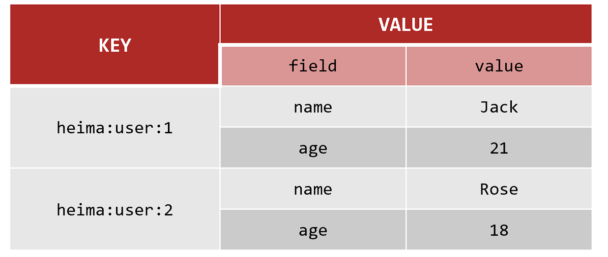

# 基础篇

## SQL与NoSQL

SQL（Structured Query Language）和NoSQL（Not Only SQL）是两种不同类型的数据库管理系统，它们在数据存储、查询、扩展性和使用场景上有显著区别。

### SQL（关系型数据库）

**特点：**

1. **结构化数据**：数据存储在预定义的表中，表由行和列组成。
2. **模式固定**：表结构（schema）在创建时定义，修改结构可能比较复杂。
3. **ACID事务**：支持原子性（Atomicity）、一致性（Consistency）、隔离性（Isolation）、持久性（Durability），确保数据完整性。
4. **标准化查询语言**：使用SQL进行数据操作和查询。
5. **关系模型**：支持表之间的复杂关系（如一对一、一对多、多对多）。

**常见SQL数据库：**

- MySQL
- PostgreSQL
- Oracle
- SQL Server

**适用场景：**

- 需要复杂查询和事务支持的场景（如金融系统、ERP）。
- 数据结构相对固定且关系明确的场景。

------

### NoSQL（非关系型数据库）

**特点：**

1. **灵活的数据模型**：支持文档、键值对、列族、图等多种数据格式，无需固定模式。
2. **高扩展性**：通常设计为分布式架构，易于水平扩展。
3. **高性能**：针对特定场景优化，读写速度较快。
4. **弱化事务支持**：部分NoSQL数据库不支持ACID事务，而是提供最终一致性（Eventual Consistency）。
5. **无固定查询语言**：每种NoSQL数据库有自己的查询方式。

**常见NoSQL数据库：**

- **文档型**：MongoDB、Couchbase
- **键值型**：Redis、DynamoDB
- **列族型**：Cassandra、HBase
- **图数据库**：Neo4j、ArangoDB

**适用场景：**

- 数据结构多变或非结构化的场景（如社交媒体、日志存储）。
- 需要高并发和水平扩展的场景（如大数据、实时分析）。
- 对事务一致性要求不高的场景。

------

### SQL vs NoSQL 对比

| 特性         | SQL                            | NoSQL                      |
| :----------- | :----------------------------- | :------------------------- |
| **数据模型** | 结构化，表格式                 | 灵活，支持文档、键值、图等 |
| **模式**     | 固定，需预先定义               | 动态，无需固定模式         |
| **扩展性**   | 垂直扩展（增加硬件性能）       | 水平扩展（增加节点）       |
| **事务支持** | 强（ACID）                     | 弱（通常为最终一致性）     |
| **查询语言** | SQL                            | 无统一语言，依赖具体数据库 |
| **性能**     | 适合复杂查询                   | 适合高并发和简单查询       |
| **适用场景** | 结构化数据、复杂关系、事务需求 | 非结构化数据、高扩展性需求 |

------

### 选择依据

1. **数据结构**：如果数据结构固定且关系复杂，选择SQL；如果数据结构多变，选择NoSQL。
2. **扩展需求**：需要水平扩展时，NoSQL更合适。
3. **事务需求**：需要强一致性事务时，选择SQL。
4. **性能需求**：高并发读写场景下，NoSQL通常表现更好。

在实际应用中，SQL和NoSQL可以结合使用，例如用SQL处理核心业务数据，用NoSQL处理日志或缓存数据。


## 认识Redis

Redis诞生于2009年全称是**Remote Dictionary Server**，远程词典服务器，是一个基于内存的键值型NoSQL数据库。

[Redis - The Real-time Data Platform](https://redis.io/)

**特征**：

- 键值（key-value）型，value支持多种不同数据结构，功能丰富
- 单线程，每个命令具备原子性
- 低延迟，速度快（基于内存、IO多路复用、良好的编码）。
- 支持数据持久化
- 支持主从集群、分片集群
- 支持多语言客户端


```bash
# Docker 创建 Redis 容器命令
docker run -d \
--log-opt max-size=100m \
--log-opt max-file=2 \
-p 6379:6379 \
--name redis \
-v /home/ysh/redis/conf/redis.conf:/etc/redis/redis.conf  \
-v /home/ysh/redis/data:/data \
-d redis redis-server /etc/redis/redis.conf \
--appendonly yes \
--requirepass 123456 #密码
```

> -v /home/ysh/redis/conf/redis.conf:/etc/redis/redis.conf  \	#挂载配置文件
> -v /home/ysh/redis/data:/data \	#挂载数据卷


进入容器内部测试redis

```bash
docker exec -it redis /bin/bash

redis-cli -h localhost -p 6379 -a 123456

ping
```


## Redis通用命令

- KEYS：查看符合模板的所有key，支持通配符，**不建议在生产环境使用**
- DEL：删除一个（或多个）指定的key
- EXISTS：判断key是否存在
- EXPIRE：给一个key设置有效期（单位秒），有效期到期时该key会被自动删除，不设置有效期时默认为-1（永久有效）
- TTL：查看一个KEY的剩余有效期

> 通过help [command] 可以查看一个命令的具体用法


## key的结构

Redis没有类似MySQL中的Table的概念，我们该如何区分不同类型的key呢


Redis的key允许有多个单词形成层级结构，多个单词之间用':'隔开，格式如下：

*项目名:业务名:类型:id*


这个格式并非固定，也可以根据自己的需求来删除或添加词条。

例如我们的项目名称叫 heima，有user和product两种不同类型的数据，我们可以这样定义key：

user相关的key：heima:user:1

product相关的key：heima:product:1


## 数据类型


### String

String类型，也就是字符串类型，是Redis中最简单的存储类型。

其value是字符串，不过根据字符串的格式不同，又可以分为3类：

- string：普通字符串
- int：整数类型，可以做自增、自减操作
- float：浮点类型，可以做自增、自减操作

不管是哪种格式，底层都是**字节数组**形式存储，只不过是编码方式不同。字符串类型的最大空间不能超过512m.


String的常见命令有：

- SET：**添加或者修改**已经存在的一个String类型的键值对`SET key value`
- GET：根据key获取String类型的value`GET key`
- MSET：批量添加多个String类型的键值对
- MGET：根据多个key获取多个String类型的value
- INCR：让一个整型的key自增1
- INCRBY:让一个整型的key自增并指定步长，例如：incrby num 2 让num值自增2
- INCRBYFLOAT：让一个浮点类型的数字自增并指定步长
- SETNX：添加一个String类型的键值对，**前提是这个key不存在**，否则不执行
- SETEX：添加一个String类型的键值对，并且指定有效期


### Hash

Hash类型，也叫散列，其value是一个无序字典，类似于Java中的HashMap结构。


String结构是将对象序列化为JSON字符串后存储，当需要修改对象某个字段时很不方便

Hash结构可以将对象中的每个字段**独立存储**，可以针对单个字段做CRUD



Hash的常见命令有：

- HSET key field value：添加或者修改hash类型key的field的值
- HGET key field：获取一个hash类型key的field的值
- HMSET：批量添加多个hash类型key的field的值
- HMGET：批量获取多个hash类型key的field的值
- HGETALL：获取一个hash类型的key中的所有的field和value
- HKEYS：获取一个hash类型的key中的所有的field
- HVALS：获取一个hash类型的key中的所有的value
- HINCRBY:让一个hash类型key的字段值自增并指定步长
- HSETNX：添加一个hash类型的key的field值，前提是这个field不存在，否则不执行


### List

Redis中的List类型与Java中的LinkedList类似，可以看做是一个双向链表结构。既可以支持正向检索和也可以支持反向检索

特点：

- 有序
- 元素可以重复
- 插入和删除快
- 查询速度一般


List的常见命令有：

- LPUSH key element ... ：向列表左侧插入一个或多个元素
- LPOP key：移除并返回列表左侧的第一个元素，没有则返回nil
- RPUSH key element ... ：向列表右侧插入一个或多个元素
- RPOP key：移除并返回列表右侧的第一个元素
- LRANGE key star end：返回一段角标范围内的所有元素
- BLPOP和BRPOP：与LPOP和RPOP类似，只不过在没有元素时等待指定时间（**阻塞式**），而不是直接返回nil


### Set

Redis的Set结构与Java中的HashSet类似，可以看做是一个value为null的HashMap。因为也是一个hash表，因此具备与HashSet类似的特征

- 无序
- 元素不可重复
- 查找快
- 支持交集、并集、差集等功能


Set的常见命令有：

- SADD key member ... ：向set中添加一个或多个元素
- SREM key member ... : 移除set中的指定元素
- SCARD key： 返回set中元素的个数
- SISMEMBER key member：判断一个元素是否存在于set中
- SMEMBERS：获取set中的所有元素
- SINTER key1 key2 ... ：求key1与key2的交集
- SDIFF key1 key2 ... ：求key1与key2的差集
- SUNION key1 key2 ..：求key1和key2的并集


### SortedSet

Redis的SortedSet是一个可排序的set集合，与Java中的TreeSet有些类似，但底层数据结构却差别很大。SortedSet中的每一个元素都带有一个score属性，可以基于score属性对元素排序，底层的实现是一个跳表（SkipList）加 hash表。

- 可排序
- 元素不重复
- 查询速度快


SortedSet的常见命令有：

- ZADD key score member：添加一个或多个元素到sorted set ，如果已经存在则更新其score值
- ZREM key member：删除sorted set中的一个指定元素
- ZSCORE key member : 获取sorted set中的指定元素的score值
- ZRANK key member：获取sorted set 中的指定元素的排名（排名从0开始）
- ZCARD key：获取sorted set中的元素个数
- ZCOUNT key min max：统计score值在给定范围内的所有元素的个数
- ZINCRBY key increment member：让sorted set中的指定元素自增，步长为指定的increment值
- ZRANGE key min max：按照score排序后，获取指定排名范围内的元素
- ZRANGEBYSCORE key min max：按照score排序后，获取指定score范围内的元素
- ZDIFF、ZINTER、ZUNION：求差集、交集、并集

> 注意：所有的排名默认都是升序，如果要降序则在命令的Z后面添加REV即可


## Java客户端

在Redis官网中提供了各种语言的客户端，地址：https://redis.io/clients


### Jedis

1.引入依赖

2.创建Jedis对象，建立连接

3.使用Jedis，方法名与Redis命令一致

4.释放资源


导入依赖

```xml
<dependency>
    <groupId>redis.clients</groupId>
    <artifactId>jedis</artifactId>
    <version>5.2.0</version>
</dependency>
```


使用客户端

```java
    public void setUp() {
        // 建立连接
        Jedis jedis = new Jedis("localhost", 6379);
        // 验证密码
        jedis.auth("123456");
        // 选择数据库
        jedis.select(0);
    }

    public void tearDown() {
        // 关闭连接
        if (jedis != null) {
            jedis.close();
        }
    }

    void testString() {
        jedis.set("ysh","666");

        String ysh = jedis.get("ysh");
    }

```

> API与Redis官方指令一致


**Jedis连接池**

Jedis本身是线程不安全的，并且频繁的创建和销毁连接会有性能损耗，因此推荐使用Jedis连接池代替Jedis的直连方式。

```java
public class JedisPoolConnection {
    // 声明一个静态的JedisPool对象，用于管理Jedis连接池
    private static final JedisPool jedisPool;

    // 静态代码块，在类加载时执行，用于初始化Jedis连接池
    static {
        // 创建JedisPoolConfig对象，用于配置连接池参数
        JedisPoolConfig config = new JedisPoolConfig();
        // 设置连接池中最多可以存在的连接数
        config.setMaxTotal(10);
        // 设置连接池中最多可以存在的空闲连接数
        config.setMaxIdle(10);
        // 设置连接池中最少可以存在的空闲连接数
        config.setMinIdle(5);
        // 设置连接池中当连接数达到最大值时，获取连接的最长等待时间
        config.setMaxWait(Duration.ofMillis(10000));

        // 创建JedisPool对象，传入配置信息、Redis服务器地址、端口、连接超时时间和密码
        jedisPool = new JedisPool(config,
                "localhost", 6379, 2000, "123456");
    }

    // 提供一个静态方法，用于获取Jedis连接
    public static Jedis getConnection() {
        // 从连接池中获取一个Jedis实例
        return jedisPool.getResource();
    }
}
```


### SpringDataRedis

SpringData是Spring中数据操作的模块，包含对各种数据库的集成，其中对Redis的集成模块就叫做SpringDataRedis，官网地址：https://spring.io/projects/spring-data-redis

- 提供了对不同Redis客户端的整合（Lettuce和Jedis）
- 提供了RedisTemplate统一API来操作Redis
- 支持Redis的发布订阅模型
- 支持Redis哨兵和Redis集群
- 支持基于Lettuce的响应式编程
- 支持基于JDK、JSON、字符串、Spring对象的数据序列化及反序列化
- 支持基于Redis的JDKCollection实现


1. 引入依赖

```xml
        <!-- redis -->
        <dependency>
            <groupId>org.springframework.boot</groupId>
            <artifactId>spring-boot-starter-data-redis</artifactId>
        </dependency>
        <!-- commons-pool2 -->
        <dependency>
            <groupId>org.apache.commons</groupId>
            <artifactId>commons-pool2</artifactId>
        </dependency>
```

> 注意`commons-pool2`版本的兼容性问题


2. 编写配置文件

```yml
spring:
  data:
    redis:
      host: localhost
      port: 6379
      password: 123456
      lettuce:
        pool:
          enabled: true
          max-active: 8
          max-idle: 8
          min-idle: 0
          max-wait: 1000ms
      database: 0
```

> SpringBoot2.x  配置redis的配置项为spring.redis


3. 注入RedisTemplate使用

```java
    @Autowired
    private RedisTemplate<String, String> redisTemplate;

    @Test
    void contextLoads() {
        redisTemplate.opsForValue().set("key", "value");
        Object key = redisTemplate.opsForValue().get("key");
        System.out.println("key = " + key);
    }
```


#### 序列化

RedisTemplate可以接收任意Object作为值写入Redis，只不过写入前会把Object序列化为字节形式，默认是采用JDK序列化

缺点：

- 可读性差
- 内存占用较大


我们可以自定义RedisTemplate的序列化方式：

```java
    @Bean
    public RedisTemplate<String, Object> redisTemplate(RedisConnectionFactory factory) {
        // 创建 RedisTemplate 对象
        RedisTemplate<String, Object> template = new RedisTemplate<>();

        // 设置连接工厂
        template.setConnectionFactory(factory);

        // 创建JSON序列化器
        GenericJackson2JsonRedisSerializer jackson2JsonRedisSerializer = new GenericJackson2JsonRedisSerializer();

        // 设置key的序列化器为String序列化器
        template.setKeySerializer(RedisSerializer.string());
        template.setHashKeySerializer(RedisSerializer.string());

        // 设置value的序列化器为JSON序列化器
        template.setValueSerializer(jackson2JsonRedisSerializer);
        template.setHashValueSerializer(jackson2JsonRedisSerializer);

        return template;
    }
```

> 需要引入Jackson依赖


### StringRedisTemplate

尽管JSON的序列化方式可以满足我们的需求，但依然存在一些问题


为了在反序列化时知道对象的类型，JSON序列化器会将类的class类型写入json结果中，存入Redis，会带来额外的内存开销。


为了节省内存空间，我们并不会使用JSON序列化器来处理value，而是统一使用String序列化器，要求只能存储String类型的key和value。当需要存储Java对象时，手动完成对象的序列化和反序列化。


Spring默认提供了一个**StringRedisTemplate**类，它的key和value的序列化方式默认就是String方式。省去了我们自定义RedisTemplate的过程

```java
    @Autowired
    private StringRedisTemplate stringRedisTemplate;

    private static final ObjectMapper mapper = new ObjectMapper();

    @Test
    void contextLoads() throws JsonProcessingException {
        User user = new User("ysh", 21);
        String json = mapper.writeValueAsString(user);
        stringRedisTemplate.opsForValue().set("user:1", json);

        String result = stringRedisTemplate.opsForValue().get("user:1");
        User user1 = mapper.readValue(result, User.class);
        System.out.println("user1 = " + user1);
    }
```

> 可以使用其它序列化工具如FastJson、hutool


---


# 实战篇

## 短信登录


## Redis实现缓存

**缓存**就是数据交换的缓冲区（称作Cache [ kæʃ ] ），是存贮数据的临时地方，一般读写性能较高


### 缓存更新策略


**解决方案**：

1. **`Cache Aside Pattern`**：由缓存的调用者，在更新数据库的同时更新缓存（<font color="red">推荐</font>）
2. **`Read/Write Through Pattern`**：缓存与数据库整合为一个服务，由服务来维护一致性。调用者调用该服务，无需关心缓存一致性问题。
3. **`Write Behind Caching Pattern`**：调用者只操作缓存，由其它线程异步的将缓存数据持久化到数据库，保证最终一致。


操作缓存和数据库时有三个问题需要考虑：

1.删除缓存还是更新缓存？

- 更新缓存：每次更新数据库都更新缓存，无效写操作较多❌

- 删除缓存：更新数据库时让缓存失效，查询时再更新缓存✔

2.如何保证缓存与数据库的操作的同时成功或失败？

- 单体系统，将缓存与数据库操作放在一个事务

- 分布式系统，利用TCC等分布式事务方案

3. 先操作缓存还是先操作数据库？

- 先写数据库，然后再删除缓存

- 要确保数据库与缓存操作的原子性


### 缓存穿透

**缓存穿透**是指客户端请求的数据在缓存中和数据库中都不存在，这样缓存永远不会生效，这些请求都会到达数据库。

常见的解决方案有两种：

- 缓存空对象
  - 优点：实现简单，维护方便
  - 缺点：
    - 额外的内存消耗
    - 可能造成短期的不一致

- 布隆过滤
  - 优点：内存占用较少，没有多余key
  - 缺点：
    - 实现复杂
    - 存在误判可能


**缓存空对象法**


**可行方案：**

- 缓存null值
- 布隆过滤
- 增强id的复杂度，避免被猜测id规律
- 做好数据的基础格式校验
- 加强用户权限校验
- 做好热点参数的限流


### 缓存雪崩

**缓存雪崩**是指在同一时段<font color=red>大量的缓存key同时失效或者Redis服务宕机</font>，导致大量请求到达数据库，带来巨大压力。

**解决方案：**

- 给不同的Key的TTL添加随机值
- 利用Redis集群提高服务的可用性
- 给缓存业务添加降级限流策略
- 给业务添加多级缓存


### 缓存击穿

**缓存击穿问题**也叫热点Key问题，就是一个被**高并发访问**并且**缓存重建业务较复杂**的key突然失效了，无数的请求访问会在瞬间给数据库带来巨大的冲击。

常见的解决方案有两种：

- 互斥锁
- 逻辑过期

| 解决方案 | 优点                                       | 缺点                                       |
| -------- | ------------------------------------------ | ------------------------------------------ |
| 互斥锁   | 没有额外内存消耗<br>保证一致性<br>实现简单 | 线程需要等待，性能受影响<br>可能有死锁风险 |
| 逻辑过期 | 线程无需等待，性能较好                     | 不保证一致性<br>有额外内存消耗<br>实现复杂 |


## 全局唯一ID

全局ID生成器，是一种在**分布式系统**下用来生成全局唯一ID的工具，需要满足以下特性：

- 唯一性
- 高可用
- 高性能
- 递增性
- 安全性


常见的实现方式包括UUID、Snowflake算法等。

### 1. UUID（Universally Unique Identifier）

UUID 是一个128位的标识符，通常表示为32个十六进制字符，分为5段（8-4-4-4-12）。UUID 的生成基于时间戳、随机数或硬件地址等，确保全局唯一性。

**示例：**

```
550e8400-e29b-41d4-a716-446655440000
```

**优点：**

- 无需中心化服务，分布式生成。
- 全球唯一性高。

**缺点：**

- 长度较长（36字符）。
- 无序，不适合作为数据库主键（可能导致索引碎片）。

------

### 2. Snowflake算法

Snowflake 是 Twitter 开源的分布式ID生成算法，生成一个64位的ID，结构如下：

- **1位**：符号位（固定为0）。
- **41位**：时间戳（毫秒级，可用69年）。
- **10位**：机器ID（支持1024个节点）。
- **12位**：序列号（每毫秒可生成4096个ID）。

**示例：**

```
1234567890123456789
```

**优点：**

- 短小精悍（64位整数）。
- 时间有序，适合作为数据库主键。
- 高性能，支持高并发。

**缺点：**

- 依赖系统时钟，时钟回拨可能导致ID冲突。
- 需要管理机器ID的分配。


### 3.Redis自增

```java
@Component
@RequiredArgsConstructor
public class RedisIdWorker {

    private final StringRedisTemplate redisTemplate;

    private final long BEGIN_TIME_STAMP = 1735689600L;

    public long nextId(String prefix) {

        LocalDateTime now = LocalDateTime.now();
        long epochSecond = now.toEpochSecond(ZoneOffset.UTC);
        long nowEpochSecond = epochSecond - BEGIN_TIME_STAMP;

        String date = now.format(DateTimeFormatter.ofPattern("yyyyMMdd"));
        long increment = redisTemplate.opsForValue().increment("icr:" + prefix + ":" + date);

        return nowEpochSecond << 32 | increment;
    }

}
```

> 时间戳 + 序列号


## 超卖问题

超卖问题（Overselling）是电商、秒杀、库存管理等场景中常见的核心问题，指系统**实际销售数量超过库存数量**，导致订单无法履约。

**原因**：

1. **并发请求冲突**
   - 多个用户同时请求购买同一商品，系统未正确处理并发扣减库存。
2. **数据库更新延迟**
   - 数据库读写分离时，从库同步延迟导致读取到旧库存数据。
3. **缓存与数据库不一致**
   - 缓存层（如 Redis）与数据库的库存数据未同步。
4. **非原子性操作**
   - 查询库存、扣减库存分步执行，中间过程被其他请求插入。


**解决方案**：

#### **1. 数据库层面：锁机制**

- **悲观锁（Pessimistic Lock）**
  通过 `SELECT ... FOR UPDATE` 锁定记录，确保串行操作。

  ```sql
  BEGIN;
  SELECT stock FROM products WHERE id=1 FOR UPDATE;
  UPDATE products SET stock = stock - 1 WHERE id=1;
  COMMIT;
  ```

  **缺点**：高并发下性能差，可能引发死锁。

- **乐观锁（Optimistic Lock）**
  使用版本号或库存字段本身作为条件更新。

  ```sql
  UPDATE products 
  SET stock = stock - 1, version = version + 1 
  WHERE id=1 AND stock > 0 AND version = {current_version};
  ```

  **优点**：无锁竞争，适合高并发。
  **缺点**：需处理更新失败（如重试或提示用户）。

#### **2. 分布式锁**

- **Redis 锁**
  使用 `SET key value NX EX` 实现原子锁：

  ```python
  lock = redis.set("product_1_lock", "locked", nx=True, ex=5)
  if lock:
      try:
          # 扣减库存逻辑
      finally:
          redis.delete("product_1_lock")
  ```

  **注意**：需解决锁过期和误删问题（如 Redlock 算法）。

#### **3. 缓存层原子操作**

- **Redis 原子扣减**
  利用 Redis 的原子命令（如 `DECR` 或 Lua 脚本）：

  ```lua
  -- Lua 脚本（原子扣减库存）
  local stock = tonumber(redis.call('GET', KEYS[1]))
  if stock > 0 then
      redis.call('DECR', KEYS[1])
      return 1  -- 成功
  else
      return 0  -- 失败
  end
  ```

  **优点**：高性能，避免直接穿透到数据库。

- **预扣库存（预占机制）**
  用户下单时先在 Redis 中扣减库存，异步同步到数据库：

  ```python
  if redis.decr("product_1_stock") >= 0:
      # 创建订单，异步更新数据库
  else:
      # 恢复库存：redis.incr("product_1_stock")
  ```

#### **4. 消息队列削峰**

- 将请求放入队列（如 Kafka、RabbitMQ），由消费者顺序处理：

  ```python
  # 生产者（用户请求入队）
  producer.send("order_topic", {"user_id": 123, "product_id": 1})
  
  # 消费者（顺序扣减库存）
  consumer.subscribe("order_topic")
  for message in consumer:
      process_order(message)
  ```

  **优点**：流量削峰，保证最终一致性。


## 一人一单

### 单实例部署

某些业务只允许用户进行一次交易

但当一个用户同一时间发起多个请求时，就有可能发生一人多单问题（多个线程都查询到数据库中并没有订单存在，都可以创建订单）


可以对数据操作代码加锁同步

```java
synchronized (userId.toString().intern()) {
            // 获取代理对象，解决spring事务失效问题
            IVoucherOrderService proxy =(IVoucherOrderService) AopContext.currentProxy();
            return proxy.createOrder(id, userId);
        }
```

> 注：
>
> 以上代码只对同一个用户加锁，避免不同用户被阻塞的性能问题（intern()将字符串加入字符串常量池，避免同一个用户id有多个对象，同步失效）
>
> Spring的事务管理基于AOP代理对象实现，如果在类的方法内调用自身的方法，等同于this.xxx()，并没有通过代理对象实现事务增强，解决方案为先获取代理对象，然后再通过代理对象调用该方法
>
> 需要引入`aspectjweaver`依赖，并在启动类上加上`@EnableAspectJAutoProxy(exposeProxy = true)`注解


### 多实例部署

<font color=red>以上方案在多实例集群模式下仍会发生线程安全问题</font>

原因是多个实例各自都有自身的`JVM`去实现同步锁，无法共享


解决方案：

​	**分布式锁**：满足分布式系统或集群模式下多进程可见并且互斥的锁

- 多进程可见
- 互斥
- 高性能
- 安全性
- 高可用


常见实现方式

|        | MySQL              | Redis                    | Zookeeper                  |
| ------ | ------------------ | ------------------------ | -------------------------- |
| 互斥   | 利用本身互斥锁机制 | 利用setnx这类互斥命令    | 利用节点唯一性和有序性实现 |
| 高可用 | 优秀               | 优秀                     | 优秀                       |
| 高性能 | 一般               | 优秀                     | 一般                       |
| 安全性 | 断开连接自动释放锁 | 锁到期自动释放，避免死锁 | 临时节点断开连接自动释放   |


## 基于Redis的分布式锁

### 简单实现

实现分布式锁时需要实现的两个基本方法：

- 获取锁：

```bash
SET lock thread1 EX 10 NX
```

> EX参数设置过期时间，NX参数实现与`SETNX`相同的功能
>
> 不建议直接使用`SETNX`,因为无法同时设置过期时间，可能发生获得锁后服务宕机，而未设置过期时间，最终导致死锁。


- 释放锁：

```bash
DEL lock
```


示例：

```java
    @Override
    public boolean tryLock(long timeout) {
        // 获取当前线程ID
        long threadId = Thread.currentThread().getId();

        Boolean success = stringRedisTemplate.opsForValue()
                .setIfAbsent(KEY_PREFIX + name, threadId + "", timeout, TimeUnit.SECONDS);

        return Boolean.TRUE.equals(success);
    }

    @Override
    public void unlock() {
        // 释放锁
        stringRedisTemplate.delete(KEY_PREFIX + name);
    }
```


### 锁误删问题

主要发生在某个线程阻塞时锁超时释放了，其他线程就可以获得锁，当被阻塞的线程恢复后就会删除不属于自己的锁


**解决方案**

为线程的锁加入唯一标识，释放前判断锁是否属于自己

> 可使用UUID


#### 原子性问题

如果查询和删除锁不能原子性执行，就仍然有可能发生锁误删问题


**Lua脚本**

Redis提供了Lua脚本功能，在一个脚本中编写多条Redis命令，确保多条命令执行时的原子性。Lua是一种编程语言，它的基本语法大家可以参考网站：https://www.runoob.com/lua/lua-tutorial.html


Redis可以通过如下命令执行Lua脚本

```lua
EVAL "<脚本内容>"

-- 示例

EVAL "return redis.call('set','key','value')" 0
```

> 参数**0**表示需要的key类型的参数个数


脚本中的key、value可以作为参数传递。key类型参数会放入`KEYS`数组，其它参数会放入`ARGV`数组，在脚本中可以从KEYS和ARGV数组获取这些参数：

```lua
EVAL "return redis.call('set',KEYS[1],ARGV[1])" 1 key value
```


释放锁脚本示例：

```lua
-- 获取key
local key = KEYS[1]

-- 获取线程ID
local threadId = ARGV[1]

local id = redis.call('get',key)

if(id == threadId)
then
    return redis.call('del',key)
end
return 0
```


```java
   	private static final DefaultRedisScript<Long> UNLOCK_SCRIPT;

    static {
        UNLOCK_SCRIPT = new DefaultRedisScript<>();
        UNLOCK_SCRIPT.setLocation(new ClassPathResource("unlock.lua"));
        UNLOCK_SCRIPT.setResultType(Long.class);
    }    
	
		// 执行Lua脚本释放锁
        stringRedisTemplate.execute(
                UNLOCK_SCRIPT,
                Collections.singletonList(KEY_PREFIX + name),
                ID_PREFIX + Thread.currentThread().getId()
        );
```

