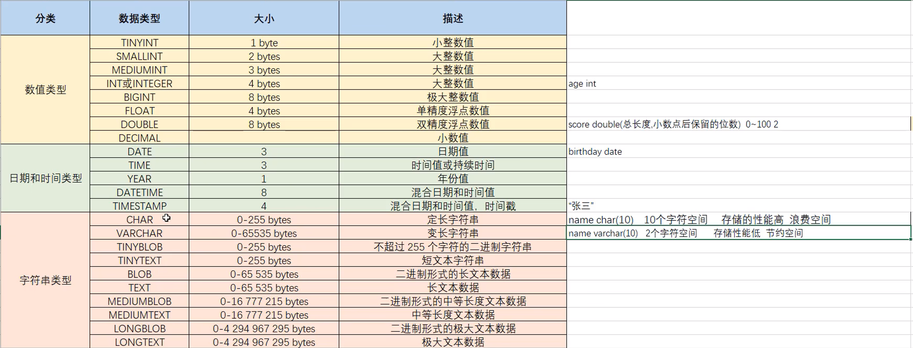
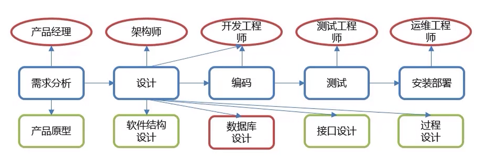

# 数据管理

## 数据查询

```sql
SELECT
	字段列表
FROM
	表名列表
WHERE
	条件列表
GROUP BY
	分组字段
HAVING
	分组后条件
ORDER BY
	排序字段
LIMIT
	分页限定
```


### 基础查询

1. 查询多个字段

   ```sql
   SELECT 字段列表 FROM 表名;
   SELECT * FROM 表名; -- 查询所有数据
   ```

2. 去除重复记录

   ```sql
   SELECT DISTINCT 字段列表 FROM 表名;
   ```

3. 给字段或表起别名

   ```sql
   AS -- 也可省略
   ```


### 条件查询

基本语法

```sql
SELECT 字段列表 FROM 表名 WHERE 条件列表;
```


常见逻辑条件

|       符号       |                    说明                    |
| :--------------: | :----------------------------------------: |
|        >         |                    大于                    |
|        <         |                    小于                    |
|        >=        |                  大于等于                  |
|        <=        |                  小于等于                  |
|        =         |                    等于                    |
|      <>或!=      |                   不等于                   |
| BETWEEN...AND... |          在某个范围内（包含端点）          |
|     IN(...)      |                   多选一                   |
|   LIKE 占位符    | 模糊查询，'_'匹配单个字符，'%'匹配多个字符 |
|     IS NULL      |                   是NULL                   |
|   IS NOT NULL    |                  不是NULL                  |
|    AND 或 &&     |                    并且                    |
|    OR 或 \|\|    |                    或者                    |
|     NOT 或 !     |                  非，不是                  |


**模糊查询示例**：

```sql
-- 查询姓“马”的人
select * from tb where name like '马%';

-- 查询名字第二个字是“马”的人
select * from tb where name like '_马%';

-- 查询名字中包含“马”字的人
select * from tb where name like '%马%'
```


### 聚合函数

**概念**：将一列数据作为一个整体，进行纵向计算。


聚合函数分类：

| 函数名      | 说明                             |
| ----------- | -------------------------------- |
| count(列名) | 统计数量（一般不包括为NULL的列） |
| max(列名)   | 最大值                           |
| min(列名)   | 最小值                           |
| sum(列名)   | 求和                             |
| avg(列名)   | 平均值                           |


**聚合函数语法**：

```sql
SELECT 聚合函数名(列名) FROM 表名;
```

> NULL值不参与所有聚合函数运算


### 排序查询

语法：

```sql
SELECT 字段列表 FROM 表名 ORDER BY 排序字段一[排序方式],排序字段二[排序方式],...;
```

排序方式：

- ASC：升序排序（默认值）
- DESC：降序排序

> 注意：如果有多个排序条件，当第一个排序字段相同时，才会按第二个排序字段进行排序


### 分组查询

语法：

```sql
SELECT 字段列表 FROM 表名 [WHERE 分组前条件] GROUP BY 分组字段名 [HAVING 分组后条件];
```

> 注意：分组后，查询的字段只能为聚合函数和用于分组的字段，查询其他字段无意义。


where和having的区别：

- 执行时机不一样：where是分组之前执行，不满足where条件则不参与分组，而having是对分组后的结果进行过滤。
- 可判断的条件不一样：where不能对聚合函数进行判断，而having可以。

执行顺序：<font color=red>where>聚合函数>having</font>


示例：

```sql
-- 查询男生和女生各自的数学平均分
select sex, avg(math) from tb group by sex;

-- 查询男生和女生各自的数学平均分，以及各自人数（分数低于70的不参与分组）
select sex, avg(math), count(*) from tb where math > 70 group by sex;
```


### 分页查询

语法

```sql
SELECT 字段列表 FROM 表名 LIMIT 起始索引, 查询条目;
```

> 起始索引从0开始
>
> 计算方式：起始索引 = (当前页码 - 1) * 每页显示的条目数


tips:

- 分页查询`limit`是 **MySQL** 数据库的方言
- **Oracle** 数据库分页查询使用`rownumber`
- **SQL Server** 分页查询使用`top`


示例：

```sql
-- 查询第一页数据，每页显示3条数据
select * from tb limit 0, 3;

-- 查询第二页数据，每页显示3条数据
select * from tb limit 3, 3;
```


### 多表查询

- 笛卡尔积：取集合A，B的元素的所有组合
- 多表查询：从多张表查询数据
  - 连接查询
    - 内连接：查询A，B交集数据
    - 外连接：
      - 左外连接：查询A的所有数据和A，B交集数据
      - 右外连接：查询B的所有数据和A，B交集数据
  - 子查询


#### 内连接

语法：

```sql
-- 隐式内连接
SELECT 字段列表 FROM 表1,表2,表3,... WHERE 条件;

-- 显示内连接
SELECT 字段列表 FROM 表1 [INNER] JOIN 表2 ON 条件;
```


示例：

```sql
-- 查询emp表的name,gender,dept表的dname
select 
	emp.name,emp.gender,dept.dname 
from 
	emp,dept 
where 
	emp.dep_id = dept.did;
	
-- 显示内连接
select
	*
from
	emp
inner join
	dept
on
	emp.dep_id = dept.did
```


#### 外连接

语法：

```sql
-- 左外连接
SELECT 字段列表 FROM 表1 LEFT [OUTER] JOIN 表2 ON 条件;

-- 右外连接
SELECT 字段列表 FROM 表1 RIGHT [OUTER] JOIN 表2 ON 条件;
```


示例：

```sql
-- 查询emp表的所有数据和对应部门信息
select * from emp left outer join dept on emp.dep_id = dept.did;

-- 查询dept表的所有数据和对应员工信息
select * from emp right outer join dept on emp.dep_id = dept.did;
```


### 子查询

概念：查询中嵌套查询


子查询根据查询结果不同，作用不同：

- 单行单列：作为条件值，使用=、!=、>、 <进行判断

  ```sql
  SELECT 字段列表 FROM 表名 WHERE 字段名 = (子查询);
  ```

- 多行单列：作为条件值，使用 in 等关键字进行条件判断

  ```sql
  SELECT 字段列表 FROM 表名 WHERE 字段名 in (子查询);
  ```

- 多行多列：作为虚拟表

  ```sql
  SELECT 字段列表 FROM (子查询) WHERE 条件;
  ```

  

示例：

```sql
-- 查询猪八戒的工资
select salary from emp where name = '猪八戒';

-- 查询工资高于猪八戒的员工信息
select * from emp where salary > (select salary from emp where name = '猪八戒');


-- 查询财务部和市场部的所有员工信息
select * from emp where dep_id in (select did from dept where dname = '财务部' or dname = '市场部');

-- 查询入职日期是2011-11-11之后的员工信息和部门信息
select * from (select * from emp where join_date > '2011-11-11') as t1 ,dept
where dept.did = t1.dept_id;
```


## 数据操作

插入数据

```sql
INSERT INTO 表名(字段1,字段2,...)
VALUE(值1,值2,...),(值3,值4,...),...
```


修改数据

```sql
UPDATE 表名 SET 字段1=值1,字段2=值2,... [WHERE 条件];
```

> 不加条件则**修改所有数据**


删除数据

```sql
DELETE FROM 表名 [WHERE 条件];
```

> 不添加条件则**删除所有数据**


## 数据类型




## 表的相关操作

创建表

```sql
CREATE TABLE tb_user(
	id INT,
    username VARCHAR(20),
    password VARCHAR(20)
);
```


删除表

```sql
drop table tb_user;
```


查询所有表

```sql
show tables;
```


修改表

1. 修改表名

   ```sql
   ALTER TABLE 表名 RENAME TO 新表名;
   ```

2. 添加一列

   ```sql
   ALTER TABLE 表名 ADD 列名 数据类型;
   ```

3. 修改数据类型

   ```sql
   ALTER TABLE 表名 MODIFY 列名 新数据类型;
   ```

4. 修改列名和数据类型

   ```sql
   ALTER TABLE 表名 CHANGE 列名 新列名 新数据类型;
   ```

5. 删除列

   ```sql
   ALTER TABLE 表名 DROP 列名;
   ```

   

### 数据库相关操作

创建数据库

```sql
CREATE DATABASE 数据库名;
```


删除数据库

```sql
DROP DATABASE 数据库名;
```


查询数据库

```sql
show databases;
```


使用数据库

```sql
use 数据库名;
```


# 数据库设计

软件研发步骤




数据库设计概念

- 数据库设计就是根据业务系统的具体需求，结合选择的DBMS，为业务系统构造出最优的数据存储模型。
- 建立数据库中的**表结构**以及**表与表之间的关联关系**的过程。


数据库设计的步骤

1. 需求分析（有什么数据？数据的属性？数据和属性的特点？）
2. 逻辑分析（E-R图进行逻辑建模）
3. 物理设计（根据所选的DBMS把逻辑模型转换为物理模型）
4. 维护设计（新需求，优化表结构）


## 约束

约束的概念

- 约束是作用于表中列上的规则，用于限制加入表中的数据
- 约束的存在保证了数据库中数据的正确性、有效性和完整性


约束的分类：

| 约束名   | 说明                                       | 关键字      |
| -------- | ------------------------------------------ | ----------- |
| 非空约束 | 保证列中数据不能为NULL                     | NOT NULL    |
| 唯一约束 | 保证列中所有数据个不相同                   | UNIQUE      |
| 主键约束 | 主键是一行数据的唯一标识，要求非空且唯一   | PRIMARY KEY |
| 检查约束 | 保证列中的数据满足某一条件                 | CHECK       |
| 默认约束 | 插入数据时，未指定值则使用默认数据         | DEFAULT     |
| 外键约束 | 让两张表建立关系，保证数据的一致性和完整性 | FOREIGN KEY |

> MySQL不支持检查约束


示例

```sql
CREATE TABLE emp(
	id INT PRIMARY KEY,	-- id作主键，唯一标识
    ename VARCHAR(50) NOT NULL UNIQUE,	-- 姓名不为空且唯一
    join_date DATE NOT NULL,	-- 入职日期不为空
    salary DOUBLE(7,2) NOT NULL,	-- 工资非空
    bonus DOUBLES(7,2) DEFAULT 0	-- 奖金默认为0
)
```


**外键约束**

添加约束

```sql
-- 创建表时添加外键约束
CREATE TABLE 表名(
	列名 数据类型,
    ...
    [CONSTRAINT] [外键名] FOREIGN KEY(列名) REFERENCES 主表(主表列名)
);


-- 创建表后添加外键约束
ALTER TABLE 表名 ADD CONSTRAINT 外键名 FOREIGN KEY (列名) REFERENCES 主表(主表列名);
```


删除约束

```sql
ALTER TABLE 表名 DROP FOREIGN KEY 外键名;
```


## 表之间的关系

- 一对一
  - 例：用户和用户详情
  - 一对一关系多用于表拆分，将一个实体中经常使用的字段放在一张表，不常使用的放另一张表，可提升查询性能
- 一对多
  - 例：部门和员工
  - 一个部门对应多个员工，一个员工对应一个部门
- 多对多
  - 例：商品和订单
  - 一个商品对应多个订单，一个订单对应多个商品


> 实现一对一关系只需要在另一张表中建立外键约束关联主表的主键，并且设置**外键唯一(`UNIQUE`)约束**
>
> 一对多基本同一对一，在多的一方建立外键，只是外键**不需要唯一约束**
>
> 实现多对多关系需要建立一张中间表，且应包含两个外键，分别关联两张多对多关系表的主键