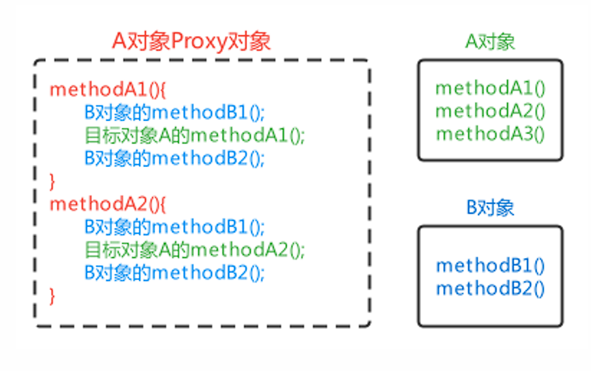
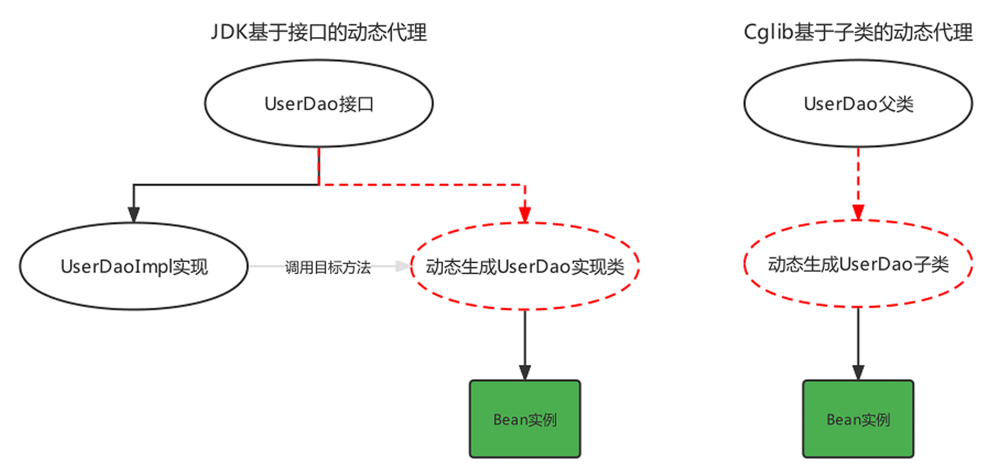
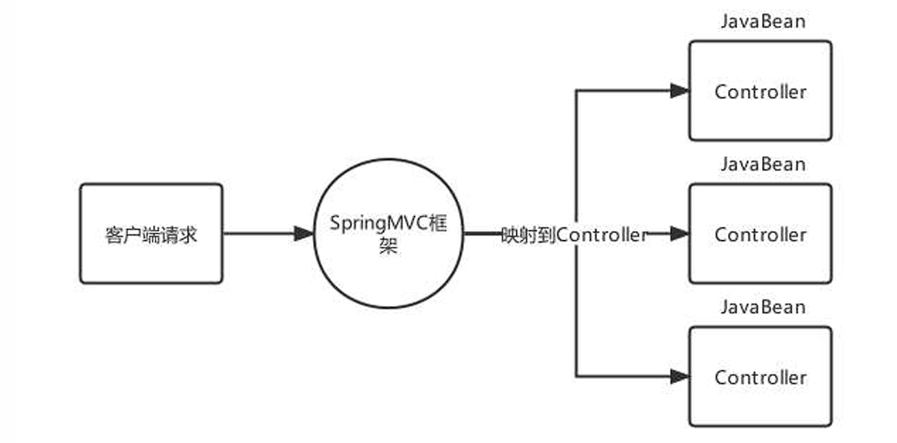

# Spring概述

> www.spring.io

---

## 传统JavaWeb开发的问题


## IoC、DI和AOP思想提出

### IoC

IoC思想： Inversion of Control，翻译为“**控制反转**”或“反转控制”，强调的是原来在程序中**创建Bean的权利**反转给**第三方**。

> 例如：原来在程序中手动的去new UserServiceImpl()，手动的去new UserDaoImpl()，而根据IoC思想的指导，寻求一个第三方去创建UserServiceImpl对象和UserDaoImpl对象。这样程序与具体对象就失去的直接联系。


谁去充当第三方角色呢？

> 工厂设计模式，BeanFactory来充当第三方的角色，来产生Bean实例

BeanFactory怎么知道产生哪些Bean实例呢？

> 可以使用配置文件配置Bean的基本信息，BeanFactory根据配置文件来生产Bean实例


### DI

[^]: 上面使用BeanFactory的方式已经实现的"控制反转"，将Bean的创建权交给了BeanFactory，如果我们想将UserDao的创建权也反转给BeanFactory，与此同时UserService内部还需要用到UserDao实例对象，那应该怎样操作呢？

1. 在程序中，通过BeanFactory获得UserService 

2. 在程序中，通过BeanFactory获得UserDao 

3. 在程序中，将UserDao设置给UserService
   
   

将UserDao在**BeanFactory内部**设置给UserService的过程叫做“注入”，而UserService需要依赖UserDao的注入才能正常工作，这个过程叫做“**依赖注入**”


- IoC 和DI 的关系？

> 首先，先回答IoC和DI的是什么：
> 
>     IoC： Inversion of Control，控制反转，将Bean的创建权由原来程序反转给第三方
> 
>     DI：Dependency Injection，依赖注入，某个Bean的完整创建依赖于其他Bean（或普通参数）的注入
> 
> 其次，在回答IoC和DI的关系：
> 
>     第一种观点：IoC强调的是Bean创建权的反转，而DI强调的是Bean的依赖关系，认为不是一回事
> 
>     第二种观点：IoC强调的是Bean创建权的反转，而DI强调的是通过注入的方式反转Bean的创建权，认为DI是IoC的其中一种实现方式


### AOP

AOP，Aspect Oriented Programming，**面向切面编程**，是对面向对象编程OOP的升华。OOP是纵向对一个事物的抽象，一个对象包括静态的属性信息，包括动态的方法信息等。而AOP是横向的对不同事物的抽象，属性与属性、方法与方法、对象与对象都可以组成一个切面，而用这种思维去设计编程的方式叫做面向切面编程


---

## BeanFactory快速入门

1. 导入Spring的jar包或Maven坐标；

2. 定义UserService接口及其UserServiceImpl实现类；

3. 创建beans.xml配置文件，将UserServiceImpl的信息配置到该xml中；

4. 编写测试代码，创建BeanFactory，加载配置文件，获取UserService实例对象。
   
   

1. 导入依赖

```xml
        <!--Spring核心-->
        <dependency>
            <groupId>org.springframework</groupId>
            <artifactId>spring-context</artifactId>
            <version>5.3.19</version>
        </dependency>
```

2. 定义接口

```java
public interface UserService {}
public class UserServiceImpl implements UserService {}
```

3. 创建beans.xml配置文件，将UserServiceImpl的信息配置到该xml中；

```xml
    <!--配置UserServiceImpl-->
    <bean class="org.example.service.impl.UserServiceImpl" id="userService"/>
```

4. 测试

```java
//创建BeanFactory
 DefaultListableBeanFactory beanFactory = new DefaultListableBeanFactory();
 //创建读取器
XmlBeanDefinitionReader reader = new XmlBeanDefinitionReader(beanFactory);
 //加载配置文件
reader.loadBeanDefinitions("beans.xml");
 //获取Bean实例对象
UserDao userService = (UserService) beanFactory.getBean("userService");
```


上面使用BeanFactory完成了IoC思想的实现，下面去实现以下DI依赖注入：

1. 定义UserDao接口及其UserDaoImpl实现类；

2. 修改UserServiceImpl代码，添加一个setUserDao(UserDao userDao)用于接收注入的对象；

3. 修改beans.xml配置文件，在UserDaoImpl的中嵌入配置注入；

4. 修改测试代码，获得UserService时，setUserService方法执行了注入操作。
   
   

1. 定义UserDao接口及其UserDaoImpl实现类；

```java
public interface UserDao {}
public class UserDaoImpl implements UserDao {}
```

2. 修改UserServiceImpl代码，添加一个setUserDao(UserDao userDao)用于接收注入的对象；

```java
public class UserServiceImpl implements UserService {
    private UserDao userDao;
    //Bean工厂调用该方法，从容器中获取对象作为参数
    public void setUserDao(UserDao userDao){
        System.out.println("调用了setUserDao方法");
        this.userDao = userDao;
    }
}
```

3. 修改beans.xml配置文件，在UserDaoImpl的中嵌入配置注入；

```xml
    <!--配置UserServiceImpl-->
    <bean class="org.example.service.impl.UserServiceImpl" id="userService">
        <property name="userDao" ref="userDao"/>
    </bean>

    <!--配置UserDaoImpl-->
    <bean class="org.example.dao.impl.UserDaoImpl" id="userDao"/>
```

4. 测试

```java
//创建BeanFactory
 DefaultListableBeanFactory beanFactory = new DefaultListableBeanFactory();
 //创建读取器
XmlBeanDefinitionReader reader = new XmlBeanDefinitionReader(beanFactory);
 //加载配置文件
reader.loadBeanDefinitions("beans.xml");
 //获取Bean实例对象
UserDao userService = (UserService) beanFactory.getBean("userService");
```


## ApplicationContext快速入门

ApplicationContext 称为Spring容器，内部封装了BeanFactory，比BeanFactory功能更丰富更强大，使用ApplicationContext 进行开发时，xml配置文件的名称习惯写成applicationContext.xml

```java
 //创建ApplicationContext,加载配置文件，实例化容器
ApplicationContext applicationContext = new ClassPathxmlApplicationContext(“applicationContext.xml");
 //根据beanName获得容器中的Bean实例
UserService userService = (UserService) applicationContext.getBean("userService");
System.out.println(userService);
```


## BeanFactory与ApplicationContext的关系

1. BeanFactory是Spring的早期接口，称为Spring的Bean工厂，ApplicationContext是后期更高级接口，称之为Spring 容器；

2. ApplicationContext在BeanFactory基础上对功能进行了扩展，例如：监听功能、国际化功能等。BeanFactory的API更偏向底层，ApplicationContext的API大多数是对这些底层API的封装；

3. Bean创建的主要逻辑和功能都被封装在BeanFactory中，ApplicationContext不仅继承了BeanFactory，而且ApplicationContext内部还维护着BeanFactory的引用，所以，ApplicationContext与BeanFactory**既有继承关系，又有融合关系**。

4. **Bean的初始化时机不同**，原始BeanFactory是在首次调用getBean时才进行Bean的创建，而ApplicationContext则是配置文件加载，容器一创建就将Bean都实例化并初始化好。
   
   
   
   

只在Spring基础环境下，常用的三个ApplicationContext作用如下：

| 实现类                                  | 功能描述                             |
| ------------------------------------ |:-------------------------------- |
| `ClassPathXmlApplicationContext`     | 加载类路径下的xml配置的ApplicationContext  |
| `FileSystemXmlApplicationContext`    | 加载磁盘路径下的xml配置的ApplicationContext |
| `AnnotationConfigApplicationContext` | 加载注解配置类的ApplicationContext       |

---

# 基于xml的Spring应用

## 常用配置

Spring开发中主要是对Bean的配置，Bean的常用配置一览如下：

| Xml配置方式                                      | 功能描述                                            |
| -------------------------------------------- | ----------------------------------------------- |
| `<bean id="" class="" />`                    | Bean的id和全限定名配置                                  |
| `<bean name="" />`                           | 通过name设置Bean的别名，通过别名也能直接获取到Bean实例               |
| `<bean scope="" />`                          | Bean的作用范围，BeanFactory作为容器时取值singleton和prototype |
| `<bean lazy-init="" />`                      | Bean的实例化时机，是否延迟加载。BeanFactory作为容器时无效            |
| `<bean init-method="" />`                    | Bean实例化后自动执行的初始化方法，method指定方法名                  |
| `<bean destroy-method="" />`                 | Bean实例销毁前的方法，method指定方法名                        |
| `<bean autowire="byType" />`                 | 设置自动注入模式，常用的有按照类型byType，按照名字byName              |
| `<bean factory-bean="" factory-method="" />` | 指定哪个工厂Bean的哪个方法完成Bean的创建                        |

> 如果不配置id，则Spring会把当前Bean实例的全限定名作为beanName


### Bean的别名配置

可以为当前Bean指定多个别名，根据别名也可以获得Bean对象此时多个名称都可以获得UserDaoImpl实例对象

```xml
<bean id="userDao" name="aaa,bbb" class="com.itheima.dao.impl.UserDaoImpl"/>
```

```java
applicationContext.getBean("userDao");
applicationContext.getBean("aaa");
applicationContext.getBean("bbb");
```

### Bean的范围配置

默认情况下，<u>单纯的Spring环境</u>Bean的作用范围有两个：Singleton和Prototype

- singleton：单例，**默认值**，Spring容器创建的时候，就会进行Bean的实例化，并存储到容器内部的单例池中，每次getBean时都是从单例池中获取相同的Bean实例；

- prototype：原型，Spring容器初始化时不会创建Bean实例，当调用getBean时才会实例化Bean，每次getBean都会创建一个新的Bean实例。
  
  

### Bean的延迟加载

当lazy-init设置为true时为延迟加载，也就是当Spring容器创建的时候，不会立即创建Bean实例，等待用到时在创建Bean实例并存储到单例池中去，后续在使用该Bean直接从单例池获取即可，本质上该Bean还是**单例**的

```xml
<bean id="userDao" class="com.itheima.dao.impl.UserDaoImpl" lazy-init="true"/>
```


### Bean的初始化和销毁方法配置

Bean在被实例化后，可以执行指定的初始化方法完成一些初始化的操作，Bean在销毁之前也可以执行指定的销毁方法完成一些操作，初始化方法名称和销毁方法名称通过

```xml
<bean id="userDao" class="com.itheima.dao.impl.UserDaoImpl" init-method="init" 
destroy-method="destroy"/>
```

```java
 public class UserDaoImpl implements UserDao {
     public UserDaoImpl() { 
         System.out.println("UserDaoImpl创建了..."); 
     }

     public void init(){ 
         System.out.println("初始化方法..."); 
     }

     public void destroy(){ 
         System.out.println("销毁方法..."); 
     }
 }
```


> 扩展：除此之外，我们还可以通过实现InitializingBean接口，完成一些Bean的初始化操作，如下：

```java
public class UserDaoImpl implements UserDao, InitializingBean {
    public UserDaoImpl() {
        System.out.println("UserDaoImpl创建了...");
    }

    public void init() {
        System.out.println("初始化方法...");
    }

    public void destroy() {
        System.out.println("销毁方法...");
    }

    //执行时机早于init-method配置的方法
    @Override
    public void afterPropertiesSet() throws Exception {
        System.out.println("InitializingBean...");
    }
}
```

---

### Bean的实例化配置

Spring的实例化方式主要如下两种：

- 构造方式实例化：底层通过构造方法对Bean进行实例化

- 工厂方式实例化：底层通过调用自定义的工厂方法对Bean进行实例化
1. 构造方式实例化Bean又分为无参构造方法实例化和有参构造方法实例化，Spring中配置的几乎都是**无参构造**方式

    有参构造在实例化Bean时，需要参数的注入，通过标签`<constructor-arg>`嵌入在标签内部提供构造参数，如下:

```java
//有参构造方法
public UserDaoImpl(String name){
 }
```

```xml
<bean id="userDao" class="com.itheima.dao.impl.UserDaoImpl">
 <constructor-arg name="name" value="张三"/>
</bean>
```


2. 工厂方式实例化Bean，又分为如下三种：
   
   - 静态工厂方法实例化Bean 
   
   - 实例工厂方法实例化Bean 
   
   - 实现FactoryBean规范延迟实例化Bean
- 静态工厂方法实例化Bean，其实就是定义一个工厂类，提供一个静态方法用于生产Bean实例，在将该工厂类及其静态方法配置给Spring即可:

```java
//工厂类
public class UserDaoFactoryBean {
    //非静态工厂方法
    public static UserDao getUserDao(String name){
        //可以在此编写一些其他逻辑代码
        return new UserDaoImpl();
    }
}
```

```xml
<bean id="userDao" class="com.itheima.factory.UserDaoFactoryBean" factory-method="getUserDao">
 <constructor-arg name="name" value="张三"/>
</bean>
```

> PS：`<constructor-arg>`标签不仅仅是为构造方法传递参数，只要是为了实例化对象而传递的参数都可以通过标签完成，例如上面通过静态工厂方法实例化Bean所传递的参数也是要通过进行传递的


- 实例工厂方法，也就是非静态工厂方法产生Bean实例，与静态工厂方式比较，该方式需要先有工厂对象，在用工厂对象去调用非静态方法，所以在进行配置时，要先配置工厂Bean，在配置目标Bean

```java
//工厂类
public class UserDaoFactoryBean2 {
    //非静态工厂方法
    public UserDao getUserDao(String name){
        //可以在此编写一些其他逻辑代码
        return new UserDaoImpl();
    }
}
```

```xml
    <!-- 配置实例工厂Bean -->
    <bean id="userDaoFactoryBean2" class="com.itheima.factory.UserDaoFactoryBean2"/>
    <bean id="userDao" factory-bean="userDaoFactoryBean2" factory-method="getUserDao">
        <!-- 配置实例工厂Bean的哪个方法作为工厂方法-->
        <constructor-arg name="name" value="haohao"/>
    </bean>
```


- Spring提供了FactoryBean的接口规范，FactoryBean接口定义如下：

```java
public interface FactoryBean<T> {
    String OBJECT_TYPE_ATTRIBUTE = “factoryBeanObjectType”;
    T getObject() throws Exception; //获得实例对象方法
    Class<?> getObjectType(); //获得实例对象类型方法
    default boolean isSingleton() {
        return true;
    }
}
```

实现自定义工厂后，配置FactoryBean交由Spring管理即可

```xml
    <!--配置自定义工厂-->
    <bean class="org.example.factory.MyBeanFactory" id="userDao3"/>
```

> 通过断点观察发现Spring容器创建时，FactoryBean被实例化了，并存储到了单例池singletonObjects中，但是getObject() 方法尚未被执行，UserDaoImpl也没被实例化，当首次用到UserDaoImpl时，才调用getObject() ，此工厂方式产生的Bean实例不会存储到单例池singletonObjects中，会存储到 factoryBeanObjectCache  **缓存池** 中，并且后期每次使用到userDao都从该缓存池中返回的是同一个userDao实例。

---

### Bean的依赖注入配置

Bean的依赖注入有两种方式：

| 注入方式                                                 | 配置方式                                                                                       |
| ---------------------------------------------------- | ------------------------------------------------------------------------------------------ |
| 通过Bean的set方法注入                                       | `<property name="userDao" ref="userDao"/>`<br/>`<property name="userDao" value="haohao"/>` |
| 通过构造Bean的方法进行注入                                      | `<constructor-arg name="name" ref="userDao"/>`                                             |
| <br/>`<constructor-arg name="name" value="haohao"/>` |                                                                                            |

> 其中，ref 是 reference 的缩写形式，翻译为：涉及，参考的意思，用于引用其他Bean的id。value 用于注入普通属性值。


依赖注入的数据类型有如下三种：

- 普通数据类型，例如：`String、int、boolean`等，通过`value`属性指定。

- 引用数据类型，例如：`UserDaoImpl、DataSource`等，通过`ref`属性指定。

- 集合数据类型，例如：`List、Map、Properties`等。
1. 注入`List<T> `集合– **普通数据**

```java
    void setStrList(List<String> strList){
        strList.forEach(str->{
            System.out.println(str);
        });
    }
```

```xml
        <property name="strList">
            <list>
                <value>haohao</value>
            </list>
            <value>miaomiao</value>
        </property>
```

2. 注入`List <T>`集合–**引用数据**

```java
    public void setObjList(List<UserDao> objList){
        objList.forEach(obj->{
            System.out.println(obj);
        });
    }
```

```xml
 <property name="objList">
     <list>
         <bean class="com.itheima.dao.impl.UserDaoImpl"></bean>
         <bean class="com.itheima.dao.impl.UserDaoImpl"></bean>
         <bean class="com.itheima.dao.impl.UserDaoImpl"></bean>
     </list>
 </property>
```

> 也可以直接引用容器中存在的Bean，class值为bean的id


3. 注入`Set<T> `集合

只需将`<list>`标签改为`<set>`即可


4. 注入`Map<K,V> `集合

```xml
        <!--注入值为字符串的Map集合-->
<property name="valueMap">
<map>
    <entry key="aaa" value="AAA" />
    <entry key="bbb" value="BBB" />
    <entry key="ccc" value="CCC" />
</map>
</property>
        <!--注入值为对象的Map集合-->
<property name="objMap">
<map>
    <entry key="ud" value-ref="userDao"/>
    <entry key="ud2" value-ref="userDao2"/>
    <entry key="ud3" value-ref="userDao3"/>
</map>
</property>
```


5. 注入Properties 键值对

```xml
<property name="properties">
    <props>
        <prop key="xxx">XXX</prop>
        <prop key="yyy">YYY</prop>
    </props>
</property>
```


**扩展**：自动装配方式

如果被注入的属性类型是Bean引用的话，那么可以在 标签中使用`autowire`属性去配置自动注入方式，属性值有两个：

- `byName`：通过属性名**自动装配**，即去匹配`setXxx`与`id="xxx"（name="xxx"）`是否一致；

- `byType`：通过Bean的类型从容器中匹配，匹配出**多个相同Bean类型时，报错**。

---

### Spring的其他配置标签

Spring 的 xml 标签大体上分为两类，一种是默认标签，一种是自定义标签

- 默认标签：就是不用额外导入其他命名空间约束的标签，例如`<bean>`标签

- 自定义标签：就是需要额外引入**其他命名空间约束**，并通过前缀引用的标签，例如`<context:propertyplaceholder>`标签
1. `<beans>`标签，除了经常用的做为根标签外，还可以嵌套在根标签内，使用profile属性切换开发环境

```xml
<!-- 配置测试环境下，需要加载的Bean实例-->
<beans profile="test">

</beans>

 <!-- 配置开发环境下，需要加载的Bean实例-->
<beans profile="dev">

</beans>
```

> 可以使用以下两种方式指定被激活的环境：
> 
> - 使用命令行动态参数，虚拟机参数位置加载`-Dspring.profiles.active=test` 
> 
> - 使用代码的方式设置环境变量`System.setProperty("spring.profiles.active","test")`


2. `<import>`标签，用于导入其他配置文件，项目变大后，就会导致一个配置文件内容过多，可以将一个配置文件根据业务某块进行拆分，拆分后，最终通过标签导入到一个主配置文件中，项目加载主配置文件就连同 导入的文件一并加载了

```xml
 <!--导入用户模块配置文件-->
 <import resource="classpath:UserModuleApplicationContext.xml"/>
 <!--导入商品模块配置文件-->
 <import resource="classpath:ProductModuleApplicationContext.xml"/>
```


3. `<alias>`标签是为某个Bean添加别名，与在 标签上使用name属性添加别名的方式一样，我们为UserServiceImpl指定四个别名：aaa、bbb、xxx、yyy

```xml
<!--配置UserService-->
<bean id="userService" name="aaa,bbb" class="com.itheima.service.impl.UserServiceImpl">
<property name="userDao" ref="userDao"/>
</bean>
<!--指定别名-->
<alias name="userService" alias="xxx"/>
<alias name="userService" alias="yyy"/>
```


> Spring的自定义标签需要引入外部的命名空间，并为外部的命名空间指定前缀，使用<前缀:标签> 形式的标签，称之为自定义标签，自定义标签的解析流程也是Spring xml扩展点方式之一
> 
> ```xml
>  <!--默认标签-->
>  <bean id="userDao" class="com.itheima.dao.impl.UserDaoImpl"/>
>  <!--自定义标签-->
>  <context:property-placeholder/>
>  <mvc:annotation-driven/>
>  <dubbo:application name="application"/>
> ```


## Spring 的get方法

| 方法定义                                     | 返回值和参数                                                 |
| ---------------------------------------- | ------------------------------------------------------ |
| `Object getBean(String beanName)`        | 根据beanName从容器中获取Bean实例，要求容器中Bean唯一，返回值为Object，需要强转     |
| `T getBean (Class type)`                 | 根据Class类型从容器中获取Bean实例，要求容器中Bean类型唯一，返回值为Class类型实例，无需强转 |
| `T getBean (String beanName，Class type)` | 根据beanName从容器中获得Bean实例，返回值为Class类型实例，无需强转              |

```java
    //根据beanName获取容器中的Bean实例，需要手动强转
    UserService userService = (UserService) applicationContext.getBean("userService");
    //根据Bean类型去容器中匹配对应的Bean实例，如存在多个匹配Bean则报错
    UserService userService2 = applicationContext.getBean(UserService.class);
    //根据beanName获取容器中的Bean实例，指定Bean的Type类型
    UserService userService3 = applicationContext.getBean("userService", UserService.class);
```


## Spring 配置非自定义Bean

以上在xml 中配置的Bean都是自己定义的，例如：UserDaoImpl，UserServiceImpl。但是，在实际开发中有些功能类并不是我们自己定义的，而是使用的第三方jar包中的，那么，这些Bean要想让Spring进行管理，也需要对其进行配置


配置非自定义的Bean需要考虑如下两个问题：

- 被配置的Bean的实例化方式是什么？无参构造、有参构造、静态工厂方式还是实例工厂方式；

- 被配置的Bean是否需要注入必要属性。
  
  

案例：

1. 配置Druid 数据源交由Spring管理
   
   - 导入Druid坐标（Maven）
   
   - 配置数据源

```xml
 <!--配置 DruidDataSource数据源-->
 <bean class="com.alibaba.druid.pool.DruidDataSource">
     <!--配置必要属性-->
     <property name="driverClassName" value="com.mysql.jdbc.Driver"/>
     <property name="url" value="jdbc://localhost:3306/mybatis"/>
     <property name="username" value="root"/>
     <property name="password" value="root"/>
 </bean>
```

2. 配置Connection交由Spring管理
   - Connection的产生是通过DriverManager的静态方法getConnection获取的，所以我们要用静态工厂方式配置

```xml
    <bean id="clazz" class="java.lang.Class" factory-method="forName">
        <constructor-arg name="className" value="com.mysql.cj.jdbc.Driver"/>
    </bean>
    <bean id="connection" class="java.sql.DriverManager" factory-method="getConnection" scope="prototype">
        <constructor-arg name="url" value="jdbc:mysql://localhost:3306/blog"/>
        <constructor-arg name="user" value="root"/>
        <constructor-arg name="password" value="123"/>
    </bean>
```

3. 配置日期对象交由Spring管理

```xml
    <bean id="simpleDateFormat" class="java.text.SimpleDateFormat">
        <constructor-arg name="pattern" value="yyyy-MM-dd HH:mm:ss"/>
    </bean>
    <bean id="date" class="java.util.Date" factory-bean="simpleDateFormat" factory-method="parse">
        <constructor-arg value="2021-01-01 12:00:00"/>
    </bean>
```


## Bean 实例化的基本流程

Spring容器在进行初始化时，会将xml配置的的信息封装成一个`BeanDefinition`对象，所有的BeanDefinition存储到一个名为`beanDefinitionMap`的Map集合中去，Spring框架在对该Map进行遍历，使用反射创建Bean实例对象，创建好的Bean对象存储在一个名为`singletonObjects`的Map集合中，当调用getBean方法时则最终从该Map集合中取出Bean实例对象返回。


- 加载xml配置文件，解析获取配置中的每个的信息，封装成一个个的BeanDefinition对象; 

- 将BeanDefinition存储在一个名为beanDefinitionMap的Map中; 

- ApplicationContext底层遍历beanDefinitionMap，创建Bean实例对象; 

- 创建好的Bean实例对象，被存储到一个名为singletonObjects的Map中; 

- 当执行applicationContext.getBean(beanName)时，从singletonObjects去匹配Bean实例返回。


## Spring的后处理器

Spring的后处理器是Spring对外开发的重要扩展点，允许我们介入到Bean的整个实例化流程中来，以达到**动态注册BeanDefinition，动态修改BeanDefinition，以及动态修改Bean**的作用。Spring主要有两种后处理器：

- `BeanFactoryPostProcessor`：Bean工厂后处理器，在BeanDefinitionMap填充完毕，**Bean实例化之前**执行；

- `BeanPostProcessor`：Bean后处理器，一般在**Bean实例化之后**，填充到单例池singletonObjects之前执行。
1. Bean工厂后处理器–BeanFactoryPostProcessor 

BeanFactoryPostProcessor是一个接口规范，实现了该接口的类只要交由Spring容器管理的话，那么Spring就会回调该接口的方法，用于对BeanDefinition注册和修改的功能。

```java
@FunctionalInterface
public interface BeanFactoryPostProcessor {
    void postProcessBeanFactory(ConfigurableListableBeanFactory var1) throws BeansException;
}
```


postProcessBeanFactory 参数本质就是 DefaultListableBeanFactory，拿到BeanFactory的引用，自然就可以对beanDefinitionMap中的BeanDefinition进行操作了 ，例如对UserService的BeanDefinition进行修改操作

```xml
<bean class="org.example.processor.MyBeanFactoryProcessor"/>
```

```java
public class MyBeanFactoryProcessor implements BeanFactoryPostProcessor {
    @Override
    public void postProcessBeanFactory(ConfigurableListableBeanFactory configurableListableBeanFactory) throws BeansException {
        System.out.println("MyBeanFactoryProcessor 被调用!");

        // 这里可以对BeanFactory做一些操作，比如添加Bean、修改Bean等
        BeanDefinition beanDefinition = configurableListableBeanFactory.getBeanDefinition("userService2");
        beanDefinition.setBeanClassName("org.example.dao.impl.UserDaoImpl");
    }
}
```


Spring 提供了一个BeanFactoryPostProcessor的子接口BeanDefinitionRegistryPostProcessor专门用于注册BeanDefinition操作

```java
public class MyBeanFactoryPostProcessor2 implements BeanDefinitionRegistryPostProcessor {
    @Override
    public void postProcessBeanFactory(ConfigurableListableBeanFactory configurableListableBeanFactory) throws BeansException {}
    @Override
    public void postProcessBeanDefinitionRegistry(BeanDefinitionRegistry beanDefinitionRegistry) throws BeansException {
        BeanDefinition beanDefinition = new RootBeanDefinition();
        beanDefinition.setBeanClassName("com.itheima.dao.UserDaoImpl2");
        beanDefinitionRegistry.registerBeanDefinition("userDao2",beanDefinition);
    }
}
```


### 案例：使用Spring的BeanFactoryPostProcessor扩展点完成自定义注解扫描

要求如下：

- 自定义@MyComponent注解，使用在类上；

- 使用资料中提供好的包扫描器工具BaseClassScanUtils 完成指定包的类扫描；

- 自定义BeanFactoryPostProcessor完成注解@MyComponent的解析，解析后最终被Spring管理。
  
  

自定义@MyComponent注解，使用在类上

```java
@Target(ElementType.TYPE)
@Retention(RetentionPolicy.RUNTIME)
public @interface MyComponent {
    String value() default "";
}
```

在类上使用@MyComponent

```java
@MyComponent("myBean")
public class TestBean {
}
```

自定义BeanFactoryPostProcessor完成注解解析

```java
public class MyComponentFactory implements BeanDefinitionRegistryPostProcessor {
    @Override
    public void postProcessBeanDefinitionRegistry(BeanDefinitionRegistry beanDefinitionRegistry) throws BeansException {
        // 扫描并注册组件
        // 注册组件的BeanDefinition
        Map<String, Class> myComponents = BeanScanUtil.scanMyComponentAnnotation("org.example");
        myComponents.forEach((beanName,clazz)->{
            String className = clazz.getName();
            BeanDefinition beanDefinition = new RootBeanDefinition();
            beanDefinition.setBeanClassName(className);
            beanDefinitionRegistry.registerBeanDefinition(beanName, beanDefinition);
        });
    }

    @Override
    public void postProcessBeanFactory(ConfigurableListableBeanFactory configurableListableBeanFactory) throws BeansException {

    }
}
```

bean扫描器

```java
public class BeanScanUtil {
    //设置资源规则
    private static final String RESOURCE_PATTERN = "/**/*.class";

    public static Map<String, Class> scanMyComponentAnnotation(String basePackage) {

        //创建容器存储使用了指定注解的Bean字节码对象
        Map<String, Class> annotationClassMap = new HashMap<String, Class>();

        //spring工具类，可以获取指定路径下的全部类
        ResourcePatternResolver resourcePatternResolver = new PathMatchingResourcePatternResolver();
        try {
            String pattern = ResourcePatternResolver.CLASSPATH_ALL_URL_PREFIX +
                    ClassUtils.convertClassNameToResourcePath(basePackage) + RESOURCE_PATTERN;
            Resource[] resources = resourcePatternResolver.getResources(pattern);
            //MetadataReader 的工厂类
            MetadataReaderFactory refractory = new CachingMetadataReaderFactory(resourcePatternResolver);
            for (Resource resource : resources) {
                //用于读取类信息
                MetadataReader reader = refractory.getMetadataReader(resource);
                //扫描到的class
                String classname = reader.getClassMetadata().getClassName();
                Class<?> clazz = Class.forName(classname);
                //判断是否属于指定的注解类型
                if (clazz.isAnnotationPresent(MyComponent.class)) {
                    //获得注解对象
                    MyComponent annotation = clazz.getAnnotation(MyComponent.class);
                    //获得属value属性值
                    String beanName = annotation.value();
                    //判断是否为""
                    if (beanName != null && !beanName.equals("")) {
                        //存储到Map中去
                        annotationClassMap.put(beanName, clazz);
                        continue;
                    }
                    //如果没有为"",那就把当前类的类名作为beanName
                    annotationClassMap.put(clazz.getSimpleName(), clazz);
                }
            }
        } catch (Exception exception) {
        }

        return annotationClassMap;
    }
}
```


2. Bean后处理器–BeanPostProcessor

Bean被实例化后，到最终缓存到名为singletonObjects单例池之前，中间会经过Bean的初始化过程，例如：属性的填充、初始方法init的执行等，其中有一个对外进行扩展的点BeanPostProcessor，我们称为Bean后处理。跟上面的Bean工厂后处理器相似，它也是一个接口，实现了该接口并被容器管理的BeanPostProcessor，会在流程节点上被Spring自动调用。

```java
public interface BeanPostProcessor {
//在属性注入完毕，init初始化方法执行之前被回调
    @Nullable
    default Object postProcessBeforeInitialization(Object bean, String beanName) throws BeansException {
        return bean;
    }
//在初始化方法执行之后，被添加到单例池singletonObjects之前被回调
    @Nullable
    default Object postProcessAfterInitialization(Object bean, String beanName) throws BeansException {
        return bean;
    }
}
```


### 案例：对Bean方法进行执行时间日志增强

要求如下：

- Bean的方法执行之前控制台打印当前时间；

- Bean的方法执行之后控制台打印当前时间。

分析：

- 对方法进行增强主要就是代理设计模式和包装设计模式；

- 由于Bean方法不确定，所以使用动态代理在运行期间执行增强操作；

- 在Bean实例创建完毕后，进入到单例池之前，使用Proxy代替真是的目标Bean
  
  

编写BeanPostProcessor，增强逻辑编写在after方法中：

```java
public class TImeLogBeanPostProcessor implements BeanPostProcessor {
    @Override
    public Object postProcessAfterInitialization(Object bean, String beanName) throws BeansException {
        // 使用动态代理对目标BEan进行增强，返回proxy对象
        return Proxy.newProxyInstance(
                bean.getClass().getClassLoader(),
                bean.getClass().getInterfaces(),
                (proxy, method, args) -> {
                    // 输出开始时间
                    System.out.println("执行方法：" + method.getName() + "--开始时间：" + new Date());
                    // 执行目标方法
                    Object result = method.invoke(bean, args);
                    // 输出结束时间
                    System.out.println("方法结束：" + method.getName() + "--结束时间：" + new Date());
                    return result;
                }
        );
    }
}
```


## Spring Bean的生命周期

Spring Bean的生命周期是从 Bean 实例化之后，即通过反射创建出对象之后，到Bean成为一个完整对象，最终存储到单例池中，这个过程被称为Spring Bean的生命周期。


Spring Bean的生命周期大体上分为三个阶段：

- Bean的**实例化**阶段：Spring框架会取出BeanDefinition的信息进行判断当前Bean的范围是否是singleton的，是否延迟加载的，是否FactoryBean等，最终将一个普通的singleton的Bean通过反射进行实例化；

- Bean的**初始化**阶段：Bean创建之后还仅仅是个"半成品"，还需要对Bean实例的属性进行填充、执行一些Aware接口方法、执行BeanPostProcessor方法、执行InitializingBean接口的初始化方法、执行自定义初始化init方法等。该阶段是Spring最具技术含量和复杂度的阶段，Aop增强功能，后面要学习的Spring的注解功能等、spring高频面试题Bean的循环引用问题都是在这个阶段体现的；

- Bean的**完成**阶段：经过初始化阶段，Bean就成为了一个完整的Spring Bean，被存储到单例池singletonObjects中去了，即完成了Spring Bean的整个生命周期。
  
  

Spring Bean的初始化过程涉及如下几个过程：

- Bean实例的属性填充

- Aware接口属性注入

- BeanPostProcessor的before()方法回调

- InitializingBean接口的初始化方法回调

- 自定义初始化方法init回调

- BeanPostProcessor的after()方法回调

> PS：通过代码验证上述初始化顺序… …


### Bean实例属性填充

BeanDefinition 中有对当前Bean实体的注入信息通过属性`propertyValues`进行了存储


Spring在进行属性注入时，会分为如下几种情况：

- 注入普通属性，String、int或存储基本类型的集合时，直接通过set方法的反射设置进去；

- 注入单向对象引用属性时，从容器中getBean获取后通过set方法反射设置进去，如果容器中没有，则先创建被注入对象Bean实例（完成整个生命周期）后，在进行注入操作；

- 注入双向对象引用属性时，就比较复杂了，涉及了循环引用（**循环依赖**）问题，下面会详细阐述解决方案。
  
  

多个实体之间相互依赖并形成闭环的情况就叫做"循环依赖"，也叫做"循环引用":


#### 解决循环引用

Spring提供了**三级缓存**存储完整Bean实例和<u>半成品</u>Bean实例，用于解决循环引用问题

在`DefaultListableBeanFactory`的上四级父类`DefaultSingletonBeanRegistry`中提供如下三个Map：

```java
public class DefaultSingletonBeanRegistry ... {
     //1、最终存储单例Bean成品的容器，即实例化和初始化都完成的Bean，称之为"一级缓存"
     Map<String, Object> singletonObjects = new ConcurrentHashMap(256);

     //2、早期Bean单例池，缓存半成品对象，且当前对象已经被其他对象引用了，称之为"二级缓存"
     Map<String, Object> earlySingletonObjects = new ConcurrentHashMap(16);

     //3、单例Bean的工厂池，缓存半成品对象，对象未被引用，使用时在通过工厂创建Bean，称之为"三级缓存"
     Map<String, ObjectFactory<?>> singletonFactories = new HashMap(16);
 }

```


UserService和UserDao循环依赖的过程结合上述三级缓存描述如下：

- UserService 实例化对象，但尚未初始化，将UserService存储到三级缓存；

- UserService 属性注入，需要UserDao，从缓存中获取，没有UserDao；

- UserDao实例化对象，但尚未初始化，将UserDao存储到到三级缓存；

- UserDao属性注入，需要UserService，从三级缓存获取UserService，UserService从三级缓存移入二级缓存；

- UserDao执行其他生命周期过程，最终成为一个完成Bean，存储到一级缓存，删除二三级缓存；

- UserService 注入UserDao；

- UserService执行其他生命周期过程，最终成为一个完成Bean，存储到一级缓存，删除二三级缓存。
  
  

### 常用的Aware接口

Aware接口是一种**框架辅助属性注入**的一种思想，其他框架中也可以看到类似的接口。框架具备高度封装性，我们接触到的一般都是业务代码，一个**底层功能API**不能轻易的获取到，但是这不意味着永远用不到这些对象，如果用到了，就可以使用框架提供的类似Aware的接口，让框架给我们注入该对象。

| Aware接口                   | 回调接口                                                           | 作用                                       |
| ------------------------- | -------------------------------------------------------------- | ---------------------------------------- |
| `ServletContextAware`     | `setServletContext(ServletContext context)`                    | Spring框架回调方法注入ServletContext对象，web环境下才生效 |
| `BeanFactoryAware`        | `setBeanFactory(BeanFactory factory)`                          | Spring框架回调方法注入beanFactory对象              |
| `BeanNameAware`           | `setBeanName(String beanName)`                                 | Spring框架回调方法注入当前Bean在容器中的beanName        |
| `ApplicationContextAware` | `setApplicationContext(ApplicationContext applicationContext)` | Spring框架回调方法注入applicationContext对象       |


### 一图总结


## Spring xml方式整合第三方框架

xml整合第三方框架有两种整合方案：

1. 不需要自定义名空间，不需要使用Spring的配置文件配置第三方框架本身内容，例如：MyBatis；

2. 需要引入第三方框架命名空间，需要使用Spring的配置文件配置第三方框架本身内容，例如：Dubbo。
   
   

### Spring整合MyBatis

MyBatis提供了mybatis-spring.jar专门用于两大框架的整合。

Spring整合MyBatis的步骤如下：

- 导入MyBatis整合Spring的相关坐标；

- 编写Mapper和Mapper.xml；

- 配置SqlSessionFactoryBean和MapperScannerConfigurer；

- 编写测试代码

```xml
    <!--配置数据源-->
    <bean id="dataSource" class="com.alibaba.druid.pool.DruidDataSource">
        <property name="url" value="jdbc:mysql://localhost:3306/mybatis"></property>
        <property name="username" value="root"></property>
        <property name="password" value="root"></property>
    </bean>
    <!--配置SqlSessionFactoryBean-->
    <bean class="org.mybatis.spring.SqlSessionFactoryBean">
        <property name="dataSource" ref="dataSource"></property>
    </bean>
    <!--配置Mapper包扫描,会自动将mapper注册为BeanDefinition-->
    <bean class="org.mybatis.spring.mapper.MapperScannerConfigurer">
        <property name="basePackage" value="com.itheima.dao"></property>
    </bean>
```


Spring整合MyBatis的原理剖析

整合包里提供了一个SqlSessionFactoryBean和一个扫描Mapper的配置对象，SqlSessionFactoryBean一旦被实例化，就开始扫描Mapper并通过动态代理产生Mapper的实现类存储到Spring容器中。相关的有如下四个类：

- SqlSessionFactoryBean：需要进行配置，用于提供SqlSessionFactory；

- MapperScannerConfigurer：需要进行配置，用于扫描指定mapper注册BeanDefinition；

- MapperFactoryBean：Mapper的FactoryBean，获得指定Mapper时调用getObject方法；

- ClassPathMapperScanner：definition.setAutowireMode(2) 修改了自动注入状态，所以MapperFactoryBean中的setSqlSessionFactory会自动注入进去。

> PS：autowireMode取值：1是根据名称自动装配，2是根据类型自动装配


配置SqlSessionFactoryBean作用是向容器中提供SqlSessionFactory，SqlSessionFactoryBean实现了FactoryBean和InitializingBean两个接口，所以会自动执行getObject() 和afterPropertiesSet()方法

```java
SqlSessionFactoryBean implements FactoryBean<SqlSessionFactory>, InitializingBean{
    public void afterPropertiesSet() throws Exception {
        //创建SqlSessionFactory对象
        this.sqlSessionFactory = this.buildSqlSessionFactory();
    }
    public SqlSessionFactory getObject() throws Exception {
        return this.sqlSessionFactory;
    }
}
```


配置MapperScannerConfigurer作用是扫描Mapper，向容器中注册Mapper对应的MapperFactoryBean，MapperScannerConfigurer实现了BeanDefinitionRegistryPostProcessor和InitializingBean两个接口，会在postProcessBeanDefinitionRegistry方法中向容器中注册MapperFactoryBean

```java
class MapperScannerConfigurer implements BeanDefinitionRegistryPostProcessor, InitializingBean{
    public void postProcessBeanDefinitionRegistry(BeanDefinitionRegistry registry) {
        ClassPathMapperScanner scanner = new ClassPathMapperScanner(registry);
    }
}
```


### 其他框架

以Spring的context 命名空间为例，该方式是命名空间扩展方式。

需求：加载外部properties文件，将键值对存储在Spring容器中

```properties
jdbc.url=jdbc:mysql://localhost:3306/mybatis
jdbc.username=root
jdbc.password=root
```

引入context命名空间，在使用context命名空间的标签，使用SpEL表达式在xml或注解中根据key获得value

```xml
<beans xmlns="http://www.springframework.org/schema/beans"
       xmlns:context="http://www.springframework.org/schema/context"
       xmlns:xsi="http://www.w3.org/2001/XMLSchema-instance"
       xsi:schemaLocation="http://www.springframework.org/schema/beans
    http://www.springframework.org/schema/beans/spring-beans.xsd
     http://www.springframework.org/schema/context
    http://www.springframework.org/schema/context/spring-context.xsd">

    <context:property-placeholder location="classpath:jdbc.properties"/>
    <bean id="dataSource" class="com.alibaba.druid.pool.DruidDataSource">
        <property name="url" value="${jdbc.url}"></property>
        <property name="username" value="${jdbc.username}"></property>
        <property name="password" value="${jdbc.password}"></property>
    </bean>
</beans>
```


### 某一个框架与Spring的集成开发

步骤分析：

1. 确定命名空间名称、schema虚拟路径、标签名称；

2. 编写schema约束文件haohao-annotation.xsd 

3. 在类加载路径下创建META目录，编写约束映射文件spring.schemas和处理器映射文件spring.handlers 

4. 编写命名空间处理器HaohaoNamespaceHandler，在init方法中注册HaohaoBeanDefinitionParser

5. 编写标签的解析器HaohaoBeanDefinitionParser，在parse方法中注册HaohaoBeanPostProcessor 

6. 编写HaohaoBeanPostProcessor 
   ==========以上五步是框架开发者写的，以下是框架使用者写的=========== 
   7.在applicationContext.xml配置文件中引入命名空间2. 在applicationContext.xml配置文件中使用自定义的标签
   
   

--- 

# 基于注解的Spring应用

## Bean的基本注解开发

使用注解对需要被Spring实例化的Bean进行标注，但是需要告诉Spring去哪找这些Bean，要配置组件扫描路径：

```xml
<?xml version="1.0" encoding="UTF-8"?>
<beans xmlns="http://www.springframework.org/schema/beans"
       xmlns:xsi="http://www.w3.org/2001/XMLSchema-instance"
       xmlns:context="http://www.springframework.org/schema/context"
       xsi:schemaLocation="http://www.springframework.org/schema/beans http://www.springframework.org/schema/beans/spring-beans.xsd http://www.springframework.org/schema/context https://www.springframework.org/schema/context/spring-context.xsd">

    <!--注解组件扫描：扫描指定包及其子包下的类，并将其注册为Spring Bean-->
    <context:component-scan base-package="com.ysh"/>

</beans>
```

| xml配置                    | 注解             | 描述                                                    |
| ------------------------ | -------------- | ----------------------------------------------------- |
| <bean id="" class="">    | @Component     | 被该注解标识的类，会在指定扫描范围内被Spring加载并实例化                       |
| <bean scope="">          | @Scope         | 在类上或使用了@Bean标注的方法上，标注Bean的作用范围，取值为singleton或prototype |
| <bean lazy-init="">      | @Lazy          | 在类上或使用了@Bean标注的方法上，标注Bean是否延迟加载，取值为true和false         |
| <bean init-method="">    | @PostConstruct | 在方法上使用，标注Bean的实例化后执行的方法                               |
| <bean destroy-method=""> | @PreDestroy    | 在方法上使用，标注Bean的销毁前执行方法                                 |


可以通过@Component注解的value属性指定当前Bean实例的beanName，也可以省略不写，不写的情况下为当前
类名首字母小写

```java
//获取方式：applicationContext.getBean("userDao");
@Component("userDao")
public class UserDaoImpl implements UserDao {
}
//获取方式：applicationContext.getBean("userDaoImpl");
@Component
public class UserDaoImpl implements UserDao {
}
```


例：

```java
@Component("userDao")
@Scope("singleton")
@Lazy(true)
public class UserDaoImpl implements UserDao{
    @PostConstruct
    public void init(){}
    @PreDestroy
    public void destroy(){}
}
```


由于JavaEE开发是分层的，为了每层Bean标识的注解语义化更加明确，@Component又衍生出如下三个注解：

| @Component衍生注解 | 描述            |
| -------------- | ------------- |
| @Repository    | 在Dao层类上使用     |
| @Service       | 在Service层类上使用 |
| @Controller    | 在Web层类上使用     |


## Bean依赖注入注解开发

Bean依赖注入的注解，主要是使用注解的方式替代xml的 标签完成属性的注入操作

```xml
    <bean id="" class="">
        <property name="" value=""/>
        <property name="" ref=""/>
    </bean>
```


Spring主要提供如下注解，用于在Bean内部进行属性注入的：

| 注解          | 描述                             |
| ----------- | ------------------------------ |
| @Value      | 使用在字段或方法上，用于注入普通数据             |
| @Autowired  | 使用在字段或方法上，用于根据类型（byType）注入引用数据 |
| @Qualifiero | 使用在字段或方法上，结合@Autowired，根据名称注入  |
| @Resource   | 使用在字段或方法上，根据类型或名称进行注入          |

 

### @Value注入

- 直接注入普通属性：

```java
@Value("haohao")// 实际开发意义不大
private String username;

@Value("haohao")
public void setUsername(String username){
    System.out.println(username);
}
```


- 注入properties文件中的属性:

```java
@Value("${jdbc.username}")
private String username;

@Value("${jdbc.username}")
public void setUsername(String username){
    System.out.println(username);
}
```

    加载properties文件:

```xml
<context:property-placeholder location="classpath:jdbc.properties"/>
```


### @Autowired注入

用于根据**类型**进行注入

```java
//使用在属性上直接注入
@Autowired
private UserDao userDao;

//使用在方法上直接注入
@Autowired
public void setUserDao(UserDao userDao){
    System.out.println(userDao);
}
```

> 当容器中同一类型的Bean实例有多个时，会尝试自动根据名字进行匹配
> 
> 当容器中同一类型的Bean实例有多个时，且名字与被注入Bean名称不匹配时会报错

> 可注入**集合**，从容器中找多个同类型的对象
> 
> ```java
> @Autowired
> public void test(List<UserDao> list){
>     //
> }
> ```


### @Qualifier注入

@Qualifier配合@Autowired可以完成根据名称注入Bean实例，使用@Qualifier指定名称:

```java
@Autowired
@Qualifier("userDao2")
private UserDao userDao;

@Autowired
@Qualifier("userDao2")
public void setUserDao(UserDao userDao){
    System.out.println(userDao);
}
```


### @Resource注入

@Resource注解既可以根据类型注入，也可以根据名称注入，**无参就是根据类型注入**，**有参数就是根据名称注入**

```java
@Resource
private UserDao userDao;

@Resource(name = "userDao2")
public void setUserDao(UserDao userDao){
    System.out.println(userDao);
}
```

> PS：@Resource注解存在与 javax.annotation 包中，Spring对其进行了解析


## 非自定义Bean注解开发

非自定义Bean不能像自定义Bean一样使用@Component进行管理，非自定义Bean要通过工厂的方式进行实例化，使用`@Bean`标注方法即可，@Bean的属性为beanName，如不指定为当前<font color=red>工厂方法名称</font>

```java
//将方法返回值Bean实例以@Bean注解指定的名称存储到Spring容器中
@Bean("dataSource")
public DataSource dataSource(){
     DruidDataSource dataSource = new DruidDataSource();
     dataSource.setDriverClassName("com.mysql.jdbc.Driver");
     dataSource.setUrl("jdbc:mysql://localhost:3306/mybatis");
     dataSource.setUsername("root");
     dataSource.setPassword("root");
     return dataSource;
 }
```

> PS：工厂方法所在类必须**要被Spring管理**


如果@Bean工厂方法需要参数的话，则有如下几种注入方式：

- 使用@Autowired 根据类型自动进行Bean的匹配，@Autowired可以省略；

- 使用@Qualifier 根据名称进行Bean的匹配；

- 使用@Value 根据名称进行普通数据类型匹配。
  
  
  
  

## Bean配置类的注解开发

@Component等注解替代了<bean>标签，但是其他标签怎样去使用注解替代呢？

：定义一个配置类替代原有的xml配置文件，标签以外的标签，一般都是在配置类上使用注解完成的


`@Configuration`注解标识的类为配置类，替代原有xml配置文件，该注解第一个作用是标识该类是一个配置类，第二个作用是具备@Component作用

```java
@Configuration
 public class ApplicationContextConfig {}
```

`@ComponentScan`组件扫描配置

```java
 @Configuration
 @ComponentScan({"com.itheima.service","com.itheima.dao"})
 public class ApplicationContextConfig {}
```

> - 指定一个或多个包名：扫描指定包及其子包下使用注解的类
> 
> - 不配置包名：扫描当前@componentScan注解配置类所在包及其子包下的类


`@PropertySource`注解用于加载外部properties资源配置

```java
 @Configuration
 @ComponentScan
 @PropertySource({"classpath:jdbc.properties","classpath:xxx.properties"})
 public class ApplicationContextConfig {}
```

`@Import` 用于加载其他配置类

```java
 @Configuration
 @ComponentScan
 @PropertySource("classpath:jdbc.properties")
 @Import(OtherConfig.class)
 public class ApplicationContextConfig {}
```


`AnnotationConfigApplicationContext`替代以xml方式加载的Spring容器

```java
ApplicationContext context = new AnnotationConfigApplicationContext(SpringConfiguration.class);
```


## Spring配置其他注解

`@Primary`注解用于标注相同类型的Bean**优先使用权**，@Primary 是Spring3.0引入的，与@Component和@Bean一起使用，标注该Bean的优先级更高，则在通过类型获取Bean或通过@Autowired根据类型进行注入时，会选用优先级更高的


`@Profile` 注解的作用同于xml配置时学习profile属性，是进行环境切换使用的

> 注解@Profile 标注在类或方法上，标注当前产生的Bean从属于哪个环境，只有激活了当前环境，被标注的Bean才能被注册到Spring容器里，不指定环境的Bean，任何环境下都能注册到Spring容器里
> 
> 可以使用以下两种方式指定被激活的环境：
> 
> - 使用命令行动态参数，虚拟机参数位置加载`-Dspring.profiles.active=test` 
> 
> - 使用代码的方式设置环境变量`System.setProperty("spring.profiles.active","test")`


## Spring注解解析原理


## Spring注解方式整合第三方框架

第三方框架整合，依然使用MyBatis作为整合对象

导入依赖：

```xml
        <dependency>
            <groupId>com.alibaba</groupId>
            <artifactId>druid</artifactId>
            <version>1.2.23</version>
            <scope>compile</scope>
        </dependency>

        <dependency>
            <groupId>mysql</groupId>
            <artifactId>mysql-connector-java</artifactId>
            <version>8.0.33</version>
        </dependency>

        <dependency>
            <groupId>org.mybatis</groupId>
            <artifactId>mybatis</artifactId>
            <version>3.5.16</version>
        </dependency>

        <dependency>
            <groupId>org.mybatis</groupId>
            <artifactId>mybatis-spring</artifactId>
            <version>3.0.3</version>
        </dependency>

        <dependency>
            <groupId>org.springframework</groupId>
            <artifactId>spring-jdbc</artifactId>
            <version>6.1.14</version>
        </dependency>
```

配置第三方Bean

```java
@ComponentScan
@Configuration
@PropertySource("classpath:jdbc.properties")
@MapperScan("com.ysh.mapper")
public class SpringConfiguration {

    @Bean
    public DataSource dataSource(
            @Value("${jdbc.url}") String url,
            @Value("${jdbc.username}") String username,
            @Value("${jdbc.password}") String password,
            @Value("${jdbc.driverClassName}") String driverClassName
    ) {
        DruidDataSource dataSource = new DruidDataSource();
        dataSource.setUrl(url);
        dataSource.setUsername(username);
        dataSource.setPassword(password);
        dataSource.setDriverClassName(driverClassName);
        return dataSource;
    }

    @Bean
    public SqlSessionFactoryBean sqlSessionFactoryBean(DataSource dataSource) throws Exception {
        SqlSessionFactoryBean sqlSessionFactoryBean = new SqlSessionFactoryBean();
        sqlSessionFactoryBean.setDataSource(dataSource);
        return sqlSessionFactoryBean;
    }
}
```


第三方框架与Spring整合xml方式很多是凭借自定义标签完成的，而第三方框架与Spring整合注解方式很多是靠@Import注解完成的

@Import可以导入如下三种类：

- 普通的配置类

- 实现ImportSelector接口的类

- 实现ImportBeanDefinitionRegistrar接口的类
  
  
  
  

---

# Spring的AOP开发

## AOP简介

<font color=red>AOP，Aspect Oriented Programming，面向切面编程</font>，是对面向对象编程OOP的升华。OOP是纵向对一个事物的抽象，一个对象包括静态的属性信息，包括动态的方法信息等。而AOP是横向的对不同事物的抽象，属性与属性、方法与方法、对象与对象都可以组成一个切面，而用这种思维去设计编程的方式叫做面向切面编程


### AOP思想的实现方案

<font color=red>动态代理技术</font>，在运行期间，对目标对象的方法进行增强，代理对象同名方法内可以执行原有逻辑的同时嵌入执行其他增强逻辑或其他对象的方法



#### AOP模拟实现

```java
@Component
public class AopBeanPostProcessor implements BeanPostProcessor, ApplicationContextAware {

    private ApplicationContext applicationContext;

    @Override
    public Object postProcessAfterInitialization(Object bean, String beanName) throws BeansException {
        //对原始对象进行增强处理
        if(bean.getClass().getName().startsWith("com.ysh.service.impl")){
            //生成 Proxy 对象
            return Proxy.newProxyInstance(
                    bean.getClass().getClassLoader(),
                    bean.getClass().getInterfaces(),
                    (Object proxy, Method method, Object[] args) -> {
                        MyAdvice myAdvice = applicationContext.getBean(MyAdvice.class);
                        myAdvice.beforeAdvice();//执行前通知
                        Object result = method.invoke(bean, args);//原始方法
                        myAdvice.afterAdvice();//执行后通知
                        return result;
                    }
            );
        }

        return BeanPostProcessor.super.postProcessAfterInitialization(bean, beanName);
    }

    @Override
    public void setApplicationContext(ApplicationContext applicationContext) throws BeansException {
        this.applicationContext = applicationContext;
    }
}
```


### AOP相关概念

| 概念    | 单词        | 解释                       |
| ----- | --------- | ------------------------ |
| 目标对象  | Target    | 被增强的方法所在的对象              |
| 代理对象  | Proxy     | 对目标对象进行增强后的对象，客户端实际调用的对象 |
| 连接点   | JoinPoint | 目标对象中可以被增强的方法            |
| 切入点   | PointCut  | 目标对象中实际被增强的方法            |
| 通知/增强 | Advice    | 增强部分的代码逻辑                |
| 切面    | Aspect    | 增强和切入点的组合                |
| 织入    | Weaving   | 将通知和切入点组合动态组合的过程         |


## 基于xml方式配置AOP

### 快速入门

**步骤**

1. 导入AOP相关坐标；

2. 准备目标类、准备增强类，并配置给Spring管理；

3. 配置切点表达式（哪些方法被增强）；

4. 配置织入（切点被哪些通知方法增强，是前置增强还是后置增强）。
   
   

1. 导入坐标
   
   ```xml
           <dependency>
               <groupId>org.aspectj</groupId>
               <artifactId>aspectjweaver</artifactId>
               <version>1.9.6</version>
           </dependency>
   ```

2. 准备目标类、准备增强类，并配置给Spring管理

3. 配置切点表达式

4. 配置织入
   
   ```xml
   <?xml version="1.0" encoding="UTF-8"?>
   <beans xmlns="http://www.springframework.org/schema/beans"
          xmlns:xsi="http://www.w3.org/2001/XMLSchema-instance"
          xmlns:aop="http://www.springframework.org/schema/aop"
          xsi:schemaLocation="
          http://www.springframework.org/schema/beans
          http://www.springframework.org/schema/beans/spring-beans.xsd
          http://www.springframework.org/schema/aop
          http://www.springframework.org/schema/aop/spring-aop.xsd">
   
       <bean id="advice" class="com.ysh.advice.MyAdvice" />
       <bean id="userService" class="com.ysh.service.impl.UserServiceImpl"/>
   
       <aop:config>
           <!--配置切点表达式-->
           <aop:pointcut id="myPointcut" expression="execution(void com.ysh.service.impl.*.*(..))"/>
           <!--配置织入-->
           <aop:aspect ref="advice">
               <aop:before method="beforeAdvice" pointcut-ref="myPointcut"/>
           </aop:aspect>
       </aop:config>
   
   </beans>
   ```
   
   

### AOP详细配置的细节

- 切点表达式的配置方式

- 切点表达式的配置语法

- 通知的类型

- AOP的配置的两种方式
  
  

#### 配置语法

切点表达式是配置要对哪些连接点（哪些类的哪些方法）进行通知的增强，语法如下：

```php
execution([访问修饰符] 返回值类型 包名.类名.方法名(参数))
```

- 访问修饰符可以省略不写；

- 返回值类型、某一级包名、类名、方法名可以使用`*` 表示任意；

- 包名与类名之间使用单点`. `表示该包下的类，使用双点`..` 表示该包及其子包下的类；

- 参数列表可以使用两个点`..` 表示任意参数。

example:

```php
//表示访问修饰符为public、无返回值、在com.itheima.aop包下的TargetImpl类的无参方法show
 execution(public void com.itheima.aop.TargetImpl.show())
 //表述com.itheima.aop包下的TargetImpl类的任意方法
execution(* com.itheima.aop.TargetImpl.*(..))
 //表示com.itheima.aop包下的任意类的任意方法
execution(* com.itheima.aop.*.*(..))
 //表示com.itheima.aop包及其子包下的任意类的任意方法
execution(* com.itheima.aop..*.*(..))
 //表示任意包中的任意类的任意方法
execution(* *..*.*(..))
```


#### 通知类型

| 通知类型 | 配置方式                    | 执行时机                         |
| ---- | ----------------------- | ---------------------------- |
| 前置通知 | `<aop:before>`          | 目标方法执行之前执行                   |
| 后置通知 | `<aop:after-returning>` | 目标方法执行之后执行，目标方法异常时，不再执行      |
| 环绕通知 | `<aop:around>`          | 目标方法执行前后执行，目标方法异常时，环绕后方法不再执行 |
| 异常通知 | `<aop:after-throwing>`  | 目标方法抛出异常时执行                  |
| 最终通知 | `<aop:after>`           | 不管目标方法是否有异常，最终都会执行           |


#### 通知参数

通知方法在被调用时，Spring可以为其传递一些必要的参数

| 参数类型                | 作用                                          |
| ------------------- | ------------------------------------------- |
| JoinPoint           | 连接点对象，任何通知都可使用，可以获得当前目标对象、目标方法参数等信息         |
| ProceedingJoinPoint | JoinPoint子类对象，主要是在环绕通知中执行proceed()，进而执行目标方法 |
| Throwable           | 异常对象，使用在异常通知中，需要在配置文件中指出异常对象名称              |

example:

```java
public Object around(ProceedingJoinPoint joinPoint) throws Throwable {
    System.out.println(joinPoint.getArgs());//获得目标方法的参数
    System.out.println(joinPoint.getTarget());//获得目标对象
    System.out.println(joinPoint.getStaticPart());//获得精确的切点表达式信息
    Object result = joinPoint.proceed();//执行目标方法
    return result;//返回目标方法返回值
}
```


注意Throwable：

```java
public void afterThrowing(JoinPoint joinPoint,Throwable th){
    //获得异常信息
    System.out.println("异常对象是："+th+"异常信息是："+th.getMessage());
}
```

```xml
<aop:after-throwing method="afterThrowing" pointcut-ref="myPointcut" throwing="th"/>
```

> 需在配置时指定throwing


#### 另一种配置方式

AOP的另一种配置方式，该方式需要通知类实现Advice的子功能接口

```java
public interface Advice {}
```


例如：通知类实现了前置通知和后置通知接口

```java
public class Advices implements MethodBeforeAdvice, AfterReturningAdvice {
    public void before(Method method, Object[] objects, Object o) throws Throwable {
        System.out.println("This is before Advice ...");
    }

    public void afterReturning(Object o, Method method, Object[] objects, Object o1) throws
            Throwable {
        System.out.println("This is afterReturn Advice ...");
    }
}
```

```xml
<aop:config>
     <!--将通知和切点进行结合-->
     <aop:advisor advice-ref="advices" pointcut="execution(void com.itheima.aop.TargetImpl.show())"/>
 </aop:config>
```


#### 原理

xml解析器向Spring容器中注册了一个BeanPostProcessor，该BeanPostProcessor在需要切入的Bean的生命周期中生成了**代理对象**


动态代理的实现的选择，在调用getProxy() 方法时，我们可选用的AopProxy接口有两个实现类，如上图，这两种都是动态生成代理对象的方式，一种就是基于JDK的，一种是基于Cglib的

| 代理技术                             | 使用条件                                    | 配置方式                                          |
| -------------------------------- | --------------------------------------- | --------------------------------------------- |
| JDK动态代理技术                        | 目标类有接口，是基于接口动态生成实现类的代理对象                | 目标类有接口的情况下，默认方式                               |
| Cglib动态代理技术                      | 目标类无接口且不能使用final修饰，是基于被代理对象动态生成子对象为代理对象 | 目标类无接口时，默认使用该方式；目标类有接口时，手动配置`<aop:configproxy |
| target-class=“true”>`强制使用Cglib方式 |                                         |                                               |




Cglib测试代码:

```java
public class CglibTest {
    public static <Advices> void main(String[] args) {
        Target target = new Target();//目标对象
        Advices advices = new Advices();//通知对象
        Enhancer enhancer = new Enhancer();//增强器对象
        enhancer.setSuperclass(Target.class);//增强器设置父类
        //增强器设置回调
        enhancer.setCallback((MethodInterceptor)(o, method, objects, methodProxy) -> {
            advices.before();
            Object result = method.invoke(target, objects);
            advices.afterReturning();
            return result;
        });
        //创建代理对象
        Target targetProxy = (Target) enhancer.create();
        //测试
        String result = targetProxy.show("haohao");
    }
}
```


## 基于注解方式配置AOP

### 基本使用

```java
@Component
@Aspect
public class MyAdvice {
    @Around("execution(void com.ysh.service.impl.*.*(..)))")
    public Object beforeAdvice() {
        System.out.println("前置通知");
        return null;
    }
    @Before("execution(* *.*(..))")
    public void afterAdvice() {
        System.out.println("后置通知");
    }
}
```

注解@Aspect、@Around需要被Spring解析，所以在Spring核心配置文件中需要配置aspectj的自动代理

```xml
    <aop:aspectj-autoproxy/>
```

> 注解方式为    @EnableAspectJAutoProxy


### 配置详解

```java
    //前置通知
    @Before("execution(* com.itheima.aop.*.*(..))")
    public void before(JoinPoint joinPoint){}
    //后置通知
    @AfterReturning("execution(* com.itheima.aop.*.*(..))")
    public void AfterReturning(JoinPoint joinPoint){}
    //环绕通知
    @Around("execution(* com.itheima.aop.*.*(..))")
    public void around(ProceedingJoinPoint joinPoint) throws Throwable {}
    //异常通知
    @AfterThrowing(pointcut = "execution(* com.itheima.aop.*.*(..))",throwing = "throwable")
    public void AfterThrowing(Throwable throwable) {}
    //最终通知
    @After("execution(* com.itheima.aop.*.*(..))")
    public void After(JoinPoint joinPoint){}
```


切点表达式的抽取，使用一个**空方法**，将切点表达式标注在空方法上，其他通知方法**引用即可**:

```java
@Component
@Aspect
public class AnnoAdvice {
    //切点表达式抽取
    @Pointcut("execution(* com.itheima.aop.*.*(..))")
    public void pointcut(){}

    //前置通知
    @Before("pointcut()")
    public void before(JoinPoint joinPoint){}
    //后置通知
    @AfterReturning("AnnoAdvice.pointcut()")
    public void AfterReturning(JoinPoint joinPoint){}
    // ...  省略其他代码...
}
```


### 原理解析


## 基于AOP的声明式事务控制

### 概述

事务是开发中必不可少的东西，使用JDBC开发时，我们使用connnection对事务进行控制，使用MyBatis时，我们使用SqlSession对事务进行控制，缺点显而易见，当我们切换数据库访问技术时，事务控制的方式总会变化，Spring 就将这些技术基础上，提供了统一的控制事务的接口。


Spring的事务分为：编程式事务控制和声明式事务控制

| 事务控制方式  | 说明                                                                         |
| ------- | -------------------------------------------------------------------------- |
| 编程式事务控制 | Spring提供了事务控制的类和方法，使用编码的方式对业务代码进行事务控制，事务控制代码和业务操作代码耦合到了一起，开发中不使用           |
| 声明式事务控制 | Spring将事务控制的代码封装，对外提供了Xml和注解配置方式，通过配置的方式完成事务的控制，可以达到事务控制与业务操作代码解耦合，开发中推荐使用 |


Spring事务编程相关的类主要有如下三个

| 类                                 | 说明                                                |
| --------------------------------- | ------------------------------------------------- |
| 平台事务管理器PlatformTransactionManager | 是一个接口标准，实现类都具备事务提交、回滚和获得事务对象的功能，不同持久层框架可能会有不同实现方案 |
| 事务定义TransactionDefinition         | 封装事务的隔离级别、传播行为、过期时间等属性信息                          |
| 事务状态TransactionStatus             | 存储当前事务的状态信息，如果事务是否提交、是否回滚、是否有回滚点等                 |


### xml方式

导入Spring事务的相关的坐标，spring-jdbc坐标已经引入**spring-tx**坐标

```xml
        <dependency>
            <groupId>org.springframework</groupId>
            <artifactId>spring-jdbc</artifactId>
            <version>6.1.14</version>
        </dependency>
```

引入命名空间

```xml
xmlns:tx="http://www.springframework.org/schema/tx"
http://www.springframework.org/schema/tx
http://www.springframework.org/schema/tx/spring-tx.xsd
```

配置事务增强

```xml
    <!-- 配置事务管理器 -->
    <bean id="transactionManager" class="org.springframework.jdbc.datasource.DataSourceTransactionManager">
        <property name="dataSource" ref="dataSource"/>
    </bean>

    <!-- 配置Spring事务增强advice -->
    <tx:advice id="txAdvice" transaction-manager="transactionManager">
        <tx:attributes>
            <tx:method name="*"/>
        </tx:attributes>
    </tx:advice>

    <!-- 配置切面 -->
    <aop:config>
        <aop:pointcut id="myPointcut" expression="execution(* com.ysh.service.*.*(..))"/>
        <!-- 配置spring事务增强advisor(由spring提供) -->
        <aop:advisor advice-ref="txAdvice" pointcut-ref="myPointcut" />
    </aop:config>
```

> 平台事务管理器PlatformTransactionManager是Spring提供的封装事务具体操作的规范接口，封装了事务的提交和回滚方法
> 
> 不同的持久层框架事务操作的方式有可能不同，所以不同的持久层框架有可能会有不同的平台事务管理器实现，例如:
> 
>     MyBatis作为持久层框架时，使用的平台事务管理器实现是DataSourceTransactionManager。
> 
>     Hibernate作为持久层框架时，使用的平台事务管理器是HibernateTransactionManager。


**事务定义信息配置**，每个事务有很多特性，例如：隔离级别、只读状态、超时时间等，这些信息在开发时可以通过connection进行指定，而此处要通过配置文件进行配置

```xml
    <tx:attributes>
        <tx:method name="方法名称"
                   isolation="隔离级别"
                   propagation="传播行为"
                   read-only="只读状态"
                   timeout="超时时间"/>
    </tx:attributes>
```


**name属性**：指定哪个方法要进行哪些事务的属性配置

> 方法名在配置时，也可以使用* 进行模糊匹配


**isolation属性**：指定事务的隔离级别，事务并发存在三大问题：脏读、不可重复读、幻读/虚读。可以通过设置事务的隔离级别来保证并发问题的出现，常用的是READ_COMMITTED 和REPEATABLE_READ

| 属性               | 说明                                                      |
| ---------------- | ------------------------------------------------------- |
| DEFAULT          | 默认隔离级别，取决于当前数据库隔离级别，例如MySQL默认隔离级别是REPEATABLE_READ       |
| READ_UNCOMMITTED | A事务可以读取到B事务尚未提交的事务记录，不能解决任何并发问题，安全性最低，性能最高              |
| READ_COMMITTED   | A事务只能读取到其他事务已经提交的记录，不能读取到未提交的记录。可以解决脏读问题，但是不能解决不可重复读和幻读 |
| REPEATABLE_READ  | A事务多次从数据库读取某条记录结果一致，可以解决不可重复读，不可以解决幻读                   |
| SERIALIZABLE     | 串行化，可以解决任何并发问题，安全性最高，但是性能最低                             |


**read-only属性**：设置当前的只读状态，如果是查询则设置为true，可以**提高查询性能**，如果是更新（增删改）操作则设置为false

```xml
<!-- 一般查询相关的业务操作都会设置为只读模式-->
 <tx:method name="select*" read-only="true"/>
 <tx:method name="find*" read-only="true"/>
```


**timeout属性**：设置事务执行的超时时间，单位是秒，如果超过该时间限制但事务还没有完成，则自动回滚事务，不在继续执行。默认值是-1，即没有超时时间限制


**propagation属性**：设置事务的传播行为，主要解决是A方法调用B方法时，事务的传播方式问题的，例如：使用单方的事务，还是A和B都使用自己的事务等。事务的传播行为有如下七种属性值可配置

| 属性            | 说明                                            |
| ------------- | --------------------------------------------- |
| REQUIRED（默认值） | A调用B，B需要事务，如果A有事务B就加入A的事务中，如果A没有事务，B就自己创建一个事务 |
| REQUIRED_NEW  | A调用B，B需要新事务，如果A有事务就挂起，B自己创建一个新的事务             |
| SUPPORTS      | A调用B，B有无事务无所谓，A有事务就加入到A事务中，A无事务B就以非事务方式执行     |
| NOT_SUPPORTS  | A调用B，B以无事务方式执行，A如有事务则挂起                       |
| NEVER         | A调用B，B以无事务方式执行，A如有事务则抛出异常                     |
| MANDATORY     | A调用B，B要加入A的事务中，如果A无事务就抛出异常                    |
| NESTED        | A调用B，B创建一个新事务，A有事务就作为嵌套事务存在，A没事务就以创建的新事务执行    |


**xml方式声明式事务控制原理**：

`<tx:advice>`配置的实际上是一个遵守了Advice规范的类，该类实现了`MethodInterceptor`接口可以对方法进行环绕增强。(AOP原理)


### 注解方式

在**方法上**添加@Transactional注解，该注解可以配置事务定义信息配置

> 若配置在类上，则该类全局受事务控制

```xml
    <tx:annotation-driven/>
    <!-- 事务自动代理 -->
```

若使用全注解方式：

```java
@Configuration
@ComponentScan("com.ysh")
@MapperScan("com.ysh.mapper")
@EnableTransactionManagement    //自动事务管理
public class SpringConfig {
    @Bean
    public DataSource dataSource() {
        DruidDataSource dataSource =  new DruidDataSource();
        dataSource.setUsername("root");
        dataSource.setPassword("123456");
        dataSource.setUrl("jdbc:mysql://8.138.186.154:3306/mp");
        dataSource.setDriverClassName("com.mysql.cj.jdbc.Driver");
        return dataSource;
    }

    @Bean
    public SqlSessionFactoryBean sqlSessionFactoryBean(DataSource dataSource) {
        SqlSessionFactoryBean sqlSessionFactoryBean = new SqlSessionFactoryBean();
        sqlSessionFactoryBean.setDataSource(dataSource);
        return sqlSessionFactoryBean;
    }

    // 配置事务管理器
    @Bean("transactionManager")
    public DataSourceTransactionManager transactionManager(DataSource dataSource) {
        DataSourceTransactionManager dataSourceTransactionManager = new DataSourceTransactionManager(dataSource);
        dataSourceTransactionManager.setDataSource(dataSource);
        return dataSourceTransactionManager;
    }
}
```


---

# Spring整合Web环境

## Javaweb三大组件

Javaweb组件的特点

| 组件         | 作用                      | 特点                                                                                                                         |
| ---------- | ----------------------- | -------------------------------------------------------------------------------------------------------------------------- |
| `Servlet`  | 服务端小程序，负责接收客户端请求并作出响应的  | 单例对象，默认第一次访问创建，可以通过配置指定服务器启动就创建，Servlet创建完毕会执行初始化init方法。每个Servlet有一个service方法，每次访问都会 执行service方法，但是缺点是一个业务功能就需要配置一个Servlet |
| `Filter`   | 过滤器，负责对客户端请求进行过滤操作的     | 单例对象，服务器启动时就创建，对象创建完毕执行init方法，对客户端的请求进行过滤，符合要求的放行，不符合要求的直接响应客户端，执行过滤的核心方法doFilter                                          |
| `Listener` | 监听器，负责对域对象的创建和属性变化进行监听的 | 根据类型和作用不同，又可分为监听域对象创建销毁和域对象属性内容变化的，根据监听的域不同，又可以分为监听Request域的，监听Session域的，监听ServletContext域的                                |


## 整合web的思路及实现

在进行Java开发时要遵循三层架构+MVC，Spring操作最核心的就是Spring容器，web层需要注入Service，service层需要注入Dao（Mapper），web层使用Servlet技术充当的话，需要在Servlet中获得Spring容器

```java
AnnotationConfigApplicationContext applicationContext =
 new AnnotationConfigApplicationContext(ApplicationContextConfig.class);
 AccountService accountService = (AccountService)applicationContext.getBean("accountService");
 accountService.transferMoney("tom","lucy",100);
```

web层代码如果都去编写创建AnnotationConfigApplicationContext的代码，那么配置类重复被加载了，Spring容器也重复被创建了，不能每次想从容器中获得一个Bean都得先创建一次容器，这样肯定是不允许。

需要实现如下要求：

- ApplicationContext创建一次，配置类加载一次;

- 最好web服务器启动时，就执行第1步操作，后续直接从容器中获取Bean使用即可;

- ApplicationContext的引用需要在web层任何位置都可以获取到。
  
  

针对以上诉求我们给出解决思路，如下：

- 在ServletContextListener的contextInitialized方法中执行ApplicationContext的创建。或在Servlet的init方法中执行ApplicationContext的创建，并给Servlet的load-on-startup属性一个数字值，确保服务器启动Servlet就创建;

- 将创建好的ApplicationContext存储到`ServletContext`域中，**这样整个web层任何位置就都可以获取到了**

```java
public class SpringContextListener implements ServletContextListener {

    @Override
    public void contextInitialized(ServletContextEvent sce) {
        // 创建Spring的IoC容器
        ApplicationContext context = new ClassPathXmlApplicationContext("applicationContext.xml");
        // 将Spring的IoC容器保存到ServletContext中
        sce.getServletContext().setAttribute("applicationContext", context);

        ServletContextListener.super.contextInitialized(sce);
    }
}
```


## web开发组件spring-web

导入依赖(`pom.xml`)：

```xml
        <dependency>
            <groupId>org.springframework</groupId>
            <artifactId>spring-web</artifactId>
            <version>6.1.14</version>
        </dependency>
```


配置(`web.xml`)

```xml
    <!-- 定义全局参数 -->
    <context-param>
        <param-name>contextConfigLocation</param-name>
        <param-value>classpath:applicationContext.xml</param-value>
    </context-param>

    <!-- 定义Spring监听器 -->
    <listener>
        <listener-class>org.springframework.web.context.ContextLoaderListener</listener-class>
    </listener>
```


使用spring容器

```java
        ServletContext servletContext = getServletContext();
        WebApplicationContext app = WebApplicationContextUtils.getWebApplicationContext(servletContext);
```


如果**核心配置类使用的是注解形式**的，那么Spring容器是AnnotationConfigWebApplicationContext，如下配置方式

```java
public class MyAnnotationConfigWebApplicationContext extends AnnotationConfigWebApplicationContext {
    public MyAnnotationConfigWebApplicationContext(){
        super();
        //注册核心配置类
        super.register(ApplicationContextConfig.class);
    }
}
```

`web.xml`

```xml
    <context-param>
        <param-name>contextClass</param-name>
        <param-value>com.ysh.web.MyAnnotationConfigWebApplicationContext</param-value>
    </context-param>
    <listener>
        <listener-class>org.springframework.web.context.ContextLoaderListener</listener-class>
    </listener>
```


## web层MVC框架思想与设计思路

原始Javaweb开发中，Servlet充当Controller的角色，Jsp充当View角色，JavaBean充当模型角色，后期Ajax异步流行后，在加上现在前后端分离开发模式成熟后，View就被原始Html+Vue替代。原始Javaweb开发中，Service充当Controller有很多弊端，显而易见的有如下几个：

| Servlet作为Controller的问题                   | 解决思路和方案                                       |
| ---------------------------------------- | --------------------------------------------- |
| 每个业务功能请求都对应一个Servlet                     | 根据业务模块去划分Controller                           |
| 每个Servlet的业务操作太繁琐                        | 将通用的行为，功能进行抽取封装                               |
| Servlet获得Spring容器的组件只能通过客户端代码去获取，不能优雅的整合 | 通过Spring的扩展点，去封装一个框架，从原有的Servlet完全接手过来web层的业务 |


负责共有行为的Servlet称之为前端控制器，负责业务行为的JavaBean称之为控制器Controller


分析前端控制器基本功能如下：

1. 具备可以映射到业务Bean的能力

2. 具备可以解析请求参数、封装实体等共有功能

3. 具备响应视图及响应其他数据的功能
   
   

---


# SpringMVC框架

---

## SpringMVC简介

### SpringMVC概述

    SpringMVC是一个基于Spring开发的MVC轻量级框架，Spring3.0后发布的组件，SpringMVC和Spring可以无缝整合，使用DispatcherServlet作为前端控制器，且内部提供了处理器映射器、处理器适配器、视图解析器等组件，可以简化JavaBean封装，Json转化、文件上传等操作。




### SpringMVC快速入门

1. 导入`spring-webmvc`坐标（pom.xml）

```xml
        <dependency>
            <groupId>org.springframework</groupId>
            <artifactId>spring-webmvc</artifactId>
            <version>5.3.23</version>
        </dependency>
```

2. 编写一个控制器Controller，配置映射信息

```java
@Controller
public class UserController {
    @RequestMapping("/show")
    public String show(){
        System.out.println("show 执行....");
        //视图跳转到index.jsp
        return "/index.jsp";
    }
}
```

3. 在web.xml中配置SpringMVC的前端控制器ServletDispatcher

```xml
    <servlet>
        <servlet-name>DispatcherServlet</servlet-name>
        <servlet-class>org.springframework.web.servlet.DispatcherServlet</servlet-class>
        <!--指定springMVC配置文件位置-->
        <init-param>
            <param-name>contextConfigLocation</param-name>
            <param-value>classpath:spring-mvc.xml</param-value>
        </init-param>
        <!--服务器启动就创建-->
        <load-on-startup>2</load-on-startup>
    </servlet>
    <servlet-mapping>
        <servlet-name>DispatcherServlet</servlet-name>
        <url-pattern>/</url-pattern>
    </servlet-mapping>
```

4. 创建springMVC的核心配置文件 spring-mvc.xml，并配置组件扫描web层

```xml
<?xml version="1.0" encoding="UTF-8"?>
<beans xmlns="http://www.springframework.org/schema/beans"
       xmlns:xsi="http://www.w3.org/2001/XMLSchema-instance"
       xmlns:context="http://www.springframework.org/schema/context"
       xsi:schemaLocation="http://www.springframework.org/schema/beans http://www.springframework.org/schema/beans/spring-beans.xsd http://www.springframework.org/schema/context https://www.springframework.org/schema/context/spring-context.xsd">

    <context:component-scan base-package="com.ysh.controller" />

</beans>
```


### Controller中访问容器中的Bean

1. 创建一个applicationContext.xml文件

```xml
<?xml version="1.0" encoding="UTF-8"?>
<beans xmlns="http://www.springframework.org/schema/beans"
       xmlns:xsi="http://www.w3.org/2001/XMLSchema-instance"
       xmlns:context="http://www.springframework.org/schema/context"
       xsi:schemaLocation="http://www.springframework.org/schema/beans http://www.springframework.org/schema/beans/spring-beans.xsd http://www.springframework.org/schema/context https://www.springframework.org/schema/context/spring-context.xsd">

    <context:component-scan base-package="com.ysh">
        <context:exclude-filter type="annotation" expression="org.springframework.stereotype.Controller"/>
    </context:component-scan>

</beans>
```

2. 在web.xml中配置ContextLoaderListener

```xml
    <!-- 配置Spring容器 -->
    <context-param>
        <param-name>contextConfigLocation</param-name>
        <param-value>classpath:application.xml</param-value>
    </context-param>
    <listener>
        <listener-class>org.springframework.web.context.ContextLoaderListener</listener-class>
    </listener>
```

3. 编写Service类并使用`@Service`注解标记

4. @Autowried注入可正常使用
   
   

### SpringMVC关键组件浅析

| 组件                    | 描述                                                   | 常用类                          |
| --------------------- | ---------------------------------------------------- | ---------------------------- |
| 处理器映射器：HandlerMapping | 匹配映射路径对应的Handler，返回可执行的处理器链对象HandlerExecutionChain对象 | RequestMappingHandlerMapping |
| 处理器适配器：HandlerAdapter | 匹配HandlerExecutionChain对应的适配器进行处理器调用，返回视图模型对象        | RequestMappingHandlerAdapter |
| 视图解析器：ViewResolver    | 对视图模型对象进行解析                                          | InternalResourceViewResolver |


- SpringMVC的默认组件，SpringMVC在前端控制器 `DispatcherServlet`加载时，就会进行初始化操作。

- 在进行初始化时，就会加载SpringMVC默认指定的一些组件，这些默认组件配置在与spring-webmvc.jar包下的 `org\springframework\web\servlet\DispatcherServlet.properties`

- 在DispatcherServlet中存在集合存储着这些组件，SpringMVC的默认组件会在 DispatcherServlet 中进行维护，但是并没有存储在与SpringMVC的容器中

- 如果不想使用默认组件，可以将替代方案使用Spring Bean的方式进行配置,`<bean />`
  
  

## SpringMVC的请求处理

### 请求映射路径的配置

配置映射路径，映射器处理器才能找到Controller的方法资源，目前主流映射路径配置方式就是`@RequestMapping`

| 注解              | 作用                          | 使用位置  |
| --------------- | --------------------------- | ----- |
| @RequestMapping | 设置控制器方法的访问资源路径，可以接收任何请求使用位置 | 方法和类上 |
| @GetMapping     | 设置控制器方法的访问资源路径，可以接收GET请求    | 方法和类上 |
| @PostMapping    | 设置控制器方法的访问资源路径，可以接收POST请求   | 方法和类上 |


@RequestMapping注解，主要使用在控制器的方法上，用于标识客户端访问资源路径，常用的属性有value、path、method、headers、params等。


value和path指定单个或多个路径

```java
@RequestMapping(value = "/show")//使用value属性指定一个访问路径
public String show(){}
@RequestMapping(value = {"/show","/haohao","/abc"})//使用value属性指定多个访问路径
public String show(){}
@RequestMapping(path = "/show")//使用path属性指定一个访问路径
public String show(){}
@RequestMapping(path = {"/show","/haohao","/abc"})//使用path属性指定多个访问路径
public String show(){}
@RequestMapping("/show")//如果只设置访问路径时，value和path可以省略
public String show(){}
@RequestMapping({"/show","/haohao","/abc"})
public String show(){}
```


method属性，限定访问方式

```java
//请求地址是/show,且请求方式必须是POST才能匹配成功
@RequestMapping(value = "/show",method = RequestMethod.POST)
public String show(){}
```

method的属性值是一个枚举类型，源码如下：

```java
public enum RequestMethod {
    GET,
    HEAD,
    POST,
    PUT,
    PATCH,
    DELETE,
    OPTIONS,
    TRACE;

    private RequestMethod() {
    }
}
```


@GetMapping，当请求方式是GET时，我们可以使用@GetMapping替代@RequestMapping

@PostMapping，当请求方式是POST时，我们可以使用@PostMapping替代@RequestMapping


以上注解使用在类上后，该类所有方法都公用该注解设置的属性，访问路径则为类上的`映射地址+方法上`的映射地址


### 请求数据的接收


### Javaweb常用对象获取


### 请求静态资源注解驱动 标签


## SpringMVC的响应处理


## SpringMVC的拦截器


## SpringMVC的全注解开发


## SpringMVC的组件原理剖析


## SpringMVC的异常处理机制
