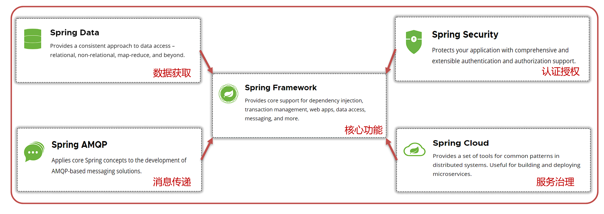

# SpringBoot

## 概述

- **官网**: [https://spring.io](https://spring.io/)
- **核心理念**: "Spring makes Java simple"
- **Spring Boot 定位**: 简化 Spring 应用初始搭建和开发流程，提供**快速开发**和**简化配置**的能力。

Spring 生态系统中最核心的是 Spring Framework，提供依赖注入、事务管理、Web 开发支持等基础功能。由于直接使用 Spring Framework 存在**配置繁琐**的问题，Spring Boot 通过自动化配置和起步依赖显著提升开发效率。



---


## 基础篇

### 核心特性

1. **起步依赖（Starter Dependencies）**  

   通过 Maven 坐标整合功能所需依赖，如 `spring-boot-starter-web` 包含 Spring MVC 和 Tomcat。

2. **自动配置（Auto-Configuration）**  

   基于约定大于配置原则，自动注入常用 Bean，通过 `@Conditional` 系列注解控制条件加载。

3. **其他特性**  

   - 内嵌 Web 服务器（默认 Tomcat，支持 Jetty/Undertow）。
   - 外部化配置（YAML/Properties 多环境支持）。
   - 无 XML 配置（推荐 Java Config，支持 `@ImportResource` 导入 XML）。

---


### 入门示例

1. **创建 Maven 项目并添加依赖**  
   ```xml
   <dependency>
       <groupId>org.springframework.boot</groupId>
       <artifactId>spring-boot-starter-web</artifactId>
   </dependency>
   ```

2. **编写 Controller**  
   ```java
   @RestController
   public class HelloController {
       @GetMapping("/hello")
       public String hello() {
           return "Hello World ~";
       }
   }
   ```

3. **启动类**  
   ```java
   @SpringBootApplication
   public class Application {
       public static void main(String[] args) {
           SpringApplication.run(Application.class, args);
       }
   }
   ```
   > **注意**：Spring Boot 3.x 需 JDK 17+。

---

### 配置文件

- **Properties 文件**（`application.properties`）  
  ```properties
  server.port=8080
  server.servlet.context-path=/start
  ```

- **YAML 文件**（`application.yml`，**缩进用空格，推荐 2 空格**）  
  
  ```yaml
  server:
    port: 8080
    servlet:
      context-path: /start
  ```

**配置注入方式**：
- `@Value("${key}")`：注入单个属性。
- `@ConfigurationProperties(prefix="prefix")`：绑定到 Bean（需配合 `@EnableConfigurationProperties`）。

---


### 整合 MyBatis

1. **添加依赖（无需指定版本，继承 Spring Boot 父 Pom）**  
   ```xml
   <dependency>
       <groupId>org.mybatis.spring.boot</groupId>
       <artifactId>mybatis-spring-boot-starter</artifactId>
   </dependency>
   ```

2. **配置数据源**  
   ```yaml
   spring:
     datasource:
       driver-class-name: com.mysql.cj.jdbc.Driver
       url: jdbc:mysql://localhost:3306/springboot
       username: root
       password: 123456
   ```

3. **Mapper 扫描**  
   - 接口添加 `@Mapper` 注解。
   - 或启动类添加 `@MapperScan("com.example.mapper")`。

---


### Bean 管理

- **组件扫描**  
  Spring Boot 默认扫描启动类所在包及其子包。可通过 `@ComponentScan` 自定义扫描路径。

- **注册 Bean 的注解**  

  | 注解          | 使用场景               |
  | ------------- | ---------------------- |
  | `@Component`  | 通用组件               |
  | `@Controller` | Web 层控制器           |
  | `@Service`    | 业务逻辑层             |
  | `@Repository` | 数据访问层（JPA 常用） |

- **第三方 Bean 注册**  
  使用 `@Bean`（在配置类中）或 `@Import`（导入配置类或 `ImportSelector` 实现类）。  
  **示例**：  
  ```java
  @Configuration
  public class ThirdPartyConfig {
      @Bean
      public ThirdPartyService thirdPartyService() {
          return new ThirdPartyService();
      }
  }
  ```

- **条件注解**  
  | 注解                        | 说明                       |
  | --------------------------- | -------------------------- |
  | `@ConditionalOnProperty`    | 存在指定配置属性时生效     |
  | `@ConditionalOnMissingBean` | 容器中无该类型 Bean 时生效 |
  | `@ConditionalOnClass`       | 类路径存在指定类时生效     |

---


### 自动配置原理

1. **启动流程**  
   
   - `@SpringBootApplication` 组合了 `@EnableAutoConfiguration`。
   - `@EnableAutoConfiguration` 通过 `@Import` 导入 `AutoConfigurationImportSelector`。
   - 加载 `META-INF/spring/org.springframework.boot.autoconfigure.AutoConfiguration.imports`（Spring Boot 3.x）或 `spring.factories`（旧版）中的配置类。
   - 根据 `@Conditional` 条件决定是否注册 Bean。
   
2. **示例**  
   
   ```java
   @Configuration
   @ConditionalOnClass(DataSource.class)
   public class DataSourceAutoConfiguration {
       // 当类路径存在 DataSource 时自动配置
   }
   ```

---


### 自定义 Starter

#### 步骤

1. **创建两个模块**  
   - `autoconfigure`：包含自动配置代码。
   - `starter`：空模块,负责依赖管理，依赖于 `autoconfigure`。

2. **编写自动配置类**  
   
   ```java
   @Configuration
   @ConditionalOnClass(MyService.class)
   @EnableConfigurationProperties(MyServiceProperties.class)
   public class MyServiceAutoConfiguration {
       @Bean
       @ConditionalOnMissingBean
       public MyService myService(MyServiceProperties properties) {
           return new MyService(properties);
       }
   }
   ```
   
3. **定义配置属性类**  
   ```java
   @ConfigurationProperties(prefix = "my.service")
   public class MyServiceProperties {
       private String message = "Hello, World!";
       // Getter/Setter
   }
   ```
   > 需在启动类添加 `@EnableConfigurationProperties(MyServiceProperties.class)`。

4. **注册配置类**  
   在 `autoconfigure/src/main/resources/META-INF/spring/org.springframework.boot.autoconfigure.AutoConfiguration.imports` 中添加：  
   ```
   com.example.autoconfigure.MyServiceAutoConfiguration
   ```

5. **发布并使用 Starter**  
   ```xml
   <!-- 在项目中引入 -->
   <dependency>
       <groupId>com.example</groupId>
       <artifactId>my-service-starter</artifactId>
   </dependency>
   ```

---

### 补充内容

#### 多环境配置
- **配置文件命名**：`application-{profile}.yml`。
- **激活 Profile**：  
  ```yaml
  spring:
    profiles:
      active: dev
  ```

#### 内嵌服务器切换
```xml
<!-- 排除 Tomcat -->
<dependency>
    <groupId>org.springframework.boot</groupId>
    <artifactId>spring-boot-starter-web</artifactId>
    <exclusions>
        <exclusion>
            <groupId>org.springframework.boot</groupId>
            <artifactId>spring-boot-starter-tomcat</artifactId>
        </exclusion>
    </exclusions>
</dependency>
<!-- 添加 Jetty -->
<dependency>
    <groupId>org.springframework.boot</groupId>
    <artifactId>spring-boot-starter-jetty</artifactId>
</dependency>
```

#### 生产就绪特性（Actuator）
```xml
<dependency>
    <groupId>org.springframework.boot</groupId>
    <artifactId>spring-boot-starter-actuator</artifactId>
</dependency>
```
通过端点 `/actuator/health` 监控应用状态。

---

### 常见问题

1. **版本兼容性**  
   Spring Boot 3.x 需 Jakarta EE 9+（包名从 `javax` 改为 `jakarta`）。

2. **日志配置**  
   默认使用 Logback，配置 `application.yml`：  
   ```yaml
   logging:
     level:
       root: INFO
       com.example: DEBUG
   ```

3. **打包部署**  
   - 打包为可执行 JAR：`mvn clean package`。
   - WAR 部署需继承 `SpringBootServletInitializer`。

---

