# 概述

## Springcloud

Spring Cloud 是一系列框架的有序集合，它利用 Spring Boot 的开发便利性简化了分布式系统的开发，比如服务发现、服务网关、服务路由、链路追踪等。Spring Cloud 并不重复造轮子，而是将市面上开发得比较好的模块集成进去，进行封装，从而减少了各模块的开发成本。换句话说：Spring Cloud 提供了构建分布式系统所需的“全家桶”


## 微服务

微服务架构（Microservice Architecture）是一种架构概念，旨在通过将功能分解到各个离散的服务中以实现对解决方案的解耦。你可以将其看作是在架构层次而非获取服务的

类上应用很多SOLID原则。微服务架构是个很有趣的概念，它的主要作用是将功能分解到离散的各个服务当中，从而降低系统的耦合性，并提供更加灵活的服务支持。

**概念：** 把一个大型的单个应用程序和服务拆分为数个甚至数十个的支持微服务，它可扩展单个组件而不是整个的应用程序堆栈，从而满足服务等级协议。


# MyBatis-Plus

## 快速入门

1. 引入依赖(maven)：

```xml
        <dependency>
            <groupId>com.baomidou</groupId>
            <artifactId>mybatis-plus-spring-boot3-starter</artifactId>
            <version>3.5.9</version>
        </dependency>
        <!-- springBoot3依赖 -->
```

> 以上为Spring Boot3.x.x版本依赖，3.x.x以下版本略有不同


2. 自定义的Mapper继承MybatisPlus提供的BaseMapper接口：

```java
public interface UserMapper extends BaseMapper<User> {}
```


### 常见注解

> MyBatisPlus通过扫描实体类，并基于反射获取实体类信息作为数据库表信息。

约定大于配置：

- 类名驼峰转下划线作为表名

- 名为id的字段作为主键

- 变量名驼峰转下划线作为表的字段名
  
  

MybatisPlus中比较常用的几个注解如下(主要用于不满足约定的情况)：

- `@TableName`：用来指定表名

- `@TableId`：用来指定表中的主键字段信息

- `@TableField`：用来指定表中的普通字段信息

```java
@TableName("user")
public class User {

    /**
     * 用户id
     */
    @TableId(value = "id", type = IdType.AUTO)
    private Long id;

    /**
     * 用户名
     */
    @TableField("username")
    private String username;
}
```

IdType枚举（建议指定）：

- `AUTO`：数据库自增长

- `INPUT`：通过set方法自行输入

- `ASSIGN_ID`：分配 ID，接口`IdentifierGenerator`的方法nextId来生成id，默认实现类为`DefaultIdentifierGenerator`雪花算法
  
  

使用@TableField的常见场景：

- 成员变量名与数据库字段名不一致

- 成员变量名<font color=red>以is开头，且是布尔值</font>

- 成员变量名与数据库**关键字冲突**    如@TableField("\`order\`")  反引号

- 成员变量不是数据库字段
  
  

### 常用配置

```yml
mybatis-plus:
  type-aliases-package: com.ysh.entity #别名扫描包
  mapper-locations: classpath:mapper/**/*.xml #mapper扫描路径
  configuration:
    map-underscore-to-camel-case: true #开启驼峰命名规则
    cache-enabled: false #关闭Mybatis二级缓存
  global-config:
    db-config:
      id-type: assign_id #主键类型为雪花算法（全局配置）注解配置高于全局配置
      update-strategy: not_null #更新策略:只更新不为null的值
```

具体可参考官方文档：[使用配置](https://www.baomidou.com/pages/56bac0/) [|](https://www.baomidou.com/pages/56bac0/) [MyBatis](https://www.baomidou.com/pages/56bac0/)[-Plus(baomidou.com)](https://www.baomidou.com/pages/56bac0/)


## 核心功能

### 条件构造器

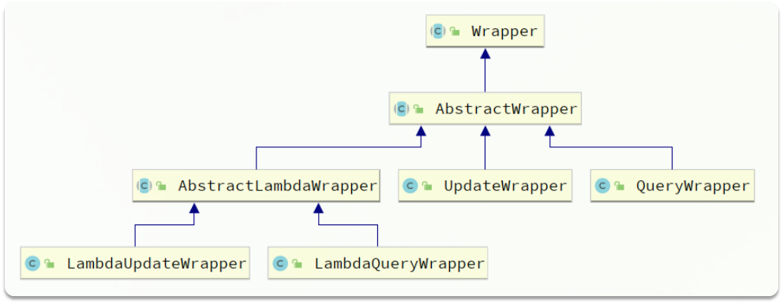

需求：

1. 查询出名字中带o的，存款大于等于1000元的人的id、username、info、balance字段
   
```sql
   # 原始SQL语句
   SELECT id,username,info,balance
   FROM user 
   WHERE username LIKE ? AND balance >= ?
```

```java
        // 构建查询条件
        QueryWrapper<User> wrapper = new QueryWrapper<User>()
                .select("id", "username", "info", "balance")
                .like("username", "o")
                .ge("balance", 1000);

        // 执行查询
        userMapper.selectList(wrapper);
```


2. 更新用户名为jack的用户的余额为2000
   
```sql
   UPDATE user
   SET balance = 2000
   WHERE (username = "jack")
```

```java
        User user = new User();
        user.setBalance(2000);

        QueryWrapper<User> wrapper = new QueryWrapper<User>()
                .eq("username", "jack");

        userMapper.update(user, wrapper);
```


3. 更新id为1,2,4的用户的余额，扣200

```sql
UPDATE user
SET balance = balance - 200
WHERE id in (1, 2, 4)
```

```java
        List<Long> ids = List.of(1L, 2L, 4L);
        UpdateWrapper<User> wrapper = new UpdateWrapper<User>()
                .setSql("balance = balance - 200")
                .in("id", ids);
        userMapper.update(null,wrapper);
```


4. LambdaWrapper

```java
        LambdaQueryWrapper<User> wrapper = new LambdaQueryWrapper<User>()
                .select(User::getId, User::getUsername, User::getInfo, User::getBalance)
                .like(User::getUsername, "o")
                .ge(User::getBalance, 1000);
        userMapper.selectList(wrapper).forEach(System.out::println);
```


总结：

条件构造器的用法：

- QueryWrapper和LambdaQueryWrapper通常用来构建select、delete、update的where条件部分

- UpdateWrapper和LambdaUpdateWrapper通常只有在set语句比较特殊才使用

- 尽量使用LambdaQueryWrapper和LambdaUpdateWrapper，避免硬编码
  
  

### 自定义SQl

我们可以利用MyBatisPlus的Wrapper来构建复杂的Where条件，然后自己定义SQL语句中剩下的部分。


需求：将id在指定范围的用户（例如1、2、4 ）的余额扣减指定值

1. 基于Wrapper构建where条件

```java
        List<Long> ids = List.of(1L, 2L, 4L);
        int amount = 200;
        // 1.构建条件
        LambdaQueryWrapper<User> wrapper = new LambdaQueryWrapper<User>().in(User::getId, ids);
        //2.自定义SQL方法调用
        userMapper.updateBalanceByIds(wrapper, amount);
```

2. 在mapper方法参数中用Param注解声明wrapper变量名称，必须是ew

```java
void updateBalanceByIds(@Param("ew") LambdaQueryWrapper<User> wrapper, @Param("amount") int amount);
```

> Wrapper参数必须指定为“ew”

3. 自定义SQL，并使用Wrapper条件

```xml
    <update id="updateBalanceByIds">
        UPDATE tb_user SET balance = balance - #{amount} ${ew.customSqlSegment}
    </update>
```


### Service接口

#### 基本使用

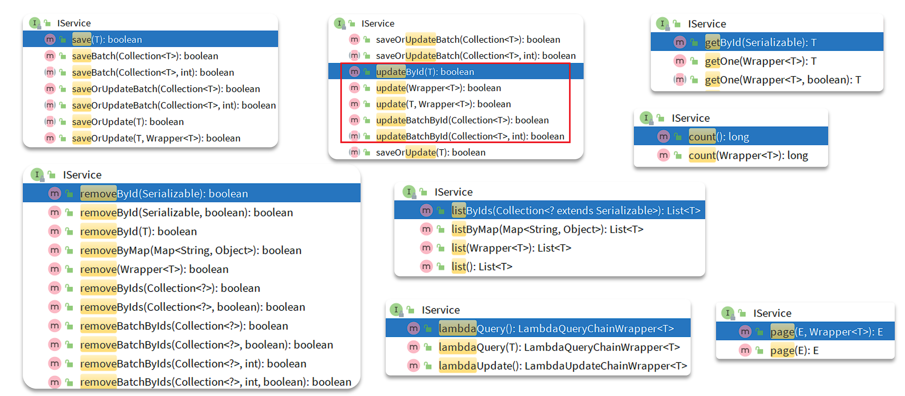

   使用步骤：

1. 自定义Service接口继承IService接口

```java
public interface IUserService extends IService<User> {
}
```

2. 自定义Service实现类，实现自定义接口并继承ServiceImpl类

```java
@Service
public class UserServiceImpl extends ServiceImpl<UserMapper, User> implements IUserService {
}
```


#### Lambda

IService中还提供了**Lambda**功能来简化我们的复杂查询及更新功能。

**案例一**：实现一个根据复杂条件查询用户的接口，查询条件如下：

* name：用户名关键字，可以为空

* status：用户状态，可以为空

* minBalance：最小余额，可以为空

* maxBalance：最大余额，可以为空

可以理解成一个用户的后台管理界面，管理员可以自己选择条件来筛选用户，因此上述条件不一定存在，需要做判断。


```java
    List<User> users = userService.lambdaQuery()
            .like(username != null, User::getUsername, username)
            .eq(status != null, User::getStatus, status)
            .ge(minBalance != null, User::getBalance, minBalance)
            .le(maxBalance != null, User::getBalance, maxBalance)
            .list();
```

> 在组织查询条件的时候，我们加入了 `username != null` 这样的参数，意思就是当条件成立时才会添加这个查询条件

可以发现lambdaQuery方法中除了可以构建条件，还需要在链式编程的最后添加一个`list()`，这是在告诉MP我们的调用结果需要是一个list集合。这里不仅可以用`list()`，可选的方法有：

* `.one()`：最多1个结果

* `.list()`：返回集合结果

* `.count()`：返回计数结果

MybatisPlus会根据链式编程的最后一个方法来判断最终的返回结果。


根据id修改用户余额

```java
lambdaUpdate()
            .set(User::getBalance, remainBalance) // 更新余额
            .set(remainBalance == 0, User::getStatus, 2) // 动态判断，是否更新status
            .eq(User::getId, id)
            .eq(User::getBalance, user.getBalance()) // 乐观锁，解决并发问题
            .update();
```


#### 批量新增

测试逐条插入数据，效率极低。


然后再试试MybatisPlus的批处理：

```java
@Test
void testSaveBatch() {
    // 准备10万条数据
    List<User> list = new ArrayList<>(1000);
    long b = System.currentTimeMillis();
    for (int i = 1; i <= 100000; i++) {
        list.add(buildUser(i));
        // 每1000条批量插入一次
        if (i % 1000 == 0) {
            userService.saveBatch(list);
            list.clear();
        }
    }
    long e = System.currentTimeMillis();
    System.out.println("耗时：" + (e - b));
}
```

> 比逐条新增效率提高了10倍左右


`MybatisPlus`的批处理是基于`PrepareStatement`的预编译模式，然后批量提交，最终在数据库执行时还是会有多条insert语句，逐条插入数据。SQL类似这样：

```sql
Preparing: INSERT INTO user ( username, password, phone, info, balance, create_time, update_time ) VALUES ( ?, ?, ?, ?, ?, ?, ? )
Parameters: user_1, 123, 18688190001, "", 2000, 2023-07-01, 2023-07-01
Parameters: user_2, 123, 18688190002, "", 2000, 2023-07-01, 2023-07-01
Parameters: user_3, 123, 18688190003, "", 2000, 2023-07-01, 2023-07-01
```

而如果想要得到最佳性能，最好是将多条SQL合并为一条，像这样：

```sql
INSERT INTO user ( username, password, phone, info, balance, create_time, update_time )
VALUES 
(user_1, 123, 18688190001, "", 2000, 2023-07-01, 2023-07-01),
(user_2, 123, 18688190002, "", 2000, 2023-07-01, 2023-07-01),
(user_3, 123, 18688190003, "", 2000, 2023-07-01, 2023-07-01),
(user_4, 123, 18688190004, "", 2000, 2023-07-01, 2023-07-01);
```


**解决方案：**

**MySQL**的客户端连接参数中有这样的一个参数：`rewriteBatchedStatements`。顾名思义，就是重写批处理的`statement`语句。

> 这个参数的默认值是false，我们需要修改连接参数，将其配置为true

修改项目中的application.yml文件，在jdbc的url后面添加参数`&rewriteBatchedStatements=true`

```yml
spring:
  datasource:
    url: jdbc:mysql://8.138.186.154:3306/mp?rewriteBatchedStatements=true&useUnicode=true&characterEncoding=UTF-8&autoReconnect=true&serverTimezone=Asia/Shanghai
    driver-class-name: com.mysql.cj.jdbc.Driver
    username: root
    password: 123456
```


## 扩展功能

### 代码生成

在使用MybatisPlus以后，基础的`Mapper`、`Service`、`PO`代码相对固定，重复编写也比较麻烦。因此MybatisPlus官方提供了代码生成器根据数据库表结构生成`PO`、`Mapper`、`Service`等相关代码。只不过代码生成器同样要编码使用，也很麻烦。

推荐使用一款`MybatisPlus`的插件(IDEA插件)，它可以基于图形化界面完成`MybatisPlus`的代码生成，非常简单。

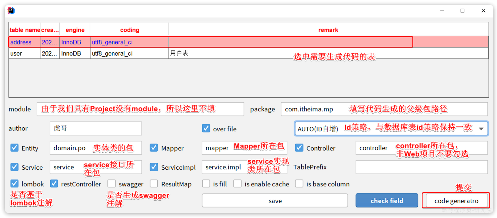


### 静态工具

有的时候Service之间也会相互调用，为了**避免出现循环依赖问题**，MybatisPlus提供一个静态工具类：`Db`，其中的一些静态方法与`IService`中方法签名基本一致，也可以帮助我们实现CRUD功能：

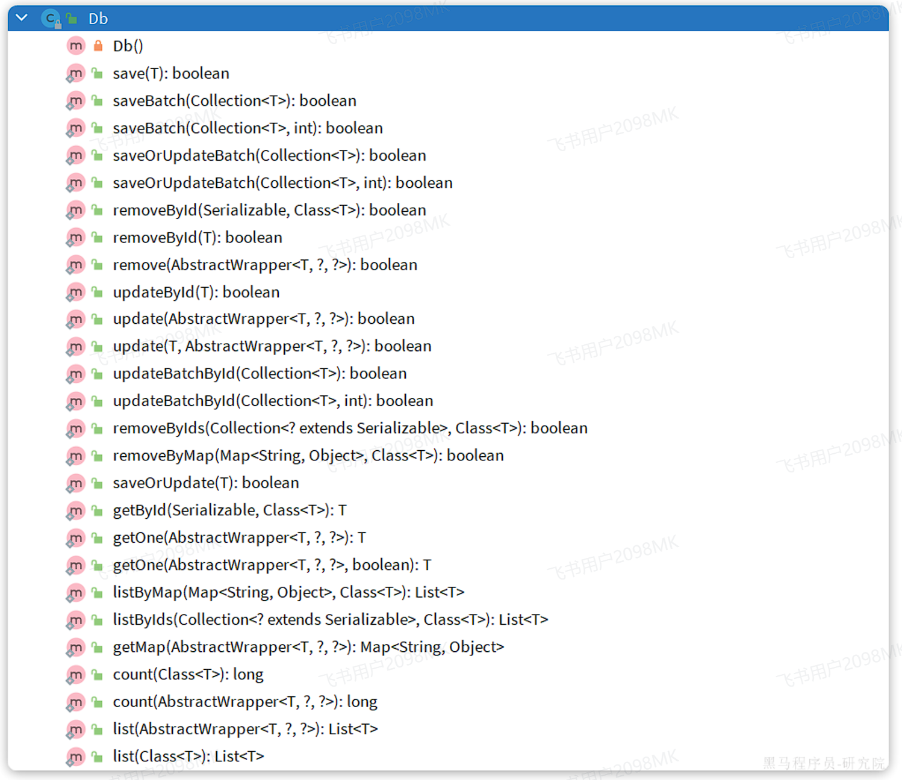

示例：

```java
@Test
void testDbGet() {
    User user = Db.getById(1L, User.class);
    System.out.println(user);
}

@Test
void testDbList() {
    // 利用Db实现复杂条件查询
    List<User> list = Db.lambdaQuery(User.class)
            .like(User::getUsername, "o")
            .ge(User::getBalance, 1000)
            .list();
    list.forEach(System.out::println);
}

@Test
void testDbUpdate() {
    Db.lambdaUpdate(User.class)
            .set(User::getBalance, 2000)
            .eq(User::getUsername, "Rose");
}
```


### 逻辑删除

对于一些比较重要的数据，我们往往会采用逻辑删除的方案，即：

* 在表中添加一个字段标记数据是否被删除

* 当删除数据时把标记置为true

* 查询时过滤掉标记为true的数据
  
  > 一旦采用了逻辑删除，所有的查询和删除逻辑都要跟着变化，非常麻烦。
  
  

  为了解决这个问题，MybatisPlus就添加了对逻辑删除的支持。

> **注意**，只有MybatisPlus生成的SQL语句才支持自动的逻辑删除，自定义SQL需要自己手动处理逻辑删除。


例如，我们给`address`表添加一个逻辑删除字段：

```sql
alter table address add deleted bit default b'0' null comment '逻辑删除';
```


然后给`Address`实体添加`deleted`字段(Boolean类型)：


接下来，我们要在`application.yml`中配置逻辑删除字段：

```yml
mybatis-plus:
  global-config:
    db-config:
      logic-delete-field: deleted # 全局逻辑删除的实体字段名(since 3.3.0,配置后可以忽略不配置步骤2)
      logic-delete-value: 1 # 逻辑已删除值(默认为 1)
      logic-not-delete-value: 0 # 逻辑未删除值(默认为 0)
```


方法与普通删除一模一样，但是底层的SQL逻辑变了：


综上， 开启了逻辑删除功能以后，我们就可以像普通删除一样做CRUD，基本不用考虑代码逻辑问题。还是非常方便的。

**注意**：逻辑删除本身也有自己的问题，比如：

* 会导致数据库表垃圾数据越来越多，从而影响查询效率

* SQL中全都需要对逻辑删除字段做判断，影响查询效率

因此，我不太推荐采用逻辑删除功能，如果数据不能删除，可以采用把**数据迁移到其它表**的办法。


### 通用枚举

User类中有一个用户状态字段：

```java
private Integer status;//使用状态（1正常 2冻结）
```

像这种字段我们一般会定义一个**枚举**，做业务判断的时候就可以直接基于枚举做比较。但是我们数据库采用的是`int`类型，对应的PO也是`Integer`。因此业务操作时必须手动把`枚举`与`Integer`转换，非常麻烦。

因此，MybatisPlus提供了一个处理枚举的类型转换器，可以帮我们**把枚举类型与数据库类型自动转换**。


定义枚举类：

> 要让`MybatisPlus`处理枚举与数据库类型自动转换，我们必须告诉`MybatisPlus`，枚举中的哪个字段的值作为数据库值。 `MybatisPlus`提供了`@EnumValue`注解来标记枚举属性

```java
import com.baomidou.mybatisplus.annotation.EnumValue;
import lombok.Getter;

@Getter
public enum UserStatus {
    NORMAL(1, "正常"),
    FREEZE(2, "冻结")
    ;
    @EnumValue
    private final int value;
    private final String desc;

    UserStatus(int value, String desc) {
        this.value = value;
        this.desc = desc;
    }
}
```


然后把`User`类中的`status`字段改为`UserStatus` 类型


配置枚举处理器,在application.yaml文件中添加配置：

```yml
mybatis-plus:
  configuration:
    default-enum-type-handler: com.baomidou.mybatisplus.core.handlers.MybatisEnumTypeHandler
```


同时，为了使页面查询结果也是枚举格式，我们需要修改UserVO中的status属性

并且，在UserStatus枚举中通过`@JsonValue`注解标记JSON序列化时展示的字段


### JSON类型处理器

数据库的user表中有一个`info`字段，是JSON类型

而目前`User`实体类中却是`String`类型


这样一来，我们要读取info中的属性时就非常不方便。如果要方便获取，info的类型最好是一个`Map`或者实体类。

而一旦我们把`info`改为`对象`类型，就需要在写入数据库时手动转为`String`，再读取数据库时，手动转换为`对象`，这会非常麻烦。


因此MybatisPlus提供了很多特殊类型字段的类型处理器，解决特殊字段类型与数据库类型转换的问题。例如处理JSON就可以使用`JacksonTypeHandler`处理器。


使用步骤：

1. 定义实体

首先，我们定义一个单独实体类来与info字段的属性匹配

```java
public class UserInfo{
    //...
}
```

2. 使用类型处理器

接下来，将User类的info字段修改为UserInfo类型，并声明类型处理器

```java
@TableField(typeHandler = JacksonTypeHandler.class)
private UserInfo info;
```


## 插件功能

MybatisPlus提供了很多的插件功能，进一步拓展其功能。目前已有的插件有：

* `PaginationInnerInterceptor`：自动分页

* `TenantLineInnerInterceptor`：多租户

* `DynamicTableNameInnerInterceptor`：动态表名

* `OptimisticLockerInnerInterceptor`：乐观锁

* `IllegalSQLInnerInterceptor`：sql 性能规范

* `BlockAttackInnerInterceptor`：防止全表更新与删除
  
  

### 分页插件

在项目中新建一个配置类

```java
@Configuration
public class MybatisConfig {

    @Bean
    public MybatisPlusInterceptor mybatisPlusInterceptor() {
        // 初始化核心插件
        MybatisPlusInterceptor interceptor = new MybatisPlusInterceptor();
        // 添加分页插件
        interceptor.addInnerInterceptor(new PaginationInnerInterceptor(DbType.MYSQL));
        return interceptor;
    }
}
```


编写一个分页查询的测试

```java
@Test
void testPageQuery() {
    // 1.分页查询，new Page()的两个参数分别是：页码、每页大小
    Page<User> p = userService.page(new Page<>(2, 2));
    // 2.总条数
    System.out.println("total = " + p.getTotal());
    // 3.总页数
    System.out.println("pages = " + p.getPages());
    // 4.数据
    List<User> records = p.getRecords();
    records.forEach(System.out::println);
}
```

这里用到了分页参数，Page，即可以支持分页参数，也可以支持排序参数。常见的API如下：

```java
int pageNo = 1, pageSize = 5;
// 分页参数
Page<User> page = Page.of(pageNo, pageSize);
// 排序参数, 通过OrderItem来指定
page.addOrder(new OrderItem("balance", false));

userService.page(page);
```


### 通用分页实体

现在要实现一个用户分页查询的接口，接口规范如下：

| **参数** | **说明**                                                                                                                                                                                                                                                                                                                                          |
| ------ | ----------------------------------------------------------------------------------------------------------------------------------------------------------------------------------------------------------------------------------------------------------------------------------------------------------------------------------------------- |
| 请求方式   | GET                                                                                                                                                                                                                                                                                                                                             |
| 请求路径   | /users/page                                                                                                                                                                                                                                                                                                                                     |
| 请求参数   | `{    "pageNo": 1,    "pageSize": 5,    "sortBy": "balance",    "isAsc": false,    "name": "o",    "status": 1}`                                                                                                                                                                                                                                |
| 返回值    | `{    "total": 100006,    "pages": 50003,    "list": [        {            "id": 1685100878975279298,            "username": "user_9****",            "info": {                "age": 24,                "intro": "英文老师",                "gender": "female"            },            "status": "正常",            "balance": 2000        }    ]}` |
| 特殊说明   | 如果排序字段为空，默认按照更新时间排序<br>排序字段不为空，则按照排序字段排序                                                                                                                                                                                                                                                                                                        |

这里需要定义3个实体：

* `UserQuery`：分页查询条件的实体，包含分页、排序参数、过滤条件

* `PageDTO`：分页结果实体，包含总条数、总页数、当前页数据

* `UserVO`：用户页面视图实体
  
  

`PageQuery`是前端提交的查询参数，一般包含四个属性：

* `pageNo`：页码

* `pageSize`：每页数据条数

* `sortBy`：排序字段

* `isAsc`：是否升序

```java
@Data
@ApiModel(description = "分页查询实体")
public class PageQuery {
    @ApiModelProperty("页码")
    private Long pageNo;
    @ApiModelProperty("页码")
    private Long pageSize;
    @ApiModelProperty("排序字段")
    private String sortBy;
    @ApiModelProperty("是否升序")
    private Boolean isAsc;
}
```

> 其他类可继承该类实现扩展


`PageDTO`

```java
@Data
public class PageDTO<T> {
    private Long total;
    private Long pages;
    private List<T> list;
}
```


测试代码：

```java
@Override
public PageDTO<UserVO> queryUsersPage(PageQuery query) {
    // 1.构建条件
    // 1.1.分页条件
    Page<User> page = Page.of(query.getPageNo(), query.getPageSize());
    // 1.2.排序条件
    if (query.getSortBy() != null) {
        page.addOrder(new OrderItem(query.getSortBy(), query.getIsAsc()));
    }else{
        // 默认按照更新时间排序
        page.addOrder(new OrderItem("update_time", false));
    }
    // 2.查询
    this.page(page);
    // 3.数据非空校验
    List<User> records = page.getRecords();
    if (records == null || records.size() <= 0) {
        // 无数据，返回空结果
        return new PageDTO<>(page.getTotal(), page.getPages(), Collections.emptyList());
    }
    // 4.有数据，转换
    List<UserVO> list = BeanUtil.copyToList(records, UserVO.class);
    // 5.封装返回
    return new PageDTO<UserVO>(page.getTotal(), page.getPages(), list);
}
```


### 通用分页实体封装


在刚才的代码中，从`PageQuery`到`MybatisPlus`的`Page`之间转换的过程还是比较麻烦的。

我们完全可以在`PageQuery`这个实体中定义一个工具方法，简化开发。

```java
import com.baomidou.mybatisplus.core.metadata.OrderItem;
import com.baomidou.mybatisplus.extension.plugins.pagination.Page;
import lombok.Data;

@Data
public class PageQuery {
    private Integer pageNo;
    private Integer pageSize;
    private String sortBy;
    private Boolean isAsc;

    public <T>  Page<T> toMpPage(OrderItem ... orders){
        // 1.分页条件
        Page<T> p = Page.of(pageNo, pageSize);
        // 2.排序条件
        // 2.1.先看前端有没有传排序字段
        if (sortBy != null) {
            p.addOrder(new OrderItem(sortBy, isAsc));
            return p;
        }
        // 2.2.再看有没有手动指定排序字段
        if(orders != null){
            p.addOrder(orders);
        }
        return p;
    }

    public <T> Page<T> toMpPage(String defaultSortBy, boolean isAsc){
        return this.toMpPage(new OrderItem(defaultSortBy, isAsc));
    }

    public <T> Page<T> toMpPageDefaultSortByCreateTimeDesc() {
        return toMpPage("create_time", false);
    }

    public <T> Page<T> toMpPageDefaultSortByUpdateTimeDesc() {
        return toMpPage("update_time", false);
    }
}
```


在查询出分页结果后，数据的非空校验，数据的vo转换都是模板代码，编写起来很麻烦。

我们完全可以将其封装到PageDTO的工具方法中，简化整个过程

```java
import cn.hutool.core.bean.BeanUtil;
import com.baomidou.mybatisplus.extension.plugins.pagination.Page;
import lombok.AllArgsConstructor;
import lombok.Data;
import lombok.NoArgsConstructor;

import java.util.Collections;
import java.util.List;
import java.util.function.Function;
import java.util.stream.Collectors;

@Data
@NoArgsConstructor
@AllArgsConstructor
public class PageDTO<V> {
    private Long total;
    private Long pages;
    private List<V> list;

    /**
     * 返回空分页结果
     * @param p MybatisPlus的分页结果
     * @param <V> 目标VO类型
     * @param <P> 原始PO类型
     * @return VO的分页对象
     */
    public static <V, P> PageDTO<V> empty(Page<P> p){
        return new PageDTO<>(p.getTotal(), p.getPages(), Collections.emptyList());
    }

    /**
     * 将MybatisPlus分页结果转为 VO分页结果
     * @param p MybatisPlus的分页结果
     * @param voClass 目标VO类型的字节码
     * @param <V> 目标VO类型
     * @param <P> 原始PO类型
     * @return VO的分页对象
     */
    public static <V, P> PageDTO<V> of(Page<P> p, Class<V> voClass) {
        // 1.非空校验
        List<P> records = p.getRecords();
        if (records == null || records.size() <= 0) {
            // 无数据，返回空结果
            return empty(p);
        }
        // 2.数据转换
        List<V> vos = BeanUtil.copyToList(records, voClass);
        // 3.封装返回
        return new PageDTO<>(p.getTotal(), p.getPages(), vos);
    }

    /**
     * 将MybatisPlus分页结果转为 VO分页结果，允许用户自定义PO到VO的转换方式
     * @param p MybatisPlus的分页结果
     * @param convertor PO到VO的转换函数
     * @param <V> 目标VO类型
     * @param <P> 原始PO类型
     * @return VO的分页对象
     */
    public static <V, P> PageDTO<V> of(Page<P> p, Function<P, V> convertor) {
        // 1.非空校验
        List<P> records = p.getRecords();
        if (records == null || records.size() <= 0) {
            // 无数据，返回空结果
            return empty(p);
        }
        // 2.数据转换
        List<V> vos = records.stream().map(convertor).collect(Collectors.toList());
        // 3.封装返回
        return new PageDTO<>(p.getTotal(), p.getPages(), vos);
    }
}
```


---

# Docker（详见笔记《Docker》）

[Docker](../Docker.md)


---


# 微服务

## 概述

### 单体架构

单体架构（monolithic structure）：顾名思义，整个项目中所有功能模块都在一个工程中开发；项目部署时需要对所有模块一起编译、打包；项目的架构设计、开发模式都非常简单。

当项目规模较小时，这种模式上手快，部署、运维也都很方便，因此早期很多小型项目都采用这种模式。


但随着项目的业务规模越来越大，团队开发人员也不断增加，单体架构就呈现出越来越多的问题：

* **团队协作成本高**：试想一下，你们团队数十个人同时协作开发同一个项目，由于所有模块都在一个项目中，不同模块的代码之间物理边界越来越模糊。最终要把功能合并到一个分支，你绝对会陷入到解决冲突的泥潭之中。

* **系统发布效率低**：任何模块变更都需要发布整个系统，而系统发布过程中需要多个模块之间制约较多，需要对比各种文件，任何一处出现问题都会导致发布失败，往往一次发布需要数十分钟甚至数小时。

* **系统可用性差**：单体架构各个功能模块是作为一个服务部署，相互之间会互相影响，一些热点功能会耗尽系统资源，导致其它服务低可用。
  
  

### 微服务架构

微服务架构，首先是服务化，就是将单体架构中的功能模块从单体应用中拆分出来，独立部署为多个服务。同时要满足下面的一些特点：

* **单一职责**：一个微服务负责一部分业务功能，并且其核心数据不依赖于其它模块。

* **团队自治**：每个微服务都有自己独立的开发、测试、发布、运维人员，团队人员规模不超过10人（2张披萨能喂饱）

* **服务自治**：每个微服务都独立打包部署，访问自己独立的数据库。并且要做好服务隔离，避免对其它服务产生影响

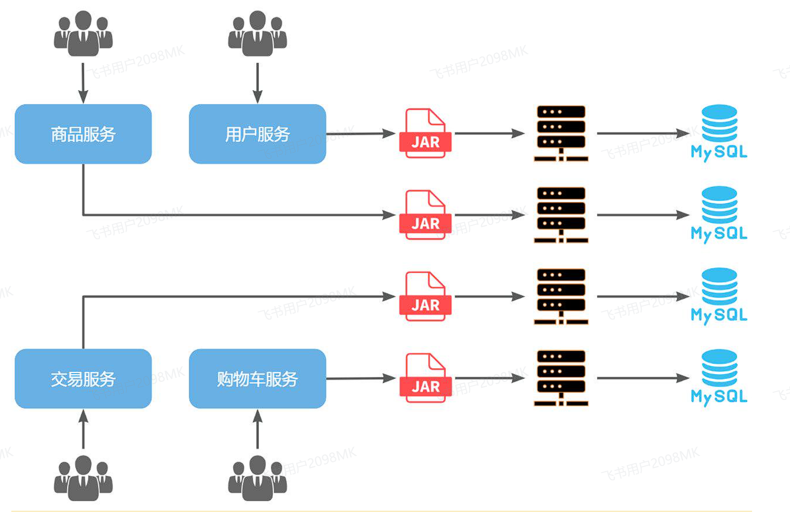


那么，单体架构存在的问题有没有解决呢？

* 团队协作成本高？
  
  * 由于服务拆分，每个服务代码量大大减少，参与开发的后台人员在1~3名，协作成本大大降低

* 系统发布效率低？
  
  * 每个服务都是独立部署，当有某个服务有代码变更时，只需要打包部署该服务即可

* 系统可用性差？
  
  * 每个服务独立部署，并且做好服务隔离，使用自己的服务器资源，不会影响到其它服务。
    
    

综上所述，微服务架构解决了单体架构存在的问题，特别适合大型互联网项目的开发，因此被各大互联网公司普遍采用。大家以前可能听说过分布式架构，分布式就是服务拆分的过程，其实微服务架构正式分布式架构的一种最佳实践的方案。


当然，微服务架构虽然能解决单体架构的各种问题，但在拆分的过程中，还会面临很多其它问题。比如：

* 如果出现跨服务的业务该如何处理？

* 页面请求到底该访问哪个服务？

* 如何实现各个服务之间的服务隔离？
  
  

### Spring Cloud

微服务拆分以后碰到的各种问题都有对应的解决方案和微服务组件，而SpringCloud框架可以说是目前Java领域最全面的微服务组件的集合了。

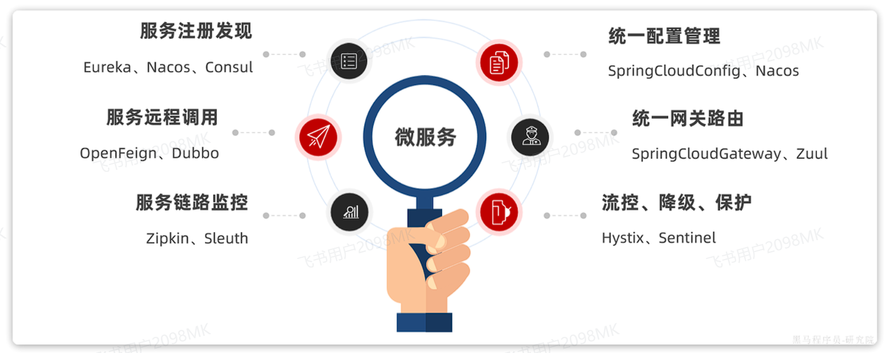

而且SpringCloud依托于SpringBoot的自动装配能力，大大降低了其项目搭建、组件使用的成本。对于没有自研微服务组件能力的中小型企业，使用SpringCloud全家桶来实现微服务开发可以说是最合适的选择了！

目前SpringCloud最新版本为`2022.0.x`版本，对应的SpringBoot版本为`3.x`版本，但它们全部依赖于JDK17，目前在企业中使用相对较少。

| **SpringCloud版本**                                                                                                   | **SpringBoot版本**                      |
| ------------------------------------------------------------------------------------------------------------------- | ------------------------------------- |
| [2022.0.x](https://github.com/spring-cloud/spring-cloud-release/wiki/Spring-Cloud-2022.0-Release-Notes) aka Kilburn | 3.0.x                                 |
| [2021.0.x](https://github.com/spring-cloud/spring-cloud-release/wiki/Spring-Cloud-2021.0-Release-Notes) aka Jubilee | 2.6.x, 2.7.x (Starting with 2021.0.3) |
| [2020.0.x](https://github.com/spring-cloud/spring-cloud-release/wiki/Spring-Cloud-2020.0-Release-Notes) aka Ilford  | 2.4.x, 2.5.x (Starting with 2020.0.3) |
| [Hoxton](https://github.com/spring-cloud/spring-cloud-release/wiki/Spring-Cloud-Hoxton-Release-Notes)               | 2.2.x, 2.3.x (Starting with SR5)      |
| [Greenwich](https://github.com/spring-projects/spring-cloud/wiki/Spring-Cloud-Greenwich-Release-Notes)              | 2.1.x                                 |
| [Finchley](https://github.com/spring-projects/spring-cloud/wiki/Spring-Cloud-Finchley-Release-Notes)                | 2.0.x                                 |
| [Edgware](https://github.com/spring-projects/spring-cloud/wiki/Spring-Cloud-Edgware-Release-Notes)                  | 1.5.x                                 |
| [Dalston](https://github.com/spring-projects/spring-cloud/wiki/Spring-Cloud-Dalston-Release-Notes)                  | 1.5.x                                 |

因此，我们推荐使用次新版本：Spring Cloud 2021.0.x以及Spring Boot 2.7.x版本。


另外，Alibaba的微服务产品SpringCloudAlibaba目前也成为了SpringCloud组件中的一员，我们课堂中也会使用其中的部分组件。


## 服务拆分

### 拆分原则

什么时候拆？

    对于**大多数小型项目来说，一般是先采用单体架构**，随着用户规模扩大、业务复杂后**再逐渐拆分为微服务架构**。这样初期成本会比较低，可以快速试错。但是，这么做的问题就在于后期做服务拆分时，可能会遇到很多代码耦合带来的问题，拆分比较困难（**前易后难**）。

    而对于一些大型项目，在立项之初目的就很明确，为了长远考虑，在架构设计时就直接选择微服务架构。虽 然前期投入较多，但后期就少了拆分服务的烦恼（**前难后易**）。


怎么拆？

* **高内聚**：每个微服务的职责要尽量单一，包含的业务相互关联度高、完整度高。

* **低耦合**：每个微服务的功能要相对独立，尽量减少对其它微服务的依赖，或者依赖接口的稳定性要强。
  
  

明确了拆分目标，接下来就是拆分方式了。我们在做服务拆分时一般有两种方式：

* **纵向**拆分

* **横向**拆分
1. 所谓**纵向拆分**，就是按照项目的功能模块来拆分。例如黑马商城中，就有用户管理功能、订单管理功能、购物车功能、商品管理功能、支付功能等。那么按照功能模块将他们拆分为一个个服务，就属于纵向拆分。这种拆分模式可以尽可能提高服务的内聚性。

2. 而**横向拆分**，是看各个功能模块之间有没有公共的业务部分，如果有将其抽取出来作为通用服务。例如用户登录是需要发送消息通知，记录风控数据，下单时也要发送短信，记录风控数据。因此消息发送、风控数据记录就是通用的业务功能，因此可以将他们分别抽取为公共服务：消息中心服务、风控管理服务。这样可以提高业务的复用性，避免重复开发。同时通用业务一般接口稳定性较强，也不会使服务之间过分耦合。
   
   

### 服务调用

服务拆分前，多个服务间可以相互进行本地调用，但是拆分后就行不通了

因此要想解决这个问题，我们就必须改造其中的代码，把原本本地方法调用，改造成跨微服务的**远程调用**（RPC，即**R**emote **P**roduce **C**all）


解决方案：通过网络调用接口


Spring给我们提供了一个`RestTemplate`的API，可以方便的实现Http请求的发送。


首先将`Restemplate`交给spring管理

```java
@Configuration
public class RemoteCallConfig {

    @Bean
    public RestTemplate restTemplate() {
        return new RestTemplate();
    }
}
```

使用`Restemplate`

```java
    // 发起请求
    ResponseEntity<List<ItemDTO>> response = restTemplate.exchange(
            "http://localhost:8081/items?ids={ids}",
            HttpMethod.GET,
            null,
            new ParameterizedTypeReference<List<ItemDTO>>() {
            },
            Map.of("ids", CollUtil.join(itemIds, ","))
    );
    // 解析响应
    if(!response.getStatusCode().is2xxSuccessful()){
        // 查询失败，直接结束
        return;
    }
```


## 服务治理

### 注册中心原理

在上一节实现了微服务拆分，并且通过Http请求实现了跨微服务的远程调用。不过这种手动发送Http请求的方式存在一些问题。

试想一下，假如商品微服务被调用较多，为了应对更高的并发，我们进行了**多实例部署**


服务的主机和端口都不固定，如何解决？


在微服务远程调用的过程中，包括两个角色：

* 服务提供者：提供接口供其它微服务访问

* 服务消费者：调用其它微服务提供的接口
  
  

在大型微服务项目中，服务提供者的数量会非常多，为了管理这些服务就引入了**注册中心**的概念。注册中心、服务提供者、服务消费者三者间关系如下：

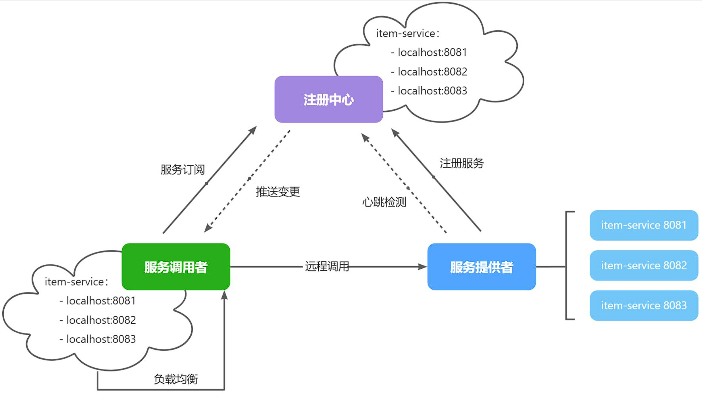

流程如下：

* 服务启动时就会注册自己的服务信息（服务名、IP、端口）到注册中心

* 调用者可以从注册中心订阅想要的服务，获取服务对应的实例列表（1个服务可能多实例部署）

* 调用者自己对实例列表负载均衡，挑选一个实例

* 调用者向该实例发起远程调用
  
  

当服务提供者的实例宕机或者启动新实例时，调用者如何得知呢？

* 服务提供者会定期向注册中心发送请求，报告自己的健康状态（心跳请求）

* 当注册中心长时间收不到提供者的心跳时，会认为该实例宕机，将其从服务的实例列表中剔除

* 当服务有新实例启动时，会发送注册服务请求，其信息会被记录在注册中心的服务实例列表

* 当注册中心服务列表变更时，会主动通知微服务，更新本地服务列表
  
  

### Nacos注册中心

[Nacos官网| Nacos 配置中心 | Nacos 下载| Nacos 官方社区 | Nacos 官网](https://nacos.io/)

目前开源的注册中心框架有很多，国内比较常见的有：

* Eureka：Netflix公司出品，目前被集成在SpringCloud当中，一般用于Java应用

* Nacos：Alibaba公司出品，目前被集成在SpringCloudAlibaba中，一般用于Java应用

* Consul：HashiCorp公司出品，目前集成在SpringCloud中，不限制微服务语言
  
  

下载nacos镜像

```bash
docker pull nacos/nacos-server
```


初始化数据库信息

> 找到nacos的安装目录，打开conf目录下的nacos-mysql.sql文件


配置数据库信息(编写配置文件，并在docker中挂载)

```properties
PREFER_HOST_MODE=hostname
MODE=standalone
SPRING_DATASOURCE_PLATFORM=mysql
MYSQL_SERVICE_HOST=IP
MYSQL_SERVICE_DB_NAME=nacos
MYSQL_SERVICE_PORT=3306
MYSQL_SERVICE_USER=root
MYSQL_SERVICE_PASSWORD=123
MYSQL_SERVICE_DB_PARAM=characterEncoding=utf8&connectTimeout=1000&socketTimeout=3000&autoReconnect=true&useSSL=false&allowPublicKeyRetrieval=true&serverTimezone=Asia/Shanghai
```


启动容器

```bash
docker run -d \
--name nacos \
--env-file ./nacos/custom.env \
-p 8848:8848 \
-p 9848:9848 \
-p 9849:9849 \
--restart=always \
nacos/nacos-server
```


访问页面查看是否启动成功

```url
http://localhost:8848/nacos
```


### 服务注册

服务发现除了要引入nacos依赖以外，由于还需要负载均衡，因此要引入SpringCloud提供的LoadBalancer依赖。

我们在`pom.xml`中添加下面的依赖：

```xml
<!--nacos 服务注册发现-->
<dependency>
    <groupId>com.alibaba.cloud</groupId>
    <artifactId>spring-cloud-starter-alibaba-nacos-discovery</artifactId>
</dependency>
```

在application.yml`中添加nacos地址配置：

```yml
spring:
  cloud:
    nacos:
      server-addr: localhost:8848
```

启动服务即可自动注册


### 服务发现

接下来，服务调用者就可以去订阅服务了。不过服务可能有多个实例，而真正发起调用时只需要知道一个实例的地址。

因此，服务调用者必须利用负载均衡的算法，从多个实例中挑选一个去访问。常见的负载均衡算法有：

* 随机

* 轮询

* IP的hash

* 最近最少访问

* ...

这里我们可以选择最简单的随机负载均衡。


1. 引入依赖并配置nacos服务地址（同上一小节）
   
   

2. 服务发现需要用到一个工具，DiscoveryClient，SpringCloud已经帮我们自动装配，我们可以直接注入使用：

```java
    @Autowired
    private final DiscoveryClient discoveryClient;
```


3. 使用服务

```java
        // 根据服务名称获取服务实例列表
        List<ServiceInstance> instances = discoveryClient.getInstances("item-service");
        if (CollUtils.isEmpty(instances)) {
            return;
        }
        // 根据负载均衡算法选择一个服务实例
        ServiceInstance instance = instances.get(RandomUtil.randomInt(instances.size()));
        // 得到服务实例的URI
        URI uri = instance.getUri();
        ResponseEntity<List<ItemDTO>> response = restTemplate.exchange(
                uri + "/items?ids={ids}",
                HttpMethod.GET,
                null,
                new ParameterizedTypeReference<List<ItemDTO>>() {
                },
                Map.of("ids", CollUtil.join(itemIds, ","))
        );
```


## OpenFeign

OpenFeign客户端是一个web声明式http远程调用工具，直接可以根据服务名称去注册中心拿到指定的服务IP集合，提供了接口和注解方式进行调用，内嵌集成了Ribbon本地负载均衡器（现在流行使用loadbalancer）

### 快速入门

上一节远程调用代码仍然比较复杂


而且这种调用方式，与原本的本地方法调用差异太大，编程时的体验也不统一，一会儿远程调用，一会儿本地调用。

因此，我们必须想办法改变远程调用的开发模式，让**远程调用像本地方法调用一样简单**。而这就要用到OpenFeign组件了。

其实远程调用的关键点就在于四个：

* 请求方式

* 请求路径

* 请求参数

* 返回值类型

所以，OpenFeign就利用SpringMVC的相关注解来声明上述4个参数，然后基于动态代理帮我们生成远程调用的代码，而无需我们手动再编写，非常方便。


1. 引入依赖

```xml
  <!--openFeign-->
  <dependency>
      <groupId>org.springframework.cloud</groupId>
      <artifactId>spring-cloud-starter-openfeign</artifactId>
  </dependency>
  <!--负载均衡器-->
  <dependency>
      <groupId>org.springframework.cloud</groupId>
      <artifactId>spring-cloud-starter-loadbalancer</artifactId>
  </dependency>
```

2. 启用OpenFeign

接下来，我们在启动类上添加注解，启动OpenFeign功能

```java
@EnableFeignClients
```

3. 编写OpenFeign客户端

```java
@FeignClient("item-service")
public interface ItemClient {

    // 注解指定请求方式、请求路径、参数类型、返回类型
    @GetMapping("/items")
    List<ItemDTO> queryItemsByIds(@RequestParam("ids") List<Long> ids);
}

```

> 这里只需要声明接口，无需实现方法。接口中的几个关键信息：
> 
> * `@FeignClient("item-service")` ：声明服务名称
> 
> * `@GetMapping` ：声明请求方式
> 
> * `@GetMapping("/items")` ：声明请求路径
> 
> * `@RequestParam("ids") Collection<Long> ids` ：声明请求参数
> 
> * `List<ItemDTO>` ：返回值类型


4. 使用FeignClient

注入并调用接口中的方法即可


### 连接池

> OpenFeign默认使用JDK提供的`HttpURLConnection`, 效率较低

Feign底层发起http请求，依赖于其它的框架。其底层支持的http客户端实现包括：

* HttpURLConnection：默认实现，不支持连接池

* Apache HttpClient ：支持连接池

* OKHttp：支持连接池

因此我们通常会使用带有连接池的客户端来代替默认的HttpURLConnection。比如，我们使用OK Http


1. 引入依赖

```xml
<!--OK http 的依赖 -->
<dependency>
  <groupId>io.github.openfeign</groupId>
  <artifactId>feign-okhttp</artifactId>
</dependency>
```

2. 开启连接池

> 在`application.yml`配置文件中开启Feign的连接池功能：

```yml
feign:
  okhttp:
    enabled: true # 开启OKHttp功能
```

3. 重启生效
   
   

### 最佳使用方案

如果在其他微服务中也需要调用该接口，需要重新编写相同的`Client`，导致代码重复

相信大家都能想到，避免重复编码的办法就是**抽取**。不过这里有两种抽取思路：

* 思路1：抽取到微服务之外的公共module

* 思路2：每个微服务自己抽取一个module（推荐）

如图：

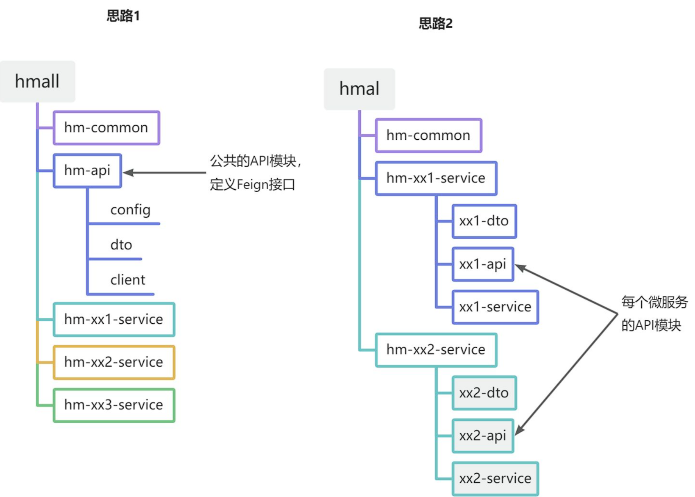


> 方案1抽取更加简单，工程结构也比较清晰，但缺点是整个项目耦合度偏高。
> 
> 方案2抽取相对麻烦，工程结构相对更复杂，但服务之间耦合度降低。


需要调用接口的服务引入相关API模块的依赖，并且在启动类的注解`@EnableFeignClients`中**指定扫描的Client即可**


### 日志配置

OpenFeign只会在FeignClient所在包的日志级别为**DEBUG**时，才会输出日志。而且其日志级别有4级：

* **NONE**：不记录任何日志信息，这是默认值。

* **BASIC**：仅记录请求的方法，URL以及响应状态码和执行时间

* **HEADERS**：在BASIC的基础上，额外记录了请求和响应的头信息

* **FULL**：记录所有请求和响应的明细，包括头信息、请求体、元数据。

Feign默认的日志级别就是NONE，所以默认我们看不到请求日志。


在api模块下新建一个配置类，定义Feign的日志级别：

```java
public class DefaultFeignConfig {
    @Bean
    public Logger.Level feignLoggerLevel() {
        return Logger.Level.FULL;
    }
}
```

接下来，要让日志级别生效，还需要配置这个类。有两种方式：

* **局部**生效：在某个`FeignClient`中配置，只对当前`FeignClient`生效

```java
@FeignClient(value = "item-service", configuration = DefaultFeignConfig.class)
```

* **全局**生效：在`@EnableFeignClients`中配置，针对所有`FeignClient`生效。

```java
@EnableFeignClients(defaultConfiguration = DefaultFeignConfig.class)
```


> 一般情况下无需开启日志，调试时才需开启


## 网关

由于每个微服务都有不同的地址或端口，入口不同，相信大家在与前端联调的时候发现了一些问题：

* 请求不同数据时要访问不同的入口，需要维护多个入口地址，麻烦

* 前端无法调用nacos，无法实时更新服务列表
  
  

单体架构时我们只需要完成一次用户登录、身份校验，就可以在所有业务中获取到用户信息。而微服务拆分后，每个微服务都独立部署，这就存在一些问题：

* 每个微服务都需要编写登录校验、用户信息获取的功能吗？

* 当微服务之间调用时，该如何传递用户信息？
  
  

### 认识网关

顾明思议，网关就是网络的关口。数据在网络间传输，从一个网络传输到另一网络时就需要经过网关来做数据的**路由和转发以及数据安全的校验**


现在，微服务网关就起到同样的作用。前端请求不能直接访问微服务，而是要请求网关：

* 网关可以做安全控制，也就是登录身份校验，校验通过才放行

* 通过认证后，网关再根据请求判断应该访问哪个微服务，将请求转发过去
  
  

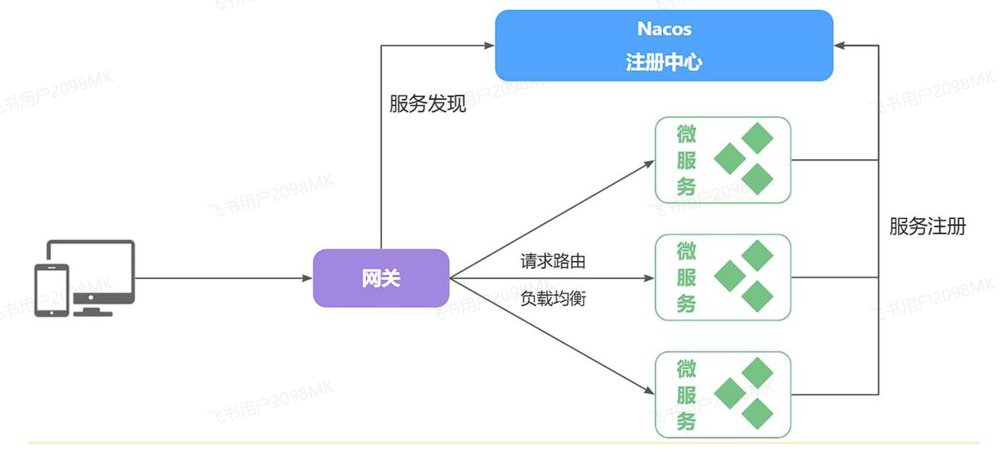


在SpringCloud当中，提供了两种网关实现方案：

* Netflix Zuul：早期实现，目前已经淘汰

* SpringCloudGateway：基于Spring的WebFlux技术，完全支持响应式编程，吞吐能力更强

[Spring Cloud Gateway](https://spring.io/projects/spring-cloud-gateway#learn)


### 快速入门

接下来，我们先看下如何利用网关实现请求路由。由于网关本身也是一个独立的微服务，因此也需要创建一个模块开发功能。大概步骤如下：

* 创建网关微服务

* 引入SpringCloudGateway、NacosDiscovery依赖

* 编写启动类

* 配置网关路由
  
  

相关依赖

```xml
        <!--网关-->
        <dependency>
            <groupId>org.springframework.cloud</groupId>
            <artifactId>spring-cloud-starter-gateway</artifactId>
        </dependency>
        <!--nacos discovery-->
        <dependency>
            <groupId>com.alibaba.cloud</groupId>
            <artifactId>spring-cloud-starter-alibaba-nacos-discovery</artifactId>
        </dependency>
        <!--负载均衡-->
        <dependency>
            <groupId>org.springframework.cloud</groupId>
            <artifactId>spring-cloud-starter-loadbalancer</artifactId>
        </dependency>
```


配置文件

```yml
server:
  port: 8080

spring:
  # spring服务配置
  application:
    name: gateway

  # SpringCloud配置
  cloud:
    # Nacos注册中心配置
    nacos:
      server-addr: localhost:8848

    # 网关配置
    gateway:
      routes:
        - id: item-service
          uri: lb://item-service
          predicates:
            - Path=/items/**,/search/**
        - id: user-service
          uri: lb://user-service
          predicates:
            - Path=/users/**,/addresses/**
```


### 路由属性

* `id`：路由的唯一标示

* `predicates`：路由断言，其实就是匹配条件

* `filters`：路由过滤条件

* `uri`：路由目标地址，`lb://`代表负载均衡，从注册中心获取目标微服务的实例列表，并且负载均衡选择一个访问。
  
  

这里我们重点关注`predicates`，也就是路由断言。`SpringCloudGateway`中支持的断言类型有很多：

| **名称**     | **说明**            | **示例**                                                                                                 |
| ---------- | ----------------- | ------------------------------------------------------------------------------------------------------ |
| After      | 是某个时间点后的请求        | - After=2037-01-20T17:42:47.789-07:00[America/Denver]                                                  |
| Before     | 是某个时间点之前的请求       | - Before=2031-04-13T15:14:47.433+08:00[Asia/Shanghai]                                                  |
| Between    | 是某两个时间点之前的请求      | - Between=2037-01-20T17:42:47.789-07:00[America/Denver], 2037-01-21T17:42:47.789-07:00[America/Denver] |
| Cookie     | 请求必须包含某些cookie    | - Cookie=chocolate, ch.p                                                                               |
| Header     | 请求必须包含某些header    | - Header=X-Request-Id, \d+                                                                             |
| Host       | 请求必须是访问某个host（域名） | - Host=**.somehost.org,**.anotherhost.org                                                              |
| Method     | 请求方式必须是指定方式       | - Method=GET,POST                                                                                      |
| Path       | 请求路径必须符合指定规则      | - Path=/red/{segment},/blue/**                                                                         |
| Query      | 请求参数必须包含指定参数      | - Query=name, Jack或者- Query=name                                                                       |
| RemoteAddr | 请求者的ip必须是指定范围     | - RemoteAddr=192.168.1.1/24                                                                            |
| weight     | 权重处理              |                                                                                                        |


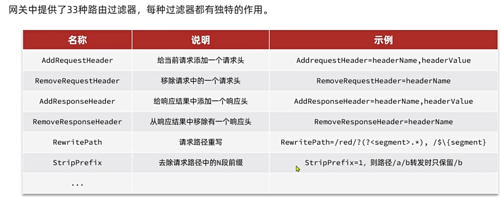


## 网关登录校验

### 思路分析

我们的登录是基于JWT来实现的，校验JWT的算法复杂，而且需要用到秘钥。如果每个微服务都去做登录校验，这就存在着两大问题：

* 每个微服务都需要知道JWT的秘钥，不安全

* 每个微服务重复编写登录校验代码、权限校验代码，麻烦
  
  

既然网关是所有微服务的入口，一切请求都需要先经过网关。我们完全可以把登录校验的工作放到网关去做，这样之前说的问题就解决了：

* 只需要在网关和用户服务保存秘钥

* 只需要在网关开发登录校验功能

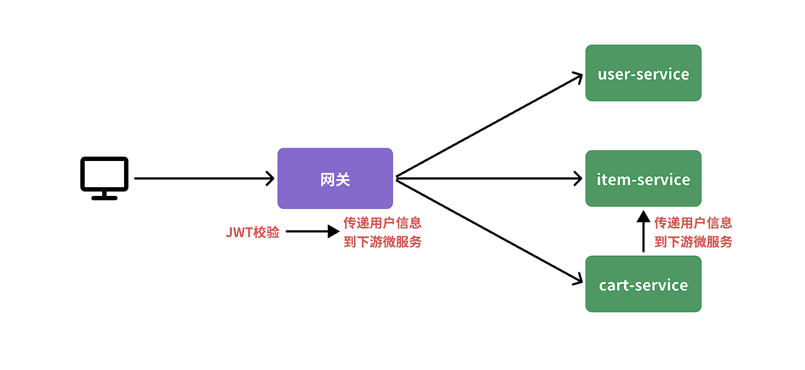


不过，这里存在几个问题：

* 网关路由是配置的，请求转发是Gateway内部代码，我们如何在转发之前做登录校验？

* 网关校验JWT之后，如何将用户信息传递给微服务？

* 微服务之间也会相互调用，这种调用不经过网关，又该如何传递用户信息？
  
  

### 网关过滤器

登录校验必须在请求转发到微服务之前做，否则就失去了意义。而网关的请求转发是`Gateway`内部代码实现的，要想在请求转发之前做登录校验，就必须了解`Gateway`内部工作的基本原理

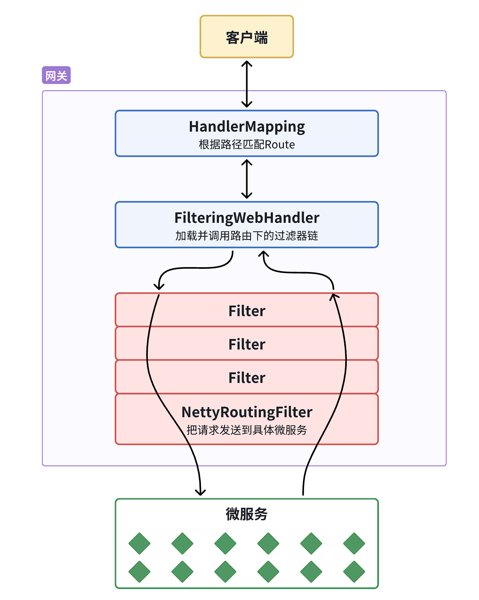

网关过滤器链中的过滤器有两种：

* **`GatewayFilter`**：路由过滤器，作用范围比较灵活，可以是任意指定的路由`Route`.

* **`GlobalFilter`**：全局过滤器，作用范围是所有路由，不可配置。
  
  

`GatewayFilter`和`GlobalFilter`这两种过滤器的方法签名完全一致：

```java
/**
 * 处理请求并将其传递给下一个过滤器
 * @param exchange 当前请求的上下文，其中包含request、response等各种数据
 * @param chain 过滤器链，基于它向下传递请求
 * @return 根据返回值标记当前请求是否被完成或拦截，chain.filter(exchange)就放行了。
 */
Mono<Void> filter(ServerWebExchange exchange, GatewayFilterChain chain);
```


### 自定义过滤器

1. GlobalFilter

```java
@Component
public class PrintAnyGlobalFilter implements GlobalFilter, Ordered {
    @Override
    public Mono<Void> filter(ServerWebExchange exchange, GatewayFilterChain chain) {
        // 编写过滤器逻辑
        System.out.println("未登录，无法访问");
        // 放行
        // return chain.filter(exchange);

        // 拦截
        ServerHttpResponse response = exchange.getResponse();
        response.setRawStatusCode(401);
        return response.setComplete();
    }

    @Override
    public int getOrder() {
        // 过滤器执行顺序，值越小，优先级越高
        return 0;
    }
}
```

> `Ordered`接口主要用于Spring的优先级定义


2. GatewayFilter

自定义`GatewayFilter`不是直接实现`GatewayFilter`，而是实现`AbstractGatewayFilterFactory`。最简单的方式是这样的：

```java
@Component
public class PrintAnyGatewayFilterFactory extends AbstractGatewayFilterFactory<Object> {
    @Override
    public GatewayFilter apply(Object config) {
        return new GatewayFilter() {
            @Override
            public Mono<Void> filter(ServerWebExchange exchange, GatewayFilterChain chain) {
                // 获取请求
                ServerHttpRequest request = exchange.getRequest();
                // 编写过滤器逻辑
                System.out.println("过滤器执行了");
                // 放行
                return chain.filter(exchange);
            }
        };
    }
}
```

在配置文件中使用

```yml
spring:
  cloud:
    gateway:
      default-filters:
            - PrintAny # 此处直接以自定义的GatewayFilterFactory类名称前缀类声明过滤器
```


另外，这种过滤器还可以支持动态配置参数，不过实现起来比较复杂，示例

```java

@Component
public class PrintAnyGatewayFilterFactory // 父类泛型是内部类的Config类型
                extends AbstractGatewayFilterFactory<PrintAnyGatewayFilterFactory.Config> {

    @Override
    public GatewayFilter apply(Config config) {
        // OrderedGatewayFilter是GatewayFilter的子类，包含两个参数：
        // - GatewayFilter：过滤器
        // - int order值：值越小，过滤器执行优先级越高
        return new OrderedGatewayFilter(new GatewayFilter() {
            @Override
            public Mono<Void> filter(ServerWebExchange exchange, GatewayFilterChain chain) {
                // 获取config值
                String a = config.getA();
                String b = config.getB();
                String c = config.getC();
                // 编写过滤器逻辑
                System.out.println("a = " + a);
                System.out.println("b = " + b);
                System.out.println("c = " + c);
                // 放行
                return chain.filter(exchange);
            }
        }, 100);
    }

    // 自定义配置属性，成员变量名称很重要，下面会用到
    @Data
    static class Config{
        private String a;
        private String b;
        private String c;
    }
    // 将变量名称依次返回，顺序很重要，将来读取参数时需要按顺序获取
    @Override
    public List<String> shortcutFieldOrder() {
        return List.of("a", "b", "c");
    }
        // 返回当前配置类的类型，也就是内部的Config
    @Override
    public Class<Config> getConfigClass() {
        return Config.class;
    }

}
```

在配置文件中使用

```yml
spring:
  cloud:
    gateway:
      default-filters:
            - PrintAny=1,2,3 # 注意，这里多个参数以","隔开，将来会按照shortcutFieldOrder()方法返回的参数顺序依次复制
```


### 登录校验过滤器

> JWT工具

> 登录校验需要用到JWT，而且JWT的加密需要秘钥和加密工具，需要在网关服务中准备好相关工具。


自定义`GlobalFilter`以实现登录校验

```java
@Component
@RequiredArgsConstructor
@EnableConfigurationProperties(AuthProperties.class)
public class AuthGlobalFilter implements GlobalFilter, Ordered {

    private final JwtTool jwtTool;

    private final AuthProperties authProperties;

    // 包含通配符的路径匹配器，由Spring提供
    private final AntPathMatcher antPathMatcher = new AntPathMatcher();

    @Override
    public Mono<Void> filter(ServerWebExchange exchange, GatewayFilterChain chain) {
        // 1.获取Request
        ServerHttpRequest request = exchange.getRequest();
        // 2.判断是否不需要拦截
        if(isExclude(request.getPath().toString())){
            // 无需拦截，直接放行
            return chain.filter(exchange);
        }
        // 3.获取请求头中的token
        String token = null;
        List<String> headers = request.getHeaders().get("authorization");
        if (!CollUtils.isEmpty(headers)) {
            token = headers.get(0);
        }
        // 4.校验并解析token
        Long userId = null;
        try {
            userId = jwtTool.parseToken(token);
        } catch (UnauthorizedException e) {
            // 如果无效，拦截
            ServerHttpResponse response = exchange.getResponse();
            response.setRawStatusCode(401);
            return response.setComplete();
        }

        // TODO 5.如果有效，传递用户信息
        System.out.println("userId = " + userId);
        // 6.放行
        return chain.filter(exchange);
    }

    private boolean isExclude(String antPath) {
        for (String pathPattern : authProperties.getExcludePaths()) {
            if(antPathMatcher.match(pathPattern, antPath)){
                return true;
            }
        }
        return false;
    }

    @Override
    public int getOrder() {
        return 0;
    }
}
```


### 用户信息向下游传递

首先，我们修改登录校验拦截器的处理逻辑，保存用户信息到请求头中：

```java
        // TODO: 传递用户信息
        ServerWebExchange build = exchange.mutate()
                .request(builder -> builder.header("user-info", userInfo))
                .build();

        // 放行
        return chain.filter(build);
```


在通用模块`common`中编写拦截器获取用户信息

```java
public class UserInfoInterceptor implements HandlerInterceptor {
    @Override
    public boolean preHandle(HttpServletRequest request, HttpServletResponse response, Object handler) throws Exception {
        // 1.获取请求头中的用户信息
        String userInfo = request.getHeader("user-info");
        // 2.判断是否为空
        if (StrUtil.isNotBlank(userInfo)) {
            // 不为空，保存到ThreadLocal
            UserContext.setUser(Long.valueOf(userInfo));
        }
        // 3.放行
        return true;
    }

    @Override
    public void afterCompletion(HttpServletRequest request, HttpServletResponse response, Object handler, Exception ex) throws Exception {
        // 移除用户
        UserContext.removeUser();
    }
}
```


由于拦截器需要配置才能生效，需编写配置类来配置登录拦截器

```java
@Configuration
@ConditionalOnClass(DispatcherServlet.class)
public class MvcConfig implements WebMvcConfigurer {
    @Override
    public void addInterceptors(InterceptorRegistry registry) {
        // 添加自定义拦截器
        registry.addInterceptor(new UserInfoInterceptor());
    }
}

```

> 许多服务模块都引用了该通用模块，`@ConditionalOnClass(DispatcherServlet.class`注解保证了只有使用了SpringMVC的微服务才会自动配置，例如网关模块并没有基于SpringMVC,不加该注解会启动失败


不过，需要注意的是，这个配置类默认是不会生效的，因为它所在的包与其它微服务的扫描包不一致，无法被扫描到，因此无法生效。

基于SpringBoot的**自动装配原理**，我们要将其添加到`resources`目录下的`META-INF/spring.factories`文件中：

```properties
org.springframework.boot.autoconfigure.EnableAutoConfiguration=\
  com.hmall.common.config.MvcConfig
```


### OpenFeign传递用户

前端发起的请求都会经过网关再到微服务，由于我们之前编写的过滤器和拦截器功能，微服务可以轻松获取登录用户信息。

但有些业务是比较复杂的，请求到达微服务后还需要调用其它多个微服务。比如下单业务，流程如下：

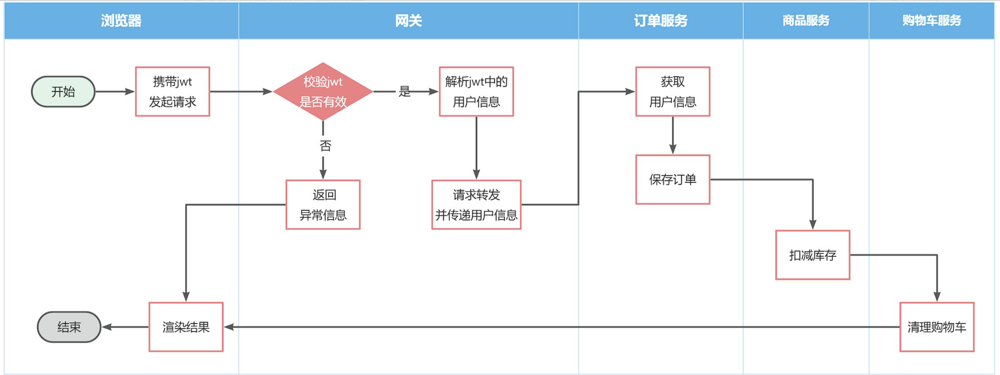

下单的过程中，需要调用商品服务扣减库存，调用购物车服务清理用户购物车。而清理购物车时必须知道当前登录的用户身份。但是，**订单服务调用购物车时并没有传递用户信息**，购物车服务无法知道当前用户是谁！


由于微服务获取用户信息是通过拦截器在请求头中读取，因此要想实现微服务之间的用户信息传递，就**必须在微服务发起调用时把用户信息存入请求头**


微服务之间调用是基于OpenFeign来实现的，并不是我们自己发送的请求。我们如何才能让每一个由OpenFeign发起的请求自动携带登录用户信息呢？

这里要借助Feign中提供的一个拦截器接口：`feign.RequestInterceptor`

```java
public interface RequestInterceptor {

  /**
   * Called for every request. 
   * Add data using methods on the supplied {@link RequestTemplate}.
   */
  void apply(RequestTemplate template);
}
```


在通用模块中配置拦截器

```java
public class DefaultFeignConfig {
    @Bean
    public Logger.Level feignLoggerLevel() {
        return Logger.Level.FULL;
    }

    @Bean
    public RequestInterceptor feignRequestInterceptor() {
        return new RequestInterceptor() {
            @Override
            public void apply(RequestTemplate requestTemplate) {
                Long userId = UserContext.getUser();
                if (userId != null) {
                    requestTemplate.header("user-info", userId.toString());
                }
            }
        };
    }
}
```

> 为使配置生效需要在服务启动类上添加`@EnableFeignClients(basePackages = "com.hmall.api.client",defaultConfiguration = DefaultFeignConfig.class)`


## 配置管理

现在依然还有几个问题需要解决：

* 网关路由在配置文件中写死了，如果变更必须重启微服务

* 某些业务配置在配置文件中写死了，每次修改都要重启服务

* 每个微服务都有很多重复的配置，维护成本高
  
  

这些问题都可以通过统一的**配置管理器服务**解决。而Nacos不仅仅具备注册中心功能，也具备配置管理的功能：

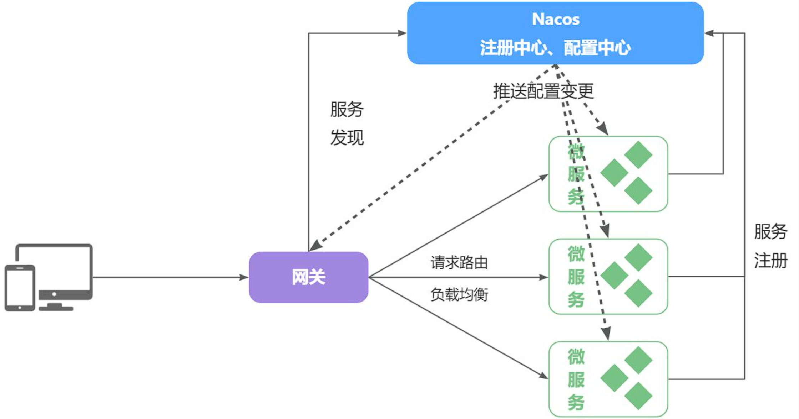


### 配置共享

1. 添加共享配置

首先是jdbc相关配置，在`配置管理`->`配置列表`中点击`+`新建一个配置

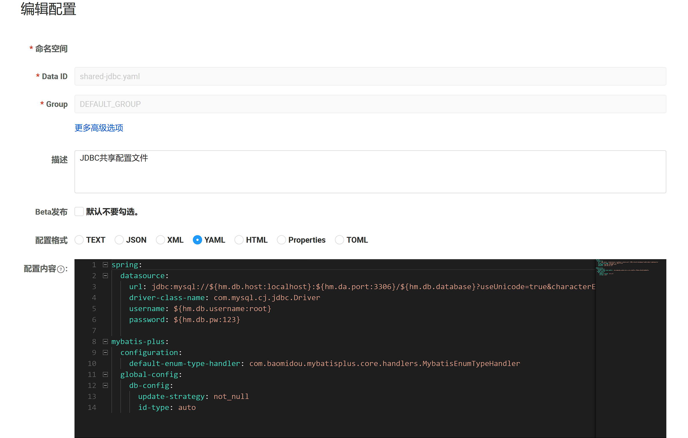


2. 拉取共享配置

接下来，我们要在微服务拉取共享配置。将拉取到的共享配置与本地的`application.yaml`配置合并，完成项目上下文的初始化。

不过，需要注意的是，读取Nacos配置是SpringCloud上下文（`ApplicationContext`）初始化时处理的，发生在项目的引导阶段。然后才会初始化SpringBoot上下文，去读取`application.yaml`。

也就是说引导阶段，`application.yaml`文件尚未读取，根本不知道nacos 地址，该如何去加载nacos中的配置文件呢？

SpringCloud在初始化上下文的时候会先读取一个名为`bootstrap.yaml`(或者`bootstrap.properties`)的文件，如果我们将nacos地址配置到`bootstrap.yaml`中，那么在项目引导阶段就可以读取nacos中的配置了。

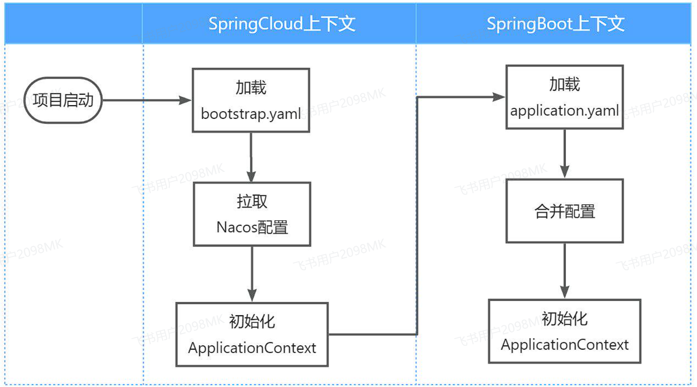


- 引入依赖

```xml
  <!--nacos配置管理-->
  <dependency>
      <groupId>com.alibaba.cloud</groupId>
      <artifactId>spring-cloud-starter-alibaba-nacos-config</artifactId>
  </dependency>
  <!--读取bootstrap文件-->
  <dependency>
      <groupId>org.springframework.cloud</groupId>
      <artifactId>spring-cloud-starter-bootstrap</artifactId>
  </dependency>
```

- 新建bootstrap.yaml

```yaml
spring:
  application:
    name: cart-service # 服务名称
  profiles:
    active: dev
  cloud:
    nacos:
      server-addr: 192.168.150.101 # nacos地址
      config:
        file-extension: yaml # 文件后缀名
        shared-configs: # 共享配置
          - dataId: shared-jdbc.yaml # 共享mybatis配置
          - dataId: shared-log.yaml # 共享日志配置
          - dataId: shared-swagger.yaml # 共享swagger配置
```

- 修改application.yaml

```yaml
server:
  port: 8082
feign:
  okhttp:
    enabled: true # 开启OKHttp连接池支持
hm:
  swagger:
    title: 购物车服务接口文档
    package: com.hmall.cart.controller
  db:
    database: hm-cart
```

- 重启生效
  
  

### 配置热更新

有很多的业务相关参数，将来可能会根据实际情况临时调整，可以将参数写入配置文件，但是修改了配置还是需要重新打包、重启服务才能生效。

这就要用到Nacos的配置热更新能力了，分为两步：

* 在Nacos中添加配置

* 在微服务读取配置
1. 首先，我们在nacos中添加一个配置文件

注意文件的dataId格式

```yaml
[服务名]-[spring.active.profile].[后缀名]
```

文件名称由三部分组成：

* **`服务名`**：我们是购物车服务，所以是`cart-service`

* **`spring.active.profile`**：就是spring boot中的`spring.active.profile`，可以省略，则所有profile共享该配置

* **`后缀名`**：例如yaml
2. 接着，我们在微服务中读取配置，实现配置热更新

编写属性类读取配置

```java
@Data
@Component
@ConfigurationProperties(prefix = "hm.cart")
public class CartProperties {
    private Integer maxAmount;
}
```

3. 在业务中注入属性类并使用即可
   
   

### 动态路由

网关的路由配置全部是在项目启动时由`org.springframework.cloud.gateway.route.CompositeRouteDefinitionLocator`在项目启动的时候加载，并且一经加载就会缓存到内存中的路由表内（一个Map），不会改变。也不会监听路由变更，所以，我们无法利用上节课学习的配置热更新来实现路由更新。


因此，我们必须监听Nacos的配置变更，然后手动把最新的路由更新到路由表中。这里有两个难点：

* 如何监听Nacos配置变更？

* 如何把路由信息更新到路由表？
  
  
1. 引入依赖

```xml
<!--统一配置管理-->
<dependency>
    <groupId>com.alibaba.cloud</groupId>
    <artifactId>spring-cloud-starter-alibaba-nacos-config</artifactId>
</dependency>
<!--加载bootstrap-->
<dependency>
    <groupId>org.springframework.cloud</groupId>
    <artifactId>spring-cloud-starter-bootstrap</artifactId>
</dependency>
```


2. 配置`bootstrap.yaml`

```yaml
spring:
  application:
    name: gateway

  profiles:
    active: dev

  cloud:
    nacos:
      server-addr: localhost:8848
      config:
        file-extension: yaml
        shared-configs:
          - data-id: shared-log.yaml
```


3. 监听配置变更

> 官方文档监听配置变更
> 
> [Java SDK](https://nacos.io/zh-cn/docs/sdk.html)

如果希望 Nacos 推送配置变更，可以使用 Nacos 动态监听配置接口来实现。

```java
public void addListener(String dataId, String group, Listener listener)
```

示例：

```java
@Slf4j
@Component
@RequiredArgsConstructor
public class DynamicRouterLoader {

    private final NacosConfigManager nacosConfigManager;

    private final RouteDefinitionWriter writer;

    private static final String dataId = "gateway-routes.json";

    private static final String group = "DEFAULT_GROUP";

    private final Set<String> roueIds = new HashSet<>();

    @PostConstruct
    public void initRouterConfigListener() throws NacosException {
        String configInfo = nacosConfigManager.getConfigService()
                .getConfigAndSignListener(dataId, group, 5000, new Listener() {
                    @Override
                    public Executor getExecutor() {
                        return null;
                    }

                    @Override
                    public void receiveConfigInfo(String s) {
                        // TODO: 监听配置变更，重新加载路由配置
                        updateConfigInfo(s);
                    }
                });
        // 初始加载路由配置
        updateConfigInfo(configInfo);
    }
}
```

这里核心的步骤有2步：

* 创建ConfigService，目的是连接到Nacos(SpringBoot已自动装配)

* 添加配置监听器，编写配置变更的通知处理逻辑

> 注：项目第一次启动时不仅仅需要添加监听器，也需要手动读取配置


4. 更新路由

更新路由要用到`org.springframework.cloud.gateway.route.RouteDefinitionWriter`这个接口：

```java
public interface RouteDefinitionWriter {
        /**
     * 更新路由到路由表，如果路由id重复，则会覆盖旧的路由
     */
        Mono<Void> save(Mono<RouteDefinition> route);
        /**
     * 根据路由id删除某个路由
     */
        Mono<Void> delete(Mono<String> routeId);

}
```

示例：

```java
    public void updateConfigInfo(String configInfo){
        // TODO: 更新路由配置

        log.debug("监听到路由配置变更，重新加载路由配置:{}",configInfo);

        // 解析配置信息，封装成RouteDefinition对象
        List<RouteDefinition> routeDefinitions = JSONUtil.toList(configInfo, RouteDefinition.class);

        // 清空旧的路由信息
        for (String routeId : roueIds){
            writer.delete(Mono.just(routeId)).subscribe();
        }

        // 清空路由ID集合
        roueIds.clear();

        // 更新路由表
        for (RouteDefinition routeDefinition : routeDefinitions) {
            writer.save(Mono.just(routeDefinition)).subscribe();
            // 记录路由ID
            roueIds.add(routeDefinition.getId());
        }
    }
```


nacos路由配置文件如下示例：

```json
[
    {
        "id": "item",
        "predicates": [{
            "name": "Path",
            "args":{"_genkey_0":"/items/**", "_genkey_1":"/search/**"}
        }],
        "filters": [],
        "uri": "lb://item-service"
    },
    {
        "id": "cart",
        "predicates": [{
            "name": "Path",
            "args": {"_genkey_0":"/carts/**"}
        }],
        "filters": [],
        "uri": "lb://cart-service"
    }
]
```


---

# 服务保护

## 存在的问题

在微服务远程调用的过程中，还存在几个问题需要解决。

- **业务健壮性**
  
  > 某服务故障，调用该服务的服务也应该得到数据

- **级联失败**(雪崩问题)
  
  > 如服务业务并发较高，占用过多Tomcat连接。可能会导致服务的所有接口响应时间增加，延迟变高，甚至是长时间阻塞直至查询失败。

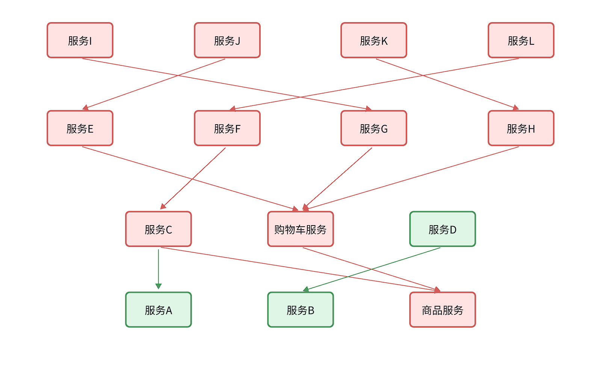


## 雪崩问题解决方案

### 请求限流

服务故障最重要原因，就是并发太高！解决了这个问题，就能避免大部分故障。当然，接口的并发不是一直很高，而是突发的。因此请求限流，就是**限制或控制**接口访问的并发流量，避免服务因流量激增而出现故障。


请求限流往往会有一个限流器，数量高低起伏的并发请求曲线，经过限流器就变的非常平稳。这就像是水电站的大坝，起到蓄水的作用，可以通过开关控制水流出的大小，让下游水流始终维持在一个平稳的量。

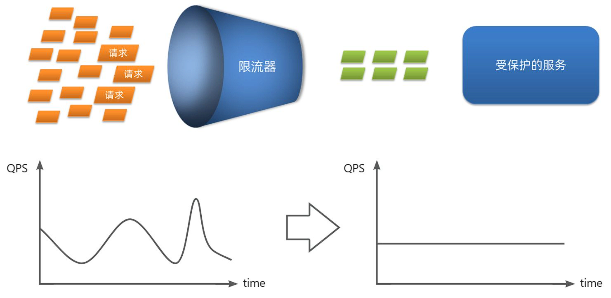


### 线程隔离

当一个业务接口响应时间长，而且并发高时，就可能耗尽服务器的线程资源，导致服务内的其它接口受到影响。所以我们必须把这种影响降低，或者缩减影响的范围。线程隔离正是解决这个问题的好办法。

线程隔离的思想来自轮船的舱壁模式：


轮船的船舱会被隔板分割为N个相互隔离的密闭舱，假如轮船触礁进水，只有损坏的部分密闭舱会进水，而其他舱由于相互隔离，并不会进水。这样就把进水控制在部分船体，避免了整个船舱进水而沉没。


为了避免某个接口故障或压力过大导致整个服务不可用，我们可以限定每个接口可以使用的资源范围，也就是将其“隔离”起来。

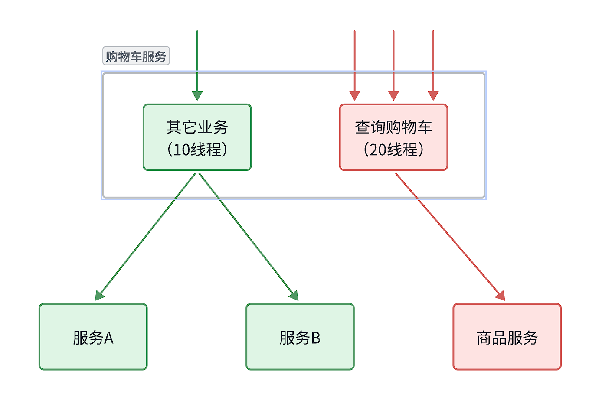

> 如图所示，我们给查询购物车业务限定可用线程数量上限为20，这样即便查询购物车的请求因为查询商品服务而出现故障，也不会导致服务器的线程资源被耗尽，不会影响到其它接口。


### 服务熔断

线程隔离虽然避免了雪崩问题，但故障服务（商品服务）依然会拖慢购物车服务（服务调用方）的接口响应速度。而且商品查询的故障依然会导致查询购物车功能出现故障，购物车业务也变的不可用了。


所以，我们要做两件事情：

* **编写服务降级逻辑**：就是服务调用失败后的处理逻辑，根据业务场景，可以抛出异常，也可以返回友好提示或默认数据。

* **异常统计和熔断**：统计服务提供方的异常比例，当比例过高表明该接口会影响到其它服务，应该拒绝调用该接口，而是直接走降级逻辑。

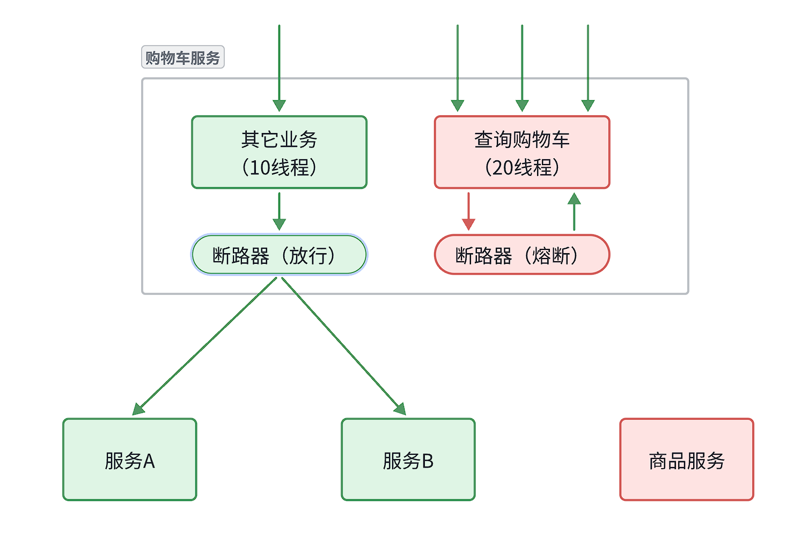


## Sentinel

> 微服务保护的技术有很多，但在目前国内使用较多的还是Sentinel
> 
> Sentinel是阿里巴巴开源的一款服务保护框架，目前已经加入SpringCloudAlibaba中。官方网站：
> 
> https://sentinelguard.io/zh-cn/

### 介绍&安装

Sentinel 的使用可以分为两个部分:

* **核心库**（Jar包）：不依赖任何框架/库，能够运行于 Java 8 及以上的版本的运行时环境，同时对 Dubbo / Spring Cloud 等框架也有较好的支持。在项目中引入依赖即可实现服务限流、隔离、熔断等功能。

* **控制台**（Dashboard）：Dashboard 主要负责管理推送规则、监控、管理机器信息等。


控制台jar包下载地址：

https://github.com/alibaba/Sentinel/releases

运行

```bash
java -Dserver.port=8090 -Dcsp.sentinel.dashboard.server=localhost:8090 -Dproject.name=sentinel-dashboard -jar sentinel-dashboard.jar
```

访问[http://localhost:8090](http://localhost:8080)页面，就可以看到sentinel的控制台了：

> 需要输入账号和密码，默认都是：sentinel


docker安装

```bash
docker run -d \
 --name sentinel \
 -p 8858:8858 \
 --network work \
 -d bladex/sentinel-dashboard
```


### 微服务整合

服务中添加如下依赖

```xml
<!--sentinel-->
<dependency>
    <groupId>com.alibaba.cloud</groupId> 
    <artifactId>spring-cloud-starter-alibaba-sentinel</artifactId>
</dependency>
```

配置控制台连接

```yaml
spring:
  cloud: 
    sentinel:
      transport:
        dashboard: localhost:8090
```


重启服务，然后访问接口，sentinel的客户端就会将服务访问的信息提交到`sentinel-dashboard`控制台。并展示出统计信息

点击簇点链路菜单，可以看到接口请求信息（所谓簇点链路，就是单机调用链路，是一次请求进入服务后经过的每一个被`Sentinel`监控的资源）

> 需要注意的是，我们的SpringMVC接口是按照Restful风格设计，可能导致多个簇点名称相同，可以做如下配置解决

```yaml
spring:
  cloud:
    sentinel:
      transport:
        dashboard: localhost:8090
      http-method-specify: true # 开启请求方式前缀
```


### 请求限流

在簇点链路后面点击流控按钮，即可对其做限流配置

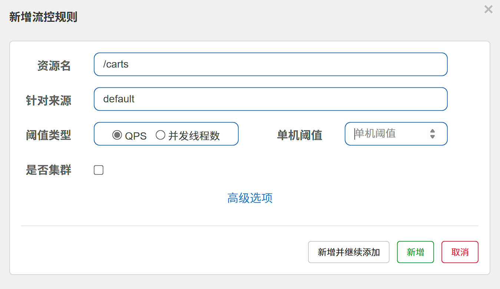


### 线程隔离

限流可以降低服务器压力，尽量减少因并发流量引起的服务故障的概率，但并不能完全避免服务故障。一旦某个服务出现故障，我们必须隔离对这个服务的调用，避免发生雪崩。


配置方式同请求限流，只需将“阈值类型”修改为“并发线程数”


### Fallback

触发限流或熔断后的请求不一定要直接报错，也可以返回一些默认数据或者友好提示，用户体验会更好。

给FeignClient编写失败后的降级逻辑有两种方式：

- 方式一：FallbackClass，无法对远程调用的异常做处理
- 方式二：FallbackFactory，可以对远程调用的异常做处理，我们一般选择这种方式。


**步骤一**：定义降级处理类，实现`FallbackFactory`：

```java
@Slf4j
public class ItemClientFallback implements FallbackFactory<ItemClient> {
    @Override
    public ItemClient create(Throwable cause) {
        return new ItemClient() {
            @Override
            public List<ItemDTO> queryItemByIds(Collection<Long> ids) {
                log.error("远程调用ItemClient#queryItemByIds方法出现异常，参数：{}", ids, cause);
                // 查询购物车允许失败，查询失败，返回空集合
                return CollUtils.emptyList();
            }

            @Override
            public void deductStock(List<OrderDetailDTO> items) {
                // 库存扣减业务需要触发事务回滚，查询失败，抛出异常
                throw new BizIllegalException(cause);
            }
        };
    }
}
```

**步骤二**：将降级处理类注册为一个`Bean`：

```java
@Bean
public ItemClientFallback itemClientFallback(){
    return new ItemClientFallback();
}
```

**步骤三**：在`ItemClient`接口中使用`ItemClientFallbackFactory`：

```java
@FeignClient(value = "item-service",
        fallbackFactory = ItemClientFallback.class)
```


### 服务熔断

对于不太健康的接口，我们应该停止调用，直接走降级逻辑，避免影响到当前服务。也就是将商品查询接口**熔断**。当商品服务接口恢复正常后，再允许调用。这其实就是**断路器**的工作模式了。

Sentinel中的断路器不仅可以统计某个接口的**慢请求比例**，还可以统计**异常请求比例**。当这些比例超出阈值时，就会**熔断**该接口，即拦截访问该接口的一切请求，降级处理；当该接口恢复正常时，再放行对于该接口的请求。


断路器的工作状态切换有一个状态机来控制：

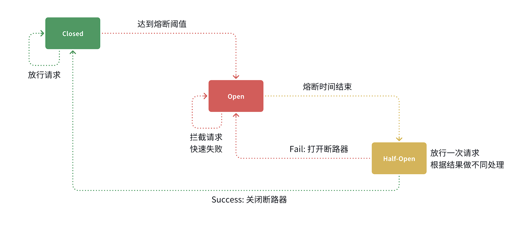

状态机包括三个状态：

- **closed**：关闭状态，断路器放行所有请求，并开始统计异常比例、慢请求比例。超过阈值则切换到open状态
- **open**：打开状态，服务调用被**熔断**，访问被熔断服务的请求会被拒绝，快速失败，直接走降级逻辑。Open状态持续一段时间后会进入half-open状态
- **half-open**：半开状态，放行一次请求，根据执行结果来判断接下来的操作。 
  - 请求成功：则切换到closed状态
  - 请求失败：则切换到open状态


我们可以在控制台通过点击簇点后的**`熔断`**按钮来配置熔断策略：

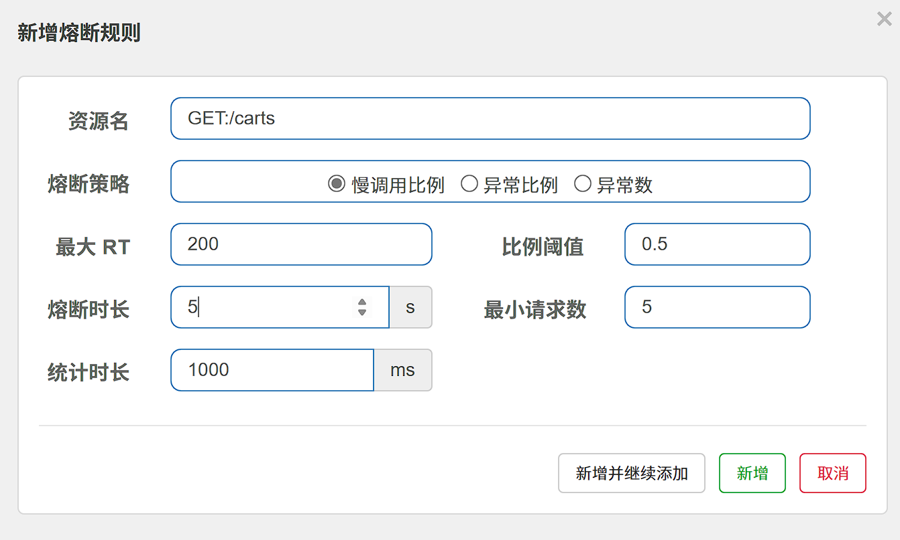

> 这种是按照慢调用比例来做熔断，上述配置的含义是：
>
> - RT超过200毫秒的请求调用就是慢调用
> - 统计最近1000ms内的最少5次请求，如果慢调用比例超过0.5，则触发熔断
> - 熔断持续时长5s


## 分布式事务

整个业务中，各个本地事务是有关联的。因此每个微服务的本地事务，也可以称为**分支事务**。多个有关联的分支事务一起就组成了**全局事务**。我们必须保证整个全局事务同时成功或失败。


我们知道每一个分支事务就是传统的**单体事务**，都可以满足ACID特性，但全局事务跨越多个服务、多个数据库，是否还能满足呢？

事务并未遵循ACID的原则，归其原因就是参与事务的多个子业务在不同的微服务，跨越了不同的数据库。虽然每个单独的业务都能在本地遵循ACID，但是它们互相之间没有感知，无法保证最终结果的统一


### Seata

> [Seata 是什么？ | Apache Seata](https://seata.apache.org/zh-cn/docs/overview/what-is-seata/)

解决分布式事务的方案有很多，但实现起来都比较复杂，因此我们一般会使用开源的框架来解决分布式事务问题。在众多的开源分布式事务框架中，功能最完善、使用最多的就是阿里巴巴在2019年开源的Seata了。


解决分布式事务的思想非常简单：

就是找一个统一的**事务协调者**，与多个分支事务通信，检测每个分支事务的执行状态，保证全局事务下的每一个分支事务同时成功或失败即可。大多数的分布式事务框架都是基于这个理论来实现的。


Seata也不例外，在Seata的事务管理中有三个重要的角色：

-  **TC** (**Transaction Coordinator) - 事务协调者：**维护全局和分支事务的状态，协调全局事务提交或回滚。 
-  **TM (Transaction Manager) -** **事务管理器：**定义全局事务的范围、开始全局事务、提交或回滚全局事务。 
-  **RM (Resource Manager) -** **资源管理器：**管理分支事务，与TC交谈 以注册分支事务和报告分支事务的状态，并驱动分支事务提交或回滚。 

Seata的工作架构如图所示：

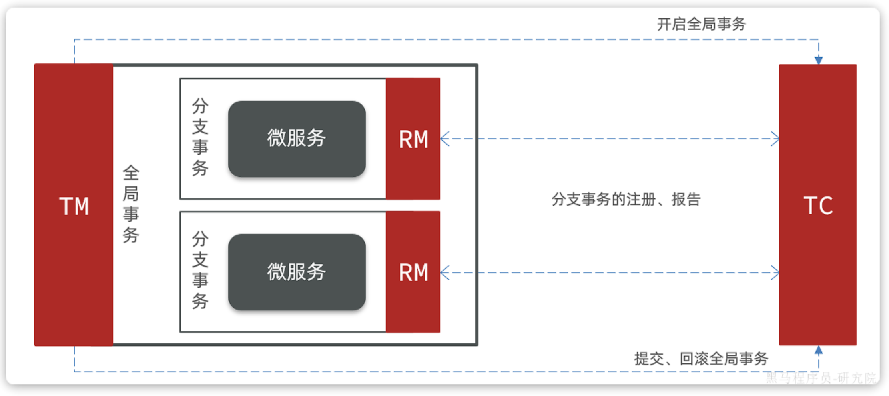


### 部署TC服务

Seata支持多种存储模式，但考虑到持久化的需要，我们一般选择基于数据库存储。

准备一个seata目录，其中包含了seata运行时所需要的配置文件。


docker部署：

```bash
docker run --name seata \
-p 8099:8099 \
-p 7099:7099 \
-e SEATA_IP=<服务IP> \
-v ./seata:/seata-server/resources \
--privileged=true \
--network <网络名> \
-d \
seataio/seata-server:1.5.2
```

> -e SETA_IP 指定的IP地址为服务器IP，该IP会被推送到nacos(注册中心)，如果不指定（或指定为localhost）则会推送docker为其分配的IP，外部设备无法通过该IP访问seata


### 微服务集成Seata

引入依赖

```xml
  <!--seata-->
  <dependency>
      <groupId>com.alibaba.cloud</groupId>
      <artifactId>spring-cloud-starter-alibaba-seata</artifactId>
  </dependency>
```


在服务中配置seata信息

```yaml
seata:
  registry: # TC服务注册中心的配置，微服务根据这些信息去注册中心获取tc服务地址
    type: nacos # 注册中心类型 nacos
    nacos:
      server-addr: localhost:8848 # nacos地址
      namespace: "" # namespace，默认为空
      group: DEFAULT_GROUP # 分组，默认是DEFAULT_GROUP
      application: seata-server # seata服务名称
      username: nacos
      password: nacos
  tx-service-group: work # 事务组名称
  service:
    vgroup-mapping: # 事务组与tc集群的映射关系
      work: "default"
```


### XA模式

`XA` 规范 是` X/Open` 组织定义的分布式事务处理（DTP，Distributed Transaction Processing）标准，XA 规范 描述了全局的`TM`与局部的`RM`之间的接口，几乎所有主流的数据库都对 XA 规范 提供了支持。


Seata对原始的XA模式做了简单的封装和改造，以适应自己的事务模型，基本架构如图：

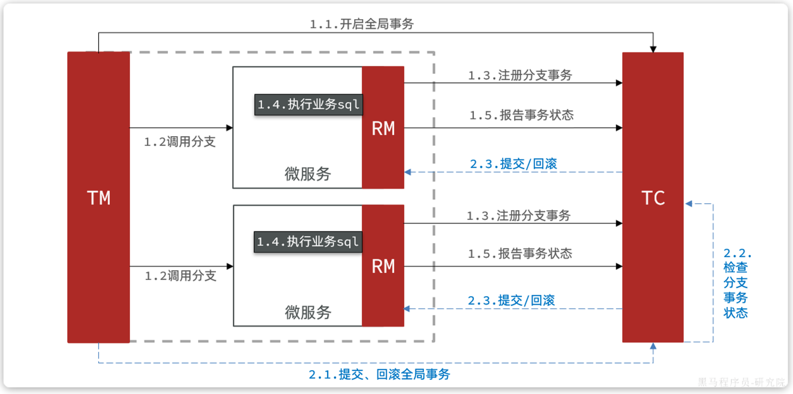


`RM`一阶段的工作：

1. 注册分支事务到`TC`
2. 执行分支业务sql但不提交
3. 报告执行状态到`TC`

`TC`二阶段的工作：

1.  `TC`检测各分支事务执行状态
   1. 如果都成功，通知所有RM提交事务
   2. 如果有失败，通知所有RM回滚事务 

`RM`二阶段的工作：

- 接收`TC`指令，提交或回滚事务


#### 优缺点

`XA`模式的优点是什么？

- 事务的强一致性，满足ACID原则
- 常用数据库都支持，实现简单，并且没有代码侵入

`XA`模式的缺点是什么？

- 因为一阶段需要锁定数据库资源，等待二阶段结束才释放，性能较差
- 依赖关系型数据库实现事务


#### 实现步骤

添加配置

```yaml
seata:
  data-source-proxy-mode: XA
```

其次，我们要利用`@GlobalTransactional`标记分布式事务的入口方法：


### AT模式

`AT`模式同样是分阶段提交的事务模型，不过弥补了`XA`模型中资源锁定周期过长的缺陷。

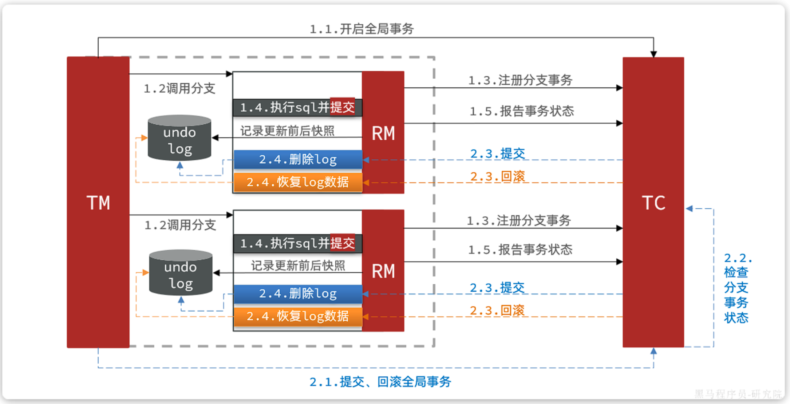

阶段一`RM`的工作：

- 注册分支事务
- 记录undo-log（数据快照）
- 执行业务sql并提交
- 报告事务状态

阶段二提交时`RM`的工作：

- 删除undo-log即可

阶段二回滚时`RM`的工作：

- 根据undo-log恢复数据到更新前


#### AT模式与XA模式的区别

- `XA`模式一阶段不提交事务，锁定资源；`AT`模式一阶段直接提交，不锁定资源。
- `XA`模式依赖数据库机制实现回滚；`AT`模式利用数据快照实现数据回滚。
- `XA`模式强一致；`AT`模式最终一致

可见，AT模式使用起来更加简单，无业务侵入，性能更好。因此企业90%的分布式事务都可以用AT模式来解决。


#### 实现步骤

创建数据快照表

```sql
CREATE TABLE IF NOT EXISTS `undo_log`
(
    `branch_id`     BIGINT       NOT NULL COMMENT 'branch transaction id',
    `xid`           VARCHAR(128) NOT NULL COMMENT 'global transaction id',
    `context`       VARCHAR(128) NOT NULL COMMENT 'undo_log context,such as serialization',
    `rollback_info` LONGBLOB     NOT NULL COMMENT 'rollback info',
    `log_status`    INT(11)      NOT NULL COMMENT '0:normal status,1:defense status',
    `log_created`   DATETIME(6)  NOT NULL COMMENT 'create datetime',
    `log_modified`  DATETIME(6)  NOT NULL COMMENT 'modify datetime',
    UNIQUE KEY `ux_undo_log` (`xid`, `branch_id`)
) ENGINE = InnoDB
  AUTO_INCREMENT = 1
  DEFAULT CHARSET = utf8mb4 COMMENT ='AT transaction mode undo table';
```


配置文件修改为AT模式（不做配置默认为AT模式）

```yaml
seata:
  data-source-proxy-mode: AT
```


# MQ（消息队列）

微服务一旦拆分，必然涉及到服务之间的相互调用，目前我们服务之间调用采用的都是基于OpenFeign的调用。这种调用中，调用者发起请求后需要**等待**服务提供者执行业务返回结果后，才能继续执行后面的业务。也就是说调用者在调用过程中处于阻塞状态，因此我们称这种调用方式为**同步调用**，也可以叫**同步通讯**。但在很多场景下，我们可能需要采用**异步通讯**的方式

- 同步通讯：就如同打视频电话，双方的交互都是实时的。因此同一时刻你只能跟一个人打视频电话。
- 异步通讯：就如同发微信聊天，双方的交互不是实时的，你不需要立刻给对方回应。因此你可以多线操作，同时跟多人聊天。

如果业务需要实时得到服务提供方的响应，则应该选择同步通讯（同步调用）。而如果我们追求更高的效率，并且不需要实时响应，则应该选择异步通讯（异步调用）。


## 初识MQ

### 同步调用

存在的问题：

1. **拓展性差**：每次有新的需求，现有支付逻辑都要跟着变化，代码经常变动，不符合开闭原则
2. **性能下降**：调用者需要等待服务提供者执行完返回结果后，才能继续向下执行，调用者处于阻塞等待状态
3. **级联失败**：当某个服务出现故障时，整个事务都会回滚


### 异步调用

异步调用方式其实就是基于消息通知的方式，一般包含三个角色：

- 消息发送者：投递消息的人，就是原来的调用方
- 消息Broker：管理、暂存、转发消息，可以把它理解成微信服务器
- 消息接收者：接收和处理消息的人，就是原来的服务提供方

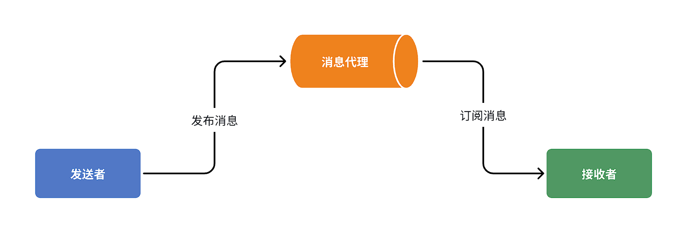

在异步调用中，发送者不再直接同步调用接收者的业务接口，而是发送一条消息投递给消息Broker。然后接收者根据自己的需求从消息Broker那里订阅消息。每当发送方发送消息后，接受者都能获取消息并处理。

这样，发送消息的人和接收消息的人就完全解耦了。

> 假如产品经理提出了新的需求。代码完全不用变更，而仅仅是让新的服务也订阅消息即可


异步调用的优势包括：

- 耦合度更低
- 性能更好
- 业务拓展性强
- 故障隔离，避免级联失败


当然，异步通信也并非完美无缺，它存在下列缺点：

- 完全依赖于Broker的可靠性、安全性和性能
- 架构复杂，后期维护和调试麻烦


### MQ技术选型

MQ（MessageQueue），消息队列

几种常见MQ的对比：

|            |        RabbitMQ         |            ActiveMQ            |  RocketMQ  |   Kafka    |
| :--------- | :---------------------: | :----------------------------: | :--------: | :--------: |
| 公司/社区  |         Rabbit          |             Apache             |    阿里    |   Apache   |
| 开发语言   |         Erlang          |              Java              |    Java    | Scala&Java |
| 协议支持   | AMQP，XMPP，SMTP，STOMP | OpenWire,STOMP，REST,XMPP,AMQP | 自定义协议 | 自定义协议 |
| 可用性     |           高            |              一般              |     高     |     高     |
| 单机吞吐量 |          一般           |               差               |     高     |   非常高   |
| 消息延迟   |         微秒级          |             毫秒级             |   毫秒级   |  毫秒以内  |
| 消息可靠性 |           高            |              一般              |     高     |    一般    |

追求可用性：Kafka、 RocketMQ 、RabbitMQ

追求可靠性：RabbitMQ、RocketMQ

追求吞吐能力：RocketMQ、Kafka

追求消息低延迟：RabbitMQ、Kafka


## RabbitMQ

#### 安装

使用docker安装RabbitMQ

```bash
docker run \
 -e RABBITMQ_DEFAULT_USER=admin \
 -e RABBITMQ_DEFAULT_PASS=admin \
 -v mq-plugins:/plugins \
 --name mq \
 --hostname mq \
 -p 15672:15672 \
 -p 5672:5672 \
 --network work\
 -d \
 rabbitmq:3.8-management
```

- 15672：RabbitMQ提供的管理控制台的端口
- 5672：RabbitMQ的消息发送处理接口

浏览器访问 http://localhost:15672 即可进入RabbitMQ控制台


RabbitMQ对应的架构如图：

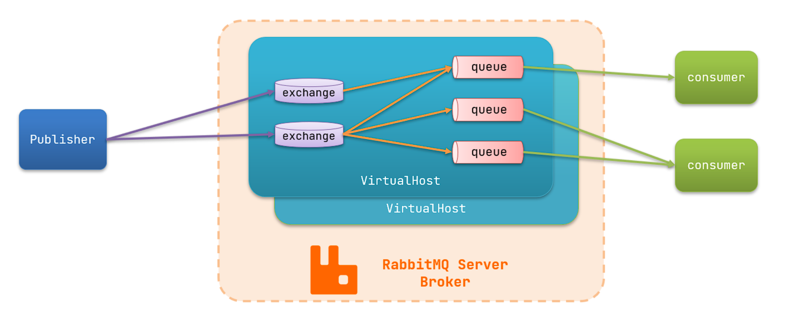

其中包含几个概念：

- **`publisher`**：生产者，也就是发送消息的一方
- **`consumer`**：消费者，也就是消费消息的一方
- **`queue`**：队列，存储消息。生产者投递的消息会暂存在消息队列中，等待消费者处理
- **`exchange`**：交换机，负责消息路由。生产者发送的消息由交换机决定投递到哪个队列。
- **`virtual host`**：虚拟主机，起到数据隔离的作用。每个虚拟主机相互独立，有各自的exchange、queue


#### 收发消息

- 交换机

打开Exchanges选项卡，可以看到已经存在很多交换机

点击任意交换机，即可进入交换机详情页面。用控制台中的publish message 发送一条消息

由于没有消费者存在，最终消息丢失了，这样说明**交换机没有存储消息的能力**。


- 队列

打开`Queues`选项卡，新建一个队列

此时，再次向交换机发送一条消息。会发现消息依然没有到达队列

发送到交换机的消息，只会路由到与其绑定的队列，因此仅仅创建队列是不够的，还需要将其与交换机绑定。


- 绑定关系

点击`Exchanges`选项卡，点击一个交换机，进入交换机详情页，然后点击`Bindings`菜单，在表单中填写要绑定的队列名称

绑定成功后发送消息，再次点击队列即可查看收到的消息


#### 数据隔离

点击`Admin`选项卡，首先会看到RabbitMQ控制台的用户管理界面，这里的用户都是RabbitMQ的管理或运维人员


对于小型企业而言，出于成本考虑，我们通常只会搭建一套MQ集群，公司内的多个不同项目同时使用。这个时候为了避免互相干扰， 我们会利用`virtual host`的隔离特性，将不同项目隔离。一般会做两件事情：

- 给每个项目创建独立的运维账号，将管理权限分离。
- 给每个项目创建不同的`virtual host`，将每个项目的数据隔离。


新增用户没有任何`virtual host`的访问权限，需要登录该账号创建新的`virtual host`


## SpringAMQP

由于`RabbitMQ`采用了AMQP协议，因此它具备跨语言的特性。任何语言只要遵循AMQP协议收发消息，都可以与`RabbitMQ`交互。并且`RabbitMQ`官方也提供了各种不同语言的客户端。

但是，RabbitMQ官方提供的Java客户端编码相对复杂，一般生产环境下我们更多会结合Spring来使用。而Spring的官方刚好基于RabbitMQ提供了这样一套消息收发的模板工具：SpringAMQP。并且还基于SpringBoot对其实现了自动装配，使用起来非常方便


SpringAmqp的官方地址：

https://spring.io/projects/spring-amqp

SpringAMQP提供了三个功能：

- 自动声明队列、交换机及其绑定关系
- 基于注解的监听器模式，异步接收消息
- 封装了RabbitTemplate工具，用于发送消息


### 快速入门

引入AMQP依赖

```xml
		<!--AMQP依赖，包含RabbitMQ-->
        <dependency>
            <groupId>org.springframework.boot</groupId>
            <artifactId>spring-boot-starter-amqp</artifactId>
        </dependency>
```


配置MQ地址，在`application.yml`中添加配置：

```yml
spring:
  rabbitmq:
    host: localhost
    port: 5672
    username: ysh
    password: 123
    virtual-host: ysh
```


发送消息

```java
    @Autowired
    private RabbitTemplate rabbitTemplate;

    @Test
    public void testSimpleQueue(){

        String queueName = "test";

        String message = "Hello, RabbitMQ!";

        rabbitTemplate.convertAndSend(queueName, message);
    }
```


接收消息

```java
    @RabbitListener(queues = "test")
    public void listen(String message){
        log.info("监听到消息：{}",message);
    }
```


### Work Queues

Work queues，任务模型。简单来说就是**让多个消费者绑定到一个队列，共同消费队列中的消息**。

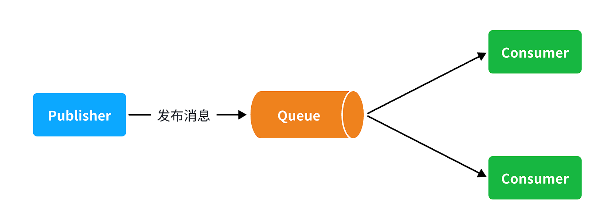

当消息处理比较耗时的时候，可能生产消息的速度会远远大于消息的消费速度。长此以往，消息就会堆积越来越多，无法及时处理。

此时就可以使用work 模型，**多个消费者共同处理消息处理，消息处理的速度就能大大提高**了。

> 部署多个实例或者监听同一队列即可实现


消息是**平均分配**给每个消费者，并没有考虑到消费者的处理能力。导致1个消费者空闲，另一个消费者忙的不可开交。没有充分利用每一个消费者的能力，这样显然是有问题的。


在spring中有一个简单的配置，可以解决这个问题。我们修改consumer服务的application.yml文件，添加配置：

```yml
spring:
  rabbitmq:
    listener:
      simple:
        prefetch: 1 # 每次只能获取一条消息，处理完成才能获取下一个消息
```

> 正所谓能者多劳，这样充分利用了每一个消费者的处理能力，可以有效避免消息积压问题。


Work模型的使用：

- 多个消费者绑定到一个队列，同一条消息只会被一个消费者处理
- 通过设置prefetch来控制消费者预取的消息数量


### Fanout交换机

一旦引入交换机，消息发送的模式会有很大变化：

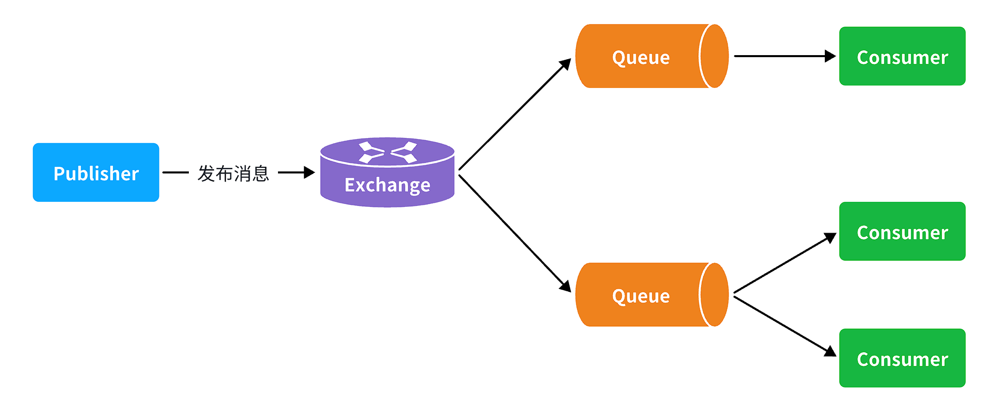

- **Exchange**：交换机，一方面，接收生产者发送的消息。另一方面，知道如何处理消息，例如递交给某个特别队列、递交给所有队列、或是将消息丢弃。到底如何操作，取决于Exchange的类型。

> **Exchange（**交换机**）只负责转发消息，不具备存储消息的能力**，因此如果没有任何队列与Exchange绑定，或者没有符合路由规则的队列，那么消息会丢失！


交换机的类型有四种：

- **Fanout**：广播，将消息交给所有绑定到交换机的队列。
- **Direct**：订阅，基于RoutingKey（路由key）发送给订阅了消息的队列
- **Topic**：通配符订阅，与Direct类似，只不过RoutingKey可以使用通配符
- **Headers**：头匹配，基于MQ的消息头匹配，用的较少。


**应用场景**

> 当多个消费者需要处理相同的消息时，就需要为每个消费者创建队列，然后将消息发送给交换机，通过交换机规则转发消息

使用`public void convertAndSend(String exchange, String routingKey, Object object)`即可向交换机发送消息


### Direct交换机

在Fanout模式中，一条消息，会被所有订阅的队列都消费。但是，在某些场景下，我们希望不同的消息被不同的队列消费。这时就要用到Direct类型的Exchange。

在Direct模型下：

- 队列与交换机的绑定，不能是任意绑定了，而是要指定一个`RoutingKey`（路由key）
- 消息的发送方在 向 Exchange发送消息时，也必须指定消息的 `RoutingKey`。
- Exchange不再把消息交给每一个绑定的队列，而是根据消息的`Routing Key`进行判断，只有队列的`Routingkey`与消息的 `Routing key`完全一致，才会接收到消息


### Topic交换机

`Topic`类型的`Exchange`与`Direct`相比，都是可以根据`RoutingKey`把消息路由到不同的队列。

只不过`Topic`类型`Exchange`可以让队列在绑定`BindingKey` 的时候使用**通配符**！


`BindingKey` 一般都是有一个或多个单词组成，多个单词之间以`.`分割，例如： `item.insert`


通配符规则：

- `#`：匹配一个或多个词
- `*`：匹配不多不少恰好1个词


举例：

- `item.#`：能够匹配`item.spu.insert` 或者 `item.spu`
- `item.*`：只能匹配`item.spu`


Direct交换机与Topic交换机的差异

- Topic交换机接收的消息RoutingKey必须是多个单词，以 **`.`** 分割
- Topic交换机与队列绑定时的bindingKey可以指定通配符
- `#`：代表0个或多个词
- `*`：代表1个词


### 声明队列和交换机

在之前我们都是基于RabbitMQ控制台来创建队列、交换机。但是在实际开发时，队列和交换机是程序员定义的，将来项目上线，又要交给运维去创建。那么程序员就需要把程序中运行的所有队列和交换机都写下来，交给运维。在这个过程中是很容易出现错误的。

因此推荐的做法是由程序启动时检查队列和交换机是否存在，如果不存在自动创建。


SpringAMQP提供了一个Queue类，用来创建队列

SpringAMQP还提供了一个Exchange接口，来表示所有不同类型的交换机

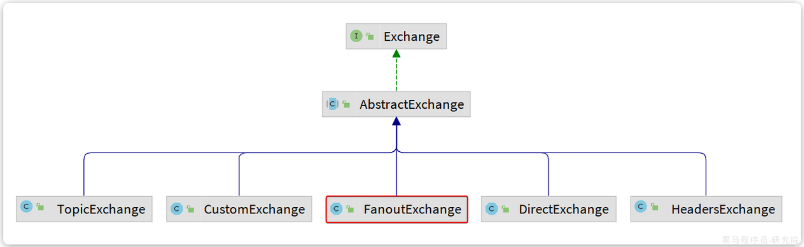


我们可以自己创建队列和交换机，不过SpringAMQP还提供了ExchangeBuilder来简化这个过程

而在绑定队列和交换机时，则需要使用BindingBuilder来创建Binding对象


基于JavaBean声明示例代码

```java
@Configuration
public class FanoutConfiguration {

    @Bean
    public FanoutExchange fanoutExchange() {
        // 创建一个 fanout 类型的交换机
        return new FanoutExchange("ysh.fanout");
    }

    @Bean
    public Queue fanoutQueue1() {
        // 创建一个队列
        return new Queue("fanout.queue1");
    }

    @Bean
    public Binding fanoutQueueBinding(Queue fanoutQueue1, FanoutExchange fanoutExchange) {
        // 将队列和交换机绑定起来
        return BindingBuilder.bind(fanoutQueue1).to(fanoutExchange);
    }

}
```


基于注解声明

```java
    @RabbitListener(bindings = @QueueBinding(
            value = @Queue(name = "direct.queue1", durable = "true"),
            exchange = @Exchange(name = "ysh.direct", type = ExchangeTypes.DIRECT),
            key = {"red", "blue"}
    ))
    public void listenWorkQueue3(String message){}  
```


### 消息转换器

Spring的消息发送代码接收的消息体是一个Object

```java
public void convertAndSend(String routingKey, Object object){}
```


而在数据传输时，它会把你发送的消息序列化为字节发送给MQ，接收消息的时候，还会把字节反序列化为Java对象。

只不过，默认情况下Spring采用的序列化方式是JDK序列化。JDK序列化存在下列问题：

- 数据体积过大
- 有安全漏洞
- 可读性差


可以使用JSON方式来做序列化和反序列化。

在`publisher`和`consumer`两个服务中都引入依赖：

```xml
        <!--Jackson依赖，用于序列化和反序列化-->
        <dependency>
            <groupId>com.fasterxml.jackson.dataformat</groupId>
            <artifactId>jackson-dataformat-xml</artifactId>
            <version>2.9.10</version>
        </dependency>
```

> 注意，如果项目中引入了`spring-boot-starter-web`依赖，则无需再次引入`Jackson`依赖。


配置消息转换器，在`publisher`和`consumer`两个服务的启动类中添加一个Bean即可：

```java
@Bean
public MessageConverter messageConverter(){
    // 1.定义消息转换器
    Jackson2JsonMessageConverter jackson2JsonMessageConverter = new Jackson2JsonMessageConverter();
    // 2.配置自动创建消息id，用于识别不同消息，也可以在业务中基于ID判断是否是重复消息
    jackson2JsonMessageConverter.setCreateMessageIds(true);
    return jackson2JsonMessageConverter;
}
```


## MQ高级

消息从发送者发送消息，到消费者处理消息，需要经过的流程是这样的

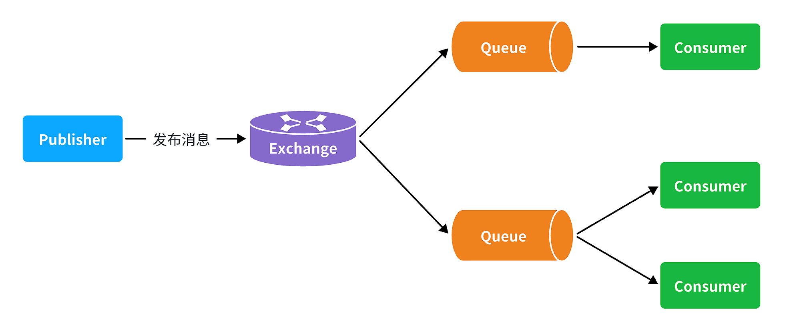

消息从生产者到消费者的每一步都可能导致消息丢失

我们要解决消息丢失问题，保证MQ的可靠性，就必须从3个方面入手：

- 确保生产者一定把消息发送到MQ
- 确保MQ不会将消息弄丢
- 确保消费者一定要处理消息


### 生产者可靠性

#### 生产者重试机制

第一种情况，就是生产者发送消息时，出现了网络故障，导致与MQ的连接中断。

为了解决这个问题，SpringAMQP提供的消息发送时的重试机制。即：当`RabbitTemplate`与MQ连接超时后，多次重试。

修改`publisher`模块的`application.yaml`文件，添加下面的内容：

```yml
spring:
  rabbitmq:
    connection-timeout: 1s # 设置MQ的连接超时时间
    template:
      retry:
        enabled: true # 开启超时重试机制
        initial-interval: 1000ms # 失败后的初始等待时间
        multiplier: 1 # 失败后下次的等待时长倍数，下次等待时长 = initial-interval * multiplier
        max-attempts: 3 # 最大重试次数
```

**注意**：当网络不稳定的时候，利用重试机制可以有效提高消息发送的成功率。不过SpringAMQP提供的重试机制是**阻塞式**的重试，也就是说多次重试等待的过程中，当前线程是被阻塞的。

如果对于业务性能有要求，建议禁用重试机制。如果一定要使用，请合理配置等待时长和重试次数，当然也可以考虑使用异步线程来执行发送消息的代码。


#### 生产者确认机制

一般情况下，只要生产者与MQ之间的网路连接顺畅，基本不会出现发送消息丢失的情况，因此大多数情况下我们无需考虑这种问题。

不过，在少数情况下，也会出现消息发送到MQ之后丢失的现象，比如：

- MQ内部处理消息的进程发生了异常
- 生产者发送消息到达MQ后未找到`Exchange`
- 生产者发送消息到达MQ的`Exchange`后，未找到合适的`Queue`，因此无法路由


针对上述情况，RabbitMQ提供了生产者消息确认机制，包括`Publisher Confirm`和`Publisher Return`两种。在开启确认机制的情况下，当生产者发送消息给MQ后，MQ会根据消息处理的情况返回不同的**回执**。

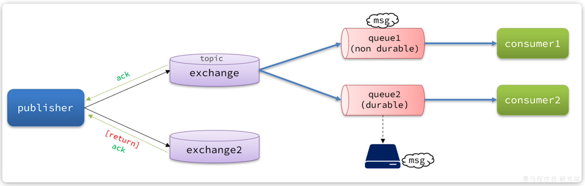

- 当消息投递到MQ，但是路由失败时，通过**Publisher Return**返回异常信息，同时返回ack的确认信息，代表投递成功
- 临时消息投递到了MQ，并且入队成功，返回ACK，告知投递成功
- 持久消息投递到了MQ，并且入队完成持久化，返回ACK ，告知投递成功
- 其它情况都会返回NACK，告知投递失败


开启生产者确认机制：

在publisher模块的`application.yaml`中添加配置：

```YAML
spring:
  rabbitmq:
    publisher-confirm-type: correlated # 开启publisher confirm机制，并设置confirm类型
    publisher-returns: true # 开启publisher return机制
```

这里`publisher-confirm-type`有三种模式可选：

- `none`：关闭confirm机制
- `simple`：同步阻塞等待MQ的回执
- `correlated`：MQ异步回调返回回执

一般我们推荐使用`correlated`，回调机制。


**定义ReturnCallback**

每个`RabbitTemplate`只能配置一个`ReturnCallback`，因此我们可以在配置类中统一设置

```java
@Slf4j
@AllArgsConstructor
@Configuration
public class MqConfig {
    private final RabbitTemplate rabbitTemplate;

    @PostConstruct
    public void init(){
        rabbitTemplate.setReturnsCallback(new RabbitTemplate.ReturnsCallback() {
            @Override
            public void returnedMessage(ReturnedMessage returned) {
                log.error("触发return callback,");
                log.debug("exchange: {}", returned.getExchange());
                log.debug("routingKey: {}", returned.getRoutingKey());
                log.debug("message: {}", returned.getMessage());
                log.debug("replyCode: {}", returned.getReplyCode());
                log.debug("replyText: {}", returned.getReplyText());
            }
        });
    }
}
```


**定义ConfirmCallback**

由于每个消息发送时的处理逻辑不一定相同，因此ConfirmCallback需要在每次发消息时定义。具体来说，是在调用RabbitTemplate中的convertAndSend方法时，多传递一个参数：

```java
    public void convertAndSend(String exchange, String routingKey, Object object, @Nullable CorrelationData correlationData){}
```

这里的CorrelationData中包含两个核心的东西：

- `id`：消息的唯一标示，MQ对不同的消息的回执以此做判断，避免混淆
- `SettableListenableFuture`：回执结果的Future对象


将来MQ的回执就会通过这个`Future`来返回，我们可以提前给`CorrelationData`中的`Future`添加回调函数来处理消息回执

```java
    // 1.创建CorrelationData
    CorrelationData cd = new CorrelationData();
    // 2.给Future添加ConfirmCallback
    cd.getFuture().addCallback(new ListenableFutureCallback<CorrelationData.Confirm>() {
        @Override
        public void onFailure(Throwable ex) {
            // 2.1.Future发生异常时的处理逻辑，基本不会触发
            log.error("send message fail", ex);
        }
        @Override
        public void onSuccess(CorrelationData.Confirm result) {
            // 2.2.Future接收到回执的处理逻辑，参数中的result就是回执内容
            if(result.isAck()){ // result.isAck()，boolean类型，true代表ack回执，false 代表 nack回执
                log.debug("发送消息成功，收到 ack!");
            }else{ // result.getReason()，String类型，返回nack时的异常描述
                log.error("发送消息失败，收到 nack, reason : {}", result.getReason());
            }
        }
    });
    // 3.发送消息
    rabbitTemplate.convertAndSend("hmall.direct", "q", "hello", cd);
```

> **注意**：
>
> 开启生产者确认比较消耗MQ性能，一般不建议开启。而且大家思考一下触发确认的几种情况：
>
> - 路由失败：一般是因为RoutingKey错误导致，往往是编程导致
> - 交换机名称错误：同样是编程错误导致
> - MQ内部故障：这种需要处理，但概率往往较低。因此只有对消息可靠性要求非常高的业务才需要开启，而且仅仅需要开启ConfirmCallback处理nack就可以了。


### MQ的可靠性

消息到达MQ以后，如果MQ不能及时保存，也会导致消息丢失，所以MQ的可靠性也非常重要。

> MQ宕机，MQ内存空间不足

#### 数据持久化

为了提升性能，默认情况下MQ的数据都是在内存存储的临时数据，重启后就会消失。为了保证数据的可靠性，必须配置数据持久化，包括：

- 交换机持久化
- 队列持久化
- 消息持久化

> 在控制台添加交换机、队列、消息时，可以配置`Durability`参数实现持久化

在代码中需要自定义消息来实现消息持久化

```java
        Message message = MessageBuilder
                .withBody("消息".getBytes(StandardCharsets.UTF_8))
                .setDeliveryMode(MessageDeliveryMode.PERSISTENT)
                .build();
```


**说明**：在开启持久化机制以后，如果同时还开启了生产者确认，那么MQ会在消息持久化以后才发送ACK回执，进一步确保消息的可靠性。

不过出于性能考虑，为了减少IO次数，发送到MQ的消息并不是逐条持久化到数据库的，而是每隔一段时间批量持久化。一般间隔在100毫秒左右，这就会导致ACK有一定的延迟，因此建议生产者确认全部采用异步方式。


#### LazyQueue

在默认情况下，RabbitMQ会将接收到的信息保存在内存中以降低消息收发的延迟。但在某些特殊情况下，这会导致消息积压，比如：

- 消费者宕机或出现网络故障
- 消息发送量激增，超过了消费者处理速度
- 消费者处理业务发生阻塞


一旦出现消息堆积问题，RabbitMQ的内存占用就会越来越高，直到触发内存预警上限。此时RabbitMQ会将内存消息刷到磁盘上，这个行为成为`PageOut`. `PageOut`会耗费一段时间，并且会阻塞队列进程。因此在这个过程中RabbitMQ不会再处理新的消息，生产者的所有请求都会被阻塞。


为了解决这个问题，从RabbitMQ的3.6.0版本开始，就增加了`Lazy Queue`的模式，也就是惰性队列。

惰性队列的特征如下：

- 接收到消息后直接存入磁盘而非内存
- 消费者要消费消息时才会从磁盘中读取并加载到内存（也就是懒加载）
- 支持数百万条的消息存储

> 在3.12版本之后，LazyQueue已经成为所有队列的默认格式。因此官方推荐升级MQ为3.12版本或者所有队列都设置为LazyQueue模式。


**控制台配置Lazy模式**

在添加队列的时候，添加`x-queue-mod=lazy`参数即可设置队列为Lazy模式

**代码配置Lazy模式**

```java
// 基于JavaBean
@Bean
public Queue lazyQueue(){
    return QueueBuilder
            .durable("lazy.queue")
            .lazy() // 开启Lazy模式
            .build();
}

// 基于注解
@RabbitListener(queuesToDeclare = @Queue(
        name = "lazy.queue",
        durable = "true",
        arguments = @Argument(name = "x-queue-mode", value = "lazy")
))
```


### 消费者可靠性

当RabbitMQ向消费者投递消息以后，需要知道消费者的处理状态如何。因为消息投递给消费者并不代表就一定被正确消费了，可能出现的故障有很多，比如：

- 消息投递的过程中出现了网络故障
- 消费者接收到消息后突然宕机
- 消费者接收到消息后，因处理不当导致异常
- ...

一旦发生上述情况，消息也会丢失。因此，RabbitMQ必须知道消费者的处理状态，一旦消息处理失败才能重新投递消息。

#### 消费者确认机制

为了确认消费者是否成功处理消息，RabbitMQ提供了消费者确认机制（**Consumer Acknowledgement**）。即：当消费者处理消息结束后，应该向RabbitMQ发送一个回执，告知RabbitMQ自己的消息处理状态。回执有三种可选值：

- ack：成功处理消息，RabbitMQ从队列中删除该消息
- nack：消息处理失败，RabbitMQ需要再次投递消息
- reject：消息处理失败并拒绝该消息，RabbitMQ从队列中删除该消息

> 一般reject方式用的较少，除非是消息格式有问题


由于消息回执的处理代码比较统一，因此SpringAMQP帮我们实现了消息确认。并允许我们通过配置文件设置ACK处理方式，有三种模式：

- **`none`**：不处理。即消息投递给消费者后立刻ack，消息会立刻从MQ删除。非常不安全，不建议使用
- **`manual`**：手动模式。需要自己在业务代码中调用api，发送`ack`或`reject`，存在业务入侵，但更灵活
- **`auto`**：(推荐)自动模式。SpringAMQP利用AOP对我们的消息处理逻辑做了环绕增强，当业务正常执行时则自动返回`ack`.  当业务出现异常时，根据异常判断返回不同结果：
  - 如果是**业务异常**，会自动返回`nack`；
  - 如果是**消息处理或校验异常**，自动返回`reject`;

```yml
spring:
  rabbitmq:
    listener:
      simple:
        acknowledge-mode: auto # 不做处理
```


#### 失败重试机制

当消费者出现异常后，消息会不断requeue（重入队）到队列，再重新发送给消费者。如果消费者再次执行依然出错，消息会再次requeue到队列，再次投递，直到消息处理成功为止。

极端情况就是消费者一直无法执行成功，那么消息requeue就会无限循环，导致mq的消息处理飙升，带来不必要的压力。

为了应对上述情况RabbitMQ又提供了消费者失败重试机制：在消费者出现异常时利用**本地重试**，而不是无限制的requeue到mq队列。

修改配置开启该机制:

```yml
spring:
  rabbitmq:
    listener:
      simple:
        retry:
          enabled: true # 开启消费者失败重试
          initial-interval: 1000ms # 初始的失败等待时长为1秒
          multiplier: 1 # 失败的等待时长倍数，下次等待时长 = multiplier * last-interval
          max-attempts: 3 # 最大重试次数
          stateless: true # true无状态；false有状态。如果业务中包含事务，这里改为false
```

结论：

- 开启本地重试时，消息处理过程中抛出异常，不会requeue到队列，而是在消费者本地重试
- 重试达到最大次数后，Spring会返回reject，消息会被丢弃


#### 失败消息处理策略

在之前的机制中，本地测试达到最大重试次数后，消息会被丢弃。这在某些对于消息可靠性要求较高的业务场景下，显然不太合适了。

因此Spring允许我们自定义重试次数耗尽后的消息处理策略，这个策略是由`MessageRecovery`接口来定义的，它有3个不同实现：

-  `RejectAndDontRequeueRecoverer`：重试耗尽后，直接`reject`，丢弃消息。默认就是这种方式 
-  `ImmediateRequeueMessageRecoverer`：重试耗尽后，返回`nack`，消息重新入队 
-  `RepublishMessageRecoverer`：重试耗尽后，将失败消息投递到**指定的交换机 **


比较合理的一种处理方案是`RepublishMessageRecoverer`，失败后将消息投递到一个指定的，专门存放异常消息的队列，后续由人工集中处理。


1. 首先在consumer服务中定义处理失败消息的交换机和队列

```java
@Bean
public DirectExchange errorMessageExchange(){
    return new DirectExchange("error.direct");
}
@Bean
public Queue errorQueue(){
    return new Queue("error.queue", true);
}
@Bean
public Binding errorBinding(Queue errorQueue, DirectExchange errorMessageExchange){
    return BindingBuilder.bind(errorQueue).to(errorMessageExchange).with("error");
}
```

2. 定义一个RepublishMessageRecoverer，关联队列和交换机

```java
@Bean
public MessageRecoverer republishMessageRecoverer(RabbitTemplate rabbitTemplate){
    return new RepublishMessageRecoverer(rabbitTemplate, "error.direct", "error");
}
```


#### 业务幂等性

**幂等**是一个数学概念，用函数表达式来描述是这样的：`f(x) = f(f(x))`，例如求绝对值函数。

在程序开发中，则是指同一个业务，执行一次或多次对业务状态的影响是一致的。例如：

- 根据id删除数据
- 查询数据
- 新增数据


但数据的更新往往不是幂等的，如果重复执行可能造成不一样的后果。比如：

- 取消订单，恢复库存的业务。如果多次恢复就会出现库存重复增加的情况
- 退款业务。重复退款对商家而言会有经济损失。


然而在实际业务场景中，由于意外经常会出现业务被重复执行的情况，例如：

- 页面卡顿时频繁刷新导致表单重复提交
- 服务间调用的重试
- MQ消息的重复投递


必须保证消息处理的幂等性。这里给出两种方案：

- **唯一消息ID **
- **业务状态判断**


##### **唯一消息ID**

1. 每一条消息都生成一个唯一的id，与消息一起投递给消费者。
2. 消费者接收到消息后处理自己的业务，业务处理成功后将消息ID保存到数据库
3. 如果下次又收到相同消息，去数据库查询判断是否存在，存在则为重复消息放弃处理。


SpringAMQP的MessageConverter自带了MessageID的功能，只要开启这个功能即可。

以Jackson的消息转换器为例（生产者）：

```java
@Bean
public MessageConverter messageConverter(){
    // 1.定义消息转换器
    Jackson2JsonMessageConverter jjmc = new Jackson2JsonMessageConverter();
    // 2.配置自动创建消息id，用于识别不同消息，也可以在业务中基于ID判断是否是重复消息
    jjmc.setCreateMessageIds(true);
    return jjmc;
}
```


消费者得到消息ID

```java
    public void listen(Message message){
        String messageId = message.getMessageProperties().getMessageId();
    }
```


##### **业务状态判断**

业务判断就是基于业务本身的逻辑或状态来判断是否是重复的请求或消息，不同的业务场景判断的思路也不一样。


例如我们当前案例中，处理消息的业务逻辑是把订单状态从未支付修改为已支付。因此我们就可以在执行业务时判断订单状态是否是未支付，如果不是则证明订单已经被处理过，无需重复处理。


### 延迟消息

在电商的支付业务中，对于一些库存有限的商品，为了更好的用户体验，通常都会在用户下单时立刻扣减商品库存。例如电影院购票、高铁购票，下单后就会锁定座位资源，其他人无法重复购买。

但是这样就存在一个问题，假如用户下单后一直不付款，就会一直占有库存资源，导致其他客户无法正常交易，最终导致商户利益受损！


因此，电商中通常的做法就是：**对于超过一定时间未支付的订单，应该立刻取消订单并释放占用的库存**。

像这种在一段时间以后才执行的任务，我们称之为**延迟任务**，而要实现延迟任务，最简单的方案就是利用MQ的延迟消息了。

在RabbitMQ中实现延迟消息也有两种方案：

- 死信交换机+TTL
- 延迟消息插件


#### 死信交换机

当一个队列中的消息满足下列情况之一时，可以成为**死信**（dead letter）：

- 消费者使用`basic.reject`或 `basic.nack`声明消费失败，并且消息的`requeue`参数设置为false
- 消息是一个过期消息，超时无人消费
- 要投递的队列消息满了，无法投递


如果一个队列中的消息已经成为死信，并且这个队列通过**`dead-letter-exchange`**属性指定了一个交换机，那么队列中的死信就会投递到这个交换机中，而这个交换机就称为**死信交换机**（Dead Letter Exchange）。

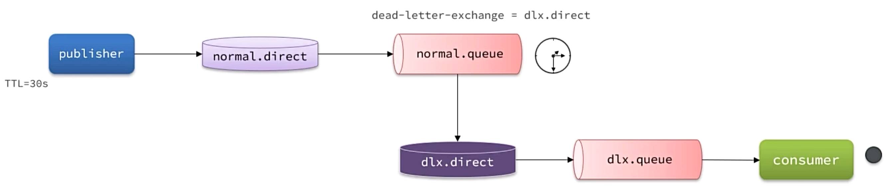

发送延迟消息

```java
rabbitTemplate.convertAndSend("normal.direct", "dlx.key", "消息", new MessagePostProcessor() {
            // 消息后处理器，设置消息的过期时间为10秒
            @Override
            public Message postProcessMessage(Message message) throws AmqpException {
                message.getMessageProperties()
                        .setExpiration("10000");
                return message;
            }
        });
```


#### 延迟消息插件

基于死信队列虽然可以实现延迟消息，但是太麻烦了。因此RabbitMQ社区提供了一个延迟消息插件来实现相同的效果。

> [Scheduling Messages with RabbitMQ | RabbitMQ](https://www.rabbitmq.com/blog/2015/04/16/scheduling-messages-with-rabbitmq)


插件下载地址： [Releases · rabbitmq/rabbitmq-delayed-message-exchange · GitHub](https://github.com/rabbitmq/rabbitmq-delayed-message-exchange/releases)


因为RabbitMQ是基于Docker安装，所以需要先查看RabbitMQ的插件目录对应的数据卷。

```bash
docker volume inspect mq-plugins
```

> 找到数据卷挂载位置，并将插件复制到该位置


执行命令使插件生效

```bash
docker exec -it mq rabbitmq-plugins enable rabbitmq_delayed_message_exchange
```


1. 声明延迟交换机，添加`delay`参数

```java
    @RabbitListener(bindings = @QueueBinding(
            value = @Queue(name = "delay.queue", durable = "true"),
            exchange = @Exchange(name = "delay.direct", delayed = "true"),
            key = "delay.key"
    ))
```

2. 发送延迟消息，在Message的后处理器中使用`setDelay`方法

```java
        rabbitTemplate.convertAndSend("delay.direct", "delay.key", "消息", new MessagePostProcessor() {
            // 消息后处理器，设置消息的过期时间为10秒
            @Override
            public Message postProcessMessage(Message message) throws AmqpException {
                message.getMessageProperties()
                        .setDelay(5000);
                return message;
            }
        });
```


**注意：**

延迟消息插件内部会维护一个本地数据库表，同时使用Elang Timers功能实现计时。如果消息的延迟时间设置较长，可能会导致堆积的延迟消息非常多，会带来较大的CPU开销，同时延迟消息的时间会存在误差。

因此，**不建议设置延迟时间过长的延迟消息**。


---

# Elasticsearch

[Elasticsearch：官方分布式搜索和分析引擎 | Elastic](https://www.elastic.co/cn/elasticsearch)


数据库的模糊搜索功能单一，匹配条件非常苛刻，必须恰好包含用户搜索的关键字。而在搜索引擎中，用户输入出现个别错字，或者用拼音搜索、同义词搜索都能正确匹配到数据。


在面临海量数据的搜索，或者有一些复杂搜索需求的时候，推荐使用专门的搜索引擎来实现搜索功能。


Elasticsearch是由elastic公司开发的一套搜索引擎技术，它是elastic技术栈中的一部分。完整的技术栈包括：

- Elasticsearch：用于数据存储、计算和搜索
- Logstash/Beats：用于数据收集
- Kibana：用于数据可视化

整套技术栈被称为ELK，经常用来做日志收集、系统监控和状态分析等等


## 安装

1. docker安装elasticsearch

```bash
docker run -d \
  --name es \
  -e "ES_JAVA_OPTS=-Xms512m -Xmx512m" \
  -e "discovery.type=single-node" \
  -v es-data:/usr/share/elasticsearch/data \
  -v es-plugins:/usr/share/elasticsearch/plugins \
  --privileged \
  --network work \
  -p 9200:9200 \
  -p 9300:9300 \
  elasticsearch:7.12.1
```

> -e "ES_JAVA_OPTS=-Xms512m -Xmx512m" 设置Java虚拟机内存
>
> -e "discovery.type=single-node" 设置单机模式

2. docker安装Kibana

```bash
docker run -d \
--name kibana \
-e ELASTICSEARCH_HOSTS=http://es:9200 \
--network=work \
-p 5601:5601  \
kibana:7.12.1
```

> -e ELASTICSEARCH_HOSTS=http://es:9200 设置elasticsearch地址，同一docker网络中可使用容器名
>
> 访问5601端口即可进入图形化界面


## 初识ES

### 倒排索引

elasticsearch之所以有如此高性能的搜索表现，正是得益于底层的倒排索引技术。

**倒排**索引的概念是基于MySQL这样的**正向索引**而言的。

> 根据id精确匹配时，可以走索引，查询效率较高。而当搜索条件为模糊匹配时，由于索引无法生效，导致从索引查询退化为全表扫描，效率很差。
>
> 因此，正向索引适合于根据索引字段的精确搜索，不适合基于部分词条的模糊匹配。


倒排索引中有两个非常重要的概念：

- 文档（`Document`）：用来搜索的数据，其中的每一条数据就是一个文档。例如一个网页、一个商品信息
- 词条（`Term`）：对文档数据或用户搜索数据，利用某种算法分词，得到的具备含义的词语就是词条。例如：我是中国人，就可以分为：我、是、中国人、中国、国人这样的几个词条


**创建倒排索引**是对正向索引的一种特殊处理和应用，流程如下：

- 将每一个文档的数据利用**分词算法**根据语义拆分，得到一个个词条
- 创建表，每行数据包括词条、词条所在文档id、位置等信息
- 因为词条唯一性，可以给词条创建**正向**索引

此时形成的这张以词条为索引的表，就是倒排索引表，两者对比如下：

**正向索引**

| **id（索引）** | **title**      | **price** |
| :------------- | :------------- | :-------- |
| 1              | 小米手机       | 3499      |
| 2              | 华为手机       | 4999      |
| 3              | 华为小米充电器 | 49        |
| 4              | 小米手环       | 49        |
| ...            | ...            | ...       |

**倒排索引**

| **词条（索引）** | **文档id** |
| :--------------- | :--------- |
| 小米             | 1，3，4    |
| 手机             | 1，2       |
| 华为             | 2，3       |
| 充电器           | 3          |
| 手环             | 4          |

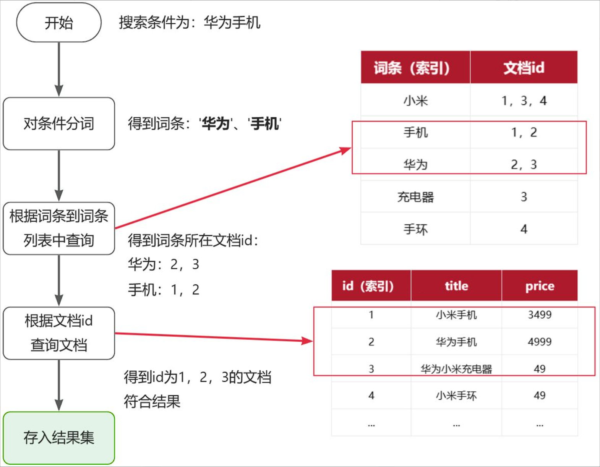


**正向索引**：

- 优点： 
  - 可以给多个字段创建索引
  - 根据索引字段搜索、排序速度非常快
- 缺点： 
  - 根据非索引字段，或者索引字段中的部分词条查找时，只能全表扫描。

**倒排索引**：

- 优点： 
  - 根据词条搜索、模糊搜索时，速度非常快
- 缺点： 
  - 只能给词条创建索引，而不是字段
  - 无法根据字段做排序


### IK分词器

Elasticsearch的关键就是倒排索引，而倒排索引依赖于对文档内容的分词，而分词则需要高效、精准的分词算法，IK分词器就是这样一个中文分词算法。


#### 安装

**方案一**：在线安装

运行一个命令即可：

```Shell
docker exec -it es ./bin/elasticsearch-plugin  install https://release.infinilabs.com/analysis-ik/stable/elasticsearch-analysis-ik-7.12.1.zip
```

> [GitHub - infinilabs/analysis-ik: 🚌 The IK Analysis plugin integrates Lucene IK analyzer into Elasticsearch and OpenSearch, support customized dictionary.](https://github.com/infinilabs/analysis-ik/tree/master?tab=readme-ov-file)

然后重启es容器：

```Shell
docker restart es
```

**方案二**：离线安装

查看之前安装的Elasticsearch容器的plugins数据卷目录：

```Shell
docker volume inspect es-plugins
```

将插件复制到容器挂载的目录，重启容器即可


#### 使用

IK分词器包含两种模式：

-  `ik_smart`：智能语义切分 
-  `ik_max_word`：最细粒度切分 


我们在Kibana的DevTools上来测试分词器，首先测试Elasticsearch官方提供的标准分词器：

```JSON
POST /_analyze
{
  "analyzer": "standard",
  "text": "黑马程序员学习java太棒了"
}
```

> 标准分词器适用于英文分词，中文分词效果不好
>
> 建议使用`ik_smart`模式


#### 拓展词典

随着互联网的发展，“造词运动”也越发的频繁。出现了很多新的词语，在原有的词汇列表中并不存在。

所以要想正确分词，IK分词器的词库也需要不断的更新，IK分词器提供了扩展词汇的功能。

1）打开IK分词器config目录：

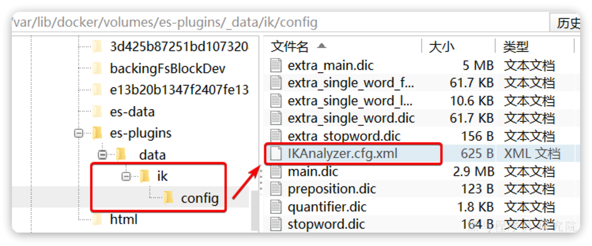

> 注意，如果采用在线安装的通过，默认是没有config目录的


2）在IKAnalyzer.cfg.xml配置文件内容添加：

```XML
<?xml version="1.0" encoding="UTF-8"?>
<!DOCTYPE properties SYSTEM "http://java.sun.com/dtd/properties.dtd">
<properties>
        <comment>IK Analyzer 扩展配置</comment>
        <!--用户可以在这里配置自己的扩展字典 *** 添加扩展词典-->
        <entry key="ext_dict">ext.dic</entry>
    	<entry key="ext_stopwords"></entry>		<!-- 停用词配置 -->
    	<entry key="remote_ext_dict"></entry>    <!-- 远程词典 -->
</properties>
```

3）在IK分词器的config目录新建一个 `ext.dic`，可以参考config目录下复制一个配置文件进行修改

```Plain
传智播客
泰裤辣
```


### 基础概念

#### 文档和字段

elasticsearch是面向**文档（Document）**存储的，可以是数据库中的一条商品数据，一个订单信息。


文档数据会被序列化为`json`格式后存储在`elasticsearch`，因此，原本数据库中的一行数据就是ES中的一个JSON文档；而数据库中每行数据都包含很多列，这些列就转换为JSON文档中的**字段（Field）**。

```json
{
    "id": 1,
    "title": "小米手机",
    "price": 3499
}
{
    "id": 2,
    "title": "华为手机",
    "price": 4999
}
{
    "id": 3,
    "title": "华为小米充电器",
    "price": 49
}
...

```


#### 索引和映射

随着业务发展，需要在es中存储的文档也会越来越多，比如有商品的文档、用户的文档、订单文档等等,所有文档都散乱存放显然非常混乱，也不方便管理。

因此，我们要将类型相同的文档集中在一起管理，称为**索引（Index）**

> 索引类似于数据库中“表”的概念


数据库的表会有约束信息，用来定义表的结构、字段的名称、类型等信息。因此，索引库中就有**映射（mapping）**，是索引中文档的字段约束信息，类似表的结构约束。


MySQL 与 Elasticsearch

| **MySQL** | **Elasticsearch** | **说明**                                                     |
| :-------- | :---------------- | :----------------------------------------------------------- |
| Table     | Index             | 索引(index)，就是文档的集合，类似数据库的表(table)           |
| Row       | Document          | 文档（Document），就是一条条的数据，类似数据库中的行（Row），文档都是JSON格式 |
| Column    | Field             | 字段（Field），就是JSON文档中的字段，类似数据库中的列（Column） |
| Schema    | Mapping           | Mapping（映射）是索引中文档的约束，例如字段类型约束。类似数据库的表结构（Schema） |
| SQL       | DSL               | DSL是elasticsearch提供的JSON风格的请求语句，用来操作elasticsearch，实现CRUD |

在企业中，往往是两者结合使用：

- 对安全性要求较高的写操作，使用mysql实现
- 对查询性能要求较高的搜索需求，使用elasticsearch实现
- 两者再基于某种方式，实现数据的同步，保证一致性

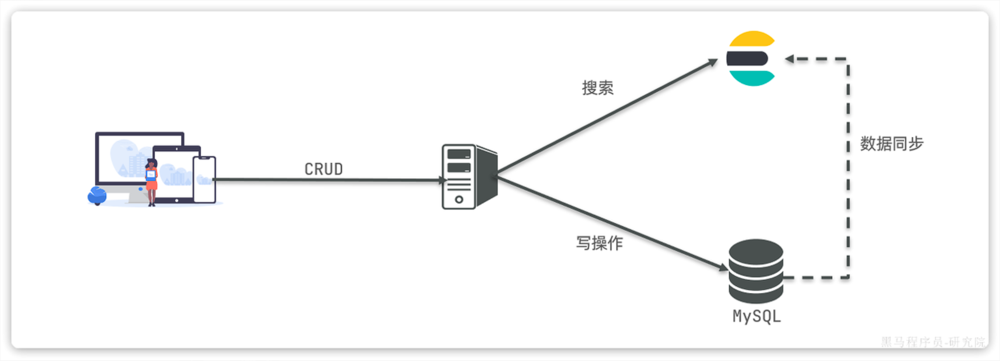


## 索引库操作

### Mapping映射属性

Mapping是对索引库中文档的约束，常见的Mapping属性包括：

- `type`：字段数据类型，常见的简单类型有： 
  - 字符串：`text`（可分词的文本）、`keyword`（精确值，不应分词，例如：品牌、国家、ip地址）
  - 数值：`long`、`integer`、`short`、`byte`、`double`、`float`、
  - 布尔：`boolean`
  - 日期：`date`
  - 对象：`object`
- `index`：是否创建索引（是否参与搜索），默认为`true`
- `analyzer`：使用哪种分词器
- `properties`：该字段的子字段


例如下面的json文档：

```JSON
{
    "age": 21,
    "weight": 52.1,
    "isMarried": false,
    "info": "黑马程序员Java讲师",
    "email": "zy@itcast.cn",
    "score": [99.1, 99.5, 98.9],
    "name": {
        "firstName": "云",
        "lastName": "赵"
    }
}
```

对应的每个字段映射（Mapping）：

| **字段名** | **字段类型** |    **类型说明**    | **是否**参与搜索 | **是否**参与分词 | **分词器** |
| :--------: | :----------: | :----------------: | :--------------: | :--------------: | :--------: |
|    age     |  `integer`   |        整数        |        ✔         |        ❌         |     ——     |
|   weight   |   `float`    |       浮点数       |        ✔         |        ❌         |     ——     |
| isMarried  |  `boolean`   |        布尔        |        ✔         |        ❌         |     ——     |
|    info    |    `text`    | 字符串，但需要分词 |        ✔         |        ✔         |     IK     |
|   email    |  `keyword`   | 字符串，但是不分词 |        ❌         |        ❌         |     ——     |
|   score    |   `float`    | 只看数组中元素类型 |        ✔         |        ❌         |     ——     |
|    name    |  `keyword`   | 字符串，但是不分词 |        ✔         |        ❌         |     ——     |


### CRUD

- 创建索引库和mapping

```json
PUT /<索引库名称>
{
  "mappings": {
    "properties": {
      "<字段名>":{
        "type": "text",
        "analyzer": "ik_smart"
      },
      "<字段名2>":{
        "type": "keyword",
        "index": "false"
      },
      "<字段名3>":{
        "properties": {
          "<子字段>": {
            "type": "keyword"
          }
        }
      },
      // ...略
    }
  }
}
```


- 查询索引库

```
GET /索引库名
```


- 删除索引库

```
DELETE /索引库名
```


- 修改索引库

倒排索引结构虽然不复杂，但是一旦数据结构改变（比如改变了分词器），就需要重新创建倒排索引，这简直是灾难。因此索引库**一旦创建，无法修改mapping**。

虽然无法修改mapping中已有的字段，但是却允许添加新的字段到mapping中，因为不会对倒排索引产生影响。因此修改索引库能做的就是向索引库中添加新字段，或者更新索引库的基础属性

```
PUT /索引库名/_mapping
{
  "properties": {
    "<新字段名>":{
      "type": "integer"
    }
  }
}
```


## 文档操作

### CRUD


### 批处理
