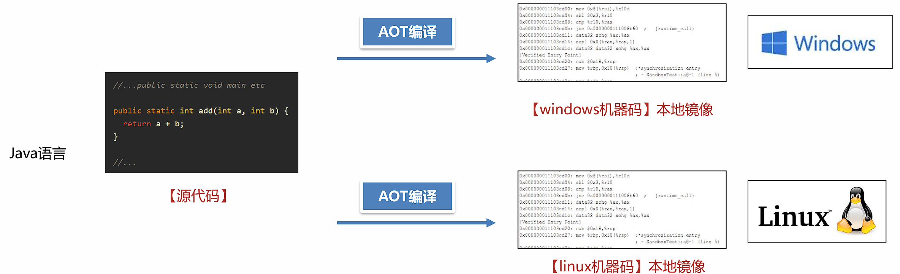
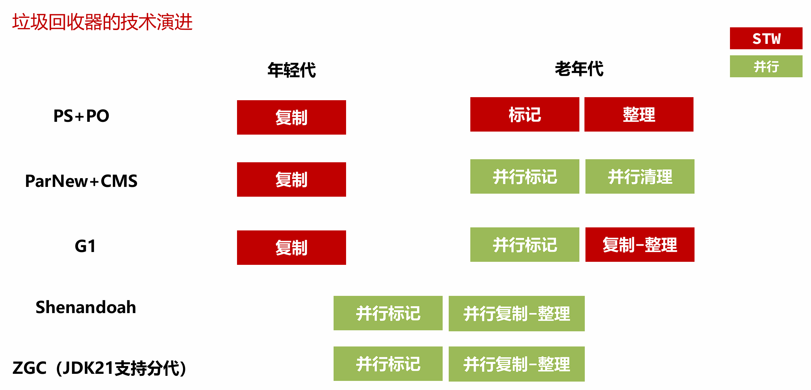
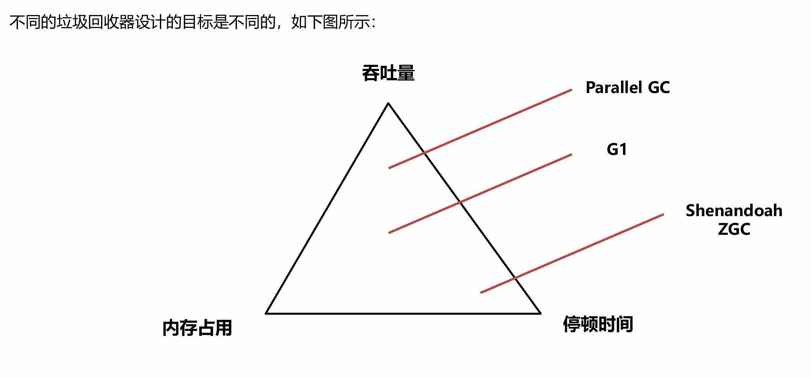
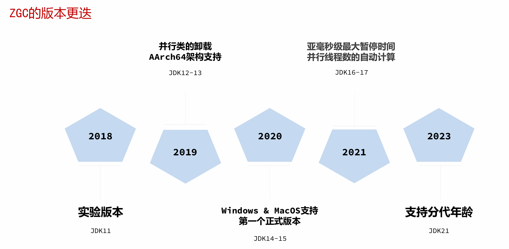

# JVM进阶

## GraalVM

### 简介

GraalVM是Oracle官方推出的一款**高性能JDK**，使用它享受比OpenJDK或者OracleJDK更好的性能。

GraalVM的官方网址： [https://www.graalvm.org/](https://www.graalvm.org/)

- 更低的CPU、内存使用率。

- 更快的启动速度，无需预热即可获得最好的性能。

- 更好的安全性、更小的可执行文件。

- 支持多种框架Spring Boot、Micronaut、Helidon 和 Quarkus。

- 多家云平台支持。

- 通过Truffle框架运行JS、Python、Ruby等其他语言。


### Linux社区版GraalVM环境搭建

1. 使用`arch`命令查看Linux架构

2. 根据架构下载社区版的[GraalVM](https://www.graalvm.org/downloads/)

3. 安装GraalVM，安装方式与安装JDK相同。

4. 使用java -version和HelloWorld测试GraalVM。
   
   

### GraalVM的两种运行模式

1. JIT（ Just-In-Time ）模式 ，**即时编译**模式

    JIT模式的处理方式与Oracle JDK类似，满足两个特点：

    - 一次编写，随处运行。

    - 预热之后，通过内置的Graal即时编译器优化热点代码，生成比Hotspot JIT更高性能的机器码。

2. AOT（Ahead-Of-Time）模式 ，**提前编译**模式

    AOT 编译器通过源代码，为特定平台创建可执行文件。比如，在Windows下编译完成之后，会生成exe文件。通过这种方式，达到启动之后获得最高性能的目的。但是不具备跨平台特性，不同平台使用需要单独编译。这种模式生成的文件称之为Native Image本地镜像。



---

### 使用GraalVM AOT模式制作本地镜像并运行

1. 安装Linux环境本地镜像制作需要的[依赖库](https://www.graalvm.org/latest/reference-manual/native-image/) 

2. 使用`native-image 类名` 制作本地镜像。（需要先将类源文件编译成class文件）

3. 运行本地镜像可执行文件。
   
---

### GraalVM存在的问题

GraalVM的AOT模式虽然在启动速度、内存和CPU开销上非常有优势，但是使用这种技术会带来几个问题：

1. 跨平台问题，在不同平台下运行需要编译多次。编译平台的依赖库等环境要与运行平台保持一致。

2. 使用框架之后，编译本地镜像的时间比较长，同时也需要消耗大量的CPU和内存。

3. AOT 编译器在编译时，需要知道运行时所有可访问的所有类。但是Java中有一些技术可以在运行时创建类，例如反射、动态代理等。这些技术在很多框架比如Spring中大量使用，所以框架需要对AOT编译器进行适配解决类似的问题。
   
   

**解决方案**：

1. 使用公有云的Docker等容器化平台进行在线编译，确保编译环境和运行环境是一致的，同时解决了编译资源问题。

2. 使用SpringBoot3等整合了GraalVM AOT模式的框架版本。
   
   

**案例**：使用SpringBoot3搭建GraalVM环境


步骤：

1. 使用 https://start.spring.io/ 在线生成器构建项目，添加依赖 `GraalVM Native Support`
   

2. 编写业务代码。

3. 执行`mvn -Pnative clean native:compile` 命令生成本地镜像。

4. 运行本地镜像

--- 
   
### 什么场景下需要使用GraalVM

1. 对性能要求比较高的场景，可以选择使用收费的企业版提升性能。

2. 公有云的部分服务是按照CPU和内存使用量进行计费的，使用GraalVM可以有效地降低费用。
   
---

### GraalVM企业级应用-Serverless架构

传统的系统架构中，服务器等基础设施的运维、安全、高可用等工作都需要企业自行完成，存在两个主要问题：

1. 开销大，包括了人力的开销、机房建设的开销。

2. 资源浪费，面对一些突发的流量冲击，比如秒杀等活动，必须提前规划好容量准备好大量的服务器，这些服务器在其他时候会处于闲置的状态，造成大量的浪费。

<br>

随着虚拟化技术、云原生技术的愈发成熟，云服务商提供了一套称为Serverless无服务器化的架构。企业无需进行服务器的任何配置和部署，完全由云服务商提供。比较典型的有亚马逊AWS、阿里云等。

Serverless架构中第一种常见的服务是**函数计算**（Function as a Service），将**一个应用拆分成多个函数**，每个函数会以事件驱动的方式触发。典型代表有AWS的Lambda、阿里云的FC。
  
  
  

函数计算的服务资源比较受限，比如AWS的Lambda服务一般无法支持超过15分钟的函数执行，所以云服务商提供了另外一套方案：**基于容器的Serverless应用**，无需手动配置K8s中的Pod、Service等内容，只需选择镜像就可自动生成应用服务。


同样，Serverless应用的计费标准中包含CPU和内存使用量，所以使用GraalVM AOT模式编译出来的本地镜像可以节省更多的成本。


---

### GraalVM的内存参数

由于GraalVM是一款独立的JDK，所以大部分HotSpot中的虚拟机参数都不适用。

常用的参数参考：[官方手册](https://www.graalvm.org/22.3/reference-manual/native-image/optimizations-and-performance/MemoryManagement/)。

- 社区版只能使用串行垃圾回收器（Serial GC），使用串行垃圾回收器的默认最大 Java 堆大小会设置为物理内存大小的 80%，调整方式为使用`-Xmx 最大堆大小`。如果希望在**编译期**就指定该大小，可以在编译时添加参数`-R:MaxHeapSize=最大堆大小`。

- G1垃圾回收器只能在企业版中使用，开启方式为添加`--gc=G1`参数，有效降低垃圾回收的延迟。

- 另外提供一个Epsilon GC，开启方式：`--gc=epsilon` ，它不会产生任何的垃圾回收行为所以没有额外的内存、CPU开销。如果在公有云上运行的程序生命周期短暂不产生大量的对象，可以使用该垃圾回收器，以节省最大的资源。

- `-XX:+PrintGC -XX:+VerboseGC` 参数打印垃圾回收详细信息。
  
---

### GraalVM内存快照文件的获取(AOT模式)

步骤：

1. **编译程序时**，添加`--enable-monitoring=heapdump`参数到pom文件的对应插件(`native-maven-plugin`)中。

2. **运行中**使用`kill -SIGUSR1 进程ID` 命令，创建内存快照文件。

3. 使用MAT分析内存快照文件。
   
---

### 运行时数据的获取

**JDK Flight Recorder** (JFR)是一个内置于 JVM 中的工具，可以收集正在运行中的 Java 应用程序的诊断和分析数据，比如线程、异常等内容。GraalVM本地镜像也支持使用JFR生成运行时数据，导出的数据可以使用VisualVM分析。


步骤：

1. 编译程序时，添加`--enable-monitoring=jfr`参数添加到pom文件的对应插件中。

2. 运行程序，添加`-XX:StartFlightRecording=filename=recording.jfr,duration=10s`参数。

3. 使用VisualVM分析JFR记录文件。
   
---  

## 新一代GC

### 垃圾回收器的技术演进






### Shenandoah GC

Shenandoah 是由**Red Hat**开发的一款低延迟的垃圾收集器，Shenandoah 并发执行大部分 GC 工作，包括并发的整理，堆大小对STW的时间基本没有影响。


Shenandoah的**使用方法**

1. **下载** [Shenandoah](https://builds.shipilev.net/openjdk-jdk-shenandoah/)

    !!!info "选择方式如下"
        `{aarch64, arm32-hflt, mipsel, mips64el, ppc64le, s390x, x86_32, x86_64}`：架构，使用arch命令选择对应的的架构。

        `{server,zero}`：虚拟机类型，选择server，包含所有GC的功能。

        `{release, fastdebug, Slowdebug, optimization}`：不同的优化级别，选择release，性能最高。

        `{gcc*-glibc*, msvc*}`：编译器的版本，选择较高的版本性能好一些，如果兼容性有问题（无法启动），选择较低的版本。


2. **配置** 将OpenJDK配置到环境变量中，使用`java –version`进行测试。

3. **添加参数**，运行Java程序。
   `-XX:+UseShenandoahGC `开启Shenandoah GC
   `-Xlog:gc` 打印GC日志
   
   

### ZGC

ZGC 是一种可扩展的低延迟垃圾回收器。ZGC 在垃圾回收过程中，STW的时间不会超过一毫秒，适合需要低延迟的应用。支持几百兆到16TB 的堆大小，堆大小对STW的时间基本没有影响。 

ZGC降低了停顿时间，能降低接口的最大耗时，提升用户体验。但是吞吐量不佳，所以如果Java服务比较关注QPS（每秒的查询次数）那么G1是比较不错的选择。




**ZGC的使用方法**:

OracleJDK和OpenJDK中都支持ZGC，阿里的DragonWell龙井JDK也支持ZGC但属于其自行对OpenJDK 11的ZGC进行优化的版本。

> 建议使用JDK17之后的版本，延迟较低同时无需手动配置并行线程数。

- 分代 ZGC 添加如下参数启用 `-XX:+UseZGC -XX:+ZGenerational` 

- 非分代 ZGC 通过命令行选项启用 `-XX:+UseZGC`
  
  

**ZGC的参数设置**:

ZGC在设计上做到了自适应，根据运行情况自动调整参数，让用户手动配置的参数最少化。

- 自动设置年轻代大小，无需设置-Xmn参数。

- 自动晋升阈值（复制中存活多少次才搬运到老年代），无需设置`-XX:TenuringThreshold`。

- JDK17之后支持自动的并行线程数，无需设置`-XX:ConcGCThreads`。

**需要设置的参数**：

`-Xmx 值` 最大堆内存大小

    这是ZGC最重要的一个参数，必须设置。ZGC在运行过程中会使用一部分内存用来处理垃圾回收，所以尽量保证堆中有足够的空间。设置多少值取决于对象分配的速度，根据测试情况来决定。

**可以设置的参数**：

`-XX:SoftMaxHeapSize=值`

    ZGC会尽量保证堆内存小于该值，这样在内存靠近这个值时会尽早地进行垃圾回收，但是依然有可能会超过该值。例如，-Xmx5g -XX:SoftMaxHeapSize=4g 这个参数设置，ZGC会尽量保证堆内存小于4GB，最多不会超过5GB。


**ZGC的调优**

ZGC 中可以使用Linux的**Huge Page大页技术**优化性能，提升吞吐量、降低延迟。

!!!caution "注意"
    安装过程需要 root 权限，所以ZGC默认没有开启此功能。

操作步骤：

1. 计算所需页数，Linux x86架构中大页大小为2MB，根据所需堆内存的大小估算大页数量。比如堆空间需要16G，预留2G（JVM需要额外的一些非堆空间），那么页数就是18G / 2MB = 9216。

2. 配置系统的大页池以具有所需的页数（需要root权限）：`$ echo 9216 > /sys/kernel/mm/hugepages/hugepages-2048kB/nr_hugepages`

3. 添加参数`-XX:+UseLargePages` 启动程序进行测试
   
   

### 总结

ZGC和Shenandoah设计的目标都是追求较短的停顿时间，他们具体的使用场景如下：

两种垃圾回收器在并行回收时都会使用垃圾回收线程占用CPU资源

① 在内存足够的情况下，ZGC垃圾回收表现的效果会更好，停顿时间更短。

② 在内存不是特别充足的情况下，Shenandoah GC表现更好，并行垃圾回收的时间较短，用户请求的执行效率比较高。


---

## 揭秘Java工具

Java工具的介绍在Java的世界中，除了Java编写的业务系统之外，还有一类程序也需要Java程序员参与编写，这类程序就是Java工具。

常见的Java工具有以下几类：

1. 诊断类工具，如Arthas、VisualVM等。

2. 开发类工具，如Idea、Eclipse。

3. APM应用性能监测工具，如Skywalking、Zipkin等。

4. 热部署工具，如Jrebel等。
   
   

### Java Agent技术

Java Agent技术是JDK提供的用来编写Java工具的技术，使用这种技术生成一种特殊的jar包，这种jar包可以让Java程序运行其中的代码。


#### 两种模式

Java Agent技术实现了让Java程序执行独立的Java Agent程序中的代码，执行方式有两种：

- 静态加载模式

- 动态加载模式
  
  

#### 静态加载模式

静态加载模式可以在程序启动的一开始就执行我们需要执行的代码，适合用APM等性能监测系统从一开始就监控程序的执行性能。静态加载模式需要在Java Agent的项目中编写一个premain的方法，并打包成jar包。

```java
public static viod premain(String agentArgs, Instrumentation inst)
```

接下来使用以下命令启动Java程序，此时Java虚拟机将会加载agent中的代码并执行。

```bash
java -javaagent:./agent.jar -jar test.jar
```

> permain方法会在主线程中执行


#### 动态加载模式

动态加载模式可以随时让java agent代码执行，适用于Arthas等诊断系统。动态加载模式需要在Java Agent的项目中编写一个agentmain的方法，并打包成jar包。

```java
public static void agentmain(String agentArgs, Instrumentation inst)
```

接下来使用以下代码就可以让java agent代码在指定的java进程中执行了:

```java
VirtualMachine vm = VirtualMachine.attach("24200");//动态连接到24200进程ID的java程序
vm.loadAgent("test.jar");//加载java agent
```

> agentmain方法会在独立的线程中执行


#### 环境搭建

- 静态加载

步骤：

1. 创建maven项目，添加`maven-assembly-plugin`插件，此插件可以打包出java agent的jar包。

2. 编写类和premain方法，premain方法中打印一行信息。

3. 编写`MANIFEST.MF`文件，此文件主要用于描述java agent的配置属性，比如使用哪一个类的premain方法。

4. 使用maven-assembly-plugin进行打包。

5. 创建spring boot应用，并静态加载上一步打包完的java agent。

<br>

- 动态加载

步骤：

1. 创建maven项目，添加maven-assembly-plugin插件，此插件可以打包出java agent的jar包。

2. 编写类和agentmain方法， agentmain方法中打印一行信息。

3. 编写MANIFEST.MF文件，此文件主要用于描述java agent的配置属性，比如使用哪一个类的agentmain方法。

4. 使用maven-assembly-plugin进行打包。

5. 编写main方法，动态连接到运行中的java程序。
   
   

### 案例1：简化版Arthas

编写一个简化版的Arthas程序，具备以下几个功能：

1. 查看内存使用情况

2. 生成堆内存快照

3. 打印栈信息

4. 打印类加载器

5. 打印类的源码

6. 打印方法执行的参数和耗时
   
   

#### 获取运行时信息- JMX技术

JDK从1.5开始提供了Java Management Extensions (JMX) 技术，通过Mbean对象的写入和获取，实现：

- 运行时配置的获取和更改

- 应用程序运行信息的获取（线程栈、内存、类信息等）

获取JVM默认提供的Mbean可以通过如下的方式，例如获取内存信息：

```java
List<MemoryPoolMXBean> mxBeanList = ManagementFactory.getMemoryPoolMXBeans();

mxBeanList.stream().filter(bean -> bean.getType().equals(MemoryType.HEAP))
                .forEach(
                        x -> {
                            StringBuilder sb = new StringBuilder();
                            sb.append("\tname:")
                                    .append(x.getName())
                                    .append("\n")
                                    .append("\tused:\t\t")
                                    .append(x.getUsage().getUsed() / 1024 / 1024)
                                    .append("m\n")
                                    .append("\tcommitted:\t")
                                    .append(x.getUsage().getCommitted() / 1024 / 1024)
                                    .append("m\n")
                                    .append("\tmax:\t\t")
                                    .append(x.getUsage().getMax() / 1024 / 1024)
                                    .append("m\n")
                                    .append("================================================");
                            System.out.println(sb);
                        }
                );
```


生成内存快照

```java
// 生成内存快照
    public static void heapDump(){
        SimpleDateFormat dateFormat = new SimpleDateFormat("yyyy-MM-dd-HH-mm");
        HotSpotDiagnosticMXBean bean = ManagementFactory.getPlatformMXBean(HotSpotDiagnosticMXBean.class);

        try {
            System.out.println("开始生成内存快照...");
            bean.dumpHeap(dateFormat.format(new Date())+ ".hprof", true);
        } catch (IOException e) {
            throw new RuntimeException(e);
        }
    }
```


获取线程信息

```java
// 获取线程运行信息
    public static void printThreadInfo() {
        ThreadMXBean threadMXBean = ManagementFactory.getThreadMXBean();

        ThreadInfo[] threadInfos = threadMXBean.dumpAllThreads(
                threadMXBean.isObjectMonitorUsageSupported(), threadMXBean.isSynchronizerUsageSupported());

        for (ThreadInfo threadInfo : threadInfos) {
            StringBuilder sb = new StringBuilder();
            sb.append("name:")
                    .append(threadInfo.getThreadName())
                    .append("\nthreadID:")
                    .append(threadInfo.getThreadId())
                    .append("\nthreadState:")
                    .append(threadInfo.getThreadState());
            System.out.println(sb);

            StackTraceElement[] stackTraceElements = threadInfo.getStackTrace();
            for (StackTraceElement stackTraceElement : stackTraceElements) {
                System.out.println("\t" + stackTraceElement.toString());
            }
            System.out.println();
        }
    }
```

获取类和类加载器的信息–Instumentation对象

Java Agent中可以获得Java虚拟机提供的Instumentation对象：

```java
    public static void premain(String agentArgs, Instrumentation inst) {}
    public static void agentmain(String agentArgs, Instrumentation inst) {}
```

该对象有以下几个作用：

- redefine，重新设置类的字节码信息。

- retransform，根据现有类的字节码信息进行增强。3、获取所有已加载的类信息。

Oracle官方手册： https://docs.oracle.com/javase/17/docs/api/java/lang/instrument/Instrumentation.html


```java
public static void printAllClassLoader(Instrumentation inst) {
        // 创建一个集合，用于存储所有加载的类加载器
        Set<ClassLoader> classLoaders = new HashSet<>();

        // 获取所有已加载的类
        Class[] classes = inst.getAllLoadedClasses();
        // 遍历每个类
        for (Class clazz : classes) {
            // 获取类的类加载器
            ClassLoader classLoader = clazz.getClassLoader();
            // 如果类加载器不为空，则加入集合
            if (classLoader != null) {
                classLoaders.add(classLoader);
            }
        }

        // 将类加载器的名称进行处理
        String str = classLoaders.stream().map(x -> {
                    // 如果类加载器为空，返回字符串 "BootstrapClassLoader"
                    if (x == null) {
                        return "BootstrapClassLoader";
                    } else {
                        // 否则返回类加载器的名称
                        return x.getName();
                    }
                }).filter(Objects::nonNull)
                // 去重并排序
                .distinct().sorted(String::compareTo)
                // 收集结果并以换行符连接
                .collect(Collectors.joining("\n"));

        // 输出所有类加载器的名称
        System.out.println(str);
    }
```


打印类的源码打印类的源码需要分为以下几个步骤

1. 获得内存中的类的字节码信息。利用Instrumentation提供的转换器来获取字节码信息。

2. 通过反编译工具(jd-core)将字节码信息还原成源代码信息。
   
   
<br>
   

打印方法执行的参数和耗时- **ASM**

ASM是一个通用的 Java **字节码**操作和分析框架。它可用于直接以二进制形式修改现有类或动态生成类。ASM重点关注性能。让操作尽可能小且尽可能快，所以它非常适合在动态系统中使用。ASM的缺点是代码复杂。

[ASM的官方网址](https://asm.ow2.io/)


<br>


打印方法执行的参数和耗时– **Byte Buddy**

> 底层基于ASM，使用更简单

[Byte Buddy官网](https://bytebuddy.net/)

---

### 案例2：Application performance monitor（APM）系统

APM应用程序性能监控系统是采集运行程序的实时数据并使用可视化的方式展示，使用APM可以确保系统可用性，优化服务性能和响应时间，持续改善用户体验。常用的APM系统有Apache Skywalking、Zipkin等。

[Skywalking官方网站](https://skywalking.apache.org/)


!!!question "Arthas这款工具用到了什么Java技术，有没有了解过？"

    Arthas主要使用了Java Agent技术，这种技术可以让运行中的Java程序执行Agent中编写代码。

    Arthas使用了Agent中的动态加载模式，可以选择让某个特定的Java进程加载Agent并执行其中的监控代码。

    监控方面主要使用的就是JMX提供的一些监控指标，同时使用字节码增强技术，对某些类和某些方法进行增强，从而监控方法的执行耗时、参数等内容。


!!!question "APM系统是如何获取到Java程序运行中的性能数据的？"

    APM系统比如Skywalking主要使用了Java Agent技术，这种技术可以让运行中的Java程序执行Agent中编写代码。

    Skywalking编写了Java Agent，使用了Agent中的静态加载模式，使用字节码增强技术，对某些类和某些方法进行增强，从而监控方法的执行耗时、参数等内容。

    比如对Controller层方法增强，获取接口调用的时长信息，对数据库连接增强，获取数据库查询的时长、SQL语句等信息。


---

**上一节**： [JVM实践](JVM-practice.md)

**下一节**： [JVM原理](JVM-principle.md)
