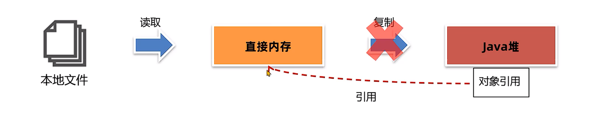

# JVM 基础

## 什么是JVM

JVM 全称是 Java Virtual Machine，中文译名 Java虚拟机。本质上是一个运行在计算机上的程序，他的职责是运行Java字节码文件。


---

## JVM的功能

1. 解释和运行
   
    - 对字节码文件中的指令，实时的解释成机器码，让计算机执行

2. 内存管理
   
    - 自动为对象、方法等分配内存，自动的垃圾回收机制，回收不再使用的对象

3. 即时编译

    - 对热点代码进行优化，提升执行效率


## 常见的JVM
| 名称 | 作者 | 支持版本 | 社区活跃度 (github star) | 特性 | 适用场景 |
|------|------|----------|-------------------------|------|----------|
| HotSpot (Oracle JDK版) | Oracle | 所有版本 | 高(闭源) | 使用最广泛，稳定可靠，社区活跃<br>JIT支持<br>Oracle JDK默认虚拟机 | 默认 |
| HotSpot (OpenJDK版) | Oracle | 所有版本 | 中(16.1k) | 同上<br>开源，OpenJDK默认虚拟机 | 默认<br>对JDK有二次开发需求 |
| GraalVM | Oracle | 11, 17, 19<br>企业版支持8 | 高(18.7k) | 多语言支持<br>高性能，JIT，AOT支持 | 微服务、云原生架构<br>需要多语言混合编程 |
| Dragonwell JDK<br>龙井 | Alibaba | 标准版 8,11,17<br>扩展版11,17 | 低(3.9k) | 基于OpenJDK的增强<br>高性能，bug修复，安全性提升<br>JWarmup，ElasticHeap，Wisp特性支持 | 电商、物流、金融领域<br>对性能要求比较高 |
| Eclipse OpenJ9<br>(原 IBM J9) | IBM | 8,11,17,19,20 | 低(3.1k) | 高性能，可扩展<br>JIT，AOT特性支持 | 微服务、云原生架构 |

## 字节码文件
!!!tip
    [使用 jclasslib工具查看字节码文件]( https://github.com/ingokegel/jclasslib)


### Magic魔数
- 文件是无法通过文件扩展名来确定文件类型的，文件扩展名可以随意修改，不影响文件的内容。
- 软件使用文件的头几个字节（文件头）去校验文件的类型，如果软件不支持该种类型就会出错。
- Java字节码文件中，将文件头称为**magic魔数**。

| 文件类型 | 字节数 | 文件头 |
|----------|--------|--------|
| JPEG (jpg) | 3 | FFD8FF |
| PNG (png) | 4 | 89504E47 (文件尾也有要求) |
| bmp | 2 | 424D |
| XML (xml) | 5 | 3C3F786D6C |
| AVI (avi) | 4 | 41564920 |
| **Java字节码文件 (class)** | **4** | **CAFEBABE** |

!!! note "重点提示"
    Java字节码文件(.class)的Magic魔数是 **CAFEBABE**，占用4个字节，这是所有Java class文件的标识符。


### 主副版本号

- 主副版本号指的是编译字节码文件的JDK版本号，主版本号用来标识大版本号，JDK1.0-1.1使用了45.0-45.3，JDK1.2是46之后每升级一个大版本就加1；副版本号是当主版本号相同时作为区分不同版本的标识，一般只需要关心主版本号。

- **版本号的作用主要是判断当前字节码的版本和运行时的JDK是否兼容。**

!!! tip "版本号计算方法"
    1.2之后大版本号计算方法是：**主版本号 - 44**
    
    比如主版本号52就是JDK8

!!!example "使用JDK8编译的字节码文件示例"
    从jclasslib工具中可以看到：

    - 次版本号：0

    - **主版本号：52 [1.8]**

    - 这表示该字节码文件是使用JDK8编译的


| JDK版本 | 主版本号 | 计算方式 |
|---------|----------|----------|
| JDK 1.0-1.1 | 45.0-45.3 | - |
| JDK 1.2 | 46 | 46-44=2 |
| JDK 8 | 52 | 52-44=8 |
| JDK 11 | 55 | 55-44=11 |
| JDK 17 | 61 | 61-44=17 |


### 主版本号不兼容问题

!!! example "案例：主版本号不兼容导致的错误"
    
    需求：
    
    解决以下由于主版本号不兼容导致的错误
    
    ```
    类文件具有错误的版本 52.0，应为 50.0
    请删除该文件或确保该文件位于正确的类路径子目录中。
    ```
    
    问题分析
    
    - **版本 52.0**：对应 JDK 8 (52-44=8)
    - **版本 50.0**：对应 JDK 6 (50-44=6)
    - 错误原因：使用JDK 8编译的字节码文件无法在JDK 6环境下运行
    

    解决方案
    
    **两种方案：**
    
    1. **升级JDK版本** 
       
        !!! warning "注意事项"
            容易引发其他的兼容性问题，并且需要大量的测试
    
    2. **将第三方依赖的版本号降低或者更换依赖，以满足JDK版本的要求** ✅ **建议采用**
       
        !!! tip "推荐方案"
            降低依赖版本或更换兼容的依赖包，保持当前JDK环境稳定


---

## 类的生命周期

### 加载

1. **类加载器**根据类的全限定名通过不同渠道以二进制流的方式获取字节码信息
    - 本地文件
    - 动态代理生成
    - 通过网络传输

2. 类加载器加载完成后，Java虚拟机会将字节码中的信息保存到方法区中

3. 生成InstanceKlass对象（C++语言对象），保存类的所有信息，还包含实现特定功能比如多态的信息

4. 在堆区生成一份与方法区中数据类似的 java.lang.Class 对象，作用是在Java代码中去获取类的信息以及存储静态字段数据（JDK8之后）
!!!note
    对于开发者来说，只需要访问堆区的Class对象而不需要访问方法区中的数据，这样Java虚拟机可以很好的控制开发者访问数据的范围


### 连接

1. 验证阶段，检测Java字节码文件是否遵守Java虚拟机规范（文件格式、元信息等）

2. 准备阶段，为静态变量分配内存并设置**初始值**(注意是赋初值不是赋值)
   
    !!!tip "final修饰的基本数据类型的静态变量，准备阶段会直接赋值"


    准备阶段只会给静态变量赋初始值，而每一种基本数据类型和引用数据类型都有其初始值。
    
    | 数据类型 | 初始值 | 数据类型 | 初始值 |
    |----------|--------|----------|--------|
    | int | 0 | byte | 0 |
    | long | 0L | boolean | false |
    | short | 0 | double | 0.0 |
    | char | '\u0000' | 引用数据类型 | null |
    
    !!! note "重要说明"
        - 准备阶段只处理**静态变量**的初始化
        - 每种基本数据类型都有对应的默认初始值
        - 所有引用数据类型的初始值都是 `null`
        - char 类型的初始值是 `'\u0000'`（空字符）
        - long 类型的初始值是 `0L`

3. 解析阶段，将常量池中的符号引用替换为直接引用（内存地址）

### 初始化

执行静态代码块，并为静态变量赋值，执行字节码文件中clinit部分的字节码指令


类的初始化时机：

- 访问一个类的静态变量或者静态方法，注意final修饰的变量并且等号右边是常量不会触发初始化

- 调用Class.forName(String className)方法

- new一个该类的对象时

- 执行main方法的当前类
  
  

clinit指令在特定情况下不会出现：

- 无静态代码块且无静态变量赋值语句

- 有静态变量的声明，但是没有赋值语句

- 静态变量的定义使用final关键字并且赋常量值，准备阶段直接赋值

!!!warning "注意"
    数组的创建不会导致数组中元素的类进行初始化
    final修饰的变量如果赋值内容需要执行指令才能得出结果，会执行clinit方法进行初始化


!!!tip "存在继承关系"

    直接访问父类的静态变量，不会触发子类的初始化

    子类的初始化clinit调用之前，会先调用父类的clinit初始化方法


### 使用

### 卸载

---

## 类加载器分类


### 启动类加载器


### 扩展类加载器


### 应用程序类加载器

- **类名**：`sun.misc.Launcher$AppClassLoader` (JDK8及之前) 或 `jdk.internal.loader.ClassLoaders$AppClassLoader` (JDK9+)
- **父类加载器**：扩展类加载器（Extension ClassLoader）
- **加载范围**：用户自定义的类和第三方jar包中的类

应用程序类加载器主要从以下路径加载类：

1. **-classpath** 或 **-cp** 参数指定的路径
2. **CLASSPATH** 环境变量指定的路径  
3. **java.class.path** 系统属性指定的路径
4. 当前工作目录（如果没有指定classpath）


!!!tip "获取应用程序类加载器"
    ```java
    // 方法1：通过系统方法获取
    ClassLoader appClassLoader = ClassLoader.getSystemClassLoader();

    // 方法2：通过当前类获取
    ClassLoader currentClassLoader = MyClass.class.getClassLoader();

    // 方法3：通过线程上下文获取
    ClassLoader contextClassLoader = Thread.currentThread().getContextClassLoader();
    ```

## JDK8之后的类加载器

由于JDK9引入了module的概念，类加载器在设计上发生了很多变化。


1. **启动类加载器使用Java编写**，位于`jdk.internal.loader.ClassLoaders`类中。

2. **Java中的BootClassLoader继承自BuiltinClassLoader**，实现从模块中找到要加载的字节码资源文件。

!!! important "重要变化"
    **启动类加载器依然无法通过java代码获取到，返回的仍然是null，保持了统一。**

Bootstrap(C++)  ──►  BootClassLoader(Java)

JDK8及之前 ------------ JDK9及之后

---

## 双亲委派机制


### 双亲委派机制作用

双亲委派机制主要有两个重要作用：

1. 保证类加载的安全性

    **通过双亲委派机制，让顶层的类加载器去加载核心类，避免恶意代码替换JDK中的核心类库，比如java.lang.String，确保核心类库的完整性和安全性。**

    !!! danger "安全风险示例"
        如果没有双亲委派机制，恶意代码可能会：
        
        - 创建自定义的`java.lang.String`类来替换系统类
        - 修改核心API的行为，导致系统不稳定
        - 绕过Java的安全检查机制

2. 避免重复加载

    **双亲委派机制可以避免同一个类被多次加载，上层的类加载器如果加载过类，就会直接返回该类，避免重复加载。**

!!! tip "加载机制说明"
    ```
    应用程序类加载器请求加载 java.lang.String
            ↓ 委派给父类
    扩展类加载器检查是否已加载
            ↓ 委派给父类  
    启动类加载器检查并加载 ✓
            ↓ 返回已加载的类
    直接返回，避免重复加载
    ```

双亲委派的工作流程

| 步骤 | 操作 | 说明 |
|------|------|------|
| 1 | **检查缓存** | 检查类是否已经被当前类加载器加载过 |
| 2 | **向上委派** | 如果未加载，委派给父类加载器 |
| 3 | **递归委派** | 父类加载器重复步骤1-2，直到顶层 |
| 4 | **尝试加载** | 顶层加载器尝试加载类 |
| 5 | **向下返回** | 如果加载失败，返回给子类加载器尝试 |
| 6 | **返回结果** | 成功加载则返回Class对象，失败则抛异常 |


!!! success "双亲委派机制的优势"
    - **🔒 安全性**：防止核心类库被篡改
    - **♻️ 避免重复**：同一个类只会被加载一次
    - **🎯 职责清晰**：不同层级加载器负责不同范围的类
    - **⚡ 性能优化**：减少不必要的类加载开销
    - **🛡️ 稳定性**：保证JVM运行时环境的一致性

---

### 打破双亲委派机制

在某些特殊场景下，需要打破双亲委派机制来实现特定的类加载需求。主要有以下三种方式：

1. **自定义类加载器**

    自定义类加载器并且重写loadClass方法，就可以将双亲委派机制的代码去除。

    !!! example "实现方式"
        - 继承`ClassLoader`类
        - 重写`loadClass()`方法
        - 移除向父类委派的逻辑
        - 直接在当前类加载器中查找并加载类

    !!! info "应用场景"
        **Tomcat通过这种方式实现应用之间类隔离**

2. **线程上下文类加载器**

    利用上下文类加载加载类，比如JDBC和JNDI等。

    !!! note "使用原理"
        - 父类加载器请求子类加载器去完成类加载
        - 通过`Thread.currentThread().getContextClassLoader()`获取
        - 打破了"父加载器加载的类无法访问子加载器加载的类"的限制

    !!! example "典型应用"
        - **JDBC驱动加载**：DriverManager由启动类加载器加载，但数据库驱动由应用程序类加载器加载
        - **JNDI服务**：类似的反向类加载需求
        - **SPI机制**：Service Provider Interface

3. **OSGi框架的类加载器**

    历史上OSGi框架实现了一套新的类加载器机制，允许同级之间委托进行类的加载。

    !!! tip "OSGi特性"
        - **模块化系统**：每个Bundle有独立的类加载器
        - **动态加载**：支持运行时安装、启动、停止、卸载模块
        - **版本管理**：同一个类的不同版本可以共存
        - **平级委派**：Bundle之间可以相互委派类加载


| 方式 | 复杂度 | 使用场景 | 典型应用 |
|------|--------|----------|----------|
| **自定义类加载器** | 中等 | 应用隔离、热部署 | Tomcat、Spring Boot DevTools |
| **线程上下文类加载器** | 简单 | SPI服务加载 | JDBC、JNDI、Spring |
| **OSGi框架** | 复杂 | 模块化系统 | Eclipse IDE、Apache Felix |

!!! warning "注意事项"
    - 打破双亲委派机制可能会带来类加载的复杂性
    - 需要仔细考虑类的可见性和版本冲突问题
    - 在大多数情况下，遵循双亲委派机制是最佳实践

---

## Java内存区域
- Java虚拟机在运行Java程序过程中管理的内存区域，称之为运行时数据区。
- 《Java虚拟机规范》中规定了每一部分的作用。

|线程不共享|线程共享|
|----|---|
|程序计数器|堆|
|Java虚拟机栈|方法区|
|本地方法栈|直接内存(并不属于Java虚拟机规范)|


!!!tip "内存调优学习路线"
    了解运行时内存结构 --> 掌握内存问题的产生原因 --> 掌握内存调优的基本方法

---

### 程序计数器

- 程序计数器（Program Counter Register）也叫PC寄存器，每个线程会通过程序计数器记录当前要执行的的字节码指令的地址。

- 在加载阶段，虚拟机将字节码文件中的指令读取到内存之后，会将原文件中的偏移量转换成内存地址。每一条字节码指令都会拥有一个内存地址。

- 在代码执行过程中，程序计数器会记录下一行字节码指令的地址。执行完当前指令之后，虚拟机的执行引擎根据程序计数器执行下一行指令。

!!!question "程序计数器会不会出现内存溢出？"
    程序计数器是线程私有的且长度固定，不会出现内存溢出。

---

### 栈

#### Java虚拟机栈

Java虚拟机栈用来存放方法调用时的栈帧信息。存储的内容包括：

- 局部变量表

- 操作数栈

- 帧数据

!!!note
    - 局部变量表保存的内容有：实例方法的this对象，方法的参数，方法体中声明的局部变量。

    - 操作数栈是栈帧中虚拟机在执行指令过程中用来存放中间数据的一块区域,在**编译期**就可以确定操作数栈的最大深度。

    - 帧数据包含动态链接、方法出口、异常表等信息。
  


!!!tip
    上图中起始PC和长度可以确定变量的作用域


!!!note
    - 当前类的字节码指令引用了其他类的属性或者方法时，需要将符号引用（编号）转换成对应的运行时常量池中的内存地址。**动态链接**就保存了编号到运行时常量池的内存地址的映射关系。
  
    - **方法出口**指的是方法在正确或者异常结束时，当前栈帧会被弹出，同时程序计数器应该指向上一个栈帧中的下一条指令的地址。所以在当前栈帧中，需要存储此方法出口的地址。

    - **异常表**存放的是代码中异常的处理信息，包含了异常捕获的生效范围以及异常发生后跳转到的字节码指令位置。

---
!!!danger "栈内存溢出"
    - Java虚拟机栈内存溢出会抛出`StackOverflowError`错误
    - 主要原因是递归调用过深，导致栈帧数量过多，也可能是局部变量表过大，导致单个栈帧过大

---

#### 本地方法栈
本地方法栈存储的是native方法调用时的栈帧信息，native方法是用C/C++等语言编写的方法。

!!!tip
    在HotSpot虚拟机中，本地方法栈和Java虚拟机栈是合二为一的，即Java虚拟机栈同时存储Java方法和native方法的栈帧信息。


!!!example "虚拟机设置栈大小"
    - 设置Java虚拟机栈大小：`-Xss`，比如`-Xss512k`表示每个线程的栈大小是512KB
    - 设置本地方法栈大小：`-Xoss`，比如`-Xoss512k`表示每个线程的本地方法栈大小是512KB
    - 单位：
        - k：KB
        - m：MB
        - g：GB

---

### 堆

一般情况下，Java堆是Java虚拟机中最大的一块内存区域，用来存放对象实例和数组。可以通过引用访问堆中的对象。

堆有三个注意的指标：used 、total 、 max

- used：表示当前已经使用的堆内存大小

- total：表示当前已分配堆的总大小

- max：表示堆可分配内存的最大值

!!!example "设置堆内存大小"
    - 设置初始堆大小：`-Xms`，比如`-Xms512m`表示初始堆大小是512MB
    - 设置最大堆大小：`-Xmx`，比如`-Xmx1024m`表示最大堆大小是1024MB
    - 单位：
        - k：KB
        - m：MB
        - g：GB
    
    Java服务端程序建议初始堆大小和最大堆大小设置成一样，避免堆动态扩展带来的性能损耗

---

### 方法区

方法区是Java虚拟机中一块特殊的内存区域，用来存放

- 类的元信息

- 运行时常量池

- 静态变量

- 即时编译器编译后的代码


!!!tip "静态常量池与运行时常量池"
    - 静态常量池：存放在类的字节码文件中，编译期就确定了（通过符号引用）
    - 运行时常量池：存放在方法区中，类加载后存放在运行时常量池中，可以动态生成（通过内存引用）

!!!note "方法区的不同实现"
    - JDK8之前：方法区实现是永久代（PermGen），属于堆的一部分
    - JDK8及之后：方法区实现是元空间（Metaspace），不再属于堆，使用本地内存

---
字符串常量池

- 字符串常量池是方法区中的一部分，用来存放字符串字面量和字符串对象

- 字符串常量池的主要作用是提高字符串的重用率，节省内存空间

!!!question "哪些字符串会存放在字符串常量池中？"
    - 字符串字面量，比如`String s = "hello";`
    - 使用`String.intern()`方法创建的字符串对象

    new关键字创建的字符串对象不会存放在字符串常量池中，比如`String s = new String("hello");`，这种方式会在堆中创建一个新的字符串对象。


!!!question "方法区和字符串常量池有什么关系？"
    - 早期JDK版本中，字符串常量池属于运行时常量池的一部分，存放在方法区中
    - JDK7之后，字符串常量池被移到了堆中，不再存放在方法区中

---

### 直接内存
!!!warning "注意"
    直接内存并不属于Java运行时的内存区域

直接内存在JDK1.4中引入，主要用于提高I/O操作的效率。直接内存是通过Java的NIO（New Input/Output）库来分配和管理的。

传统的Java I/O操作是基于流的，数据需要在Java堆内存和操作系统内核之间进行多次复制，导致性能瓶颈。直接内存允许Java程序直接访问操作系统的内存，从而减少了数据复制的开销，提高了I/O操作的效率。



!!!example "配置直接内存大小"
    - 设置直接内存大小：`-XX:MaxDirectMemorySize`，比如`-XX:MaxDirectMemorySize=512m`表示最大直接内存大小是512MB
    - 如果不设置该参数，默认情况下直接内存的大小等于最大堆内存大小（-Xmx的值）

---

## 垃圾回收
!!! note "没有垃圾回收"
    - C/C++等语言没有垃圾回收机制，程序员需要手动管理内存
    - 容易出现内存泄漏、悬挂指针等问题，导致程序崩溃

Java语言简化了内存管理，通过垃圾回收机制自动回收不再使用的对象，减少了内存泄漏和悬挂指针的风险。


### 方法区回收

对于线程不共享的内存区域，都是伴随线程的创建和销毁而分配和回收的。无需垃圾回收干预。

方法区中能回收的内容主要是不再使用的类，该类需要满足：

- 类的所有实例都已经被回收（包括子类对象）

- 加载该类的类加载器已经被回收

- 该类的java.lang.Class对象没有被任何地方引用


!!!tip "手动触发垃圾回收"
    - 可以通过`System.gc()`方法建议Java虚拟机进行垃圾回收
    - 该方法只是一个建议，**Java虚拟机可以选择忽略它**
    - 一般不建议频繁调用该方法，可能会影响性能

---

### 堆回收
!!!question "如何判断对象是否可以被回收？"
    根据对象是否被引用来判断，有一种例外是循环引用

判断对象是否被引用的两种主要算法：

- 引用计数法

- 可达性分析法

---

#### 引用计数法

引用计数法就是给每个对象添加一个引用计数器，当有引用指向该对象时，计数器加1；

当引用失效或者指向其他对象时，计数器减1；

当计数器为0时，说明该对象不再被引用，可以被回收。

!!!danger "引用计数法的缺点"
    但是引用计数法有一个缺点，就是无法解决循环引用的问题。（维护引用计数器也会增加开销）

---

#### 可达性分析

JVM使用可达性分析算法来判断对象是否可以被回收。

可达性分析算法将对象分为“GC Root对象”和“普通对象”

如果一个对象可以通过一系列引用链从根对象访问到，那么该对象就是可达的，不会被回收。

!!!question "哪些是GC Root对象？"
    - 线程Thread对象及其引用的对象
    - 类的静态变量引用的对象
    - 常量引用的对象
    - 本地方法栈中引用的对象
    - JVM内部引用的对象
    - ...


### 引用类型

在可达性分析算法中，引用指“强引用”

Java中有五种引用类型：

- 强引用（Strong Reference）

- 软引用（Soft Reference）

- 弱引用（Weak Reference）

- 虚引用（Phantom Reference）

- 终结器引用（Final Reference）


#### 软引用


> [!Warning]
>
> 注意：软引用对象也需要被强引用，否则也会被回收


> 注：工具-->Caffeine缓存库


```java
public class Demo{
    public static void main(String[] args){
        ArrayList<SoftReference> softReferences = new ArrayList<>();
        ReferenceQueue<byte[]> queues = new ReferenceQueue<byte[]>();
        for(int i=0;i<10;i++){
            byte[] bytes = new byte[1024*1024*100];
            SoftReference stuRef = new SoftReference<byte[]>(bytes,queues);//构造函数传递数据及引用队列
            softReferences.add(stuRef);
        }

        softReference<byte[]> ref = null;
        int count = 0;
        while((ref = (SoftReference<byte[]>) queues.poll()) != null){
            count++;
        }
        System.out.println(count);
    }
}
```

> 设置启动参数 -Xmx200m
> 
> 输出 ：
> 
> 9


##### 弱引用


```java
import java.lang.ref.WeakReference;

public class WeakReferenceDemo {
    public static void main(String[] args) {
        byte[] bytes = new byte[1024 * 1024 * 100];
        WeakReference<byte[]> weakReference = new WeakReference<>(bytes);
        bytes = null;
        System.out.println(weakReference.get());
        System.gc();
        System.out.println(weakReference.get());
    }
}

```

> 输出：
> 
> [B@776ec8df
> null


##### 虚引用和终结器引用


#### 垃圾回收算法


##### 标记清除法


> 优点：实现简单，只需要在第一阶段给每个对象维护标志位，第二阶段删除对象即可
> 
> 缺点：
> 
> - 碎片化问题，对象删除后内存中会出现很多细小的可用内存单元，如果需要较大的空间，则这些碎片无法被分配
> 
> - 分配速度慢，由于内存碎片存在，需要进行遍历寻找可用空间


##### 复制算法


> 优点：
> 
> - 吞吐量高
> 
> - 不会发生碎片化
> 
> 缺点：内存使用效率低


##### 标记整理算法（标记压缩算法）


> 优点：
> 
> - 内存使用率高
> 
> - 不会发生碎片化
> 
> 缺点：整理阶段效率不高


##### 分代垃圾回收算法


> [!Caution]
>
> “Hotspot 遍历所有对象时，按照年龄从小到大对其所占用的大小进行累积，当累积的某个年龄大小超过了 survivor 区的 50% 时（默认值是 50%，可以通过 `-XX:TargetSurvivorRatio=percent` 来设置，参见 [issue1199](https://github.com/Snailclimb/JavaGuide/issues/1199) ），取这个年龄和 MaxTenuringThreshold 中更小的一个值，作为新的晋升年龄阈值”。
>
> ------
>
> 著作权归JavaGuide(javaguide.cn)所有 基于MIT协议 原文链接：https://javaguide.cn/java/jvm/jvm-garbage-collection.html


#### 垃圾回收器


1. 组合一


2. 组合二


3. 组合三


4.G1垃圾回收器


1. 新创建的对象会存放在Eden区。当G1判断年轻代区不足（max默认60%），无法分配对象时需要回收时会执行Young GC。

2. 标记出Eden和Survivor区域中的存活对象，

3. 根据配置的最大暂停时间选择某些区域将存活对象复制到一个新的Survivor区中（年龄+1），清空这些区域。

4. 后续Young GC时与之前相同，只不过Survivor区中存活对象会被搬运到另一个Survivor区。

5. 当某个存活对象的年龄到达阈值（默认15），将被放入老年代。

6. 部分对象如果大小超过Region的一半，会直接放入老年代，这类老年代被称为Humongous区。比如堆内存是4G，每个Region是2M，只要一个大对象超过了1M就被放入Humongous区，如果对象过大会横跨多个Region。

7. 、多次回收之后，会出现很多Old老年代区，此时总堆占有率达到阈值时（-XX:InitiatingHeapOccupancyPercent默认45%）会触发混合回收MixedGC。回收所有年轻代和部分老年代的对象以及大对象区。采用复制算法来完成。
   
   

> G1在进行Young GC的过程中会去记录每次垃圾回收时每个Eden区和Survivor区的平均耗时，以作为下次回收时的参考依据。这样就可以根据配置的最大暂停时间计算出本次回收时最多能回收多少个Region区域了。比如 -XX:MaxGCPauseMillis=n（默认200），每个Region回收耗时40ms，那么这次回收最多只能回收4个Region。


G1对老年代的清理会选择存活度最低的区域来进行回收，这样可以保证回收效率最高，这也是G1（Garbage first）名称的由来。最后清理阶段使用复制算法，不会产生内存碎片。

> 注意：如果清理过程中发现没有足够的空Region存放转移的对象，会出现Full GC。单线程执行标记-整理算法，此时会导致用户线程的暂停。所以尽量保证应该用的堆内存有一定多余的空间。


#### 垃圾回收器选择


---


