# 内存调优

---

## 内存泄露&&内存溢出

在Java中如果不再使用一个对象，但是该对象依然在GC root引用链上，这个对象就不会被垃圾回收器回收，这种情况称为**内存泄漏**

内存泄漏最终会导致**内存溢出**

---

## 解决内存溢出

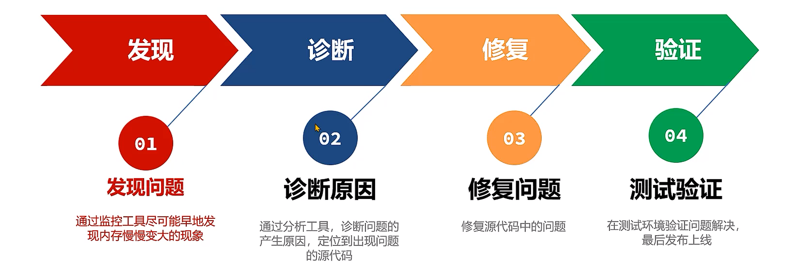

---

### 发现问题

1. Linux下使用`top`命令查看CPU和内存使用率
  
    - 使用简单，但是功能单一

2. [VisualVm](https://visualvm.github.io/)工具查看堆内存和非堆内存的使用情况

    - 功能强大，可以查看内存、线程、类等信息

3. [arthas](https://arthas.aliyun.com/doc/)工具查看内存使用情况

    - 功能强大，支持在线诊断

4. 使用Prometheus+Grafana监控Java应用

    - 企业中常用的监控方案

5. 查看堆内存监控图
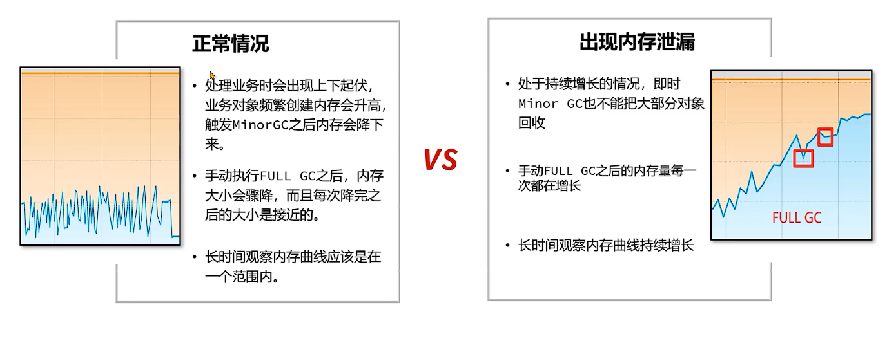


!!!example "案例"
    使用阿里arthas tunnel管理所有的需要监控的程序

    背景：团队已经普及了arthas的使用，但是由于使用了**微服务**架构，生产环境上的应用数量非常多，使用arthas还得登录到每一台服务器上再去操作非常不方便。团队调研发现官方文档说明可以使用tunnel来管理所有需要监控的程序。

    步骤：

    1. 在Spring Boot程序中添加arthas的依赖，在配置文件中添加tunnel服务端的地址，便于tunnel去监控所有的程序。

    2. 将tunnel服务端程序部署在某台服务器上并启动。

    3. 启动需要监控的程序，查看日志确认已经连接上tunnel服务端。

    4. 打开tunnel的服务端页面，查看所有的进程列表，并选择进程进行arthas的操作。


#### 在线定位问题

1. 使用`jmap-histo:live 进程ID > 文件名` 命令将内存中存活对象以直方图的形式保存到文件中，这个过程会影响用户的时间，但是时间比较短暂。

2. 分析内存占用最多的对象，一般这些对象就是造成内存泄漏的原因。

3. 使用arthas的`stack`命令,`stack 全限定类名 [方法名]`，追踪对象创建的方法被调用的调用路径，找到对象创建的根源。也可以使用btrace工具编写脚本追踪方法执行的过程。
   
!!!note

    BTrace 是一个在Java 平台上执行的追踪工具，可以有效地用于线上运行系统的方法追踪，具有侵入性小、对性能的影响微乎其微等特点。项目中可以使用btrace工具，打印出方法被调用的栈信息。

    使用方法：

    1. 下载btrace工具， 官方地址：[github](https://github.com/btraceio/btrace/releases/latest)

    2. 编写btrace脚本，通常是一个java文件。

    3. 将btrace工具和脚本上传到服务器，在服务器上运行 btrace 进程ID 脚本文件名 。

    4. 观察执行结果。


#### 两种方案的比较

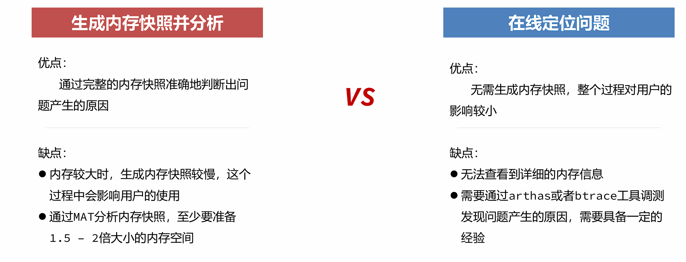

---


### 内存溢出原因分析

#### 代码规范问题

1. `equals`和`hashCode`方法重写不正确

    !!!example "equals和hashCode导致内存泄漏"

        Java的集合类中，`HashMap`、`HashSet`、`Hashtable`等都使用了哈希表来存储数据，这些集合类在存储数据时会调用对象的`hashCode`方法来计算对象的哈希值，并根据哈希值将对象存储到哈希表中。

        如果对象的`hashCode`实现有问题，导致相同的对象每次调用`hashCode`方法时返回不同的值，那么在将对象存储到哈希表中时，会导致对象被存储到不同的位置，进而导致内存泄漏。

        解决方案：

        - 确保同时重写`equals`和`hashCode`方法。
        
        - 确保`hashCode`方法返回的值在对象的生命周期内保持不变。

2. 非静态内部类和匿名类错误地引用外部类

    !!!example "非静态内部类和匿名类导致内存泄漏"

        非静态内部类和匿名类会隐式地持有对外部类实例的引用，如果外部类实例的生命周期比内部类实例长，那么内部类实例就会一直持有对外部类实例的引用，导致外部类实例无法被垃圾回收，从而引发内存泄漏。

        解决方案：

        - 使用静态内部类，避免隐式引用外部类实例。

        - 如果必须使用非静态内部类或匿名类，确保在不再需要时显式地将其引用设置为`null`。

3. 使用`ThreadLocal`时没有及时清理

    !!!example "ThreadLocal导致内存泄漏"

        `ThreadLocal`用于为每个线程提供独立的变量副本，避免了多线程环境下的共享变量问题。一般手动创建的线程会在线程结束时自动清理`ThreadLocal`变量，但是如果使用线程池，线程不会结束，`ThreadLocal`变量会一直存在，导致内存泄漏。

        解决方案：

        - 在不再需要`ThreadLocal`变量时，调用`remove()`方法清理变量。

        - 避免在长生命周期的线程中使用`ThreadLocal`，例如线程池中的线程。

4. 使用`String`的`intern`方法导致字符串常量池内存溢出

    !!!example "String.intern导致内存泄漏"

        `String.intern()`方法会将字符串添加到字符串常量池中，如果频繁调用`intern()`方法，可能会导致字符串常量池内存溢出。

        解决方案：

        - 避免频繁调用`String.intern()`方法。

        - 使用`StringBuilder`或`StringBuffer`来构建字符串，避免创建过多的临时字符串对象。

5. 通过静态字段引用对象

    !!!example "静态字段引用对象导致内存泄漏"

        静态字段的生命周期与类的生命周期相同，如果静态字段引用了大量对象，这些对象将无法被垃圾回收，导致内存泄漏。

        解决方案：

        - 避免使用静态字段引用大量对象，在不再需要时，将静态字段引用设置为`null`。

        - 使用单例模式时，尽量使用懒汉式加载，避免在类加载时创建大量对象。

        - Spring等框架中，使用`@Scope("prototype")`注解来定义原型作用域的Bean，避免单例Bean持有大量对象。

6. 资源没有及时关闭

    !!!example "资源没有及时关闭导致内存泄漏"

        在Java中，文件、数据库连接、网络连接等资源需要手动关闭，如果没有及时关闭这些资源，可能会导致内存泄漏。

        解决方案：

        - 使用`try-with-resources`语句来自动关闭资源。

        - 在`finally`块中显式地关闭资源，确保无论是否发生异常，资源都能被关闭。


#### 并发请求问题

并发请求问题指的是用户通过发送请求向Java应用获取数据，正常情况下Java应用将数据返回之后，这部分数据就可以在内存中被释放掉。

但是由于用户的并发请求量有可能很大，同时处理数据的时间很长，导致大量的数据存在于内存中，最终超过了内存的上限，导致内存溢出。这类问题的处理思路和内存泄漏类似，首先要定位到对象产生的根源。


##### 模拟并发请求

使用[<u>**Apache JMeter - Apache JMeter™**</u>](https://jmeter.apache.org/)软件可以进行并发请求测试。


步骤：

1. 安装Jmeter软件，添加线程组。

2. 在线程组中增加Http请求，添加随机参数。

3. 在线程组中添加监听器–聚合报告，用来展示最终结果。

4. 启动程序，运行线程组并观察程序是否出现内存溢出。
   
--- 

### 诊断问题

#### 内存快照

- 当堆内存溢出时，需要在堆内存溢出时将整个堆内存保存下来，生成内存快照(Heap Profile)文件。

- 生成内存快照的Java虚拟机参数：

```bash
#发生OutOfMemoryError错误时，自动生成hprof内存快照文件。
-XX:+HeapDumpOnOutOfMemoryError

#指定hprof文件的输出路径。
-XX:HeapDumpPath=<path>
```

- 使用[MAT](https://eclipse.dev/mat/)打开hprof文件，并选择内存泄漏检测功能，MAT会自行根据内存快照中保存的数据分析内存泄漏的根源。


!!!example "案例"

    某团队通过监控系统发现有一个服务内存在持续增长，希望尽快通过内存快照分析增长的原因，由于**并未产生内存溢出**所以不能通过HeapDumpOnOutOfMemoryError参数生成内存快照。

    思路：

    导出运行中系统的内存快照，比较简单的方式有两种，注意只需要导出标记为存活的对象：

    1. 通过<u>**JDK**</u>自带的jmap命令导出，格式为：

    ```bash
    jmap -dump:live,format=b,file=文件路径和文件名 进程ID
    ```

    1. 通过<u>**arthas**</u>的heapdump命令导出，格式为：

    ```bash
    heapdump --live 文件路径和文件名
    ```


**分析超大堆的内存快照**

- 在程序员开发用的机器内存范围之内的快照文件，直接使用MAT打开分析即可。但是经常会遇到服务器上的程序占用的内存达到10G以上，开发机无法正常打开此类内存快照，此时需要下载服务器操作系统对应的MAT。下载地址： https://eclipse.dev/mat/downloads.php

- 通过MAT中的脚本生成分析报告：

```bash
./ParseHeapDump.sh 快照文件路径 org.eclipse.mat.api:suspects
 org.eclipse.mat.api:overview org.eclipse.mat.api:top_components
```

!!!warning "注意"
    默认MAT分析时只使用了1G的堆内存，如果快照文件超过1G，需要修改MAT目录下的MemoryAnalyzer.ini配置文件调整最大堆内存。


---

### 修复问题

具体问题具体分析，针对不同的内存泄漏问题，采取相应的解决方案。

1. 代码规范问题（已在上一小节提供案例及方案）

2. 并发请求问题——参数设置不当
    
    - 如堆内存设置过小，应适当增加堆内存大小。

3. 并发请求问题——设计不当

    - 一次性从数据库获取大量数据

    - 没有根据服务器性能进行限流

#### 案例一：分页查询文章接口的内存溢出

**背景**：某个新闻资讯类项目采用了微服务架构，其中有一个文章微服务，这个微服务在业务高峰期出现了内存溢出的现象。

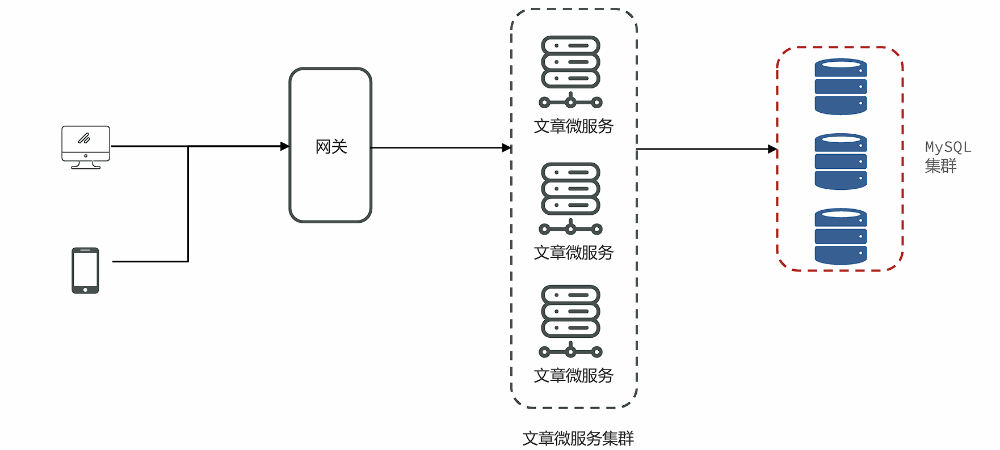

**解决思路**：

1. 服务出现OOM内存溢出时，生成内存快照。

2. 使用MAT分析内存快照，找到内存溢出的对象。

3. 尝试在开发环境中**重现问题**，分析代码中问题产生的原因。

4. 修改代码。

5. 测试并验证结果。
   
   

**问题根源**：

文章微服务中的分页接口没有限制最大单次访问条数，并且单个文章对象占用的内存量较大，在业务高峰期并发量较大时这部分从数据库获取到内存之后会占用大量的内存空间。


**可行方案**：

- 与产品设计人员沟通，限制最大的单次访问条数。

- 分页接口如果只是为了展示文章列表，不需要获取文章内容，可以大大减少对象的大小。

- 在高峰期对微服务进行限流保护。
  
---

#### 案例二：Mybatis导致的内存溢出

**背景**：文章微服务进行了升级，新增加了一个判断id是否存在的接口，第二天业务高峰期再次出现了内存溢出，判断应该和新增加的接口有关系。


**解决思路**：

1. 服务出现OOM内存溢出时，生成内存快照。

2. 使用MAT分析内存快照，找到内存溢出的对象。

3. 尝试在开发环境中重现问题，分析代码中问题产生的原因。

4. 修改代码。

5. 测试并验证结果。
   
   

**问题根源**：

Mybatis在使用foreach进行sql拼接时，会在内存中创建对象，如果foreach处理的数组或者集合元素个数过多，会占用大量的内存空间。


**可行方案**：

- 限制参数中最大的id个数。

- 将id缓存到redis或者内存缓存中，通过缓存进行校验。

---
  
#### 案例三：导出大文件内存溢出

**背景**：某个管理系统支持几十万条数据的excel文件导出。但测试发现系统在运行时如果有几十个人同时进行大数据量的导出，会出现内存溢出。

该团队使用的是**k8s**将管理系统部署到了容器中，所以使用阿里云的k8s环境还原场景，并解决问题。阿里云的k8s整体规划如下：

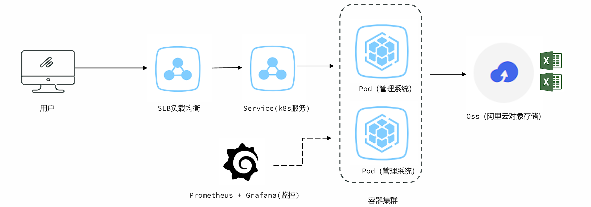


**问题根源**：

Excel文件导出如果使用POI的XSSFWorkbook，在大数据量（几十万）的情况下会占用大量的内存。


**可行方案**:

- 使用poi的SXSSFWorkbook。

- `hutool`提供的BigExcelWriter减少内存开销。（服务器大内存推荐）

- 使用`easy excel`，对内存进行了大量的优化。（服务器小内存推荐，占用内存小，耗时长）
  
---

#### 案例四：ThreadLocal使用时占用大量内存

**背景**：某个微服务系统在没有任何用户使用时，也占用了大量的内存。导致可以使用的内存大大减少。

**问题根源**：

很多微服务会选择在拦截器`preHandle`方法中去解析请求头中的数据，并放入一些数据到`ThreadLocal`中方便后续使用。

**可行方案**：

在拦截器的`afterCompletion`方法中，必须要将`ThreadLocal`中的数据清理掉。

---

#### 案例五：文章内容审核接口的内存问题

**背景**：文章微服务中提供了文章审核接口，会调用阿里云的内容安全接口进行文章中文字和图片的审核，在测试过程中出现内存占用较大的问题。

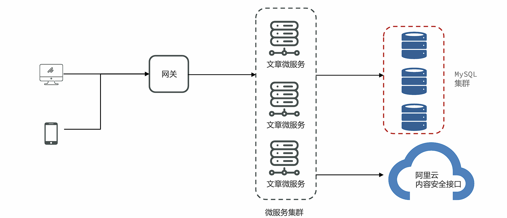

**可行方案**：


**方案一**：使用SpringBoot中的@Async注解进行**异步**的审核。

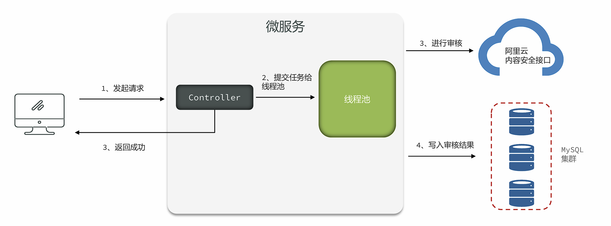

**存在问题**：
 
1. 线程池参数设置不当，会导致大量线程的创建或者队列中保存大量的数据。

2. 任务没有持久化，一旦走线程池的拒绝策略或者服务宕机、服务器掉电等情况很有可能会丢失任务。

<br>

**方案二**：使用生产者和消费者模式进行处理，队列数据可以实现持久化到数据库。

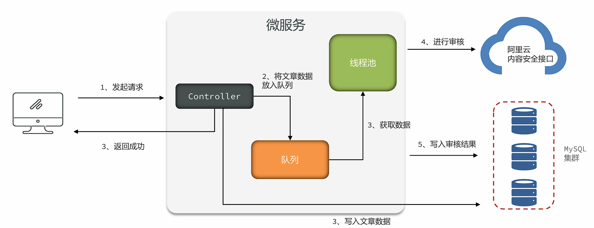

**存在问题**：

1. 队列参数设置不正确，会保存大量的数据。

2. 实现复杂，需要自行实现持久化的机制，否则数据会丢失。

<br>

**方案三**：使用`mq`消息队列进行处理，由`mq`来保存文章的数据。发送消息的服务和拉取消息的服务可以是同一个，也可以不是同一个。（推荐）

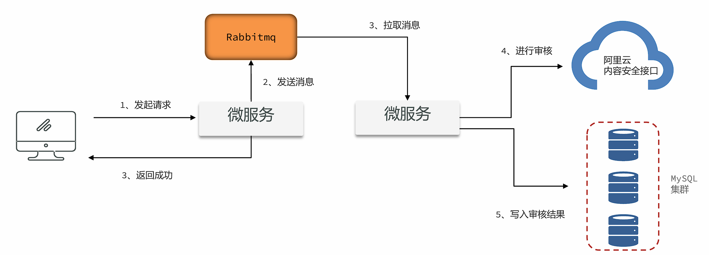


**问题根源**：

在项目中如果要使用异步进行业务处理，或者实现**生产者–消费者**的模型，如果在Java代码中实现，会占用大量的内存去保存中间数据。

**解决思路**：

尽量使用Mq消息队列，可以很好地将中间数据单独进行保存，不会占用Java的内存。同时也可以将生产者和消费者拆分成不同的微服务。


---

## GC调优

GC调优指的是对垃圾回收（Garbage Collection）进行调优。GC调优的主要目标是避免由垃圾回收引起程序性能下降。


GC调优的核心分成三部分：

✓ 1、通用JVM参数的设置。

✓ 2、特定垃圾回收器的JVM参数的设置。

✓ 3、解决由频繁的full GC引起的程序性能问题。

<br>

### GC调优指标

判断GC是否需要调优，需要从三方面来考虑，与GC算法的评判标准类似：

1. **吞吐量**(Throughput) 吞吐量分为业务吞吐量和垃圾回收吞吐量业务吞吐量指的在一段时间内，程序需要完成的业务数量。
   
    比如企业中对于吞吐量的要求可能会是这样的：

    - 支持用户每天生成10000笔订单

    - 在晚上8点到10点，支持用户查询50000条商品信息
    
    

    保证高吞吐量的常规手段有两条：

    - 优化业务执行性能，减少单次业务的执行时间

    - 优化垃圾回收吞吐量


2. **延迟**指的是从用户发起一个请求到收到响应这其中经历的时间。

    比如企业中对于延迟的要求可能会是这样的：

    - 所有的请求必须在5秒内返回给用户
        结果延迟 = GC延迟+ 业务执行时间，所以如果GC时间过长，会影响到用户的使用。
     
     

3. **内存使用量**指的是Java应用占用系统内存的最大值，一般通过JVM参数调整，在满足上述两个指标的前提下，这个值越小越好。
   
   

### 发现问题

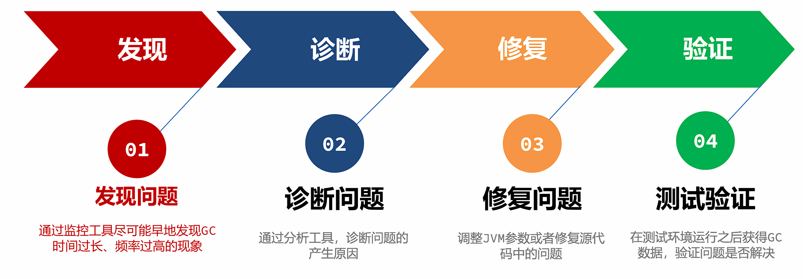

#### jstat工具

- **Jstat**工具是JDK自带的一款监控工具，可以提供各种垃圾回收、类加载、编译信息等不同的数据。

- 使用方法为：`jstat -gc 进程ID` 每次统计的间隔（毫秒）统计次数

!!!tip "jstat -gc 输出参数说明"

    - C代表Capacity容量，U代表Used使用量

    - S –幸存者区，E –伊甸园区，O –老年代，M –元空间

    - YGC、YGT：年轻代GC次数和GC耗时（单位：秒）

    - FGC、FGCT：Full GC次数和Full GC耗时

    - GCT：GC总耗时

**优点**：

- 操作简单

- 无额外的软件安装

**缺点**：

- 无法精确到GC产生的时间，只能用于判断GC是否存在问题
  
<br>

#### visualvm插件

**VisualVm**中提供了一款**Visual GC**插件，实时监控Java进程的堆内存结构、堆内存变化趋势以及垃圾回收时间的变化趋势。同时还可以监控对象晋升的直方图。


**优点**：

- 适合开发使用，能直观的看到堆内存和GC的变化趋势

**缺点**：

- 对程序运行性能有一定影响

- 生产环境程序员一般没有权限进行操作
  
<br>

#### Prometheus + Grafana

- Prometheus+Grafana是企业中运维常用的监控方案，其中Prometheus用来采集系统或者应用的相关数据，同时具备告警功能。Grafana可以将Prometheus采集到的数据以可视化的方式进行展示。

- 开发人员要学会如何读懂Grafana展示的Java虚拟机相关的参数。
  
<br>

#### GC日志

- 通过GC日志，可以更好的看到垃圾回收细节上的数据，同时也可以根据每款垃圾回收器的不同特点更好地发现存在的问题。

- 使用方法（JDK 8及以下）：`-XX:+PrintGCDetails -Xloggc:文件名`

- 使用方法（JDK 9+）：`-Xlog:gc*:file=文件名`
  
<br>

#### GC Viewer

- GCViewer是一个将GC日志转换成可视化图表的小工具，地址： [github](https://github.com/chewiebug/GCViewer)

- 使用方法：`java -jar gcviewer_1.3.4.jar 日志文件.log`
  
<br>

#### GCeasy

- GCeasy是业界首款使用AI机器学习技术在线进行GC分析和诊断的工具。定位内存泄漏、GC延迟高的问题，提供JVM参数优化建议，支持在线的可视化工具图表展示。

- 官方网站：[GCeasy](https://gceasy.io/)
  
<br>

#### 常见的GC模式

- **正常情况**——特点：呈现锯齿状，对象创建之后内存上升，一旦发生垃圾回收之后下降到底部，并且每次下降之后的内存大小接近，存留的对象较少。

- **缓存对象过多**——特点：呈现锯齿状，对象创建之后内存上升，一旦发生垃圾回收之后下降到底部，并且每次下降之后的内存大小接近，处于**比较高的位置**。
  
    !!!note "问题产生原因"
        程序中保存了大量的缓存对象，导致GC之后无法释放，可以使用MAT或者HeapHero分析内存占用的原因。

- **内存泄漏**——特点：呈现锯齿状，每次垃圾回收之后下降到的内存**位置越来越高**，最后由于垃圾回收无法释放空间导致对象无法分配产生OutOfMemory的错误。
  
    !!!note "问题产生原因"
        程序中保存了大量的内存泄漏对象，导致GC之后无法释放，可以使用MAT或者HeapHero进行分析是哪些对象产生了内存泄漏。

- **持续的FullGC**——特点：在某个时间点产生多次Full GC，CPU使用率同时飙高，用户请求基本无法处理。一段时间之后恢复正常。
  
    !!!note "问题产生原因"
        在该时间范围请求量激增，程序开始生成更多对象，同时垃圾收集无法跟上对象创建速率，导致持续地在进行FULL GC。

- **元空间不足导致的FULLGC**——特点：堆内存的大小并不是特别大，但是持续发生FULLGC。

    !!!note "问题产生原因"
        元空间大小不足，导致持续full GC回收元空间的数据。

---

### 解决GC问题的手段

1. 优化基础JVM参数
   
    > 基础JVM参数的设置不当，会导致频繁FULLGC的产生
   
   

2. 减少对象产生
   
    > 大多数场景下的FULLGC是由于对象产生速度过快导致的，减少对象产生可以有效的缓解FULLGC的发生
   
   

3. 更换垃圾回收器
   
    > 选择适合当前业务场景的垃圾回收器，减少延迟、提高吞吐量
   
   

4. 优化垃圾回收器参数
   
    > 优化垃圾回收器的参数，能在一定程度上提升GC效率

---

#### 优化基础JVM参数

◼ 参数1 ：` -Xmx` 和 `–Xms`

`-Xmx`参数设置的是最大堆内存，但是由于程序是运行在服务器或者容器上，计算可用内存时，要将元空间、操作系统、其它软件占用的内存排除掉。

案例： 服务器内存4G，**操作系统+元空间最大值+其它软件** 占用1.5G，-Xmx可以设置为2g。

最合理的设置方式应该是根据最大并发量估算服务器的配置，然后再根据服务器配置计算最大堆内存的值。


`-Xms`用来设置初始堆大小，建议将`-Xms`设置的和`-Xmx`**一样大**，有以下几点好处：

✓ 运行时性能更好，堆的扩容是需要向操作系统申请内存的，这样会导致程序性能短期下降。

✓ 可用性问题，如果在扩容时其他程序正在使用大量内存，很容易因为操作系统内存不足分配失败。

✓ 启动速度更快，Oracle官方文档的原话：如果初始堆太小，Java 应用程序启动会变得很慢，因为 JVM 被迫频繁执行垃圾收集，直到堆增长到更合理的大小。为了获得最佳启动性能，请将初始堆大小设置为与最大堆大小相同。


◼ 参数2 ：` -XX:MaxMetaspaceSize` 和 `–XX:MetaspaceSize`

`-XX:MaxMetaspaceSize=值` 参数指的是最大元空间大小，默认值比较大，如果出现元空间内存泄漏会让操作系统可用内存不可控，建议根据测试情况设置最大值，一般设置为256m。

`-XX:MetaspaceSize=值` 参数指的是到达这个值之后会触发FULLGC[阈值]（网上很多文章的初始元空间大小是错误的），后续什么时候再触发JVM会自行计算。如果设置为和MaxMetaspaceSize一样大，就不会FULLGC，但是对象也无法回收。


◼ 参数3 ： `-Xss`虚拟机栈大小

如果我们不指定栈的大小，JVM 将创建一个具有默认大小的栈。大小取决于操作系统和计算机的体系结构。

比如Linux x86 64位 ： 1MB，如果不需要用到这么大的栈内存，完全可以将此值调小节省内存空间，合理值为256k – 1m之间。

使用：-Xss256k


◼ 参数4 ： **不建议手动设置**的参数

由于JVM底层设计极为复杂，一个参数的调整也许让某个接口得益，但同样有可能影响其他更多接口。

- `-Xmn` 年轻代的大小，默认值为整个堆的1/3，可以根据峰值流量计算最大的年轻代大小，尽量让对象只存放在年轻代，不进入老年代。
  但是实际的场景中，接口的响应时间、创建对象的大小、程序内部还会有一些定时任务等不确定因素都会导致这个值的大小并不能仅凭计算得出，如果设置该值要进行大量的测试。
  G1垃圾回收器尽量不要设置该值，G1会动态调整年轻代的大小。

- `‐XX:SurvivorRatio` 伊甸园区和幸存者区的大小比例，默认值为8。

- `‐XX:MaxTenuringThreshold` 最大晋升阈值，年龄大于此值之后，会进入老年代。另外JVM有动态年龄判断机制：将年龄从小到大的对象占据的空间加起来，如果大于survivor区域的50%，然后把等于或大于该年龄的对象，放入到老年代。
  
  

◼ 其他参数 ：

- `-XX:+DisableExplicitGC`禁止在代码中使用System.gc()， System.gc()可能会引起FULLGC，在代码中尽量不要使用。使用DisableExplicitGC参数可以禁止使用System.gc()方法调用。

- `-XX:+HeapDumpOnOutOfMemoryError`：发生OutOfMemoryError错误时，自动生成hprof内存快照文件。

- `-XX:HeapDumpPath=<path>`:：指定hprof文件的输出路径。

- 打印GC日志
  JDK8及之前 ： `-XX:+PrintGCDetails -XX:+PrintGCDateStamps -Xloggc:文件路径`
  JDK9及之后 ： `-Xlog:gc*:file=文件路径`
  
---

##### JVM参数模板

```bash
-Xms1g
-Xmx1g
-Xss256k
-XX:MaxMetaspaceSize=512m 
-XX:+DisableExplicitGC
-XX:+HeapDumpOnOutOfMemoryError
-XX:HeapDumpPath=/opt/logs/my-service.hprof
-XX:+PrintGCDetails
-XX:+PrintGCDateStamps
-Xloggc:文件路径
```

!!!warning "注意"
    JDK9及之后gc日志输出修改为 -Xlog:gc*:file=文件名

    堆内存大小和栈内存大小根据实际情况灵活调整。


---


## 性能调优

本小节着重学习发现问题和诊断问题的方法，目标是准确定位到性能问题的根源。


应用程序在运行过程中经常会出现性能问题，比较常见的性能问题现象是：

1. 通过top命令查看CPU占用率高，接近100甚至多核CPU下超过100都是有可能的。

2. 请求单个服务处理时间特别长，多服务使用skywalking等监控系统来判断是哪一个环节性能低下。

3. 程序启动之后运行正常，但是在运行一段时间之后无法处理任何的请求（内存和GC正常）。
   
   

### 线程转储的查看方式

线程转储（Thread Dump）提供了对所有运行中的线程当前状态的快照。

线程转储可以通过jstack、visualvm等工具获取。其中包含了线程名、优先级、线程ID、线程状态、线程栈信息等等内容，可以用来解决**CPU占用率高、死锁**等问题。


线程转储中的几个核心内容：

- 名称： 线程名称，通过给线程设置合适的名称更容易“顾名思义” 

- 优先级（prio）：线程的优先级

- Java ID（tid）：JVM中线程的唯一ID 

- 本地 ID (nid)：操作系统分配给线程的唯一ID 

- 状态：线程的状态，分为：
  
    - NEW – 新创建的线程，尚未开始执行

    - RUNNABLE –正在运行或准备执行

    - BLOCKED – 等待获取监视器锁以进入或重新进入同步块/方法

    - WAITING – 等待其他线程执行特定操作，没有时间限制

    - TIMED_WAITING – 等待其他线程在指定时间内执行特定操作

    - TERMINATED – 已完成执行

- 栈追踪： 显示整个方法的栈帧信息
  
!!!tip
    有关线程状态的详细部分，可查看 并发编程部分的笔记

线程转储的可视化在线分析平台：

1. [https://jstack.review](https://jstack.review/)

2. [https://fastthread.io](https://fastthread.io/)


---

### 案例1：CPU占用率高问题的解决方案

**问题背景**：监控人员通过prometheus的告警发现CPU占用率一直处于很高的情况，通过top命令看到是由于Java程序引起的，希望能快速定位到是哪一部分代码导致了性能问题。

解决思路：

1. 通过`top –c` 命令找到CPU占用率高的进程，获取它的进程ID。(Linux)

2. 使用`top -p 进程ID` 单独监控某个进程，按H(大写)可以查看到所有的线程以及线程对应的CPU使用率，找到CPU使用率特别高的线程（记住线程ID）。

3. 使用` jstack 进程ID` 命令可以查看到所有线程正在执行的栈信息。使用 `jstack进程ID > 文件名` 保存到文件中方便查看。

4. 找到nid与线程ID相同的栈信息，需要将之前记录下的十进制线程号转换成16进制。通过 `printf ‘%x\n’ 线程ID` 命令直接获得16进制下的线程ID。

5. 找到栈信息对应的源代码，并分析问题产生原因。

<br>

### 案例2：接口响应时间很长的问题

**问题背景**：在程序运行过程中，发现有几个接口的响应时间特别长，需要快速定位到是哪一个方法的代码执行过程中出现了性能问题。


> 已经确定是某个接口性能出现了问题，但是由于方法嵌套比较深，需要借助于`arthas`定位到具体的方法。


使用arthas的`trace`命令，可以展示出整个方法的调用路径以及每一个方法的执行耗时。

命令： `trace 类名 方法名`

- 添加 `--skipJDKMethod false` 参数可以输出JDK核心包中的方法及耗时。

- 添加 `'#cost > 毫秒值'` 参数，只会显示耗时超过该毫秒值的调用。

- 添加 `–n 数值` 参数，最多显示该数值条数的数据。

- 所有监控都结束之后，输入`stop`结束监控，重置arthas增强的对象。
  
<br>

在使用trace定位到性能较低的方法之后，使用`watch`命令监控该方法，可以获得更为详细的方法信息。

命令：` watch 类名 方法名 ‘{params, returnObj}’ ‘#cost>毫秒值' -x 2`

- `‘{params, returnObj}‘ `代表打印参数和返回值。

- `-x` 代表打印的结果中如果有嵌套（比如对象里有属性），最多只展开2层。允许设置的最大值为4。
  
<br>

### 案例3：定位偏底层的性能问题

**问题背景**：有一个接口中使用了for循环向ArrayList中添加数据，但是最终发现执行时间比较长，需要定位是由于什么原因导致的性能低下。


思路：

Arthas提供了**性能火焰图**的功能，可以非常直观地显示所有方法中哪些方法执行时间比较长。


Arthas的profile命令(Windows不支持)

使用arthas的profile命令，生成性能监控的火焰图。

命令1： `profiler star`t 开始监控方法执行性能

命令2： `profiler stop --format html` 以HTML的方式生成火焰图火焰图中一般找绿色部分Java中栈顶上比较平的部分，很可能就是性能的瓶颈。

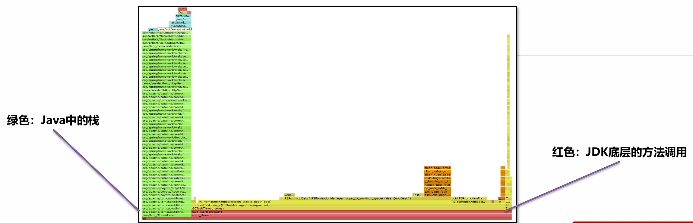

偏底层的性能问题，特别是由于JDK中某些方法被大量调用导致的性能低下，可以使用火焰图非常直观的找到原因。

这个案例中是由于创建ArrayList时没有手动指定容量，导致使用默认的容量而在添加对象过程中发生了多次的**扩容**，扩容需要将原来数组中的元素复制到新的数组中，消耗了大量的时间。通过火焰图可以看到大量的调用，修复完之后节省了20% ~ 50%的时间。

<br>

### 案例4：线程被耗尽问题

**问题背景**：程序在启动运行一段时间之后，就无法处理任何请求了。将程序重启之后继续运行，依然会出现相同的情况。


**解决思路**：

线程耗尽问题，一般是由于执行时间过长，分析方法分成两步：

- 检测是否有**死锁**产生，无法自动解除的死锁会将线程永远阻塞。

- 如果没有死锁，再使用案例1的打印线程栈的方法检测线程正在执行哪个方法，一般这些大量出现的方法就是慢方法。
  

<br>

线程死锁可以通过三种方法**定位问题**：

1. `jstack-l 进程ID > 文件名` 将线程栈保存到本地。在文件中*搜索*`deadlock`即可找到死锁位置。

2. 开发环境中使用visual vm或者Jconsole工具，都可以检测出死锁。使用线程快照生成工具就可以看到死锁的根源。生产环境的服务一般不会允许使用这两种工具连接。

3. 使用[fastthread](https://fastthread.io/)自动检测线程问题。 

    !!!tip
        Fastthread和Gceasy类似，是一款在线的AI自动线程问题检测工具，可以提供线程分析报告。通过报告查看是否存在死锁问题。
   
---

### JMH

问：你是如何判断一个方法需要耗时多少时间的？

答：我会在方法上打印开始时间和结束时间，他们的差值就是方法的执行耗时。手动通过postman或者jmeter发起请求，在控制台上看输出的时间。

!!!danger "注意"
    这样做是不准确的

    第一测试时有些对象创建是**懒加载**的，所以会影响第一次的请求时间

    第二虚拟机中**JIT即时编译器**会优化你的代码

    所以这个测试得出的时间并不一定是最终用户处理的时间。
    
    *Java程序在运行过程中，JIT即时编译器会实时对代码进行性能优化，所以仅凭少量的测试是无法真实反应运行系统最终给用户提供的性能。*


OpenJDK中提供了一款叫`JMH`（Java Microbenchmark Harness）的工具，可以准确地对Java代码进行基准测试，量化方法的执行性能。

官网地址： [JMH](https://github.com/openjdk/jmh)

JMH会首先执行预热过程，确保JIT对代码进行优化之后再进行真正的迭代测试，最后输出测试的结果。


JMH环境搭建：

1. 创建基准测试项目，在CMD窗口中，使用以下命令创建JMH环境项目：

```shell
 mvn archetype:generate \
 -DinteractiveMode=false \
 -DarchetypeGroupId=org.openjdk.jmh \
 -DarchetypeArtifactId=jmh-java-benchmark-archetype \
 -DgroupId=org.sample \
 -DartifactId=test \
 -Dversion=1.0
```

2. 修改POM文件中的JDK版本号和JMH版本号，JMH最新版本号参考Github。

3. 编写测试方法，几个需要注意的点：
  
    - 死代码问题（无用代码，JIT会跳过不执行）

    - 黑洞的用法（黑洞消费，避免死代码产生）

4. 通过maven的verify命令，检测代码问题并打包成jar包。

5. 通过`java -jar target/benchmarks.jar` 命令执行基准测试。

6. 测试结果通过 [https://jmh.morethan.io/](https://jmh.morethan.io/) 生成可视化的结果。

<br>

案例 ：日期格式化方法性能测试

1. Date对象使用的SimpleDateFormatter是线程不安全的，所以每次需要重新创建对象或者将对象放入ThreadLocal中进行保存。其中每次重新创建对象性能比较差，将对象放入ThreadLocal之后性能相对还是比较好的。

2. LocalDateTime对象使用的DateTimeFormatter线程安全，并且性能较好，如果能将DateTimeFormatter对象保存下来，性能可以得到进一步的提升。
   
--- 

### 综合案例

小李的项目中有一个获取用户信息的接口性能比较差，他希望能对这个接口在代码中进行彻底的优化，提升性能。

接口代码优化过程如下（首先需要使用arthas找到接口耗时长的原因）：

```java
//初始代码
public List<UserVO> user1(){
    //1.从数据库获取前端需要的详情数据
    List<UserDetails> userDetails = userService.getUserDetails();

    //2.获取缓存中的用户数据
    List<User> users = userService.getUsers();

    SimpleDateFormat simpleDateFormat = new SimpleDateFormat("yyyy-MM-dd HH:mm:ss");
    //3.遍历详情集合，从缓存中获取用户名，生成VO进行填充
    ArrayList<UserVO> userVOS = new ArrayList<>();
    for (UserDetails userDetail : userDetails) {
        UserVO userVO = new UserVO();
        //可以使用BeanUtils对象拷贝
        userVO.setId(userDetail.getId());
        userVO.setRegister(simpleDateFormat.format(userDetail.getRegister2()));
        //填充name
        for (User user : users) {
            if(user.getId().equals(userDetail.getId())){
                userVO.setName(user.getName());
            }
        }
        //加入集合
        userVOS.add(userVO);
    }

    return userVOS;

}


//使用HasmMap存放用户名字
public List<UserVO> user2(){
    //1.从数据库获取前端需要的详情数据
    List<UserDetails> userDetails = userService.getUserDetails();

    //2.获取缓存中的用户数据
    List<User> users = userService.getUsers();
    //将list转换成hashmap
    HashMap<Long, User> map = new HashMap<>();
    for (User user : users) {
        map.put(user.getId(),user);
    }

    SimpleDateFormat simpleDateFormat = new SimpleDateFormat("yyyy-MM-dd HH:mm:ss");
    //3.遍历详情集合，从缓存中获取用户名，生成VO进行填充
    ArrayList<UserVO> userVOS = new ArrayList<>();
    for (UserDetails userDetail : userDetails) {
        UserVO userVO = new UserVO();
        //可以使用BeanUtils对象拷贝
        userVO.setId(userDetail.getId());
        userVO.setRegister(simpleDateFormat.format(userDetail.getRegister2()));
        //填充name
        userVO.setName(map.get(userDetail.getId()).getName());
        //加入集合
        userVOS.add(userVO);
    }

    return userVOS;

}


//优化日期格式化
public List<UserVO> user3(){
    //1.从数据库获取前端需要的详情数据
    List<UserDetails> userDetails = userService.getUserDetails();

    //2.获取缓存中的用户数据
    List<User> users = userService.getUsers();
    //将list转换成hashmap
    HashMap<Long, User> map = new HashMap<>();
    for (User user : users) {
        map.put(user.getId(),user);
    }

    //3.遍历详情集合，从缓存中获取用户名，生成VO进行填充
    ArrayList<UserVO> userVOS = new ArrayList<>();
    for (UserDetails userDetail : userDetails) {
        UserVO userVO = new UserVO();
        //可以使用BeanUtils对象拷贝
        userVO.setId(userDetail.getId());
        userVO.setRegister(userDetail.getRegister().format(formatter));
        //填充name
        userVO.setName(map.get(userDetail.getId()).getName());
        //加入集合
        userVOS.add(userVO);
    }

    return userVOS;

}


//使用stream流改写for循环
public List<UserVO> user4(){
    //1.从数据库获取前端需要的详情数据
    List<UserDetails> userDetails = userService.getUserDetails();

    //2.获取缓存中的用户数据
    List<User> users = userService.getUsers();
    //将list转换成hashmap
    Map<Long, User> map = users.stream().collect(Collectors.toMap(User::getId, o -> o));

    //3.遍历详情集合，从缓存中获取用户名，生成VO进行填充
    return userDetails.stream().map(userDetail -> {
        UserVO userVO = new UserVO();
        //可以使用BeanUtils对象拷贝
        userVO.setId(userDetail.getId());
        userVO.setRegister(userDetail.getRegister().format(formatter));
        //填充name
        userVO.setName(map.get(userDetail.getId()).getName());
        return userVO;
    }).collect(Collectors.toList());

}

//使用并行流优化性能
public List<UserVO> user5(){
    //1.从数据库获取前端需要的详情数据
    List<UserDetails> userDetails = userService.getUserDetails();

    //2.获取缓存中的用户数据
    List<User> users = userService.getUsers();
    //将list转换成hashmap
    Map<Long, User> map = users.parallelStream().collect(Collectors.toMap(User::getId, o -> o));

    //3.遍历详情集合，从缓存中获取用户名，生成VO进行填充
    return userDetails.parallelStream().map(userDetail -> {
        UserVO userVO = new UserVO();
        //可以使用BeanUtils对象拷贝
        userVO.setId(userDetail.getId());
        userVO.setRegister(userDetail.getRegister().format(formatter));
        //填充name
        userVO.setName(map.get(userDetail.getId()).getName());
        return userVO;
    }).collect(Collectors.toList());

}
```
!!!warning "注意"
    在大多数情况下，对于简单的遍历操作，传统的 for 循环性能通常更好（尤其是在数据量小的情况下）。
    
    但 Stream 的真正优势不在于极致的微秒级性能，而在于更高的抽象层次、可读性、可维护性，以及在处理复杂数据操作和并行化方面的巨大潜力。

---

**上一节**： [JVM基础](JVM-base.md)