# JVM原理

## 栈上的数据存储

### Java虚拟机中的基本数据类型

## Java中的8大基本数据类型

| 数据类型 | 内存占用(字节数) | 数据范围 |
|----------|------------------|----------|
| **整型** | | |
| byte | 1 | -128~127 |
| short | 2 | -32768~32767 |
| **int(默认)** | **4** | **-2147483648~2147483647 (10位数，大概21亿多)** |
| long | 8 | -9223372036854775808 ~ 9223372036854775807 <br>(19位数) |
| **浮点型(小数)** | | |
| float | 4 | 1.401298 E -45 到 3.402835 E +38 |
| **double(默认)** | **8** | **4.9000000 E -324 到1.797693 E +308** |
| **字符型** | | |
| char | 2 | 0-65535 |
| **布尔型** | | |
| boolean | 1 | true, false |

!!! note "重要说明"
    - **int** 是整型的默认类型
    - **double** 是浮点型的默认类型
    - 这里的内存占用，指的是堆上或者数组中内存分配的空间大小，栈上的实现更加复杂

!!! tip "数据类型选择建议"
    - **整数运算**：优先使用 `int`，超出范围时使用 `long`
    - **小数运算**：优先使用 `double`，内存敏感时考虑 `float`
    - **字符存储**：使用 `char` 存储单个字符（支持Unicode）
    - **逻辑判断**：使用 `boolean` 存储真假值

!!! warning "注意事项"
    - `byte` 和 `short` 在运算时会自动提升为 `int` 类型
    - `float` 类型的字面量需要加 `f` 后缀，如 `3.14f`
    - `long` 类型的字面量建议加 `L` 后缀，如 `123456789L`
    - `char` 类型可以参与数学运算，会自动转换为对应的ASCII值

### Java中的8大数据类型在虚拟机中的实现

| 数据类型 | 堆内存占用(字节数) | 栈中slot数 | 虚拟机内部符号 |
|----------|-------------------|------------|----------------|
| byte | 1 | 1 | B |
| short | 2 | 1 | S |
| int | 4 | 1 | I |
| long | 8 | 2 | J |
| float | 4 | 1 | F |
| double | 8 | 2 | D |
| char | 2 | 1 | C |
| boolean | 1 | 1 | Z |

!!! info "虚拟机实现细节"
    - **堆内存占用**：对象在堆中存储时占用的字节数
    - **栈中slot数**：在栈帧的局部变量表中占用的slot槽位数量
    - **虚拟机内部符号**：JVM内部用于标识数据类型的单字符符号

!!! important "关键特点"
    - `long` 和 `double` 类型占用 **2个slot**，其他类型都占用 **1个slot**
    - slot是JVM栈帧中局部变量表的基本存储单位
    - 虚拟机内部符号用于字节码指令和类型描述符中

!!! tip "实际应用"
    **在字节码指令中的体现：**
    
    - `iload`: 加载int类型数据 (I)
    - `lload`: 加载long类型数据 (J) 
    - `fload`: 加载float类型数据 (F)
    - `dload`: 加载double类型数据 (D)
    - `aload`: 加载引用类型数据 (A)
    
    **在方法描述符中的使用：**
    
    - `(IJ)D`: 参数为int和long，返回double
    - `([B)V`: 参数为byte数组，无返回值
    - `(ZC)Z`: 参数为boolean和char，返回boolean

!!! warning "性能考虑"
    - `long` 和 `double` 在32位系统上的操作不是原子的
    - 占用2个slot的类型在局部变量表中需要连续的两个位置
    - 在并发环境下，对64位数据类型的读写需要特别注意线程安全


!!!question "boolean、byte、char、short在栈上是不是存在空间浪费？"
    是的，Java虚拟机采用的是空间换时间方案，在栈上不存储具体的类型，只根据slot槽进行数据的处理，浪费了一些内存空间但是避免不同数据类型不同处理方式带来的时间开销。

    同时，像long型在**64位**系统中占用2个slot，使用了16字节空间，但实际上在Hotspot虚拟机中，它的高8个字节没有使用，这样就满足了long型使用8个字节的需要。

    32位机器：1个槽4字节

    64位机器：1个槽8字节

<br>

### boolean在栈上的存储方式

在Java虚拟机中栈上boolean类型保存方式与int类型相同，所以它的值如果是1代表true，如果是0代表false。但是我们可以通过修改字节码文件，让它的值超过1。


!!!question "栈中的数据要保存到堆上或者从堆中加载到栈上时怎么处理？"
    1. 堆中的数据加载到栈上，由于栈上的空间大于或者等于堆上的空间，所以直接处理但是需要注意**符号位**。

        - boolean、char为无符号，低位复制，高位补0

        - byte、short为有符号，低位复制，高位非负则补0，负则补1

    2. 栈中的数据要保存到堆上，byte、char、short由于堆上存储空间较小，需要将高位去掉。boolean比较特殊，只取低位的最后一位保存。

---

## 对象在堆上是如何存储的

### 对象在堆中的内存布局

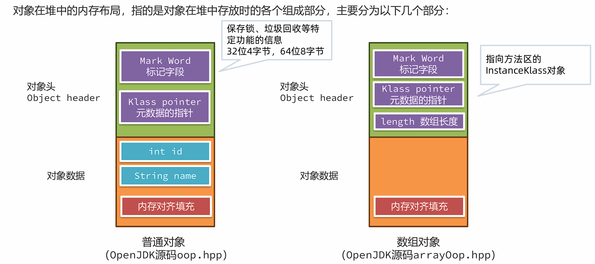


#### 标记字段

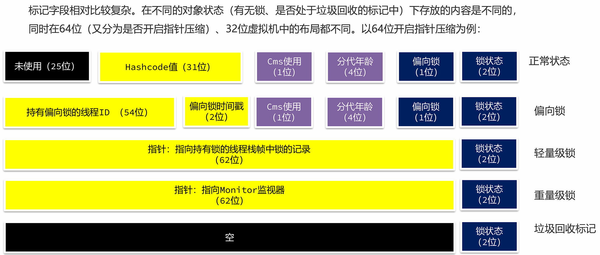

!!!tip "JOL"
    JOL是用于分析 JVM 中对象布局的一款专业工具。工具中使用 Unsafe、JVMTI 和 Serviceability Agent (SA)等虚拟机技术来打印实际的对象内存布局。

    ```xml
    <dependency>
        <groupId>org.openjdk.jol</groupId>
        <artifactId>jol-core</artifactId>
        <version>0.9</version>
    </dependency>
    ```

    ```java
    System.out.println(ClassLayout.parseInstance(对象).toPrintable());
    ```


#### 指针压缩

在64位的Java虚拟机中，Klass Pointer以及对象数据中的对象引用都需要占用8个字节，为了减少这部分的内存使用量，64 位 Java 虚拟机使用指针压缩技术，将堆中原本 8个字节的 指针压缩成 4个字节，此功能默认开启，可以使用`-XX:-UseCompressedOops`关闭。


指针压缩的思想是将寻址的单位放大，比如原来按1字节去寻址，现在可以按8字节寻址。如下图所示，原来按1去寻址，能拿到1字节开始的数据，现在按1去寻址，就可以拿到8个字节开始的数据。

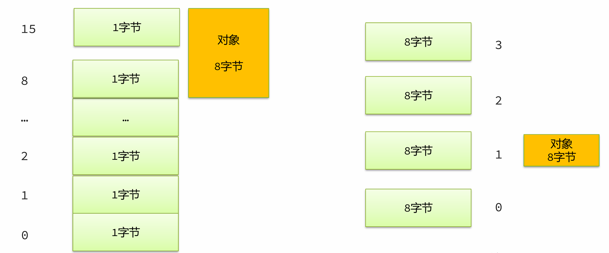


这样将编号当成地址，就可以用更小的内存访问更多的数据。但是这样的做法有两个问题：

1. 需要进行内存对齐，指将对象的内存占用填充至8字节的倍数。存在空间浪费（对于Hotspot来说不存在，即便不开启指针压缩，也需要进行内存对齐）

2. 寻址大小仅仅能支持2的35 次方个字节（32GB，如果超过32GB指针压缩会自动关闭）。不用压缩指针，应该是2的64次方 = 16EB，用了压缩指针就变成了8（字节） = 2的3次方 * 2的32次方 = 2的35次方
   
   

#### 内存对齐

内存对齐主要目的是为了解决并发情况下CPU缓存失效的问题：线程A修改A会影响线程B对B的操作

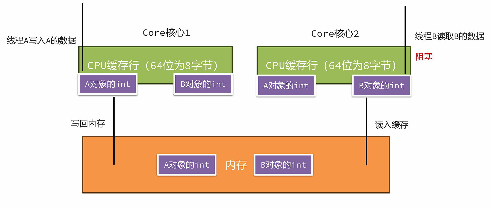

> 内存对齐之后，同一个缓存行中不会出现不同对象的属性。在并发情况下，如果让A对象一个缓存行失效，是不会影响到B对象的缓存行的。


字段重排列:

在Hotspot中，要求每个属性的偏移量Offset（字段地址 – 起始地址）必须是字段长度的N倍。

如果不满足要求，会尝试使用内存对齐，通过在属性之间插入一块对齐区域达到目的。

如下图中，name字段是引用占用8个字节（关闭了指针压缩），所以Offset必须是8的倍数，在age和name之间插入了4个字节的空白区域。

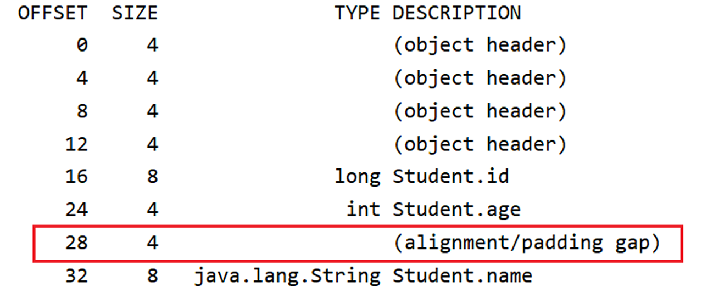

<br>

## 方法调用的原理

方法调用的本质是通过字节码指令的执行，能在栈上创建栈帧，并执行调用方法中的字节码指令。以invoke开头的字节码指令的作用是执行方法的调用。

在JVM中，一共有五个字节码指令可以执行方法调用：

1. invokestatic：调用静态方法。<font color=red>静态绑定</font>

2. invokespecial: 调用对象的private方法、构造方法，以及使用 super 关键字调用父类实例的方法、构造方法，以及所实现接口的默认方法。<font color=red>静态绑定</font>

3. invokevirtual：调用对象的非private方法。非final方法使用<font color=red>动态绑定</font>，使用虚方法表找到方法的地址，子类会复制父类的虚方法表，如果子类重写了方法，会替换成重写后方法的地址。

4. invokeinterface：调用接口对象的方法。<font color=red>动态绑定</font>，使用接口表找到方法的地址，进行调用。

5. invokedynamic：用于调用动态方法，主要应用于lambda表达式中，机制极为复杂了解即可。
   
   

### 静态绑定

1. 编译期间，invoke指令会携带一个参数符号引用，引用到常量池中的方法定义。方法定义中包含了<font color=red>类名 + 方法名 + 返回值 + 参数</font>。

2. 在方法<font color=red>第一次调用</font>时，这些符号引用就会被替换成内存地址的直接引用，这种方式称之为静态绑定。

> 静态绑定适用于处理静态方法、私有方法、或者使用final修饰的方法，因为这些方法不能被继承之后重写。

### 动态绑定

对于非static、非private、非final的方法，有可能存在子类重写方法，那么就需要通过动态绑定来完成方法地址绑定的工作。比如在这段代码中，调用的其实是Cat类对象的eat方法，但是编译完之后虚拟机指令中调用的是Animal类的eat方法，这就需要在运行过程中通过动态绑定找到Cat类的eat方法，这样就实现了多态。

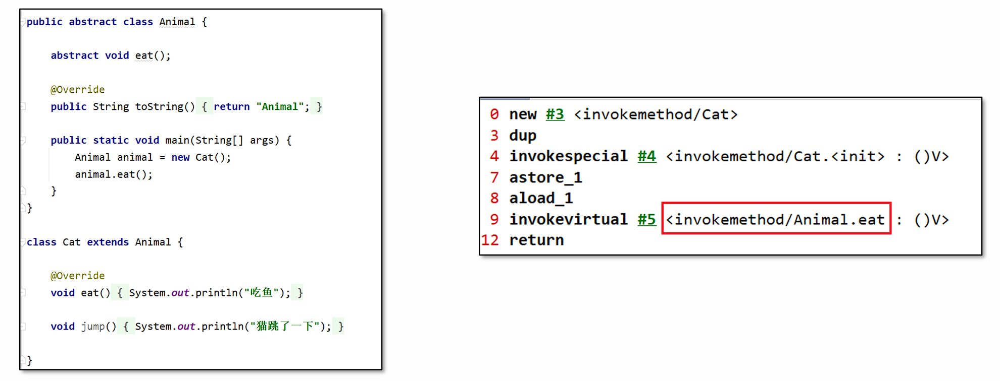


动态绑定是基于方法表来完成的，invokevirtual使用了虚方法表（vtable），invokeinterface使用了接口方法表(itable)，整体思路类似。所以接下来使用invokevirtual和虚方法表来解释整个过程。

每个类中都有一个虚方法表，本质上它是一个数组，记录了方法的地址。子类方法表中包含父类方法表中的所有方法；**子类如果重写了父类方法，则使用自己类中方法的地址进行替换**。

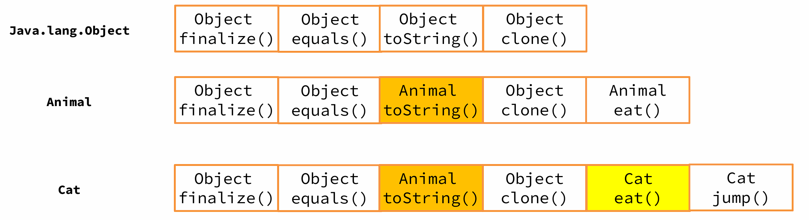

<br>

## 异常捕获的原理

在Java中，程序遇到异常时会向外抛出，此时可以使用try-catch捕获异常的方式将异常捕获并继续让程序按程序员设计好的方式运行。

比如如下代码：在try代码块中如果抛出了Exception对象或者子类对象，则会进入catch分支。异常捕获机制的实现，需要借助于编译时生成的<font color=red>异常表</font>。


异常表在编译期生成，存放的是代码中异常的处理信息，包含了异常捕获的生效范围以及异常发生后跳转到的字节码指令位置。

起始/结束PC：此条异常捕获生效的字节码起始/结束位置。

跳转PC：异常捕获之后，跳转到的字节码位置。


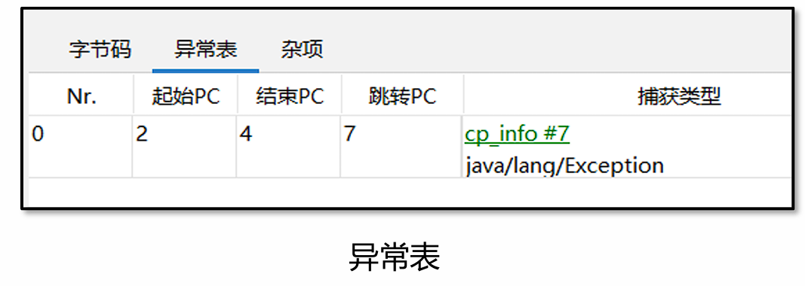


程序运行中触发异常时，Java 虚拟机会从上至下遍历异常表中的所有条目。当触发异常的字节码的索引值在某个异常表条目的监控范围内，Java 虚拟机会判断所抛出的异常和该条目想要捕获的异常是否匹配。

1. 如果匹配，跳转到“跳转PC”对应的字节码位置。

2. 如果遍历完都不能匹配，说明异常无法在当前方法执行时被捕获，此方法栈帧直接弹出，在上一层的栈帧中进行异常捕获的查询。
   
   

finally的处理方式就相对比较复杂一点了，分为以下几个步骤：

1. finally中的字节码指令会插入到try 和 catch代码块中,保证在try和catch执行之后一定会执行finally中的代码。

2. 如果抛出的异常范围超过了Exception，比如Error或者Throwable，此时也要执行finally，所以异常表中增加了两个条目。覆盖了try和catch两段字节码指令的范围，any代表可以捕获所有种类的异常。

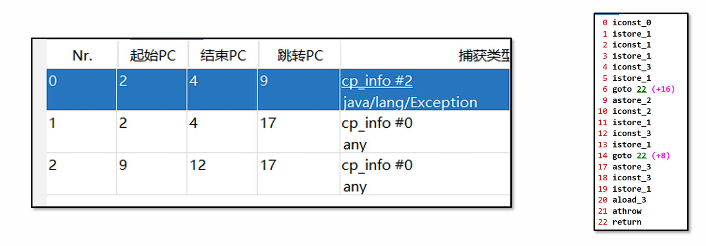

<br>

## JIT即时编译器

在Java中，JIT即时编译器是一项用来提升应用程序代码执行效率的技术。字节码指令被 Java 虚拟机解释执行，如果有一些指令执行频率高，称之为热点代码，这些字节码指令则被JIT即时编译器编译成机器码同时进行一些优化，最后保存在内存中，将来执行时直接读取就可以运行在计算机硬件上了。


在HotSpot中，有三款即时编译器，C1、C2和Graal，其中Graal在GraalVM章节中已经介绍过。

C1编译效率比C2快，但是优化效果不如C2。所以C1适合优化一些执行时间较短的代码，C2适合优化服务端程序中长期执行的代码。


JDK7之后，采用了分层编译的方式，在JVM中C1和C2会一同发挥作用，分层编译将整个优化级别分成了5个等级。

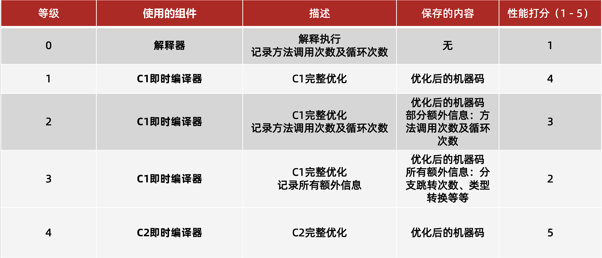


C1即时编译器和C2即时编译器都有独立的线程去进行处理，内部会保存一个队列，队列中存放需要编译的任务。一般即时编译器是针对方法级别来进行优化的，当然也有对循环进行优化的设计。


### C1与C2协作

1. 先由C1执行过程中收集所有运行中的信息，方法执行次数、循环执行次数、分支执行次数等等，然后等待执行次数触发阈值（分层即时编译由JVM动态计算）之后，进入C2即时编译器进行深层次的优化。

2. 方法字节码执行数目过少，先收集信息，JVM判断C1和C2优化性能差不多，那之后转为不收集信息，由C1直接进行优化。

3. C1线程都在忙碌的情况下，直接由C2进行优化。

4. C2线程忙碌时，先由2层C1编译收集一些基础信息，多运行一会儿，然后再交由3层C1处理，由于3层C1处理效率不高，所以尽量减少这一层停留时间（C2忙碌着，一直收集也没有意义），最后C2线程不忙碌了再交由C2进行处理。
   
   

> 分别采用三种不同虚拟机参数测试JIT优化效果：不加参数（开启完全JIT即时编译），-Xint（关闭JIT只使用解释器）、-XX:TieredStopAtLevel=1（分层编译下只使用1层C1进行编译）


### 优化手段-方法内联

方法内联（Method Inline）：方法体中的字节码指令直接复制到调用方的字节码指令中，节省了创建栈帧的开销。

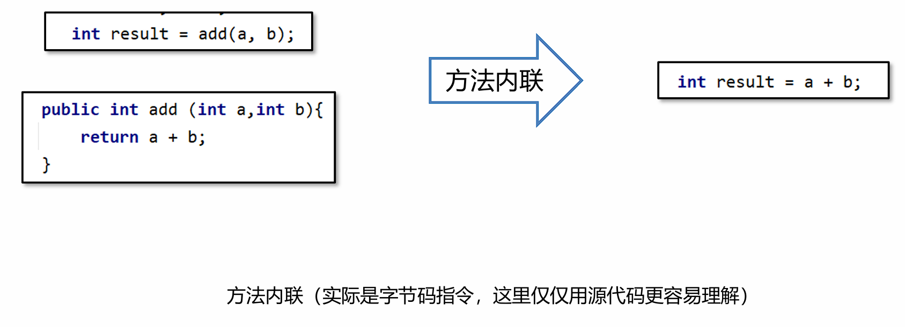

> 使用JIT Watch工具查看方法内联的优化结果
> 
> 安装JIT Watch工具，下载源码： https://github.com/AdoptOpenJDK/jitwatch/tree/1.4.2


方法内联的限制

并不是所有的方法都可以内联，内联有一定的限制：

1. 方法编译之后的字节码指令总大小 < 35字节，可以直接内联。（通过`-XX:MaxInlineSize=值` 控制）

2. 方法编译之后的字节码指令总大小 < 325字节，并且是一个热方法。（通过`-XX:FreqInlineSize=值` 控制）

3. 方法编译生成的机器码不能大于1000字节。（通过`-XX:InlineSmallCode=值` 控制）

4. 一个接口的实现必须小于3个，如果大于三个就不会发生内联。
   
   

### 优化手段-逃逸分析

逃逸分析指的是如果JIT发现在方法内创建的对象不会被外部引用，那么就可以采用锁消除、标量替换等方式进行优化。

#### 锁消除

锁消除指的是如果对象被判断不会逃逸出去，那么在对象就不存在并发访问问题，对象上的锁处理都不会执行，从而提高性能。如：

```java
synchronized (new Test()){}
```

#### 标量替换

逃逸分析真正对性能优化比较大的方式是<font color=red>标量替换</font>，在Java虚拟机中，对象中的基本数据类型称为标量，引用的其他对象称为聚合量。标量替换指的是如果方法中的对象不会逃逸，那么其中的标量就可以直接在栈上分配。


根据JIT即时编器优化代码的特性，在编写代码时注意以下几个事项，可以让代码执行时拥有更好的性能：

1. 尽量编写比较小的方法，让方法内联可以生效。

2. 高频使用的代码，特别是第三方依赖库甚至是JDK中的，如果内容过度复杂是无法内联的，可以自行实现一个特定的优化版本。

3. 注意接口的实现数量，尽量不要超过2个，否则会影响内联的处理。

4. 高频调用的方法中创建对象临时使用，尽量不要让对象逃逸。
   
   

## 垃圾回收器原理

### G1垃圾回收器原理

#### 年轻代回收

1. 新创建的对象会存放在Eden区。当G1判断年轻代区不足（max默认60%），无法分配对象时需要回收时会执行Young GC。

2. 标记出Eden和Survivor区域中的存活对象

3. 根据配置的最大暂停时间选择某些区域将存活对象复制到一个新的Survivor区中（年龄+1），清空这些区域。

4. 后续Young GC时与之前相同，只不过Survivor区中存活对象会被搬运到另一个Survivor区。

5. 当某个存活对象的年龄到达阈值（默认15），将被放入老年代。

6. 部分对象如果大小超过Region的一半，会直接放入老年代，这类老年代被称为Humongous区。比如堆内存是4G，每个Region是2M，只要一个大对象超过了1M就被放入Humongous区，如果对象过大会横跨多个Region。

7. 多次回收之后，会出现很多Old老年代区，此时总堆占有率达到阈值时（`-XX:InitiatingHeapOccupancyPercent`默认45%）会触发混合回收MixedGC。回收所有年轻代和部分老年代的对象以及大对象区。采用复制算法来完成。
   
   

##### 问题

年轻代回收只扫描年轻代对象（Eden + Survivor），所以从GC Root到年轻代的对象或者年轻代对象引用了其他年轻代的对象都很容易扫描出来

这里就存在一个问题，年轻代回收只扫描年轻代对象（Eden + Survivor），如果有老年代中的对象引用了年轻代中的对象，我们又如何知道呢？


方案1：从GC Root开始，扫描所有对象，如果年轻代对象在引用链上，就标记为存活。

> 不可行，需要遍历引用链上所有对象，效率太低。


方案2：维护一个详细的表，记录哪个对象被哪个老年代引用了。在年轻代中被引用的对象，不进行回收。

> 问题：如果对象太多这张表会占用很大的内存空间。存在错标的情况


方案2的第一次优化：只记录Region被哪些对象引用了。这种引用详情表称为<font color=red>记忆集 RememberedSet（简称RS或RSet）</font>：是一种记录了从非收集区域对象引用收集区域对象的这些关系的数据结构。扫描时将记忆集中的对象也加入到GC Root中，就可以根据引用链判断哪些对象需要回收了。

> 问题：如果区域中引用对象很多，还是占用很多内存。


方案2的第二次优化：将所有区域中的内存按一定大小划分成很多个块，每个块进行编号。记忆集中只记录对块的引用关系。如果一个块中有多个对象，只需要引用一次，减少了内存开销。

> 每一个Region都拥有一个自己的**卡表**，如果产生了跨代引用（老年代引用年轻代），此时这个Region对应的卡表上就会将字节内容进行修改,JDK8源码中0代表被引用了称为脏卡。这样就可以标记出当前Region被老年代中的哪些部分引用了。那么要生成记忆集就比较简单了，只需要遍历整个卡表，找到所有脏卡。


##### G1年轻代回收核心技术

1. <font color=red>卡表Card Table</font>
   每一个Region都拥有一个自己的卡表，卡表是一个字节数组，如果产生了跨代引用（老年代引用年轻代），G1会将卡表上引用对象所在的位置字节内容进行修改为0, 称为脏卡。卡表的主要作用是生成记忆集。卡表会占用一定的内存空间，堆大小是1G时，卡表大小为1G = 1024 MB / 512 = 2MB 

2. <font color=red>记忆集 RememberedSet（简称RS或RSet）</font>
   每一个Region都拥有一个自己的记忆集，如果产生了跨代引用，记忆集中会记录引用对象所在的卡表位置。标记阶段将记忆集中的对象加入GC ROOT集合中一起扫描，就可以将被引用的对象标记为存活。

3. <font color=red>写屏障 Write Barrier </font>
   G1使用写屏障技术，在执行引用关系建立的代码执行后插入一段指令，完成卡表的维护工作。会损失一部分的性能，大约在5%~10%之间。
   
   

#### 混合回收

多次回收之后，会出现很多Old老年代区，此时总堆占有率达到阈值（默认45%）时会触发混合回收MixedGC。

混合回收会由年轻代回收之后或者大对象分配之后触发，混合回收会回收 <font color=red>整个年轻代 + 部分老年代</font>。

老年代很多时候会有大量对象，要标记出所有存活对象耗时较长，所以整个标记过程要尽量能做到和用户线程并行执行。


**步骤**：

1. 初始标记，STW，采用**三色标记法**标记从GC Root可直达的对象。

2. 并发标记，并发执行，对存活对象进行标记。

3. 最终标记，STW，处理SATB相关的对象标记。

4. 清理，STW，如果区域中没有任何存活对象就直接清理。

5. 转移，将存活对象复制到别的区域。
   
   

**1. 初始标记**

初始标记会暂停所有用户线程，只标记从GC Root可直达的对象，所以停顿时间不会太长。采用<font color=red>三色标记法</font>进行标记，三色标记法在原有双色标记（黑也就是1代表存活，白0代表可回收）增加了一种灰色，采用队列的方式保存标记为灰色的对象。

    <font color=red>黑色：存活</font>，当前对象在GC Root引用链上，同时他引用的其他对象也都已经标记完成。

    <font color=red>灰色：待处理</font>，当前对象在GC Root引用链上，他引用的其他对象还未标记完成。

    <font color=red>白色：可回收</font>，不在GC Root引用链上。

> 三色标记中的黑色和白色是使用位图(bitmap)来实现的,比如8个字节使用1个bit来标识标记的内容，黑色为1，白色为0，灰色不会体现在位图中，会单独放入一个队列中。如果对象超过8个字节，仅仅使用第一个bit位处理。

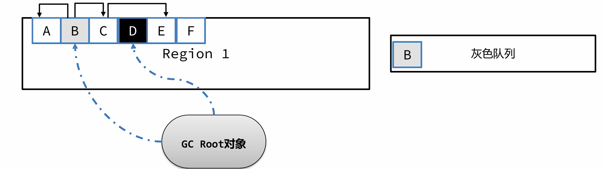


**2. 并发标记**

接下来进入并发标记阶段，继续进行未完成的标记任务。此阶段和用户线程并发执行。

从灰色队列中获取尚未完成标记的对象B。标记B关联的A和C对象，由于A对象并未引用其他对象，可以直接标记成黑色，而B也完成了所有引用对象的标记，也标记为黑色。C对象有引用对象E，所以先标记成灰色并放入灰色队列。最后从队列获取C对象，标记为黑色，E也标记为黑色。所以剩余对象F就是白色，可回收。


**问题**

三色标记存在一个比较严重的问题，由于用户线程可能同时在修改对象的引用关系，就会出现错标的情况，比如：

这个案例中正常情况下，B和C都会被标记成黑色。但是在BC标记前，用户线程执行了 B.c = null；将B到C的引用去除了。同时执行了A.c = c; 添加了A到C的引用。此时会出现严重问题，C是白色可回收一旦回收代码中再去使用对象会造成重大问题。

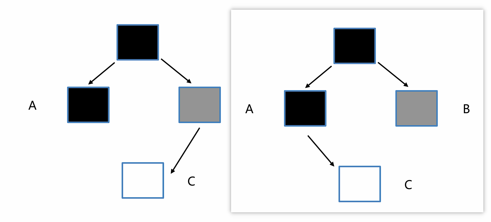

G1为了解决这个问题，使用了<font color=red>SATB技术（Snapshot At The Beginning， 初始快照）</font>。SATB技术是这样处理的：

1. 标记开始时创建一个快照，记录当前所有对象，标记过程中新生成的对象直接标记为黑色。

2. 采用前置写屏障技术，在引用赋值前比如B.c = null之前，将之前引用的对象c放入SATB待处理队列中。SATB队列每个线程都有一个，最终会汇总到一个大的SATB队列中。
   
   

**3. 最终标记**

最终标记会暂停所有用户线程，主要是为了处理SATB相关的对象标记。这一步中，将所有线程的SATB队列中剩余的数据合并到总的SATB队列中，然后逐一处理。

SATB队列中的对象，默认按照存活处理，同时要处理他们引用的对象。

> SATB的缺点是在本轮清理时可能会将不存活的对象标记成存活对象，产生了一些所谓的浮动垃圾，等到下一轮清理时才能回收。


**4. 清理**


**5 . 转移**

1. 根据最终标记的结果，可以计算出每一个区域的垃圾对象占用内存大小，根据停顿时间，选择转移效率最高（垃圾对象最多）的几个区域。

2. 转移时先转移GC Root直接引用的对象，然后再转移其他对象。

3. 回收老的区域，如果外部有其他区域对象引用了转移对象，也需要重新设置引用关系。
   
   

### ZGC垃圾回收器原理

ZGC 是一种可扩展的低延迟垃圾回收器。ZGC 在垃圾回收过程中，STW的时间不会超过一毫秒，适合需要低延迟的应用。支持几百兆到16TB 的堆大小，堆大小对STW的时间基本没有影响。


在G1垃圾回收器中，STW时间的主要来源是在转移阶段：

1. 初始标记，STW，采用三色标记法标记从GC Root可直达的对象。 <font color=red>STW时间极短</font>

2. 并发标记，并发执行，对存活对象进行标记。

3. 最终标记，STW，处理SATB相关的对象标记。 <font color=red>STW时间极短</font>

4. 清理，STW，如果区域中没有任何存活对象就直接清理。 <font color=red>STW时间极短</font>

5. 转移，将存活对象复制到别的区域。 <font color=red>STW时间较长</font>
   
   

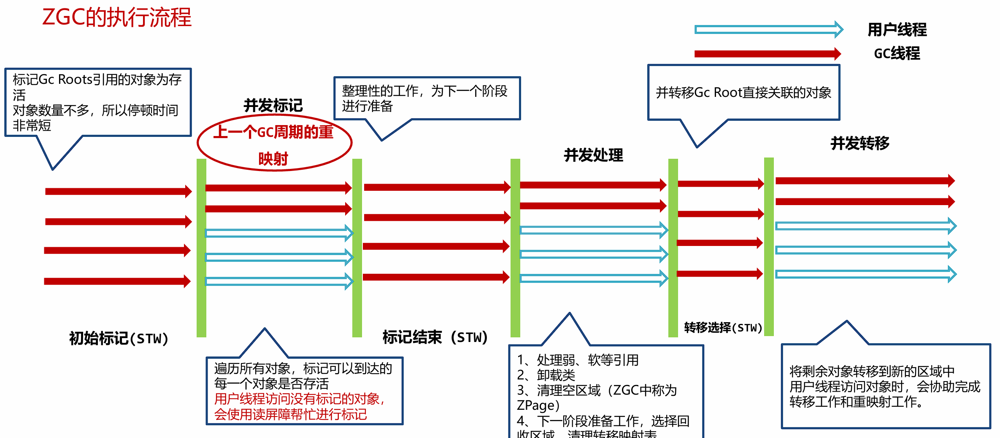

> 注意是<font color=red>并发转移</font>


**问题**：G1转移时需要停顿的主要原因

转移完之后，需要将A对对象的引用更改为新对象的引用。但是在更改前，执行A.c.count= 2，此时更改的是转移前对象中的属性

更改引用之后, A引用了转移之后的对象，此时获取A.c.count发现属性值依然是1。这样就产生了问题，所以G1为了解决问题，在转移过程中需要进行用户线程的停止。


#### ZGC的解决并发转移方案

在ZGC中，使用了<font color=red>读屏障Load Barrier技术</font>，来实现转移后对象的获取。当获取一个对象引用时，会触发读后的屏障指令，如果对象指向的不是转移后的对象，用户线程会将引用指向转移后的对象。

> 会损失一部分的性能，大约在5%~10%之间。


#### 着色指针（Colored Pointers）

> 不支持32位系统、不支持指针压缩

访问对象引用时，使用的是对象的地址。在64位虚拟机中，8个字节可以表示接近无限的内存空间。所以一般内存中对象，高几位都是0没有使用。着色指针就是利用了这多余的几位，存储了状态信息。


着色指针将原来的8字节保存地址的指针拆分成了三部分：

1. 最低的44位，用于表示对象的地址，所以最多能表示16TB的内存空间。

2. 中间4位是颜色位，每一位只能存放0或者1，并且同一时间只有其中一位是1。
   **终结位**：只能通过终结器访问
   **重映射位(Remap)**：转移完之后，对象的引用关系已经完成变更。
   **Marked0和Marked1**：标记可达对象

3. 16位未使用
   
   > 正常应用程序使用8个字节去进行对象的访问，现在只使用了44位，不会产生问题吗？
   > 应用程序使用的对象地址，只是虚拟内存，操作系统会将虚拟内存转换成物理内存。而ZGC通过操作系统更改了这层逻辑。所以不管颜色位变成多少，指针指向的都是同一个对象。
   
   

### ShenandoahGC原理

ShenandoahGC和ZGC不同， ShenandoahGC很多是使用了G1源代码改造而成，所以在很多算法、数据结构的定义上，与G1十分相像，而ZGC是完全重新开发的一套内容。

1. ShenandoahGC的区域定义与G1是一样的。

2. 没有着色指针，通过修改对象头的设计来完成并发转移过程的实现。

3. ShenandoahGC有两个版本，1.0版本存在于JDK8和JDK11中，后续的JDK版本中均使用2.0版本。
   
   

#### 1.0版本

在对象的前8个字节，增加了一个**前向指针**。前向指针指向转移之后的对象，如果没有就指向自己。

- 如果转移阶段未完成，此时转移前的对象和转移后的对象都会存活。如果用户去访问数据，需要使用转移后的数据。ShenandoahGC使用了读前屏障，根据对象的前向指针来获取到转移后的对象并读取。

- 写入数据时会使用写前屏障，判断Mark Word中的GC状态，如果GC状态为0证明没有处于GC过程中，直接写入，如果不为0则根据GC状态值确认当前处于垃圾回收的哪个阶段，让用户线程执行垃圾回收相关的任务。
  
  

**缺点**

1. 对象内存大大增加，每个对象都需要增加8个字节的前向指针，基本上会占用5% -10%的空间。

2. 读屏障中加入了复杂的指令，影响使用效率。
   
   

#### 2.0版本

2.0版本优化了前向指针的位置，仅转移阶段将其放入了Mark Word中。

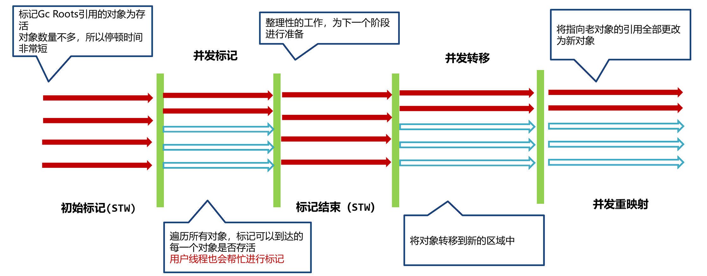

> 红色：GC线程    蓝色：用户线程


**并发问题**

如果用户线程在帮忙转移时，ShenandoahGC线程也发现这个对象需要复制，那么就会去尝试写入前向指针，使用了类似CAS（compare and swap）的方式来实现，只有一个线程能成功修改，其他线程会放弃转移的操作。


---

**上一节**：[JVM 实践](JVM-practice.md)

**下一节**：[JVM 总结](JVM-summary.md)