### InnoDB引擎

#### 逻辑存储结构

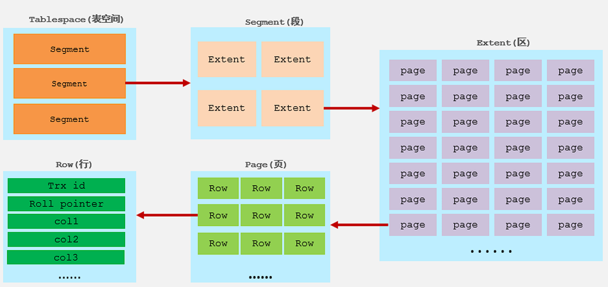


- 表空间
  - 表空间是InnoDB存储引擎逻辑结构的最高层，一个mysql实例可以对应多个表空 间，用于**存储记录、索引**等数据。
- 段
  - 分为数据段、索引段、回滚段，InnoDB是索引组织表，数据段就是B+树的叶子节点， 索引段即为B+树的 非叶子节点。段用来管理多个Extent（区）。
- 区
  - 表空间的单元结构，每个区的大小为1M。
- 页
  - 是InnoDB 存储引擎磁盘管理的最小单元，每个页的大小默认为 16KB。为了保证页的连续性， InnoDB 存储引擎每次从磁盘申请 4-5 个区
- 行
  - InnoDB 存储引擎数据是按行进行存放的


#### 架构

MySQL5.5 版本开始，默认使用InnoDB存储引擎，它擅长事务处理，具有崩溃恢复特性，在日常开发 中使用非常广泛。

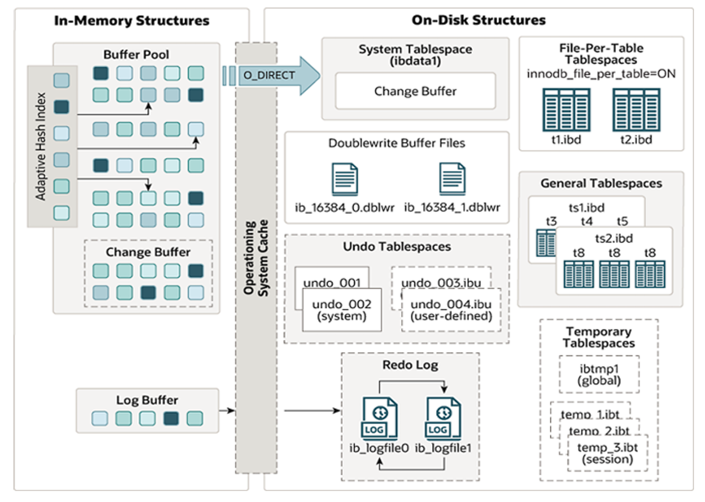

> [!Note]
>
> 左：内存结构
>
> 右：磁盘结构


##### 内存结构

1.  *Buffer Pool*，是主内存中的一个区域，里面可以缓存磁盘上经常操作的真实数据，在执行增 删改查操作时，先操作缓冲池中的数据（若缓冲池没有数据，则从磁盘加载并缓存），然后再以一定频 率刷新到磁盘，从而减少磁盘IO，加快处理速度。
2.  *Change Buffer*，更改缓冲区（针对于**非唯一 二级索引页**），在执行DML语句时，如果这些数据Page 没有在Buffer Pool中，不会直接操作磁盘，而会将数据变更存在更改缓冲区 Change Buffer  中，在未来数据被读取时，再将数据合并恢复到Buffer Pool中，再将合并后的数据刷新到磁盘中。

> [!Tip]
>
> 与聚集索引不同，二级索引通常是非唯一的，并且以相对随机的顺序插入二级索引。同样，删除和更新 可能会影响索引树中不相邻的二级索引页，如果每一次都操作磁盘，会造成大量的磁盘IO。有了 ChangeBuffer之后，我们可以在缓冲池中进行合并处理，减少磁盘IO。

3. *Adaptive Hash Index* 自适应hash索引，用于优化对Buffer Pool数据的查询。MySQL的innoDB引擎中虽然没有直接支持 hash索引，但是给我们提供了一个功能就是这个自适应hash索引。但是hash索引不适合做范围查询、模糊匹配等。 InnoDB存储引擎会监控对表上各索引页的查询，如果观察到在特定的条件下hash索引可以提升速度， 则建立hash索引，称之为自适应hash索引。 **自适应哈希索引，无需人工干预，是系统根据情况自动完成。**
4.  *Log Buffer*：日志缓冲区，用来保存要写入到磁盘中的log日志数据（redo log 、undo log）， 默认大小为 16MB，日志缓冲区的日志会定期刷新到磁盘中。如果需要更新、插入或删除许多行的事 务，增加日志缓冲区的大小可以节省磁盘 I/O。

> [!Tip]
>
> *Log Buffer* 相关系统变量：
>
> `innodb_log_buffer_size`：缓冲区大小
>
> `innodb_flush_log_at_trx_commit`：日志刷新到磁盘时机，取值主要包含以下三个：
>
> - 1 ---> 日志在每次事务提交时写入并刷新到磁盘，默认值。
> - 0 ---> 每秒将日志写入并刷新到磁盘一次。 
> - 2 ---> 日志在每次事务提交后写入，并每秒刷新到磁盘一次。


##### 磁盘结构

1. *System Tablespace*，系统表空间是更改缓冲区的存储区域。如果表是在系统表空间而不是每个表文件或通用表空间中创建的，它也可能包含表和索引数据。
2. *File-Per-Table Tablespaces*，如果开启了`innodb_file_per_table`开关 ，则每个表的文件表空间包含单个InnoDB表的数据和索引 ，并存储在文件系统上的单个数据文件中。
3. *General Tablespaces*，通用表空间，需要通过 CREATE TABLESPACE 语法创建通用表空间，在创建表时，可以指定该表空间。

> [!Tip]
>
> ```sql
>  -- 创建表空间
>  CREATE TABLESPACE ts_name  ADD  DATAFILE  'file_name' ENGINE = engine_name;
>  
>  -- 创建表时指定表空间
>  CREATE  TABLE  xxx ...  TABLESPACE  ts_name;
> ```

4. *Undo Tablespaces*，撤销表空间，MySQL实例在初始化时会自动创建两个默认的undo表空间（初始大小16M），用于存储 undo log日志。
5. *Temporary Tablespaces*， InnoDB 使用会话临时表空间和全局临时表空间。存储用户创建的临时表等数据。
6. *Doublewrite Buffer Files* 双写缓冲区，InnoDB引擎将数据页从Buffer Pool刷新到磁盘前，先将数据页写入双写缓冲区文件 中，便于系统异常时恢复数据。
7. *Redo Log* 重做日志，是用来实现事务的持久性。该日志文件由两部分组成：重做日志缓冲（redo log  buffer）以及重做日志文件（redo log）,前者是在内存中，后者在磁盘中。当事务提交之后会把**所有修改信息都会存到该日志**中, 用于在刷新脏页到磁盘时,发生错误时, 进行**数据恢复**使用。


##### 后台线程

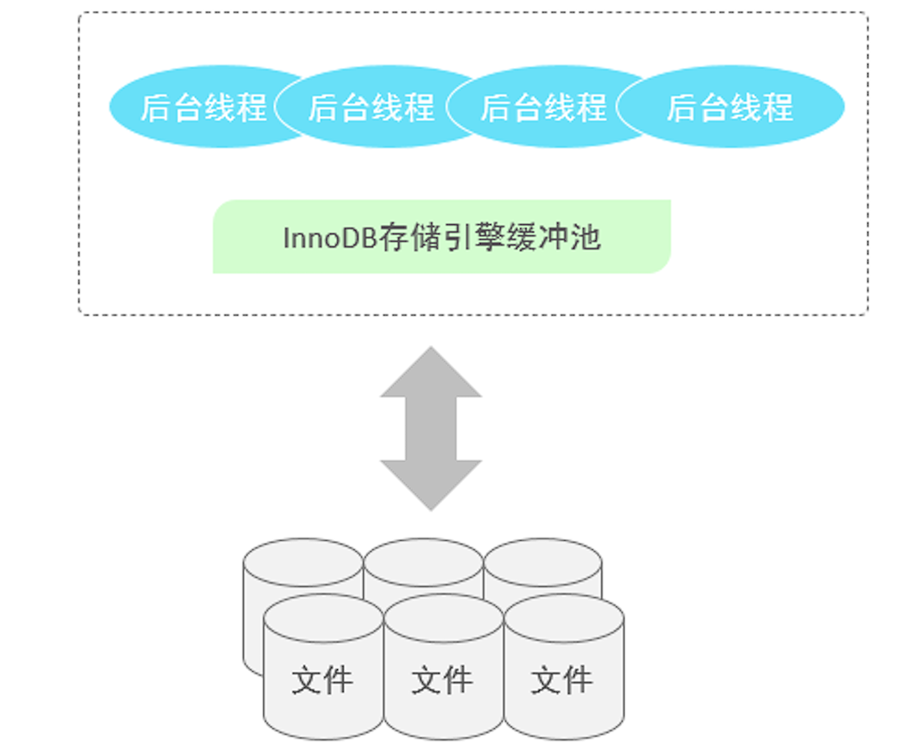

1. *Master Thread*，核心后台线程，负责调度其他线程，还负责将缓冲池中的数据异步刷新到磁盘中, 保持数据的一致性，  还包括脏页的刷新、合并插入缓存、undo页的回收 。
2. *IO Thread*， 在InnoDB存储引擎中大量使用了AIO来处理IO请求, 这样可以极大地提高数据库的性能，而*IO  Thread*主要负责这些IO请求的回调。

| 线程类型               | 默认线程数 | 作用                   |
| ---------------------- | ---------- | ---------------------- |
| `Read thread`          | 4          | 处理读操作             |
| `Write thread`         | 4          | 处理写操作             |
| `Log thread`           | 1          | 将日志缓冲区刷新到磁盘 |
| `Insert buffer thread` | 1          | 将写缓冲区刷新到磁盘   |

3. *Purge Thread* 主要用于回收事务已经提交了的undo log，在事务提交之后，undo log可能不用了，就用它来回收。
4. *Page Cleaner Thread* 协助 Master Thread 刷新脏页到磁盘的线程，它可以减轻 Master Thread 的工作压力，减少阻塞。


#### 事务原理

**事务**是一组操作的集合，它是一个不可分割的工作单位，事务会把所有的操作作为一个整体一起向系统提交或撤销操作请求，即这些操作要么同时成功，要么同时失败。

**ACID特性**

- 原子性（Atomicity）：事务是不可分割的最小操作单元，要么全部成功，要么全部失败。
- 一致性（Consistency）：事务完成时，必须使所有的数据都保持一致状态。
- 隔离性（Isolation）：数据库系统提供的隔离机制，保证事务在不受外部并发操作影响的独立环 境下运行。 
- 持久性（Durability）：事务一旦提交或回滚，它对数据库中的数据的改变就是永久的。


##### redo log

重做日志，记录的是事务提交时数据页的物理修改，是用来实现事务的持久性。

由两部分组成：重做日志缓冲（redo log buffer）以及重做日志文件（redo log  file）,前者是在内存中，后者在磁盘中。当事务提交之后会把**所有修改信息都存到该日志文件中**, 用 于在刷新脏页到磁盘,发生错误时, 进行数据恢复使用。

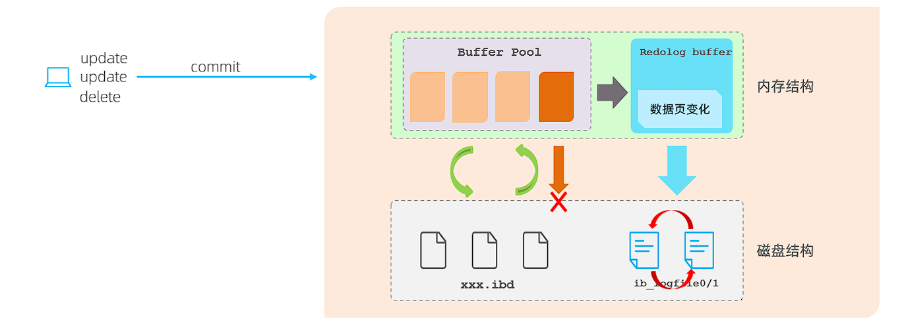

> [!Tip]
>
> 缓冲区的脏页（被修改了的数据）是通过后台线程刷新到磁盘的，此过程可能出现问题，引入redo log后就可以进行重试


##### undo log

回滚日志，用于记录数据被修改前的信息 , 作用包含两个 : **提供回滚(**保证事务的原子性) 和  **MVCC**(多版本并发控制) 。

> [!Note]
>
> undo log和redo log记录物理日志不一样，它是逻辑日志。可以认为当delete一条记录时，undo  log中会记录一条对应的insert记录，反之亦然，当update一条记录时，它记录一条对应相反的 update记录。当执行rollback时，就可以从undo log中的逻辑记录读取到相应的内容并进行回滚。


- Undo log销毁：undo log在事务执行时产生，事务提交时，并不会立即删除undo log，因为这些 日志可能还用于MVCC。 
- Undo log存储：undo log采用段的方式进行管理和记录，存放在前面介绍的 rollback segment  回滚段中，内部包含1024个undo log segment。


##### MVCC

###### 基本概念

1. **当前读**，读取的是记录的最新版本，读取时还要保证其他并发事务不能修改当前记录，会对读取的记录进行加锁。对于我们日常的操作，如：`select ... lock in share mode(共享锁)，select ...  for update、update、insert、delete(排他锁)`都是一种当前读。
2. **快照读**，简单的select（不加锁）就是快照读，快照读，读取的是记录数据的可见版本，有可能是历史数据， 不加锁，是非阻塞读。

- Read Committed：每次select，都生成一个快照读。 
- Repeatable Read：开启事务后第一个select语句才是快照读的地方。 
- Serializable：快照读会退化为当前读。

3. **MVCC**，全称 Multi-Version Concurrency Control，多版本并发控制。**指维护一个数据的多个版本**， 使得读写操作没有冲突，快照读为MySQL实现MVCC提供了一个非阻塞读功能。MVCC的具体实现，还需 要依赖于数据库记录中的三个隐式字段、undo log日志、readView。


###### 隐藏字段

手动创建一张表时，InnoDB还会自动的给我们添加隐藏字段

| 隐藏字段      | 作用                                                 |
| ------------- | ---------------------------------------------------- |
| `TB_TRX_ID`   | 最近修改事务ID                                       |
| `DB_ROLL_PTR` | 回滚指针，配合undo log指向这条记录的上一个版本       |
| `DB_ROW_ID`   | 隐藏主键，如果表结构**没有指定主键**将生成该隐藏字段 |


###### undo log

回滚日志，在insert、update、delete的时候产生的便于数据回滚的日志。 

当insert的时候，产生的undo log日志只在回滚时需要，在事务提交后，可被立即删除。

而update、delete的时候，产生的undo log日志不仅在回滚时需要，在快照读时也需要，不会立即 被删除。


**版本链** 

示例：

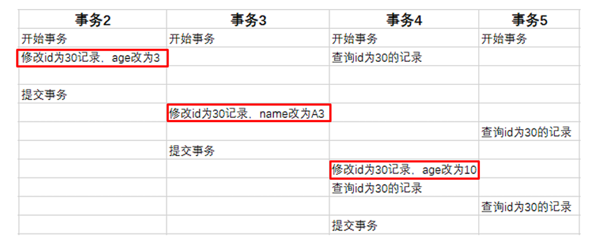

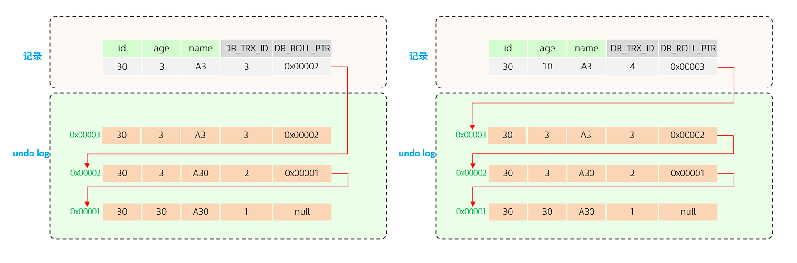

> [!Note]
>
> 不同事务或相同事务对同一条记录进行修改，会导致该记录的undolog生成一条 记录版本链表，链表的头部是最新的旧记录，链表尾部是最早的旧记录。


###### ReadView

ReadView（读视图）是 快照读 SQL执行时MVCC提取数据的依据，记录并维护系统当前活跃的事务 （未提交的）id。

ReadView中包含了四个核心字段：

| 字段             | 含义                           |
| ---------------- | ------------------------------ |
| `m_ids`          | 当前活跃的事务ID集合           |
| `min_trx_id`     | 最小活跃事务ID                 |
| `max_trx_id`     | 预分配事务ID，当前最大事务ID+1 |
| `creator_trx_id` | ReadView创建者的事务ID         |


**版本链访问规则**

1. **自修改检查**
   若被访问版本的`trx_id == creator_trx_id`，说明是当前事务自己修改的记录，直接访问该版本
2. **已提交事务检查**
   若`trx_id < min_trx_id`，说明该版本在ReadView创建前已提交，可以访问
3. **未来事务检查**
   若`trx_id >= max_trx_id`，说明该版本由未来事务创建，不可访问
4. **活跃事务检查**
   若`min_trx_id ≤ trx_id < max_trx_id`：
   - 若`trx_id ∈ m_ids`：创建该版本的事务仍活跃，不可访问
   - 若`trx_id ∉ m_ids`：创建该版本的事务已提交，可以访问


**不同隔离级别下的ReadView**

|    隔离级别     |         ReadView生成时机         | 解决的核心问题 |
| :-------------: | :------------------------------: | :------------: |
| READ COMMITTED  |  **每次**SELECT前生成新ReadView  |    避免脏读    |
| REPEATABLE READ | **事务首次**SELECT时生成ReadView | 避免不可重复读 |


**Read Commited 级别下的读取示例**

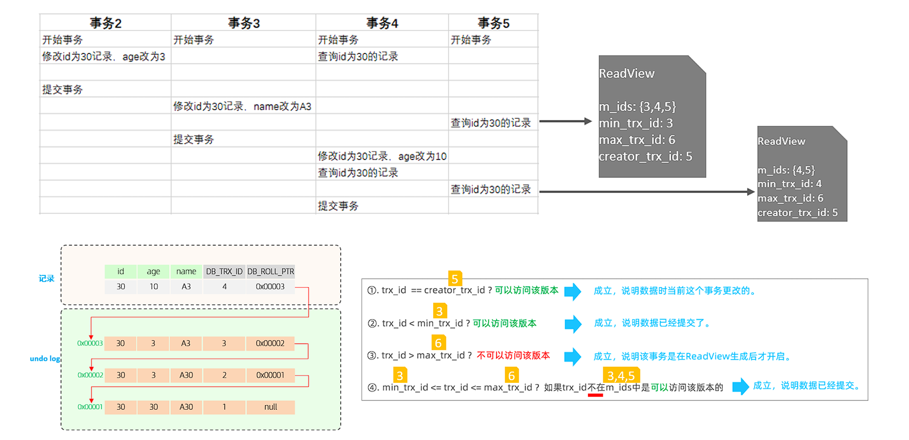

> [!Tip]
>
> 事务5根据上述版本链访问规则，第一次读访问到的是位于 0x00002 的快照，第二此读取是 0x00003 的快照


**Repeatable Read** 级别下，上述示例的第二次读取会复用第一次生成的ReadView，所以实现了可重复读


### MySQL管理

#### 系统数据库

MySQL自带数据库说明：

| 数据库             | 作用                                                         |
| ------------------ | ------------------------------------------------------------ |
| mysql              | 存储MySQL服务器正常运行所需要的各种信息 （时区、主从、用 户、权限等） |
| information_schema | 提供了访问数据库元数据的各种表和视图，包含数据库、表、字段类 型及访问权限等 |
| performance_schema | 为MySQL服务器运行时状态提供了一个底层监控功能，主要用于收集 数据库服务器性能参数 |
| sys                | 包含了一系列方便 DBA 和开发人员利用 performance_schema 性能数据库进行性能调优和诊断的视图 |


#### MySQL命令行客户端

- mysql

```bash
语法 ：    
    mysql   [options]   [database]
选项 ： 
    -u, --user=name         #指定用户名
    -p, --password[=name]           #指定密码
    -h, --host=name         #指定服务器IP或域名
    -P, --port=port             #指定连接端口
    -e, --execute=name          #执行SQL语句并退出
```


- mysqladmin，用于执行各种管理操作

```bash
mysqladmin -u root -p status	# 查看服务器状态
mysqladmin -u root -p variables	# 查看服务器变量
mysqladmin -u root -p shutdown	# 关闭服务器
mysqladmin -u root -p flush-logs      # 刷新日志
mysqladmin -u root -p flush-privileges # 刷新权限
mysqladmin -u root -p flush-status    # 重置状态计数器
```


- mysqlbinlog，由于服务器生成的二进制日志文件以二进制格式保存，所以如果想要检查这些文本的文本格式，就会使用到mysqlbinlog 日志管理工具

```bash
语法 ：    
	mysqlbinlog [options]  log-files1 log-files2 ...

选项 ： 
	-d, --database=name         指定数据库名称，只列出指定的数据库相关操作。
	-o, --offset=#              忽略掉日志中的前n行命令。
	-r,--result-file=name       将输出的文本格式日志输出到指定文件。
	-s, --short-form            显示简单格式， 省略掉一些信息。
	--start-datatime=date1  --stop-datetime=date2       指定日期间隔内的所有日志。
	--start-position=pos1 --stop-position=pos2          指定位置间隔内的所有日志。
```


- mysqlshow，对象查找工具，用来很快地查找存在哪些数据库、数据库中的表、表中的列或者索 引。

```bash
语法 ：    
    mysqlshow [options] [db_name [table_name [col_name]]]
选项 ： 
    --count     显示数据库及表的统计信息（数据库，表 均可以不指定）
    -i      显示指定数据库或者指定表的状态信息
示例：
 	#查询test库中每个表中的字段书，及行数
    mysqlshow -uroot -p2143 test --count
    
    #查询test库中book表的详细情况
    mysqlshow -uroot -p2143 test book --count
```


- mysqldump，用来备份数据库或在不同数据库之间进行数据迁移。备份内容包含创建表，及 插入表的SQL语句。

```bash
语法 ：    
    mysqldump [options] db_name [tables]
    mysqldump [options] --database/-B db1 [db2 db3...]
    mysqldump [options] --all-databases/-A
连接选项 ：  
    -u, --user=name                 指定用户名
    -p, --password[=name]           指定密码
    -h, --host=name                 指定服务器ip或域名
    -P, --port=#                    指定连接端口
输出选项：
    --add-drop-database         在每个数据库创建语句前加上 drop database 语句
    --add-drop-table            在每个表创建语句前加上 drop table 语句 , 默认开启 ; 不开启 (--skip-add-drop-table)
    -n, --no-create-db          不包含数据库的创建语句
    -t, --no-create-info        不包含数据表的创建语句
    -d --no-data                不包含数据
    -T, --tab=name             	自动生成两个文件：一个.sql文件，创建表结构的语句；一个.txt文件，数据文件
  
-- 备份数据库
mysqldump -uroot -p1234 db01 > db01.sql
```


-  mysqlimport ，是客户端数据导入工具，用来导入mysqldump 加 -T 参数后导出的文本文件。

```sql
语法 ：    
	mysqlimport [options]  db_name  textfile1  [textfile2...]
示例 ： 
	mysqlimport -uroot -p2143 test /tmp/city.txt
```


-  source ，如果需要导入sql文件,可以使用**mysql中的source** 指令

```sql
语法 ：    
source /root/xxxxx.sql
```


---

## 运维

### 日志

#### 错误日志

错误日志是 MySQL 中最重要的日志之一，它记录了当 mysqld 启动和停止时，以及服务器在运行过 程中发生任何严重错误时的相关信息。

该日志是默认开启的，默认存放目录 /var/log/，默认的日志文件名为 mysqld.log 。查看日志 位置

```sql
 show variables like '%log_error%';
```


#### 二进制日志

二进制日志（BINLOG）记录了所有的 DDL（数据定义语言）语句和 DML（数据操纵语言）语句，但 不包括数据查询（SELECT、SHOW）语句

**作用**：

- 灾难时的数据恢复；
- MySQL的主从复制。

```sql
 -- 查看日志目录
 show variables like '%log_bin%';
```

`log_bin_basename`：当前数据库服务器的binlog日志的基础名称(前缀)，具体的binlog文 件名需要再该basename的基础上加上编号(编号从000001开始)。 

`log_bin_index`：binlog的索引文件，里面记录了当前服务器关联的binlog文件有哪些。


**日志格式**

MySQL服务器中提供了多种格式来记录二进制日志

```sql
-- 查看日志格式
show variables like '%binlog_format%';

-- 在配置文件中修改 binlog_format 的值即可修改日志格式
```

| 日志格式  | 说明                                                         |
| :-------: | ------------------------------------------------------------ |
| STATEMENT | 基于**SQL语句**的日志记录，记录的是SQL语句，对数据进行修改的SQL都会记录在日志文件中。 |
|    ROW    | 基于行的日志记录，记录的是每一行的数据变更。（默认）         |
|   MIXED   | 混合了STATEMENT和ROW两种格式，默认采用STATEMENT，在某些特殊情况下会自动切换为ROW进行记录。 |


**查看二进制日志**

```bash
mysqlbinlog  [ 参数选项 ]  logfilename
参数选项：
    -d      指定数据库名称，只列出指定的数据库相关操作。
    -o      忽略掉日志中的前n行命令。
    -v      将行事件(数据变更)重构为SQL语句
    -vv     将行事件(数据变更)重构为SQL语句，并输出注释信息
```


**删除日志**

| 指令                                             | 说明                                                         |
| ------------------------------------------------ | ------------------------------------------------------------ |
| reset master                                     | 删除全部 binlog 日志，删除之后，日志编号，将 从 binlog.000001重新开始 |
| purge master logs to 'binlog.*'                  | 删除 * 编号之前的所有日志                                    |
| purge master logs before 'yyyy-mm-dd hh24:mi:ss' | 删除日志为 "yyyy-mm-dd hh24:mi:ss" 之前 产生的所有日志       |

> [!Tip]
>
> 也可以在mysql的配置文件中配置二进制日志的过期时间，二进制日志过期会自动删除。
>
> ```sql
>  show variables like '%binlog_expire_logs_seconds%';
> ```


#### 查询日志

查询日志中记录了客户端的所有操作语句，而二进制日志不包含查询数据的SQL语句。默认情况下，  查询日志是未开启的。


在配置文件中开启查询日志

```sql
#该选项用来开启查询日志 ， 可选值 ： 0 或者 1 ； 0 代表关闭， 1 代表开启 
general_log=1
 #设置日志的文件名 ， 如果没有指定， 默认的文件名为 host_name.log 
general_log_file=mysql_query.log
```


#### 慢查询日志

慢查询日志记录了所有执行时间超过参数 `long_query_time` 设置值并且扫描记录数不小于  `min_examined_row_limit` 的所有的SQL语句的日志，默认未开启。


在配置文件中开启慢查询日志  

```sql
## 慢查询日志
slow_query_log=1
## 慢查询时间阈值
long_query_time=2
```

> [!Tip]
>
> 默认情况下，不会记录管理语句，也不会记录不使用索引进行查找的查询。可以使用 log_slow_admin_statements和 更改此行为 log_queries_not_using_indexes
>
> ```sql
>  #记录执行较慢的管理语句
> log_slow_admin_statements =1
>  #记录执行较慢的未使用索引的语句
> log_queries_not_using_indexes = 1
> ```


### 主从复制

#### 概述

主从复制是指将主数据库的 DDL 和 DML 操作通过二进制日志传到从库服务器中，然后在从库上对这 些日志重新执行（也叫重做），从而使得从库和主库的数据保持同步。

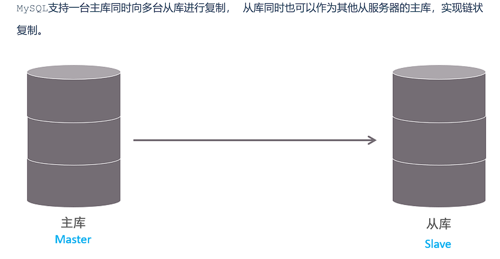

MySQL 主从复制的优点主要包含以下三个方面： 

- 主库出现问题，可以快速切换到从库提供服务。 
- 实现读写分离，降低主库的访问压力。 
- 可以在从库中执行备份，以避免备份期间影响主库服务。


#### 原理

MySQL主从复制的核心就是 **二进制日志**

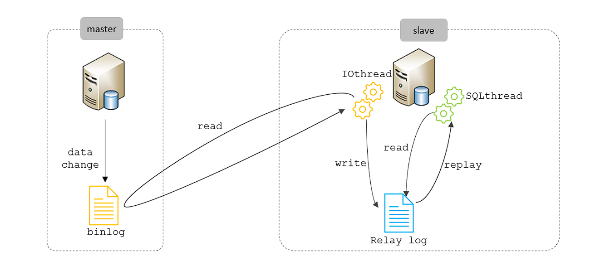

**过程**：

1. Master 主库在事务提交时，会把数据变更记录在二进制日志文件 Binlog 中。
2. 从库读取主库的二进制日志文件 Binlog ，写入到从库的中继日志 Relay Log 。 
3. slave重做中继日志中的事件，将改变反映它自己的数据。


#### 搭建主从

> [!Tip]
>
> 注意防火墙配置

##### 主节点

主节点配置：

```sql
## mysql 服务ID，保证整个集群环境中唯一，取值范围：1 ~ (2^32-1)，默认为1
server-id=1

## 是否只读,1 代表只读, 0 代表读写
read-only=0

## 忽略的数据, 指不需要同步的数据库
## binlog-ignore-db=mysql

## 指定同步的数据库
## binlog-do-db=db01
```

创建远程连接用户

```sql
## 创建用户，并设置密码，该用户可在任意主机连接该MySQL服务
CREATE USER 'itcast'@'%' IDENTIFIED WITH mysql_native_password BY 'Root@123456';

## 为用户分配主从复制权限
GRANT REPLICATION  SLAVE  ON  *.*  TO  'itcast'@'%';
```


查看二进制日志坐标 ` show master status;`，用于从节点配置

- file : 从哪个日志文件开始推送日志文件  
- position ： 从哪个位置开始推送日志 
- binlog_ignore_db : 指定不需要同步的数据库


##### 从节点

配置文件

```sql
## mysql 服务ID，保证整个集群环境中唯一，取值范围：1 ~ (2^32-1)，和主库不一样即可
server-id=2

## 是否只读,1 代表只读, 0 代表读写
read-only=1
```


连接主节点

```sql
-- 8.0.23版本
CHANGE REPLICATION SOURCE TO SOURCE_HOST='主节点IP', SOURCE_USER='主节点授权用户', 
SOURCE_PASSWORD='密码', SOURCE_LOG_FILE='binlog.000004', 
SOURCE_LOG_POS=663;
```


开启同步

```sql
start replica ; #8.0.22之后
start  slave ;  #8.0.22之前
```


### 分库分表

#### 概述

随着互联网及移动互联网的发展，应用系统的数据量也是成指数式增长，若采用单数据库进行数据存 储，存在以下性能瓶颈： 

1. IO瓶颈：热点数据太多，数据库缓存不足，产生大量磁盘IO，效率较低。 请求数据太多，带宽 不够，网络IO瓶颈。 
2. CPU瓶颈：排序、分组、连接查询、聚合统计等SQL会耗费大量的CPU资源，请求数太多，CPU达到瓶颈。


为了解决上述问题，我们需要对数据库进行分库分表处理。

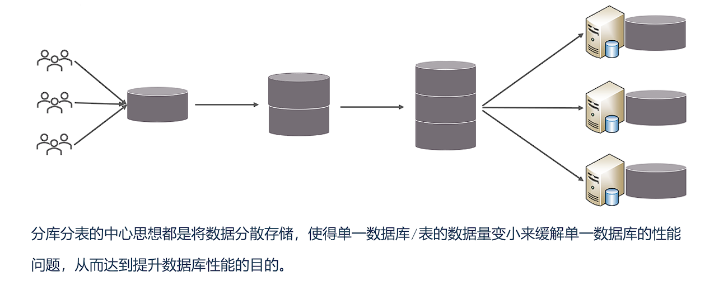


##### 拆分策略

分库分表的形式，主要是两种：垂直拆分和水平拆分。

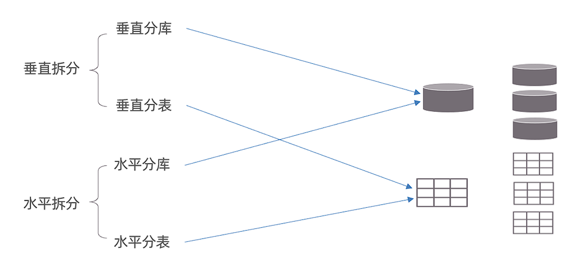

##### 垂直拆分

1. **垂直分库**：以表为依据，根据业务将不同表拆分到不同库中。

特点： 

- 每个库的表结构都不一样。 
- 每个库的数据也不一样。 
- 所有库的并集是全量数据。

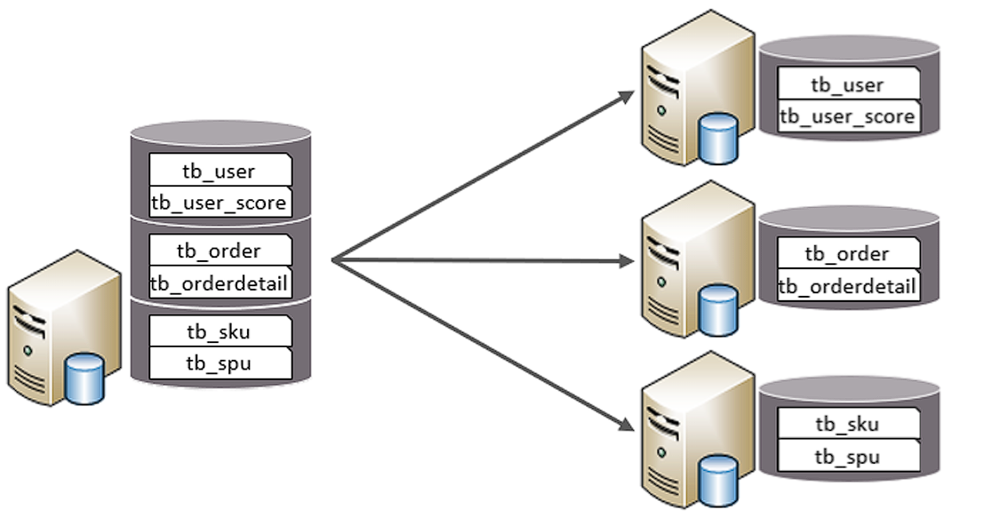


2. **垂直分表**：以字段为依据，根据字段属性将不同字段拆分到不同表中。

特点： 

- 每个表的结构都不一样。 
- 每个表的数据也不一样，一般通过一列（主键/外键）关联。 
- 所有表的并集是全量数据。

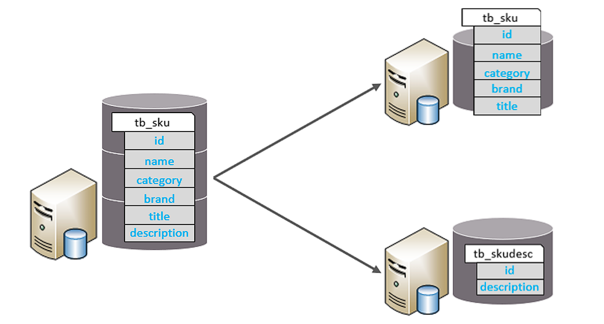


##### 水平拆分

1. **水平分库**：以字段为依据，按照一定策略，将一个库的数据拆分到多个库中。

特点： 

-  每个库的表结构都一样。 
- 每个库的数据都不一样。 
- 所有库的并集是全量数据。

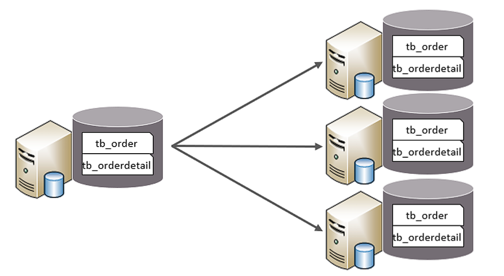


2. **水平分表**：以字段为依据，按照一定策略，将一个表的数据拆分到多个表中。

特点： 

- 每个表的表结构都一样。 
- 每个表的数据都不一样。 
- 所有表的并集是全量数据。

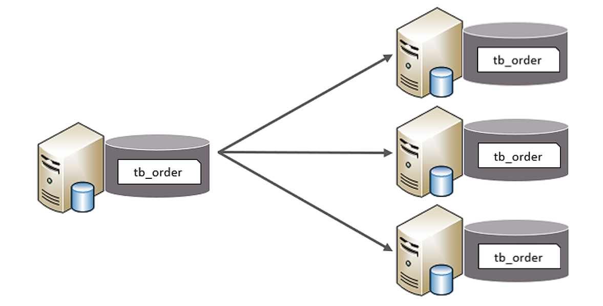

##### 实现技术

- shardingJDBC：基于AOP原理，在应用程序中对本地执行的SQL进行拦截，解析、改写、路由处 理。需要自行编码配置实现，只支持java语言，性能较高。 
- **MyCat**：数据库分库分表中间件，不用调整代码即可实现分库分表，支持多种语言，性能不及前 者。

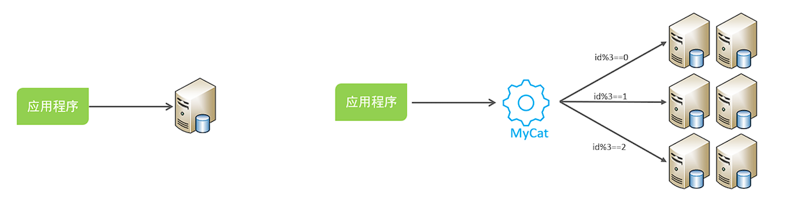

#### MyCat概述

[| MYCAT官方网站—中国开源分布式数据库中间件](https://www.mycat.org.cn/)

**安装后目录介绍**

bin : 存放可执行文件，用于启动停止mycat

conf：存放mycat的配置文件 

lib：存放mycat的项目依赖包（jar） 

logs：存放mycat的日志文件


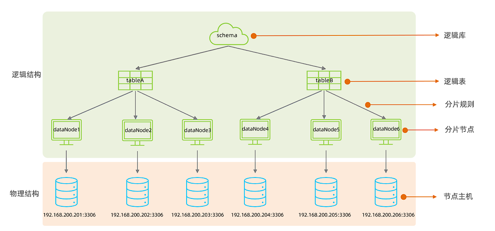

在MyCat的逻辑结构主要负责逻辑库、逻辑表、分片规则、分片节点等逻辑结构的处理，而具体的数据 存储还是在物理结构，也就是数据库服务器中存储的。


#### MyCat配置

##### schema.xml

schema.xml 作为MyCat中最重要的配置文件之一 , 涵盖了MyCat的逻辑库 、 逻辑表 、 分片规 则、分片节点及数据源的配置。

主要包含以下三组标签： 

- schema标签 
- datanode标签 
- datahost标签


1. schema标签

 定义逻辑库，一个MyCat实例中, 可以有多个逻辑库 , 可以通 过 schema 标签来划分不同的逻辑库。MyCat中的逻辑库的概念，等同于MySQL中的database概念。

**主要属性**：

- name：指定自定义的逻辑库库名 
- checkSQLschema：在SQL语句操作时指定了数据库名称，执行时是否自动去除；true：自动去 除，false：不自动去除 
- sqlMaxLimit：如果未指定limit进行查询，列表查询模式查询多少条记录

**子标签**：

- table定义逻辑表

  **主要属性**：

  - name：定义逻辑表表名，在该逻辑库下唯一 
  - dataNode：定义逻辑表所属的dataNode，该属性需要与dataNode标签中name对应；多个 dataNode逗号分隔 
  - rule：分片规则的名字，分片规则名字是在rule.xml中定义的 
  - primaryKey：逻辑表对应真实表的主键 
  - type：逻辑表的类型，目前逻辑表只有全局表和普通表，如果未配置，就是普通表；全局表，配置为 global


2.  datanode标签

**主要属性**： 

- name：定义数据节点名称 
- dataHost：数据库实例主机名称，引用自 dataHost 标签中name属性 
- database：定义分片所属数据库


3.  datahost标签

**主要属性**：

- name：唯一标识，供上层标签使用 
- maxCon/minCon：最大连接数/最小连接数 
- balance：负载均衡策略，取值 0,1,2,3 
- writeType：写操作分发方式（0：写操作转发到第一个writeHost，第一个挂了，切换到第二 个；1：写操作随机分发到配置的writeHost） 
- dbDriver：数据库驱动，支持 native、jdbc


##### rule.xml

rule.xml中定义所有拆分表的规则, 在使用过程中可以灵活的使用分片算法, 或者对同一个分片算法使用不同的参数, 它让分片过程可配置化。

主要包含两类标签：

- tableRule
- Function


##### server.xml

server.xml配置文件包含了MyCat的系统配置信息

主要有两个重要的标签：

- system
- user


1. system标签

主要配置MyCat中的系统配置信息

```xml
<property name="serverPort">8066</property> <!-- MyCat服务端口 -->
<property name="managerPort">9066</property> <!-- 管理端口 -->
<property name="charset">utf8</property> <!-- 默认字符集 -->
<property name="nonePasswordLogin">0</property> <!-- 是否允许空密码登录(0禁止) -->

<property name="processorBufferPoolType">0</property> <!-- 0:NIO,1:AIO -->
<property name="processorBufferLocalPercent">100</property> <!-- 线程池缓冲百分比 -->
<property name="frontSocketSoRcvbuf">1048576</property> <!-- 前端接收缓冲 -->
<property name="frontSocketSoSndbuf">4194304</property> <!-- 前端发送缓冲 -->
<property name="processors">16</property> <!-- 处理线程数 -->

<property name="defaultSqlParser">druidparser</property> <!-- SQL解析器 -->
<property name="sequnceHandlerType">1</property> <!-- 全局序列类型 -->
<property name="useOffHeapForMerge">0</property> <!-- 是否使用堆外内存 -->
<property name="memoryPageSize">1m</property> <!-- 内存页大小 -->

<property name="heartbeatTimeout">1000</property> <!-- 心跳超时(ms) -->
<property name="idleTimeout">1800000</property> <!-- 连接空闲超时(ms) -->
```


2. user标签

配置MyCat中的用户、访问密码，以及用户针对于逻辑库、逻辑表的权限信息

```xml
<user name="test" defaultAccount="true">
    <property name="password">test123</property>
    <property name="schemas">TESTDB</property> <!-- 可访问的schema -->
    <property name="readOnly">false</property> <!-- 是否只读 -->
    <property name="benchmark">1000</property> <!-- 权重 -->
    
    <!-- 表级权限控制 -->
    <privileges check="true">
        <schema name="TESTDB" dml="0110">
            <table name="t_user" dml="1111"></table>
        </schema>
    </privileges>
</user>
```

> [!Tip]
>
> dml四位数字分别对应：insert(1位),update(2位),select(3位),delete(4位)
>
> 例如dml="0110"表示允许update和select


#### MyCat分片

##### 全局表

全局表（Global Table）是 MyCat 中的一种特殊表类型，指在所有数据节点（分片节点）上都**完全冗余存储**的**相同数据表**。全局表主要用于解决跨分片 JOIN 的性能问题。

**特点**：

1. **全节点冗余**：所有数据节点都存储相同数据
2. **实时同步**：任何节点的修改都会同步到所有节点
3. **跨分片JOIN优化**：避免跨分片JOIN操作
4. **读操作本地化**：查询操作可在任意节点本地执行
5. **写操作广播**：写入操作会广播到所有节点

> [!Tip]
>
> **使用场景**：
>
> 1. **数据字典表**：如地区编码、系统参数等
> 2. **配置表**：系统配置、业务配置等
> 3. **小数据量表**：数据量小且更新不频繁的表
> 4. **高频关联表**：经常需要与其他表JOIN的维度表

```xml
<table name="t_area" primaryKey="id" type="global" dataNode="dn1,dn2,dn3"/>
```


#### 分片规则

##### 范围分片

根据指定的字段及其配置的范围与数据节点的对应情况， 来决定该数据属于哪一个分片。

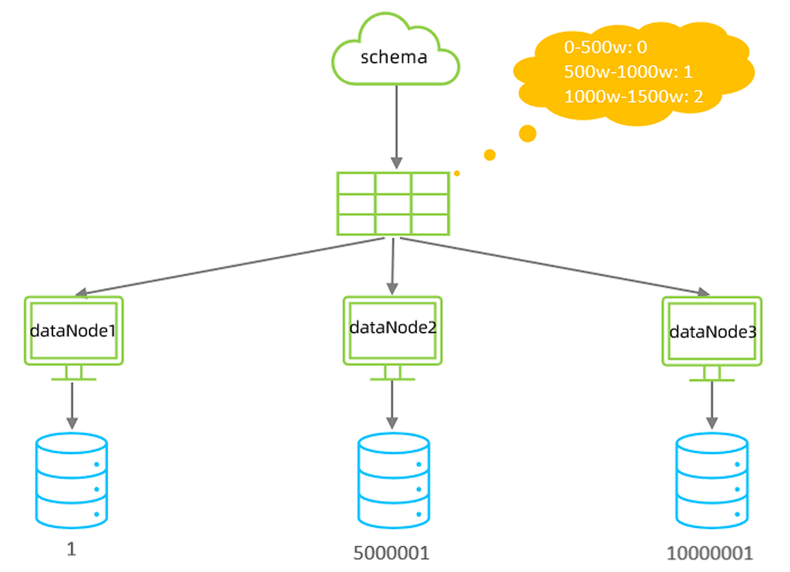

```xml
 <table name="TB_ORDER" dataNode="dn1,dn2,dn3" rule="auto-sharding-long" />
```


##### 取模分片

根据指定的字段值与节点数量进行求模运算，根据运算结果， 来决定该数据属于哪一个分片。

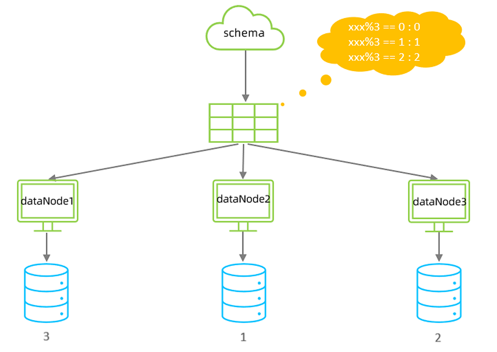

```xml
<!-- schema.xml -->
<table name="tb_log" dataNode="dn4,dn5,dn6" primaryKey="id" rule="mod-long" />


<!-- rule.xml -->
<tableRule name="mod-long">
    <rule>
        <columns>id</columns>
        <algorithm>mod-long</algorithm>
    </rule>
 </tableRule>
 <function name="mod-long" class="io.mycat.route.function.PartitionByMod">
    <property name="count">3</property><!-- 节点数量 -->
 </function>
```

> [!Caution]
>
> 该分片规则，主要针对于数字类型的字段适用


##### 一致性hash分片

一致性哈希（Consistent Hashing）是MyCat提供的一种特殊分片算法，它解决了传统哈希分片在节点扩容/缩容时需要大量数据迁移的问题。

**特点**：

1. **虚拟节点环**：将哈希空间组织成环形结构
2. **数据定位**：通过哈希计算确定数据在环上的位置
3. **节点映射**：物理节点均匀映射到哈希环上
4. **扩容影响小**：节点变化只影响相邻节点数据

---

|    特性    |     一致性哈希     |   传统哈希   |
| :--------: | :----------------: | :----------: |
|  扩容影响  |   只影响相邻节点   | 影响所有节点 |
| 数据迁移量 | 约1/N（N为节点数） | 几乎全部数据 |
| 数据均衡性 |   依赖虚拟节点数   |   完全均衡   |
| 实现复杂度 |        较高        |     简单     |

---

配置

```xml
<!-- schema.xml -->
<table name="t_order" primaryKey="order_id" dataNode="dn1,dn2,dn3" rule="sharding-by-murmur"/>


<!-- rule.xml -->
<tableRule name="sharding-by-murmur">
    <rule>
        <columns>order_id</columns>
        <algorithm>murmur</algorithm>
    </rule>
</tableRule>

<function name="murmur" class="io.mycat.route.function.PartitionByMurmurHash">
    <property name="seed">0</property> <!-- 哈希种子，默认0 -->
    <property name="count">3</property> <!-- 物理节点数 -->
    <property name="virtualBucketTimes">160</property> <!-- 虚拟节点倍数 -->
</function>
```


##### 枚举分片

通过在**配置文件**中配置可能的枚举值, 指定数据分布到不同数据节点上, 本规则适用于按照省份、性 别、状态拆分数据等业务

```xml
<table name="tb_user" dataNode="dn4,dn5,dn6" rule="sharding-by-intfile-enumstatus" />
```


##### 应用指定

运行阶段由应用自主决定路由到那个分片 , 直接根据字符子串（必须是数字）计算分片号

```xml
<table name="tb_app" dataNode="dn4,dn5,dn6" rule="sharding-by-substring" />


<tableRule name="sharding-by-substring">
    <rule>
        <columns>id</columns>
        <algorithm>sharding-by-substring</algorithm>
    </rule>
 </tableRule>
 <function name="sharding-by-substring" class="io.mycat.route.function.PartitionDirectBySubString">
    <property name="startIndex">0</property> <!-- zero-based -->
    <property name="size">2</property>
    <property name="partitionCount">3</property>
    <property name="defaultPartition">0</property>
 </function>
```


##### 固定分片hash算法

固定分片哈希算法（PartitionByLong）是 MyCat 中最常用的分片算法之一，它通过对分片字段值进行固定范围的哈希计算来确定数据分布。

1. **固定范围分片**：通过配置确定每个分片的数值范围
2. **简单高效**：直接基于数值计算，性能优异
3. **均匀分布**：数据在分片间均匀分布（取决于分片键）
4. **可预测性**：可以准确预判数据所在分片位置


```xml
<tableRule name="sharding-by-long">
    <rule>
        <columns>user_id</columns>
        <algorithm>mod-long</algorithm>
    </rule>
</tableRule>

<function name="mod-long" class="io.mycat.route.function.PartitionByLong">
    <property name="partitionCount">2,1</property>  <!-- 分片数量配置 -->
    <property name="partitionLength">512,256</property> <!-- 分片范围配置 -->
</function>
```

| partitionCount  | 是   | 分区间数量配置     | "2,1" 表示2个分区，第1个分区1份              |
| --------------- | ---- | ------------------ | -------------------------------------------- |
| partitionLength | 是   | 每个分区的范围长度 | "512,256" 表示第1分区每份512，第2分区每份256 |
| hashSlice       | 否   | 哈希取模部分字符串 | "0:2" 表示取前2个字符                        |


##### 字符串hash解析算法

截取字符串中的指定位置的子字符串, 进行hash算法， 算出分片。

```xml
 <table name="tb_strhash" dataNode="dn4,dn5" rule="sharding-by-stringhash" />


<tableRule name="sharding-by-stringhash">
    <rule>
        <columns>name</columns>
        <algorithm>sharding-by-stringhash</algorithm>
    </rule>
 </tableRule>
 <function name="sharding-by-stringhash" class="io.mycat.route.function.PartitionByString">
    <property name="partitionLength">512</property> <!-- zero-based -->
    <property name="partitionCount">2</property>
    <property name="hashSlice">0:2</property>
 </function>
```

> [!Tip]
>
> hashSlice: hash运算位 , 根据子字符串的hash运算 ; 0 代表 str.length() , -1 代表 str.length()-1 , 大于0只代表数字自身 ; 可以理解 为substring（start，end），start为0则只表示0


##### 按天分片

按照日期及对应的时间周期来分片。

```sql
<table name="tb_datepart" dataNode="dn4,dn5,dn6" rule="sharding-by-date" />


 <tableRule name="sharding-by-date">
    <rule>
        <columns>create_time</columns>
        <algorithm>sharding-by-date</algorithm>
    </rule>
 </tableRule>
 
 <function name="sharding-by-date" class="io.mycat.route.function.PartitionByDate">
    <property name="dateFormat">yyyy-MM-dd</property>
    <property name="sBeginDate">2022-01-01</property>
    <property name="sEndDate">2022-01-30</property>
    <property name="sPartionDay">10</property>
 </function>
 <!--
    从开始时间开始，每10天为一个分片，到达结束时间之后，会重复开始分片插入
     配置表的 dataNode 的分片，必须和分片规则数量一致，例如 2022-01-01 到 2022-12-31 ，每
10天一个分片，一共需要37个分片。
 -->
```


##### 按月分片

使用场景为按照月份来分片, 每个自然月为一个分片。

```xml
<table name="tb_monthpart" dataNode="dn4,dn5,dn6" rule="sharding-by-month" />


 <tableRule name="sharding-by-month">
    <rule>
        <columns>create_time</columns>
        <algorithm>partbymonth</algorithm>
    </rule>
 </tableRule>
    
<function name="partbymonth" class="io.mycat.route.function.PartitionByMonth">
    <property name="dateFormat">yyyy-MM-dd</property>
    <property name="sBeginDate">2022-01-01</property>
    <property name="sEndDate">2022-03-31</property>
 </function>
 <!-- 
    从开始时间开始，一个月为一个分片，到达结束时间之后，会重复开始分片插入
    配置表的 dataNode 的分片，必须和分片规则数量一致，例如 2022-01-01 到 2022-12-31 ，一
共需要12个分片。--
```


#### MyCat管理

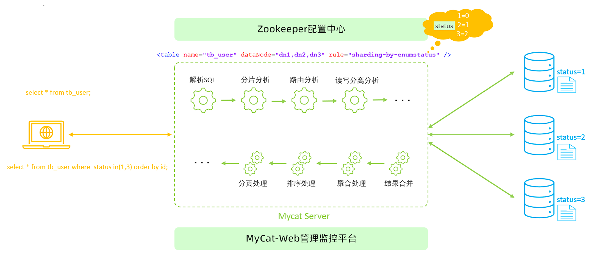

Mycat默认开通2个端口，可以在server.xml中进行修改。 

- 8066 数据访问端口，即进行 DML 和 DDL 操作。 
- 9066 数据库管理端口，即 mycat 服务管理控制功能，用于管理mycat的整个集群状态 连接MyCat的管理控制台

```bash
 mysql   -h  192.168.200.210  -p  9066   -uroot   -p123456
```

|         命令         |       说明       |
| :------------------: | :--------------: |
|  `show @@version;`   |  查看MyCat版本   |
|   `show @@server;`   |  查看服务器状态  |
| `show @@threadpool;` |  查看线程池状态  |
| `show @@processor;`  |  查看处理器状态  |
| `show @@connection;` |   查看连接状态   |
|  `show @@backend;`   | 查看后端连接状态 |

|               命令                |         说明         |
| :-------------------------------: | :------------------: |
|        `show @@datanode;`         |   查看数据节点信息   |
| `show @@datanode where schema=?'` | 查看指定schema的节点 |
|        `reload @@datanode`        |   重载数据节点配置   |
| `switch @@datasource name:index`  | 切换数据源(主从切换) |

|              命令               |       说明        |
| :-----------------------------: | :---------------: |
|          `show @@sql;`          | 查看当前执行的SQL |
|       `show @@sql.slow;`        |     查看慢SQL     |
|        `show @@sql.sum;`        |  查看SQL执行统计  |
|     `show @@sql.where id=?`     |  查看指定SQL详情  |
| `kill @@connection id1,id2,...` |   终止指定连接    |

|         命令          |          说明          |
| :-------------------: | :--------------------: |
|   `reload @@config`   |    重载所有配置文件    |
| `reload @@config_all` | 重载所有配置并清理缓存 |
|   `reload @@route`    |      重载路由配置      |
|    `reload @@user`    |      重载用户权限      |


MyCat官方提供了一个管理监控平台**MyCat-Web（MyCat-eye）**。 Mycat-web 是 Mycat 可视化运维的管理和监控平台。

> [!Caution]
>
> MyCat-eye依赖zookeeper，需先安装zookeeper


### 读写分离

读写分离,简单地说是把对数据库的读和写操作分开,以对应不同的数据库服务器。主数据库提供写操作，从数据库提供读操作，这样能有效地减轻单台数据库的压力。

**步骤**：

1. 配置MySQL主从复制（1主N从）
2. 确保主从同步正常（`SHOW SLAVE STATUS`检查）
3. 建议从库配置`read_only=1`防止误写入


配置`schema.xml`

```sql
<?xml version="1.0"?>
<!DOCTYPE mycat:schema SYSTEM "schema.dtd">
<mycat:schema xmlns:mycat="http://io.mycat/">

    <!-- 定义逻辑库 -->
    <schema name="TESTDB" checkSQLschema="true" sqlMaxLimit="100">
        <!-- 所有表默认使用读写分离 -->
        <table name="tb1" primaryKey="id" dataNode="dn1"/>
    </schema>

    <!-- 定义数据节点 -->
    <dataNode name="dn1" dataHost="localhost1" database="testdb" />

    <!-- 定义数据主机 -->
    <dataHost name="localhost1" maxCon="1000" minCon="10" balance="1" writeType="0" dbType="mysql" dbDriver="native" switchType="1"  slaveThreshold="100">
        <!-- 心跳检测SQL -->
        <heartbeat>select user()</heartbeat>
        
        <!-- 写节点(主库)配置 -->
        <writeHost host="hostM1" url="192.168.1.100:3306" user="root" password="123456">
            <!-- 读节点(从库)配置 -->
            <readHost host="hostS1" url="192.168.1.101:3306" user="root" password="123456" />
            <readHost host="hostS2" url="192.168.1.102:3306" user="root" password="123456" />
        </writeHost>
        
        <!-- 可配置备用写节点(主从切换时使用) -->
        <!-- <writeHost host="hostM2" url="192.168.1.103:3306" user="root" password="123456"/> -->
    </dataHost>
</mycat:schema>
```

|    参数    |  值  |                 说明                  |
| :--------: | :--: | :-----------------------------------: |
|  balance   |  0   |            不开启读写分离             |
|            |  1   |     全部读操作随机分发到readHost      |
|            |  2   |      读操作按权重分发到所有host       |
|            |  3   | 读操作只分发到writeHost对应的readHost |
| writeType  |  0   |    所有写操作发送到第一个writeHost    |
|            |  1   |          随机发送到writeHost          |
| switchType |  1   |            自动切换(默认)             |
|            |  2   |       基于MySQL主从同步状态切换       |
|            |  3   |               手动切换                |


多主从配置方式（高可用）

```xml
<dataHost ... balance="1" writeType="1">
    
  <writeHost host="hostM1" url="master1:3306"...>
    <readHost .../>
  </writeHost>
    
  <writeHost host="hostM2" url="master2:3306"...>
    <readHost .../>
  </writeHost>
    
</dataHost>
```

> [!Caution]
>
> 主节点之间也**互为主从**


---

完结撒花ヽ( •̀ ω •́ )✧
