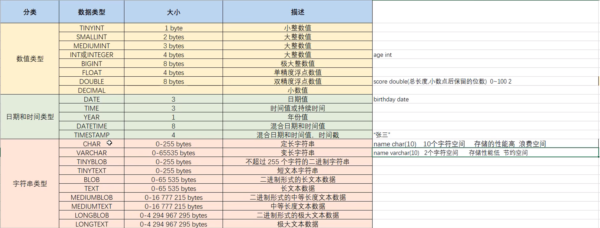

## 数据查询(DQL)

```sql
SELECT
    字段列表
FROM
    表名列表
WHERE
    条件列表
GROUP BY
    分组字段
HAVING
    分组后条件
ORDER BY
    排序字段
LIMIT
    分页限定
```

<br>

### 基础查询

1. 查询多个字段

    ```sql
    SELECT 字段列表 FROM 表名;
    SELECT * FROM 表名; -- 查询所有数据
    ```

2. 去除重复记录

    ```sql
    SELECT DISTINCT 字段列表 FROM 表名;
    ```

3. 给字段或表起别名

    ```sql
    AS -- 也可省略
    ```

<br>

### 条件查询

基本语法

```sql
SELECT 字段列表 FROM 表名 WHERE 条件列表;
```


常见逻辑条件

|       符号       |                    说明                    |
| :--------------: | :----------------------------------------: |
|        >         |                    大于                    |
|        <         |                    小于                    |
|        >=        |                  大于等于                  |
|        <=        |                  小于等于                  |
|        =         |                    等于                    |
|      <>或!=      |                   不等于                   |
| BETWEEN...AND... |          在某个范围内（包含端点）          |
|     IN(...)      |                   多选一                   |
|   LIKE 占位符    | 模糊查询，'_'匹配单个字符，'%'匹配多个字符 |
|     IS NULL      |                   是NULL                   |
|   IS NOT NULL    |                  不是NULL                  |
|    AND 或 &&     |                    并且                    |
|    OR 或 \|\|    |                    或者                    |
|     NOT 或 !     |                  非，不是                  |


**模糊查询示例**：

```sql
-- 查询姓“马”的人
select * from tb where name like '马%';

-- 查询名字第二个字是“马”的人
select * from tb where name like '_马%';

-- 查询名字中包含“马”字的人
select * from tb where name like '%马%'
```

<br>

### 聚合函数

**概念**：将一列数据作为一个整体，进行纵向计算。


聚合函数分类：

| 函数名      | 说明                             |
| ----------- | -------------------------------- |
| count(列名) | 统计数量（一般不包括为NULL的列） |
| max(列名)   | 最大值                           |
| min(列名)   | 最小值                           |
| sum(列名)   | 求和                             |
| avg(列名)   | 平均值                           |


**聚合函数语法**：

```sql
SELECT 聚合函数名(列名) FROM 表名;
```

> NULL值不参与所有聚合函数运算

<br>

### 排序查询

语法：

```sql
SELECT 字段列表 FROM 表名 ORDER BY 排序字段一[排序方式],排序字段二[排序方式],...;
```

排序方式：

- ASC：升序排序（默认值）
- DESC：降序排序

!!!warning "注意"
    如果有多个排序条件，当第一个排序字段相同时，才会按第二个排序字段进行排序

<br>

### 分组查询

语法：

```sql
SELECT 字段列表 FROM 表名 [WHERE 分组前条件] GROUP BY 分组字段名 [HAVING 分组后条件];
```

!!!warning "注意"
    分组后，查询的字段只能为聚合函数和用于分组的字段，查询其他字段无意义。


where和having的区别：

- 执行时机不一样：where是分组之前执行，不满足where条件则不参与分组，而having是对分组后的结果进行过滤。
- 可判断的条件不一样：where不能对聚合函数进行判断，而having可以。

执行顺序：<font color=red>where>聚合函数>having</font>


示例：

```sql
-- 查询男生和女生各自的数学平均分
select sex, avg(math) from tb group by sex;

-- 查询男生和女生各自的数学平均分，以及各自人数（分数低于70的不参与分组）
select sex, avg(math), count(*) from tb where math >= 70 group by sex;
```

<br>

### 分页查询

语法

```sql
SELECT 字段列表 FROM 表名 LIMIT 起始索引, 查询条目;
```

!!!note
    起始索引从0开始
    计算方式：起始索引 = (当前页码 - 1) * 每页显示的条目数


!!!info
    - 分页查询`limit`是 **MySQL** 数据库的方言
    - **Oracle** 数据库分页查询使用`rownumber`
    - **SQL Server** 分页查询使用`top`


示例：

```sql
-- 查询第一页数据，每页显示3条数据
select * from tb limit 0, 3;

-- 查询第二页数据，每页显示3条数据
select * from tb limit 3, 3;
```

<br>

### 多表查询
- 笛卡尔积：取集合A，B的元素的所有组合
- 多表查询：从多张表查询数据
    - 连接查询
        - 内连接：查询A，B交集数据
        - 外连接：
            - 左外连接：查询A的所有数据和A，B交集数据
            - 右外连接：查询B的所有数据和A，B交集数据
        - 自连接：与自身连接查询，必须使用别名
    - 子查询

<br>

#### 内连接

语法：

```sql
-- 隐式内连接
SELECT 字段列表 FROM 表1,表2,表3,... WHERE 条件;

-- 显示内连接
SELECT 字段列表 FROM 表1 [INNER] JOIN 表2 ON 条件;
```


示例：

```sql
-- 查询emp表的name,gender,dept表的dname
select 
    emp.name,emp.gender,dept.dname 
from 
    emp,dept 
where 
    emp.dep_id = dept.did;
    
-- 显示内连接
select
    *
from
    emp
inner join
    dept
on
    emp.dep_id = dept.did
```

<br>

#### 外连接

语法：

```sql
-- 左外连接
SELECT 字段列表 FROM 表1 LEFT [OUTER] JOIN 表2 ON 条件;

-- 右外连接
SELECT 字段列表 FROM 表1 RIGHT [OUTER] JOIN 表2 ON 条件;
```


示例：

```sql
-- 查询emp表的所有数据和对应部门信息
select * from emp left outer join dept on emp.dep_id = dept.did;

-- 查询dept表的所有数据和对应员工信息
select * from emp right outer join dept on emp.dep_id = dept.did;
```

<br>

#### 自连接

!!!tip
    把同一张表看成两张表，与其他多表查询语法相同，只不过必须使用别名

```sql
SELECT 字段列表 FROM 表A 别名1 JOIN 表A 别名2 ON 条件（使用别名）
```

<br>

#### 集合操作

|      操作类型      |                语法                 |                             描述                             |               条件限制                |                             示例                             |
| :----------------: | :---------------------------------: | :----------------------------------------------------------: | :-----------------------------------: | :----------------------------------------------------------: |
|     **UNION**      | `SELECT ... UNION [ALL] SELECT ...` |     合并两个查询结果（**去重**），`UNION ALL`保留重复行      | 1. 列数必须相同 2. 对应列数据类型兼容 |    `sql<br>SELECT 'A' UNION SELECT 'B';<br>→ A<br>B<br>`     |
|   **INTERSECT**    |  `SELECT ... INTERSECT SELECT ...`  |           返回两个查询的**交集**（MySQL 8.0+支持）           |               同`UNION`               | `sql<br>SELECT id FROM table1<br>INTERSECT<br>SELECT id FROM table2;<br>` |
| **EXCEPT** (MINUS) |   `SELECT ... EXCEPT SELECT ...`    | 返回第一个查询有但第二个查询**没有**的结果（MySQL 8.0+支持） |               同`UNION`               | `sql<br>SELECT id FROM table1<br>EXCEPT<br>SELECT id FROM table2;<br>` |
|       **IN**       |     `WHERE col IN (SELECT ...)`     |                  判断值是否在子查询结果集中                  |          子查询必须返回单列           |  `sql<br>SELECT * FROM users<br>WHERE id IN (1, 3, 5);<br>`  |
|     **NOT IN**     |   `WHERE col NOT IN (SELECT ...)`   |               判断值是否**不在**子查询结果集中               |                                       |                                                              |

<br>

#### 子查询

概念：查询中嵌套查询


子查询根据查询结果不同，作用不同：

- 单行单列：作为条件值，使用=、!=、>、 <进行判断

  ```sql
  SELECT 字段列表 FROM 表名 WHERE 字段名 = (子查询);
  ```

- 多行单列：作为条件值，使用 in 等关键字进行条件判断

  ```sql
  SELECT 字段列表 FROM 表名 WHERE 字段名 in (子查询);
  ```

- 多行多列：作为虚拟表

  ```sql
  SELECT 字段列表 FROM (子查询) WHERE 条件;
  ```


|         操作符         |           语法示例           |                             描述                             |         等价形式（使用聚合函数）         |                             示例                             |
| :--------------------: | :--------------------------: | :----------------------------------------------------------: | :--------------------------------------: | :----------------------------------------------------------: |
|       **`ALL`**        | `WHERE col > ALL (subquery)` | 必须满足 **所有** 子查询结果的条件（比子查询所有值都大/小等） | `WHERE col > (SELECT MAX(...) FROM ...)` | `sql<br>SELECT * FROM products<br>WHERE price > ALL (SELECT price FROM discounts);<br>` |
| **`ANY`** / **`SOME`** | `WHERE col > ANY (subquery)` | 满足 **任一** 子查询结果的条件（比子查询至少一个值大/小等）  | `WHERE col > (SELECT MIN(...) FROM ...)` | `sql<br>SELECT * FROM employees<br>WHERE salary > ANY (5000, 8000, 10000);<br>` |


```sql
-- salary和dept_id都与id=1的相同数据
select * 
from emp 
where (salary, dept_id) = (select salary, dept_id from emp where id = 1)

-- “=” 替换为 “in” 表示多个
select * 
from emp 
where (salary, dept_id) in (select salary, dept_id from emp where id = 1 or id = 2)
```


示例：

```sql
-- 查询猪八戒的工资
select salary from emp where name = '猪八戒';

-- 查询工资高于猪八戒的员工信息
select * from emp where salary > (select salary from emp where name = '猪八戒');


-- 查询财务部和市场部的所有员工信息
select * from emp where dep_id in (select did from dept where dname = '财务部' or dname = '市场部');

-- 查询入职日期是2011-11-11之后的员工信息和部门信息
select * from (select * from emp where join_date > '2011-11-11') as t1 ,dept
where dept.did = t1.dept_id;
```

<br>

---

## 数据操作(DML)

插入数据

```sql
INSERT INTO 表名(字段1,字段2,...)
VALUE(值1,值2,...),(值3,值4,...),...
```


修改数据

```sql
UPDATE 表名 SET 字段1=值1,字段2=值2,... [WHERE 条件];
```

!!!danger
    不加条件则**修改所有数据**


删除数据

```sql
DELETE FROM 表名 [WHERE 条件];
```

!!!danger
    不添加条件则**删除所有数据**


<br>


## 数据类型



> unsigned可以指定数值类型无符号


类型选择示例：

```sql
create table emp(
    id int comment '编号',
    no varchar(10) comment '工号',
    name vahchar(10) comment '姓名',
    gender char(1) comment '性别',
    age tinyint unsigned comment '年龄',
    idcard char(18) comment '身份证号',
    entrydate date comment '入职时间'
) comment '员工表';
```


<br>

---

## 数据定义(DDL)

### 表的相关操作

创建表

```sql
CREATE TABLE tb_user(
    id INT,
    username VARCHAR(20),
    password VARCHAR(20)
);
```


删除表

```sql
drop table tb_user;
```


查询所有表

```sql
show tables;
```


修改表

1. 修改表名

    ```sql
    ALTER TABLE 表名 RENAME TO 新表名;
    ```

2. 添加一列

    ```sql
    ALTER TABLE 表名 ADD 列名 数据类型;
    ```

3. 修改数据类型

    ```sql
    ALTER TABLE 表名 MODIFY 列名 新数据类型;
    ```

4. 修改列名和数据类型

    ```sql
    ALTER TABLE 表名 CHANGE 列名 新列名 新数据类型;
    ```

5. 删除列

    ```sql
    ALTER TABLE 表名 DROP 列名;
    ```

<br>

### 数据库相关操作

创建数据库

```sql
CREATE DATABASE 数据库名;
```


删除数据库

```sql
DROP DATABASE 数据库名;
```


查询数据库

```sql
show databases;
```


使用数据库

```sql
use 数据库名;
```

<br>

---

## 数据控制语言(DCL)

!!!warning "注意"
    仅针对MySQL语法

### 用户管理

```sql
## 查询用户
USE mysql;
SELECT * FROM user;

## 新增用户
CREATE USER '用户名'@'主机名' IDENTIFIED BY '密码'

## 修改用户密码
ALTER USER '用户名'@'主机名' IDENTIFIED WITH mysql_native_password BY '新密码'

## 删除用户
DROP USER '用户名'@'主机名'
```

!!!tip
    主机名指定为` '%' `表示任意主机

<br>

### 权限控制

---

|        权限        |        说明        |
| :----------------: | :----------------: |
| ALL,ALL PRIVILEGES |      所有权限      |
|       SELECT       |      查询数据      |
|       INSERT       |      插入数据      |
|       UPDATE       |      修改数据      |
|       DELETE       |      删除数据      |
|       ALTER        |       修改表       |
|        DROP        | 删除数据库/表/视图 |
|       CREATE       |   创建数据库/表    |

---

```sql
## 查询权限
SHOW GRANTS FOR '用户名'@'主机名'

## 授予权限
GRANT 权限列表 ON 数据库名.表名 TO '用户名'@'主机名'

## 撤销权限
REVOKE 权限列表 ON 数据库名.表名 FROM '用户名'@'主机名'
```

!!!tip
    - 多个权限之间用英文逗号分割
    - 数据库名和表名可用 * 通配

<br>

---

## 函数

### 字符串函数

|            函数名            |             语法示例              |                        描述                         |                  示例结果                  |
| :--------------------------: | :-------------------------------: | :-------------------------------------------------: | :----------------------------------------: |
|          `CONCAT()`          |       `CONCAT(str1, str2)`        |                   合并多个字符串                    |      `CONCAT('My', 'SQL') → 'MySQL'`       |
|        `CONCAT_WS()`         |   `CONCAT_WS(sep, str1, str2)`    |               用指定分隔符合并字符串                | `CONCAT_WS('-', '2023', '01') → '2023-01'` |
|  `SUBSTRING()` / `SUBSTR()`  |  `SUBSTRING(str, start, length)`  |              截取字符串（从1开始计数）              |     `SUBSTRING('MySQL', 3, 2) → 'SQ'`      |
|           `LEFT()`           |        `LEFT(str, length)`        |              从左侧截取指定长度字符串               |         `LEFT('MySQL', 2) → 'My'`          |
|          `RIGHT()`           |       `RIGHT(str, length)`        |              从右侧截取指定长度字符串               |        `RIGHT('MySQL', 3) → 'SQL'`         |
| `LENGTH()` / `CHAR_LENGTH()` |           `LENGTH(str)`           | 返回字节长度（`LENGTH`）或字符长度（`CHAR_LENGTH`） |        `LENGTH('中国') → 6` (utf8)         |
|           `TRIM()`           | `TRIM([方向] [remstr] FROM str)`  | 去除两端空格/指定字符（`LTRIM`/`RTRIM`仅处理左/右） |        `TRIM(' MySQL ') → 'MySQL'`         |
|         `REPLACE()`          | `REPLACE(str, from_str, to_str)`  |                 替换字符串中的内容                  |  `REPLACE('MxxSQL', 'xx', 'y') → 'MySQL'`  |
|    `UPPER()` / `LOWER()`     |           `UPPER(str)`            |                   转换为大写/小写                   |         `UPPER('mysql') → 'MYSQL'`         |
|          `LOCATE()`          |       `LOCATE(substr, str)`       |          返回子串首次出现的位置（从1开始）          |        `LOCATE('SQL', 'MySQL') → 3`        |
|          `INSTR()`           |       `INSTR(str, substr)`        |             类似`LOCATE`但参数顺序相反              |        `INSTR('MySQL', 'SQL') → 3`         |
|     `LPAD()` / `RPAD()`      |     `LPAD(str, len, padstr)`      |            用指定字符左/右填充到指定长度            |        `LPAD('5', 3, '0') → '005'`         |
|          `REPEAT()`          |       `REPEAT(str, count)`        |                 重复字符串指定次数                  |          `REPEAT('X', 3) → 'XXX'`          |
|         `REVERSE()`          |          `REVERSE(str)`           |                     反转字符串                      |          `REVERSE('ABC') → 'CBA'`          |
|          `FORMAT()`          |   `FORMAT(num, decimal_places)`   |           数字格式化（千位分隔符+小数位）           |     `FORMAT(1234.567, 2) → '1,234.57'`     |
|       `GROUP_CONCAT()`       | `GROUP_CONCAT(col SEPARATOR sep)` |      分组后合并多行字符串（需配合`GROUP BY`）       |            合并多行值用逗号分隔            |


### 数值函数

|         函数名         |         语法示例          |                 描述                  |           示例结果           |
| :--------------------: | :-----------------------: | :-----------------------------------: | :--------------------------: |
|      **基础计算**      |                           |                                       |                              |
|        `ABS()`         |        `ABS(num)`         |              返回绝对值               |        `ABS(-5) → 5`         |
|        `MOD()`         | `MOD(dividend, divisor)`  |      取模运算（等价于`%`运算符）      |       `MOD(10, 3) → 1`       |
|  `POWER()` / `POW()`   |  `POWER(base, exponent)`  |                幂运算                 |      `POWER(2, 3) → 8`       |
|        `SQRT()`        |        `SQRT(num)`        |                平方根                 |        `SQRT(9) → 3`         |
|      **舍入处理**      |                           |                                       |                              |
|       `ROUND()`        | `ROUND(num [, decimals])` |       四舍五入（可指定小数位）        |  `ROUND(3.1415, 2) → 3.14`   |
| `CEIL()` / `CEILING()` |        `CEIL(num)`        |               向上取整                |       `CEIL(3.2) → 4`        |
|       `FLOOR()`        |       `FLOOR(num)`        |               向下取整                |       `FLOOR(3.9) → 3`       |
|      `TRUNCATE()`      | `TRUNCATE(num, decimals)` |     直接截断小数位（非四舍五入）      | `TRUNCATE(3.1415, 2) → 3.14` |
|     **符号与随机**     |                           |                                       |                              |
|        `SIGN()`        |        `SIGN(num)`        |          返回符号（-1/0/1）           |       `SIGN(-10) → -1`       |
|        `RAND()`        |      `RAND([seed])`       |   生成0~1之间的随机数（可指定种子）   |     `RAND() → 0.1234...`     |
|   **对数与三角函数**   |                           |                                       |                              |
|  `LOG()` / `LOG10()`   |     `LOG(base, num)`      |     对数运算（`LOG10`为以10为底）     |       `LOG(2, 8) → 3`        |
|   `SIN()` / `COS()`    |      `SIN(radians)`       |       三角函数（参数为弧度值）        |      `SIN(PI()/2) → 1`       |
|     **常量与转换**     |                           |                                       |                              |
|         `PI()`         |          `PI()`           |            返回圆周率π的值            |      `PI() → 3.141593`       |
|      `RADIANS()`       |    `RADIANS(degrees)`     |              角度转弧度               |  `RADIANS(180) → 3.141593`   |
|      `DEGREES()`       |    `DEGREES(radians)`     |              弧度转角度               |    `DEGREES(PI()) → 180`     |
|   `BIN()` / `HEX()`    |        `BIN(num)`         | 十进制转二进制/十六进制（返回字符串） |      `BIN(10) → '1010'`      |


### 日期函数

|          函数名          |               语法示例               |                             描述                             |                          示例结果                           |
| :----------------------: | :----------------------------------: | :----------------------------------------------------------: | :---------------------------------------------------------: |
|       **当前时间**       |                                      |                                                              |                                                             |
|         `NOW()`          |               `NOW()`                |      返回当前日期和时间（格式：`YYYY-MM-DD HH:MM:SS`）       |                    `2024-07-25 14:30:00`                    |
|       `CURDATE()`        |             `CURDATE()`              |              返回当前日期（格式：`YYYY-MM-DD`）              |                        `2024-07-25`                         |
|       `CURTIME()`        |             `CURTIME()`              |               返回当前时间（格式：`HH:MM:SS`）               |                         `14:30:00`                          |
|       **日期提取**       |                                      |                                                              |                                                             |
|         `YEAR()`         |             `YEAR(date)`             |                      提取年份（4位数）                       |                 `YEAR('2024-07-25') → 2024`                 |
|        `MONTH()`         |            `MONTH(date)`             |                       提取月份（1-12）                       |                  `MONTH('2024-07-25') → 7`                  |
| `DAY()` / `DAYOFMONTH()` |             `DAY(date)`              |                   提取日期中的天数（1-31）                   |                  `DAY('2024-07-25') → 25`                   |
|         `HOUR()`         |             `HOUR(time)`             |                       提取小时（0-23）                       |                   `HOUR('14:30:00') → 14`                   |
|        `MINUTE()`        |            `MINUTE(time)`            |                       提取分钟（0-59）                       |                  `MINUTE('14:30:00') → 30`                  |
|        `SECOND()`        |            `SECOND(time)`            |                       提取秒数（0-59）                       |                  `SECOND('14:30:15') → 15`                  |
|      `DAYOFWEEK()`       |          `DAYOFWEEK(date)`           |           返回星期几（1=周日，2=周一，...7=周六）            |            `DAYOFWEEK('2024-07-25') → 5`（周四）            |
|       **日期计算**       |                                      |                                                              |                                                             |
|       `DATE_ADD()`       | `DATE_ADD(date, INTERVAL expr unit)` |             日期加法（单位：DAY, MONTH, YEAR等）             |   `DATE_ADD('2024-07-25', INTERVAL 1 MONTH) → 2024-08-25`   |
|       `DATE_SUB()`       | `DATE_SUB(date, INTERVAL expr unit)` |                           日期减法                           |    `DATE_SUB('2024-07-25', INTERVAL 7 DAY) → 2024-07-18`    |
|       `DATEDIFF()`       |       `DATEDIFF(date1, date2)`       |           计算两个日期相差的天数（date1 - date2）            |         `DATEDIFF('2024-07-25', '2024-07-20') → 5`          |
|    `TIMESTAMPDIFF()`     |  `TIMESTAMPDIFF(unit, start, end)`   |            计算时间差（单位：DAY, MONTH, YEAR等）            |   `TIMESTAMPDIFF(MONTH, '2024-01-01', '2024-07-25') → 6`    |
|      **日期格式化**      |                                      |                                                              |                                                             |
|     `DATE_FORMAT()`      |     `DATE_FORMAT(date, format)`      | 格式化日期（常用占位符：`%Y`-年，`%m`-月，`%d`-日，`%H`-小时，`%i`-分钟） |       `DATE_FORMAT(NOW(), '%Y/%m/%d') → '2024/07/25'`       |
|     `STR_TO_DATE()`      |      `STR_TO_DATE(str, format)`      |                  字符串转日期（需匹配格式）                  |    `STR_TO_DATE('25,07,2024', '%d,%m,%Y') → 2024-07-25`     |
|     **其他实用函数**     |                                      |                                                              |                                                             |
|       `LAST_DAY()`       |           `LAST_DAY(date)`           |                      返回月份的最后一天                      |        `LAST_DAY('2024-02-15') → 2024-02-29`（闰年）        |
|      `TIMESTAMP()`       |       `TIMESTAMP(date, time)`        |                        合并日期和时间                        | `TIMESTAMP('2024-07-25', '14:30:00') → 2024-07-25 14:30:00` |


### 流程函数

|      函数名      |            语法示例             |                       描述                        |               示例结果                |
| :--------------: | :-----------------------------: | :-----------------------------------------------: | :-----------------------------------: |
|   **条件判断**   |                                 |                                                   |                                       |
|      `IF()`      | `IF(expr, true_val, false_val)` | 如果表达式为真返回`true_val`，否则返回`false_val` |    `IF(1>0, 'Yes', 'No') → 'Yes'`     |
|    `IFNULL()`    |    `IFNULL(expr, fallback)`     | 如果`expr`为NULL则返回`fallback`，否则返回`expr`  | `IFNULL(NULL, 'Unknown') → 'Unknown'` |
|    `NULLIF()`    |     `NULLIF(expr1, expr2)`      |   如果`expr1 = expr2`返回NULL，否则返回`expr1`    |         `NULLIF(3, 3) → NULL`         |
|  **多分支选择**  |                                 |                                                   |                                       |
|   `CASE WHEN`    |             ```sql              |   多条件分支选择（类似编程语言的`switch-case`）   |                ```sql                 |
|                  |              CASE               |                                                   |                 CASE                  |
|                  |  WHEN condition1 THEN result1   |                                                   |       WHEN score >= 90 THEN 'A'       |
|                  |  WHEN condition2 THEN result2   |                                                   |       WHEN score >= 60 THEN 'B'       |
|                  |       ELSE default_result       |                                                   |               ELSE 'C'                |
|                  |               END               |                                                   |         END → 'B' (score=75)          |
|                  |               ```               |                                                   |                  ```                  |
| **复杂逻辑处理** |                                 |                                                   |                                       |
|   `COALESCE()`   |  `COALESCE(expr1, expr2, ...)`  |    返回第一个非NULL的参数（常用于NULL值兜底）     |   `COALESCE(NULL, NULL, 'A') → 'A'`   |
|   `GREATEST()`   |   `GREATEST(val1, val2, ...)`   |              返回参数列表中的最大值               |        `GREATEST(3, 5, 1) → 5`        |
|    `LEAST()`     |    `LEAST(val1, val2, ...)`     |              返回参数列表中的最小值               |         `LEAST(3, 5, 1) → 1`          |


<br>

---

## 数据库设计

软件研发步骤


数据库设计概念

- 数据库设计就是根据业务系统的具体需求，结合选择的DBMS，为业务系统构造出最优的数据存储模型。
- 建立数据库中的**表结构**以及**表与表之间的关联关系**的过程。


数据库设计的步骤

1. 需求分析（有什么数据？数据的属性？数据和属性的特点？）
2. 逻辑分析（E-R图进行逻辑建模）
3. 物理设计（根据所选的DBMS把逻辑模型转换为物理模型）
4. 维护设计（新需求，优化表结构）

<br>

---

## 约束

约束的概念

- 约束是作用于表中列上的规则，用于限制加入表中的数据
- 约束的存在保证了数据库中数据的正确性、有效性和完整性


约束的分类：

| 约束名   | 说明                                       | 关键字      |
| -------- | ------------------------------------------ | ----------- |
| 非空约束 | 保证列中数据不能为NULL                     | NOT NULL    |
| 唯一约束 | 保证列中所有数据个不相同                   | UNIQUE      |
| 主键约束 | 主键是一行数据的唯一标识，要求非空且唯一   | PRIMARY KEY |
| 检查约束 | 保证列中的数据满足某一条件                 | CHECK       |
| 默认约束 | 插入数据时，未指定值则使用默认数据         | DEFAULT     |
| 外键约束 | 让两张表建立关系，保证数据的一致性和完整性 | FOREIGN KEY |

!!!warning
    MySQL8.0.16之前的版本不支持检查约束


示例

```sql
CREATE TABLE emp(
    id INT PRIMARY KEY,	-- id作主键，唯一标识
    ename VARCHAR(50) NOT NULL UNIQUE,	-- 姓名不为空且唯一
    join_date DATE NOT NULL,	-- 入职日期不为空
    salary DOUBLE(7,2) NOT NULL,	-- 工资非空
    bonus DOUBLES(7,2) DEFAULT 0	-- 奖金默认为0
)
```


**外键约束**

添加约束

```sql
-- 创建表时添加外键约束
CREATE TABLE 表名(
    列名 数据类型,
    ...
    [CONSTRAINT] [外键名] FOREIGN KEY(列名) REFERENCES 主表(主表列名)
);


-- 创建表后添加外键约束
ALTER TABLE 表名 ADD CONSTRAINT 外键名 FOREIGN KEY (列名) REFERENCES 主表(主表列名);
```


删除约束

```sql
ALTER TABLE 表名 DROP FOREIGN KEY 外键名;
```


**外键约束的删除/更新行为**

|       行为类型        |        语法示例         |        触发时机         |   对主表（父表）操作的影响   |                     对从表（子表）的影响                     |
| :-------------------: | :---------------------: | :---------------------: | :--------------------------: | :----------------------------------------------------------: |
| **`RESTRICT`** (默认) |  `ON DELETE RESTRICT`   | 尝试删除/更新主表记录时 |     **拒绝操作**（报错）     |               子表若存在关联记录，阻止主表操作               |
|     **`CASCADE`**     |   `ON UPDATE CASCADE`   |  主表记录被更新/删除时  |           执行操作           | **级联操作**： • 主表删除→子表关联记录自动删除 • 主表更新→子表外键值同步更新 |
|    **`SET NULL`**     |  `ON DELETE SET NULL`   |    主表记录被删除时     |           执行操作           |            子表外键字段自动设为NULL（需允许NULL）            |
|    **`NO ACTION`**    |  `ON UPDATE NO ACTION`  |     事务提交时检查      | 类似`RESTRICT`（但延迟检查） |               若子表有关联记录，事务提交时报错               |
|   **`SET DEFAULT`**   | `ON DELETE SET DEFAULT` |    主表记录被删除时     |           执行操作           |                                                              |

<br>

## 表之间的关系

- 一对一
    - 例：用户和用户详情
    - 一对一关系多用于表拆分，将一个实体中经常使用的字段放在一张表，不常使用的放另一张表，可提升查询性能
- 一对多
    - 例：部门和员工
    - 一个部门对应多个员工，一个员工对应一个部门
- 多对多
    - 例：商品和订单
    - 一个商品对应多个订单，一个订单对应多个商品


!!!note
    实现一对一关系只需要在另一张表中建立外键约束关联主表的主键，并且设置**外键唯一(`UNIQUE`)约束**

    一对多基本同一对一，在多的一方建立外键，只是外键**不需要唯一约束**

    实现多对多关系需要建立一张中间表，且应包含两个外键，分别关联两张多对多关系表的主键

<br>

---

## 事务

**事务**是一组操作的集合，它是一个不可分割的工作单位，事务会把所有操作作为一个整体向系统提交或撤销，<font color=red>这些操作要么同时成功，要么同时失败</font>

!!!warning
    MySQL事务默认会自动提交，除非手动开启一个事务

    可通过 `set @@autocommit = 0` 设置为手动提交


```sql
-- 开启事务
begin 或者 start transaction

-- 提交事务
commit

-- 回滚事务
rollback
```


**事务四大特性（ACID）**

| 特性                     | 描述                                                         | 重要性           |
| :----------------------- | :----------------------------------------------------------- | :--------------- |
| **A**tomicity (原子性)   | 事务是不可分割的工作单位，要么全部执行成功，要么全部失败回滚 | 确保事务的完整性 |
| **C**onsistency (一致性) | 事务执行前后，数据库从一个一致状态转变为另一个一致状态       | 保证数据有效性   |
| **I**solation (隔离性)   | 多个事务并发执行时，一个事务的执行不应影响其他事务           | 控制并发访问     |
| **D**urability (持久性)  | 事务一旦提交，其结果就是永久性的                             | 确保数据安全     |


**并发事务问题**

|              问题类型               |                描述                |                           示例场景                           |                MySQL默认隔离级别是否解决                |
| :---------------------------------: | :--------------------------------: | :----------------------------------------------------------: | :-----------------------------------------------------: |
|        **脏读(Dirty Read)**         |     读取到其他事务未提交的数据     |      事务A读取了事务B修改但未提交的数据，事务B后来回滚       |                  REPEATABLE READ已解决                  |
| **不可重复读(Non-repeatable Read)** | 同一事务内多次读取同一数据结果不同 | 事务A读取某数据后，事务B修改并提交了该数据，事务A再次读取发现值变化 |                  REPEATABLE READ已解决                  |
|       **幻读(Phantom Read)**        |   同一事务内多次查询返回不同行数   | 事务A查询符合某条件的记录后，事务B插入新记录并提交，事务A再次查询发现"幻影行" | SERIALIZABLE完全解决，REPEATABLE READ通过间隙锁部分解决 |


**事务的隔离级别**

|            隔离级别             |  脏读  | 不可重复读 |      幻读      |    实现机制    | 性能影响 |
| :-----------------------------: | :----: | :--------: | :------------: | :------------: | :------: |
| **READ UNCOMMITTED** (读未提交) |  可能  |    可能    |      可能      |     不加锁     |   最高   |
|  **READ COMMITTED** (读已提交)  | 不可能 |    可能    |      可能      | 行级锁(记录锁) |    高    |
| **REPEATABLE READ** (可重复读)  | 不可能 |   不可能   | 可能(部分解决) | 记录锁+间隙锁  |    中    |
|   **SERIALIZABLE** (可串行化)   | 不可能 |   不可能   |     不可能     |     表级锁     |   最低   |


!!!tip
    MySQL默认 可重复读

    `select @@transaction_isolation` 查看隔离级别

    `set [session|global] transaction isolation level 隔离级别 `设置隔离级别


