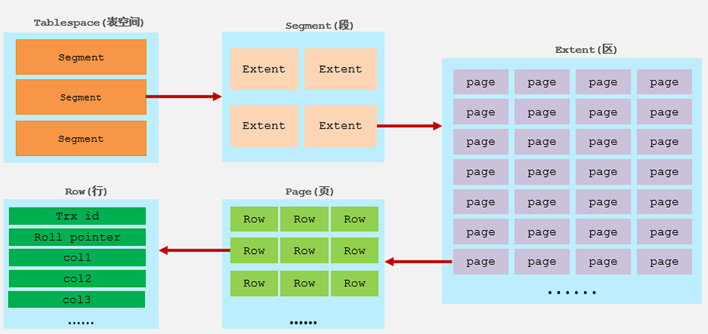
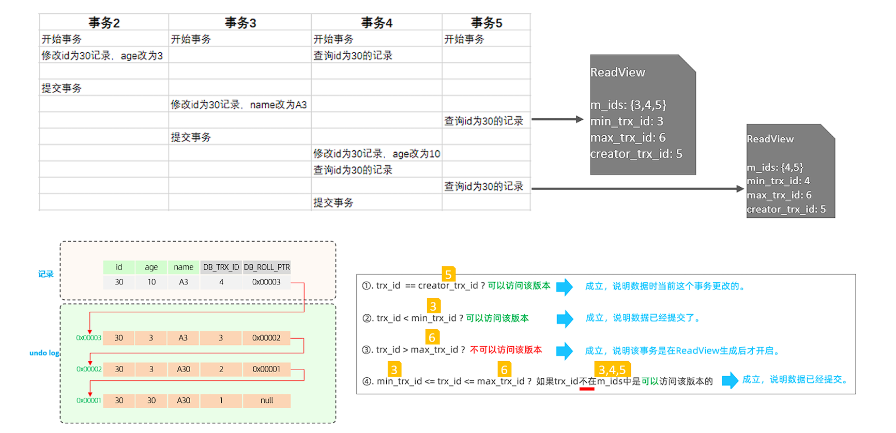

### InnoDB引擎

#### 逻辑存储结构




- 表空间
  - 表空间是InnoDB存储引擎逻辑结构的最高层，一个mysql实例可以对应多个表空 间，用于**存储记录、索引**等数据。
- 段
  - 分为数据段、索引段、回滚段，InnoDB是索引组织表，数据段就是B+树的叶子节点， 索引段即为B+树的 非叶子节点。段用来管理多个Extent（区）。
- 区
  - 表空间的单元结构，每个区的大小为1M。
- 页
  - 是InnoDB 存储引擎磁盘管理的最小单元，每个页的大小默认为 16KB。为了保证页的连续性， InnoDB 存储引擎每次从磁盘申请 4-5 个区
- 行
  - InnoDB 存储引擎数据是按行进行存放的


#### 架构

MySQL5.5 版本开始，默认使用InnoDB存储引擎，它擅长事务处理，具有崩溃恢复特性，在日常开发 中使用非常广泛。


> [!Note]
>
> 左：内存结构
>
> 右：磁盘结构


##### 内存结构

1.  *Buffer Pool*，是主内存中的一个区域，里面可以缓存磁盘上经常操作的真实数据，在执行增 删改查操作时，先操作缓冲池中的数据（若缓冲池没有数据，则从磁盘加载并缓存），然后再以一定频 率刷新到磁盘，从而减少磁盘IO，加快处理速度。
2.  *Change Buffer*，更改缓冲区（针对于**非唯一 二级索引页**），在执行DML语句时，如果这些数据Page 没有在Buffer Pool中，不会直接操作磁盘，而会将数据变更存在更改缓冲区 Change Buffer  中，在未来数据被读取时，再将数据合并恢复到Buffer Pool中，再将合并后的数据刷新到磁盘中。

> [!Tip]
>
> 与聚集索引不同，二级索引通常是非唯一的，并且以相对随机的顺序插入二级索引。同样，删除和更新 可能会影响索引树中不相邻的二级索引页，如果每一次都操作磁盘，会造成大量的磁盘IO。有了 ChangeBuffer之后，我们可以在缓冲池中进行合并处理，减少磁盘IO。

3. *Adaptive Hash Index* 自适应hash索引，用于优化对Buffer Pool数据的查询。MySQL的innoDB引擎中虽然没有直接支持 hash索引，但是给我们提供了一个功能就是这个自适应hash索引。但是hash索引不适合做范围查询、模糊匹配等。 InnoDB存储引擎会监控对表上各索引页的查询，如果观察到在特定的条件下hash索引可以提升速度， 则建立hash索引，称之为自适应hash索引。 **自适应哈希索引，无需人工干预，是系统根据情况自动完成。**
4.  *Log Buffer*：日志缓冲区，用来保存要写入到磁盘中的log日志数据（redo log 、undo log）， 默认大小为 16MB，日志缓冲区的日志会定期刷新到磁盘中。如果需要更新、插入或删除许多行的事 务，增加日志缓冲区的大小可以节省磁盘 I/O。

> [!Tip]
>
> *Log Buffer* 相关系统变量：
>
> `innodb_log_buffer_size`：缓冲区大小
>
> `innodb_flush_log_at_trx_commit`：日志刷新到磁盘时机，取值主要包含以下三个：
>
> - 1 ---> 日志在每次事务提交时写入并刷新到磁盘，默认值。
> - 0 ---> 每秒将日志写入并刷新到磁盘一次。 
> - 2 ---> 日志在每次事务提交后写入，并每秒刷新到磁盘一次。


##### 磁盘结构

1. *System Tablespace*，系统表空间是更改缓冲区的存储区域。如果表是在系统表空间而不是每个表文件或通用表空间中创建的，它也可能包含表和索引数据。
2. *File-Per-Table Tablespaces*，如果开启了`innodb_file_per_table`开关 ，则每个表的文件表空间包含单个InnoDB表的数据和索引 ，并存储在文件系统上的单个数据文件中。
3. *General Tablespaces*，通用表空间，需要通过 CREATE TABLESPACE 语法创建通用表空间，在创建表时，可以指定该表空间。

> [!Tip]
>
> ```sql
>  -- 创建表空间
>  CREATE TABLESPACE ts_name  ADD  DATAFILE  'file_name' ENGINE = engine_name;
>  
>  -- 创建表时指定表空间
>  CREATE  TABLE  xxx ...  TABLESPACE  ts_name;
> ```

4. *Undo Tablespaces*，撤销表空间，MySQL实例在初始化时会自动创建两个默认的undo表空间（初始大小16M），用于存储 undo log日志。
5. *Temporary Tablespaces*， InnoDB 使用会话临时表空间和全局临时表空间。存储用户创建的临时表等数据。
6. *Doublewrite Buffer Files* 双写缓冲区，InnoDB引擎将数据页从Buffer Pool刷新到磁盘前，先将数据页写入双写缓冲区文件 中，便于系统异常时恢复数据。
7. *Redo Log* 重做日志，是用来实现事务的持久性。该日志文件由两部分组成：重做日志缓冲（redo log  buffer）以及重做日志文件（redo log）,前者是在内存中，后者在磁盘中。当事务提交之后会把**所有修改信息都会存到该日志**中, 用于在刷新脏页到磁盘时,发生错误时, 进行**数据恢复**使用。


##### 后台线程


1. *Master Thread*，核心后台线程，负责调度其他线程，还负责将缓冲池中的数据异步刷新到磁盘中, 保持数据的一致性，  还包括脏页的刷新、合并插入缓存、undo页的回收 。
2. *IO Thread*， 在InnoDB存储引擎中大量使用了AIO来处理IO请求, 这样可以极大地提高数据库的性能，而*IO  Thread*主要负责这些IO请求的回调。

| 线程类型               | 默认线程数 | 作用                   |
| ---------------------- | ---------- | ---------------------- |
| `Read thread`          | 4          | 处理读操作             |
| `Write thread`         | 4          | 处理写操作             |
| `Log thread`           | 1          | 将日志缓冲区刷新到磁盘 |
| `Insert buffer thread` | 1          | 将写缓冲区刷新到磁盘   |

3. *Purge Thread* 主要用于回收事务已经提交了的undo log，在事务提交之后，undo log可能不用了，就用它来回收。
4. *Page Cleaner Thread* 协助 Master Thread 刷新脏页到磁盘的线程，它可以减轻 Master Thread 的工作压力，减少阻塞。


#### 事务原理

**事务**是一组操作的集合，它是一个不可分割的工作单位，事务会把所有的操作作为一个整体一起向系统提交或撤销操作请求，即这些操作要么同时成功，要么同时失败。

**ACID特性**

- 原子性（Atomicity）：事务是不可分割的最小操作单元，要么全部成功，要么全部失败。
- 一致性（Consistency）：事务完成时，必须使所有的数据都保持一致状态。
- 隔离性（Isolation）：数据库系统提供的隔离机制，保证事务在不受外部并发操作影响的独立环 境下运行。 
- 持久性（Durability）：事务一旦提交或回滚，它对数据库中的数据的改变就是永久的。


##### redo log

重做日志，记录的是事务提交时数据页的物理修改，是用来实现事务的持久性。

由两部分组成：重做日志缓冲（redo log buffer）以及重做日志文件（redo log  file）,前者是在内存中，后者在磁盘中。当事务提交之后会把**所有修改信息都存到该日志文件中**, 用 于在刷新脏页到磁盘,发生错误时, 进行数据恢复使用。


> [!Tip]
>
> 缓冲区的脏页（被修改了的数据）是通过后台线程刷新到磁盘的，此过程可能出现问题，引入redo log后就可以进行重试


##### undo log

回滚日志，用于记录数据被修改前的信息 , 作用包含两个 : **提供回滚(**保证事务的原子性) 和  **MVCC**(多版本并发控制) 。

> [!Note]
>
> undo log和redo log记录物理日志不一样，它是逻辑日志。可以认为当delete一条记录时，undo  log中会记录一条对应的insert记录，反之亦然，当update一条记录时，它记录一条对应相反的 update记录。当执行rollback时，就可以从undo log中的逻辑记录读取到相应的内容并进行回滚。


- Undo log销毁：undo log在事务执行时产生，事务提交时，并不会立即删除undo log，因为这些 日志可能还用于MVCC。 
- Undo log存储：undo log采用段的方式进行管理和记录，存放在前面介绍的 rollback segment  回滚段中，内部包含1024个undo log segment。


##### MVCC

###### 基本概念

1. **当前读**，读取的是记录的最新版本，读取时还要保证其他并发事务不能修改当前记录，会对读取的记录进行加锁。对于我们日常的操作，如：`select ... lock in share mode(共享锁)，select ...  for update、update、insert、delete(排他锁)`都是一种当前读。
2. **快照读**，简单的select（不加锁）就是快照读，快照读，读取的是记录数据的可见版本，有可能是历史数据， 不加锁，是非阻塞读。

- Read Committed：每次select，都生成一个快照读。 
- Repeatable Read：开启事务后第一个select语句才是快照读的地方。 
- Serializable：快照读会退化为当前读。

3. **MVCC**，全称 Multi-Version Concurrency Control，多版本并发控制。**指维护一个数据的多个版本**， 使得读写操作没有冲突，快照读为MySQL实现MVCC提供了一个非阻塞读功能。MVCC的具体实现，还需 要依赖于数据库记录中的三个隐式字段、undo log日志、readView。


###### 隐藏字段

手动创建一张表时，InnoDB还会自动的给我们添加隐藏字段

| 隐藏字段      | 作用                                                 |
| ------------- | ---------------------------------------------------- |
| `TB_TRX_ID`   | 最近修改事务ID                                       |
| `DB_ROLL_PTR` | 回滚指针，配合undo log指向这条记录的上一个版本       |
| `DB_ROW_ID`   | 隐藏主键，如果表结构**没有指定主键**将生成该隐藏字段 |


###### undo log

回滚日志，在insert、update、delete的时候产生的便于数据回滚的日志。 

当insert的时候，产生的undo log日志只在回滚时需要，在事务提交后，可被立即删除。

而update、delete的时候，产生的undo log日志不仅在回滚时需要，在快照读时也需要，不会立即 被删除。


**版本链** 

示例：


> [!Note]
>
> 不同事务或相同事务对同一条记录进行修改，会导致该记录的undolog生成一条 记录版本链表，链表的头部是最新的旧记录，链表尾部是最早的旧记录。


###### ReadView

ReadView（读视图）是 快照读 SQL执行时MVCC提取数据的依据，记录并维护系统当前活跃的事务 （未提交的）id。

ReadView中包含了四个核心字段：

| 字段             | 含义                           |
| ---------------- | ------------------------------ |
| `m_ids`          | 当前活跃的事务ID集合           |
| `min_trx_id`     | 最小活跃事务ID                 |
| `max_trx_id`     | 预分配事务ID，当前最大事务ID+1 |
| `creator_trx_id` | ReadView创建者的事务ID         |


**版本链访问规则**

1. **自修改检查**
   若被访问版本的`trx_id == creator_trx_id`，说明是当前事务自己修改的记录，直接访问该版本
2. **已提交事务检查**
   若`trx_id < min_trx_id`，说明该版本在ReadView创建前已提交，可以访问
3. **未来事务检查**
   若`trx_id >= max_trx_id`，说明该版本由未来事务创建，不可访问
4. **活跃事务检查**
   若`min_trx_id ≤ trx_id < max_trx_id`：
   - 若`trx_id ∈ m_ids`：创建该版本的事务仍活跃，不可访问
   - 若`trx_id ∉ m_ids`：创建该版本的事务已提交，可以访问


**不同隔离级别下的ReadView**

|    隔离级别     |         ReadView生成时机         | 解决的核心问题 |
| :-------------: | :------------------------------: | :------------: |
| READ COMMITTED  |  **每次**SELECT前生成新ReadView  |    避免脏读    |
| REPEATABLE READ | **事务首次**SELECT时生成ReadView | 避免不可重复读 |


**Read Commited 级别下的读取示例**



> [!Tip]
>
> 事务5根据上述版本链访问规则，第一次读访问到的是位于 0x00002 的快照，第二此读取是 0x00003 的快照


**Repeatable Read** 级别下，上述示例的第二次读取会复用第一次生成的ReadView，所以实现了可重复读


