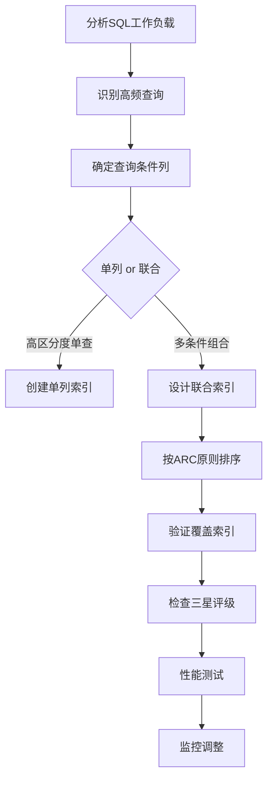
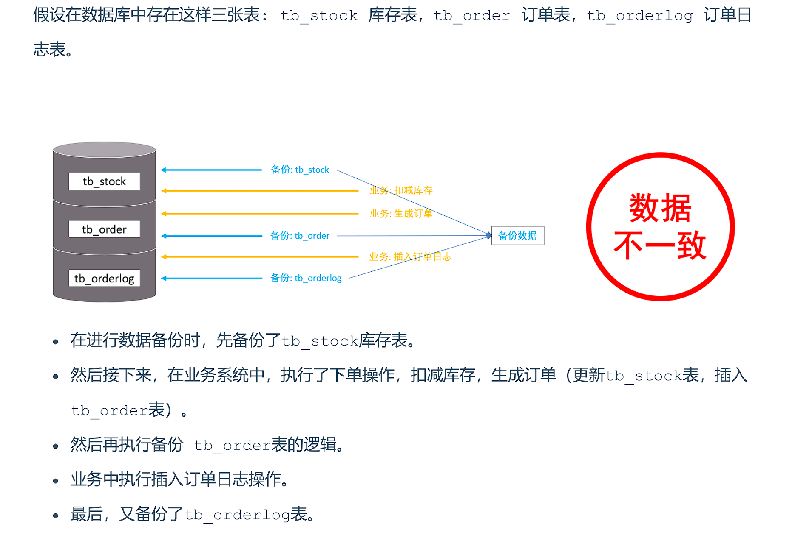
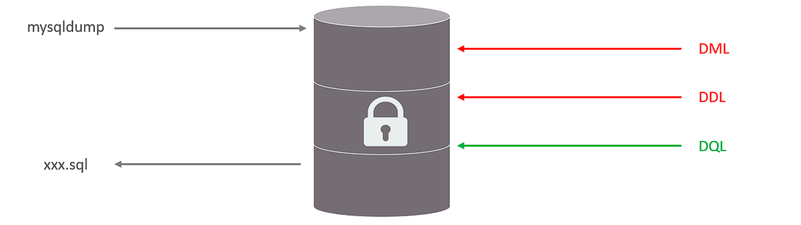

**MySQL体系结构**


## 存储引擎

> MySQL默认存储引擎为InnoDB

存储引擎是MySQL的核心组件，负责数据的**存储、检索和管理**。MySQL采用插件式架构，允许用户根据需要选择不同的存储引擎。

```sql
-- 指定存储引擎
CREATE TABLE 表名(
    ...
)ENGINE=INNODB ...
```


|     特性     | InnoDB  | MyISAM |  Memory  | Archive |
| :----------: | :-----: | :----: | :------: | :-----: |
| **事务支持** |    ✅    |   ❌    |    ❌     |    ❌    |
|  **锁粒度**  |  行锁   |  表锁  |   表锁   |  行锁   |
| **外键支持** |    ✅    |   ❌    |    ❌     |    ❌    |
|   **MVCC**   |    ✅    |   ❌    |    ❌     |    ❌    |
| **崩溃恢复** |   强    |   弱   | 数据丢失 |  中等   |
| **全文索引** | ✅(5.6+) |   ✅    |    ❌     |    ❌    |
| **压缩存储** |    ✅    |   ✅    |    ❌     |    ✅    |


<br>

### InnoDB

1. **事务处理**：

    - 完整的ACID支持
    - 四种隔离级别实现

    ```sql
    -- 查看事务隔离级别
    SHOW VARIABLES LIKE 'transaction_isolation';
    ```

2. **聚簇索引**：

    - 主键索引的叶节点直接存储行数据
    - 若无主键则自动创建6字节的ROWID

3. **二级索引**：

    - 非主键索引的叶节点存储主键值
    - 需要回表查询

4. **缓冲池管理**：

    - 采用LRU算法管理内存页
    - 包含多个子池（5.7+支持多实例）

<br>

### MyISAM

**存储结构**

- `.frm`：表结构文件
- `.MYD`：数据文件
- `.MYI`：索引文件

**适用场景**

- **只读或读多写少**的数据
- **不需要事务**的表
- **空间数据**（GIS函数支持较好）

<br>

### Memory

- **特点**：数据存储在内存中，重启丢失
- 使用场景：
    - 临时表
    - 高速缓存

<br>

### 适用场景

|     需求     | 推荐引擎 |          理由          |
| :----------: | :------: | :--------------------: |
|   需要事务   |  InnoDB  | 唯一完整支持ACID的引擎 |
|  高并发写入  |  InnoDB  |   行锁比表锁并发度高   |
|   全文搜索   |  InnoDB  |     5.6+后功能完善     |
|   数据仓库   |  MyISAM  |      计数操作更快      |
| 临时数据处理 |  Memory  |      内存表速度快      |
| 历史数据归档 | Archive  |       超高压缩比       |

<br>

---

## 索引

**作用**

- **加速查询**：类似书籍目录，减少全表扫描
- **排序优化**：避免filesort临时排序
- **约束保证**：唯一索引保证数据唯一性


**索引代价**

|      优点      |       缺点       |
| :------------: | :--------------: |
|  提高查询速度  |  降低写操作性能  |
| 保证数据唯一性 | 占用额外存储空间 |
|   加速表连接   |   增加维护成本   |


### 索引结构

|   索引类型    |    存储结构    |       适用场景       |     示例     |
| :-----------: | :------------: | :------------------: | :----------: |
|  **B+Tree**   | 平衡多路搜索树 |  精确匹配/范围查询   |   主键索引   |
|   **Hash**    |     哈希表     | 精确匹配(不支持范围) |  Memory引擎  |
| **Full-Text** |    倒排索引    |       文本搜索       | 文章内容搜索 |
|  **R-Tree**   |    空间索引    |       GIS数据        |   地图坐标   |


**B树**

B树的诞生是为了解决传统二叉查找树在**磁盘存储环境**下的性能问题：二叉查找树的高度较高（例如百万数据需要约20层），每次查找需要多次磁盘I/O，效率低下。

**特点**：

1. **多路平衡**：每个节点有多个子节点（通常数百个）
2. **完全平衡**：所有叶子节点位于同一层
3. **节点存储**：键值+数据指针（所有节点都存储数据）


**B+树**

1. **数据集中存储**：仅叶子节点存储数据记录
2. **叶子节点链表**：所有叶子节点通过指针顺序链接
3. **键值冗余存储**：非叶子节点的键值会在叶子节点再次出现


✅**为什么使用B+树作为索引结构**

1. **磁盘I/O最小化**
   - B+树的"矮胖"特性（通常3-4层就能存储亿级数据）大幅减少磁盘访问次数
   - 示例：千万级数据查询只需3次I/O（根节点常驻内存，实际2次磁盘I/O）
2. **页对齐优化**
   - B+树节点大小设计为磁盘页大小的整数倍（InnoDB默认16KB）
   - 完全匹配磁盘的块存储特性，避免读取碎片数据

|     数据结构      |     优点     |     缺点     |  适用场景   |
| :---------------: | :----------: | :----------: | :---------: |
|    **哈希表**     |   O(1)查询   | 无法范围查询 | 缓存/KV存储 |
| **红黑树/二叉树** |  内存操作快  |   树高较大   |  内存索引   |
|     **B+树**      | 综合性能最佳 | 写入成本较高 |  通用OLTP   |


#### 索引分类

**按数据结构：**

> [!Tip]
>
> 见上一节“索引结构”分类


**按存储形式：**

| 名称         | 含义                             | 特点         |
| ------------ | -------------------------------- | ------------ |
| **聚簇索引** | 数据与索引存储在一起             | 有且仅有一个 |
| **二级索引** | 叶子节点存储主键值，需要回表查询 | 没有或多个   |


聚簇索引选取规则

- 存在主键，主键索引作为聚簇索引
- 不存在主键，使用第一个唯一索引作为聚簇索引
- 无主键和唯一索引，自动生成rowid作为隐藏的聚簇索引


1. **聚簇索引**

- 特点：
  - InnoDB主键索引
  - 数据与索引存储在一起
  - 叶子节点存储完整数据页
- 优势：
  - 减少回表操作
  - 范围查询高效

2. **二级索引（非聚簇索引）**

- 特点：
  - 叶子节点存储主键值
  - 需要回表查询

```sql
-- 示例
select * from user where id = 10;

select * from user where name = 'Tom';
```

> [!Note]
>
> 以上的第一个查询语句效率更高，因为id是聚簇索引（数据与索引存放在一起），查询到id即查询到所有数据
>
> 而第二个查询需要先根据name的索引找到id，再通过id去查询数据（回表查询）


**按逻辑功能：**


#### 索引语法

```sql
-- 创建索引
CREATE [UNIQUE|FULLTEXT] INDEX index_name ON table_name (index_col_name,...);

-- 查看索引
SHOW INDEX FROM table_name;

-- 删除索引
DROP IDNEX index_name ON table_name;
```


#### SQL性能分析

##### **SQL执行频率**

判断数据库读多还是写多

```sql
-- 查看增删改频率
SHOW GLOBAL STATUS LIKE 'Com_______'
```


> [!Tip]
>
> 上图明显读多写少


##### **慢查询日志**

```sql
-- 查看慢查询日志是否开启
SHOW VARIABLES LIKE 'slow_query_log'
```

在MySQL配置文件中开启慢查询日志

```properties
slow_query_log=1

## 配置慢查询阈值
long_query_time=2
```


##### **profile分析**

profile可以记录SQL查询的耗时

```sql
-- 会话级别开启
SET profiling = 1;
SET profiling_history_size = 100;  -- 设置保留的profile数量(默认15)

-- 列出所有已记录的查询
SHOW PROFILES;

-- 查看具体查询的详细耗时
SHOW PROFILE FOR QUERY 1;

-- 查看特定类型的耗时
SHOW PROFILE CPU, BLOCK IO FOR QUERY 2;
```


##### **explain执行计划**

EXPLAIN 是MySQL查询优化的核心工具，通过分析执行计划可以了解SQL语句的执行细节

```sql
-- 标准用法
EXPLAIN SELECT * FROM orders WHERE user_id = 100;

-- 查看格式化结果（MySQL 8.0+）
EXPLAIN FORMAT=JSON SELECT * FROM products WHERE price > 100;

-- 用于连接查询分析
EXPLAIN SELECT o.* FROM orders o JOIN users u ON o.user_id = u.id WHERE u.age > 30;
```


explain查询核心字段解读

- id（查询顺序）
  - 相同id按从上到下顺序执行
  - 不同id，值越大优先级越高
- select_type（查询类型）

|     类型     |           说明            |      出现场景      |
| :----------: | :-----------------------: | :----------------: |
|    SIMPLE    |         简单查询          | 不含子查询或UNION  |
|   PRIMARY    |         外层查询          |  复杂查询的最外层  |
|   SUBQUERY   |          子查询           |  WHERE中的子查询   |
|   DERIVED    |          派生表           | FROM子句中的子查询 |
|    UNION     | UNION第二个及以后的SELECT |     UNION查询      |
| UNION RESULT |         UNION结果         |   UNION合并结果    |

- type（访问类型，关键指标），从上到下性能依次降低
  - **system**：系统表，只有一行数据
  - **const**：通过主键或唯一索引查找
  - **eq_ref**：关联查询中使用主键或唯一索引
  - **ref**：使用非唯一索引查找
  - **range**：索引范围扫描
  - **index**：全索引扫描
  - **ALL**：全表扫描（需优化）
- possible_keys & key ----> 可能使用的索引&实际使用的索引
- rows (预估扫描行数)


#### 索引使用

##### 最左前缀法则

最左前缀原则(Leftmost Prefix Principle)是MySQL**联合索引**使用的核心规则，决定了查询能否有效利用联合索引进行优化。

1. **定义**：当使用联合索引时，查询条件必须从索引的最左侧列开始，且不能跳过中间的列，否则索引将无法完全生效
2. **底层机制**：
   - 联合索引在B+树中按照定义顺序排序存储
   - 数据先按第一列排序，第一列相同再按第二列排序，依此类推
   - 类似于字典的字母排序：先按首字母排序，首字母相同再按第二个字母排序


以联合索引(A,B,C)为例：

```sql
WHERE A = 1                          ✅ 使用A列索引
WHERE A = 1 AND B = 2                ✅ 使用A,B列索引
WHERE A = 1 AND B = 2 AND C = 3      ✅ 使用A,B,C全索引
WHERE A = 1 AND C = 3                ⚠️ 仅使用A列索引(C列无法使用)
WHERE B = 2                          ❌ 不满足最左原则
WHERE B = 2 AND C = 3                ❌ 跳过A列
WHERE A = 1 AND C = 3                ❌ 跳过B列(C列无法使用)
```


##### 范围查询

- 范围查询可以使用索引，但会**中断后续索引列的使用**（最左前缀原则）
- 示例：对于索引`(A,B,C)`，查询`WHERE A>1 AND B=2`只能使用A列索引


##### 索引列计算

查询时在索引列上进行运算操作，**将使索引失效**

```sql
-- 假设在create_time上建立了索引

-- 反例（索引失效）
SELECT * FROM users WHERE YEAR(create_time)=2024;

-- 正例（使用索引）
SELECT * FROM users WHERE create_time BETWEEN '2024-01-01' AND '2024-12-31';[6,7](@ref)
```


##### 字符串不加引号

在MySQL中，字符串类型字段在查询时**必须加引号**，否则会导致索引失效和性能问题。

- 字符串不加引号会触发隐式类型转换，导致索引失效
- 测试案例显示性能差异可达100倍

```sql
-- 不加引号（索引失效，耗时2.76秒）
SELECT * FROM member_phone WHERE phone = 1521234541;

-- 加引号（使用索引，耗时0.01秒）
SELECT * FROM member_phone WHERE phone = '1521234541';
```

**执行计划差异**：

- 加引号时`EXPLAIN`显示`type=range`（索引范围扫描）
- 不加引号显示`type=index`（全索引扫描，性能接近全表扫描）


##### 模糊查询

前缀模糊会使索引失效

**通配符位置原则**

- 推荐：`LIKE 'abc%'`（使用索引）
- 避免：`LIKE '%abc'`或`LIKE '%abc%'`（全表扫描）


##### or条件存在非索引字段

当SQL查询中的OR条件包含非索引字段时，会导致严重的性能问题

1. **索引失效机制**：当OR条件中至少有一个字段无索引时，MySQL通常会放弃使用索引而转为全表扫描
2. **执行计划表现**：通过EXPLAIN可见`type=ALL`（全表扫描）且`key=NULL`（未使用索引）

```sql
-- 反例（department_id有索引，name无索引）
SELECT * FROM employees WHERE department_id = 1 OR name = 'Alice';
```


##### SQL提示

在SQL查询优化中，提示（Hints）是指导数据库优化器执行计划的重要工具。

- `USE INDEX`：提示使用特定索引

```sql
SELECT * FROM users USE INDEX(idx_email) WHERE email LIKE 'a%';
```

- `FORCE INDEX`：强制使用特定索引
- `IGNORE INDEX`：排除低效索引


##### 覆盖索引

覆盖索引（Covering Index）是MySQL查询优化的高级技术，可以显著提升查询性能。

1. **定义**：当索引包含查询所需的所有字段时，引擎**无需回表**即可直接返回结果

2. **优势**：

   - 减少I/O操作（避免访问数据文件）
   - 减少CPU计算（避免解析数据行）
   - 提升缓存效率（索引通常比数据小）

3. **索引必须包含**：

   - WHERE条件中的列
   - ORDER BY/GROUP BY中的列
   - SELECT需要的所有列

4. **验证方法**：

   ```sql
   EXPLAIN SELECT user_id, username FROM users WHERE age > 20;
   -- Extra列显示"Using index"即表示使用覆盖索引
   ```


##### 前缀索引

前缀索引（Prefix Index）是针对字符串列的一种特殊索引优化技术，特别适用于处理长文本字段的索引需求。

1. **定义**：只对列值的前N个字符建立索引，而非整个字段
2. **适用场景**：
   - VARCHAR/TEXT等长字符串字段
   - 前N个字符区分度足够高的列
   - 存储空间受限的环境

```sql
-- 创建前缀索引
CREATE INDEX index_name ON table_name(column(n));
```

3. **前缀长度**：

```sql
-- 计算不同前缀长度的区分度
SELECT 
  COUNT(DISTINCT LEFT(column_name, 5))/COUNT(*) AS selectivity5,
  COUNT(DISTINCT LEFT(column_name, 10))/COUNT(*) AS selectivity10,
  COUNT(DISTINCT LEFT(column_name, 15))/COUNT(*) AS selectivity15
FROM table_name;
-- 区分度越接近于1查询性能越好，占用空间越大，可根据实际情况选择
```

4. **长度选择原则**：

- 保证选择性 > 90%
- 平衡存储节省和查询效率
- 典型场景：
  - 邮箱：前10-15字符
  - URL：前20-30字符
  - 姓名：前3-5字符（中文）


##### 单列索引和联合索引

|   比较维度   |           单列索引           |       联合索引       |
| :----------: | :--------------------------: | :------------------: |
| **索引数量** |         需要多个索引         |   一个索引覆盖多列   |
| **存储开销** |   总体较大（每列单独存储）   | 较小（列值组合存储） |
| **查询性能** |         单条件查询快         |     多条件查询快     |
| **写入性能** | 维护成本高（需更新多个索引） |    维护成本相对低    |
| **排序优化** |       只能优化单列排序       |  可优化多列组合排序  |
| **索引覆盖** |           难以实现           |  更容易实现覆盖索引  |


#### 索引设计原则

1. 针对于数据量较大，且**查询比较频繁**的表建立索引。 
2. 针对于常作为查询条件（where）、排序（order by）、分组（group by）操作的字段建立索 引。 
3. 尽量选择**区分度高**的列作为索引，尽量建立唯一索引，区分度越高，使用索引的效率越高。 
4. 如果是字符串类型的字段，字段的长度较长，可以针对于字段的特点，建立前缀索引。
5. **尽量使用联合索引**，减少单列索引，查询时，联合索引很多时候可以**覆盖索引**，节省存储空间， 避免回表，提高查询效率。 
6. 要**控制索引的数量**，索引并不是多多益善，索引越多，维护索引结构的代价也就越大，会影响增 删改的效率。
7. 如果索引列不能存储NULL值，请在创建表时使用NOT NULL约束它。当优化器知道每列是否包含 NULL值时，它可以更好地确定哪个索引最有效地用于查询


> [!Tip]
>
> AI 生成建议：

**MySQL索引设计核心原则**

一、基础设计原则

1. 选择性优先原则
• 高选择性列优先：选择区分度高的列建立索引（区分度=不重复值/总行数）

  ```sql
  -- 计算列的选择性
  SELECT COUNT(DISTINCT status)/COUNT(*) FROM orders; -- 低于0.1则不适合单独建索引
  ```
​	• 避免低效索引：性别、状态标志等低区分度字段不应单独建索引


2. 最左前缀匹配原则
• 联合索引列顺序：

​		• 第一原则：高频查询条件放左侧

​		• 第二原则：高区分度列优先

​		• 第三原则：等值查询列优先于范围查询列

• 示例：

  ```sql
  /* 正确顺序：country(高频+高区分) > city > age(范围查询) */
  CREATE INDEX idx_loc_age ON users(country, city, age);
  ```

二、高级优化原则

3. 覆盖索引原则
• 索引包含：SELECT、WHERE、ORDER BY、GROUP BY涉及的所有列

​		• 优势：避免回表操作，提升5-10倍性能

​		• 示例：

  ```sql
  /* 覆盖索引优化 */
  CREATE INDEX idx_cover ON orders(user_id, status, amount);
  SELECT user_id, amount FROM orders WHERE user_id=100 AND status=1;
  ```

4. 三星索引原则
   1. 第一颗星：WHERE条件匹配索引列（快速定位）
   2. 第二颗星：ORDER BY/GROUP BY匹配索引顺序（避免排序）
   3. 第三颗星：SELECT列被索引覆盖（避免回表）


完美索引示例：
```sql
-- 查询：SELECT user_name FROM users WHERE age>20 AND city='北京' ORDER BY reg_date
CREATE INDEX idx_3star ON users(city, age, reg_date, user_name);
```

三、性能权衡原则

5. 读写平衡原则
| 操作   | 索引影响 | 优化建议       |
| ------ | -------- | -------------- |
| SELECT | 显著提升 | 优先考虑       |
| INSERT | 降低性能 | 控制索引数量   |
| UPDATE | 可能降低 | 避免更新索引列 |
| DELETE | 影响较小 | 可接受         |

• 建议：单表索引不超过5-6个，总索引长度不超过表大小的50%


6. 索引精简原则
• 避免冗余：

  ```sql
  /* 冗余索引示例 */
  INDEX(a), INDEX(a,b)  -- 后者可替代前者
  ```
​	• 使用工具检测：

  ```sql
  SELECT * FROM sys.schema_redundant_indexes;
  ```

四、特殊场景原则

7. 前缀索引优化
• 适用场景：长字符串字段（VARCHAR(255)+、TEXT）

​	• 长度选择：

  ```sql
  -- 计算最优前缀长度（保证选择性>90%）
  SELECT 
    COUNT(DISTINCT LEFT(title,10))/COUNT(*) AS sel10,
    COUNT(DISTINCT LEFT(title,20))/COUNT(*) AS sel20
  FROM articles;
  ```
​	• 示例：

  ```sql
  CREATE INDEX idx_title ON articles(title(15));
  ```

8. 函数索引策略（MySQL 8.0+）
• 适用场景：无法直接使用字段但可函数转换

​	• 示例：

  ```sql
  -- 日期查询优化
  CREATE INDEX idx_month ON sales((MONTH(create_time)));
  SELECT * FROM sales WHERE MONTH(create_time)=12;
  ```

五、生产实践检查清单

1. 所有外键是否已建立索引
2. 高频查询条件是否被索引覆盖
3. 联合索引是否遵循ARC原则：
   • Access frequency（访问频率）

   • Range column position（范围列位置）

   • Cardinality（区分度）

4. 是否定期分析索引使用情况
   ```sql
   ANALYZE TABLE orders;
   SELECT * FROM sys.schema_unused_indexes;
   ```
5. 是否避免在索引列上使用函数

六、索引设计流程图


通过遵循这些原则，可使索引效率提升3-10倍。建议每季度使用`pt-index-usage`工具进行索引使用率分析，及时清理无效索引。


### SQL优化

#### 插入数据

- 插入多条数据时，使用批量插入

```sql
 Insert  into  tb_test  values(1,'Tom'),(2,'Cat'),(3,'Jerry');
```

- 手动提交事务

```sql
begin[start transaction];
...
commit;
```

- 主键顺序插入性能高于乱序插入

```sql
主键乱序插入 : 8  1  9  21  88  2  4  15  89  5  7  3  
主键顺序插入 : 1  2  3  4  5  7  8  9  15  21  88  89
```


- 大批量数据插入

如果一次性需要插入大批量数据(比如: 几百万的记录)，使用insert语句插入性能较低，此时可以使 用MySQL数据库提供的load指令进行插入。

```sql
-- 客户端连接服务端时，加上参数  -–local-infile
mysql –-local-infile  -u  root  -p

-- 设置全局参数local_infile为1，开启从本地加载文件导入数据的开关
set  global  local_infile = 1;

-- 执行load指令将准备好的数据，加载到表结构中
load  data  local  infile  '/root/sql1.log'  into  table  tb_user  fields terminated  by  ','  lines  terminated  by  '\n' ; 
```

> [!Tip]
>
> 文件的内容并不是SQL语句，而是符合表结构的数据，类似CSV文件，具体可使用搜索引擎查询


#### 主键优化

> [!Tip]
>
> 需要参考 **页分裂&页合并** 相关资料

- 满足业务需求的情况下，尽量降低主键的长度。 
- 插入数据时，尽量选择顺序插入，选择使用AUTO_INCREMENT自增主键。 
- 尽量不要使用UUID做主键或者是其他自然主键，如身份证号。 
- 业务操作时，避免对主键的修改。


#### order by优化

MySQL的排序，有两种方式： 

- Using filesort : 通过表的索引或全表扫描，读取满足条件的数据行，然后在排序缓冲区sort  buffer中完成排序操作，所有不是通过索引直接返回排序结果的排序都叫 FileSort 排序。 
- Using index : 通过有序索引顺序扫描直接返回有序数据，这种情况即为 using index，不需要 额外排序，操作效率高。


**优化原则**

1. 根据排序字段建立合适的索引，多字段排序时，也遵循最左前缀法则。 
2. 尽量使用覆盖索引。 
3. 多字段排序, 一个升序一个降序，此时需要注意联合索引在创建时的规则（ASC/DESC）。 
4. 如果不可避免的出现filesort，大数据量排序时，可以适当增大排序缓冲区大小  sort_buffer_size(默认256k)。


#### group by优化

在分组操作中，我们需要通过以下两点进行优化，以提升性能： 

1. 分组操作时，可以通过索引来提高效率。 
2. 分组操作时，索引的使用也满足最左前缀法则。


#### limit优化

在数据量比较大时，如果进行limit分页查询，在查询时，页数越往后，分页查询效率越低。

> [!Tip]
>
> 当在进行分页查询时，如果执行 limit 2000000,10 ，此时需要MySQL排序前2000009 记 录，仅仅返回 2000000 - 2000009 的记录，其他记录丢弃，查询排序的代价非常大 。


优化思路: 一般分页查询时，通过创建 覆盖索引 能够比较好地提高性能，可以通过**覆盖索引加子查询**形式进行优化。

```sql
explain   select  t.*  from  tb_sku  t  ,  (select  id  from  tb_sku  order  by  id 
limit  2000000,10)  a  where t.id  =  a.id;
```


#### count优化

- *MyISAM* 引擎把一个表的总行数存在了磁盘上，因此执行 count(*) 的时候会直接返回这个 数，效率很高； 但是如果是带条件的count，MyISAM也慢。
- *InnoDB* 引擎就麻烦了，它执行 count(*) 的时候，需要把数据一行一行地从引擎里面读出 来，然后累积计数。

如果说要大幅度提升InnoDB表的count效率，主要的优化思路：自己计数(可以**借助于redis**这样的数据库进行,但是如果是带条件的count又比较麻烦了)。


**count的几种用法**

|      用法       |            语法示例             |          执行机制          |    效率    |       适用场景       |                  注意事项                  |
| :-------------: | :-----------------------------: | :------------------------: | :--------: | :------------------: | :----------------------------------------: |
|  **COUNT(\*)**  |  `SELECT COUNT(*) FROM table`   | 直接统计行数，不解析具体列 | ★★★★★ 最快 |     统计表总行数     |        优先使用，InnoDB做了特殊优化        |
| **COUNT(主键)** |  `SELECT COUNT(id) FROM table`  |  遍历主键索引统计非NULL值  | ★★★★ 较快  | 需要显式指定主键统计 |        比COUNT(*)稍慢，因需读取索引        |
| **COUNT(字段)** | `SELECT COUNT(name) FROM users` |  遍历指定字段统计非NULL值  |  ★★ 较慢   | 统计某列非NULL值数量 | 避免在可为NULL的列使用，不走索引时效率最低 |
| **COUNT(数字)** |  `SELECT COUNT(1) FROM table`   |   生成数字常量列统计行数   |  ★★★★ 快   |  与COUNT(*)功能相同  |     MySQL 8.0+优化后与COUNT(*)性能相当     |


#### update优化

> [!Note]
>
> InnoDB的行锁是**针对索引加锁**，不是针对记录加的锁 ,并且该索引不能失效，否则会从行锁升级为表锁 

更新条件尽量使用索引字段且该索引不能失效，否则MySQL会对整个表加锁，影响性能


### 视图

#### 定义

视图（View）是数据库中的一个**虚拟表**，它基于一个或多个实际表（或其它视图）的查询结果构建。视图本身不存储数据，而是保存了查询定义（SQL语句）。

```sql
-- 创建视图
CREATE VIEW  视图名[(列名列表)]   AS   SELECT语句   [ WITH [ 
CASCADED  |  LOCAL ]  CHECK  OPTION ]

-- 查看视图
SHOW CREATE VIEW 视图名称

-- 查询视图，同查询表
SELECT * FROM　视图名称

-- 修改视图
CREATE OR REPLACE VIEW 视图名 AS SELECT语句
ALTER VIEW 视图名 AS SELECT语句

-- 删除视图
DROP VIEW 视图名
```


#### 检查选项

`WITH CHECK OPTION` 是创建视图时的一个重要选项，它用于确保通过视图执行的数据修改操作（INSERT/UPDATE）必须满足视图定义的筛选条件。

当在视图定义中使用 `WITH CHECK OPTION` 时，数据库会强制：

1. 所有通过视图插入的数据必须满足视图的 WHERE 条件
2. 所有通过视图更新的数据在更新后必须仍然满足视图的 WHERE 条件


**CHECK OPTION两种模式**

1. CASCADED（级联检查）

- 检查当前视图和所有底层基视图的条件（无论底层视图是否定义了检查选项）
- 更严格，确保数据满足整个视图层次结构的条件

2. LOCAL（本地检查）

- 检查当前视图的条件
-  递归检查底层视图，但仅当这些底层视图本身定义了检查选项时才生效


#### 视图更新

要使视图可更新，视图中的行与基础表中的行之间必须存在一对一的关系。如果视图包含以下任何一 项，则该视图不可更新：

- 聚合函数或窗口函数（SUM()、 MIN()、 MAX()、 COUNT()等） 
- DISTINCT 
- GROUP BY 
- HAVING 
- UNION 或者 UNION ALL


#### 作用

1. **简单** 

   视图不仅可以简化用户对数据的理解，也可以简化他们的操作。那些被经常使用的查询可以被定义为视 图，从而使得用户不必为以后的操作每次指定全部的条件。 

2. **安全** 

   数据库可以授权，但不能授权到数据库特定行和特定的列上。通过视图用户只能查询和修改他们所能见 到的数据 

3. **数据独立** 

   视图可帮助用户屏蔽真实表结构变化带来的影响。


### 存储过程

#### 定义

存储过程是事先经过编译并存储在数据库中的一段 SQL 语句的集合，调用存储过程可以简化应用开发 人员的很多工作，减少数据在数据库和应用服务器之间的传输，对于提高数据处理的效率是有好处的。 存储过程思想上很简单，就是数据库 SQL 语言层面的代码封装与重用。


**特点**

- 封装，复用 -----------------------> 可以把某一业务SQL封装在存储过程中，需要用到 的时候直接调用即可。 
- 可以接收参数，也可以返回数据 --------> 在存储过程中，可以传递参数，也可以接收返回 值。 
- 减少网络交互，效率提升 -------------> 如果涉及到多条SQL，每执行一次都是一次网络传 输。 而如果封装在存储过程中，我们只需要网络交互一次可能就可以了。


```sql
-- 创建存储过程
CREATE PROCEDURE 存储过程名([参数列表])
BEGIN
    SQL语句
END;

-- 调用存储过程
CALL 存储过程名([参数])

-- 查看存储过程
SELECT * FROM information_schema.ROUTINES WHERE ROUTINE_SCHEMA = '数据库名'
SHOW CREATE PROCEDURE 存储过程名

-- 删除存储过程
DROP PROCEDURE [IF EXISTS] 存储过程名
```

> [!Tip]
>
> 在命令行工具中创建存储过程时需要使用`delimiter`指定结束符，否则在存储过程中的";"会被认为是结束符而无法成功创建


#### 变量

在MySQL中变量分为三种类型: 系统变量、用户定义变量、局部变量。

##### 系统变量

系统变量 是MySQL服务器提供，不是用户定义的，属于服务器层面。分为全局变量（GLOBAL）、会话 变量（SESSION）

```sql
-- 查看所有变量
SHOW [SESSION|GLOBAL] VARIABLES;

-- 模糊匹配
SHOW [SESSION|GLOBAL] VARIABLES LIKE '...';

-- 查看具体变量
SELECT @@[SESSION|GLOBAL].变量名;

-- 修改变量值
SET [SESSION|GLOBAL] 变量名 = 值;
```

> [!Caution]
>
> - 如果没有指定SESSION/GLOBAL，默认是SESSION，会话变量
> -  mysql服务重新启动之后，所设置的全局参数会失效，要想不失效，需要使用配置文件。


##### 用户自定义变量

用户定义变量 是用户根据需要自己定义的变量，用户变量不用提前声明，在用的时候直接用 "@变量 名" 使用就可以。其作用域为当前连接。

```sql
-- 变量赋值
SET @var_name = expr [, @var_name = expr] ... ; 
SET @var_name := expr [, @var_name := expr] ... ; 

SELECT 字段名 INTO @var_name FROM 表名;

-- 查看变量
SELECT @var_name[,@var_name,...];
```


##### 局部变量

局部变量 是根据需要定义的在局部生效的变量，访问之前，需要DECLARE声明，可用作存储过程内的 局部变量和输入参数。

```sql
DECLARE 变量名 变量类型[DEFAULT ...];

SET 变量名 = 值;
SET 变量名 := 值;

SELECT 字段名 INTO 变量名 FROM 表名;
```


#### 流程控制

##### if

```sql
IF condition THEN 
    .....
ELSEIF condition THEN       -- 可选
    .....
ELSE                     -- 可选
    .....
END  IF;
```


##### 参数

示例

```sql
-- 创建带参数的存储过程
create procedure test(in score int, out result varchar(10))
begin
    if score >= 85 then
        set result := '优秀';
    elseif score >= 60 then
        set result := '及格';
    else
        set result := '不及格';
    end if;
end;


-- 调用并接收结果
call test(85, @result);
select @result;
```

> [!Note]
>
> `in` 指定为输入参数
>
> `out` 指定为输出参数
>
> `inout` 指定既为输入参数也为输出参数


##### case

```sql
-- 语法一
case case_value
    when value1 then statement1
    when value2 then statement2
    ...
    else statement
end case;

-- 语法二
case
    when condition then statement1
    when condition then statement2
    ...
end case;
```


##### 循环

```sql
-- while循环,condition满足时循环
while condition do
    statement
end while;


-- repeat循环,condition满足时结束循环
repeat
    statement
    until condition
end repeat;


-- loop循环,leave退出循环,iterate直接进入下一层循环
[begin_label:] looop
    statement
end loop [end_label];
-- 示例
label:loop
    if condition then
        leave label;
    end if;
    statement
end loop lael;
```


##### 游标

MySQL游标(Cursor)是一种数据库对象，用于在结果集中逐行处理数据。

```sql
-- 声明游标
declare 游标名称 cursor for 查询语句

-- 打开游标
open 游标名称

-- 获取游标记录
fetch 游标名称 into 变量

-- 关闭游标
close 游标名称


-- 示例
create procedure test(in uage int)
begin
    declare uname varchar(100);
    declare uage int;
    
    -- 声明游标
    declare cursor_user cursor for select name, age from tb_user where age <= uage;
    
    -- 声明游标无数据时处理程序
    declare exit handler for sqlstate '02000' close cursor_user;
    
    create table if not exists user(
        ...
    );
    
    open cursor_suer;
    
    -- 死循环处理数据，由handler处理退出
    while true do
        fetch cursor_user into uname, age;
        insert into user(...) values (uname, age);
    end while;
    
    close cursor_user;
end;
```


##### 条件处理程序

条件处理程序（Handler）可以用来定义在流程控制结构执行过程中遇到问题时相应的处理步骤。

> [!Tip]
>
> 如上小节对游标数据处理完后的条件处理程序

```sql
-- 定义handler
declare handler_action handler for condition_value[,condition_value,...] statement;

-- 参数说明
handler_action
    continue: 继续执行
    exit: 停止执行
condition_value
    sqlstate sqlstate_value: 状态码
    sqlwarning: 以01开头的sqlstate代码简写
    not found: 以02开头的sqlstate代码简写
    sqlexception: 其他sqlstate代码简写
```


#### 存储函数

存储函数是有返回值的存储过程，存储函数的参数只能是IN类型的。

```sql
CREATE  FUNCTION 存储函数名称 ([ 参数列表 ])
RETURNS  type  [characteristic ...]
 BEGIN
    -- SQL语句
    RETURN ...;
 END;
 
-- characteristic说明：
    DETERMINISTIC：相同的输入参数总是产生相同的结果
    NO SQL ：不包含 SQL 语句。
    READS SQL DATA：包含读取数据的语句，但不包含写入数据的语句。
```


### 触发器

触发器是与表有关的数据库对象，指在insert/update/delete之前(BEFORE)或之后(AFTER)，触 发并执行触发器中定义的SQL语句集合。触发器的这种特性可以协助应用在数据库端确保**数据的完整性  , 日志记录 , 数据校验**等操作 。


| 触发器类型     | NEW 和 OLD                                           |
| -------------- | ---------------------------------------------------- |
| INSERT 触发器  | NEW 表示将要或者已经新增的数据                       |
| UPDARTE 触发器 | OLD 表示修改前的数据，NEW 表示将要或已经修改后的数据 |
| DELETE 触发器  | OLD 表示将要或者已经删除的数据                       |


```sql
-- 创建触发器
create trigger trigger_name
before/after insert/update/delete
on table_name for each row
begin
    statement
end;

-- 查看触发器
show triggers;

-- 删除触发器
drop trigger [schema_name.]trigger_name;
```

 

**案例：使用触发器记录日志**

```sql
-- 插入数据触发器
create trigger insert_trigger
after insert on tb_user for each row
begin
    insert into user_log(id,operation,operation_time,operation_id,operation_params) values
    (null,'insert',now(),new.id,concat('插入数据：id=',new.id,',name',new.name,...));
end;

-- 更新触发器
create trigger update_trigger
after update on tb_user for each row
begin
    insert into user_log(id,operation,operation_time,operation_id,operation_params) values
    (null,'update',now(),new.id,
        concat('更新前数据：',old.name,...,'更新后数据：',new.name,...)
    );
end;

-- 删除触发器
create trigger delete_trigger
after delete on tb_user for each row
begin
    insert into user_log(id,operation,operation_time,operation_id,operation_params) values
    (null,'delete',now(),new.id,
        concat('删除数据：',old.name,...)
    );
end;
```


### 锁

#### 概述

锁是计算机协调多个进程或线程并发访问某一资源的机制。在数据库中，除传统的计算资源（CPU、 RAM、I/O）的争用以外，数据也是一种供许多用户共享的资源。


MySQL中的锁，按照锁的粒度分，分为以下三类： 

- 全局锁：锁定数据库中的所有表。 
- 表级锁：每次操作锁住整张表。 
- 行级锁：每次操作锁住对应的行数据。


#### 全局锁

全局锁就是对整个数据库实例加锁，加锁后整个实例就处于只读状态，后续的DML的写语句，DDL语句，已经更新操作的事务提交语句都将被**阻塞**。


其典型的使用场景是做**全库的逻辑备份**，对所有的表进行锁定，从而获取一致性视图，保证数据的完整性。


> [!Tip]
>
> 不加全局锁的情况下可能发生的数据不一致问题




> [!Tip]
>
> 加上全局锁后只能够进行查询



```sql
-- 加全局锁
flush tables with read lock;

-- 逻辑备份
mysqldump  -uroot –p******  database_name > database_backup.sql;

-- 释放锁
unlock tables;
```


加上全局锁，很多业务都会阻塞，在InnoDB引擎中，我们可以在备份时加上参数 --single-transaction 参数来完成不加锁的一致 性数据备份。

```sql
mysqldump --single-transaction -uroot –p******  database_name > database_backup.sql;
```

> [!Note]
>
> 该命令会启动一个事务并设置隔离级别为`REPEATABLE READ`，通过`START TRANSACTION WITH CONSISTENT SNAPSHOT`创建一致性视图。备份过程中读取的都是事务开始时的一致性数据快照，不受其他并发事务修改的影响


#### 表级锁

有三类表级锁：

- 表锁 
- 元数据锁（meta data lock，MDL） 
- 意向锁


---

1. 表锁又有两种：

- 表**共享读锁**（多客户端读）
- 表**独占写锁**（单客户端读写）

```sql
-- 加锁
lock tables table_name read/write;

-- 释放锁
unlock tables;
```

> [!Tip]
>
> 读锁不会阻塞其他客户端的读，但是会阻塞写。写锁既会阻塞其他客户端的读，又会阻塞其他客户端的写。


---

2. 元数据锁（MDL）加锁过程是系统自动控制，无需显式使用，在访问一张表的时候会自动加上。

MDL锁主要作用是维 护表元数据的数据一致性，在表上有活动事务的时候，不可以对元数据进行写入操作。**为了避免DML与 DDL冲突，保证读写的正确性。**

|       操作类型       |  MDL锁类型   |   阻塞关系    |
| :------------------: | :----------: | :-----------: |
|      SELECT查询      | SHARED_READ  | 不阻塞其他DML |
| INSERT/UPDATE/DELETE | SHARED_WRITE | 不阻塞其他DML |
|   DDL操作(ALTER等)   |  EXCLUSIVE   | 阻塞所有操作  |
|    手动锁表(READ)    |    SHARED    |    阻塞DDL    |
|   手动锁表(WRITE)    |  EXCLUSIVE   | 阻塞所有操作  |


---

3. 为了避免DML在执行时，加的行锁与表锁的冲突，在InnoDB中引入了意向锁

>  [!Tip]
>
> 假如没有意向锁，客户端一对表加了行锁后，客户端二会检查当前表是否有对应的行锁（逐行遍历，效率低），如果没有，则添加表锁

客户端在执行DML操作时，会对涉及的行加行锁，**同时也会对该表加上意向锁**，而其他客户端，在对这张表加表锁的时候，会根据该表上所加的意向锁来判定是否可以成功加表锁


- 意向共享锁(IS): 由语句select ... lock in share mode添加 。 与 表锁共享锁 (read)兼容，与表锁排他锁(write)互斥。 
- 意向排他锁(IX): 由insert、update、delete、select...for update添加 。与表锁共 享锁(read)及排他锁(write)都互斥，意向锁之间不会互斥。


#### 行级锁

行级锁，每次操作锁住对应的行数据。锁定粒度最小，发生锁冲突的概率最低，并发度最高。应用在 **InnoDB存储引擎**中。

InnoDB的数据是基于索引组织的，行锁是通过对索引上的**索引项加锁**来实现的，而不是对记录加的锁。


- 行锁（Record Lock）：锁定单个行记录的锁，防止其他事务对此行进行update和delete。
- 间隙锁（Gap Lock）：锁定索引记录间隙（不含该记录），确保索引记录间隙不变，防止其他事 务在这个间隙进行insert，产生幻读。
- 临键锁（Next-Key Lock）：行锁和间隙锁组合，同时锁住数据，并锁住数据前面的间隙Gap。


---

1. 行锁

共享锁（S）：允许一个事务去读一行，阻止其他事务获得相同数据集的排它锁。 

排他锁（X）：允许获取排他锁的事务更新数据，阻止其他事务获得相同数据集的共享锁和排他锁。

|      | S    | X    |
| ---- | ---- | ---- |
| S    | 兼容 | 冲突 |
| X    | 冲突 | 冲突 |


加锁情况

|              SQL              | 类型 | 加锁方式 |
| :---------------------------: | :--: | :------: |
|            insert             |  X   |   自动   |
|            update             |  X   |   自动   |
|            delete             |  X   |   自动   |
|           select...           |  -   |    -     |
| select ... lock in share mode |  S   |   手动   |
|     select ... for update     |  X   |   手动   |

> [!Caution]
>
> 如果where条件里的字段不是索引项，行锁会升级为表锁


---

2. 间隙锁&临键锁

- 索引上的等值查询(唯一索引)，给**不存在的记录加锁**时, 优化为间隙锁 。 
- 索引上的等值查询(非唯一普通索引)，向右遍历时最后一个值不满足查询需求时，next-key  lock 退化为间隙锁。 
- 索引上的范围查询(唯一索引)--会访问到不满足条件的第一个值为止。

> [!Tip]
>
> 间隙锁的唯一目是防止其他事务插入间隙。间隙锁可以共存，一个事务采用的间隙锁不会 阻止另一个事务在同一间隙上采用间隙锁。


### InnoDB引擎

#### 逻辑存储结构


- 表空间
  - 表空间是InnoDB存储引擎逻辑结构的最高层，一个mysql实例可以对应多个表空 间，用于**存储记录、索引**等数据。
- 段
  - 分为数据段、索引段、回滚段，InnoDB是索引组织表，数据段就是B+树的叶子节点， 索引段即为B+树的 非叶子节点。段用来管理多个Extent（区）。
- 区
  - 表空间的单元结构，每个区的大小为1M。
- 页
  - 是InnoDB 存储引擎磁盘管理的最小单元，每个页的大小默认为 16KB。为了保证页的连续性， InnoDB 存储引擎每次从磁盘申请 4-5 个区
- 行
  - InnoDB 存储引擎数据是按行进行存放的


#### 架构

MySQL5.5 版本开始，默认使用InnoDB存储引擎，它擅长事务处理，具有崩溃恢复特性，在日常开发 中使用非常广泛。


> [!Note]
>
> 左：内存结构
>
> 右：磁盘结构


##### 内存结构

1.  *Buffer Pool*，是主内存中的一个区域，里面可以缓存磁盘上经常操作的真实数据，在执行增 删改查操作时，先操作缓冲池中的数据（若缓冲池没有数据，则从磁盘加载并缓存），然后再以一定频 率刷新到磁盘，从而减少磁盘IO，加快处理速度。
2.  *Change Buffer*，更改缓冲区（针对于**非唯一 二级索引页**），在执行DML语句时，如果这些数据Page 没有在Buffer Pool中，不会直接操作磁盘，而会将数据变更存在更改缓冲区 Change Buffer  中，在未来数据被读取时，再将数据合并恢复到Buffer Pool中，再将合并后的数据刷新到磁盘中。

> [!Tip]
>
> 与聚集索引不同，二级索引通常是非唯一的，并且以相对随机的顺序插入二级索引。同样，删除和更新 可能会影响索引树中不相邻的二级索引页，如果每一次都操作磁盘，会造成大量的磁盘IO。有了 ChangeBuffer之后，我们可以在缓冲池中进行合并处理，减少磁盘IO。

3. *Adaptive Hash Index* 自适应hash索引，用于优化对Buffer Pool数据的查询。MySQL的innoDB引擎中虽然没有直接支持 hash索引，但是给我们提供了一个功能就是这个自适应hash索引。但是hash索引不适合做范围查询、模糊匹配等。 InnoDB存储引擎会监控对表上各索引页的查询，如果观察到在特定的条件下hash索引可以提升速度， 则建立hash索引，称之为自适应hash索引。 **自适应哈希索引，无需人工干预，是系统根据情况自动完成。**
4.  *Log Buffer*：日志缓冲区，用来保存要写入到磁盘中的log日志数据（redo log 、undo log）， 默认大小为 16MB，日志缓冲区的日志会定期刷新到磁盘中。如果需要更新、插入或删除许多行的事 务，增加日志缓冲区的大小可以节省磁盘 I/O。

> [!Tip]
>
> *Log Buffer* 相关系统变量：
>
> `innodb_log_buffer_size`：缓冲区大小
>
> `innodb_flush_log_at_trx_commit`：日志刷新到磁盘时机，取值主要包含以下三个：
>
> - 1 ---> 日志在每次事务提交时写入并刷新到磁盘，默认值。
> - 0 ---> 每秒将日志写入并刷新到磁盘一次。 
> - 2 ---> 日志在每次事务提交后写入，并每秒刷新到磁盘一次。


##### 磁盘结构

1. *System Tablespace*，系统表空间是更改缓冲区的存储区域。如果表是在系统表空间而不是每个表文件或通用表空间中创建的，它也可能包含表和索引数据。
2. *File-Per-Table Tablespaces*，如果开启了`innodb_file_per_table`开关 ，则每个表的文件表空间包含单个InnoDB表的数据和索引 ，并存储在文件系统上的单个数据文件中。
3. *General Tablespaces*，通用表空间，需要通过 CREATE TABLESPACE 语法创建通用表空间，在创建表时，可以指定该表空间。

> [!Tip]
>
> ```sql
>  -- 创建表空间
>  CREATE TABLESPACE ts_name  ADD  DATAFILE  'file_name' ENGINE = engine_name;
>  
>  -- 创建表时指定表空间
>  CREATE  TABLE  xxx ...  TABLESPACE  ts_name;
> ```

4. *Undo Tablespaces*，撤销表空间，MySQL实例在初始化时会自动创建两个默认的undo表空间（初始大小16M），用于存储 undo log日志。
5. *Temporary Tablespaces*， InnoDB 使用会话临时表空间和全局临时表空间。存储用户创建的临时表等数据。
6. *Doublewrite Buffer Files* 双写缓冲区，InnoDB引擎将数据页从Buffer Pool刷新到磁盘前，先将数据页写入双写缓冲区文件 中，便于系统异常时恢复数据。
7. *Redo Log* 重做日志，是用来实现事务的持久性。该日志文件由两部分组成：重做日志缓冲（redo log  buffer）以及重做日志文件（redo log）,前者是在内存中，后者在磁盘中。当事务提交之后会把**所有修改信息都会存到该日志**中, 用于在刷新脏页到磁盘时,发生错误时, 进行**数据恢复**使用。


##### 后台线程


1. *Master Thread*，核心后台线程，负责调度其他线程，还负责将缓冲池中的数据异步刷新到磁盘中, 保持数据的一致性，  还包括脏页的刷新、合并插入缓存、undo页的回收 。
2. *IO Thread*， 在InnoDB存储引擎中大量使用了AIO来处理IO请求, 这样可以极大地提高数据库的性能，而*IO  Thread*主要负责这些IO请求的回调。

| 线程类型               | 默认线程数 | 作用                   |
| ---------------------- | ---------- | ---------------------- |
| `Read thread`          | 4          | 处理读操作             |
| `Write thread`         | 4          | 处理写操作             |
| `Log thread`           | 1          | 将日志缓冲区刷新到磁盘 |
| `Insert buffer thread` | 1          | 将写缓冲区刷新到磁盘   |

3. *Purge Thread* 主要用于回收事务已经提交了的undo log，在事务提交之后，undo log可能不用了，就用它来回收。
4. *Page Cleaner Thread* 协助 Master Thread 刷新脏页到磁盘的线程，它可以减轻 Master Thread 的工作压力，减少阻塞。


#### 事务原理

**事务**是一组操作的集合，它是一个不可分割的工作单位，事务会把所有的操作作为一个整体一起向系统提交或撤销操作请求，即这些操作要么同时成功，要么同时失败。

**ACID特性**

- 原子性（Atomicity）：事务是不可分割的最小操作单元，要么全部成功，要么全部失败。
- 一致性（Consistency）：事务完成时，必须使所有的数据都保持一致状态。
- 隔离性（Isolation）：数据库系统提供的隔离机制，保证事务在不受外部并发操作影响的独立环 境下运行。 
- 持久性（Durability）：事务一旦提交或回滚，它对数据库中的数据的改变就是永久的。


##### redo log

重做日志，记录的是事务提交时数据页的物理修改，是用来实现事务的持久性。

由两部分组成：重做日志缓冲（redo log buffer）以及重做日志文件（redo log  file）,前者是在内存中，后者在磁盘中。当事务提交之后会把**所有修改信息都存到该日志文件中**, 用 于在刷新脏页到磁盘,发生错误时, 进行数据恢复使用。


> [!Tip]
>
> 缓冲区的脏页（被修改了的数据）是通过后台线程刷新到磁盘的，此过程可能出现问题，引入redo log后就可以进行重试


##### undo log

回滚日志，用于记录数据被修改前的信息 , 作用包含两个 : **提供回滚(**保证事务的原子性) 和  **MVCC**(多版本并发控制) 。

> [!Note]
>
> undo log和redo log记录物理日志不一样，它是逻辑日志。可以认为当delete一条记录时，undo  log中会记录一条对应的insert记录，反之亦然，当update一条记录时，它记录一条对应相反的 update记录。当执行rollback时，就可以从undo log中的逻辑记录读取到相应的内容并进行回滚。


- Undo log销毁：undo log在事务执行时产生，事务提交时，并不会立即删除undo log，因为这些 日志可能还用于MVCC。 
- Undo log存储：undo log采用段的方式进行管理和记录，存放在前面介绍的 rollback segment  回滚段中，内部包含1024个undo log segment。


##### MVCC

###### 基本概念

1. **当前读**，读取的是记录的最新版本，读取时还要保证其他并发事务不能修改当前记录，会对读取的记录进行加锁。对于我们日常的操作，如：`select ... lock in share mode(共享锁)，select ...  for update、update、insert、delete(排他锁)`都是一种当前读。
2. **快照读**，简单的select（不加锁）就是快照读，快照读，读取的是记录数据的可见版本，有可能是历史数据， 不加锁，是非阻塞读。

- Read Committed：每次select，都生成一个快照读。 
- Repeatable Read：开启事务后第一个select语句才是快照读的地方。 
- Serializable：快照读会退化为当前读。

3. **MVCC**，全称 Multi-Version Concurrency Control，多版本并发控制。**指维护一个数据的多个版本**， 使得读写操作没有冲突，快照读为MySQL实现MVCC提供了一个非阻塞读功能。MVCC的具体实现，还需 要依赖于数据库记录中的三个隐式字段、undo log日志、readView。


###### 隐藏字段

手动创建一张表时，InnoDB还会自动的给我们添加隐藏字段

| 隐藏字段      | 作用                                                 |
| ------------- | ---------------------------------------------------- |
| `TB_TRX_ID`   | 最近修改事务ID                                       |
| `DB_ROLL_PTR` | 回滚指针，配合undo log指向这条记录的上一个版本       |
| `DB_ROW_ID`   | 隐藏主键，如果表结构**没有指定主键**将生成该隐藏字段 |


###### undo log

回滚日志，在insert、update、delete的时候产生的便于数据回滚的日志。 

当insert的时候，产生的undo log日志只在回滚时需要，在事务提交后，可被立即删除。

而update、delete的时候，产生的undo log日志不仅在回滚时需要，在快照读时也需要，不会立即 被删除。


**版本链** 

示例：


> [!Note]
>
> 不同事务或相同事务对同一条记录进行修改，会导致该记录的undolog生成一条 记录版本链表，链表的头部是最新的旧记录，链表尾部是最早的旧记录。


###### ReadView

ReadView（读视图）是 快照读 SQL执行时MVCC提取数据的依据，记录并维护系统当前活跃的事务 （未提交的）id。

ReadView中包含了四个核心字段：

| 字段             | 含义                           |
| ---------------- | ------------------------------ |
| `m_ids`          | 当前活跃的事务ID集合           |
| `min_trx_id`     | 最小活跃事务ID                 |
| `max_trx_id`     | 预分配事务ID，当前最大事务ID+1 |
| `creator_trx_id` | ReadView创建者的事务ID         |


**版本链访问规则**

1. **自修改检查**
   若被访问版本的`trx_id == creator_trx_id`，说明是当前事务自己修改的记录，直接访问该版本
2. **已提交事务检查**
   若`trx_id < min_trx_id`，说明该版本在ReadView创建前已提交，可以访问
3. **未来事务检查**
   若`trx_id >= max_trx_id`，说明该版本由未来事务创建，不可访问
4. **活跃事务检查**
   若`min_trx_id ≤ trx_id < max_trx_id`：
   - 若`trx_id ∈ m_ids`：创建该版本的事务仍活跃，不可访问
   - 若`trx_id ∉ m_ids`：创建该版本的事务已提交，可以访问


**不同隔离级别下的ReadView**

|    隔离级别     |         ReadView生成时机         | 解决的核心问题 |
| :-------------: | :------------------------------: | :------------: |
| READ COMMITTED  |  **每次**SELECT前生成新ReadView  |    避免脏读    |
| REPEATABLE READ | **事务首次**SELECT时生成ReadView | 避免不可重复读 |


**Read Commited 级别下的读取示例**


> [!Tip]
>
> 事务5根据上述版本链访问规则，第一次读访问到的是位于 0x00002 的快照，第二此读取是 0x00003 的快照


**Repeatable Read** 级别下，上述示例的第二次读取会复用第一次生成的ReadView，所以实现了可重复读


### MySQL管理

#### 系统数据库

MySQL自带数据库说明：

| 数据库             | 作用                                                         |
| ------------------ | ------------------------------------------------------------ |
| mysql              | 存储MySQL服务器正常运行所需要的各种信息 （时区、主从、用 户、权限等） |
| information_schema | 提供了访问数据库元数据的各种表和视图，包含数据库、表、字段类 型及访问权限等 |
| performance_schema | 为MySQL服务器运行时状态提供了一个底层监控功能，主要用于收集 数据库服务器性能参数 |
| sys                | 包含了一系列方便 DBA 和开发人员利用 performance_schema 性能数据库进行性能调优和诊断的视图 |


#### MySQL命令行客户端

- mysql

```bash
语法 ：    
    mysql   [options]   [database]
选项 ： 
    -u, --user=name         #指定用户名
    -p, --password[=name]           #指定密码
    -h, --host=name         #指定服务器IP或域名
    -P, --port=port             #指定连接端口
    -e, --execute=name          #执行SQL语句并退出
```


- mysqladmin，用于执行各种管理操作

```bash
mysqladmin -u root -p status	# 查看服务器状态
mysqladmin -u root -p variables	# 查看服务器变量
mysqladmin -u root -p shutdown	# 关闭服务器
mysqladmin -u root -p flush-logs      # 刷新日志
mysqladmin -u root -p flush-privileges # 刷新权限
mysqladmin -u root -p flush-status    # 重置状态计数器
```


- mysqlbinlog，由于服务器生成的二进制日志文件以二进制格式保存，所以如果想要检查这些文本的文本格式，就会使用到mysqlbinlog 日志管理工具

```bash
语法 ：    
    mysqlbinlog [options]  log-files1 log-files2 ...

选项 ： 
    -d, --database=name         指定数据库名称，只列出指定的数据库相关操作。
    -o, --offset=#              忽略掉日志中的前n行命令。
    -r,--result-file=name       将输出的文本格式日志输出到指定文件。
    -s, --short-form            显示简单格式， 省略掉一些信息。
    --start-datatime=date1  --stop-datetime=date2       指定日期间隔内的所有日志。
    --start-position=pos1 --stop-position=pos2          指定位置间隔内的所有日志。
```


- mysqlshow，对象查找工具，用来很快地查找存在哪些数据库、数据库中的表、表中的列或者索 引。

```bash
语法 ：    
    mysqlshow [options] [db_name [table_name [col_name]]]
选项 ： 
    --count     显示数据库及表的统计信息（数据库，表 均可以不指定）
    -i      显示指定数据库或者指定表的状态信息
示例：
    #查询test库中每个表中的字段书，及行数
    mysqlshow -uroot -p2143 test --count
    
    #查询test库中book表的详细情况
    mysqlshow -uroot -p2143 test book --count
```


- mysqldump，用来备份数据库或在不同数据库之间进行数据迁移。备份内容包含创建表，及 插入表的SQL语句。

```bash
语法 ：    
    mysqldump [options] db_name [tables]
    mysqldump [options] --database/-B db1 [db2 db3...]
    mysqldump [options] --all-databases/-A
连接选项 ：  
    -u, --user=name                 指定用户名
    -p, --password[=name]           指定密码
    -h, --host=name                 指定服务器ip或域名
    -P, --port=#                    指定连接端口
输出选项：
    --add-drop-database         在每个数据库创建语句前加上 drop database 语句
    --add-drop-table            在每个表创建语句前加上 drop table 语句 , 默认开启 ; 不开启 (--skip-add-drop-table)
    -n, --no-create-db          不包含数据库的创建语句
    -t, --no-create-info        不包含数据表的创建语句
    -d --no-data                不包含数据
    -T, --tab=name             	自动生成两个文件：一个.sql文件，创建表结构的语句；一个.txt文件，数据文件
  
-- 备份数据库
mysqldump -uroot -p1234 db01 > db01.sql
```


-  mysqlimport ，是客户端数据导入工具，用来导入mysqldump 加 -T 参数后导出的文本文件。

```sql
语法 ：    
    mysqlimport [options]  db_name  textfile1  [textfile2...]
示例 ： 
    mysqlimport -uroot -p2143 test /tmp/city.txt
```


-  source ，如果需要导入sql文件,可以使用**mysql中的source** 指令

```sql
语法 ：    
source /root/xxxxx.sql
```


---
