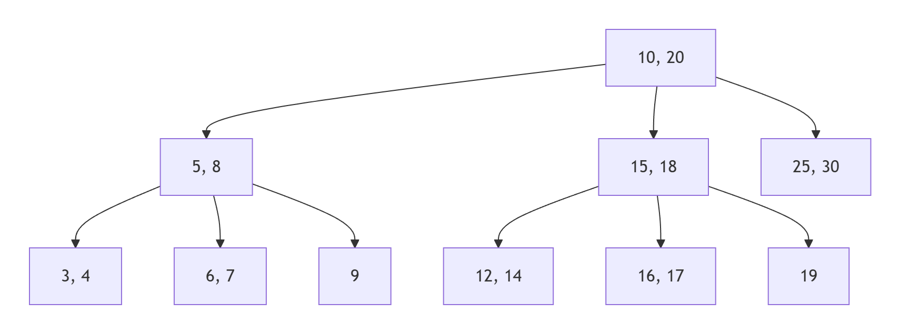
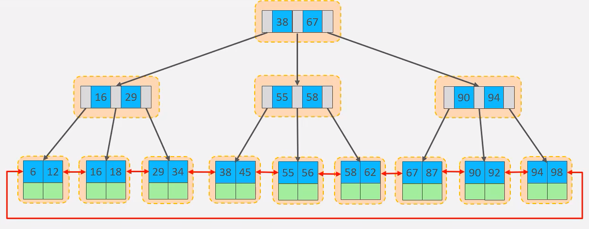
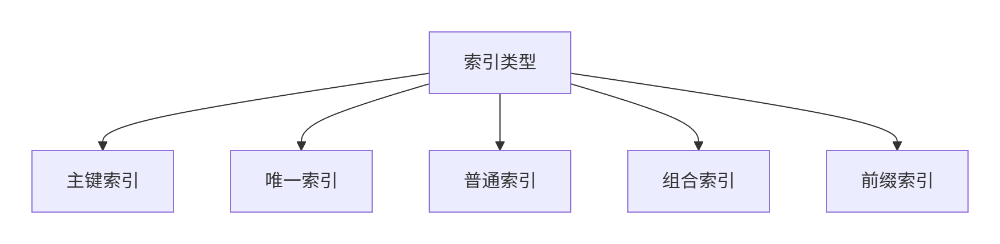
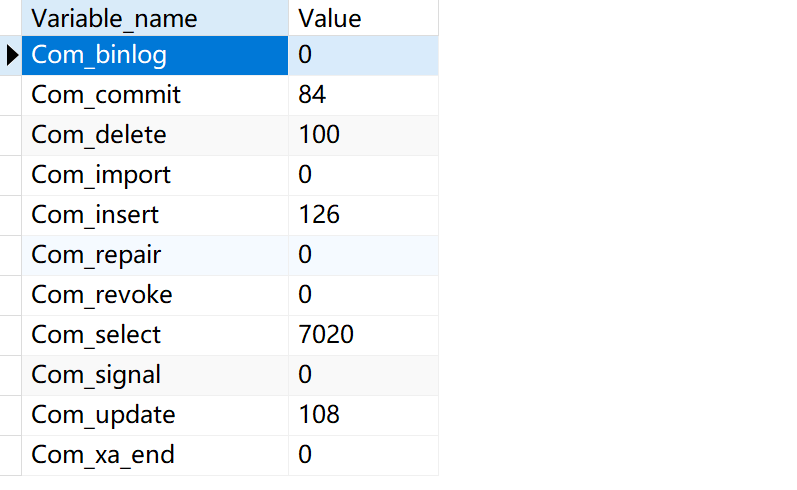
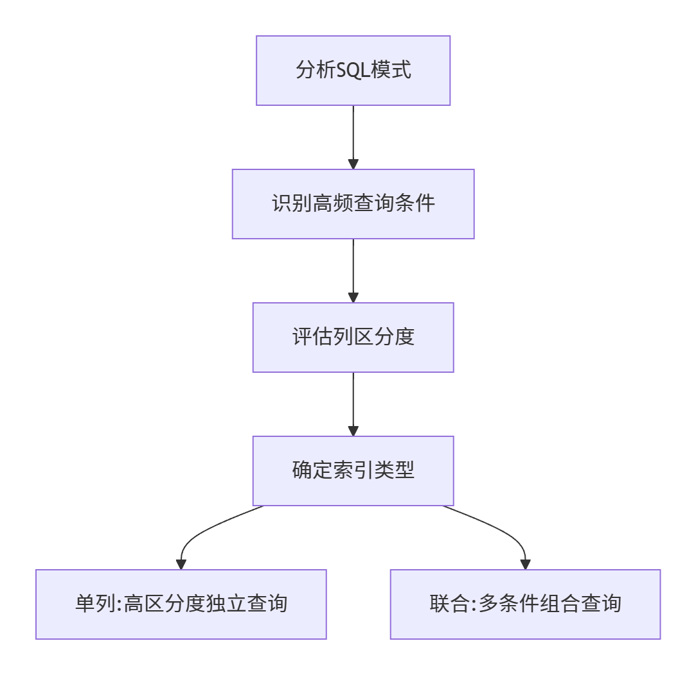
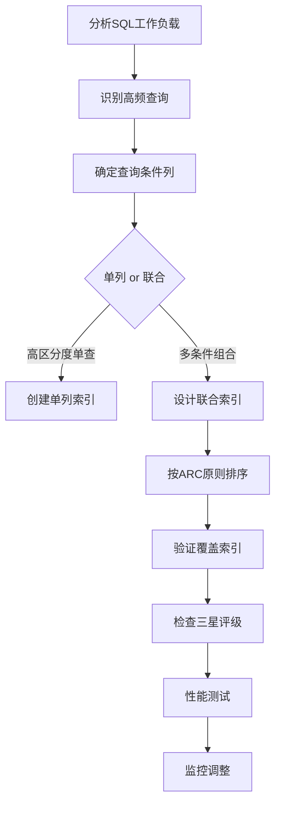

**作用**

- **加速查询**：类似书籍目录，减少全表扫描
- **排序优化**：避免filesort临时排序
- **约束保证**：唯一索引保证数据唯一性


|      优点      |       缺点       |
| :------------: | :--------------: |
|  提高查询速度  |  降低写操作性能  |
| 保证数据唯一性 | 占用额外存储空间 |
|   加速表连接   |   增加维护成本   |


### 索引结构

|   索引类型    |    存储结构    |       适用场景       |     示例     |
| :-----------: | :------------: | :------------------: | :----------: |
|  **B+ Tree**   | 平衡多路搜索树 |  精确匹配/范围查询   |   主键索引   |
|   **Hash**    |     哈希表     | 精确匹配(不支持范围) |  Memory引擎  |
| **Full-Text** |    倒排索引    |       文本搜索       | 文章内容搜索 |
|  **R-Tree**   |    空间索引    |       GIS数据        |   地图坐标   |


**B树**

B树的诞生是为了解决传统二叉查找树在**磁盘存储环境**下的性能问题：二叉查找树的高度较高（例如百万数据需要约20层），每次查找需要多次磁盘I/O，效率低下。

**特点**：

1. **多路平衡**：每个节点有多个子节点（通常数百个）
2. **完全平衡**：所有叶子节点位于同一层
3. **节点存储**：键值+数据指针（所有节点都存储数据）




**B+树**

1. **数据集中存储**：仅叶子节点存储数据记录
2. **叶子节点链表**：所有叶子节点通过指针顺序链接
3. **键值冗余存储**：非叶子节点的键值会在叶子节点再次出现




✅**为什么使用B+树作为索引结构**

1. **磁盘I/O最小化**
    - B+树的"矮胖"特性（通常3-4层就能存储亿级数据）大幅减少磁盘访问次数
    - 示例：千万级数据查询只需3次I/O（根节点常驻内存，实际2次磁盘I/O）
2. **页对齐优化**
    - B+树节点大小设计为磁盘页大小的整数倍（InnoDB默认16KB）
    - 完全匹配磁盘的块存储特性，避免读取碎片数据
3. **范围查询高效**
    - 叶子节点通过链表连接，支持顺序遍历
    - 范围查询无需回到上层节点，直接顺序扫描叶子节点
4. B树 vs B+树
    - B树所有节点存储数据，导致节点较大，树高增加
    - B+树仅叶子节点存储数据，非叶子节点更小，树更矮

|     数据结构      |     优点     |     缺点     |  适用场景   |
| :---------------: | :----------: | :----------: | :---------: |
|    **哈希表**     |   O(1)查询   | 无法范围查询 | 缓存/KV存储 |
| **红黑树/二叉树** |  内存操作快  |   树高较大   |  内存索引   |
|     **B+树**      | 综合性能最佳 | 写入成本较高 |  通用OLTP   |


<br>


### 索引分类

**按数据结构：**

!!!tip
    见上一节“索引结构”分类


**按存储形式：**

| 名称         | 含义                             | 特点         |
| ------------ | -------------------------------- | ------------ |
| **聚簇索引** | 数据与索引存储在一起             | 有且仅有一个 |
| **二级索引** | 叶子节点存储主键值，需要回表查询 | 没有或多个   |


聚簇索引选取规则

- 存在主键，主键索引作为聚簇索引
- 不存在主键，使用第一个唯一索引作为聚簇索引
- 无主键和唯一索引，自动生成rowid作为隐藏的聚簇索引


1.**聚簇索引**

- 特点：
    - InnoDB主键索引
    - 数据与索引存储在一起
    - 叶子节点存储完整数据页
- 优势：
    - 减少回表操作
    - 范围查询高效

2.**二级索引（非聚簇索引）**

- 特点：
  - 叶子节点存储主键值
  - 需要回表查询

```sql
-- 示例
select * from user where id = 10;

select * from user where name = 'Tom';
```

!!!example
    以上的第一个查询语句效率更高，因为id是聚簇索引（数据与索引存放在一起），查询到id即查询到所有数据

    而第二个查询需要先根据name的索引找到id，再通过id去查询数据（回表查询）


**按逻辑功能：**



<br>

### 索引语法

```sql
-- 创建索引
CREATE [UNIQUE|FULLTEXT] INDEX index_name ON table_name (index_col_name,...);

-- 查看索引
SHOW INDEX FROM table_name;

-- 删除索引
DROP IDNEX index_name ON table_name;
```


### SQL性能分析

#### **SQL执行频率**

判断数据库读多还是写多

```sql
-- 查看增删改频率
SHOW GLOBAL STATUS LIKE 'Com_______'
```



<br>

#### **慢查询日志**

```sql
-- 查看慢查询日志是否开启
SHOW VARIABLES LIKE 'slow_query_log'
```

在MySQL配置文件中开启慢查询日志

```properties
slow_query_log=1

## 配置慢查询阈值
long_query_time=2
```

<br>

#### **profile分析**

profile可以记录SQL查询的耗时

```sql
-- 会话级别开启
SET profiling = 1;
SET profiling_history_size = 100;  -- 设置保留的profile数量(默认15)

-- 列出所有已记录的查询
SHOW PROFILES;

-- 查看具体查询的详细耗时
SHOW PROFILE FOR QUERY 1;

-- 查看特定类型的耗时
SHOW PROFILE CPU, BLOCK IO FOR QUERY 2;
```

<br>

#### **explain执行计划**

EXPLAIN 是MySQL查询优化的核心工具，通过分析执行计划可以了解SQL语句的执行细节

```sql
-- 标准用法
EXPLAIN SELECT * FROM orders WHERE user_id = 100;

-- 查看格式化结果（MySQL 8.0+）
EXPLAIN FORMAT=JSON SELECT * FROM products WHERE price > 100;

-- 用于连接查询分析
EXPLAIN SELECT o.* FROM orders o JOIN users u ON o.user_id = u.id WHERE u.age > 30;
```


explain查询核心字段解读

- id（查询顺序）
    - 相同id按从上到下顺序执行
    - 不同id，值越大优先级越高
- select_type（查询类型）

|     类型     |           说明            |      出现场景      |
| :----------: | :-----------------------: | :----------------: |
|    SIMPLE    |         简单查询          | 不含子查询或UNION  |
|   PRIMARY    |         外层查询          |  复杂查询的最外层  |
|   SUBQUERY   |          子查询           |  WHERE中的子查询   |
|   DERIVED    |          派生表           | FROM子句中的子查询 |
|    UNION     | UNION第二个及以后的SELECT |     UNION查询      |
| UNION RESULT |         UNION结果         |   UNION合并结果    |

- type（访问类型，关键指标），从上到下性能依次降低
    - **system**：系统表，只有一行数据
    - **const**：通过主键或唯一索引查找
    - **eq_ref**：关联查询中使用主键或唯一索引
    - **ref**：使用非唯一索引查找
    - **range**：索引范围扫描
    - **index**：全索引扫描
    - **ALL**：全表扫描（需优化）
- possible_keys & key ----> 可能使用的索引&实际使用的索引
- rows (预估扫描行数)

<br>

---

### 索引使用

#### 最左前缀法则

最左前缀原则(Leftmost Prefix Principle)是MySQL**联合索引**使用的核心规则，决定了查询能否有效利用联合索引进行优化。

1. **定义**：当使用联合索引时，查询条件必须从索引的最左侧列开始，且不能跳过中间的列，否则索引将无法完全生效
2. **底层机制**：
    - 联合索引在B+树中按照定义顺序排序存储
    - 数据先按第一列排序，第一列相同再按第二列排序，依此类推
    - 类似于字典的字母排序：先按首字母排序，首字母相同再按第二个字母排序


以联合索引(A,B,C)为例：

```sql
WHERE A = 1                          ✅ 使用A列索引
WHERE A = 1 AND B = 2                ✅ 使用A,B列索引
WHERE A = 1 AND B = 2 AND C = 3      ✅ 使用A,B,C全索引
WHERE A = 1 AND C = 3                ⚠️ 仅使用A列索引(C列无法使用)
WHERE B = 2                          ❌ 不满足最左原则
WHERE B = 2 AND C = 3                ❌ 跳过A列
WHERE A = 1 AND C = 3                ❌ 跳过B列(C列无法使用)
```


#### 范围查询

- 范围查询可以使用索引，但会**中断后续索引列的使用**（最左前缀原则）
- 示例：对于索引`(A,B,C)`，查询`WHERE A>1 AND B=2`只能使用A列索引


#### 索引列计算

查询时在索引列上进行运算操作，**将使索引失效**

```sql
-- 假设在create_time上建立了索引

-- 反例（索引失效）
SELECT * FROM users WHERE YEAR(create_time)=2024;

-- 正例（使用索引）
SELECT * FROM users WHERE create_time BETWEEN '2024-01-01' AND '2024-12-31';
```


#### 字符串不加引号

在MySQL中，字符串类型字段在查询时**必须加引号**，否则会导致索引失效和性能问题。

- 字符串不加引号会触发隐式类型转换，导致索引失效
- 测试案例显示性能差异可达100倍

```sql
-- 不加引号（索引失效，耗时2.76秒）
SELECT * FROM member_phone WHERE phone = 1521234541;

-- 加引号（使用索引，耗时0.01秒）
SELECT * FROM member_phone WHERE phone = '1521234541';
```

**执行计划差异**：

- 加引号时`EXPLAIN`显示`type=range`（索引范围扫描）
- 不加引号显示`type=index`（全索引扫描，性能接近全表扫描）


#### 模糊查询

前缀模糊会使索引失效

**通配符位置原则**

- 推荐：`LIKE 'abc%'`（使用索引）
- 避免：`LIKE '%abc'`或`LIKE '%abc%'`（全表扫描）


#### or条件存在非索引字段

当SQL查询中的OR条件包含非索引字段时，会导致严重的性能问题

1. **索引失效机制**：当OR条件中至少有一个字段无索引时，MySQL通常会放弃使用索引而转为全表扫描
2. **执行计划表现**：通过EXPLAIN可见`type=ALL`（全表扫描）且`key=NULL`（未使用索引）

```sql
-- 反例（department_id有索引，name无索引）
SELECT * FROM employees WHERE department_id = 1 OR name = 'Alice';
```


#### SQL提示

在SQL查询优化中，提示（Hints）是指导数据库优化器执行计划的重要工具。

- `USE INDEX`：提示使用特定索引

```sql
SELECT * FROM users USE INDEX(idx_email) WHERE email LIKE 'a%';
```

- `FORCE INDEX`：强制使用特定索引
- `IGNORE INDEX`：排除低效索引


#### 覆盖索引

覆盖索引（Covering Index）是MySQL查询优化的高级技术，可以显著提升查询性能。

1. **定义**：当索引包含查询所需的所有字段时，引擎**无需回表**即可直接返回结果

2. **优势**：

   - 减少I/O操作（避免访问数据文件）
   - 减少CPU计算（避免解析数据行）
   - 提升缓存效率（索引通常比数据小）

3. **索引必须包含**：

   - WHERE条件中的列
   - ORDER BY/GROUP BY中的列
   - SELECT需要的所有列

4. **验证方法**：

   ```sql
   EXPLAIN SELECT user_id, username FROM users WHERE age > 20;
   -- Extra列显示"Using index"即表示使用覆盖索引
   ```


#### 前缀索引

前缀索引（Prefix Index）是针对字符串列的一种特殊索引优化技术，特别适用于处理长文本字段的索引需求。

1. **定义**：只对列值的前N个字符建立索引，而非整个字段
2. **适用场景**：
    - VARCHAR/TEXT等长字符串字段
    - 前N个字符区分度足够高的列
    - 存储空间受限的环境

    ```sql
    -- 创建前缀索引
    CREATE INDEX index_name ON table_name(column(n));
    ```

3. **前缀长度**：

    ```sql
    -- 计算不同前缀长度的区分度
    SELECT 
    COUNT(DISTINCT LEFT(column_name, 5))/COUNT(*) AS selectivity5,
    COUNT(DISTINCT LEFT(column_name, 10))/COUNT(*) AS selectivity10,
    COUNT(DISTINCT LEFT(column_name, 15))/COUNT(*) AS selectivity15
    FROM table_name;
    -- 区分度越接近于1查询性能越好，占用空间越大，可根据实际情况选择
    ```

4. **长度选择原则**：

    - 保证选择性 > 90%
    - 平衡存储节省和查询效率
    - 典型场景：
        - 邮箱：前10-15字符
        - URL：前20-30字符
        - 姓名：前3-5字符（中文）


#### 单列索引和联合索引

|   比较维度   |           单列索引           |       联合索引       |
| :----------: | :--------------------------: | :------------------: |
| **索引数量** |         需要多个索引         |   一个索引覆盖多列   |
| **存储开销** |   总体较大（每列单独存储）   | 较小（列值组合存储） |
| **查询性能** |         单条件查询快         |     多条件查询快     |
| **写入性能** | 维护成本高（需更新多个索引） |    维护成本相对低    |
| **排序优化** |       只能优化单列排序       |  可优化多列组合排序  |
| **索引覆盖** |           难以实现           |  更容易实现覆盖索引  |





<br>

### 索引设计原则

1. 针对于数据量较大，且**查询比较频繁**的表建立索引。 
2. 针对于常作为查询条件（where）、排序（order by）、分组（group by）操作的字段建立索引。 
3. 尽量选择**区分度高**的列作为索引，尽量建立唯一索引，区分度越高，使用索引的效率越高。 
4. 如果是字符串类型的字段，字段的长度较长，可以针对于字段的特点，建立前缀索引。
5. **尽量使用联合索引**，减少单列索引，查询时，联合索引很多时候可以**覆盖索引**，节省存储空间，避免回表，提高查询效率。 
6. 要**控制索引的数量**，索引并不是多多益善，索引越多，维护索引结构的代价也就越大，会影响增删改的效率。
7. 如果索引列不能存储NULL值，请在创建表时使用NOT NULL约束它。当优化器知道每列是否包含NULL值时，它可以更好地确定哪个索引最有效地用于查询


!!!tip "参考AI生成的索引设计原则总结"

**MySQL索引设计核心原则**

一、基础设计原则

1. 选择性优先原则

    • 高选择性列优先：选择区分度高的列建立索引（区分度=不重复值/总行数）

    ```sql
    -- 计算列的选择性
    SELECT COUNT(DISTINCT status)/COUNT(*) FROM orders; -- 低于0.1则不适合单独建索引
    ```
    ​• 避免低效索引：性别、状态标志等低区分度字段不应单独建索引


2. 最左前缀匹配原则

    • 联合索引列顺序：

        ​• 第一原则：高频查询条件放左侧

        ​• 第二原则：高区分度列优先

        ​• 第三原则：等值查询列优先于范围查询列

    • 示例：

    ```sql
    /* 正确顺序：country(高频+高区分) > city > age(范围查询) */
    CREATE INDEX idx_loc_age ON users(country, city, age);
    ```

二、高级优化原则

1. 覆盖索引原则

    • 索引包含：SELECT、WHERE、ORDER BY、GROUP BY涉及的所有列

        ​• 优势：避免回表操作，提升5-10倍性能

        ​• 示例：

        ```sql
        /* 覆盖索引优化 */
        CREATE INDEX idx_cover ON orders(user_id, status, amount);
        SELECT user_id, amount FROM orders WHERE user_id=100 AND status=1;
        ```

2. 三星索引原则

    1. 第一颗星：WHERE条件匹配索引列（快速定位）
    2. 第二颗星：ORDER BY/GROUP BY匹配索引顺序（避免排序）
    3. 第三颗星：SELECT列被索引覆盖（避免回表）


    完美索引示例：
    ```sql
    -- 查询：SELECT user_name FROM users WHERE age>20 AND city='北京' ORDER BY reg_date
    CREATE INDEX idx_3star ON users(city, age, reg_date, user_name);
    ```

三、性能权衡原则

1. 读写平衡原则

    | 操作   | 索引影响 | 优化建议       |
    | ------ | -------- | -------------- |
    | SELECT | 显著提升 | 优先考虑       |
    | INSERT | 降低性能 | 控制索引数量   |
    | UPDATE | 可能降低 | 避免更新索引列 |
    | DELETE | 影响较小 | 可接受         |

    • 建议：单表索引不超过5-6个，总索引长度不超过表大小的50%


2. 索引精简原则
    • 避免冗余：

    ```sql
    /* 冗余索引示例 */
    INDEX(a), INDEX(a,b)  -- 后者可替代前者
    ```
    ​• 使用工具检测：

    ```sql
    SELECT * FROM sys.schema_redundant_indexes;
    ```

四、特殊场景原则

1. 前缀索引优化

    • 适用场景：长字符串字段（VARCHAR(255)+、TEXT）

    ​	• 长度选择：

    ```sql
    -- 计算最优前缀长度（保证选择性>90%）
    SELECT 
        COUNT(DISTINCT LEFT(title,10))/COUNT(*) AS sel10,
        COUNT(DISTINCT LEFT(title,20))/COUNT(*) AS sel20
    FROM articles;
    ```
    ​	• 示例：

    ```sql
    CREATE INDEX idx_title ON articles(title(15));
    ```

2. 函数索引策略（MySQL 8.0+）
    • 适用场景：无法直接使用字段但可函数转换

    ​	• 示例：

    ```sql
    -- 日期查询优化
    CREATE INDEX idx_month ON sales((MONTH(create_time)));
    SELECT * FROM sales WHERE MONTH(create_time)=12;
    ```

五、生产实践检查清单

1. 所有外键是否已建立索引
2. 高频查询条件是否被索引覆盖
3. 联合索引是否遵循ARC原则：
    • Access frequency（访问频率）

    • Range column position（范围列位置）

    • Cardinality（区分度）

4. 是否定期分析索引使用情况
    ```sql
    ANALYZE TABLE orders;
    SELECT * FROM sys.schema_unused_indexes;
    ```
5. 是否避免在索引列上使用函数

六、索引设计流程图


通过遵循这些原则，可使索引效率提升3-10倍。建议每季度使用`pt-index-usage`工具进行索引使用率分析，及时清理无效索引。
