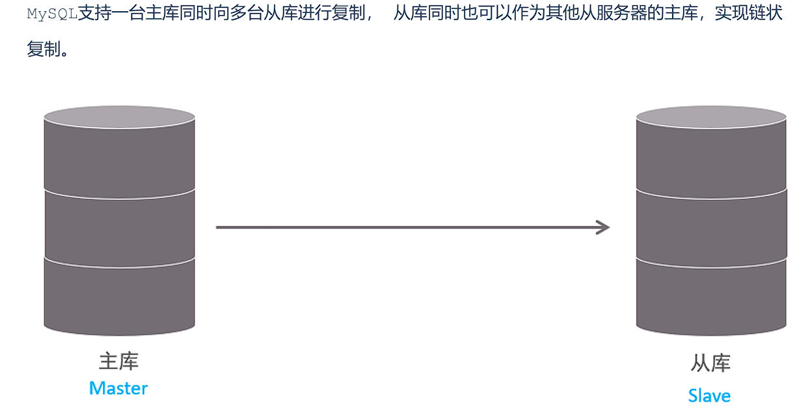
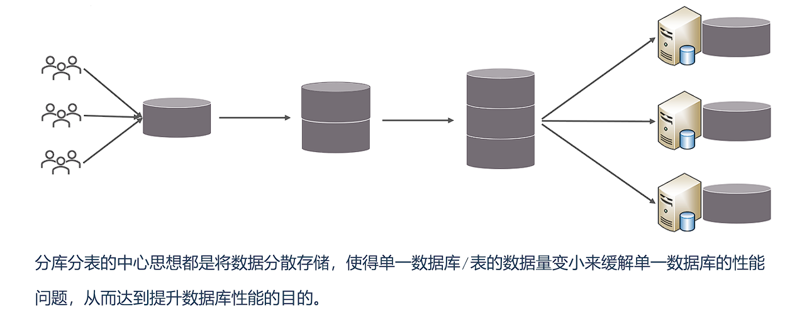
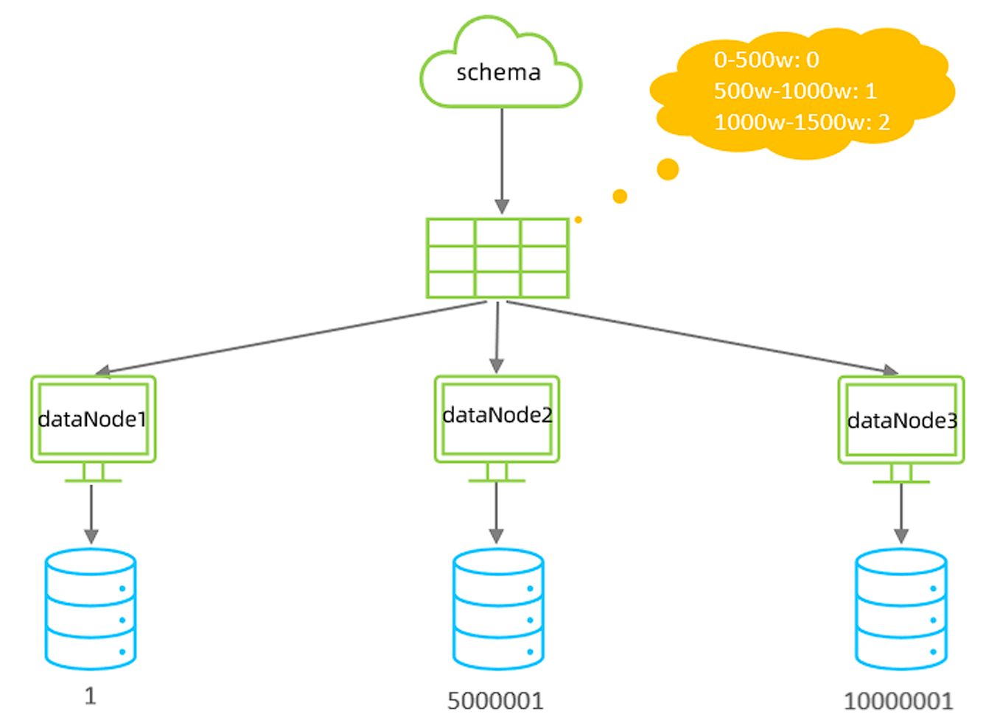

## 日志

### 错误日志

错误日志是 MySQL 中最重要的日志之一，它记录了当 mysqld 启动和停止时，以及服务器在运行过程中发生任何严重错误时的相关信息。

该日志是默认开启的，默认存放目录 /var/log/，默认的日志文件名为 mysqld.log 。查看日志位置

```sql
 show variables like '%log_error%';
```


### 二进制日志

二进制日志（BINLOG）记录了所有的 DDL（数据定义语言）语句和 DML（数据操纵语言）语句，但不包括数据查询（SELECT、SHOW）语句

**作用**：

- 灾难时的数据恢复；
- MySQL的主从复制。

```sql
 -- 查看日志目录
 show variables like '%log_bin%';
```

`log_bin_basename`：当前数据库服务器的binlog日志的基础名称(前缀)，具体的binlog文 件名需要再该basename的基础上加上编号(编号从000001开始)。 

`log_bin_index`：binlog的索引文件，里面记录了当前服务器关联的binlog文件有哪些。


**日志格式**

MySQL服务器中提供了多种格式来记录二进制日志

```sql
-- 查看日志格式
show variables like '%binlog_format%';

-- 在配置文件中修改 binlog_format 的值即可修改日志格式
```

| 日志格式  | 说明                                                         |
| :-------: | ------------------------------------------------------------ |
| STATEMENT | 基于**SQL语句**的日志记录，记录的是SQL语句，对数据进行修改的SQL都会记录在日志文件中。 |
|    ROW    | 基于行的日志记录，记录的是每一行的数据变更。（默认）         |
|   MIXED   | 混合了STATEMENT和ROW两种格式，默认采用STATEMENT，在某些特殊情况下会自动切换为ROW进行记录。 |


**查看二进制日志**

```bash
mysqlbinlog  [ 参数选项 ]  logfilename
参数选项：
    -d      指定数据库名称，只列出指定的数据库相关操作。
    -o      忽略掉日志中的前n行命令。
    -v      将行事件(数据变更)重构为SQL语句
    -vv     将行事件(数据变更)重构为SQL语句，并输出注释信息
```


**删除日志**

| 指令                                             | 说明                                                         |
| ------------------------------------------------ | ------------------------------------------------------------ |
| reset master                                     | 删除全部 binlog 日志，删除之后，日志编号，将 从 binlog.000001重新开始 |
| purge master logs to 'binlog.*'                  | 删除 * 编号之前的所有日志                                    |
| purge master logs before 'yyyy-mm-dd hh24:mi:ss' | 删除日志为 "yyyy-mm-dd hh24:mi:ss" 之前 产生的所有日志       |

!!!tip
    也可以在mysql的配置文件中配置二进制日志的过期时间，二进制日志过期会自动删除。

    ```sql
    show variables like '%binlog_expire_logs_seconds%';
    ```


### 查询日志

查询日志中记录了客户端的所有操作语句，而二进制日志不包含查询数据的SQL语句。默认情况下，查询日志是未开启的。


在配置文件中开启查询日志

```sql
#该选项用来开启查询日志 ， 可选值 ： 0 或者 1 ； 0 代表关闭， 1 代表开启 
general_log=1
 #设置日志的文件名 ， 如果没有指定， 默认的文件名为 host_name.log 
general_log_file=mysql_query.log
```


### 慢查询日志

慢查询日志记录了所有执行时间超过参数 `long_query_time` 设置值并且扫描记录数不小于  `min_examined_row_limit` 的所有的SQL语句的日志，默认未开启。


在配置文件中开启慢查询日志  

```sql
## 慢查询日志
slow_query_log=1
## 慢查询时间阈值
long_query_time=2
```

!!!info
    默认情况下，不会记录管理语句，也不会记录不使用索引进行查找的查询。可以使用 log_slow_admin_statements 和更改此行为 log_queries_not_using_indexes

    ```sql
    #记录执行较慢的管理语句
    log_slow_admin_statements =1
    #记录执行较慢的未使用索引的语句
    log_queries_not_using_indexes = 1
    ```


## 主从复制

### 概述

主从复制是指将主数据库的 DDL 和 DML 操作通过二进制日志传到从库服务器中，然后在从库上对这些日志重新执行（也叫重做），从而使得从库和主库的数据保持同步。



MySQL 主从复制的优点主要包含以下三个方面： 

- 主库出现问题，可以快速切换到从库提供服务。 
- 实现读写分离，降低主库的访问压力。 
- 可以在从库中执行备份，以避免备份期间影响主库服务。


### 原理

MySQL主从复制的核心就是 **二进制日志**


**过程**：

1. Master 主库在事务提交时，会把数据变更记录在二进制日志文件 Binlog 中。
2. 从库读取主库的二进制日志文件 Binlog ，写入到从库的中继日志 Relay Log 。 
3. slave重做中继日志中的事件，将改变反映它自己的数据。


### 搭建主从

#### 主节点

主节点配置：

```sql
## mysql 服务ID，保证整个集群环境中唯一，取值范围：1 ~ (2^32-1)，默认为1
server-id=1

## 是否只读,1 代表只读, 0 代表读写
read-only=0

## 忽略的数据, 指不需要同步的数据库
## binlog-ignore-db=mysql

## 指定同步的数据库
## binlog-do-db=db01
```

创建远程连接用户

```sql
## 创建用户，并设置密码，该用户可在任意主机连接该MySQL服务
CREATE USER 'itcast'@'%' IDENTIFIED WITH mysql_native_password BY 'Root@123456';

## 为用户分配主从复制权限
GRANT REPLICATION  SLAVE  ON  *.*  TO  'itcast'@'%';
```


查看二进制日志坐标 ` show master status;`，用于从节点配置

- file : 从哪个日志文件开始推送日志文件  
- position ： 从哪个位置开始推送日志 
- binlog_ignore_db : 指定不需要同步的数据库


#### 从节点

配置文件

```sql
## mysql 服务ID，保证整个集群环境中唯一，取值范围：1 ~ (2^32-1)，和主库不一样即可
server-id=2

## 是否只读,1 代表只读, 0 代表读写
read-only=1
```


连接主节点

```sql
-- 8.0.23版本
CHANGE REPLICATION SOURCE TO SOURCE_HOST='主节点IP', SOURCE_USER='主节点授权用户', 
SOURCE_PASSWORD='密码', SOURCE_LOG_FILE='binlog.000004', 
SOURCE_LOG_POS=663;
```


开启同步

```sql
start replica ; #8.0.22之后
start  slave ;  #8.0.22之前
```


## 分库分表

### 概述

随着互联网及移动互联网的发展，应用系统的数据量也是成指数式增长，若采用单数据库进行数据存储，存在以下性能瓶颈： 

1. IO瓶颈：热点数据太多，数据库缓存不足，产生大量磁盘IO，效率较低。 请求数据太多，带宽不够，网络IO瓶颈。 
2. CPU瓶颈：排序、分组、连接查询、聚合统计等SQL会耗费大量的CPU资源，请求数太多，CPU达到瓶颈。


为了解决上述问题，我们需要对数据库进行分库分表处理。




#### 拆分策略

分库分表的形式，主要是两种：垂直拆分和水平拆分。


#### 垂直拆分

**垂直分库**：以表为依据，根据业务将不同表拆分到不同库中。

特点： 

- 每个库的表结构都不一样。 
- 每个库的数据也不一样。 
- 所有库的并集是全量数据。


**垂直分表**：以字段为依据，根据字段属性将不同字段拆分到不同表中。

特点： 

- 每个表的结构都不一样。 
- 每个表的数据也不一样，一般通过一列（主键/外键）关联。 
- 所有表的并集是全量数据。


#### 水平拆分

**水平分库**：以字段为依据，按照一定策略，将一个库的数据拆分到多个库中。

特点： 

- 每个库的表结构都一样。 
- 每个库的数据都不一样。 
- 所有库的并集是全量数据。


**水平分表**：以字段为依据，按照一定策略，将一个表的数据拆分到多个表中。

特点： 

- 每个表的表结构都一样。 
- 每个表的数据都不一样。 
- 所有表的并集是全量数据。


### 实现技术

- shardingJDBC：基于AOP原理，在应用程序中对本地执行的SQL进行拦截，解析、改写、路由处理。需要自行编码配置实现，只支持java语言，性能较高。 
- **MyCat**：数据库分库分表中间件，不用调整代码即可实现分库分表，支持多种语言，性能不及前者。


### MyCat概述

[| MYCAT官方网站—中国开源分布式数据库中间件](https://www.mycat.org.cn/)

**安装后目录介绍**

bin : 存放可执行文件，用于启动停止mycat

conf：存放mycat的配置文件 

lib：存放mycat的项目依赖包（jar） 

logs：存放mycat的日志文件


在MyCat的逻辑结构主要负责逻辑库、逻辑表、分片规则、分片节点等逻辑结构的处理，而具体的数据 存储还是在物理结构，也就是数据库服务器中存储的。


### MyCat配置

#### schema.xml

schema.xml 作为MyCat中最重要的配置文件之一 , 涵盖了MyCat的逻辑库 、 逻辑表 、 分片规 则、分片节点及数据源的配置。

主要包含以下三组标签： 

- schema标签 
- datanode标签 
- datahost标签

<br>

1.schema标签

 定义逻辑库，一个MyCat实例中, 可以有多个逻辑库 , 可以通 过 schema 标签来划分不同的逻辑库。MyCat中的逻辑库的概念，等同于MySQL中的database概念。

**主要属性**：

- name：指定自定义的逻辑库库名 
- checkSQLschema：在SQL语句操作时指定了数据库名称，执行时是否自动去除；true：自动去 除，false：不自动去除 
- sqlMaxLimit：如果未指定limit进行查询，列表查询模式查询多少条记录

**子标签**：

- table定义逻辑表

    **主要属性**：

    - name：定义逻辑表表名，在该逻辑库下唯一 
    - dataNode：定义逻辑表所属的dataNode，该属性需要与dataNode标签中name对应；多个 dataNode逗号分隔 
    - rule：分片规则的名字，分片规则名字是在rule.xml中定义的 
    - primaryKey：逻辑表对应真实表的主键 
    - type：逻辑表的类型，目前逻辑表只有全局表和普通表，如果未配置，就是普通表；全局表，配置为 global


2.datanode标签

**主要属性**： 

- name：定义数据节点名称 
- dataHost：数据库实例主机名称，引用自 dataHost 标签中name属性 
- database：定义分片所属数据库


3.datahost标签

**主要属性**：

- name：唯一标识，供上层标签使用 
- maxCon/minCon：最大连接数/最小连接数 
- balance：负载均衡策略，取值 0,1,2,3 
- writeType：写操作分发方式（0：写操作转发到第一个writeHost，第一个挂了，切换到第二 个；1：写操作随机分发到配置的writeHost） 
- dbDriver：数据库驱动，支持 native、jdbc


#### rule.xml

rule.xml中定义所有拆分表的规则, 在使用过程中可以灵活的使用分片算法, 或者对同一个分片算法使用不同的参数, 它让分片过程可配置化。

主要包含两类标签：

- tableRule
- Function


#### server.xml

server.xml配置文件包含了MyCat的系统配置信息

主要有两个重要的标签：

- system
- user


1.system标签

主要配置MyCat中的系统配置信息

```xml
<property name="serverPort">8066</property> <!-- MyCat服务端口 -->
<property name="managerPort">9066</property> <!-- 管理端口 -->
<property name="charset">utf8</property> <!-- 默认字符集 -->
<property name="nonePasswordLogin">0</property> <!-- 是否允许空密码登录(0禁止) -->

<property name="processorBufferPoolType">0</property> <!-- 0:NIO,1:AIO -->
<property name="processorBufferLocalPercent">100</property> <!-- 线程池缓冲百分比 -->
<property name="frontSocketSoRcvbuf">1048576</property> <!-- 前端接收缓冲 -->
<property name="frontSocketSoSndbuf">4194304</property> <!-- 前端发送缓冲 -->
<property name="processors">16</property> <!-- 处理线程数 -->

<property name="defaultSqlParser">druidparser</property> <!-- SQL解析器 -->
<property name="sequnceHandlerType">1</property> <!-- 全局序列类型 -->
<property name="useOffHeapForMerge">0</property> <!-- 是否使用堆外内存 -->
<property name="memoryPageSize">1m</property> <!-- 内存页大小 -->

<property name="heartbeatTimeout">1000</property> <!-- 心跳超时(ms) -->
<property name="idleTimeout">1800000</property> <!-- 连接空闲超时(ms) -->
```


2.user标签

配置MyCat中的用户、访问密码，以及用户针对于逻辑库、逻辑表的权限信息

```xml
<user name="test" defaultAccount="true">
    <property name="password">test123</property>
    <property name="schemas">TESTDB</property> <!-- 可访问的schema -->
    <property name="readOnly">false</property> <!-- 是否只读 -->
    <property name="benchmark">1000</property> <!-- 权重 -->
    
    <!-- 表级权限控制 -->
    <privileges check="true">
        <schema name="TESTDB" dml="0110">
            <table name="t_user" dml="1111"></table>
        </schema>
    </privileges>
</user>
```

!!!tip
    dml四位数字分别对应：insert(1位),update(2位),select(3位),delete(4位)

    例如dml="0110"表示允许update和select


### MyCat分片

#### 全局表

全局表（Global Table）是 MyCat 中的一种特殊表类型，指在所有数据节点（分片节点）上都**完全冗余存储**的**相同数据表**。全局表主要用于解决跨分片 JOIN 的性能问题。

**特点**：

1. **全节点冗余**：所有数据节点都存储相同数据
2. **实时同步**：任何节点的修改都会同步到所有节点
3. **跨分片JOIN优化**：避免跨分片JOIN操作
4. **读操作本地化**：查询操作可在任意节点本地执行
5. **写操作广播**：写入操作会广播到所有节点

!!!example "使用场景"
    1. **数据字典表**：如地区编码、系统参数等
    2. **配置表**：系统配置、业务配置等
    3. **小数据量表**：数据量小且更新不频繁的表
    4. **高频关联表**：经常需要与其他表JOIN的维度表

```xml
<table name="t_area" primaryKey="id" type="global" dataNode="dn1,dn2,dn3"/>
```


#### 分片规则

##### 范围分片

根据指定的字段及其配置的范围与数据节点的对应情况， 来决定该数据属于哪一个分片。



```xml
 <table name="TB_ORDER" dataNode="dn1,dn2,dn3" rule="auto-sharding-long" />
```


##### 取模分片

根据指定的字段值与节点数量进行求模运算，根据运算结果， 来决定该数据属于哪一个分片。


```xml
<!-- schema.xml -->
<table name="tb_log" dataNode="dn4,dn5,dn6" primaryKey="id" rule="mod-long" />


<!-- rule.xml -->
<tableRule name="mod-long">
    <rule>
        <columns>id</columns>
        <algorithm>mod-long</algorithm>
    </rule>
 </tableRule>
 <function name="mod-long" class="io.mycat.route.function.PartitionByMod">
    <property name="count">3</property><!-- 节点数量 -->
 </function>
```

!!!warning
    该分片规则，主要针对于**数字**类型的字段适用


##### 一致性hash分片

一致性哈希（Consistent Hashing）是MyCat提供的一种特殊分片算法，它解决了传统哈希分片在节点扩容/缩容时需要大量数据迁移的问题。

**特点**：

1. **虚拟节点环**：将哈希空间组织成环形结构
2. **数据定位**：通过哈希计算确定数据在环上的位置
3. **节点映射**：物理节点均匀映射到哈希环上
4. **扩容影响小**：节点变化只影响相邻节点数据

---

|    特性    |     一致性哈希     |   传统哈希   |
| :--------: | :----------------: | :----------: |
|  扩容影响  |   只影响相邻节点   | 影响所有节点 |
| 数据迁移量 | 约1/N（N为节点数） | 几乎全部数据 |
| 数据均衡性 |   依赖虚拟节点数   |   完全均衡   |
| 实现复杂度 |        较高        |     简单     |

---

配置

```xml
<!-- schema.xml -->
<table name="t_order" primaryKey="order_id" dataNode="dn1,dn2,dn3" rule="sharding-by-murmur"/>


<!-- rule.xml -->
<tableRule name="sharding-by-murmur">
    <rule>
        <columns>order_id</columns>
        <algorithm>murmur</algorithm>
    </rule>
</tableRule>

<function name="murmur" class="io.mycat.route.function.PartitionByMurmurHash">
    <property name="seed">0</property> <!-- 哈希种子，默认0 -->
    <property name="count">3</property> <!-- 物理节点数 -->
    <property name="virtualBucketTimes">160</property> <!-- 虚拟节点倍数 -->
</function>
```


##### 枚举分片

通过在**配置文件**中配置可能的枚举值, 指定数据分布到不同数据节点上, 本规则适用于按照省份、性 别、状态拆分数据等业务

```xml
<table name="tb_user" dataNode="dn4,dn5,dn6" rule="sharding-by-intfile-enumstatus" />
```


##### 应用指定

运行阶段由应用自主决定路由到那个分片 , 直接根据字符子串（必须是数字）计算分片号

```xml
<table name="tb_app" dataNode="dn4,dn5,dn6" rule="sharding-by-substring" />


<tableRule name="sharding-by-substring">
    <rule>
        <columns>id</columns>
        <algorithm>sharding-by-substring</algorithm>
    </rule>
 </tableRule>
 <function name="sharding-by-substring" class="io.mycat.route.function.PartitionDirectBySubString">
    <property name="startIndex">0</property> <!-- zero-based -->
    <property name="size">2</property>
    <property name="partitionCount">3</property>
    <property name="defaultPartition">0</property>
 </function>
```


##### 固定分片hash算法

固定分片哈希算法（PartitionByLong）是 MyCat 中最常用的分片算法之一，它通过对分片字段值进行固定范围的哈希计算来确定数据分布。

1. **固定范围分片**：通过配置确定每个分片的数值范围
2. **简单高效**：直接基于数值计算，性能优异
3. **均匀分布**：数据在分片间均匀分布（取决于分片键）
4. **可预测性**：可以准确预判数据所在分片位置


```xml
<tableRule name="sharding-by-long">
    <rule>
        <columns>user_id</columns>
        <algorithm>mod-long</algorithm>
    </rule>
</tableRule>

<function name="mod-long" class="io.mycat.route.function.PartitionByLong">
    <property name="partitionCount">2,1</property>  <!-- 分片数量配置 -->
    <property name="partitionLength">512,256</property> <!-- 分片范围配置 -->
</function>
```

| partitionCount  | 是   | 分区间数量配置     | "2,1" 表示2个分区，第1个分区1份              |
| --------------- | ---- | ------------------ | -------------------------------------------- |
| partitionLength | 是   | 每个分区的范围长度 | "512,256" 表示第1分区每份512，第2分区每份256 |
| hashSlice       | 否   | 哈希取模部分字符串 | "0:2" 表示取前2个字符                        |


##### 字符串hash解析算法

截取字符串中的指定位置的子字符串, 进行hash算法， 算出分片。

```xml
 <table name="tb_strhash" dataNode="dn4,dn5" rule="sharding-by-stringhash" />


<tableRule name="sharding-by-stringhash">
    <rule>
        <columns>name</columns>
        <algorithm>sharding-by-stringhash</algorithm>
    </rule>
 </tableRule>
 <function name="sharding-by-stringhash" class="io.mycat.route.function.PartitionByString">
    <property name="partitionLength">512</property> <!-- zero-based -->
    <property name="partitionCount">2</property>
    <property name="hashSlice">0:2</property>
 </function>
```

!!!tip
    hashSlice: hash运算位 , 根据子字符串的hash运算 ; 0 代表 str.length() , -1 代表 str.length()-1 , 大于0只代表数字自身 ; 可以理解 为substring（start，end），start为0则只表示0


##### 按天分片

按照日期及对应的时间周期来分片。

```sql
<table name="tb_datepart" dataNode="dn4,dn5,dn6" rule="sharding-by-date" />


 <tableRule name="sharding-by-date">
    <rule>
        <columns>create_time</columns>
        <algorithm>sharding-by-date</algorithm>
    </rule>
 </tableRule>
 
 <function name="sharding-by-date" class="io.mycat.route.function.PartitionByDate">
    <property name="dateFormat">yyyy-MM-dd</property>
    <property name="sBeginDate">2022-01-01</property>
    <property name="sEndDate">2022-01-30</property>
    <property name="sPartionDay">10</property>
 </function>
 <!--
    从开始时间开始，每10天为一个分片，到达结束时间之后，会重复开始分片插入
     配置表的 dataNode 的分片，必须和分片规则数量一致，例如 2022-01-01 到 2022-12-31 ，每
10天一个分片，一共需要37个分片。
 -->
```


##### 按月分片

使用场景为按照月份来分片, 每个自然月为一个分片。

```xml
<table name="tb_monthpart" dataNode="dn4,dn5,dn6" rule="sharding-by-month" />


 <tableRule name="sharding-by-month">
    <rule>
        <columns>create_time</columns>
        <algorithm>partbymonth</algorithm>
    </rule>
 </tableRule>
    
<function name="partbymonth" class="io.mycat.route.function.PartitionByMonth">
    <property name="dateFormat">yyyy-MM-dd</property>
    <property name="sBeginDate">2022-01-01</property>
    <property name="sEndDate">2022-03-31</property>
 </function>
 <!-- 
    从开始时间开始，一个月为一个分片，到达结束时间之后，会重复开始分片插入
    配置表的 dataNode 的分片，必须和分片规则数量一致，例如 2022-01-01 到 2022-12-31 ，一
共需要12个分片。--
```


### MyCat管理


Mycat默认开通2个端口，可以在server.xml中进行修改。 

- 8066 数据访问端口，即进行 DML 和 DDL 操作。 
- 9066 数据库管理端口，即 mycat 服务管理控制功能，用于管理mycat的整个集群状态 连接MyCat的管理控制台

```bash
 mysql   -h  192.168.200.210  -p  9066   -uroot   -p123456
```

|         命令         |       说明       |
| :------------------: | :--------------: |
|  `show @@version;`   |  查看MyCat版本   |
|   `show @@server;`   |  查看服务器状态  |
| `show @@threadpool;` |  查看线程池状态  |
| `show @@processor;`  |  查看处理器状态  |
| `show @@connection;` |   查看连接状态   |
|  `show @@backend;`   | 查看后端连接状态 |

|               命令                |         说明         |
| :-------------------------------: | :------------------: |
|        `show @@datanode;`         |   查看数据节点信息   |
| `show @@datanode where schema=?'` | 查看指定schema的节点 |
|        `reload @@datanode`        |   重载数据节点配置   |
| `switch @@datasource name:index`  | 切换数据源(主从切换) |

|              命令               |       说明        |
| :-----------------------------: | :---------------: |
|          `show @@sql;`          | 查看当前执行的SQL |
|       `show @@sql.slow;`        |     查看慢SQL     |
|        `show @@sql.sum;`        |  查看SQL执行统计  |
|     `show @@sql.where id=?`     |  查看指定SQL详情  |
| `kill @@connection id1,id2,...` |   终止指定连接    |

|         命令          |          说明          |
| :-------------------: | :--------------------: |
|   `reload @@config`   |    重载所有配置文件    |
| `reload @@config_all` | 重载所有配置并清理缓存 |
|   `reload @@route`    |      重载路由配置      |
|    `reload @@user`    |      重载用户权限      |


MyCat官方提供了一个管理监控平台**MyCat-Web（MyCat-eye）**。 Mycat-web 是 Mycat 可视化运维的管理和监控平台。

!!!note
    MyCat-eye依赖zookeeper，需先安装zookeeper


## 读写分离

读写分离,简单地说是把对数据库的读和写操作分开,以对应不同的数据库服务器。主数据库提供写操作，从数据库提供读操作，这样能有效地减轻单台数据库的压力。

**步骤**：

1. 配置MySQL主从复制（1主N从）
2. 确保主从同步正常（`SHOW SLAVE STATUS`检查）
3. 建议从库配置`read_only=1`防止误写入


配置`schema.xml`

```sql
<?xml version="1.0"?>
<!DOCTYPE mycat:schema SYSTEM "schema.dtd">
<mycat:schema xmlns:mycat="http://io.mycat/">

    <!-- 定义逻辑库 -->
    <schema name="TESTDB" checkSQLschema="true" sqlMaxLimit="100">
        <!-- 所有表默认使用读写分离 -->
        <table name="tb1" primaryKey="id" dataNode="dn1"/>
    </schema>

    <!-- 定义数据节点 -->
    <dataNode name="dn1" dataHost="localhost1" database="testdb" />

    <!-- 定义数据主机 -->
    <dataHost name="localhost1" maxCon="1000" minCon="10" balance="1" writeType="0" dbType="mysql" dbDriver="native" switchType="1"  slaveThreshold="100">
        <!-- 心跳检测SQL -->
        <heartbeat>select user()</heartbeat>
        
        <!-- 写节点(主库)配置 -->
        <writeHost host="hostM1" url="192.168.1.100:3306" user="root" password="123456">
            <!-- 读节点(从库)配置 -->
            <readHost host="hostS1" url="192.168.1.101:3306" user="root" password="123456" />
            <readHost host="hostS2" url="192.168.1.102:3306" user="root" password="123456" />
        </writeHost>
        
        <!-- 可配置备用写节点(主从切换时使用) -->
        <!-- <writeHost host="hostM2" url="192.168.1.103:3306" user="root" password="123456"/> -->
    </dataHost>
</mycat:schema>
```

|    参数    |  值  |                 说明                  |
| :--------: | :--: | :-----------------------------------: |
|  balance   |  0   |            不开启读写分离             |
|            |  1   |     全部读操作随机分发到readHost      |
|            |  2   |      读操作按权重分发到所有host       |
|            |  3   | 读操作只分发到writeHost对应的readHost |
| writeType  |  0   |    所有写操作发送到第一个writeHost    |
|            |  1   |          随机发送到writeHost          |
| switchType |  1   |            自动切换(默认)             |
|            |  2   |       基于MySQL主从同步状态切换       |
|            |  3   |               手动切换                |


多主从配置方式（高可用）

```xml
<dataHost ... balance="1" writeType="1">
    
  <writeHost host="hostM1" url="master1:3306"...>
    <readHost .../>
  </writeHost>
    
  <writeHost host="hostM2" url="master2:3306"...>
    <readHost .../>
  </writeHost>
    
</dataHost>
```

!!!tip
    主节点之间也**互为主从**


---

完结撒花ヽ( •̀ ω •́ )✧
