## 原理篇

### 数据结构

> [!NOTE]
>
> `Redis` 底层基于 C语言 实现

#### 动态字符串SDS

字符串是Redis中最常用的一种数据结构。不过Redis没有直接使用C语言中的字符串，因为C语言字符串存在很多问题：

- 获取字符串长度的需要通过运算
- 非二进制安全
- 不可修改

> [!TIP]
>
> 二进制安全：
>
> ​	C 字符串依赖 `\0` 判断结尾，若字符串中包含 `\0`（如图片、音频等二进制数据），会被截断。


因此，Redis构建了一种新的字符串结构，称为简单动态字符串（Simple Dynamic String），简称**SDS**。

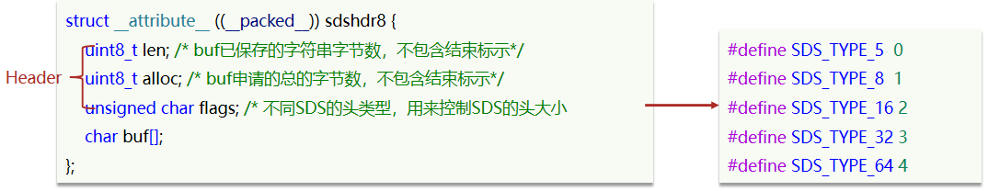

> [!TIP]
>
> `Redis` 定义了多种大小不同的 SDS 结构，以上只是一个示例


SDS之所以叫做动态字符串，是因为它具备动态扩容的能力

1. 假如我们要给SDS追加一段字符串，首先会申请新内存空间：

2. 如果新字符串小于1MB，则新空间为扩展后字符串长度的两倍+1；

3. 如果新字符串大于1MB，则新空间为扩展后字符串长度+1M+1。称为内存预分配。

 

> [!NOTE]
>
> SDS优点
>
> - 获取字符串长度的时间复杂度为 O(1)
> - 支持动态扩容
> - 减少内存分配次数（分配内存有一定性能开销）
> - 二进制安全


#### IntSet

IntSet是Redis中set集合的一种实现方式，基于整数数组来实现，并且具备长度可变、有序等特征。

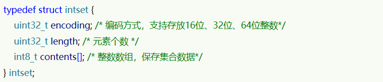

其中的encoding包含三种模式，表示存储的整数大小不同：

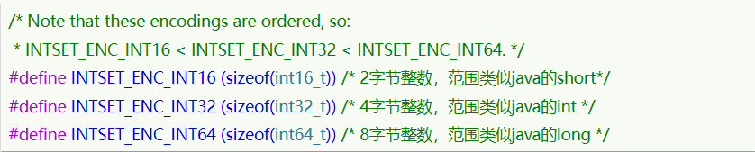


为了方便查找，Redis会将intset中所有的整数按照升序依次保存在contents数组中，结构如图：

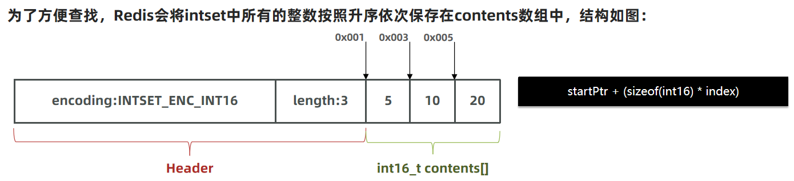


如果新插入的数字超出了int16_t的范围，intset会自动升级编码方式到合适的大小。
以当前案例来说流程如下：

* 升级编码为INTSET_ENC_INT32, 每个整数占4字节，并按照新的编码方式及元素个数扩容数组
* 倒序依次将数组中的元素拷贝到扩容后的正确位置
* 将待添加的元素放入数组末尾
* 最后，将inset的encoding属性改为INTSET_ENC_INT32，将length属性加1


Intset可以看做是特殊的整数数组，具备一些特点：

* Redis会确保Intset中的元素唯一、有序
* 具备类型升级机制，可以节省内存空间
* 底层采用二分查找方式来查询


#### Dict

Redis是一个键值型（Key-Value Pair）的数据库，我们可以根据键实现快速的增删改查。而键与值的映射关系正是通过Dict来实现的。


Dict由三部分组成，分别是：哈希表（DictHashTable）、哈希节点（DictEntry）、字典（Dict）

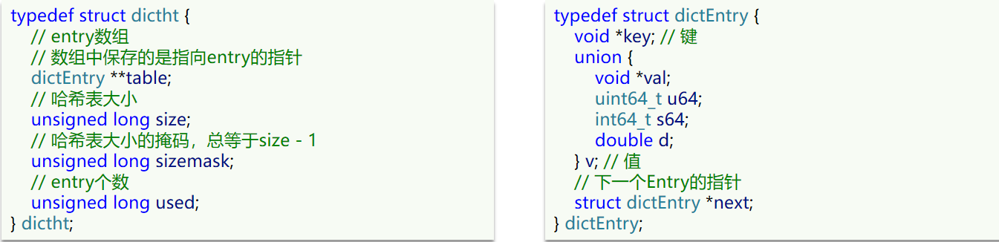

当我们向Dict添加键值对时，Redis首先根据key计算出hash值（h），然后利用 `(h & sizemask)` 来计算元素应该存储到数组中的哪个索引位置。


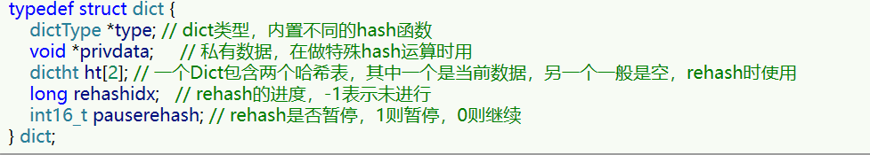
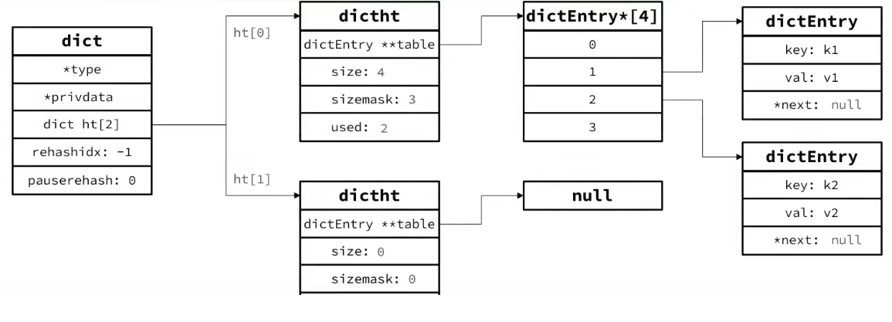

##### **Dict扩容**

Dict中的HashTable就是数组结合单向链表的实现，当集合中元素较多时，必然导致哈希冲突增多，链表过长，则查询效率会大大降低。可采取扩容解决。

Dict在每次新增键值对时都会检查负载因子（**LoadFactor = used/size**） ，满足以下两种情况时会触发哈希表扩容：

- 哈希表的 LoadFactor >= 1，并且服务器没有执行 BGSAVE 或者 BGREWRITEAOF 等后台进程
- 哈希表的 LoadFactor > 5 
- 删除元素后如果 LoadFactor < 0.1，会触发哈希表收缩


##### **Dict的rehash**

不管是扩容还是收缩，必定会创建新的哈希表，导致哈希表的size和sizemask变化，而key的查询与sizemask有关。

因此必须对哈希表中的每一个key重新计算索引，插入新的哈希表，这个过程称为rehash。过程是这样的：

* 计算新hash表的realeSize，值取决于当前要做的是扩容还是收缩：
  * 如果是扩容，则新size为第一个大于等于dict.ht[0].used + 1的2^n
  * 如果是收缩，则新size为第一个大于等于dict.ht[0].used的2^n （不得小于4）

* 按照新的realeSize申请内存空间，创建dictht，并赋值给dict.ht[1]
* 设置dict.rehashidx = 0，标示开始rehash
* ~~将dict.ht[0]中的每一个dictEntry都rehash到dict.ht[1]~~
* 每次新增、查询、修改、删除操作时，都检查dict.rehashidx是否大于-1,如果大于则将dict.ht[0].table[rehashidx]的entry链表rehash到dict.ht[1]，并且将rehashidx++。直至所有数据迁移。

> [!NOTE]
>
> 以上过程称为 **渐进式rehash**

* 将dict.ht[1]赋值给dict.ht[0]，给dict.ht[1]初始化为空哈希表，释放原来的dict.ht[0]的内存
* 在rehash过程中，新增操作，则直接写入ht[1]，查询、修改和删除则会在dict.ht[0]和dict.ht[1]依次查找并执行。这样可以确保ht[0]的数据只减不增，随着rehash最终为空


#### ZipList

ZipList 是一种特殊的“双端队列” ，由一系列特殊编码的**连续内存**块组成。可以在任意一端进行压入/弹出操作, 并且该操作的时间复杂度为 O(1)。

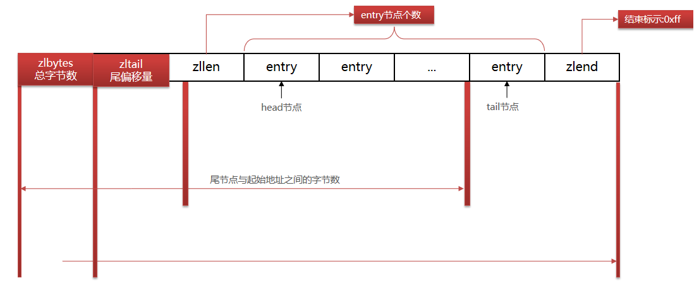

| **属性** | **类型** | **长度** | **用途**                                                     |
| -------- | -------- | -------- | ------------------------------------------------------------ |
| zlbytes  | uint32_t | 4 字节   | 记录整个压缩列表占用的内存字节数                             |
| zltail   | uint32_t | 4 字节   | 记录压缩列表表尾节点距离压缩列表的起始地址有多少字节，通过这个偏移量，可以确定表尾节点的地址。 |
| zllen    | uint16_t | 2 字节   | 记录了压缩列表包含的节点数量。 最大值为UINT16_MAX （65534），如果超过这个值，此处会记录为65535，但节点的真实数量需要遍历整个压缩列表才能计算得出。 |
| entry    | 列表节点 | 不定     | 压缩列表包含的各个节点，节点的长度由节点保存的内容决定。     |
| zlend    | uint8_t  | 1 字节   | 特殊值 0xFF （十进制 255 ），用于标记压缩列表的末端。        |


##### **ZipListEntry**

ZipList 中的Entry并不像普通链表那样记录前后节点的指针，因为记录两个指针要占用16个字节，浪费内存。而是采用了下面的结构：


* previous_entry_length：前一节点的长度，占1个或5个字节。
  * 如果前一节点的长度小于254字节，则采用1个字节来保存这个长度值
  * 如果前一节点的长度大于254字节，则采用5个字节来保存这个长度值，第一个字节为0xfe，后四个字节才是真实长度数据

* encoding：编码属性，记录content的数据类型（字符串还是整数）以及长度，占用1个、2个或5个字节
* contents：负责保存节点的数据，可以是字符串或整数


##### **Encoding编码**

encoding编码分为字符串和整数两种

- 如果encoding是以“00”、“01”或者“10”开头，则证明content是字符串

| **编码**                                             | **编码长度** | **字符串大小**      |
| ---------------------------------------------------- | ------------ | ------------------- |
| \|00pppppp\|                                         | 1 bytes      | <= 63 bytes         |
| \|01pppppp\|qqqqqqqq\|                               | 2 bytes      | <= 16383 bytes      |
| \|10000000\|qqqqqqqq\|rrrrrrrr\|ssssssss\|tttttttt\| | 5 bytes      | <= 4294967295 bytes |


* 如果encoding是以“11”开始，则证明content是整数，且encoding固定只占用1个字节

| **编码** | **编码长度** | **整数类型**                                                 |
| -------- | ------------ | ------------------------------------------------------------ |
| 11000000 | 1            | int16_t（2 bytes）                                           |
| 11010000 | 1            | int32_t（4 bytes）                                           |
| 11100000 | 1            | int64_t（8 bytes）                                           |
| 11110000 | 1            | 24位有符整数(3 bytes)                                        |
| 11111110 | 1            | 8位有符整数(1 bytes)                                         |
| 1111xxxx | 1            | 直接在xxxx位置保存数值，范围从0001~1101，减1后结果为实际值（0 ~ 12） |


##### **ZipList的连锁更新问题**

ZipList的每个Entry都包含previous_entry_length来记录上一个节点的大小，长度是1个或5个字节：
如果前一节点的长度小于254字节，则采用1个字节来保存这个长度值
如果前一节点的长度大于等于254字节，则采用5个字节来保存这个长度值，第一个字节为0xfe，后四个字节才是真实长度数据
现在，假设我们有N个连续的、长度为250~253字节之间的entry，因此entry的previous_entry_length属性用1个字节即可表示，如图所示：

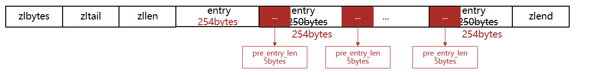

如果在头部新加入一个entry且大小大于254字节，则之后的entry都要进行扩容更新

ZipList这种特殊情况下产生的连续多次空间扩展操作称之为连锁更新（Cascade Update）。新增、删除都可能导致连锁更新的发生。


#### QuickList

- 问题1：ZipList虽然节省内存，但申请内存必须是连续空间，如果内存占用较多，申请内存效率很低。怎么办？
  - 答：为了缓解这个问题，我们必须限制ZipList的长度和entry大小。

- 问题2：但是我们要存储大量数据，超出了ZipList最佳的上限该怎么办？
  - 答：我们可以创建多个ZipList来分片存储数据。

- 问题3：数据拆分后比较分散，不方便管理和查找，这多个ZipList如何建立联系？
  - 答：Redis在3.2版本引入了新的数据结构QuickList，它是一个双端链表，只不过链表中的每个节点都是一个ZipList。

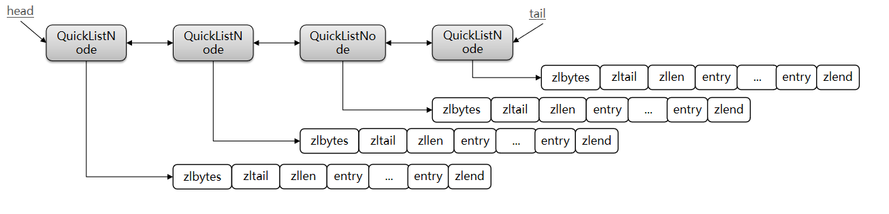

为了避免QuickList中的每个ZipList中entry过多，Redis提供了一个配置项：list-max-ziplist-size来限制。
如果值为正，则代表ZipList的允许的entry个数的最大值
如果值为负，则代表ZipList的最大内存大小，分5种情况：

* -1：每个ZipList的内存占用不能超过4kb
* -2：每个ZipList的内存占用不能超过8kb
* -3：每个ZipList的内存占用不能超过16kb
* -4：每个ZipList的内存占用不能超过32kb
* -5：每个ZipList的内存占用不能超过64kb

其默认值为 -2：

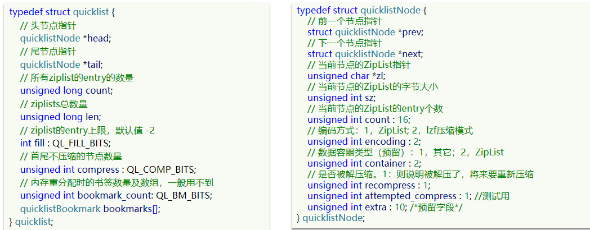


#### SkipList

SkipList（跳表）首先是**链表**，但与传统链表相比有几点差异：

- 元素按照**升序排列**存储
- 节点可能包含多个指针，指针跨度不同。

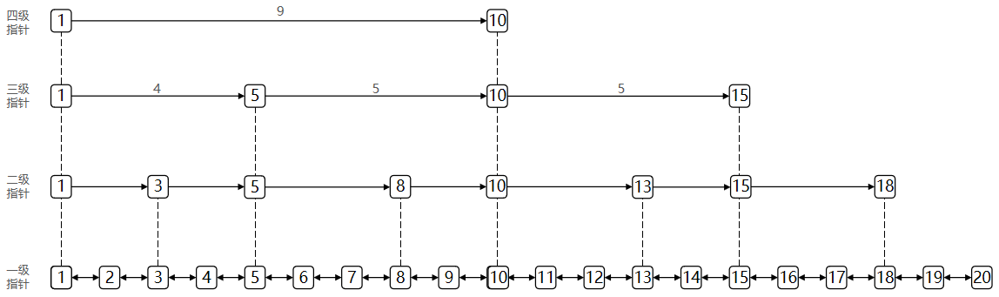

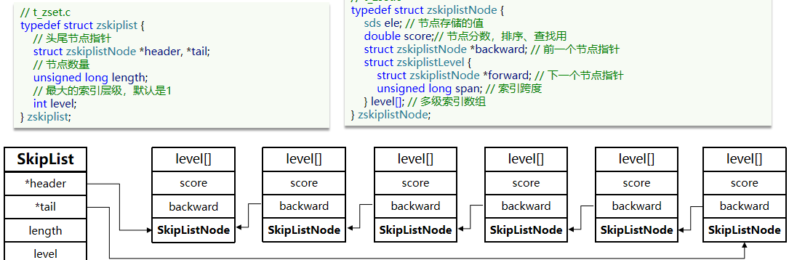


SkipList的特点：

* 跳跃表是一个双向链表，每个节点都包含score和ele值
* 节点按照score值排序，score值一样则按照ele字典排序
* 每个节点都可以包含多层指针，层数是1到32之间的随机数
* 不同层指针到下一个节点的跨度不同，层级越高，跨度越大
* 增删改查效率与红黑树基本一致，实现却更简单


#### RedisObject

Redis中的任意数据类型的键和值都会被封装为一个RedisObject，也叫做Redis对象，源码如下：

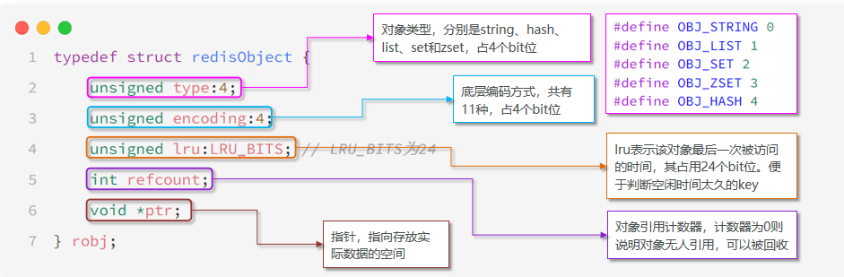

11种编码方式如下：

| **编号** | **编码方式**            | **说明**               |
| -------- | ----------------------- | ---------------------- |
| 0        | OBJ_ENCODING_RAW        | raw编码动态字符串      |
| 1        | OBJ_ENCODING_INT        | long类型的整数的字符串 |
| 2        | OBJ_ENCODING_HT         | hash表（字典dict）     |
| 3        | OBJ_ENCODING_ZIPMAP     | 已废弃                 |
| 4        | OBJ_ENCODING_LINKEDLIST | 双端链表               |
| 5        | OBJ_ENCODING_ZIPLIST    | 压缩列表               |
| 6        | OBJ_ENCODING_INTSET     | 整数集合               |
| 7        | OBJ_ENCODING_SKIPLIST   | 跳表                   |
| 8        | OBJ_ENCODING_EMBSTR     | embstr的动态字符串     |
| 9        | OBJ_ENCODING_QUICKLIST  | 快速列表               |
| 10       | OBJ_ENCODING_STREAM     | Stream流               |


Redis中会根据存储的数据类型不同，选择不同的编码方式。每种数据类型的使用的编码方式如下：

| **数据类型** | **编码方式**                                       |
| ------------ | -------------------------------------------------- |
| OBJ_STRING   | int、embstr、raw                                   |
| OBJ_LIST     | LinkedList和ZipList(3.2以前)、QuickList（3.2以后） |
| OBJ_SET      | intset、HT                                         |
| OBJ_ZSET     | ZipList、HT、SkipList                              |
| OBJ_HASH     | ZipList、HT                                        |


#### 五种数据结构

##### String(❁´◡`❁)

String是Redis中最常见的数据存储类型

其基本编码方式是RAW，基于简单动态字符串（SDS）实现，存储上限为512mb。


如果存储的SDS长度小于44字节，则会采用EMBSTR编码，此时object head与SDS是一段**连续空间**。申请内存时只需要调用一次内存分配函数，效率更高。

> [!TIP]
>
> 建议使用Redis存储字符串时尽量不超过44字节


- 如果⼀个String类型的value的值是数字，那么Redis内部会把它转成long类型来存储，从而减少内存的使用。
- 如果存储的字符串是整数值，并且大小在LONG_MAX范围内，则会采用INT编码：直接将数据保存在RedisObject的**ptr指针位置**（刚好8字节），不再需要SDS了。


##### List(●'◡'●)

Redis的List类型可以从首、尾操作列表中的元素

可考虑的实现方式如下：

* LinkedList ：普通链表，可以从双端访问，内存占用较高，内存碎片较多
* ZipList ：压缩列表，可以从双端访问，内存占用低，存储上限低
* QuickList：LinkedList + ZipList，可以从双端访问，内存占用较低，包含多个ZipList，存储上限高

> [!TIP]
>
> 在3.2版本之前，Redis采用ZipList和LinkedList来实现List，当元素数量小于512并且元素大小小于64字节时采用ZipList编码，超过则采用LinkedList编码。
>
> 在3.2版本之后，Redis统一采用QuickList来实现List


##### Set╰(*°▽°*)╯

set是Redis中的单列集合，满足下列特点：

* 元素无序性
* 元素唯一性
* 支持求交集、并集、差集

> [!TIP]
>
> - 为了查询效率和唯一性，set采用HT编码（Dict）。Dict中的key用来存储元素，value统一为null。
>
> - 当存储的所有数据都是整数，并且元素数量不超过 `set-max-intset-entries` 时，Set会采用IntSet编码，以节省内存


##### Zset o(≧▽≦)o 

ZSet也就是SortedSet，其中每一个元素都需要指定一个score值和member值，具有以下特征：

* 可以根据score值排序
* member必须唯一
* 可以根据member查询分数


> [!TIP]
>
> Redis采用如下两种数据结构实现zset
>
> * SkipList：可以排序，并且可以同时存储score和ele值（member）
> * HT（Dict）：可以键值存储，并且可以根据key找value

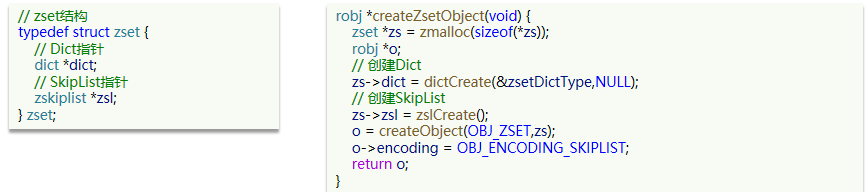

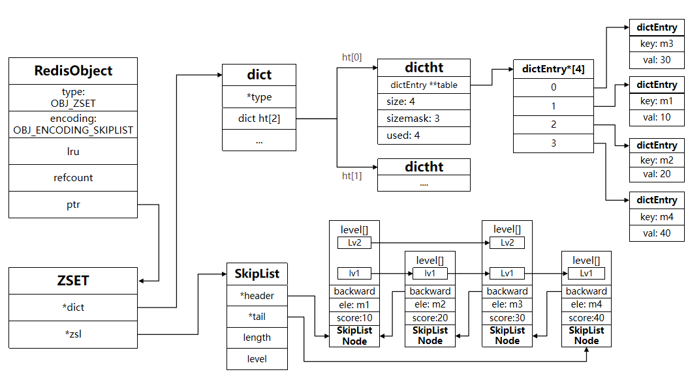

当元素数量不多时，HT和SkipList的优势不明显，而且更耗内存。因此zset还会采用ZipList结构来节省内存，不过需要同时满足两个条件：

* 元素数量小于zset_max_ziplist_entries，默认值128
* 每个元素都小于zset_max_ziplist_value字节，默认值64

> [!TIP]
>
> ziplist本身没有排序功能，而且没有键值对的概念，因此需要通过编码实现：
>
> * ZipList是连续内存，因此score和element是紧挨在一起的两个entry， element在前，score在后
> * score越小越接近队首，score越大越接近队尾，按照score值升序排列


##### Hash༼ つ ◕_◕ ༽つ

Hash结构与Redis中的Zset非常类似：

* 都是键值存储
* 都需求根据键获取值
* 键必须唯一

区别如下：

* zset的键是member，值是score；hash的键和值都是任意值
* zset要根据score排序；hash则无需排序


> [!TIP]
>
> 当Hash中数据项比较少的情况下，Hash底层使用压缩列表ziplist进行存储数据，随着数据的增加，底层的ziplist就可能会转成dict
>
> 转换阈值：
>
> `hash-max-ziplist-entries 512`
>
> `hash-max-ziplist-value 64`


### 网络模型

#### 用户空间和内核空间

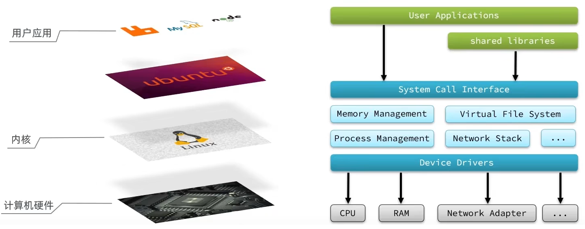

为了让用户应用访问计算机硬件资源，计算机就必须要通过对外暴露的一些接口，才能访问到，从而简介的实现对内核的操控，但是内核本身上来说也是一个应用，所以他本身也需要计算机资源

因此需要把用户和**内核隔离开**，分为用户空间和内核空间


Linux系统为了提高IO效率，会在用户空间和内核空间都加入缓冲区：

- 写数据时，要把用户缓冲数据拷贝到内核缓冲区，然后写入设备

- 读数据时，要从设备读取数据到内核缓冲区，然后拷贝到用户缓冲区

针对这个操作：我们的用户在写读数据时，会去向内核态申请，想要读取内核的数据，而内核数据要去等待驱动程序从硬件上读取数据，当从磁盘上加载到数据之后，内核会将数据写入到内核的缓冲区中，然后再将数据拷贝到用户态的buffer中，然后再返回给应用程序，整体而言，速度慢，就是这个原因，为了加速，我们希望read也好，还是wait for data也最好都不要等待，或者时间尽量的短。


#### 阻塞IO

> [!NOTE]
>
> 在《UNIX网络编程》一书中，总结归纳了5种IO模型：
>
> * 阻塞IO（Blocking IO）
> * 非阻塞IO（Nonblocking IO）
> * IO多路复用（IO Multiplexing）
> * 信号驱动IO（Signal Driven IO）
> * 异步IO（Asynchronous IO）


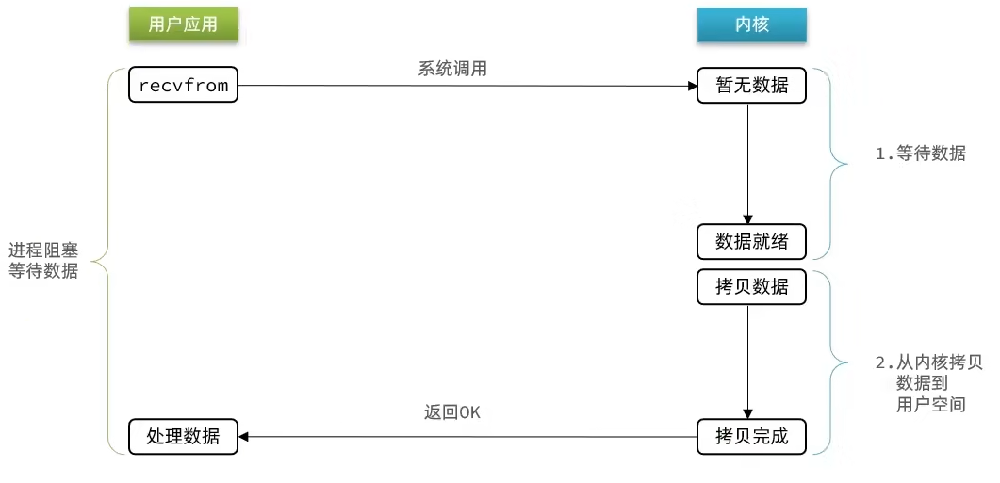

阻塞IO就是两个阶段都必须阻塞等待：

**阶段一：**

- 用户进程尝试读取数据（比如网卡数据）
- 此时数据尚未到达，内核需要等待数据
- 此时用户进程也处于阻塞状态

阶段二：

* 数据到达并拷贝到内核缓冲区，代表已就绪
* 将内核数据拷贝到用户缓冲区
* 拷贝过程中，用户进程依然阻塞等待
* 拷贝完成，用户进程解除阻塞，处理数据


#### 非阻塞IO

非阻塞IO的recvfrom操作会立即返回结果而不是阻塞用户进程。

阶段一：

* 用户进程尝试读取数据（比如网卡数据）
* 此时数据尚未到达，内核需要等待数据
* 返回异常给用户进程
* 用户进程拿到error后，再次尝试读取
* 循环往复，直到数据就绪

阶段二：

* 将内核数据拷贝到用户缓冲区
* 拷贝过程中，用户进程依然阻塞等待
* 拷贝完成，用户进程解除阻塞，处理数据
* 可以看到，非阻塞IO模型中，用户进程在第一个阶段是非阻塞，第二个阶段是阻塞状态。虽然是非阻塞，但**性能并没有得到提高**。而且忙等机制会导致CPU空转，CPU使用率暴增。

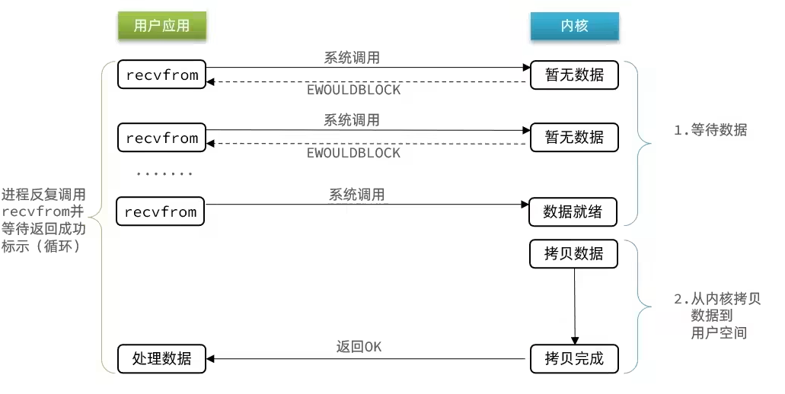


#### IO多路复用

无论是阻塞IO还是非阻塞IO，用户应用在一阶段都需要调用recvfrom来获取数据，差别在于无数据时的处理方案：

- 如果调用recvfrom时，恰好没有数据，阻塞IO会使CPU阻塞，非阻塞IO使CPU空转，都不能充分发挥CPU的作用。
- 如果调用recvfrom时，恰好有数据，则用户进程可以直接进入第二阶段，读取并处理数据

> [!WARNING]
>
> 在单线程情况下，只能依次处理IO事件，如果正在处理的IO事件恰好未就绪（数据不可读或不可写），线程就会被阻塞，所有IO事件都必须等待，性能自然会很差


通过**FD**，我们的网络模型可以利用一个线程监听多个FD，并在某个FD可读、可写时得到通知，从而避免无效的等待，充分利用CPU资源。

> [!NOTE]
>
> 文件描述符（File Descriptor）：简称FD，是一个从0 开始的无符号整数，用来关联Linux中的一个文件。在Linux中，一切皆文件，例如常规文件、视频、硬件设备等，当然也包括网络套接字（Socket）。


IO多路复用是利用单个线程来同时监听多个FD，并在某个FD可读、可写时得到通知，从而避免无效的等待，充分利用CPU资源。不过监听FD的方式、通知的方式又有多种实现，常见的有：

- select
- poll
- epoll

其中select和pool相当于是当被监听的数据准备好之后，他会把你监听的FD整个数据都发给你，你需要到整个FD中去找，哪些是处理好了的，需要通过遍历的方式，所以性能也并不是那么好

而epoll，则相当于内核准备好了之后，他会把准备好的数据，直接发给你，咱们就省去了遍历的动作。

> [!TIP]
>
> 用IO复用模式，可以确保去读数据的时候，数据是一定存在的，他的效率比原来的阻塞IO和非阻塞IO性能都要高


##### IO多路复用-select

select是Linux最早是由的I/O多路复用技术：

简单说，就是我们把需要处理的数据封装成FD，然后将整个FD发给内核，内核会检查数据是否就绪（没有就绪则休眠，直到数据就绪将其唤醒），数据就绪后，再将准备好的FD集合写回到用户态中去，用户态也需要去进行遍历，然后找到对应准备好数据的节点，再去发起读请求

这种模式下他虽然比阻塞IO和非阻塞IO好，但是依然有需要频繁的传递fd集合，频繁的去遍历FD等问题

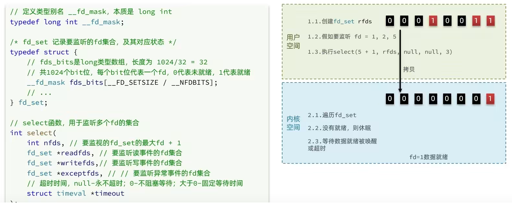


##### IO多路复用-poll

poll模式对select模式做了简单改进，但性能提升不明显

IO流程：

* 创建pollfd数组，向其中添加关注的fd信息，数组大小自定义
* 调用poll函数，将pollfd数组拷贝到内核空间，转链表存储，无上限
* 内核遍历fd，判断是否就绪
* 数据就绪或超时后，拷贝pollfd数组到用户空间，返回就绪fd数量n
* 用户进程判断n是否大于0,大于0则遍历pollfd数组，找到就绪的fd

**与select对比：**

* select模式中的fd_set大小固定为1024，而pollfd在内核中采用链表，理论上无上限
* 监听FD越多，每次遍历消耗时间也越久，性能反而会下降

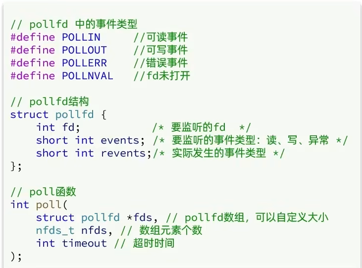


##### IO多路复用-epoll

poll模式是对select和poll的改进，它提供了三个系统调用：

1. `eventpoll`

   > [!NOTE]
   >
   > 会创建如下数据结构
   >
   > - 红黑树 ---> 记录要监听的FD
   >
   > - 链表 ---> 一个链表，记录就绪的FD

2. `epoll_ctl`

   > [!NOTE]
   >
   > 将要监听的数据添加到红黑树上去，并且给每个fd设置一个监听函数，这个函数会在fd数据就绪时触发，会把fd把数据添加到list_head中去

3. `epoll_wait`

   > [!NOTE]
   >
   > 当调用这个函数的时候，先创建events数组，然后检查list_head（会有等待时间，依据数据结构的配置），list_head中有数据会将数据放入到events数组中，用户应用收到响应后，就可以去取数据


##### IO多路复用-事件通知机制

当FD有数据可读时，我们调用epoll_wait（或者select、poll）可以得到通知。但是事件通知的模式有两种：

* LevelTriggered：简称LT，也叫做水平触发。只要某个FD中**有数据可读**，每次调用epoll_wait都会得到通知。
* EdgeTriggered：简称ET，也叫做边沿触发。只有在某个FD有**状态变化时**，调用epoll_wait才会被通知。

​                                                                                                                                                        

举个栗子（￣︶￣）↗　：

* 假设一个客户端socket对应的FD已经注册到了epoll实例中
* 客户端socket发送了2kb的数据
* 服务端调用epoll_wait，得到通知说FD就绪
* 服务端从FD读取了1kb数据回到步骤3（再次调用epoll_wait，形成循环）

> [!TIP]
>
> 如果我们采用LT模式，因为FD中仍有1kb数据，则第⑤步依然会返回结果，并且得到通知
> 如果我们采用ET模式，因为第③步已经消费了FD可读事件，第⑤步FD状态没有变化，因此epoll_wait不会返回，数据无法读取，客户端响应超时。


**结论**：

- [x] ET模式避免了LT模式可能出现的**惊群现象**
- [x] ET模式最好结合非阻塞IO读取数据，相比LT更复杂一些


> [!NOTE]
>
> 惊群现象
>
> 惊群现象是指在计算机系统中，当多个进程或线程同时等待同一个事件（如资源可用、信号触发等）时，当该事件发生时，所有等待者都被唤醒，但最终只有一个能成功获取资源，其余的都因竞争失败而不得不重新进入等待状态的现象。


#### 信号驱动IO

信号驱动IO是与内核建立SIGIO的信号关联并设置回调，当内核有FD就绪时，会发出SIGIO信号通知用户，期间用户应用可以执行其它业务，无需阻塞等待。

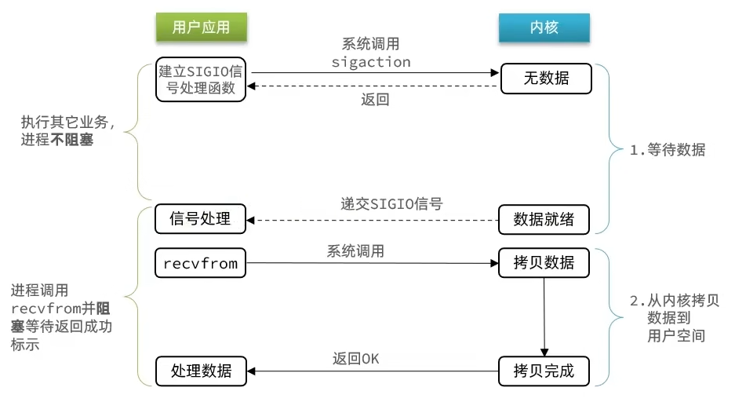

不足：

​	当有大量IO操作时，信号较多，SIGIO处理函数不能及时处理可能导致信号队列溢出，而且内核空间与用户空间的频繁信号交互性能也较低。


#### 异步IO

这种方式，不仅仅是用户态在试图读取数据后，不阻塞，而且当内核的数据准备完成后，也不会阻塞


由内核将所有数据处理完成，并由内核将数据写入到用户态中，然后才算完成，所以性能极高，不会有任何阻塞，全部都由内核完成，可以看到，异步IO模型中，用户进程在两个阶段都是非阻塞状态。

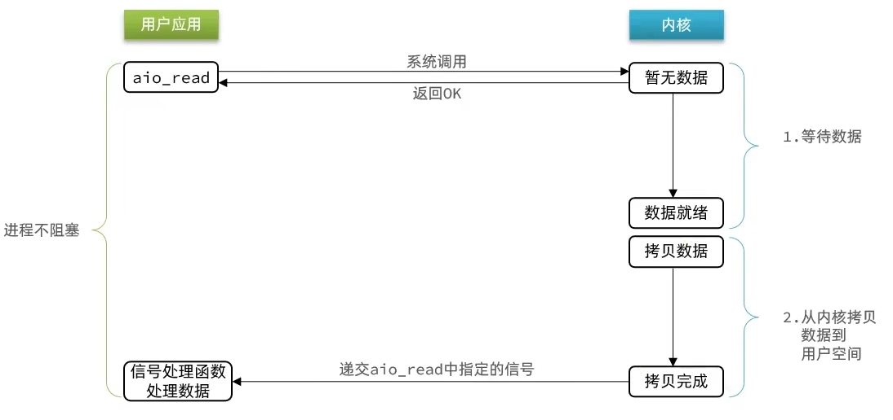


#### 总结

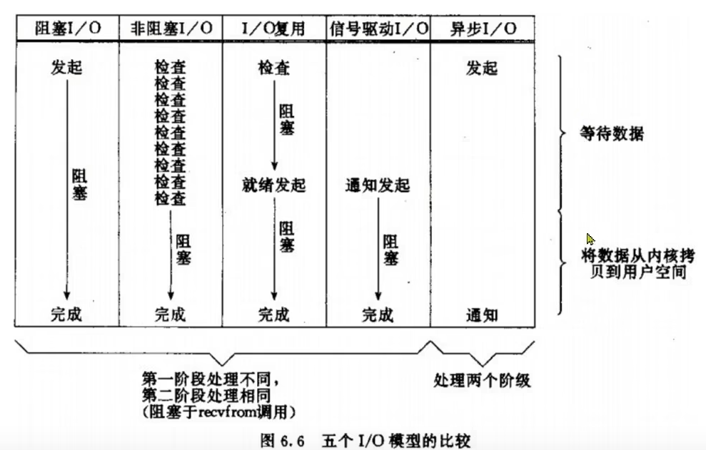


### Redis网络模型

> [!IMPORTANT]
>
> **Redis到底是单线程还是多线程？**
>
> * 如果仅仅是Redis的核心业务部分（命令处理），答案是单线程
> * 如果是整个Redis，那么答案就是多线程
>
> 
>
> **为什么Redis要选择单线程？**
>
> * 抛开持久化不谈，Redis是纯内存操作，执行速度非常快，它的性能瓶颈是网络延迟而不是执行速度，因此多线程并不会带来巨大的性能提升。
> * 多线程会导致过多的上下文切换，带来不必要的开销
> * 引入多线程会面临线程安全问题，必然要引入线程锁这样的安全手段，实现复杂度增高，而且性能也会大打折扣


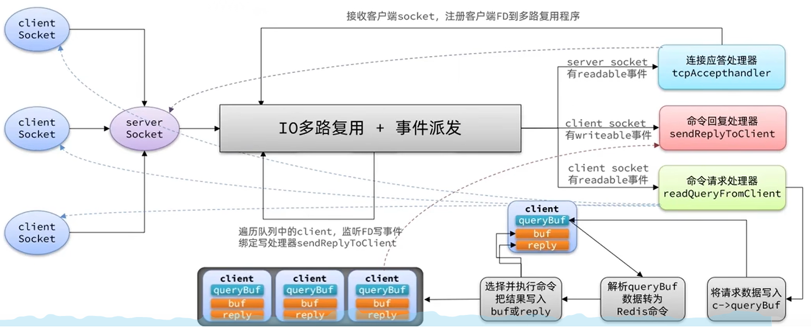

> 优化，将命**令回复处理**和**读取并解析Redis命令**改为多线程操作


当我们的客户端想要去连接我们服务器，会去先到IO多路复用模型去进行排队，会有一个连接应答处理器，他会去接受读请求，然后把读请求注册到具体模型中去，此时这些建立起来的连接，如果是客户端请求处理器去进行执行命令时，他会去把数据读取出来，然后把数据放入到client中， client去解析当前的命令转化为redis认识的命令，接下来就开始处理这些命令，从redis中的command中找到这些命令，然后就真正的去操作对应的数据了，当数据操作完成后，会去找到命令回复处理器，由其将数据写出。

 


### 通信协议-RESP

Redis是一个CS架构的软件，通信一般分两步（不包括pipeline和PubSub）：

1. 客户端（client）向服务端（server）发送一条命令

2. 服务端解析并执行命令，返回响应结果给客户端

因此客户端发送命令的格式、服务端响应结果的格式必须有一个规范，这个规范就是通信协议。


而在Redis中采用的是RESP（Redis Serialization Protocol）协议

> [!TIP]
>
> Redis 1.2版本引入了RESP协议
>
> Redis 2.0版本中成为与Redis服务端通信的标准，称为RESP2
>
> Redis 6.0版本中，从RESP2升级到了RESP3协议，增加了更多数据类型并且支持6.0的新特性--客户端缓存
>
> 但目前，默认使用的依然是RESP2协议，也是我们要学习的协议版本（以下简称RESP）。


在RESP中，通过**首字节的字符**来区分不同数据类型，常用的数据类型包括5种：

- 单行字符串：首字节是 ‘+’ ，后面跟上单行字符串，以CRLF（ "\r\n" ）结尾。例如返回"OK"： "+OK\r\n"

- 错误（Errors）：首字节是 ‘-’ ，与单行字符串格式一样，只是字符串是异常信息，例如："-Error message\r\n"

- 数值：首字节是 ‘:’ ，后面跟上数字格式的字符串，以CRLF结尾。例如：":10\r\n"

- 多行字符串：首字节是 ‘$’ ，表示二进制安全的字符串，最大支持512MB：

  - 如果大小为0，则代表空字符串："$0\r\n\r\n"

  - 如果大小为-1，则代表不存在："$-1\r\n"

- 数组：首字节是 ‘*’，后面跟上数组元素个数，再跟上元素，元素数据类型不限:

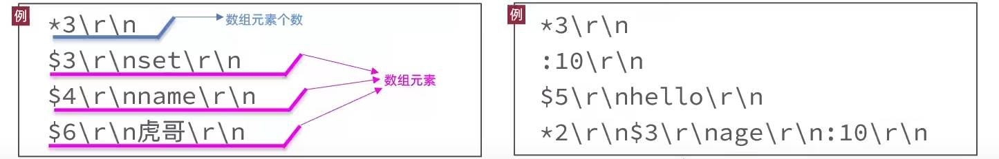


### 内存策略

Redis之所以性能强，最主要的原因就是基于内存存储。然而单节点的Redis其内存大小不宜过大，会影响持久化或主从同步性能。

我们可以通过修改redis.conf文件，添加下面的配置来配置Redis的最大内存：

```Properties
maxmemory 1gb
```

当内存达到上限，就无法存储更多数据了。因此，Redis内部会有两套内存回收的策略：

- 内存过期策略
- 内存淘汰策略


#### 内存过期

Redis不管有多少种数据类型，本质是一个`KEY-VALUE`的键值型数据库，而这种键值映射底层正式基于HashTable来实现的，在Redis中叫做Dict.

来看下RedisDB的底层源码：

```c++
typedef struct redisDb {
    dict dict;                 / The keyspace for this DB , 也就是存放KEY和VALUE的哈希表*/
    dict *expires;              /* 同样是哈希表，但保存的是设置了TTL的KEY，及其到期时间*/
    dict *blocking_keys;        /* Keys with clients waiting for data (BLPOP)*/
    dict *ready_keys;           /* Blocked keys that received a PUSH */
    dict *watched_keys;         /* WATCHED keys for MULTI/EXEC CAS /
    int id;                     / Database ID, 0 ~ 15 /
    long long avg_ttl;          / Average TTL, just for stats /
    unsigned long expires_cursor; / Cursor of the active expire cycle. */
    list *defrag_later;         /* List of key names to attempt to defrag one by one, gradually. */
} redisDb;
```

- [x] **面试题**：Redis如何判断KEY是否过期呢？

**答**：在Redis中会有两个Dict，也就是HashTable，其中一个记录KEY-VALUE键值对，另一个记录KEY和过期时间。要判断一个KEY是否过期，只需要到记录过期时间的Dict中根据KEY查询即可。


Redis并不会在KEY过期时立刻删除KEY，因为要实现这样的效果就必须给每一个过期的KEY设置时钟，并监控这些KEY的过期状态。无论对CPU还是内存都会带来极大的负担。

Redis的过期KEY删除策略有两种：

- 惰性删除
- 周期删除


##### **惰性删除**

Redis会在每次访问KEY的时候判断当前KEY有没有设置过期时间，如果有，过期时间是否已经到期。


##### **周期删除**

通过一个定时任务，周期性的抽样部分过期的key，然后执行删除。

执行周期有两种：

- **SLOW模式：**Redis会设置一个定时任务`serverCron()`，按照`server.hz`的频率来执行过期key清理
- **FAST模式：**Redis的每个事件循环前执行过期key清理（事件循环就是NIO事件处理的循环）。


**SLOW**模式规则：

- ① 执行频率受`server.hz`影响，默认为10，即每秒执行10次，每个执行周期100ms。
- ② 执行清理耗时不超过一次执行周期的25%，即25ms.
- ③ 逐个遍历db，逐个遍历db中的bucket，抽取20个key判断是否过期
- ④ 如果没达到时间上限（25ms）并且过期key比例大于10%，再进行一次抽样，否则结束

**FAST**模式规则（过期key比例小于10%不执行）：

- ① 执行频率受`beforeSleep()`调用频率影响，但两次FAST模式间隔不低于2ms
- ② 执行清理耗时不超过1ms
- ③ 逐个遍历db，逐个遍历db中的bucket，抽取20个key判断是否过期
- ④ 如果没达到时间上限（1ms）并且过期key比例大于10%，再进行一次抽样，否则结束


#### 内存淘汰

对于某些特别依赖于Redis的项目而言，仅仅依靠过期KEY清理是不够的，内存可能很快就达到上限。因此Redis允许设置内存告警阈值，当内存使用达到阈值时就会主动挑选部分KEY删除以释放更多内存。这叫做**内存淘汰**机制。

Redis每次执行任何命令时，都会判断内存是否达到阈值


Redis支持8种不同的内存淘汰策略：

- `noeviction`： 不淘汰任何key，但是内存满时不允许写入新数据，**默认就是这种策略**。
- `volatile-ttl`： 对设置了TTL的key，比较key的剩余TTL值，TTL越小越先被淘汰
- `allkeys-random`：对全体key ，随机进行淘汰。也就是直接从db->dict中随机挑选
- `volatile-random`：对设置了TTL的key ，随机进行淘汰。也就是从db->expires中随机挑选。
- `allkeys-lru`： 对全体key，基于LRU算法进行淘汰
- `volatile-lru`： 对设置了TTL的key，基于LRU算法进行淘汰
- `allkeys-lfu`： 对全体key，基于LFU算法进行淘汰
- `volatile-lfu`： 对设置了TTL的key，基于LFU算法进行淘汰（**推荐**）


- [x] **LRU**（**`L`**`east `**`R`**`ecently `**`U`**`sed`），最近最久未使用。用当前时间减去最后一次访问时间，这个值越大则淘汰优先级越高。

- [x] **LFU**（**`L`**`east `**`F`**`requently `**`U`**`sed`），最少频率使用。会统计每个key的访问频率，值越小淘汰优先级越高。


其中的`lru`就是记录最近一次访问时间和访问频率的。选择`LRU`和`LFU`时的记录方式不同：

- **LRU**：以秒为单位记录最近一次访问时间，长度24bit
- **LFU**：高16位以分钟为单位记录最近一次访问时间，低8位记录逻辑访问次数


>  **逻辑访问次数**
>
>  - ① 生成`[0,1)`之间的随机数`R`
>  - ② 计算 `1/(旧次数 * lfu_log_factor + 1)`，记录为`P`， `lfu_log_factor`默认为10
>  - ③ 如果 `R` < `P `，则计数器 `+1`，且最大不超过255
>  - ④ 访问次数会随时间衰减，距离上一次访问时间每隔 `lfu_decay_time` 分钟(默认1) ，计数器`-1`
>
>  显然LFU的基于访问频率的统计更符合我们的淘汰目标，因此**官方推荐使用LFU算法。**

