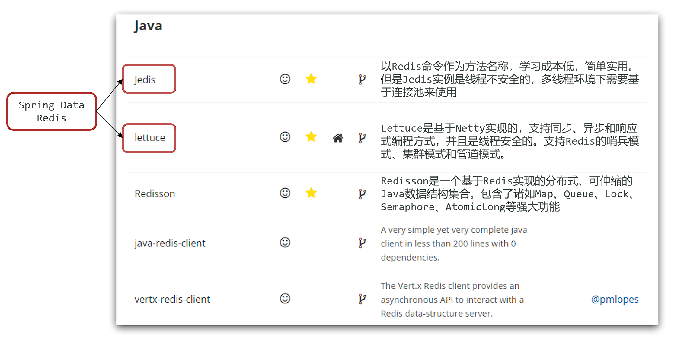
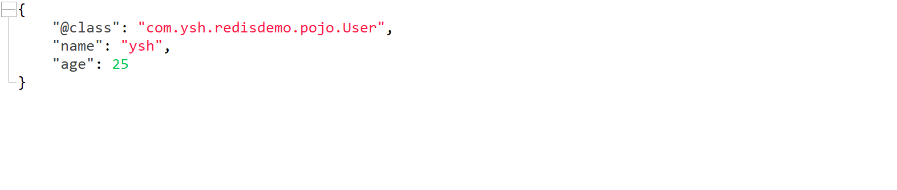
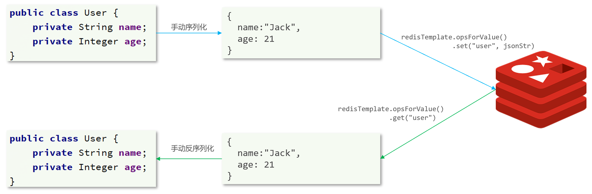

## Java客户端

在Redis提供了各种语言的[客户端](https://redis.io/docs/latest/develop/clients/)




## Jedis

1.引入依赖

2.创建Jedis对象，建立连接

3.使用Jedis，方法名与Redis命令一致

4.释放资源

<br>

导入依赖

```xml
<dependency>
    <groupId>redis.clients</groupId>
    <artifactId>jedis</artifactId>
    <version>x.x.x</version>
</dependency>
```


使用客户端

```java
public void setUp() {
    // 建立连接
    Jedis jedis = new Jedis("localhost", 6379);
    // 验证密码
    jedis.auth("123456");
    // 选择数据库
    jedis.select(0);
}

public void tearDown() {
    // 关闭连接
    if (jedis != null) {
        jedis.close();
    }
}

void testString() {
    jedis.set("ysh","666");

    String ysh = jedis.get("ysh");
}

```

!!!note
    Jedis的API与Redis官方指令一致


**Jedis连接池**

Jedis本身是线程不安全的，并且频繁的创建和销毁连接会有性能损耗，因此推荐使用Jedis连接池代替Jedis的直连方式。

```java
public class JedisPoolConnection {
    // 声明一个静态的JedisPool对象，用于管理Jedis连接池
    private static final JedisPool jedisPool;

    // 静态代码块，在类加载时执行，用于初始化Jedis连接池
    static {
        // 创建JedisPoolConfig对象，用于配置连接池参数
        JedisPoolConfig config = new JedisPoolConfig();
        // 设置连接池中最多可以存在的连接数
        config.setMaxTotal(10);
        // 设置连接池中最多可以存在的空闲连接数
        config.setMaxIdle(10);
        // 设置连接池中最少可以存在的空闲连接数
        config.setMinIdle(5);
        // 设置连接池中当连接数达到最大值时，获取连接的最长等待时间
        config.setMaxWait(Duration.ofMillis(10000));

        // 创建JedisPool对象，传入配置信息、Redis服务器地址、端口、连接超时时间和密码
        jedisPool = new JedisPool(config,
                "localhost", 6379, 2000, "123456");
    }

    // 提供一个静态方法，用于获取Jedis连接
    public static Jedis getConnection() {
        // 从连接池中获取一个Jedis实例
        return jedisPool.getResource();
    }
}
```


## SpringDataRedis

SpringData是Spring中数据操作的模块，包含对各种数据库的集成，其中对Redis的集成模块就叫做SpringDataRedis

- 提供了对不同Redis客户端的整合（Lettuce和Jedis）
- 提供了RedisTemplate统一API来操作Redis
- 支持Redis的发布订阅模型
- 支持Redis哨兵和Redis集群
- 支持基于Lettuce的响应式编程
- 支持基于JDK、JSON、字符串、Spring对象的数据序列化及反序列化
- 支持基于Redis的JDKCollection实现

<br>

1.引入依赖

```xml
<!-- redis -->
<dependency>
    <groupId>org.springframework.boot</groupId>
    <artifactId>spring-boot-starter-data-redis</artifactId>
</dependency>

<!-- commons-pool2 -->
<dependency>
    <groupId>org.apache.commons</groupId>
    <artifactId>commons-pool2</artifactId>
</dependency>
```

!!!warning
    注意`commons-pool2`版本的兼容性问题


2.编写配置文件

```yaml
spring:
  data:
    redis:
      host: localhost
      port: 6379
      password: 123456
      lettuce:
        pool:
          enabled: true
          max-active: 8
          max-idle: 8
          min-idle: 0
          max-wait: 1000ms
      database: 0
```

!!!warning
    SpringBoot2.x  配置redis的配置项为spring.redis


3.注入RedisTemplate使用

```java
    @Autowired
    private RedisTemplate<String, String> redisTemplate;

    @Test
    void contextLoads() {
        redisTemplate.opsForValue().set("key", "value");
        Object key = redisTemplate.opsForValue().get("key");
        System.out.println("key = " + key);
    }
```


### 序列化

RedisTemplate可以接收任意Object作为值写入Redis，只不过写入前会把Object序列化为字节形式，默认是采用JDK序列化

缺点：

- 可读性差
- 内存占用较大


可以自定义RedisTemplate的序列化方式：

```java
    @Bean
    public RedisTemplate<String, Object> redisTemplate(RedisConnectionFactory factory) {
        // 创建 RedisTemplate 对象
        RedisTemplate<String, Object> template = new RedisTemplate<>();

        // 设置连接工厂
        template.setConnectionFactory(factory);

        // 创建JSON序列化器
        GenericJackson2JsonRedisSerializer jackson2JsonRedisSerializer = new GenericJackson2JsonRedisSerializer();

        // 设置key的序列化器为String序列化器
        template.setKeySerializer(RedisSerializer.string());
        template.setHashKeySerializer(RedisSerializer.string());

        // 设置value的序列化器为JSON序列化器
        template.setValueSerializer(jackson2JsonRedisSerializer);
        template.setHashValueSerializer(jackson2JsonRedisSerializer);

        return template;
    }
```

!!!note
    需要引入Jackson依赖


### StringRedisTemplate

尽管JSON的序列化方式可以满足我们的需求，但依然存在一些问题



为了在反序列化时知道对象的类型，JSON序列化器会将类的class类型写入json结果中，存入Redis，会带来额外的内存开销。


为了节省内存空间，我们并不会使用JSON序列化器来处理value，而是统一使用String序列化器，要求只能存储String类型的key和value。当需要存储Java对象时，手动完成对象的序列化和反序列化。




Spring默认提供了一个**StringRedisTemplate**类，它的key和value的序列化方式默认就是String方式。省去了我们自定义RedisTemplate的过程

```java
    @Autowired
    private StringRedisTemplate stringRedisTemplate;

    private static final ObjectMapper mapper = new ObjectMapper();

    @Test
    void contextLoads() throws JsonProcessingException {
        User user = new User("ysh", 21);
        String json = mapper.writeValueAsString(user);
        stringRedisTemplate.opsForValue().set("user:1", json);

        String result = stringRedisTemplate.opsForValue().get("user:1");
        User user1 = mapper.readValue(result, User.class);
        System.out.println("user1 = " + user1);
    }
```

!!!tip
    可以使用其它序列化工具如FastJson、hutool


---


