## 短信登录

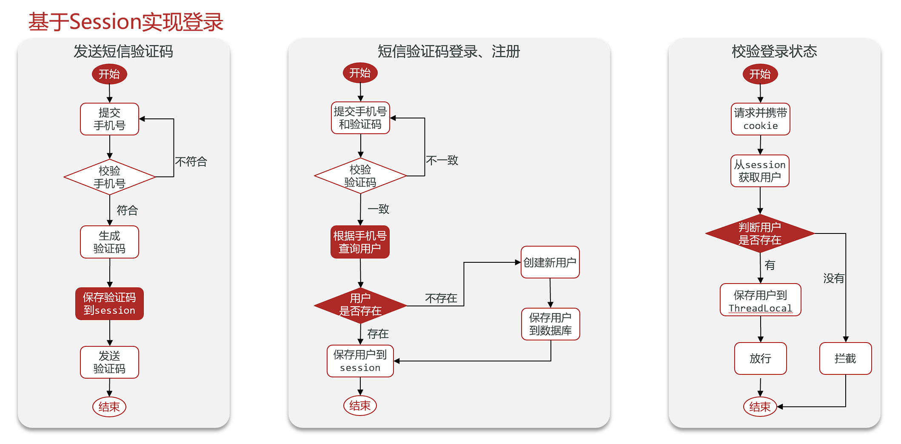

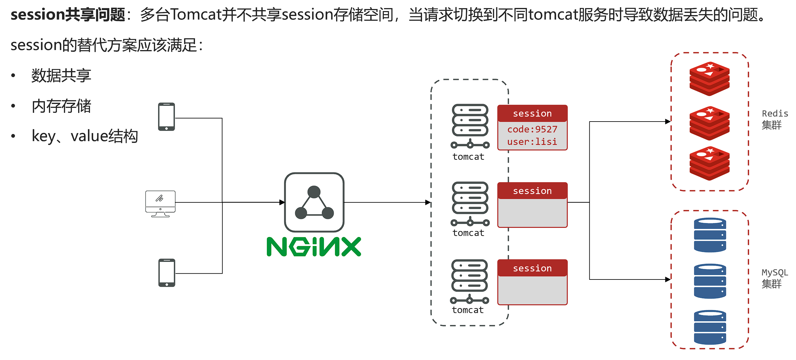

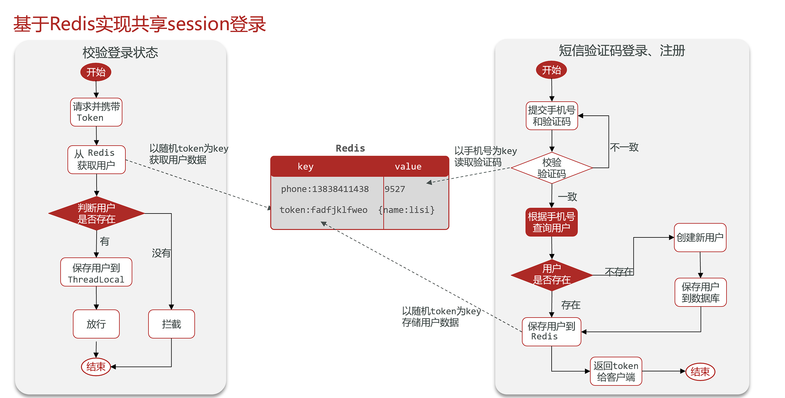


## Redis实现缓存

**缓存**就是数据交换的缓冲区（称作Cache [ kæʃ ] ），是存贮数据的临时地方，一般读写性能较高

优势：

- 降低服务器负载
- 提高响应速度

劣势：

- 数据不一致
- 增加维护复杂度

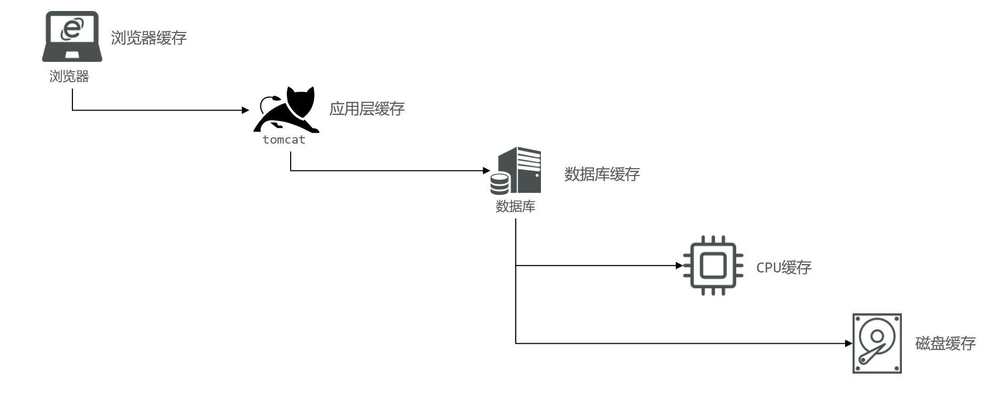


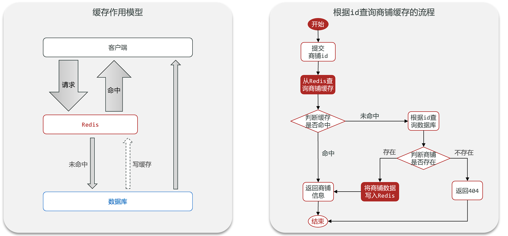


### 缓存更新策略

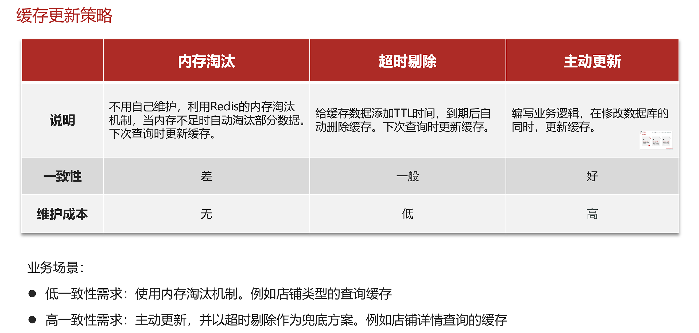

**解决方案**：

1. **`Cache Aside Pattern`**：由缓存的调用者，在更新数据库的同时更新缓存（<font color="red">推荐</font>）
2. **`Read/Write Through Pattern`**：缓存与数据库整合为一个服务，由服务来维护一致性。调用者调用该服务，无需关心缓存一致性问题。
3. **`Write Behind Caching Pattern`**：调用者只操作缓存，由其它线程异步的将缓存数据持久化到数据库，保证最终一致。


操作缓存和数据库时有三个问题需要考虑：

1.删除缓存还是更新缓存？

- 更新缓存：每次更新数据库都更新缓存，无效写操作较多❌

- 删除缓存：更新数据库时让缓存失效，查询时再更新缓存✔

2.如何保证缓存与数据库的操作的同时成功或失败？

- 单体系统，将缓存与数据库操作放在一个事务

- 分布式系统，利用TCC等分布式事务方案

3.先操作缓存还是先操作数据库？

- 先写数据库，然后再删除缓存

- 要确保数据库与缓存操作的原子性


### 缓存穿透

**缓存穿透**是指客户端请求的数据在缓存中和数据库中都不存在，这样缓存永远不会生效，这些请求都会到达数据库。

常见的解决方案有两种：

- 缓存空对象
    - 优点：实现简单，维护方便
    - 缺点：
        - 额外的内存消耗
        - 可能造成短期的不一致

- 布隆过滤
    - 优点：内存占用较少，没有多余key
    - 缺点：
        - 实现复杂
        - 存在误判可能

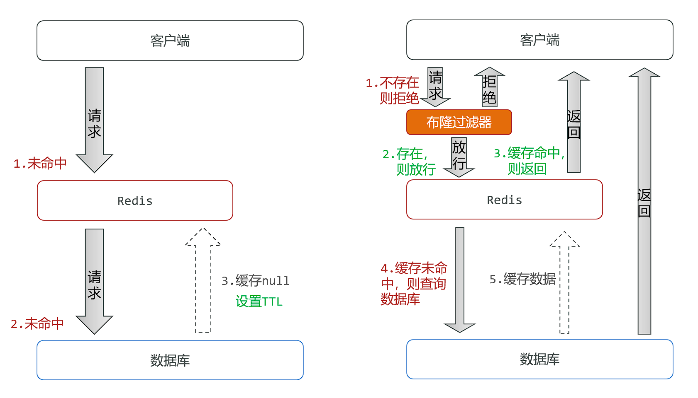


**可行方案：**

- 缓存null值
- 布隆过滤
- 增强id的复杂度，避免被猜测id规律
- 做好数据的基础格式校验
- 加强用户权限校验
- 做好热点参数的限流


### 缓存雪崩

**缓存雪崩**是指在同一时段<font color=red>大量的缓存key同时失效或者Redis服务宕机</font>，导致大量请求到达数据库，带来巨大压力。

**解决方案：**

- 给不同的Key的TTL添加随机值
- 利用Redis集群提高服务的可用性
- 给缓存业务添加降级限流策略
- 给业务添加多级缓存


### 缓存击穿

**缓存击穿问题**也叫热点Key问题，就是一个被**高并发访问**并且**缓存重建业务较复杂**的key突然失效了，无数的请求访问会在瞬间给数据库带来巨大的冲击。

常见的解决方案有两种：

- 互斥锁
- 逻辑过期

---

| 解决方案 | 优点                                       | 缺点                                       |
| -------- | ------------------------------------------ | ------------------------------------------ |
| 互斥锁   | 没有额外内存消耗<br>保证一致性<br>实现简单 | 线程需要等待，性能受影响<br>可能有死锁风险 |
| 逻辑过期 | 线程无需等待，性能较好                     | 不保证一致性<br>有额外内存消耗<br>实现复杂 |

---


## 全局唯一ID

全局ID生成器，是一种在**分布式系统**下用来生成全局唯一ID的工具，需要满足以下特性：

- 唯一性
- 高可用
- 高性能
- 递增性
- 安全性


常见的实现方式包括UUID、Snowflake算法等。

### UUID

UUID 是一个128位的标识符，通常表示为32个十六进制字符，分为5段（8-4-4-4-12）。UUID 的生成基于时间戳、随机数或硬件地址等，确保全局唯一性。

**示例：**

```
550e8400-e29b-41d4-a716-446655440000
```

**优点：**

- 无需中心化服务，分布式生成。
- 全球唯一性高。

**缺点：**

- 长度较长（36字符）。
- 无序，不适合作为数据库主键（可能导致索引碎片）。

------

### Snowflake算法

Snowflake 是 Twitter 开源的分布式ID生成算法，生成一个64位的ID，结构如下：

- **1位**：符号位（固定为0）。
- **41位**：时间戳（毫秒级，可用69年）。
- **10位**：机器ID（支持1024个节点）。
- **12位**：序列号（每毫秒可生成4096个ID）。

**示例：**

```
1234567890123456789
```

**优点：**

- 短小精悍（64位整数）。
- 时间有序，适合作为数据库主键。
- 高性能，支持高并发。

**缺点：**

- 依赖系统时钟，时钟回拨可能导致ID冲突。
- 需要管理机器ID的分配。


### Redis自增

Redis自增ID生成器利用Redis的原子性INCR命令生成全局唯一ID，结合时间戳和序列号保证ID的唯一性和递增性。

**实现原理：**

1. **时间戳部分**：使用自定义起始时间戳（如2025年1月1日）作为基准，计算当前时间与基准时间的秒数差值，作为ID的高位部分
2. **序列号部分**：使用Redis的INCR命令对每天的计数器进行原子性自增，作为ID的低位部分
3. **位运算组合**：将时间戳左移32位，与序列号进行按位或运算，生成最终的64位ID

**ID结构（64位）：**

- **32位时间戳**：相对于起始时间的秒数（可用68年）
- **32位序列号**：每天重置的自增序列（每天可生成42亿个ID）

**优点：**

- 高性能：基于Redis的内存操作，性能极高
- 全局唯一：时间戳+日期+序列号确保唯一性
- 趋势递增：时间维度上ID呈递增趋势
- 信息可读：可从ID中解析出生成时间
- 高可用：支持Redis集群部署

**缺点：**

- 依赖Redis：Redis故障会影响ID生成
- 时钟敏感：依赖系统时钟的准确性

```java
@Component
@RequiredArgsConstructor
public class RedisIdWorker {

    private final StringRedisTemplate redisTemplate;

    // 自定义起始时间戳（2025年1月1日0时0分0秒）
    private final long BEGIN_TIME_STAMP = 1735689600L;

    public long nextId(String prefix) {
        // 1. 生成时间戳
        LocalDateTime now = LocalDateTime.now();
        long epochSecond = now.toEpochSecond(ZoneOffset.UTC);
        long nowEpochSecond = epochSecond - BEGIN_TIME_STAMP;

        // 2. 生成序列号（每天一个key，避免单key过大）
        String date = now.format(DateTimeFormatter.ofPattern("yyyyMMdd"));
        long increment = redisTemplate.opsForValue().increment("icr:" + prefix + ":" + date);

        // 3. 拼接并返回（时间戳左移32位 + 序列号）
        return nowEpochSecond << 32 | increment;
    }

}
```


## 超卖问题

超卖问题（Overselling）是电商、秒杀、库存管理等场景中常见的核心问题，指系统**实际销售数量超过库存数量**，导致订单无法履约。

**原因**：

1. **并发请求冲突**
    - 多个用户同时请求购买同一商品，系统未正确处理并发扣减库存。
2. **数据库更新延迟**
    - 数据库读写分离时，从库同步延迟导致读取到旧库存数据。
3. **缓存与数据库不一致**
    - 缓存层（如 Redis）与数据库的库存数据未同步。
4. **非原子性操作**
    - 查询库存、扣减库存分步执行，中间过程被其他请求插入。


**解决方案**：

**数据库层面：锁机制**

- **悲观锁（Pessimistic Lock）**
  通过 `SELECT ... FOR UPDATE` 锁定记录，确保串行操作。

  ```sql
  BEGIN;
  SELECT stock FROM products WHERE id=1 FOR UPDATE;
  UPDATE products SET stock = stock - 1 WHERE id=1;
  COMMIT;
  ```

  **缺点**：高并发下性能差，可能引发死锁。

- **乐观锁（Optimistic Lock）**
  使用版本号或库存字段本身作为条件更新。

  ```sql
  UPDATE products 
  SET stock = stock - 1, version = version + 1 
  WHERE id=1 AND stock > 0 AND version = {current_version};
  ```

  **优点**：无锁竞争，适合高并发。
  **缺点**：需处理更新失败（如重试或提示用户）。

**分布式锁**

- **Redis 锁**
  使用 `SET key value NX EX` 实现原子锁：

  ```python
  lock = redis.set("product_1_lock", "locked", nx=True, ex=5)
  if lock:
      try:
          # 扣减库存逻辑
      finally:
          redis.delete("product_1_lock")
  ```

  **注意**：需解决锁过期和误删问题（如 Redlock 算法）。

**缓存层原子操作**

- **Redis 原子扣减**
  利用 Redis 的原子命令（如 `DECR` 或 Lua 脚本）：

  ```lua
  -- Lua 脚本（原子扣减库存）
  local stock = tonumber(redis.call('GET', KEYS[1]))
  if stock > 0 then
      redis.call('DECR', KEYS[1])
      return 1  -- 成功
  else
      return 0  -- 失败
  end
  ```

  **优点**：高性能，避免直接穿透到数据库。

- **预扣库存（预占机制）**
  用户下单时先在 Redis 中扣减库存，异步同步到数据库：

  ```python
  if redis.decr("product_1_stock") >= 0:
      # 创建订单，异步更新数据库
  else:
      # 恢复库存：redis.incr("product_1_stock")
  ```

##### **4. 消息队列削峰**

- 将请求放入队列（如 Kafka、RabbitMQ），由消费者顺序处理：

  ```python
  # 生产者（用户请求入队）
  producer.send("order_topic", {"user_id": 123, "product_id": 1})
  
  # 消费者（顺序扣减库存）
  consumer.subscribe("order_topic")
  for message in consumer:
      process_order(message)
  ```

  **优点**：流量削峰，保证最终一致性。


### 一人一单

#### 单实例部署

某些业务只允许用户进行一次交易

但当一个用户同一时间发起多个请求时，就有可能发生一人多单问题（多个线程都查询到数据库中并没有订单存在，都可以创建订单）


可以对数据操作代码加锁同步

```java
synchronized (userId.toString().intern()) {
            // 获取代理对象，解决spring事务失效问题
            IVoucherOrderService proxy =(IVoucherOrderService) AopContext.currentProxy();
            return proxy.createOrder(id, userId);
        }
```

> [!TIP]
>
> 以上代码只对同一个用户加锁，避免不同用户被阻塞的性能问题（intern()将字符串加入字符串常量池，避免同一个用户id有多个对象，同步失效）
>
> Spring的事务管理基于AOP代理对象实现，如果在类的方法内调用自身的方法，等同于this.xxx()，并没有通过代理对象实现事务增强，解决方案为先获取代理对象，然后再通过代理对象调用该方法
>
> 需要引入`aspectjweaver`依赖，并在启动类上加上`@EnableAspectJAutoProxy(exposeProxy = true)`注解


#### 多实例部署

> [!CAUTION]
>
> 以上方案在多实例集群模式下仍会发生线程安全问题


原因是多个实例各自都有自身的`JVM`去实现同步锁，无法共享


解决方案：

​	**分布式锁**：满足分布式系统或集群模式下多进程可见并且互斥的锁

- 多进程可见
- 互斥
- 高性能
- 安全性
- 高可用


常见实现方式

|        | MySQL              | Redis                    | Zookeeper                  |
| ------ | ------------------ | ------------------------ | -------------------------- |
| 互斥   | 利用本身互斥锁机制 | 利用setnx这类互斥命令    | 利用节点唯一性和有序性实现 |
| 高可用 | 优秀               | 优秀                     | 优秀                       |
| 高性能 | 一般               | 优秀                     | 一般                       |
| 安全性 | 断开连接自动释放锁 | 锁到期自动释放，避免死锁 | 临时节点断开连接自动释放   |


### 基于Redis的分布式锁

#### 简单实现

实现分布式锁时需要实现的两个基本方法：

- 获取锁：

```bash
SET lock thread1 EX 10 NX
```

> [!CAUTION]
>
> EX参数设置过期时间，NX参数实现与`SETNX`相同的功能
>
> 不建议直接使用`SETNX`,因为无法同时设置过期时间，可能发生获得锁后服务宕机，而未设置过期时间，最终导致死锁。


- 释放锁：

```bash
DEL lock
```

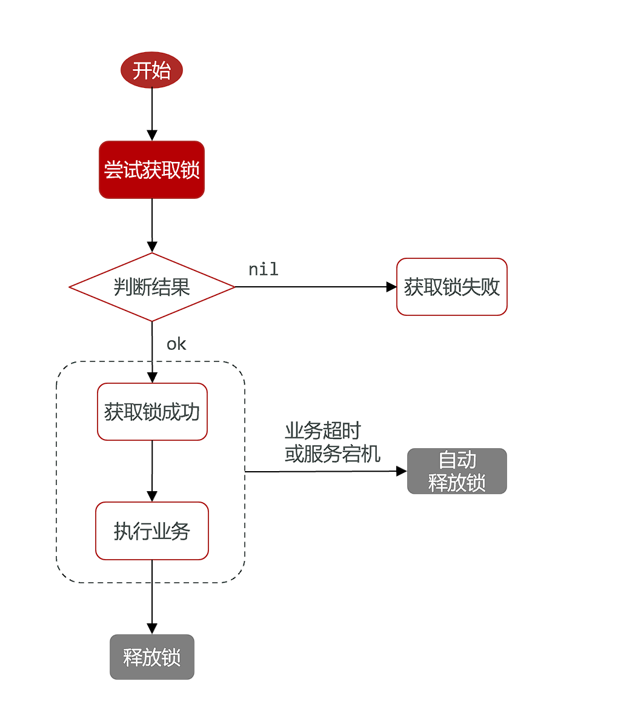


示例：

```java
    @Override
    public boolean tryLock(long timeout) {
        // 获取当前线程ID
        long threadId = Thread.currentThread().getId();

        Boolean success = stringRedisTemplate.opsForValue()
                .setIfAbsent(KEY_PREFIX + name, threadId + "", timeout, TimeUnit.SECONDS);

        return Boolean.TRUE.equals(success);
    }

    @Override
    public void unlock() {
        // 释放锁
        stringRedisTemplate.delete(KEY_PREFIX + name);
    }
```


#### 锁误删问题

主要发生在某个线程阻塞时锁超时释放了，其他线程就可以获得锁，当被阻塞的线程恢复后就会删除不属于自己的锁

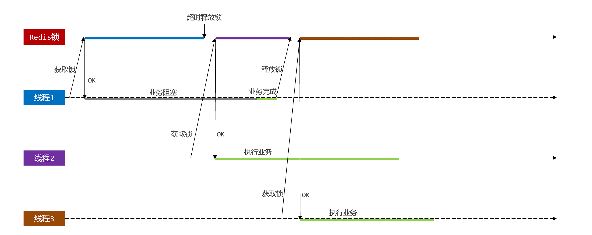

**解决方案**

为线程的锁加入唯一标识，释放前判断锁是否属于自己

> [!TIP]
>
> 可使用UUID


##### 原子性问题

如果查询和删除锁不能原子性执行，就仍然有可能发生锁误删问题

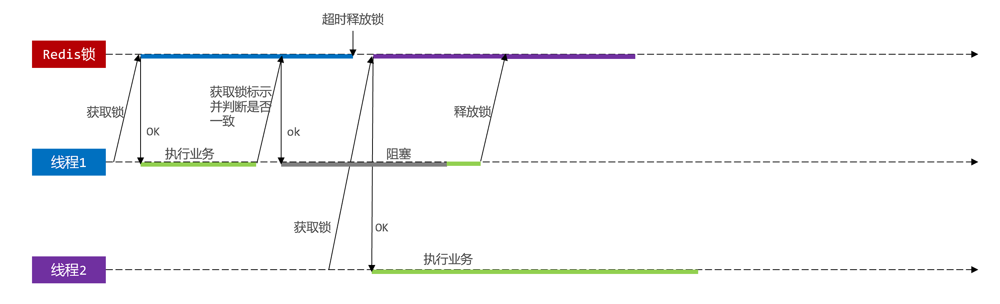


**Lua脚本**

Redis提供了Lua脚本功能，在一个脚本中编写多条Redis命令，确保多条命令执行时的原子性。Lua是一种编程语言，基本语法可以参考网站：https://www.runoob.com/lua/lua-tutorial.html


Redis可以通过如下命令执行Lua脚本

```lua
EVAL "<脚本内容>"

-- 示例

EVAL "return redis.call('set','key','value')" 0
```

> [!TIP]
>
> 参数**0**表示需要的key类型的参数个数


脚本中的key、value可以作为参数传递。key类型参数会放入`KEYS`数组，其它参数会放入`ARGV`数组，在脚本中可以从KEYS和ARGV数组获取这些参数：

```lua
EVAL "return redis.call('set',KEYS[1],ARGV[1])" 1 key value
```


释放锁脚本示例：

```lua
-- 获取key
local key = KEYS[1]

-- 获取线程ID
local threadId = ARGV[1]

local id = redis.call('get',key)

if(id == threadId)
then
    return redis.call('del',key)
end
return 0
```


```java
    private static final DefaultRedisScript<Long> UNLOCK_SCRIPT;

    static {
        UNLOCK_SCRIPT = new DefaultRedisScript<>();
        UNLOCK_SCRIPT.setLocation(new ClassPathResource("unlock.lua"));
        UNLOCK_SCRIPT.setResultType(Long.class);
    }    
    
        // 执行Lua脚本释放锁
        stringRedisTemplate.execute(
                UNLOCK_SCRIPT,
                Collections.singletonList(KEY_PREFIX + name),
                ID_PREFIX + Thread.currentThread().getId()
        );
```


#### Redission

基于`SETNX`实现的分布式锁存在下面的问题

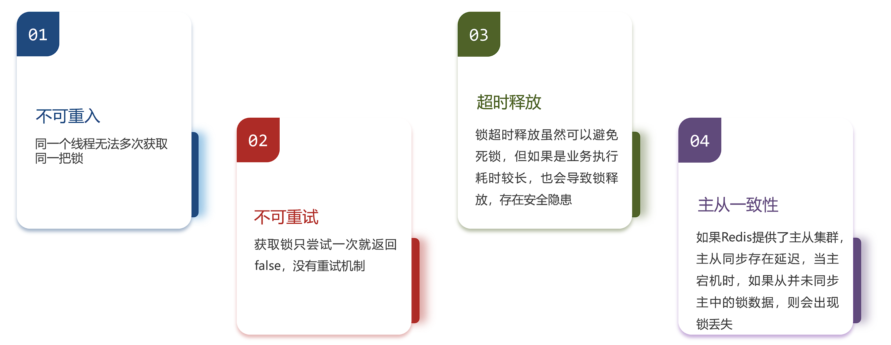


**Redisson**是一个在Redis的基础上实现的Java驻内存数据网格（In-Memory Data Grid）。它不仅提供了一系列的分布式的Java常用对象，还提供了许多分布式服务，其中就包含了各种分布式锁的实现。

官网地址： [https://redisson.org](https://redisson.org/)

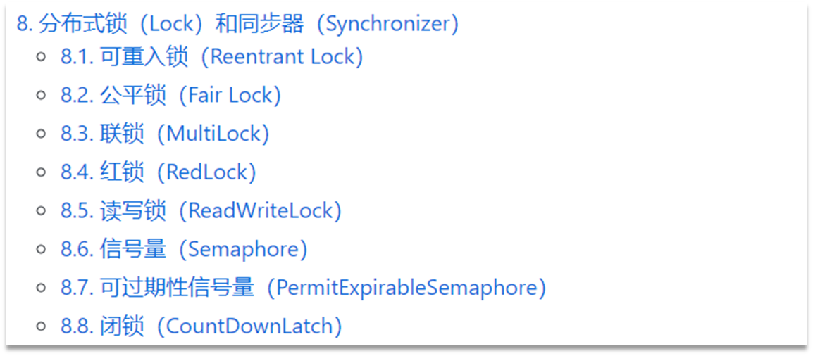


##### 快速入门

引入依赖

```xml
        <dependency>
            <groupId>org.redisson</groupId>
            <artifactId>redisson</artifactId>
            <version>3.36.0</version>
        </dependency>
```


配置Redisson

```java
@Configuration
public class RedisConfig {
    @Bean
    public RedissonClient redisson() {
        // 配置Redisson
        Config config = new Config();
        config.useSingleServer()
                .setAddress("redis://localhost:6379")
                .setPassword("123456");
        
        // 创建Redisson客户端
        return Redisson.create(config);
    }
}
```


在业务中注入`RedissonClient`然后获取锁即可


##### 可重入锁原理

利用hash结构记录线程id和重入次数

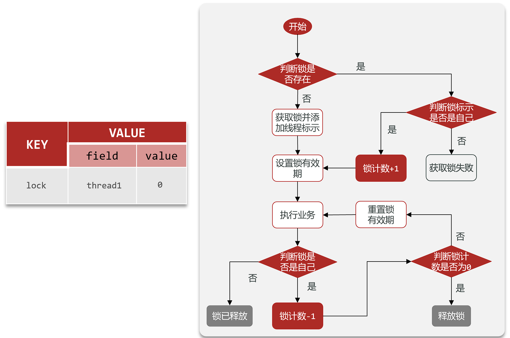

获取锁

```lua
local key = KEYS[1]; -- 锁的key
local threadId = ARGV[1]; -- 线程唯一标识
local releaseTime = ARGV[2]; -- 锁的自动释放时间
-- 判断是否存在
if(redis.call('exists', key) == 0) then
    -- 不存在, 获取锁
    redis.call('hset', key, threadId, '1'); 
    -- 设置有效期
    redis.call('expire', key, releaseTime); 
    return 1; -- 返回结果
end;
-- 锁已经存在，判断threadId是否是自己
if(redis.call('hexists', key, threadId) == 1) then
    -- 不存在, 获取锁，重入次数+1
    redis.call('hincrby', key, threadId, '1'); 
    -- 设置有效期
    redis.call('expire', key, releaseTime); 
    return 1; -- 返回结果
end;
return 0; -- 代码走到这里,说明获取锁的不是自己，获取锁失败
```

释放锁

```lua
local key = KEYS[1]; -- 锁的key
local threadId = ARGV[1]; -- 线程唯一标识
local releaseTime = ARGV[2]; -- 锁的自动释放时间
-- 判断当前锁是否还是被自己持有
if (redis.call('HEXISTS', key, threadId) == 0) then
    return nil; -- 如果已经不是自己，则直接返回
end;
-- 是自己的锁，则重入次数-1
local count = redis.call('HINCRBY', key, threadId, -1);
-- 判断是否重入次数是否已经为0 
if (count > 0) then
    -- 大于0说明不能释放锁，重置有效期然后返回
    redis.call('EXPIRE', key, releaseTime);
    return nil;
else  -- 等于0说明可以释放锁，直接删除
    redis.call('DEL', key);
    return nil;
end;
```


##### 重试机制和看门狗

•**可重试**：利用信号量和PubSub功能实现等待、唤醒，获取锁失败的重试机制

•**超时续约**：利用watchDog，每隔一段时间（releaseTime / 3），重置超时时间


##### 主从一致性

原理：多个独立的Redis节点，必须在所有节点都获取重入锁，才算获取锁成功

缺陷：运维成本高、实现复杂


### 基于Redis的消息队列

> [!TIP]
>
> 消息队列可参考 [RabbitMQ](./../SpringCloud/SpringCloud微服务.md)

**消息队列**（**M**essage **Q**ueue），字面意思就是存放消息的队列。最简单的消息队列模型包括3个角色：

- 消息队列：存储和管理消息，也被称为消息代理（Message Broker）

- 生产者：发送消息到消息队列
- 消费者：从消息队列获取消息并处理消息


Redis提供了三种不同的方式来实现消息队列：

- list结构：基于List结构模拟消息队列
- PubSub：基本的点对点消息模型
- Stream：比较完善的消息队列模型


#### 使用list实现

Redis的list数据结构是一个双向链表，很容易模拟出队列效果。队列是入口和出口不在一边，因此我们可以利用：LPUSH 结合 RPOP、或者 RPUSH 结合 LPOP来实现。

不过要注意的是，当队列中没有消息时RPOP或LPOP操作会返回null，并不像JVM的阻塞队列那样会阻塞并等待消息。因此这里应该使用**BRPOP**或者**BLPOP**来实现阻塞效果。


基于List的消息队列有哪些优缺点？

优点：

- 利用Redis存储，不受限于JVM内存上限
- 基于Redis的持久化机制，数据安全性有保证
- 可以满足消息有序性

缺点：

- 无法避免消息丢失
- 只支持单消费者


#### 使用PubSub实现

**PubSub**（发布订阅）是Redis2.0版本引入的消息传递模型。顾名思义，消费者可以订阅一个或多个channel，生产者向对应channel发送消息后，所有订阅者都能收到相关消息。

- `SUBSCRIBE channel [channel]` ：订阅一个或多个频道
- `PUBLISH channel msg` ：向一个频道发送消息
- `PSUBSCRIBE pattern[pattern]` ：订阅与pattern格式匹配的所有频道


优点：

- 采用发布订阅模型，支持多生产、多消费

缺点：

- 不支持数据持久化
- 无法避免消息丢失
- 消息堆积有上限，超出时数据丢失


#### 使用Stream实现

`Stream`是Redis5.0引入的一种数据类型，可以实现功能较完善的消息队列


发送消息

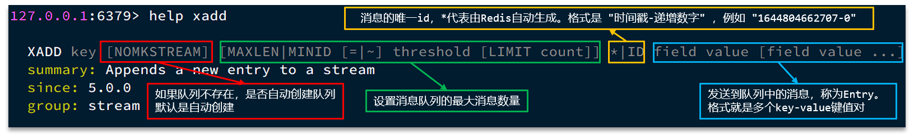

> [!NOTE]
>
> `xadd user * name ysh age 22`  


读取消息

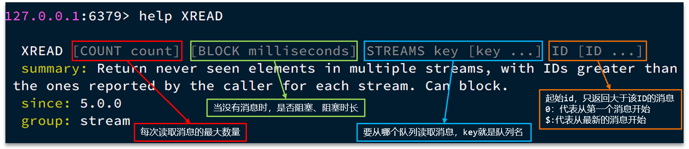

> [!NOTE]
>
> `xread cout 1 block 2000 streams user $` 阻塞式读取

<font color=red>注意：</font>当我们指定起始ID为$时，代表读取最新的消息，如果我们处理一条消息的过程中，又有超过1条以上的消息到达队列，则下次获取时也只能获取到最新的一条，会出现漏读消息的问题


STREAM类型消息队列的XREAD命令特点：

- 消息可回溯
- 一个消息可以被多个消费者读取
- 可以阻塞读取
- 有消息漏读的风险


**消费者组**

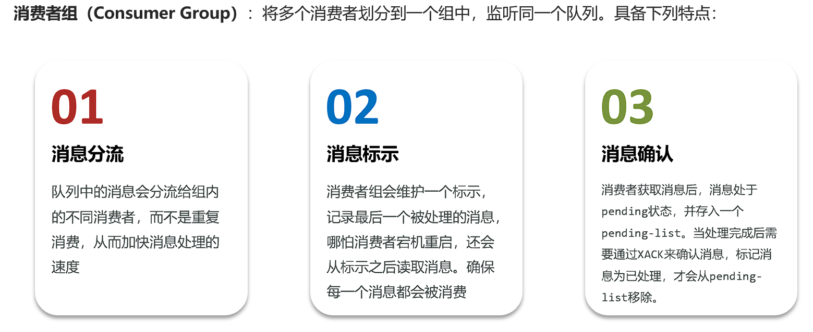

```bash
## 创建消费者组
xgroup create key groupName ID

## 删除消费者组
xgroup destroy key groupName

## 将消费者添加到消费者组
xgroup createconsumer key groupName consumerName

## 删除消费者组中的消费者
xgroup delconsumer key groupName consumerName
```

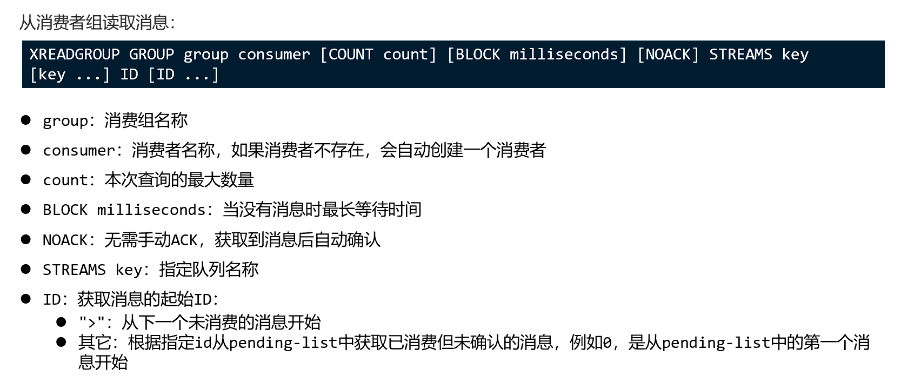


### Feed流模式（推流）

Feed流产品有两种常见的模式：

- TimeLine:不做内容筛选，简单的按照内容发布时间排序，常用于好友或关注。例如朋友圈
  - 优点：信息全面，不会有缺失，并且实现也相对简单
  - 优点：信息噪音多，用户不一定感兴趣，内容获取效率低
- 智能排序:利用智能算法屏蔽违规的、用户不感兴趣的内容，推送用户感兴趣的信息来吸引用户
  - 优点：投喂用户感兴趣的信息，用户黏度很高，容易沉迷
  - 缺点：算法如果不精准，可能起反作用


推送方式：

- 拉模式：消费端主动拉取（读要求高，不推荐）

- 推模式：生产者主动推送（写要求高，用户量少时推荐）

- 推拉结合：以上两者结合（用户千万以上推荐）

> [!TIP]
>
> 实现方式：
>
> 创建发件箱和收件箱，按照推送方式将推送内容的标识（通常为ID）发送到对应位置


Feed流中的数据会不断更新，数据的角标也会变化，所以不能使用传统的分页查询

> [!NOTE]
>
> 应该采用滚动分页法，即每次查询记录最后一条数据的值而不是角标，下一次查询再从该元素开始
>
> 每次查询时需要的参数为 上次查询最后一条记录的值，与上一条记录值相同的记录数（offset）


### GEO数据（Redis）

GEO就是Geolocation的简写形式，代表地理坐标。Redis在3.2版本中加入了对GEO的支持，允许存储地理坐标信息，帮助我们根据经纬度来检索数据。常见的命令有：

[GEOADD](https://redis.io/commands/geoadd)：添加一个地理空间信息，包含：经度（longitude）、纬度（latitude）、值（member）

[GEODIST](https://redis.io/commands/geodist)：计算指定的两个点之间的距离并返回

[GEOHASH](https://redis.io/commands/geohash)：将指定member的坐标转为hash字符串形式并返回

[GEOPOS](https://redis.io/commands/geopos)：返回指定member的坐标

[GEORADIUS](https://redis.io/commands/georadius)：指定圆心、半径，找到该圆内包含的所有member，并按照与圆心之间的距离排序后返回。6.2以后已废弃

[GEOSEARCH](https://redis.io/commands/geosearch)：在指定范围内搜索member，并按照与指定点之间的距离排序后返回。范围可以是圆形或矩形。6.2.新功能

[GEOSEARCHSTORE](https://redis.io/commands/geosearchstore)：与GEOSEARCH功能一致，不过可以把结果存储到一个指定的key。 6.2.新功能


### BitMap

> [!NOTE]
>
> 把每一个bit位对应当月的每一天，形成了映射关系。用0和1标示业务状态，这种思路就称为**位图（BitMap**）。

**Redis**中是利用string类型数据结构实现**BitMap**，因此最大上限是512M，转换为bit则是 2^32个bit位。

BitMap的操作命令有：

[SETBIT](https://redis.io/commands/setbit)：向指定位置（offset）存入一个0或1

[GETBIT](https://redis.io/commands/getbit) ：获取指定位置（offset）的bit值

[BITCOUNT](https://redis.io/commands/bitcount) ：统计BitMap中值为1的bit位的数量

[BITFIELD](https://redis.io/commands/bitfield) ：操作（查询、修改、自增）BitMap中bit数组中的指定位置（offset）的值

[BITFIELD_RO](https://redis.io/commands/bitfield_ro) ：获取BitMap中bit数组，并以十进制形式返回

[BITOP](https://redis.io/commands/bitop) ：将多个BitMap的结果做位运算（与 、或、异或）

[BITPOS](https://redis.io/commands/bitpos) ：查找bit数组中指定范围内第一个0或1出现的位置


该数据结构适用于用户**签到类业务**

**问题1**：什么叫做连续签到天数？

从最后一次签到开始向前统计，直到遇到第一次未签到为止，计算总的签到次数，就是连续签到天数。


**问题2**：如何得到本月到今天为止的所有签到数据？

 BITFIELD key GET u[dayOfMonth] 0


**问题3**：如何从后向前遍历每个bit位？

与 1 做（按位）与运算，就能得到最后一个bit位。

随后右移1位，下一个bit位就成为了最后一个bit位。


### HyperLogLog&&UV统计

- **UV**：全称**U**nique **V**isitor，也叫独立访客量，是指通过互联网访问、浏览这个网页的自然人。1天内同一个用户多次访问该网站，只记录1次。

- **PV**：全称**P**age **V**iew，也叫页面访问量或点击量，用户每访问网站的一个页面，记录1次PV，用户多次打开页面，则记录多次PV。往往用来衡量网站的流量。


UV统计在服务端做会比较麻烦，因为要判断该用户是否已经统计过了，需要将统计过的用户信息保存。但是如果每个访问的用户都保存到Redis中，数据量会非常恐怖。


Hyperloglog(HLL)是从Loglog算法派生的概率算法，用于确定非常大的集合的基数，而不需要存储其所有值。相关算法原理可以参考：[https://juejin.cn/post/6844903785744056333#heading-0](https://juejin.cn/post/6844903785744056333)

Redis中的HLL是基于string结构实现的，单个HLL的内存永远小于16kb，内存占用低的令人发指！作为代价，其测量结果是概率性的，有小于0.81％的误差。不过对于UV统计来说，这完全可以忽略。

> [!NOTE]
>
> Redis命令
>
> `PFADD`
>
> `PFCOUNT`


```java
// 测试代码
    @Test
    public void testHyperLogLog() {
        String[] values = new String[10000];
        int j;
        for (int i = 0; i < 1000000; i++) {
            j = i % 10000;
            values[j] = "user_" + i;
            if (j == 9999) {
                stringRedisTemplate.opsForHyperLogLog().add("hll", values);
            }
        }
        Long hll = stringRedisTemplate.opsForHyperLogLog().size("hll");
        System.out.println("hll = " + hll);
    }
```


---
