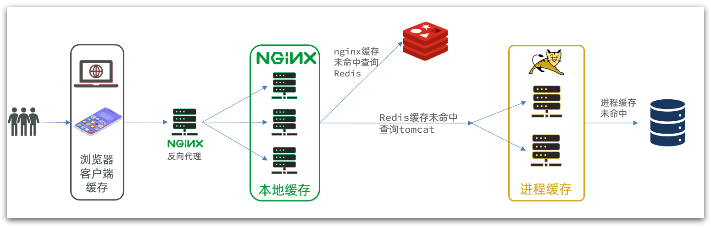
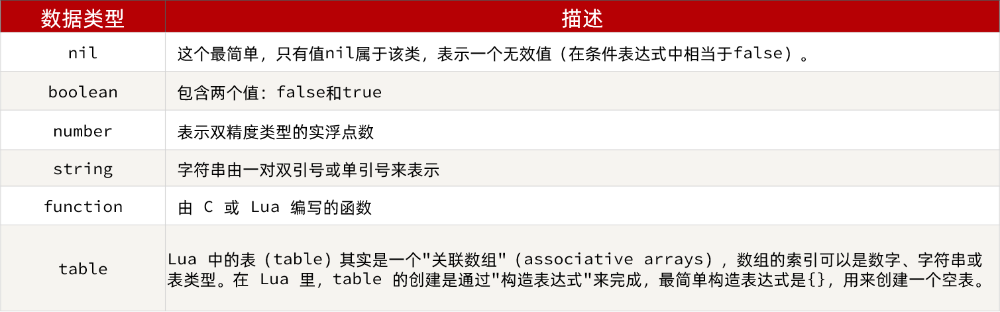
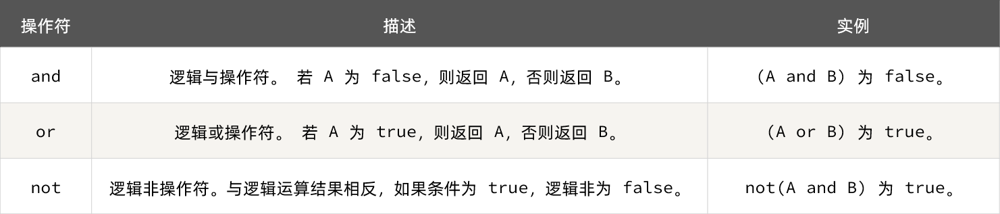
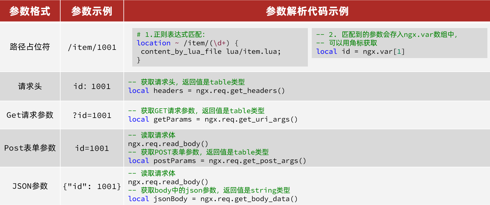
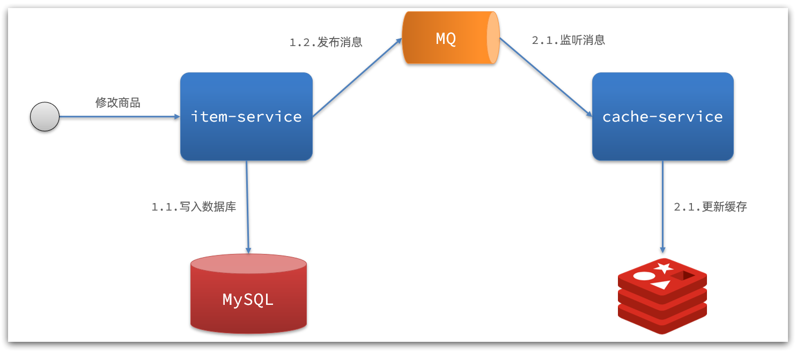
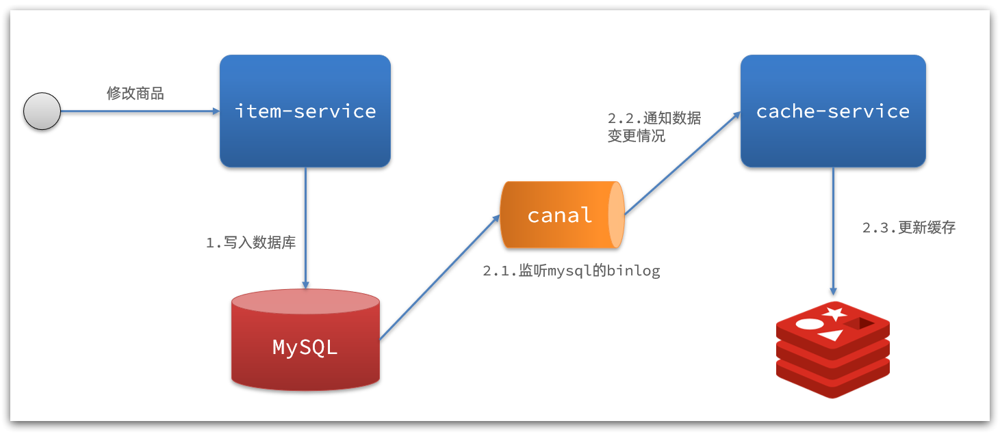

传统的缓存策略一般是请求到达Tomcat后，先查询Redis，如果未命中则查询数据库

存在下面的问题：

- 请求要经过Tomcat处理，Tomcat的性能成为整个系统的瓶颈

- Redis缓存失效时，会对数据库产生冲击


**多级缓存**就是充分利用请求处理的每个环节，分别添加缓存，减轻Tomcat压力，提升服务性能：

- 浏览器访问静态资源时，优先读取浏览器本地缓存
- 访问非静态资源（ajax查询数据）时，访问服务端
- 请求到达Nginx后，优先读取Nginx本地缓存
- 如果Nginx本地缓存未命中，则去直接查询Redis（不经过Tomcat）
- 如果Redis查询未命中，则查询Tomcat
- 请求进入Tomcat后，优先查询JVM进程缓存
- 如果JVM进程缓存未命中，则查询数据库


在多级缓存架构中，Nginx内部需要编写本地缓存查询、Redis查询、Tomcat查询的业务逻辑，因此这样的nginx服务不再是一个**反向代理服务器**，而是一个编写**业务的Web服务器了**。





## JVM进程缓存

### Caffeine

- 分布式缓存，例如Redis：
    - 优点：存储容量更大、可靠性更好、可以在集群间共享
    - 缺点：访问缓存有网络开销
    - 场景：缓存数据量较大、可靠性要求较高、需要在集群间共享
- 进程本地缓存，例如HashMap、GuavaCache：
    - 优点：读取本地内存，没有网络开销，速度更快
    - 缺点：存储容量有限、可靠性较低、无法共享
    - 场景：性能要求较高，缓存数据量较小


**Caffeine**是一个基于Java8开发的，提供了近乎最佳命中率的高性能的本地缓存库。目前Spring内部的缓存使用的就是Caffeine。[GitHub地址](https://github.com/ben-manes/caffeine)

```xml
<dependency>
    <groupId>com.github.ben-manes.caffeine</groupId>
    <artifactId>caffeine</artifactId>
</dependency>
```


**基本使用**

```java
@Test
void testBasicOps() {
    // 构建cache对象
    Cache<String, String> cache = Caffeine.newBuilder().build();

    // 存数据
    cache.put("gf", "迪丽热巴");

    // 取数据
    String gf = cache.getIfPresent("gf");
    System.out.println("gf = " + gf);

    // 取数据，包含两个参数：
    // 参数一：缓存的key
    // 参数二：Lambda表达式，表达式参数就是缓存的key，方法体是查询数据库的逻辑
    // 优先根据key查询JVM缓存，如果未命中，则执行参数二的Lambda表达式
    String defaultGF = cache.get("defaultGF", key -> {
        // 根据key去数据库查询数据
        return "柳岩";
    });
    System.out.println("defaultGF = " + defaultGF);
}
```


Caffeine提供了三种缓存清除策略：

- **基于容量**：设置缓存的数量上限

  ```java
  // 创建缓存对象
  Cache<String, String> cache = Caffeine.newBuilder()
      .maximumSize(1) // 设置缓存大小上限为 1
      .build();
  ```

- **基于时间**：设置缓存的有效时间

  ```java
  // 创建缓存对象
  Cache<String, String> cache = Caffeine.newBuilder()
      // 设置缓存有效期为 10 秒，从最后一次写入开始计时 
      .expireAfterWrite(Duration.ofSeconds(10)) 
      .build();
  
  ```

- **基于引用**：设置缓存为软引用或弱引用，利用GC来回收缓存数据。性能较差，不建议使用。

!!!note
    在默认情况下，当一个缓存元素过期的时候，Caffeine不会自动立即将其清理和驱逐。而是在一次读或写操作后，或者在空闲时间完成对失效数据的驱逐。


#### 案例

```java
@Configuration
public class CaffeineConfig {

    @Bean
    public Cache<Long, Item> itemCache(){
        return Caffeine.newBuilder()
                .initialCapacity(100)
                .maximumSize(10_000)
                .build();
    }
}


@RestController
@RequestMapping("item")
public class ItemController {

    @Autowired
    private IItemService itemService;

    @Autowired
    private Cache<Long, Item> itemCache;

    @GetMapping("/{id}")
    public Item findById(@PathVariable("id") Long id) {
        // 先查询缓存，再判断是否查询数据库
        return itemCache.get(id, key -> itemService.query()
                .ne("status", 3)
                .eq("id", key)
                .one()
        );
    }
}
```


## Lua入门

`Nginx`编程需要用到Lua语言，Lua 是一种轻量小巧的脚本语言，用标准C语言编写并以源代码形式开放，其设计目的是为了嵌入应用程序中，从而为应用程序提供灵活的扩展和定制功能。[官网](https://www.lua.org/)

!!!info
    Lua经常嵌入到C语言开发的程序中，例如游戏开发、游戏插件等。
    Nginx本身也是C语言开发，因此也允许基于Lua做拓展。


### 变量

Lua中支持的常见数据类型包括：



!!!tip
    Lua提供了type()函数来判断一个变量的数据类型
    print(type('hello world')) --------> string


Lua**声明变量**的时候无需指定数据类型，而是用local来声明变量为局部变量：

```lua
-- 声明字符串，可以用单引号或双引号，
local str = 'hello'
-- 字符串拼接可以使用 ..
local str2 = 'hello' .. 'world'
-- 声明数字
local num = 21
-- 声明布尔类型
local flag = true
```

Lua中的table类型既可以作为数组，又可以作为Java中的map来使用。数组就是特殊的table，key是数组角标而已：

```lua
-- 声明数组 ，key为角标的 table
local arr = {'java', 'python', 'lua'}
-- 声明table，类似java的map
local map =  {name='Jack', age=21}
```

Lua中的数组角标是从1开始，访问的时候与Java中类似：

```lua
-- 访问数组，lua数组的角标从1开始
print(arr[1])
```

Lua中的table可以用key来访问：

```lua
-- 访问table
print(map['name'])
print(map.age)
```


### 循环

遍历数组：

```lua
-- 声明数组 key为索引的 table
local arr = {'java', 'python', 'lua'}
-- 遍历数组
for index,value in ipairs(arr) 
do
    print(index, value) 
end
```

遍历普通table

```lua
-- 声明map，也就是table
local map = {name='Jack', age=21}
-- 遍历table
for key,value in pairs(map) do
   print(key, value) 
end
```


### 函数

定义函数的语法：

```lua
function 函数名(argument1, argument2..., argumentn)
    -- 函数体
    return 返回值
end


-- 示例
function printArr(arr)
    for index, value in ipairs(arr) do
        print(value)
    end
end
```


### 条件控制

```lua
if(布尔表达式)
then
   --[ 布尔表达式为 true 时执行该语句块 --]
else
   --[ 布尔表达式为 false 时执行该语句块 --]
end
```


与java不同，布尔表达式中的逻辑运算是基于英文单词：




## OpenResty

OpenResty® 是一个基于 Nginx的高性能 Web 平台，用于方便地搭建能够处理超高并发、扩展性极高的动态 Web 应用、Web 服务和动态网关。

其具备下列特点：

- 具备Nginx的完整功能
- 基于Lua语言进行扩展，集成了大量精良的 Lua 库、第三方模块
- 允许使用Lua**自定义业务逻辑**、**自定义库**

[官方网站](https://openresty.org/cn/)


### OpenResty监听请求

OpenResty的很多功能都依赖于其目录下的Lua库，需要在nginx.conf中指定依赖库的目录，并导入依赖：

1. 添加对OpenResty的Lua模块的加载

    修改`/usr/local/openresty/nginx/conf/nginx.conf`文件，在其中的http下面，添加下面代码：

    ```nginx
    ##lua 模块
    lua_package_path "/usr/local/openresty/lualib/?.lua;;";
    ##c模块     
    lua_package_cpath "/usr/local/openresty/lualib/?.so;;";  
    ```


2. 监听/api/item路径

    修改`/usr/local/openresty/nginx/conf/nginx.conf`文件，在nginx.conf的server下面，添加对/api/item这个路径的监听：

    ```nginx
    location  /api/item {
        # 默认的响应类型
        default_type application/json;
        # 响应结果由lua/item.lua文件来决定
        content_by_lua_file lua/item.lua;
    }
    ```


3. 在`/usr/loca/openresty/nginx/lua`文件夹下，新建文件：item.lua

    ```lua
    ngx.say('内容')
    ```


### 请求参数处理

`openresty`提供了API获取请求参数




### 查询Tomcat

nginx提供了内部API用以发送http请求：

```lua
local resp = ngx.location.capture("/path",{
    method = ngx.HTTP_GET,   -- 请求方式
    args = {a=1,b=2},  -- get方式传参数（POST方式使用body）
})
```

返回的响应内容包括：

- resp.status：响应状态码
- resp.header：响应头，是一个table
- resp.body：响应体，就是响应数据


注意：这里的path是路径，并不包含IP和端口。这个请求会被nginx内部的server监听并处理。

但是我们希望这个请求发送到Tomcat服务器，所以还需要编写一个server来对这个路径做反向代理：

```nginx
 location /path {
     # Tomcat地址
     proxy_pass http://IP:PORT; 
 }
```


### 封装http工具

在`/usr/local/openresty/lualib`目录下，新建一个common.lua文件：

```sh
vi /usr/local/openresty/lualib/common.lua
```

内容如下:

```lua
-- 封装函数，发送http请求，并解析响应
local function read_http(path, params)
    local resp = ngx.location.capture(path,{
        method = ngx.HTTP_GET,
        args = params,
    })
    if not resp then
        -- 记录错误信息，返回404
        ngx.log(ngx.ERR, "http请求查询失败, path: ", path , ", args: ", args)
        ngx.exit(404)
    end
    return resp.body
end
-- 将方法导出
local _M = {  
    read_http = read_http
}  
return _M
```

!!!tip
    这个工具将read_http函数封装到_M这个table类型的变量中，并且返回，这类似于导出。
    使用的时候，可以利用`require('common')`来导入该函数库，这里的common是函数库的文件名。


### CJSON工具类

OpenResty提供了一个cjson的模块用来处理JSON的序列化和反序列化。

[官方地址](https://github.com/openresty/lua-cjson/)

1. 引入cjson模块：

    ```lua
    local cjson = require "cjson"
    ```

2. 序列化

    ```lua
    local obj = {
        name = 'jack',
        age = 21
    }
    -- 把 table 序列化为 json
    local json = cjson.encode(obj)
    ```

3. 反序列化

    ```lua
    local json = '{"name": "jack", "age": 21}'
    -- 反序列化 json为 table
    local obj = cjson.decode(json);
    print(obj.name)
    ```


### 基于ID负载均衡

实际开发中，OpenResty需要对tomcat集群做负载均衡。

而默认的负载均衡规则是轮询模式，例如，当我们查询/item/10001时：

- 第一次会访问8081端口的tomcat服务，在该服务内部就形成了JVM进程缓存
- 第二次会访问8082端口的tomcat服务，该服务内部没有JVM缓存（因为JVM缓存无法共享），会查询数据库
- ...

这样就无法利用JVM进程缓存，影响性能。


nginx提供了基于请求路径做负载均衡的算法：

nginx根据请求路径做hash运算，把得到的数值对tomcat服务的数量取余，余数是几，就访问第几个服务，实现负载均衡。


!!!example
    - 我们的请求路径是 /item/10001
    - tomcat总数为2台（8081、8082）
    - 对请求路径/item/1001做hash运算求余的结果为1
    - 则访问第一个tomcat服务，也就是8081

    只要id不变，每次hash运算结果也不会变，那就可以保证同一个商品，一直访问同一个tomcat服务，确保JVM缓存生效。


**实现**

修改`/usr/local/openresty/nginx/conf/nginx.conf`文件，实现基于ID做负载均衡。

首先，定义tomcat集群，并设置基于路径做负载均衡：

```nginx 
upstream tomcat-cluster {
    hash $request_uri;
    server 192.168.150.1:8081;
    server 192.168.150.1:8082;
}
```

然后，修改对tomcat服务的反向代理，目标指向tomcat集群：

```nginx
location /item {
    proxy_pass http://tomcat-cluster;
}
```

重新加载OpenResty

```bash
nginx -s reload
```

## Redis缓存

**Redis缓存预热**

Redis缓存会面临冷启动问题：

**冷启动**：服务刚刚启动时，Redis中并没有缓存，如果所有商品数据都在第一次查询时添加缓存，可能会给数据库带来较大压力。

**缓存预热**：在实际开发中，我们可以利用**大数据统计**用户访问的热点数据，在项目启动时将这些**热点数据**提前查询并保存到Redis中。

!!!tip
    可以利用`InitializingBean`接口来实现，因为`InitializingBean`中的方法`afterPropertiesSet`可以在对象被Spring创建并且成员变量全部注入后执行。


**查询Redis缓存**

当请求进入OpenResty之后：

- 优先查询Redis缓存
- 如果Redis缓存未命中，再查询Tomcat


OpenResty提供了操作Redis的模块，我们只要引入该模块就能直接使用。但是为了方便，我们将Redis操作封装到之前的common.lua工具库中。

修改`/usr/local/openresty/lualib/common.lua`文件：

1. 引入Redis模块，并初始化Redis对象

    ```lua
    -- 导入redis
    local redis = require('resty.redis')
    -- 初始化redis
    local red = redis:new()
    red:set_timeouts(1000, 1000, 1000)
    ```


2. 封装函数，用来释放Redis连接，其实是放入连接池

    ```lua
    -- 关闭redis连接的工具方法，其实是放入连接池
    local function close_redis(red)
        local pool_max_idle_time = 10000 -- 连接的空闲时间，单位是毫秒
        local pool_size = 100 --连接池大小
        local ok, err = red:set_keepalive(pool_max_idle_time, pool_size)
        if not ok then
            ngx.log(ngx.ERR, "放入redis连接池失败: ", err)
        end
    end
    ```


3. 封装函数，根据key查询Redis数据

    ```lua
    -- 查询redis的方法 ip和port是redis地址，key是查询的key
    local function read_redis(ip, port, key)
        -- 获取一个连接
        local ok, err = red:connect(ip, port)
        if not ok then
            ngx.log(ngx.ERR, "连接redis失败 : ", err)
            return nil
        end
        -- 查询redis
        local resp, err = red:get(key)
        -- 查询失败处理
        if not resp then
            ngx.log(ngx.ERR, "查询Redis失败: ", err, ", key = " , key)
        end
        --得到的数据为空处理
        if resp == ngx.null then
            resp = nil
            ngx.log(ngx.ERR, "查询Redis数据为空, key = ", key)
        end
        close_redis(red)
        return resp
    end
    ```


4. 导出

    ```lua
    -- 将方法导出
    local _M = {  
        read_http = read_http,
        read_redis = read_redis
    }  
    return _M
    ```


## Nginx本地缓存

OpenResty为Nginx提供了**shared dict**的功能，可以在nginx的多个worker之间共享数据，实现缓存功能。

1. 开启共享字典，在nginx.conf的http下添加配置：

    ```nginx
    # 共享字典，也就是本地缓存，名称叫做：item_cache，大小150m
    lua_shared_dict item_cache 150m; 
    ```


2. 操作共享字典：

    ```lua
    -- 获取本地缓存对象
    local item_cache = ngx.shared.item_cache
    -- 存储, 指定key、value、过期时间，单位s，默认为0代表永不过期
    item_cache:set('key', 'value', 1000)
    -- 读取
    local val = item_cache:get('key')
    ```

    示例

    ```lua
    -- 导入共享词典，本地缓存
    local item_cache = ngx.shared.item_cache

    -- 封装查询函数
    function read_data(key, expire, path, params)
        -- 查询本地缓存
        local val = item_cache:get(key)
        if not val then
            ngx.log(ngx.ERR, "本地缓存查询失败，尝试查询Redis， key: ", key)
            -- 查询redis
            val = read_redis("127.0.0.1", 6379, key)
            -- 判断查询结果
            if not val then
                ngx.log(ngx.ERR, "redis查询失败，尝试查询http， key: ", key)
                -- redis查询失败，去查询http
                val = read_http(path, params)
            end
        end
        -- 查询成功，把数据写入本地缓存
        item_cache:set(key, val, expire)
        -- 返回数据
        return val
    end
    ```


## 缓存同步
大多数情况下，浏览器查询到的都是缓存数据，如果缓存数据与数据库数据存在较大差异，可能会产生比较严重的后果。
所以我们必须保证数据库数据、缓存数据的一致性，这就是缓存与数据库的同步。

### 缓存同步策略

1. **设置有效期**：给缓存设置有效期，到期后自动删除。再次查询时更新

    - 优势：简单、方便

    - 缺点：时效性差，缓存过期之前可能不一致

    - 场景：更新频率较低，时效性要求低的业务


2. **同步双写**：在修改数据库的同时，直接修改缓存

    - 优势：时效性强，缓存与数据库强一致
    
    - 缺点：有代码侵入，耦合度高
    
    - 场景：对一致性、时效性要求较高的缓存数据


3. **异步通知**：修改数据库时发送事件通知，相关服务监听到通知后修改缓存数据

    - 优势：低耦合，可以同时通知多个缓存服务

    - 缺点：时效性一般，可能存在中间不一致状态

    - 场景：时效性要求一般，有多个服务需要同步


异步通知有两种实现方式，基于`MQ`（有少量的代码侵入）或者`Canal`（代码零侵入）






### Canal

**Canal [kə'næl]**，译意为水道/管道/沟渠，canal是阿里巴巴旗下的一款开源项目，基于Java开发。基于数据库增量日志解析，提供增量数据订阅&消费。[GitHub的地址](https://github.com/alibaba/canal)


Canal是基于mysql的主从同步来实现的（Canal就是把自己**伪装成MySQL的一个slave节点**，从而监听master的binary log变化），再把得到的变化信息通知给Canal的客户端，进而完成对其它数据库的同步。


配置安装过程详见[Canal安装](./安装Canal.md)


### 监听Canal

我们可以利用Canal提供的Java客户端，监听Canal通知消息。当收到变化的消息时，完成对缓存的更新。

可以使用GitHub上的第三方开源的canal-starter客户端。地址：https://github.com/NormanGyllenhaal/canal-client

与SpringBoot完美整合，自动装配。


1. 引入依赖

    ```xml
    <dependency>
        <groupId>top.javatool</groupId>
        <artifactId>canal-spring-boot-starter</artifactId>
        <version>1.2.1-RELEASE</version>
    </dependency>
    ```


2. 配置文件

    ```yaml
    canal:
    destination: heima # canal的集群名字，要与安装canal时设置的名称一致
    server: 192.168.150.101:11111 # canal服务地址
    ```


3. 修改实体类

    通过`@Id`、`@Column` 等注解完成实体类与数据库表字段的映射

    ```java
    @Data
    @TableName("tb_item")
    public class Item {
        @TableId(type = IdType.AUTO)
        @Id
        private Long id;//商品id
        
        @Column(name = "name")
        private String name;//商品名称
        
        private String title;//商品标题
        private Long price;//价格（分）
        private String image;//商品图片
        private String category;//分类名称
        private String brand;//品牌名称
        private String spec;//规格
        private Integer status;//商品状态 1-正常，2-下架
        private Date createTime;//创建时间
        private Date updateTime;//更新时间
        
        @TableField(exist = false)
        @Transient	// 不属于数据库表的数据
        private Integer stock;
        
        @TableField(exist = false)
        @Transient
        private Integer sold;
    }
    ```


4. 编写监听器

    通过实现`EntryHandler<T>`接口编写监听器，监听Canal消息。注意两点：

    - 实现类通过`@CanalTable("tb_item")`指定监听的表信息
    - `EntryHandler`的泛型是与表对应的实体类

    ```java
    @CanalTable("tb_item")	// 监听的数据库表名
    @Component
    public class ItemHandler implements EntryHandler<Item> {

        @Autowired
        private RedisHandler redisHandler;	// 封装的Redis操作类，可使用StringRedisTemplate类代替
        @Autowired
        private Cache<Long, Item> itemCache;

        @Override
        public void insert(Item item) {
            // 写数据到JVM进程缓存
            itemCache.put(item.getId(), item);
            // 写数据到redis
            redisHandler.saveItem(item);
        }

        @Override
        public void update(Item before, Item after) {
            // 写数据到JVM进程缓存
            itemCache.put(after.getId(), after);
            // 写数据到redis
            redisHandler.saveItem(after);
        }

        @Override
        public void delete(Item item) {
            // 删除数据到JVM进程缓存
            itemCache.invalidate(item.getId());
            // 删除数据到redis
            redisHandler.deleteItemById(item.getId());
        }
    }
    ```