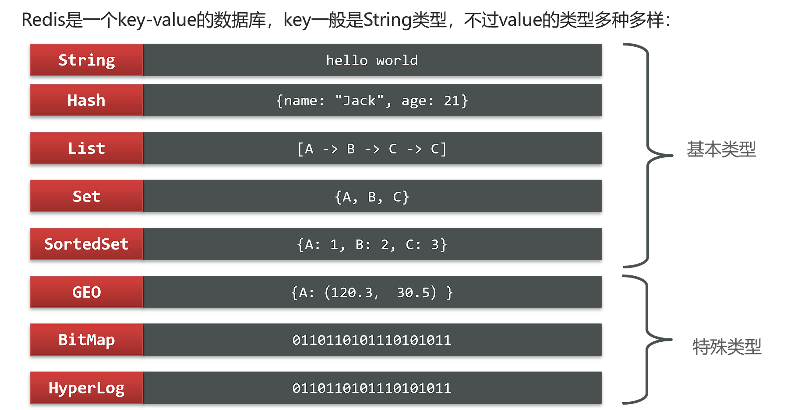
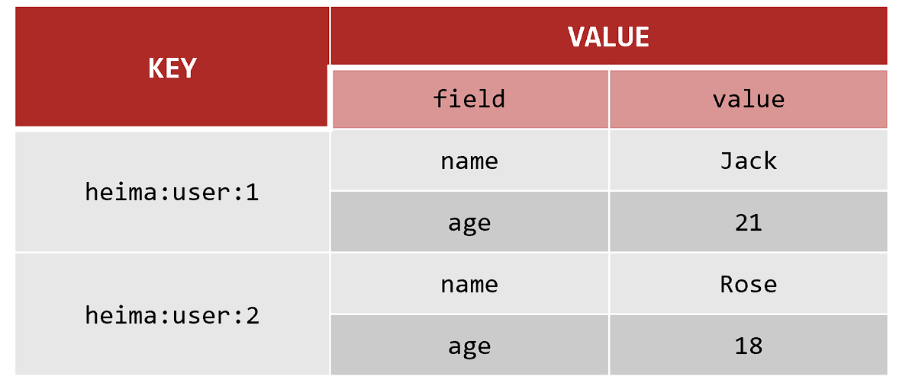
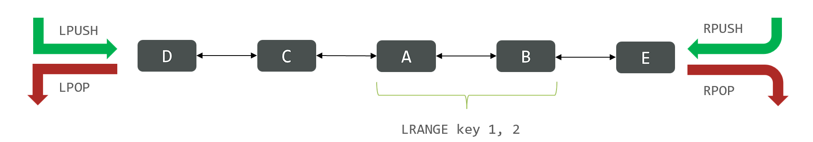
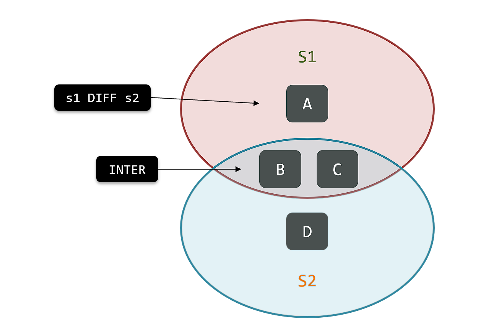

Redis诞生于2009年，全称是**Remote Dictionary Server**，远程词典服务器，是一个基于内存的键值型NoSQL数据库。

[Redis - The Real-time Data Platform](https://redis.io/)

**特征**：

- 键值（key-value）型，value支持多种不同数据结构，功能丰富
- 单线程（早期版本），每个命令具备原子性
- 低延迟，速度快（基于内存、IO多路复用、良好的编码）。
- 支持数据持久化
- 支持主从集群、分片集群
- 支持多语言客户端

!!!example "简单安装Redis"
    ```bash
    ## Docker 创建 Redis 容器命令
    docker run -d \
    --log-opt max-size=100m \
    --log-opt max-file=2 \
    -p 6379:6379 \
    --name redis \
    -v /home/ysh/redis/conf/redis.conf:/etc/redis/redis.conf  \
    -v /home/ysh/redis/data:/data \
    -d redis redis-server /etc/redis/redis.conf \
    --appendonly yes \
    --requirepass 123456 #密码
    ```


    进入容器内部测试redis

    ```bash
    docker exec -it redis /bin/bash

    redis-cli -h localhost -p 6379 -a 123456

    ping
    ```


## Redis通用命令

- KEYS：查看符合模板的所有key，支持通配符，**不建议在生产环境使用**
- DEL：删除一个（或多个）指定的key
- EXISTS：判断key是否存在
- EXPIRE：给一个key设置有效期（单位秒），有效期到期时该key会被自动删除，不设置有效期时默认为-1（永久有效）
- TTL：查看一个KEY的剩余有效期

!!!tip
    通过help [command] 可以查看一个命令的具体用法


## key的结构


Redis的key允许有多个单词形成层级结构，多个单词之间用':'隔开，格式如下：
```
*项目名:业务名:类型:id*
```


例如我们的项目名称叫 ysh，有user和product两种不同类型的数据，我们可以这样定义key：
```
user相关的key：ysh:user:1

product相关的key：ysh:product:1
```


## 数据类型




### String

String类型，也就是字符串类型，是Redis中最简单的存储类型。

其value是字符串，不过根据字符串的格式不同，又可以分为3类：

- string：普通字符串
- int：整数类型，可以做自增、自减操作
- float：浮点类型，可以做自增、自减操作

不管是哪种格式，底层都是**字节数组**形式存储，只不过是编码方式不同。字符串类型的最大空间不能超过512m.


String的常见命令有：

- SET：**添加或者修改**已经存在的一个String类型的键值对`SET key value`
- GET：根据key获取String类型的value`GET key`
- MSET：批量添加多个String类型的键值对
- MGET：根据多个key获取多个String类型的value
- INCR：让一个整型的key自增1
- INCRBY:让一个整型的key自增并指定步长，例如：incrby num 2 让num值自增2
- INCRBYFLOAT：让一个浮点类型的数字自增并指定步长
- SETNX：添加一个String类型的键值对，**前提是这个key不存在**，否则不执行
- SETEX：添加一个String类型的键值对，并且指定有效期


### Hash

Hash类型，也叫散列，其value是一个无序字典，类似于Java中的HashMap结构。


可以将对象序列化为JSON字符串后存储为String结构，但是需要修改对象某个字段时很不方便

Hash结构可以将对象中的每个字段**独立存储**，可以针对单个字段做CRUD



Hash的常见命令有：

- HSET key field value：添加或者修改hash类型key的field的值
- HGET key field：获取一个hash类型key的field的值
- HMSET：批量添加多个hash类型key的field的值
- HMGET：批量获取多个hash类型key的field的值
- HGETALL：获取一个hash类型的key中的所有的field和value
- HKEYS：获取一个hash类型的key中的所有的field
- HVALS：获取一个hash类型的key中的所有的value
- HINCRBY:让一个hash类型key的字段值自增并指定步长
- HSETNX：添加一个hash类型的key的field值，前提是这个field不存在，否则不执行


### List

Redis中的List类型与Java中的LinkedList类似，可以看做是一个双向链表结构。

特点：

- 有序
- 元素可以重复
- 插入和删除快
- 查询速度一般


List的常见命令有：

- LPUSH key element ... ：向列表左侧插入一个或多个元素
- LPOP key：移除并返回列表左侧的第一个元素，没有则返回nil
- RPUSH key element ... ：向列表右侧插入一个或多个元素
- RPOP key：移除并返回列表右侧的第一个元素
- LRANGE key star end：返回一段角标范围内的所有元素
- BLPOP和BRPOP：与LPOP和RPOP类似，只不过在没有元素时等待指定时间（**阻塞式**），而不是直接返回nil




### Set

Redis的Set结构与Java中的HashSet类似，可以看做是一个value为null的HashMap。因为也是一个hash表，因此具备与HashSet类似的特征

- 无序
- 元素不可重复
- 查找快
- 支持交集、并集、差集等功能


Set的常见命令有：

- SADD key member ... ：向set中添加一个或多个元素
- SREM key member ... : 移除set中的指定元素
- SCARD key： 返回set中元素的个数
- SISMEMBER key member：判断一个元素是否存在于set中
- SMEMBERS：获取set中的所有元素
- SINTER key1 key2 ... ：求key1与key2的交集
- SDIFF key1 key2 ... ：求key1与key2的差集 
- SUNION key1 key2 ..：求key1和key2的并集




### SortedSet

Redis的SortedSet是一个可排序的set集合，与Java中的TreeSet有些类似，但底层数据结构却差别很大。SortedSet中的每一个元素都带有一个score属性，可以基于score属性对元素排序，底层的实现是一个跳表（SkipList）加 hash表。

- 可排序
- 元素不重复
- 查询速度快


SortedSet的常见命令有：

- ZADD key score member：添加一个或多个元素到sorted set ，如果已经存在则更新其score值
- ZREM key member：删除sorted set中的一个指定元素
- ZSCORE key member : 获取sorted set中的指定元素的score值
- ZRANK key member：获取sorted set 中的指定元素的排名（排名从0开始）
- ZCARD key：获取sorted set中的元素个数
- ZCOUNT key min max：统计score值在给定范围内的所有元素的个数
- ZINCRBY key increment member：让sorted set中的指定元素自增，步长为指定的increment值
- ZRANGE key min max：按照score排序后，获取指定排名范围内的元素
- ZRANGEBYSCORE key min max：按照score排序后，获取指定score范围内的元素
- ZDIFF、ZINTER、ZUNION：求差集、交集、并集

!!!tip
    所有的排名默认都是升序，如果要降序则在命令的Z后面添加REV即可


