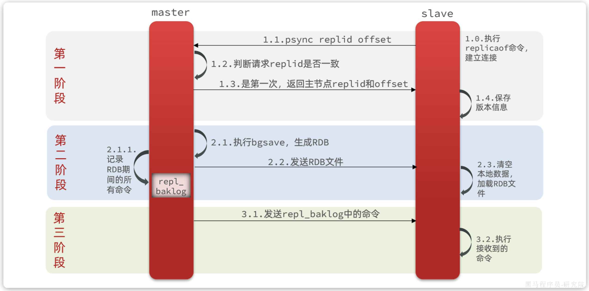
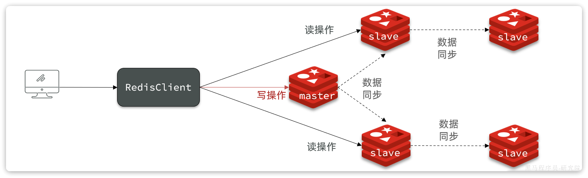

## Redis集群

单机Redis存在如下问题：

1. 数据丢失问问题
2. 并发不足问题
3. 存储能力问题
4. 故障恢复问题

<br>

对应解决方案：

1. 持久化
2. 主从集群
3. 分片集群
4. 哨兵机制


### Redis持久化

Redis有两种持久化方案：

- RDB持久化
- AOF持久化


#### RDB持久化

RDB全称Redis Database Backup file（Redis数据备份文件），也被叫做Redis数据快照。简单来说就是把内存中的所有数据都记录到磁盘中。当Redis实例故障重启后，从磁盘读取快照文件，恢复数据。快照文件称为RDB文件，默认是保存在当前运行目录。


RDB持久化在四种情况下会执行：

- 执行save命令（会阻塞主进程）
- 执行bgsave命令（异步执行）
- Redis停机时
- 触发RDB条件时


Redis内部有触发RDB的机制，可以在redis.conf文件中找到，格式如下：

```properties
## 900秒内，如果至少有1个key被修改，则执行bgsave ， 如果是save "" 则表示禁用RDB
save 900 1  
save 300 10  
save 60 10000 
```


RDB的其它配置也可以在redis.conf文件中设置：

```properties
## 是否压缩 ,建议不开启，压缩也会消耗cpu，磁盘的话不值钱
rdbcompression yes

## RDB文件名称
dbfilename dump.rdb  

## 文件保存的路径目录
dir ./ 
```


bgsave开始时会fork主进程得到子进程，子进程共享主进程的内存数据。完成fork后读取内存数据并写入 RDB 文件。

fork采用的是copy-on-write技术（写时复制）：

- 当主进程执行读操作时，访问共享内存；
- 当主进程执行写操作时，则会拷贝一份数据，执行写操作。


RDB方式bgsave的基本流程？

- fork主进程得到一个子进程，共享内存空间
- 子进程读取内存数据并写入新的RDB文件
- 用新RDB文件替换旧的RDB文件

RDB会在什么时候执行？save 60 1000代表什么含义？

- 默认是服务停止时
- 代表60秒内至少执行1000次修改则触发RDB

RDB的缺点？

- RDB执行间隔时间长，两次RDB之间写入数据有丢失的风险
- fork子进程、压缩、写出RDB文件都比较耗时


#### AOF持久化

AOF全称为Append Only File（追加文件）。Redis处理的每一个写命令都会记录在AOF文件，可以看做是命令日志文件。


AOF**默认是关闭的**，需要修改redis.conf配置文件来开启AOF：

```properties
## 是否开启AOF功能，默认是no
appendonly yes
## AOF文件的名称
appendfilename "appendonly.aof"
```


AOF的命令记录的频率也可以通过redis.conf文件来配置：

```properties
## 表示每执行一次写命令，立即记录到AOF文件
appendfsync always 
## 写命令执行完先放入AOF缓冲区，然后表示每隔1秒将缓冲区数据写到AOF文件，是默认方案
appendfsync everysec 
## 写命令执行完先放入AOF缓冲区，由操作系统决定何时将缓冲区内容写回磁盘
appendfsync no
```

对比：

| 配置项   | 存盘机制     | 优点     | 缺点            |
| -------- | ------------ | -------- | --------------- |
| Always   | 同步         | 可靠性高 | 性能影响大      |
| everysec | 每秒         | 性能适中 | 可能丢失1秒数据 |
| no       | 操作系统控制 | 性能最好 | 可靠性差        |


**AOF文件重写**

因为是记录命令，AOF文件会比RDB文件大的多。而且AOF会记录对同一个key的多次写操作，但只有最后一次写操作才有意义。通过执行`bgrewriteaof`命令，**可以让AOF文件执行重写功能，用最少的命令达到相同效果**。

Redis也会在触发阈值时自动去重写AOF文件。阈值也可以在redis.conf中配置：

```properties
## AOF文件比上次文件 增长超过多少百分比则触发重写
auto-aof-rewrite-percentage 100
## AOF文件体积最小多大以上才触发重写 
auto-aof-rewrite-min-size 64mb 
```


对比

|                | RDB                      | AOF                                           |
| -------------- | ------------------------ | --------------------------------------------- |
| 持久化方式     | 定时做内存快照           | 记录写命令                                    |
| 数据完整性     | 不完整，未备份的数据丢失 | 相对完整，取决于存盘策略                      |
| 文件大小       | 有压缩机制，体积小       | 记录命令，体积大                              |
| 宕机恢复速度   | 很快                     | 慢                                            |
| 数据恢复优先级 | 低                       | 高（因为完整性更高）                          |
| 系统资源占用   | 高，大量CPU和内存消耗    | 低，主要占用磁盘IO（文件重写时占用CPU和内存） |
| 使用场景       | 可以容忍部分数据丢失     | 对数据完整性要求高                            |


### 主从集群

单节点Redis的并发能力是有上限的，要进一步提高Redis的并发能力，就需要搭建主从集群，实现读写分离。


简单架构图：


如图所示，集群中有一个master节点、两个slave节点（现已改为replica）。当我们通过Redis的Java客户端访问主从集群时，应该做好路由：

- 如果是写操作，应该访问master节点，master会自动将数据同步给两个slave节点
- 如果是读操作，建议访问各个slave节点，从而分担并发压力


使用docker compose启动多个Redis实例：

```bash
version: "3.2"

services:
  r1:
    image: redis
    container_name: r1
    network_mode: "host"
    entrypoint: ["redis-server", "--port", "7001"]
  r2:
    image: redis
    container_name: r2
    network_mode: "host"
    entrypoint: ["redis-server", "--port", "7002"]
  r3:
    image: redis
    container_name: r3
    network_mode: "host"
    entrypoint: ["redis-server", "--port", "7003"]
```


需要通过命令来配置主从关系：

```Bash
## 使用redis-cli连接到slave节点

## Redis5.0以前
slaveof <masterip> <masterport>
## Redis5.0以后
replicaof <masterip> <masterport>
```


有临时和永久两种模式：

- 永久生效：在redis.conf文件中利用`slaveof`命令指定`master`节点
- 临时生效：直接利用redis-cli控制台输入`slaveof`命令，指定`master`节点


#### 全量同步

主从第一次建立连接时，会执行**全量同步**，将master节点的所有数据都拷贝给slave节点



`master`如何判断`salve`是否是第一次来同步？

- **`Replication Id`**：简称`replid`，是数据集的标记，replid一致则是同一数据集。每个`master`都有唯一的`replid`，`slave`则会继承`master`节点的`replid`
- **`offset`**：偏移量，随着记录在`repl_baklog`中的数据增多而逐渐增大。`slave`完成同步时也会记录当前同步的`offset`。如果`slave`的`offset`小于`master`的`offset`，说明`slave`数据落后于`master`，需要更新。

!!!note
    master判断一个节点是否是第一次同步的依据，就是看replid是否一致


#### 增量同步

全量同步需要先做RDB，然后将RDB文件通过网络传输个slave，成本太高了。
因此除了第一次做全量同步，其它大多数时候slave与master都是做**增量同步**


主要由`repl_baklog`文件实现。这个文件是一个固定大小的数组，只不过数组是环形，也就是说**角标到达数组末尾后，会再次从0开始读写**，这样数组头部的数据就会被覆盖。

`repl_baklog`中会记录Redis处理过的命令及`offset`，包括master当前的`offset`，和slave已经拷贝到的`offset`：


slave与master的offset之间的差异，就是slave需要增量拷贝的数据了。


如果slave出现网络阻塞，导致master的`offset`远远超过了slave的`offset`，当master的offset覆盖了slave未同步的offset,如果slave恢复，需要同步，却发现自己的`offset`都没有了，无法完成增量同步了。只能做**全量同步**。


#### 主从同步优化

- 在master中配置`repl-diskless-sync  yes`启用无磁盘复制，避免全量同步时的磁盘IO。

- Redis单节点上的内存占用不要太大，减少RDB导致的过多磁盘IO

- 适当提高`repl_baklog`的大小，发现slave宕机时尽快实现故障恢复，尽可能避免全量同步

- 限制一个master上的slave节点数量，如果实在是太多slave，则可以采用`主-从-从`链式结构，减少master压力

  

`主-从-从`架构图：




### 哨兵模式

Redis提供了`哨兵`（`Sentinel`）机制来监控主从集群监控状态，确保集群的高可用性。


哨兵的作用如下：

- **状态监控**：`Sentinel` 会不断检查`master`和`slave`是否按预期工作
- **故障恢复（failover）**：如果`master`故障，`Sentinel`会将一个`slave`提升为`master`。当故障实例恢复后会成为`slave`
- **状态通知**：`Sentinel`充当`Redis`客户端的服务发现来源，当集群发生`failover`时，会将最新集群信息推送给`Redis`的客户端


`Sentinel`基于**心跳机制**监测服务状态，每隔1秒向集群的每个节点发送ping命令，并通过实例的响应结果来做出判断：

- **主观下线（sdown）**：如果某sentinel节点发现某Redis节点未在规定时间响应，则认为该节点主观下线。
- **客观下线(odown)**：若超过指定数量（通过`quorum`设置）的sentinel都认为该节点主观下线，则该节点客观下线。quorum值最好超过Sentinel节点数量的一半，Sentinel节点数量至少3台。


一旦发现master故障，sentinel需要在salve中选择一个作为新的master，选择依据是这样的：

- 首先会判断slave节点与master节点断开时间长短，如果超过`down-after-milliseconds * 10`则会排除该slave节点
- 然后判断slave节点的`slave-priority`值，越小优先级越高，如果是0则永不参与选举（默认都是1）。
- 如果`slave-prority`一样，则判断slave节点的`offset`值，越大说明数据越新，优先级越高
- 最后是判断slave节点的`run_id`大小，越小优先级越高（`通过info server可以查看run_id`）。


#### 搭建哨兵集群

sentinel.conf文件

```properties
sentinel announce-ip "localhost"
sentinel monitor hmaster localhost 7001 2
sentinel down-after-milliseconds hmaster 5000
sentinel failover-timeout hmaster 60000
```

- `sentinel announce-ip "localhost"`：声明当前sentinel的ip
- `sentinel monitor hmaster localhost 7001 2`：指定集群的主节点信息 
    - `hmaster`：主节点名称，自定义，任意写
    - `localhost 7001`：主节点的ip和端口
    - `2`：认定`master`下线时的`quorum`值
- `sentinel down-after-milliseconds hmaster 5000`：声明master节点超时多久后被标记下线
- `sentinel failover-timeout hmaster 60000`：在第一次故障转移失败后多久再次重试


`docker-compose.yaml`

```yaml
version: "3.2"

services:
  r1:
    image: redis
    container_name: r1
    network_mode: "host"
    entrypoint: ["redis-server", "--port", "7001"]
  r2:
    image: redis
    container_name: r2
    network_mode: "host"
    entrypoint: ["redis-server", "--port", "7002", "--slaveof", "localhost", "7001"]
  r3:
    image: redis
    container_name: r3
    network_mode: "host"
    entrypoint: ["redis-server", "--port", "7003", "--slaveof", "localhost", "7001"]
  s1:
    image: redis
    container_name: s1
    volumes:
      - /root/redis/s1:/etc/redis
    network_mode: "host"
    entrypoint: ["redis-sentinel", "/etc/redis/sentinel.conf", "--port", "27001"]
  s2:
    image: redis
    container_name: s2
    volumes:
      - /root/redis/s2:/etc/redis
    network_mode: "host"
    entrypoint: ["redis-sentinel", "/etc/redis/sentinel.conf", "--port", "27002"]
  s3:
    image: redis
    container_name: s3
    volumes:
      - /root/redis/s3:/etc/redis
    network_mode: "host"
    entrypoint: ["redis-sentinel", "/etc/redis/sentinel.conf", "--port", "27003"]
```


#### RedisTemplate连接哨兵

1.引入redis依赖

2.配置`application.yaml`

   ```yaml
   spring:
     redis:
       sentinel:
         master: mymaster # 主节点名称
         nodes: # 哨兵集群地址
           - 192.168.150.101:7001
           - 192.168.150.101:7002
           - 192.168.150.101:7003
   ```

   > 通过以上配置后就可以通过哨兵找到主从节点

3.配置读写分离

```java
@Bean
public LettuceClientConfigurationBuilderCustomizer clientConfigurationBuilderCustomizer(){
    return clientConfigurationBuilder -> clientConfigurationBuilder.readFrom(ReadFrom.REPLICA_PREFERRED);
}
```
!!!note
    这个bean中配置的就是读写策略，包括四种：

    - `MASTER`：从主节点读取
    - `MASTER_PREFERRED`：优先从master节点读取，master不可用才读取replica
    - `REPLICA`：从slave（replica）节点读取
    - `REPLICA _PREFERRED`：优先从slave（replica）节点读取，所有的slave都不可用才读取master


### 分片集群

主从模式可以解决高可用、高并发读的问题。但依然有两个问题没有解决：

- 海量数据存储
- 高并发写


要解决这两个问题就需要用到分片集群了。分片的意思，就是把数据拆分存储到不同节点，这样整个集群的存储数据量就更大了。

Redis分片集群的结构如图：


特征：

-  集群中有多个master，每个master保存不同分片数据 ，解决海量数据存储问题
-  每个master都可以有多个slave节点 ，确保高可用
-  master之间通过ping监测彼此健康状态 ，类似哨兵作用
-  客户端请求可以访问集群任意节点，最终都会被转发到数据所在节点 


#### 搭建分片集群

分片集群中的Redis节点必须开启集群模式，一般在配置文件中添加下面参数：

```properties
port 7000
cluster-enabled yes
cluster-config-file nodes.conf
cluster-node-timeout 5000
appendonly yes
```

- `cluster-enabled`：是否开启集群模式
- `cluster-config-file`：集群模式的配置文件名称，无需手动创建，由集群自动维护
- `cluster-node-timeout`：集群中节点之间心跳超时时间


`docker-compose.yaml`部署节点

```yaml
version: "3.2"

services:
  r1:
    image: redis
    container_name: r1
    network_mode: "host"
    entrypoint: ["redis-server", "--port", "7001", "--cluster-enabled", "yes", "--cluster-config-file", "node.conf"]
  r2:
    image: redis
    container_name: r2
    network_mode: "host"
    entrypoint: ["redis-server", "--port", "7002", "--cluster-enabled", "yes", "--cluster-config-file", "node.conf"]
  r3:
    image: redis
    container_name: r3
    network_mode: "host"
    entrypoint: ["redis-server", "--port", "7003", "--cluster-enabled", "yes", "--cluster-config-file", "node.conf"]
  r4:
    image: redis
    container_name: r4
    network_mode: "host"
    entrypoint: ["redis-server", "--port", "7004", "--cluster-enabled", "yes", "--cluster-config-file", "node.conf"]
  r5:
    image: redis
    container_name: r5
    network_mode: "host"
    entrypoint: ["redis-server", "--port", "7005", "--cluster-enabled", "yes", "--cluster-config-file", "node.conf"]
  r6:
    image: redis
    container_name: r6
    network_mode: "host"
    entrypoint: ["redis-server", "--port", "7006", "--cluster-enabled", "yes", "--cluster-config-file", "node.conf"]
```

!!!warning
    使用Docker部署Redis集群，network模式必须采用host


创建集群

```Bash
## 进入任意节点容器
docker exec -it r1 bash
## 然后，执行命令
redis-cli --cluster create --cluster-replicas 1 \
192.168.150.101:7001 192.168.150.101:7002 192.168.150.101:7003 \
192.168.150.101:7004 192.168.150.101:7005 192.168.150.101:7006
```

- `redis-cli --cluster`：代表集群操作命令
- `create`：代表是创建集群
- `--cluster-replicas 1` ：指定集群中每个`master`的副本(`slave`)个数为1
  - 此时`节点总数 ÷ (replicas + 1)` 得到的就是`master`的数量`n`。因此节点列表中的前`n`个节点就是`master`，其它节点都是`slave`节点，随机分配到不同`master`


我们可以通过命令查看集群状态：

```Bash
redis-cli -p 7001 cluster nodes
```


#### 散列插槽

据要分片存储到不同的Redis节点，肯定需要有分片的依据，这样下次查询的时候才能知道去哪个节点查询。很多数据分片都会采用一致性hash算法。而Redis则是利用散列插槽（**`hash slot`**）的方式实现数据分片。


在Redis集群中，共有16384个`hash slots`，集群中的每一个master节点都会分配一定数量的`hash slots`。具体的分配在集群创建时就已经指定了


当我们读写数据时，Redis基于`CRC16` 算法对`key`做`hash`运算，得到的结果与`16384`取余，就计算出了这个`key`的`slot`值。然后到`slot`所在的Redis节点执行读写操作。

!!!note
    `hash slot`的计算也分两种情况：

    - 当`key`中包含`{}`时，根据`{}`之间的字符串计算`hash slot`
    - 当`key`中不包含`{}`时，则根据整个`key`字符串计算`hash slot`


连接集群时，要加`-c`参数：

```Bash
## 通过7001连接集群
redis-cli -c -p 7001
## 存入数据
set user jack
```


如何将同一类数据固定的保存在同一个Redis实例？

- Redis计算key的插槽值时会判断key中是否包含`{}`，如果有则基于`{}`内的字符计算插槽
- 数据的key中可以加入`{类型}`，例如key都以`{typeId}`为前缀，这样同类型数据计算的插槽一定相同


#### 集群伸缩

redis-cli --cluster提供了很多操作集群的命令，可以通过命令`redis-cli --cluster help`


例：添加节点`redis-cli --cluster add-node new_host:new_port existing_host:existing_port`

!!!note
    默认作为主节点，参数`--cluster-slave`和`--cluster-master-id <arg>`指定为从节点

    <font color=red>新节点默认无插槽，需要分配</font>，可以从其他节点转移插槽 `redis-cli --cluster reshard host:port`


#### 故障转移

分片集群默认存在**自动故障转移**，有节点宕机会自动主从切换


**手动故障转移**

利用cluster failover命令可以手动让集群中的某个master宕机，切换到执行cluster failover命令的这个slave节点，实现无感知的数据迁移。


这种failover命令可以指定三种模式：

- 缺省：默认的流程，如图1~6歩
- force：省略了对offset的一致性校验
- takeover：直接执行第5歩，忽略数据一致性、忽略master状态和其它master的意见


####  RedisTemplate连接分片集群

1. 引入Redis依赖

2. 配置分片集群地址（仅该步骤于哨兵模式有区别）

    ```yaml
    spring:
        redis:
        cluster:
            nodes:
            - 192.168.150.101:7001
            - 192.168.150.101:7002
            - 192.168.150.101:7003
            - 192.168.150.101:8001
            - 192.168.150.101:8002
            - 192.168.150.101:8003
    ```

3. 配置读写分离