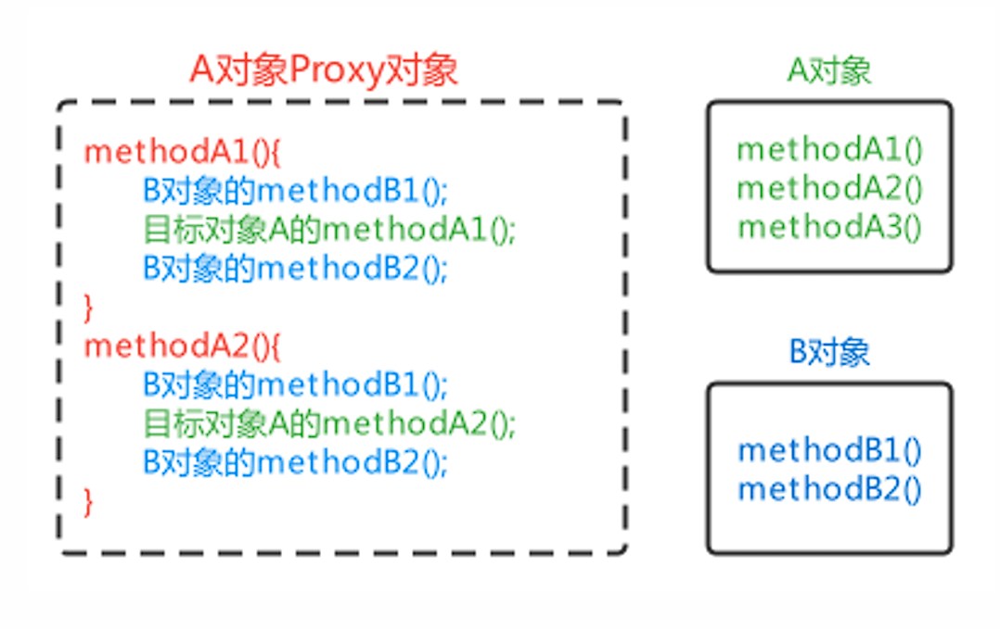
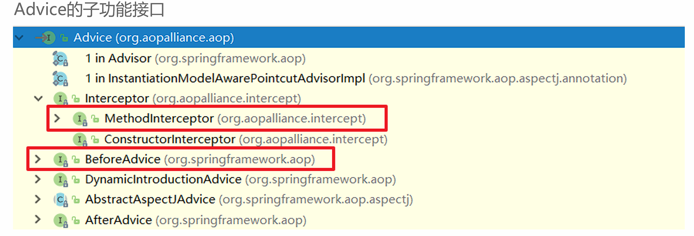
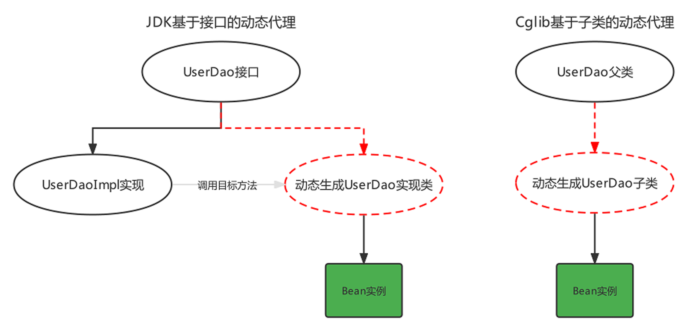
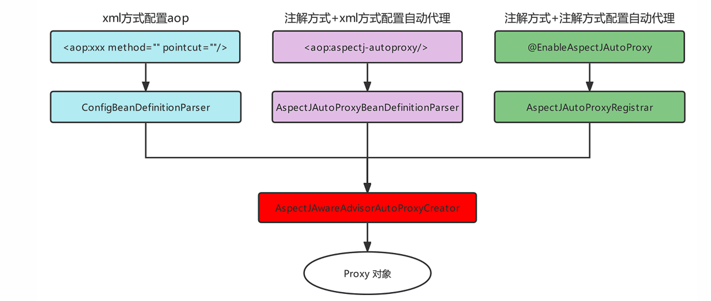

# Spring AOP

### AOP简介

<font color=red>AOP，Aspect Oriented Programming，面向切面编程</font>，是对面向对象编程OOP的升华。

OOP是纵向对一个事物的抽象，一个对象包括静态的属性信息，包括动态的方法信息等。

而AOP是横向的对不同事物的抽象，属性与属性、方法与方法、对象与对象都可以组成一个切面，而用这种思维去设计编程的方式叫做面向切面编程

---

#### AOP思想的实现方案

<font color=red>动态代理技术</font>，在运行期间，对目标对象的方法进行增强，代理对象同名方法内可以执行原有逻辑的同时嵌入执行其他增强逻辑或其他对象的方法



##### AOP模拟实现

```java
@Component
public class AopBeanPostProcessor implements BeanPostProcessor, ApplicationContextAware {

    private ApplicationContext applicationContext;

    @Override
    public Object postProcessAfterInitialization(Object bean, String beanName) throws BeansException {
        //对原始对象进行增强处理
        if(bean.getClass().getName().startsWith("com.ysh.service.impl")){
            //生成 Proxy 对象
            return Proxy.newProxyInstance(
                    bean.getClass().getClassLoader(),
                    bean.getClass().getInterfaces(),
                    (Object proxy, Method method, Object[] args) -> {
                        MyAdvice myAdvice = applicationContext.getBean(MyAdvice.class);
                        myAdvice.beforeAdvice();//执行前通知
                        Object result = method.invoke(bean, args);//原始方法
                        myAdvice.afterAdvice();//执行后通知
                        return result;
                    }
            );
        }
        return BeanPostProcessor.super.postProcessAfterInitialization(bean, beanName);
    }

    @Override
    public void setApplicationContext(ApplicationContext applicationContext) throws BeansException {
        this.applicationContext = applicationContext;
    }
}
```

---

#### AOP相关概念

| 概念    | 单词        | 解释                       |
| ----- | --------- | ------------------------ |
| 目标对象  | Target    | 被增强的方法所在的对象              |
| 代理对象  | Proxy     | 对目标对象进行增强后的对象，客户端实际调用的对象 |
| 连接点   | JoinPoint | 目标对象中可以被增强的方法            |
| 切入点   | PointCut  | 目标对象中实际被增强的方法            |
| 通知/增强 | Advice    | 增强部分的代码逻辑                |
| 切面    | Aspect    | 增强和切入点的组合                |
| 织入    | Weaving   | 将通知和切入点组合动态组合的过程         |

---

### 基于xml方式配置AOP

#### 快速入门

**步骤**

1. 导入AOP相关坐标；

2. 准备目标类、准备增强类，并配置给Spring管理；

3. 配置切点表达式（哪些方法被增强）；

4. 配置织入（切点被哪些通知方法增强，是前置增强还是后置增强）。
   
<br>

导入坐标
```xml
<dependency>
    <groupId>org.aspectj</groupId>
    <artifactId>aspectjweaver</artifactId>
    <version>1.9.6</version>
</dependency>
```

准备目标类、准备增强类，并配置由Spring管理

配置切点表达式

配置织入
```xml
<?xml version="1.0" encoding="UTF-8"?>
<beans xmlns="http://www.springframework.org/schema/beans"
        xmlns:xsi="http://www.w3.org/2001/XMLSchema-instance"
        xmlns:aop="http://www.springframework.org/schema/aop"
        xsi:schemaLocation="
        http://www.springframework.org/schema/beans
        http://www.springframework.org/schema/beans/spring-beans.xsd
        http://www.springframework.org/schema/aop
        http://www.springframework.org/schema/aop/spring-aop.xsd">

    <!-- 通知 -->
    <bean id="advice" class="com.ysh.advice.MyAdvice" />
    <!-- 目标对象 -->
    <bean id="userService" class="com.ysh.service.impl.UserServiceImpl"/>

    <aop:config>
        <!--切点表达式-->
        <aop:pointcut id="myPointcut" expression="execution(void com.ysh.service.impl.*.*(..))"/>
        <!--配置织入-->
        <aop:aspect ref="advice">
            <aop:before method="beforeAdvice" pointcut-ref="myPointcut"/>
        </aop:aspect>
    </aop:config>

</beans>
```
   
---

#### AOP详细配置的细节

- 切点表达式的配置方式

- 切点表达式的配置语法

- 通知的类型

- AOP的配置的两种方式
  
  

##### 配置语法

切点表达式是配置要对哪些连接点（哪些类的哪些方法）进行通知的增强，语法如下：

```
execution([访问修饰符] 返回值类型 包名.类名.方法名(参数))
```

- 访问修饰符可以省略不写；

- 返回值类型、某一级包名、类名、方法名可以使用`*` 表示任意；

- 包名与类名之间使用单点`. `表示该包下的类，使用双点`..` 表示该包及其子包下的类；
 
- 参数列表可以使用两个点`..` 表示任意参数。

!!!example
    ```
    //表示访问修饰符为public、无返回值、在com.itheima.aop包下的TargetImpl类的无参方法show
    execution(public void com.itheima.aop.TargetImpl.show())

    //表示com.itheima.aop包下的TargetImpl类的任意方法
    execution(* com.itheima.aop.TargetImpl.*(..))

    //表示com.itheima.aop包下的任意类的任意方法
    execution(* com.itheima.aop.*.*(..))

    //表示com.itheima.aop包及其子包下的任意类的任意方法
    execution(* com.itheima.aop..*.*(..))

    //表示任意包中的任意类的任意方法
    execution(* *..*.*(..))
    ```


##### 通知类型

| 通知类型 | 配置方式                    | 执行时机                         |
| ---- | ----------------------- | ---------------------------- |
| 前置通知 | `<aop:before>`          | 目标方法执行之前执行                   |
| 后置通知 | `<aop:after-returning>` | 目标方法执行之后执行，目标方法异常时，不再执行      |
| 环绕通知 | `<aop:around>`          | 目标方法执行前后执行，目标方法异常时，环绕后方法不再执行 |
| 异常通知 | `<aop:after-throwing>`  | 目标方法抛出异常时执行                  |
| 最终通知 | `<aop:after>`           | 不管目标方法是否有异常，最终都会执行           |


##### 通知参数

通知方法在被调用时，Spring可以为其传递一些必要的参数

| 参数类型                | 作用                                          |
| ------------------- | ------------------------------------------- |
| JoinPoint           | 连接点对象，任何通知都可使用，可以获得当前目标对象、目标方法参数等信息         |
| ProceedingJoinPoint | JoinPoint子类对象，主要是在环绕通知中执行proceed()，进而执行目标方法 |
| Throwable           | 异常对象，使用在异常通知中，需要在配置文件中指出异常对象名称              |

!!!example
    ```java
    public Object around(ProceedingJoinPoint joinPoint) throws Throwable {
        System.out.println(joinPoint.getArgs());//获得目标方法的参数
        System.out.println(joinPoint.getTarget());//获得目标对象
        System.out.println(joinPoint.getStaticPart());//获得精确的切点表达式信息
        Object result = joinPoint.proceed();//执行目标方法
        return result;//返回目标方法返回值
    }
    ```


对于Throwable：

```java
public void afterThrowing(JoinPoint joinPoint,Throwable th){
    //获得异常信息
    System.out.println("异常对象是："+th+"异常信息是："+th.getMessage());
}
```

```xml
<aop:after-throwing method="afterThrowing" pointcut-ref="myPointcut" throwing="th"/>
```

!!!warning "注意"
    需在配置时指定throwing属性


##### 另一种配置方式

AOP的另一种配置方式，该方式需要通知类实现Advice的子功能接口

```java
public interface Advice {}
```



例如：通知类实现了前置通知和后置通知接口

```java
public class Advices implements MethodBeforeAdvice, AfterReturningAdvice {
    public void before(Method method, Object[] objects, Object o) throws Throwable {
        System.out.println("This is before Advice ...");
    }

    public void afterReturning(Object o, Method method, Object[] objects, Object o1) throws
            Throwable {
        System.out.println("This is afterReturn Advice ...");
    }
}
```

```xml
<aop:config>
     <!--将通知和切点进行结合-->
     <aop:advisor advice-ref="advices" pointcut="execution(void com.itheima.aop.TargetImpl.show())"/>
 </aop:config>
```


##### 原理

xml解析器向Spring容器中注册了一个BeanPostProcessor，该BeanPostProcessor在需要切入的Bean的生命周期中生成了**代理对象**


动态代理的实现的选择，在调用getProxy() 方法时，我们可选用的AopProxy接口有两个实现类，一种就是基于JDK，一种是基于Cglib

| 代理技术          | 使用条件                                                     | 配置方式                                                     |
| ----------------- | ------------------------------------------------------------ | ------------------------------------------------------------ |
| JDK动态代理技术   | 目标类有接口，是基于接口动态生成实现类的代理对象             | 目标类有接口的情况下，默认方式                               |
| Cglib动态代理技术 | 目标类无接口且不能使用final修饰，是基于被代理对象动态生成子对象为代理对象 | 目标类无接口时，默认使用该方式；目标类有接口时，手动配置`<aop:configproxytarget-class=“true”>`强制使用Cglib方式 |




Cglib测试代码:

```java
public class CglibTest {
    public static <Advices> void main(String[] args) {
        Target target = new Target();//目标对象
        Advices advices = new Advices();//通知对象
        Enhancer enhancer = new Enhancer();//增强器对象
        enhancer.setSuperclass(Target.class);//增强器设置父类
        //增强器设置回调
        enhancer.setCallback((MethodInterceptor)(o, method, objects, methodProxy) -> {
            advices.before();
            Object result = method.invoke(target, objects);
            advices.afterReturning();
            return result;
        });
        //创建代理对象
        Target targetProxy = (Target) enhancer.create();
        //测试
        String result = targetProxy.show("haohao");
    }
}
```


---


### 基于注解方式配置AOP

#### 基本使用

```java
@Component
@Aspect
public class MyAdvice {
    @Around("execution(void com.ysh.service.impl.*.*(..)))")
    public Object beforeAdvice() {
        System.out.println("前置通知");
        return null;
    }
    @Before("execution(* *.*(..))")
    public void afterAdvice() {
        System.out.println("后置通知");
    }
}
```

注解@Aspect、@Around需要被Spring解析，所以在Spring核心配置文件中需要配置aspectj的自动代理

```xml
<aop:aspectj-autoproxy/>
```

!!!tip
    注解方式配置为@EnableAspectJAutoProxy


#### 配置详解

```java
//前置通知
@Before("execution(* com.ysh.aop.*.*(..))")
public void before(JoinPoint joinPoint){}

//后置通知
@AfterReturning("execution(* com.ysh.aop.*.*(..))")
public void AfterReturning(JoinPoint joinPoint){}

//环绕通知
@Around("execution(* com.ysh.aop.*.*(..))")
public void around(ProceedingJoinPoint joinPoint) throws Throwable {}

//异常通知
@AfterThrowing(pointcut = "execution(* com.ysh.aop.*.*(..))",throwing = "throwable")
public void AfterThrowing(Throwable throwable) {}

//最终通知
@After("execution(* com.ysh.aop.*.*(..))")
public void After(JoinPoint joinPoint){}
```


切点表达式的抽取：使用一个**空方法**，将切点表达式标注在空方法上，其他通知方法**引用即可**:

```java
@Component
@Aspect
public class AnnoAdvice {
    //切点表达式抽取
    @Pointcut("execution(* com.itheima.aop.*.*(..))")
    public void pointcut(){}

    //前置通知
    @Before("pointcut()")
    public void before(JoinPoint joinPoint){}
    //后置通知
    @AfterReturning("AnnoAdvice.pointcut()")
    public void AfterReturning(JoinPoint joinPoint){}
    // ...  省略其他代码...
}
```


#### 原理解析



---

### 基于AOP的声明式事务控制

#### 概述

事务是开发中必不可少的东西，使用JDBC开发时，我们使用connnection对事务进行控制，使用MyBatis时，我们使用SqlSession对事务进行控制，缺点显而易见，当我们切换数据库访问技术时，事务控制的方式总会变化，Spring 就将这些技术基础上，提供了统一的控制事务的接口。


Spring的事务分为：编程式事务控制和声明式事务控制

| 事务控制方式  | 说明                                                                         |
| ------- | -------------------------------------------------------------------------- |
| 编程式事务控制 | Spring提供了事务控制的类和方法，使用编码的方式对业务代码进行事务控制，事务控制代码和业务操作代码耦合到了一起，开发中不使用           |
| 声明式事务控制 | Spring将事务控制的代码封装，对外提供了Xml和注解配置方式，通过配置的方式完成事务的控制，可以达到事务控制与业务操作代码解耦合，开发中推荐使用 |


Spring事务编程相关的类主要有如下三个

| 类                                 | 说明                                                |
| --------------------------------- | ------------------------------------------------- |
| 平台事务管理器PlatformTransactionManager | 是一个接口标准，实现类都具备事务提交、回滚和获得事务对象的功能，不同持久层框架可能会有不同实现方案 |
| 事务定义TransactionDefinition         | 封装事务的隔离级别、传播行为、过期时间等属性信息                          |
| 事务状态TransactionStatus             | 存储当前事务的状态信息，如果事务是否提交、是否回滚、是否有回滚点等                 |


#### xml方式

导入Spring事务的相关的坐标，spring-jdbc坐标已经引入**spring-tx**坐标

```xml
<dependency>
    <groupId>org.springframework</groupId>
    <artifactId>spring-jdbc</artifactId>
    <version>6.1.14</version>
</dependency>
```

引入命名空间

```xml
xmlns:tx="http://www.springframework.org/schema/tx"
http://www.springframework.org/schema/tx
http://www.springframework.org/schema/tx/spring-tx.xsd
```

配置事务增强

```xml
<!-- 配置事务管理器 -->
<bean id="transactionManager" class="org.springframework.jdbc.datasource.DataSourceTransactionManager">
    <property name="dataSource" ref="dataSource"/>
</bean>

<!-- 配置Spring事务增强advice -->
<tx:advice id="txAdvice" transaction-manager="transactionManager">
    <tx:attributes>
        <tx:method name="*"/>
    </tx:attributes>
</tx:advice>

<!-- 配置切面 -->
<aop:config>
    <aop:pointcut id="myPointcut" expression="execution(* com.ysh.service.*.*(..))"/>
    <!-- 配置spring事务增强advisor(由spring提供) -->
    <aop:advisor advice-ref="txAdvice" pointcut-ref="myPointcut" />
</aop:config>
```

!!!note
    平台事务管理器PlatformTransactionManager是Spring提供的封装事务具体操作的规范接口，封装了事务的提交和回滚方法

    不同的持久层框架事务操作的方式有可能不同，所以不同的持久层框架有可能会有不同的平台事务管理器实现，例如:

    - MyBatis作为持久层框架时，使用的平台事务管理器实现是DataSourceTransactionManager。

    - Hibernate作为持久层框架时，使用的平台事务管理器是HibernateTransactionManager。


**事务定义信息配置**，每个事务有很多特性，例如：**隔离级别、只读状态、超时时间**等，这些信息在开发时可以通过connection进行指定，而此处要通过配置文件进行配置

```xml
<tx:attributes>
    <tx:method name="方法名称"
                isolation="隔离级别"
                propagation="传播行为"
                read-only="只读状态"
                timeout="超时时间"/>
</tx:attributes>
```


- **name属性**：指定哪个方法要进行哪些事务的属性配置

> 方法名在配置时，也可以使用* 进行模糊匹配


- **isolation属性**：指定事务的隔离级别，事务并发存在三大问题：脏读、不可重复读、幻读/虚读。可以通过设置事务的隔离级别来保证并发问题的出现，常用的是READ_COMMITTED 和REPEATABLE_READ

| 属性               | 说明                                                      |
| ---------------- | ------------------------------------------------------- |
| DEFAULT          | 默认隔离级别，取决于当前数据库隔离级别，例如MySQL默认隔离级别是REPEATABLE_READ       |
| READ_UNCOMMITTED | A事务可以读取到B事务尚未提交的事务记录，不能解决任何并发问题，安全性最低，性能最高              |
| READ_COMMITTED   | A事务只能读取到其他事务已经提交的记录，不能读取到未提交的记录。可以解决脏读问题，但是不能解决不可重复读和幻读 |
| REPEATABLE_READ  | A事务多次从数据库读取某条记录结果一致，可以解决不可重复读，不可以解决幻读                   |
| SERIALIZABLE     | 串行化，可以解决任何并发问题，安全性最高，但是性能最低                             |


- **read-only属性**：设置当前的只读状态，如果是查询则设置为true，可以**提高查询性能**，如果是更新（增删改）操作则设置为false

```xml
<!-- 一般查询相关的业务操作都会设置为只读模式-->
 <tx:method name="select*" read-only="true"/>
 <tx:method name="find*" read-only="true"/>
```


- **timeout属性**：设置事务执行的超时时间，单位是秒，如果超过该时间限制但事务还没有完成，则自动回滚事务，不在继续执行。默认值是-1，即没有超时时间限制


- **propagation属性**：设置事务的传播行为，主要解决是A方法调用B方法时，事务的传播方式问题的，例如：使用单方的事务，还是A和B都使用自己的事务等。事务的传播行为有如下七种属性值可配置

| 属性            | 说明                                            |
| ------------- | --------------------------------------------- |
| REQUIRED（默认值） | A调用B，B需要事务，如果A有事务B就加入A的事务中，如果A没有事务，B就自己创建一个事务 |
| REQUIRED_NEW  | A调用B，B需要新事务，如果A有事务就挂起，B自己创建一个新的事务             |
| SUPPORTS      | A调用B，B有无事务无所谓，A有事务就加入到A事务中，A无事务B就以非事务方式执行     |
| NOT_SUPPORTS  | A调用B，B以无事务方式执行，A如有事务则挂起                       |
| NEVER         | A调用B，B以无事务方式执行，A如有事务则抛出异常                     |
| MANDATORY     | A调用B，B要加入A的事务中，如果A无事务就抛出异常                    |
| NESTED        | A调用B，B创建一个新事务，A有事务就作为嵌套事务存在，A没事务就以创建的新事务执行    |


**xml方式声明式事务控制原理**：

`<tx:advice>`配置的实际上是一个遵守了Advice规范的类，该类实现了`MethodInterceptor`接口可以对方法进行环绕增强。(AOP原理)


#### 注解方式

在**方法上**添加@Transactional注解，该注解可以配置事务定义信息配置

> 若配置在类上，则该类全局受事务控制

```xml
    <tx:annotation-driven/>
    <!-- 事务自动代理 -->
```

若使用全注解方式：

```java
@Configuration
@ComponentScan("com.ysh")
@MapperScan("com.ysh.mapper")
@EnableTransactionManagement    //自动事务管理
public class SpringConfig {
    @Bean
    public DataSource dataSource() {
        DruidDataSource dataSource =  new DruidDataSource();
        dataSource.setUsername("root");
        dataSource.setPassword("123456");
        dataSource.setUrl("jdbc:mysql://8.138.186.154:3306/mp");
        dataSource.setDriverClassName("com.mysql.cj.jdbc.Driver");
        return dataSource;
    }

    @Bean
    public SqlSessionFactoryBean sqlSessionFactoryBean(DataSource dataSource) {
        SqlSessionFactoryBean sqlSessionFactoryBean = new SqlSessionFactoryBean();
        sqlSessionFactoryBean.setDataSource(dataSource);
        return sqlSessionFactoryBean;
    }

    // 配置事务管理器
    @Bean("transactionManager")
    public DataSourceTransactionManager transactionManager(DataSource dataSource) {
        DataSourceTransactionManager dataSourceTransactionManager = new DataSourceTransactionManager(dataSource);
        dataSourceTransactionManager.setDataSource(dataSource);
        return dataSourceTransactionManager;
    }
}
```


#### 事务失效

##### **1. 方法非 `public` 修饰**

- **问题**：Spring 事务基于 AOP 动态代理实现，默认只代理 `public` 方法。
- **解决**：确保 `@Transactional` 注解的方法为 `public`。


##### **2. 事务方法被同类内部调用**

- **问题**：事务方法被同类中的其他方法直接调用（绕过代理对象）。

- **解决**：

  - **方式1**：通过代理对象调用（注入自身 Bean）：

    ```java
    @Service
    public class UserService {
      @Autowired
      private UserService userService; // 注入自身代理对象
    
      public void methodA() {
        userService.methodB(); // 通过代理对象调用
      }
    
      @Transactional
      public void methodB() {
        // 业务逻辑
      }
    }
    ```

  - **方式2**：使用 `AopContext` 获取代理对象：

    ```java
    public void methodA() {
      ((UserService) AopContext.currentProxy()).methodB();
    }
    ```

    **注意**：需在启动类添加 `@EnableAspectJAutoProxy(exposeProxy = true)`。


##### **3. 异常未被正确抛出**

- **问题**：默认事务仅对 `RuntimeException` 和 `Error` 回滚，其他异常需手动配置。
- **解决**：
  - 手动抛出 `RuntimeException`：
  - 指定回滚异常类型：


##### **4. 事务传播机制配置错误**

- **问题**：默认传播机制为 `REQUIRED`，若嵌套事务配置不当，可能导致预期外的行为。

- **解决**：根据场景选择传播机制：


---

**上一节：** [基于注解的Spring应用](Spring-Annotation.md)

**下一节：** [整合Web环境](Spring-Web.md)