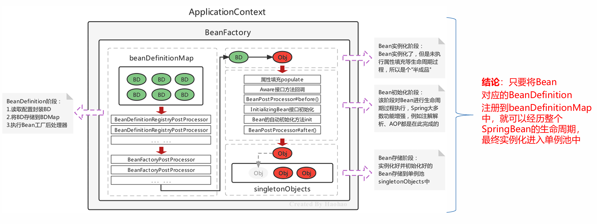
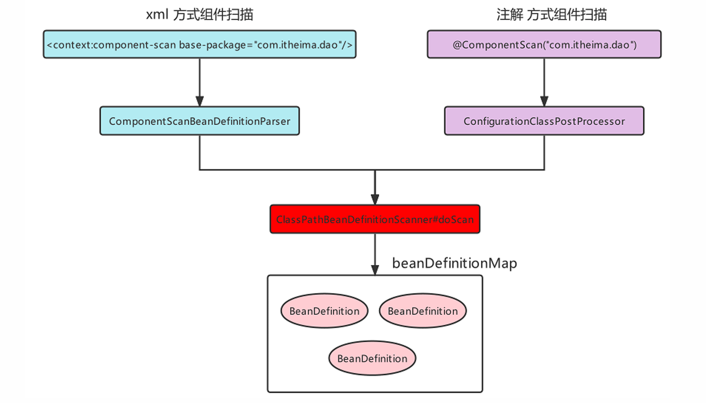

# 基于注解的Spring应用

### Bean的基本注解开发

使用注解对需要被Spring实例化的Bean进行标注，需要告诉Spring去哪找这些Bean，要配置组件扫描路径：

```xml
<?xml version="1.0" encoding="UTF-8"?>
<beans xmlns="http://www.springframework.org/schema/beans"
       xmlns:xsi="http://www.w3.org/2001/XMLSchema-instance"
       xmlns:context="http://www.springframework.org/schema/context"
       xsi:schemaLocation="http://www.springframework.org/schema/beans http://www.springframework.org/schema/beans/spring-beans.xsd http://www.springframework.org/schema/context https://www.springframework.org/schema/context/spring-context.xsd">

    <!--注解组件扫描：扫描指定包及其子包下的类，并将其注册为Spring Bean-->
    <context:component-scan base-package="com.ysh"/>

</beans>
```

| xml配置                    | 注解             | 描述                                                    |
| ------------------------ | -------------- | ----------------------------------------------------- |
| `<bean id="" class="">`    | @Component     | 被该注解标识的类，会在指定扫描范围内被Spring加载并实例化                       |
| `<bean scope="">`          | @Scope         | 在类上或使用了@Bean标注的方法上，标注Bean的作用范围，取值为singleton或prototype |
| `<bean lazy-init="">`      | @Lazy          | 在类上或使用了@Bean标注的方法上，标注Bean是否延迟加载，取值为true和false         |
| `<bean init-method="">`    | @PostConstruct | 在方法上使用，标注Bean的实例化后执行的方法                               |
| `<bean destroy-method="">` | @PreDestroy    | 在方法上使用，标注Bean的销毁前执行方法                                 |


可以通过@Component注解的value属性指定当前Bean实例的beanName，也可以省略不写，不写的情况下为当前
类名首字母小写

```java
//获取方式：applicationContext.getBean("userDao");
@Component("userDao")
public class UserDaoImpl implements UserDao {
}
//获取方式：applicationContext.getBean("userDaoImpl");
@Component
public class UserDaoImpl implements UserDao {
}
```


!!!example

```java
@Component("userDao")
@Scope("singleton")
@Lazy(true)
public class UserDaoImpl implements UserDao{
    @PostConstruct
    public void init(){}
    @PreDestroy
    public void destroy(){}
}
```

<br>

由于JavaEE开发是分层的，为了每层Bean标识的注解语义化更加明确，@Component又衍生出如下三个注解：

| @Component衍生注解 | 描述            |
| -------------- | ------------- |
| @Repository    | 在Dao层类上使用     |
| @Service       | 在Service层类上使用 |
| @Controller    | 在Web层类上使用     |


### Bean依赖注入注解开发

Bean依赖注入的注解，主要是使用注解的方式替代xml的 标签完成属性的注入操作

```xml
    <bean id="" class="">
        <property name="" value=""/>
        <property name="" ref=""/>
    </bean>
```


Spring主要提供如下注解，用于在Bean内部进行属性注入的：

| 注解         | 描述                                                   |
| ------------ | ------------------------------------------------------ |
| `@Value`     | 使用在字段或方法上，用于注入普通数据                   |
| `@Autowired` | 使用在字段或方法上，用于根据类型（byType）注入引用数据 |
| `@Qualifier` | 使用在字段或方法上，结合@Autowired，根据名称注入       |
| `@Resource`  | 使用在字段或方法上，根据类型或名称进行注入             |

!!!quote
    @Resource注解由JavaEE规范定义，Spring框架支持并实现了这个标准注解
 
---

#### @Value注入

- 直接注入普通属性：

```java
@Value("haohao")// 实际开发意义不大
private String username;

@Value("haohao")
public void setUsername(String username){
    System.out.println(username);
}
```


- 注入properties文件中的属性:

```java
@Value("${jdbc.username}")
private String username;

@Value("${jdbc.username}")
public void setUsername(String username){
    System.out.println(username);
}
```

   

!!!tip

    在`applicationContext.xml`中加载properties文件:

    ```xml
    <context:property-placeholder location="classpath:jdbc.properties"/>
    ```


---

#### @Autowired注入

用于根据 **类型** 进行注入

```java
//使用在属性上直接注入
@Autowired
private UserDao userDao;

//使用在方法上直接注入
@Autowired
public void setUserDao(UserDao userDao){
    System.out.println(userDao);
}
```

!!!tip

    当容器中同一类型的Bean实例有多个时，会尝试自动根据名字进行匹配

    当容器中同一类型的Bean实例有多个时，且名字与被注入Bean名称不匹配时会报错

    可注入**集合**，从容器中找多个同类型的对象

    ```java
    @Autowired
    public void test(List<UserDao> list){
    //
    }
    ```

---

#### @Qualifier注入

`@Qualifier`配合`@Autowired`可以完成**根据名称**注入Bean实例，使用`@Qualifier`指定名称:

```java
@Autowired
@Qualifier("userDao2")
private UserDao userDao;

@Autowired
@Qualifier("userDao2")
public void setUserDao(UserDao userDao){
    System.out.println(userDao);
}
```

---

#### @Resource注入

@Resource注解既可以根据类型注入，也可以根据名称注入，**无参就是根据类型注入**，**有参数(name)就是根据名称注入**

```java
@Resource
private UserDao userDao;

@Resource(name = "userDao2")
public void setUserDao(UserDao userDao){
    System.out.println(userDao);
}
```

!!!quote
    `@Resource`注解在 javax.annotation 包中（该注解来自JDK），Spring对其进行了解析


---
<br>

### 非自定义Bean注解开发

非自定义Bean不能像自定义Bean一样使用@Component进行管理，非自定义Bean要通过工厂的方式进行实例化，使用`@Bean`标注方法即可，@Bean的属性为beanName，如不指定即为当前<font color=red>工厂方法名称</font>

```java
//将方法返回值Bean实例以@Bean注解指定的名称存储到Spring容器中
@Bean("dataSource")
public DataSource dataSource(){
     DruidDataSource dataSource = new DruidDataSource();
     dataSource.setDriverClassName("com.mysql.jdbc.Driver");
     dataSource.setUrl("jdbc:mysql://localhost:3306/mybatis");
     dataSource.setUsername("root");
     dataSource.setPassword("root");
     return dataSource;
}
```

!!!warning "注意"
    工厂方法所在类必须**要被Spring管理**


如果@Bean工厂方法需要参数的话，则有如下几种注入方式：

- 使用@Autowired 根据类型自动进行Bean的匹配，@Autowired可以省略；

- 使用@Qualifier 根据名称进行Bean的匹配；

- 使用@Value 根据名称进行普通数据类型匹配。
  
  
---
  

### Bean配置类的注解开发


`@Configuration`注解标识的类为配置类，替代原有xml配置文件，该注解第一个作用是标识该类是一个配置类，第二个作用是具备`@Component`的作用

```java
@Configuration
public class ApplicationContextConfig {}
```


`@ComponentScan`组件扫描配置

```java
 @Configuration
 @ComponentScan({"com.itheima.service","com.itheima.dao"})
 public class ApplicationContextConfig {}
```

!!!tip
    - 指定一个或多个包名：扫描指定包及其子包下使用注解的类

    - 不配置包名：扫描当前@componentScan注解配置类所在包及其子包下的类


`@PropertySource`注解用于加载外部properties资源配置

```java
 @Configuration
 @ComponentScan
 @PropertySource({"classpath:jdbc.properties","classpath:xxx.properties"})
 public class ApplicationContextConfig {}
```


`@Import` 用于加载其他配置类

```java
 @Configuration
 @ComponentScan
 @PropertySource("classpath:jdbc.properties")
 @Import(OtherConfig.class)
 public class ApplicationContextConfig {}
```


使用`AnnotationConfigApplicationContext`替代以xml方式加载的Spring容器

```java
ApplicationContext context = new AnnotationConfigApplicationContext(SpringConfiguration.class);
```

---

### Spring配置其他注解

`@Primary`注解用于标注相同类型的Bean**优先使用权**，@Primary 是Spring3.0引入的，与@Component和@Bean一起使用，标注Bean的优先级更高，则在通过类型获取Bean或通过@Autowired根据类型进行注入时，会选用优先级更高的


`@Profile` 注解是进行环境切换使用的

!!!note
    注解@Profile 标注在**类或方法**上，标注当前产生的Bean从属于哪个环境，只有激活了当前环境，被标注的Bean才能被注册到Spring容器里，不指定环境的Bean，任何环境下都能注册到Spring容器里

    可以使用以下两种方式指定被激活的环境：

    - 使用命令行动态参数，虚拟机参数位置加载`-Dspring.profiles.active=test` 

    - 使用代码的方式设置环境变量`System.setProperty("spring.profiles.active","test")`


---

### Spring注解解析原理





---

### 整合第三方框架

以MyBatis为例

导入依赖：

```xml
        <dependency>
            <groupId>com.alibaba</groupId>
            <artifactId>druid</artifactId>
            <version>1.2.23</version>
            <scope>compile</scope>
        </dependency>

        <dependency>
            <groupId>mysql</groupId>
            <artifactId>mysql-connector-java</artifactId>
            <version>8.0.33</version>
        </dependency>

        <dependency>
            <groupId>org.mybatis</groupId>
            <artifactId>mybatis</artifactId>
            <version>3.5.16</version>
        </dependency>

        <dependency>
            <groupId>org.mybatis</groupId>
            <artifactId>mybatis-spring</artifactId>
            <version>3.0.3</version>
        </dependency>

        <dependency>
            <groupId>org.springframework</groupId>
            <artifactId>spring-jdbc</artifactId>
            <version>6.1.14</version>
        </dependency>
```


配置第三方Bean

```java
@ComponentScan
@Configuration
@PropertySource("classpath:jdbc.properties")
@MapperScan("com.ysh.mapper")
public class SpringConfiguration {

    @Bean
    public DataSource dataSource(
            @Value("${jdbc.url}") String url,
            @Value("${jdbc.username}") String username,
            @Value("${jdbc.password}") String password,
            @Value("${jdbc.driverClassName}") String driverClassName
    ) {
        DruidDataSource dataSource = new DruidDataSource();
        dataSource.setUrl(url);
        dataSource.setUsername(username);
        dataSource.setPassword(password);
        dataSource.setDriverClassName(driverClassName);
        return dataSource;
    }

    @Bean
    public SqlSessionFactoryBean sqlSessionFactoryBean(DataSource dataSource) throws Exception {
        SqlSessionFactoryBean sqlSessionFactoryBean = new SqlSessionFactoryBean();
        sqlSessionFactoryBean.setDataSource(dataSource);
        return sqlSessionFactoryBean;
    }
}
```


第三方框架与Spring整合xml方式很多是凭借自定义标签完成的，而第三方框架与Spring整合注解方式很多是靠@Import注解完成的

@Import可以导入如下三种类：

- 普通的配置类

- 实现`ImportSelector`接口的类

- 实现`ImportBeanDefinitionRegistrar`接口的类
  
  


---
**上一节：** [基于XML的Spring应用](Spring-XML.md)

**下一节：** [Spring的AOP开发](Spring-AOP.md)