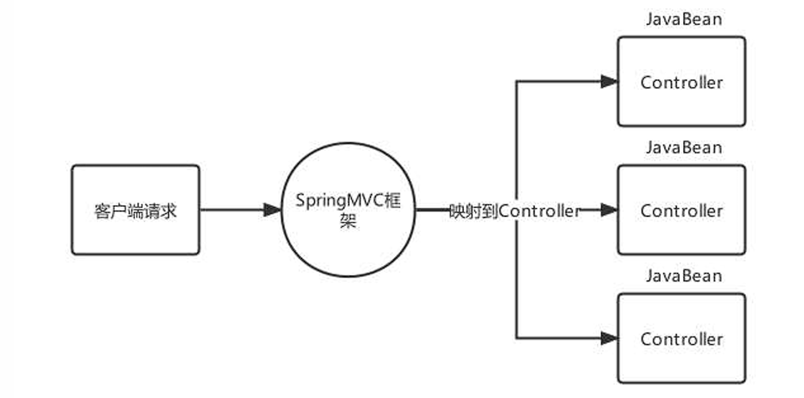
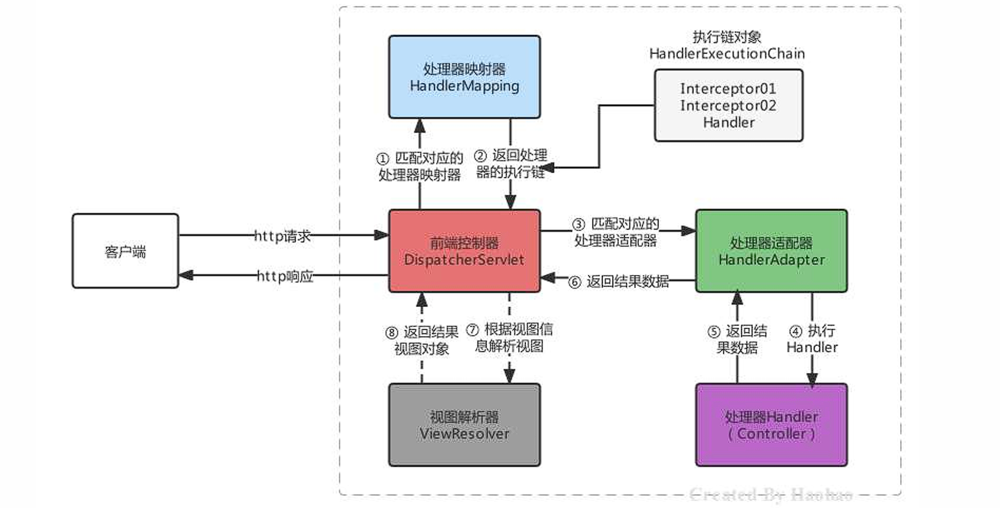
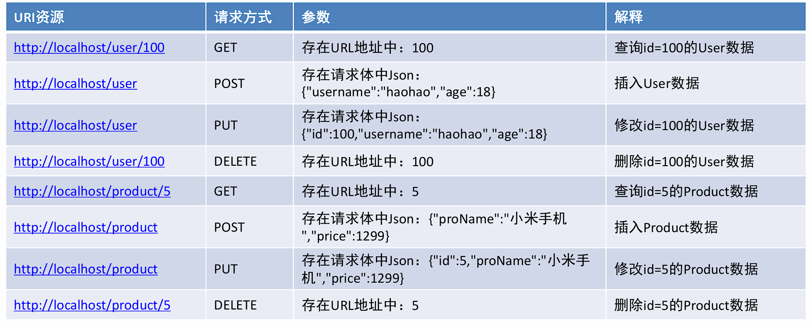
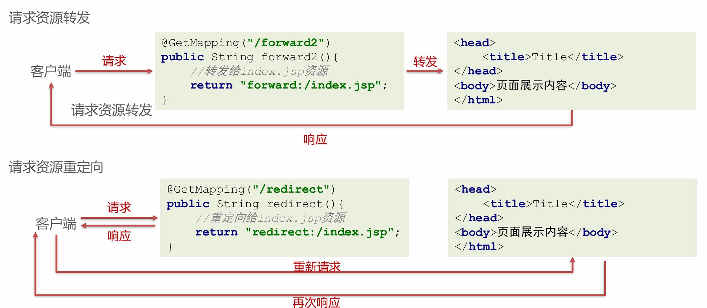
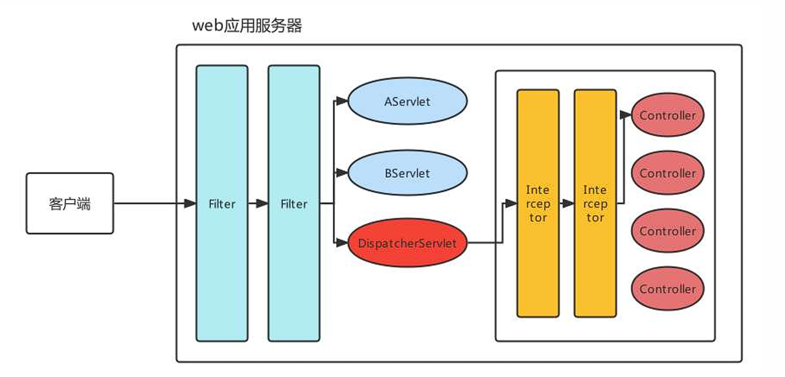
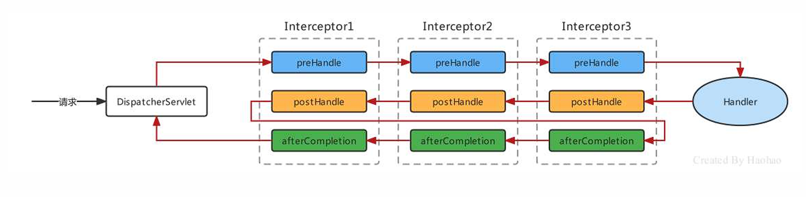
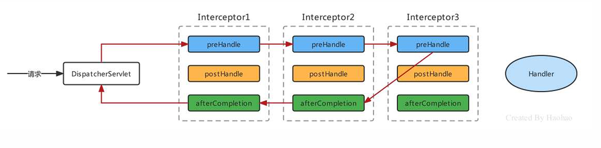
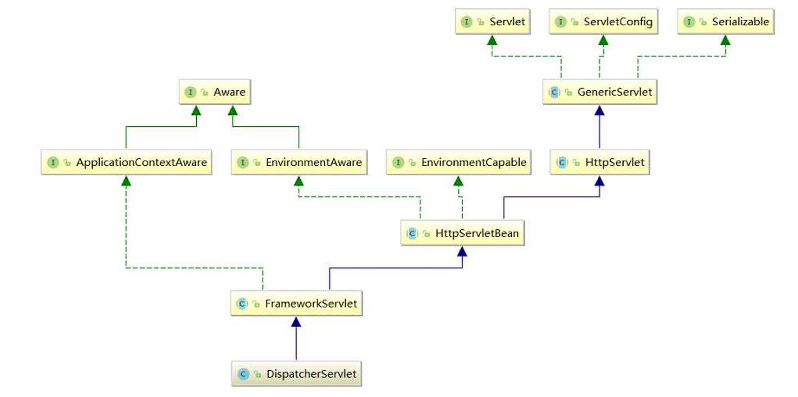
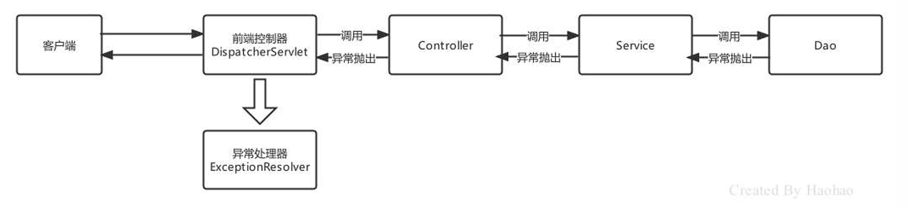

# Spring MVC框架

## 简介

### 概述

SpringMVC是一个基于Spring开发的MVC轻量级框架，Spring3.0后发布的组件，SpringMVC和Spring可以无缝整合，使用DispatcherServlet作为前端控制器，且内部提供了处理器映射器、处理器适配器、视图解析器等组件，可以简化JavaBean封装，Json转化、文件上传等操作。



---

### 快速入门

- 导入`spring-webmvc`坐标（pom.xml）

```xml
<dependency>
    <groupId>org.springframework</groupId>
    <artifactId>spring-webmvc</artifactId>
    <version>5.3.23</version>
</dependency>
```

- 编写一个控制器Controller，配置映射信息

```java
@Controller
public class UserController {
    @RequestMapping("/show")
    public String show(){
        System.out.println("show 执行....");
        //视图跳转到index.jsp
        return "/index.jsp";
    }
}
```

- 在web.xml中配置SpringMVC的前端控制器ServletDispatcher

```xml
    <servlet>
        <servlet-name>DispatcherServlet</servlet-name>
        <servlet-class>org.springframework.web.servlet.DispatcherServlet</servlet-class>
        <!--指定springMVC配置文件位置-->
        <init-param>
            <param-name>contextConfigLocation</param-name>
            <param-value>classpath:spring-mvc.xml</param-value>
        </init-param>
        <!--服务器启动就创建-->
        <load-on-startup>2</load-on-startup>
    </servlet>
    <servlet-mapping>
        <servlet-name>DispatcherServlet</servlet-name>
        <url-pattern>/</url-pattern>
    </servlet-mapping>
```

- 创建springMVC的核心配置文件 spring-mvc.xml，并配置web层组件扫描

```xml
<?xml version="1.0" encoding="UTF-8"?>
<beans xmlns="http://www.springframework.org/schema/beans"
       xmlns:xsi="http://www.w3.org/2001/XMLSchema-instance"
       xmlns:context="http://www.springframework.org/schema/context"
       xsi:schemaLocation="http://www.springframework.org/schema/beans http://www.springframework.org/schema/beans/spring-beans.xsd http://www.springframework.org/schema/context https://www.springframework.org/schema/context/spring-context.xsd">

    <context:component-scan base-package="com.ysh.controller" />

</beans>
```

---

### Controller中访问容器中的Bean

- 创建一个applicationContext.xml文件

```xml
<?xml version="1.0" encoding="UTF-8"?>
<beans xmlns="http://www.springframework.org/schema/beans"
       xmlns:xsi="http://www.w3.org/2001/XMLSchema-instance"
       xmlns:context="http://www.springframework.org/schema/context"
       xsi:schemaLocation="http://www.springframework.org/schema/beans http://www.springframework.org/schema/beans/spring-beans.xsd http://www.springframework.org/schema/context https://www.springframework.org/schema/context/spring-context.xsd">

    <context:component-scan base-package="com.ysh">
        <context:exclude-filter type="annotation" expression="org.springframework.stereotype.Controller"/>
    </context:component-scan>

</beans>
```

- 在web.xml中配置ContextLoaderListener

```xml
<!-- 配置Spring容器 -->
<context-param>
    <param-name>contextConfigLocation</param-name>
    <param-value>classpath:application.xml</param-value>
</context-param>
<listener>
    <listener-class>org.springframework.web.context.ContextLoaderListener</listener-class>
</listener>
```

- 编写Service类并使用`@Service`注解标记

- 使用@Autowried注入即
   
---

### Spring MVC关键组件浅析

| 组件                    | 描述                                                   | 常用类                          |
| --------------------- | ---------------------------------------------------- | ---------------------------- |
| 处理器映射器：HandlerMapping | 匹配映射路径对应的Handler，返回可执行的处理器链对象HandlerExecutionChain对象 | RequestMappingHandlerMapping |
| 处理器适配器：HandlerAdapter | 匹配HandlerExecutionChain对应的适配器进行处理器调用，返回视图模型对象        | RequestMappingHandlerAdapter |
| 视图解析器：ViewResolver    | 对视图模型对象进行解析                                          | InternalResourceViewResolver |




- SpringMVC的默认组件，SpringMVC在前端控制器 `DispatcherServlet`加载时，就会进行初始化操作。

- 在进行初始化时，就会加载SpringMVC默认指定的一些组件，这些默认组件配置在与spring-webmvc.jar包下的 `org\springframework\web\servlet\DispatcherServlet.properties`

- 在DispatcherServlet中存在集合存储着这些组件，SpringMVC的默认组件会在 DispatcherServlet 中进行维护，但是并没有存储在与SpringMVC的容器中

- 如果不想使用默认组件，可以将替代方案使用Spring Bean的方式进行配置,`<bean />`
  
---

## Spring MVC的请求处理

### 请求映射路径的配置

配置映射路径，映射处理器才能找到Controller的方法资源，目前主流映射路径配置方式就是`@RequestMapping`

| 注解              | 作用                          | 使用位置  |
| --------------- | --------------------------- | ----- |
| @RequestMapping | 设置控制器方法的访问资源路径，可以接收任何请求使用位置 | 方法和类上 |
| @GetMapping     | 设置控制器方法的访问资源路径，可以接收GET请求    | 方法和类上 |
| @PostMapping    | 设置控制器方法的访问资源路径，可以接收POST请求   | 方法和类上 |


@RequestMapping注解，主要使用在控制器的方法上，用于标识客户端访问资源路径，常用的属性有value、path、method、headers、params等。


value和path指定单个或多个路径

```java
@RequestMapping(value = "/show")//使用value属性指定一个访问路径
public String show(){}

@RequestMapping(value = {"/show","/haohao","/abc"})//使用value属性指定多个访问路径
public String show(){}

@RequestMapping(path = "/show")//使用path属性指定一个访问路径
public String show(){}

@RequestMapping(path = {"/show","/haohao","/abc"})//使用path属性指定多个访问路径
public String show(){}

@RequestMapping("/show")//如果只设置访问路径时，value和path可以省略
public String show(){}

@RequestMapping({"/show","/haohao","/abc"})
public String show(){}
```


method属性，限定访问方式

```java
//请求地址是 /show,且请求方式必须是POST才能匹配成功
@RequestMapping(value = "/show",method = RequestMethod.POST)
public String show(){}
```

method的属性值是一个枚举类型，源码如下：

```java
public enum RequestMethod {
    GET,
    HEAD,
    POST,
    PUT,
    PATCH,
    DELETE,
    OPTIONS,
    TRACE;

    private RequestMethod() {
    }
}
```


@GetMapping，当请求方式是GET时，可以使用@GetMapping替代@RequestMapping

@PostMapping，当请求方式是POST时，可以使用@PostMapping替代@RequestMapping


以上注解使用在类上后，该类所有方法都公用该注解设置的属性，访问路径则为类上的`映射地址+方法上`的映射地址

---

### 请求数据的接收

#### 一般数据

- 当客户端提交的数据是<font color=red>普通键值对形式</font>时，直接使用同名形参接收即可

请求：`http://localhost/mvc/hello?name=lisi`

```java
    @GetMapping("hello")
    public String hello(String name){
        System.out.println(name);
        return "OK";
    }
    // 控制台输出 lisi
```

!!!warning "注意"
    当请求参数的名称与方法参数名不一致时，可以使用@RequestParam注解进行标注

!!!example
    请求：`http://localhost/mvc/hello?username=lisi`

    ```java
        @GetMapping("hello")
        public String hello(@RequestParam(value = "username",required = true) String name){
            System.out.println(name);
            return "OK";
        }
    ```

<br>

- 接收<font color=red>JavaBean属性数据</font>，单个JavaBean数据：提交的**参数名称只要与Java的属性名**一致，就可以进行自动封装

!!!note
    嵌套JavaBean数据：提交的参数名称用` . `描述嵌套对象的属性关系即可 eg：address.city

<br>

- 接收<font color=red>数组或集合数据</font>，客户端传递多个**同名参数**时，可以使用**数组**接收

!!!note
    也可以使用单列集合接收，但是需要使用`@RequestParam`进行修饰

<br>

- 接收<font color=red>数组或集合数据</font>，客户端传递多个**不同名参数**时，可以使用 Map 进行接收，同样需要用`@RequestParam` 进行修饰
  
<br>

- 接收<font color=red>Json数据格式数据</font>，Json数据都是以请求体的方式提交的，且不是原始的键值对格式的，所以要使用`@RequestBody`注解整体接收该数据。(接收到的数据为字符串类型)

!!!note
    使用Json序列化工具（如jackson）将Json格式的字符串转化为JavaBean进行操作

配置`RequestMappingHandlerAdapter`，指定消息转换器，就不需要手动转换json格式字符串了(仍需`@RequestBody`注解)

```xml
<bean class="org.springframework.web.servlet.mvc.method.annotation.RequestMappingHandlerAdapter">
    <property name="messageConverters">
        <list>
            <bean class="org.springframework.http.converter.json.MappingJackson2HttpMessageConverter"/>
        </list>
    </property>
</bean>
```

---


#### 接收Restful风格数据

Rest(Representational State Transfer)表象化状态转变（表述性状态转变），在2000年被提出，基于HTTP、URI、xml、JSON等标准和协议，支持轻量级、跨平台、跨语言的架构设计。是Web服务的一种新网络应用程序的设计风格和开发方式。


Restful风格的请求，常见的规则有如下三点：

| 模块   | URI资源                      |
| ---- | -------------------------- |
| 用户模块 | `http://localhost/user`    |
| 商品模块 | `http://localhost/product` |
| 账户模块 | `http://localhost/account` |
| 日志模块 | `http://localhost/log`     |

- 用请求方式表示模块具体业务动作，例如：<font color=red>GET表示查询、POST表示插入、PUT表示更新、DELETE表示删除</font>




- 用HTTP响应状态码表示结果，国内常用的响应包括三部分：<font color=red>状态码、状态信息、响应数据</font>
```json
{
  "code":200,
  "message":"成功",
  "data":{
    "username":"ysh",
    "age":18

  }
}
```


接收Restful风格数据，Restful请求数据一般会在URL地址上携带，可以使用注解 `@PathVariable`(占位符参数名称)

```java
@PostMapping("/user/{id}")
 public String findUserById(@PathVariable("id") Integer id){
    System.out.println(id);
    return "/index.jsp";
 }
```

---

#### 文件上传

接收文件上传的数据，对文件上传的表单需要一定的要求：

- 表单的提交方式必须是POST 

- 表单的enctype属性必须是`multipart/form-data`

- 文件上传项需要有name属性
```html
<form action="" enctype="multipart/form-data">
 <input type="file" name="myFile">
</form>
```


服务器端，由于映射器适配器需要文件上传解析器，而该解析器默认未被注册，所以需要**手动注册**

```xml
<!--配置文件上传解析器，注意：id是固定写法-->
<bean id="multipartResolver" class="org.springframework.web.multipart.commons.CommonsMultipartResolver">
    <property name="defaultEncoding" value="UTF-8"/><!--文件的编码格式 默认是ISO8859-1-->
    <property name="maxUploadSizePerFile" value="1048576"/><!--上传的每个文件限制的大小 单位字节-->
    <property name="maxUploadSize" value="3145728"/><!--上传文件的总大小-->
    <property name="maxInMemorySize" value="1048576"/><!--上传文件的缓存大小-->
</bean>
```

CommonsMultipartResolver底层使用的是Apache的Common-fileuplad等工具的API进行的文件上传，所以还需引入依赖
```xml
<dependency>
    <groupId>commons-fileupload</groupId>
    <artifactId>commons-fileupload</artifactId>
    <version>1.4</version>
</dependency>
```


使用`MultipartFile`类型接收上传文件
```java
@PostMapping("/fileUpload")
public String fileUpload(@RequestBody MultipartFile myFile) throws IOException {
    System.out.println(myFile);
    //获得上传的文件的流对象
    InputStream inputStream = myFile.getInputStream();
    //使用commons-io存储文件
    FileOutputStream outputStream = new
            FileOutputStream("D:\\"+myFile.getOriginalFilename());
    IOUtils.copy(inputStream,outputStream);
    //关闭资源
    inputStream.close();
    outputStream.close();
    return "/index.jsp";
}
```

!!!tip
    上传多个文件，可以使用MultipartFile[]数组，或者使用多个MultipartFile参数

---

#### 获取请求头数据

接收指定名称的HTTP请求头数据 --> `@RequestHeader`
```java
@GetMapping("/headers")
public String headers(@RequestHeader("Accept-Encoding") String acceptEncoding){
    System.out.println("Accept-Encoding:"+acceptEncoding);
    return "/index.jsp";
}
```


接收所有的请求头信息
```java
@GetMapping("/headersMap")
public String headersMap(@RequestHeader Map<String,String> map){
    map.forEach((k,v)->{
        System.out.println(k+":"+v);
    });
    return "/index.jsp";
}
```

获得客户端携带的Cookie数据 --> `@CookieValue`

```java
@GetMapping("/cookies")
public String cookies(@CookieValue(value = "JSESSIONID",defaultValue = "") String jsessionid){
    System.out.println(jsessionid);
    return "/index.jsp";
}
```

---

#### 获得转发Request域中数据

在进行资源之间转发时，有时需要将一些参数存储到request域中携带给下一个资源

```java
@GetMapping("/request1")
public String request1(HttpServletRequest request){
    //存储数据
    request.setAttribute("username","haohao");
    return "forward:/request2";
}

@GetMapping("/request2")
public String request2(@RequestAttribute("username") String username){
    System.out.println(username);
    return "/index.jsp";
}
```

---

#### 请求参数乱码的解决

使用Spring已经提供好的`CharacterEncodingFilter`来进行编码过滤
```xml
<!--配置全局的编码过滤器-->
<filter>
    <filter-name>CharacterEncodingFilter</filter-name>
    <filter-class>org.springframework.web.filter.CharacterEncodingFilter</filter-class>
    <init-param>
        <param-name>encoding</param-name>
        <param-value>UTF-8</param-value>
    </init-param>
</filter>
<filter-mapping>
    <filter-name>CharacterEncodingFilter</filter-name>
    <url-pattern>/*</url-pattern>
</filter-mapping>
```

---

### Javaweb常用对象获取

有时在Controller方法中需要用到Javaweb的原生对象，例如：Request、Response等

只需要将需要的对象以形参的形式写在方法上，SpringMVC框架在调用Controller方法时，会**自动传递**实参

```java
@GetMapping("/javawebObject")
public String javawebObject(HttpServletRequest request, HttpServletResponse response, HttpSession session){
    return null;
}
```

---

### 请求静态资源

静态资源请求失效的原因，当DispatcherServlet的映射路径配置为 / 的时候，那么就覆盖的Tomcat容器默认的Servlet

在Tomcat的config目录下有一个 web.xml 是对所有的web项目的全局配置，其中有如下配置
```xml
<servlet>
    <servlet-name>default</servlet-name>
    <servlet-class>org.apache.catalina.servlets.DefaultServlet</servlet-class>
    <load-on-startup>1</load-on-startup>
</servlet>
<servlet-mapping>
    <servlet-name>default</servlet-name>
    <url-pattern>/</url-pattern>
</servlet-mapping>
```

!!!note "原因"
    url-pattern配置为 / 的Servlet称为缺省Servlet，作用是当其他Servlet都匹配不成功时，就使用缺省Servlet。

    静态资源由于没有匹配成功的Servlet，所以通过缺省Servlet，该Servlet具备二次匹配静态资源的功能。

    但是我们配置DispatcherServlet后就将其覆盖了，而DispatcherServlet会将请求的静态资源的名称当成Controller的映射路径去匹配，导致静态资源访问不成功。


**三种解决方案**

- 可以再次激活Tomcat的DefaultServlet，Servlet的url-pattern的匹配优先级是：**精确匹配>目录匹配>扩展名匹配>缺省匹配**，所以可以指定某个目录下或某个扩展名的资源使用DefaultServlet进行解析

```xml
<servlet-mapping>
    <servlet-name>default</servlet-name>
    <url-pattern>/img/*</url-pattern>
</servlet-mapping>
<servlet-mapping>
    <servlet-name>default</servlet-name>
    <url-pattern>*.html</url-pattern>
</servlet-mapping>
```


- 在spring-mvc.xml中配置静态资源映射，匹配映射路径的请求到指定的位置去匹配资源

```xml
<!-- mapping是映射资源路径，location是对应资源所在的位置 -->
<mvc:resources mapping="/img/*" location="/img/"/>
<mvc:resources mapping="/css/*" location="/css/"/>
<mvc:resources mapping="/css/*" location="/js/"/>
<mvc:resources mapping="/html/*" location="/html/"/>
```


- 在spring-mvc.xml中配置<mvc:default-servlet-handler>，该方式注册了一个DefaultServletHttpRequestHandler，静态资源的访问由该处理器处理，这也是**开发中使用最多**的

```xml
<mvc:default-servlet-handler/>
```

---

### 注解驱动`<mvc:annotation-driven/>`

通过静态资源配置的第二第三种方式可以正常访问静态资源了，但是Controller又无法访问了，错误码404，找不到对应的资源

!!!note "原因分析"
    第二种方式是通过SpringMVC去解析mvc命名空间下的resources标签完成的静态资源解析，第三种方式式通过SpringMVC去解析mvc命名空间下的default-servlet-handler标签完成的静态资源解析，根据前面所学习的自定义命名空间的解析的知识，可以发现不管是以上哪种方式，最终都会注册`SimpleUrlHandlerMapping`


    一旦SpringMVC容器中存在 HandlerMapping 类型的组件时，前端控制器DispatcherServlet在进行初始化时，就会从容器中获得HandlerMapping ，不再加载 dispatcherServlet.properties中默认处理器映射器策略，那也就意味着`RequestMappingHandlerMapping`不会被加载。(即Spring无法解析Controller中的Mapping)


**解决办法**

可以手动注册Handler,但比较麻烦

推荐使用`<mvc:annotation-driven/>`该标签会帮我们注册RequestMappingHandlerMapping、注册RequestMappingHandlerAdapter并注入Json消息转换器等
```xml
 <!--mvc注解驱动-->
 <mvc:annotation-driven/>
 <!--配置DefaultServletHttpRequestHandler-->
 <mvc:default-servlet-handler/>
```

---

## SpringMVC的响应处理

响应数据主要分为两种形式：

- 传统同步方式：准备好模型数据，再跳转到执行页面进行展示，此方式使用越来越少了，基于历史原因，一些旧项目还在使用；

- 前后端分离异步方式：前端使用Ajax技术+Restful风格与服务端进行Json格式为主的数据交互，目前市场上几乎都是此方式。
  
---

### 传统同步业务数据响应

传统同步业务在数据响应时，又涉及如下四种类型：

- 请求资源转发；

- 请求资源重定向；

- 响应模型数据；

- 直接回写数据给客户端；

???question "区分"转发"与"重定向""
    


响应模型数据，响应模型数据本质也是转发，在转发时可以准备模型数据

```java
@GetMapping("/forward5")
public ModelAndView forward5(ModelAndView modelAndView){
    //准备JavaBean模型数据
    User user = new User();
    user.setUsername("haohao");
    //设置模型
    modelAndView.addObject("user",user);
    //设置视图
    modelAndView.setViewName("/index.jsp");
    return modelAndView;
}
```


直接回写数据，直接通过方法的返回值返回给客户端的字符串，但是SpringMVC默认的方法返回值是视图，可以通过 `@ResponseBody` 注解显式的告知此处的返回值不要进行视图处理，是要以响应体的方式处理

```java
@GetMapping("/response2")
@ResponseBody
public String response2() throws IOException {
    return "Hello haohao!";
}
```

---

### 前后端分离异步业务数据响应

- 同步方式回写数据，是将数据响应给浏览器进行页面展示的，而异步方式回写数据一般是回写给Ajax引擎的，即谁访问服务器端，服务器端就将数据响应给谁

- 同步方式回写的数据，一般就是一些无特定格式的字符串，而异步方式回写的数据大多是**Json格式字符串**
  
  

回写普通数据使用`@ResponseBody`标注方法，直接返回字符串即可

回写Json格式的字符串，`@ResponseBody`会自动将JavaBean转换成Json格式字符串回响应

!!!tip
    可以使用`@RestController`替代@Controller和@ResponseBody，@RestController内部具备的这两个注解的功能

---

## SpringMVC的拦截器

### 拦截器 Interceptor 简介

SpringMVC的拦截器Interceptor规范，主要是对Controller资源访问时进行拦截操作的技术，拦截后可以进行权限控制、功能增强等。拦截器类似 Javaweb 开发中的Filter，但二者并不相同：



|       | Filter                           | Interceptor                             |
| ----- | -------------------------------- | --------------------------------------- |
| 技术范畴  | JavaWeb原生技术                      | SpringMVC框架技术                           |
| 拦截/过滤 | 可以对所有请求都过滤，包括任何Servlet、Jsp、其他资源等 | 只对进入了SpringMVC管辖范围的才拦截，主要拦截Controller请求 |
| 执行时机  | 早于任何Servlet执行                    | 晚于DispatcherServlet执行                   |


!!!note
    实现了`HandlerInterceptor`接口，且被Spring管理的Bean都是拦截器

`HandlerInterceptor`接口方法的作用及其参数、返回值如下：

| 方法                | 作用                                            | 参数                                                 | 返回值                           |
| --------------- | --------------------------------------------- | -------------------------------------------------- | ----------------------------- |
| preHandle       | 对拦截到的请求进行预处理，返回true放行，false不放行         | Handler是拦截到的Controller方法处理器                        | 一旦返回false，代表终止向后执行，所有后置方法都不执行 |
| postHandle      | 在处理器的方法执行后，对拦截到的请求进行后处理，可以在方法中对模型数据和视图进行修改    | Handler是拦截到的Controller方法处理器；modelAndView是返回的模型视图对象 | 无                             |
| afterCompletion | 视图渲染完成后(整个流程结束之后)，进行最后的处理，如果请求流程中有异常，可以处理异常对象 | Handler是拦截到的Controller方法处理器；ex是异常对象                | 无                             |

---

### 拦截器快速入门

实现HandlerInterceptor接口

```java
public class MyInterceptor implements HandlerInterceptor {
    @Override
    public boolean preHandle(javax.servlet.http.HttpServletRequest request, javax.servlet.http.HttpServletResponse response, Object handler) throws Exception {
        System.out.println("preHandle执行了");
        return true;
    }

    @Override
    public void postHandle(javax.servlet.http.HttpServletRequest request, javax.servlet.http.HttpServletResponse response, Object handler, ModelAndView modelAndView) throws Exception {
        System.out.println("postHandle执行了");
    }

    @Override
    public void afterCompletion(javax.servlet.http.HttpServletRequest request, javax.servlet.http.HttpServletResponse response, Object handler, Exception ex) throws Exception {
        System.out.println("afterCompletion执行了");
    }
}
```

配置拦截器

```xml
<!-- 配置拦截器 -->
<mvc:interceptors>
    <mvc:interceptor>
        <!-- 配置拦截路径 -->
        <mvc:mapping path="/**"/>
        <bean class="com.ysh.interceptor.MyInterceptor"/>
    </mvc:interceptor>
</mvc:interceptors>
```

---

### 拦截器执行顺序



!!!warning "注意"
    以上路径只在所有interceptor都放行的情况下满足

!!!example "Interceptor3不放行的情况"
    


!!!tip
    拦截器执行顺序取决于 interceptor 的配置顺序

---

### 拦截器执行原理

请求到达时先会使用组件HandlerMapping去匹配Controller的方法（Handler）和符合拦截路径的Interceptor，Handler和多个Interceptor被封装成一个`HandlerExecutionChain`的对象:

```java
public class HandlerExecutionChain {
    //映射的Controller的方法
    private final Object handler;
    //当前Handler匹配的拦截器集合
    private final List<HandlerInterceptor> interceptorList;
    // ... 省略其他代码 ...
}
```


在`DispatcherServlet`的`doDispatch`方法中会获得`HandlerExecutionChain`的对象，然后按逻辑执行其中拦截器方法

---

## SpringMVC的全注解开发

### spring-mvc.xml 中组件转化为注解形式

- 组件扫描，可以通过@ComponentScan注解完成；

- 文件上传解析器`MultipartResolver`可以通过非自定义Bean的注解配置方式，即@Bean注解完成

```java
@Configuration
@ComponentScan("com.ysh.controller")
@EnableWebMvc
public class MVCConfig {

    @Bean(name = "multipartResolver")
    public CommonsMultipartResolver multipartResolver() {
        CommonsMultipartResolver resolver = new CommonsMultipartResolver();
        resolver.setMaxUploadSize(10000000);
        resolver.setDefaultEncoding("UTF-8");
        // ...
        return resolver;
    }
}
```


- `<mvc:default-servlet-handler/>`和`<mvc:interceptor/>`  SpringMVC提供了一个注解叫做`@EnableWebMvc`，内部通过@Import 导入了DelegatingWebMvcConfiguration类,该类有如下的方法：
```java
//从容器中注入WebMvcConfigurer类型的Bean
@Autowired(required = false)
public void setConfigurers(List<WebMvcConfigurer> configurers) {
    if (!CollectionUtils.isEmpty(configurers)) {
        this.configurers.addWebMvcConfigurers(configurers);
    }}
//省略其他代码

//该方法会获得WebMvcConfigurer类，并执行其中方法
```

- `WebMvcConfigurer`接口定义如下:
```java
public interface WebMvcConfigurer {
    //配置默认Servet处理器
    default void configureDefaultServletHandling(DefaultServletHandlerConfigurer configurer) { }
    
    //添加拦截器
    default void addInterceptors(InterceptorRegistry registry) { }
    
    //添加资源处理器
    default void addResourceHandlers(ResourceHandlerRegistry registry) { }
    
    //添加视图控制器
    default void addViewControllers(ViewControllerRegistry registry) { }
    
    //配置视图解析器
    default void configureViewResolvers(ViewResolverRegistry registry) { }
    
    //添加参数解析器
    default void addArgumentResolvers(List<HandlerMethodArgumentResolver> resolvers) { }
    //... 省略其他代码 ...
}
```

只要实现该接口，并交给Spring容器管理，并在配置类上加入`@EnableWebMvc`即可进行配置
```java
@Component
public class WebMVCConfig implements WebMvcConfigurer {
    @Override
    public void configureDefaultServletHandling(DefaultServletHandlerConfigurer configurer) {
        configurer.enable();
    }

    @Override
    public void addInterceptors(InterceptorRegistry registry) {
        registry.addInterceptor(new MyInterceptor()).addPathPatterns("/**");
    }
}
```

---

### DispatcherServlet加载核心配置类
!!!question "现在使用SpringMVCConfig核心配置类替代spring-mvc.xml，怎么加载该配置类呢？"
    参照Spring的ContextLoaderListener加载核心配置类的做法，定义了一个AnnotationConfigWebApplicationContext，通过代码注册核心配置类
```java
public class MyAnnotationConfigWebApplicationContext extends AnnotationConfigWebApplicationContext {
    public MyAnnotationConfigWebApplicationContext(){
        //注册核心配置类
        super.register(SpringMVCConfig.class);
    }
}
```

```xml
<!--指定springMVC的applicationContext全限定名 -->
 <init-param>
    <param-name>contextClass</param-name>
    <param-value>com.itheima.config.MyAnnotationConfigWebApplicationContext</param-value>
 </init-param>
```

---

### 消除web.xml

- Servlet3.0环境中，web容器提供了`javax.servlet.ServletContainerInitializer`接口，实现了该接口后，在对应的类加载路径的`META-INF/services` 目录创建一个名为`javax.servlet.ServletContainerInitializer`的文件，文件内容指定具体的ServletContainerInitializer实现类，那么，当web容器启动时就会运行这个初始化器做一些组件内的初始化工作；

- 基于这个特性，Spring就定义了一个`SpringServletContainerInitializer`实现了ServletContainerInitializer接口; 

- 而SpringServletContainerInitializer会查找实现了WebApplicationInitializer的类，Spring又提供了一个WebApplicationInitializer的基础实现类AbstractAnnotationConfigDispatcherServletInitializer，当我们编写类继承它时，容器就会自动发现我们自己的类，在该类中我们就可以配置Spring和SpringMVC的入口了。
  
  
编写如下代码即可
```java
public class MyAnnotationConfigDispatcherServletInitializer extends AbstractAnnotationConfigDispatcherServletInitializer {
    //返回的带有@Configuration注解的类用来配置ContextLoaderListener
    protected Class<?>[] getRootConfigClasses() {
        System.out.println("加载核心配置类创建ContextLoaderListener");
        return new Class[]{ApplicationContextConfig.class};
    }
    //返回的带有@Configuration注解的类用来配置DispatcherServlet
    protected Class<?>[] getServletConfigClasses() {
        System.out.println("加载核心配置类创建DispatcherServlet");
        return new Class[]{SpringMVCConfig.class};
    }
    //将一个或多个路径映射到DispatcherServlet上
    protected String[] getServletMappings() {
        return new String[]{"/"};
    }
}
```

---

## SpringMVC的组件原理剖析

### 前端控制器初始化

前端控制器DispatcherServlet是SpringMVC的入口，也是SpringMVC的大脑，主流程的工作都是在此完成的。DispatcherServlet 本质是个Servlet，当配置了 load-on-startup 时，会在服务器启动时就执行创建和执行初始化init方法，每次请求都会执行service方法

DispatcherServlet 的初始化主要做了两件事

1. 获得了 SpringMVC 的 ApplicationContext 容器

2. 注册 SpringMVC 的九大组件

<br>

获得SpringMVC容器

SpringMVC的ApplicationContext容器创建时机，Servlet 规范的 init(ServletConfig config) 方法经过子类重写，最终会调用 FrameworkServlet 抽象类的initWebApplicationContext()方法，该方法中最终获得一个根Spring容器（Spring产生的），一个子Spring容器（SpringMVC产生的）



查看 HttpServletBean 的初始化方法

```java
public final void init() throws ServletException {
 this.initServletBean();
 }
```
!!!warning
    HttpServletBean的initServletBean方法并没有具体实现，由子类(FrameworkServlet)重写来实现

    **模板方法**模式的应用

!!!note "模板方法"
    模板方法模式定义了一个操作中的算法的骨架，而将一些步骤延迟到子类中。模板方法使得子类可以在不改变算法结构的情况下重新定义算法中的某些特定步骤。


查看 FrameworkServlet的initServletBean 方法

```java
protected final void initServletBean() throws ServletException {
 this.webApplicationContext = this.initWebApplicationContext();//初始化ApplicationContext
 this.initFrameworkServlet();//模板方法设计模式，供子类覆盖实现，但是子类DispatcherServlet没有实现具体逻辑
}
```


initWebApplicationContext方法中获得Spring容器和SpringMVC容器，并将Spring容器作为SpringMVC容器的父容器，子容器中的parent维护着父容器的引用
```java
//初始化ApplicationContext是一个及其关键的代码
protected WebApplicationContext initWebApplicationContext() {
    //获得根容器，其实就是通过ContextLoaderListener创建的ApplicationContext
    //如果配置了ContextLoaderListener则获得根容器，没配置获得的是null
    WebApplicationContext rootContext = 
WebApplicationContextUtils.getWebApplicationContext(this.getServletContext());
    //定义SpringMVC产生的ApplicationContext子容器
    WebApplicationContext wac = null;
    if (wac == null) {
        //==>创建SpringMVC的子容器，创建同时将Spring的创建的rootContext传递了过去
        wac = this.createWebApplicationContext(rootContext);
    }
    //将SpringMVC产生的ApplicationContext子容器存储到ServletContext域中
    //key名是：org.springframework.web.servlet.FrameworkServlet.CONTEXT.DispatcherServlet
    if (this.publishContext) {
        String attrName = this.getServletContextAttributeName();
        this.getServletContext().setAttribute(attrName, wac);
    }}

```
!!!note
    - 父容器：Spring 通过ContextLoaderListener为入口产生的applicationContext容器，内部主要维护的是applicationContext.xml（或相应配置类）配置的Bean信息；

    - 子容器：SpringMVC通过DispatcherServlet的init() 方法产生的applicationContext容器，内部主要维护的是spring-mvc.xml（或相应配置类）配置的Bean信息，且内部还通过parent属性维护这父容器的引用。

    - Bean的检索顺序：根据上面父子容器的概念，可以知道Controller存在与子容器中，而Controller中要注入Service时，会先从子容器本身去匹配，匹配不成功时在去父容器中去匹配，于是最终从父容器中匹配到的UserService，这样子父容器就可以进行联通了。但是父容器只能从自己容器中进行匹配，不能从子容器中进行匹配。

<br>

注册组件

在初始化容器initWebApplicationContext方法中执行了onRefresh方法，进而执行了初始化策略initStrategies方法，注册了九个解析器组件

```java
//DispatcherServlet初始化SpringMVC九大组件
protected void initStrategies(ApplicationContext context) {
    this.initMultipartResolver(context);//1、初始化文件上传解析器
    this.initLocaleResolver(context);//2、初始化国际化解析器
    this.initThemeResolver(context);//3、初始化模板解析器
    this.initHandlerMappings(context);//4、初始化处理器映射器
    this.initHandlerAdapters(context);//5、初始化处理器适配器
    this.initHandlerExceptionResolvers(context);//6、初始化处理器异常解析器
    this.initRequestToViewNameTranslator(context);//7、初始化请求视图转换器
    this.initViewResolvers(context);//8、初始化视图解析器
    this.initFlashMapManager(context);//9、初始化lashMapManager策略组件
}
```

---

### 前端控制器执行主流程


---

## 异常处理机制

### 处理流程

异常分为编译时异常和运行时异常，编译时异常使用 try-catch 进行捕获，捕获后自行处理，而运行时异常是不可预期的，就需要规范编码来避免，在SpringMVC中，不管是编译异常还是运行时异常，都可以最终由SpringMVC提供的异常处理器进行统一处理，这样就避免了捕获异常的繁琐性。


SpringMVC 处理异常的思路是，一路向外抛，都抛给前端控制器 `DispatcherServlet` ，然后 `DispatcherServlet` 调用异常处理器`ExceptionResolver`进行处理，如下图：




### 处理方式

SpringMVC 提供了以下三种处理异常的方式：

- 简单异常处理器：使用SpringMVC内置的异常处理器处理 `SimpleMappingExceptionResolver`；

- 自定义异常处理器：实现`HandlerExceptionResolver`接口，自定义异常进行处理；

- 注解方式：使用`@ControllerAdvice` + `@ExceptionHandler` 来处理。

使用SimpleMappingExceptionResolver处理一些简单异常，配置开启SimpleMappingExceptionResolver，并指定异常捕获后的处理动作，当发生了异常后，会被 SimpleMappingExceptionResolver 处理，跳转到我们配置的错误页面error.html

```xml
<!--配置简单异常处理器-->
<bean class="org.springframework.web.servlet.handler.SimpleMappingExceptionResolver">
<!-- 异常捕获后动作：展示视图 -->    
<property name="defaultErrorView" value="/error.html"/>
</bean>
```

可以在配置SimpleMappingExceptionResolver时，指定一些参数

```xml
<bean class="org.springframework.web.servlet.handler.SimpleMappingExceptionResolver">
    <property name="defaultErrorView" value="/error.html"/>
    <property name="exceptionMappings">
        <props>
            <!-- 配置异常类型对应的展示视图 -->
            <prop key="java.lang.RuntimeException">/error.html</prop>
            <prop key="java.io.FileNotFoundException">/io.html</prop>
        </props>
    </property>
</bean>
```


注解方式配置简单映射异常处理器

```java
@Bean
public SimpleMappingExceptionResolver simpleMappingExceptionResolver(){
    //创建SimpleMappingExceptionResolver
    SimpleMappingExceptionResolver resolver = new SimpleMappingExceptionResolver();
    //设置默认错误展示视图
    resolver.setDefaultErrorView("/error.html");
    //定义Properties设置特殊异常对应的映射视图
    Properties properties = new Properties();
    properties.setProperty("java.lang.RuntimeException","/error.html");
    properties.setProperty("java.io.FileNotFoundException","/io.html");
    resolver.setExceptionMappings(properties);
    return resolver;
}
```

<br>

实现HandlerExceptionResolver接口自定义异常处理器，可以完成异常逻辑的处理

```java
public class MyExceptionResolver implements HandlerExceptionResolver {
    @Override
    public ModelAndView resolveException(HttpServletRequest request, HttpServletResponse response, Object handler, Exception ex) {

        ModelAndView modelAndView = new ModelAndView();
        modelAndView.setViewName("/error.html");

        return modelAndView;
    }
}
```
!!!warning
    注：该Bean需要由Spring容器管理才能生效
!!!tip
    返回Json格式字符串信息：使用 response.getWriter()，写回json数据

<br>

使用注解 @ControllerAdvice + @ExceptionHandler 配置异常处理器

```java
@ControllerAdvice
public class GlobalExceptionHandler {
    @ExceptionHandler(RuntimeException.class)
    public ModelAndView runtimeHandleException(RuntimeException e){
        System.out.println("全局异常处理器执行...."+e);
        ModelAndView modelAndView = new ModelAndView("/error.html");
        return modelAndView;
    }
    @ExceptionHandler(IOException.class)
    @ResponseBody
    public ResultInfo ioHandleException(IOException e){
        //模拟一个ResultInfo
        ResultInfo resultInfo = new ResultInfo(0,"IOException",null);
        return resultInfo;
    }
}
```

!!!tip
    如果全局异常处理器响应的数据都是Json格式的字符串的话，可以使用@RestControllerAdvice替代

---

### 原理浅析

SpringMVC的前置控制器在进行初始化的时候，会初始化处理器异常解析器HandlerExceptionResolver

!!!tip
    配置了自定义的异常处理器后，默认的异常处理器就不会被加载，当配置或配置了注解@EnableWebMvc后，默认异常处理器和自定的处理器异常解析器都会被注册


异常处理器加载完毕后，当发生异常时，就会进行处理，跟踪 DispatcherServlet 的 doDispatch() 方法

```java
protected void doDispatch(HttpServletRequest request, HttpServletResponse response) {
    Object dispatchException = null;//定义异常
    try {
        // ... 省略代码 ...
    } catch (Exception e) {
        dispatchException = e;
    } catch (Throwable te) {
        dispatchException = new NestedServletException("Handler dispatch failed", te);
    }
    //视图处理、拦截器最终方法调用、异常处理都在该方法内
    this.processDispatchResult(processedRequest, response, mappedHandler, mv, (Exception)dispatchException);
}
```

```java
private void processDispatchResult(HttpServletRequest request, HttpServletResponse response,
                                   @Nullable HandlerExecutionChain mappedHandler, @Nullable ModelAndView mv, @Nullable Exception exception) throws Exception {
    boolean errorView = false;//定义错误视图标识，默认为false
    if (exception != null) {
        //判断当前捕获的异常是否是ModelAndViewDefiningException类型的异常
        if (exception instanceof ModelAndViewDefiningException) {
            //获得ModelAndViewDefiningException异常对象中的ModelAndView对象
            mv = ((ModelAndViewDefiningException)exception).getModelAndView();
        } else {
            //捕获到其他异常，获得当前发生异常的Handler对象
            Object handler = mappedHandler != null ? mappedHandler.getHandler() : null;
            //执行processHandlerException 方法
            mv = this.processHandlerException(request, response, handler, exception);
            //如果异常处理返回了ModelAndView 则修改错误视图的标识为true
            errorView = mv != null;
        }}
    // ... 省略其他代码 ...
    }
```

---

### 常用的异常解析器

| 接口或类                                | 说明                                                           |
| ----------------------------------- | ------------------------------------------------------------ |
| `HandlerExceptionResolver`          | 异常处理器类的顶级接口，实现了该接口的类都会作为异常处理器类                               |
| `HandlerExceptionResolverComposite` | 异常解析器混合器，内部存在集合存储多种异常解析器                                     |
| `SimpleMappingExceptionResolver`    | 简单映射异常处理器，可以配置异常与对应的错误视图                                     |
| `ExceptionHandlerExceptionResolver` | 异常处理器异常解析器，默认会被注册到Spring容器中，@ExceptionHandler方式异常处理就是该解析器解析的 |
| `DefaultHandlerExceptionResolver`   | 默认处理器异常解析器，所有异常处理器都不匹配时，最后执行的异常处理器                           |
| `ResponseStatusExceptionResolver`   | 响应状态异常解析器，结合使用@ResponseStatus标注的异常使用                         |

---
**上一节：**[Spring Web](Spring-Web.md)

**(/≧▽≦)/**