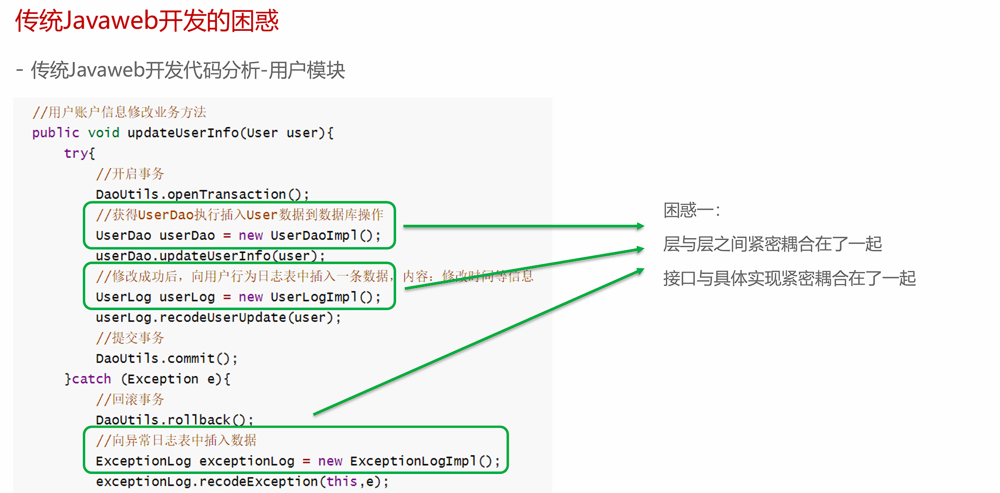
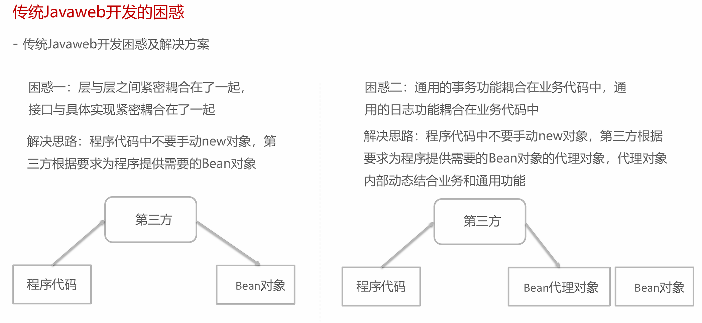
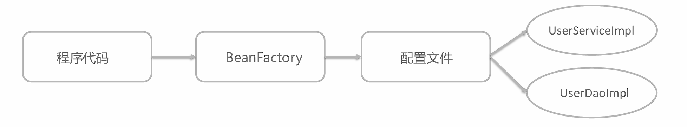
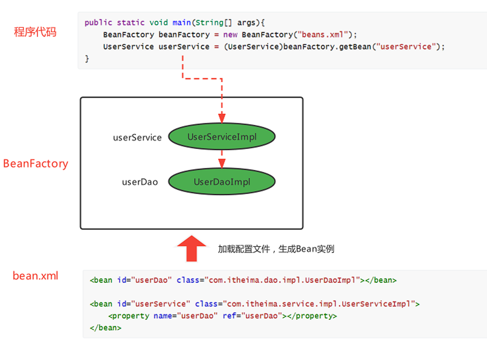

# 概述

!!! tip "Spring 官方资源"
    **官方网站：** [www.spring.io](https://spring.io)  
    **文档地址：** [Spring Framework Documentation](https://docs.spring.io/spring-framework/docs/current/reference/html/)

---

### 传统JavaWeb开发的问题





### IoC、DI和AOP思想提出

#### IoC

IoC思想： Inversion of Control，翻译为“**控制反转**”，强调的是原来在程序中**创建Bean的权利**反转给**第三方**。

!!! example "举例说明"
    原来在程序中手动new UserServiceImpl()，手动new UserDaoImpl()。
    
    而根据IoC思想的指导，使用一个第三方去创建UserServiceImpl对象和UserDaoImpl对象。
    
    这样程序与具体对象就失去的直接联系（解耦）。


1. 谁去充当第三方角色呢？

    工厂设计模式，BeanFactory来充当第三方的角色，来产生Bean实例

2. BeanFactory怎么知道产生哪些Bean实例呢？

    可以使用配置文件配置Bean的基本信息，BeanFactory根据配置文件来生产Bean实例



#### DI

DI（Dependency Injection，依赖注入）是一种设计模式，用于实现控制反转（IoC）。它通过将对象的依赖关系（即所需的其他对象）从内部硬编码到外部配置，从而实现了对象之间的解耦。

上面使用BeanFactory的方式已经实现的"控制反转"，将Bean的创建权交给了BeanFactory，如果我们想将UserDao的创建权也反转给BeanFactory，与此同时UserService内部还需要用到UserDao实例对象，那应该怎样操作呢？

1. 在程序中，通过BeanFactory获得UserService 

2. 在程序中，通过BeanFactory获得UserDao 

3. 在程序中，将UserDao设置给UserService
   
   

将UserDao在**BeanFactory内部**设置给UserService的过程叫做“注入”，而UserService需要依赖UserDao的注入才能正常工作，这个过程叫做“**依赖注入**”




!!!question "IoC 和DI 的关系？"
    首先，IoC和DI是什么：

    - IoC： Inversion of Control，控制反转，将Bean的创建权由原来程序反转给第三方
    - DI：Dependency Injection，依赖注入，某个Bean的完整创建依赖于其他Bean（或普通参数）的注入

    其次，IoC和DI的关系：

    - 第一种观点：IoC强调的是Bean创建权的反转，而DI强调的是Bean的依赖关系，并不相同
    - 第二种观点：IoC强调的是Bean创建权的反转，而DI强调的是通过注入的方式反转Bean的创建权，认为DI是IoC的其中一种实现方式


#### AOP

AOP，Aspect Oriented Programming，**面向切面编程**，是对面向对象编程OOP的升华。OOP是纵向对一个事物的抽象，一个对象包括静态的属性信息，包括动态的方法信息等。而AOP是横向的对不同事物的抽象，属性与属性、方法与方法、对象与对象都可以组成一个切面，而用这种思维去设计编程的方式叫做面向切面编程


---

### BeanFactory快速入门

1. 导入Spring的jar包或Maven坐标；

2. 定义UserService接口及其UserServiceImpl实现类；

3. 创建beans.xml配置文件，将UserServiceImpl的信息配置到该xml中；

4. 编写测试代码，创建BeanFactory，加载配置文件，获取UserService实例对象。
   
<br>

- 导入依赖

```xml
<!--Spring核心-->
<dependency>
    <groupId>org.springframework</groupId>
    <artifactId>spring-context</artifactId>
    <version>5.3.19</version>
</dependency>
```

- 定义接口

```java
public interface UserService {}
public class UserServiceImpl implements UserService {}
```

- 创建beans.xml配置文件，将UserServiceImpl的信息配置到该xml中；

```xml
<!--配置UserServiceImpl-->
<bean class="org.example.service.impl.UserServiceImpl" id="userService"/>
```

- 测试

```java
//创建BeanFactory
 DefaultListableBeanFactory beanFactory = new DefaultListableBeanFactory();
 //创建读取器
XmlBeanDefinitionReader reader = new XmlBeanDefinitionReader(beanFactory);
 //加载配置文件
reader.loadBeanDefinitions("beans.xml");
 //获取Bean实例对象
UserDao userService = (UserService) beanFactory.getBean("userService");
```

<br>

上面使用BeanFactory完成了IoC思想的实现，下面去实现DI依赖注入：

1. 定义UserDao接口及其UserDaoImpl实现类；

2. 修改UserServiceImpl代码，添加一个setUserDao(UserDao userDao)用于接收注入的对象；

3. 修改beans.xml配置文件，在UserDaoImpl的中嵌入配置注入；

4. 修改测试代码，获得UserService时，setUserService方法执行了注入操作。
   
<br>   

- 定义UserDao接口及其UserDaoImpl实现类；

```java
public interface UserDao {}
public class UserDaoImpl implements UserDao {}
```

- 修改UserServiceImpl代码，添加一个setUserDao(UserDao userDao)用于接收注入的对象；

```java
public class UserServiceImpl implements UserService {
    private UserDao userDao;
    //Bean工厂调用该方法，从容器中获取对象作为参数
    public void setUserDao(UserDao userDao){
        System.out.println("调用了setUserDao方法");
        this.userDao = userDao;
    }
}
```

- 修改beans.xml配置文件，在UserDaoImpl的中嵌入配置注入；

```xml
<!--配置UserServiceImpl-->
<bean class="org.example.service.impl.UserServiceImpl" id="userService">
    <property name="userDao" ref="userDao"/>
</bean>

<!--配置UserDaoImpl-->
<bean class="org.example.dao.impl.UserDaoImpl" id="userDao"/>
```

- 测试

```java
//创建BeanFactory
 DefaultListableBeanFactory beanFactory = new DefaultListableBeanFactory();
 //创建读取器
XmlBeanDefinitionReader reader = new XmlBeanDefinitionReader(beanFactory);
 //加载配置文件
reader.loadBeanDefinitions("beans.xml");
 //获取Bean实例对象
UserDao userService = (UserService) beanFactory.getBean("userService");
```


### ApplicationContext快速入门

ApplicationContext 称为Spring容器，内部封装了BeanFactory，比BeanFactory功能更丰富更强大，使用ApplicationContext 进行开发时，xml配置文件的名称习惯写成applicationContext.xml

```java
//创建ApplicationContext,加载配置文件，实例化容器
ApplicationContext applicationContext = new ClassPathxmlApplicationContext("applicationContext.xml");
//根据beanName获得容器中的Bean实例
UserService userService = (UserService) applicationContext.getBean("userService");
System.out.println(userService);
```


### BeanFactory与ApplicationContext的关系

1. BeanFactory是Spring的早期接口，称为Spring的Bean工厂，ApplicationContext是后期更高级接口，称之为Spring 容器；

2. ApplicationContext在BeanFactory基础上对功能进行了扩展，例如：监听功能、国际化功能等。BeanFactory的API更偏向底层，ApplicationContext的API大多数是对这些底层API的封装；

3. Bean创建的主要逻辑和功能都被封装在BeanFactory中，ApplicationContext不仅继承了BeanFactory，而且ApplicationContext内部还维护着BeanFactory的引用，所以，ApplicationContext与BeanFactory**既有继承关系，又有融合关系**。

4. **Bean的初始化时机不同**，原始BeanFactory是在首次调用getBean时才进行Bean的创建，而ApplicationContext则是配置文件加载，容器一创建就将Bean都实例化并初始化好。
   
   
只在Spring基础环境下，常用的三个ApplicationContext作用如下：

| 实现类                                  | 功能描述                             |
| ------------------------------------ |:-------------------------------- |
| `ClassPathXmlApplicationContext`     | 加载类路径下的xml配置的ApplicationContext  |
| `FileSystemXmlApplicationContext`    | 加载磁盘路径下的xml配置的ApplicationContext |
| `AnnotationConfigApplicationContext` | 加载注解配置类的ApplicationContext       |

---

**下一节：** [基于XML的Spring应用](Spring-XML.md)