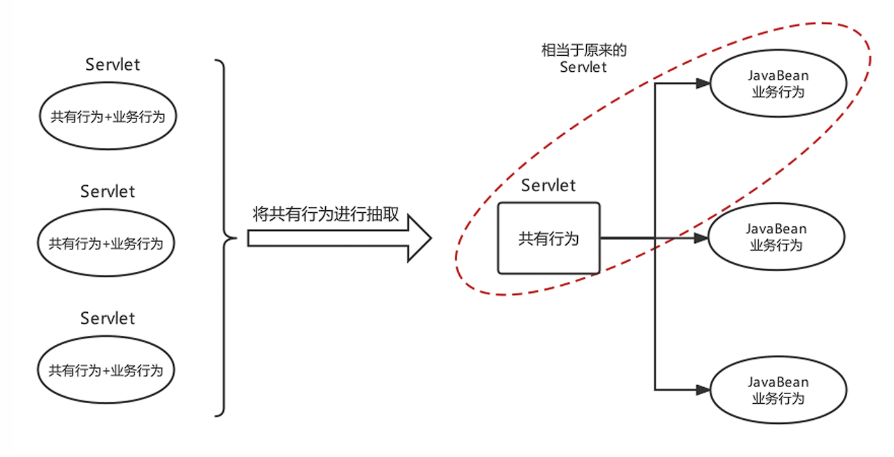

# Spring整合Web环境

## Javaweb三大组件

| 组件         | 作用                      | 特点                                                                                                                         |
| ---------- | ----------------------- | -------------------------------------------------------------------------------------------------------------------------- |
| `Servlet`  | 服务端小程序，负责接收客户端请求并作出响应的  | 单例对象，默认第一次访问创建，可以通过配置指定服务器启动就创建，Servlet创建完毕会执行初始化init方法。每个Servlet有一个service方法，每次访问都会 执行service方法，但是缺点是一个业务功能就需要配置一个Servlet |
| `Filter`   | 过滤器，负责对客户端请求进行过滤操作的     | 单例对象，服务器启动时就创建，对象创建完毕执行init方法，对客户端的请求进行过滤，符合要求的放行，不符合要求的直接响应客户端，执行过滤的核心方法doFilter                                          |
| `Listener` | 监听器，负责对域对象的创建和属性变化进行监听的 | 根据类型和作用不同，又可分为监听域对象创建销毁和域对象属性内容变化的，根据监听的域不同，又可以分为监听Request域的，监听Session域的，监听ServletContext域的                                |


## 整合Web的思路及实现

在进行Java开发时要遵循三层架构+MVC，Spring操作最核心的就是Spring容器，web层需要注入Service，service层需要注入Dao（Mapper），web层使用Servlet技术充当的话，需要在Servlet中获得Spring容器

```java
AnnotationConfigApplicationContext applicationContext = new AnnotationConfigApplicationContext(ApplicationContextConfig.class);
AccountService accountService = (AccountService)applicationContext.getBean("accountService");
accountService.transferMoney("tom","lucy",100);
```

web层代码如果都去加载Spring容器那么就重复了，不能每次想从容器中获得一个Bean都得先创建一次容器。

需要实现如下要求：

- ApplicationContext创建一次，配置类加载一次;

- 最好web服务器启动时，就执行第1步操作，后续直接从容器中获取Bean使用即可;

- ApplicationContext的引用需要在web层任何位置都可以获取到。
  
  

给出解决思路，如下：

- 在ServletContextListener的contextInitialized方法中执行ApplicationContext的创建。或在Servlet的init方法中执行ApplicationContext的创建，并给Servlet的load-on-startup属性一个数字值，确保服务器启动Servlet就创建;

- 将创建好的ApplicationContext存储到`ServletContext`域中，**这样整个web层任何位置就都可以获取到了**

```java
public class SpringContextListener implements ServletContextListener {

    @Override
    public void contextInitialized(ServletContextEvent sce) {
        // 创建Spring的IoC容器
        ApplicationContext context = new ClassPathXmlApplicationContext("applicationContext.xml");
        // 将Spring的IoC容器保存到ServletContext中
        sce.getServletContext().setAttribute("applicationContext", context);

        ServletContextListener.super.contextInitialized(sce);
    }
}
```


## web开发组件spring-web

导入依赖(`pom.xml`)：

```xml
<dependency>
    <groupId>org.springframework</groupId>
    <artifactId>spring-web</artifactId>
    <version>6.1.14</version>
</dependency>
```


配置(`web.xml`)

```xml
<!-- 定义全局参数 -->
<context-param>
    <param-name>contextConfigLocation</param-name>
    <param-value>classpath:applicationContext.xml</param-value>
</context-param>

<!-- 定义Spring监听器 -->
<listener>
    <listener-class>org.springframework.web.context.ContextLoaderListener</listener-class>
</listener>
```


使用spring容器

```java
ServletContext servletContext = getServletContext();
WebApplicationContext app = WebApplicationContextUtils.getWebApplicationContext(servletContext);
```


如果**核心配置类使用的是注解形式**的，那么Spring容器是AnnotationConfigWebApplicationContext，如下配置方式

```java
public class MyAnnotationConfigWebApplicationContext extends AnnotationConfigWebApplicationContext {
    public MyAnnotationConfigWebApplicationContext(){
        super();
        //注册核心配置类
        super.register(ApplicationContextConfig.class);
    }
}
```

`web.xml`

```xml
<context-param>
    <param-name>contextClass</param-name>
    <param-value>com.ysh.web.MyAnnotationConfigWebApplicationContext</param-value>
</context-param>
<listener>
    <listener-class>org.springframework.web.context.ContextLoaderListener</listener-class>
</listener>
```


## web层MVC框架思想与设计思路

原始Javaweb开发中，Servlet充当Controller的角色，Jsp充当View角色，JavaBean充当模型角色，后期Ajax异步流行后，再加上现在前后端分离开发模式成熟后，View就被原始Html+Vue替代。原始Javaweb开发中，Servlet充当Controller有很多弊端，显而易见的有如下几个：

| Servlet作为Controller的问题                   | 解决思路和方案                                       |
| ---------------------------------------- | --------------------------------------------- |
| 每个业务功能请求都对应一个Servlet                     | 根据业务模块去划分Controller                           |
| 每个Servlet的业务操作太繁琐                        | 将通用的行为，功能进行抽取封装                               |
| Servlet获得Spring容器的组件只能通过客户端代码去获取，不能方便的整合 | 通过Spring的扩展点，封装一个框架增强Servlet |


负责共有行为的Servlet称之为前端控制器，负责业务行为的JavaBean称之为控制器Controller



分析前端控制器基本功能如下：

1. 具备可以映射到业务Bean的能力

2. 具备可以解析请求参数、封装实体等共有功能

3. 具备响应视图及响应其他数据的功能
   
   

---

**上一节：** [Spring AOP](Spring-AOP.md)

**下一节：** [Spring MVC](Spring-MVC.md)
