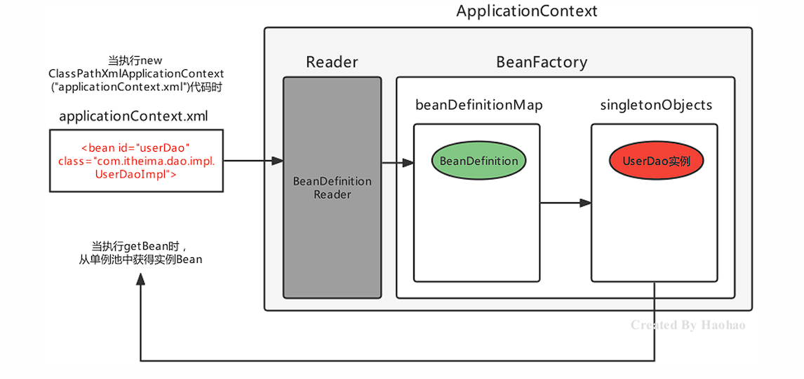
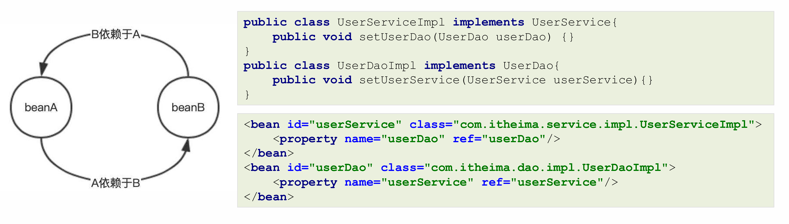
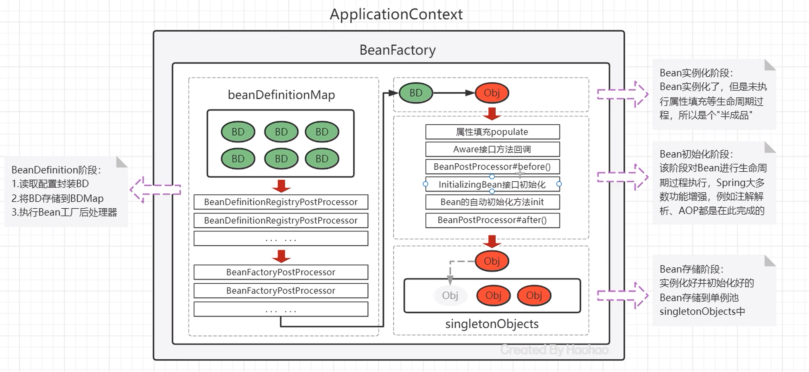

# 基于XML的Spring应用

### 常用配置

Spring开发中主要是对Bean的配置，Bean的常用配置一览如下：

| Xml配置方式                                      | 功能描述                                            |
| -------------------------------------------- | ----------------------------------------------- |
| `<bean id="" class="" />`                    | Bean的id和全限定名配置                                  |
| `<bean name="" />`                           | 通过name设置Bean的别名，通过别名也能直接获取到Bean实例               |
| `<bean scope="" />`                          | Bean的作用范围，BeanFactory作为容器时取值singleton和prototype |
| `<bean lazy-init="" />`                      | Bean的实例化时机，是否延迟加载。BeanFactory作为容器时无效            |
| `<bean init-method="" />`                    | Bean实例化后自动执行的初始化方法，method指定方法名                  |
| `<bean destroy-method="" />`                 | Bean实例销毁前的方法，method指定方法名                        |
| `<bean autowire="byType" />`                 | 设置自动注入模式，常用的有按照类型byType，按照名字byName              |
| `<bean factory-bean="" factory-method="" />` | 指定哪个工厂Bean的哪个方法完成Bean的创建                        |

!!! tip "注意"
    如果不配置id，则Spring会把当前Bean实例的全限定名作为beanName

<br>

#### Bean的别名配置

可以为当前Bean指定多个别名，根据别名也可以获得Bean对象此时多个名称都可以获得UserDaoImpl实例对象

```xml
<bean id="userDao" name="aaa,bbb" class="com.itheima.dao.impl.UserDaoImpl"/>
```

```java
applicationContext.getBean("userDao");
applicationContext.getBean("aaa");
applicationContext.getBean("bbb");
```
<br>

#### Bean的范围配置

默认情况下，<u>单纯的Spring环境</u>Bean的作用范围有两个：singleton和prototype

- singleton：单例，**默认值**，Spring容器创建的时候，就会进行Bean的实例化，并存储到容器内部的单例池中，每次getBean时都是从单例池中获取相同的Bean实例；

- prototype：原型，Spring容器初始化时不会创建Bean实例，当调用getBean时才会实例化Bean，每次getBean都会创建一个新的Bean实例。
  
<br>

#### Bean的延迟加载

当lazy-init设置为true时为延迟加载，也就是当Spring容器创建的时候，不会立即创建Bean实例，等待用到时再创建Bean实例并存储到单例池中去，后续在使用该Bean直接从单例池获取即可，本质上该Bean还是**单例**的

```xml
<bean id="userDao" class="com.itheima.dao.impl.UserDaoImpl" lazy-init="true"/>
```

<br>

#### Bean的初始化和销毁方法配置

Bean在被实例化后，可以执行指定的初始化方法完成一些初始化的操作，Bean在销毁之前也可以执行指定的销毁方法完成一些操作，初始化方法名称和销毁方法名称通过init-method和destroy-method属性指定

```xml
<bean id="userDao" class="com.itheima.dao.impl.UserDaoImpl" init-method="init" destroy-method="destroy"/>
```

```java
 public class UserDaoImpl implements UserDao {
     public UserDaoImpl() { 
         System.out.println("UserDaoImpl创建了..."); 
     }

     public void init(){ 
         System.out.println("初始化方法..."); 
     }

     public void destroy(){ 
         System.out.println("销毁方法..."); 
     }
 }
```


!!!note "扩展"
    除此之外，我们还可以通过实现InitializingBean接口，完成一些Bean的初始化操作，如下：

    ```java
    public class UserDaoImpl implements UserDao, InitializingBean {
        public UserDaoImpl() {
            System.out.println("UserDaoImpl创建了...");
        }

        public void init() {
            System.out.println("初始化方法...");
        }

        public void destroy() {
            System.out.println("销毁方法...");
        }

        //执行时机早于init-method配置的方法
        @Override
        public void afterPropertiesSet() throws Exception {
            System.out.println("InitializingBean...");
        }
    }
    ```

---

<br>

#### Bean的实例化配置

Spring的实例化方式主要如下两种：

- 构造方法实例化：底层通过构造方法对Bean进行实例化

- 工厂方式实例化：底层通过调用自定义的工厂方法对Bean进行实例化


构造方式实例化Bean又分为无参构造方法实例化和有参构造方法实例化，Spring中配置的几乎都是**无参构造**方式

有参构造在实例化Bean时，需要参数的注入，通过标签`<constructor-arg>`嵌入在标签内部提供构造参数，如下:

```java
//有参构造方法
public UserDaoImpl(String name){
 }
```

```xml
<bean id="userDao" class="com.itheima.dao.impl.UserDaoImpl">
 <constructor-arg name="name" value="张三"/>
</bean>
```


工厂方式实例化Bean，又分为如下三种：
   
   - 静态工厂方法实例化Bean 
   
   - 实例工厂方法实例化Bean 
   
   - 实现FactoryBean规范延迟实例化Bean

   
静态工厂方法实例化Bean，其实就是定义一个工厂类，提供一个静态方法用于生产Bean实例，再将该工厂类及其静态方法配置给Spring即可:

```java
//工厂类
public class UserDaoFactoryBean {
    //静态工厂方法
    public static UserDao getUserDao(String name){
        //可以在此编写一些其他逻辑代码
        return new UserDaoImpl();
    }
}
```

```xml
<bean id="userDao" class="com.itheima.factory.UserDaoFactoryBean" factory-method="getUserDao">
 <constructor-arg name="name" value="张三"/>
</bean>
```

!!!tip
    `<constructor-arg>`标签不仅仅是为构造方法传递参数，只要是为了实例化对象而传递的参数都可以通过标签完成，例如上面通过静态工厂方法实例化Bean所传递的参数也是要通过其进行传递的

<br>

实例工厂方法，也就是非静态工厂方法产生Bean实例，与静态工厂方式比较，该方式需要先有工厂对象，在用工厂对象去调用非静态方法，所以在进行配置时，要先配置工厂Bean，再配置目标Bean

```java
//工厂类
public class UserDaoFactoryBean2 {
    //非静态工厂方法
    public UserDao getUserDao(String name){
        //可以在此编写一些其他逻辑代码
        return new UserDaoImpl();
    }
}
```

```xml
<!-- 配置实例工厂Bean -->
<bean id="userDaoFactoryBean2" class="com.itheima.factory.UserDaoFactoryBean2"/>
<bean id="userDao" factory-bean="userDaoFactoryBean2" factory-method="getUserDao">
    <!-- 配置实例工厂Bean的哪个方法作为工厂方法-->
    <constructor-arg name="name" value="haohao"/>
</bean>
```

<br>

Spring提供了FactoryBean的接口规范，FactoryBean接口定义如下：

```java
public interface FactoryBean<T> {
    String OBJECT_TYPE_ATTRIBUTE = “factoryBeanObjectType”;
    T getObject() throws Exception; //获得实例对象方法
    Class<?> getObjectType(); //获得实例对象类型方法
    default boolean isSingleton() {
        return true;
    }
}
```

实现自定义工厂后，配置FactoryBean交由Spring管理即可

```xml
<!--配置自定义工厂-->
<bean class="org.example.factory.MyBeanFactory" id="userDao3"/>
```

!!!info
    通过断点观察发现Spring容器创建时，FactoryBean被实例化了，并存储到了单例池singletonObjects中，但是getObject() 方法尚未被执行，UserDaoImpl也没被实例化，当首次用到UserDaoImpl时，才调用getObject() ，此工厂方式产生的Bean实例不会存储到单例池singletonObjects中，会存储到 factoryBeanObjectCache  **缓存池** 中，并且后期每次使用到userDao都从该缓存池中返回的是同一个userDao实例。

---

<br>

#### Bean的依赖注入配置

Bean的依赖注入有两种方式：

| 注入方式                                                 | 配置方式                                                                                       |
| ---------------------------------------------------- | ------------------------------------------------------------------------------------------ |
| 通过Bean的set方法注入                                       | `<property name="userDao" ref="userDao"/>`<br/>`<property name="user" value="haohao"/>` |
| 通过构造Bean的方法进行注入                                      | `<constructor-arg name="userDao" ref="userDao"/>`<br/>`<constructor-arg name="user" value="haohao"/>` |

!!!info
    其中，ref 是 reference 的缩写形式，翻译为：涉及，参考的意思，用于引用其他Bean的id。value 用于注入普通属性值。


依赖注入的数据类型有如下三种：

- 普通数据类型，例如：`String、int、boolean`等，通过`value`属性指定。

- 引用数据类型，例如：`UserDaoImpl、DataSource`等，通过`ref`属性指定。

- 集合数据类型，例如：`List、Map、Properties`等。

<br>

注入`List<T> `集合– **普通数据**

```java
void setStrList(List<String> strList){
    strList.forEach(str->{
        System.out.println(str);
    });
}
```

```xml
<property name="strList">
    <list>
        <value>haohao</value>
        <value>miaomiao</value>
    </list>
</property>
```
<br>
注入`List <T>`集合–**引用数据**

```java
public void setObjList(List<UserDao> objList){
    objList.forEach(obj->{
        System.out.println(obj);
    });
}
```

```xml
<property name="objList">
    <list>
        <bean class="com.itheima.dao.impl.UserDaoImpl"></bean>
        <bean class="com.itheima.dao.impl.UserDaoImpl"></bean>
        <bean class="com.itheima.dao.impl.UserDaoImpl"></bean>
    </list>
</property>
```

!!!tip
    也可以直接引用容器中存在的Bean，class的值为bean的id

<br>

注入`Set<T> `集合

只需将`<list>`标签改为`<set>`即可

<br>

注入`Map<K,V> `集合

```xml
<!--注入值为字符串的Map集合-->
<property name="valueMap">
<map>
    <entry key="aaa" value="AAA" />
    <entry key="bbb" value="BBB" />
    <entry key="ccc" value="CCC" />
</map>
</property>

<!--注入值为对象的Map集合-->
<property name="objMap">
<map>
    <entry key="ud" value-ref="userDao"/>
    <entry key="ud2" value-ref="userDao2"/>
    <entry key="ud3" value-ref="userDao3"/>
</map>
</property>
```

<br>

注入Properties 键值对

```xml
<property name="properties">
    <props>
        <prop key="xxx">XXX</prop>
        <prop key="yyy">YYY</prop>
    </props>
</property>
```

<br>

**扩展**：自动装配方式

如果被注入的属性类型是Bean引用的话，那么可以在 标签中使用`autowire`属性去配置自动注入方式，属性值有两个：

- `byName`：通过属性名**自动装配**，即去匹配`setXxx`与`id="xxx"（name="xxx"）`是否一致；

- `byType`：通过Bean的类型从容器中匹配，匹配出**多个相同Bean类型时，报错**。

---

#### Spring的其他配置标签

Spring 的 xml 标签大体上分为两类，一种是默认标签，一种是自定义标签

- 默认标签：就是不用额外导入其他命名空间约束的标签，例如`<bean>`标签

- 自定义标签：就是需要额外引入**其他命名空间约束**，并通过前缀引用的标签，例如`<context:propertyplaceholder>`标签

---
`<beans>`标签，除了经常用的做为根标签外，还可以嵌套在根标签内，使用profile属性切换开发环境

```xml
<!-- 配置测试环境下，需要加载的Bean实例-->
<beans profile="test">
</beans>

 <!-- 配置开发环境下，需要加载的Bean实例-->
<beans profile="dev">
</beans>
```

!!!note
    可以使用以下两种方式指定被激活的环境：

    - 使用命令行动态参数，虚拟机参数位置加载`-Dspring.profiles.active=test` 

    - 使用代码的方式设置环境变量`System.setProperty("spring.profiles.active","test")`

---

`<import>`标签，用于导入其他配置文件，项目变大后，就会导致一个配置文件内容过多，可以将一个配置文件根据业务某块进行拆分，拆分后，最终通过标签导入到一个主配置文件中，项目加载主配置文件就连同导入的文件一并加载了

```xml
 <!--导入用户模块配置文件-->
 <import resource="classpath:UserModuleApplicationContext.xml"/>
 <!--导入商品模块配置文件-->
 <import resource="classpath:ProductModuleApplicationContext.xml"/>
```

---

`<alias>`标签是为某个Bean添加别名，与在标签上使用name属性添加别名的方式一样，我们为UserServiceImpl指定四个别名：aaa、bbb、xxx、yyy

```xml
<!--配置UserService-->
<bean id="userService" name="aaa,bbb" class="com.itheima.service.impl.UserServiceImpl">
<property name="userDao" ref="userDao"/>
</bean>
<!--指定别名-->
<alias name="userService" alias="xxx"/>
<alias name="userService" alias="yyy"/>
```

---

Spring的自定义标签需要引入外部的命名空间，并为外部的命名空间指定前缀，使用<前缀:标签> 形式的标签，称之为自定义标签，自定义标签的解析流程也是Spring xml扩展点方式之一

```xml
<!--默认标签-->
<bean id="userDao" class="com.itheima.dao.impl.UserDaoImpl"/>
<!--自定义标签-->
<context:property-placeholder/>
<mvc:annotation-driven/>
<dubbo:application name="application"/>
```

---
<br>

### Spring 的get方法

| 方法定义                                     | 返回值和参数                                                 |
| ---------------------------------------- | ------------------------------------------------------ |
| `Object getBean(String beanName)`        | 根据beanName从容器中获取Bean实例，要求容器中Bean唯一，返回值为Object，需要强转     |
| `T getBean (Class type)`                 | 根据Class类型从容器中获取Bean实例，要求容器中Bean类型唯一，返回值为Class类型实例，无需强转 |
| `T getBean (String beanName，Class type)` | 根据beanName从容器中获得Bean实例，返回值为Class类型实例，无需强转              |

```java
//根据beanName获取容器中的Bean实例，需要手动强转
UserService userService = (UserService) applicationContext.getBean("userService");

//根据Bean类型去容器中匹配对应的Bean实例，如存在多个匹配Bean则报错
UserService userService2 = applicationContext.getBean(UserService.class);

//根据beanName获取容器中的Bean实例，指定Bean的Type类型
UserService userService3 = applicationContext.getBean("userService", UserService.class);
```

---
<br>

### Spring 配置非自定义Bean

以上在xml 中配置的Bean都是自己定义的，例如：UserDaoImpl，UserServiceImpl。但是，在实际开发中有些功能类并不是我们自己定义的，而是使用的**第三方jar包**中的，这些Bean要想让Spring进行管理，也需要对其进行配置


配置非自定义的Bean需要考虑如下两个问题：

- 被配置的Bean的实例化方式是什么？无参构造、有参构造、静态工厂方式还是实例工厂方式；

- 被配置的Bean是否需要注入必要属性。
  
  

!!!example

配置Druid 数据源交由Spring管理
   
    - 导入Druid坐标（Maven）
    
    - 配置数据源

```xml
 <!--配置 DruidDataSource数据源-->
 <bean class="com.alibaba.druid.pool.DruidDataSource">
     <!--配置必要属性-->
     <property name="driverClassName" value="com.mysql.cj.jdbc.Driver"/>
     <property name="url" value="jdbc://localhost:3306/mybatis"/>
     <property name="username" value="root"/>
     <property name="password" value="root"/>
 </bean>
```

配置Connection交由Spring管理

    - Connection的产生是通过DriverManager的静态方法getConnection获取的，所以我们要用静态工厂方式配置

```xml
    <bean id="clazz" class="java.lang.Class" factory-method="forName">
        <constructor-arg name="className" value="com.mysql.cj.jdbc.Driver"/>
    </bean>
    <bean id="connection" class="java.sql.DriverManager" factory-method="getConnection" scope="prototype">
        <constructor-arg name="url" value="jdbc:mysql://localhost:3306/blog"/>
        <constructor-arg name="user" value="root"/>
        <constructor-arg name="password" value="123"/>
    </bean>
```

配置日期对象交由Spring管理

```xml
    <bean id="simpleDateFormat" class="java.text.SimpleDateFormat">
        <constructor-arg name="pattern" value="yyyy-MM-dd HH:mm:ss"/>
    </bean>
    <bean id="date" class="java.util.Date" factory-bean="simpleDateFormat" factory-method="parse">
        <constructor-arg value="2021-01-01 12:00:00"/>
    </bean>
```

---
<br>


### Bean 实例化的基本流程

Spring容器在进行初始化时，会将xml配置的的信息封装成一个`BeanDefinition`对象

所有的BeanDefinition存储到一个名为`beanDefinitionMap`的Map集合中去

Spring框架再对该Map进行遍历，使用反射创建Bean实例对象存储在一个名为`singletonObjects`的Map集合中

当调用getBean方法时则最终从该Map集合中取出Bean实例对象返回。




---
<br>

### Spring的后处理器

Spring的后处理器是Spring对外开发的重要扩展点，允许我们介入到Bean的整个实例化流程中来，以达到**动态注册BeanDefinition，动态修改BeanDefinition，以及动态修改Bean**的作用。

Spring主要有两种后处理器：

- `BeanFactoryPostProcessor`：Bean工厂后处理器，在BeanDefinitionMap填充完毕，**Bean实例化之前**执行；

- `BeanPostProcessor`：Bean后处理器，一般在**Bean实例化之后**，填充到单例池singletonObjects之前执行。

---
Bean工厂后处理器–BeanFactoryPostProcessor 

`BeanFactoryPostProcessor`是一个接口规范，实现了该接口的类只要交由Spring容器管理的话，那么Spring就会回调该接口的方法，用于对`BeanDefinition`注册和修改的功能。

```java
@FunctionalInterface
public interface BeanFactoryPostProcessor {
    void postProcessBeanFactory(ConfigurableListableBeanFactory var1) throws BeansException;
}
```


`postProcessBeanFactory` 参数本质就是 `DefaultListableBeanFactory`

拿到`BeanFactory`的引用，自然就可以对`beanDefinitionMap`中的`BeanDefinition`进行操作

```xml
<bean class="org.example.processor.MyBeanFactoryProcessor"/>
```

```java
public class MyBeanFactoryProcessor implements BeanFactoryPostProcessor {
    @Override
    public void postProcessBeanFactory(ConfigurableListableBeanFactory configurableListableBeanFactory) throws BeansException {
        System.out.println("MyBeanFactoryProcessor 被调用!");

        // 这里可以对BeanFactory做一些操作，比如添加Bean、修改Bean等
        BeanDefinition beanDefinition = configurableListableBeanFactory.getBeanDefinition("userService2");
        beanDefinition.setBeanClassName("org.example.dao.impl.UserDaoImpl");
    }
}
```

!!!note
    Spring 提供了一个BeanFactoryPostProcessor的子接口BeanDefinitionRegistryPostProcessor专门用于注册BeanDefinition操作

    ```java
    public class MyBeanFactoryPostProcessor2 implements BeanDefinitionRegistryPostProcessor {
        @Override
        public void postProcessBeanFactory(ConfigurableListableBeanFactory configurableListableBeanFactory) throws BeansException {}
        @Override
        public void postProcessBeanDefinitionRegistry(BeanDefinitionRegistry beanDefinitionRegistry) throws BeansException {
            BeanDefinition beanDefinition = new RootBeanDefinition();
            beanDefinition.setBeanClassName("com.itheima.dao.UserDaoImpl2");
            beanDefinitionRegistry.registerBeanDefinition("userDao2",beanDefinition);
        }
    }
    ```

---
<br>

#### 案例：使用Spring的BeanFactoryPostProcessor扩展点完成自定义注解扫描

要求如下：

- 自定义@MyComponent注解，使用在类上；

- 使用包扫描器工具 BaseClassScanUtils 完成指定包的类扫描；

- 自定义BeanFactoryPostProcessor完成注解@MyComponent的解析，解析后最终被Spring管理。
  
  

自定义@MyComponent注解，使用在类上

```java
@Target(ElementType.TYPE)
@Retention(RetentionPolicy.RUNTIME)
public @interface MyComponent {
    String value() default "";
}
```

在类上使用@MyComponent

```java
@MyComponent("myBean")
public class TestBean {
}
```

自定义`BeanFactoryPostProcessor`完成注解解析

```java
public class MyComponentFactory implements BeanDefinitionRegistryPostProcessor {
    @Override
    public void postProcessBeanDefinitionRegistry(BeanDefinitionRegistry beanDefinitionRegistry) throws BeansException {
        // 扫描并注册组件
        // 注册组件的BeanDefinition
        Map<String, Class> myComponents = BeanScanUtil.scanMyComponentAnnotation("org.example");
        myComponents.forEach((beanName,clazz)->{
            String className = clazz.getName();
            BeanDefinition beanDefinition = new RootBeanDefinition();
            beanDefinition.setBeanClassName(className);
            beanDefinitionRegistry.registerBeanDefinition(beanName, beanDefinition);
        });
    }

    @Override
    public void postProcessBeanFactory(ConfigurableListableBeanFactory configurableListableBeanFactory) throws BeansException {

    }
}

public class BeanScanUtil {
    //设置资源规则
    private static final String RESOURCE_PATTERN = "/**/*.class";

    public static Map<String, Class> scanMyComponentAnnotation(String basePackage) {

        //创建容器存储使用了指定注解的Bean字节码对象
        Map<String, Class> annotationClassMap = new HashMap<String, Class>();

        //spring工具类，可以获取指定路径下的全部类
        ResourcePatternResolver resourcePatternResolver = new PathMatchingResourcePatternResolver();
        try {
            String pattern = ResourcePatternResolver.CLASSPATH_ALL_URL_PREFIX +
                    ClassUtils.convertClassNameToResourcePath(basePackage) + RESOURCE_PATTERN;
            Resource[] resources = resourcePatternResolver.getResources(pattern);
            //MetadataReader 的工厂类
            MetadataReaderFactory refractory = new CachingMetadataReaderFactory(resourcePatternResolver);
            for (Resource resource : resources) {
                //用于读取类信息
                MetadataReader reader = refractory.getMetadataReader(resource);
                //扫描到的class
                String classname = reader.getClassMetadata().getClassName();
                Class<?> clazz = Class.forName(classname);
                //判断是否属于指定的注解类型
                if (clazz.isAnnotationPresent(MyComponent.class)) {
                    //获得注解对象
                    MyComponent annotation = clazz.getAnnotation(MyComponent.class);
                    //获得属value属性值
                    String beanName = annotation.value();
                    //判断是否为""
                    if (beanName != null && !beanName.equals("")) {
                        //存储到Map中去
                        annotationClassMap.put(beanName, clazz);
                        continue;
                    }
                    //如果没有为"",那就把当前类的类名作为beanName
                    annotationClassMap.put(clazz.getSimpleName(), clazz);
                }
            }
        } catch (Exception exception) {
        }

        return annotationClassMap;
    }
}
```

---

Bean后处理器–BeanPostProcessor

Bean被实例化后，到最终缓存到名为singletonObjects单例池之前，中间会经过Bean的初始化过程

例如：属性的填充、初始方法init的执行等，其中有一个对外进行扩展的点BeanPostProcessor，我们称为Bean后处理。

跟上面的Bean工厂后处理器相似，它也是一个接口，实现了该接口并被容器管理的BeanPostProcessor，会在流程节点上被Spring自动调用。

```java
public interface BeanPostProcessor {
    //在属性注入完毕，init初始化方法执行之前被回调
    @Nullable
    default Object postProcessBeforeInitialization(Object bean, String beanName) throws BeansException {
        return bean;
    }
    //在初始化方法执行之后，被添加到单例池singletonObjects之前被回调
    @Nullable
    default Object postProcessAfterInitialization(Object bean, String beanName) throws BeansException {
        return bean;
    }
}
```

---
<br>

#### 案例：对Bean方法进行执行时间日志增强

要求如下：

- Bean的方法执行之前控制台打印当前时间；

- Bean的方法执行之后控制台打印当前时间。

分析：

- 对方法进行增强主要就是代理模式和包装模式；

- 由于Bean方法不确定，所以使用动态代理在运行期间执行增强操作；

- 在Bean实例创建完毕后，进入到单例池之前，使用Proxy代替真实的目标Bean
  
  

编写BeanPostProcessor，增强逻辑编写在after方法中：

```java
public class TImeLogBeanPostProcessor implements BeanPostProcessor {
    @Override
    public Object postProcessAfterInitialization(Object bean, String beanName) throws BeansException {
        // 使用动态代理对目标BEan进行增强，返回proxy对象
        return Proxy.newProxyInstance(
                bean.getClass().getClassLoader(),
                bean.getClass().getInterfaces(),
                (proxy, method, args) -> {
                    // 输出开始时间
                    System.out.println("执行方法：" + method.getName() + "--开始时间：" + new Date());
                    // 执行目标方法
                    Object result = method.invoke(bean, args);
                    // 输出结束时间
                    System.out.println("方法结束：" + method.getName() + "--结束时间：" + new Date());
                    return result;
                }
        );
    }
}
```

---
<br>


### Spring Bean的生命周期

Spring Bean的生命周期是从 Bean 实例化之后，即通过反射创建出对象之后，到Bean成为一个完整对象，最终存储到单例池中，这个过程被称为Spring Bean的生命周期。


Spring Bean的生命周期大体上分为三个阶段：

- Bean的**实例化**阶段：Spring框架会取出BeanDefinition的信息进行判断当前Bean的范围是否是singleton的，是否延迟加载的，是否FactoryBean等，最终将一个普通的singleton的Bean通过反射进行实例化；

- Bean的**初始化**阶段：Bean创建之后还仅仅是个"半成品"，还需要对Bean实例的属性进行填充、执行一些Aware接口方法、执行BeanPostProcessor方法、执行InitializingBean接口的初始化方法、执行自定义初始化init方法等。该阶段是Spring最具技术含量和复杂度的阶段，Aop增强功能，后面要学习的Spring的注解功能等、spring高频面试题Bean的循环引用问题都是在这个阶段体现的；

- Bean的**完成**阶段：经过初始化阶段，Bean就成为了一个完整的Spring Bean，被存储到单例池singletonObjects中去了，即完成了Spring Bean的整个生命周期。
  
  

Spring Bean的初始化过程涉及如下几个过程：

- Bean实例的属性填充

- Aware接口属性注入

- BeanPostProcessor的before()方法回调

- InitializingBean接口的初始化方法回调

- 自定义初始化方法init回调

- BeanPostProcessor的after()方法回调


---
<br>


#### Bean实例属性填充

BeanDefinition 中有对当前Bean实体的注入信息通过属性`propertyValues`进行了存储


Spring在进行属性注入时，会分为如下几种情况：

- 注入普通属性，String、int或存储基本类型的集合时，直接通过set方法的反射设置进去；

- 注入单向对象引用属性时，从容器中getBean获取后通过set方法反射设置进去，如果容器中没有，则先创建被注入对象Bean实例（完成整个生命周期）后，再进行注入操作；

- 注入双向对象引用属性时，就比较复杂了，涉及了循环引用（**循环依赖**）问题，下面会详细阐述解决方案。
  
  

多个实体之间相互依赖并形成闭环的情况就叫做"循环依赖"，也叫做"循环引用":




##### 解决循环引用

Spring提供了**三级缓存**存储完整Bean实例和<u>半成品</u>Bean实例，用于解决循环引用问题

在`DefaultListableBeanFactory`的上四级父类`DefaultSingletonBeanRegistry`中提供如下三个Map：

```java
public class DefaultSingletonBeanRegistry ... {
     //1、最终存储单例Bean成品的容器，即实例化和初始化都完成的Bean，称之为"一级缓存"
     Map<String, Object> singletonObjects = new ConcurrentHashMap(256);

     //2、早期Bean单例池，缓存半成品对象，且当前对象已经被其他对象引用了，称之为"二级缓存"
     Map<String, Object> earlySingletonObjects = new ConcurrentHashMap(16);

     //3、单例Bean的工厂池，缓存半成品对象，对象未被引用，使用时再通过工厂创建Bean，称之为"三级缓存"
     Map<String, ObjectFactory<?>> singletonFactories = new HashMap(16);
 }

```


UserService和UserDao循环依赖的过程结合上述三级缓存描述如下：

- UserService 实例化对象，但尚未初始化，将UserService存储到三级缓存；

- UserService 属性注入，需要UserDao，从缓存中获取，没有UserDao；

- UserDao实例化对象，但尚未初始化，将UserDao存储到到三级缓存；

- UserDao属性注入，需要UserService，从三级缓存获取UserService，UserService从三级缓存移入二级缓存；

- UserDao执行其他生命周期过程，最终成为一个完成Bean，存储到一级缓存，删除二三级缓存；

- UserService 注入UserDao；

- UserService执行其他生命周期过程，最终成为一个完成Bean，存储到一级缓存，删除二三级缓存。
  
---
<br>

#### 常用的Aware接口

Aware接口是一种**框架辅助属性注入**的一种思想，其他框架中也可以看到类似的接口。框架具备高度封装性，我们接触到的一般都是业务代码，一个**底层功能API**不能轻易的获取到，但是这不意味着永远用不到这些对象，如果用到了，就可以使用框架提供的类似Aware的接口，让框架为我们注入该对象。

| Aware接口                   | 回调接口                                                           | 作用                                       |
| ------------------------- | -------------------------------------------------------------- | ---------------------------------------- |
| `ServletContextAware`     | `setServletContext(ServletContext context)`                    | Spring框架回调方法注入ServletContext对象，web环境下才生效 |
| `BeanFactoryAware`        | `setBeanFactory(BeanFactory factory)`                          | Spring框架回调方法注入beanFactory对象              |
| `BeanNameAware`           | `setBeanName(String beanName)`                                 | Spring框架回调方法注入当前Bean在容器中的beanName        |
| `ApplicationContextAware` | `setApplicationContext(ApplicationContext applicationContext)` | Spring框架回调方法注入applicationContext对象       |


#### 一图总结




### 整合第三方框架

xml整合第三方框架有两种整合方案：

1. 不需要自定义名空间，不需要使用Spring的配置文件配置第三方框架本身内容，例如：MyBatis；

2. 需要引入第三方框架命名空间，需要使用Spring的配置文件配置第三方框架本身内容，例如：Dubbo。
   


#### 整合MyBatis

MyBatis提供了mybatis-spring.jar专门用于两大框架的整合。

Spring整合MyBatis的步骤如下：

- 导入MyBatis整合Spring的相关坐标；

- 编写Mapper和Mapper.xml；

- 配置SqlSessionFactoryBean和MapperScannerConfigurer；

- 编写测试代码

```xml
    <!--配置数据源-->
    <bean id="dataSource" class="com.alibaba.druid.pool.DruidDataSource">
        <property name="url" value="jdbc:mysql://localhost:3306/mybatis"></property>
        <property name="username" value="root"></property>
        <property name="password" value="root"></property>
    </bean>
    <!--配置SqlSessionFactoryBean-->
    <bean class="org.mybatis.spring.SqlSessionFactoryBean">
        <property name="dataSource" ref="dataSource"></property>
    </bean>
    <!--配置Mapper包扫描,会自动将mapper注册为BeanDefinition-->
    <bean class="org.mybatis.spring.mapper.MapperScannerConfigurer">
        <property name="basePackage" value="com.itheima.dao"></property>
    </bean>
```

<br>

Spring整合MyBatis的原理剖析

整合包里提供了一个SqlSessionFactoryBean和一个扫描Mapper的配置对象，SqlSessionFactoryBean一旦被实例化，就开始扫描Mapper并通过动态代理产生Mapper的实现类存储到Spring容器中。相关的有如下四个类：

- SqlSessionFactoryBean：需要进行配置，用于提供SqlSessionFactory；

- MapperScannerConfigurer：需要进行配置，用于扫描指定mapper注册BeanDefinition；

- MapperFactoryBean：Mapper的FactoryBean，获得指定Mapper时调用getObject方法；

- ClassPathMapperScanner：definition.setAutowireMode(2) 修改了自动注入状态，所以MapperFactoryBean中的setSqlSessionFactory会自动注入进去。

> PS：autowireMode取值：1是根据名称自动装配，2是根据类型自动装配


配置SqlSessionFactoryBean作用是向容器中提供SqlSessionFactory，SqlSessionFactoryBean实现了FactoryBean和InitializingBean两个接口，所以会自动执行getObject() 和afterPropertiesSet()方法

```java
SqlSessionFactoryBean implements FactoryBean<SqlSessionFactory>, InitializingBean{
    public void afterPropertiesSet() throws Exception {
        //创建SqlSessionFactory对象
        this.sqlSessionFactory = this.buildSqlSessionFactory();
    }
    public SqlSessionFactory getObject() throws Exception {
        return this.sqlSessionFactory;
    }
}
```


配置MapperScannerConfigurer作用是扫描Mapper，向容器中注册Mapper对应的MapperFactoryBean，MapperScannerConfigurer实现了BeanDefinitionRegistryPostProcessor和InitializingBean两个接口，会在postProcessBeanDefinitionRegistry方法中向容器中注册MapperFactoryBean

```java
class MapperScannerConfigurer implements BeanDefinitionRegistryPostProcessor, InitializingBean{
    public void postProcessBeanDefinitionRegistry(BeanDefinitionRegistry registry) {
        ClassPathMapperScanner scanner = new ClassPathMapperScanner(registry);
    }
}
```

---
<br>

#### 其他框架

以Spring的context 命名空间为例，该方式是命名空间扩展方式。

需求：加载外部properties文件，将键值对存储在Spring容器中

```properties
jdbc.url=jdbc:mysql://localhost:3306/mybatis
jdbc.username=root
jdbc.password=root
```

引入context命名空间，在使用context命名空间的标签，使用SpEL表达式在xml或注解中根据key获得value

```xml
<beans xmlns="http://www.springframework.org/schema/beans"
       xmlns:context="http://www.springframework.org/schema/context"
       xmlns:xsi="http://www.w3.org/2001/XMLSchema-instance"
       xsi:schemaLocation="http://www.springframework.org/schema/beans
    http://www.springframework.org/schema/beans/spring-beans.xsd
    http://www.springframework.org/schema/context
    http://www.springframework.org/schema/context/spring-context.xsd">

    <context:property-placeholder location="classpath:jdbc.properties"/>
    <bean id="dataSource" class="com.alibaba.druid.pool.DruidDataSource">
        <property name="url" value="${jdbc.url}"></property>
        <property name="username" value="${jdbc.username}"></property>
        <property name="password" value="${jdbc.password}"></property>
    </bean>
</beans>
```


---
<br>

#### 某一个框架与Spring的集成开发

步骤分析：

1. 确定命名空间名称、schema虚拟路径、标签名称；
2. 编写schema约束文件`xxx-annotation.xsd`
3. 在类加载路径下创建META目录，编写约束映射文件`spring.schemas`和处理器映射文件`spring.handlers` 
4. 编写命名空间处理器`XXXNamespaceHandler`，在`init`方法中注册`XXXBeanDefinitionParser`
5.  编写标签的解析器`XXXBeanDefinitionParser`，在parse方法中注册`XXXBeanPostProcessor` 
6. 编写`XXXBeanPostProcessor` 


​	==========以上五步是框架开发者要做的，下面是框架使用者要做的=========== 

1. 在`applicationContext.xml`配置文件中引入命名空间

2. 在`applicationContext.xml`配置文件中使用自定义的标签

   
---

**上一节：** [概述](Spring-Overview.md)

**下一节：** [基于注解的Spring应用](Spring-Annotation.md)