[Elasticsearch：官方分布式搜索和分析引擎 | Elastic](https://www.elastic.co/cn/elasticsearch)


数据库的模糊搜索功能单一，匹配条件非常苛刻，必须恰好包含用户搜索的关键字。而在搜索引擎中，用户输入出现个别错字，或者用拼音搜索、同义词搜索都能正确匹配到数据。


在面临海量数据的搜索，或者有一些复杂搜索需求的时候，推荐使用专门的搜索引擎来实现搜索功能。


Elasticsearch是由elastic公司开发的一套搜索引擎技术，它是elastic技术栈中的一部分。完整的技术栈包括：

- Elasticsearch：用于数据存储、计算和搜索
- Logstash/Beats：用于数据收集
- Kibana：用于数据可视化

整套技术栈被称为ELK，经常用来做日志收集、系统监控和状态分析等等


## 安装

1.docker安装elasticsearch

```bash
docker run -d \
  --name es \
  -e "ES_JAVA_OPTS=-Xms512m -Xmx512m" \
  -e "discovery.type=single-node" \
  -v es-data:/usr/share/elasticsearch/data \
  -v es-plugins:/usr/share/elasticsearch/plugins \
  --privileged \
  --network work \
  -p 9200:9200 \
  -p 9300:9300 \
  elasticsearch:7.12.1
```
!!!note
    -e "ES_JAVA_OPTS=-Xms512m -Xmx512m" 设置Java虚拟机内存

    -e "discovery.type=single-node" 设置单机模式

2.docker安装Kibana

```bash
docker run -d \
--name kibana \
-e ELASTICSEARCH_HOSTS=http://es:9200 \
--network=work \
-p 5601:5601  \
kibana:7.12.1
```
!!!tip
    -e ELASTICSEARCH_HOSTS=http://es:9200 设置elasticsearch地址，同一docker网络中可使用容器名

    访问5601端口即可进入图形化界面

<br>

---

## 初识ES

### 倒排索引

elasticsearch之所以有如此高性能的搜索表现，正是因为底层的倒排索引技术。

**倒排索引**的概念是基于MySQL这样的**正向索引**而言的。

!!!info
    根据id精确匹配时，可以走索引，查询效率较高。而当搜索条件为模糊匹配时，由于索引无法生效，导致从索引查询退化为全表扫描，效率很差。
    因此，正向索引适合于根据索引字段的精确搜索，不适合基于部分词条的模糊匹配。


倒排索引中有两个非常重要的概念：

- 文档（`Document`）：用来搜索的数据，其中的每一条数据就是一个文档。例如一个网页、一个商品信息
- 词条（`Term`）：对文档数据或用户搜索数据，利用某种算法分词，得到的具备含义的词语就是词条。例如：我是中国人，就可以分为：我、是、中国人、中国、国人这样的几个词条


**创建倒排索引**是对正向索引的一种特殊处理和应用，流程如下：

- 将每一个文档的数据利用**分词算法**根据语义拆分，得到一个个词条
- 创建表，每行数据包括词条、词条所在文档id、位置等信息
- 因为词条唯一性，可以给词条创建**正向**索引

此时形成的这张以词条为索引的表，就是倒排索引表，两者对比如下：

**正向索引**

| **id（索引）** | **title**      | **price** |
| :------------- | :------------- | :-------- |
| 1              | 小米手机       | 3499      |
| 2              | 华为手机       | 4999      |
| 3              | 华为小米充电器 | 49        |
| 4              | 小米手环       | 49        |
| ...            | ...            | ...       |

**倒排索引**

| **词条（索引）** | **文档id** |
| :--------------- | :--------- |
| 小米             | 1，3，4    |
| 手机             | 1，2       |
| 华为             | 2，3       |
| 充电器           | 3          |
| 手环             | 4          |

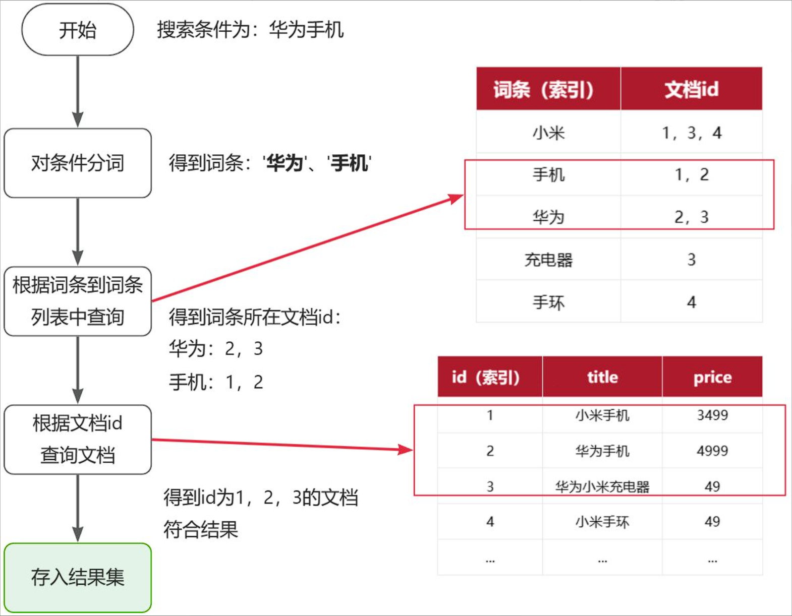


**正向索引**：

- 优点： 
    - 可以给多个字段创建索引
    - 根据索引字段搜索、排序速度非常快
- 缺点： 
    - 根据非索引字段，或者索引字段中的部分词条查找时，只能全表扫描。

<br>

**倒排索引**：

- 优点： 
    - 根据词条搜索、模糊搜索时，速度非常快
- 缺点： 
    - 只能给词条创建索引，而不是字段
    - 无法根据字段做排序

<br>

### IK分词器

Elasticsearch的关键就是倒排索引，而倒排索引依赖于对文档内容的分词，而分词则需要高效、精准的分词算法，IK分词器就是这样一个中文分词算法。


#### 安装

**方案一**：在线安装

运行一个命令即可：

```Shell
docker exec -it es容器名 ./bin/elasticsearch-plugin  install https://release.infinilabs.com/analysis-ik/stable/elasticsearch-analysis-ik-7.12.1.zip
```

> [GitHub - infinilabs/analysis-ik: 🚌 The IK Analysis plugin integrates Lucene IK analyzer into Elasticsearch and OpenSearch, support customized dictionary.](https://github.com/infinilabs/analysis-ik/tree/master?tab=readme-ov-file)

然后重启es容器：

```Shell
docker restart es容器名
```

**方案二**：离线安装

查看之前安装的Elasticsearch容器的plugins数据卷目录：

```Shell
docker volume inspect es-plugins
```

将插件复制到容器挂载的目录，重启容器即可


#### 使用

IK分词器包含两种模式：

-  `ik_smart`：智能语义切分 
-  `ik_max_word`：最细粒度切分 


我们在Kibana的DevTools上来测试分词器，首先测试Elasticsearch官方提供的标准分词器：

```JSON
POST /_analyze
{
  "analyzer": "standard",
  "text": "黑马程序员学习java太棒了"
}
```

> 标准分词器适用于英文分词，中文分词效果不好
>
> 建议使用`ik_smart`模式


##### 拓展词典

随着互联网的发展，“造词运动”也越发的频繁。出现了很多新的词语，在原有的词汇列表中并不存在。

所以要想正确分词，IK分词器的词库也需要不断的更新，IK分词器提供了扩展词汇的功能。

1）打开IK分词器config目录：

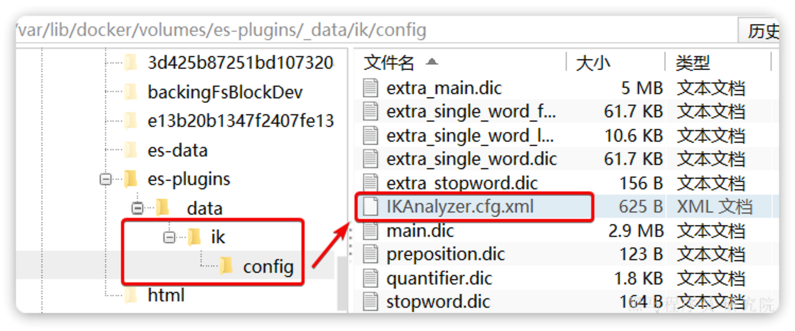

> 注意，如果采用在线安装的通过，默认是没有config目录的


2）在IKAnalyzer.cfg.xml配置文件内容添加：

```XML
<?xml version="1.0" encoding="UTF-8"?>
<!DOCTYPE properties SYSTEM "http://java.sun.com/dtd/properties.dtd">
<properties>
        <comment>IK Analyzer 扩展配置</comment>
        <!--用户可以在这里配置自己的扩展字典 *** 添加扩展词典-->
        <entry key="ext_dict">ext.dic</entry>
        <entry key="ext_stopwords"></entry>		<!-- 停用词配置 -->
        <entry key="remote_ext_dict"></entry>    <!-- 远程词典 -->
</properties>
```

3）在IK分词器的config目录新建一个 `ext.dic`，可以参考config目录下复制一个配置文件进行修改

```Plain
传智播客
泰裤辣
```


#### 基础概念

##### 文档和字段

elasticsearch是面向**文档（Document）**存储的，可以是数据库中的一条商品数据，一个订单信息。


文档数据会被序列化为`json`格式后存储在`elasticsearch`，因此，原本数据库中的一行数据就是ES中的一个JSON文档；而数据库中每行数据都包含很多列，这些列就转换为JSON文档中的**字段（Field）**。

```json
{
    "id": 1,
    "title": "小米手机",
    "price": 3499
}
{
    "id": 2,
    "title": "华为手机",
    "price": 4999
}
{
    "id": 3,
    "title": "华为小米充电器",
    "price": 49
}
...

```


##### 索引和映射

随着业务发展，需要在es中存储的文档也会越来越多，比如有商品的文档、用户的文档、订单文档等等,所有文档都散乱存放显然非常混乱，也不方便管理。

因此，我们要将类型相同的文档集中在一起管理，称为**索引（Index）**

> 索引类似于数据库中“表”的概念


数据库的表会有约束信息，用来定义表的结构、字段的名称、类型等信息。因此，索引库中就有**映射（mapping）**，是索引中文档的字段约束信息，类似表的结构约束。


MySQL 与 Elasticsearch

| **MySQL** | **Elasticsearch** | **说明**                                                     |
| :-------- | :---------------- | :----------------------------------------------------------- |
| Table     | Index             | 索引(index)，就是文档的集合，类似数据库的表(table)           |
| Row       | Document          | 文档（Document），就是一条条的数据，类似数据库中的行（Row），文档都是JSON格式 |
| Column    | Field             | 字段（Field），就是JSON文档中的字段，类似数据库中的列（Column） |
| Schema    | Mapping           | Mapping（映射）是索引中文档的约束，例如字段类型约束。类似数据库的表结构（Schema） |
| SQL       | DSL               | DSL是elasticsearch提供的JSON风格的请求语句，用来操作elasticsearch，实现CRUD |

在企业中，往往是两者结合使用：

- 对安全性要求较高的写操作，使用mysql实现
- 对查询性能要求较高的搜索需求，使用elasticsearch实现
- 两者再基于某种方式，实现数据的同步，保证一致性

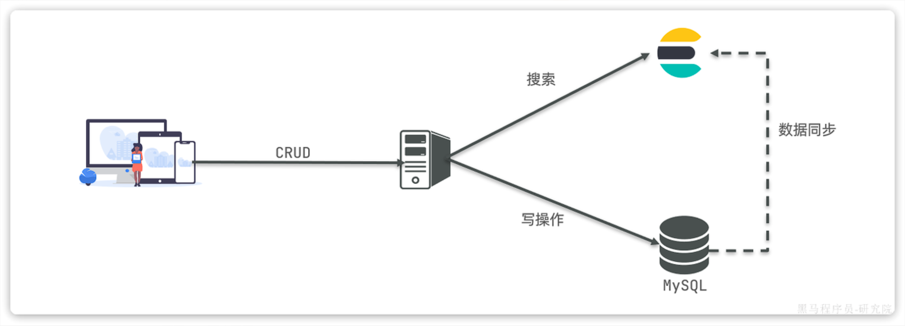


### 索引库操作

#### Mapping映射属性

Mapping是对索引库中文档的约束，常见的Mapping属性包括：

- `type`：字段数据类型，常见的简单类型有： 
  - 字符串：`text`（可分词的文本）、`keyword`（精确值，不应分词，例如：品牌、国家、ip地址）
  - 数值：`long`、`integer`、`short`、`byte`、`double`、`float`、
  - 布尔：`boolean`
  - 日期：`date`
  - 对象：`object`
- `index`：是否创建索引（是否参与搜索），默认为`true`
- `analyzer`：使用哪种分词器
- `properties`：该字段的子字段


例如下面的json文档：

```JSON
{
    "age": 21,
    "weight": 52.1,
    "isMarried": false,
    "info": "黑马程序员Java讲师",
    "email": "zy@itcast.cn",
    "score": [99.1, 99.5, 98.9],
    "name": {
        "firstName": "云",
        "lastName": "赵"
    }
}
```

对应的每个字段映射（Mapping）：

| **字段名** | **字段类型** |    **类型说明**    | **是否**参与搜索 | **是否**参与分词 | **分词器** |
| :--------: | :----------: | :----------------: | :--------------: | :--------------: | :--------: |
|    age     |  `integer`   |        整数        |        ✔         |        ❌         |     ——     |
|   weight   |   `float`    |       浮点数       |        ✔         |        ❌         |     ——     |
| isMarried  |  `boolean`   |        布尔        |        ✔         |        ❌         |     ——     |
|    info    |    `text`    | 字符串，但需要分词 |        ✔         |        ✔         |     IK     |
|   email    |  `keyword`   | 字符串，但是不分词 |        ❌         |        ❌         |     ——     |
|   score    |   `float`    | 只看数组中元素类型 |        ✔         |        ❌         |     ——     |
|    name    |  `keyword`   | 字符串，但是不分词 |        ✔         |        ❌         |     ——     |


#### CRUD

- 创建索引库和mapping

```json
PUT /<索引库名称>
{
  "mappings": {
    "properties": {
      "<字段名>":{
        "type": "text",
        "analyzer": "ik_smart"
      },
      "<字段名2>":{
        "type": "keyword",
        "index": "false"
      },
      "<字段名3>":{
        "properties": {
          "<子字段>": {
            "type": "keyword"
          }
        }
      },
      // ...略
    }
  }
}
```


- 查询索引库

```
GET /索引库名
```


- 删除索引库

```
DELETE /索引库名
```


- 修改索引库

倒排索引结构虽然不复杂，但是一旦数据结构改变（比如改变了分词器），就需要重新创建倒排索引，这简直是灾难。因此索引库**一旦创建，无法修改mapping**。

虽然无法修改mapping中已有的字段，但是却允许添加新的字段到mapping中，因为不会对倒排索引产生影响。因此修改索引库能做的就是向索引库中添加新字段，或者更新索引库的基础属性

```
PUT /索引库名/_mapping
{
  "properties": {
    "<新字段名>":{
      "type": "integer"
    }
  }
}
```


### 文档操作

#### CRUD

- 新增文档

```json
POST /索引库名/_doc/文档id
{
    "字段1": "值1",
    "字段2": "值2",
    "字段3": {
        "子属性1": "值3",
        "子属性2": "值4"
    }
}
```

eg.

```json
POST /heima/_doc/1
{
    "info": "黑马程序员Java讲师",
    "email": "zy@itcast.cn",
    "name": {
        "firstName": "云",
        "lastName": "赵"
    }
}
```


- 查询文档

```json
GET /索引库名/_doc/文档id
```


- 删除文档

```json
DELETE /索引库名/_doc/文档id
```


- 修改文档

修改有两种方式：

​	全量修改：直接覆盖原来的文档

​	局部修改：修改文档中的部分字段


1. 全量修改

全量修改是覆盖原来的文档，其本质是两步操作：

- 根据指定的id删除文档
- 新增一个相同id的文档

> **注意**：如果根据id删除时，id不存在，第二步的新增也会执行，也就从修改变成了新增操作了。

```json
PUT /{索引库名}/_doc/文档id
{
    "字段1": "值1",
    "字段2": "值2",
    // ... 略
}
```


2. 局部修改

局部修改是只修改指定id匹配的文档中的部分字段。

```json
POST /{索引库名}/_update/文档id
{
    "doc": {
         "字段名": "新的值",
    }
}
```

> 请求方式不同，路径中的`_doc`变成了`_update`


#### 批处理

批处理采用POST请求，基本语法如下：

```json
POST _bulk
{ "index" : { "_index" : "test", "_id" : "1" } }
{ "field1" : "value1" }
{ "delete" : { "_index" : "test", "_id" : "2" } }
{ "create" : { "_index" : "test", "_id" : "3" } }
{ "field1" : "value3" }
{ "update" : {"_id" : "1", "_index" : "test"} }
{ "doc" : {"field2" : "value2"} }
```

- `index`代表新增操作
  - `_index`：指定索引库名
  - `_id`指定要操作的文档id
  - `{ "field1" : "value1" }`：则是要新增的文档内容
- `delete`代表删除操作
  - `_index`：指定索引库名
  - `_id`指定要操作的文档id
- `update`代表更新操作
  - `_index`：指定索引库名
  - `_id`指定要操作的文档id
  - `{ "doc" : {"field2" : "value2"} }`：要更新的文档字段


### JavaRestClient

#### RestAPI

ES官方提供了各种不同语言的客户端，用来操作ES。这些客户端的本质就是组装DSL语句，通过http请求发送给ES。

官方文档地址：

https://www.elastic.co/guide/en/elasticsearch/client/index.html

由于ES目前最新版本是8.8，提供了全新版本的客户端，老版本的客户端已经被标记为过时。而我们采用的是7.12版本，因此只能使用老版本客户端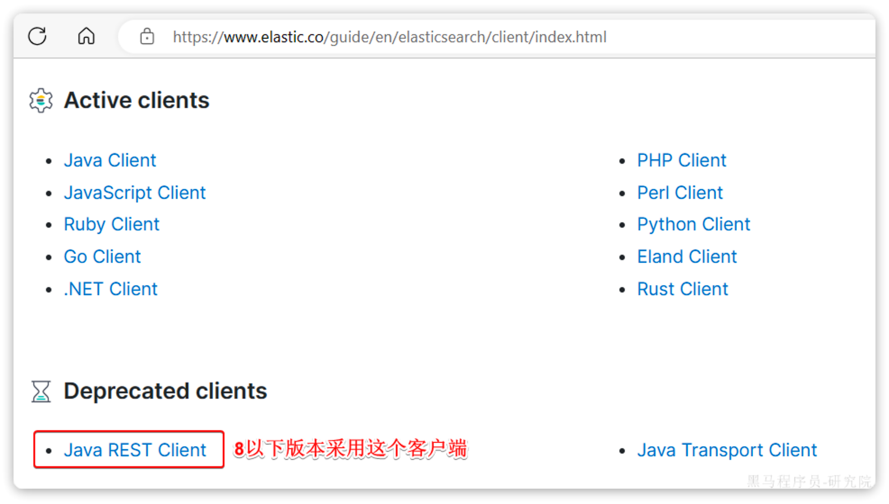


#### 初始化RestClient

在elasticsearch提供的API中，与elasticsearch一切交互都封装在一个名为`RestHighLevelClient`的类中，必须先完成这个对象的初始化，建立与elasticsearch的连接。

1. 引入`es`的`RestHighLevelClient`依赖：

```XML
<dependency>
   <groupId>org.elasticsearch.client</groupId>
   <artifactId>elasticsearch-rest-high-level-client</artifactId>
</dependency>
```

2. 因为SpringBoot默认的ES版本是`7.17.10`，所以我们需要覆盖默认的ES版本：

```XML
  <properties>
      <maven.compiler.source>11</maven.compiler.source>
      <maven.compiler.target>11</maven.compiler.target>
      <elasticsearch.version>7.12.1</elasticsearch.version>
  </properties>
```

3. 初始化RestHighLevelClient：

```Java
RestHighLevelClient client = new RestHighLevelClient(RestClient.builder(
        HttpHost.create("Localhost:9200")
));
```


#### 索引库操作

- 创建索引库

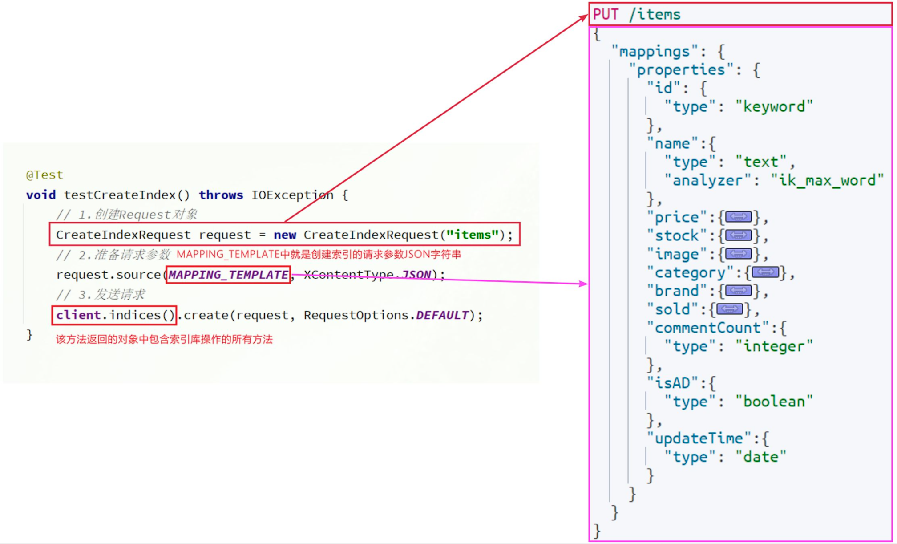


- 删除索引库

```java
@Test
void testDeleteIndex() throws IOException {
    // 1.创建Request对象
    DeleteIndexRequest request = new DeleteIndexRequest("items");
    // 2.发送请求
    client.indices().delete(request, RequestOptions.DEFAULT);
}
```


- 查询索引库

```java
@Test
void testGetIndex() throws IOException {
    GetIndexRequest request = new GetIndexRequest("items");
    boolean exists = client.indices().exists(request, RequestOptions.DEFAULT);
    System.out.println("exists = " + exists);
}
```


JavaRestClient操作elasticsearch的流程基本类似。核心是`client.indices()`方法来获取索引库的操作对象。

索引库操作的基本步骤：

- 初始化`RestHighLevelClient`
- 创建XxxIndexRequest。XXX是`Create`、`Get`、`Delete`
- 准备请求参数（ `Create`时需要，其它是无参，可以省略）
- 发送请求。调用`RestHighLevelClient#indices().xxx()`方法，xxx是`create`、`exists`、`delete`


#### 文档操作

- 新增文档

```java
@Test
void testAddDocument() throws IOException {
    // 1.根据id查询商品数据
    Item item = itemService.getById(100002644680L);
    // 2.转换为文档类型
    ItemDoc itemDoc = BeanUtil.copyProperties(item, ItemDoc.class);
    // 3.将ItemDTO转json
    String doc = JSONUtil.toJsonStr(itemDoc);

    // 1.准备Request对象
    IndexRequest request = new IndexRequest("items").id(itemDoc.getId());
    // 2.准备Json文档
    request.source(doc, XContentType.JSON);
    // 3.发送请求
    client.index(request, RequestOptions.DEFAULT);
}
```


- 删除文档

```java
@Test
void testDeleteDocument() throws IOException {
    // 1.准备Request，两个参数，第一个是索引库名，第二个是文档id
    DeleteRequest request = new DeleteRequest("item", "100002644680");
    // 2.发送请求
    client.delete(request, RequestOptions.DEFAULT);
}
```


- 查询文档

```java
@Test
void testGetDocumentById() throws IOException {
    // 1.准备Request对象
    GetRequest request = new GetRequest("items").id("100002644680");
    // 2.发送请求
    GetResponse response = client.get(request, RequestOptions.DEFAULT);
    // 3.获取响应结果中的source 
    String json = response.getSourceAsString();
    
    ItemDoc itemDoc = JSONUtil.toBean(json, ItemDoc.class);
    System.out.println("itemDoc= " + ItemDoc);
}
```

> 与其它操作相比，多了一步解析响应的操作


- 更新文档

在RestClient的API中，**全量修改**与新增的API完全一致，判断依据是ID：

​	如果新增时，ID已经存在，则修改

​	如果新增时，ID不存在，则新增


**局部更新**

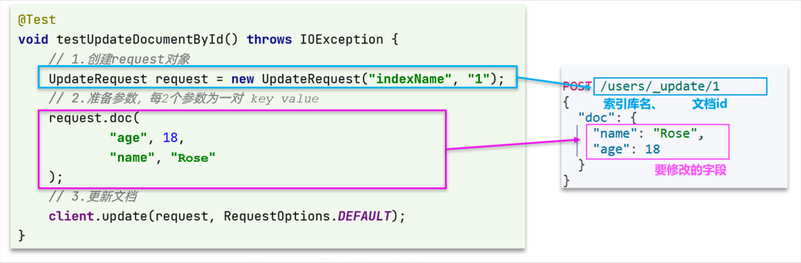


**批量操作**

批处理与前面讲的文档的CRUD步骤基本一致：

- 创建Request，但这次用的是`BulkRequest`
- 准备请求参数
- 发送请求，这次要用到`client.bulk()`方法

`BulkRequest`本身其实并没有请求参数，其本质就是将多个普通的CRUD请求组合在一起发送。例如：

- 批量新增文档，就是给每个文档创建一个`IndexRequest`请求，然后封装到`BulkRequest`中，一起发出。
- 批量删除，就是创建N个`DeleteRequest`请求，然后封装到`BulkRequest`，一起发出

```java
@Test
void testBulk() throws IOException {
    // 1.创建Request
    BulkRequest request = new BulkRequest();
    // 2.准备请求参数
    request.add(new IndexRequest("items").id("1").source("json doc1", XContentType.JSON));
    request.add(new IndexRequest("items").id("2").source("json doc2", XContentType.JSON));
    // 3.发送请求
    client.bulk(request, RequestOptions.DEFAULT);
}
```


业务示例：将数据库记录批量导入ES

```java
    @Test
    void testBulkDoc() throws IOException {
        int pageNum = 1;
        int pageSize = 500;
        while (true) {
            Page<Item> page = itemService.lambdaQuery()
                    .eq(Item::getStatus, 1)
                    .page(Page.of(pageNum, pageSize));
            List<Item> records = page.getRecords();
            if (records == null || records.isEmpty()) {
                return;
            }
            BulkRequest request = new BulkRequest();
            for (Item item : records) {
                request.add(new IndexRequest("items")
                        .id(item.getId().toString())
                        .source(JSONUtil.toJsonStr(BeanUtil.copyProperties(item, ItemDoc.class)), XContentType.JSON));
            }
            client.bulk(request, RequestOptions.DEFAULT);
            pageNum++;
        }
    }
```


### DSL查询

Elasticsearch提供了基于JSON的DSL（[Domain Specific Language](https://www.elastic.co/guide/en/elasticsearch/reference/7.12/query-dsl.html)）语句来定义查询条件，其JavaAPI就是在组织DSL条件。

Elasticsearch的查询可以分为两大类：

- **叶子查询（Leaf** **query** **clauses）**：一般是在特定的字段里查询特定值，属于简单查询，很少单独使用。
- **复合查询（Compound** **query** **clauses）**：以逻辑方式组合多个叶子查询或者更改叶子查询的行为方式。


#### 入门

语法结构

```json
GET /{索引库名}/_search
{
  "query": {
    "查询类型": {
      // .. 查询条件
    }
  }
}
```

eg查询所有

```json
GET /items/_search
{
  "query": {
    "match_all": {
      
    }
  }
}
```

> 虽然是match_all，但是响应结果中并不会包含索引库中的所有文档，而是仅有10条。
>
> 这是因为处于安全考虑，elasticsearch设置了默认的查询页数。


#### 叶子查询

叶子查询的类型也可以做进一步细分，详情可以查看官方文档：

https://www.elastic.co/guide/en/elasticsearch/reference/7.12/query-dsl.html

如图：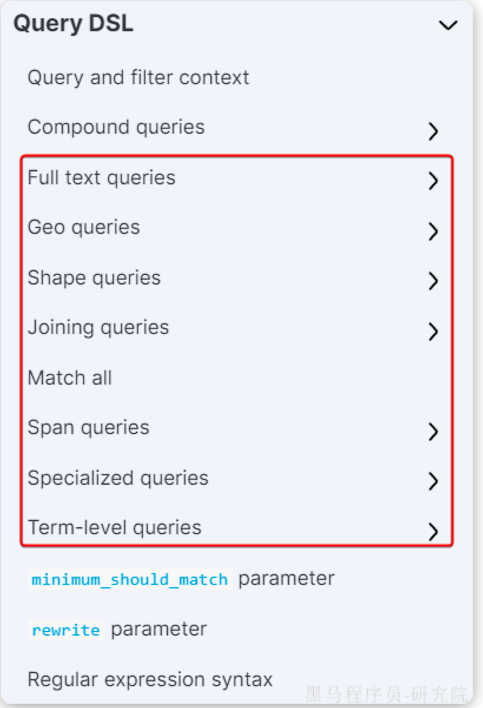

例如：

- **全文检索查询（Full Text Queries）**：利用分词器对用户输入搜索条件先分词，得到词条，然后再利用倒排索引搜索词条。例如：
  - `match`：
  - `multi_match`
- **精确查询（Term-level queries）**：不对用户输入搜索条件分词，根据字段内容精确值匹配。但只能查找keyword、数值、日期、boolean类型的字段。例如：
  - `ids`
  - `term`
  - `range`
- **地理坐标查询：**用于搜索地理位置，搜索方式很多，例如：
  - `geo_bounding_box`：按矩形搜索
  - `geo_distance`：按点和半径搜索


##### 全文检索查询

全文检索的种类也很多，详情可以参考官方文档：

https://www.elastic.co/guide/en/elasticsearch/reference/7.12/full-text-queries.html

以全文检索中的`match`为例，语法如下：

```JSON
GET /{索引库名}/_search
{
  "query": {
    "match": {
      "字段名": "搜索条件"
    }
  }
}
```

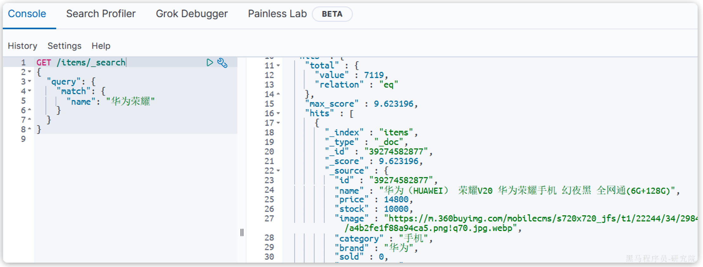


`match`类似的还有`multi_match`，区别在于可以同时对多个字段搜索，而且多个字段都要满足，语法示例：

```JSON
GET /{索引库名}/_search
{
  "query": {
    "multi_match": {
      "query": "搜索条件",
      "fields": ["字段1", "字段2"]
    }
  }
}
```

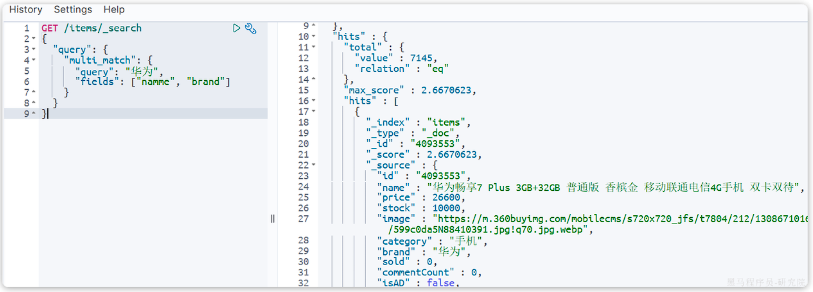


##### 精确查询

精确查询，英文是`Term-level query`，顾名思义，词条级别的查询。也就是说不会对用户输入的搜索条件再分词，而是作为一个词条，与搜索的字段内容精确值匹配。因此推荐查找`keyword`、数值、日期、`boolean`类型的字段。

以`term`查询为例，其语法如下：

```JSON
GET /{索引库名}/_search
{
  "query": {
    "term": {
      "字段名": {
        "value": "搜索条件"
      }
    }
  }
}
```


`range`查询，语法如下：

```JSON
GET /{索引库名}/_search
{
  "query": {
    "range": {
      "字段名": {
        "gte": {最小值},
        "lte": {最大值}
      }
    }
  }
}
```

`range`是范围查询，对于范围筛选的关键字有：

- `gte`：大于等于
- `gt`：大于
- `lte`：小于等于
- `lt`：小于


#### 复合查询

复合查询大致可以分为两类：

- 第一类：基于逻辑运算组合叶子查询，实现组合条件，例如
  - bool
- 第二类：基于某种算法修改查询时的文档相关性算分，从而改变文档排名。例如：
  - function_score
  - dis_max

其它复合查询及相关语法可以参考官方文档：

https://www.elastic.co/guide/en/elasticsearch/reference/7.12/compound-queries.html


##### bool查询

bool查询，即布尔查询。就是利用逻辑运算来组合一个或多个查询子句的组合。bool查询支持的逻辑运算有：

- must：必须匹配每个子查询，类似“与”
- should：选择性匹配子查询，类似“或”
- must_not：必须不匹配，**不参与算分**，类似“非”
- filter：必须匹配，**不参与算分**

> 出于性能考虑，与搜索关键字无关的查询尽量采用must_not或filter逻辑运算，避免参与相关性算分。


例如黑马商城的搜索页面：


其中输入框的搜索条件肯定要参与相关性算分，可以采用match。但是价格范围过滤、品牌过滤、分类过滤等尽量采用filter，不要参与相关性算分。

比如，我们要搜索`手机`，但品牌必须是`华为`，价格必须是`900~1599`，那么可以这样写：

```JSON
GET /items/_search
{
  "query": {
    "bool": {
      "must": [
        {"match": {"name": "手机"}}
      ],
      "filter": [
        {"term": {"brand": { "value": "华为" }}},
        {"range": {"price": {"gte": 90000, "lt": 159900}}}
      ]
    }
  }
}
```


#### 排序和分页

##### 排序

elasticsearch默认是根据相关度算分（`_score`）来排序，但是也支持自定义方式对搜索结果排序。不过分词字段无法排序，能参与排序字段类型有：`keyword`类型、数值类型、地理坐标类型、日期类型等。

```JSON
GET /indexName/_search
{
  "query": {
    "match_all": {}
  },
  "sort": [
    {
      "排序字段": {
        "order": "排序方式asc和desc"
      }
    }
  ]
}
```

示例，我们按照商品价格排序：

```JSON
GET /items/_search
{
  "query": {
    "match_all": {}
  },
  "sort": [
    {
      "price": {
        "order": "desc"
      }
    }
  ]
}
```


##### 分页

lasticsearch中通过修改`from`、`size`参数来控制要返回的分页结果：

- `from`：从第几个文档开始
- `size`：总共查询几个文档

类似于mysql中的`limit ?, ?`

```JSON
GET /items/_search
{
  "query": {
    "match_all": {}
  },
  "from": 0, // 分页开始的位置，默认为0
  "size": 10,  // 每页文档数量，默认10
  "sort": [
    {
      "price": {
        "order": "desc"
      }
    }
  ]
}
```


##### 深度分页

elasticsearch的数据一般会采用分片存储，也就是把一个索引中的数据分成N份，存储到不同节点上。这种存储方式比较有利于数据扩展，但给分页带来了一些麻烦。 

比如一个索引库中有100000条数据，分别存储到4个分片，每个分片25000条数据。现在每页查询10条，查询第99页。那么分页查询的条件如下：

```JSON
GET /items/_search
{
  "from": 990, // 从第990条开始查询
  "size": 10, // 每页查询10条
  "sort": [
    {
      "price": "asc"
    }
  ]
}
```

从语句来分析，要查询第990~1000名的数据。

从实现思路来分析，肯定是将所有数据排序，找出前1000名，截取其中的990~1000的部分。但问题来了，我们如何才能找到所有数据中的前1000名呢？

要知道每一片的数据都不一样，第1片上的第900~1000，在另1个节点上并不一定依然是900~1000名。所以我们只能在每一个分片上都找出排名前1000的数据，然后汇总到一起，重新排序，才能找出整个索引库中真正的前1000名，此时截取990~1000的数据即可。

如图：

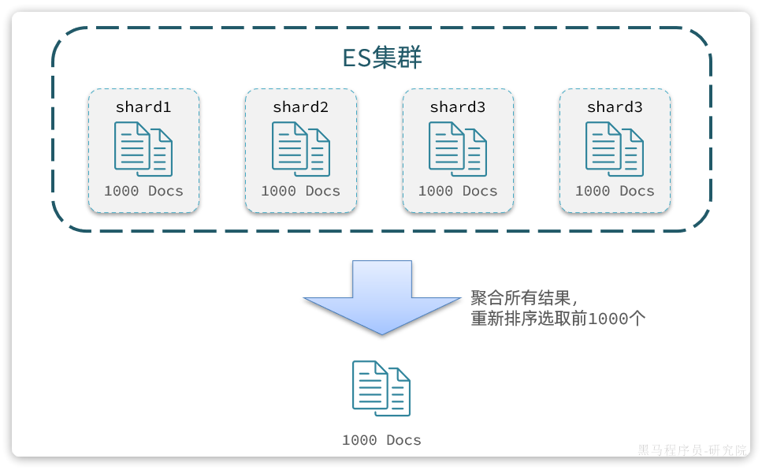

试想一下，假如我们现在要查询的是第999页数据呢，是不是要找第9990~10000的数据，那岂不是需要把每个分片中的前10000名数据都查询出来，汇总在一起，在内存中排序？如果查询的分页深度更深呢，需要一次检索的数据岂不是更多？

由此可知，当查询分页深度较大时，汇总数据过多，对内存和CPU会产生非常大的压力。

因此elasticsearch会禁止`from+ size`超过10000的请求。

针对深度分页，elasticsearch提供了两种解决方案：

- `search after`：分页时需要排序，原理是从上一次的排序值开始，查询下一页数据。官方推荐使用的方式。
- `scroll`：原理将排序后的文档id形成快照，保存下来，基于快照做分页。官方已经不推荐使用。


详情见文档：

https://www.elastic.co/guide/en/elasticsearch/reference/7.12/paginate-search-results.html


> **总结：**
>
> 大多数情况下，我们采用普通分页就可以了。查看百度、京东等网站，会发现其分页都有限制。例如百度最多支持77页，每页不足20条。京东最多100页，每页最多60条。
>
> 因此，一般我们采用限制分页深度的方式即可，无需实现深度分页。


#### 高亮显示

我们在百度，京东搜索时，关键字会变成红色，比较醒目，这叫高亮显示

实现高亮的思路就是：

- 用户输入搜索关键字搜索数据
- 服务端根据搜索关键字到elasticsearch搜索，并给搜索结果中的关键字词条添加`html`标签
- 前端提前给约定好的`html`标签添加`CSS`样式


事实上elasticsearch已经提供了给搜索关键字加标签的语法，无需我们自己编码。

基本语法如下：

```JSON
GET /{索引库名}/_search
{
  "query": {
    "match": {
      "搜索字段": "搜索关键字"
    }
  },
  "highlight": {
    "fields": {
      "高亮字段名称": {
        "pre_tags": "<em>",
        "post_tags": "</em>"
      }
    }
  }
}
```

> **注意**：
>
> - 搜索必须有查询条件，而且是全文检索类型的查询条件，例如`match`
> - 参与高亮的字段必须是`text`类型的字段
> - 默认情况下参与高亮的字段要与搜索字段一致，除非添加：`required_field_match=false`


#### 总结

查询的DSL是一个大的JSON对象，包含下列属性：

- `query`：查询条件
- `from`和`size`：分页条件
- `sort`：排序条件
- `highlight`：高亮条件


### RestClient查询

文档的查询依然使用 `RestHighLevelClient`对象，查询的基本步骤如下：

- 创建`request`对象，这次是搜索，所以是`SearchRequest`
- 准备请求参数，也就是查询DSL对应的JSON参数
- 发起请求
- 解析响应，响应结果相对复杂，需要逐层解析


#### 入门

1. 创建`SearchRequest`对象
2. 准备`request.source()`，也就是DSL。
   1. `QueryBuilders`来构建查询条件
   2. 传入`request.source()` 的` query() `方法
3. 发送请求，得到结果
4. 解析结果（参考JSON结果，从外到内，逐层解析）

```java
@Test
void testMatchAll() throws IOException {
    //创建request对象
    SearchRequest searchRequest = new SearchRequest("items");
    //配置request参数
    searchRequest.source()
            .query(QueryBuilders.matchAllQuery());
    //执行查询
    SearchResponse response = client.search(searchRequest, RequestOptions.DEFAULT);

    //处理结果
    SearchHits searchHits = response.getHits();
    long total = searchHits.getTotalHits().value;

    SearchHit[] hits = searchHits.getHits();
    for (SearchHit hit : hits) {
        String json = hit.getSourceAsString();
        ItemDoc bean = JSONUtil.toBean(json, ItemDoc.class);
        System.out.println("bean = " + bean);
    }
}
```


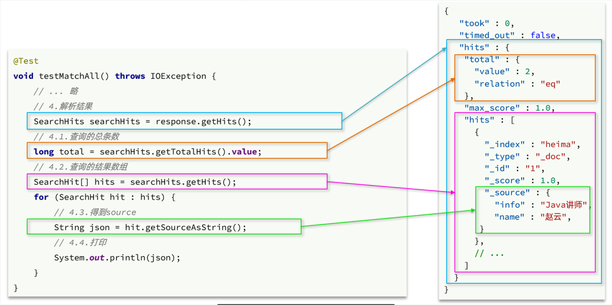

- `hits`：命中的结果 
  - `total`：总条数，其中的value是具体的总条数值
  - `max_score`：所有结果中得分最高的文档的相关性算分
  - `hits`：搜索结果的文档数组，其中的每个文档都是一个json对象 
    - `_source`：文档中的原始数据，也是json对象


#### 构建查询条件

所有的查询条件都是由QueryBuilders来构建的

```java
@Test
void testSearch() throws IOException {
    SearchRequest request = new SearchRequest("items");
    request.source().query(
            QueryBuilders.boolQuery()
                    .must(QueryBuilders.matchQuery("name", "脱脂牛奶"))
                    .filter(QueryBuilders.termQuery("brand.keyword","德亚"))
                    .filter(QueryBuilders.rangeQuery("price").lt(30000))
    );
    SearchResponse response = client.search(request, RequestOptions.DEFAULT);
    parseResult(response);
}
```


#### 分页和排序

`requeset.source()`就是整个请求JSON参数，所以排序、分页都是基于这个来设置

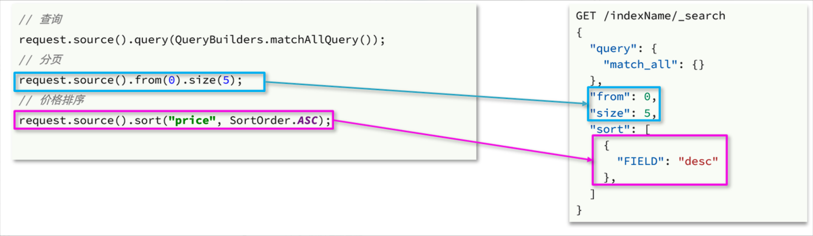


#### 高亮显示

高亮查询与前面的查询有两点不同：

- 条件同样是在`request.source()`中指定，只不过高亮条件要基于`HighlightBuilder`来构造
- 高亮响应结果与搜索的文档结果不在一起，需要**单独解析**


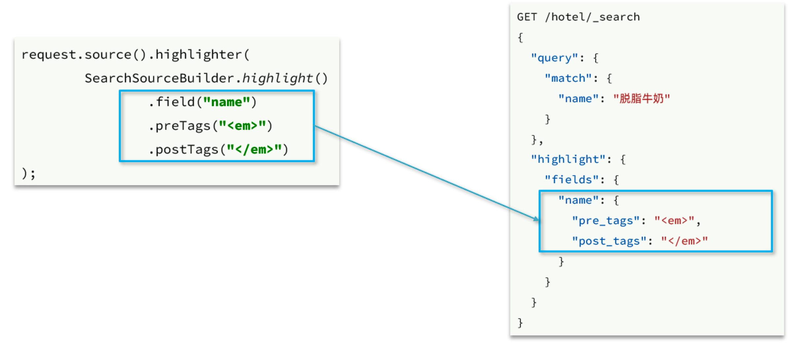


**解析高亮**结果

- 获取高亮结果。`hit.getHighlightFields()`，返回值是一个`Map`，key是高亮字段名称，值是`HighlightField`对象，代表高亮值

- 从`Map`中根据高亮字段名称，获取高亮字段值对象`HighlightField`

- 从`HighlightField`中获取`Fragments`，并且转为字符串。这部分就是真正的高亮字符串了

  > **注意**Fragments实际上返回数组，需要将数组拼接得到高亮字符串(ES会将过长的字符串拆分成多个片段)

- 最后用高亮的结果替换Bean中非高亮结果


eg

```java
private void handleResponse(SearchResponse response) {
    SearchHits searchHits = response.getHits();
    // 1.获取总条数
    long total = searchHits.getTotalHits().value;
    System.out.println("共搜索到" + total + "条数据");
    // 2.遍历结果数组
    SearchHit[] hits = searchHits.getHits();
    for (SearchHit hit : hits) {
        // 3.得到_source，也就是原始json文档
        String source = hit.getSourceAsString();
        // 4.反序列化
        ItemDoc item = JSONUtil.toBean(source, ItemDoc.class);
        // 5.获取高亮结果
        Map<String, HighlightField> hfs = hit.getHighlightFields();
        if (CollUtils.isNotEmpty(hfs)) {
            // 5.1.有高亮结果，获取name的高亮结果
            HighlightField hf = hfs.get("name");
            if (hf != null) {
                // 5.2.获取第一个高亮结果片段，就是商品名称的高亮值
                String hfName = hf.getFragments()[0].string();
                item.setName(hfName);
            }
        }
        System.out.println(item);
    }
}
```


### 数据聚合

聚合（`aggregations`）可以让我们极其方便的实现对数据的统计、分析、运算。

例如：

- 什么品牌的手机最受欢迎？
- 这些手机的平均价格、最高价格、最低价格？
- 这些手机每月的销售情况如何？

实现这些统计功能的比数据库的sql要方便的多，而且查询速度非常快，可以实现近实时搜索效果。

官方文档：

https://www.elastic.co/guide/en/elasticsearch/reference/7.12/search-aggregations.html


聚合常见的有三类：

-  **桶（`Bucket`）**聚合：用来对文档做分组 
  - `TermAggregation`：按照文档字段值分组，例如按照品牌值分组、按照国家分组
  - `Date Histogram`：按照日期阶梯分组，例如一周为一组，或者一月为一组
-  **度量（`Metric`）**聚合：用以计算一些值，比如：最大值、最小值、平均值等 
  - `Avg`：求平均值
  - `Max`：求最大值
  - `Min`：求最小值
  - `Stats`：同时求`max`、`min`、`avg`、`sum`等
-  **管道（`pipeline`）**聚合：其它聚合的结果为基础做进一步运算 

> **注意：**参加聚合的字段必须是keyword、日期、数值、布尔类型


#### DSL语法

- **桶聚合**

基本语法如下：

```JSON
GET /items/_search
{
  "size": 0, 
  "aggs": {
    "category_agg": {
      "terms": {
        "field": "category",
        "size": 20
      }
    }
  }
}
```

语法说明：

- `size`：设置`size`为0，就是每页查0条，则结果中就不包含文档，只包含聚合结果
- `aggs`：定义聚合
  - `category_agg`：聚合名称，自定义，但不能重复
    - `terms`：聚合的类型，按分类聚合，所以用`term`
      - `field`：参与聚合的字段名称
      - `size`：希望返回的聚合结果的最大数量


- **带条件的聚合**只需要添加`query`设置条件即可


- **Metric**聚合

现在我们需要对桶内的商品做运算，获取每个品牌价格的最小值、最大值、平均值。

这就要用到`Metric`聚合了，例如`stat`聚合，就可以同时获取`min`、`max`、`avg`等结果。

语法如下：

```JSON
GET /items/_search
{
  "query": {
    "bool": {
      "filter": [
        {
          "term": {
            "category": "手机"
          }
        },
        {
          "range": {
            "price": {
              "gte": 300000
            }
          }
        }
      ]
    }
  }, 
  "size": 0, 
  "aggs": {
    "brand_agg": {
      "terms": {
        "field": "brand",
        "size": 20
      },
      "aggs": {
        "stats_meric": {
          "stats": {
            "field": "price"
          }
        }
      }
    }
  }
}
```

> 嵌套了metric聚合


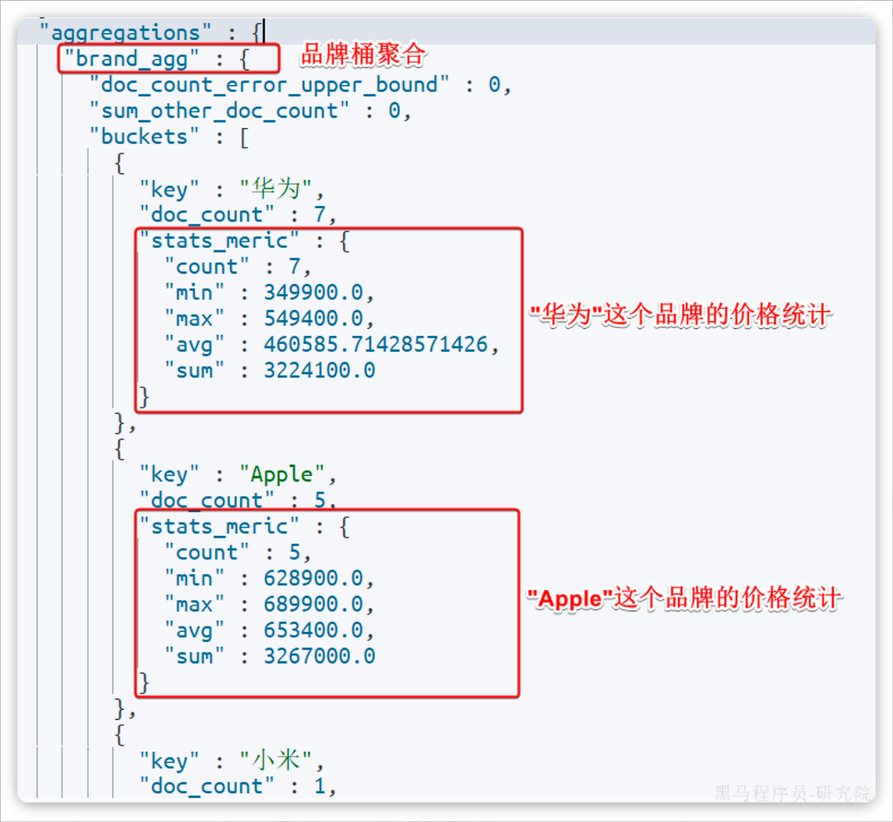


聚合必须的三要素：

- 聚合名称
- 聚合类型
- 聚合字段

聚合可配置属性有：

- size：指定聚合结果数量
- order：指定聚合结果排序方式
- field：指定聚合字段


#### RestClient实现

利用`request.source()`方法来设置聚合

聚合条件的要利用`AggregationBuilders`这个工具类来构造

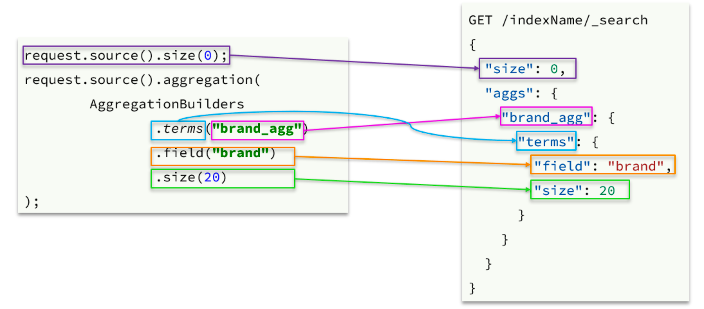


需要单独解析聚合结果

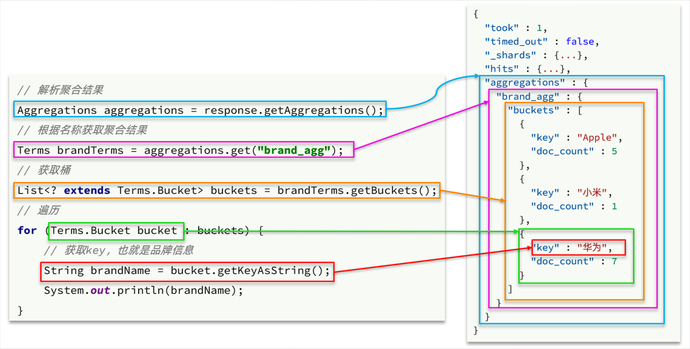

> 使用aggregations.get()返回聚合结果时，应该根据**聚合类型**使用具体的**子接口**接收，而不是使用顶级接口`Aggregation`


