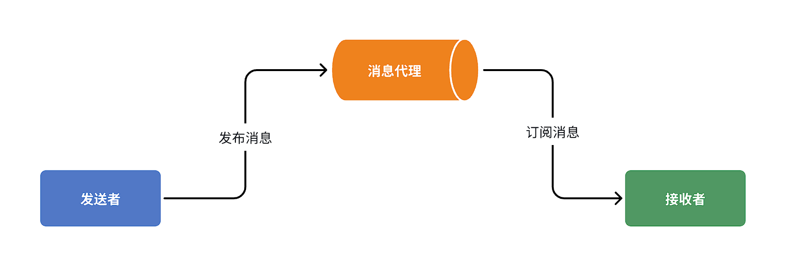
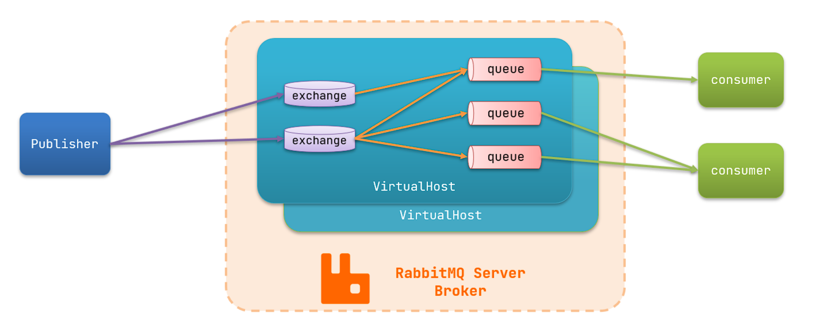
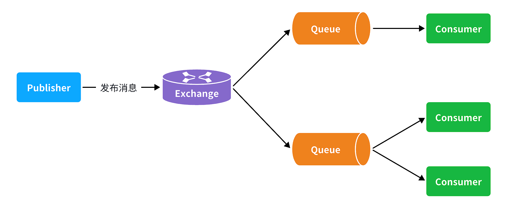
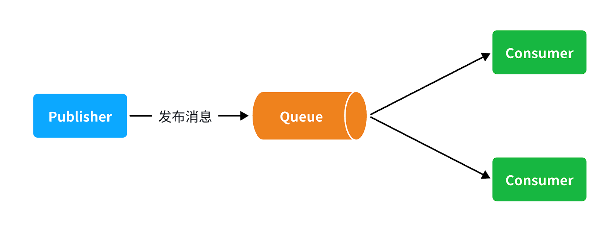
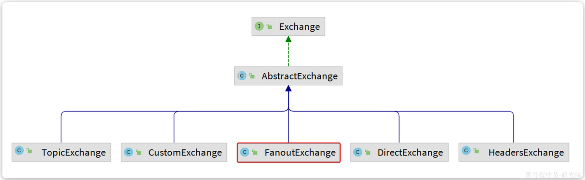
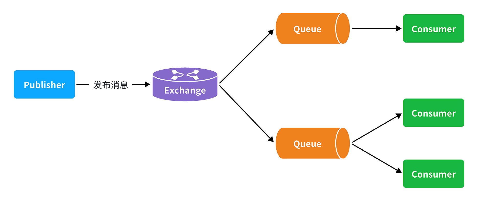
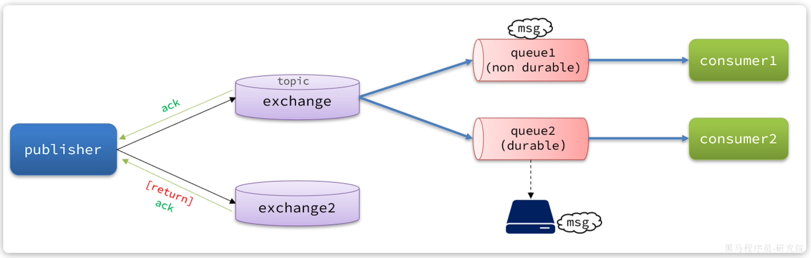
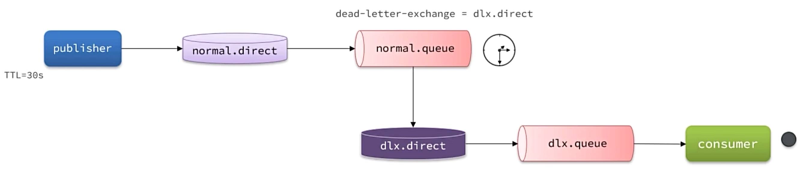

服务一旦拆分，必然涉及到服务之间的相互调用，目前我们服务之间调用采用的都是基于OpenFeign的调用。

这种调用中，调用者发起请求后需要**等待**服务提供者执行业务返回结果后，才能继续执行后面的业务。也就是说调用者在调用过程中处于阻塞状态，因此我们称这种调用方式为**同步调用**。


如果业务需要实时得到服务提供方的响应，则应该选择同步调用。而如果我们追求更高的效率，并且不需要实时响应，则应该选择异步调用。


## 初识MQ

### 同步调用

存在的问题：

1. **拓展性差**：每次有新的需求，现有支付逻辑都要跟着变化，代码经常变动，不符合开闭原则
2. **性能下降**：调用者需要等待服务提供者执行完返回结果后，才能继续向下执行，调用者处于阻塞等待状态
3. **级联失败**：当某个服务出现故障时，整个事务都会回滚

<br>

### 异步调用

异步调用方式其实就是基于消息通知的方式，一般包含三个角色：

- 消息发送者：投递消息的人，就是原来的调用方
- 消息Broker：管理、暂存、转发消息
- 消息接收者：接收和处理消息的人，就是原来的服务提供方



在异步调用中，发送者不再直接同步调用接收者的业务接口，而是发送一条消息投递给消息Broker。

然后接收者根据自己的需求从消息Broker那里订阅消息。每当发送方发送消息后，接受者都能获取消息并处理。

!!!example
    假如产品经理提出了新的需求。代码完全不用变更，而仅仅是让新的服务也订阅消息即可


异步调用的优势包括：

- 耦合度更低
- 性能更好
- 业务拓展性强
- 故障隔离，避免级联失败


当然，异步通信也并非完美无缺，它存在下列缺点：

- 完全依赖于Broker的可靠性、安全性和性能
- 架构复杂，后期维护和调试麻烦

<br>

### MQ技术选型


几种常见MQ的对比：

|            |        RabbitMQ         |            ActiveMQ            |  RocketMQ  |   Kafka    |
| :--------- | :---------------------: | :----------------------------: | :--------: | :--------: |
| 公司/社区  |         Rabbit          |             Apache             |    阿里    |   Apache   |
| 开发语言   |         Erlang          |              Java              |    Java    | Scala&Java |
| 协议支持   | AMQP，XMPP，SMTP，STOMP | OpenWire,STOMP，REST,XMPP,AMQP | 自定义协议 | 自定义协议 |
| 可用性     |           高            |              一般              |     高     |     高     |
| 单机吞吐量 |          一般           |               差               |     高     |   非常高   |
| 消息延迟   |         微秒级          |             毫秒级             |   毫秒级   |  毫秒以内  |
| 消息可靠性 |           高            |              一般              |     高     |    一般    |

追求可用性：Kafka、 RocketMQ 、RabbitMQ

追求可靠性：RabbitMQ、RocketMQ

追求吞吐能力：RocketMQ、Kafka

追求消息低延迟：RabbitMQ、Kafka

<br>

---

## RabbitMQ

### 安装

使用docker部署RabbitMQ

```bash
docker run \
 -e RABBITMQ_DEFAULT_USER=admin \
 -e RABBITMQ_DEFAULT_PASS=admin \
 -v mq-plugins:/plugins \
 --name mq \
 --hostname mq \
 -p 15672:15672 \
 -p 5672:5672 \
 --network work\
 -d \
 rabbitmq:3.8-management
```

- 15672：RabbitMQ提供的管理控制台的端口
- 5672：RabbitMQ的消息发送处理接口

浏览器访问 [http://localhost:15672](http://localhost:15672) 即可进入RabbitMQ控制台

<br>

RabbitMQ对应的架构如图：



其中包含几个概念：

- **`publisher`**：生产者，也就是发送消息的一方
- **`consumer`**：消费者，也就是消费消息的一方
- **`queue`**：队列，存储消息。生产者投递的消息会暂存在消息队列中，等待消费者处理
- **`exchange`**：交换机，负责消息路由。生产者发送的消息由交换机决定投递到哪个队列。
- **`virtual host`**：虚拟主机，起到数据隔离的作用。每个虚拟主机相互独立，有各自的exchange、queue

<br>

### 收发消息

- 交换机

打开Exchanges选项卡，可以看到已经存在很多交换机

点击任意交换机，即可进入交换机详情页面。用控制台中的publish message 发送一条消息

由于没有消费者存在，最终消息丢失了，这说明**交换机没有存储消息的能力**。

<br>

- 队列

打开`Queues`选项卡，新建一个队列

此时，再次向交换机发送一条消息。会发现消息依然没有到达队列

发送到交换机的消息，只会路由到与其绑定的队列，因此仅仅创建队列是不够的，还需要将其与交换机绑定。

<br>

- 绑定关系

点击`Exchanges`选项卡，点击一个交换机，进入交换机详情页，然后点击`Bindings`菜单，在表单中填写要绑定的队列名称

绑定成功后发送消息，再次点击队列即可查看收到的消息

<br>

### 数据隔离

点击`Admin`选项卡，会看到RabbitMQ控制台的用户管理界面


对于小型企业而言，出于成本考虑，通常只会搭建一套MQ集群，公司内的多个不同项目同时使用。

为了避免互相干扰， 我们会利用`virtual host`的隔离特性，将不同项目隔离。

一般会做两件事情：

- 给每个项目创建独立的运维账号，将管理权限分离。
- 给每个项目创建不同的`virtual host`，将每个项目的数据隔离。


新增用户没有任何`virtual host`的访问权限，需要登录该账号创建新的`virtual host`

<br>

### Fanout交换机

一旦引入交换机，消息发送的模式会有很大变化：



- **Exchange**：交换机，一方面，接收生产者发送的消息。另一方面，知道如何处理消息，例如递交给某个特别队列、递交给所有队列、或是将消息丢弃。到底如何操作，取决于Exchange的类型。

!!!warning 
    **Exchange只负责转发消息，不具备存储消息的能力**，因此如果没有任何队列与Exchange绑定，或者没有符合路由规则的队列，那么消息会丢失！


交换机的类型有四种：

- **Fanout**：广播，将消息交给所有绑定到交换机的队列。
- **Direct**：订阅，基于RoutingKey（路由key）发送给订阅了消息的队列
- **Topic**：通配符订阅，与Direct类似，只不过RoutingKey可以使用通配符
- **Headers**：头匹配，基于MQ的消息头匹配，较少使用。

<br>

**应用场景**:
当多个消费者需要处理相同的消息时，就需要为每个消费者创建队列，然后将消息发送给交换机，通过交换机规则转发消息


<br>

### Direct交换机

在Fanout模式中，一条消息，会被所有订阅的队列都消费。但是，在某些场景下，我们希望不同的消息被不同的队列消费。这时就要用到Direct类型的Exchange。

在Direct模型下：

- 队列与交换机的绑定，不再是任意绑定了，而是要指定一个`RoutingKey`（路由key）
- 消息的发送方在向Exchange发送消息时，也必须指定消息的 `RoutingKey`。
- Exchange不再把消息交给每一个绑定的队列，而是根据消息的`Routing Key`进行判断，只有队列的`Routingkey`与消息的`Routing key`完全一致，才会接收到消息

<br>

### Topic交换机

`Topic`类型的`Exchange`与`Direct`相比，都是可以根据`RoutingKey`把消息路由到不同的队列。

只不过`Topic`类型`Exchange`可以让队列在绑定`BindingKey` 的时候使用**通配符**！


`BindingKey` 一般都是有一个或多个单词组成，多个单词之间以`.`分割，例如： `item.insert`


通配符规则：

- `#`：匹配一个或多个词
- `*`：匹配不多不少恰好1个词


举例：

- `item.#`：能够匹配`item.spu.insert` 或者 `item.spu`
- `item.*`：只能匹配`item.spu`

<br>

Direct交换机与Topic交换机的差异

- Topic交换机接收的消息RoutingKey必须是多个单词，以 **`.`** 分割
- Topic交换机与队列绑定时的bindingKey可以指定通配符
- `#`：代表0个或多个词
- `*`：代表1个词

<br>

---

## SpringAMQP

由于`RabbitMQ`采用了AMQP协议，因此它具备跨语言的特性。任何语言只要遵循AMQP协议收发消息，都可以与`RabbitMQ`交互。并且`RabbitMQ`官方也提供了各种不同语言的客户端。

但是，RabbitMQ官方提供的Java客户端编码相对复杂，一般生产环境下我们更多会结合Spring来使用。

而Spring的官方刚好基于RabbitMQ提供了这样一套消息收发的模板工具：SpringAMQP。并且还基于SpringBoot对其实现了自动装配，使用起来非常方便


[SpringAmqp的官方地址](https://spring.io/projects/spring-amqp)

SpringAMQP提供了三个功能：

- 自动声明队列、交换机及其绑定关系
- 基于注解的监听器模式，异步接收消息
- 封装了RabbitTemplate工具，用于发送消息

<br>

### 快速入门

1.引入AMQP依赖

```xml
<!--AMQP依赖，包含RabbitMQ-->
<dependency>
    <groupId>org.springframework.boot</groupId>
    <artifactId>spring-boot-starter-amqp</artifactId>
</dependency>
```


2.配置MQ地址，在`application.yml`中添加配置：

```yaml
spring:
  rabbitmq:
    host: localhost
    port: 5672
    username: ysh
    password: 123
    virtual-host: ysh
```


3.发送消息

```java
    @Autowired
    private RabbitTemplate rabbitTemplate;

    @Test
    public void testSimpleQueue(){

        String queueName = "test";

        String message = "Hello, RabbitMQ!";

        rabbitTemplate.convertAndSend(queueName, message);
    }
```


4.接收消息

```java
    @RabbitListener(queues = "test")
    public void listen(String message){
        log.info("监听到消息：{}",message);
    }
```

<br>

### Work Queues

Work queues，任务模型。简单来说就是**让多个消费者绑定到一个队列，共同消费队列中的消息**。



当消息处理比较耗时的时候，可能生产消息的速度会远远大于消息的消费速度。长此以往，消息就会堆积越来越多，无法及时处理。

此时就可以使用work模型，**多个消费者共同处理消息处理，消息处理的速度就能大大提高**了。


!!!info
    消息默认是**平均分配**给每个消费者，并没有考虑到消费者的处理能力。导致1个消费者空闲，另一个消费者忙的不可开交。没有充分利用每一个消费者的能力，这样显然是有问题的。

    在spring中有一个简单的配置，可以解决这个问题。我们修改consumer服务的application.yml文件，添加配置：

    ```yaml
    spring:
    rabbitmq:
        listener:
        simple:
            prefetch: 1 # 每次只能获取一条消息，处理完成才能获取下一个消息
    ```


Work模型的使用：

- 多个消费者绑定到一个队列，同一条消息只会被一个消费者处理
- 通过设置prefetch来控制消费者预取的消息数量

<br>


### 声明队列和交换机

之前都是基于RabbitMQ控制台来创建队列、交换机。但是在实际开发时，队列和交换机是程序员定义的，将来项目上线，又要交给运维去创建。那么程序员就需要把程序中运行的所有队列和交换机都写下来，交给运维。在这个过程中是很容易出现错误的。

因此推荐的做法是由程序启动时检查队列和交换机是否存在，如果不存在自动创建。


SpringAMQP提供了一个Queue类，用来创建队列

SpringAMQP还提供了一个Exchange接口，来表示所有不同类型的交换机




我们可以自己创建队列和交换机，不过SpringAMQP还提供了ExchangeBuilder来简化这个过程

而在绑定队列和交换机时，则需要使用BindingBuilder来创建Binding对象


基于JavaBean声明示例代码

```java
@Configuration
public class FanoutConfiguration {

    @Bean
    public FanoutExchange fanoutExchange() {
        // 创建一个 fanout 类型的交换机
        return new FanoutExchange("ysh.fanout");
    }

    @Bean
    public Queue fanoutQueue1() {
        // 创建一个队列
        return new Queue("fanout.queue1");
    }

    @Bean
    public Binding fanoutQueueBinding(Queue fanoutQueue1, FanoutExchange fanoutExchange) {
        // 将队列和交换机绑定起来
        return BindingBuilder.bind(fanoutQueue1).to(fanoutExchange);
    }

}
```


基于注解声明

```java
    @RabbitListener(bindings = @QueueBinding(
            value = @Queue(name = "direct.queue1", durable = "true"),
            exchange = @Exchange(name = "ysh.direct", type = ExchangeTypes.DIRECT),
            key = {"red", "blue"}
    ))
    public void listenWorkQueue3(String message){}  
```

<br>

### 消息转换器

Spring的消息发送代码接收的消息体是一个Object

```java
public void convertAndSend(String routingKey, Object object){}
```


而在数据传输时，它会把发送的消息序列化为字节发送给MQ，接收消息的时候，还会把字节反序列化为Java对象。

只不过，默认情况下Spring采用的序列化方式是JDK序列化。JDK序列化存在下列问题：

- 数据体积过大
- 有安全漏洞
- 可读性差


可以使用JSON方式来优化

在`publisher`和`consumer`两个服务中都引入依赖：

```xml
        <!--Jackson依赖，用于序列化和反序列化-->
        <dependency>
            <groupId>com.fasterxml.jackson.dataformat</groupId>
            <artifactId>jackson-dataformat-xml</artifactId>
            <version>2.9.10</version>
        </dependency>
```

!!!note
    注意，如果项目中引入了`spring-boot-starter-web`依赖，则无需再次引入`Jackson`依赖。


配置消息转换器，在`publisher`和`consumer`两个服务的启动类中添加一个Bean即可：

```java
@Bean
public MessageConverter messageConverter(){
    // 1.定义消息转换器
    Jackson2JsonMessageConverter jackson2JsonMessageConverter = new Jackson2JsonMessageConverter();
    // 2.配置自动创建消息id，用于识别不同消息，也可以在业务中基于ID判断是否是重复消息
    jackson2JsonMessageConverter.setCreateMessageIds(true);
    return jackson2JsonMessageConverter;
}
```


<br>

---


## MQ高级

消息从发送者发送消息，到消费者处理消息，需要经过的流程是这样的



消息从生产者到消费者的每一步都可能导致消息丢失

我们要解决消息丢失问题，保证MQ的可靠性，就必须从3个方面入手：

- 确保生产者一定把消息发送到MQ
- 确保MQ不会将消息弄丢
- 确保消费者一定要处理消息

<br>

### 生产者可靠性

#### 生产者重试机制

第一种情况，就是生产者发送消息时，出现了网络故障，导致与MQ的连接中断。

为了解决这个问题，SpringAMQP提供的消息发送时的重试机制。即：当`RabbitTemplate`与MQ连接超时后，多次重试。

修改`publisher`模块的`application.yaml`文件，添加下面的内容：

```yaml
spring:
  rabbitmq:
    connection-timeout: 1s # 设置MQ的连接超时时间
    template:
      retry:
        enabled: true # 开启超时重试机制
        initial-interval: 1000ms # 失败后的初始等待时间
        multiplier: 1 # 失败后下次的等待时长倍数，下次等待时长 = initial-interval * multiplier
        max-attempts: 3 # 最大重试次数
```

**注意**：

当网络不稳定的时候，利用重试机制可以有效提高消息发送的成功率。不过SpringAMQP提供的重试机制是**阻塞式**的重试，也就是说多次重试等待的过程中，当前线程是被阻塞的。

如果对于业务性能有要求，建议禁用重试机制。如果一定要使用，请合理配置等待时长和重试次数，当然也可以考虑使用异步线程来执行发送消息的代码。

<br>

#### 生产者确认机制

一般情况下，只要生产者与MQ之间的网路连接顺畅，基本不会出现发送消息丢失的情况，因此大多数情况下我们无需考虑这种问题。

不过，在少数情况下，也会出现消息发送到MQ之后丢失的现象，比如：

- MQ内部处理消息的进程发生了异常
- 生产者发送消息到达MQ后未找到`Exchange`
- 生产者发送消息到达MQ的`Exchange`后，未找到合适的`Queue`，因此无法路由


针对上述情况，RabbitMQ提供了生产者消息确认机制，包括`Publisher Confirm`和`Publisher Return`两种。

在开启确认机制的情况下，当生产者发送消息给MQ后，MQ会根据消息处理的情况返回不同的**回执**。



- 当消息投递到MQ，但是路由失败时，通过**Publisher Return**返回异常信息，同时返回ack的确认信息，代表投递成功
- 临时消息投递到了MQ，并且入队成功，返回ACK，告知投递成功
- 持久消息投递到了MQ，并且入队完成持久化，返回ACK ，告知投递成功
- 其它情况都会返回NACK，告知投递失败


开启生产者确认机制：

在publisher模块的`application.yaml`中添加配置：

```YAML
spring:
  rabbitmq:
    publisher-confirm-type: correlated # 开启publisher confirm机制，并设置confirm类型
    publisher-returns: true # 开启publisher return机制
```

这里`publisher-confirm-type`有三种模式可选：

- `none`：关闭confirm机制
- `simple`：同步阻塞等待MQ的回执
- `correlated`：MQ异步回调返回回执

!!!tip
    一般推荐使用`correlated`，回调机制。


**定义ReturnCallback**

每个`RabbitTemplate`只能配置一个`ReturnCallback`，因此我们可以在配置类中统一设置

```java
@Slf4j
@AllArgsConstructor
@Configuration
public class MqConfig {
    private final RabbitTemplate rabbitTemplate;

    @PostConstruct
    public void init(){
        rabbitTemplate.setReturnsCallback(new RabbitTemplate.ReturnsCallback() {
            @Override
            public void returnedMessage(ReturnedMessage returned) {
                log.error("触发return callback,");
                log.debug("exchange: {}", returned.getExchange());
                log.debug("routingKey: {}", returned.getRoutingKey());
                log.debug("message: {}", returned.getMessage());
                log.debug("replyCode: {}", returned.getReplyCode());
                log.debug("replyText: {}", returned.getReplyText());
            }
        });
    }
}
```


**定义ConfirmCallback**

由于每个消息发送时的处理逻辑不一定相同，因此ConfirmCallback需要在每次发消息时定义。具体来说，是在调用RabbitTemplate中的convertAndSend方法时，多传递一个参数：

```java
    public void convertAndSend(String exchange, String routingKey, Object object, @Nullable CorrelationData correlationData){}
```

这里的CorrelationData中包含两个核心的东西：

- `id`：消息的唯一标示，MQ对不同的消息的回执以此做判断，避免混淆
- `SettableListenableFuture`：回执结果的Future对象


将来MQ的回执就会通过这个`Future`来返回，我们可以提前给`CorrelationData`中的`Future`添加回调函数来处理消息回执

```java
    // 1.创建CorrelationData
    CorrelationData cd = new CorrelationData();
    // 2.给Future添加ConfirmCallback
    cd.getFuture().addCallback(new ListenableFutureCallback<CorrelationData.Confirm>() {
        @Override
        public void onFailure(Throwable ex) {
            // 2.1.Future发生异常时的处理逻辑，基本不会触发
            log.error("send message fail", ex);
        }
        @Override
        public void onSuccess(CorrelationData.Confirm result) {
            // 2.2.Future接收到回执的处理逻辑，参数中的result就是回执内容
            if(result.isAck()){ // result.isAck()，boolean类型，true代表ack回执，false 代表 nack回执
                log.debug("发送消息成功，收到 ack!");
            }else{ // result.getReason()，String类型，返回nack时的异常描述
                log.error("发送消息失败，收到 nack, reason : {}", result.getReason());
            }
        }
    });
    // 3.发送消息
    rabbitTemplate.convertAndSend("hmall.direct", "q", "hello", cd);
```

!!!warning "注意"
    开启生产者确认比较消耗MQ性能，一般不建议开启。而且大家思考一下触发确认的几种情况：

    - 路由失败：一般是因为RoutingKey错误导致，往往是编程导致
    - 交换机名称错误：同样是编程错误导致
    - MQ内部故障：这种需要处理，但概率往往较低。因此只有对消息可靠性要求非常高的业务才需要开启，而且仅仅需要开启ConfirmCallback处理nack就可以了。

<br>

### MQ的可靠性

消息到达MQ以后，如果MQ不能及时保存，也会导致消息丢失，所以MQ的可靠性也非常重要。


#### 数据持久化

为了提升性能，默认情况下MQ的数据都是在内存存储的临时数据，重启后就会消失。为了保证数据的可靠性，必须配置数据持久化，包括：

- 交换机持久化
- 队列持久化
- 消息持久化

!!!tip
    在控制台添加交换机、队列、消息时，可以配置`Durability`参数实现持久化

在代码中需要自定义消息来实现消息持久化

```java
        Message message = MessageBuilder
                .withBody("消息".getBytes(StandardCharsets.UTF_8))
                .setDeliveryMode(MessageDeliveryMode.PERSISTENT)
                .build();
```


**说明**：

在开启持久化机制以后，如果同时还开启了生产者确认，那么MQ会在消息持久化以后才发送ACK回执，进一步确保消息的可靠性。

不过出于性能考虑，为了减少IO次数，发送到MQ的消息并不是逐条持久化到数据库的，而是每隔一段时间批量持久化。一般间隔在100毫秒左右，这就会导致ACK有一定的延迟，因此建议生产者确认全部采用异步方式。

<br>

#### LazyQueue

在默认情况下，RabbitMQ会将接收到的信息保存在内存中以降低消息收发的延迟。但在某些特殊情况下，这会导致消息积压，比如：

- 消费者宕机或出现网络故障
- 消息发送量激增，超过了消费者处理速度
- 消费者处理业务发生阻塞


一旦出现消息堆积问题，RabbitMQ的内存占用就会越来越高，直到触发内存预警上限。此时RabbitMQ会将内存消息刷到磁盘上，这个行为成为`PageOut`. `PageOut`会耗费一段时间，并且会阻塞队列进程。因此在这个过程中RabbitMQ不会再处理新的消息，生产者的所有请求都会被阻塞。


为了解决这个问题，从RabbitMQ的3.6.0版本开始，就增加了`Lazy Queue`的模式，也就是惰性队列。

惰性队列的特征如下：

- 接收到消息后直接存入磁盘而非内存
- 消费者要消费消息时才会从磁盘中读取并加载到内存（也就是懒加载）
- 支持数百万条的消息存储

!!!info
    在3.12版本之后，LazyQueue已经成为所有队列的默认格式。因此官方推荐升级MQ为3.12版本或者所有队列都设置为LazyQueue模式。


**控制台配置Lazy模式**

在添加队列的时候，添加`x-queue-mod=lazy`参数即可设置队列为Lazy模式

**代码配置Lazy模式**

```java
// 基于JavaBean
@Bean
public Queue lazyQueue(){
    return QueueBuilder
            .durable("lazy.queue")
            .lazy() // 开启Lazy模式
            .build();
}

// 基于注解
@RabbitListener(queuesToDeclare = @Queue(
        name = "lazy.queue",
        durable = "true",
        arguments = @Argument(name = "x-queue-mode", value = "lazy")
))
```

<br>

### 消费者可靠性

当RabbitMQ向消费者投递消息以后，需要知道消费者的处理状态如何。因为消息投递给消费者并不代表就一定被正确消费了，可能出现的故障有很多，比如：

- 消息投递的过程中出现了网络故障
- 消费者接收到消息后突然宕机
- 消费者接收到消息后，因处理不当导致异常
- ...

一旦发生上述情况，消息也会丢失。因此，RabbitMQ必须知道消费者的处理状态，一旦消息处理失败才能重新投递消息。

#### 消费者确认机制

为了确认消费者是否成功处理消息，RabbitMQ提供了消费者确认机制（**Consumer Acknowledgement**）。

即：当消费者处理消息结束后，应该向RabbitMQ发送一个回执，告知RabbitMQ自己的消息处理状态。

回执有三种可选值：

- ack：成功处理消息，RabbitMQ从队列中删除该消息
- nack：消息处理失败，RabbitMQ需要再次投递消息
- reject：消息处理失败并拒绝该消息，RabbitMQ从队列中删除该消息

<br>

由于消息回执的处理代码比较统一，因此SpringAMQP帮我们实现了消息确认。并允许我们通过配置文件设置ACK处理方式，有三种模式：

- **`none`**：不处理。即消息投递给消费者后立刻ack，消息会立刻从MQ删除。非常不安全，不建议使用
- **`manual`**：手动模式。需要自己在业务代码中调用api，发送`ack`或`reject`，存在业务入侵，但更灵活
- **`auto`**：(推荐)自动模式。SpringAMQP利用AOP对我们的消息处理逻辑做了环绕增强，当业务正常执行时则自动返回`ack`.  当业务出现异常时，根据异常判断返回不同结果：
    - 如果是**业务异常**，会自动返回`nack`；
    - 如果是**消息处理或校验异常**，自动返回`reject`;

```yaml
spring:
  rabbitmq:
    listener:
      simple:
        acknowledge-mode: auto # 不做处理
```

<br>

#### 失败重试机制

当消费者出现异常后，消息会不断requeue（重入队）到队列，再重新发送给消费者。如果消费者再次执行依然出错，消息会再次requeue到队列，再次投递，直到消息处理成功为止。

极端情况就是消费者一直无法执行成功，那么消息requeue就会无限循环，导致mq的消息处理飙升，带来不必要的压力。

为了应对上述情况RabbitMQ又提供了消费者失败重试机制：在消费者出现异常时利用**本地重试**，而不是无限制的requeue到mq队列。

修改配置开启该机制:

```yaml
spring:
  rabbitmq:
    listener:
      simple:
        retry:
          enabled: true # 开启消费者失败重试
          initial-interval: 1000ms # 初始的失败等待时长为1秒
          multiplier: 1 # 失败的等待时长倍数，下次等待时长 = multiplier * last-interval
          max-attempts: 3 # 最大重试次数
          stateless: true # true无状态；false有状态。如果业务中包含事务，这里改为false
```

**结论**：

- 开启本地重试时，消息处理过程中抛出异常，不会requeue到队列，而是在消费者本地重试
- 重试达到最大次数后，Spring会返回reject，消息会被丢弃

<br>

#### 失败消息处理策略

在之前的机制中，本地测试达到最大重试次数后，消息会被丢弃。这在某些对于消息可靠性要求较高的业务场景下，显然不太合适。

因此Spring允许我们自定义重试次数耗尽后的消息处理策略，这个策略是由`MessageRecovery`接口来定义的，它有3个不同实现：

-  `RejectAndDontRequeueRecoverer`：重试耗尽后，直接`reject`，丢弃消息。默认就是这种方式 
-  `ImmediateRequeueMessageRecoverer`：重试耗尽后，返回`nack`，消息重新入队 
-  `RepublishMessageRecoverer`：重试耗尽后，将失败消息投递到**指定的交换机 **


比较合理的一种处理方案是`RepublishMessageRecoverer`，失败后将消息投递到一个指定的，专门存放异常消息的队列，后续由人工集中处理。


1.首先在consumer服务中定义处理失败消息的交换机和队列

```java
@Bean
public DirectExchange errorMessageExchange(){
    return new DirectExchange("error.direct");
}
@Bean
public Queue errorQueue(){
    return new Queue("error.queue", true);
}
@Bean
public Binding errorBinding(Queue errorQueue, DirectExchange errorMessageExchange){
    return BindingBuilder.bind(errorQueue).to(errorMessageExchange).with("error");
}
```

2.定义一个RepublishMessageRecoverer，关联队列和交换机

```java
@Bean
public MessageRecoverer republishMessageRecoverer(RabbitTemplate rabbitTemplate){
    return new RepublishMessageRecoverer(rabbitTemplate, "error.direct", "error");
}
```

<br>

#### 业务幂等性

**幂等**是一个数学概念，用函数表达式来描述是这样的：`f(x) = f(f(x))`，例如求绝对值函数。

在程序开发中，则是指同一个业务，执行一次或多次对业务状态的影响是一致的。例如：

- 根据id删除数据
- 查询数据
- 新增数据

<br>

但数据的更新往往不是幂等的，如果重复执行可能造成不一样的后果。比如：

- 取消订单，恢复库存的业务。如果多次恢复就会出现库存重复增加的情况
- 退款业务。重复退款对商家而言会有经济损失。

<br>

然而在实际业务场景中，由于意外经常会出现业务被重复执行的情况，例如：

- 页面卡顿时频繁刷新导致表单重复提交
- 服务间调用的重试
- MQ消息的重复投递

<br>

必须保证消息处理的幂等性。这里给出两种方案：

- **唯一消息ID**
- **业务状态判断**

<br>

##### **唯一消息ID**

1. 每一条消息都生成一个唯一的id，与消息一起投递给消费者。
2. 消费者接收到消息后处理自己的业务，业务处理成功后将消息ID保存到数据库
3. 如果下次又收到相同消息，先去数据库查询判断是否存在，存在则为重复消息放弃处理。


SpringAMQP的MessageConverter自带了MessageID的功能，只要开启这个功能即可。

以Jackson的消息转换器为例（生产者）：

```java
@Bean
public MessageConverter messageConverter(){
    // 1.定义消息转换器
    Jackson2JsonMessageConverter jjmc = new Jackson2JsonMessageConverter();
    // 2.配置自动创建消息id，用于识别不同消息，也可以在业务中基于ID判断是否是重复消息
    jjmc.setCreateMessageIds(true);
    return jjmc;
}
```


消费者得到消息ID

```java
    public void listen(Message message){
        String messageId = message.getMessageProperties().getMessageId();
    }
```

<br>

##### **业务状态判断**

业务判断就是基于业务本身的逻辑或状态来判断是否是重复的请求或消息，不同的业务场景判断的思路也不一样。


例如当前案例中，处理消息的业务逻辑是把订单状态从未支付修改为已支付。因此我们就可以在执行业务时判断订单状态是否是未支付，如果不是则证明订单已经被处理过，无需重复处理。

<br>

---

### 延迟消息

在电商的支付业务中，对于一些库存有限的商品，为了更好的用户体验，通常都会在用户下单时立刻扣减商品库存。例如电影院购票、高铁购票，下单后就会锁定座位资源，其他人无法重复购买。

但是这样就存在一个问题，假如用户下单后一直不付款，就会一直占有库存资源，导致其他客户无法正常交易，最终导致商户利益受损！

<br>

因此，电商中通常的做法就是：**对于超过一定时间未支付的订单，应该立刻取消订单并释放占用的库存**。

像这种在一段时间以后才执行的任务，我们称之为**延迟任务**，而要实现延迟任务，最简单的方案就是利用MQ的延迟消息了。

<br>

在RabbitMQ中实现延迟消息也有两种方案：

- 死信交换机+TTL
- 延迟消息插件

<br>

#### 死信交换机

当一个队列中的消息满足下列情况之一时，可以成为**死信**（dead letter）：

- 消费者使用`basic.reject`或 `basic.nack`声明消费失败，并且消息的`requeue`参数设置为false
- 消息是一个过期消息，超时无人消费
- 要投递的队列消息满了，无法投递


如果一个队列中的消息已经成为死信，并且这个队列通过**`dead-letter-exchange`**属性指定了一个交换机，那么队列中的死信就会投递到这个交换机中，而这个交换机就称为**死信交换机**（Dead Letter Exchange）。



发送延迟消息

```java
rabbitTemplate.convertAndSend("normal.direct", "dlx.key", "消息", new MessagePostProcessor() {
            // 消息后处理器，设置消息的过期时间为10秒
            @Override
            public Message postProcessMessage(Message message) throws AmqpException {
                message.getMessageProperties()
                        .setExpiration("10000");
                return message;
            }
        });
```

<br>

#### 延迟消息插件

基于死信队列虽然可以实现延迟消息，但是太麻烦了。因此RabbitMQ社区提供了一个延迟消息插件来实现相同的效果。

[Scheduling Messages with RabbitMQ | RabbitMQ](https://www.rabbitmq.com/blog/2015/04/16/scheduling-messages-with-rabbitmq)


因为RabbitMQ是基于Docker安装，所以需要先查看RabbitMQ的插件目录对应的数据卷。找到数据卷挂载位置，并将插件复制到该位置。

```bash
docker volume inspect mq-plugins
```

执行命令使插件生效

```bash
docker exec -it mq rabbitmq-plugins enable rabbitmq_delayed_message_exchange
```


1.声明延迟交换机，添加`delay`参数

```java
    @RabbitListener(bindings = @QueueBinding(
            value = @Queue(name = "delay.queue", durable = "true"),
            exchange = @Exchange(name = "delay.direct", delayed = "true"),
            key = "delay.key"
    ))
```

2.发送延迟消息，在Message的后处理器中使用`setDelay`方法

```java
        rabbitTemplate.convertAndSend("delay.direct", "delay.key", "消息", new MessagePostProcessor() {
            // 消息后处理器，设置消息的过期时间为10秒
            @Override
            public Message postProcessMessage(Message message) throws AmqpException {
                message.getMessageProperties()
                        .setDelay(5000);
                return message;
            }
        });
```


**注意：**

延迟消息插件内部会维护一个本地数据库表，同时使用Elang Timers功能实现计时。如果消息的延迟时间设置较长，可能会导致堆积的延迟消息非常多，会带来较大的CPU开销，同时延迟消息的时间会存在误差。

因此，**不建议设置延迟时间过长的延迟消息**。

---
