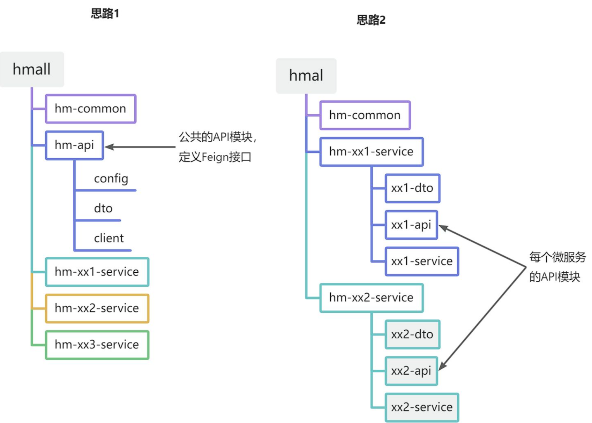

OpenFeign客户端是一个web声明式http远程调用工具，可以直接根据服务名称去注册中心获取指定的服务IP集合，提供了接口和注解方式进行调用，内嵌集成了Ribbon本地负载均衡器（现在流行使用loadbalancer）

<br>

## 快速入门

上一节远程调用代码仍然比较复杂

因此，我们必须想办法改变远程调用的开发模式，让**远程调用像本地方法调用一样简单**。而这就要用到OpenFeign组件了。

其实远程调用的关键点就在于四个：

* 请求方式

* 请求路径

* 请求参数

* 返回值类型

所以，OpenFeign就利用SpringMVC的相关注解来声明上述4个参数，然后基于动态代理帮我们生成远程调用的代码，而无需我们手动再编写，非常方便。


1.引入依赖

```xml
  <!--openFeign-->
  <dependency>
      <groupId>org.springframework.cloud</groupId>
      <artifactId>spring-cloud-starter-openfeign</artifactId>
  </dependency>

  <!--负载均衡器-->
  <dependency>
      <groupId>org.springframework.cloud</groupId>
      <artifactId>spring-cloud-starter-loadbalancer</artifactId>
  </dependency>
```

2.启用OpenFeign

接下来，我们在启动类上添加注解，启动OpenFeign功能

```java
@EnableFeignClients
```

3.编写OpenFeign客户端

```java
@FeignClient("item-service")
public interface ItemClient {

    // 注解指定请求方式、请求路径、参数类型、返回类型
    @GetMapping("/items")
    List<ItemDTO> queryItemsByIds(@RequestParam("ids") List<Long> ids);
}

```

!!!note
    这里只需要声明接口，无需实现方法。接口中的几个关键信息：

    * `@FeignClient("item-service")` ：声明服务名称

    * `@GetMapping` ：声明请求方式

    * `@GetMapping("/items")` ：声明请求路径

    * `@RequestParam("ids") Collection<Long> ids` ：声明请求参数

    * `List<ItemDTO>` ：返回值类型


4.使用FeignClient

注入Bean并调用接口中的方法即可

```java
@Autowired
private ItemClient itemClient;
public List<ItemDTO> queryItemsByIds(List<Long> ids) {
    return itemClient.queryItemsByIds(ids);
}
```

<br>

---

## 连接池

!!!info
    OpenFeign默认使用JDK提供的`HttpURLConnection`, 效率较低

Feign底层发起http请求，依赖于其它的框架。其底层支持的http客户端实现包括：

* HttpURLConnection：默认实现，不支持连接池

* Apache HttpClient ：支持连接池

* OKHttp：支持连接池

因此我们通常会使用带有连接池的客户端来代替默认的HttpURLConnection。

比如，我们使用OK Http


1.引入依赖

```xml
<!--OK http 的依赖 -->
<dependency>
  <groupId>io.github.openfeign</groupId>
  <artifactId>feign-okhttp</artifactId>
</dependency>
```

2.开启连接池

在`application.yml`配置文件中开启Feign的连接池功能：

```yaml
feign:
  okhttp:
    enabled: true # 开启OKHttp功能
```

3.重启生效
   
<br>

## 最佳使用方案

如果在其他微服务中也需要调用该接口，需要重新编写相同的`Client`，导致代码重复

避免重复编码的办法就是**抽取**。不过这里有两种抽取思路：

* 思路1：抽取到微服务之外的公共module

* 思路2：每个微服务自己抽取一个module（推荐）

如图：




!!!tip
    方案1抽取更加简单，工程结构也比较清晰，但缺点是整个项目耦合度偏高。

    方案2抽取相对麻烦，工程结构相对更复杂，但服务之间耦合度降低。


需要调用接口的服务引入相关API模块的依赖，并且在启动类的注解`@EnableFeignClients`中**指定扫描的Client即可**

<br>

## 日志配置

OpenFeign只会在FeignClient所在包的日志级别为**DEBUG**时，才会输出日志。而且其日志级别有4级：

* **NONE**：不记录任何日志信息，这是默认值。

* **BASIC**：仅记录请求的方法，URL以及响应状态码和执行时间

* **HEADERS**：在BASIC的基础上，额外记录了请求和响应的头信息

* **FULL**：记录所有请求和响应的明细，包括头信息、请求体、元数据。

<br>

Feign默认的日志级别就是NONE，所以看不到请求日志。


在api模块下新建一个配置类，定义Feign的日志级别：

```java
public class DefaultFeignConfig {
    @Bean
    public Logger.Level feignLoggerLevel() {
        return Logger.Level.FULL;
    }
}
```

接下来，要让日志级别生效，还需要配置这个类。有两种方式：

* **局部**生效：在某个`FeignClient`中配置，只对当前`FeignClient`生效

```java
@FeignClient(value = "item-service", configuration = DefaultFeignConfig.class)
```

* **全局**生效：在`@EnableFeignClients`中配置，针对所有`FeignClient`生效。

```java
@EnableFeignClients(defaultConfiguration = DefaultFeignConfig.class)
```

!!!tip
    一般情况下无需开启日志，调试时才需开启

---

**上一节**：[服务治理](服务治理.md)

**下一节**：[网关](网关.md)


