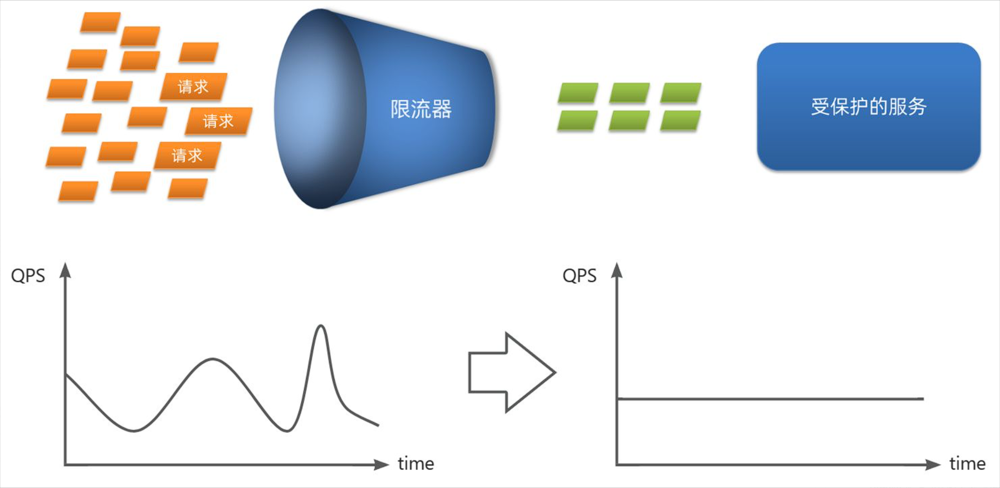
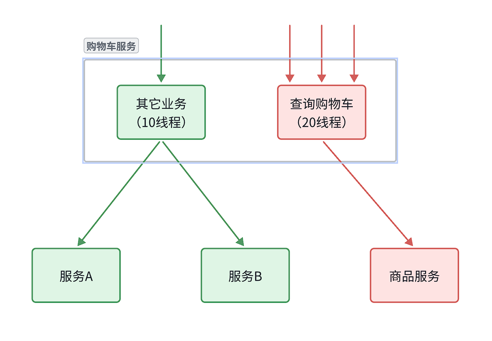
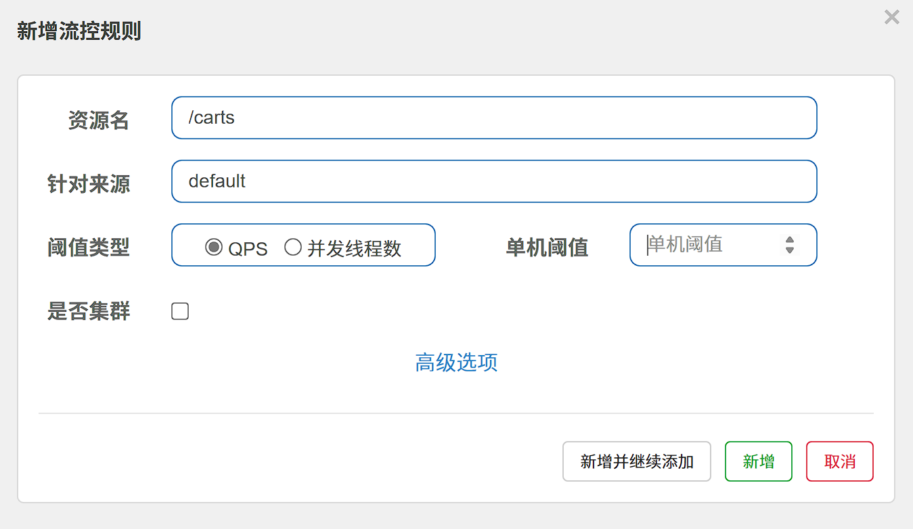
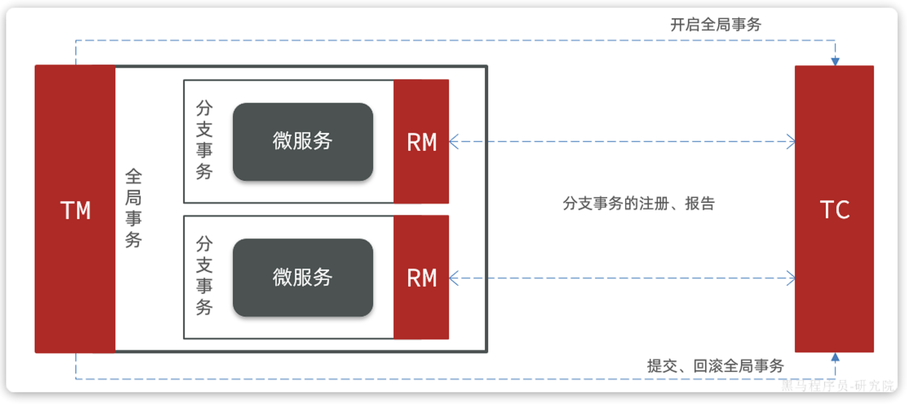
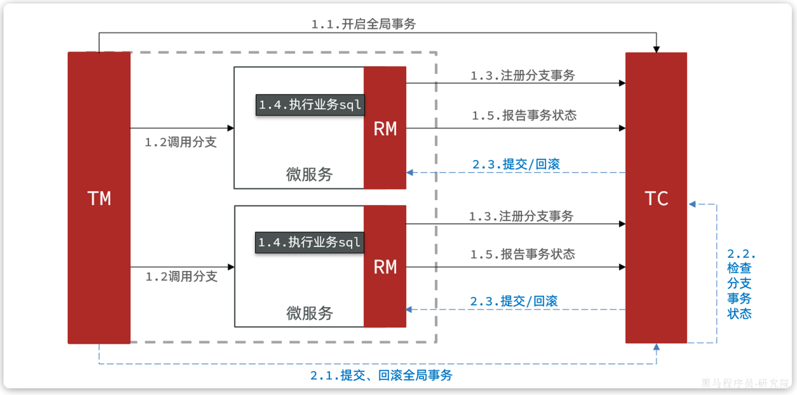
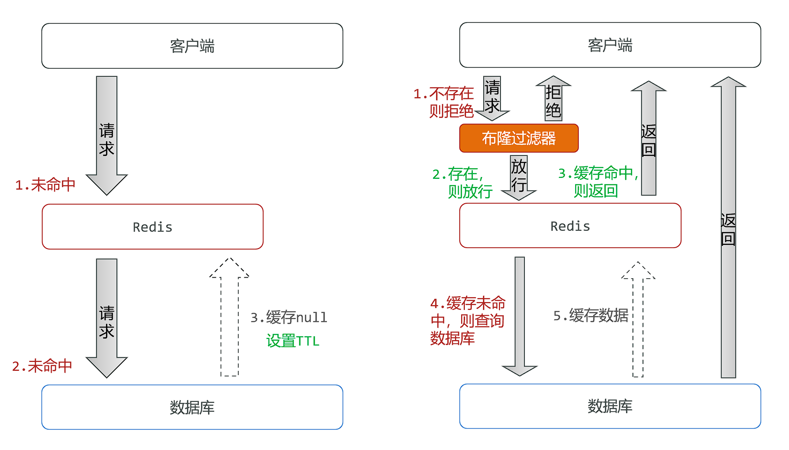

## MyBatis-Plus

### 快速入门

1. 引入依赖(maven)：

```xml
        <dependency>
            <groupId>com.baomidou</groupId>
            <artifactId>mybatis-plus-spring-boot3-starter</artifactId>
            <version>3.5.9</version>
        </dependency>
        <!-- springBoot3依赖 -->
```

> [!TIP]
>
> 以上为Spring Boot3.x.x版本依赖，3.x.x以下版本略有不同


2. 自定义的Mapper继承MybatisPlus提供的BaseMapper接口：

```java
public interface UserMapper extends BaseMapper<User> {}
```


#### 常见注解

> [!TIP]
>
> MyBatisPlus通过扫描实体类，并基于反射获取实体类信息作为数据库表信息。

约定大于配置：

- 类名驼峰转下划线作为表名

- 名为id的字段作为主键

- 变量名驼峰转下划线作为表的字段名
  
  

MybatisPlus中比较常用的几个注解如下(主要用于不满足约定的情况)：

- `@TableName`：用来指定表名

- `@TableId`：用来指定表中的主键字段信息

- `@TableField`：用来指定表中的普通字段信息

```java
@TableName("user")
public class User {

    /**
     * 用户id
     */
    @TableId(value = "id", type = IdType.AUTO)
    private Long id;

    /**
     * 用户名
     */
    @TableField("username")
    private String username;
}
```

IdType枚举（建议指定）：

- `AUTO`：数据库自增长

- `INPUT`：通过set方法自行输入

- `ASSIGN_ID`：分配 ID，接口`IdentifierGenerator`的方法nextId来生成id，默认实现类为`DefaultIdentifierGenerator`雪花算法
  
  

使用@TableField的常见场景：

- 成员变量名与数据库字段名不一致

- 成员变量名<font color=red>以is开头，且是布尔值</font>

- 成员变量名与数据库**关键字冲突**    如@TableField("\`order\`")  使用反引号括起来

- 成员变量不是数据库字段
  
  

#### 常用配置

```yml
mybatis-plus:
  type-aliases-package: com.ysh.entity #别名扫描包
  mapper-locations: classpath:mapper/**/*.xml #mapper扫描路径
  configuration:
    map-underscore-to-camel-case: true #开启驼峰命名规则
    cache-enabled: false #关闭Mybatis二级缓存
  global-config:
    db-config:
      id-type: assign_id #主键类型为雪花算法（全局配置）注解配置高于全局配置
      update-strategy: not_null #更新策略:只更新不为null的值
```

具体可参考官方文档：[使用配置](https://www.baomidou.com) [|](https://www.baomidou.com/pages/56bac0/) [MyBatis](https://www.baomidou.com/pages/56bac0/)[-Plus(baomidou.com)](https://www.baomidou.com/pages/56bac0/)


### 核心功能

#### 条件构造器


需求：

1. 查询出名字中带o的，存款大于等于1000元的人的id、username、info、balance字段
   
```sql
   # 原始SQL语句
   SELECT id,username,info,balance
   FROM user 
   WHERE username LIKE ? AND balance >= ?
```

```java
        // 构建查询条件
        QueryWrapper<User> wrapper = new QueryWrapper<User>()
                .select("id", "username", "info", "balance")
                .like("username", "o")
                .ge("balance", 1000);

        // 执行查询
        userMapper.selectList(wrapper);
```


2. 更新用户名为jack的用户的余额为2000
   
```sql
   UPDATE user
   SET balance = 2000
   WHERE (username = "jack")
```

```java
        User user = new User();
        user.setBalance(2000);

        QueryWrapper<User> wrapper = new QueryWrapper<User>()
                .eq("username", "jack");

        userMapper.update(user, wrapper);
```


3. 更新id为1,2,4的用户的余额，扣200

```sql
UPDATE user
SET balance = balance - 200
WHERE id in (1, 2, 4)
```

```java
        List<Long> ids = List.of(1L, 2L, 4L);
        UpdateWrapper<User> wrapper = new UpdateWrapper<User>()
                .setSql("balance = balance - 200")
                .in("id", ids);
        userMapper.update(null,wrapper);
```


4. LambdaWrapper

```java
        LambdaQueryWrapper<User> wrapper = new LambdaQueryWrapper<User>()
                .select(User::getId, User::getUsername, User::getInfo, User::getBalance)
                .like(User::getUsername, "o")
                .ge(User::getBalance, 1000);
        userMapper.selectList(wrapper).forEach(System.out::println);
```


总结：

条件构造器的用法：

- QueryWrapper和LambdaQueryWrapper通常用来构建select、delete、update的where条件部分

- UpdateWrapper和LambdaUpdateWrapper通常只有在set语句比较特殊才使用

- 尽量使用LambdaQueryWrapper和LambdaUpdateWrapper，避免硬编码
  
  

#### 自定义SQl

我们可以利用MyBatisPlus的Wrapper来构建复杂的Where条件，然后自己定义SQL语句中剩下的部分。


需求：将id在指定范围的用户（例如1、2、4 ）的余额扣减指定值

1. 基于Wrapper构建where条件

```java
        List<Long> ids = List.of(1L, 2L, 4L);
        int amount = 200;
        // 1.构建条件
        LambdaQueryWrapper<User> wrapper = new LambdaQueryWrapper<User>().in(User::getId, ids);
        //2.自定义SQL方法调用
        userMapper.updateBalanceByIds(wrapper, amount);
```

2. 在mapper方法参数中用Param注解声明wrapper变量名称，必须是ew

```java
void updateBalanceByIds(@Param("ew") LambdaQueryWrapper<User> wrapper, @Param("amount") int amount);
```

> [!CAUTION]
>
> Wrapper参数必须指定为“ew”

3. 自定义SQL，并使用Wrapper条件

```xml
    <update id="updateBalanceByIds">
        UPDATE tb_user SET balance = balance - #{amount} ${ew.customSqlSegment}
    </update>
```


#### Service接口

##### 基本使用


   使用步骤：

1. 自定义Service接口继承IService接口

```java
public interface IUserService extends IService<User> {
}
```

2. 自定义Service实现类，实现自定义接口并继承ServiceImpl类

```java
@Service
public class UserServiceImpl extends ServiceImpl<UserMapper, User> implements IUserService {
}
```


##### Lambda

IService中还提供了**Lambda**功能来简化我们的复杂查询及更新功能。

**案例一**：实现一个根据复杂条件查询用户的接口，查询条件如下：

* name：用户名关键字，可以为空

* status：用户状态，可以为空

* minBalance：最小余额，可以为空

* maxBalance：最大余额，可以为空

可以理解成一个用户的后台管理界面，管理员可以自己选择条件来筛选用户，因此上述条件不一定存在，需要做判断。


```java
    List<User> users = userService.lambdaQuery()
            .like(username != null, User::getUsername, username)
            .eq(status != null, User::getStatus, status)
            .ge(minBalance != null, User::getBalance, minBalance)
            .le(maxBalance != null, User::getBalance, maxBalance)
            .list();
```

> 在组织查询条件的时候，我们加入了 `username != null` 这样的参数，意思就是当条件成立时才会添加这个查询条件

可以发现lambdaQuery方法中除了可以构建条件，还需要在链式编程的最后添加一个`list()`，这是在告诉MP我们的调用结果需要是一个list集合。这里不仅可以用`list()`，可选的方法有：

* `.one()`：最多1个结果

* `.list()`：返回集合结果

* `.count()`：返回计数结果

MybatisPlus会根据链式编程的最后一个方法来判断最终的返回结果。


根据id修改用户余额

```java
lambdaUpdate()
            .set(User::getBalance, remainBalance) // 更新余额
            .set(remainBalance == 0, User::getStatus, 2) // 动态判断，是否更新status
            .eq(User::getId, id)
            .eq(User::getBalance, user.getBalance()) // 乐观锁，解决并发问题
            .update();
```


##### 批量新增

测试逐条插入数据，效率极低。


然后再试试MybatisPlus的批处理：

```java
@Test
void testSaveBatch() {
    // 准备10万条数据
    List<User> list = new ArrayList<>(1000);
    long b = System.currentTimeMillis();
    for (int i = 1; i <= 100000; i++) {
        list.add(buildUser(i));
        // 每1000条批量插入一次
        if (i % 1000 == 0) {
            userService.saveBatch(list);
            list.clear();
        }
    }
    long e = System.currentTimeMillis();
    System.out.println("耗时：" + (e - b));
}
```

> [!TIP]
>
> 比逐条新增效率提高了10倍左右


`MybatisPlus`的批处理是基于`PrepareStatement`的预编译模式，然后批量提交，最终在数据库执行时还是会有多条insert语句，逐条插入数据。SQL类似这样：

```sql
Preparing: INSERT INTO user ( username, password, phone, info, balance, create_time, update_time ) VALUES ( ?, ?, ?, ?, ?, ?, ? )
Parameters: user_1, 123, 18688190001, "", 2000, 2023-07-01, 2023-07-01
Parameters: user_2, 123, 18688190002, "", 2000, 2023-07-01, 2023-07-01
Parameters: user_3, 123, 18688190003, "", 2000, 2023-07-01, 2023-07-01
```

而如果想要得到最佳性能，最好是将多条SQL合并为一条，像这样：

```sql
INSERT INTO user ( username, password, phone, info, balance, create_time, update_time )
VALUES 
(user_1, 123, 18688190001, "", 2000, 2023-07-01, 2023-07-01),
(user_2, 123, 18688190002, "", 2000, 2023-07-01, 2023-07-01),
(user_3, 123, 18688190003, "", 2000, 2023-07-01, 2023-07-01),
(user_4, 123, 18688190004, "", 2000, 2023-07-01, 2023-07-01);
```


**解决方案：**

**MySQL**的客户端连接参数中有这样的一个参数：`rewriteBatchedStatements`。顾名思义，就是重写批处理的`statement`语句。

> [!TIP]
>
> 这个参数的默认值是false，我们需要修改连接参数，将其配置为true

修改项目中的application.yml文件，在jdbc的url后面添加参数`&rewriteBatchedStatements=true`

```yml
spring:
  datasource:
    url: jdbc:mysql://8.138.186.154:3306/mp?rewriteBatchedStatements=true&useUnicode=true&characterEncoding=UTF-8&autoReconnect=true&serverTimezone=Asia/Shanghai
    driver-class-name: com.mysql.cj.jdbc.Driver
    username: root
    password: 123456
```


### 扩展功能

#### 代码生成

在使用MybatisPlus以后，基础的`Mapper`、`Service`、`PO`代码相对固定，重复编写也比较麻烦。因此MybatisPlus官方提供了代码生成器根据数据库表结构生成`PO`、`Mapper`、`Service`等相关代码。只不过代码生成器同样要编码使用，也很麻烦。

推荐使用一款`MybatisPlus`的插件(IDEA插件)，它可以基于图形化界面完成`MybatisPlus`的代码生成，非常简单。


#### 静态工具

有的时候Service之间也会相互调用，为了**避免出现循环依赖问题**，MybatisPlus提供一个静态工具类：`Db`，其中的一些静态方法与`IService`中方法签名基本一致，也可以帮助我们实现CRUD功能：


示例：

```java
@Test
void testDbGet() {
    User user = Db.getById(1L, User.class);
    System.out.println(user);
}

@Test
void testDbList() {
    // 利用Db实现复杂条件查询
    List<User> list = Db.lambdaQuery(User.class)
            .like(User::getUsername, "o")
            .ge(User::getBalance, 1000)
            .list();
    list.forEach(System.out::println);
}

@Test
void testDbUpdate() {
    Db.lambdaUpdate(User.class)
            .set(User::getBalance, 2000)
            .eq(User::getUsername, "Rose");
}
```


#### 逻辑删除

对于一些比较重要的数据，我们往往会采用逻辑删除的方案，即：

* 在表中添加一个字段标记数据是否被删除

* 当删除数据时把标记置为true

* 查询时过滤掉标记为true的数据
  
  > [!WARNING]
  >
  > 一旦采用了逻辑删除，所有的查询和删除逻辑都要跟着变化，非常麻烦。

  
  
  为了解决这个问题，MybatisPlus就添加了对逻辑删除的支持。

> [!CAUTION]
>
> **注意**，只有MybatisPlus生成的SQL语句才支持自动的逻辑删除，自定义SQL需要自己手动处理逻辑删除。


例如，我们给`address`表添加一个逻辑删除字段：

```sql
alter table address add deleted bit default b'0' null comment '逻辑删除';
```


然后给`Address`实体添加`deleted`字段(Boolean类型)：


接下来，我们要在`application.yml`中配置逻辑删除字段：

```yml
mybatis-plus:
  global-config:
    db-config:
      logic-delete-field: deleted # 全局逻辑删除的实体字段名(since 3.3.0,配置后可以忽略不配置步骤2)
      logic-delete-value: 1 # 逻辑已删除值(默认为 1)
      logic-not-delete-value: 0 # 逻辑未删除值(默认为 0)
```


执行删除方法，与普通删除一模一样，但是底层的SQL逻辑变了：


> [!TIP]
>
> 查询也会自动筛选逻辑删除数据


综上， 开启了逻辑删除功能以后，我们就可以像普通删除一样做CRUD，基本不用考虑代码逻辑问题。还是非常方便的。

> [!CAUTION]
>
> **注意**：逻辑删除本身也有自己的问题，比如：
>
> * 会导致数据库表垃圾数据越来越多，从而影响查询效率
>
> * SQL中全都需要对逻辑删除字段做判断，影响查询效率
>
> 因此，不太推荐采用逻辑删除功能，如果数据不能删除，可以采用把**数据迁移到其它表**的办法。
>


#### 通用枚举

User类中有一个用户状态字段：

```java
private Integer status;//使用状态（1正常 2冻结）
```

像这种字段我们一般会定义一个**枚举**，做业务判断的时候就可以直接基于枚举做比较。但是我们数据库采用的是`int`类型，对应的PO也是`Integer`。因此业务操作时必须手动把`枚举`与`Integer`转换，非常麻烦。

因此，MybatisPlus提供了一个处理枚举的类型转换器，可以帮我们**把枚举类型与数据库类型自动转换**。


定义枚举类：

> [!TIP]
>
> 要让`MybatisPlus`处理枚举与数据库类型自动转换，我们必须告诉`MybatisPlus`，枚举中的哪个字段的值作为数据库值。 `MybatisPlus`提供了`@EnumValue`注解来标记枚举属性

```java
import com.baomidou.mybatisplus.annotation.EnumValue;
import lombok.Getter;

@Getter
public enum UserStatus {
    NORMAL(1, "正常"),
    FREEZE(2, "冻结");
    
    @EnumValue
    private final int value;
    private final String desc;

    UserStatus(int value, String desc) {
        this.value = value;
        this.desc = desc;
    }
}
```


然后把`User`类中的`status`字段改为`UserStatus` 类型


配置枚举处理器,在application.yaml文件中添加配置：

```yml
mybatis-plus:
  configuration:
    default-enum-type-handler: com.baomidou.mybatisplus.core.handlers.MybatisEnumTypeHandler
```


同时，为了使页面查询结果也是枚举格式，我们需要修改UserVO中的status属性

并且，在UserStatus枚举中通过`@JsonValue`注解标记JSON序列化时展示的字段


#### JSON类型处理器

数据库的user表中有一个`info`字段，是JSON类型

而目前`User`实体类中却是`String`类型


这样一来，我们要读取info中的属性时就非常不方便。如果要方便获取，info的类型最好是一个`Map`或者实体类。

而一旦我们把`info`改为`对象`类型，就需要在写入数据库时手动转为`String`，再读取数据库时，手动转换为`对象`，这会非常麻烦。


因此MybatisPlus提供了很多特殊类型字段的类型处理器，解决特殊字段类型与数据库类型转换的问题。例如处理JSON就可以使用`JacksonTypeHandler`处理器。


使用步骤：

1. 定义实体

首先，我们定义一个单独实体类来与info字段的属性匹配

```java
public class UserInfo{
    //...
}
```

2. 使用类型处理器

接下来，将User类的info字段修改为UserInfo类型，并声明类型处理器

```java
@TableField(typeHandler = JacksonTypeHandler.class)
private UserInfo info;
```


### 插件功能

MybatisPlus提供了很多的插件功能，进一步拓展其功能。目前已有的插件有：

* `PaginationInnerInterceptor`：自动分页

* `TenantLineInnerInterceptor`：多租户

* `DynamicTableNameInnerInterceptor`：动态表名

* `OptimisticLockerInnerInterceptor`：乐观锁

* `IllegalSQLInnerInterceptor`：sql 性能规范

* `BlockAttackInnerInterceptor`：防止全表更新与删除
  
  

#### 分页插件

在项目中新建一个配置类

```java
@Configuration
public class MybatisConfig {

    @Bean
    public MybatisPlusInterceptor mybatisPlusInterceptor() {
        // 初始化核心插件
        MybatisPlusInterceptor interceptor = new MybatisPlusInterceptor();
        // 添加分页插件
        interceptor.addInnerInterceptor(new PaginationInnerInterceptor(DbType.MYSQL));
        return interceptor;
    }
}
```


编写一个分页查询的测试

```java
@Test
void testPageQuery() {
    // 1.分页查询，new Page()的两个参数分别是：页码、每页大小
    Page<User> p = userService.page(new Page<>(2, 2));
    // 2.总条数
    System.out.println("total = " + p.getTotal());
    // 3.总页数
    System.out.println("pages = " + p.getPages());
    // 4.数据
    List<User> records = p.getRecords();
    records.forEach(System.out::println);
}
```

这里用到了分页参数，Page，即可以支持分页参数，也可以支持排序参数。常见的API如下：

```java
int pageNo = 1, pageSize = 5;
// 分页参数
Page<User> page = Page.of(pageNo, pageSize);
// 排序参数, 通过OrderItem来指定
page.addOrder(new OrderItem("balance", false));

userService.page(page);
```


#### 通用分页实体

现在要实现一个用户分页查询的接口，接口规范如下：

| **参数** | **说明**                                                                                                                                                                                                                                                                                                                                          |
| ------ | ----------------------------------------------------------------------------------------------------------------------------------------------------------------------------------------------------------------------------------------------------------------------------------------------------------------------------------------------- |
| 请求方式   | GET                                                                                                                                                                                                                                                                                                                                             |
| 请求路径   | /users/page                                                                                                                                                                                                                                                                                                                                     |
| 请求参数   | `{    "pageNo": 1,    "pageSize": 5,    "sortBy": "balance",    "isAsc": false,    "name": "o",    "status": 1}`                                                                                                                                                                                                                                |
| 返回值    | `{    "total": 100006,    "pages": 50003,    "list": [        {            "id": 1685100878975279298,            "username": "user_9****",            "info": {                "age": 24,                "intro": "英文老师",                "gender": "female"            },            "status": "正常",            "balance": 2000        }    ]}` |
| 特殊说明   | 如果排序字段为空，默认按照更新时间排序<br>排序字段不为空，则按照排序字段排序                                                                                                                                                                                                                                                                                                        |

这里需要定义3个实体：

* `UserQuery`：分页查询条件的实体，包含分页、排序参数、过滤条件

* `PageDTO`：分页结果实体，包含总条数、总页数、当前页数据

* `UserVO`：用户页面视图实体
  
  

`PageQuery`是前端提交的查询参数，一般包含四个属性：

* `pageNo`：页码

* `pageSize`：每页数据条数

* `sortBy`：排序字段

* `isAsc`：是否升序

```java
@Data
@ApiModel(description = "分页查询实体")
public class PageQuery {
    @ApiModelProperty("页码")
    private Long pageNo;
    @ApiModelProperty("页码")
    private Long pageSize;
    @ApiModelProperty("排序字段")
    private String sortBy;
    @ApiModelProperty("是否升序")
    private Boolean isAsc;
}
```

> 其他类可继承该类实现扩展


`PageDTO`

```java
@Data
public class PageDTO<T> {
    private Long total;
    private Long pages;
    private List<T> list;
}
```


测试代码：

```java
@Override
public PageDTO<UserVO> queryUsersPage(PageQuery query) {
    // 1.构建条件
    // 1.1.分页条件
    Page<User> page = Page.of(query.getPageNo(), query.getPageSize());
    // 1.2.排序条件
    if (query.getSortBy() != null) {
        page.addOrder(new OrderItem(query.getSortBy(), query.getIsAsc()));
    }else{
        // 默认按照更新时间排序
        page.addOrder(new OrderItem("update_time", false));
    }
    // 2.查询
    this.page(page);
    // 3.数据非空校验
    List<User> records = page.getRecords();
    if (records == null || records.size() <= 0) {
        // 无数据，返回空结果
        return new PageDTO<>(page.getTotal(), page.getPages(), Collections.emptyList());
    }
    // 4.有数据，转换
    List<UserVO> list = BeanUtil.copyToList(records, UserVO.class);
    // 5.封装返回
    return new PageDTO<UserVO>(page.getTotal(), page.getPages(), list);
}
```


#### 通用分页实体封装


在刚才的代码中，从`PageQuery`到`MybatisPlus`的`Page`之间转换的过程还是比较麻烦的。

我们完全可以在`PageQuery`这个实体中定义一个工具方法，简化开发。

```java
import com.baomidou.mybatisplus.core.metadata.OrderItem;
import com.baomidou.mybatisplus.extension.plugins.pagination.Page;
import lombok.Data;

@Data
public class PageQuery {
    private Integer pageNo;
    private Integer pageSize;
    private String sortBy;
    private Boolean isAsc;

    public <T>  Page<T> toMpPage(OrderItem ... orders){
        // 1.分页条件
        Page<T> p = Page.of(pageNo, pageSize);
        // 2.排序条件
        // 2.1.先看前端有没有传排序字段
        if (sortBy != null) {
            p.addOrder(new OrderItem(sortBy, isAsc));
            return p;
        }
        // 2.2.再看有没有手动指定排序字段
        if(orders != null){
            p.addOrder(orders);
        }
        return p;
    }

    public <T> Page<T> toMpPage(String defaultSortBy, boolean isAsc){
        return this.toMpPage(new OrderItem(defaultSortBy, isAsc));
    }

    public <T> Page<T> toMpPageDefaultSortByCreateTimeDesc() {
        return toMpPage("create_time", false);
    }

    public <T> Page<T> toMpPageDefaultSortByUpdateTimeDesc() {
        return toMpPage("update_time", false);
    }
}
```


在查询出分页结果后，数据的非空校验，数据的vo转换都是模板代码，编写起来很麻烦。

我们完全可以将其封装到PageDTO的工具方法中，简化整个过程

```java
import cn.hutool.core.bean.BeanUtil;
import com.baomidou.mybatisplus.extension.plugins.pagination.Page;
import lombok.AllArgsConstructor;
import lombok.Data;
import lombok.NoArgsConstructor;

import java.util.Collections;
import java.util.List;
import java.util.function.Function;
import java.util.stream.Collectors;

@Data
@NoArgsConstructor
@AllArgsConstructor
public class PageDTO<V> {
    private Long total;
    private Long pages;
    private List<V> list;

    /**
     * 返回空分页结果
     * @param p MybatisPlus的分页结果
     * @param <V> 目标VO类型
     * @param <P> 原始PO类型
     * @return VO的分页对象
     */
    public static <V, P> PageDTO<V> empty(Page<P> p){
        return new PageDTO<>(p.getTotal(), p.getPages(), Collections.emptyList());
    }

    /**
     * 将MybatisPlus分页结果转为 VO分页结果
     * @param p MybatisPlus的分页结果
     * @param voClass 目标VO类型的字节码
     * @param <V> 目标VO类型
     * @param <P> 原始PO类型
     * @return VO的分页对象
     */
    public static <V, P> PageDTO<V> of(Page<P> p, Class<V> voClass) {
        // 1.非空校验
        List<P> records = p.getRecords();
        if (records == null || records.size() <= 0) {
            // 无数据，返回空结果
            return empty(p);
        }
        // 2.数据转换
        List<V> vos = BeanUtil.copyToList(records, voClass);
        // 3.封装返回
        return new PageDTO<>(p.getTotal(), p.getPages(), vos);
    }

    /**
     * 将MybatisPlus分页结果转为 VO分页结果，允许用户自定义PO到VO的转换方式
     * @param p MybatisPlus的分页结果
     * @param convertor PO到VO的转换函数
     * @param <V> 目标VO类型
     * @param <P> 原始PO类型
     * @return VO的分页对象
     */
    public static <V, P> PageDTO<V> of(Page<P> p, Function<P, V> convertor) {
        // 1.非空校验
        List<P> records = p.getRecords();
        if (records == null || records.size() <= 0) {
            // 无数据，返回空结果
            return empty(p);
        }
        // 2.数据转换
        List<V> vos = records.stream().map(convertor).collect(Collectors.toList());
        // 3.封装返回
        return new PageDTO<>(p.getTotal(), p.getPages(), vos);
    }
}
```


---

## 微服务

### 配置管理

现在依然还有几个问题需要解决：

* 网关路由在配置文件中写死了，如果变更必须重启微服务

* 某些业务配置在配置文件中写死了，每次修改都要重启服务

* 每个微服务都有很多重复的配置，维护成本高
  
  

这些问题都可以通过统一的**配置管理器服务**解决。而Nacos不仅仅具备注册中心功能，也具备配置管理的功能：


#### 配置共享

1. 添加共享配置

首先是jdbc相关配置，在`配置管理`->`配置列表`中点击`+`新建一个配置


2. 拉取共享配置

接下来，我们要在微服务拉取共享配置。将拉取到的共享配置与本地的`application.yaml`配置合并，完成项目上下文的初始化。

不过，需要注意的是，读取Nacos配置是SpringCloud上下文（`ApplicationContext`）初始化时处理的，发生在项目的引导阶段。然后才会初始化SpringBoot上下文，去读取`application.yaml`。

也就是说引导阶段，`application.yaml`文件尚未读取，根本不知道nacos 地址，该如何去加载nacos中的配置文件呢？

SpringCloud在初始化上下文的时候会先读取一个名为`bootstrap.yaml`(或者`bootstrap.properties`)的文件，如果我们将nacos地址配置到`bootstrap.yaml`中，那么在项目引导阶段就可以读取nacos中的配置了。


- 引入依赖

```xml
  <!--nacos配置管理-->
  <dependency>
      <groupId>com.alibaba.cloud</groupId>
      <artifactId>spring-cloud-starter-alibaba-nacos-config</artifactId>
  </dependency>
  <!--读取bootstrap文件-->
  <dependency>
      <groupId>org.springframework.cloud</groupId>
      <artifactId>spring-cloud-starter-bootstrap</artifactId>
  </dependency>
```

- 新建bootstrap.yaml

```yaml
spring:
  application:
    name: cart-service # 服务名称
  profiles:
    active: dev
  cloud:
    nacos:
      server-addr: 192.168.150.101 # nacos地址
      config:
        file-extension: yaml # 文件后缀名
        shared-configs: # 共享配置
          - dataId: shared-jdbc.yaml # 共享mybatis配置
          - dataId: shared-log.yaml # 共享日志配置
          - dataId: shared-swagger.yaml # 共享swagger配置
```

- 修改application.yaml

```yaml
server:
  port: 8082
feign:
  okhttp:
    enabled: true # 开启OKHttp连接池支持
hm:
  swagger:
    title: 购物车服务接口文档
    package: com.hmall.cart.controller
  db:
    database: hm-cart
```

- 重启生效
  
  

#### 配置热更新

有很多的业务相关参数，将来可能会根据实际情况临时调整，可以将参数写入配置文件，但是修改了配置还是需要重新打包、重启服务才能生效。

这就要用到Nacos的配置热更新能力了，分为两步：

* 在Nacos中添加配置

* 在微服务读取配置
1. 首先，我们在nacos中添加一个配置文件

注意文件的dataId格式

```yaml
[服务名]-[spring.active.profile].[后缀名]
```

文件名称由三部分组成：

* **`服务名`**：我们是购物车服务，所以是`cart-service`

* **`spring.active.profile`**：就是spring boot中的`spring.active.profile`，可以省略，则所有profile共享该配置

* **`后缀名`**：例如yaml
2. 接着，我们在微服务中读取配置，实现配置热更新

编写属性类读取配置

```java
@Data
@Component
@ConfigurationProperties(prefix = "hm.cart")
public class CartProperties {
    private Integer maxAmount;
}
```

3. 在业务中注入属性类并使用即可
   
   

#### 动态路由

网关的路由配置全部是在项目启动时由`org.springframework.cloud.gateway.route.CompositeRouteDefinitionLocator`在项目启动的时候加载，并且一经加载就会缓存到内存中的路由表内（一个Map），不会改变。也不会监听路由变更，所以，我们无法利用上节课学习的配置热更新来实现路由更新。


因此，我们必须监听Nacos的配置变更，然后手动把最新的路由更新到路由表中。这里有两个难点：

* 如何监听Nacos配置变更？

* 如何把路由信息更新到路由表？
  
  
1. 引入依赖

```xml
<!--统一配置管理-->
<dependency>
    <groupId>com.alibaba.cloud</groupId>
    <artifactId>spring-cloud-starter-alibaba-nacos-config</artifactId>
</dependency>
<!--加载bootstrap-->
<dependency>
    <groupId>org.springframework.cloud</groupId>
    <artifactId>spring-cloud-starter-bootstrap</artifactId>
</dependency>
```


2. 配置`bootstrap.yaml`

```yaml
spring:
  application:
    name: gateway

  profiles:
    active: dev

  cloud:
    nacos:
      server-addr: localhost:8848
      config:
        file-extension: yaml
        shared-configs:
          - data-id: shared-log.yaml
```


3. 监听配置变更

> 官方文档监听配置变更
> 
> [Java SDK](https://nacos.io/zh-cn/docs/sdk.html)

如果希望 Nacos 推送配置变更，可以使用 Nacos 动态监听配置接口来实现。

```java
public void addListener(String dataId, String group, Listener listener)
```

示例：

```java
@Slf4j
@Component
@RequiredArgsConstructor
public class DynamicRouterLoader {

    private final NacosConfigManager nacosConfigManager;

    private final RouteDefinitionWriter writer;

    private static final String dataId = "gateway-routes.json";

    private static final String group = "DEFAULT_GROUP";

    private final Set<String> roueIds = new HashSet<>();

    @PostConstruct
    public void initRouterConfigListener() throws NacosException {
        String configInfo = nacosConfigManager.getConfigService()
                .getConfigAndSignListener(dataId, group, 5000, new Listener() {
                    @Override
                    public Executor getExecutor() {
                        return null;
                    }

                    @Override
                    public void receiveConfigInfo(String s) {
                        // TODO: 监听配置变更，重新加载路由配置
                        updateConfigInfo(s);
                    }
                });
        // 初始加载路由配置
        updateConfigInfo(configInfo);
    }
}
```

这里核心的步骤有2步：

* 创建ConfigService，目的是连接到Nacos(SpringBoot已自动装配)

* 添加配置监听器，编写配置变更的通知处理逻辑

> 注：项目第一次启动时不仅仅需要添加监听器，也需要手动读取配置


4. 更新路由

更新路由要用到`org.springframework.cloud.gateway.route.RouteDefinitionWriter`这个接口：

```java
public interface RouteDefinitionWriter {
        /**
     * 更新路由到路由表，如果路由id重复，则会覆盖旧的路由
     */
        Mono<Void> save(Mono<RouteDefinition> route);
        /**
     * 根据路由id删除某个路由
     */
        Mono<Void> delete(Mono<String> routeId);

}
```

示例：

```java
    public void updateConfigInfo(String configInfo){
        // TODO: 更新路由配置

        log.debug("监听到路由配置变更，重新加载路由配置:{}",configInfo);

        // 解析配置信息，封装成RouteDefinition对象
        List<RouteDefinition> routeDefinitions = JSONUtil.toList(configInfo, RouteDefinition.class);

        // 清空旧的路由信息
        for (String routeId : roueIds){
            writer.delete(Mono.just(routeId)).subscribe();
        }

        // 清空路由ID集合
        roueIds.clear();

        // 更新路由表
        for (RouteDefinition routeDefinition : routeDefinitions) {
            writer.save(Mono.just(routeDefinition)).subscribe();
            // 记录路由ID
            roueIds.add(routeDefinition.getId());
        }
    }
```


nacos路由配置文件如下示例：

```json
[
    {
        "id": "item",
        "predicates": [{
            "name": "Path",
            "args":{"_genkey_0":"/items/**", "_genkey_1":"/search/**"}
        }],
        "filters": [],
        "uri": "lb://item-service"
    },
    {
        "id": "cart",
        "predicates": [{
            "name": "Path",
            "args": {"_genkey_0":"/carts/**"}
        }],
        "filters": [],
        "uri": "lb://cart-service"
    }
]
```


---

## 服务保护

### 存在的问题

在微服务远程调用的过程中，还存在几个问题需要解决。

- **业务健壮性**
  
  > 某服务故障，调用该服务的服务也应该得到数据

- **级联失败**(雪崩问题)
  
  > 如服务业务并发较高，占用过多Tomcat连接。可能会导致服务的所有接口响应时间增加，延迟变高，甚至是长时间阻塞直至查询失败。


### 雪崩问题解决方案

#### 请求限流

服务故障最重要原因，就是并发太高！解决了这个问题，就能避免大部分故障。当然，接口的并发不是一直很高，而是突发的。因此请求限流，就是**限制或控制**接口访问的并发流量，避免服务因流量激增而出现故障。


请求限流往往会有一个限流器，数量高低起伏的并发请求曲线，经过限流器就变的非常平稳。这就像是水电站的大坝，起到蓄水的作用，可以通过开关控制水流出的大小，让下游水流始终维持在一个平稳的量。




#### 线程隔离

当一个业务接口响应时间长，而且并发高时，就可能耗尽服务器的线程资源，导致服务内的其它接口受到影响。所以我们必须把这种影响降低，或者缩减影响的范围。线程隔离正是解决这个问题的好办法。

线程隔离的思想来自轮船的舱壁模式：


轮船的船舱会被隔板分割为N个相互隔离的密闭舱，假如轮船触礁进水，只有损坏的部分密闭舱会进水，而其他舱由于相互隔离，并不会进水。这样就把进水控制在部分船体，避免了整个船舱进水而沉没。


为了避免某个接口故障或压力过大导致整个服务不可用，我们可以限定每个接口可以使用的资源范围，也就是将其“隔离”起来。



> 如图所示，我们给查询购物车业务限定可用线程数量上限为20，这样即便查询购物车的请求因为查询商品服务而出现故障，也不会导致服务器的线程资源被耗尽，不会影响到其它接口。


#### 服务熔断

线程隔离虽然避免了雪崩问题，但故障服务（商品服务）依然会拖慢购物车服务（服务调用方）的接口响应速度。而且商品查询的故障依然会导致查询购物车功能出现故障，购物车业务也变的不可用了。


所以，我们要做两件事情：

* **编写服务降级逻辑**：就是服务调用失败后的处理逻辑，根据业务场景，可以抛出异常，也可以返回友好提示或默认数据。

* **异常统计和熔断**：统计服务提供方的异常比例，当比例过高表明该接口会影响到其它服务，应该拒绝调用该接口，而是直接走降级逻辑。


### Sentinel

> 微服务保护的技术有很多，但在目前国内使用较多的还是Sentinel
> 
> Sentinel是阿里巴巴开源的一款服务保护框架，目前已经加入SpringCloudAlibaba中。官方网站：
> 
> https://sentinelguard.io/zh-cn/

#### 介绍&安装

Sentinel 的使用可以分为两个部分:

* **核心库**（Jar包）：不依赖任何框架/库，能够运行于 Java 8 及以上的版本的运行时环境，同时对 Dubbo / Spring Cloud 等框架也有较好的支持。在项目中引入依赖即可实现服务限流、隔离、熔断等功能。

* **控制台**（Dashboard）：Dashboard 主要负责管理推送规则、监控、管理机器信息等。


控制台jar包下载地址：

https://github.com/alibaba/Sentinel/releases

运行

```bash
java -Dserver.port=8090 -Dcsp.sentinel.dashboard.server=localhost:8090 -Dproject.name=sentinel-dashboard -jar sentinel-dashboard.jar
```

访问[http://localhost:8090](http://localhost:8080)页面，就可以看到sentinel的控制台了：

> 需要输入账号和密码，默认都是：sentinel


docker安装

```bash
docker run -d \
 --name sentinel \
 -p 8858:8858 \
 --network work \
 -d bladex/sentinel-dashboard
```


#### 微服务整合

服务中添加如下依赖

```xml
<!--sentinel-->
<dependency>
    <groupId>com.alibaba.cloud</groupId> 
    <artifactId>spring-cloud-starter-alibaba-sentinel</artifactId>
</dependency>
```

配置控制台连接

```yaml
spring:
  cloud: 
    sentinel:
      transport:
        dashboard: localhost:8090
```


重启服务，然后访问接口，sentinel的客户端就会将服务访问的信息提交到`sentinel-dashboard`控制台。并展示出统计信息

点击簇点链路菜单，可以看到接口请求信息（所谓簇点链路，就是单机调用链路，是一次请求进入服务后经过的每一个被`Sentinel`监控的资源）

> 需要注意的是，我们的SpringMVC接口是按照Restful风格设计，可能导致多个簇点名称相同，可以做如下配置解决

```yaml
spring:
  cloud:
    sentinel:
      transport:
        dashboard: localhost:8090
      http-method-specify: true # 开启请求方式前缀
```


#### 请求限流

在簇点链路后面点击流控按钮，即可对其做限流配置




#### 线程隔离

限流可以降低服务器压力，尽量减少因并发流量引起的服务故障的概率，但并不能完全避免服务故障。一旦某个服务出现故障，我们必须隔离对这个服务的调用，避免发生雪崩。


配置方式同请求限流，只需将“阈值类型”修改为“并发线程数”


#### Fallback

触发限流或熔断后的请求不一定要直接报错，也可以返回一些默认数据或者友好提示，用户体验会更好。

给FeignClient编写失败后的降级逻辑有两种方式：

- 方式一：FallbackClass，无法对远程调用的异常做处理
- 方式二：FallbackFactory，可以对远程调用的异常做处理，我们一般选择这种方式。


**步骤一**：定义降级处理类，实现`FallbackFactory`：

```java
@Slf4j
public class ItemClientFallback implements FallbackFactory<ItemClient> {
    @Override
    public ItemClient create(Throwable cause) {
        return new ItemClient() {
            @Override
            public List<ItemDTO> queryItemByIds(Collection<Long> ids) {
                log.error("远程调用ItemClient#queryItemByIds方法出现异常，参数：{}", ids, cause);
                // 查询购物车允许失败，查询失败，返回空集合
                return CollUtils.emptyList();
            }

            @Override
            public void deductStock(List<OrderDetailDTO> items) {
                // 库存扣减业务需要触发事务回滚，查询失败，抛出异常
                throw new BizIllegalException(cause);
            }
        };
    }
}
```

**步骤二**：将降级处理类注册为一个`Bean`：

```java
@Bean
public ItemClientFallback itemClientFallback(){
    return new ItemClientFallback();
}
```

**步骤三**：在`ItemClient`接口中使用`ItemClientFallbackFactory`：

```java
@FeignClient(value = "item-service",
        fallbackFactory = ItemClientFallback.class)
```


#### 服务熔断

对于不太健康的接口，我们应该停止调用，直接走降级逻辑，避免影响到当前服务。也就是将商品查询接口**熔断**。当商品服务接口恢复正常后，再允许调用。这其实就是**断路器**的工作模式了。

Sentinel中的断路器不仅可以统计某个接口的**慢请求比例**，还可以统计**异常请求比例**。当这些比例超出阈值时，就会**熔断**该接口，即拦截访问该接口的一切请求，降级处理；当该接口恢复正常时，再放行对于该接口的请求。


断路器的工作状态切换有一个状态机来控制：


状态机包括三个状态：

- **closed**：关闭状态，断路器放行所有请求，并开始统计异常比例、慢请求比例。超过阈值则切换到open状态
- **open**：打开状态，服务调用被**熔断**，访问被熔断服务的请求会被拒绝，快速失败，直接走降级逻辑。Open状态持续一段时间后会进入half-open状态
- **half-open**：半开状态，放行一次请求，根据执行结果来判断接下来的操作。 
  - 请求成功：则切换到closed状态
  - 请求失败：则切换到open状态


我们可以在控制台通过点击簇点后的**`熔断`**按钮来配置熔断策略：


> 这种是按照慢调用比例来做熔断，上述配置的含义是：
>
> - RT超过200毫秒的请求调用就是慢调用
> - 统计最近1000ms内的最少5次请求，如果慢调用比例超过0.5，则触发熔断
> - 熔断持续时长5s


### 分布式事务

整个业务中，各个本地事务是有关联的。因此每个微服务的本地事务，也可以称为**分支事务**。多个有关联的分支事务一起就组成了**全局事务**。我们必须保证整个全局事务同时成功或失败。


我们知道每一个分支事务就是传统的**单体事务**，都可以满足ACID特性，但全局事务跨越多个服务、多个数据库，是否还能满足呢？

事务并未遵循ACID的原则，归其原因就是参与事务的多个子业务在不同的微服务，跨越了不同的数据库。虽然每个单独的业务都能在本地遵循ACID，但是它们互相之间没有感知，无法保证最终结果的统一


#### Seata

> [Seata 是什么？ | Apache Seata](https://seata.apache.org/zh-cn/docs/overview/what-is-seata/)

解决分布式事务的方案有很多，但实现起来都比较复杂，因此我们一般会使用开源的框架来解决分布式事务问题。在众多的开源分布式事务框架中，功能最完善、使用最多的就是阿里巴巴在2019年开源的Seata了。


解决分布式事务的思想非常简单：

就是找一个统一的**事务协调者**，与多个分支事务通信，检测每个分支事务的执行状态，保证全局事务下的每一个分支事务同时成功或失败即可。大多数的分布式事务框架都是基于这个理论来实现的。


Seata也不例外，在Seata的事务管理中有三个重要的角色：

-  **TC** (**Transaction Coordinator) - 事务协调者：**维护全局和分支事务的状态，协调全局事务提交或回滚。 
-  **TM (Transaction Manager) -** **事务管理器：**定义全局事务的范围、开始全局事务、提交或回滚全局事务。 
-  **RM (Resource Manager) -** **资源管理器：**管理分支事务，与TC交谈 以注册分支事务和报告分支事务的状态，并驱动分支事务提交或回滚。 

Seata的工作架构如图所示：




#### 部署TC服务

Seata支持多种存储模式，但考虑到持久化的需要，我们一般选择基于数据库存储。

准备一个seata目录，其中包含了seata运行时所需要的配置文件。


docker部署：

```bash
docker run --name seata \
-p 8099:8099 \
-p 7099:7099 \
-e SEATA_IP=<服务IP> \
-v ./seata:/seata-server/resources \
--privileged=true \
--network <网络名> \
-d \
seataio/seata-server:1.5.2
```

> -e SETA_IP 指定的IP地址为服务器IP，该IP会被推送到nacos(注册中心)，如果不指定（或指定为localhost）则会推送docker为其分配的IP，外部设备无法通过该IP访问seata


#### 微服务集成Seata

引入依赖

```xml
  <!--seata-->
  <dependency>
      <groupId>com.alibaba.cloud</groupId>
      <artifactId>spring-cloud-starter-alibaba-seata</artifactId>
  </dependency>
```


在服务中配置seata信息

```yaml
seata:
  registry: # TC服务注册中心的配置，微服务根据这些信息去注册中心获取tc服务地址
    type: nacos # 注册中心类型 nacos
    nacos:
      server-addr: localhost:8848 # nacos地址
      namespace: "" # namespace，默认为空
      group: DEFAULT_GROUP # 分组，默认是DEFAULT_GROUP
      application: seata-server # seata服务名称
      username: nacos
      password: nacos
  tx-service-group: work # 事务组名称
  service:
    vgroup-mapping: # 事务组与tc集群的映射关系
      work: "default"
```


#### XA模式

`XA` 规范 是` X/Open` 组织定义的分布式事务处理（DTP，Distributed Transaction Processing）标准，XA 规范 描述了全局的`TM`与局部的`RM`之间的接口，几乎所有主流的数据库都对 XA 规范 提供了支持。


Seata对原始的XA模式做了简单的封装和改造，以适应自己的事务模型，基本架构如图：




`RM`一阶段的工作：

1. 注册分支事务到`TC`
2. 执行分支业务sql但不提交
3. 报告执行状态到`TC`

`TC`二阶段的工作：

1.  `TC`检测各分支事务执行状态
   1. 如果都成功，通知所有RM提交事务
   2. 如果有失败，通知所有RM回滚事务 

`RM`二阶段的工作：

- 接收`TC`指令，提交或回滚事务


##### 优缺点

`XA`模式的优点是什么？

- 事务的强一致性，满足ACID原则
- 常用数据库都支持，实现简单，并且没有代码侵入

`XA`模式的缺点是什么？

- 因为一阶段需要锁定数据库资源，等待二阶段结束才释放，性能较差
- 依赖关系型数据库实现事务


##### 实现步骤

添加配置

```yaml
seata:
  data-source-proxy-mode: XA
```

其次，我们要利用`@GlobalTransactional`标记分布式事务的入口方法：


#### AT模式

`AT`模式同样是分阶段提交的事务模型，不过弥补了`XA`模型中资源锁定周期过长的缺陷。


阶段一`RM`的工作：

- 注册分支事务
- 记录undo-log（数据快照）
- 执行业务sql并提交
- 报告事务状态

阶段二提交时`RM`的工作：

- 删除undo-log即可

阶段二回滚时`RM`的工作：

- 根据undo-log恢复数据到更新前


##### AT模式与XA模式的区别

- `XA`模式一阶段不提交事务，锁定资源；`AT`模式一阶段直接提交，不锁定资源。
- `XA`模式依赖数据库机制实现回滚；`AT`模式利用数据快照实现数据回滚。
- `XA`模式强一致；`AT`模式最终一致

可见，AT模式使用起来更加简单，无业务侵入，性能更好。因此企业90%的分布式事务都可以用AT模式来解决。


##### 实现步骤

创建数据快照表

```sql
CREATE TABLE IF NOT EXISTS `undo_log`
(
    `branch_id`     BIGINT       NOT NULL COMMENT 'branch transaction id',
    `xid`           VARCHAR(128) NOT NULL COMMENT 'global transaction id',
    `context`       VARCHAR(128) NOT NULL COMMENT 'undo_log context,such as serialization',
    `rollback_info` LONGBLOB     NOT NULL COMMENT 'rollback info',
    `log_status`    INT(11)      NOT NULL COMMENT '0:normal status,1:defense status',
    `log_created`   DATETIME(6)  NOT NULL COMMENT 'create datetime',
    `log_modified`  DATETIME(6)  NOT NULL COMMENT 'modify datetime',
    UNIQUE KEY `ux_undo_log` (`xid`, `branch_id`)
) ENGINE = InnoDB
  AUTO_INCREMENT = 1
  DEFAULT CHARSET = utf8mb4 COMMENT ='AT transaction mode undo table';
```


配置文件修改为AT模式（不做配置默认为AT模式）

```yaml
seata:
  data-source-proxy-mode: AT
```


## 面试

### Redis

#### 主从集群

单节点Redis的并发能力是有上限的，要进一步提高Redis的并发能力，就需要搭建主从集群，实现读写分离。


简单架构图：


如图所示，集群中有一个master节点、两个slave节点（现在叫replica）。当我们通过Redis的Java客户端访问主从集群时，应该做好路由：

- 如果是写操作，应该访问master节点，master会自动将数据同步给两个slave节点
- 如果是读操作，建议访问各个slave节点，从而分担并发压力


使用docker compose启动多个Redis实例：

```bash
version: "3.2"

services:
  r1:
    image: redis
    container_name: r1
    network_mode: "host"
    entrypoint: ["redis-server", "--port", "7001"]
  r2:
    image: redis
    container_name: r2
    network_mode: "host"
    entrypoint: ["redis-server", "--port", "7002"]
  r3:
    image: redis
    container_name: r3
    network_mode: "host"
    entrypoint: ["redis-server", "--port", "7003"]
```

>｀docker compose up -d｀启动
>
>在host网络模式下，容器不会创建隔离的网络空间，而是直接共享宿主机的网络栈。在 host 模式下，性能较高


我们需要通过命令来配置主从关系：

```Bash
## Redis5.0以前
slaveof <masterip> <masterport>
## Redis5.0以后
replicaof <masterip> <masterport>
```

> `redis-cli` 下执行

有临时和永久两种模式：

- 永久生效：在redis.conf文件中利用`slaveof`命令指定`master`节点
- 临时生效：直接利用redis-cli控制台输入`slaveof`命令，指定`master`节点


##### **全量同步**

主从第一次建立连接时，会执行**全量同步**，将master节点的所有数据都拷贝给slave节点


`master`如何得知`salve`是否是第一次来同步？

- **`Replication Id`**：简称`replid`，是数据集的标记，replid一致则是同一数据集。每个`master`都有唯一的`replid`，`slave`则会继承`master`节点的`replid`
- **`offset`**：偏移量，随着记录在`repl_baklog`中的数据增多而逐渐增大。`slave`完成同步时也会记录当前同步的`offset`。如果`slave`的`offset`小于`master`的`offset`，说明`slave`数据落后于`master`，需要更新。

> **master**判断一个节点是否是第一次同步的依据，就是看replid是否一致


##### **增量同步**

全量同步需要先做RDB，然后将RDB文件通过网络传输个slave，成本太高了。因此除了第一次做全量同步，其它大多数时候slave与master都是做**增量同步**


这就要说到全量同步时的`repl_baklog`文件了。这个文件是一个固定大小的数组，只不过数组是环形，也就是说**角标到达数组末尾后，会再次从0开始读写**，这样数组头部的数据就会被覆盖。

`repl_baklog`中会记录Redis处理过的命令及`offset`，包括master当前的`offset`，和slave已经拷贝到的`offset`：


slave与master的offset之间的差异，就是salve需要增量拷贝的数据了。


如果slave出现网络阻塞，导致master的`offset`远远超过了slave的`offset`，当master的offset覆盖了slave未同步的offset,如果slave恢复，需要同步，却发现自己的`offset`都没有了，无法完成增量同步了。只能做**全量同步**。


##### 主从同步优化

- 在master中配置`repl-diskless-sync  yes`启用无磁盘复制，避免全量同步时的磁盘IO。

- Redis单节点上的内存占用不要太大，减少RDB导致的过多磁盘IO

- 适当提高`repl_baklog`的大小，发现slave宕机时尽快实现故障恢复，尽可能避免全量同步

- 限制一个master上的slave节点数量，如果实在是太多slave，则可以采用`主-从-从`链式结构，减少master压力

  

  `主-从-从`架构图：

  


#### 哨兵

Redis提供了`哨兵`（`Sentinel`）机制来监控主从集群监控状态，确保集群的高可用性。


哨兵的作用如下：

- **状态监控**：`Sentinel` 会不断检查`master`和`slave`是否按预期工作
- **故障恢复（failover）**：如果`master`故障，`Sentinel`会将一个`slave`提升为`master`。当故障实例恢复后会成为`slave`
- **状态通知**：`Sentinel`充当`Redis`客户端的服务发现来源，当集群发生`failover`时，会将最新集群信息推送给`Redis`的客户端


`Sentinel`基于**心跳机制**监测服务状态，每隔1秒向集群的每个节点发送ping命令，并通过实例的响应结果来做出判断：

- **主观下线（sdown）**：如果某sentinel节点发现某Redis节点未在规定时间响应，则认为该节点主观下线。
- **客观下线(odown)**：若超过指定数量（通过`quorum`设置）的sentinel都认为该节点主观下线，则该节点客观下线。quorum值最好超过Sentinel节点数量的一半，Sentinel节点数量至少3台。


一旦发现master故障，sentinel需要在salve中选择一个作为新的master，选择依据是这样的：

- 首先会判断slave节点与master节点断开时间长短，如果超过`down-after-milliseconds * 10`则会排除该slave节点
- 然后判断slave节点的`slave-priority`值，越小优先级越高，如果是0则永不参与选举（默认都是1）。
- 如果`slave-prority`一样，则判断slave节点的`offset`值，越大说明数据越新，优先级越高
- 最后是判断slave节点的`run_id`大小，越小优先级越高（`通过info server可以查看run_id`）。

https://redis.io/docs/management/sentinel/#replica-selection-and-priority


##### **搭建哨兵集群**

sentinel.conf文件

```conf
sentinel announce-ip "localhost"
sentinel monitor hmaster localhost 7001 2
sentinel down-after-milliseconds hmaster 5000
sentinel failover-timeout hmaster 60000
```

- `sentinel announce-ip "localhost"`：声明当前sentinel的ip
- `sentinel monitor hmaster localhost 7001 2`：指定集群的主节点信息 
  - `hmaster`：主节点名称，自定义，任意写
  - `localhost 7001`：主节点的ip和端口
  - `2`：认定`master`下线时的`quorum`值
- `sentinel down-after-milliseconds hmaster 5000`：声明master节点超时多久后被标记下线
- `sentinel failover-timeout hmaster 60000`：在第一次故障转移失败后多久再次重试


`docker-compose.yaml`

```yaml
version: "3.2"

services:
  r1:
    image: redis
    container_name: r1
    network_mode: "host"
    entrypoint: ["redis-server", "--port", "7001"]
  r2:
    image: redis
    container_name: r2
    network_mode: "host"
    entrypoint: ["redis-server", "--port", "7002", "--slaveof", "localhost", "7001"]
  r3:
    image: redis
    container_name: r3
    network_mode: "host"
    entrypoint: ["redis-server", "--port", "7003", "--slaveof", "localhost", "7001"]
  s1:
    image: redis
    container_name: s1
    volumes:
      - /root/redis/s1:/etc/redis
    network_mode: "host"
    entrypoint: ["redis-sentinel", "/etc/redis/sentinel.conf", "--port", "27001"]
  s2:
    image: redis
    container_name: s2
    volumes:
      - /root/redis/s2:/etc/redis
    network_mode: "host"
    entrypoint: ["redis-sentinel", "/etc/redis/sentinel.conf", "--port", "27002"]
  s3:
    image: redis
    container_name: s3
    volumes:
      - /root/redis/s3:/etc/redis
    network_mode: "host"
    entrypoint: ["redis-sentinel", "/etc/redis/sentinel.conf", "--port", "27003"]
```


##### RedisTemplate连接哨兵

1. 引入redis依赖

2. 配置`application.yaml`

   ```yaml
   spring:
     redis:
       sentinel:
         master: mymaster # 主节点名称
         nodes: # 哨兵集群地址
           - 192.168.150.101:7001
           - 192.168.150.101:7002
           - 192.168.150.101:7003
   ```

   > 通过以上配置后就可以通过哨兵找到主从节点

3. 配置读写分离

   ```java
   @Bean
   public LettuceClientConfigurationBuilderCustomizer clientConfigurationBuilderCustomizer(){
       return clientConfigurationBuilder -> clientConfigurationBuilder.readFrom(ReadFrom.REPLICA_PREFERRED);
   }
   ```

   > 这个bean中配置的就是读写策略，包括四种：
   >
   > - `MASTER`：从主节点读取
   > - `MASTER_PREFERRED`：优先从master节点读取，master不可用才读取replica
   > - `REPLICA`：从slave（replica）节点读取
   > - `REPLICA _PREFERRED`：优先从slave（replica）节点读取，所有的slave都不可用才读取master


#### 分片集群

主从模式可以解决高可用、高并发读的问题。但依然有两个问题没有解决：

- 海量数据存储
- 高并发写


要解决这两个问题就需要用到分片集群了。分片的意思，就是把数据拆分存储到不同节点，这样整个集群的存储数据量就更大了。

Redis分片集群的结构如图：


特征：

-  集群中有多个master，每个master保存不同分片数据 ，解决海量数据存储问题
-  每个master都可以有多个slave节点 ，确保高可用
-  master之间通过ping监测彼此健康状态 ，类似哨兵作用
-  客户端请求可以访问集群任意节点，最终都会被转发到数据所在节点 


##### 搭建分片集群

分片集群中的Redis节点必须开启集群模式，一般在配置文件中添加下面参数：

```ini
port 7000
cluster-enabled yes
cluster-config-file nodes.conf
cluster-node-timeout 5000
appendonly yes
```

- `cluster-enabled`：是否开启集群模式
- `cluster-config-file`：集群模式的配置文件名称，无需手动创建，由集群自动维护
- `cluster-node-timeout`：集群中节点之间心跳超时时间


`docker-compose.yaml`部署节点

```yaml
version: "3.2"

services:
  r1:
    image: redis
    container_name: r1
    network_mode: "host"
    entrypoint: ["redis-server", "--port", "7001", "--cluster-enabled", "yes", "--cluster-config-file", "node.conf"]
  r2:
    image: redis
    container_name: r2
    network_mode: "host"
    entrypoint: ["redis-server", "--port", "7002", "--cluster-enabled", "yes", "--cluster-config-file", "node.conf"]
  r3:
    image: redis
    container_name: r3
    network_mode: "host"
    entrypoint: ["redis-server", "--port", "7003", "--cluster-enabled", "yes", "--cluster-config-file", "node.conf"]
  r4:
    image: redis
    container_name: r4
    network_mode: "host"
    entrypoint: ["redis-server", "--port", "7004", "--cluster-enabled", "yes", "--cluster-config-file", "node.conf"]
  r5:
    image: redis
    container_name: r5
    network_mode: "host"
    entrypoint: ["redis-server", "--port", "7005", "--cluster-enabled", "yes", "--cluster-config-file", "node.conf"]
  r6:
    image: redis
    container_name: r6
    network_mode: "host"
    entrypoint: ["redis-server", "--port", "7006", "--cluster-enabled", "yes", "--cluster-config-file", "node.conf"]
```

> **注意**：使用Docker部署Redis集群，network模式必须采用host


创建集群

```Bash
## 进入任意节点容器
docker exec -it r1 bash
## 然后，执行命令
redis-cli --cluster create --cluster-replicas 1 \
192.168.150.101:7001 192.168.150.101:7002 192.168.150.101:7003 \
192.168.150.101:7004 192.168.150.101:7005 192.168.150.101:7006
```

- `redis-cli --cluster`：代表集群操作命令
- `create`：代表是创建集群
- `--cluster-replicas 1` ：指定集群中每个`master`的副本(`slave`)个数为1
  - 此时`节点总数 ÷ (replicas + 1)` 得到的就是`master`的数量`n`。因此节点列表中的前`n`个节点就是`master`，其它节点都是`slave`节点，随机分配到不同`master`


我们可以通过命令查看集群状态：

```Bash
redis-cli -p 7001 cluster nodes
```


##### 散列插槽

据要分片存储到不同的Redis节点，肯定需要有分片的依据，这样下次查询的时候才能知道去哪个节点查询。很多数据分片都会采用一致性hash算法。而Redis则是利用散列插槽（**`hash slot`**）的方式实现数据分片。


在Redis集群中，共有16384个`hash slots`，集群中的每一个master节点都会分配一定数量的`hash slots`。具体的分配在集群创建时就已经指定了


当我们读写数据时，Redis基于`CRC16` 算法对`key`做`hash`运算，得到的结果与`16384`取余，就计算出了这个`key`的`slot`值。然后到`slot`所在的Redis节点执行读写操作。

> 不过`hash slot`的计算也分两种情况：
>
> - 当`key`中包含`{}`时，根据`{}`之间的字符串计算`hash slot`
> - 当`key`中不包含`{}`时，则根据整个`key`字符串计算`hash slot`


连接集群时，要加`-c`参数：

```Bash
## 通过7001连接集群
redis-cli -c -p 7001
## 存入数据
set user jack
```


如何将同一类数据固定的保存在同一个Redis实例？

- Redis计算key的插槽值时会判断key中是否包含`{}`，如果有则基于`{}`内的字符计算插槽
- 数据的key中可以加入`{类型}`，例如key都以`{typeId}`为前缀，这样同类型数据计算的插槽一定相同


##### 集群伸缩

redis-cli --cluster提供了很多操作集群的命令，可以通过命令`redis-cli --cluster help`


例：添加节点`redis-cli --cluster add-node new_host:new_port existing_host:existing_port`

> 默认作为主节点，参数`--cluster-slave`和`--cluster-master-id <arg>`指定为从节点
>
> <font color=red>新节点默认无插槽，需要分配</font>，可以从其他节点转移插槽 `redis-cli --cluster reshard host:port`


##### 故障转移

分片集群默认存在**自动故障转移**，有节点宕机会自动主从切换


**手动故障转移**

利用cluster failover命令可以手动让集群中的某个master宕机，切换到执行cluster failover命令的这个slave节点，实现无感知的数据迁移。


这种failover命令可以指定三种模式：

- 缺省：默认的流程，如图1~6歩
- force：省略了对offset的一致性校验
- takeover：直接执行第5歩，忽略数据一致性、忽略master状态和其它master的意见


#####  RedisTemplate连接分片集群

1. 引入Redis依赖

2. 配置分片集群地址（仅该步骤于哨兵模式有区别）

   ```yaml
   spring:
     redis:
       cluster:
         nodes:
           - 192.168.150.101:7001
           - 192.168.150.101:7002
           - 192.168.150.101:7003
           - 192.168.150.101:8001
           - 192.168.150.101:8002
           - 192.168.150.101:8003
   ```

3. 配置读写分离


#### Redis数据结构

我们常用的Redis数据类型有5种，分别是：

- String
- List
- Set
- SortedSet
- Hash

还有一些高级数据类型，比如Bitmap、HyperLogLog、GEO等，其底层都是基于上述5种基本数据类型。因此在Redis的源码中，其实只有5种数据类型。


##### RedisObject

不管是任何一种数据类型，最终都会封装为RedisObject格式，它是C语言的结构体


> RedisObject的内存开销是很大的,16字节


属性中的`encoding`就是当前对象底层采用的**数据结构**或**编码方式**，可选的有11种之多：

| **编号** | **编码方式**            | **说明**               |
| :------- | :---------------------- | :--------------------- |
| 0        | OBJ_ENCODING_RAW        | raw编码动态字符串      |
| 1        | OBJ_ENCODING_INT        | long类型的整数的字符串 |
| 2        | OBJ_ENCODING_HT         | hash表（也叫dict）     |
| 3        | OBJ_ENCODING_ZIPMAP     | 已废弃                 |
| 4        | OBJ_ENCODING_LINKEDLIST | 双端链表               |
| 5        | OBJ_ENCODING_ZIPLIST    | 压缩列表               |
| 6        | OBJ_ENCODING_INTSET     | 整数集合               |
| 7        | OBJ_ENCODING_SKIPLIST   | 跳表                   |
| 8        | OBJ_ENCODING_EMBSTR     | embstr编码的动态字符串 |
| 9        | OBJ_ENCODING_QUICKLIST  | 快速列表               |
| 10       | OBJ_ENCODING_STREAM     | Stream流               |
| 11       | OBJ_ENCODING_LISTPACK   | 紧凑列表               |

Redis中的5种不同的数据类型采用的底层数据结构和编码方式如下：

| **数据类型** | **编码方式**                                                 |
| :----------- | :----------------------------------------------------------- |
| STRING       | `int`、`embstr`、`raw`                                       |
| LIST         | `LinkedList和ZipList`(3.2以前)、`QuickList`（3.2以后）       |
| SET          | `intset`、`HT`                                               |
| ZSET         | `ZipList`（7.0以前）、`Listpack`（7.0以后）、`HT`、`SkipList` |
| HASH         | `ZipList`（7.0以前）、`Listpack`（7.0以后）、`HT`            |


##### SkipList

SkipList（跳表）首先是链表，但与传统链表相比有几点差异：

- 元素按照升序排列存储
- 节点可能包含多个指针，指针跨度不同。


传统链表只有指向前后元素的指针，因此只能顺序依次访问。如果查找的元素在链表中间，查询的效率会比较低。而SkipList则不同，它内部包含跨度不同的多级指针，可以让我们跳跃查找链表中间的元素，效率非常高。

例如查询14号元素：


##### SortedSet

- [x] **面试题**：Redis的`SortedSet`底层的数据结构是怎样的？

**答**：SortedSet是有序集合，底层的存储的每个数据都包含element和score两个值。score是得分，element则是字符串值。SortedSet会根据每个element的score值排序，形成有序集合。

它支持的操作很多，比如：

- 根据element查询score值
- 按照score值升序或降序查询element

要实现根据element查询对应的score值，就必须实现element与score之间的键值映射。SortedSet底层是基于**HashTable**来实现的。

要实现对score值排序，并且查询效率还高，就需要有一种高效的有序数据结构，SortedSet是基于**跳表**实现的。

加分项：因为SortedSet底层需要用到两种数据结构，对内存占用比较高。因此Redis底层会对SortedSet中的元素大小做判断。如果**元素大小小于128**且**每个元素都小于64字节**，SortedSet底层会采用**ZipList**，也就是**压缩列**表来代替**HashTable**和**SkipList**

不过，`ZipList`存在连锁更新问题，因此而在Redis7.0版本以后，`ZipList`又被替换为**Listpack**（紧凑列表）。


#### Redis内存回收

Redis之所以性能强，最主要的原因就是基于内存存储。然而单节点的Redis其内存大小不宜过大，会影响持久化或主从同步性能。

我们可以通过修改redis.conf文件，添加下面的配置来配置Redis的最大内存：

```Properties
maxmemory 1gb
```

当内存达到上限，就无法存储更多数据了。因此，Redis内部会有两套内存回收的策略：

- 内存过期策略
- 内存淘汰策略


##### 内存过期

Redis不管有多少种数据类型，本质是一个`KEY-VALUE`的键值型数据库，而这种键值映射底层正式基于HashTable来实现的，在Redis中叫做Dict.

来看下RedisDB的底层源码：

```c++
typedef struct redisDb {
    dict dict;                 / The keyspace for this DB , 也就是存放KEY和VALUE的哈希表*/
    dict *expires;              /* 同样是哈希表，但保存的是设置了TTL的KEY，及其到期时间*/
    dict *blocking_keys;        /* Keys with clients waiting for data (BLPOP)*/
    dict *ready_keys;           /* Blocked keys that received a PUSH */
    dict *watched_keys;         /* WATCHED keys for MULTI/EXEC CAS /
    int id;                     / Database ID, 0 ~ 15 /
    long long avg_ttl;          / Average TTL, just for stats /
    unsigned long expires_cursor; / Cursor of the active expire cycle. */
    list *defrag_later;         /* List of key names to attempt to defrag one by one, gradually. */
} redisDb;
```

- [x] **面试题**：Redis如何判断KEY是否过期呢？

**答**：在Redis中会有两个Dict，也就是HashTable，其中一个记录KEY-VALUE键值对，另一个记录KEY和过期时间。要判断一个KEY是否过期，只需要到记录过期时间的Dict中根据KEY查询即可。


Redis并不会在KEY过期时立刻删除KEY，因为要实现这样的效果就必须给每一个过期的KEY设置时钟，并监控这些KEY的过期状态。无论对CPU还是内存都会带来极大的负担。

Redis的过期KEY删除策略有两种：

- 惰性删除
- 周期删除


**惰性删除**

Redis会在每次访问KEY的时候判断当前KEY有没有设置过期时间，如果有，过期时间是否已经到期。


**周期删除**

通过一个定时任务，周期性的抽样部分过期的key，然后执行删除。

执行周期有两种：

- **SLOW模式：**Redis会设置一个定时任务`serverCron()`，按照`server.hz`的频率来执行过期key清理
- **FAST模式：**Redis的每个事件循环前执行过期key清理（事件循环就是NIO事件处理的循环）。


**SLOW**模式规则：

- ① 执行频率受`server.hz`影响，默认为10，即每秒执行10次，每个执行周期100ms。
- ② 执行清理耗时不超过一次执行周期的25%，即25ms.
- ③ 逐个遍历db，逐个遍历db中的bucket，抽取20个key判断是否过期
- ④ 如果没达到时间上限（25ms）并且过期key比例大于10%，再进行一次抽样，否则结束

**FAST**模式规则（过期key比例小于10%不执行）：

- ① 执行频率受`beforeSleep()`调用频率影响，但两次FAST模式间隔不低于2ms
- ② 执行清理耗时不超过1ms
- ③ 逐个遍历db，逐个遍历db中的bucket，抽取20个key判断是否过期
- ④ 如果没达到时间上限（1ms）并且过期key比例大于10%，再进行一次抽样，否则结束


##### 内存淘汰

对于某些特别依赖于Redis的项目而言，仅仅依靠过期KEY清理是不够的，内存可能很快就达到上限。因此Redis允许设置内存告警阈值，当内存使用达到阈值时就会主动挑选部分KEY删除以释放更多内存。这叫做**内存淘汰**机制。

Redis每次执行任何命令时，都会判断内存是否达到阈值


Redis支持8种不同的内存淘汰策略：

- `noeviction`： 不淘汰任何key，但是内存满时不允许写入新数据，默认就是这种策略。
- `volatile-ttl`： 对设置了TTL的key，比较key的剩余TTL值，TTL越小越先被淘汰
- `allkeys-random`：对全体key ，随机进行淘汰。也就是直接从db->dict中随机挑选
- `volatile-random`：对设置了TTL的key ，随机进行淘汰。也就是从db->expires中随机挑选。
- `allkeys-lru`： 对全体key，基于LRU算法进行淘汰
- `volatile-lru`： 对设置了TTL的key，基于LRU算法进行淘汰
- `allkeys-lfu`： 对全体key，基于LFU算法进行淘汰
- `volatile-lfu`： 对设置了TTL的key，基于LFU算法进行淘汰（**推荐**）


- [x] **LRU**（**`L`**`east `**`R`**`ecently `**`U`**`sed`），最近最久未使用。用当前时间减去最后一次访问时间，这个值越大则淘汰优先级越高。

- [x] **LFU**（**`L`**`east `**`F`**`requently `**`U`**`sed`），最少频率使用。会统计每个key的访问频率，值越小淘汰优先级越高。


其中的`lru`就是记录最近一次访问时间和访问频率的。选择`LRU`和`LFU`时的记录方式不同：

- **LRU**：以秒为单位记录最近一次访问时间，长度24bit
- **LFU**：高16位以分钟为单位记录最近一次访问时间，低8位记录逻辑访问次数


>  **逻辑访问次数**
>
> - ① 生成`[0,1)`之间的随机数`R`
> - ② 计算 `1/(旧次数 * lfu_log_factor + 1)`，记录为`P`， `lfu_log_factor`默认为10
> - ③ 如果 `R` < `P `，则计数器 `+1`，且最大不超过255
> - ④ 访问次数会随时间衰减，距离上一次访问时间每隔 `lfu_decay_time` 分钟(默认1) ，计数器`-1`
>
> 显然LFU的基于访问频率的统计更符合我们的淘汰目标，因此**官方推荐使用LFU算法。**


#### 缓存问题

##### 缓存一致性

缓存的通用模型有三种：

- `Cache Aside`（常用）：由缓存调用者自己维护数据库与缓存的一致性。即：
  - 查询时：命中则直接返回，未命中则查询数据库并写入缓存
  - 更新时：更新数据库并删除缓存，查询时自然会更新缓存
- `Read/Write Through`：数据库自己维护一份缓存，底层实现对调用者透明。底层实现：
  - 查询时：命中则直接返回，未命中则查询数据库并写入缓存
  - 更新时：判断缓存是否存在，不存在直接更新数据库。存在则更新缓存，同步更新数据库
- `Write Behind Cahing`：读写操作都直接操作缓存，由线程异步地将缓存数据同步到数据库


`Cache Aside`的写操作是要在更新数据库的同时删除缓存

那到底是先更新数据库再删除缓存，还是先删除缓存再更新数据库呢？


假设有两个线程，一个来更新数据，一个来查询数据

- 先更新数据库再删除缓存

  **正常情况**


**异常情况**


> 由于更新数据库的操作本身比较耗时，在期间有线程来查询数据库并更新缓存的概率非常高。因此不推荐这种方案。


- 先更新数据库再删除缓存

**正常情况**


**异常情况**


> 异常概率较低，线程1必须是查询数据库已经完成，但是缓存尚未写入之前。线程2要完成更新数据库同时删除缓存的两个操作。


##### 缓存穿透

如果我访问一个数据库中也不存在的数据，那么缓存中肯定也不存在。因此不管请求该数据多少次，缓存永远不可能建立，请求永远会直达数据库。

假如有不怀好意的人，开启很多线程频繁的访问一个数据库中也不存在的数据。由于缓存不可能生效，那么所有的请求都访问数据库，可能就会导致数据库因过高的压力而宕机。


解决这个问题有两种思路：

- 缓存空对象
  - 优点：实现简单，维护方便
  - 缺点：
    - 额外的内存消耗
    - 可能造成短期的不一致

- 布隆过滤
  - 优点：内存占用较少，没有多余key
  - 缺点：
    - 实现复杂
    - 存在误判可能




##### 缓存雪崩

缓存雪崩是指在同一时段大量的缓存key同时失效或者Redis服务宕机，导致大量请求到达数据库，带来巨大压力。

常见的解决方案有：

- 给不同的Key的TTL添加随机值，这样KEY的过期时间不同，不会大量KEY同时过期
- 利用Redis集群提高服务的可用性，避免缓存服务宕机
- 给缓存业务添加降级限流策略
- 给业务添加多级缓存，比如先查询本地缓存，本地缓存未命中再查询Redis，Redis未命中再查询数据库。即便Redis宕机，也还有本地缓存可以抗压力


##### 缓存击穿

**缓存击穿**问题也叫**热点Key**问题，就是一个被高并发访问并且缓存重建业务较复杂的key突然失效了，无数的请求访问会在瞬间给数据库带来巨大的冲击。


常见的解决方案有两种：

- 互斥锁：给重建缓存逻辑加锁，避免多线程同时指向
- 逻辑过期：热点key不要设置过期时间，在活动结束后手动删除。


基于互斥锁的方案如图：


逻辑过期的思路如图：


### 微服务

#### 分布式事务

##### CAP定理和BASE理论

2. **CAP定理**

1998年，加州大学的计算机科学家 Eric Brewer 提出，分布式系统有三个指标：

- **C**onsistency（一致性）
- **A**vailability（可用性）
- **P**artition tolerance （分区容错性）

> 它们的第一个字母分别是 `C`、`A`、`P`。Eric Brewer认为任何分布式系统架构方案都不可能同时满足这3个目标，这个结论就叫做 CAP 定理。


`Consistency`（一致性）：用户访问分布式系统中的任意节点，得到的数据必须一致。

`Availability`（可用性）：用户访问分布式系统时，读或写操作总能成功。

`Partition`（分区）：当分布式系统节点之间出现网络故障导致节点之间无法通信的情况。

`Tolerance`（容错）：即便是系统出现网络分区，整个系统也要持续对外提供服务。


2. **BASE理论**

- **B**asically **A**vailable **（**基本可用**）**：分布式系统在出现故障时，允许损失部分可用性，即保证核心可用。
- **S**oft State**（**软状态**）：**在一定时间内，允许出现中间状态，比如临时的不一致状态。
- **E**ventually Consistent**（**最终一致性**）**：虽然无法保证强一致性，但是在软状态结束后，最终达到数据一致。

以上就是BASE理论。


简单来说，BASE理论就是一种取舍的方案，不再追求完美，而是最终达成目标。因此解决分布式事务的思想也是这样，有两个方向：

- AP思想：各个子事务分别执行和提交，无需锁定数据。允许出现结果不一致，然后采用弥补措施恢复，实现最终一致即可。例如`AT`模式就是如此
- CP思想：各个子事务执行后不要提交，而是等待彼此结果，然后同时提交或回滚。在这个过程中锁定资源，不允许其它人访问，数据处于不可用状态，但能保证一致性。例如`XA`模式


##### AT模式的脏写问题

多线程并发访问AT模式的分布式事务时，有可能出现脏写问题，如图：


解决思路就是引入了全局锁的概念。在释放DB锁之前，先拿到全局锁。避免同一时刻有另外一个事务来操作当前数据。


##### TCC模式

TCC模式与AT模式非常相似，每阶段都是独立事务，不同的是TCC通过人工编码来实现数据恢复。需要实现三个方法：

-  `try`：资源的检测和预留； 
-  `confirm`：完成资源操作业务；要求 `try` 成功 `confirm` 一定要能成功。 
-  `cancel`：预留资源释放，可以理解为try的反向操作。


举例，一个扣减用户余额的业务。假设账户A原来余额是100，需要余额扣减30元。

**阶段一（ Try ）**：检查余额是否充足，如果充足则冻结金额增加30元，可用余额扣除30

初始余额：


余额充足，可以冻结：


此时，总金额 = 冻结金额 + 可用金额，数量依然是100不变。事务直接提交无需等待其它事务。

**阶段二（Confirm)**：假如要提交（Confirm），之前可用金额已经扣减，并转移到冻结金额。因此可用金额不变，直接冻结金额扣减30即可：


此时，总金额 = 冻结金额 + 可用金额 = 0 + 70  = 70元

**阶段二(Canncel)**：如果要回滚（Cancel），则释放之前冻结的金额，也就是冻结金额扣减30，可用余额增加30


TCC的优点是什么？

- 一阶段完成直接提交事务，释放数据库资源，性能好
- 相比AT模型，无需生成快照，无需使用全局锁，性能最强
- 不依赖数据库事务，而是依赖补偿操作，可以用于非事务型数据库

TCC的缺点是什么？

- 有代码侵入，需要人为编写try、Confirm和Cancel接口，太麻烦
- 软状态，事务是最终一致
- 需要考虑Confirm和Cancel的失败情况，做好幂等处理、事务悬挂和空回滚处理


##### 最大努力通知


#### 注册中心

##### 环境隔离

企业实际开发中，往往会搭建多个运行环境，例如：

- 开发环境
- 测试环境
- 预发布环境
- 生产环境

这些不同环境之间的服务和数据之间需要隔离。

还有的企业中，会开发多个项目，共享nacos集群。此时，这些项目之间也需要把服务和数据隔离。

因此，Nacos提供了基于`namespace`的环境隔离功能。具体的隔离层次如图所示：


说明：

- Nacos中可以配置多个`namespace`，相互之间完全隔离。默认的`namespace`名为`public`
- `namespace`下还可以继续分组，也就是group ，相互隔离。 默认的group是`DEFAULT_GROUP`
- `group`之下就是服务和配置了


指定命名空间：

```yaml
spring:
  application:
    name: item-service # 服务名称
  profiles:
    active: dev
  cloud:
    nacos:
      server-addr: localhost # nacos地址
      discovery: # 服务发现配置
        namespace: 8c468c63-b650-48da-a632-311c75e6d235 # 设置namespace，必须用id
```


##### 分级模型

在一些大型应用中，同一个服务可以部署很多实例。而这些实例可能分布在全国各地的不同机房。由于存在地域差异，网络传输的速度会有很大不同，因此在做服务治理时需要区分不同机房的实例。


Nacos中提供了集群（`cluster`）的概念，来对应不同机房。也就是说，一个服务（`service`）下可以有很多集群（`cluster`），而一个集群（`cluster`）中下又可以包含很多实例（`instance`）。


任何一个微服务的实例在注册到Nacos时，都会生成以下几个信息，用来确认当前实例的身份，从外到内依次是：

- namespace：命名空间
- group：分组
- service：服务名
- cluster：集群
- instance：实例，包含ip和端口

这就是nacos中的服务分级模型。


如果我们要修改服务所在集群，只需要修改`bootstrap.yml`即可：

```YAML
spring:
  cloud:
    nacos:
      discovery:
        cluster-name: BJ # 集群名称，自定义
```


##### Eureka与Nacos

Eureka是Netflix公司开源的一个服务注册中心组件，早期版本的SpringCloud都是使用Eureka作为注册中心。由于Eureka和Nacos的starter中提供的功能都是基于SpringCloudCommon规范，因此两者使用起来差别不大。


Eureka和Nacos的相似点有：

- 都支持服务注册发现功能
- 都有基于心跳的健康监测功能
- 都支持集群，集群间数据同步默认是AP模式，即最全高可用性

Eureka和Nacos的区别有：

- Eureka的心跳是30秒一次，Nacos则是5秒一次
- Eureka如果90秒未收到心跳，则认为服务疑似故障，可能被剔除。Nacos中则是15秒超时，30秒剔除。
- Eureka每隔60秒执行一次服务检测和清理任务；Nacos是每隔5秒执行一次。
- Eureka只能等微服务自己每隔30秒更新一次服务列表；Nacos即有定时更新，也有在服务变更时的广播推送
- Eureka仅有注册中心功能，而Nacos同时支持注册中心、配置管理


#### 远程调用

##### 负载均衡原理

在SpringCloud的早期版本中，负载均衡都是有Netflix公司开源的Ribbon组件来实现的，甚至Ribbon被直接集成到了Eureka-client和Nacos-Discovery中。

但是自SpringCloud2020版本开始，已经弃用Ribbon，改用Spring自己开源的Spring Cloud LoadBalancer了，我们使用的OpenFeign的也已经与其整合。


OpenFeign请求流程：

- 从请求的`URI`中找出`serviceId`
- 利用`loadBalancerClient`，根据`serviceId`做负载均衡，选出一个实例`ServiceInstance`
- 用选中的`ServiceInstance`的`ip`和`port`替代`serviceId`，重构`URI`
- 向真正的URI发送请求


具体的负载均衡则是不是由`OpenFeign`组件负责。而是分成了**负载均衡的接口规范**，以及**负载均衡的具体实现**两部分。

负载均衡的接口规范是定义在`Spring-Cloud-Common`模块中，包含下面的接口：

- `LoadBalancerClient`：负载均衡客户端，职责是根据serviceId最终负载均衡，选出一个服务实例
- `ReactiveLoadBalancer`：负载均衡器，负责具体的负载均衡算法

OpenFeign的负载均衡是基于`Spring-Cloud-Common`模块中的负载均衡规则接口，并没有写死具体实现。这就意味着以后还可以拓展其它各种负载均衡的实现。

不过目前`SpringCloud`中只有`Spring-Cloud-Loadbalancer`这一种实现。

`Spring-Cloud-Loadbalancer`模块中，实现了`Spring-Cloud-Common`模块的相关接口，具体如下：

- `BlockingLoadBalancerClient`：实现了`LoadBalancerClient`，会根据serviceId选出负载均衡器并调用其算法实现负载均衡。
- `RoundRobinLoadBalancer`：基于轮询算法实现了`ReactiveLoadBalancer`
- `RandomLoadBalancer`：基于随机算法实现了`ReactiveLoadBalancer`，

这样一来，整体思路就非常清楚了，流程图如下：


##### 更换负载均衡算法

SpringCloud默认采用的负载均衡策略是`RoundRobinLoadBalancer`(即轮询算法)


`Spring-Cloud-Loadbalancer`模块中有一个自动配置类`LoadBalancerClientConfiguration`，其中定义了默认的负载均衡器：

```java
    @Bean
    @ConditionalOnMissingBean
    public ReactorLoadBalancer<ServiceInstance> reactorServiceInstanceLoadBalancer(Environment environment, LoadBalancerClientFactory loadBalancerClientFactory) {
        String name = environment.getProperty("loadbalancer.client.name");
        return new RoundRobinLoadBalancer(loadBalancerClientFactory.getLazyProvider(name, ServiceInstanceListSupplier.class), name);
    }
```

> @ConditionalOnMissingBean　Bean不存在才创建该Bean


自定义了这个类型的bean，则负载均衡的策略就会被改变

```java
public class OpenFeignConfig {

    @Bean
    public ReactorLoadBalancer<ServiceInstance> reactorServiceInstanceLoadBalancer(
            Environment environment, NacosDiscoveryProperties properties,
            LoadBalancerClientFactory loadBalancerClientFactory) {
        String name = environment.getProperty(LoadBalancerClientFactory.PROPERTY_NAME);
        return new NacosLoadBalancer(
                loadBalancerClientFactory.getLazyProvider(name, ServiceInstanceListSupplier.class), name, properties);
    }

}
```

> **注意**：
>
> 这个配置类千万不要加`@Configuration`注解，也不要被SpringBootApplication扫描到。
>
> 
>
> `NacosLoadBalancer`采用集群优先，以及加权算法，可以在Nacos中为服务实例配置不同的权重


由于这个OpenFeignConfig没有加`@Configuration`注解，也就没有被Spring加载，因此是不会生效的。接下来，我们要在启动类上通过注解来声明这个配置。

有两种做法：

- 全局配置：对所有服务生效

```Java
@LoadBalancerClients(defaultConfiguration = OpenFeignConfig.class)
```

- 局部配置：只对某个服务生效

```Java
@LoadBalancerClients({
        @LoadBalancerClient(value = "item-service", configuration = OpenFeignConfig.class)
})
```


#### 服务保护

##### 线程隔离

无论是Hystix还是Sentinel都支持线程隔离。不过其实现方式不同。

线程隔离有两种方式实现：

- **线程池隔离**：给每个服务调用业务分配一个线程池，利用线程池本身实现隔离效果
- **信号量隔离**：不创建线程池，而是计数器模式，记录业务使用的线程数量，达到信号量上限时，禁止新的请求


##### 滑动窗口计数法

在熔断功能中，需要统计异常请求或慢请求比例，也就是计数。在限流的时候，要统计每秒钟的QPS，同样是计数。可见计数算法在熔断限流中的应用非常多。sentinel中采用的计数器算法就是滑动窗口计数算法。


**固定窗口计数算法**

基本原理如图：


说明：

- 将时间划分为多个窗口，窗口时间跨度称为`Interval`，本例中为1000ms；
- 每个窗口维护1个计数器，每有1次请求就将计数器`+1`。限流就是设置计数器阈值，本例为3，图中红线标记
-  如果计数器超过了限流阈值，则超出阈值的请求都被丢弃。


如果第5秒的三次请求都是在4.5~5秒之间进来；第6秒的请求是在5~5.5之间进来。那么从第4.5~5.之间就有6次请求！也就是说每秒的QPS达到了6，远超阈值。

这就是固定窗口计数算法的问题，它只能统计当前某1个时间窗的请求数量是否到达阈值，无法结合前后的时间窗的数据做综合统计。


**滑动窗口计数法**

固定时间窗口算法中窗口有很多，其跨度和位置是与时间区间绑定，因此是很多固定不动的窗口。而滑动时间窗口算法中只包含1个固定跨度的窗口，但窗口是可移动动的，与时间区间无关。

具体规则如下：

- 窗口时间跨度`Interval`大小固定，例如1秒
- 时间区间跨度为`Interval / n` ，例如n=2，则时间区间跨度为500ms
- 窗口会随着当前请求所在时间`currentTime`移动，窗口范围从`currentTime-Interval`时刻之后的第一个时区开始，到`currentTime`所在时区结束。


> 滑动窗口内划分的时区越多，这种统计就越准确。


##### 令牌桶算法

限流的另一种常见算法是令牌桶算法。Sentinel中的热点参数限流正是基于令牌桶算法实现的。其基本思路如图：


说明：

- 以固定的速率生成令牌，存入令牌桶中，如果令牌桶满了以后，多余令牌丢弃
- 请求进入后，必须先尝试从桶中获取令牌，获取到令牌后才可以被处理
- 如果令牌桶中没有令牌，则请求等待或丢弃


存在的问题：

- 某一秒令牌桶中产生了很多令牌，达到令牌桶上限N，缓存在令牌桶中，但是这一秒没有请求进入。
- 下一秒的前半秒涌入了超过2N个请求，之前缓存的令牌桶的令牌耗尽，同时这一秒又生成了N个令牌，于是总共放行了2N个请求。超出了我们设定的QPS阈值。

因此，在使用令牌桶算法时，尽量不要将令牌上限设定到服务能承受的QPS上限。而是预留一定的波动空间，这样我们才能应对突发流量。


##### 漏桶算法

漏桶算法与令牌桶相似，但在设计上更适合应对**并发波动较大**的场景，以解决令牌桶中的问题。

简单来说就是请求到达后不是直接处理，而是先放入一个队列。而后以固定的速率从队列中取出并处理请求。


说明：

- 将每个请求视作"水滴"放入"漏桶"进行存储；
- "漏桶"以固定速率向外"漏"出请求来执行，如果"漏桶"空了则停止"漏水”；
- 如果"漏桶"满了则多余的"水滴"会被直接丢弃。


漏桶的优势就是**流量整型**，桶就像是一个大坝，请求就是水。并发量不断波动，就如图水流时大时小，但都会被大坝拦住。而后大坝按照固定的速度放水，避免下游被洪水淹没。

因此，不管并发量如何波动，经过漏桶处理后的请求一定是相对平滑的曲线：


sentinel中的限流中的排队等待功能正是基于漏桶算法实现的。


---

- [x] <font color=red>完结</font>
