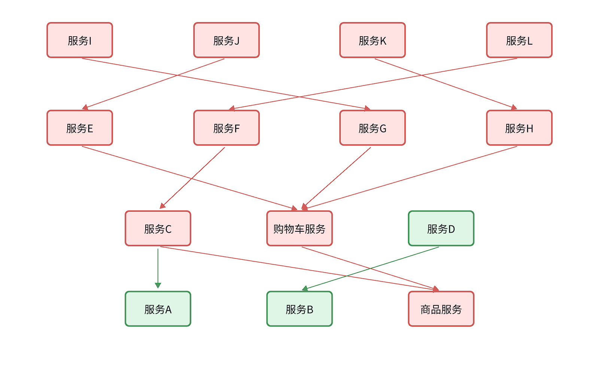
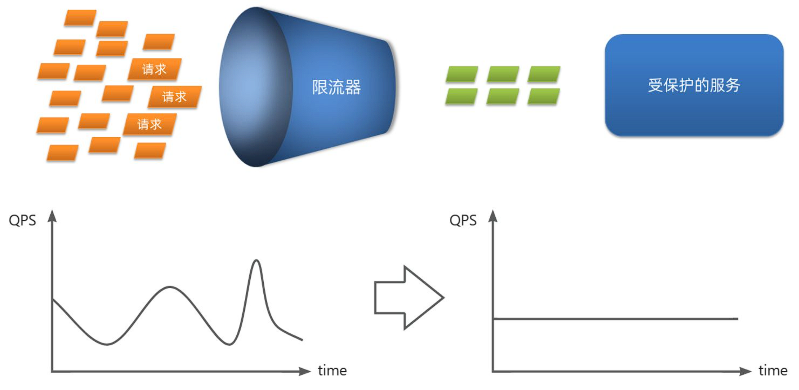
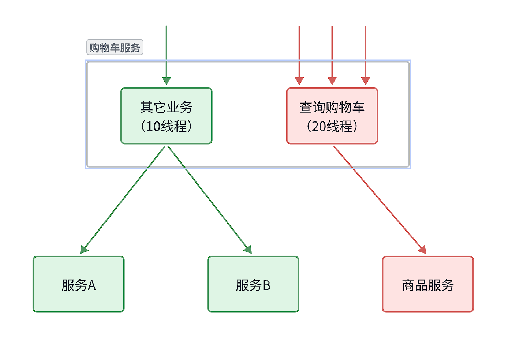
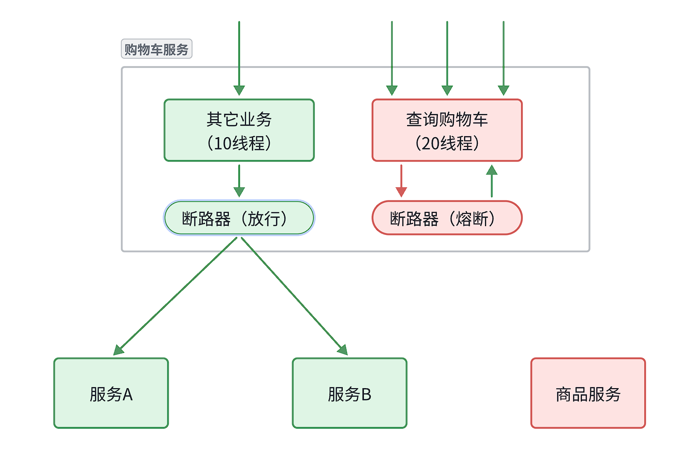
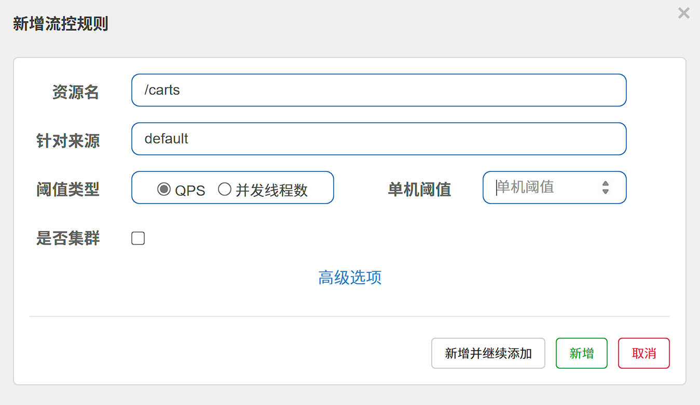
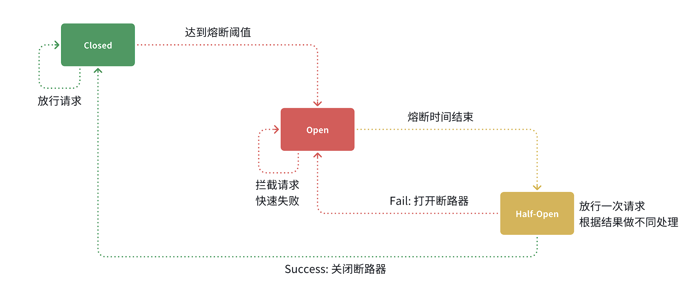
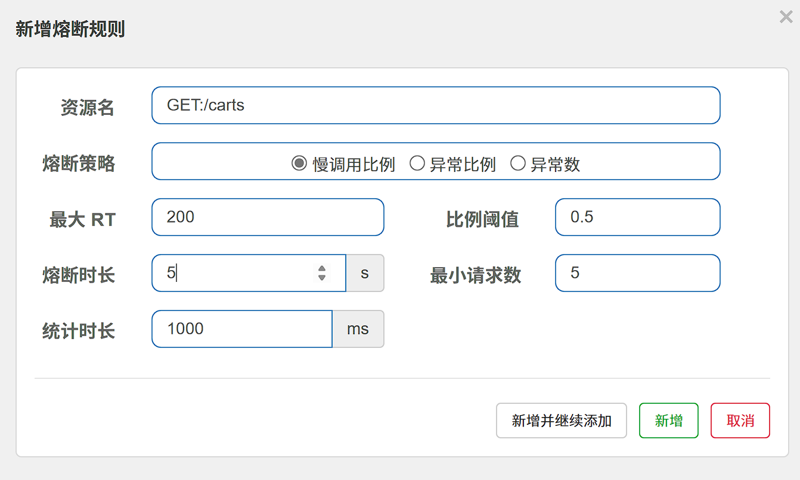
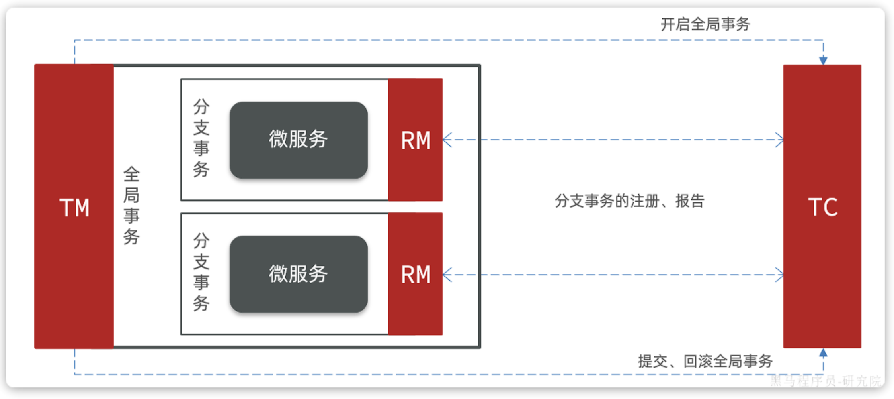
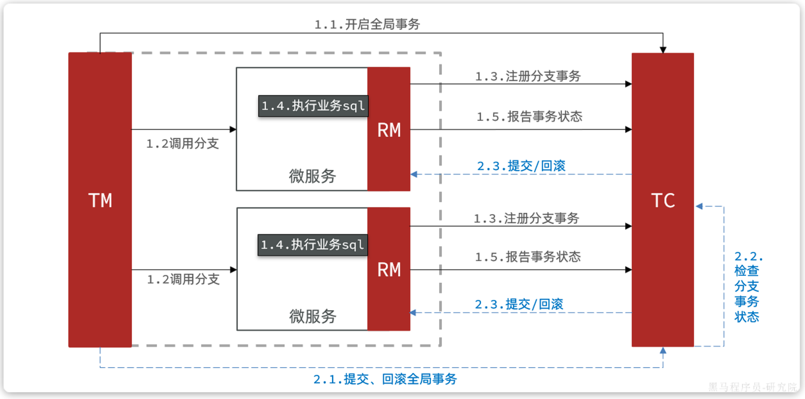
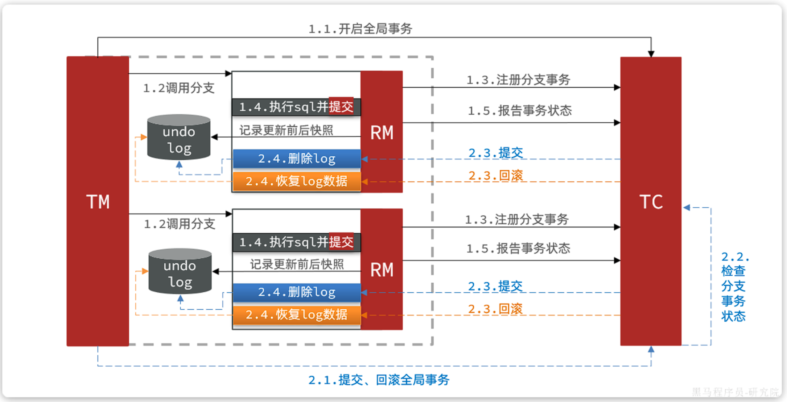

## 存在的问题

在微服务远程调用的过程中，还存在几个问题需要解决。

- **业务健壮性**
  
  > 某服务故障，调用该服务的服务也应该得到数据

- **级联失败**(雪崩问题)
  
  > 如服务业务并发较高，占用过多Tomcat连接。可能会导致服务的所有接口响应时间增加，延迟变高，甚至是长时间阻塞直至查询失败。



<br>

---

## 雪崩问题解决方案

### 请求限流

服务故障最重要原因，就是并发太高！解决了这个问题，就能避免大部分故障。因此需要对请求限流，**限制或控制**接口访问的并发流量，避免服务因流量激增而出现故障。


请求限流往往会有一个限流器，数量高低起伏的并发请求曲线，经过限流器就变的非常平稳。这就像是水电站的大坝，起到蓄水的作用，可以通过开关控制水流出的大小，让下游水流始终维持在一个平稳的量。



<br>

### 线程隔离

当一个业务接口响应时间长，而且并发高时，就可能耗尽服务器的线程资源，导致服务内的其它接口受到影响。所以我们必须把这种影响降低，或者缩减影响的范围。线程隔离正是解决这个问题的好办法。

<br>

线程隔离的思想来自轮船的舱壁模式：

轮船的船舱会被隔板分割为N个相互隔离的密闭舱，假如轮船触礁进水，只有损坏的部分密闭舱会进水，而其他舱由于相互隔离，并不会进水。这样就把进水控制在部分船体，避免了整个船舱进水而沉没。

<br>

为了避免某个接口故障或压力过大导致整个服务不可用，我们可以限定每个接口可以使用的资源范围，也就是将其“隔离”起来。



!!!note
    如图所示，我们给查询购物车业务限定可用线程数量上限为20，这样即便查询购物车的请求因为查询商品服务而出现故障，也不会导致服务器的线程资源被耗尽，不会影响到其它接口。

<br>

### 服务熔断

线程隔离虽然避免了雪崩问题，但故障服务（商品服务）依然会拖慢购物车服务（服务调用方）的接口响应速度。而且商品查询的故障也会导致查询购物车功能出现故障，购物车业务也变的不可用了。


解决方案如下：

* **编写服务降级逻辑**：就是服务调用失败后的处理逻辑，根据业务场景，可以抛出异常，也可以返回友好提示或默认数据。

* **异常统计和熔断**：统计服务提供方的异常比例，当比例过高表明该接口会影响到其它服务，应该拒绝调用该接口，而是直接走降级逻辑。



<br>

## Sentinel

!!!quote "参考资料"
    微服务保护的技术有很多，但在目前国内使用较多的还是Sentinel

    Sentinel是阿里巴巴开源的一款服务保护框架，目前已经加入SpringCloudAlibaba中。[官方网站](https://sentinelguard.io/zh-cn/)

### 介绍&安装

Sentinel 的使用可以分为两个部分:

* **核心库**（Jar包）：不依赖任何框架/库，能够运行于 Java 8 及以上的版本的运行时环境，同时对 Dubbo / Spring Cloud 等框架也有较好的支持。在项目中引入依赖即可实现服务限流、隔离、熔断等功能。

* **控制台**（Dashboard）：Dashboard 主要负责管理推送规则、监控、管理机器信息等。


[控制台jar包下载地址](https://github.com/alibaba/Sentinel/releases)

运行

```bash
java -Dserver.port=8090 -Dcsp.sentinel.dashboard.server=localhost:8090 -Dproject.name=sentinel-dashboard -jar sentinel-dashboard.jar
```

访问[http://localhost:8090](http://localhost:8080)页面，就可以看到sentinel的控制台了：

!!!tip
    输入账号和密码，默认都是：sentinel


docker安装

```bash
docker run -d \
 --name sentinel \
 -p 8858:8858 \
 --network work \
 -d bladex/sentinel-dashboard
```

<br>

### 微服务整合

1.服务中添加如下依赖

```xml
<!--sentinel-->
<dependency>
    <groupId>com.alibaba.cloud</groupId> 
    <artifactId>spring-cloud-starter-alibaba-sentinel</artifactId>
</dependency>
```

2.配置控制台连接

```yaml
spring:
  cloud: 
    sentinel:
      transport:
        dashboard: localhost:8090
```

3.重启服务，然后访问接口，sentinel的客户端就会将服务访问的信息提交到`sentinel-dashboard`控制台。并展示出统计信息

点击簇点链路菜单，可以看到接口请求信息（所谓簇点链路，就是单机调用链路，是一次请求进入服务后经过的每一个被`Sentinel`监控的资源）

> 需要注意的是，SpringMVC接口如果是按照Restful风格设计，可能导致多个簇点名称相同，可以做如下配置解决

```yaml
spring:
  cloud:
    sentinel:
      transport:
        dashboard: localhost:8090
      http-method-specify: true # 开启请求方式前缀
```

<br>

### 请求限流

在簇点链路后面点击流控按钮，即可对其做限流配置



<br>

### 线程隔离

限流可以降低服务器压力，尽量减少因并发流量引起的服务故障的概率，但并不能完全避免服务故障。一旦某个服务出现故障，我们必须隔离对这个服务的调用，避免发生雪崩。


配置方式同请求限流，只需将“阈值类型”修改为“并发线程数”

<br>

### Fallback

触发限流或熔断后的请求不一定要直接报错，也可以返回一些默认数据或者友好提示，用户体验会更好。

给FeignClient编写失败后的降级逻辑有两种方式：

- 方式一：FallbackClass，无法对远程调用的异常做处理
- 方式二：FallbackFactory，可以对远程调用的异常做处理，我们一般选择这种方式。


**步骤一**：定义降级处理类，实现`FallbackFactory`：

```java
@Slf4j
public class ItemClientFallback implements FallbackFactory<ItemClient> {
    @Override
    public ItemClient create(Throwable cause) {
        return new ItemClient() {
            @Override
            public List<ItemDTO> queryItemByIds(Collection<Long> ids) {
                log.error("远程调用ItemClient#queryItemByIds方法出现异常，参数：{}", ids, cause);
                // 查询购物车允许失败，查询失败，返回空集合
                return CollUtils.emptyList();
            }

            @Override
            public void deductStock(List<OrderDetailDTO> items) {
                // 库存扣减业务需要触发事务回滚，查询失败，抛出异常
                throw new BizIllegalException(cause);
            }
        };
    }
}
```

**步骤二**：将降级处理类注册为一个`Bean`：

```java
@Bean
public ItemClientFallback itemClientFallback(){
    return new ItemClientFallback();
}
```

**步骤三**：在`ItemClient`接口中使用`ItemClientFallbackFactory`：

```java
@FeignClient(value = "item-service",
        fallbackFactory = ItemClientFallback.class)
```

<br>

### 服务熔断

对于不太健康的接口，我们应该停止调用，直接走降级逻辑，避免影响到当前服务。也就是将商品查询接口**熔断**。当商品服务接口恢复正常后，再允许调用。这其实就是**断路器**的工作模式了。

Sentinel中的断路器不仅可以统计某个接口的**慢请求比例**，还可以统计**异常请求比例**。当这些比例超出阈值时，就会**熔断**该接口，即拦截访问该接口的一切请求，降级处理；当该接口恢复正常时，再放行对于该接口的请求。


断路器的工作状态切换有一个状态机来控制：



状态机包括三个状态：

- **closed**：关闭状态，断路器放行所有请求，并开始统计异常比例、慢请求比例。超过阈值则切换到open状态
- **open**：打开状态，服务调用被**熔断**，访问被熔断服务的请求会被拒绝，快速失败，直接走降级逻辑。Open状态持续一段时间后会进入half-open状态
- **half-open**：半开状态，放行一次请求，根据执行结果来判断接下来的操作。 
    - 请求成功：则切换到closed状态
    - 请求失败：则切换到open状态


我们可以在控制台通过点击簇点后的**`熔断`**按钮来配置熔断策略：



!!!tip
    这种是按照慢调用比例来做熔断，上述配置的含义是：

    - RT超过200毫秒的请求调用就是慢调用
    - 统计最近1000ms内的最少5次请求，如果慢调用比例超过0.5，则触发熔断
    - 熔断持续时长5s

<br>

---

## 分布式事务

整个业务中，各个本地事务是有关联的。因此每个微服务的本地事务，也可以称为**分支事务**。多个有关联的分支事务一起就组成了**全局事务**。我们必须保证整个全局事务同时成功或失败。


我们知道每一个分支事务就是传统的**单体事务**，都可以满足ACID特性，但全局事务跨越多个服务、多个数据库，是否还能满足呢？

事务并未遵循ACID的原则，归其原因就是参与事务的多个子业务在不同的微服务，跨越了不同的数据库。虽然每个单独的业务都能在本地遵循ACID，但是它们互相之间没有感知，无法保证最终结果的统一

<br>

### Seata

[Seata 是什么？ | Apache Seata](https://seata.apache.org/zh-cn/docs/overview/what-is-seata/)

解决分布式事务的方案有很多，但实现起来都比较复杂，因此我们一般会使用开源的框架来解决分布式事务问题。在众多的开源分布式事务框架中，功能最完善、使用最多的就是阿里巴巴在2019年开源的Seata了。

<br>

解决分布式事务的思想非常简单：

就是找一个统一的**事务协调者**，与多个分支事务通信，检测每个分支事务的执行状态，保证全局事务下的每一个分支事务同时成功或失败即可。大多数的分布式事务框架都是基于这个理论来实现的。

<br>

Seata也不例外，在Seata的事务管理中有三个重要的角色：

-  **TC (Transaction Coordinator) - 事务协调者：**维护全局和分支事务的状态，协调全局事务提交或回滚。 
-  **TM (Transaction Manager) - 事务管理器：**定义全局事务的范围、开始全局事务、提交或回滚全局事务。 
-  **RM (Resource Manager) - 资源管理器：**管理分支事务，与TC通讯以注册分支事务和报告分支事务的状态，并驱动分支事务提交或回滚。 

Seata的工作架构如图所示：



<br>

### 部署TC服务

Seata支持多种存储模式，但考虑到持久化的需要，我们一般选择基于数据库存储。

准备一个seata目录，其中包含了seata运行时所需要的配置文件。


docker部署：

```bash
docker run --name seata \
-p 8099:8099 \
-p 7099:7099 \
-e SEATA_IP=<服务IP> \
-v ./seata:/seata-server/resources \
--privileged=true \
--network <网络名> \
-d \
seataio/seata-server:1.5.2
```

> -e SETA_IP 指定的IP地址为服务器IP，该IP会被推送到nacos(注册中心)，如果不指定（或指定为localhost）则会推送docker为其分配的IP，外部设备无法通过该IP访问seata

<br>

### 微服务集成Seata

引入依赖

```xml
  <!--seata-->
  <dependency>
      <groupId>com.alibaba.cloud</groupId>
      <artifactId>spring-cloud-starter-alibaba-seata</artifactId>
  </dependency>
```


在服务中配置seata信息

```yaml
seata:
  registry: # TC服务注册中心的配置，微服务根据这些信息去注册中心获取tc服务地址
    type: nacos # 注册中心类型 nacos
    nacos:
      server-addr: localhost:8848 # nacos地址
      namespace: "" # namespace，默认为空
      group: DEFAULT_GROUP # 分组，默认是DEFAULT_GROUP
      application: seata-server # seata服务名称
      username: nacos
      password: nacos
  tx-service-group: work # 事务组名称
  service:
    vgroup-mapping: # 事务组与tc集群的映射关系
      work: "default"
```

<br>

### XA模式

`XA` 规范 是` X/Open` 组织定义的分布式事务处理（DTP，Distributed Transaction Processing）标准，XA 规范 描述了全局的`TM`与局部的`RM`之间的接口，几乎所有主流的数据库都对 XA 规范 提供了支持。


Seata对原始的XA模式做了简单的封装和改造，以适应自己的事务模型，基本架构如图：




`RM`一阶段的工作：

1. 注册分支事务到`TC`
2. 执行分支业务sql但不提交
3. 报告执行状态到`TC`

`TC`二阶段的工作：

1.  `TC`检测各分支事务执行状态
    1. 如果都成功，通知所有RM提交事务
    2. 如果有失败，通知所有RM回滚事务 

`RM`二阶段的工作：

- 接收`TC`指令，提交或回滚事务

<br>

#### 优缺点

`XA`模式的优点是什么？

- 事务的强一致性，满足ACID原则
- 常用数据库都支持，实现简单，并且没有代码侵入

`XA`模式的缺点是什么？

- 因为一阶段需要锁定数据库资源，等待二阶段结束才释放，性能较差
- 依赖关系型数据库实现事务


#### 实现步骤

添加配置

```yaml
seata:
  data-source-proxy-mode: XA
```

其次，我们要利用`@GlobalTransactional`标记分布式事务的入口方法：

<br>

### AT模式

`AT`模式同样是分阶段提交的事务模型，不过弥补了`XA`模型中资源锁定周期过长的缺陷。



阶段一`RM`的工作：

- 注册分支事务
- 记录undo-log（数据快照）
- 执行业务sql并提交
- 报告事务状态

阶段二提交时`RM`的工作：

- 删除undo-log即可

阶段二回滚时`RM`的工作：

- 根据undo-log恢复数据到更新前

<br>

#### AT模式与XA模式的区别

- `XA`模式一阶段不提交事务，锁定资源；`AT`模式一阶段直接提交，不锁定资源。
- `XA`模式依赖数据库机制实现回滚；`AT`模式利用数据快照实现数据回滚。
- `XA`模式强一致；`AT`模式最终一致

可见，AT模式使用起来更加简单，无业务侵入，性能更好。因此企业90%的分布式事务都可以用AT模式来解决。

<br>

#### 实现步骤

创建数据快照表

```sql
CREATE TABLE IF NOT EXISTS `undo_log`
(
    `branch_id`     BIGINT       NOT NULL COMMENT 'branch transaction id',
    `xid`           VARCHAR(128) NOT NULL COMMENT 'global transaction id',
    `context`       VARCHAR(128) NOT NULL COMMENT 'undo_log context,such as serialization',
    `rollback_info` LONGBLOB     NOT NULL COMMENT 'rollback info',
    `log_status`    INT(11)      NOT NULL COMMENT '0:normal status,1:defense status',
    `log_created`   DATETIME(6)  NOT NULL COMMENT 'create datetime',
    `log_modified`  DATETIME(6)  NOT NULL COMMENT 'modify datetime',
    UNIQUE KEY `ux_undo_log` (`xid`, `branch_id`)
) ENGINE = InnoDB
  AUTO_INCREMENT = 1
  DEFAULT CHARSET = utf8mb4 COMMENT ='AT transaction mode undo table';
```


配置文件修改为AT模式（默认为AT模式）

```yaml
seata:
  data-source-proxy-mode: AT
```

---

**上一节**：[配置中心](配置中心.md)

**下一节**：[面试](面试.md)