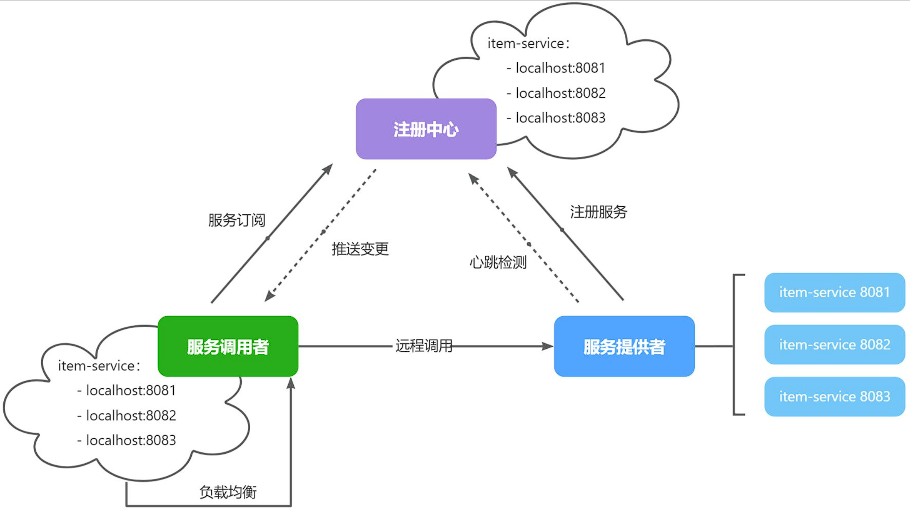

## 注册中心原理

在上一节实现了微服务拆分，并且通过Http请求实现了跨微服务的远程调用。不过这种手动发送Http请求的方式存在一些问题。

试想一下，假如商品微服务被调用较多，为了应对更高的并发，我们进行了**多实例部署**服务的主机和端口都不固定，如何解决？


在微服务远程调用的过程中，包括两个角色：

* 服务提供者：提供接口供其它微服务访问

* 服务消费者：调用其它微服务提供的接口
  
  

在大型微服务项目中，服务提供者的数量会非常多，为了管理这些服务就引入了**注册中心**的概念。注册中心、服务提供者、服务消费者三者间关系如下：



流程如下：

* 服务启动时就会注册自己的服务信息（服务名、IP、端口）到注册中心

* 调用者可以从注册中心订阅想要的服务，获取服务对应的实例列表（1个服务可能多实例部署）

* 调用者自己对实例列表负载均衡，挑选一个实例

* 调用者向该实例发起远程调用
  
<br>

当服务提供者的实例宕机或者启动新实例时，调用者如何得知呢？

* 服务提供者会定期向注册中心发送请求，报告自己的健康状态（心跳检测）

* 当注册中心长时间收不到提供者的心跳请求时，会认为该实例宕机，将其从服务的实例列表中剔除

* 当服务有新实例启动时，会发送注册服务请求，其信息会被记录在注册中心的服务实例列表

* 当注册中心服务列表变更时，会主动通知微服务，更新本地服务列表
  
<br>

---

## Nacos注册中心

[Nacos官网| Nacos 配置中心 | Nacos 下载| Nacos 官方社区 | Nacos 官网](https://nacos.io/)

目前开源的注册中心框架有很多，国内比较常见的有：

* Eureka：Netflix公司出品，目前被集成在SpringCloud当中，一般用于Java应用

* Nacos：Alibaba公司出品，目前被集成在SpringCloudAlibaba中，一般用于Java应用

* Consul：HashiCorp公司出品，目前集成在SpringCloud中，不限制微服务语言
  
<br>

这里我们以Nacos为例，来介绍如何搭建注册中心，并实现服务注册与发现。

首先部署Nacos服务，这里采用Docker方式部署。

```bash
docker run --name nacos-standalone-derby \
    -e MODE=standalone \
    -e NACOS_AUTH_TOKEN=${your_nacos_auth_secret_token} \
    -e NACOS_AUTH_IDENTITY_KEY=${your_nacos_server_identity_key} \
    -e NACOS_AUTH_IDENTITY_VALUE=${your_nacos_server_identity_value} \
    -p 8080:8080 \
    -p 8848:8848 \
    -p 9848:9848 \
    -d nacos/nacos-server:latest
```
!!!note
    NACOS_AUTH_TOKEN: Nacos 用于生成JWT Token的密钥，使用长度大于32字符的字符串，再经过Base64编码。
    NACOS_AUTH_IDENTITY_KEY: Nacos Server端之间 Inner API的身份标识的Key，必填。
    NACOS_AUTH_IDENTITY_VALUE: Nacos Server端之间 Inner API的身份标识的Value，必填。


访问页面查看是否启动成功

```url
http://localhost:8080/index.html
```

<br>

### 服务注册

服务发现除了要引入nacos依赖以外，由于还需要负载均衡，因此要引入SpringCloud提供的LoadBalancer依赖。

我们在`pom.xml`中添加下面的依赖：

```xml
<!--nacos 服务注册发现-->
<dependency>
    <groupId>com.alibaba.cloud</groupId>
    <artifactId>spring-cloud-starter-alibaba-nacos-discovery</artifactId>
</dependency>
```

在application.yml`中添加nacos地址配置：

```yaml
spring:
  cloud:
    nacos:
      server-addr: localhost:8848
```

启动服务即可自动注册

<br>

### 服务发现

接下来，服务调用者就可以去订阅服务了。不过服务可能有多个实例，而真正发起调用时只需要知道一个实例的地址。

因此，服务调用者必须利用负载均衡的算法，从多个实例中挑选一个去访问。常见的负载均衡算法有：

* 随机

* 轮询

* IP的hash

* 最近最少访问

* ...

这里我们可以选择最简单的随机负载均衡。


1. 引入依赖并配置nacos服务地址（同上一小节）
   
   

2. 服务发现需要用到一个工具，DiscoveryClient，SpringCloud已经帮我们自动装配，我们可以直接注入使用：

    ```java
        @Autowired
        private final DiscoveryClient discoveryClient;
    ```


=
3. 使用服务

```java
// 根据服务名称获取服务实例列表
List<ServiceInstance> instances = discoveryClient.getInstances("item-service");
if (CollUtils.isEmpty(instances)) {
    return;
}
// 根据负载均衡算法选择一个服务实例
ServiceInstance instance = instances.get(RandomUtil.randomInt(instances.size()));
// 得到服务实例的URI
URI uri = instance.getUri();
ResponseEntity<List<ItemDTO>> response = restTemplate.exchange(
        uri + "/items?ids={ids}",
        HttpMethod.GET,
        null,
        new ParameterizedTypeReference<List<ItemDTO>>() {
        },
        Map.of("ids", CollUtil.join(itemIds, ","))
);
```

---

**上一节**：[服务拆分](服务拆分.md)

**下一节**：[OpenFeign](OpenFeign.md)