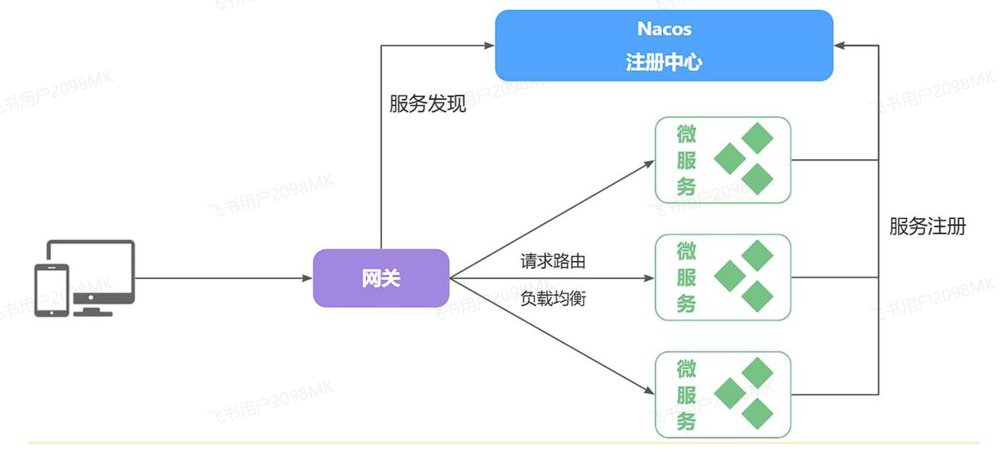
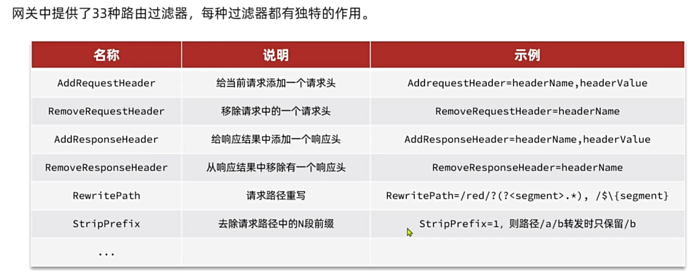
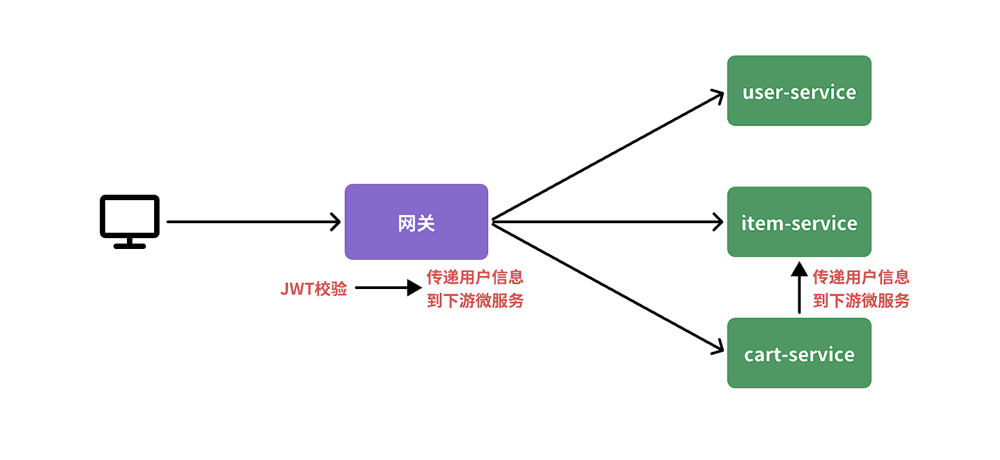
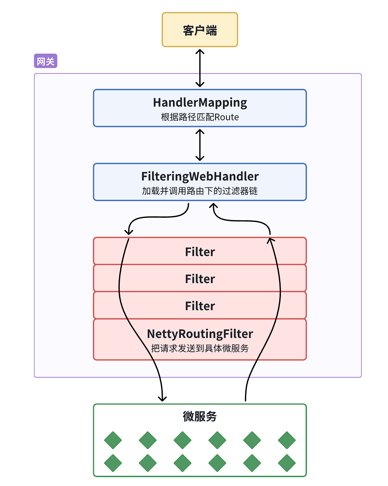
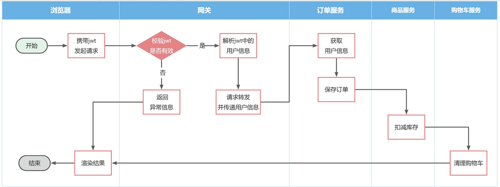

由于每个微服务都有不同的地址或端口，入口不同，在与前端联调的时候就会发现一些问题：

* 请求不同数据时要访问不同的入口，需要维护多个入口地址

* 前端无法调用nacos，无法实时更新服务列表
  
  

单体架构时我们只需要完成一次用户登录、身份校验，就可以在所有业务中获取到用户信息。而微服务拆分后，每个微服务都独立部署，这就存在一些问题：

* 每个微服务都需要编写登录校验、用户信息获取的功能吗？

* 当微服务之间调用时，该如何传递用户信息？
  
  

## 认识网关

顾明思议，网关就是网络的关口。数据在网络间传输，从一个网络传输到另一网络时就需要经过网关来做数据的**路由和转发以及数据安全的校验**


现在，微服务网关就起到同样的作用。前端请求不能直接访问微服务，而是请求网关：

* 网关可以做安全控制，也就是登录身份校验，校验通过才放行

* 通过认证后，网关再根据请求判断应该访问哪个微服务，将请求转发过去
  



在SpringCloud当中，提供了两种网关实现方案：

* Netflix Zuul：早期实现，目前已经淘汰

* [Spring Cloud Gateway](https://spring.io/projects/spring-cloud-gateway#learn)：基于Spring的WebFlux技术，完全支持响应式编程，吞吐能力更强

<br>

## 快速入门

接下来，先利用网关实现请求路由。由于网关本身也是一个独立的微服务，因此也需要创建一个模块开发功能。大概步骤如下：

* 创建网关微服务

* 引入SpringCloudGateway、NacosDiscovery依赖

* 编写启动类

* 配置网关路由
  
  

相关依赖

```xml
<!--网关-->
<dependency>
    <groupId>org.springframework.cloud</groupId>
    <artifactId>spring-cloud-starter-gateway</artifactId>
</dependency>

<!--nacos discovery-->
<dependency>
    <groupId>com.alibaba.cloud</groupId>
    <artifactId>spring-cloud-starter-alibaba-nacos-discovery</artifactId>
</dependency>

<!--负载均衡-->
<dependency>
    <groupId>org.springframework.cloud</groupId>
    <artifactId>spring-cloud-starter-loadbalancer</artifactId>
</dependency>
```


配置文件

```yaml
server:
  port: 8080

spring:
  # spring服务配置
  application:
    name: gateway

  # SpringCloud配置
  cloud:
    # Nacos注册中心配置
    nacos:
      server-addr: localhost:8848

    # 网关配置
    gateway:
      routes:
        - id: item-service
          uri: lb://item-service
          predicates:
            - Path=/items/**,/search/**
        - id: user-service
          uri: lb://user-service
          predicates:
            - Path=/users/**,/addresses/**
```

<br>

## 路由属性

* `id`：路由的唯一标示

* `predicates`：路由断言，其实就是匹配条件

* `filters`：路由过滤条件

* `uri`：路由目标地址，`lb://`代表负载均衡，从注册中心获取目标微服务的实例列表，并且负载均衡选择一个访问。
  
  

这里重点关注`predicates`，也就是路由断言。`SpringCloudGateway`中支持的断言类型有很多：

| **名称**     | **说明**            | **示例**                                                                                                 |
| ---------- | ----------------- | ------------------------------------------------------------------------------------------------------ |
| After      | 是某个时间点后的请求        | - After=2037-01-20T17:42:47.789-07:00[America/Denver]                                                  |
| Before     | 是某个时间点之前的请求       | - Before=2031-04-13T15:14:47.433+08:00[Asia/Shanghai]                                                  |
| Between    | 是某两个时间点之前的请求      | - Between=2037-01-20T17:42:47.789-07:00[America/Denver], 2037-01-21T17:42:47.789-07:00[America/Denver] |
| Cookie     | 请求必须包含某些cookie    | - Cookie=chocolate, ch.p                                                                               |
| Header     | 请求必须包含某些header    | - Header=X-Request-Id, \d+                                                                             |
| Host       | 请求必须是访问某个host（域名） | - Host=**.somehost.org,**.anotherhost.org                                                              |
| Method     | 请求方式必须是指定方式       | - Method=GET,POST                                                                                      |
| Path       | 请求路径必须符合指定规则      | - Path=/red/{segment},/blue/**                                                                         |
| Query      | 请求参数必须包含指定参数      | - Query=name, Jack或者- Query=name                                                                       |
| RemoteAddr | 请求者的ip必须是指定范围     | - RemoteAddr=192.168.1.1/24                                                                            |
| weight     | 权重处理              |                                                                                                        |




<br>

---

## 网关登录校验

### 思路分析

登录一般是基于JWT来实现的，校验JWT的算法复杂，而且需要用到秘钥。如果每个微服务都去做登录校验，这就存在着两大问题：

* 每个微服务都需要知道JWT的秘钥，不安全

* 每个微服务重复编写登录校验代码、权限校验代码
  
  
既然网关是所有微服务的入口，一切请求都需要先经过网关。我们完全可以把登录校验的工作放到网关去做，这样之前的问题就解决了：

* 只需要在网关和用户服务保存秘钥

* 只需要在网关开发登录校验功能




不过，这里存在几个问题：

* 网关路由是配置的，请求转发是Gateway内部代码，我们如何在转发之前做登录校验？

* 网关校验JWT之后，如何将用户信息传递给微服务？

* 微服务之间也会相互调用，这种调用不经过网关，又该如何传递用户信息？
  
<br>

### 网关过滤器

登录校验必须在请求转发到微服务之前做，否则就失去了意义。而网关的请求转发是`Gateway`内部代码实现的，要想在请求转发之前做登录校验，就必须了解`Gateway`内部工作的基本原理



网关过滤器链中的过滤器有两种：

* **`GatewayFilter`**：路由过滤器，作用范围比较灵活，可以是任意指定的路由`Route`.

* **`GlobalFilter`**：全局过滤器，作用范围是所有路由，不可配置。
  
  

`GatewayFilter`和`GlobalFilter`这两种过滤器的方法签名完全一致：

```java
/**
 * 处理请求并将其传递给下一个过滤器
 * @param exchange 当前请求的上下文，其中包含request、response等各种数据
 * @param chain 过滤器链，基于它向下传递请求
 * @return 根据返回值标记当前请求是否被完成或拦截，chain.filter(exchange)就放行了。
 */
Mono<Void> filter(ServerWebExchange exchange, GatewayFilterChain chain);
```

<br>

### 自定义过滤器

1.GlobalFilter

```java
@Component
public class PrintAnyGlobalFilter implements GlobalFilter, Ordered {
    @Override
    public Mono<Void> filter(ServerWebExchange exchange, GatewayFilterChain chain) {
        // 编写过滤器逻辑
        System.out.println("未登录，无法访问");
        // 放行
        // return chain.filter(exchange);

        // 拦截
        ServerHttpResponse response = exchange.getResponse();
        response.setRawStatusCode(401);
        return response.setComplete();
    }

    @Override
    public int getOrder() {
        // 过滤器执行顺序，值越小，优先级越高
        return 0;
    }
}
```


2.GatewayFilter

自定义`GatewayFilter`不是直接实现`GatewayFilter`，而是继承`AbstractGatewayFilterFactory`。

```java
@Component
public class PrintAnyGatewayFilterFactory extends AbstractGatewayFilterFactory<Object> {
    @Override
    public GatewayFilter apply(Object config) {
        return new GatewayFilter() {
            @Override
            public Mono<Void> filter(ServerWebExchange exchange, GatewayFilterChain chain) {
                // 获取请求
                ServerHttpRequest request = exchange.getRequest();
                // 编写过滤器逻辑
                System.out.println("过滤器执行了");
                // 放行
                return chain.filter(exchange);
            }
        };
    }
}
```

3.在配置文件中使用

```yaml
spring:
  cloud:
    gateway:
      default-filters:
            - PrintAny # 此处直接以自定义的GatewayFilterFactory类名称前缀类声明过滤器
```


另外，这种过滤器还可以支持动态配置参数，不过实现起来比较复杂，示例

```java

@Component
public class PrintAnyGatewayFilterFactory // 父类泛型是内部类的Config类型
                extends AbstractGatewayFilterFactory<PrintAnyGatewayFilterFactory.Config> {

    @Override
    public GatewayFilter apply(Config config) {
        // OrderedGatewayFilter是GatewayFilter的子类，包含两个参数：
        // - GatewayFilter：过滤器
        // - int order值：值越小，过滤器执行优先级越高
        return new OrderedGatewayFilter(new GatewayFilter() {
            @Override
            public Mono<Void> filter(ServerWebExchange exchange, GatewayFilterChain chain) {
                // 获取config值
                String a = config.getA();
                String b = config.getB();
                String c = config.getC();
                // 编写过滤器逻辑
                System.out.println("a = " + a);
                System.out.println("b = " + b);
                System.out.println("c = " + c);
                // 放行
                return chain.filter(exchange);
            }
        }, 100);
    }

    // 自定义配置属性，成员变量名称很重要，下面会用到
    @Data
    static class Config{
        private String a;
        private String b;
        private String c;
    }
    // 将变量名称依次返回，顺序很重要，将来读取参数时需要按顺序获取
    @Override
    public List<String> shortcutFieldOrder() {
        return List.of("a", "b", "c");
    }
        // 返回当前配置类的类型，也就是内部的Config
    @Override
    public Class<Config> getConfigClass() {
        return Config.class;
    }

}
```

在配置文件中使用

```yaml
spring:
  cloud:
    gateway:
      default-filters:
            - PrintAny=1,2,3 # 注意，这里多个参数以","隔开，将来会按照shortcutFieldOrder()方法返回的参数顺序依次复制
```

<br>

### 登录校验过滤器

自定义`GlobalFilter`以实现登录校验

```java
@Component
@RequiredArgsConstructor
@EnableConfigurationProperties(AuthProperties.class)
public class AuthGlobalFilter implements GlobalFilter, Ordered {

    private final JwtTool jwtTool;

    private final AuthProperties authProperties;

    // 包含通配符的路径匹配器，由Spring提供
    private final AntPathMatcher antPathMatcher = new AntPathMatcher();

    @Override
    public Mono<Void> filter(ServerWebExchange exchange, GatewayFilterChain chain) {
        // 1.获取Request
        ServerHttpRequest request = exchange.getRequest();
        // 2.判断是否不需要拦截
        if(isExclude(request.getPath().toString())){
            // 无需拦截，直接放行
            return chain.filter(exchange);
        }
        // 3.获取请求头中的token
        String token = null;
        List<String> headers = request.getHeaders().get("Authorization");
        if (!CollUtils.isEmpty(headers)) {
            token = headers.get(0);
        }
        // 4.校验并解析token
        Long userId = null;
        try {
            userId = jwtTool.parseToken(token);
        } catch (UnauthorizedException e) {
            // 如果无效，拦截
            ServerHttpResponse response = exchange.getResponse();
            response.setRawStatusCode(401);
            return response.setComplete();
        }

        // TODO 5.如果有效，传递用户信息
        System.out.println("userId = " + userId);
        // 6.放行
        return chain.filter(exchange);
    }

    private boolean isExclude(String antPath) {
        for (String pathPattern : authProperties.getExcludePaths()) {
            if(antPathMatcher.match(pathPattern, antPath)){
                return true;
            }
        }
        return false;
    }

    @Override
    public int getOrder() {
        return 0;
    }
}
```

<br>

### 用户信息向下游传递

首先，我们修改登录校验拦截器的处理逻辑，保存用户信息到请求头中：

```java
// TODO: 传递用户信息
ServerWebExchange build = exchange.mutate()
        .request(builder -> builder.header("user-info", userInfo))
        .build();

// 放行
return chain.filter(build);
```


在通用模块`common`中编写拦截器获取用户信息

```java
public class UserInfoInterceptor implements HandlerInterceptor {
    @Override
    public boolean preHandle(HttpServletRequest request, HttpServletResponse response, Object handler) throws Exception {
        // 1.获取请求头中的用户信息
        String userInfo = request.getHeader("user-info");
        // 2.判断是否为空
        if (StrUtil.isNotBlank(userInfo)) {
            // 不为空，保存到ThreadLocal
            UserContext.setUser(Long.valueOf(userInfo));
        }
        // 3.放行
        return true;
    }

    @Override
    public void afterCompletion(HttpServletRequest request, HttpServletResponse response, Object handler, Exception ex) throws Exception {
        // 移除用户
        UserContext.removeUser();
    }
}
```

由于拦截器需要配置才能生效，需编写配置类来配置登录拦截器

```java
@Configuration
@ConditionalOnClass(DispatcherServlet.class)
public class MvcConfig implements WebMvcConfigurer {
    @Override
    public void addInterceptors(InterceptorRegistry registry) {
        // 添加自定义拦截器
        registry.addInterceptor(new UserInfoInterceptor());
    }
}

```

!!!note
    许多服务模块都引用了该通用模块，`@ConditionalOnClass(DispatcherServlet.class`注解保证了只有使用了SpringMVC的微服务才会自动配置，例如网关模块并没有基于SpringMVC,不加该注解会启动失败


不过，需要注意的是，这个配置类默认是不会生效的，因为它所在的包与其它微服务的扫描包不一致，无法被扫描到，因此无法生效。

基于SpringBoot的**自动装配原理**，我们要将其添加到`resources`目录下的`META-INF/spring.factories`文件中：

```properties
org.springframework.boot.autoconfigure.EnableAutoConfiguration=\
  com.xxx.config.MvcConfig
```

<br>

### OpenFeign传递用户

前端发起的请求都会经过网关再到微服务，由于我们之前编写的过滤器和拦截器功能，微服务可以轻松获取登录用户信息。

但有些业务是比较复杂的，请求到达微服务后还需要调用其它多个微服务。比如下单业务，流程如下：



下单的过程中，需要调用商品服务扣减库存，调用购物车服务清理用户购物车。而清理购物车时必须知道当前登录的用户身份。但是，**订单服务调用购物车时并没有传递用户信息**，购物车服务无法知道当前用户是谁！


由于微服务获取用户信息是通过拦截器在请求头中读取，因此要想实现微服务之间的用户信息传递，就**必须在微服务发起调用时把用户信息存入请求头**


微服务之间调用是基于OpenFeign来实现的，并不是我们自己发送的请求。我们如何才能让每一个由OpenFeign发起的请求自动携带登录用户信息呢？

这里要借助Feign中提供的一个拦截器接口：`feign.RequestInterceptor`

```java
public interface RequestInterceptor {

  /**
   * Called for every request. 
   * Add data using methods on the supplied {@link RequestTemplate}.
   */
  void apply(RequestTemplate template);
}
```


在通用模块中配置拦截器

```java
public class DefaultFeignConfig {
    @Bean
    public Logger.Level feignLoggerLevel() {
        return Logger.Level.FULL;
    }

    @Bean
    public RequestInterceptor feignRequestInterceptor() {
        return new RequestInterceptor() {
            @Override
            public void apply(RequestTemplate requestTemplate) {
                Long userId = UserContext.getUser();
                if (userId != null) {
                    requestTemplate.header("user-info", userId.toString());
                }
            }
        };
    }
}
```

!!!note
    为使配置生效需要在服务启动类上添加`@EnableFeignClients(basePackages = "com.xxx.api.client",defaultConfiguration = DefaultFeignConfig.class)`

---

**上一节**：[OpenFeign](OpenFeign.md)

**下一节**：[配置中心](配置中心.md)
