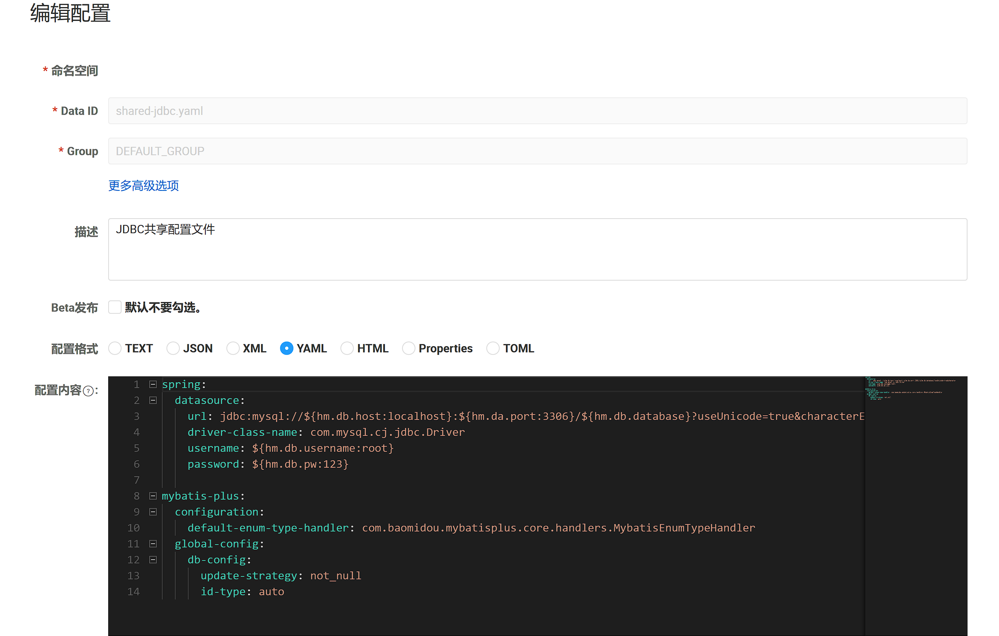
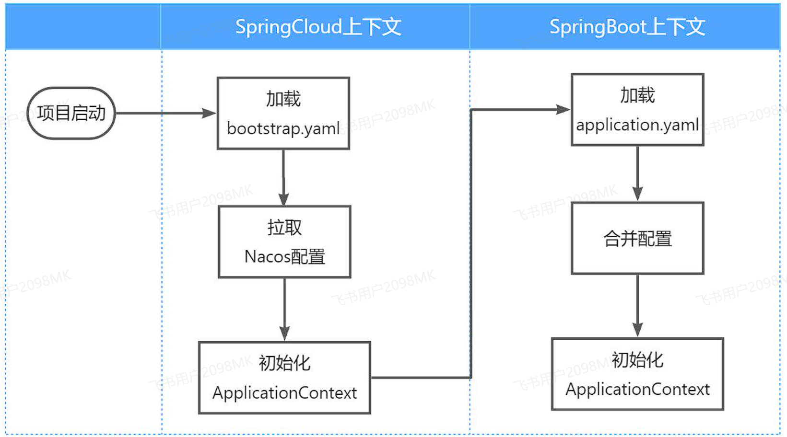

现在依然还有几个问题需要解决：

* 网关路由配置在配置文件中，如果变更必须重启微服务

* 某些业务配置在配置文件中，每次修改都要重启服务

* 每个微服务都有很多重复的配置，维护成本高
  
<br>

这些问题都可以通过统一的**配置管理器服务**解决。而Nacos不仅仅具备注册中心功能，也具备配置管理的功能：


<br>

---

## 配置共享

1.添加共享配置

首先是jdbc相关配置，在`配置管理`->`配置列表`中点击`+`新建一个配置




2.拉取共享配置

接下来，我们要在微服务拉取共享配置。将拉取到的共享配置与本地的`application.yaml`配置合并，完成项目上下文的初始化。

不过，需要注意的是，读取Nacos配置的是SpringCloud上下文（`ApplicationContext`）初始化时处理的，发生在项目的引导阶段。然后才会初始化SpringBoot上下文，去读取`application.yaml`。

<br>

也就是说引导阶段，`application.yaml`文件尚未读取，根本不知道nacos 地址，该如何去加载nacos中的配置文件呢？

SpringCloud在初始化上下文的时候会先读取一个名为`bootstrap.yaml`(或者`bootstrap.properties`)的文件，如果我们将nacos地址配置到`bootstrap.yaml`中，那么在项目引导阶段就可以读取nacos中的配置了。



**详细步骤**：

- 引入依赖

```xml
  <!--nacos配置管理-->
  <dependency>
      <groupId>com.alibaba.cloud</groupId>
      <artifactId>spring-cloud-starter-alibaba-nacos-config</artifactId>
  </dependency>

  <!--读取bootstrap文件-->
  <dependency>
      <groupId>org.springframework.cloud</groupId>
      <artifactId>spring-cloud-starter-bootstrap</artifactId>
  </dependency>
```

- 新建bootstrap.yaml

```yaml
spring:
  application:
    name: xxx-service # 服务名称
  profiles:
    active: dev
  cloud:
    nacos:
      server-addr: localhost:8848 # nacos地址
      config:
        file-extension: yaml # 文件后缀名
        shared-configs: # 共享配置
          - dataId: shared-jdbc.yaml # 共享mybatis配置
          - dataId: shared-log.yaml # 共享日志配置
          - dataId: shared-swagger.yaml # 共享swagger配置
```

- 修改application.yaml

```yaml
server:
  port: 8082
feign:
  okhttp:
    enabled: true # 开启OKHttp连接池支持
hm:
  swagger:
    title: 购物车服务接口文档
    package: com.xxx.cart.controller
  db:
    database: xxx-cart
```

- 重启生效
  
<br>

---

## 配置热更新

有很多的业务相关参数，将来可能会根据实际情况临时调整，可以将参数写入配置文件，但是修改了配置还是需要重新打包、重启服务才能生效。

这就要用到Nacos的配置热更新能力了，分为两步：

* 在Nacos中添加配置

* 在微服务读取配置

<br>

1.首先，我们在nacos中添加一个配置文件

注意文件的dataId格式

```yaml
[服务名]-[spring.active.profile].[后缀名]
```

文件名称由三部分组成：

* **`服务名`**：我们是购物车服务，所以是`cart-service`

* **`spring.active.profile`**：就是spring boot中的`spring.active.profile`，可以省略，则所有profile共享该配置

* **`后缀名`**：例如yaml

2.接着，我们在微服务中读取配置，实现配置热更新

编写属性类读取配置

```java
@Data
@Component
@ConfigurationProperties(prefix = "xxx.cart")
public class CartProperties {
    private Integer maxAmount;
}
```

3.在业务中注入属性类并使用即可

<br>

---

## 动态路由

网关的路由配置全部是在项目启动时由`org.springframework.cloud.gateway.route.CompositeRouteDefinitionLocator`在项目启动的时候加载，并且一经加载就会缓存到内存中的路由表内（一个Map），不会改变。也不会监听路由变更，所以，我们无法利用上小节学习的配置热更新来实现路由更新。


因此，我们必须监听Nacos的配置变更，然后手动把最新的路由更新到路由表中。这里有两个问题：

* 如何监听Nacos配置变更？

* 如何把路由信息更新到路由表？
  
**实现步骤**：

1.引入依赖

```xml
<!--统一配置管理-->
<dependency>
    <groupId>com.alibaba.cloud</groupId>
    <artifactId>spring-cloud-starter-alibaba-nacos-config</artifactId>
</dependency>

<!--加载bootstrap-->
<dependency>
    <groupId>org.springframework.cloud</groupId>
    <artifactId>spring-cloud-starter-bootstrap</artifactId>
</dependency>
```


2.配置`bootstrap.yaml`

```yaml
spring:
  application:
    name: gateway

  profiles:
    active: dev

  cloud:
    nacos:
      server-addr: localhost:8848
      config:
        file-extension: yaml
        shared-configs:
          - data-id: shared-log.yaml
```


3.监听配置变更

!!!quote "参考资料"
    官方文档监听配置变更
    [Java SDK](https://nacos.io/zh-cn/docs/sdk.html)

如果希望 Nacos 推送配置变更，可以使用 Nacos 动态监听配置接口来实现。

```java
public void addListener(String dataId, String group, Listener listener)
```

示例：

```java
@Slf4j
@Component
@RequiredArgsConstructor
public class DynamicRouterLoader {

    private final NacosConfigManager nacosConfigManager;

    private final RouteDefinitionWriter writer;

    private static final String dataId = "gateway-routes.json";

    private static final String group = "DEFAULT_GROUP";

    private final Set<String> roueIds = new HashSet<>();

    @PostConstruct
    public void initRouterConfigListener() throws NacosException {
        String configInfo = nacosConfigManager.getConfigService()
                .getConfigAndSignListener(dataId, group, 5000, new Listener() {
                    @Override
                    public Executor getExecutor() {
                        return null;
                    }

                    @Override
                    public void receiveConfigInfo(String s) {
                        // TODO: 监听配置变更，重新加载路由配置
                        updateConfigInfo(s);
                    }
                });
        // 初始加载路由配置
        updateConfigInfo(configInfo);
    }
}
```

这里核心的步骤有2步：

* 创建ConfigService，目的是连接到Nacos(SpringBoot已自动装配)

* 添加配置监听器，编写配置变更的通知处理逻辑

!!!warning
    注意：项目第一次启动时不仅仅需要添加监听器，也需要手动读取配置


4.更新路由

更新路由要用到`org.springframework.cloud.gateway.route.RouteDefinitionWriter`这个接口：

```java
public interface RouteDefinitionWriter {
    /**
     * 更新路由到路由表，如果路由id重复，则会覆盖旧的路由
     */
        Mono<Void> save(Mono<RouteDefinition> route);
    /**
     * 根据路由id删除某个路由
     */
        Mono<Void> delete(Mono<String> routeId);

}
```

示例：

```java
    public void updateConfigInfo(String configInfo){
        // TODO: 更新路由配置

        log.debug("监听到路由配置变更，重新加载路由配置:{}",configInfo);

        // 解析配置信息，封装成RouteDefinition对象
        List<RouteDefinition> routeDefinitions = JSONUtil.toList(configInfo, RouteDefinition.class);

        // 清空旧的路由信息
        for (String routeId : roueIds){
            writer.delete(Mono.just(routeId)).subscribe();
        }

        // 清空路由ID集合
        roueIds.clear();

        // 更新路由表
        for (RouteDefinition routeDefinition : routeDefinitions) {
            writer.save(Mono.just(routeDefinition)).subscribe();
            // 记录路由ID
            roueIds.add(routeDefinition.getId());
        }
    }
```


nacos路由配置文件如下示例：

```json
[
    {
        "id": "item",
        "predicates": [{
            "name": "Path",
            "args":{"_genkey_0":"/items/**", "_genkey_1":"/search/**"}
        }],
        "filters": [],
        "uri": "lb://item-service"
    },
    {
        "id": "cart",
        "predicates": [{
            "name": "Path",
            "args": {"_genkey_0":"/carts/**"}
        }],
        "filters": [],
        "uri": "lb://cart-service"
    }
]
```


---

**上一节**：[网关](网关.md)

**下一节**：[服务保护](服务保护.md)
