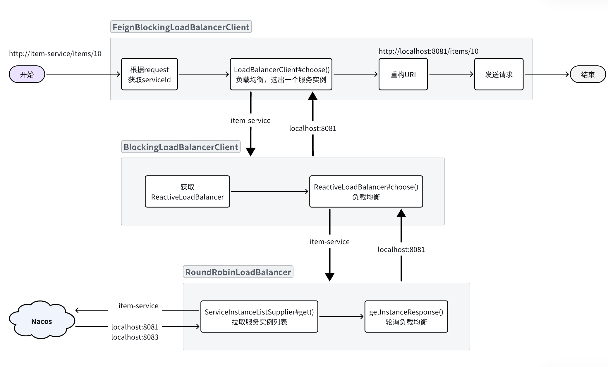

## 缓存问题

### 缓存一致性（双写一致性）

缓存的通用模型有三种：

- `Cache Aside`（常用）：由缓存调用者自己维护数据库与缓存的一致性。
    - 查询时：命中则直接返回，未命中则查询数据库并写入缓存
    - 更新时：更新数据库并删除缓存
- `Read/Write Through`：数据库自己维护一份缓存，底层实现对调用者透明。
    - 查询时：命中则直接返回，未命中则查询数据库并写入缓存
    - 更新时：判断缓存是否存在，不存在直接更新数据库。存在则更新缓存，同步更新数据库
- `Write Behind Cahing`：读写操作都直接操作缓存，由线程异步地将缓存数据同步到数据库

<br>

`Cache Aside`的写操作是要在更新数据库的同时删除缓存

那到底是先更新数据库再删除缓存，还是先删除缓存再更新数据库呢？


假设有两个线程，一个更新数据，一个查询数据

- 先更新数据库再删除缓存

**正常情况**


**异常情况**


> 由于更新数据库的操作本身比较耗时，在期间有线程来查询数据库并更新缓存的概率非常高。因此不推荐这种方案。

<br>

- 先更新数据库再删除缓存

**正常情况**


**异常情况**


> 异常概率较低，线程1必须是查询数据库已经完成，但是缓存尚未写入之前。线程2要完成更新数据库同时删除缓存的两个操作。

还有一种方式是延时双删，即在更新数据库后，先删除缓存，然后再延迟一段时间后再删除一次缓存。这样可以降低缓存不一致的概率。


<br>

### 缓存穿透

如果访问一个数据库中不存在的数据，那么缓存中肯定也不存在。因此不管请求该数据多少次，缓存永远不可能建立，请求永远会直达数据库。

假如有不怀好意的人，开启很多线程频繁的访问一个数据库中也不存在的数据。由于缓存不可能生效，那么所有的请求都访问数据库，可能就会导致数据库因过高的压力而宕机。


解决这个问题有两种思路：

- 缓存空对象
    - 优点：实现简单，维护方便
    - 缺点：
        - 额外的内存消耗
        - 可能造成短期的不一致

- 布隆过滤
    - 优点：内存占用较少，没有多余key
    - 缺点：
        - 实现复杂
        - 存在误判可能


<br>

### 缓存雪崩

缓存雪崩是指在同一时段大量的缓存key同时失效或者Redis服务宕机，导致大量请求到达数据库，带来巨大压力。

常见的解决方案有：

- 给不同的Key的TTL添加随机值，这样KEY的过期时间不同，不会大量KEY同时过期
- 利用Redis集群提高服务的可用性，避免缓存服务宕机
- 给缓存业务添加降级限流策略
- 给业务添加多级缓存，比如先查询本地缓存，本地缓存未命中再查询Redis，Redis未命中再查询数据库。即便Redis宕机，也还有本地缓存可以抗压力

<br>

### 缓存击穿

**缓存击穿**问题也叫**热点Key**问题，就是一个被高并发访问并且缓存重建业务较复杂的key突然失效了，无数的请求访问会在瞬间给数据库带来巨大的冲击。


常见的解决方案有两种：

- 互斥锁：给重建缓存逻辑加锁，避免多线程同时指向
- 逻辑过期：热点key不要设置过期时间，在活动结束后手动删除。


基于互斥锁的方案如图：


逻辑过期的思路如图：


<br>

---

## 微服务

### 分布式事务

#### CAP定理和BASE理论

1.**CAP定理**

1998年，加州大学的计算机科学家 Eric Brewer 提出，分布式系统有三个指标：

- **C**onsistency（一致性）
- **A**vailability（可用性）
- **P**artition tolerance （分区容错性）

!!!tip
    它们的第一个字母分别是 `C`、`A`、`P`。Eric Brewer认为任何分布式系统架构方案都不可能同时满足这3个目标，这个结论就叫做 CAP 定理。

!!!info
    `Consistency`（一致性）：用户访问分布式系统中的任意节点，得到的数据必须一致。

    `Availability`（可用性）：用户访问分布式系统时，读或写操作总能成功。

    `Partition`（分区）：当分布式系统节点之间出现网络故障导致节点之间无法通信的情况。

    `Tolerance`（容错）：即便是系统出现网络分区，整个系统也要持续对外提供服务。

<br>

2.**BASE理论**

- **B**asically **A**vailable **（**基本可用**）**：分布式系统在出现故障时，允许损失部分可用性，即保证核心可用。
- **S**oft State**（**软状态**）：**在一定时间内，允许出现中间状态，比如临时的不一致状态。
- **E**ventually Consistent**（**最终一致性**）**：虽然无法保证强一致性，但是在软状态结束后，最终达到数据一致。

以上就是BASE理论。


简单来说，BASE理论就是一种取舍的方案，不再追求完美，而是最终达成目标。因此解决分布式事务的思想也是这样，有两个方向：

- AP思想：各个子事务分别执行和提交，无需锁定数据。允许出现结果不一致，然后采用弥补措施恢复，实现最终一致即可。例如`AT`模式就是如此
- CP思想：各个子事务执行后不要提交，而是等待彼此结果，然后同时提交或回滚。在这个过程中锁定资源，不允许其它人访问，数据处于不可用状态，但能保证一致性。例如`XA`模式

<br>

#### AT模式的脏写问题

多线程并发访问AT模式的分布式事务时，有可能出现脏写问题，如图：


解决思路就是引入了全局锁的概念。在释放DB锁之前，先拿到全局锁。避免同一时刻有另外一个事务来操作当前数据。


<br>

#### TCC模式

TCC模式与AT模式非常相似，每阶段都是独立事务，不同的是TCC通过人工编码来实现数据恢复。需要实现三个方法：

-  `try`：资源的检测和预留； 
-  `confirm`：完成资源操作业务；要求 `try` 成功 `confirm` 一定要能成功。 
-  `cancel`：预留资源释放，可以理解为try的反向操作。


举例，一个扣减用户余额的业务。假设账户A原来余额是100，需要余额扣减30元。

**阶段一（ Try ）**：检查余额是否充足，如果充足则冻结金额增加30元，可用余额扣除30

初始余额：


余额充足，可以冻结：


此时，总金额 = 冻结金额 + 可用金额，数量依然是100不变。事务直接提交无需等待其它事务。

**阶段二（Confirm)**：假如要提交（Confirm），之前可用金额已经扣减，并转移到冻结金额。因此可用金额不变，直接冻结金额扣减30即可：


此时，总金额 = 冻结金额 + 可用金额 = 0 + 70  = 70元

**阶段二(Canncel)**：如果要回滚（Cancel），则释放之前冻结的金额，也就是冻结金额扣减30，可用余额增加30


TCC的优点是什么？

- 一阶段完成直接提交事务，释放数据库资源，性能好
- 相比AT模型，无需生成快照，无需使用全局锁，性能最强
- 不依赖数据库事务，而是依赖补偿操作，可以用于非事务型数据库

TCC的缺点是什么？

- 有代码侵入，需要人为编写try、Confirm和Cancel接口，太麻烦
- 软状态，事务是最终一致
- 需要考虑Confirm和Cancel的失败情况，做好幂等处理、事务悬挂和空回滚处理

<br>

#### 最大努力通知


<br>

### 注册中心

#### 环境隔离

企业实际开发中，往往会搭建多个运行环境，例如：

- 开发环境
- 测试环境
- 预发布环境
- 生产环境

这些不同环境之间的服务和数据之间需要隔离。

还有的企业中，会开发多个项目，共享nacos集群。此时，这些项目之间也需要把服务和数据隔离。

因此，Nacos提供了基于`namespace`的环境隔离功能。具体的隔离层次如图所示：


说明：

- Nacos中可以配置多个`namespace`，相互之间完全隔离。默认的`namespace`名为`public`
- `namespace`下还可以继续分组，也就是group ，相互隔离。 默认的group是`DEFAULT_GROUP`
- `group`之下就是服务和配置了


指定命名空间：

```yaml
spring:
  application:
    name: item-service # 服务名称
  profiles:
    active: dev
  cloud:
    nacos:
      server-addr: localhost # nacos地址
      discovery: # 服务发现配置
        namespace: 8c468c63-b650-48da-a632-311c75e6d235 # 设置namespace，必须用id
```

<br>

#### 分级模型

在一些大型应用中，同一个服务可以部署很多实例。而这些实例可能分布在全国各地的不同机房。由于存在地域差异，网络传输的速度会有很大不同，因此在做服务治理时需要区分不同机房的实例。


Nacos中提供了集群（`cluster`）的概念，来对应不同机房。也就是说，一个服务（`service`）下可以有很多集群（`cluster`），而一个集群（`cluster`）中下又可以包含很多实例（`instance`）。


任何一个微服务的实例在注册到Nacos时，都会生成以下几个信息，用来确认当前实例的身份，从外到内依次是：

- namespace：命名空间
- group：分组
- service：服务名
- cluster：集群
- instance：实例，包含ip和端口

这就是nacos中的服务分级模型。


如果我们要修改服务所在集群，只需要修改`bootstrap.yml`即可：

```YAML
spring:
  cloud:
    nacos:
      discovery:
        cluster-name: BJ # 集群名称，自定义
```

<br>

#### Eureka与Nacos

Eureka是Netflix公司开源的一个服务注册中心组件，早期版本的SpringCloud都是使用Eureka作为注册中心。由于Eureka和Nacos的starter中提供的功能都是基于SpringCloudCommon规范，因此两者使用起来差别不大。


Eureka和Nacos的相似点有：

- 都支持服务注册发现功能
- 都有基于心跳的健康监测功能
- 都支持集群，集群间数据同步默认是AP模式，即最全高可用性

Eureka和Nacos的区别有：

- Eureka只能等微服务自己每隔30秒更新一次服务列表；Nacos既有定时更新，也有在服务变更时的广播推送
- Eureka仅有注册中心功能，而Nacos同时支持注册中心、配置管理

<br>

### 远程调用

#### 负载均衡原理

在SpringCloud的早期版本中，负载均衡都是由Netflix公司开源的Ribbon组件来实现的，Ribbon甚至被直接集成到了Eureka-client和Nacos-Discovery中。

但是自SpringCloud2020版本开始，已经弃用Ribbon，改用Spring自己开源的Spring Cloud LoadBalancer了，我们使用的OpenFeign的也已经与其整合。

<br>

OpenFeign请求流程：

- 从请求的`URI`中找出`serviceId`
- 利用`loadBalancerClient`，根据`serviceId`做负载均衡，选出一个实例`ServiceInstance`
- 用选中的`ServiceInstance`的`ip`和`port`替代`serviceId`，重构`URI`
- 向真正的URI发送请求

<br>

具体的负载均衡则是不是由`OpenFeign`组件负责。而是分成了**负载均衡的接口规范**，以及**负载均衡的具体实现**两部分。

负载均衡的接口规范是定义在`Spring-Cloud-Common`模块中，包含下面的接口：

- `LoadBalancerClient`：负载均衡客户端，职责是根据serviceId最终负载均衡，选出一个服务实例
- `ReactiveLoadBalancer`：负载均衡器，负责具体的负载均衡算法

OpenFeign的负载均衡是基于`Spring-Cloud-Common`模块中的负载均衡规则接口，并没有具体实现。这就意味着以后还可以拓展其它各种负载均衡的实现。

不过目前`SpringCloud`中只有`Spring-Cloud-Loadbalancer`这一种实现。

`Spring-Cloud-Loadbalancer`模块中，实现了`Spring-Cloud-Common`模块的相关接口，具体如下：

- `BlockingLoadBalancerClient`：实现了`LoadBalancerClient`，会根据serviceId选出负载均衡器并调用其算法实现负载均衡。
- `RoundRobinLoadBalancer`：基于轮询算法实现了`ReactiveLoadBalancer`
- `RandomLoadBalancer`：基于随机算法实现了`ReactiveLoadBalancer`，

这样一来，整体思路就非常清楚了，流程图如下：



<br>

#### 更换负载均衡算法

SpringCloud默认采用的负载均衡策略是`RoundRobinLoadBalancer`(即轮询算法)


`Spring-Cloud-Loadbalancer`模块中有一个自动配置类`LoadBalancerClientConfiguration`，其中定义了默认的负载均衡器：

```java
    @Bean
    @ConditionalOnMissingBean //Bean不存在才创建该Bean
    public ReactorLoadBalancer<ServiceInstance> reactorServiceInstanceLoadBalancer(Environment environment, LoadBalancerClientFactory loadBalancerClientFactory) {
        String name = environment.getProperty("loadbalancer.client.name");
        return new RoundRobinLoadBalancer(loadBalancerClientFactory.getLazyProvider(name, ServiceInstanceListSupplier.class), name);
    }
```


自定义了这个类型的bean，则负载均衡的策略就会被改变

```java
public class OpenFeignConfig {

    @Bean
    public ReactorLoadBalancer<ServiceInstance> reactorServiceInstanceLoadBalancer(
            Environment environment, NacosDiscoveryProperties properties,
            LoadBalancerClientFactory loadBalancerClientFactory) {
        String name = environment.getProperty(LoadBalancerClientFactory.PROPERTY_NAME);
        return new NacosLoadBalancer(
                loadBalancerClientFactory.getLazyProvider(name, ServiceInstanceListSupplier.class), name, properties);
    }

}
```

!!!warning 注意
    这个配置类不能加`@Configuration`注解，也不要被SpringBootApplication扫描到。
    
    `NacosLoadBalancer`采用集群优先，以及加权算法，可以在Nacos中为服务实例配置不同的权重


由于这个OpenFeignConfig没有加`@Configuration`注解，也就没有被Spring加载，因此是不会生效的。接下来，我们要在启动类上通过注解来声明这个配置。

有两种做法：

- 全局配置：对所有服务生效

```Java
@LoadBalancerClients(defaultConfiguration = OpenFeignConfig.class)
```

- 局部配置：只对某个服务生效

```Java
@LoadBalancerClients({
        @LoadBalancerClient(value = "item-service", configuration = OpenFeignConfig.class)
})
```

<br>

---

### 服务保护

#### 线程隔离

无论是Hystix还是Sentinel都支持线程隔离。不过其实现方式不同。

线程隔离有两种方式实现：

- **线程池隔离**：给每个服务调用业务分配一个线程池，利用线程池本身实现隔离效果
    - 支持主动超时和异步调用
    - 线程池额外开销较大
    - 适用于低频调用的场景
- **信号量隔离**：不创建线程池，而是计数器模式，记录业务使用的线程数量，达到信号量上限时，禁止新的请求
    - 轻量级，无额外开销
    - 不支持主动超时与异步调用
    - 适用于高频调用的场景 

<br>

#### 滑动窗口计数法

在熔断功能中，需要统计异常请求或慢请求比例，也就是计数。在限流的时候，要统计每秒钟的QPS，同样是计数。可见计数算法在熔断限流中的应用非常多。sentinel中采用的计数器算法就是滑动窗口计数算法。


**固定窗口计数算法**

基本原理如图：


说明：

- 将时间划分为多个窗口，窗口时间跨度称为`Interval`，本例中为1000ms；
- 每个窗口维护1个计数器，每有1次请求就将计数器`+1`。限流就是设置计数器阈值，本例为3，图中红线标记
- 如果计数器超过了限流阈值，则超出阈值的请求都被丢弃。


存在的问题：

如果第5秒的三次请求都是在4.5~5秒之间到达；第6秒的请求是在5~5.5之间到达。那么从第4.5~5.之间就有6次请求！也就是说每秒的QPS达到了6，远超阈值。

这就是固定窗口计数算法的问题，它只能统计当前某1个时间窗的请求数量是否到达阈值，无法结合前后的时间窗的数据做综合统计。


**滑动窗口计数法**

固定时间窗口算法中窗口有很多，其跨度和位置是与时间区间绑定，因此是很多固定不动的窗口。而滑动时间窗口算法中只包含1个固定跨度的窗口，但窗口是可移动动的，与时间区间无关。

具体规则如下：

- 窗口时间跨度`Interval`大小固定，例如1秒
- 时间区间跨度为`Interval / n` ，例如n=2，则时间区间跨度为500ms
- 窗口会随着当前请求所在时间`currentTime`移动，窗口范围从`currentTime-Interval`时刻之后的第一个时区开始，到`currentTime`所在时区结束。


> 滑动窗口内划分的时区越多，这种统计就越准确。

<br>

#### 令牌桶算法

限流的另一种常见算法是令牌桶算法。Sentinel中的热点参数限流正是基于令牌桶算法实现的。其基本思路如图：


说明：

- 以固定的速率生成令牌，存入令牌桶中，如果令牌桶满了以后，多余令牌丢弃
- 请求进入后，必须先尝试从桶中获取令牌，获取到令牌后才可以被处理
- 如果令牌桶中没有令牌，则请求等待或丢弃


存在的问题：

- 某一秒令牌桶中产生了很多令牌，达到令牌桶上限N，缓存在令牌桶中，但是这一秒没有请求进入。
- 下一秒的前半秒涌入了超过2N个请求，之前缓存的令牌桶的令牌耗尽，同时这一秒又生成了N个令牌，于是总共放行了2N个请求。超出了我们设定的QPS阈值。

因此，在使用令牌桶算法时，尽量不要将令牌上限设定到服务能承受的QPS上限。而是预留一定的波动空间，这样我们才能应对突发流量。

<br>

#### 漏桶算法

漏桶算法与令牌桶相似，但在设计上更适合应对**并发波动较大**的场景，以解决令牌桶中的问题。

简单来说就是请求到达后不是直接处理，而是先放入一个队列。而后以固定的速率从队列中取出并处理请求。


说明：

- 将每个请求视作"水滴"放入"漏桶"进行存储；
- "漏桶"以固定速率向外"漏"出请求来执行，如果"漏桶"空了则停止"漏水”；
- 如果"漏桶"满了则多余的"水滴"会被直接丢弃。


漏桶的优势就是**流量整型**，桶就像是一个大坝，请求就是水。并发量不断波动，就如图水流时大时小，但都会被大坝拦住。而后大坝按照固定的速度放水，避免下游被洪水淹没。

因此，不管并发量如何波动，经过漏桶处理后的请求一定是相对平滑的曲线：


sentinel中的限流中的排队等待功能正是基于漏桶算法实现的。


---

- [x] 完
