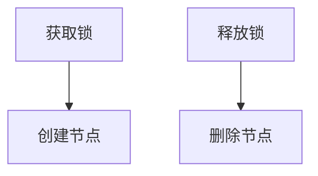

# *Zookeeper*

> [!Tip]
>
> 分布式系统的协调服务核心

*ZooKeeper*是一个**分布式的**、**开源**的分布式应用程序协调服务，它旨在为分布式应用提供一致性服务，包括配置维护、域名服务、分布式同步、组服务等核心功能


## 安装

docker安装

```bash
docker run -d \
--name zookeeper \
--privileged=true \
-p 2181:2181 \
-v /docker/zookeeper/data:/data \
-v /docker/zookeeper/conf:/conf \
-v /docker/zookeeper/logs:/datalog \
zookeeper
```


## 数据模型

ZooKeeper采用**层次化的命名空间**作为其数据模型，类似于标准的文件系统结构

1. **ZNode结构**：每个子目录项称为znode，被它所在的路径唯一标识。每个znode由3部分组成：stat(状态信息)、data(关联数据)和children(子节点列表)。
2. ZNode类型：
   - **持久节点(Persistent)**：一旦被创建，便不会意外丢失，即使服务器全部重启也依然存在
   - **临时节点(Ephemeral)**：在创建它的客户端与服务器间的Session结束时自动被删除
   - **顺序节点(Sequence)**：创建出的节点名在指定名称后带有10位十进制数的序号


## 常见命令

常用命令包括

- `create /path data`：创建节点
  - 默认创建持久节点
  - `-e` 临时节点
  - `-s` 顺序节点
- `get /path`：获取节点数据和状态
- `set /path data`：修改节点数据
- `ls /path`：列出子节点
  - `-s` 节点详细信息
- `delete /path`：删除节点


## Java API(*Curator*)

### 引入依赖

```xml
        <dependency>
            <groupId>org.apache.curator</groupId>
            <artifactId>curator-framework</artifactId>
            <version>4.0.0</version>
        </dependency>

        <dependency>
            <groupId>org.apache.curator</groupId>
            <artifactId>curator-recipes</artifactId>
            <version>4.0.0</version>
        </dependency>
```


### 创建客户端（两种方式）

```java
    /**
     * 测试方法：演示两种方式创建 CuratorFramework 客户端并连接 Zookeeper
     */
    @Test
    public void testConnect() {
        // Zookeeper 服务地址
        String host = "localhost:2181";
        // 会话超时时间（毫秒）
        int sessionTimeoutMs = 5000;
        // 连接超时时间（毫秒）
        int connectionTimeoutMs = 5000;
        // 重试策略：初始等待3秒，最多重试10次
        RetryPolicy retryPolicy = new ExponentialBackoffRetry(3000, 10);

        // 方式一：使用 newClient 创建客户端
        CuratorFramework client1 = CuratorFrameworkFactory.newClient(
                host,
                sessionTimeoutMs,
                connectionTimeoutMs,
                retryPolicy
        );
        client1.start(); // 启动客户端
        logger.info(client1.toString()); // 打印客户端信息

        // 方式二：使用 builder 创建客户端，并指定命名空间
        CuratorFramework client2 = CuratorFrameworkFactory.builder()
                .connectString(host)
                .sessionTimeoutMs(sessionTimeoutMs)
                .connectionTimeoutMs(connectionTimeoutMs)
                .retryPolicy(retryPolicy)
                .namespace("ysh") // 设置命名空间
                .build();
        client2.start(); // 启动客户端
        logger.info(client2.toString()); // 打印客户端信息
    }
```


### 创建节点

```java
    @Test
    public void testCreate() {
        try {
            String path = client
                    .create()
                    .withMode(CreateMode.EPHEMERAL) // 设置节点类型为临时节点
                    .forPath("/app", "hello".getBytes()); // 创建节点 /app 并设置数据为 "hello"
            logger.info(path);
        } catch (Exception e) {
            throw new RuntimeException(e);
        }
    }
```

> [!Tip]
>
> 递归创建父节点
>
> ```java
> client.create().creatingParentsIfNeeded().forPath("/app/parent/child");
> ```


### 查询节点

```java
            // 获取节点 /app 的数据
            byte[] data = client.getData().forPath("/app");
            String s = new String(data, StandardCharsets.UTF_8);
            logger.info(s);

            // 获取节点 /app 的子节点列表
            List<String> children = client.getChildren().forPath("/app");
            logger.info(children.toString());

            // 获取节点 /app 的状态信息
            Stat stat = new Stat();
            client.getData().storingStatIn(stat).forPath("/app");
            logger.info(stat.toString());
```


### 修改节点

```java
    @Test
    public void testSet() throws Exception {
        // 修改节点 /app 的数据为 "world"
        // !!!使用CAS方法，比较版本号，确保数据一致性
        Stat stat = new Stat();
        client.getData().storingStatIn(stat).forPath("/app");
        int version = stat.getVersion();
        client.setData().withVersion(version).forPath("/app", "world".getBytes(StandardCharsets.UTF_8));
    }
```


### 删除节点

```java
    @Test
    public void testDelete() throws Exception {
        // 删除单个节点
        client.delete().forPath("/app/parent/child");

        // 删除节点及其所有子节点
        client.delete().deletingChildrenIfNeeded().forPath("/app");

        // 保证删除机制，它确保节点一定会被删除
        client.delete().guaranteed().forPath("/app");

        // 删除节点后回调
        client.delete().inBackground(new BackgroundCallback() {
            @Override
            public void processResult(CuratorFramework curatorFramework, CuratorEvent curatorEvent) {
                logger.info(curatorEvent.toString());
            }
        }).forPath("/app");
    }
```


### Watch事件监听

> [!Tip]
>
> ZooKeeper的事件监听机制(Watches)是其核心特性之一，允许客户端监控ZNode的变化并及时获得通知。这种机制为分布式系统提供了高效的数据变更通知方式。
>
> 1. **一次性触发**：Watch是一次性的，触发后即失效，需要重新设置
> 2. **异步通知**：事件通知通过回调方式异步发送给客户端
> 3. **事件有序性**：客户端看到的事件顺序与ZooKeeper服务端发生的顺序一致
> 4. **先注册后触发**：必须先设置Watch，才能收到后续变更通知
> 5. **仅状态变化**：仅当ZNode状态发生改变时才会触发，数据内容不变但版本号变化也会触发


ZooKeeper定义了以下几种事件类型：

|      事件类型       |    触发条件    |               对应方法               |
| :-----------------: | :------------: | :----------------------------------: |
|     NodeCreated     |   节点被创建   |               exists()               |
|     NodeDeleted     |   节点被删除   | exists() / getData() / getChildren() |
|   NodeDataChanged   |  节点数据变更  |         exists() / getData()         |
| NodeChildrenChanged | 子节点列表变更 |            getChildren()             |


#### *NodeCache* - 监控单个节点

NodeCache用于监控单个节点的数据变化（创建、更新、删除）：

```java
    @Test
    public void testNodeCache() throws Exception {
        // 创建NodeCache对象
        NodeCache nodeCache = new NodeCache(client, "/app");
        // 注册监听
        nodeCache.getListenable().addListener(new NodeCacheListener() {
            @Override
            public void nodeChanged() throws Exception {
                logger.info("节点状态改变");
                byte[] data = nodeCache.getCurrentData().getData();
                logger.info(new String(data, StandardCharsets.UTF_8));
            }
        });
        // 开始监听
        nodeCache.start();
    }
```


#### *PathChildrenCache* - 监控子节点

PathChildrenCache用于监控指定节点下子节点的变化（不包括该节点本身）：

```java
    @Test
    public void testPathChildrenCache() throws Exception {
        // 创建 PathChildrenCache 对象，监听 /app 路径下的子节点变化
        PathChildrenCache pathChildrenCache = new PathChildrenCache(client, "/app", true);
        // 注册监听器，处理子节点事件
        pathChildrenCache.getListenable().addListener(new PathChildrenCacheListener() {
            @Override
            public void childEvent(CuratorFramework curatorFramework, PathChildrenCacheEvent pathChildrenCacheEvent) throws Exception {
                logger.info("子节点事件: {}", pathChildrenCacheEvent.toString());
                switch (pathChildrenCacheEvent.getType()) {
                    case CHILD_ADDED:
                        logger.info("子节点添加: {}", pathChildrenCacheEvent.getData().getPath());
                        break;
                    case CHILD_UPDATED:
                        logger.info("子节点更新: {}", pathChildrenCacheEvent.getData().getPath());
                        byte[] data = pathChildrenCacheEvent.getData().getData();
                        logger.info("新数据: {}", new String(data, StandardCharsets.UTF_8));
                        break;
                    case CHILD_REMOVED:
                        logger.info("子节点删除: {}", pathChildrenCacheEvent.getData().getPath());
                        break;
                    default:
                        break;
                }
            }
        });
        // 启动 PathChildrenCache，开始监听子节点变化
        pathChildrenCache.start();
    }
```


#### *TreeCache* - 综合监控

TreeCache是NodeCache和PathChildrenCache的组合，可以监控整个子树的变化：

```java
    @Test
    public void testTreeCache() throws Exception {
        // 创建 TreeCache 对象，监听整个树形结构的变化
        TreeCache treeCache = new TreeCache(client, "/app");
        // 注册监听器，处理树形结构事件
        treeCache.getListenable().addListener(new TreeCacheListener() {
            @Override
            public void childEvent(CuratorFramework curatorFramework, TreeCacheEvent treeCacheEvent) throws Exception {
                logger.info("树形结构事件: {}", treeCacheEvent.toString());
            }
        });
        // 启动 TreeCache，开始监听树形结构变化
        treeCache.start();
    }
```


## 分布式锁实现

> [!Tip]
>
> 分布式锁是一种在分布式系统环境下，通过多个节点对共享资源进行访问控制的同步机制。它的主要目的是防止多个节点同时操作同一份数据，从而避免数据的不一致性。与单机环境下的锁不同，分布式锁需要跨越多个节点，确保在整个分布式系统范围内对共享资源的互斥访问。
>
> 在单机环境中，我们可以使用语言提供的同步机制（如Java的synchronized关键字或ReentrantLock类）来实现线程间的同步。但在分布式系统中，应用程序运行在多个物理或虚拟节点上，传统的本地锁机制已无法满足跨节点的同步需求



1. 获取锁时，在lock节点下创建<font color=red>临时顺序</font>节点

   > 临时节点：防止死锁，客户端断开连接后自动删除
   >
   > 顺序节点：根据顺序来确定当前锁的持有者（如序号最小的节点锁对应的客户端持有锁）

2. 获取lock下的所有子节点，序号最小者成功获得锁
3. 竞争失败的客户端向持有锁的节点注册监听器监听删除事件，准备再次竞争
4. 释放锁时，删除客户端对应节点，监听器通知其余节点竞争锁（回到步骤2.）


`Curator`分布式锁API

```java
// 创建锁
InterProcessMutex lock = new InterProcessMutex(client, "/locks/my_lock");

try {
    // 获取锁（带超时）
    if (lock.acquire(10, TimeUnit.SECONDS)) {
        try {
            // 执行业务逻辑
            System.out.println("获取锁成功，执行业务逻辑");
        } finally {
            // 释放锁
            lock.release();
        }
    }
} catch (Exception e) {
    e.printStackTrace();
}
```


InterProcessMutex (可重入互斥锁) vs InterProcessSemaphoreMutex (不可重入互斥锁)

|    特性    | InterProcessMutex | InterProcessSemaphoreMutex |
| :--------: | :---------------: | :------------------------: |
|  可重入性  |      ✅ 支持       |          ❌ 不支持          |
| 锁获取顺序 |    公平(FIFO)     |         公平(FIFO)         |
|  实现机制  |   临时顺序节点    |          临时节点          |
|  适用场景  |  需要重入的场景   |        简单互斥场景        |
|    性能    |       稍低        |            稍高            |
|  死锁风险  |        低         |             低             |


InterProcessReadWriteLock (读写锁)

|   特性    |        读锁        |        写锁        |
| :-------: | :----------------: | :----------------: |
|  并发性   | 多个读锁可同时获取 | 独占，与其他锁互斥 |
| 升级/降级 |      ❌ 不支持      |      ❌ 不支持      |
|  公平性   |     公平(FIFO)     |     公平(FIFO)     |
| 适用场景  |      读多写少      |       写操作       |


InterProcessMultiLock (多重锁)

|   特性   |                说明                |
| :------: | :--------------------------------: |
|  原子性  |   要么全部获取成功，要么全部失败   |
|   用途   |     需要同时获取多个资源的场景     |
|   风险   | 容易造成死锁，需要谨慎设计获取顺序 |
| 性能影响 |        获取多个锁会增加延迟        |


InterProcessSemaphore (信号量)

|    特性    |              说明              |
| :--------: | :----------------------------: |
| 限制并发数 | 可以控制同时访问资源的线程数量 |
|  非公平性  | 默认非公平，可通过配置实现公平 |
|  适用场景  |       限流、资源池管理等       |


## 集群

> [!Tip]
>
> 由多个服务器节点组成，通常建议部署奇数个节点（3、5、7等），以实现高可用性和容错能力。


### 集群角色

- **Leader**：负责处理所有写请求和事务性操作，集群中只有一个Leader
- **Follower**：处理读请求，参与Leader选举和事务提案投票
- **Observer**（可选）：扩展读能力，不参与投票，只同步数据


### 集群搭建详细步骤

#### 1. 环境准备

**要求**：

- JDK 8或11（推荐OpenJDK）
- ZooKeeper 3.5+（推荐3.6.x稳定版）


#### 2. 安装ZooKeeper（所有节点）

```bash
# 1. 下载并解压（以3.6.3为例）
wget https://downloads.apache.org/zookeeper/zookeeper-3.6.3/apache-zookeeper-3.6.3-bin.tar.gz
tar -zxvf apache-zookeeper-3.6.3-bin.tar.gz
mv apache-zookeeper-3.6.3-bin /opt/zookeeper

# 2. 创建数据目录
mkdir -p /var/lib/zookeeper/data
mkdir -p /var/lib/zookeeper/logs

# 3. 设置环境变量
echo 'export ZOOKEEPER_HOME=/opt/zookeeper' >> /etc/profile
echo 'export PATH=$PATH:$ZOOKEEPER_HOME/bin' >> /etc/profile
source /etc/profile
```


#### 3. 配置集群（所有节点）

**创建配置文件**

```bash
cd /opt/zookeeper/conf
cp zoo_sample.cfg zoo.cfg
```

**编辑zoo.cfg（示例配置）**

```properties
tickTime=2000
initLimit=10
syncLimit=5
dataDir=/var/lib/zookeeper/data
dataLogDir=/var/lib/zookeeper/logs
clientPort=2181
maxClientCnxns=60
autopurge.snapRetainCount=3
autopurge.purgeInterval=24

# 集群配置（所有节点相同）
server.1=zk1.example.com:2888:3888
server.2=zk2.example.com:2888:3888
server.3=zk3.example.com:2888:3888
```

**创建myid文件（每个节点不同）**

```bash
# 在节点1执行
echo "1" > /var/lib/zookeeper/data/myid

# 在节点2执行
echo "2" > /var/lib/zookeeper/data/myid

# 在节点3执行
echo "3" > /var/lib/zookeeper/data/myid
```


### 4. 启动集群

**按顺序启动节点（先启动1，再2，最后3）**

```bash
# 在每个节点执行
/opt/zookeeper/bin/zkServer.sh start
```

**验证启动状态**

```bash
# 检查状态（会显示Mode: leader或follower）
/opt/zookeeper/bin/zkServer.sh status

# 四字命令检查
echo stat | nc localhost 2181
```


### 5. 集群验证测试

**基本功能测试**

```bash
# 连接到任意节点
/opt/zookeeper/bin/zkCli.sh -server localhost:2181

# 在ZooKeeper客户端中执行
[zk: localhost:2181(CONNECTED) 0] create /test "hello"
[zk: localhost:2181(CONNECTED) 1] get /test
[zk: localhost:2181(CONNECTED) 2] delete /test
```

**容灾测试**

1. 停止Leader节点
2. 观察**自动选举**新Leader（约10-30秒）
3. 验证数据一致性


### 6. 生产环境优化建议

**配置优化**

```properties
# 增加以下参数到zoo.cfg
# 快照保留数量
autopurge.snapRetainCount=10
# 清理间隔(小时)
autopurge.purgeInterval=48
# 单个数据包最大尺寸(字节)
jute.maxbuffer=10485760
# 预分配大小(KB)
preAllocSize=65536
# 客户端心跳超时(ms)
maxSessionTimeout=60000
```

**JVM优化**

```bash
# 修改bin/zkServer.sh中的JVM参数
export SERVER_JVMFLAGS="-Xms4G -Xmx4G -XX:+UseG1GC -XX:MaxGCPauseMillis=200 -XX:+DisableExplicitGC"
```


### 7. 常见问题解决

**启动失败排查**

1. 检查`/var/lib/zookeeper/data/zookeeper_server.pid`是否存在
2. 查看日志`/opt/zookeeper/logs/zookeeper.out`
3. 验证端口是否冲突`netstat -tulnp | grep 2181`

**节点无法加入集群**

1. 检查防火墙设置（开放2181,2888,3888端口）
2. 验证myid文件是否正确
3. 检查主机名解析（/etc/hosts或DNS）

**数据不一致处理**

1. 停止所有节点
2. 在最新数据的节点上保留数据
3. 其他节点清空dataDir目录
4. 重新启动集群


### 8. 维护命令

**日常维护**

```bash
# 优雅重启
/opt/zookeeper/bin/zkServer.sh restart

# 强制清理（谨慎使用）
/opt/zookeeper/bin/zkCleanup.sh -n 10

# 查看连接数
echo cons | nc localhost 2181
```

**监控命令**

```bash
# 监控集群状态
watch -n 1 "echo stat | nc localhost 2181 | grep Mode"

# 监控znode数量
echo mntr | nc localhost 2181 | grep znode_count
```


S
