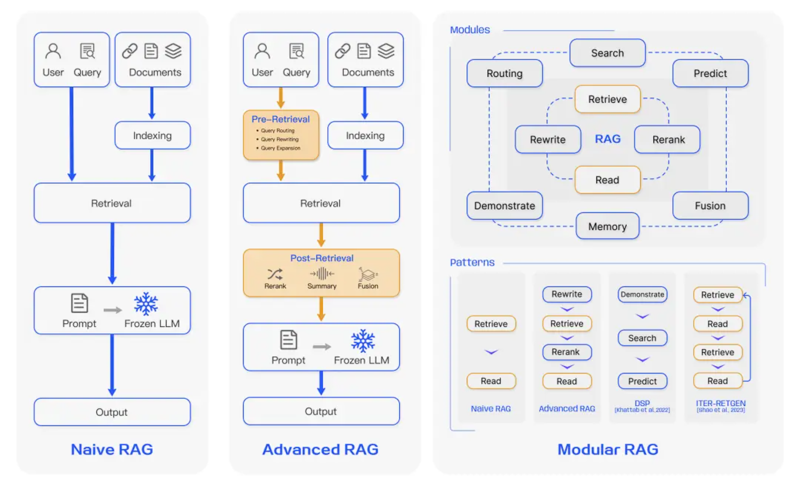

## 什么是RAG
RAG（Retrieval-Augmented Generation）是一种结合检索和生成的技术，用于提升语言模型的回答准确性和上下文相关性。
<!-- more -->


该技术通过从外部知识库中检索相关信息，并将其作为提示（Prompt）输入给大型语言模型（LLM），从而提升生成内容的准确性和上下文相关性。

!!!example "举个例子 （假设用于训练AI的数据截至于2023年）"

    作为用户，我问AI：
        
        “2024年美国大选中当选美国总统的候选人是谁？”

    由于AI的训练数据截止到2023年，AI无法直接回答这个问题，或者AI会捏造一个答案。

    但是通过RAG技术，AI可以先从外部知识库中检索到相关的最新信息并准确地给出答案：

        “2024年美国大选中当选美国总统的是特朗普。”


## RAG的工作原理

RAG的工作流程通常包括以下几个步骤：

1. **知识库准备**：构建一个包含大量文本数据的知识库，这些数据可以是文档、网页、书籍等。

2. **嵌入于索引**： 将知识库中的文本数据转换为**向量**表示，并存储在高效的向量数据库中，以便快速检索。

3. **查询检索**： 当用户提出问题时，系统会将问题转换为向量，并在向量数据库中检索与问题最相关的文本片段。

4. **上下文构建**：将检索到的相关信息与用户的输入问题结合，构建一个更丰富的上下文。

5. **生成回答**：将构建的上下文作为提示，输入到大型语言模型中，生成最终的回答。


三种RAG架构：



## 基于Lanchain4j的RAG实现

[Lanchain4j](https://docs.langchain4j.dev/)是一个Java库，简化了构建基于LLM的应用程序的过程。它提供了与各种LLM和向量数据库的集成，支持RAG等高级功能。

### 添加依赖
```xml
<dependency>
    <groupId>dev.langchain4j</groupId>
    <artifactId>langchain4j</artifactId>
    <version>1.4.0</version>
</dependency>

<dependency>
    <groupId>dev.langchain4j</groupId>
    <artifactId>langchain4j-easy-rag</artifactId>
    <version>1.4.0-beta10</version>
</dependency>
```

### 加载知识库
```java
List<Document> documents = FileSystemDocumentLoader.loadDocuments("your-documents-path");
```

### 创建向量数据库
Lanchain4j支持多种向量数据库，如Elasticsearch、MongoDB Atlas等。这里以InMemoryEmbeddingStore为例：
```java
InMemoryEmbeddingStore<TextSegment> embeddingStore = new InMemoryEmbeddingStore<>();
EmbeddingStoreIngestor.ingest(documents, embeddingStore);
```

!!!info "嵌入模型"
    嵌入模型是一种AI模型，用于将文本转换为向量表示。

    Lanchain4j的easy-rag提供了默认的嵌入模型，如果需要更强大的嵌入模型，可以自行配置


!!!warning "注意"
    InMemoryEmbeddingStore适合小规模数据，生产环境建议使用持久化向量数据库。


### 配置使用RAG
```java
interface Assistant {

    String chat(String userMessage);
}

ChatModel chatModel = OpenAiChatModel.builder()
    .apiKey(System.getenv("OPENAI_API_KEY"))
    .modelName(GPT_4_O_MINI)
    .build();

Assistant assistant = AiServices.builder(Assistant.class)
    .chatModel(chatModel)
    .chatMemory(MessageWindowChatMemory.withMaxMessages(10))
    .contentRetriever(EmbeddingStoreContentRetriever.from(embeddingStore))
    .build();

assistant.chat("your question");
```
