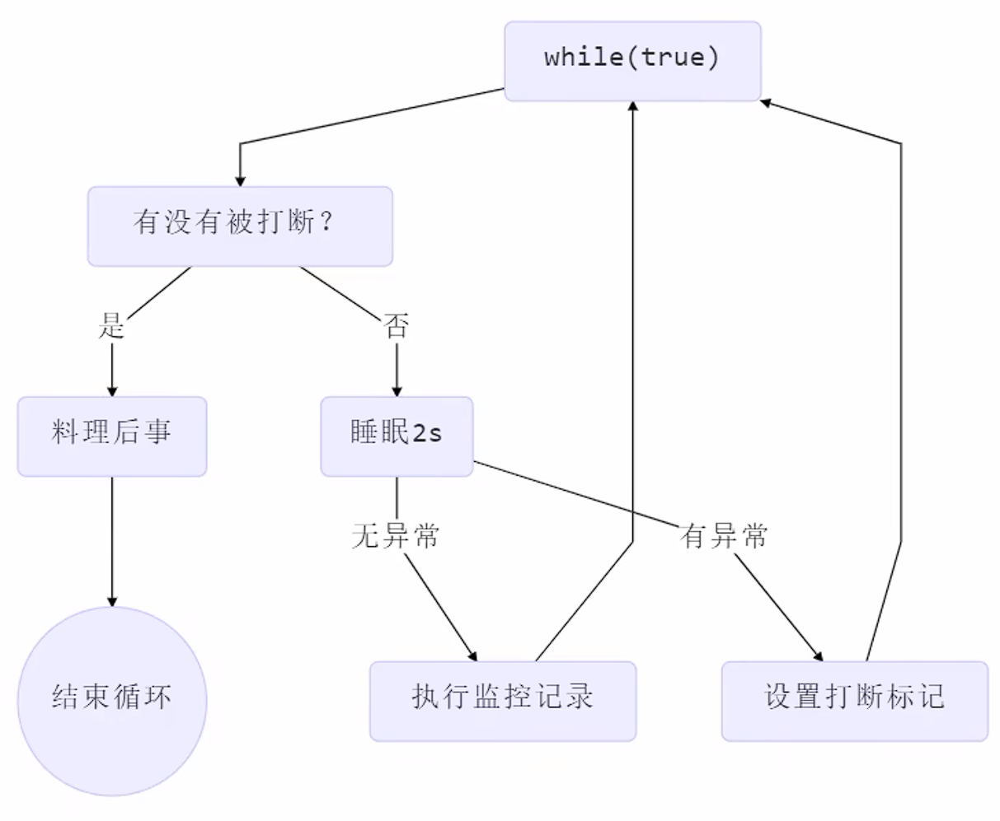
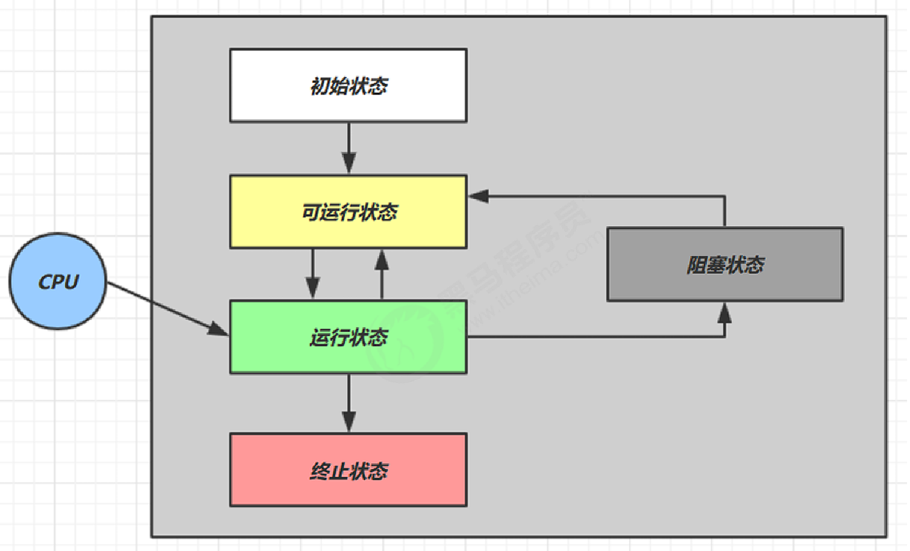
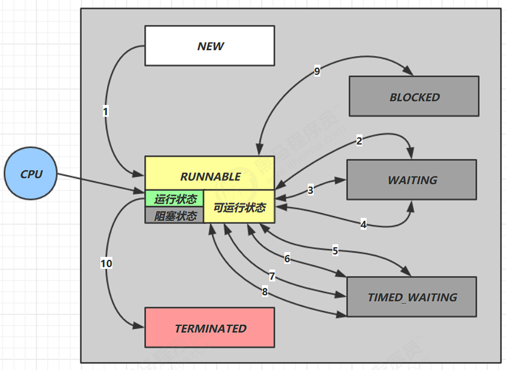

# Java线程

## 创建和启动线程

### Thread匿名类

```java
// 创建线程对象
Thread t = new Thread(){
    @Override
    public void run() {
        // 线程执行的代码
        log.info("Running...");
    }
};
// 启动线程
t.start();
```

!!!note
    建议为线程指定名字

    可以通过线程对象的 `setName(String name)` 方法为线程指定名字

---

### Runnable（推荐）

```java
Runnable r = new Runnable() {
    @Override
    public void run() {
        // 需要执行的任务
        log.info("Running...");
    }
};

Thread t2 = new Thread(r, "Test2");
t2.start();
```


!!!tip
    可使用lambda表达式简化
    ```java
    Runnable r = () -> log.info("Running...");
    ```


**原理解析**

Thread中的run 方法：

```java
@Override
public void run() {
    if (target != null) {
        target.run();
    }
}
```

- Thread匿名类重写了该方法，实现任务执行
- Runnable会被赋值给target变量，然后执行其中的任务

---

### FutureTask

FutureTask 能够接收 Callable 类型的参数，用来处理有返回结果的情况

```java
// 创建任务对象
FutureTask<Integer> task = new FutureTask<>(() -> {
    log.info("Running...");
    Thread.sleep(2000);
    return 200;
});

// 创建线程对象
Thread t = new Thread(task);
t.start();
log.info("Waiting...");
log.debug("Result: {}", task.get());
```

输出

```
03-29 13:51:18 [main] INFO  com.ysh.Test - Start 
03-29 13:51:18 [main] INFO  com.ysh.Test - Waiting... 
03-29 13:51:18 [Thread-0] INFO  com.ysh.Test - Running... 
03-29 13:51:20 [main] DEBUG com.ysh.Test - Result: 200 
03-29 13:51:20 [main] INFO  com.ysh.Test - End
```


### 查看进程线程

**windows**  

- 任务管理器可以查看进程和线程数，也可以用来杀死进程 

- `tasklist` 查看进程

- `taskkill` 杀死进程 

  

**linux**  

- `ps -fe` 查看所有进程 

- `ps -fT -p`  查看某个进程（PID）的所有线程 

- `kill ` 杀死进程 

- `top` 按大写 H 切换是否显示线程 

- `top -H -p`  查看某个进程（PID）的所有线程 

  

**Java**  

- `jps` 命令查看所有 Java 进程 
- `jstack`  查看某个 Java 进程（PID）的所有线程状态  
- `jconsole` 来查看某个 Java 进程中线程的运行情况（图形界面）


jconsole 远程监控配置 

需要以如下方式运行你的 java 类 

```bash
java -Djava.rmi.server.hostname=`ip地址` -Dcom.sun.management.jmxremote  Dcom.sun.management.jmxremote.port=`连接端口` -Dcom.sun.management.jmxremote.ssl=是否安全连接  Dcom.sun.management.jmxremote.authenticate=是否认证  java类
```

- 修改 /etc/hosts 文件将 127.0.0.1 映射至主机名 
- 如果要认证访问，还需要做如下步骤 
    - 复制 jmxremote.password 文件 
    - 修改 jmxremote.password 和 jmxremote.access 文件的权限为 600 即文件所有者可读写 
    - 连接时填入 controlRole（用户名），R&D（密码）


## 线程原理

### 栈与栈帧

Java Virtual Machine Stacks （Java 虚拟机栈）

JVM 内存有堆、栈、方法区，栈会为每一个线程分配一块栈内存。

- 每个栈由多个栈帧组成，对应每次方法调用
- 每个线程只能有一个活动栈帧，对应当前正在执行的方法

<br>

### 线程上下文切换(Thread Context Switch)

引起线程上下文切换的情况：

- 线程的CPU时间片使用完
- *JVM*进行垃圾回收
- 有更高优先级的线程需要运行
- 线程调用了 `sleep、yield、wait、join、park、synchronized、lock` 等方法


当 `Context Switch` 发生时，需要由操作系统保存当前线程的状态，并恢复另一个线程的状态，Java 中对应的概念就是程序计数器（Program Counter Register），它的作用是记住下一条 jvm 指令的执行地址，是线程私有的

- 状态包括程序计数器、虚拟机栈中每个栈帧的信息，如局部变量、操作数栈、返回地址等 
- Context Switch 频繁发生会影响性能

<br>
---

## 线程常见方法

| 方法名          | 功能                                    | 注意                                                         |
| --------------- | --------------------------------------- | ------------------------------------------------------------ |
| start()         | 启动一个线程                            | start 方法只是让线程进入就绪，里面代码不一定立刻运行，<font color=red>只能调用一次</font> |
| run()           | 线程启动后会执行的方法                  | 手动调用该方法不会启动线程                |
| join()          | 等待线程运行结束                        |                                                              |
| join(long n)    | 等待线程运行结束,最多等待 n  毫秒      |                                                              |
| getId()         | 获取线程ID                              | ID唯一                                                       |
| getName()       | 获取线程名                              |                                                              |
| setName()       | 修改线程名                              |                                                              |
| setPriority()   | 修改线程优先级                          | java中规定线程优先级是1~10 的整数，较大的优先级 能提高该线程被 CPU 调度的机率 |
| getPriority()   | 获取线程优先级                          |                                                              |
| getState()      | 获取线程状态                            | Java 中线程状态是用 6 个 enum 表示，分别为： NEW, RUNNABLE, BLOCKED, WAITING,  TIMED_WAITING, TERMINATED |
| isAlive()       | 线程是否存活（还没有执行完）            |                                                              |
| isInterrupted() | 判断线程是否被打断                      | 不会清除 **打断标记**                                        |
| interrupt()     | 打断线程                                | 如果被打断线程正在 sleep，wait，join 会导致被打断 的线程抛出 `InterruptedException`，并清除打断标记，如果打断的正在运行的线程，则会设置 打断标记，park 的线程被打断，也会设置打断标记 |
| interrupted()   | 打断线程                                | 静态方法，会清除 **打断标记**                                |
| currentThread() | 获取当前正在执行的线程                  | 静态方法                                                     |
| sleep(long n)   | 使线程休眠                              | 静态方法                                                     |
| yield()         | 提示线程调度器 让出当前线程对 CPU的使用 | 静态方法                                                     |

<br>

### run() 和 start()

- 直接调用`run()`方法，实际上仍然由main线程执行，并不会创建新线程。
- 调用`start()`方法，会新建线程，并由新线程执行`run()`方法。


!!!caution
    `start()`方法每个线程对象只能调用一次，再次调用会抛出异常

<br>

### sleep() 和 yield()

**sleep**

- 调用 sleep 会让当前线程从 Running  进入 Timed Waiting 状态（阻塞）

- 其它线程可以使用  interrupt 方法打断正在睡眠的线程，这时 sleep 方法会抛出 `InterruptedException`

- 睡眠结束后的线程未必会立刻得到执行

- 建议用 `TimeUnit` 的 sleep 代替 Thread 的 sleep 来获得更好的可读性

```java
try {
    // 当前线程休眠1秒
    TimeUnit.SECONDS.sleep(1);
} catch (InterruptedException e) {
    e.printStackTrace();
}
```


**yield**

- 调用 yield 会让当前线程从 Running 进入 Runnable  就绪状态，然后调度执行其它线程
- 具体的实现依赖于操作系统的任务调度器


!!!example "案例"
    ​防止 CPU 100%占用：

    线程不需要执行任务时，不要让`while(true)`空转占用 CPU ，应该使用`yield`或者`sleep`让出 CPU 资源

<br>

### 线程优先级

- 线程优先级会提示（hint）调度器优先调度该线程，但它**仅仅是一个提示，调度器可以忽略它**
- 如果 cpu 比较忙，那么优先级高的线程会获得更多的时间片，但 cpu 空闲时，优先级几乎没作用

<br>

### join()

对于如下代码，主线程打印出 r 的值为 0，因为主线程并不会等待t1线程运行完后才打印

```java
static int r = 0;

public static void main(String[] args) throws InterruptedException {
    test1();
}

private static void test1() throws InterruptedException {
    log.debug("开始");
    Thread t1 = new Thread(() -> {
        log.debug("开始");
        sleep(1);
        log.debug("结束");
        r = 10;
    });
    t1.start();
    log.debug("结果为:{}", r);
    log.debug("结束");
}
```

在 `t1.start()` 之后调用 `t1.join()`，主线程则会等待 t1 执行结束（**线程同步**）

!!!tip
    带参数的`join`方法会等待指定时间，如果线程执行时间小于等待时间，`join`会提前结束，如果等待时间小于线程执行时间，会在到达等待时间后结束。

<br>

### interrupt()

**打断 sleep，wait，join 的线程**

这几个方法都会让线程进入阻塞状态

打断 sleep 的线程, 会清空打断状态（调用isInterrupted()返回的boolean值）


打断正常运行的线程

```java
Thread t1 = new Thread(() -> {
    while (true) {
        boolean interrupted = Thread.currentThread().isInterrupted();
        if (interrupted) {
            log.info("Thread1 interrupted");
            break;
        }
        log.info("Thread1 running");
    }
});

t1.start();

TimeUnit.SECONDS.sleep(1);

t1.interrupt();
```


#### 设计模式-两阶段终止



```java
private Thread monitor;

public void start() {
    monitor = new Thread(() -> {
        while (true) {
            Thread current = Thread.currentThread();
            if (current.isInterrupted()) {
                log.info("被打断，处理中...");
                // ...
                break;
            }

            try {
                Thread.sleep(1000);
                log.info("监控中...");
            } catch (InterruptedException e) {
                // 重新设置中断状态
                current.interrupt();
            }
        }
        log.info("监控结束");
    });
    monitor.start();
}

public void stop() {
    monitor.interrupt();
}
```

!!!danger "注意"
    由于线程可能在sleep时被打断，而此时打断标记会被置为false，所以需要重新设置打断标记

!!!tip 
    建议使用`volatile`关键字修饰的boolean变量作为线程停止标志


#### 打断park线程

打断park线程，不会清空打断状态

```java
Thread t1 = new Thread(() -> {
    log.debug("park...");
    LockSupport.park();
    log.debug("unpark...");
    log.debug("打断状态：{}", Thread.currentThread().isInterrupted());
},"t1");
t1.start();
sleep(0.5);
t1.interrupt();
```

输出打断状态为 true


!!!note
    如果在park之前打断标记已经是true，那么park时会失效

<br>
---

### 不推荐的方法

如下方法容易破坏同步代码块，造成死锁，JDK官方已经不推荐使用

| 方法      | 功能             |
| --------- | ---------------- |
| stop()    | 停止线程         |
| suspend() | 挂起（暂停）线程 |
| resume()  | 恢复线程运行     |

<br>

---

##  守护线程

默认情况下，Java 进程需要等待所有线程都运行结束，才会结束。

但是有一种特殊的线程叫做守护线程，只要其它非守护线程运行结束了，即使守护线程的代码没有执行完，也会强制结束。


如下方法可将线程设置为守护线程

```java
public final void setDaemon(boolean on)
```

!!!example
    - 垃圾回收器线程就是一种守护线程 
    - Tomcat 中的 Acceptor 和 Poller 线程都是守护线程，所以 Tomcat 接收到 shutdown 命令后，不会等待它们处理完当前请求

<br>

---

## 线程状态

从 **操作系统** 层面来描述线程状态：



- 【初始状态】仅是在语言层面创建了线程对象，还未与操作系统线程关联 
- 【可运行状态】（就绪状态）指该线程已经被创建（与操作系统线程关联），可以由 CPU 调度执行 
- 【运行状态】指获取了 CPU 时间片运行中的状态 
    - 当 CPU 时间片用完，会从【运行状态】转换至【可运行状态】，会导致线程的上下文切换 
- 【阻塞状态】 
    - 如果调用了阻塞 API，如 BIO 读写文件，这时该线程实际不会用到 CPU，会导致线程上下文切换，进入 【阻塞状态】 
    - 等 BIO 操作完毕，会由操作系统唤醒阻塞的线程，转换至【可运行状态】 
    - 与【可运行状态】的区别是，对【阻塞状态】的线程来说只要它们一直不唤醒，调度器就一直不会考虑调度它们 
- 【终止状态】表示线程已经执行完毕，生命周期已经结束，不会再转换为其它状态

<br>

### 六种状态

从 **Java API** 层面来描述：

`Thread.State` 枚举，分为六种状态



- `NEW`  线程刚被创建，但是还没有调用  start() 方法 
- `RUNNABLE` 当调用了 start() 方法之后，注意，Java API 层面的  RUNNABLE 状态涵盖了 操作系统 层面的 【可运行状态】、【运行状态】和【阻塞状态】（由于 BIO 导致的线程阻塞，在 Java 里无法区分，仍然认为是可运行） 
- `BLOCKED` ， `WAITING` ， `TIMED_WAITING` 都是 Java API 层面对【阻塞状态】的细分
- `TERMINATED` 线程代码运行结束

---
**上一节**： [进程与线程](进程与线程.md)

**下一节**： [并发编程详解](并发编程详解.md)

