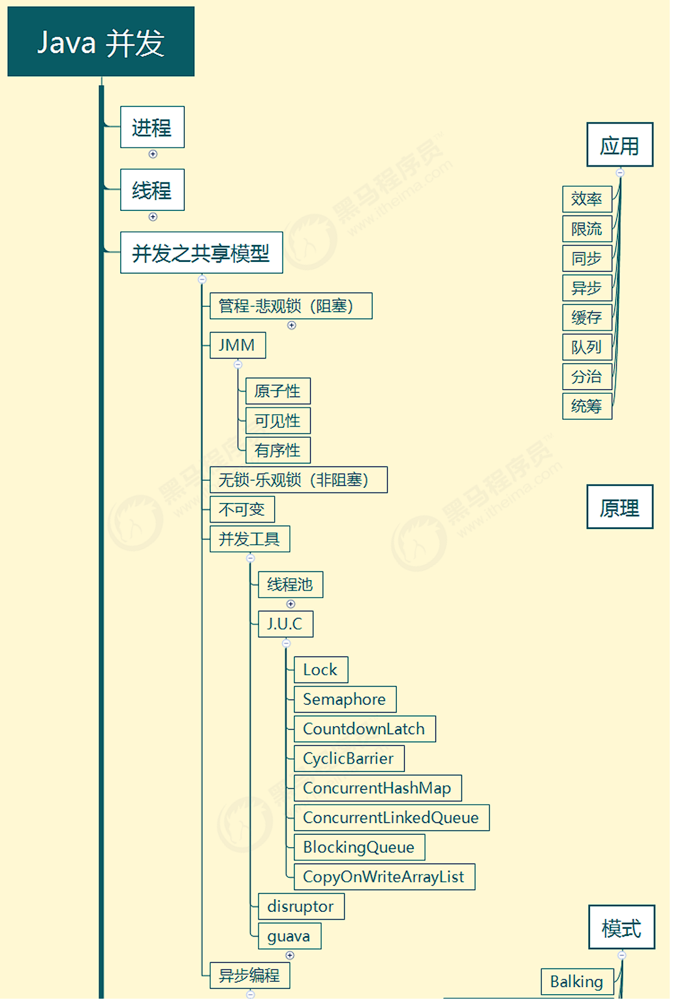
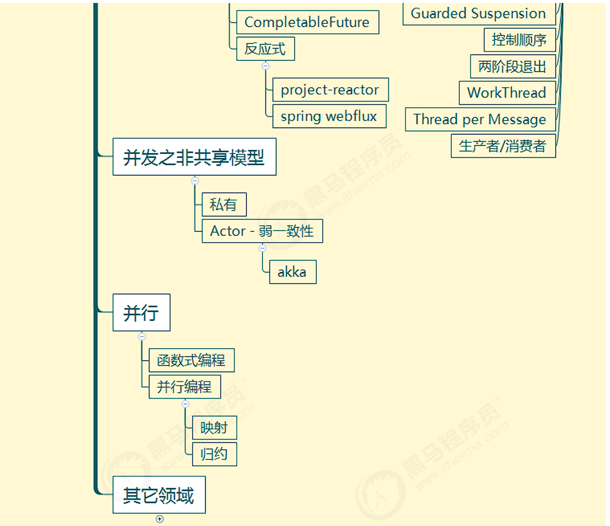

# 概览

## 整体内容






## 预备知识

- 线程安全问题，接触过 Java Web 开发、Jdbc 开发、Web 服务器、分布式框架
- 基于 JDK 8，最好对函数式编程、lambda 有一定了解 
- 采用 slf4j 打印日志，这是好的实践
- 采用 lombok 简化 java bean 编写 
- 给每个线程好名字，这也是一项好的实践


依赖

```xml
<properties>
    <maven.compiler.source>1.8</maven.compiler.source>
    <maven.compiler.target>1.8</maven.compiler.target>
</properties>

<dependencies>
     <dependency>
        <groupId>org.projectlombok</groupId>
        <artifactId>lombok</artifactId>
        <version>1.18.10</version>
    </dependency>
    <dependency>
        <groupId>ch.qos.logback</groupId>
        <artifactId>logback-classic</artifactId>
        <version>1.2.3</version>
    </dependency>
 </dependencies>
```


logback配置

```xml
<?xml version="1.0" encoding="UTF-8"?>
<configuration>
    <statusListener class="ch.qos.logback.core.status.NopStatusListener"/> <!-- 禁用logback内部日志  -->

    <property name="pattern" value="%d{HH:mm:ss} [%thread] %-5level %logger{50} - %msg %n"/>
    <property name="pattern-color"
              value="%yellow(|%d{HH:mm:ss}|) [%thread] %highlight(%-5level) %green(%logger{50}) - %highlight(%msg) %n"/>

    <!-- 控制台输出 -->
    <appender name="CONSOLE" class="ch.qos.logback.core.ConsoleAppender">
        <encoder class="ch.qos.logback.classic.encoder.PatternLayoutEncoder">
            <pattern>${pattern}</pattern>
        </encoder>
    </appender>

    <!-- 控制台输出-带颜色 -->
    <appender name="CONSOLE-WITH-COLOR" class="ch.qos.logback.core.ConsoleAppender">
        <encoder class="ch.qos.logback.classic.encoder.PatternLayoutEncoder">
            <pattern>${pattern-color}</pattern>
        </encoder>
    </appender>

    <root level="INFO">
        <appender-ref ref="CONSOLE-WITH-COLOR"/>
    </root>
</configuration>
```

---
**下一节**：[进程与线程](进程与线程.md)