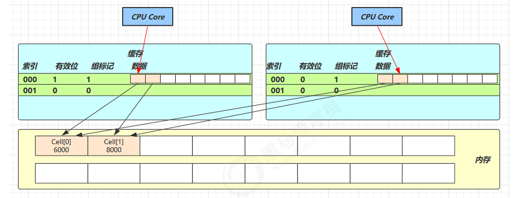

## 引例

```java
class AccountWithoutLock {
    private final AtomicInteger balance;

    public AccountWithoutLock(int balance) {
        this.balance = new AtomicInteger(balance);
    }
                                
    public int getBalance() {
        return balance.get();
    }

    public void withdraw(int amount) {
        while (true) {
            int prev = balance.get();
            int next = prev - amount;
            if (balance.compareAndSet(prev, next)) {
                break;
            }
        }
    }
}
```
该类并没有使用**锁**技术，但是该类是线程安全的

<br>

其中的关键是 compareAndSet，它的简称就是 CAS （也有 Compare And Swap 的说法），它必须是原子操作。


<br>

## CAS 和 volatile

获取共享变量时，为了保证该变量的可见性，需要使用 volatile 修饰。

```java
    private volatile int value;

    public final int get() {
        return value;
    }
```

!!!attention
    CAS 必须借助 volatile 才能读取到共享变量的最新值来实现【比较并交换】的效果

<br>

### CAS效率更高

- 无锁情况下，即使重试失败，线程始终在高速运行，不会阻塞，而 synchronized 会让线程在没有获得锁的时候，发生**上下文切换**，进入**阻塞**。


- 但无锁情况下，因为线程要保持运行，需要额外 CPU 的支持，虽然不会进入阻塞，但由于没有分到时间片，仍然会进入可运行状态，还是会导致上下文切换。


!!!danger 
    **高竞争情况**：CAS可能因持续重试导致CPU资源浪费，此时悲观锁可能更合适

<br>

### CAS 特点

结合 CAS 和 volatile 可以实现无锁并发，适用于线程数少、多核 CPU 的场景下。

- CAS 是基于**乐观锁**的思想：最乐观的估计，认为不会发生冲突
- synchronized 是基于悲观锁的思想：最悲观的估计，认为总会发生冲突

<br>

## 原子整数

> `AtomicBoolean`
>
> `AtomicInteger`
>
> `AtomicLong`


相关API：

```java
AtomicInteger i = new AtomicInteger(0);

// CAS操作
i.compareAndSet(0, 1);


i.incrementAndGet();// 自增1再获取
i.getAndIncrement();// 获取再自增1

// 自减1类似
...

i.addAndGet(10);// 自增指定值再获取

i.updateAndGet(x -> x * 100);// 函数式接口，更加灵活
```

!!!info
    这些API都是基于`compareAndSet`来实现的

<br>

## 原子引用

Java提供了一系列原子引用类，用于在多线程环境下安全地更新对象引用。

这些类基于 **CAS（Compare-And-Swap）** 机制，保证原子性操作，避免使用锁带来的性能开销。

> `AtomicReference`
>
> `AtomicMarkableReference`
>
> `AtomicStampedReference`

---

Java中的原子引用类位于 `java.util.concurrent.atomic` 包，主要包括：

| 类                           | 说明                                                         |
| :--------------------------- | :----------------------------------------------------------- |
| `AtomicReference<V>`         | 普通原子引用，可原子更新对象引用                             |
| `AtomicStampedReference<V>`  | 带版本号的原子引用，解决 **ABA问题**                         |
| `AtomicMarkableReference<V>` | 带标记位的原子引用（类似 `AtomicStampedReference`，但用布尔值标记） |

---

```java
class DecimalAccount {
    private final AtomicReference<BigDecimal> balance;

    DecimalAccount(BigDecimal balance) {
        this.balance = new AtomicReference<>(balance);
    }

    public BigDecimal getBalance() {
        return balance.get();
    }

    public void withdraw(BigDecimal amount) {
        BigDecimal prev, next;
        do {
            prev = balance.get();
            next = prev.subtract(amount);
        } while (!balance.compareAndSet(prev, next));
    }
}
```
!!!info
    `BigDecimal`是不可变对象，每次修改都会创建新对象，因此需要使用`AtomicReference`来保证线程安全


<br>

### ABA 问题

> ABA问题是 **CAS（Compare-And-Swap）** 操作中的一个经典并发问题，它可能导致程序逻辑错误，即使CAS操作成功，但实际数据可能已经被其他线程修改过多次。

ABA问题是指：

- 线程 **A** 读取共享变量的值为 **A**。
- 线程 **B** 在此期间修改该变量的值 **A → B → A**（即先改成B，又改回A）。
- 线程 **A** 执行CAS操作时，发现值仍然是 **A**，于是认为没有被修改过，从而CAS成功。但实际上，变量已经被修改过（B→A），可能导致逻辑错误。

<br>

**解决方案：版本号/时间戳（Stamped Reference）**

- 每次修改共享变量时，**增加一个版本号**（或时间戳）。
- CAS不仅要比较**值**，还要比较**版本号**。
- Java中的 `AtomicStampedReference` 就是基于此实现。

```java
AtomicStampedReference<Integer> atomicRef = new AtomicStampedReference<>(100, 0); // 初始值=100，版本号=0

int stampHolder = atomicRef.getStamp();
int currentValue = atomicRef.getReference; // 获取值和版本号
int newValue = currentValue + 1;
boolean success = atomicRef.compareAndSet(currentValue, newValue, stampHolder, stampHolder + 1);
```

<br>

## 原子数组

Java提供了一系列原子数组类，用于在多线程环境下安全地操作数组元素，而无需使用锁。这些类基于 **CAS（Compare-And-Swap）** 机制，保证对数组元素的原子性操作。

---

| 类                        | 说明                                 |
| :------------------------ | :----------------------------------- |
| `AtomicIntegerArray`      | 原子整型数组，可原子更新 `int[]`     |
| `AtomicLongArray`         | 原子长整型数组，可原子更新 `long[]`  |
| `AtomicReferenceArray<E>` | 原子引用数组，可原子更新对象引用数组 |

---

```java
// 初始化一个长度为 5 的原子整型数组
AtomicIntegerArray atomicArray = new AtomicIntegerArray(5);

// 多个线程并发修改数组
Runnable task = () -> {
    for (int i = 0; i < atomicArray.length(); i++) {
        atomicArray.incrementAndGet(i); // 原子递增
    }
};

Thread thread1 = new Thread(task);
Thread thread2 = new Thread(task);

thread1.start();
thread2.start();

try {
    thread1.join();
    thread2.join();
} catch (InterruptedException e) {
    e.printStackTrace();
}

// 输出最终数组
for (int i = 0; i < atomicArray.length(); i++) {
    System.out.println("Index " + i + ": " + atomicArray.get(i));
}
```

<br>

## 原子更新器

原子更新器是Java提供的一种高效的无锁原子操作方式，它允许对 **已有的普通类** 的 `volatile` 字段进行原子更新，而无需将整个类改为原子类。适用于当某个类的某个字段需要原子操作，但又不希望使用 `AtomicInteger`、`AtomicReference` 等包装类时。

---

| 类                                 | 说明                     |
| :--------------------------------- | :----------------------- |
| `AtomicIntegerFieldUpdater<T>`     | 原子更新 `int` 类型字段  |
| `AtomicLongFieldUpdater<T>`        | 原子更新 `long` 类型字段 |
| `AtomicReferenceFieldUpdater<T,V>` | 原子更新对象引用字段     |

---

```java
class Student {
    volatile String name;

    @Override
    public String toString() {
        return "Student{" +
                "name='" + name + '\'' +
                '}';
    }
}

Student student = new Student();
student.name = "Tom";
AtomicReferenceFieldUpdater<Student, String> updater = AtomicReferenceFieldUpdater.newUpdater(Student.class, String.class, "name");
updater.compareAndSet(student, "Tom", "六六");
System.out.println(student);
```

<br>

## 原子累加器

原子累加器（`LongAdder`、`DoubleAdder`）是Java 8引入的高性能原子计数器，适用于**高并发写多读少**的场景，比`AtomicLong`和`AtomicDouble`具有更高的吞吐量。

---

| 类                  | 说明                 | 适用场景     |
| :------------------ | :------------------- | :----------- |
| `LongAdder`         | 高性能`long`累加器   | 计数器、统计 |
| `DoubleAdder`       | 高性能`double`累加器 | 浮点数统计   |
| `LongAccumulator`   | 支持自定义运算规则   | 更灵活的操作 |
| `DoubleAccumulator` | 支持自定义浮点运算   | 浮点运算     |

---

```java
    static void testAtomicLong() {
        AtomicLong counter = new AtomicLong();
        long start = System.currentTimeMillis();

        IntStream.range(0, 1000).parallel().forEach(i -> {
            for (int j = 0; j < 10_000; j++) {
                counter.incrementAndGet();
            }
        });

        System.out.println("AtomicLong: " + (System.currentTimeMillis() - start) + "ms");
    }

    static void testLongAdder() {
        LongAdder adder = new LongAdder();
        long start = System.currentTimeMillis();

        IntStream.range(0, 1000).parallel().forEach(i -> {
            for (int j = 0; j < 10_000; j++) {
                adder.increment();
            }
        });

        System.out.println("LongAdder: " + (System.currentTimeMillis() - start) + "ms");
    }
```

```
AtomicLong: 209ms
LongAdder: 38ms
```


!!!info "累加器原理"
    **1. 无竞争**：直接CAS修改`base`（类似AtomicLong）

    **2. 有竞争**：

    - 初始化`Cell[]`数组（默认CPU核数）
    - 线程**哈希映射**到不同Cell，减少冲突
    - 最终结果 = `base + ∑cells[i]`

<br>

### 伪共享

伪共享是**多线程编程中的一个隐藏性能杀手**，它会导致多核CPU的缓存系统失效，严重影响并发程序的性能。理解并解决伪共享问题对编写高性能并发代码至关重要。

<br>

伪共享（False Sharing）是指：

- 多个线程**同时修改**位于**同一缓存行（Cache Line）**中的**不同变量**
- 由于CPU缓存以缓存行为单位操作，导致本无关联的变量互相影响
- 造成**不必要的缓存失效**，引发严重的性能下降

<br>

**缓存行（Cache Line）**

- CPU缓存的最小单位（通常64字节）
- 当缓存行中任一数据被修改，整个行在所有CPU核心都会失效




**解决方案**：

**使用`@Contended`注解（JDK8+）**

```java
class Data {
    @sun.misc.Contended  // 自动填充缓存行
    volatile long x;
    
    @sun.misc.Contended
    volatile long y;
}
```

!!!warning
    该注解默认**不启用**，需要在JVM参数中开启`-XX:+RestrictContended`，否则会被忽略

!!!info "原理"
    `@Contended`注解会在字段前后添加填充字段，确保每个字段独占一个缓存行，避免伪共享问题。

<br>

---

## Unsafe

Unsafe 是 Java 中的一个特殊工具类，提供了一系列**直接操作内存、绕过JVM安全机制**的底层方法。

它得名"Unsafe"正是因为它的操作**不受JVM安全管理器约束**，使用不当可能导致JVM崩溃。

<br>

### 内存操作

- 直接内存分配/释放

  ```java
  long address = unsafe.allocateMemory(1024); // 分配1KB堆外内存
  unsafe.setMemory(address, 1024, (byte) 0); // 内存置零
  unsafe.freeMemory(address); // 释放内存
  ```

- 内存读写

  ```java
  unsafe.putInt(address, 123);  // 在指定地址写入int
  int value = unsafe.getInt(address); // 读取int
  ```

### 对象操作

- 绕过构造器创建对象

  ```java
  MyClass obj = (MyClass) unsafe.allocateInstance(MyClass.class);
  ```

- 字段偏移量操作

  ```java
  long offset = unsafe.objectFieldOffset(MyClass.class.getDeclaredField("value"));
  unsafe.putInt(obj, offset, 100); // 直接修改字段值
  ```

### 线程调度

- 线程挂起/恢复

  ```java
  unsafe.park(false, 0); // 挂起当前线程
  unsafe.unpark(thread); // 恢复指定线程
  ```

- CAS操作

  ```java
  boolean success = unsafe.compareAndSwapInt(obj, offset, expect, update);
  ```

### 数组操作

- 获取数组元素偏移

  ```java
  int base = unsafe.arrayBaseOffset(int[].class);
  int scale = unsafe.arrayIndexScale(int[].class);
  ```


!!!info "获取Unsafe实例"
    出于安全性考虑，Unsafe 被设计为**限制获取**：

    **反射获取（最常用）**
    ```java
    Field theUnsafe = Unsafe.class.getDeclaredField("theUnsafe");
    theUnsafe.setAccessible(true);
    Unsafe unsafe = (Unsafe) theUnsafe.get(null);
    ```

    **从`TrustedFinalizer`获取（JDK内部）**
    ```java
    // 仅供了解，实际不推荐
    Unsafe unsafe = sun.misc.Unsafe.getUnsafe();
    ```

---

**上一节**：[并发编程三要素](并发编程三要素.md)

**下一节**：[不可变类](不可变类.md)