# 概览

## 整体内容


## 预备知识

- 线程安全问题，接触过 Java Web 开发、Jdbc 开发、Web 服务器、分布式框架
- 基于 JDK 8，最好对函数式编程、lambda 有一定了解 
- 采用了 slf4j 打印日志，这是好的实践 采用了 
- lombok 简化 java bean 编写 
- 给每个线程好名字，这也是一项好的实践


demo依赖

```xml
<properties>
 	<maven.compiler.source>1.8</maven.compiler.source>
 	<maven.compiler.target>1.8</maven.compiler.target>
</properties>

<dependencies>
     <dependency>
 	 	<groupId>org.projectlombok</groupId>
 	 	<artifactId>lombok</artifactId>
 	 	<version>1.18.10</version>
 	</dependency>
 	<dependency>
 		<groupId>ch.qos.logback</groupId>
 		<artifactId>logback-classic</artifactId>
 		<version>1.2.3</version>
 	</dependency>
 </dependencies>
```


logback配置

```xml
<?xml version="1.0" encoding="UTF-8"?>
<configuration>
    <statusListener class="ch.qos.logback.core.status.NopStatusListener"/> <!-- 禁用logback内部日志  -->

    <property name="pattern" value="%d{HH:mm:ss} [%thread] %-5level %logger{50} - %msg %n"/>
    <property name="pattern-color"
              value="%yellow(|%d{HH:mm:ss}|) [%thread] %highlight(%-5level) %green(%logger{50}) - %highlight(%msg) %n"/>

    <!-- 控制台输出 -->
    <appender name="CONSOLE" class="ch.qos.logback.core.ConsoleAppender">
        <encoder class="ch.qos.logback.classic.encoder.PatternLayoutEncoder">
            <pattern>${pattern}</pattern>
        </encoder>
    </appender>

    <!-- 控制台输出-带颜色 -->
    <appender name="CONSOLE-WITH-COLOR" class="ch.qos.logback.core.ConsoleAppender">
        <encoder class="ch.qos.logback.classic.encoder.PatternLayoutEncoder">
            <pattern>${pattern-color}</pattern>
        </encoder>
    </appender>

    <root level="INFO">
        <appender-ref ref="CONSOLE-WITH-COLOR"/>
    </root>
</configuration>
```


# 进程与线程

## 进程与线程

### 进程

- 程序由指令和数据组成，但这些指令要运行，数据要读写，就必须将指令加载至 CPU，数据加载至内存。在 指令运行过程中还需要用到磁盘、网络等设备。进程就是用来加载指令、管理内存、管理 IO 的
- 当一个程序被运行，从磁盘加载这个程序的代码至内存，这时就开启了一个进程。 
- 进程就可以视为程序的一个实例。大部分程序可以同时运行多个实例进程（例如记事本、画图、浏览器 等），也有的程序只能启动一个实例进程（例如网易云音乐、360 安全卫士等）


### 线程

- 一个进程之内可以分为一到多个线程。 
- 一个线程就是一个指令流，将指令流中的一条条指令以一定的顺序交给 CPU 执行 
- Java 中，线程作为最小调度单位，进程作为资源分配的最小单位。 
- 在 windows 中进程是不活动的，只是作为线程的容器


### 对比

- 进程基本上相互独立的，而线程存在于进程内，是进程的一个子集 
- 进程拥有共享的资源，如内存空间等，供其内部的线程共享 
- 进程间通信较为复杂 
  - 同一台计算机的进程通信称为 IPC（Inter-process communication） 
  - 不同计算机之间的进程通信，需要通过网络，并遵守共同的协议，例如 HTTP 
- 线程通信相对简单，因为它们共享进程内的内存，一个例子是多个线程可以访问同一个共享变量 
- 线程更轻量，线程上下文切换成本一般上要比进程上下文切换低


## 并行与并发

单核 cpu 下，线程实际还是 **串行执行** 的。操作系统中有一个组件叫做任务调度器，将 cpu 的时间片（windows 下时间片最小约为 15 毫秒）分给不同的程序使用，只是由于 cpu 在线程间（时间片很短）的切换非常快，人类感 觉是 同时运行的 。

> [!NOTE]
>
> 总结为一句话就是：**微观串行，宏观并行**， 一般会将这种线程轮流使用CPU的做法称为并发， `concurrent`


引用 Rob Pike 的一段描述： 

- 并发（concurrent）是同一时间应对（dealing with）多件事情的能力 
- 并行（parallel）是同一时间动手做（doing）多件事情的能力


## 应用


### 异步调用

以调用方角度来讲，如果 

- 需要等待结果返回，才能继续运行就是同步 
- 不需要等待结果返回，就能继续运行就是异步


多线程可以让方法执行变为异步的（即不要巴巴干等着）比如说读取磁盘文件时，假设读取操作花费了 5 秒钟，如 果没有线程调度机制，这 5 秒 cpu 什么都做不了，其它代码都得暂停... 

**应用案例**

- 比如在项目中，视频文件需要转换格式等操作比较费时，这时开一个新线程处理视频转换，避免阻塞主线程 
- tomcat 的异步 servlet 也是类似的目的，让用户线程处理耗时较长的操作，避免阻塞 tomcat 的工作线程 
- ui 程序中，开线程进行其他操作，避免阻塞 ui 线程


### 提高效率

充分利用多核 cpu 的优势，提高运行效率。想象下面的场景，执行 3 个计算，最后将计算结果汇总。 

```
计算 1 花费 10 ms 
计算 2 花费 11 ms 
计算 3 花费 9 ms 
汇总需要 1 ms
```

如果是串行执行，那么总共花费的时间是  10 + 11 + 9 + 1 = 31ms 

但如果是四核 cpu，各个核心分别使用线程 1 执行计算 1，线程 2 执行计算 2，线程 3 执行计算 3，那么 3 个 线程是并行的，花费时间只取决于最长的那个线程运行的时间，即 11ms ,加上汇总是 12ms 

> [!CAUTION]
>
>  需要在多核 cpu 才能提高效率，单核仍然时是轮流执行


1. 单核 cpu 下，多线程不能实际提高程序运行效率，只是为了能够在不同的任务之间切换，不同线程轮流使用 cpu ，不至于一个线程总占用 cpu，别的线程没法干活 
2. 多核 cpu 可以并行跑多个线程，但能否提高程序运行效率还是要分情况的 
   - 有些任务，经过精心设计，将任务拆分，并行执行，当然可以提高程序的运行效率。
   - 但不是所有计算任 务都能拆分（参考后文的【阿姆达尔定律】） 也不是所有任务都需要拆分，任务的目的如果不同，谈拆分和效率没啥意义 
3. IO 操作不占用 cpu，只是我们一般拷贝文件使用的是【阻塞 IO】，这时相当于线程虽然不用 cpu，但需要一 直等待 IO 结束，没能充分利用线程。所以才有后面的【非阻塞 IO】和【异步 IO】优化


---

# Java线程


## 创建和启动线程


### Thread匿名类

```java
        // 创建线程对象
        Thread t = new Thread(){
            @Override
            public void run() {
                // 线程执行的代码
                log.info("Running...");
            }
        };
        // 启动线程
        t.start();
```

> [!TIP]
>
> 建议为线程指定名字
>
> 可以通过线程对象的 `setName(String name)` 方法为线程指定名字


### Runnable（推荐）

```java
        Runnable r = new Runnable() {
            @Override
            public void run() {
                // 需要执行的任务
                log.info("Running...");
            }
        };

        Thread t2 = new Thread(r, "Test2");
        t2.start();
```

> [!TIP]
>
> 可使用lambda表达式
>
> ```java
>         Runnable r = () -> log.info("Running...");
> ```


**原理解析**

Thread中的run 方法：

```java
    @Override
    public void run() {
        if (target != null) {
            target.run();
        }
    }
```

- Thread匿名类重写了该方法，实现任务执行
- Runnable会被赋值给target变量，然后执行其中的任务


### FutureTask

FutureTask 能够接收 Callable 类型的参数，用来处理有返回结果的情况

```java
        // 创建任务对象
        FutureTask<Integer> task = new FutureTask<>(() -> {
            log.info("Running...");
            Thread.sleep(2000);
            return 200;
        });
        
        // 创建线程对象
        Thread t = new Thread(task);
        t.start();
        log.info("Waiting...");
        log.debug("Result: {}", task.get());
```


输出

```
03-29 13:51:18 [main] INFO  com.ysh.Test - Start 
03-29 13:51:18 [main] INFO  com.ysh.Test - Waiting... 
03-29 13:51:18 [Thread-0] INFO  com.ysh.Test - Running... 
03-29 13:51:20 [main] DEBUG com.ysh.Test - Result: 200 
03-29 13:51:20 [main] INFO  com.ysh.Test - End
```


### 查看进程线程

**windows**  

- 任务管理器可以查看进程和线程数，也可以用来杀死进程 

- `tasklist` 查看进程

- `taskkill` 杀死进程 

  

**linux**  

- `ps -fe` 查看所有进程 

- `ps -fT -p`  查看某个进程（PID）的所有线程 

- `kill ` 杀死进程 

- `top` 按大写 H 切换是否显示线程 

- `top -H -p`  查看某个进程（PID）的所有线程 

  

**Java**  

- `jps` 命令查看所有 Java 进程 
- `jstack`  查看某个 Java 进程（PID）的所有线程状态  
- `jconsole` 来查看某个 Java 进程中线程的运行情况（图形界面）


jconsole 远程监控配置 

需要以如下方式运行你的 java 类 

```bash
java -Djava.rmi.server.hostname=`ip地址` -Dcom.sun.management.jmxremote  Dcom.sun.management.jmxremote.port=`连接端口` -Dcom.sun.management.jmxremote.ssl=是否安全连接  Dcom.sun.management.jmxremote.authenticate=是否认证  java类
```

- 修改 /etc/hosts 文件将 127.0.0.1 映射至主机名 
- 如果要认证访问，还需要做如下步骤 
  - 复制 jmxremote.password 文件 
  - 修改 jmxremote.password 和 jmxremote.access 文件的权限为 600 即文件所有者可读写 
  - 连接时填入 controlRole（用户名），R&D（密码）


## 线程原理

### 栈与栈帧

Java Virtual Machine Stacks （Java 虚拟机栈）

JVM 内存有堆、栈、方法区，栈会为每一个线程分配一块栈内存。

- 每个栈由多个栈帧组成，对应每次方法调用
- 每个线程只能有一个活动栈帧，对应当前正在执行的方法


### 线程上下文切换(Thread Context Switch)

引起线程上下文切换的情况：

- 线程的CPU时间片使用完
- *JVM*进行垃圾回收
- 有更高优先级的线程需要运行
- 线程调用了 `sleep、yield、wait、join、park、synchronized、lock` 等方法


当 `Context Switch` 发生时，需要由操作系统保存当前线程的状态，并恢复另一个线程的状态，Java 中对应的概念就是程序计数器（Program Counter Register），它的作用是记住下一条 jvm 指令的执行地址，是线程私有的

- 状态包括程序计数器、虚拟机栈中每个栈帧的信息，如局部变量、操作数栈、返回地址等 
- Context Switch 频繁发生会影响性能


## 常见方法

| 方法名          | 功能                                    | 注意                                                         |
| --------------- | --------------------------------------- | ------------------------------------------------------------ |
| start()         | 启动一个线程                            | start 方法只是让线程进入就绪，里面代码不一定立刻运行，<font color=red>只能调用一次</font> |
| run()           | 线程启动后会执行的方法                  |                                                              |
| join()          | 等待线程运行结束                        |                                                              |
| join(long n)    | 等待线程运行结 束,最多等待 n  毫秒      |                                                              |
| getId()         | 获取线程ID                              | ID唯一                                                       |
| getName()       | 获取线程名                              |                                                              |
| setName()       | 修改线程名                              |                                                              |
| setPriority()   | 修改线程优先级                          | java中规定线程优先级是1~10 的整数，较大的优先级 能提高该线程被 CPU 调度的机率 |
| getPriority()   | 获取线程优先级                          |                                                              |
| getState()      | 获取线程状态                            | Java 中线程状态是用 6 个 enum 表示，分别为： NEW, RUNNABLE, BLOCKED, WAITING,  TIMED_WAITING, TERMINATED |
| isAlive()       | 线程是否存活（还没有执行完）            |                                                              |
| isInterrupted() | 判断线程是否被打断                      | 不会清除 **打断标记**                                        |
| interrupt()     | 打断线程                                | 如果被打断线程正在 sleep，wait，join 会导致被打断 的线程抛出 `InterruptedException`，并清除打断标记，如果打断的正在运行的线程，则会设置 打断标记，park 的线程被打断，也会设置打断标记 |
| interrupted()   | 打断线程                                | 静态方法，会清除 **打断标记**                                |
| currentThread() | 获取当前正在执行的线程                  | 静态方法                                                     |
| sleep(long n)   | 使线程休眠                              | 静态方法                                                     |
| yield()         | 提示线程调度器 让出当前线程对 CPU的使用 | 静态方法                                                     |


### run() 和 start()

- 直接调用`run()`方法，实际上任然由main线程执行，并不会创建新线程。
- 而调用`start()`方法，会新建线程，并由新线程执行`run()`方法


> [!CAUTION]
>
> `start()`方法每个线程对象只能调用一次，再次调用会抛出异常


### sleep() 和 yield()

**sleep**

- 调用 sleep 会让当前线程从 Running  进入 Timed Waiting 状态（阻塞）

- 其它线程可以使用  interrupt 方法打断正在睡眠的线程，这时 sleep 方法会抛出 `InterruptedException`

- 睡眠结束后的线程未必会立刻得到执行

- 建议用 `TimeUnit` 的 sleep 代替 Thread 的 sleep 来获得更好的可读性

  ```java
          try {
              // 当前线程休眠1秒
              TimeUnit.SECONDS.sleep(1);
          } catch (InterruptedException e) {
              e.printStackTrace();
          }
  ```


**yield**

- 调用 yield 会让当前线程从 Running 进入 Runnable  就绪状态，然后调度执行其它线程
- 具体的实现依赖于操作系统的任务调度器


#### 案例

​	防止 CPU 100%占用：

线程不需要执行任务时，不要让`while(true)`空转占用 CPU ，应该使用`yield`或者`sleep`让出 CPU 资源


### 线程优先级

- 线程优先级会提示（hint）调度器优先调度该线程，但它**仅仅是一个提示，调度器可以忽略它**
- 如果 cpu 比较忙，那么优先级高的线程会获得更多的时间片，但 cpu 空闲时，优先级几乎没作用


### join

如下代码，主线程打印出 r 的值为 0，因为主线程并不会等待t1线程运行完后才打印

```java
static int r = 0;
public static void main(String[] args) throws InterruptedException {
    test1();
}
private static void test1() throws InterruptedException {
    log.debug("开始");
    Thread t1 = new Thread(() -> {
        log.debug("开始");
        sleep(1);
        log.debug("结束");
        r = 10;
    });
    t1.start();
    log.debug("结果为:{}", r);
    log.debug("结束");
}
```

在 `t1.start()` 之后调用 `t1.join()`，主线程则会等待 t1 执行结束


#### 线程同步

如果调用方

- 需要等待结果返回，才能继续运行就是同步
- 不需要等待结果返回，就能继续运行就是异步


使用 join 等待其他线程运行的结果


> [!TIP]
>
> 带参数的`join`方法会等待指定时间，如果线程执行时间小于等待时间，`join`会提前结束，如果等待时间小于线程执行时间，会在到达等待时间后结束。


### interrupt

1. **打断 sleep，wait，join 的线程**

这几个方法都会让线程进入阻塞状态

打断 sleep 的线程, 会清空打断状态（调用isInterrupted()返回的boolean值）


打断正常运行的线程

```java
        Thread t1 = new Thread(() -> {
            while (true) {
                boolean interrupted = Thread.currentThread().isInterrupted();
                if (interrupted) {
                    log.info("Thread1 interrupted");
                    break;
                }
                log.info("Thread1 running");
            }
        });

        t1.start();

        TimeUnit.SECONDS.sleep(1);

        t1.interrupt();
```


#### 设计模式-两阶段终止

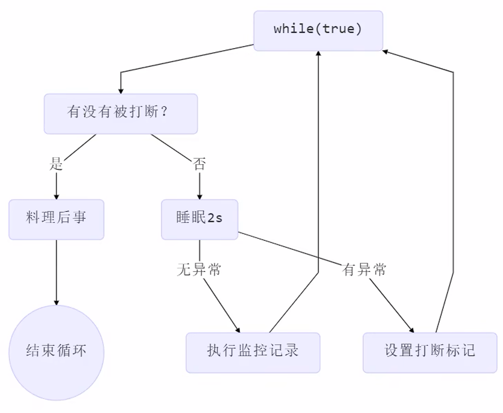

```java
    private Thread monitor;

    public void start() {
        monitor = new Thread(() -> {
            while (true) {
                Thread current = Thread.currentThread();
                if (current.isInterrupted()) {
                    log.info("被打断，处理中...");
                    // ...
                    break;
                }

                try {
                    Thread.sleep(1000);
                    log.info("监控中...");
                } catch (InterruptedException e) {
                    // 重新设置中断状态
                    current.interrupt();
                }
            }
            log.info("监控结束");
        });
        monitor.start();
    }

    public void stop() {
        monitor.interrupt();
    }
```

> [!Important]
>
> 由于线程可能在sleep时被打断，而此时打断标记会被置为false，所以需要重新设置打断标记

> [!Tip]
>
> 可以使用`volatile`关键字修饰的boolean变量作为线程停止标志


#### 打断park线程

打断park线程，不会清空打断状态

```java
        Thread t1 = new Thread(() -> {
            log.debug("park...");
            LockSupport.park();
            log.debug("unpark...");
            log.debug("打断状态：{}", Thread.currentThread().isInterrupted());
        },"t1");
        t1.start();
        sleep(0.5);
        t1.interrupt();
```

输出打断状态为 true


> [!CAUTION]
>
> 如果在park之前打断标记已经是true，那么park时会失效


### 不推荐的方法

如下方法容易破坏同步代码块，造成死锁，JDK已经不推荐使用

| 方法      | 功能             |
| --------- | ---------------- |
| stop()    | 停止线程         |
| suspend() | 挂起（暂停）线程 |
| resume()  | 恢复线程运行     |


##  守护线程

默认情况下，Java 进程需要等待所有线程都运行结束，才会结束。有一种特殊的线程叫做守护线程，只要其它非守护线程运行结束了，即使守护线程的代码没有执行完，也会强制结束。


如下方法可将线程设置为守护线程

```java
    public final void setDaemon(boolean on)
```


> [!Note]
>
> - 垃圾回收器线程就是一种守护线程 
> - Tomcat 中的 Acceptor 和 Poller 线程都是守护线程，所以 Tomcat 接收到 shutdown 命令后，不会等待它们处理完当前请求


## 线程状态

从 **操作系统** 层面来描述线程状态

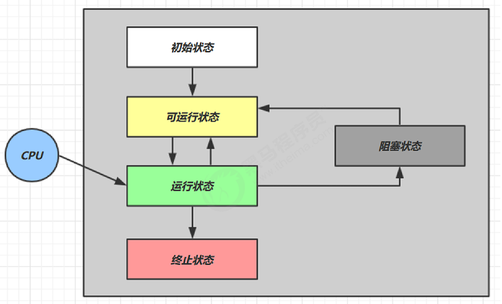

- 【初始状态】仅是在语言层面创建了线程对象，还未与操作系统线程关联 
- 【可运行状态】（就绪状态）指该线程已经被创建（与操作系统线程关联），可以由 CPU 调度执行 
- 【运行状态】指获取了 CPU 时间片运行中的状态 
  - 当 CPU 时间片用完，会从【运行状态】转换至【可运行状态】，会导致线程的上下文切换 
- 【阻塞状态】 
  - 如果调用了阻塞 API，如 BIO 读写文件，这时该线程实际不会用到 CPU，会导致线程上下文切换，进入 【阻塞状态】 
  - 等 BIO 操作完毕，会由操作系统唤醒阻塞的线程，转换至【可运行状态】 
  - 与【可运行状态】的区别是，对【阻塞状态】的线程来说只要它们一直不唤醒，调度器就一直不会考虑调度它们 
- 【终止状态】表示线程已经执行完毕，生命周期已经结束，不会再转换为其它状态


### 六种状态

从 **Java API** 层面来描述

`Thread.State` 枚举，分为六种状态

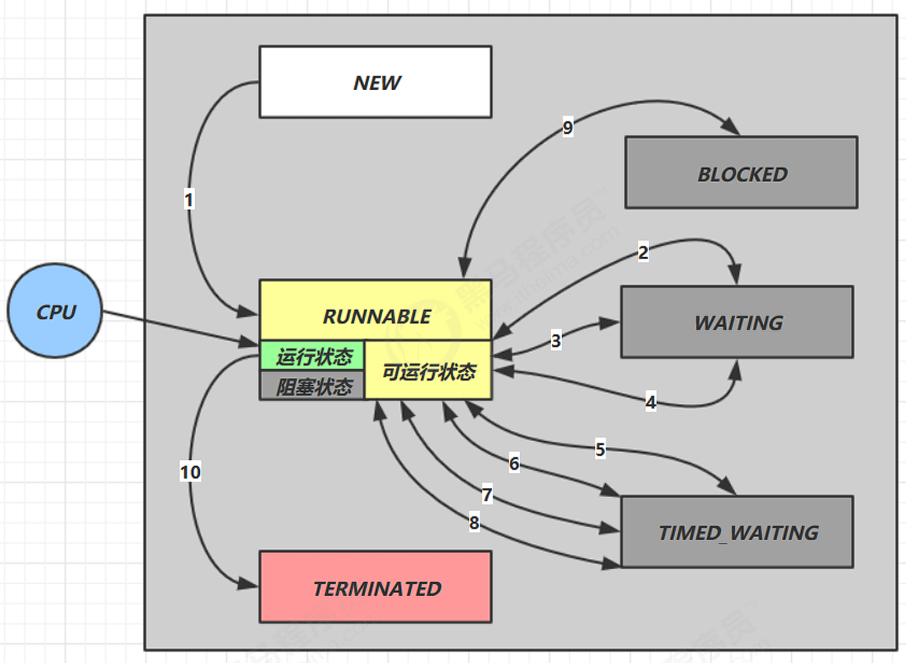

- `NEW`  线程刚被创建，但是还没有调用  start() 方法 
- `RUNNABLE` 当调用了  start() 方法之后，注意，Java API 层面的  RUNNABLE 状态涵盖了 操作系统 层面的 【可运行状态】、【运行状态】和【阻塞状态】（由于 BIO 导致的线程阻塞，在 Java 里无法区分，仍然认为是可运行） 
- `BLOCKED` ， `WAITING` ， 详述 `TIMED_WAITING` 都是 Java API 层面对【阻塞状态】的细分
- `TERMINATED` 线程代码运行结束


# 共享模型-管程

## 线程安全问题

```java
        static int count = 0;
		Thread t1 = new Thread(() -> {
            for (int i = 0; i < 10000; i++) {
                count++;
            }
        });

        Thread t2 = new Thread(() -> {
            for (int i = 0; i < 10000; i++) {
                count++;
            }
        });

        t1.start();
        t2.start();

        t1.join();
        t2.join();
        
        System.out.println(count);
```

> [!Caution]
>
> 以上代码输出的值 count < 20000
>
> 多个线程同时访问修改同一个变量就可能发生线程安全问题


### 临界区

- 一个程序运行多个线程本身是没有问题的
- 问题出在多个线程访问共享资源
  - 多个线程读共享资源其实也没有问题
  - 在多个线程对共享资源读写操作时发生指令交错，就会出现问题
- 一段代码块内如果存在对共享资源的多线程读写操作，称这段代码块为**临界区**

```java
    static int counter = 0;

    static void increment()
    // 临界区
    {
        counter++;
    }

    static void decrement()
    // 临界区
    {
        counter--;
    }
```


## synchronized

为了避免临界区的竞态条件发生，有多种手段可以达到目的。 

- 阻塞式的解决方案：`synchronized`，`Lock`
- 非阻塞式的解决方案：原子变量


### `synchronized`对象锁

语法

```java
    synchronized(对象) // 线程1， 线程2(blocked)
    {
        临界区
    }
```


示例

```java
        private static int count = 0;
    	private static final Object lock = new Object();// 锁对象

		Thread t1 = new Thread(() -> {
            for (int i = 0; i < 10000; i++) {
                synchronized (lock) {
                    count++;
                }
            }
        });

        Thread t2 = new Thread(() -> {
            for (int i = 0; i < 10000; i++) {
                synchronized (lock) {
                    count--;
                }
            }
        });

        t1.start();
        t2.start();

        t1.join();
        t2.join();
 
        System.out.println(count);
```

> [!Important]
>
> synchronized 实际是用对象锁保证了临界区内代码的**原子性**，临界区内的代码对外是不可分割的，不会被线程切换所打断。


封装线程安全对象

```java
class Room {
    private int count = 0;
    
    public void encrement() {
        // 以自身为锁对象
        synchronized (this) {
            count++;
        }
    }
    
    public void decrment() {
        synchronized (this) {
            count--;
        }
    }
    
    public int getCount() {
        synchronized (this) {
            return count;
        }
    }
}
```


### 实例方法上的`synchronized`

```java
class Room {
    private int count = 0;

    public synchronized void encrement() {
        count++;
    }

    public synchronized void decrment() {
        count--;
    }

    public synchronized int getCount() {
        return count;
    }
}
```

> [!Tip]
>
> 等同于在方法体内使用
>
> ```
> synchronized (this) {
> 	...
> }
> ```


> [!Important]
>
> `synchronized`使用在静态方法前，相当于对类的**class对象**加锁


## 线程安全分析

### 成员变量和静态变量

- 如果它们没有共享，则线程安全 
- 如果它们被共享了，根据它们的状态是否能够改变，又分两种情况 
  - 如果只有读操作，则线程安全 
  - 如果有读写操作，则这段代码是临界区，需要考虑线程安全


### 局部变量

- 局部变量是线程安全的 

> [!Tip]
>
> 局部变量存放在虚拟机栈的局部变量表中，每个线程都有自己的栈，线程之间不共享

- 但局部变量引用的对象则可能不安全 
  - 如果该对象没有逃离方法的作用范围，它是线程安全的 
  - 如果该对象逃离方法的作用范围，需要考虑线程安全

```java
class ThreadSafe {
    public void method1(int loopNumber) {
        ArrayList<String> list = new ArrayList<>();
        for (int i = 0; i < loopNumber; i++) {
            method2(list);
            method3(list);
        }
    }
    public void method2(ArrayList<String> list) {
        list.add("1");
    }
    public void method3(ArrayList<String> list) {
        list.remove(0);
    }
}
class ThreadSafeSubClass extends ThreadSafe{
    @Override
    public void method3(ArrayList<String> list) {
        // 产生线程安全问题
        new Thread(() -> {
            list.remove(0);
        }).start();
    }
}
```

> [!Tip]
>
> 可将方法2和3使用private修饰，防止子类重写，使用final修饰方法1防止子类重写


### 常见线程安全类

多个线程调用它们**同一个实例的某个方法**时，是线程安全的

- `String`
- `Integer` 
- `StringBuffer `
- `Random `
- `Vector `
- `Hashtable `
- `java.util.concurrent` 包下的类

> [!Warning]
>
> 它们的每个方法是原子的
>
> 但注意它们多个**方法的组合不是原子的**
>
> ```java
> Hashtable table = new Hashtable();
>  // 线程1 get，线程2 put
>  if(table.get("key") == null) {
>     table.put("key", value);
>  }
> ```


> [!Note]
>
> `String`、`Integer` 等都是**不可变类**，因为其内部的状态不可以改变，因此它们的方法都是线程安全的


示例解析

- 例1

```java
public class MyServlet extends HttpServlet {
    // 不安全
    Map<String, Object> map = new HashMap<>();
    // 不可变类，安全
    String S1 = "...";
    // 安全
    final String S2 = "...";
    // 不安全
    Date D1 = new Date();
    // 不安全，Date引用不可变，但是Date的内容可变
    final Date D2 = new Date();

    public void doGet(HttpServletRequest request, HttpServletResponse response) {
        // 使用上述变量
    }
}
```


- 例2

```java
public class MyServlet extends HttpServlet {
    // 不安全，原因是UserServiceImpl存在不安全的成员变量
    private UserService userService = new UserServiceImpl();
    public void doGet(HttpServletRequest request, HttpServletResponse response) {
        userService.update(...);
    }
}
public class UserServiceImpl implements UserService {
    // 记录调用次数
    private int count = 0;
    public void update() {
        // ...
        count++;
    }
}
```


- 例3

```java
@Aspect
@Component
public class MyAspect {
    // 不安全，建议使用环绕通知将start变成局部变量
    private long start = 0L;

    @Before("execution(* *(..))")
    public void before() {
        start = System.nanoTime();
    }

    @After("execution(* *(..))")
    public void after() {
        long end = System.nanoTime();
        System.out.println("cost time:" + (end - start));
    }
}
```


- 例4

```java
public class MyServlet extends HttpServlet {
    // 安全
    private UserService userService = new UserServiceImpl();
    public void doGet(HttpServletRequest request, HttpServletResponse response) {
        userService.update(...);
    }
}
public class UserServiceImpl implements UserService {
    // 安全
    private UserDao userDao = new UserDaoImpl();
    public void update() {
        userDao.update();
    }
}
public class UserDaoImpl implements UserDao {
    public void update() {
        // 安全
        String sql = "update user set password = ? where username = ?";
        try (Connection conn = DriverManager.getConnection("", "", "")) {
            // ...
        } catch (Exception e) {}
    }
}
```


- 例5

```java
public class MyServlet extends HttpServlet {
    // 不安全
    private UserService userService = new UserServiceImpl();
    public void doGet(HttpServletRequest request, HttpServletResponse response) {
        userService.update(...);
    }
}
public class UserServiceImpl implements UserService {
    // 不安全
    private UserDao userDao = new UserDaoImpl();
    public void update() {
        userDao.update();
    }
}
public class UserDaoImpl implements UserDao {
    // 不安全，线程可共享conn，一个线程关闭连接后其他线程无法获得conn
    private Connection conn = null;
    public void update() throws SQLException {
        String sql = "update user set password = ? where username = ?";
        conn = DriverManager.getConnection("","","");
        // ...
        conn.close();
    }
}
```


- 例6

```java
public class MyServlet extends HttpServlet {
    // 安全
    private UserService userService = new UserServiceImpl();
    public void doGet(HttpServletRequest request, HttpServletResponse response) {
        userService.update(...);
    }
}
public class UserServiceImpl implements UserService {
    // 安全，不同线程使用不同的UserDaoImpl对象，无法共享内部不安全的connection变量
    public void update() {
        UserDao userDao = new UserDaoImpl();
        userDao.update();
    }
}
public class UserDaoImpl implements UserDao {
    // 不安全
    private Connection = null;
    public void update() throws SQLException {
        String sql = "update user set password = ? where username = ?";
        conn = DriverManager.getConnection("","","");
        // ...
        conn.close();
    }
}
```


- 例7

```java
public abstract class Test {
    public void bar() {
        // 不安全
        SimpleDateFormat sdf = new SimpleDateFormat("yyyy-MM-dd HH:mm:ss");
        foo(sdf);
    }
    // 子类实现该方法，并将SimpleDateFormat共享至不同的线程中
    public abstract foo(SimpleDateFormat sdf);
    public static void main(String[] args) {
        new Test().bar();
    }
}
```


## Monitor

Java 对象头中的 `Mark Word` 标记字段，用于标记对象的状态


Monitor 被翻译为监视器或管程 

每个 Java 对象都可以关联一个 Monitor 对象，如果使用 synchronized 给对象上锁（重量级锁）之后，该对象头的 Mark Word 中就被设置指向 Monitor 对象的指针

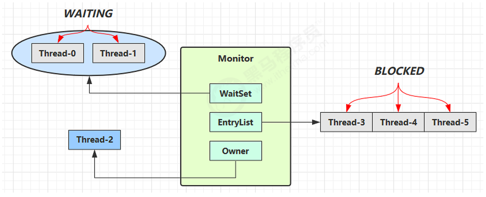

- 刚开始 Monitor 中 Owner 为 null 
- 当 Thread-2 执行 synchronized(obj) 就会将 Monitor 的所有者 Owner 置为 Thread-2，Monitor中只能有一 个 Owner 
- 在 Thread-2 上锁的过程中，如果 Thread-3，Thread-4，Thread-5 也来执行 synchronized(obj)，就会进入  EntryList BLOCKED 
- Thread-2 执行完同步代码块的内容，然后唤醒 EntryList 中等待的线程来竞争锁，竞争是非公平的
-  WaitSet 中的 Thread-0，Thread-1 是之前获得过锁，但条件不满足进入 WAITING 状态的线程


## synchronized 优化原理进阶

### 轻量级锁

轻量级锁的使用场景：如果一个对象虽然有多线程要加锁，但加锁的时间是错开的（也就是没有竞争），那么可以使用轻量级锁来优化。

轻量级锁对使用者是透明的，即语法仍然是  `synchronized`


例如以下代码：

```java

static final Object obj = new Object();
public static void method1() {
    synchronized( obj ) {
        // 同步块 A
        method2();
    }
}
public static void method2() {
    synchronized( obj ) {
        // 同步块 B
    }
}
```


- 创建锁记录（Lock Record）对象，每个线程的栈帧都会包含一个锁记录的结构，内部可以存储锁定对象的  Mark Word

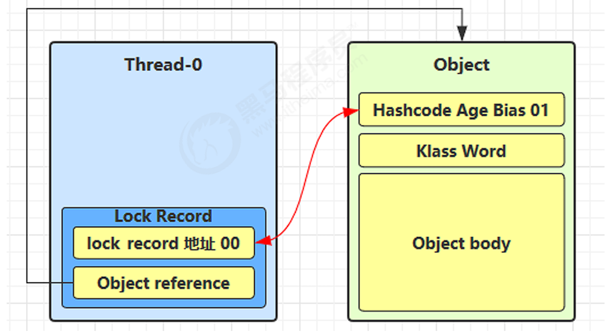

- 让锁记录中 Object reference 指向锁对象，并尝试用 cas 替换 Object 的 Mark Word，将 Mark Word 的值存 入锁记录
- 如果 cas 替换成功，对象头中存储了 锁记录地址和状态 00 ，表示由该线程给对象加锁

- 如果 cas 失败，有两种情况 
  - 如果是其它线程已经持有了该 Object 的轻量级锁，这时表明有竞争，进入锁膨胀过程 
  - 如果是自己执行了 synchronized **锁重入**，那么再添加一条 Lock Record 作为重入的计数
- 当退出 synchronized 代码块（解锁时）如果有取值为 null 的锁记录，表示有重入，这时重置锁记录，表示重 入计数减一
- 当退出 synchronized 代码块（解锁时）锁记录的值不为 null，这时使用 cas 将 Mark Word 的值恢复给对象 头 
  - 成功，则解锁成功 
  - 失败，说明轻量级锁进行了锁膨胀或已经升级为重量级锁，进入重量级锁解锁流程


### 锁膨胀

如果在尝试加轻量级锁的过程中，CAS 操作无法成功，这时一种情况就是有其它线程为此对象加上了轻量级锁（有竞争），这时需要进行锁膨胀，将轻量级锁变为重量级锁。


过程如下：

- 当 Thread-1 进行轻量级加锁时，Thread-0 已经对该对象加了轻量级锁
- 这时 Thread-1 加轻量级锁失败，进入锁膨胀流程 
  - 即为 Object 对象申请 Monitor 锁，让 Object 指向重量级锁地址 
  - 然后自己进入 Monitor 的 EntryList BLOCKED
- 当 Thread-0 退出同步块解锁时，使用 CAS 将 Mark Word 的值恢复给对象头，失败。这时会进入重量级解锁流程，即按照 Monitor 地址找到 Monitor 对象，设置 Owner 为 null，唤醒 EntryList 中 BLOCKED 线程

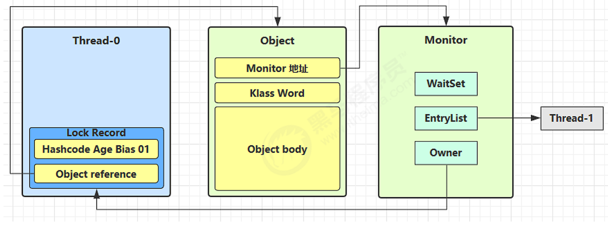


### 自旋优化

重量级锁竞争的时候，可以使用自旋来进行优化，如果当前线程自旋成功（即这时候持锁线程已经退出了同步块，释放了锁），当前线程就可以避免阻塞。


- 自旋会占用 CPU 时间，<font color=red>单核 CPU 自旋就是浪费，多核 CPU 自旋才能发挥优势</font>。 
- 在 Java 6 之后自旋锁是自适应的，比如对象刚刚的一次自旋操作成功过，那么认为这次自旋成功的可能性会高，就多自旋几次；反之，就少自旋甚至不自旋。
- Java 7 之后不能控制是否开启自旋功能。


### 偏向锁

轻量级锁在没有竞争时（无其他线程需要与其竞争锁对象），每次重入仍然需要执行 CAS 操作。

> [!Note]
>
> Java 6 中引入了**偏向锁**来做进一步优化：
>
> 偏向锁是JVM为了提高同步性能而设计的一种锁优化机制。它基于"大多数情况下锁不存在竞争"的假设，让锁偏向于第一个获取它的线程。
>
> 只有第一次使用 CAS 将线程 ID 设置到对象的 Mark Word 头，之后发现这个线程 ID 是自己的就表示没有竞争，不用重新 CAS。以后只要不发生竞争，这个对象就归该线程所有。

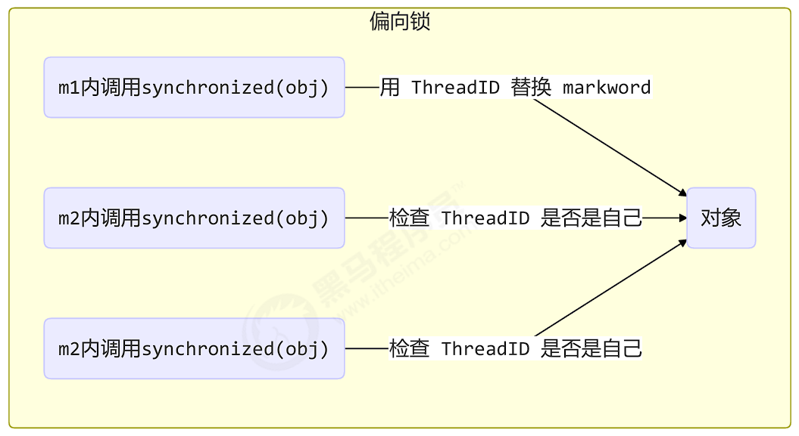


#### 偏向状态

对象头(64 bit) Mark Word 状态：

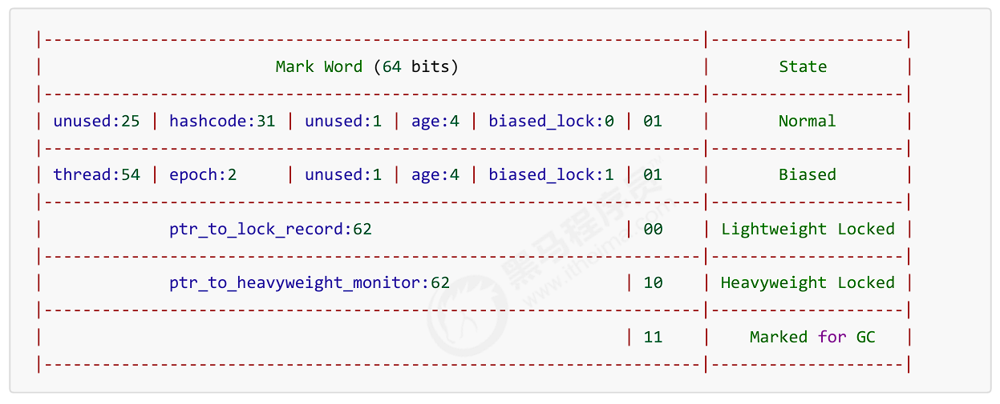

一个对象创建时：

- 如果开启了偏向锁（默认开启），那么对象创建后，`markword` 值为 `0x05` 即最后 3 位为 101，这时它的  thread、epoch、age 都为 0
- 偏向锁是默认是延迟的，不会在程序启动时立即生效，如果想避免延迟，可以使用虚拟机参数  `-XX:BiasedLockingStartupDelay=0` 来禁用延迟
- 如果没有开启偏向锁，那么对象创建后，`markword` 值为 `0x01` 即最后 3 位为 001，这时它的 `hashcode`、 age 都为 0，第一次用到 `hashcode` 时才会赋值

> [!Tip]
>
> JVM 参数 
>
> `-XX:-UseBiasedLocking` 禁用偏向锁
>
> `-XX:+UseBiasedLocking` 启用偏向锁（默认）


#### 撤销-调用对象的 `hashCode`

偏向锁的对象 MarkWord 中存储的是线程 id，如果调用 hashCode 会导致偏向锁被 撤销

> [!Tip]
>
> 由于长度限制，对象头中不能同时存储 线程ID 和 hashCode

- 轻量级锁会在锁记录中记录 hashCode 
- 重量级锁会在 Monitor 中记录 hashCode

#### 撤销-其他线程使用对象

当有其它线程使用偏向锁对象时，会将偏向锁升级为轻量级锁

#### 撤销-调用 `wait/notify`


#### 批量重偏向

​	当偏向锁的假设不成立(即存在多个线程竞争锁)时，JVM需要撤销偏向锁。如果频繁发生偏向锁撤销，会影响性能。批量重偏向就是为了解决这个问题。


1. 当某个类的偏向锁撤销次数达到阈值(默认20次)时，JVM会认为这个类的锁不适合使用偏向模式
2. JVM会执行批量重偏向，将这个类的所有实例的偏向锁状态重置
3. 之后这些实例的锁可以重新偏向于新的线程，而不是直接升级为轻量级锁


#### 批量撤销

批量撤销是JVM在检测到某个类的偏向锁频繁发生竞争时，**彻底禁用该类的偏向锁优化**的机制。如果撤销次数增长到40次，就会触发**批量撤销**。


### 锁消除

锁 


JVM在运行时会进行**逃逸分析**，判断对象是否可能被多个线程访问：

- **不逃逸（No Escape）**：对象仅在当前方法或线程内使用，不会被其他线程访问。
- **方法逃逸（Method Escape）**：对象可能被其他方法访问，但仍限于当前线程。
- **线程逃逸（Thread Escape）**：对象可能被其他线程访问（需要同步）。

如果JVM发现某个锁对象**不会逃逸到其他线程**（即不存在真正的竞争），就会**直接消除锁**，减少同步开销。


例如：单线程环境下**StringBuffer 会被替换成 StringBuilder**


## wait/notify

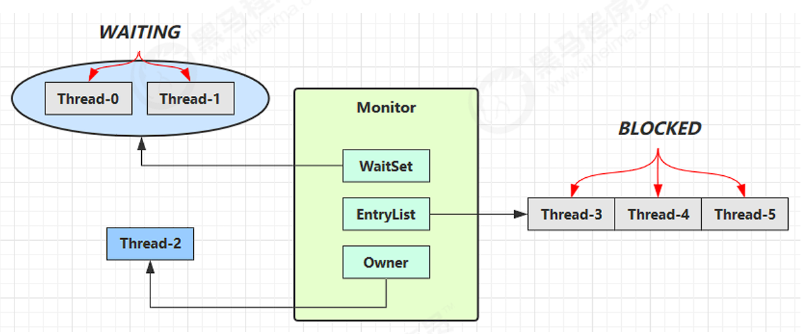

- Owner 线程发现条件不满足，调用 wait 方法，即可进入 WaitSet 变为 WAITING 状态 
- BLOCKED 和 WAITING 的线程都处于阻塞状态，不占用 CPU 时间片 
- BLOCKED 线程会在 Owner 线程释放锁时唤醒 
- WAITING 线程会在 Owner 线程调用 notify 或 notifyAll 时唤醒，但唤醒后并不意味者立刻获得锁，仍需进入  EntryList 重新竞争


| 方法              | 作用                   | 说明                                                         |
| :---------------- | :--------------------- | :----------------------------------------------------------- |
| **`wait()`**      | 让当前线程进入等待状态 | 释放锁，进入等待队列，直到被 `notify()`/`notifyAll()` 唤醒或超时 |
| **`notify()`**    | 随机唤醒一个等待线程   | 从等待队列中选择一个线程唤醒（不保证公平性）                 |
| **`notifyAll()`** | 唤醒所有等待线程       | 所有等待线程竞争锁，只有一个能继续执行                       |

> [!Caution]
>
> 它们必须在 `synchronized` 代码块或方法中使用
>
> 调用 `wait()/notify()` 前，线程必须持有该对象的锁，否则会抛出 `IllegalMonitorStateException`。


**`wait()` 和 `sleep()` 的区别**

| **`wait()`**                   | **`sleep()`**                |
| :----------------------------- | :--------------------------- |
| 释放锁                         | 不释放锁                     |
| 属于 `Object` 类               | 属于 `Thread` 类             |
| 必须和 `synchronized` 一起使用 | 可以在任何地方调用           |
| 可被 `notify()` 唤醒           | 只能等时间到或 `interrupt()` |
| 线程状态 TIMED_WAITING         | 线程状态 TIMED_WAITING       |


### 虚假唤醒

虚假唤醒是指线程在没有收到明确通知的情况下从等待状态中被唤醒的现象。


为了防止虚假唤醒导致的问题，最佳实践是：

1. 总是在循环中检查条件，而不是简单的if语句
2. 使用while循环而不是if来检查条件变量


示例代码

```java
// 不安全的写法 - 可能因虚假唤醒导致问题
synchronized(lock) {
    if(!condition) {
        lock.wait();
    }
    // 执行操作
}

// 正确的写法 - 防止虚假唤醒
synchronized(lock) {
    while(!condition) {  // 使用while循环
        lock.wait();
    }
    // 执行操作
}
```


### 保护性暂停

保护性暂停是一种多线程设计模式，用于当一个线程需要等待某个条件满足后才能继续执行的情况。


保护性暂停模式的核心思想是：

- **保护条件**：线程执行前必须满足的条件
- **暂停机制**：当条件不满足时，线程主动暂停执行
- **恢复机制**：当条件满足时，线程被唤醒继续执行


示例代码

```java
public class GuardedObject {
    private Object response;
    
    /**
     * 获取结果
     * @param timeout 超时时间
     * @return 结果
     */
    public Object get(long timeout){
        synchronized(this) {
            long remaining = timeout;
            long endTime = System.currentTimeMillis() + timeout;

            while(response == null && remaining > 0) {
                try {
                    this.wait(remaining);
                } catch (InterruptedException e) {
                    Thread.currentThread().interrupt();
                    throw new RuntimeException(e);
                }
                // 虚假唤醒时剩余等待时间
                remaining = endTime - System.currentTimeMillis();
            }
            return response;
        }
    }
    
    public void complete(Object response) {
        synchronized(this) {
            this.response = response;
            this.notifyAll();
        }
    }
}
```

> [!Note]
>
> `join()`底层就是通过该方式实现的


### 生产者消费者模式

- 与前面的保护性暂停中的 GuardObject 不同，不需要产生结果和消费结果的线程一一对应 
- 消费队列可以用来平衡生产和消费的线程资源 
- 生产者仅负责产生结果数据，不关心数据该如何处理，而消费者专心处理结果数据 
- 消息队列是有容量限制的，满时不会再加入数据，空时不会再消耗数据 
- JDK 中各种阻塞队列，采用的就是这种模式

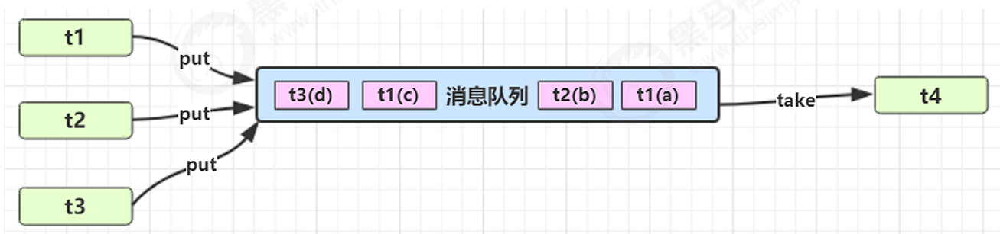

示例代码

```java
@Slf4j
public class TestMessageQueue {

    public static void main(String[] args) throws InterruptedException {
        MessageQueue queue = new MessageQueue(2);

        for (int i = 0; i < 3; i++) {
            int id = i;
            new Thread(() -> {
                log.info("生产者{}开始生产消息", id);
                queue.put(new Message(id, "消息" + id));
            }, "生产者" + i).start();
        }

        Thread.sleep(1000);

        new Thread(() -> {
            while (true) {
                try {
                    Thread.sleep(500);
                } catch (InterruptedException e) {
                    throw new RuntimeException(e);
                }
                Message msg = queue.take();
                log.info("消费者开始消费消息：{}", msg.getValue());
            }
        }, "消费者").start();
    }

}

@Slf4j
class MessageQueue {

    /**
     * 队列容量
     */
    private final int capacity;

    /**
     * 消息队列
     */
    private final LinkedList<Message> list;

    public MessageQueue(int capacity) {
        this.capacity = capacity;
        list = new LinkedList<>();
    }

    /**
     * 获取消息
     * @return 消息
     */
    public Message take() {
        synchronized (list) {
            // 队列为空，等待生产者生产
            while (list.isEmpty()) {
                log.info("队列为空，等待生产者生产");
                try {
                    list.wait();
                } catch (InterruptedException e) {
                    throw new RuntimeException(e);
                }
            }
            Message message = list.removeFirst();
            list.notifyAll();
            return message;
        }
    }

    /**
     * 放入消息
     * @param message 消息
     */
    public void put(Message message) {
        synchronized (list) {
            // 队列已满，等待消费者消费
            while (list.size() == capacity) {
                log.info("队列已满，等待消费者消费");
                try {
                    list.wait();
                } catch (InterruptedException e) {
                    throw new RuntimeException(e);
                }
            }
            list.addLast(message);
            list.notifyAll();
        }
    }

}

@Getter
class Message {
    private final int id;
    private final Object value;

    public Message(int id, Object value) {
        this.id = id;
        this.value = value;
    }

}
```


## park/unpark

它们是 LockSupport 类中的方法

```java
// 暂停当前线程
LockSupport.park();
// 恢复某个线程的运行
LockSupport.unpark(暂停线程对象);
```


与 Object 的 wait & notify 相比

- wait，notify 和 notifyAll 必须配合 Object Monitor 一起使用，而 park，unpark 不需要
- park & unpark 是以线程为单位来【阻塞】和【唤醒】线程，而 notify 只能随机唤醒一个等待线程，notifyAll  是唤醒所有等待线程，就不那么【精确】
- park & unpark 可以先 unpark，而 wait & notify 不能先 notify


### 原理

**许可机制**：每个线程都有一个关联的许可(最多一个)

- `unpark()`提供许可
- `park()`消耗许可

每个线程都有自己的一个 Parker 对象（非Java语言实现），由三部分组成  _counter ， _cond 和  _mutex

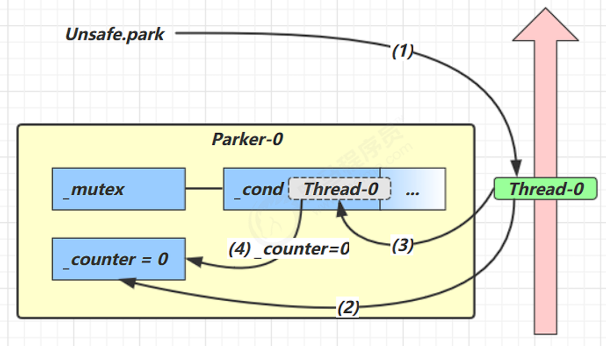

1. 当前线程调用 Unsafe.park() 方法
2. 检查 _counter ，本情况为 0，这时，获得 _mutex 互斥锁 
3. 线程进入 _cond 条件变量阻塞
4. 设置 _counter = 0


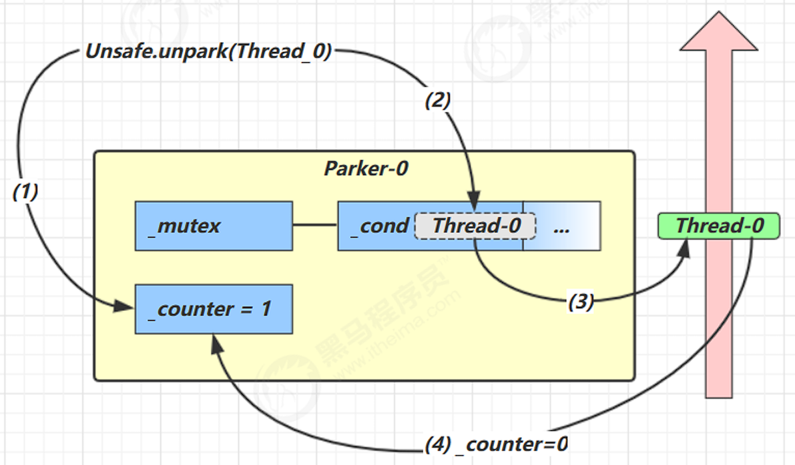

1. 调用 Unsafe.unpark(Thread_0) 方法，设置 _counter 为 1 
2. 唤醒 _cond 条件变量中的 Thread_0 
3. Thread_0 恢复运行
4. 设置 _counter 为 0


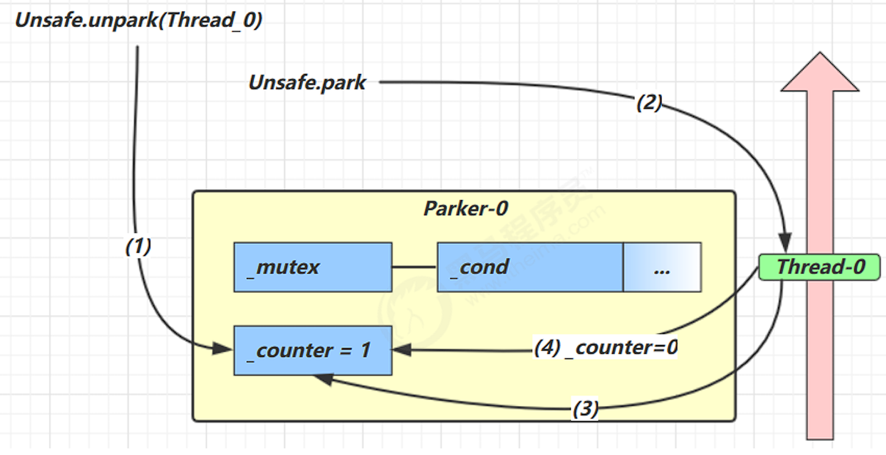

1. 调用 Unsafe.unpark(Thread_0) 方法，设置 _counter 为 1 
2. 当前线程调用 Unsafe.park() 方法 
3. 检查 _counter ，本情况为 1，这时线程无需阻塞，继续运行 
4. 设置 _counter 为 0


## 线程状态转换

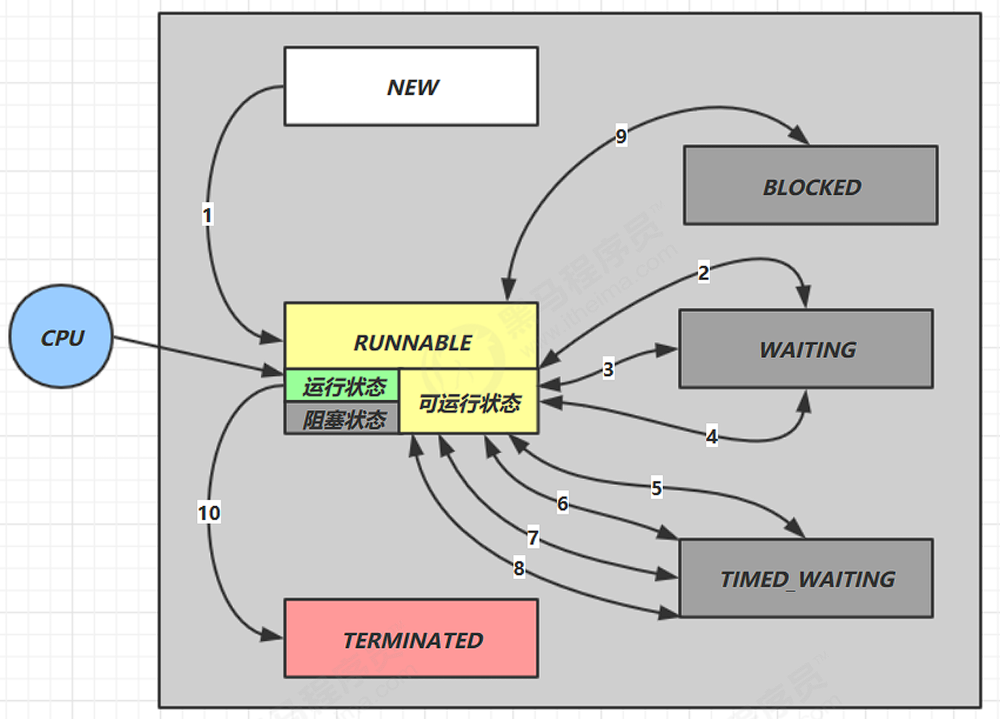

### 情况 1  NEW --> RUNNABLE  

当调用  t.start() 方法时，由  NEW --> RUNNABLE 


### 情况 2  RUNNABLE <--> WAITING

t 线程用  `synchronized(obj)`  获取了对象锁后 

- 调用 `obj.wait()` 方法时，t 线程从 RUNNABLE --> WAITING
- 调用 `obj.notify()` ， `obj.notifyAll()` ，` t.interrupt()` 时
  - 竞争锁成功，t 线程从   WAITING --> RUNNABLE  
  - 竞争锁失败，t 线程从   WAITING --> BLOCKED 


### 情况 3  RUNNABLE <--> WAITING

- 当前线程调用  `t.join()` 方法时，当前线程从  RUNNABLE --> WAITING 
  - 注意是当前线程在t 线程对象的监视器上等待

- t 线程运行结束，或调用了当前线程的  `interrupt()` 时，当前线程从 WAITING --> RUNNABLE


### 情况 4  RUNNABLE <--> WAITING

- 当前线程调用 `LockSupport.park()` 方法会让当前线程从  RUNNABLE --> WAITING
- 调用  `LockSupport.unpark(目标线程)` 或调用了线程 的  `interrupt()` ，会让目标线程从  WAITING -->RUNNABLE


### 情况 5  RUNNABLE <--> TIMED_WAITING

t 线程用  `synchronized(obj)` 获取了对象锁后 

- 调用  `obj.wait(long n)` 方法时，t 线程从  RUNNABLE --> TIMED_WAITING
- t 线程等待时间超过了 n 毫秒，或调用  `obj.notify()` ， `obj.notifyAll()` ,`t.interrupt()` 时
  - 竞争锁成功，t 线程从   TIMED_WAITING --> RUNNABLE  
  - 竞争锁失败，t 线程从   TIMED_WAITING --> BLOCKED


### 情况 6  RUNNABLE <--> TIMED_WAITING

- 当前线程调用 `t.join(long n)` 方法时，当前线程从  RUNNABLE --> TIMED_WAITING

- 当前线程等待时间超过了 n 毫秒，或t 线程运行结束，或调用了当前线程的  `interrupt()` 时，当前线程从 TIMED_WAITING --> RUNNABLE


### 情况 7  RUNNABLE <--> TIMED_WAITING

- 当前线程调用  Thread.sleep(long n) ，当前线程从  RUNNABLE --> TIMED_WAITING  
- 当前线程等待时间超过了 n 毫秒，当前线程从   TIMED_WAITING --> RUNNABLE


### 情况 8  RUNNABLE <--> TIMED_WAITING

- 当前线程调用  `LockSupport.parkNanos(long nanos)` 或  程 调用  `LockSupport.parkUntil(long millis) `时，当前线程从  RUNNABLE --> TIMED_WAITING
- 调用 `LockSupport.unpark(目标线程)` 或调用了线程 的 ` interrupt()` ，或是等待超时，会让目标线程从  TIMED_WAITING--> RUNNABLE


### 情况 9  RUNNABLE <--> BLOCKED

- t 线程用   `synchronized(obj) `获取了对象锁时如果竞争失败，从   RUNNABLE --> BLOCKED  
- 持 obj 锁线程的同步代码块执行完毕，会唤醒该对象上所有  BLOCKED  的线程重新竞争，如果其中 t 线程竞争 成功，从  BLOCKED --> RUNNABLE ，其它失败的线程仍然   BLOCKED 


### 情况 10  RUNNABLE <--> TERMINATED

当前线程所有代码运行完毕，进入 TERMINATED


## 多把锁

> [!Tip]
>
> 引例：
>
> 一间大屋子有两个功能：睡觉、学习，互不相干。 
>
> 现在小南要学习，小女要睡觉，但如果只用一间屋子（一个对象锁）的话，那么并发度很低 
>
> 解决方法是准备多个房间（多个对象锁）

```java
class BigRoom {
    private final Object studyRoom = new Object();
    private final Object bedRoom = new Object();
    
    public void sleep() {
        synchronized (bedRoom) {
        	log.debug("sleeping 2 小时");
        	Sleeper.sleep(2);
    	}
    }
    
    public void study() {
        synchronized (studyRoom) {
            log.debug("study 1 小时");
            Sleeper.sleep(1);
        }
    }
}
```


将锁的粒度细分 

- 好处，是可以增强并发度 
- 坏处，如果一个线程需要同时获得多把锁，就容易发生死锁


## 活跃性

### 死锁

> [!Note]
>
> 死锁四要素
>
> 1. **互斥**：资源一次只能被一个进程/线程占用
> 2. **持有并等待**：进程/线程在持有至少一个资源的同时，还在等待获取其他被占用的资源。
> 3. **非抢占条件**：已分配给进程/线程的资源不能被其他进程强行夺取
> 4. **循环等待**：存在一个进程/线程的循环链，链中的每个进程都在等待下一个进程所占用的资源。

一个线程需要同时获取多把锁，这时就容易发生死锁

例如：

- t1 线程 先获得  A对象 锁，接下来想获取 B对象 的锁  

- t2 线程 先获得  B对象 锁，接下来想获取  A对象 的锁 

t1和t2相互等待


### 定位死锁

检测死锁可以使用 jconsole工具，或者使用 jps 定位进程 id，再用 jstack 定位死锁

检测到死锁输出：

```java
Found one Java-level deadlock:
...
```

> [!Tip]
>
> 破坏死锁四要素中任意一个即可解决死锁


### 哲学家就餐问题

问题场景设定如下：

- 五位哲学家围坐在一张圆桌周围
- 每位哲学家面前有一盘食物
- 每两位哲学家之间放有一根筷子(共五根)
- 哲学家只有同时拿到左右两边的筷子才能进餐
- 进餐结束后会放下筷子继续思考


问题的关键在于如何设计一个算法，使得：

1. 不会发生死锁(所有哲学家都拿着一根筷子等待另一根)
2. 不会发生饥饿(某些哲学家永远无法进餐)
3. 允许最大程度的并行(尽可能多的哲学家同时进餐)


### 活锁

活锁是多线程或分布式系统中的一种现象，与死锁类似但又有重要区别。在活锁情况下，线程或进程并没有被阻塞，而是在不断地尝试解决冲突，但由于彼此之间的相互让步或协调不当，导致系统无法继续向前推进。

**活锁与死锁的区别**

| 特性     | 死锁(Deadlock)             | 活锁(Livelock)           |
| :------- | :------------------------- | :----------------------- |
| 线程状态 | 线程被阻塞，不执行任何操作 | 线程仍在执行，但没有进展 |
| 资源占用 | 资源被永久占用             | 资源可能被不断获取和释放 |
| CPU使用  | 低                         | 高(因为线程仍在忙碌)     |
| 表现形式 | 完全停止                   | 看似忙碌但无实际进展     |


**活锁的典型场景**

1. **过度礼貌的哲学家**：在哲学家就餐问题中，如果所有哲学家同时拿起左边的筷子，发现右边的筷子不可用，然后同时放下左边的筷子，等待一段时间后再次尝试，如此循环。
2. **消息重试机制**：两个进程互相发送消息，消息丢失后都重试，但重试时间同步导致持续冲突。
3. **资源分配策略**：多个线程在检测到冲突时都主动释放资源并重试，导致持续的资源竞争循环。


### 饥饿

饥饿（Starvation）是多线程或资源分配系统中一种现象，指的是某些线程或进程由于**长期无法获取所需资源**而无法执行，而其他线程却能正常执行。饥饿不同于死锁（Deadlock）和活锁（Livelock），因为饥饿的线程**没有被阻塞**，而是**一直处于就绪状态但得不到调度**。


**饥饿 vs. 死锁 vs. 活锁**

| 特性         | **死锁 (Deadlock)** | **活锁 (Livelock)**      | **饥饿 (Starvation)**   |
| :----------- | :------------------ | :----------------------- | :---------------------- |
| **线程状态** | 完全阻塞（不执行）  | 持续执行但无进展         | 可运行但得不到资源      |
| **资源占用** | 资源被永久占用      | 资源可能被反复获取和释放 | 资源被高优先级线程抢占  |
| **CPU使用**  | 低（线程阻塞）      | 高（线程忙碌但无进展）   | 可能高（线程在等待）    |
| **解决方案** | 破坏死锁条件        | 引入随机性/优先级        | 公平调度/避免优先级反转 |


**1. 公平调度（Fairness）**

- 使用公平锁（`ReentrantLock(true)`）：

  ```java
  ReentrantLock fairLock = new ReentrantLock(true); // 公平锁
  ```

- 线程池使用公平队列（如`newFixedThreadPool` + `LinkedBlockingQueue`）。

**2. 避免优先级反转（Priority Inversion）**

- 在实时系统中（如RTOS），确保低优先级任务不会被无限抢占。
- 使用优先级继承（Priority Inheritance）或优先级天花板（Priority Ceiling）协议。

**3. 时间片轮转（Round-Robin Scheduling）**

- 操作系统/线程调度器可以强制让每个线程都能获得执行机会（如Linux的CFS调度器）。

**4. 资源分配超时**


## ReentrantLock

相对于 synchronized 它具备如下特点 

- 可中断 
- 可以设置超时时间 
- 可以设置为公平锁 
- 支持多个条件变量

与`synchronized`一样都是**可重入锁**

> [!Tip]
>
> 可重入是指同一个线程如果首次获得了这把锁，那么因为它是这把锁的拥有者，因此有权利再次获取这把锁


基本语法

```java
reentrantLock.lock();
try {
    // 临界区
} finally {
    reentrantLock.unlock();
}
```


### 可重入

示例代码

```java
    private static final ReentrantLock lock = new ReentrantLock();

    public static void main(String[] args) {
        lock.lock();
        try {
            log.info("lock acquired");
            method();
        } finally {
            log.info("lock released");
            lock.unlock();
        }
    }

    public static void method() {
        lock.lock();
        try {
            log.info("reentrant lock acquired");
        } finally {
            log.info("reentrant lock released");
            lock.unlock();
        }
    }
```


### 可打断

示例代码

```java
    private static final ReentrantLock lock = new ReentrantLock();

    public static void main(String[] args) {
        Thread t1 = new Thread( () -> {
            try {
                log.info("尝试获得锁");
                lock.lockInterruptibly();// 
            } catch (InterruptedException e) {
                log.error("获取锁失败", e);
                throw new RuntimeException(e);
            }
            try {
                lock.lock();
                log.info("已获得锁");
            } finally {
                lock.unlock();
            }
        });
        lock.lock();
        t1.start();
        t1.interrupt();
        lock.unlock();
    }
```


### 锁超时

```java
    private static final ReentrantLock lock = new ReentrantLock();

    public static void main(String[] args) {
        Thread t1 = new Thread( () -> {
            log.info("尝试获得锁");
            try {
                if (!lock.tryLock(1, TimeUnit.SECONDS)) {
                    log.info("尝试获得锁失败");
                    return;
                }
            } catch (InterruptedException e) {
                log.error("获取锁失败", e);
                return;
            }
            try {
                log.info("已获得锁");
            } finally {
                lock.unlock();
            }
        });
        lock.lock();
        t1.start();
//        lock.unlock();
    }
```

> [!Tip]
>
> `lock.tryLock()`返回布尔值
>
> `lock.tryLock()`不带参数，无法获得锁会立刻失败


### 公平锁

`ReentrantLock`默认是不公平的，可通过

```java
ReentrantLock lock = new ReentrantLock(true);
```

将其设置为公平锁


### 条件变量

`Condition` 是 `ReentrantLock` 提供的一种**线程等待/唤醒机制**，类似于 `Object.wait()` 和 `Object.notify()`，但更强大：

- 一个 `ReentrantLock` 可以创建多个 `Condition`，实现**不同条件的等待队列**。
- 适用于**生产者-消费者模型**、**线程池任务调度**等场景。


| 方法                              | 说明                                   |
| :-------------------------------- | :------------------------------------- |
| `await()`                         | 释放锁并进入等待（类似 `wait()`）      |
| `awaitUninterruptibly()`          | 不可中断的等待                         |
| `awaitNanos(long nanos)`          | 超时等待（纳秒级）                     |
| `await(long time, TimeUnit unit)` | 超时等待                               |
| `signal()`                        | 唤醒一个等待线程（类似 `notify()`）    |
| `signalAll()`                     | 唤醒所有等待线程（类似 `notifyAll()`） |

> [!Caution]
>
> `await`前需要获得锁，且`await`会释放锁


```java
ReentrantLock lock = new ReentrantLock();
Condition readCondition = lock.newCondition();
Condition writeCondition = lock.newCondition();

volatile boolean canRead = true;
volatile boolean canWrite = false;

// 读操作
lock.lock();
try {
    while (!canRead) {
        readCondition.await();
    }
    canRead = false;
    // 执行读操作
    canWrite = true;
    writeCondition.signalAll();  // 唤醒所有写线程
} finally {
    lock.unlock();
}

// 写操作
lock.lock();
try {
    while (!canWrite) {
        writeCondition.await();
    }
    canWrite = false;
    // 执行写操作
    canRead = true;
    readCondition.signalAll();  // 唤醒所有读线程
} finally {
    lock.unlock();
}
```


# 共享模型-内存


## 可见性

退不出的循环

```java
    static boolean run = true;

    public static void main(String[] args) {

        new Thread(() -> {
            while (run) {
                // do something
            }
        }).start();

        log.info("stop thread");
        run = false;

    }
```

>[!Caution]
>
>以上线程并不会在`run`的值改变后退出


原因如下：

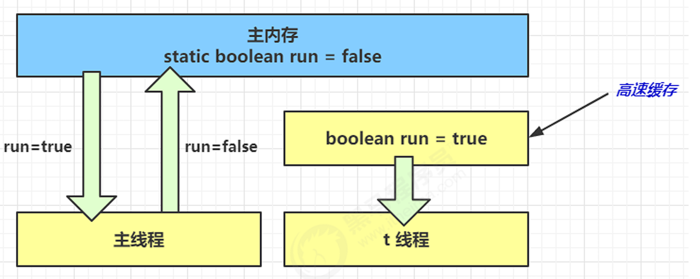

1. **JMM的可见性问题**：
   - 在Java内存模型中，每个线程有自己的工作内存(缓存)
   - `run`变量是普通变量(非volatile)，修改可能不会立即对其他线程可见
   - 主线程修改`run=false`后，子线程可能仍然读取的是自己工作内存中的旧值`true`
2. **编译器/JIT优化**：
   - JIT编译器可能会将`while(run)`优化为`while(true)`，因为循环体内没有操作
   - 这种优化称为"循环提升"(Loop Hoisting)


**解决方案**

1. 使用volatile关键字(推荐)

```java
static volatile boolean run = true;
```

`volatile`保证：

- 可见性：修改立即对其他线程可见
- 有序性：禁止指令重排序


2. 使用synchronized同步

```java
static boolean run = true;
static final Object lock = new Object();

// 写操作
synchronized(lock) {
    run = false;
}

// 读操作
synchronized(lock) {
    while(run) { ... }
}
```


### 两阶段终止模式

可以使用`volatile`实现该模式


### Balking模式

Balking模式是一种**多线程设计模式**，用于在对象处于不适当状态时立即放弃当前操作，而不是等待状态变为可用状态。


典型场景

1. 文件自动保存功能（如果已经保存过则不再重复保存）
2. 服务初始化（只初始化一次）
3. 网络请求取消（如果已经开始处理则不接受取消）
4. 线程启动检查（如果线程已在运行则不重复启动）


```java
class VolatileBalking {
    private volatile boolean initialized = false;
    
    public void init() {
        if (initialized) {
            return;
        }
        synchronized (this) {
            if (initialized) { // 双重检查
                return;
            }
            doInit();
            initialized = true;
        }
    }
    
    private void doInit() {
        // 初始化逻辑
    }
}
```


例：线程安全的单例模式

```java
public class Singleton {
    private static volatile Singleton instance;
    
    private Singleton() {}
    
    public static Singleton getInstance() {
        if (instance == null) {                  // 第一次检查：Balking，直接返回避免同步，优化性能
            synchronized (Singleton.class) {      // 同步
                if (instance == null) {          // 第二次检查：线程安全
                    instance = new Singleton();
                }
            }
        }
        return instance;
    }
}
```


## 有序性

**指令重排**：在**不改变单线程程序语义**的前提下，编译器、运行时或处理器可能会改变代码的执行顺序

> 指令重排，这个现象需要通过**大量**测试才能复现（ java 并发压测工具 jcstress）

 

示例

```java
    boolean ready = false;
	int num = 0;
    // 线程1 执行此方法
    public void actor1(I_Result r) {
        if(ready) {
            r.r1 = num + num;
        }
        else {
            r.r1 = 1;
        }
    }
    // 线程2 执行此方法
    public void actor2(I_Result r) {
        num = 2;
        ready = true;
    }
```

> [!Tip]
>
> 以上代码，`r.r1`的值可能是1，4，**0**
>
> 其中0是指令重排序的结果


- 禁止重排序：
  - 在volatile写之前的所有操作不会被重排序到写之后
  - 在volatile读之后的所有操作不会被重排序到读之前


> [!Caution]
>
> `synchronized` 是不能阻止指令重排的


### volatile

内存屏障是处理器提供的一组特殊指令，用于控制指令执行顺序和内存可见性，在多线程编程中至关重要。读屏障和写屏障是两种基本的内存屏障类型。

#### 读屏障

- 确保屏障后的**读操作**不会重排序到屏障前
- 强制从主内存（而非缓存）重新加载数据

#### 写屏障

- 确保屏障前的**写操作**不会重排序到屏障后
- 强制将写缓冲区内容刷入主内存


####  double-checked locking 问题

```java
public final class Singleton {
    private Singleton() { }
    private static Singleton INSTANCE = null;
    public static Singleton getInstance() {
        // 实例没创建，才会进入内部的 synchronized代码块
        if (INSTANCE == null) {
            synchronized (Singleton.class) { // t2
                // 也许有其它线程已经创建实例，所以再判断一次
                if (INSTANCE == null) { // t1
                    INSTANCE = new Singleton();
                }
            }
        }
        return INSTANCE;
    }
}
```

字节码

```java
0: getstatic     #2                  // Field INSTANCE:Lcn/itcast/n5/Singleton;
3: ifnonnull     37
6: ldc           #3                  // class cn/itcast/n5/Singleton
8: dup
9: astore_0
10: monitorenter
11: getstatic     #2                  // Field INSTANCE:Lcn/itcast/n5/Singleton;
14: ifnonnull     27
17: new           #3                  // class cn/itcast/n5/Singleton
20: dup
21: invokespecial #4                  // Method "<init>":()V
24: putstatic     #2                  // Field INSTANCE:Lcn/itcast/n5/Singleton;
27: aload_0
28: monitorexit
29: goto          37
32: astore_1
33: aload_0
34: monitorexit
35: aload_1
36: athrow
37: getstatic     #2                  // Field INSTANCE:Lcn/itcast/n5/Singleton;
40: areturn
```

其中 

17 表示创建对象，将对象引用入栈  // new Singleton 

20 表示复制一份对象引用  // 引用地址 

21 表示利用一个对象引用，调用构造方法  

24 表示利用一个对象引用，赋值给 static INSTANCE 

也许 jvm 会优化为：先执行 24，再执行 21。如果两个线程 t1，t2 按如下时间序列执行：

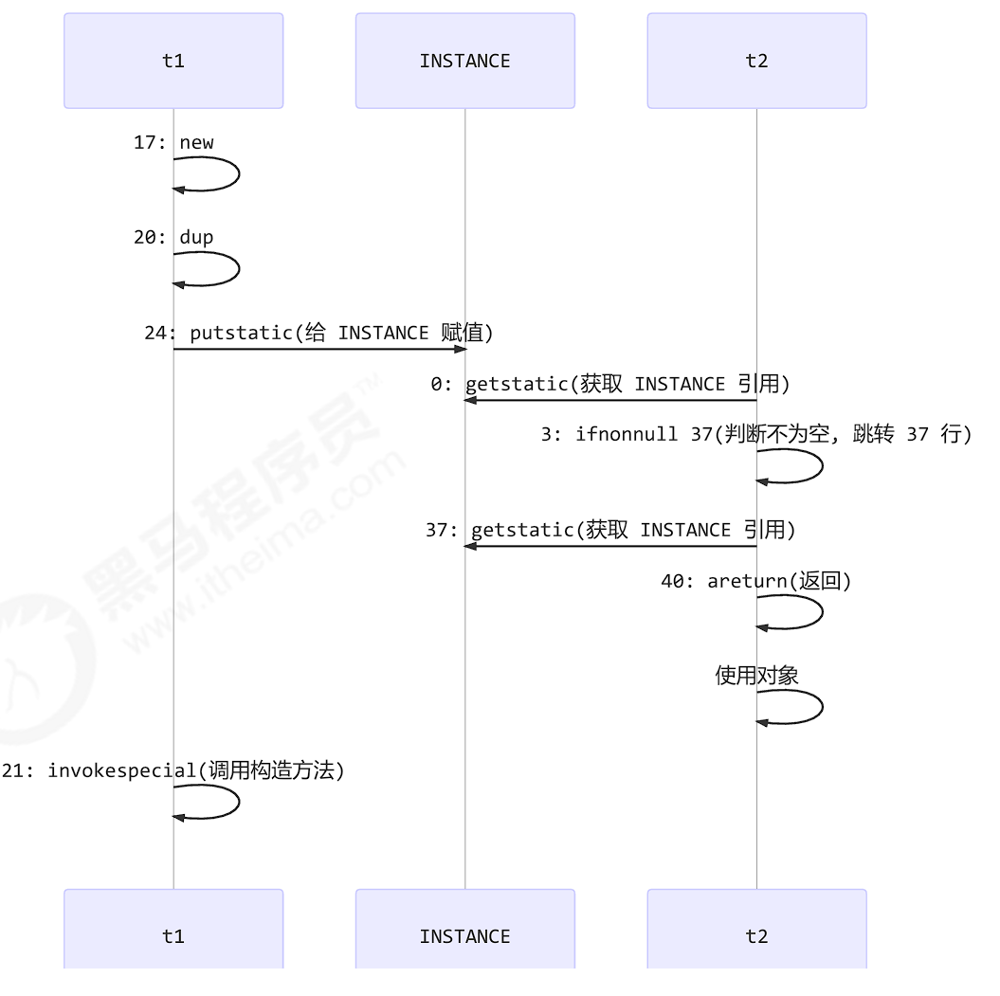

关键在于 

0: getstatic 这行代码在 monitor 控制之外，它就像之前举例中不守规则的人，可以越过 monitor 读取 INSTANCE 变量的值 

这时 t1 还未完全将构造方法执行完毕，如果在构造方法中要执行很多初始化操作，那么 t2 拿到的是将是一个未初 始化完毕的单例 

**对 INSTANCE 使用 volatile 修饰即可**，可以禁用指令重排，但要注意在 JDK 5 以上的版本的 volatile 才会真正有效


读写 volatile 变量时会加入内存屏障（Memory Barrier（Memory Fence））

- 可见性
  - 写屏障（sfence）保证在该屏障之前的 t1 对共享变量的改动，都同步到主存当中 
  - 而读屏障（lfence）保证在该屏障之后 t2 对共享变量的读取，加载的是主存中最新数据 
- 有序性
  - 写屏障会确保指令重排序时，不会将写屏障之前的代码排在写屏障之后 
  - 读屏障会确保指令重排序时，不会将读屏障之后的代码排在读屏障之前

- 更底层是读写变量时使用 lock 指令来实现多核 CPU 之间的可见性与有序性


### happens-before

happens-before 规定了对共享变量的写操作对其它线程的读操作可见，它是可见性与有序性的一套规则总结，抛 开以下 happens-before 规则，JMM 并不能保证一个线程对共享变量的写，对于其它线程对该共享变量的读可见

1. 线程解锁 m 之前对变量的写，对于接下来对 m 加锁的其它线程对该变量的读可见

```java
        static int x;
        static Object m = new Object();
        new Thread(() -> {
            synchronized (m) {
                x = 10;
            }
        }, "t1").start();
        new Thread(() -> {
            synchronized (m) {
                System.out.println(x);
            }
        }, "t2").start();
```

2. 线程对 volatile 变量的写，对接下来其它线程对该变量的读可见

```java
        volatile static int x;
        new Thread(()->{
            x = 10;
        },"t1").start();
        new Thread(()->{
            System.out.println(x);
        },"t2").start();
```

3. 线程 start 前对变量的写，对该线程开始后对该变量的读可见

```java
        static int x;
        x = 10;
        new Thread(()->{
            System.out.println(x);
        },"t2").start();
```

4. 线程结束前对变量的写，对其它线程得知它结束后的读可见（比如其它线程调用 t1.isAlive() 或 t1.join()等待 它结束）

```java
        static int x;
        Thread t1 = new Thread(()->{
            x = 10;
        },"t1");
        t1.start();
        t1.join();
        System.out.println(x);
```

5. 线程 t1 打断 t2（interrupt）前对变量的写，对于其他线程得知 t2 被打断后对变量的读可见（通过 t2.interrupted 或 t2.isInterrupted）

```java
        static int x;

        Thread t2 = new Thread(()->{
            while(true) {
                if(Thread.currentThread().isInterrupted()) {
                    System.out.println(x);
                    break;
                }
            }
        },"t2");
        t2.start();
        new Thread(()->{
            sleep(1);
            x = 10;
            t2.interrupt();
        },"t1").start();

        while(!t2.isInterrupted()) {
            Thread.yield();
        }
        System.out.println(x);
```

6. 对变量默认值（0，false，null）的写，对其它线程对该变量的读可见
7. 具有传递性，如果  x hb-> y 并且  y hb-> z 那么有  x hb-> z ，配合 volatile 的防指令重排

```java
        volatile static int x;
        static int y;
        new Thread(()->{
            y = 10;
            x = 20;
        },"t1").start();
        new Thread(()->{
            // x=20 对 t2 可见, 同时 y=10 也对 t2 可见
            System.out.println(x);
        },"t2").start();
```


## 单例模式实现

> [!Tip]
>
> 以下实现均为线程安全

- 饿汉式

```java
public final class Singleton {
    private Singleton(){}
    private static final Singleton INSTANCE = new Singleton();
    public static Singleton getInstance() {
        return INSTANCE;
    }
}
```


- 双重检查

```java
public final class Singleton implements Serializable {
    private Singleton() {}
    private volatile static Singleton INSTANCE = null;
    public static Singleton getInstance() {
        // 实例没创建，才会进入内部的 synchronized代码块
        if (INSTANCE == null) {
            // 可能有多个线程到达该分支
            synchronized (Singleton.class) {
                // 也许有其它线程已经创建实例，所以再判断一次
                if (INSTANCE == null) {
                    INSTANCE = new Singleton();
                }
            }
        }
        return INSTANCE;
    }
    
    // 防止反序列化重新创建对象
    public Object readResolve() {
        return INSTANCE;
    }
}
```


- 枚举

```java
enum Singleton {
    INSTANCE;
}
```


- 静态内部类

```java
final class Singleton {
    // 私有构造函数，防止外部实例化
    private Singleton() {
        
    }
    
    // 静态内部类，用于延迟初始化单例实例
    private static class SingletonHolder {
        private static final Singleton INSTANCE = new Singleton();
    }
    
    // 提供全局访问点，返回单例实例
    public static Singleton getInstance() {
        return SingletonHolder.INSTANCE;
    }
}
```


# 共享模型-无锁

## 无锁引例

```java
class AccountWithoutLock {
    private final AtomicInteger balance;

    public AccountWithoutLock(int balance) {
        this.balance = new AtomicInteger(balance);
    }
                                
    public int getBalance() {
        return balance.get();
    }

    public void withdraw(int amount) {
        while (true) {
            int prev = balance.get();
            int next = prev - amount;
            if (balance.compareAndSet(prev, next)) {
                break;
            }
        }
    }
}
```

> [!Note]
>
> 该类并没有使用**锁**技术
>
> 但是该类是线程安全的


其中的关键是 compareAndSet，它的简称就是 CAS （也有 Compare And Swap 的说法），它必须是原子操作。

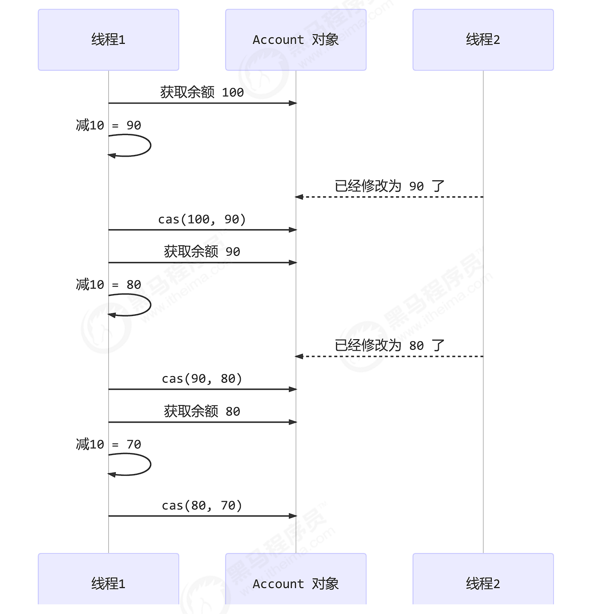


## CAS 和 volatile

获取共享变量时，为了保证该变量的可见性，需要使用 volatile 修饰。

```java
    private volatile int value;

    public final int get() {
        return value;
    }
```

> [!Important]
>
> CAS 必须借助 volatile 才能读取到共享变量的最新值来实现【比较并交换】的效果


### 无锁效率更高

- 无锁情况下，即使重试失败，线程始终在高速运行，不会阻塞，而 synchronized 会让线程在没有获得锁的时 候，发生**上下文切换**，进入**阻塞**。


- 但无锁情况下，因为线程要保持运行，需要额外 CPU 的支持，虽然不会进入阻塞，但由于没有分到时间片，仍然会进入可运行状态，还是会导致上下文切换。


> [!Caution]
>
> **高竞争情况**：CAS可能因持续重试导致CPU资源浪费，此时锁可能更合适


### CAS 特点

结合 CAS 和 volatile 可以实现无锁并发，适用于线程数少、多核 CPU 的场景下。

- CAS 是基于**乐观锁**的思想：最乐观的估计，不怕别的线程来修改共享变量，就算改了也没关系，自己再重试
- synchronized 是基于悲观锁的思想：最悲观的估计，得防着其它线程来修改共享变量


## 原子整数

> [!Note]
>
> `AtomicBoolean`
>
> `AtomicInteger`
>
> `AtomicLong`


相关API

```java
        AtomicInteger i = new AtomicInteger(0);

        // CAS操作
        i.compareAndSet(0, 1);


        i.incrementAndGet();// 自增1再获取
        i.getAndIncrement();// 获取再自增1

        // 自减1类似
        ...

        i.addAndGet(10);// 自增指定值再获取

        i.updateAndGet(x -> x * 100);// 函数式接口，更加灵活
```

> [!Tip]
>
> 这些API都是基于`compareAndSet`来实现的


## 原子引用

> [!Note]
>
> Java提供了一系列原子引用类，用于在多线程环境下安全地更新对象引用。这些类基于 **CAS（Compare-And-Swap）** 机制，保证原子性操作，避免使用锁带来的性能开销。
>
> `AtomicReference`
>
> `AtomicMarkableReference`
>
> `AtomicStampedReference`

---

Java中的原子引用类位于 `java.util.concurrent.atomic` 包，主要包括：

| 类                           | 说明                                                         |
| :--------------------------- | :----------------------------------------------------------- |
| `AtomicReference<V>`         | 普通原子引用，可原子更新对象引用                             |
| `AtomicStampedReference<V>`  | 带版本号的原子引用，解决 **ABA问题**                         |
| `AtomicMarkableReference<V>` | 带标记位的原子引用（类似 `AtomicStampedReference`，但用布尔值标记） |

---

```java
class DecimalAccount {
    private final AtomicReference<BigDecimal> balance;

    DecimalAccount(BigDecimal balance) {
        this.balance = new AtomicReference<>(balance);
    }

    public BigDecimal getBalance() {
        return balance.get();
    }

    public void withdraw(BigDecimal amount) {
        BigDecimal prev, next;
        do {
            prev = balance.get();
            next = prev.subtract(amount);
        } while (!balance.compareAndSet(prev, next));
    }
}
```


### ABA 问题

> [!Tip]
>
> ABA问题是 **CAS（Compare-And-Swap）** 操作中的一个经典并发问题，它可能导致程序逻辑错误，即使CAS操作成功，但实际数据可能已经被其他线程修改过多次。

ABA问题是指：

- 线程 **A** 读取共享变量的值为 **A**。
- 线程 **B** 在此期间修改该变量的值 **A → B → A**（即先改成B，又改回A）。
- 线程 **A** 执行CAS操作时，发现值仍然是 **A**，于是认为没有被修改过，从而CAS成功。但实际上，变量已经被修改过（B→A），可能导致逻辑错误。


**解决方案：版本号/时间戳（Stamped Reference）**

- 每次修改共享变量时，**增加一个版本号**（或时间戳）。
- CAS不仅要比较**值**，还要比较**版本号**。
- Java中的 `AtomicStampedReference` 就是基于此实现。

```java
AtomicStampedReference<Integer> atomicRef = new AtomicStampedReference<>(100, 0); // 初始值=100，版本号=0

int stampHolder = atomicRef.getStamp();
int currentValue = atomicRef.getReference; // 获取值和版本号
int newValue = currentValue + 1;
boolean success = atomicRef.compareAndSet(currentValue, newValue, stampHolder, stampHolder + 1);
```


## 原子数组

> [!Note]
>
> Java提供了一系列原子数组类，用于在多线程环境下安全地操作数组元素，而无需使用显式锁。这些类基于 **CAS（Compare-And-Swap）** 机制，保证对数组元素的原子性操作。

---

| 类                        | 说明                                 |
| :------------------------ | :----------------------------------- |
| `AtomicIntegerArray`      | 原子整型数组，可原子更新 `int[]`     |
| `AtomicLongArray`         | 原子长整型数组，可原子更新 `long[]`  |
| `AtomicReferenceArray<E>` | 原子引用数组，可原子更新对象引用数组 |

---

```java
// 初始化一个长度为 5 的原子整型数组
        AtomicIntegerArray atomicArray = new AtomicIntegerArray(5);

        // 多个线程并发修改数组
        Runnable task = () -> {
            for (int i = 0; i < atomicArray.length(); i++) {
                atomicArray.incrementAndGet(i); // 原子递增
            }
        };

        Thread thread1 = new Thread(task);
        Thread thread2 = new Thread(task);

        thread1.start();
        thread2.start();

        try {
            thread1.join();
            thread2.join();
        } catch (InterruptedException e) {
            e.printStackTrace();
        }

        // 输出最终数组
        for (int i = 0; i < atomicArray.length(); i++) {
            System.out.println("Index " + i + ": " + atomicArray.get(i));
        }
```


## 原子更新器

> [!Note]
>
> 原子更新器是Java提供的一种高效的无锁原子操作方式，它允许对 **已有的普通类** 的 `volatile` 字段进行原子更新，而无需将整个类改为原子类。适用于当某个类的某个字段需要原子操作，但又不希望使用 `AtomicInteger`、`AtomicReference` 等包装类时。

---

| 类                                 | 说明                     |
| :--------------------------------- | :----------------------- |
| `AtomicIntegerFieldUpdater<T>`     | 原子更新 `int` 类型字段  |
| `AtomicLongFieldUpdater<T>`        | 原子更新 `long` 类型字段 |
| `AtomicReferenceFieldUpdater<T,V>` | 原子更新对象引用字段     |

---

```java
class Student {
    volatile String name;

    @Override
    public String toString() {
        return "Student{" +
                "name='" + name + '\'' +
                '}';
    }
}

Student student = new Student();
student.name = "Tom";
AtomicReferenceFieldUpdater<Student, String> updater = AtomicReferenceFieldUpdater.newUpdater(Student.class, String.class, "name");
updater.compareAndSet(student, "Tom", "六六");
System.out.println(student);
```


## 原子累加器

> [!Note]
>
> 原子累加器（`LongAdder`、`DoubleAdder`）是Java 8引入的高性能原子计数器，适用于**高并发写多读少**的场景，比`AtomicLong`和`AtomicDouble`具有更高的吞吐量。

---

| 类                  | 说明                 | 适用场景     |
| :------------------ | :------------------- | :----------- |
| `LongAdder`         | 高性能`long`累加器   | 计数器、统计 |
| `DoubleAdder`       | 高性能`double`累加器 | 浮点数统计   |
| `LongAccumulator`   | 支持自定义运算规则   | 更灵活的操作 |
| `DoubleAccumulator` | 支持自定义浮点运算   | 浮点运算     |

---

```java
    static void testAtomicLong() {
        AtomicLong counter = new AtomicLong();
        long start = System.currentTimeMillis();

        IntStream.range(0, 1000).parallel().forEach(i -> {
            for (int j = 0; j < 10_000; j++) {
                counter.incrementAndGet();
            }
        });

        System.out.println("AtomicLong: " + (System.currentTimeMillis() - start) + "ms");
    }

    static void testLongAdder() {
        LongAdder adder = new LongAdder();
        long start = System.currentTimeMillis();

        IntStream.range(0, 1000).parallel().forEach(i -> {
            for (int j = 0; j < 10_000; j++) {
                adder.increment();
            }
        });

        System.out.println("LongAdder: " + (System.currentTimeMillis() - start) + "ms");
    }
```

```
AtomicLong: 209ms
LongAdder: 38ms
```


> [!Tip]
>
> 累加器原理：
>
> **1. 无竞争**：直接CAS修改`base`（类似AtomicLong）
>
> **2. 有竞争**：
>
> - 初始化`Cell[]`数组（默认CPU核数）
> - 线程**哈希映射**到不同Cell，减少冲突
> - 最终结果 = `base + ∑cells[i]`


### 伪共享

> [!Note]
>
> 伪共享是**多线程编程中的一个隐藏性能杀手**，它会导致多核CPU的缓存系统失效，严重影响并发程序的性能。理解并解决伪共享问题对编写高性能并发代码至关重要。

伪共享（False Sharing）是指：

- 多个线程**同时修改**位于**同一缓存行（Cache Line）**中的**不同变量**
- 由于CPU缓存以缓存行为单位操作，导致本无关联的变量互相影响
- 造成**不必要的缓存失效**，引发严重的性能下降

**缓存行（Cache Line）**

- CPU缓存的最小单位（通常64字节）
- 当缓存行中任一数据被修改，整个行在所有CPU核心都会失效

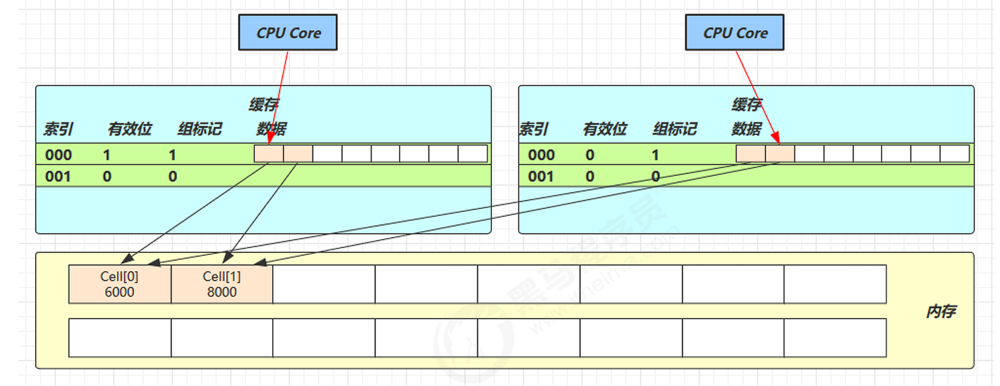


**解决方案**：

**使用`@Contended`注解（JDK8+）**

```java
class Data {
    @sun.misc.Contended  // 自动填充缓存行
    volatile long x;
    
    @sun.misc.Contended
    volatile long y;
}
```

> [!Caution]
>
> **注意**：需添加JVM参数`-XX:-RestrictContended`


## Unsafe

> [!Note]
>
> Unsafe 是 Java 中的一个特殊工具类，提供了一系列**直接操作内存、绕过JVM安全机制**的底层方法。它得名"Unsafe"正是因为它的操作**不受JVM安全管理器约束**，使用不当可能导致JVM崩溃。


### **内存操作**

- **直接内存分配/释放**

  ```java
  long address = unsafe.allocateMemory(1024); // 分配1KB堆外内存
  unsafe.setMemory(address, 1024, (byte) 0); // 内存置零
  unsafe.freeMemory(address); // 释放内存
  ```

- **内存读写**

  ```java
  unsafe.putInt(address, 123);  // 在指定地址写入int
  int value = unsafe.getInt(address); // 读取int
  ```

### **对象操作**

- **绕过构造器创建对象**

  ```java
  MyClass obj = (MyClass) unsafe.allocateInstance(MyClass.class);
  ```

- **字段偏移量操作**

  ```java
  long offset = unsafe.objectFieldOffset(MyClass.class.getDeclaredField("value"));
  unsafe.putInt(obj, offset, 100); // 直接修改字段值
  ```

### **线程调度**

- **线程挂起/恢复**

  ```java
  unsafe.park(false, 0); // 挂起当前线程
  unsafe.unpark(thread); // 恢复指定线程
  ```

- **CAS操作**

  ```java
  boolean success = unsafe.compareAndSwapInt(obj, offset, expect, update);
  ```

### **数组操作**

- **获取数组元素偏移**

  ```java
  int base = unsafe.arrayBaseOffset(int[].class);
  int scale = unsafe.arrayIndexScale(int[].class);
  ```


> [!Tip]
>
> 由于安全性考虑，Unsafe 被设计为**限制获取**：
>
> **反射获取（最常用）**
>
> ```java
> Field theUnsafe = Unsafe.class.getDeclaredField("theUnsafe");
> theUnsafe.setAccessible(true);
> Unsafe unsafe = (Unsafe) theUnsafe.get(null);
> ```
>
> **从`TrustedFinalizer`获取（JDK内部）**
>
> ```java
> // 仅供了解，实际不推荐
> Unsafe unsafe = sun.misc.Unsafe.getUnsafe();
> ```


# 共享模型-不可变


## 不可变类

> [!Note]
>
> 不可变类是**一旦创建后其状态就不能被修改**的类，这种设计在多线程环境下具有**线程安全、无需同步**等优势，是函数式编程和并发编程的重要基础。

---

一个严格的不可变类需要满足以下条件：

| 特征                 | 说明                   |
| :------------------- | :--------------------- |
| **所有字段final**    | 防止字段被重新赋值     |
| **类本身final**      | 防止子类破坏不可变性   |
| **无setter方法**     | 不提供修改状态的途径   |
| **防御性拷贝**       | 返回可变对象时创建副本 |
| **构造器完全初始化** | 对象创建后状态即确定   |

---

实现不可变类的关键技术:**防御性拷贝（Defensive Copy）**

当类包含**可变对象字段**时：

```java
public final class ImmutableData {
    private final Date createDate;

    public ImmutableData(Date date) {
        this.createDate = new Date(date.getTime()); // 拷贝而非直接引用
    }

    public Date getCreateDate() {
        return (Date) createDate.clone(); // 返回拷贝
    }
}
```


## 享元模式

> [!Note]
>
> 享元模式是一种**结构型设计模式**，它通过共享对象来最小化内存使用和提高性能，特别适合处理大量细粒度对象的情况。

---

| 核心概念                  | 说明                                        |
| :------------------------ | :------------------------------------------ |
| **内在状态（Intrinsic）** | 可共享的、不变的部分（如字符的Unicode值）   |
| **外在状态（Extrinsic）** | 不可共享的、变化的部分（如字符的位置/颜色） |
| **享元工厂**              | 管理共享对象的创建和复用                    |

---

### 连接池

```java
// 模拟连接池
class Pool {
    private final int SIZE;

    private final Connection[] connections;

    private final AtomicIntegerArray states;

    public Pool(int SIZE) {
        this.SIZE = SIZE;
        connections = new Connection[SIZE];
        states = new AtomicIntegerArray(new int[SIZE]);
        for (int i = 0; i < SIZE; i++) {
            connections[i] = new MockConnection();
            states.set(i, 0);
        }
    }

    public Connection getConnection() {
        while (true) {
            for (int i = 0; i < SIZE; i++) {
                if (states.get(i) == 0 && states.compareAndSet(i, 0, 1)) {
                    log.info("获取连接: {}", i);
                    return connections[i];
                }
            }
            // 无可用连接，等待
            synchronized (this) {
                try {
                    log.info("{}-->无可用连接，等待", Thread.currentThread().getName());
                    this.wait();
                } catch (InterruptedException e) {
                    throw new RuntimeException(e);
                }
            }
        }
    }

    public void releaseConnection(Connection connection) {
        for (int i = 0; i < SIZE; i++) {
            if (connections[i] == connection) {
                log.info("释放连接: {}", i);
                states.set(i, 0);
                synchronized (this) {
                    this.notifyAll();
                }
                break;
            }
        }
    }

}
```


# 共享模型-工具

## 线程池

### 自定义线程池

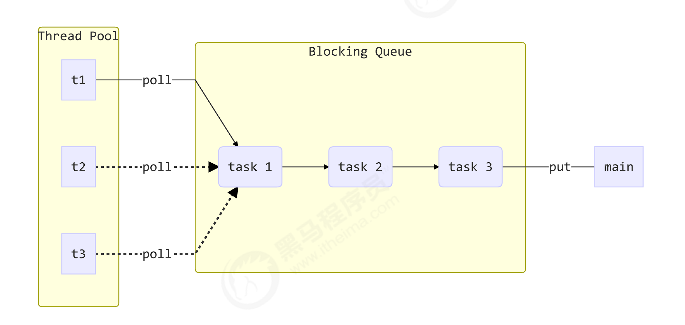

demo

```java
        ThreadPool threadPoolExecutor = ThreadPool.builder()
                .coreSize(2)
                .timeout(10, TimeUnit.SECONDS)
                .capacity(10)
                .rejectPolicy((queue, task) -> {
                    log.info("任务 {} 被拒绝", task);
                }).build();

        for (int i = 0; i < 15; i++) {
            int k = i;
            threadPoolExecutor.execute(() -> {
                try {
                    Thread.sleep(1000);
                } catch (InterruptedException e) {
                    throw new RuntimeException(e);
                }
                log.info("执行任务 {}", k);
            });
        }
```


#### 拒绝策略（函数式接口）

```java
/**
 * 拒绝策略接口
 *
 * @param <T>
 */
@FunctionalInterface
interface RejectPolicy<T> {
    void reject(BlockingQueue<T> queue, T task);
}
```


#### 阻塞式任务队列

```java
@Slf4j
class BlockingQueue<T> {
    /**
     * 任务队列
     */
    private final Deque<T> queue = new ArrayDeque<>();

    /**
     * 队列锁
     */
    public ReentrantLock lock = new ReentrantLock();

    /**
     * 生产者条件变量
     */
    private final Condition fullWaitSet = lock.newCondition();

    /**
     * 消费者条件变量
     */
    private final Condition emptyWaitSet = lock.newCondition();

    /**
     * 队列容量
     */
    private final int capacity;

    public BlockingQueue(int capacity) {
        this.capacity = capacity;
    }

    /**
     * 阻塞超时获取
     */
    public T poll(long timeout, TimeUnit unit) {
        lock.lock();
        try {
            long nanos = unit.toNanos(timeout);
            while (queue.isEmpty()) {
                try {
                    // 超时返回
                    if (nanos <= 0) {
                        return null;
                    }
                    // awaitNanos 返回剩余时间
                    nanos = emptyWaitSet.awaitNanos(nanos);
                } catch (InterruptedException e) {
                    throw new RuntimeException(e);
                }
            }
            fullWaitSet.signal();
            log.info("取出任务 {}", queue.peek());
            return queue.removeFirst();
        } finally {
            lock.unlock();
        }
    }

    /**
     * 阻塞获取
     */
    public T take() {
        lock.lock();
        try {
            while (queue.isEmpty()) {
                try {
                    emptyWaitSet.await();
                } catch (InterruptedException e) {
                    throw new RuntimeException(e);
                }
            }
            fullWaitSet.signal();
            log.info("取出任务 {}", queue.peek());
            return queue.removeFirst();
        } finally {
            lock.unlock();
        }
    }

    /**
     * 尝试添加任务
     *
     * @param rejectPolicy 拒绝策略
     * @param task         任务
     */
    public void tryPut(RejectPolicy<T> rejectPolicy, T task) {
        lock.lock();
        try {
            if (queue.size() == capacity) {
                rejectPolicy.reject(this, task);
            } else {
                queue.addLast(task);
                emptyWaitSet.signal();
            }
        } finally {
            lock.unlock();
        }
    }

    /**
     * 阻塞添加
     */
    public void put(T task) {
        lock.lock();
        try {
            while (queue.size() == capacity) {
                try {
                    log.info("队列已满，等待消费者消费");
                    fullWaitSet.await();
                } catch (InterruptedException e) {
                    throw new RuntimeException(e);
                }
            }
            log.info("添加任务 {}", task);
            queue.addLast(task);
            emptyWaitSet.signal();
        } finally {
            lock.unlock();
        }
    }

    /**
     * 超时阻塞添加
     *
     * @return true 成功 false 超时失败
     */
    public boolean offer(T task, long timeout, TimeUnit unit) {
        lock.lock();
        try {
            long nanos = unit.toNanos(timeout);
            while (queue.size() == capacity) {
                try {
                    log.info("队列已满，等待消费者消费");
                    if (nanos <= 0) {
                        log.info("添加任务超时");
                        return false;
                    }
                    nanos = fullWaitSet.awaitNanos(nanos);
                } catch (InterruptedException e) {
                    throw new RuntimeException(e);
                }
            }
            log.info("添加任务 {}", task);
            queue.addLast(task);
            emptyWaitSet.signal();
            return true;
        } finally {
            lock.unlock();
        }
    }

    public int size() {
        lock.lock();
        try {
            return queue.size();
        } finally {
            lock.unlock();
        }
    }
}
```


#### 线程池

```java
@Slf4j
class ThreadPool {
    /**
     * 任务队列
     */
    private final BlockingQueue<Runnable> taskQueue;

    /**
     * 执行线程队列
     */
    private final HashSet<Worker> workers = new HashSet<>();

    /**
     * 核心线程数
     */
    private final int coreSize;

    /**
     * 超时时间
     */
    private final long timeout;

    /**
     * 超时时间单位
     */
    private final TimeUnit unit;

    /**
     * 拒绝策略
     */
    private final RejectPolicy<Runnable> rejectPolicy;

    private ThreadPool(Builder builder) {
        this.coreSize = builder.coreSize;
        this.timeout = builder.timeout;
        this.unit = builder.unit;
        this.rejectPolicy = builder.rejectPolicy;
        this.taskQueue = new BlockingQueue<>(builder.capacity);
    }

    public static Builder builder() {
        return new Builder();
    }

    /**
     * Builder构建器
     */
    public static class Builder {
        private int coreSize = 5; // 默认核心线程数
        private long timeout = 5; // 默认超时时间
        private TimeUnit unit = TimeUnit.SECONDS; // 默认时间单位
        private RejectPolicy<Runnable> rejectPolicy = (queue, task) -> {
            log.info("任务 {} 被拒绝", task);
        }; // 默认拒绝策略
        private int capacity = 100; // 默认任务队列容量

        public Builder coreSize(int coreSize) {
            this.coreSize = coreSize;
            return this;
        }

        public Builder timeout(long timeout, TimeUnit unit) {
            this.timeout = timeout;
            this.unit = unit;
            return this;
        }
        
        public Builder rejectPolicy(RejectPolicy<Runnable> rejectPolicy) {
            this.rejectPolicy = rejectPolicy;
            return this;
        }

        public Builder capacity(int capacity) {
            this.capacity = capacity;
            return this;
        }

        public ThreadPool build() {
            return new ThreadPool(this);
        }
    }

    /**
     * 执行任务
     *
     * @param task 任务
     */
    public synchronized void execute(Runnable task) {
        if (workers.size() < coreSize) {
            Worker worker = new Worker(task);
            synchronized (workers) {
                workers.add(worker);
            }
            worker.start();
        } else {
            // 队列已满，尝试拒绝策略
            taskQueue.tryPut(rejectPolicy, task);
        }
    }

    /**
     * 工作线程
     */
    class Worker extends Thread {
        private Runnable task;

        public Worker(Runnable task) {
            this.task = task;
        }

        @SneakyThrows
        @Override
        public void run() {
            while (task != null || (task = taskQueue.poll(timeout, unit)) != null) {
                try {
                    task.run();
                } catch (Exception e) {
                    e.printStackTrace();
                } finally {
                    task = null;
                }
            }
            synchronized (workers) {
                log.info("移除线程 {}", this);
                workers.remove(this);
            }
        }
    }
}
```


### ThreadPoolExecutor

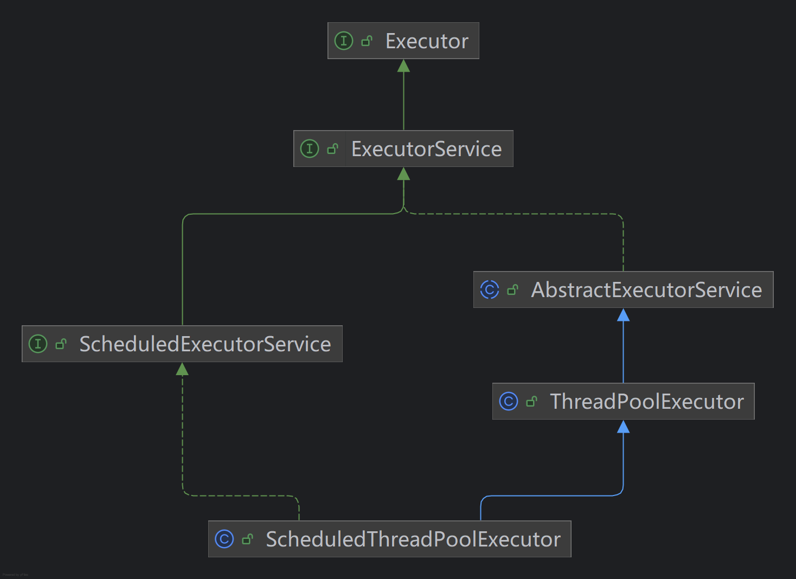

#### 线程状态

`ThreadPoolExecutor` 使用 int 的高 3 位来表示线程池状态，低 29 位表示线程数量

---

| 状态           | 高3位 | 说明                                                         | 影响                                       |
| :------------- | :---- | :----------------------------------------------------------- | :----------------------------------------- |
| **RUNNING**    | 111   | 线程池正常运行状态，可以接收新任务并处理队列中的任务         | 新任务会被接受并执行                       |
| **SHUTDOWN**   | 000   | 关闭状态，不再接收新任务，但会处理队列中已存在的任务         | 新任务被拒绝，队列任务继续执行             |
| **STOP**       | 001   | 停止状态，不再接收新任务，也不处理队列中的任务，并中断正在执行的任务 | 新任务被拒绝，队列任务不执行，中断工作线程 |
| **TIDYING**    | 010   | 整理状态，所有任务已终止，workerCount=0，将执行terminated()钩子方法 | 过渡状态，即将变为TERMINATED               |
| **TERMINATED** | 011   | 终止状态，terminated()方法已完成                             | 线程池完全结束                             |

---


这些信息存储在一个原子变量 ctl 中，目的是将线程池状态与线程个数合二为一，这样就可以用一次 cas 原子操作 进行赋值

```java
    // c 为旧值， ctlOf 返回结果为新值
    ctl.compareAndSet(c, ctlOf(targetState, workerCountOf(c))));
    // rs 为高 3 位代表线程池状态， wc 为低 29 位代表线程个数，ctl 是合并它们
    private static int ctlOf(int rs, int wc) { return rs | wc; }
```


#### 构造方法

```java
    public ThreadPoolExecutor(int corePoolSize,
                              int maximumPoolSize,
                              long keepAliveTime,
                              TimeUnit unit,
                              BlockingQueue<Runnable> workQueue,
                              RejectedExecutionHandler handler)
```

- `corePoolSize` 核心线程数目 (最多保留的线程数) 
- `maximumPoolSize` 最大线程数目 
- `keepAliveTime` 生存时间 - 针对救急线程 
- `unit` 时间单位 - 针对救急线程 
- `workQueue` 阻塞队列 
- `threadFactory` 线程工厂 - 可以为线程创建时起个好名字 
- `handler` 拒绝策略


---

**核心线程 vs 救急线程**

| 特性               | 核心线程 (Core Threads)                 | 救急线程 (救急线程/非核心线程)         |
| :----------------- | :-------------------------------------- | :------------------------------------- |
| **创建时机**       | 线程池初始化时预创建或按需创建          | 当任务数 > (核心线程数+队列容量)时创建 |
| **数量控制**       | 由`corePoolSize`参数决定                | 由`maximumPoolSize - corePoolSize`决定 |
| **存活时间**       | 默认长期存活(即使空闲)                  | 空闲超过`keepAliveTime`后被回收        |
| **回收策略**       | `allowCoreThreadTimeOut=true`时可被回收 | 总是可被回收                           |
| **任务处理优先级** | 优先使用核心线程处理任务                | 队列满且核心线程忙时才会使用           |
| **典型应用场景**   | 维持基本并发能力                        | 应对突发流量                           |

```
新任务到达时:
1. 优先使用核心线程处理
   ↓ (核心线程全忙)
2. 任务进入工作队列
   ↓ (队列已满)
3. 创建救急线程处理
   ↓ (达到maximumPoolSize)
4. 触发拒绝策略
```

---


#### 拒绝策略

| 策略名称                | 对应类                | 行为描述                                       | 适用场景                                   |
| :---------------------- | :-------------------- | :--------------------------------------------- | :----------------------------------------- |
| **AbortPolicy**         | `AbortPolicy`         | 直接抛出RejectedExecutionException异常         | 需要明确知道任务被拒绝的场景（默认策略）   |
| **CallerRunsPolicy**    | `CallerRunsPolicy`    | 由调用者线程直接执行被拒绝的任务               | 不希望丢失任务且可以接受任务执行变慢的场景 |
| **DiscardPolicy**       | `DiscardPolicy`       | 静默丢弃被拒绝的任务，不抛出异常也不执行       | 允许丢弃部分任务的场景                     |
| **DiscardOldestPolicy** | `DiscardOldestPolicy` | 丢弃队列中最旧的任务，然后尝试重新提交当前任务 | 允许丢弃旧任务，希望尽量执行新任务的场景   |


#### Executors工厂方法

##### newFixedThreadPool

```java
    public static ExecutorService newFixedThreadPool(int nThreads) {
        return new ThreadPoolExecutor(nThreads, nThreads,
                                      0L, TimeUnit.MILLISECONDS,
                                      new LinkedBlockingQueue<Runnable>());
    }
```

> [!Note]
>
> - **特点**：
>   - 固定线程数（核心线程=最大线程）
>   - 无界任务队列（`LinkedBlockingQueue`）
>   - 适合**稳定负载**场景
> - **注意事项**：
>   - 任务堆积可能导致OOM


##### newCachedThreadPool

```java
    public static ExecutorService newCachedThreadPool() {
        return new ThreadPoolExecutor(0, Integer.MAX_VALUE,
                                      60L, TimeUnit.SECONDS,
                                      new SynchronousQueue<Runnable>());
    }
```

> [!note]
>
> - **特点**：
>   - 线程数无上限（`Integer.MAX_VALUE`）
>   - 空闲线程60秒后回收
>   - 适合大量**短生命周期**的异步任务
> - **风险**：
>   - 可能创建过多线程导致OOM


##### newSingleThreadExecutor

```java
    public static ExecutorService newSingleThreadExecutor(ThreadFactory threadFactory) {
        return new FinalizableDelegatedExecutorService
            (new ThreadPoolExecutor(1, 1,
                                    0L, TimeUnit.MILLISECONDS,
                                    new LinkedBlockingQueue<Runnable>(),
                                    threadFactory));
    }
```

> [!Note]
>
> - **特点**：
>   - 保证任务顺序执行（FIFO）
>   - 适用于需要**严格串行化**的场景

> [!Warning]
>
> - 自己创建一个单线程串行执行任务，如果任务执行失败而终止那么没有任何补救措施，而线程池还会新建一 个线程，保证池的正常工作 
> - Executors.newSingleThreadExecutor() 线程个数始终为1，不能修改 
>   - FinalizableDelegatedExecutorService 应用的是装饰器模式，只对外暴露了 ExecutorService 接口，因 此不能调用 ThreadPoolExecutor 中特有的方法 
> - Executors.newFixedThreadPool(1) 初始时为1，以后还可以修改 
>   - 对外暴露的是 ThreadPoolExecutor 对象，可以强转后调用 setCorePoolSize 等方法进行修改


#### 提交任务

```java
    // 执行任务
    void execute(Runnable command);

    // 提交任务 task，用返回值 Future 获得任务执行结果
    <T> Future<T> submit(Callable<T> task);

    // 提交 tasks 中所有任务
    <T> List<Future<T>> invokeAll(Collection<? extends Callable<T>> tasks) throws InterruptedException;

    // 提交 tasks 中所有任务，带超时时间
    <T> List<Future<T>> invokeAll(Collection<? extends Callable<T>> tasks,long timeout, TimeUnit unit)
            throws InterruptedException;

    // 提交 tasks 中所有任务，哪个任务先成功执行完毕，返回此任务执行结果，其它任务取消
    <T> T invokeAny(Collection<? extends Callable<T>> tasks)
            throws InterruptedException, ExecutionException;

    // 提交 tasks 中所有任务，哪个任务先成功执行完毕，返回此任务执行结果，其它任务取消，带超时时间
    <T> T invokeAny(Collection<? extends Callable<T>> tasks,long timeout, TimeUnit unit)
            throws InterruptedException, ExecutionException, TimeoutException;
```

---

| 方法               | 返回值          | 是否阻塞 | 异常处理   | 适用场景      |
| :----------------- | :-------------- | :------- | :--------- | :------------ |
| `execute()`        | void            | 否       | 控制台打印 | 简单异步任务  |
| `submit(Runnable)` | Future<?>       | 否       | Future获取 | 需要任务状态  |
| `submit(Callable)` | Future<T>       | 否       | Future获取 | 需要返回结果  |
| `invokeAll()`      | List<Future<T>> | 是       | Future获取 | 批量并行任务  |
| `invokeAny()`      | T               | 是       | 直接抛出   | 获取最快结果  |
| `schedule()`       | ScheduledFuture | 否       | Future获取 | 延迟/定时任务 |

---

##### **1. `execute(Runnable)` - 基础提交**

**特点**：

- 提交`Runnable`任务
- 无返回值
- 任务异常会打印到控制台但不会抛出

**适用场景**：

- 不需要获取执行结果的简单任务
- 日志记录、异步通知等


##### **2. `submit(Runnable)` - 提交可获取状态的任务**

**特点**：

- 返回`Future<?>`对象
- 可以通过`Future.get()`判断任务是否完成
- 任务异常会被封装在`Future`中

**适用场景**：

- 需要知道任务是否执行完成
- 不需要返回结果但需要异常处理


##### **3. `submit(Callable<T>)` - 提交有返回值的任务**

**特点**：

- 提交`Callable`任务
- 返回`Future<T>`可获取计算结果
- 任务异常可通过`Future.get()`捕获

**适用场景**：

- 需要获取异步计算结果
- 并行计算、远程调用等


##### **4. `invokeAll()` - 批量提交并等待所有任务完成**

**特点**：

- 提交`Callable`任务集合
- 返回`List<Future<T>>`
- 阻塞直到所有任务完成

**适用场景**：

- 并行处理多个任务并收集所有结果
- 分布式计算聚合


##### **5. `invokeAny()` - 提交多个任务获取首个完成结果**

**特点**：

- 提交`Callable`任务集合
- 返回首个完成的任务结果
- 其他未完成任务会被取消

**适用场景**：

- 多个服务提供相同功能时获取最快响应
- 竞速查询（如多数据源查询）


#### 关闭线程池

---

| 方法                     | 说明     | 行为特点                                       |
| :----------------------- | :------- | :--------------------------------------------- |
| **`shutdown()`**         | 平缓关闭 | 停止接收新任务，已提交任务继续执行             |
| **`shutdownNow()`**      | 立即关闭 | 尝试停止所有正在执行的任务，返回未执行任务列表 |
| **`awaitTermination()`** | 等待终止 | 主线程阻塞直到所有任务完成或超时               |

---


### 工作线程模式

#### 定义

让有限的工作线程（Worker Thread）来轮流异步处理无限多的任务。

工作线程模式（也称为**线程池模式**）是一种并发设计模式，它通过维护一组预先创建的线程来执行任务，避免了频繁创建和销毁线程的开销，是Java并发编程的核心模式之一。


#### 饥饿

线程饥饿是指**某些任务因长期无法获取执行资源而延迟执行**的现象

固定线程池大小容易发生

- 嵌套提交任务
- 长任务阻塞短任务
- 不公平的任务调度


示例：

```java
ExecutorService executor = Executors.newFixedThreadPool(1); // 单线程池

executor.execute(() -> {
    Future<String> future = executor.submit(() -> "result"); // 嵌套提交任务
    try {
        future.get(); // 阻塞等待
    } catch (Exception e) {
        e.printStackTrace();
    }
});
```

> [!Caution]
>
> 避免嵌套提交，不同的任务使用不同线程池
>
> ```java
> // 使用不同的线程池
> ExecutorService executor1 = Executors.newFixedThreadPool(1);
> ExecutorService executor2 = Executors.newFixedThreadPool(1);
> 
> executor1.execute(() -> {
>     Future<String> future = executor2.submit(() -> "result");
>     future.get(); // 不会饥饿
> });
> ```


#### 合适的线程池大小

**CPU密集型任务**

- **特点**：大量计算，很少I/O等待（如数学运算、视频编码）

- **公式**：

  ```
  线程数 = CPU核心数 + 1
  ```

  （+1是为了防止线程意外暂停时能利用空闲CPU）


**I/O密集型任务**

- **特点**：大量等待时间（如数据库查询、HTTP请求）

- **公式**：

  ```
  线程数 = CPU核心数 × (1 + 平均等待时间/平均计算时间)
  ```

  经验值通常为：

  ```
  线程数 = CPU核心数 × 2 ~ 5
  ```


### 任务调度线程池

> [!Note]
>
> 在『任务调度线程池』功能加入之前，可以使用 `java.util.Timer` 来实现定时功能，Timer 的优点在于简单易用，但由于所有任务都是由同一个线程来调度，因此所有任务都是串行执行的，同一时间只能有一个任务在执行，前一个任务的延迟或异常都将会影响到之后的任务。


```java
        ScheduledExecutorService pool = Executors.newScheduledThreadPool(3);

        // 延时执行
        log.info("task start");
        pool.schedule(() -> {
            log.info("running...");
        }, 1000, TimeUnit.MILLISECONDS);

        // 定时执行
        pool.scheduleAtFixedRate(() -> {
            log.info("running...");
        },0, 1, TimeUnit.SECONDS);
        
        // 任务结束后才开始计算延迟时间
        pool.scheduleWithFixedDelay(() -> {
            log.info("running...");
        },0, 1, TimeUnit.SECONDS);
```


### 线程池异常处理

> [!Caution]
>
> 线程池中的任务默认不处理异常，需要自己处理

- **直接在任务内部 try-catch**

```java
executor.scheduleAtFixedRate(() -> {
    try {
        // 业务代码
        log.info("Running...");
    } catch (Exception e) {
        log.error("Task failed", e); // 明确捕获并记录异常
    }
}, 0, 1, TimeUnit.SECONDS);

```

- **通过 `Future` 获取异常（适用于一次性任务）**

```java
Future<?> future = executor.submit(() -> {
    // 可能抛出异常的任务
});
try {
    future.get(); // 会抛出 ExecutionException（包装实际异常）
} catch (ExecutionException e) {
    Throwable realException = e.getCause(); // 获取原始异常
    log.error("Task failed", realException);
}
```

- **自定义线程池的 `UncaughtExceptionHandler`**

```java
ThreadFactory factory = r -> {
    Thread thread = new Thread(r);
    thread.setUncaughtExceptionHandler((t, e) -> {
        log.error("Thread {} crashed", t.getName(), e);
    });
    return thread;
};

ExecutorService executor = Executors.newScheduledThreadPool(2, factory);

```


### Tomcat线程池

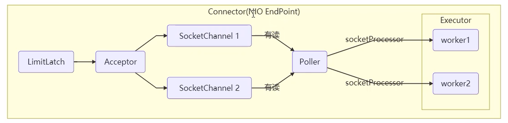

- LimitLatch 用来限流，可以控制最大连接个数，类似 J.U.C 中的  Semaphore 
- Acceptor 只负责【接收新的 socket 连接】 
- Poller 只负责监听 socket channel 是否有【可读的 I/O 事件】 一旦可读，封装一个任务对象（socketProcessor），提交给 Executor 线程池处理 
- Executor 线程池中的工作线程最终负责【处理请求】


---

Connector 配置

| 配置项              | 默认值 | 说明                                   |
| ------------------- | ------ | -------------------------------------- |
| acceptorThreadCount | 1      | acceptor 线程数量                      |
| pollerThreadCount   | 1      | poller 线程数量                        |
| minSpareThreads     | 10     | 核心线程数，即 corePoolSize            |
| maxThreads          | 200    | 最大线程数，即 maximumPoolSize         |
| executor            | -      | Executor 名称，用来引用下面的 Executor |

---

 Executor 线程配置

| **配置项**              | **默认值**        | **说明**                                  |
| ----------------------- | ----------------- | ----------------------------------------- |
| threadPriority          | 5                 | 线程优先级                                |
| daemon                  | true              | 是否守护线程                              |
| minSpareThreads         | 25                | 核心线程数，即 corePoolSize               |
| maxThreads              | 200               | 最大线程数，即 maximumPoolSize            |
| maxIdleTime             | 60000             | 线程生存时间，单位是毫秒，默认值即 1 分钟 |
| maxQueueSize            | Integer.MAX_VALUE | 队列长度                                  |
| prestartminSpareThreads | false             | 核心线程是否在服务器启动时启动            |

---


### ForkJoin线程池

Fork/Join 是 JDK 1.7 加入的新的线程池实现，它体现的是一种**分治**思想，适用于能够进行**任务拆分的 cpu 密集型运算** 

所谓的任务拆分，是将一个大任务拆分为算法上相同的小任务，直至不能拆分可以直接求解。跟递归相关的一些计 算，如归并排序、斐波那契数列、都可以用分治思想进行求解 

Fork/Join 在分治的基础上加入了多线程，可以把每个任务的分解和合并交给不同的线程来完成，进一步提升了运算效率 

Fork/Join 默认会创建与 cpu 核心数大小相同的线程池

```java
        // 创建ForkJoinPool线程池
        ForkJoinPool pool = new ForkJoinPool();
        // 提交AddTask任务到线程池，n初始值为10
        ForkJoinTask<Integer> submit = pool.submit(new AddTask(10));
        // 获取任务执行结果并打印
        log.debug("submit() {}", submit.get());


@Slf4j
// AddTask继承RecursiveTask<Integer>，表示这是一个可以递归分解的任务，返回Integer类型结果
class AddTask extends RecursiveTask<Integer> {
    int n;  // 任务处理的数值

    public AddTask(int n) {
        this.n = n;
    }

    @Override
    public String toString() {
        return "{" + n + '}';  // 方便打印任务信息
    }

    @Override
    protected Integer compute() {
        // 基准条件：如果n已经为1，直接返回1
        if (n == 1) {
            log.debug("join() {}", n);
            return n;
        }
        // 递归条件：将任务拆分为更小的子任务
        AddTask t1 = new AddTask(n - 1);  // 创建处理n-1的子任务
        t1.fork();  // 异步执行子任务
        log.debug("fork() {} + {}", n, t1);
        // 合并子任务的结果：当前n的值加上子任务的结果
        int result = n + t1.join();  // 等待子任务完成并获取结果
        log.debug("join() {} + {} = {}", n, t1, result);
        return result;
    }
}
```


## JUC

### AQS原理

全称 AbstractQueuedSynchronizer，是阻塞式锁和相关的同步器工具的框架

特点： 

- 用 state 属性来表示资源的状态（分独占模式和共享模式），子类需要定义如何维护这个状态，控制如何获取 锁和释放锁 
  - getState - 获取 state 状态 
  - setState - 设置 state 状态 
  - compareAndSetState - cas 机制设置 state 状态 
  - 独占模式是只有一个线程能够访问资源，而共享模式可以允许多个线程访问资源 
- 提供了基于 FIFO 的等待队列，类似于 Monitor 的 EntryList 
- 条件变量来实现等待、唤醒机制，支持多个条件变量，类似于 Monitor 的 WaitSet


子类主要实现如下方法（默认抛出 UnsupportedOperationException） 

- `tryAcquire`
- `tryRelease` 
- `tryAcquireShared` 
- `tryReleaseShared`
- `isHeldExclusively`


自定义锁demo

```java
class MyLock implements Lock {

    // 同步器类
    static class MySync extends AbstractQueuedSynchronizer {
        @Override
        protected boolean tryAcquire(int arg) {
            if (compareAndSetState(arg, arg + 1)) {
                // 获取锁成功，设置独占线程
                setExclusiveOwnerThread(Thread.currentThread());
                return true;
            }
            return false;
        }

        @Override
        protected boolean tryRelease(int arg) {
            // 释放锁，将状态设置为0，并将独占线程设置为null
            setExclusiveOwnerThread(null);
            setState(arg - 1); // volatile 变量，保证线程间可见性
            return true;
        }

        @Override
        protected boolean isHeldExclusively() {
            return getState() == 1;
        }

        public Condition newCondition() {
            return new ConditionObject();
        }
    }

    private final MySync sync = new MySync();

    private volatile int state = 0;


    // 加锁
    @Override
    public void lock() {
        sync.acquire(state);
    }

    // 可打断加锁
    @Override
    public void lockInterruptibly() throws InterruptedException {
        sync.acquireInterruptibly(state);
    }

    @Override
    public boolean tryLock() {
        return sync.tryAcquire(state);
    }

    // 带超时加锁
    @Override
    public boolean tryLock(long time, TimeUnit unit) throws InterruptedException {
        return sync.tryAcquireNanos(state, unit.toNanos(time));
    }

    // 解锁
    @Override
    public void unlock() {
        sync.release(state);
    }

    // 条件变量
    @Override
    public Condition newCondition() {
        return sync.newCondition();
    }
}
```


### 读写锁

#### ReentrantReadWriteLock

当读操作远远高于写操作时，这时候使用读写锁 让 **读-读** 可以并发，提高性能，这种锁机制适用于读多写少的场景，可以提高并发性能。


```java
class DataContainer {
    Object data = new Object();
    private final ReentrantReadWriteLock lock = new ReentrantReadWriteLock();
    private final ReentrantReadWriteLock.ReadLock readLock = lock.readLock();
    private final ReentrantReadWriteLock.WriteLock writeLock = lock.writeLock();

    public Object read() throws InterruptedException {
        log.info("尝试获取读取锁");
        readLock.lock();
        try {
            log.info("获取读锁成功");
            Thread.sleep(1000);
            return data;
        } finally {
            log.info("释放读锁");
            readLock.unlock();
        }
    }

    public void write(Object data) {
        log.info("尝试获取写锁");
        writeLock.lock();
        try {
            log.info("获取写锁成功");
            this.data = data;
        } finally {
            log.info("释放写锁");
            writeLock.unlock();
        }
    }
}
```

> [!Note]
>
> - 读锁不支持条件变量
> - 重入时升级不支持：即持有读锁的情况下去获取写锁，会导致获取写锁永久等待
> - 重入时降级支持：即持有写锁的情况下去获取读锁


#### StampedLock

> [!Note]
>
> **应用场景**
>
> - 高并发读多写少的场景。
>
> - 对性能要求较高的场景。
> - 需要乐观读锁的场景。


它是一种改进的读写锁，提供了更高的性能和更灵活的功能，尤其是在读多写少的场景下，性能优于 `ReentrantReadWriteLock`。


```java
public class StampedLockExample {
    private final StampedLock stampedLock = new StampedLock();
    private int sharedData = 0;

    public void writeData(int data) {
        long stamp = stampedLock.writeLock(); // 获取写锁
        try {
            sharedData = data;
            System.out.println("Write data: " + sharedData);
        } finally {
            stampedLock.unlockWrite(stamp); // 释放写锁
        }
}
    
    
public void readData() {
    long stamp = stampedLock.readLock(); // 获取悲观读锁
    try {
        System.out.println("Read data: " + sharedData);
    } finally {
        stampedLock.unlockRead(stamp); // 释放读锁
    }
}
    
public void optimisticReadData() {
    long stamp = stampedLock.tryOptimisticRead(); // 尝试获取乐观读锁
    int data = sharedData; // 读取数据
    if (!stampedLock.validate(stamp)) { // 验证乐观读锁是否有效
        stamp = stampedLock.readLock(); // 如果无效，降级为悲观读锁
        try {
            data = sharedData; // 再次读取数据
        } finally {
            stampedLock.unlockRead(stamp); // 释放悲观读锁
        }
    }
    System.out.println("Optimistic read data: " + data);
}
```


**注意事项**

1. **不可重入**：`StampedLock` 是不可重入的，同一个线程如果多次获取锁，可能会导致死锁。
2. **锁的释放**：必须通过 `unlockRead` 或 `unlockWrite` 方法释放锁，否则会导致死锁。
3. **乐观读锁的验证**：使用乐观读锁时，必须通过 `validate` 方法验证锁的有效性，否则可能导致数据不一致。
4. **锁的转换**：锁的转换需要小心处理，避免死锁或资源泄漏。


### Semaphore

`Semaphore`（信号量）是 Java 并发包 (`java.util.concurrent`) 中的一个重要工具类，用于**控制对共享资源的并发访问数量**。它基于经典的 Dijkstra 信号量概念实现，是一种计数信号量。


核心方法

```java
Semaphore(int permits)  // 创建非公平信号量
Semaphore(int permits, boolean fair)  // 创建公平/非公平信号量

void acquire()  // 获取1个许可证，阻塞直到获取成功
void acquire(int permits)  // 获取指定数量的许可证
void release()  // 释放1个许可证
void release(int permits)  // 释放指定数量的许可证

boolean tryAcquire()  // 尝试获取1个许可证，立即返回结果
boolean tryAcquire(long timeout, TimeUnit unit)  // 超时尝试获取
boolean tryAcquire(int permits)  // 尝试获取多个许可证
int availablePermits()  // 返回当前可用许可证数量
void drainPermits()  // 获取并返回所有立即可用的许可证
```


示例

```java
        // 创建一个信号量，初始值为3
        Semaphore semaphore = new Semaphore(3);
        for (int i = 0; i < 10; i++) {
            new Thread(() -> {
                try {
                    semaphore.acquire();
                    log.info("成功获得信号量");
                    Thread.sleep(1000);
                } catch (InterruptedException e) {
                    throw new RuntimeException(e);
                } finally {
                    semaphore.release();
                }
            }).start();
        }
```


**应用场景**

1. 资源池管理（如数据库连接池）
2. 限流控制（限制并发请求数），仅限单机模式


**原理**：计数器限制资源访问数

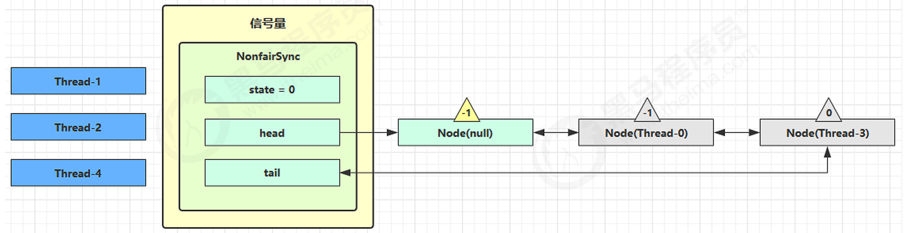


### CountDownLatch

`CountDownLatch` 是 Java 并发编程中简单高效的同步工具，特别适合"主线程等待多个子线程完成"的场景。


**核心方法**

```java
CountDownLatch(int count)  // 初始化计数器值

void await()  // 阻塞当前线程直到计数器归零
boolean await(long timeout, TimeUnit unit)  // 带超时的等待
void countDown()  // 计数器减1
long getCount()  // 获取当前计数值
```


**注意事项**

- **不可重置**：计数器归零后无法重复使用
- **等待机制**：支持多个线程等待同一个事件
- **计数递减**：只能减少计数，不能增加
- **线程协作**：协调多个线程的执行顺序


主线程等待其他线程结束

```java
        CountDownLatch latch = new CountDownLatch(10);

        for (int i = 0; i < 10; i++) {
            new Thread(() -> {
                System.out.println(Thread.currentThread().getName() + " is running");
                try {
                    latch.countDown();
                    Thread.sleep(1000);
                } catch (InterruptedException e) {
                    e.printStackTrace();
                }
            }).start();
        }
        latch.await();
```

> [!Tip]
>
> 同样可以使用join()来实现，不过CountDownLatch是封装过的API，使用更方便


### CyclicBarrier

- **循环屏障**：可重复使用的同步屏障
- **核心思想**：一组线程相互等待，直到所有线程都到达屏障点
- **可重用性**：与 `CountDownLatch` 不同，`CyclicBarrier` 可重复使用（屏障被触发后自动重置，可再次使用）
- **可选回调**：可以设置屏障触发时的回调动作（由最后一个到达屏障的线程执行）


**核心方法**

```java
CyclicBarrier(int parties)  // 创建屏障，指定参与线程数
CyclicBarrier(int parties, Runnable barrierAction)  // 创建带回调的屏障
    
int await()  // 等待所有线程到达屏障
int await(long timeout, TimeUnit unit)  // 带超时的等待
void reset()  // 重置屏障
int getParties()  // 获取参与线程数
int getNumberWaiting()  // 获取当前等待的线程数
boolean isBroken()  // 检查屏障是否被破坏
```


示例

```java
public class CyclicBarrierDemo {
    private static final int THREAD_COUNT = 3;
    private static final CyclicBarrier barrier = new CyclicBarrier(THREAD_COUNT, 
        () -> System.out.println("所有线程已到达屏障，继续执行"));

    public static void main(String[] args) {
        ExecutorService executor = Executors.newFixedThreadPool(THREAD_COUNT);
        
        for (int i = 0; i < THREAD_COUNT; i++) {
            final int threadNum = i;
            executor.execute(() -> {
                try {
                    System.out.println("线程" + threadNum + "开始工作");
                    Thread.sleep((long) (Math.random() * 2000)); // 模拟工作耗时
                    System.out.println("线程" + threadNum + "到达屏障，等待其他线程");
                    barrier.await();
                    System.out.println("线程" + threadNum + "继续执行");
                } catch (Exception e) {
                    e.printStackTrace();
                }
            });
        }
        executor.shutdown();
    }
}
```


### 线程安全集合类

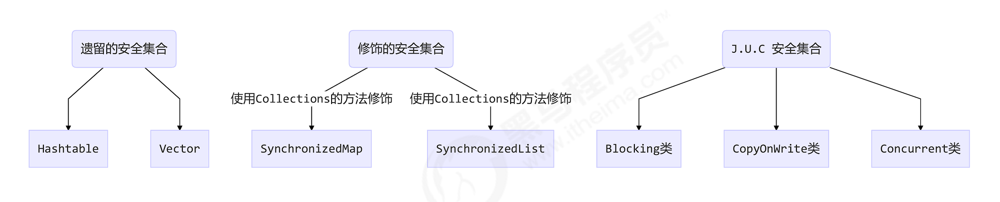

线程安全集合类可以分为三大类： 

- 遗留的线程安全集合如  `Hashtable` ， `Vector`
- 使用 Collections 装饰的线程安全集合:
  - `Collections.synchronizedCollection `
  - `Collections.synchronizedList `
  - `Collections.synchronizedMap `
  - `Collections.synchronizedSet `
  - `Collections.synchronizedNavigableMap `
  - `Collections.synchronizedNavigableSet`
  - `Collections.synchronizedSortedMap `
  - `Collections.synchronizedSortedSet`
- `java.util.concurrent.*`


`java.util.concurrent.*` 下的线程安全集合类，可以发现它们有规律，里面包含三类关键词： Blocking、CopyOnWrite、Concurrent

- Blocking 大部分实现基于锁，并提供用来阻塞的方法 
- CopyOnWrite 之类容器修改开销相对较重 
- Concurrent 类型的容器
  - 内部很多操作使用 cas 优化，一般可以提供较高吞吐量 
  - 弱一致性
    - 遍历时弱一致性，例如，当利用迭代器遍历时，如果容器发生修改，迭代器仍然可以继续进行遍 历，这时内容是旧的
    - 求大小弱一致性，size 操作未必是 100% 准确 
    - 读取弱一致性

> [!Tip]
>
> **快速失败**
>
> 遍历时如果发生了修改，对于非安全容器来讲，使用 fail-fast 机制也就是让遍历立刻失败，抛出 `ConcurrentModificationException`，不再继续遍历


### ConcurrentHashMap

线程安全的哈希表实现，专为高并发场景设计，比 `Hashtable` 和 `Collections.synchronizedMap()` 有更好的并发性能。


**基本操作**

```java
V put(K key, V value)  // 插入键值对
V get(Object key)      // 获取值
V remove(Object key)   // 删除键值对
boolean containsKey(Object key) // 检查键是否存在
    
V putIfAbsent(K key, V value)  // 不存在则插入
boolean remove(Object key, Object value) // 匹配则删除
V replace(K key, V value)      // 替换值
    
void forEach(BiConsumer<? super K, ? super V> action) // 并行遍历
V reduce(long parallelismThreshold, BiFunction<? super K, ? super V, ? extends U> transformer, BiFunction<? super U, ? super U, ? extends U> reducer) // MapReduce
```


#### 并发死链

在 JDK 1.7 版本的 `HashMap` 实现中，存在一个可能导致并发死链(dead chain)的问题，这是在特定并发操作场景下可能发生的严重问题。


**触发条件**

**多线程并发扩容时可能形成环形链表**

JDK 1.7 的扩容采用**头插法**迁移数据

```java
void transfer(Entry[] newTable) {
    for (Entry<K,V> e : table) {
        while (e != null) {
            Entry<K,V> next = e.next;  // 记录下一个节点
            int i = indexFor(e.hash, newTable.length);
            e.next = newTable[i];     // 头插法：将当前节点指向桶头
            newTable[i] = e;          // 更新桶头为当前节点
            e = next;                 // 处理下一个节点
        }
    }
}
```

假设初始链表：`A → B → null`
两个线程并发扩容时可能产生以下时序：

|   操作步骤    |                       线程1（被挂起）                        |                      线程2（完整执行）                       |         链表状态变化          |
| :-----------: | :----------------------------------------------------------: | :----------------------------------------------------------: | :---------------------------: |
|   开始扩容    |                   读取 `e = A`, `next = B`                   |                                                              |         A → B → null          |
|   线程1挂起   |               暂停执行（持有 `e=A`, `next=B`）               |                           开始扩容                           |                               |
|   线程2执行   |                                                              | 完整执行扩容： ① 迁移A：`newTable[i] = A → null` ② 迁移B：`newTable[i] = B → A → null` | 线程2的新链表：`B → A → null` |
|   线程1恢复   |            继续执行（仍用旧指针 `e=A`, `next=B`）            |                                                              |                               |
| 线程1错误操作 | ① 将A插入新桶：`A.next = newTable[i]`（此时`newTable[i]=B`） ② 结果：`A → B → A → B...` |                                                              |  **形成环形链表：B → A → B**  |


#### 重要属性和内部类

```java
        // 默认为 0
        // 当初始化时, 为 -1
        // 当扩容时, 为 -(1 + 扩容线程数)
        // 当初始化或扩容完成后，为 下一次的扩容的阈值大小
        private transient volatile int sizeCtl;

        // 整个 ConcurrentHashMap 就是一个 Node[]
        static class Node<K,V> implements Map.Entry<K,V> {}

        // hash 表
        transient volatile Node<K,V>[] table;

        // 扩容时的 新 hash 表
        private transient volatile Node<K,V>[] nextTable;

        // 扩容时如果某个 bin 迁移完毕, 用 ForwardingNode 作为旧 table bin 的头结点
        static final class ForwardingNode<K,V> extends Node<K,V> {}

        // 用在 compute 以及 computeIfAbsent 时, 用来占位, 计算完成后替换为普通 Node
        static final class ReservationNode<K,V> extends Node<K,V> {}

        // 作为 treebin 的头节点, 存储 root 和 first
        static final class TreeBin<K,V> extends Node<K,V> {}

        // 作为 treebin 的节点, 存储 parent, left, right
        static final class TreeNode<K,V> extends Node<K,V> {}
```


### LinkedBlockingQueue

**线程安全、基于链表实现的有界/无界阻塞队列**。它采用 **FIFO（先进先出）** 策略，适用于生产者-消费者模型，支持高并发操作。

---

|     特性     | 说明                                                         |
| :----------: | :----------------------------------------------------------- |
| **数据结构** | 单向链表（`Node` 节点存储数据）                              |
| **线程安全** | 使用 **两把锁（ReentrantLock）** 分别控制入队和出队，降低竞争 |
| **阻塞机制** | 队列满时，`put()` 阻塞；队列空时，`take()` 阻塞              |
|   **容量**   | 默认无界（`Integer.MAX_VALUE`），可指定有界容量              |
|  **公平性**  | 锁默认非公平（可配置为公平锁）                               |
|  **迭代器**  | 弱一致性（`iterator()` 遍历时可能反映部分修改）              |

---


**入队方法**

|                   方法                    |                        说明                        | 阻塞/非阻塞  |  返回值   |
| :---------------------------------------: | :------------------------------------------------: | :----------: | :-------: |
|                `put(E e)`                 |               插入元素，队列满时阻塞               |   **阻塞**   |  `void`   |
|               `offer(E e)`                |           插入元素，队列满时返回 `false`           |    非阻塞    | `boolean` |
| `offer(E e, long timeout, TimeUnit unit)` |                插入元素，超时后放弃                | **限时阻塞** | `boolean` |
|                `add(E e)`                 | 插入元素，队列满时抛异常（继承自 `AbstractQueue`） |    非阻塞    | `boolean` |


**出队方法**

|                方法                 |                          说明                          | 阻塞/非阻塞  | 返回值 |
| :---------------------------------: | :----------------------------------------------------: | :----------: | :----: |
|              `take()`               |               移除队首元素，队列空时阻塞               |   **阻塞**   |  `E`   |
|              `poll()`               |           移除队首元素，队列空时返回 `null`            |    非阻塞    |  `E`   |
| `poll(long timeout, TimeUnit unit)` |                移除队首元素，超时后放弃                | **限时阻塞** |  `E`   |
|             `remove()`              | 移除队首元素，队列空时抛异常（继承自 `AbstractQueue`） |    非阻塞    |  `E`   |


**LinkedBlockingQueue 与 ArrayBlockingQueue 的比较**

- Linked 支持有界，Array 强制有界 
- Linked 实现是链表，Array 实现是数组 
- Linked 是懒惰的，而 Array 需要提前初始化 Node 数组 
- Linked 每次入队会生成新 Node，而 Array 的 Node 是提前创建好的 
- Linked 两把锁，Array 一把锁


|     特性     | `ConcurrentLinkedQueue` |    `LinkedBlockingQueue`     |
| :----------: | :---------------------: | :--------------------------: |
|  **锁机制**  |       无锁（CAS）       |   两把锁（入队、出队分离）   |
| **阻塞支持** |         非阻塞          | 支持阻塞（`put()`/`take()`） |
|   **容量**   |          无界           |       可配置有界/无界        |
|   **性能**   |      更高（无锁）       |        较低（锁竞争）        |
| **适用场景** |   高并发、非阻塞需求    |      需要阻塞控制的场景      |
