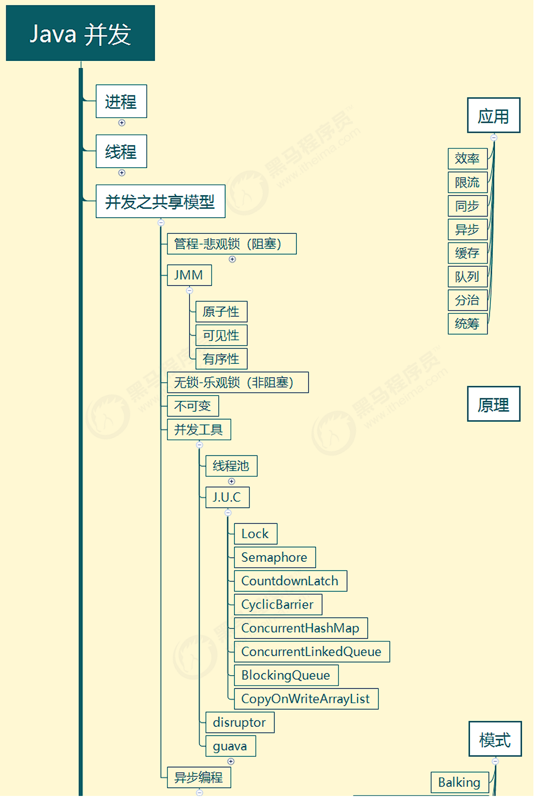

# 概览

## 整体内容




## 预备知识

- 线程安全问题，接触过 Java Web 开发、Jdbc 开发、Web 服务器、分布式框架
- 基于 JDK 8，最好对函数式编程、lambda 有一定了解 
- 采用了 slf4j 打印日志，这是好的实践 采用了 
- lombok 简化 java bean 编写 
- 给每个线程好名字，这也是一项好的实践


demo依赖

```xml
<properties>
 	<maven.compiler.source>1.8</maven.compiler.source>
 	<maven.compiler.target>1.8</maven.compiler.target>
</properties>

<dependencies>
     <dependency>
 	 	<groupId>org.projectlombok</groupId>
 	 	<artifactId>lombok</artifactId>
 	 	<version>1.18.10</version>
 	</dependency>
 	<dependency>
 		<groupId>ch.qos.logback</groupId>
 		<artifactId>logback-classic</artifactId>
 		<version>1.2.3</version>
 	</dependency>
 </dependencies>
```


logback配置

```xml
<?xml version="1.0" encoding="UTF-8"?>
<configuration>
    <statusListener class="ch.qos.logback.core.status.NopStatusListener"/> <!-- 禁用logback内部日志  -->

    <property name="pattern" value="%d{HH:mm:ss} [%thread] %-5level %logger{50} - %msg %n"/>
    <property name="pattern-color"
              value="%yellow(|%d{HH:mm:ss}|) [%thread] %highlight(%-5level) %green(%logger{50}) - %highlight(%msg) %n"/>

    <!-- 控制台输出 -->
    <appender name="CONSOLE" class="ch.qos.logback.core.ConsoleAppender">
        <encoder class="ch.qos.logback.classic.encoder.PatternLayoutEncoder">
            <pattern>${pattern}</pattern>
        </encoder>
    </appender>

    <!-- 控制台输出-带颜色 -->
    <appender name="CONSOLE-WITH-COLOR" class="ch.qos.logback.core.ConsoleAppender">
        <encoder class="ch.qos.logback.classic.encoder.PatternLayoutEncoder">
            <pattern>${pattern-color}</pattern>
        </encoder>
    </appender>

    <root level="INFO">
        <appender-ref ref="CONSOLE-WITH-COLOR"/>
    </root>
</configuration>
```


# 进程与线程

## 进程与线程

### 进程

- 程序由指令和数据组成，但这些指令要运行，数据要读写，就必须将指令加载至 CPU，数据加载至内存。在 指令运行过程中还需要用到磁盘、网络等设备。进程就是用来加载指令、管理内存、管理 IO 的
- 当一个程序被运行，从磁盘加载这个程序的代码至内存，这时就开启了一个进程。 
- 进程就可以视为程序的一个实例。大部分程序可以同时运行多个实例进程（例如记事本、画图、浏览器 等），也有的程序只能启动一个实例进程（例如网易云音乐、360 安全卫士等）


### 线程

- 一个进程之内可以分为一到多个线程。 
- 一个线程就是一个指令流，将指令流中的一条条指令以一定的顺序交给 CPU 执行 
- Java 中，线程作为最小调度单位，进程作为资源分配的最小单位。 
- 在 windows 中进程是不活动的，只是作 为线程的容器


### 对比

- 进程基本上相互独立的，而线程存在于进程内，是进程的一个子集 
- 进程拥有共享的资源，如内存空间等，供其内部的线程共享 
- 进程间通信较为复杂 
  - 同一台计算机的进程通信称为 IPC（Inter-process communication） 
  - 不同计算机之间的进程通信，需要通过网络，并遵守共同的协议，例如 HTTP 
- 线程通信相对简单，因为它们共享进程内的内存，一个例子是多个线程可以访问同一个共享变量 
- 线程更轻量，线程上下文切换成本一般上要比进程上下文切换低


## 并行与并发

单核 cpu 下，线程实际还是 **串行执行** 的。操作系统中有一个组件叫做任务调度器，将 cpu 的时间片（windows 下时间片最小约为 15 毫秒）分给不同的程序使用，只是由于 cpu 在线程间（时间片很短）的切换非常快，人类感 觉是 同时运行的 。

> [!NOTE]
>
> 总结为一句话就是：**微观串行，宏观并行**， 一般会将这种线程轮流使用CPU的做法称为并发， `concurrent`


引用 Rob Pike 的一段描述： 

- 并发（concurrent）是同一时间应对（dealing with）多件事情的能力 
- 并行（parallel）是同一时间动手做（doing）多件事情的能力


## 应用


### 异步调用

以调用方角度来讲，如果 

- 需要等待结果返回，才能继续运行就是同步 
- 不需要等待结果返回，就能继续运行就是异步


多线程可以让方法执行变为异步的（即不要巴巴干等着）比如说读取磁盘文件时，假设读取操作花费了 5 秒钟，如 果没有线程调度机制，这 5 秒 cpu 什么都做不了，其它代码都得暂停... 

**应用案例**

- 比如在项目中，视频文件需要转换格式等操作比较费时，这时开一个新线程处理视频转换，避免阻塞主线程 
- tomcat 的异步 servlet 也是类似的目的，让用户线程处理耗时较长的操作，避免阻塞 tomcat 的工作线程 
- ui 程序中，开线程进行其他操作，避免阻塞 ui 线程


### 提高效率

充分利用多核 cpu 的优势，提高运行效率。想象下面的场景，执行 3 个计算，最后将计算结果汇总。 

```
计算 1 花费 10 ms 
计算 2 花费 11 ms 
计算 3 花费 9 ms 
汇总需要 1 ms
```

如果是串行执行，那么总共花费的时间是  10 + 11 + 9 + 1 = 31ms 

但如果是四核 cpu，各个核心分别使用线程 1 执行计算 1，线程 2 执行计算 2，线程 3 执行计算 3，那么 3 个 线程是并行的，花费时间只取决于最长的那个线程运行的时间，即 11ms ,加上汇总是 12ms 

> [!CAUTION]
>
>  需要在多核 cpu 才能提高效率，单核仍然时是轮流执行


1. 单核 cpu 下，多线程不能实际提高程序运行效率，只是为了能够在不同的任务之间切换，不同线程轮流使用 cpu ，不至于一个线程总占用 cpu，别的线程没法干活 
2. 多核 cpu 可以并行跑多个线程，但能否提高程序运行效率还是要分情况的 
   - 有些任务，经过精心设计，将任务拆分，并行执行，当然可以提高程序的运行效率。
   - 但不是所有计算任 务都能拆分（参考后文的【阿姆达尔定律】） 也不是所有任务都需要拆分，任务的目的如果不同，谈拆分和效率没啥意义 
3. IO 操作不占用 cpu，只是我们一般拷贝文件使用的是【阻塞 IO】，这时相当于线程虽然不用 cpu，但需要一 直等待 IO 结束，没能充分利用线程。所以才有后面的【非阻塞 IO】和【异步 IO】优化


---

# Java线程


## 创建和启动线程


### Thread匿名类

```java
        // 创建线程对象
        Thread t = new Thread(){
            @Override
            public void run() {
                // 线程执行的代码
                log.info("Running...");
            }
        };
        // 启动线程
        t.start();
```

> [!TIP]
>
> j建议为线程指定名字
>
> 可以通过线程对象的 `setName(String name)` 方法为线程指定名字


### Runnable（推荐）

```java
        Runnable r = new Runnable() {
            @Override
            public void run() {
                // 需要执行的任务
                log.info("Running...");
            }
        };

        Thread t2 = new Thread(r, "Test2");
        t2.start();
```

> [!TIP]
>
> 可使用lambda表达式
>
> ```java
>         Runnable r = () -> log.info("Running...");
> ```


**原理解析**

Thread中的run 方法：

```java
    @Override
    public void run() {
        if (target != null) {
            target.run();
        }
    }
```

- Thread匿名类重写了该方法，实现任务执行
- Runnable会被赋值给target变量，然后执行其中的任务


### FutureTask

FutureTask 能够接收 Callable 类型的参数，用来处理有返回结果的情况

```java
        // 创建任务对象
        FutureTask<Integer> task = new FutureTask<>(() -> {
            log.info("Running...");
            Thread.sleep(2000);
            return 200;
        });
        
        // 创建线程对象
        Thread t = new Thread(task);
        t.start();
        log.info("Waiting...");
        log.debug("Result: {}", task.get());
```


输出

```
03-29 13:51:18 [main] INFO  com.ysh.Test - Start 
03-29 13:51:18 [main] INFO  com.ysh.Test - Waiting... 
03-29 13:51:18 [Thread-0] INFO  com.ysh.Test - Running... 
03-29 13:51:20 [main] DEBUG com.ysh.Test - Result: 200 
03-29 13:51:20 [main] INFO  com.ysh.Test - End
```


### 查看进程线程

**windows**  

- 任务管理器可以查看进程和线程数，也可以用来杀死进程 

- `tasklist` 查看进程 

- `taskkill` 杀死进程 

  

**linux**  

- `ps -fe` 查看所有进程 

- `ps -fT -p`  查看某个进程（PID）的所有线程 

- `kill ` 杀死进程 

- `top` 按大写 H 切换是否显示线程 

- `top -H -p`  查看某个进程（PID）的所有线程 

  

**Java**  

- `jps` 命令查看所有 Java 进程 
- `jstack`  查看某个 Java 进程（PID）的所有线程状态  
- `jconsole` 来查看某个 Java 进程中线程的运行情况（图形界面）


jconsole 远程监控配置 

需要以如下方式运行你的 java 类 

```bash
java -Djava.rmi.server.hostname=`ip地址` -Dcom.sun.management.jmxremote  Dcom.sun.management.jmxremote.port=`连接端口` -Dcom.sun.management.jmxremote.ssl=是否安全连接  Dcom.sun.management.jmxremote.authenticate=是否认证  java类
```

- 修改 /etc/hosts 文件将 127.0.0.1 映射至主机名 
- 如果要认证访问，还需要做如下步骤 
  - 复制 jmxremote.password 文件 
  - 修改 jmxremote.password 和 jmxremote.access 文件的权限为 600 即文件所有者可读写 
  - 连接时填入 controlRole（用户名），R&D（密码）